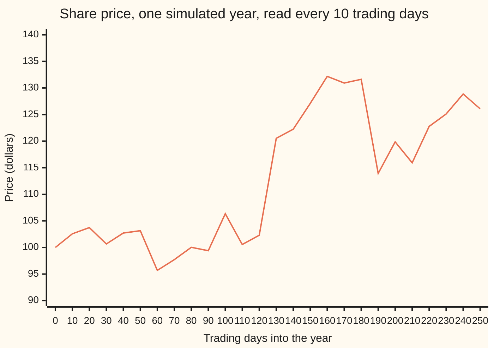
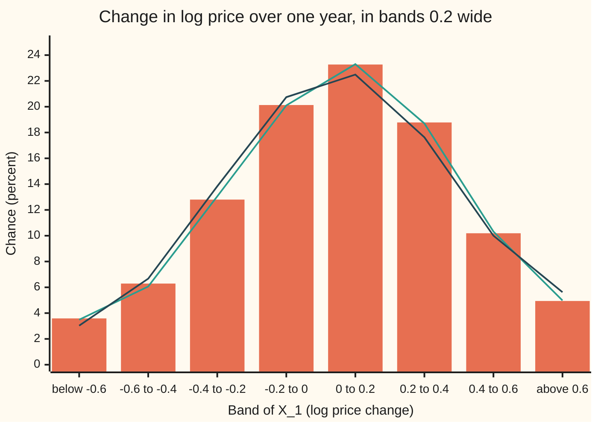

# Levy processes: stationary independent increments, with jumps allowed

Stochastic processes and calculus → Beyond Brownian → Processes built from independent pieces → Levy processes

---

## General Overview

A share trades at \$100. On most days it wobbles by a percent or so. About twice a year news hits, a profit warning or a takeover rumour, and the price moves by a fifth in one session and stays there. Brownian motion alone cannot do that: its path never jumps. A Poisson process alone cannot do the daily wobble: its path is flat between jumps.

The share needs both. In this card's model the logarithm of the price drifts up at 0.25 a year, wobbles with volatility 0.20 (the standard deviation the wobble alone gives over a year), and jumps 2 times a year on average. Each jump moves the log price 0.20 down (chance 0.75) or 0.20 up (chance 0.25). Over one year the log price changes by 0.05 on average, with variance 0.12, and the average price after a year is \$111.49.

One structural fact makes the model tractable. The change over any week has the same law as the change over any other week, and the weeks do not influence each other. A process with that property, and no jumps at fixed times, is a **Lévy process**, after Paul Lévy. Brownian motion and the Poisson process are the family's two extremes: all wobble, or all jumps. The **Lévy–Khintchine formula** lists every member.

**A Lévy process is a running total of independent, identically distributed pieces over every split of time; its characteristic function at time t is e raised to t times one fixed exponent, and that exponent is always a drift, plus a Brownian part, plus an integral over the sizes and rates of the jumps.**

**What kind of fact this is:** a definition, with a theorem attached. The exponential form in t is proved on this card in Why it works, in full in the folded Detailed proof. The Lévy–Khintchine shape of the exponent is stated with its key steps; its complete proof is in Applebaum, chapters 1 and 2, and in infinitely-divisible-laws-and-levy-khintchine.

### The picture: one year of the share



One line: the price along one sample path (one run of the process drawn against time), simulated on a grid of 250 trading days with seed 20260930 + 6 and plotted every 10th day. This year brought two jumps: up 0.20 in log price on day 124 (\$102.31 to \$120.52 across the grid points), and down 0.20 on day 184 (\$131.63 to \$113.93). The rest is wobble and drift. Another seed draws another year.

---

## The formula

Notation first, in words. Time $t$ is in years. The process $X_t$, read "the value at time t", is the change in the log price, $X_t = \ln(S_t / 100)$, where $S_t$ is the price. An **increment** is a change over a window, $X_{t+h} - X_t$. The letter $i$ is the imaginary unit and $u$ a frequency dial, per unit of log price. The characteristic function $\varphi_t(u) = E[e^{iuX_t}]$ is the average point on the unit circle turned by $u$ times $X_t$ ([characteristic-functions-and-inversion](../../09-Probability%20and%20statistics/06-Limit%20Theorems%20in%20Practice/04-characteristic-functions-and-inversion.md); that card calls the dial $t$, here $t$ is time). It identifies the law of $X_t$ completely.

**The definition.** A process $X_t$ is a Lévy process when:

1. it starts at zero: $X_0 = 0$;
2. its increments over windows that do not overlap are independent;
3. its increments are stationary: the law of $X_{t+h} - X_t$ depends on the length $h$ only, not on the start $t$;
4. it is continuous in probability: for every size $\varepsilon > 0$, the chance that $|X_{t+h} - X_t| > \varepsilon$ goes to 0 as $h$ goes to 0.

Condition 4 does not forbid jumps, only a jump at a fixed, known time. The share jumps at random moments, so at any given instant the chance of a jump is zero. Every Lévy process has a version whose paths are right-continuous with limits from the left: a jump lands on its new value at once.

**The theorem.** For every Lévy process there is one function $\psi$, the **Lévy exponent**, with

$$\varphi_t(u) = E\big[e^{iuX_t}\big] = e^{t\,\psi(u)},$$

$$\psi(u) = i\,b\,u \;-\; \tfrac12 \sigma^2 u^2 \;+\; \int_{x \ne 0} \Big(e^{iux} - 1 - iux\,\mathbf{1}_{\{|x| < 1\}}\Big)\,\nu(dx).$$

**Read it aloud:** the characteristic function at time t is e raised to t times the exponent, and the exponent is a drift term, minus a Brownian term, plus, over every jump size, the rate of such jumps times what one does to the rotating point, with small jumps' average pull taken out.

The ingredients $(b, \sigma^2, \nu)$ are the **Lévy triplet**. The integral is against a measure, as in wing 10: $\nu(A)$, the **Lévy measure** of a set A of sizes, is the expected number of jumps per year with size in A. It must satisfy $\int \min(1, x^2)\,\nu(dx) < \infty$ and may have infinite total mass. The indicator $\mathbf{1}_{\{|x|<1\}}$ is 1 for jumps smaller than 1, else 0.

| Symbol | Plain meaning | In our example | Push it up and the answer… |
| --- | --- | --- | --- |
| $t$, $h$ | time in years; the length of a window or slot | $t$ = 1 year; $h$ down to 1/10000 | the exponent $t\psi$ grows: the law spreads |
| $X_t$, $X_1$ | change in the log price by time $t$; by one year | mean 0.05, variance 0.12 at $t$ = 1 | — |
| $S_t$ | the price, $100\,e^{X_t}$ | \$111.49 on average after a year | — |
| $W_t$, $\sigma$ | Brownian motion; the volatility multiplying it | $\sigma$ = 0.20 per square-root year | more wobble: the real part of $\psi$ falls by $\tfrac12 u^2$ per unit of $\sigma^2$ |
| $\gamma$ | drift of the log price between jumps | 0.25 a year | $b$ rises one for one |
| $\lambda$, $N(t)$ | jump rate; the number of jumps by time $t$ | 2 a year | more jumps: $\nu$ scales up |
| $J$, $J_k$ | a jump's size in log price; the k-th jump | −0.20 with chance 0.75, +0.20 with chance 0.25 | bigger jumps fatten the tails |
| $\nu$ | Lévy measure: expected jumps per year of each size | 1.5 at −0.20, 0.5 at +0.20 | — |
| $b$ | the triplet's drift, $\gamma$ plus the small jumps' average pull | 0.25 − 0.20 = 0.05 | the mean of $X_t$ rises |
| $u$, $i$ | frequency dial per unit of log price; the imaginary unit | $u$ = 3 | — |
| $\varphi_t$, $\psi$ | characteristic function of $X_t$; the Lévy exponent | $\varphi_1(3)$ = 0.578911 + 0.108552 i; $\psi(3)$ = −0.529329 + 0.185358 i | — |
| $n$, $\varepsilon$, $\alpha$ | a number of equal pieces; a size cut-off; a tail power | $n$ = 10 to 10000; $\varepsilon$ down to 1e-08; $\alpha$ = 1.5 | — |

**The two extremes.** Brownian motion with volatility $\sigma$ has triplet $(0, \sigma^2, 0)$ and exponent $\psi(u) = -\tfrac12\sigma^2u^2$: no jumps at all ([brownian-motion](../05-Brownian%20Motion/01-brownian-motion.md)). The Poisson process at rate $\lambda$ has $\nu$ = $\lambda$ at size 1, nothing else, and exponent $\psi(u) = \lambda(e^{iu} - 1)$: jumps only ([poisson-process](../04-Poisson%20and%20Jump%20Processes/01-poisson-process.md)). At $u$ = 3 these are −0.180000 for $\sigma$ = 0.20, and −3.979985 + 0.282240 i for rate 2.

**The share's process.** With $N(t)$ the jump count and $J_k$ the jumps,

$$X_t = \gamma\,t + \sigma W_t + \sum_{k=1}^{N(t)} J_k ,$$

with the Brownian motion, jump times and jump sizes independent. Its Lévy measure puts $\lambda \times 0.75$ = 1.5 at −0.20 and $\lambda \times 0.25$ = 0.5 at +0.20.

### When it holds

The process is a definition: it has the four properties or it does not. The theorem needs all four, and each failure is concrete.

- **Stationary increments.** A jump rate of 3 a year for six months, then 1, gives exactly the one-year law above but the wrong half-year: mean −0.0250 against 0.0250. The form $e^{t\psi}$ fails.
- **Independent increments.** A random slope, $X_t = 0.05\,t + 0.3464\,t\,Z$ with $Z$ one standard normal draw, has the right mean and variance at $t$ = 1, but every year repeats the first: $\operatorname{Var} X_2$ = 0.4800, not 0.2400. Variance grows like $t^2$.
- **Continuity in probability.** A jump at a scheduled earnings release puts positive chance on one known instant. A window holding that date then has a different law from one of the same length that does not, so stationarity fails too.
- **The condition on $\nu$.** If $\int \min(1, x^2)\,\nu(dx)$ is infinite, no process exists. If it is finite, the compensator term $-iux\,\mathbf{1}_{\{|x|<1\}}$ keeps the integral finite; Step 6 shows the uncompensated version blowing up.

---

## Why it works

### Step 0: chop time into equal pieces

Cut the interval from 0 to $t$ into $n$ equal windows. $X_t$ is the sum of the $n$ increments, which properties 2 and 3 make independent and identically distributed. So for every $n$, $X_t$ is a sum of $n$ independent copies of one law: its law is **infinitely divisible**. And the characteristic function of a sum of independent pieces is the product of theirs. The rest follows from those two facts.

### Step 1: the characteristic function is an exponential in time

Write $f(t) = \varphi_t(u)$ for one fixed dial $u$. Split the interval from 0 to s + t at time s. The two increments are independent, and the second has the law of $X_t$. So

$$f(s + t) = f(s)\,f(t), \qquad f(0) = 1.$$

Property 4 makes $f(t)$ continuous in $t$. A continuous function that turns sums into products, starts at 1 and never vanishes is an exponential: $f(t) = e^{t\psi(u)}$, with $\psi(u)$ depending on $u$ but not on $t$. The law of the process at every time is held in the one function $\psi$.

<details>
<summary>Detailed proof</summary>

**Setting.** $X_t$ is a Lévy process; fix $u$ and let $f(t) = E[e^{iuX_t}]$ for $t \ge 0$.

**1. Multiplicative.** $X_{s+t} = X_s + (X_{s+t} - X_s)$, the two terms independent (property 2), the second with the law of $X_t - X_0 = X_t$ (properties 1 and 3). The expectation of a product of independent bounded variables is the product of expectations, so $f(s+t) = f(s)f(t)$. Also $f(0) = E[e^{0}] = 1$.

**2. Continuous.** $|f(t+h) - f(t)| = |f(t)|\,|f(h) - 1| \le E|e^{iuX_h} - 1|$. For any $\varepsilon > 0$, split on the event $|X_h| \le \varepsilon$: there $|e^{iuX_h} - 1| \le |u|\varepsilon$, and elsewhere it is at most 2. So $|f(h) - 1| \le |u|\varepsilon + 2P(|X_h| > \varepsilon)$, which property 4 makes smaller than $2|u|\varepsilon$ for small $h$. Hence $f(t)$ is continuous at every $t$.

**3. Never zero.** Suppose $f(t_0) = 0$. Then $f(t_0/n)^n = f(t_0) = 0$ by step 1, so $f(t_0/n) = 0$ for every $n$. But $f(t_0/n) \to f(0) = 1$ by step 2. Contradiction.

**4. A continuous logarithm.** A continuous function from $[0, \infty)$ to the nonzero complex numbers has a continuous logarithm $g(t)$ with $g(0) = 0$ and $e^{g(t)} = f(t)$ (lift the angle continuously; the modulus has an ordinary logarithm). Then $g(s+t) - g(s) - g(t)$ is continuous in $(s, t)$, takes values in $2\pi i$ times the integers because both sides exponentiate to the same number, and is 0 at $(0, 0)$. A continuous function with values in a discrete set on a connected set is constant: it is 0 everywhere.

**5. Additive and continuous means linear.** $g(s+t) = g(s) + g(t)$ gives $g(m/n) = (m/n)\,g(1)$ for whole numbers $m, n \ge 1$; continuity extends it to $g(t) = t\,g(1)$ for every $t \ge 0$. Put $\psi(u) = g(1)$: $f(t) = e^{t\psi(u)}$. ∎

The lift can be chosen jointly continuous in $(t, u)$, which makes $\psi$ continuous with $\psi(0) = 0$; Applebaum, chapter 1, gives that refinement.

</details>

### Step 2: the Brownian extreme

$\sigma W_t$ is normal with mean 0 and variance $\sigma^2 t$, whose characteristic function is $e^{-\frac12\sigma^2u^2t}$. So $\psi(u) = -\tfrac12\sigma^2u^2$: real and negative, as the rotating point's average shrinks while the path spreads. A steady drift $\gamma t$ adds $i\gamma u$.

### Step 3: the Poisson extreme, and then any jump law

A Poisson count $N(t)$ at rate $\lambda$ has $E[e^{iuN(t)}] = \sum_n e^{-\lambda t}(\lambda t)^n e^{iun}/n! = e^{\lambda t(e^{iu} - 1)}$, the exponential series again. So $\psi(u) = \lambda(e^{iu} - 1)$.

Give each jump a random size $J$ drawn independently from one law. Conditioning on the count, exactly as on the compound Poisson card ([compound-poisson](../04-Poisson%20and%20Jump%20Processes/04-compound-poisson.md)) with the real dial s replaced by $i u$, gives

$$\psi(u) = \lambda\big(E[e^{iuJ}] - 1\big) = \int \big(e^{iux} - 1\big)\,\nu(dx), \qquad \nu = \lambda \times (\text{the law of } J).$$

Here $\nu$ earns its meaning: the rate of jumps of each size.

### Step 4: independent pieces add exponents

Drift, Brownian part and jumps are independent, so the characteristic functions multiply and the exponents add:

$$\psi(u) = i\gamma u - \tfrac12\sigma^2u^2 + \int \big(e^{iux} - 1\big)\,\nu(dx).$$

To reach the Lévy–Khintchine shape, add and subtract $iu\int_{|x|<1} x\,\nu(dx)$. The integral gains the term $-iux$ on small jumps, and the drift becomes

$$b = \gamma + \int_{|x|<1} x\,\nu(dx) = 0.25 + (1.5 \times (-0.20) + 0.5 \times 0.20) = 0.25 - 0.20 = 0.05.$$

The process is unchanged. The jumps' average pull, −0.20 a year, has moved from the integral into the drift. For the share both forms are finite; Step 6 shows a process where only the second is.

### Step 5: the mean and the variance come from the exponent

Differentiate $e^{t\psi(u)}$ at $u = 0$. The first derivative gives $E[X_t] = -i\,t\,\psi'(0)$ and the second gives $\operatorname{Var} X_t = -t\,\psi''(0)$:

$$E[X_t] = t\Big(b + \int_{|x|\ge 1} x\,\nu(dx)\Big), \qquad \operatorname{Var} X_t = t\Big(\sigma^2 + \int x^2\,\nu(dx)\Big).$$

The share has no jumps of size 1 or more, so the mean is $b\,t$ = 0.05 for a year. The variance is 0.04 from the wobble plus 0.08 from the jumps: 0.12, two thirds of it from jumps. Both grow in proportion to $t$. Where that average is finite, the same exponent evaluated at $u = -i$ gives the average of $e^{X_1}$, so the average price after a year is $100\,e^{\psi(-i)}$ = \$111.49.

The law of $X_1$, computed with no simulation by conditioning on the two jump counts, is lopsided in a way the bell curve is not:



Orange bars: the exact law of $X_1$. Green line: the share of 40000 simulated years in each band, each with a standard error of at most 0.21 percentage points. Dark line: a normal law with the same mean and variance. The jumps put 3.59 percent of years below −0.6, against 3.03 percent for the bell curve, and fewer in the far right band, 4.94 against 5.62 percent. Down-jumps come three times as often as up-jumps, so the left tail is fatter than the bell curve's and the right tail thinner.

### Step 6: why the compensator is there

The share's Lévy measure is finite, and Step 4's simple form works. Some useful processes have infinitely many small jumps. Take $\nu(dx) = x^{-2.5}\,dx$ on sizes between 0 and 1, the tail power $x^{-1-\alpha}$ with $\alpha$ = 1.5. Its total mass is infinite, but $\int_0^1 x^2 \cdot x^{-2.5}\,dx = 2$, so the condition on $\nu$ holds.

Cut the measure at size $\varepsilon$ and compute the jump integral at $u$ = 3. The real part settles: −6.951792 at $\varepsilon$ = 1e-02, −7.850879 at 1e-08, limit −7.851779. The imaginary part without the compensator, $\int \sin(ux)\,x^{-2.5}\,dx$, grows without bound: 51.509, 591.506, 5991.506, 59991.506, tenfold each time $\varepsilon$ falls a hundredfold. The small jumps, all upward, add up to an infinite drift. With the compensator, $\int(\sin(ux) - ux)\,x^{-2.5}\,dx$ converges to −2.493538. Subtracting each small jump's average contribution leaves a fluctuation with finite variance. That is the indicator term's job.

### Step 7: the general theorem, stated

The **Lévy–Khintchine theorem** says the shape built in Steps 1 to 5 is universal:

- every Lévy process has an exponent of the form in The formula, with exactly one triplet $(b, \sigma^2, \nu)$;
- every triplet with $\sigma^2 \ge 0$ and $\int \min(1, x^2)\,\nu(dx) < \infty$ comes from a Lévy process.

The key steps, not carried out in full here. By Step 0, $\varphi_1 = (\varphi_{1/n})^n$, so $\psi(u) = \lim_n n\big(\varphi_{1/n}(u) - 1\big) = \lim_n \int (e^{iux} - 1)\, n\,P(X_{1/n} \in dx)$. Away from 0, the measures $n\,P(X_{1/n} \in dx)$ converge to $\nu$: in a window of length $1/n$ a jump of size near $x$ has chance about $\nu(dx)/n$. Near 0, weighted by $x^2$, they leave a remainder that becomes $\sigma^2$. The converse builds the process from its triplet: a Brownian motion, a compound Poisson process for jumps of size at least 1, and a limit of compensated compound Poisson processes for the small ones, the **Lévy–Itô decomposition**. Both directions are proved in Applebaum, chapters 1 and 2, and Kyprianou, chapter 2; the analytic side is on infinitely-divisible-laws-and-levy-khintchine. The share is the finite-jump case, with every piece visible.

---

## Worked numbers, by hand

The share, at dial $u$ = 3 and $t$ = 1 year. Jumps of ±0.20 at $u$ = 3 turn the rotating point by ±0.6.

| Step | Arithmetic | Value |
| --- | --- | --- |
| triplet drift $b$ | 0.25 + 1.5 × (−0.20) + 0.5 × 0.20 | 0.05 |
| drift term $i b u$ | 0.05 × 3 | 0.150000 i |
| Brownian term $-\tfrac12\sigma^2u^2$ | −0.5 × 0.04 × 9 | −0.180000 |
| jump term, real part | 1.5 × (cos(−0.6) − 1) + 0.5 × (cos 0.6 − 1) = 2 × (cos 0.6 − 1) | −0.349329 |
| jump term, imaginary part | 1.5 × (sin(−0.6) + 0.6) + 0.5 × (sin 0.6 − 0.6) = (1.5 − 0.5) × (0.6 − sin 0.6) | 0.035358 i |
| **exponent $\psi(3)$** | −0.180000 − 0.349329, and 0.150000 + 0.035358 | **−0.529329 + 0.185358 i** |
| **$\varphi_1(3)$** | e^−0.529329 × (cos 0.185358 + i sin 0.185358) | **0.578911 + 0.108552 i** |
| mean of $X_1$ | $b$, no jumps of size 1 or more | 0.05 |
| variance of $X_1$ | 0.04 + 1.5 × 0.04 + 0.5 × 0.04 | 0.12 |
| average price after a year | 100 × e^(0.05 + 0.02 + 1.5 (e^−0.2 − 1 + 0.2) + 0.5 (e^0.2 − 1 − 0.2)) | \$111.49 |

After a year the log price has moved by 0.05 on average, standard deviation 0.3464, and the average price is \$111.49. The chance the log price ends below −0.5 is 0.0609 exactly: about 1 year in 16. At $t$ = 2 the exponent doubles and the characteristic function is 0.323354 + 0.125683 i, the square of the one-year value.

### What breaks if you drop a piece

| Mistake | Comes out at | What went wrong |
| --- | --- | --- |
| Jump rate 3 a year for six months, then 1 | half-year mean −0.0250, not 0.0250; $\lvert\varphi_{1/2}(3)\rvert$ 0.703283, not 0.767463 | Increments not stationary: one year's law no longer fixes the half-year's |
| Random slope, $X_t = 0.05\,t + 0.3464\,t\,Z$, same mean and variance at one year | $\operatorname{Var} X_2$ = 0.4800, not 0.2400 | Increments not independent: the second year copies the first |
| Infinitely many small jumps, no compensator | imaginary part 51.509, 591.506, 5991.506, 59991.506 as the cut-off shrinks | The small jumps' average pull summed to infinity |
| Average price as $100\,e^{E[X_1]}$ | \$105.13, not \$111.49 | The average of $e^{X_1}$ is not e to the average; $\psi(-i)$ keeps the spread and the jumps |

The code prints every row.

---

## Code, from first principles, and it actually runs

Four roads reach the characteristic function of $X_t$. The first is the Lévy–Khintchine exponent. The second is exact and uses no exponent: given the numbers of down-jumps and up-jumps, two independent Poisson counts, $X_t$ is normal, so sum the normal characteristic functions weighted by the Poisson chances. The third cuts the year into $n$ slots with at most one jump each and prints the error shrinking. The fourth simulates 40000 years, seed 20260930, from a SplitMix64 generator with Box–Muller normals, both written out; each year is two independent half-years drawn exactly, so no grid error enters. Simulated numbers carry standard errors, and their asserts allow four. The normal CDF is summed from its power series. The compensator rows use Simpson's rule on a log scale, checked against a power series for the limit.

### Python

```python
# Levy processes -- the check behind the card.  Only math is imported.
# A share's log price X_t (t in years) drifts, diffuses and jumps:
#   X_t = GAM t + SIG W_t + (jumps: 2 a year, -0.20 with chance 0.75, +0.20 with 0.25),
# and the price is S_t = 100 e^(X_t).  Roads to E[e^(iuX_t)]: the Levy-Khintchine
# exponent; an exact sum over the jump counts; the year cut into slots of length h;
# and 40000 simulated years from a SplitMix64 generator written out.
import math

GAM, SIG, LAM = 0.25, 0.20, 2.0
JUMPS = [(-0.20, 0.75), (0.20, 0.25)]           # (size, chance); nu puts LAM x chance on each size
U, SEED, YEARS, MASK = 3.0, 20260930, 40000, (1 << 64) - 1
NU = [(x, LAM * p) for x, p in JUMPS]
B = GAM + sum(x * m for x, m in NU if abs(x) < 1)  # the triplet's drift b
def psi(u):                                      # Levy-Khintchine exponent, (real, imaginary)
    return (-0.5 * SIG * SIG * u * u + sum(m * (math.cos(u * x) - 1) for x, m in NU),
            B * u + sum(m * (math.sin(u * x) - u * x) for x, m in NU))
def pois(k, mean): return math.exp(-mean + k * math.log(mean) - sum(math.log(j) for j in range(2, k + 1)))
def mixture(t, lam=LAM, top=40):                # (chance, mean of X_t) given each pair of jump counts
    (a, pa), (c, pc) = JUMPS
    return [(pois(n, lam * pa * t) * pois(k, lam * pc * t), GAM * t + a * n + c * k)
            for n in range(top) for k in range(top)]
def cf_exact(u, t, lam=LAM):                    # sum over counts of chance x normal cf
    re = im = 0.0
    for pr, m in mixture(t, lam):
        r = pr * math.exp(-0.5 * SIG * SIG * u * u * t)
        re, im = re + r * math.cos(u * m), im + r * math.sin(u * m)
    return re, im
def ncdf(x):                                    # normal CDF from its power series, no erf
    if abs(x) > 8: return 0.0 if x < 0 else 1.0
    term, s, n = x, x, 0
    while abs(term) > 1e-17 * abs(s):
        n += 1
        term *= x * x / (2 * n + 1)
        s += term
    return 0.5 + s * math.exp(-0.5 * x * x) / math.sqrt(2 * math.pi)
def p_below(a, t=1.0): return sum(pr * ncdf((a - m) / (SIG * math.sqrt(t))) for pr, m in mixture(t))
class SplitMix64:
    def __init__(self, seed): self.s = seed
    def uniform(self):                          # in (0, 1]
        self.s = (self.s + 0x9E3779B97F4A7C15) & MASK
        z = ((self.s ^ (self.s >> 30)) * 0xBF58476D1CE4E5B9) & MASK
        z = ((z ^ (z >> 27)) * 0x94D049BB133111EB) & MASK
        return (((z ^ (z >> 31)) >> 11) + 1) / 9007199254740992.0
    def normal(self):                           # Box-Muller, cosine half
        u, v = self.uniform(), self.uniform()
        return math.sqrt(-2 * math.log(u)) * math.cos(2 * math.pi * v)
    def jumps(self, length):                    # jump sizes in a window, from exponential gaps
        out, clock = [], -math.log(self.uniform()) / LAM
        while clock < length:
            out.append(JUMPS[0][0] if self.uniform() <= JUMPS[0][1] else JUMPS[1][0])
            clock += -math.log(self.uniform()) / LAM
        return out
def simpson(f, a, b, n=4000):
    h = (b - a) / n
    return h / 3 * (f(a) + f(b) + sum((4 if i % 2 else 2) * f(a + i * h) for i in range(1, n)))

pr_, pi_ = psi(U)
print(f"triplet: b {B:.4f} = gamma {GAM:.4f} + int x nu {B - GAM:.4f}; sigma^2 {SIG * SIG:.4f}, int x^2 nu {sum(x * x * m for x, m in NU):.4f}; nu = {NU[0][1]:.1f} at {NU[0][0]:.2f} and {NU[1][1]:.1f} at {NU[1][0]:.2f}")
print(f"psi({U:.0f}) = {pr_:.6f} + {pi_:.6f} i;  pieces: drift i {B * U:.6f}, Brownian {-0.5 * SIG**2 * U * U:.6f},"
      f" jumps {pr_ + 0.5 * SIG**2 * U * U:.6f} + {pi_ - B * U:.6f} i")
print(f"extremes at u = {U:.0f}: Brownian alone psi = {-0.5 * SIG**2 * U * U:.6f};"
      f" Poisson rate 2, size 1: psi = {LAM * (math.cos(U) - 1):.6f} + {LAM * math.sin(U):.6f} i")
for t in (0.5, 1.0, 2.0):
    fr, fi = math.exp(t * pr_) * math.cos(t * pi_), math.exp(t * pr_) * math.sin(t * pi_)
    er, ei = cf_exact(U, t)
    print(f"t = {t:.1f}: Levy-Khintchine cf {fr:.9f} + {fi:.9f} i; exact sum over counts {er:.9f} + {ei:.9f} i")
    assert math.hypot(fr - er, fi - ei) < 1e-12, "exponent and count sum must agree"
mean_x = sum(pr * m for pr, m in mixture(1.0))
var_x = sum(pr * ((m - mean_x) ** 2 + SIG * SIG) for pr, m in mixture(1.0))
print(f"X_1 from the exact law: mean {mean_x:.6f}, variance {var_x:.6f};"
      f" formula b = {B:.6f}, sigma^2 + int x^2 nu = {SIG**2 + sum(x * x * m for x, m in NU):.6f}")
assert abs(mean_x - B) < 1e-12, "mean of the exact law is b"
assert abs(var_x - SIG**2 - sum(x * x * m for x, m in NU)) < 1e-12, "variance is sigma^2 + int x^2 nu"
es_formula = 100 * math.exp(B + 0.5 * SIG**2 + sum(m * (math.exp(x) - 1 - x) for x, m in NU))
es_exact = sum(pr * 100 * math.exp(m + 0.5 * SIG**2) for pr, m in mixture(1.0))
print(f"E[S_1] = 100 e^(psi(-i)) = {es_formula:.6f}; exact law gives {es_exact:.6f}; 100 e^(E X_1) would say {100 * math.exp(mean_x):.6f}")
assert abs(es_formula - es_exact) < 1e-9
errs, (er, ei) = [], cf_exact(U, 1.0)
for n in (10, 100, 1000, 10000):                # slots of length h = 1/n, at most one jump each
    h = 1.0 / n
    jr = 1 - LAM * h + LAM * h * sum(p * math.cos(U * x) for x, p in JUMPS)
    ji = LAM * h * sum(p * math.sin(U * x) for x, p in JUMPS)
    mod = (math.exp(-0.5 * SIG**2 * U * U * h) * math.hypot(jr, ji)) ** n
    ang = n * (GAM * U * h + math.atan2(ji, jr))
    errs.append(math.hypot(mod * math.cos(ang) - er, mod * math.sin(ang) - ei))
    print(f"slots h = 1/{n:<5d}: cf {mod * math.cos(ang):.6f} + {mod * math.sin(ang):.6f} i, error {errs[-1]:.2e}")
assert errs[-1] < 1e-4 and 8 < errs[-2] / errs[-1] < 12, "slot error should fall tenfold"
g = SplitMix64(SEED)
xa, xb = [], []
for _ in range(YEARS):                          # each year as two independent half-years
    xa.append(GAM / 2 + SIG * math.sqrt(0.5) * g.normal() + sum(g.jumps(0.5)))
    xb.append(GAM / 2 + SIG * math.sqrt(0.5) * g.normal() + sum(g.jumps(0.5)))
x1 = [a + b for a, b in zip(xa, xb)]
def mse(v):                                      # sample mean and its standard error
    m = sum(v) / len(v); return m, math.sqrt(sum((y - m) ** 2 for y in v) / (len(v) - 1) / len(v))
(m1, se1), ma, mb = mse(x1), sum(xa) / YEARS, sum(xb) / YEARS
(v1, sev), (cr, sec), (ci, ses) = mse([(y - m1) ** 2 for y in x1]), mse([math.cos(U * y) for y in x1]), mse([math.sin(U * y) for y in x1])
(cov, secov), (va, seva) = mse([(a - ma) * (b - mb) for a, b in zip(xa, xb)]), mse([(a - ma) ** 2 for a in xa])
(pb, sepb), (es, sees) = mse([1.0 if y <= -0.5 else 0.0 for y in x1]), mse([100 * math.exp(y) for y in x1])
print(f"simulated {YEARS} years, seed {SEED}: mean {m1:.4f} se {se1:.4f}; variance {v1:.4f} se {sev:.4f}")
print(f"  cf at u = {U:.0f}: {cr:.4f} se {sec:.4f} + {ci:.4f} se {ses:.4f} i; E[S_1] {es:.2f} se {sees:.2f}")
print(f"  half-years: cov {cov:.5f} se {secov:.5f}; variance of first half {va:.4f} se {seva:.4f}, Levy says {var_x / 2:.4f}")
print(f"  P(X_1 <= -0.5): simulated {pb:.4f} se {sepb:.4f}; exact {p_below(-0.5):.4f}")
fr, fi = cf_exact(U, 1.0)
for est, true, se in ((m1, mean_x, se1), (v1, var_x, sev), (cr, fr, sec), (ci, fi, ses), (cov, 0.0, secov),
                      (va, var_x / 2, seva), (pb, p_below(-0.5), sepb), (es, es_exact, sees)):
    assert abs(est - true) < 4 * se, "simulation within 4 standard errors"
cuts = [-0.6, -0.4, -0.2, 0.0, 0.2, 0.4, 0.6]; print("figure, bands of X_1 (below -0.6, then 0.2 wide, then above 0.6), percent:")
for lab, cdf in (("exact    ", p_below), ("simulated", lambda c: sum(1 for y in x1 if y <= c) / YEARS),
                 ("normal   ", lambda c: ncdf((c - mean_x) / math.sqrt(var_x)))):
    q = [cdf(c) for c in cuts]; bands = [q[0]] + [q[i + 1] - q[i] for i in range(6)] + [1 - q[6]]
    print(f"  {lab} " + ", ".join(f"{100 * v:.2f}" for v in bands))
    if lab == "simulated": print("  sim. se   " + ", ".join(f"{100 * math.sqrt(v * (1 - v) / (YEARS - 1)):.2f}" for v in bands))
gp, x, path, jl = SplitMix64(SEED + 6), 0.0, [100.0], []
for day in range(1, 251):                       # one sample year on a grid of 250 trading days
    js = gp.jumps(1 / 250)
    x += GAM / 250 + SIG * math.sqrt(1 / 250) * gp.normal() + sum(js)
    jl += [(day, j) for j in js]
    path.append(100 * math.exp(x))
print("figure, one sample year, price every 10 trading days: " + ", ".join(f"{path[d]:.2f}" for d in range(0, 251, 10)))
print("figure, its jumps (trading day, size): " + ", ".join(f"({d}, {j:+.2f})" for d, j in jl))
half = cf_exact(U, 0.5, lam=3.0)                # seasonal: 3 jumps a year for six months, then 1
print(f"breaks, seasonal rate: half-year mean {GAM / 2 + 1.5 * sum(x * p for x, p in JUMPS):.4f} against Levy {B / 2:.4f};"
      f" |cf(3)| at t = 0.5 {math.hypot(*half):.6f} against |cf at 1|^0.5 {math.hypot(fr, fi) ** 0.5:.6f}")
print(f"breaks, random slope X_t = {B:.2f} t + {math.sqrt(var_x):.4f} t Z: Var X_2 {4 * var_x:.4f} against Levy {2 * var_x:.4f};"
      f" jump variance from lam Var(J) {LAM * (sum(x * x * p for x, p in JUMPS) - sum(x * p for x, p in JUMPS) ** 2):.4f}, not {sum(x * x * m for x, m in NU):.4f}")
def tail(eps, comp):                            # int_eps^1 (e^(iux) - 1 [- iux]) x^-2.5 dx, with x = e^y
    re = simpson(lambda y: -2 * math.sin(U * math.exp(y) / 2) ** 2 * math.exp(-1.5 * y), math.log(eps), 0.0)
    f = lambda z: (-(z ** 3) / 6 + z ** 5 / 120 if z < 1e-2 else math.sin(z) - z) if comp else math.sin(z)
    return re, simpson(lambda y: f(U * math.exp(y)) * math.exp(-1.5 * y), math.log(eps), 0.0)
sre = sum((-1) ** k * U ** (2 * k) / (math.factorial(2 * k) * (2 * k - 1.5)) for k in range(1, 30))
sim_ = sum((-1) ** k * U ** (2 * k + 1) / (math.factorial(2 * k + 1) * (2 * k - 0.5)) for k in range(1, 30))
for eps in (1e-2, 1e-4, 1e-6, 1e-8):
    (r0, i0), (_, i1) = tail(eps, False), tail(eps, True)
    print(f"breaks, nu = x^-2.5 dx on (0,1), cut at {eps:.0e}: real {r0:.6f}; imaginary, raw {i0:.3f}, compensated {i1:.6f}")
    assert abs((i0 - i1) - 2 * U * (eps ** -0.5 - 1)) < 1e-6 * i0, "raw minus compensated is u int x^-1.5"
print(f"  series limit, no cut: real {sre:.6f}, compensated imaginary {sim_:.6f}")
assert abs(r0 - (sre + U * U * 1e-4)) < 1e-6, "real part: the cut at 1e-8 leaves out -u^2 eps^0.5 to leading order"
assert abs(i1 - sim_) < 1e-6, "compensated imaginary part converges to the series"
print("ALL CHECKS PASS")
```

**Ran 2026-10-07 on macOS, Python 3.14.6, standard library only. All checks passed. Output, pasted from the run:**

```
triplet: b 0.0500 = gamma 0.2500 + int x nu -0.2000; sigma^2 0.0400, int x^2 nu 0.0800; nu = 1.5 at -0.20 and 0.5 at 0.20
psi(3) = -0.529329 + 0.185358 i;  pieces: drift i 0.150000, Brownian -0.180000, jumps -0.349329 + 0.035358 i
extremes at u = 3: Brownian alone psi = -0.180000; Poisson rate 2, size 1: psi = -3.979985 + 0.282240 i
t = 0.5: Levy-Khintchine cf 0.764169830 + 0.071025787 i; exact sum over counts 0.764169830 + 0.071025787 i
t = 1.0: Levy-Khintchine cf 0.578910867 + 0.108551526 i; exact sum over counts 0.578910867 + 0.108551526 i
t = 2.0: Levy-Khintchine cf 0.323354358 + 0.125683317 i; exact sum over counts 0.323354358 + 0.125683317 i
X_1 from the exact law: mean 0.050000, variance 0.120000; formula b = 0.050000, sigma^2 + int x^2 nu = 0.120000
E[S_1] = 100 e^(psi(-i)) = 111.493656; exact law gives 111.493656; 100 e^(E X_1) would say 105.127110
slots h = 1/10   : cf 0.587275 + 0.098143 i, error 1.34e-02
slots h = 1/100  : cf 0.579700 + 0.107516 i, error 1.30e-03
slots h = 1/1000 : cf 0.578989 + 0.108448 i, error 1.30e-04
slots h = 1/10000: cf 0.578919 + 0.108541 i, error 1.30e-05
simulated 40000 years, seed 20260930: mean 0.0519 se 0.0017; variance 0.1199 se 0.0009
  cf at u = 3: 0.5795 se 0.0024 + 0.1128 se 0.0033 i; E[S_1] 111.69 se 0.19
  half-years: cov -0.00010 se 0.00030; variance of first half 0.0605 se 0.0005, Levy says 0.0600
  P(X_1 <= -0.5): simulated 0.0589 se 0.0012; exact 0.0609
figure, bands of X_1 (below -0.6, then 0.2 wide, then above 0.6), percent:
  exact     3.59, 6.29, 12.80, 20.13, 23.27, 18.78, 10.19, 4.94
  simulated 3.49, 6.06, 13.05, 20.10, 23.30, 18.70, 10.32, 4.98
  sim. se   0.09, 0.12, 0.17, 0.20, 0.21, 0.19, 0.15, 0.11
  normal    3.03, 6.67, 13.83, 20.74, 22.49, 17.63, 10.00, 5.62
figure, one sample year, price every 10 trading days: 100.00, 102.57, 103.74, 100.66, 102.72, 103.15, 95.69, 97.71, 100.03, 99.39, 106.35, 100.56, 102.31, 120.52, 122.25, 127.09, 132.18, 130.93, 131.63, 113.93, 119.86, 115.92, 122.77, 125.11, 128.86, 126.08
figure, its jumps (trading day, size): (124, +0.20), (184, -0.20)
breaks, seasonal rate: half-year mean -0.0250 against Levy 0.0250; |cf(3)| at t = 0.5 0.703283 against |cf at 1|^0.5 0.767463
breaks, random slope X_t = 0.05 t + 0.3464 t Z: Var X_2 0.4800 against Levy 0.2400; jump variance from lam Var(J) 0.0600, not 0.0800
breaks, nu = x^-2.5 dx on (0,1), cut at 1e-02: real -6.951792; imaginary, raw 51.509, compensated -2.490538
breaks, nu = x^-2.5 dx on (0,1), cut at 1e-04: real -7.761779; imaginary, raw 591.506, compensated -2.493535
breaks, nu = x^-2.5 dx on (0,1), cut at 1e-06: real -7.842779; imaginary, raw 5991.506, compensated -2.493538
breaks, nu = x^-2.5 dx on (0,1), cut at 1e-08: real -7.850879; imaginary, raw 59991.506, compensated -2.493538
  series limit, no cut: real -7.851779, compensated imaginary -2.493538
ALL CHECKS PASS
```

Exponent and exact sum agree to nine decimals at three times. The slot error falls tenfold per tenfold step, from 1.34e-02 to 1.30e-05: the slot model converges at rate $h$. Every simulated value sits within two standard errors of the exact one. The half-years' covariance, −0.00010 with standard error 0.00030, is zero within the noise, and the first half-year's variance, 0.0605, is half the year's.

### Rust

Same roads, same labels, built with `rustc --edition 2021 -O`.

```rust
// Levy processes -- the same check as the Python, in Rust.  No crates.
// A share's log price X_t (t in years) drifts, diffuses and jumps:
//   X_t = GAM t + SIG W_t + (jumps: 2 a year, -0.20 with chance 0.75, +0.20 with 0.25),
// and the price is S_t = 100 e^(X_t).  Roads to E[e^(iuX_t)]: the Levy-Khintchine
// exponent; an exact sum over the jump counts; the year cut into slots of length h;
// and 40000 simulated years from a SplitMix64 generator written out.
use std::f64::consts::PI;
const GAM: f64 = 0.25; const SIG: f64 = 0.20; const LAM: f64 = 2.0;
const JUMPS: [(f64, f64); 2] = [(-0.20, 0.75), (0.20, 0.25)]; // (size, chance)
const U: f64 = 3.0; const SEED: u64 = 20260930; const YEARS: usize = 40000;
fn nu() -> Vec<(f64, f64)> { JUMPS.iter().map(|&(x, p)| (x, LAM * p)).collect() }
fn b() -> f64 { GAM + nu().iter().filter(|(x, _)| x.abs() < 1.0).map(|(x, m)| x * m).sum::<f64>() }
fn psi(u: f64) -> (f64, f64) {                  // Levy-Khintchine exponent, (real, imaginary)
    let (mut re, mut im) = (-0.5 * SIG * SIG * u * u, b() * u);
    for (x, m) in nu() { re += m * ((u * x).cos() - 1.0); im += m * ((u * x).sin() - u * x); }
    (re, im)
}
fn pois(k: usize, mean: f64) -> f64 {
    let lf: f64 = (2..=k).map(|j| (j as f64).ln()).sum();
    (-mean + k as f64 * mean.ln() - lf).exp()
}
fn mixture(t: f64, lam: f64) -> Vec<(f64, f64)> { // (chance, mean of X_t) given each pair of jump counts
    let ((a, pa), (c, pc)) = (JUMPS[0], JUMPS[1]);
    (0..1600).map(|i| (i / 40, i % 40)).map(|(n, k)| (pois(n, lam * pa * t) * pois(k, lam * pc * t), GAM * t + a * n as f64 + c * k as f64)).collect()
}
fn cf_exact(u: f64, t: f64, lam: f64) -> (f64, f64) {
    let (mut re, mut im) = (0.0, 0.0);
    for (pr, m) in mixture(t, lam) {
        let r = pr * (-0.5 * SIG * SIG * u * u * t).exp();
        re += r * (u * m).cos(); im += r * (u * m).sin();
    }
    (re, im)
}
fn ncdf(x: f64) -> f64 {                        // normal CDF from its power series, no erf
    if x.abs() > 8.0 { return if x < 0.0 { 0.0 } else { 1.0 }; }
    let (mut term, mut s, mut n) = (x, x, 0.0);
    while term.abs() > 1e-17 * s.abs() { n += 1.0; term *= x * x / (2.0 * n + 1.0); s += term; }
    0.5 + s * (-0.5 * x * x).exp() / (2.0 * PI).sqrt()
}
fn p_below(a: f64) -> f64 { mixture(1.0, LAM).iter().map(|(pr, m)| pr * ncdf((a - m) / SIG)).sum() }
struct SplitMix64(u64);
impl SplitMix64 {
    fn uniform(&mut self) -> f64 {              // in (0, 1]
        self.0 = self.0.wrapping_add(0x9E3779B97F4A7C15);
        let mut z = (self.0 ^ (self.0 >> 30)).wrapping_mul(0xBF58476D1CE4E5B9);
        z = (z ^ (z >> 27)).wrapping_mul(0x94D049BB133111EB);
        (((z ^ (z >> 31)) >> 11) + 1) as f64 / 9007199254740992.0
    }
    fn normal(&mut self) -> f64 { let (u, v) = (self.uniform(), self.uniform()); (-2.0 * u.ln()).sqrt() * (2.0 * PI * v).cos() }
    fn jumps(&mut self, length: f64) -> Vec<f64> { // jump sizes in a window, from exponential gaps
        let (mut out, mut clock) = (Vec::new(), -self.uniform().ln() / LAM);
        while clock < length {
            out.push(if self.uniform() <= JUMPS[0].1 { JUMPS[0].0 } else { JUMPS[1].0 });
            clock += -self.uniform().ln() / LAM;
        }
        out
    }
}
fn simpson<F: Fn(f64) -> f64>(f: F, a: f64, b: f64) -> f64 {
    let (n, mut s) = (4000, f(a) + f(b)); let h = (b - a) / n as f64;
    for i in 1..n { s += if i % 2 == 1 { 4.0 } else { 2.0 } * f(a + i as f64 * h); }
    h / 3.0 * s
}
fn mse(v: &[f64]) -> (f64, f64) {               // sample mean and its standard error
    let n = v.len() as f64; let m = v.iter().sum::<f64>() / n;
    (m, (v.iter().map(|y| (y - m).powi(2)).sum::<f64>() / (n - 1.0) / n).sqrt())
}
fn sci(x: f64, d: usize) -> String {            // 1.30e-05, as Python prints it
    let s = format!("{:.*e}", d, x); let (m, e) = s.split_once('e').unwrap(); let e: i32 = e.parse().unwrap();
    format!("{}e{}{:02}", m, if e < 0 { '-' } else { '+' }, e.abs())
}
fn tail(eps: f64, comp: bool) -> (f64, f64) {  // int_eps^1 (e^(iux) - 1 [- iux]) x^-2.5 dx, with x = e^y
    let re = simpson(|y| -2.0 * (U * y.exp() / 2.0).sin().powi(2) * (-1.5 * y).exp(), eps.ln(), 0.0);
    let f = |z: f64| if comp { if z < 1e-2 { -z.powi(3) / 6.0 + z.powi(5) / 120.0 } else { z.sin() - z } } else { z.sin() };
    (re, simpson(|y| f(U * y.exp()) * (-1.5 * y).exp(), eps.ln(), 0.0))
}
fn main() {
    let (nu, bb, (pr_, pi_), bro) = (nu(), b(), psi(U), -0.5 * SIG * SIG * U * U);
    println!("triplet: b {:.4} = gamma {:.4} + int x nu {:.4}; sigma^2 {:.4}, int x^2 nu {:.4}; nu = {:.1} at {:.2} and {:.1} at {:.2}", bb, GAM, bb - GAM, SIG * SIG, nu.iter().map(|(x, m)| x * x * m).sum::<f64>(), nu[0].1, nu[0].0, nu[1].1, nu[1].0);
    println!("psi({:.0}) = {:.6} + {:.6} i;  pieces: drift i {:.6}, Brownian {:.6}, jumps {:.6} + {:.6} i", U, pr_, pi_, bb * U, bro, pr_ - bro, pi_ - bb * U);
    println!("extremes at u = {:.0}: Brownian alone psi = {:.6}; Poisson rate 2, size 1: psi = {:.6} + {:.6} i", U, bro, LAM * (U.cos() - 1.0), LAM * U.sin());
    for t in [0.5, 1.0, 2.0] {
        let (fr, fi) = ((t * pr_).exp() * (t * pi_).cos(), (t * pr_).exp() * (t * pi_).sin());
        let (er, ei) = cf_exact(U, t, LAM);
        println!("t = {:.1}: Levy-Khintchine cf {:.9} + {:.9} i; exact sum over counts {:.9} + {:.9} i", t, fr, fi, er, ei);
        assert!((fr - er).hypot(fi - ei) < 1e-12, "exponent and count sum must agree");
    }
    let mix = mixture(1.0, LAM);
    let mean_x: f64 = mix.iter().map(|(pr, m)| pr * m).sum();
    let var_x: f64 = mix.iter().map(|(pr, m)| pr * ((m - mean_x).powi(2) + SIG * SIG)).sum();
    let jvar: f64 = SIG * SIG + nu.iter().map(|(x, m)| x * x * m).sum::<f64>();
    println!("X_1 from the exact law: mean {:.6}, variance {:.6}; formula b = {:.6}, sigma^2 + int x^2 nu = {:.6}", mean_x, var_x, bb, jvar);
    assert!((mean_x - bb).abs() < 1e-12, "mean of the exact law is b");
    assert!((var_x - jvar).abs() < 1e-12, "variance is sigma^2 + int x^2 nu");
    let es_formula = 100.0 * (bb + 0.5 * SIG * SIG + nu.iter().map(|(x, m)| m * (x.exp() - 1.0 - x)).sum::<f64>()).exp();
    let es_exact: f64 = mix.iter().map(|(pr, m)| pr * 100.0 * (m + 0.5 * SIG * SIG).exp()).sum();
    println!("E[S_1] = 100 e^(psi(-i)) = {:.6}; exact law gives {:.6}; 100 e^(E X_1) would say {:.6}", es_formula, es_exact, 100.0 * mean_x.exp());
    assert!((es_formula - es_exact).abs() < 1e-9);
    let ((er, ei), mut errs) = (cf_exact(U, 1.0, LAM), Vec::new());
    for n in [10usize, 100, 1000, 10000] {      // slots of length h = 1/n, at most one jump each
        let h = 1.0 / n as f64;
        let jr = 1.0 - LAM * h + LAM * h * JUMPS.iter().map(|(x, p)| p * (U * x).cos()).sum::<f64>();
        let ji = LAM * h * JUMPS.iter().map(|(x, p)| p * (U * x).sin()).sum::<f64>();
        let md = ((-0.5 * SIG * SIG * U * U * h).exp() * jr.hypot(ji)).powi(n as i32);
        let ang = n as f64 * (GAM * U * h + ji.atan2(jr));
        errs.push((md * ang.cos() - er).hypot(md * ang.sin() - ei));
        println!("slots h = 1/{:<5}: cf {:.6} + {:.6} i, error {}", n, md * ang.cos(), md * ang.sin(), sci(errs[errs.len() - 1], 2));
    }
    assert!(errs[3] < 1e-4 && 8.0 < errs[2] / errs[3] && errs[2] / errs[3] < 12.0, "slot error should fall tenfold");
    let (mut g, mut xa, mut xb) = (SplitMix64(SEED), Vec::new(), Vec::new());
    for _ in 0..YEARS {                         // each year as two independent half-years
        xa.push(GAM / 2.0 + SIG * 0.5f64.sqrt() * g.normal() + g.jumps(0.5).iter().sum::<f64>());
        xb.push(GAM / 2.0 + SIG * 0.5f64.sqrt() * g.normal() + g.jumps(0.5).iter().sum::<f64>());
    }
    let (x1, ny): (Vec<f64>, f64) = (xa.iter().zip(&xb).map(|(a, b)| a + b).collect(), YEARS as f64);
    let ((m1, se1), ma, mb) = (mse(&x1), xa.iter().sum::<f64>() / ny, xb.iter().sum::<f64>() / ny);
    let (v1, sev) = mse(&x1.iter().map(|y| (y - m1).powi(2)).collect::<Vec<_>>());
    let (cr, sec) = mse(&x1.iter().map(|y| (U * y).cos()).collect::<Vec<_>>());
    let (ci, ses) = mse(&x1.iter().map(|y| (U * y).sin()).collect::<Vec<_>>());
    let (cov, secov) = mse(&xa.iter().zip(&xb).map(|(a, b)| (a - ma) * (b - mb)).collect::<Vec<_>>());
    let (va, seva) = mse(&xa.iter().map(|a| (a - ma).powi(2)).collect::<Vec<_>>());
    let (pb, sepb) = mse(&x1.iter().map(|&y| if y <= -0.5 { 1.0 } else { 0.0 }).collect::<Vec<_>>());
    let (es, sees) = mse(&x1.iter().map(|y| 100.0 * y.exp()).collect::<Vec<_>>());
    println!("simulated {} years, seed {}: mean {:.4} se {:.4}; variance {:.4} se {:.4}", YEARS, SEED, m1, se1, v1, sev);
    println!("  cf at u = {:.0}: {:.4} se {:.4} + {:.4} se {:.4} i; E[S_1] {:.2} se {:.2}", U, cr, sec, ci, ses, es, sees);
    println!("  half-years: cov {:.5} se {:.5}; variance of first half {:.4} se {:.4}, Levy says {:.4}", cov, secov, va, seva, var_x / 2.0);
    println!("  P(X_1 <= -0.5): simulated {:.4} se {:.4}; exact {:.4}", pb, sepb, p_below(-0.5));
    for (est, tru, se) in [(m1, mean_x, se1), (v1, var_x, sev), (cr, er, sec), (ci, ei, ses), (cov, 0.0, secov),
                           (va, var_x / 2.0, seva), (pb, p_below(-0.5), sepb), (es, es_exact, sees)] {
        assert!((est - tru).abs() < 4.0 * se, "simulation within 4 standard errors");
    }
    let cuts = [-0.6, -0.4, -0.2, 0.0, 0.2, 0.4, 0.6]; println!("figure, bands of X_1 (below -0.6, then 0.2 wide, then above 0.6), percent:");
    let cdfs: [(&str, Box<dyn Fn(f64) -> f64>); 3] = [("exact    ", Box::new(p_below)),
        ("simulated", Box::new(|c| x1.iter().filter(|&&y| y <= c).count() as f64 / ny)),
        ("normal   ", Box::new(|c| ncdf((c - mean_x) / var_x.sqrt())))];
    for (lab, cdf) in cdfs.iter() {
        let q: Vec<f64> = cuts.iter().map(|&c| cdf(c)).collect(); let mut v = vec![q[0]]; for i in 0..6 { v.push(q[i + 1] - q[i]); } v.push(1.0 - q[6]);
        println!("  {} {}", lab, v.iter().map(|w| format!("{:.2}", 100.0 * w)).collect::<Vec<_>>().join(", "));
        if *lab == "simulated" { println!("  sim. se   {}", v.iter().map(|w| format!("{:.2}", 100.0 * (w * (1.0 - w) / (ny - 1.0)).sqrt())).collect::<Vec<_>>().join(", ")); }
    }
    let (mut gp, mut x, mut path, mut jl) = (SplitMix64(SEED + 6), 0.0, vec![100.0], Vec::new());
    for day in 1..=250 {                        // one sample year on a grid of 250 trading days
        let js = gp.jumps(1.0 / 250.0);
        x += GAM / 250.0 + SIG * (1.0f64 / 250.0).sqrt() * gp.normal() + js.iter().sum::<f64>();
        for j in js { jl.push((day, j)); }
        path.push(100.0 * f64::exp(x));
    }
    println!("figure, one sample year, price every 10 trading days: {}", (0..=250).step_by(10).map(|d| format!("{:.2}", path[d])).collect::<Vec<_>>().join(", "));
    println!("figure, its jumps (trading day, size): {}", jl.iter().map(|(d, j)| format!("({}, {:+.2})", d, j)).collect::<Vec<_>>().join(", "));
    let half = cf_exact(U, 0.5, 3.0);           // seasonal: 3 jumps a year for six months, then 1
    let (ej, ej2) = (JUMPS.iter().map(|(x, p)| x * p).sum::<f64>(), JUMPS.iter().map(|(x, p)| x * x * p).sum::<f64>());
    println!("breaks, seasonal rate: half-year mean {:.4} against Levy {:.4}; |cf(3)| at t = 0.5 {:.6} against |cf at 1|^0.5 {:.6}",
             GAM / 2.0 + 1.5 * ej, bb / 2.0, half.0.hypot(half.1), er.hypot(ei).powf(0.5));
    println!("breaks, random slope X_t = {:.2} t + {:.4} t Z: Var X_2 {:.4} against Levy {:.4}; jump variance from lam Var(J) {:.4}, not {:.4}", bb, var_x.sqrt(), 4.0 * var_x, 2.0 * var_x, LAM * (ej2 - ej * ej), LAM * ej2);
    let (mut fact, mut sre, mut sim_, mut r0, mut i1) = (1.0, 0.0, 0.0, 0.0, 0.0);
    for k in 1..30 {
        fact *= (2 * k - 1) as f64 * (2 * k) as f64;   // (2k)!
        sre += (-1f64).powi(k) * U.powi(2 * k) / (fact * (2.0 * k as f64 - 1.5));
        sim_ += (-1f64).powi(k) * U.powi(2 * k + 1) / (fact * (2 * k + 1) as f64 * (2.0 * k as f64 - 0.5));
    }
    for eps in [1e-2f64, 1e-4, 1e-6, 1e-8] {
        let ((a, i0), (_, c)) = (tail(eps, false), tail(eps, true)); r0 = a; i1 = c;
        println!("breaks, nu = x^-2.5 dx on (0,1), cut at {}: real {:.6}; imaginary, raw {:.3}, compensated {:.6}", sci(eps, 0), r0, i0, i1);
        assert!(((i0 - i1) - 2.0 * U * (eps.powf(-0.5) - 1.0)).abs() < 1e-6 * i0, "raw minus compensated is u int x^-1.5");
    }
    println!("  series limit, no cut: real {:.6}, compensated imaginary {:.6}", sre, sim_);
    assert!((r0 - (sre + U * U * 1e-4)).abs() < 1e-6, "real part: the cut at 1e-8 leaves out -u^2 eps^0.5 to leading order");
    assert!((i1 - sim_).abs() < 1e-6, "compensated imaginary part converges to the series");
    println!("ALL CHECKS PASS");
}
```

**Ran 2026-10-07 on macOS, rustc 1.98.1, no crates. All checks passed. Output, pasted from the run:**

```
triplet: b 0.0500 = gamma 0.2500 + int x nu -0.2000; sigma^2 0.0400, int x^2 nu 0.0800; nu = 1.5 at -0.20 and 0.5 at 0.20
psi(3) = -0.529329 + 0.185358 i;  pieces: drift i 0.150000, Brownian -0.180000, jumps -0.349329 + 0.035358 i
extremes at u = 3: Brownian alone psi = -0.180000; Poisson rate 2, size 1: psi = -3.979985 + 0.282240 i
t = 0.5: Levy-Khintchine cf 0.764169830 + 0.071025787 i; exact sum over counts 0.764169830 + 0.071025787 i
t = 1.0: Levy-Khintchine cf 0.578910867 + 0.108551526 i; exact sum over counts 0.578910867 + 0.108551526 i
t = 2.0: Levy-Khintchine cf 0.323354358 + 0.125683317 i; exact sum over counts 0.323354358 + 0.125683317 i
X_1 from the exact law: mean 0.050000, variance 0.120000; formula b = 0.050000, sigma^2 + int x^2 nu = 0.120000
E[S_1] = 100 e^(psi(-i)) = 111.493656; exact law gives 111.493656; 100 e^(E X_1) would say 105.127110
slots h = 1/10   : cf 0.587275 + 0.098143 i, error 1.34e-02
slots h = 1/100  : cf 0.579700 + 0.107516 i, error 1.30e-03
slots h = 1/1000 : cf 0.578989 + 0.108448 i, error 1.30e-04
slots h = 1/10000: cf 0.578919 + 0.108541 i, error 1.30e-05
simulated 40000 years, seed 20260930: mean 0.0519 se 0.0017; variance 0.1199 se 0.0009
  cf at u = 3: 0.5795 se 0.0024 + 0.1128 se 0.0033 i; E[S_1] 111.69 se 0.19
  half-years: cov -0.00010 se 0.00030; variance of first half 0.0605 se 0.0005, Levy says 0.0600
  P(X_1 <= -0.5): simulated 0.0589 se 0.0012; exact 0.0609
figure, bands of X_1 (below -0.6, then 0.2 wide, then above 0.6), percent:
  exact     3.59, 6.29, 12.80, 20.13, 23.27, 18.78, 10.19, 4.94
  simulated 3.49, 6.06, 13.05, 20.10, 23.30, 18.70, 10.32, 4.98
  sim. se   0.09, 0.12, 0.17, 0.20, 0.21, 0.19, 0.15, 0.11
  normal    3.03, 6.67, 13.83, 20.74, 22.49, 17.63, 10.00, 5.62
figure, one sample year, price every 10 trading days: 100.00, 102.57, 103.74, 100.66, 102.72, 103.15, 95.69, 97.71, 100.03, 99.39, 106.35, 100.56, 102.31, 120.52, 122.25, 127.09, 132.18, 130.93, 131.63, 113.93, 119.86, 115.92, 122.77, 125.11, 128.86, 126.08
figure, its jumps (trading day, size): (124, +0.20), (184, -0.20)
breaks, seasonal rate: half-year mean -0.0250 against Levy 0.0250; |cf(3)| at t = 0.5 0.703283 against |cf at 1|^0.5 0.767463
breaks, random slope X_t = 0.05 t + 0.3464 t Z: Var X_2 0.4800 against Levy 0.2400; jump variance from lam Var(J) 0.0600, not 0.0800
breaks, nu = x^-2.5 dx on (0,1), cut at 1e-02: real -6.951792; imaginary, raw 51.509, compensated -2.490538
breaks, nu = x^-2.5 dx on (0,1), cut at 1e-04: real -7.761779; imaginary, raw 591.506, compensated -2.493535
breaks, nu = x^-2.5 dx on (0,1), cut at 1e-06: real -7.842779; imaginary, raw 5991.506, compensated -2.493538
breaks, nu = x^-2.5 dx on (0,1), cut at 1e-08: real -7.850879; imaginary, raw 59991.506, compensated -2.493538
  series limit, no cut: real -7.851779, compensated imaginary -2.493538
ALL CHECKS PASS
```

The two outputs agree line for line.

> [!TIP]
> **Try changing**
> - **Make the jumps symmetric.** Guess first: what happens to $b$? Set both chances to 0.5. Then $\int x\,\nu(dx)$ is 0, $b$ equals $\gamma$, the imaginary jump term of $\psi$ vanishes, and the law of $X_1$ becomes symmetric about its mean.
> - **Nearly remove the wobble.** Guess first: does the count sum still match? Set `SIG = 0.01`. The process is almost a compound Poisson process with drift. Exponent and count sum still agree, and the sample path is nearly a straight line with two steps.
> - **Change the seed.** Guess first: do the asserts survive? The simulated rows move by about one standard error, and the asserts allow four.

---

## The usual mistake

> [!warning]
> **Reading the Lévy measure as a probability law.** It is a rate. The share's $\nu$ has total mass 2, the jumps per year, not 1. The measure in Step 6 has infinite total mass and is still a valid Lévy measure. Only the jump law, $\nu$ divided by its total mass, is a probability law, and only when that mass is finite.
>
> - **Jump variance from $\lambda \operatorname{Var} J$.** That gives 0.0600; the right term is $\int x^2\,\nu(dx) = \lambda E[J^2]$ = 0.0800, because the number of jumps is random too.
> - **Taking $b$ for the drift between jumps.** $b$ = 0.05; the drift between jumps, $\gamma$, is 0.25. The difference is the compensator, which depends on the cut-off at size 1: move the cut-off and $b$ moves, while the process does not.
> - **"Stationary increments" read as "standing still".** The increments' law is fixed; the process is not. $X_t$ spreads with variance 0.12 per year, without limit.

---

## Where you meet it in real life

- **Share prices with crashes.** Merton's 1976 model is this process with normal jump sizes: [merton-jump-diffusion](../../12-Financial%20mathematics/13-Local%20volatility%20and%20jumps/04-merton-jump-diffusion.md). Option prices follow from $\psi$ by Fourier inversion: [carr-madan-fft-and-cos-methods](../../12-Financial%20mathematics/06-Numerical%20Methods%20for%20Pricing/09-carr-madan-fft-and-cos-methods.md).
- **Electricity prices.** Power prices spike when demand outruns supply, then fall back. The falling back needs a drift that depends on the current price, past Lévy processes. A stochastic differential equation with a jump term allows that ([jump-diffusions](02-jump-diffusions.md)), and the pull back to a level is the mean reversion of [ornstein-uhlenbeck-and-cir-processes](../06-Ito%20Calculus/05-ornstein-uhlenbeck-and-cir-processes.md).
- **Insurance.** An insurer's claims total is a compound Poisson process, the pure-jump Lévy process with finite $\nu$ ([compound-poisson](../04-Poisson%20and%20Jump%20Processes/04-compound-poisson.md)).
- **Infinitely many small jumps.** The variance-gamma and CGMY return models use Lévy measures like Step 6's and no Brownian part; the small jumps do the wobbling.
- **Stochastic calculus beyond Brownian motion.** Lévy processes are the simplest semimartingales with jumps: [semimartingales-in-outline](05-semimartingales-in-outline.md).

> **Say it back**
> A Lévy process starts at zero and adds up independent increments whose law depends only on the window's length, with no jumps at fixed times. Chopping time into equal pieces makes its characteristic function e raised to t times one exponent. Lévy–Khintchine says that exponent is a drift, a Brownian part and a jump integral against the Lévy measure, the rate of jumps of each size. Brownian motion has no jumps; the Poisson process has nothing else. The share has both, and its jumps carry two thirds of its variance.

---

## What this builds on

- [brownian-motion](../05-Brownian%20Motion/01-brownian-motion.md): the continuous extreme, and the wobble part of the share.
- [poisson-process](../04-Poisson%20and%20Jump%20Processes/01-poisson-process.md): the jump extreme, and the jump times of the share.
- [characteristic-functions-and-inversion](../../09-Probability%20and%20statistics/06-Limit%20Theorems%20in%20Practice/04-characteristic-functions-and-inversion.md): the characteristic function, which multiplies over independent pieces and identifies the law.

## Where this goes next

- [jump-diffusions](02-jump-diffusions.md): a stochastic differential equation with a jump term.
- infinitely-divisible-laws-and-levy-khintchine: the complete proof that every infinitely divisible law has a Lévy–Khintchine exponent.

---

## Sources

Verified 2026-10-06: every DOI below resolves, and its Crossref record names the cited work.

- Applebaum, David. *Lévy Processes and Stochastic Calculus*, 2nd ed. Cambridge University Press, 2009. [doi:10.1017/CBO9780511809781](https://doi.org/10.1017/CBO9780511809781). Chapter 1: the definition, infinite divisibility and the Lévy–Khintchine formula, proved; chapter 2: the Lévy–Itô decomposition.
- Kyprianou, Andreas E. *Fluctuations of Lévy Processes with Applications*, 2nd ed. Springer, 2014. [doi:10.1007/978-3-642-37632-0](https://doi.org/10.1007/978-3-642-37632-0). Chapter 2 builds a Lévy process from any triplet: the Lévy–Itô decomposition and the path structure it gives.
- Cont, Rama, and Peter Tankov. *Financial Modelling with Jump Processes*. Chapman and Hall/CRC, 2003. [doi:10.1201/9780203485217](https://doi.org/10.1201/9780203485217). Lévy processes for prices, with the variance-gamma and CGMY measures.
- Merton, Robert C. "Option pricing when underlying stock returns are discontinuous." *Journal of Financial Economics* 3 (1976): 125–144. [doi:10.1016/0304-405X(76)90022-2](https://doi.org/10.1016/0304-405X(76)90022-2). The first share-price model with both diffusion and jumps.
