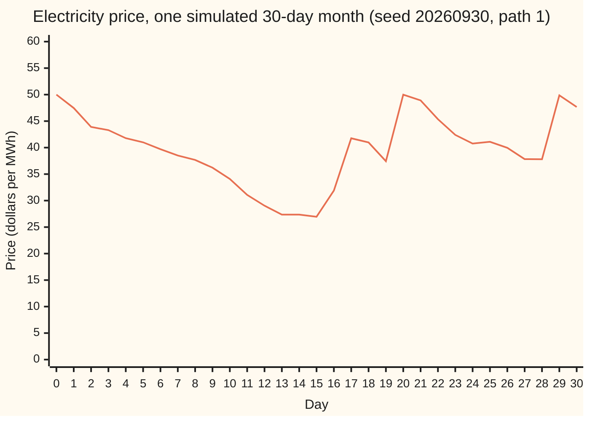
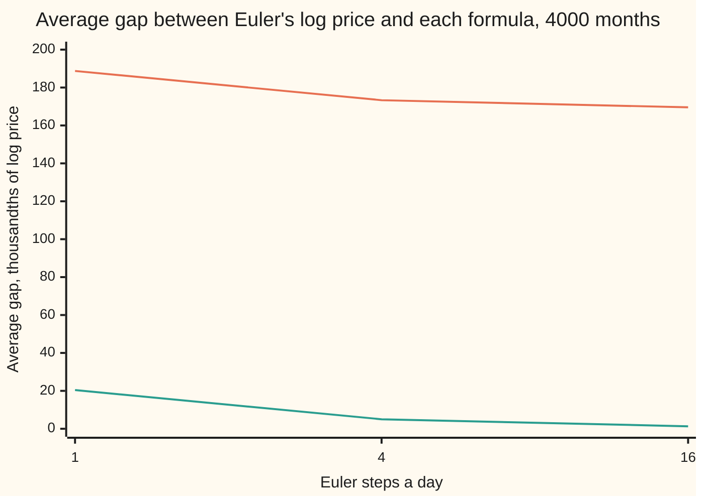

# Jump diffusions: Ito's lemma with a jump term

[Syllabus](../../../SYLLABUS.md) → [Stochastic processes and calculus](../../../SYLLABUS.md#w11) → [Beyond Brownian](../../../SYLLABUS.md#w11-s09) → Jump diffusions

---

## General Overview

A wholesale electricity price stands at $50 a megawatt-hour. On most days it wobbles a few percent. A few times a month something breaks: a power station trips, a cold snap arrives, the wind drops. Within minutes the price leaps, here by about a third. Spikes come at random, at an average of one every ten days, so a 30-day month brings 3 on average.

Two kinds of motion share one path. The wobble is Brownian: many small kicks, no gaps. The spikes are a Poisson stream: rare, sudden, each one multiplying the price by a random factor. A rule that combines the two is a **jump diffusion**. Merton wrote down the standard one in 1976. In this example the price drifts down 3.6 percent a day between spikes, which keeps its average at $50 over the month. Its typical month-end price, the price whose log is the average log, is lower: $41.62.

Ito's lemma, the chain rule for random paths, needs one new term to handle this. Between spikes the old rule stands: slope times the step, plus half the curvature times the squared wobble. At a spike the function moves from its value before to its value after. Apply the slope to the spike instead, as for an ordinary small step, and the average log comes out at −0.0135 instead of −0.1834.

**A function of a jump diffusion changes by Ito's two terms while the path wobbles, and by its exact before-and-after difference at each jump.**

**What kind of fact this is:** a theorem, Ito's formula with jumps, proved on this card in Why it works for finitely many jumps, with the full argument in a folded Detailed proof; Merton's rule for the price is a model.

### The picture: one month of the price



One line: the price, one sample path (one run of the process drawn against time). It was simulated on a grid of 16 steps a day and is shown once a day, so two spikes inside one day show as one rise. This path drew four spikes, on days 15.55, 16.04, 19.05 and 28.25, with log sizes 0.2066, 0.3177, 0.3170 and 0.3229. Between them the price slides; at each it leaps. It ends the month at $47.67. Another seed draws another month.

---

## The formula

Reminders first. Time $t$ is in days. $W_t$ is Brownian motion, "the random walk seen from far away", and $dW_t$ is shorthand for an Ito integral, never a derivative, because the path has no slope. $N_t$ counts the spikes by day $t$: a Poisson process at rate $\lambda$ per day ([Poisson process](../04-Poisson%20and%20Jump%20Processes/01-poisson-process.md)). Its step $dN_t$ is 1 at a spike instant and 0 otherwise.

New notation, in words. $S_{t-}$ is the price just before day $t$: the value the path was approaching from the left. At a spike instant $S_t$ is the price after the spike and $S_{t-}$ the price before. Away from spikes the two agree. The jump of a process $X$ at a spike is $\Delta X = X_t - X_{t-}$.

Merton's rule for the price:

$$dS_t = \mu\, S_{t-}\,dt + \sigma\, S_{t-}\,dW_t + S_{t-}\,(Y - 1)\,dN_t$$

**Read it aloud:** in each short slice of time the price drifts by $\mu$ of itself and is kicked by $\sigma$ of itself; and when a spike arrives, the price just before it is multiplied by a random factor $Y$.

The spike factors $Y_1, Y_2, \dots$ are independent of each other, of the arrivals and of the wobble. Their logs $J_i = \log Y_i$ are normal with mean $\mu_J$ and standard deviation $\delta$. The average spike adds the fraction $k = E[Y] - 1 = e^{\mu_J + \delta^2/2} - 1$ to the price.

Ito's formula with jumps, for a general jump diffusion $dX_t = \alpha_t\,dt + \beta_t\,dW_t + \Delta X\,dN_t$ and a function $f$ with continuous slope $f'$ and curvature $f''$, where the spikes arrive at times $\tau_1 < \tau_2 < \dots$:

$$f(X_T) = f(X_0) + \int_0^T f'(X_{t-})\big(\alpha_t\,dt + \beta_t\,dW_t\big) + \tfrac12\int_0^T f''(X_{t})\,\beta_t^2\,dt + \sum_{\tau_i \le T}\Big(f(X_{\tau_i}) - f(X_{\tau_i-})\Big)$$

**Read it aloud:** the function changes by its slope times the smooth step, plus half its curvature times the squared kick size, as on the Ito card; plus, at every jump, the exact amount the function moves from just before the jump to just after.

In shorthand: $df(X_t) = \big(f'\alpha_t + \tfrac12 f''\beta_t^2\big)\,dt + f'\beta_t\,dW_t + \big(f(X_{t-} + \Delta X) - f(X_{t-})\big)\,dN_t$.

Applied to the log of the price, where $f(x) = \log x$, $\alpha_t = \mu S_{t-}$, $\beta_t = \sigma S_{t-}$ and a spike moves the log by $\log(S_{t-} Y) - \log S_{t-} = J$:

$$\log S_T = \log S_0 + \big(\mu - \tfrac12\sigma^2\big)T + \sigma W_T + \sum_{i=1}^{N_T} J_i.$$

Write $c = \mu - \tfrac12\sigma^2$, the log drift between spikes. Averaging, with $E[N_T] = \lambda T$:

$$E\big[\log(S_T/S_0)\big] = cT + \lambda T \mu_J, \qquad \mathrm{Var}\,\log(S_T/S_0) = \sigma^2 T + \lambda T\,(\mu_J^2 + \delta^2).$$

| Symbol | Plain meaning | In our example | Push it up and the answer… |
| --- | --- | --- | --- |
| $S_t$, $S_0$, $S_T$ | the price at day $t$ (after any spike at $t$); at the start; at the horizon; $S_{t-}$ is the price just before $t$ | $S_0$ = $50 a megawatt-hour | — |
| $t$, $T$, $dt$ | time in days; the horizon; a short slice of time | $T$ = 30 days | more spikes, more spread |
| $\mu$, $c$ | the price's drift per day; the log drift between spikes, $\mu - \tfrac12\sigma^2$ | −0.035663 and −0.036113 a day | the typical price rises |
| $\sigma$ | wobble size, per square-root day | 0.03 | log drift falls by $\sigma$ times the rise |
| $W_t$, $W$, $W_T$, $dW_t$, $dW$ | Brownian motion; at the horizon; its step, shorthand inside an Ito integral | — | — |
| $N_t$, $N$, $N_T$, $dN_t$, $\lambda$ | spikes counted by day $t$; by the horizon; 1 at a spike instant and 0 otherwise; the spike rate | $\lambda$ = 0.1 a day, so 3 expected in 30 days | more spikes, a heavier upper tail |
| $Y$, $Y_i$, $J$, $J_i$ | the factor a spike multiplies the price by, and its log | $J$ normal, mean 0.30, sd 0.10 | bigger leaps |
| $\mu_J$, $\delta$, $k$ | mean and spread of a spike's log; the average proportional spike $E[Y] - 1$ | 0.30, 0.10; $k$ = 0.356625 | $k$ rises faster than $\mu_J$ |
| $\tau_i$, $\Delta X$ | time of spike i; the jump of a process there | path 1: days 15.55, 16.04, 19.05, 28.25 | — |
| $X_t$, $X$, $X_s$, $\alpha_t$, $\alpha$, $\beta_t$, $\beta$, $f$ | a general jump diffusion, its drift and kick size; a smooth function of it, with slope $f'$ and curvature $f''$ | $X = S$, $f = \log x$ or $x^2$ | — |
| $[X]_t$ | quadratic variation: the sum of squared steps up to $t$ | $[\log S]_{30}$ = 0.37537 on path 1 | — |
| $n$, $p_n$, $m_n$, $v_n$, $\Phi$, $h_s$, $ds$ | a spike count; its Poisson chance; the log's mean and variance given n spikes; bell-curve area to the left; in the proof, a bet fixed just before each instant, and a time slice | at n = 3: 0.2240 | — |

### When it holds

- **Finitely many jumps in any finite time.** A Poisson stream has that. A Lévy process with infinitely many tiny jumps ([Levy processes](01-levy-processes.md)) can make the sum of jump terms diverge, as it does for the measure in that card's Step 6, and then the small jumps must be compensated first; the general statement is on [Semimartingales](05-semimartingales-in-outline.md).
- **The coefficients use the price just before.** The drift, kick and spike all multiply $S_{t-}$. A spike sized by the price after itself would be defined in a circle.
- **$f$ has a continuous curvature.** At a kink, such as a payoff $\max(x - 60, 0)$, the wobble part needs local time, as on [Ito's lemma](../06-Ito%20Calculus/02-itos-lemma.md). The jump term needs no smoothness at all: it is a plain difference.
- **Spike sizes independent of the arrivals and the wobble.** If bigger spikes came in clusters, the averaged formulas fail; the path-by-path formula still holds.
- **Merton's spikes are permanent.** Each leap stays in the price for good; the drift lowers the whole price, not the leap alone. Real electricity spikes fade within hours or days. A model that pulls the log back to a level, as on [Mean reversion](../06-Ito%20Calculus/05-ornstein-uhlenbeck-and-cir-processes.md), with jumps added, fits better. The formula on this card applies to it unchanged.

---

## Why it works

### Step 0: between jumps, nothing new; at a jump, no Taylor

Taylor's expansion is for small steps. Ito's lemma needs it because Brownian steps are small but many. A spike is the opposite: one step, not small. There is no reason to expand it. The function's change across a spike is known exactly: its value after minus its value before. Cut the month at the spike times. Inside each piece the path is continuous, and Ito's lemma holds there unchanged. Add the pieces and the jumps.

### Step 1: the jumps are finite in number

The spike count $N_T$ is Poisson with mean $\lambda T$ = 3. It is finite on every path: a month with no spikes happens with chance 0.0498, with three, 0.2240. So the cuts are finitely many, and every sum on this card has finitely many terms. Each spike time $\tau_i$ is a stopping time: whether spike i has happened by day $t$ is known on day $t$.

### Step 2: Ito's lemma on each piece

Between $\tau_i$ and $\tau_{i+1}$ the path solves the continuous rule $dX = \alpha\,dt + \beta\,dW$, started from $X_{\tau_i}$. On that stretch Ito's lemma gives

$$f(X_{\tau_{i+1}-}) - f(X_{\tau_i}) = \int_{\tau_i}^{\tau_{i+1}} f'(X_{t-})\big(\alpha_t\,dt + \beta_t\,dW_t\big) + \tfrac12\int_{\tau_i}^{\tau_{i+1}} f''(X_t)\,\beta_t^2\,dt.$$

The first term on the left is the value just before the next spike, the limit of the continuous piece.

### Step 3: the jump pieces

At $\tau_{i+1}$ the function moves from $f(X_{\tau_{i+1}-})$ to $f(X_{\tau_{i+1}})$. That difference goes into the sum exactly as it is.

### Step 4: add everything

The pieces telescope: each ends where the next jump starts, and each jump ends where the next piece starts. The integrals over the pieces join into integrals over $[0, T]$, since the finitely many spike instants carry no $dt$ weight and no $dW$ weight. The result is the formula.

### Step 5: why Taylor fails at a jump

The quadratic variation of the log price makes the point. Its squared steps add up to $\sigma^2 T$ from the wobble plus $J_i^2$ for each spike. On path 1 the grid sum is 0.36831 against $\sigma^2 T + \sum J_i^2$ = 0.37537. The jumps' squares do not shrink to $dt$; they stay the size of a jump squared. Ito's half-curvature term turns squared Brownian steps into time, but a squared jump is a single big number. A second-order Taylor term on it is still an approximation, and higher terms do not vanish. For the log, the slope rule credits each spike with $Y - 1$ instead of $J$, an average error of 0.056625 a spike. Adding half the curvature gives $Y - 1 - \tfrac12(Y-1)^2$, which errs the other way. Only the exact difference is right.

<details>
<summary>Detailed proof, for finitely many jumps</summary>

Setting. $(\Omega, \mathcal F, \mathcal F_t, P)$ carries a Brownian motion $W$, a Poisson process $N$ of rate $\lambda$ with jump times $\tau_1 < \tau_2 < \dots$, and jump marks, all independent. $X$ is right-continuous with left limits and satisfies $X_t = X_0 + \int_0^t \alpha_s\,ds + \int_0^t \beta_s\,dW_s + \sum_{\tau_i \le t}\Delta X_{\tau_i}$, with $\alpha$, $\beta$ adapted and $\int_0^T(\lvert\alpha\rvert + \beta^2)\,ds < \infty$ almost surely. Write $\tau_0 = 0$.

**Pieces are Ito processes.** For each i define $Z^{(i)}_t = X_{\tau_i} + \int_{\tau_i}^{t}\alpha_s\,ds + \int_{\tau_i}^{t}\beta_s\,dW_s$ for $t \ge \tau_i$. Because $\tau_i$ is a stopping time, the integrands $\alpha_s 1_{s > \tau_i}$ and $\beta_s 1_{s > \tau_i}$ are adapted, so $Z^{(i)}$ is a continuous Ito process. On $[\tau_i, \tau_{i+1})$, $X = Z^{(i)}$, and by continuity $Z^{(i)}_{\tau_{i+1}} = X_{\tau_{i+1}-}$.

**Ito on each piece.** Apply Ito's lemma for continuous Ito processes ([Ito's lemma](../06-Ito%20Calculus/02-itos-lemma.md)) to $f(Z^{(i)})$ between the stopping times $\tau_i \wedge T$ and $\tau_{i+1} \wedge T$: $f(Z^{(i)}_{\tau_{i+1}\wedge T}) - f(X_{\tau_i \wedge T}) = \int f'(Z^{(i)}_s)(\alpha_s\,ds + \beta_s\,dW_s) + \tfrac12\int f''(Z^{(i)}_s)\beta_s^2\,ds$, both integrals over $(\tau_i \wedge T, \tau_{i+1} \wedge T]$. On that whole interval $Z^{(i)}_s = X_{s-}$, its right end included.

**Jumps.** If $\tau_{i+1} \le T$, add $f(X_{\tau_{i+1}}) - f(X_{\tau_{i+1}-})$; this takes the value from $f(Z^{(i)}_{\tau_{i+1}})$ to $f(X_{\tau_{i+1}})$, the start of the next piece.

**Assembling.** $N_T < \infty$ almost surely, so only the pieces $i = 0, \dots, N_T$ are non-empty. Summing telescopes the left sides to $f(X_T) - f(X_0)$. The piece integrals add, by additivity of the Ito integral over adjacent stochastic intervals, to integrals over $[0, T]$ with integrand $f'(X_{s-})$ and $f''(X_{s-})\beta_s^2$; replacing $X_{s-}$ by $X_s$ in the $ds$ integral changes it at finitely many instants only. This is the formula. ∎

**Averages.** For the averaged forms in the next step one more fact is used: for a bounded integrand $h_s$ that is left-continuous and adapted (predictable), $E\int_0^T h_s\,dN_s = \lambda\,E\int_0^T h_s\,ds$. In words, $N_t - \lambda t$ is a martingale, and a predictable bet against a fair game has average zero. With marks independent of the past, the jump sum's average is $\lambda\,E\int_0^T \big(E_Y f(X_{s-} + \Delta X) - f(X_{s-})\big)\,ds$. Both are proved in Cont and Tankov, Chapter 8, and Øksendal and Sulem, Chapter 1, in Sources.

**What this card does not prove.** Infinitely many small jumps in finite time. There the jump sum need not converge, the small jumps must be compensated before summing, and the formula is the general one for semimartingales, proved in Protter, Chapter II.

</details>

### Step 6: the averaged form, and the compensator

Average the jump term. A spike arrives in a slice $dt$ with chance $\lambda\,dt$, independent of the past, and moves $f$ by $f(S_{t-} Y) - f(S_{t-})$ on average over $Y$. So the average change of $f$ per day is

$$\mu x f'(x) + \tfrac12\sigma^2 x^2 f''(x) + \lambda\big(E[f(xY)] - f(x)\big), \quad x = S_{t-}.$$

This is the generator $L f(x)$ of shelf 08, with a jump part added.

For $f(x) = x$ this is $(\mu + \lambda k)\,x$, so $E[S_T] = S_0\,e^{(\mu + \lambda k)T}$. The spikes add $\lambda k$ to the average growth. To keep the average price flat at $50, the drift must cancel it: $\mu = -\lambda k$ = −0.035663 a day. That cancelling term is the **compensator**. The slide between spikes in the picture is the compensator at work.

For $f(x) = x^2$ the rate is $(2\mu + \sigma^2 + \lambda(E[Y^2] - 1))\,x^2$, so

$$E[S_T^2] = S_0^2\,e^{(2\mu + \sigma^2 + \lambda(E[Y^2]-1))T},$$

with $E[Y^2] = e^{2\mu_J + 2\delta^2}$. Ordinary Ito would supply the $\sigma^2$; the spikes supply $\lambda(E[Y^2] - 1)$.

### Step 7: a second road, conditioning on the spike count

Condition on the number of spikes, $n$. Given $n$, $\log(S_T/S_0)$ is a sum of independent normals: $cT + \sigma W_T$ plus $n$ spike logs. So it is normal with mean $m_n = cT + n\mu_J$ and variance $v_n = \sigma^2 T + n\delta^2$. Weight each case by its Poisson chance $p_n = e^{-\lambda T}(\lambda T)^n/n!$ and add. The code does this for n from 0 to 39 and matches every average above to the printed digits. It also gives the chance the month ends above $50: $\sum p_n\,\Phi(m_n/\sqrt{v_n})$ = 0.3433, where $\Phi$ is the bell-curve area to the left. The Merton option price on [Merton jump-diffusion](../../12-Financial%20mathematics/13-Local%20volatility%20and%20jumps/04-merton-jump-diffusion.md) is this same split, applied to a payoff.

This road is not free of Ito. It uses the log formula above, and $c$ carries Ito's $-\tfrac12\sigma^2$. What it never uses is the jump term's average, the rate of Step 6. So its agreement with Step 6 on $E[S_T]$ and $E[S_T^2]$ is a real test. Its agreement on the log's mean and variance only checks the Poisson averaging. The test of the formula itself, path by path, is the simulation in the code.

---

## Worked numbers, by hand

The price: $S_0$ = $50, $\sigma$ = 0.03 per root day, $\lambda$ = 0.1 a day, $\mu_J$ = 0.30, $\delta$ = 0.10, $T$ = 30 days.

| Step | Arithmetic | Value |
| --- | --- | --- |
| average spike factor less 1 | e^(0.30 + 0.005) − 1 | $k$ = 0.356625 |
| compensator | −0.1 × 0.356625 | $\mu$ = −0.035663 a day |
| log drift between spikes | −0.035663 − 0.000450 | $c$ = −0.036113 a day |
| over the month | 30 × −0.036113 | −1.083375 |
| spikes' share of the log | 0.1 × 30 × 0.30 | +0.900000 |
| average log of $S_T/S_0$ | −1.083375 + 0.900000 | **−0.183375** |
| typical price | 50 × e^(−0.183375) | **$41.62** |
| variance of the log | 0.027000 + 3 × (0.090000 + 0.010000) | 0.327000 |
| average squared factor | e^(2 × 0.30 + 2 × 0.010000) | 1.858928 |
| exponent for the average square | 30 × (−0.071325 + 0.000900 + 0.085893) | 0.464034 |
| average of $S_T$ squared | 2500 × e^0.464034 | 3976.1930 |
| spread of the month-end price | square root of (3976.1930 − 2500) | **$38.42** |

The average month ends at $50.00, but the typical month ends at $41.62 and only about 34 months in 100 end above $50. A few months with many spikes hold the average up: the 18 percent of months with five or more spikes carry 38 percent of it. When the spikes come does not matter, because the month-end log depends only on how many spikes came and how big they were.

### What breaks if you drop a piece

| Mistake | Comes out at | What went wrong |
| --- | --- | --- |
| Drop the jump term: plain Ito | average log −1.083375 | the spikes' +0.9 is lost; only the slide remains |
| Slope times the jump: each spike adds $Y - 1$ to the log | average log −0.013500 | a spike is not small: $Y - 1$ overstates its log by 0.056625 on average |
| Taylor to second order on each spike | average log −0.232017 | a squared jump is not $dt$; the series does not stop |
| No compensator, $\mu = 0$ | average price $145.75 instead of $50.00 | the spikes' average lift of $\lambda k$ a day is never paid back |
| Drop "finitely many jumps": the Lévy measure $x^{-2.5}\,dx$ on sizes 0 to 1, no compensator | average jump sum a day 18.0, 198.0, 1998.0, 19998.0 as the smallest size counted falls from 1e-2 to 1e-8 | the sum of jump terms has no limit; the small jumps must be compensated before summing |

---

## Code, from first principles, and it actually runs

The code takes three roads. Road 1 is Ito's formula with jumps, giving the averages of the log, the price and its square. Road 2 conditions on the spike count and adds Poisson-weighted normal cases; it uses the log formula but not the jump term's average, so its match with road 1 on the average price and its square is the test of Step 6. Road 3 runs 4000 seeded months (SplitMix64; normals by Box-Muller; spike gaps exponential, drawn as minus the log of a uniform over $\lambda$). Each month is stepped by Euler's rule on grids of 1, 4 and 16 steps a day, with each spike applied exactly in the step it falls in, and compared path by path with the closed form for the log and with the slope rule: that comparison is the test of Ito's formula with jumps itself. Every simulated average is printed with its standard error.

### Python

```python
# Jump diffusions -- the check behind the card.  Only math is imported.
# An electricity price, $50 a megawatt-hour, follows Merton's rule with time in days:
# dS = mu S dt + sigma S dW + S(Y - 1) dN, spikes at 0.1 a day, log Y ~ normal(0.30, 0.10^2).
# Roads: Ito's lemma with a jump term; the Poisson mixture (condition on the number
# of spikes, no jump term from Ito); 4000 seeded paths on nested grids, checked path by path.
import math

S0, SIG, LAM, MJ, DJ, T = 50.0, 0.03, 0.1, 0.30, 0.10, 30.0
K = math.exp(MJ + 0.5 * DJ * DJ) - 1.0           # the average spike adds K of the price
MU = -LAM * K                                     # the compensator: average price stays flat
SEED, PATHS, FINE, GRIDS = 20260930, 4000, 480, (30, 120, 480)
MASK = (1 << 64) - 1

class SplitMix64:                                 # the wing's generator, written out
    def __init__(self, seed):
        self.s = seed & MASK
    def uniform(self):
        self.s = (self.s + 0x9E3779B97F4A7C15) & MASK
        z = self.s
        z = ((z ^ (z >> 30)) * 0xBF58476D1CE4E5B9) & MASK
        z = ((z ^ (z >> 27)) * 0x94D049BB133111EB) & MASK
        return ((z ^ (z >> 31)) >> 11) / 9007199254740992.0
    def normal(self):                             # Box-Muller, cosine half
        u1, u2 = self.uniform(), self.uniform()
        return math.sqrt(-2.0 * math.log(1.0 - u1)) * math.cos(2.0 * math.pi * u2)

def phi(z):                                       # bell-curve height
    return math.exp(-0.5 * z * z) / math.sqrt(2.0 * math.pi)

def ncdf(x, n=2000):                              # bell-curve area left of x, Simpson's rule
    h = x / n
    s = phi(0.0) + phi(x)
    for i in range(1, n):
        s += (4 if i % 2 else 2) * phi(i * h)
    return 0.5 + s * h / 3.0

c = MU - 0.5 * SIG * SIG                          # log drift between spikes, per day
EY2 = math.exp(2.0 * MJ + 2.0 * DJ * DJ)          # average squared spike factor
print(f"price: S0 {S0:.0f} dollars/MWh, sigma {SIG:.2f} per root day, T {T:.0f} days")
print(f"spikes: rate {LAM:.1f} a day, log size mean {MJ:.2f} sd {DJ:.2f}; k = E[Y] - 1 = {K:.6f}")
print(f"compensated drift mu = -lambda k {MU:.6f} a day; log drift between spikes {c:.6f}")
m1 = c * T + LAM * T * MJ
v1 = SIG * SIG * T + LAM * T * (MJ * MJ + DJ * DJ)
mean1 = S0 * math.exp((MU + LAM * K) * T)
sq1 = S0 * S0 * math.exp((2.0 * MU + SIG * SIG + LAM * (EY2 - 1.0)) * T)
print(f"road 1, Ito with jumps: E log(S_T/S0) {m1:.6f}  Var {v1:.6f}  typical price {S0 * math.exp(m1):.2f}")
print(f"road 1, Ito with jumps: E S_T {mean1:.4f}  E S_T^2 {sq1:.4f}  sd S_T {math.sqrt(sq1 - mean1 * mean1):.4f}")

print(f"by hand: delta^2/2 {0.5 * DJ * DJ:.6f}  sigma^2/2 {0.5 * SIG * SIG:.6f}  c T {c * T:.6f}"
      f"  lambda T {LAM * T:.1f}  lambda T mu_J {LAM * T * MJ:.6f}  lambda k {LAM * K:.6f}")
print(f"by hand: sigma^2 T {SIG * SIG * T:.6f}  mu_J^2 {MJ * MJ:.6f}  delta^2 {DJ * DJ:.6f}"
      f"  lambda T (mu_J^2 + delta^2) {LAM * T * (MJ * MJ + DJ * DJ):.6f}")
print(f"by hand: E[Y^2] {EY2:.6f}  2 mu {2.0 * MU:.6f}  sigma^2 {SIG * SIG:.6f}  lambda (E[Y^2] - 1)"
      f" {LAM * (EY2 - 1.0):.6f}  E S_T^2 exponent {(2.0 * MU + SIG * SIG + LAM * (EY2 - 1.0)) * T:.6f}  S0^2 {S0 * S0:.0f}")
print(f"by hand: per spike E[Y - 1 - J] {K - MJ:.6f}  E[(Y - 1)^2] {EY2 - 2.0 * (1.0 + K) + 1.0:.6f}")

w, m2, e2, mean2, sq2, up2 = math.exp(-LAM * T), 0.0, 0.0, 0.0, 0.0, 0.0
weights, cond = [], []
for n in range(40):                               # condition on n spikes: log S_T is normal
    mn, vn = c * T + n * MJ, SIG * SIG * T + n * DJ * DJ
    weights.append(w); cond.append(S0 * math.exp(mn + 0.5 * vn))
    m2 += w * mn; e2 += w * (vn + mn * mn)
    mean2 += w * S0 * math.exp(mn + 0.5 * vn); sq2 += w * S0 * S0 * math.exp(2.0 * mn + 2.0 * vn)
    up2 += w * ncdf(mn / math.sqrt(vn))
    w *= LAM * T / (n + 1)
v2 = e2 - m2 * m2
print("road 2, Poisson mixture: chance of 0, 1, 2, 3, 4 spikes " + " ".join(f"{x:.4f}" for x in weights[:5]))
print(f"road 2, Poisson mixture: E log(S_T/S0) {m2:.6f}  Var {v2:.6f}")
print(f"road 2, Poisson mixture: E S_T {mean2:.4f}  E S_T^2 {sq2:.4f}  chance S_T > 50 {up2:.4f}")
print(f"road 2, Poisson mixture: 5 or more spikes: chance {sum(weights[5:]):.4f}, share of E S_T {sum(a * b for a, b in zip(weights[5:], cond[5:])) / mean2:.4f}")

ey1 = math.exp(MJ + 0.5 * DJ * DJ)
print("what breaks, E log(S_T/S0):")
print(f"  drop the jump term                {c * T:+.6f}")
print(f"  slope times the jump, Y - 1       {c * T + LAM * T * K:+.6f}")
print(f"  Taylor to second order on a jump  {c * T + LAM * T * (K - 0.5 * (EY2 - 2.0 * ey1 + 1.0)):+.6f}")
print(f"  no compensator, mu = 0: E S_T {S0 * math.exp(LAM * K * T):.2f} instead of {mean2:.2f}")
print("  infinitely many jumps, nu = x^-2.5 dx on (0,1), no compensator, mean jump sum a day, cut 1e-2 to 1e-8: " + " ".join(f"{2 * (e ** -0.5 - 1):.1f}" for e in (1e-2, 1e-4, 1e-6, 1e-8)))

g = SplitMix64(SEED)
gap = {n: [0.0, 0.0, 0.0, 0.0] for n in GRIDS}   # |Euler log - Ito with jumps|, |Euler log - slope rule|, squares
tot = [0.0, 0.0, 0.0, 0.0, 0.0]                   # S, S^2, log, log^2, count above 50
daily, qv, qv_target, spikes1 = [], 0.0, 0.0, []
for p in range(PATHS):
    jumps, t = [], 0.0
    while True:                                   # spike times: exponential gaps at rate lambda
        t += -math.log(1.0 - g.uniform()) / LAM
        if t >= T:
            break
        jumps.append((t, MJ + DJ * g.normal()))
    dw = [g.normal() * math.sqrt(T / FINE) for _ in range(FINE)]
    wT = sum(dw)
    ito = c * T + SIG * wT + sum(j for _, j in jumps)
    slope = c * T + SIG * wT + sum(math.exp(j) - 1.0 for _, j in jumps)
    for n in GRIDS:
        m, dt, s = FINE // n, T / n, S0
        jstep = [0.0] * n
        for tj, j in jumps:
            jstep[int(tj * n / T)] += j
        for k in range(n):
            before = s
            s *= (1.0 + MU * dt + SIG * sum(dw[k * m:(k + 1) * m])) * math.exp(jstep[k])
            if p == 0 and n == FINE:
                qv += math.log(s / before) ** 2
                if k % 16 == 0:
                    daily.append(before)
        lg = math.log(s / S0)
        d1, d2 = abs(lg - ito), abs(lg - slope); gap[n][0] += d1; gap[n][1] += d2; gap[n][2] += d1 * d1; gap[n][3] += d2 * d2
    if p == 0:
        daily.append(s)
        qv_target = SIG * SIG * T + sum(j * j for _, j in jumps)
        spikes1 = jumps
    tot[0] += s; tot[1] += s * s; tot[2] += lg; tot[3] += lg * lg; tot[4] += 1 if s > S0 else 0

se = lambda s, s2: math.sqrt((s2 / PATHS - (s / PATHS) * (s / PATHS)) / PATHS)   # standard error of an average
print(f"road 3, {PATHS} seeded paths (seed {SEED}), Euler steps with spikes applied exactly:")
for n in GRIDS:
    print(f"  {n // 30:2d} steps a day   |gap to Ito with jumps| {gap[n][0] / PATHS:.5f} (se {se(gap[n][0], gap[n][2]):.5f})"
          f"   |gap to slope rule| {gap[n][1] / PATHS:.5f} (se {se(gap[n][1], gap[n][3]):.5f})")
ms, ml, se_s, se_l = tot[0] / PATHS, tot[2] / PATHS, se(tot[0], tot[1]), se(tot[2], tot[3])
fr = tot[4] / PATHS
se_f = math.sqrt(fr * (1.0 - fr) / PATHS)
print(f"  16 steps a day: mean S_T {ms:.2f} (se {se_s:.2f})")
print(f"  16 steps a day: mean log {ml:.4f} (se {se_l:.4f}), above 50 {fr:.4f} (se {se_f:.4f})")
print("path 1 spikes, day and log size: " + "  ".join(f"{tj:.2f} {j:+.4f}" for tj, j in spikes1))
print(f"path 1 quadratic variation of log S: grid sum {qv:.5f}, sigma^2 T + sum J^2 {qv_target:.5f}")
print("chart, day   " + " ".join(f"{d:6d}" for d in range(31)))
print("chart, price " + " ".join(f"{x:6.2f}" for x in daily))
print("chart, gap to Ito x1000   " + " ".join(f"{1000 * gap[n][0] / PATHS:.2f}" for n in GRIDS))
print("chart, gap to slope x1000 " + " ".join(f"{1000 * gap[n][1] / PATHS:.2f}" for n in GRIDS))

assert abs(m1 - m2) < 1e-9 and abs(v1 - v2) < 1e-9, "the averaged log matches the Poisson mixture"
assert abs(mean1 - mean2) < 1e-9 * mean2 and abs(sq1 - sq2) < 1e-6 * sq2, "Ito on S and S^2 matches the mixture"
assert abs(ms - mean2) < 4 * se_s, "simulated mean price within 4 se of the mixture's 50"
assert abs(ml - m1) < 4 * se_l, "simulated mean log within 4 se of Ito with jumps"
assert abs(fr - up2) < 4 * se_f, "simulated chance above 50 matches the mixture"
assert gap[FINE][0] < gap[30][0] / 3, "the path-by-path gap to Ito shrinks with the step"
assert gap[FINE][1] / PATHS > 0.1, "the slope rule stays far off on every grid"
assert abs(qv - qv_target) < 0.1 * qv_target, "the jumps' squares sit in the quadratic variation"
print("ALL CHECKS PASS")
```

**Ran 2026-10-07 on macOS, Python 3.14.6, standard library only. All checks passed. Output, pasted from the run:**

```
price: S0 50 dollars/MWh, sigma 0.03 per root day, T 30 days
spikes: rate 0.1 a day, log size mean 0.30 sd 0.10; k = E[Y] - 1 = 0.356625
compensated drift mu = -lambda k -0.035663 a day; log drift between spikes -0.036113
road 1, Ito with jumps: E log(S_T/S0) -0.183375  Var 0.327000  typical price 41.62
road 1, Ito with jumps: E S_T 50.0000  E S_T^2 3976.1930  sd S_T 38.4213
by hand: delta^2/2 0.005000  sigma^2/2 0.000450  c T -1.083375  lambda T 3.0  lambda T mu_J 0.900000  lambda k 0.035663
by hand: sigma^2 T 0.027000  mu_J^2 0.090000  delta^2 0.010000  lambda T (mu_J^2 + delta^2) 0.300000
by hand: E[Y^2] 1.858928  2 mu -0.071325  sigma^2 0.000900  lambda (E[Y^2] - 1) 0.085893  E S_T^2 exponent 0.464034  S0^2 2500
by hand: per spike E[Y - 1 - J] 0.056625  E[(Y - 1)^2] 0.145678
road 2, Poisson mixture: chance of 0, 1, 2, 3, 4 spikes 0.0498 0.1494 0.2240 0.2240 0.1680
road 2, Poisson mixture: E log(S_T/S0) -0.183375  Var 0.327000
road 2, Poisson mixture: E S_T 50.0000  E S_T^2 3976.1930  chance S_T > 50 0.3433
road 2, Poisson mixture: 5 or more spikes: chance 0.1847, share of E S_T 0.3848
what breaks, E log(S_T/S0):
  drop the jump term                -1.083375
  slope times the jump, Y - 1       -0.013500
  Taylor to second order on a jump  -0.232017
  no compensator, mu = 0: E S_T 145.75 instead of 50.00
  infinitely many jumps, nu = x^-2.5 dx on (0,1), no compensator, mean jump sum a day, cut 1e-2 to 1e-8: 18.0 198.0 1998.0 19998.0
road 3, 4000 seeded paths (seed 20260930), Euler steps with spikes applied exactly:
   1 steps a day   |gap to Ito with jumps| 0.02042 (se 0.00012)   |gap to slope rule| 0.18874 (se 0.00184)
   4 steps a day   |gap to Ito with jumps| 0.00502 (se 0.00004)   |gap to slope rule| 0.17332 (se 0.00184)
  16 steps a day   |gap to Ito with jumps| 0.00131 (se 0.00001)   |gap to slope rule| 0.16956 (se 0.00184)
  16 steps a day: mean S_T 49.40 (se 0.57)
  16 steps a day: mean log -0.1878 (se 0.0089), above 50 0.3357 (se 0.0075)
path 1 spikes, day and log size: 15.55 +0.2066  16.04 +0.3177  19.05 +0.3170  28.25 +0.3229
path 1 quadratic variation of log S: grid sum 0.36831, sigma^2 T + sum J^2 0.37537
chart, day        0      1      2      3      4      5      6      7      8      9     10     11     12     13     14     15     16     17     18     19     20     21     22     23     24     25     26     27     28     29     30
chart, price  50.00  47.47  43.90  43.30  41.78  41.00  39.70  38.51  37.67  36.21  34.08  31.07  29.04  27.35  27.36  26.95  31.90  41.76  40.97  37.43  49.99  48.91  45.36  42.40  40.76  41.10  39.96  37.83  37.80  49.87  47.67
chart, gap to Ito x1000   20.42 5.02 1.31
chart, gap to slope x1000 188.74 173.32 169.56
ALL CHECKS PASS
```

Roads 1 and 2 agree to every printed digit. The simulated mean price, 49.40 with standard error 0.57, is about one standard error from 50. The simulated mean log, −0.1878 with standard error 0.0089, sits within one standard error of −0.1834 and far from the slope rule's −0.0135. The simulated chance above $50, 0.3357 with standard error 0.0075, matches the mixture's 0.3433.

### Rust

```rust
// Jump diffusions -- the same check as jump_diffusions_check.py, in Rust.  Std only, no crates.
// An electricity price, $50 a megawatt-hour, follows Merton's rule with time in days:
// dS = mu S dt + sigma S dW + S(Y - 1) dN, spikes at 0.1 a day, log Y ~ normal(0.30, 0.10^2).
// Roads: Ito's lemma with a jump term; the Poisson mixture (condition on the number
// of spikes, no jump term from Ito); 4000 seeded paths on nested grids, checked path by path.
use std::f64::consts::PI;

const S0: f64 = 50.0;
const SIG: f64 = 0.03;
const LAM: f64 = 0.1;
const MJ: f64 = 0.30;
const DJ: f64 = 0.10;
const T: f64 = 30.0;
const SEED: u64 = 20260930;
const PATHS: usize = 4000;
const FINE: usize = 480;
const GRIDS: [usize; 3] = [30, 120, 480];

struct SplitMix64 { s: u64 }                      // the wing's generator, written out
impl SplitMix64 {
    fn uniform(&mut self) -> f64 {
        self.s = self.s.wrapping_add(0x9E3779B97F4A7C15);
        let mut z = self.s;
        z = (z ^ (z >> 30)).wrapping_mul(0xBF58476D1CE4E5B9);
        z = (z ^ (z >> 27)).wrapping_mul(0x94D049BB133111EB);
        ((z ^ (z >> 31)) >> 11) as f64 / 9007199254740992.0
    }
    fn normal(&mut self) -> f64 {                 // Box-Muller, cosine half
        let (u1, u2) = (self.uniform(), self.uniform());
        (-2.0 * (1.0 - u1).ln()).sqrt() * (2.0 * PI * u2).cos()
    }
}

fn phi(z: f64) -> f64 { (-0.5 * z * z).exp() / (2.0 * PI).sqrt() }   // bell-curve height

fn ncdf(x: f64) -> f64 {                          // bell-curve area left of x, Simpson's rule
    let n = 2000;
    let h = x / n as f64;
    let mut s = phi(0.0) + phi(x);
    for i in 1..n { s += if i % 2 == 1 { 4.0 } else { 2.0 } * phi(i as f64 * h); }
    0.5 + s * h / 3.0
}

fn main() {
    let k = (MJ + 0.5 * DJ * DJ).exp() - 1.0;    // the average spike adds k of the price
    let mu = -LAM * k;                            // the compensator: average price stays flat
    let c = mu - 0.5 * SIG * SIG;                 // log drift between spikes, per day
    let ey2 = (2.0 * MJ + 2.0 * DJ * DJ).exp();   // average squared spike factor
    let pf = PATHS as f64;
    println!("price: S0 {:.0} dollars/MWh, sigma {:.2} per root day, T {:.0} days", S0, SIG, T);
    println!("spikes: rate {:.1} a day, log size mean {:.2} sd {:.2}; k = E[Y] - 1 = {:.6}", LAM, MJ, DJ, k);
    println!("compensated drift mu = -lambda k {:.6} a day; log drift between spikes {:.6}", mu, c);
    let m1 = c * T + LAM * T * MJ;
    let v1 = SIG * SIG * T + LAM * T * (MJ * MJ + DJ * DJ);
    let mean1 = S0 * ((mu + LAM * k) * T).exp();
    let sq1 = S0 * S0 * ((2.0 * mu + SIG * SIG + LAM * (ey2 - 1.0)) * T).exp();
    println!("road 1, Ito with jumps: E log(S_T/S0) {:.6}  Var {:.6}  typical price {:.2}", m1, v1, S0 * m1.exp());
    println!("road 1, Ito with jumps: E S_T {:.4}  E S_T^2 {:.4}  sd S_T {:.4}", mean1, sq1, (sq1 - mean1 * mean1).sqrt());

    println!("by hand: delta^2/2 {:.6}  sigma^2/2 {:.6}  c T {:.6}  lambda T {:.1}  lambda T mu_J {:.6}  lambda k {:.6}",
             0.5 * DJ * DJ, 0.5 * SIG * SIG, c * T, LAM * T, LAM * T * MJ, LAM * k);
    println!("by hand: sigma^2 T {:.6}  mu_J^2 {:.6}  delta^2 {:.6}  lambda T (mu_J^2 + delta^2) {:.6}",
             SIG * SIG * T, MJ * MJ, DJ * DJ, LAM * T * (MJ * MJ + DJ * DJ));
    println!("by hand: E[Y^2] {:.6}  2 mu {:.6}  sigma^2 {:.6}  lambda (E[Y^2] - 1) {:.6}  E S_T^2 exponent {:.6}  S0^2 {:.0}",
             ey2, 2.0 * mu, SIG * SIG, LAM * (ey2 - 1.0), (2.0 * mu + SIG * SIG + LAM * (ey2 - 1.0)) * T, S0 * S0);
    println!("by hand: per spike E[Y - 1 - J] {:.6}  E[(Y - 1)^2] {:.6}", k - MJ, ey2 - 2.0 * (1.0 + k) + 1.0);

    let (mut w, mut m2, mut e2, mut mean2, mut sq2, mut up2) = ((-LAM * T).exp(), 0.0f64, 0.0f64, 0.0f64, 0.0f64, 0.0f64);
    let (mut weights, mut cond) = (Vec::new(), Vec::new());
    for n in 0..40 {                              // condition on n spikes: log S_T is normal
        let (mn, vn) = (c * T + n as f64 * MJ, SIG * SIG * T + n as f64 * DJ * DJ);
        weights.push(w); cond.push(S0 * (mn + 0.5 * vn).exp());
        m2 += w * mn; e2 += w * (vn + mn * mn);
        mean2 += w * S0 * (mn + 0.5 * vn).exp(); sq2 += w * S0 * S0 * (2.0 * mn + 2.0 * vn).exp();
        up2 += w * ncdf(mn / vn.sqrt());
        w *= LAM * T / (n + 1) as f64;
    }
    let v2 = e2 - m2 * m2;
    let wl: Vec<String> = weights[..5].iter().map(|x| format!("{:.4}", x)).collect();
    println!("road 2, Poisson mixture: chance of 0, 1, 2, 3, 4 spikes {}", wl.join(" "));
    println!("road 2, Poisson mixture: E log(S_T/S0) {:.6}  Var {:.6}", m2, v2);
    println!("road 2, Poisson mixture: E S_T {:.4}  E S_T^2 {:.4}  chance S_T > 50 {:.4}", mean2, sq2, up2);
    println!("road 2, Poisson mixture: 5 or more spikes: chance {:.4}, share of E S_T {:.4}", weights[5..].iter().sum::<f64>(),
             weights[5..].iter().zip(&cond[5..]).map(|(a, b)| a * b).sum::<f64>() / mean2);

    let ey1 = (MJ + 0.5 * DJ * DJ).exp();
    println!("what breaks, E log(S_T/S0):");
    println!("  drop the jump term                {:+.6}", c * T);
    println!("  slope times the jump, Y - 1       {:+.6}", c * T + LAM * T * k);
    println!("  Taylor to second order on a jump  {:+.6}", c * T + LAM * T * (k - 0.5 * (ey2 - 2.0 * ey1 + 1.0)));
    println!("  no compensator, mu = 0: E S_T {:.2} instead of {:.2}", S0 * (LAM * k * T).exp(), mean2);
    let cut: Vec<String> = [1e-2f64, 1e-4, 1e-6, 1e-8].iter().map(|e| format!("{:.1}", 2.0 * (e.powf(-0.5) - 1.0))).collect();
    println!("  infinitely many jumps, nu = x^-2.5 dx on (0,1), no compensator, mean jump sum a day, cut 1e-2 to 1e-8: {}", cut.join(" "));

    let mut g = SplitMix64 { s: SEED };
    let mut gap = [[0.0f64; 4]; 3];               // |Euler log - Ito with jumps|, |Euler log - slope rule|, squares
    let mut tot = [0.0f64; 5];                    // S, S^2, log, log^2, count above 50
    let (mut daily, mut qv, mut qv_target) = (Vec::new(), 0.0f64, 0.0f64);
    let mut spikes1: Vec<(f64, f64)> = Vec::new();
    for p in 0..PATHS {
        let (mut jumps, mut t): (Vec<(f64, f64)>, f64) = (Vec::new(), 0.0);
        loop {                                    // spike times: exponential gaps at rate lambda
            t += -(1.0 - g.uniform()).ln() / LAM;
            if t >= T { break; }
            jumps.push((t, MJ + DJ * g.normal()));
        }
        let dw: Vec<f64> = (0..FINE).map(|_| g.normal() * (T / FINE as f64).sqrt()).collect();
        let wt: f64 = dw.iter().sum();
        let ito = c * T + SIG * wt + jumps.iter().map(|&(_, j)| j).sum::<f64>();
        let slope = c * T + SIG * wt + jumps.iter().map(|&(_, j)| j.exp() - 1.0).sum::<f64>();
        let (mut s, mut lg) = (S0, 0.0f64);
        for (gi, &n) in GRIDS.iter().enumerate() {
            let (m, dt) = (FINE / n, T / n as f64);
            s = S0;
            let mut jstep = vec![0.0f64; n];
            for &(tj, j) in jumps.iter() { jstep[(tj * n as f64 / T) as usize] += j; }
            for kk in 0..n {
                let before = s;
                let step: f64 = dw[kk * m..(kk + 1) * m].iter().sum();
                s *= (1.0 + mu * dt + SIG * step) * jstep[kk].exp();
                if p == 0 && n == FINE {
                    qv += (s / before).ln().powi(2);
                    if kk % 16 == 0 { daily.push(before); }
                }
            }
            lg = (s / S0).ln();
            let (d1, d2) = ((lg - ito).abs(), (lg - slope).abs());
            gap[gi][0] += d1; gap[gi][1] += d2; gap[gi][2] += d1 * d1; gap[gi][3] += d2 * d2;
        }
        if p == 0 {
            daily.push(s);
            qv_target = SIG * SIG * T + jumps.iter().map(|&(_, j)| j * j).sum::<f64>();
            spikes1 = jumps.clone();
        }
        tot[0] += s; tot[1] += s * s; tot[2] += lg; tot[3] += lg * lg; tot[4] += if s > S0 { 1.0 } else { 0.0 };
    }

    let se = |s: f64, s2: f64| ((s2 / pf - (s / pf) * (s / pf)) / pf).sqrt();   // standard error of an average
    println!("road 3, {} seeded paths (seed {}), Euler steps with spikes applied exactly:", PATHS, SEED);
    for (gi, &n) in GRIDS.iter().enumerate() {
        println!("  {:2} steps a day   |gap to Ito with jumps| {:.5} (se {:.5})   |gap to slope rule| {:.5} (se {:.5})",
                 n / 30, gap[gi][0] / pf, se(gap[gi][0], gap[gi][2]), gap[gi][1] / pf, se(gap[gi][1], gap[gi][3]));
    }
    let (ms, ml, se_s, se_l) = (tot[0] / pf, tot[2] / pf, se(tot[0], tot[1]), se(tot[2], tot[3]));
    let fr = tot[4] / pf;
    let se_f = (fr * (1.0 - fr) / pf).sqrt();
    println!("  16 steps a day: mean S_T {:.2} (se {:.2})", ms, se_s);
    println!("  16 steps a day: mean log {:.4} (se {:.4}), above 50 {:.4} (se {:.4})", ml, se_l, fr, se_f);
    let sp: Vec<String> = spikes1.iter().map(|&(tj, j)| format!("{:.2} {:+.4}", tj, j)).collect();
    println!("path 1 spikes, day and log size: {}", sp.join("  "));
    println!("path 1 quadratic variation of log S: grid sum {:.5}, sigma^2 T + sum J^2 {:.5}", qv, qv_target);
    let days: Vec<String> = (0..31).map(|d| format!("{:6}", d)).collect();
    println!("chart, day   {}", days.join(" "));
    let pr: Vec<String> = daily.iter().map(|x| format!("{:6.2}", x)).collect();
    println!("chart, price {}", pr.join(" "));
    let gi: Vec<String> = (0..3).map(|i| format!("{:.2}", 1000.0 * gap[i][0] / pf)).collect();
    let gs: Vec<String> = (0..3).map(|i| format!("{:.2}", 1000.0 * gap[i][1] / pf)).collect();
    println!("chart, gap to Ito x1000   {}", gi.join(" "));
    println!("chart, gap to slope x1000 {}", gs.join(" "));

    assert!((m1 - m2).abs() < 1e-9 && (v1 - v2).abs() < 1e-9, "the averaged log matches the Poisson mixture");
    assert!((mean1 - mean2).abs() < 1e-9 * mean2 && (sq1 - sq2).abs() < 1e-6 * sq2, "Ito on S and S^2 matches the mixture");
    assert!((ms - mean2).abs() < 4.0 * se_s, "simulated mean price within 4 se of the mixture's 50");
    assert!((ml - m1).abs() < 4.0 * se_l, "simulated mean log within 4 se of Ito with jumps");
    assert!((fr - up2).abs() < 4.0 * se_f, "simulated chance above 50 matches the mixture");
    assert!(gap[2][0] < gap[0][0] / 3.0, "the path-by-path gap to Ito shrinks with the step");
    assert!(gap[2][1] / pf > 0.1, "the slope rule stays far off on every grid");
    assert!((qv - qv_target).abs() < 0.1 * qv_target, "the jumps' squares sit in the quadratic variation");
    println!("ALL CHECKS PASS");
}
```

**Ran 2026-10-07 on macOS, rustc 1.98.1, no crates. All checks passed. Output, pasted from the run:**

```
price: S0 50 dollars/MWh, sigma 0.03 per root day, T 30 days
spikes: rate 0.1 a day, log size mean 0.30 sd 0.10; k = E[Y] - 1 = 0.356625
compensated drift mu = -lambda k -0.035663 a day; log drift between spikes -0.036113
road 1, Ito with jumps: E log(S_T/S0) -0.183375  Var 0.327000  typical price 41.62
road 1, Ito with jumps: E S_T 50.0000  E S_T^2 3976.1930  sd S_T 38.4213
by hand: delta^2/2 0.005000  sigma^2/2 0.000450  c T -1.083375  lambda T 3.0  lambda T mu_J 0.900000  lambda k 0.035663
by hand: sigma^2 T 0.027000  mu_J^2 0.090000  delta^2 0.010000  lambda T (mu_J^2 + delta^2) 0.300000
by hand: E[Y^2] 1.858928  2 mu -0.071325  sigma^2 0.000900  lambda (E[Y^2] - 1) 0.085893  E S_T^2 exponent 0.464034  S0^2 2500
by hand: per spike E[Y - 1 - J] 0.056625  E[(Y - 1)^2] 0.145678
road 2, Poisson mixture: chance of 0, 1, 2, 3, 4 spikes 0.0498 0.1494 0.2240 0.2240 0.1680
road 2, Poisson mixture: E log(S_T/S0) -0.183375  Var 0.327000
road 2, Poisson mixture: E S_T 50.0000  E S_T^2 3976.1930  chance S_T > 50 0.3433
road 2, Poisson mixture: 5 or more spikes: chance 0.1847, share of E S_T 0.3848
what breaks, E log(S_T/S0):
  drop the jump term                -1.083375
  slope times the jump, Y - 1       -0.013500
  Taylor to second order on a jump  -0.232017
  no compensator, mu = 0: E S_T 145.75 instead of 50.00
  infinitely many jumps, nu = x^-2.5 dx on (0,1), no compensator, mean jump sum a day, cut 1e-2 to 1e-8: 18.0 198.0 1998.0 19998.0
road 3, 4000 seeded paths (seed 20260930), Euler steps with spikes applied exactly:
   1 steps a day   |gap to Ito with jumps| 0.02042 (se 0.00012)   |gap to slope rule| 0.18874 (se 0.00184)
   4 steps a day   |gap to Ito with jumps| 0.00502 (se 0.00004)   |gap to slope rule| 0.17332 (se 0.00184)
  16 steps a day   |gap to Ito with jumps| 0.00131 (se 0.00001)   |gap to slope rule| 0.16956 (se 0.00184)
  16 steps a day: mean S_T 49.40 (se 0.57)
  16 steps a day: mean log -0.1878 (se 0.0089), above 50 0.3357 (se 0.0075)
path 1 spikes, day and log size: 15.55 +0.2066  16.04 +0.3177  19.05 +0.3170  28.25 +0.3229
path 1 quadratic variation of log S: grid sum 0.36831, sigma^2 T + sum J^2 0.37537
chart, day        0      1      2      3      4      5      6      7      8      9     10     11     12     13     14     15     16     17     18     19     20     21     22     23     24     25     26     27     28     29     30
chart, price  50.00  47.47  43.90  43.30  41.78  41.00  39.70  38.51  37.67  36.21  34.08  31.07  29.04  27.35  27.36  26.95  31.90  41.76  40.97  37.43  49.99  48.91  45.36  42.40  40.76  41.10  39.96  37.83  37.80  49.87  47.67
chart, gap to Ito x1000   20.42 5.02 1.31
chart, gap to slope x1000 188.74 173.32 169.56
ALL CHECKS PASS
```

The two outputs agree line for line. Both use the same generator, the same draws in the same order and the same order of additions.

### The picture: path by path, Ito with jumps against the slope rule



The upper line is the slope rule, $\log S_0 + cT + \sigma W_T + \sum(Y_i - 1)$: it settles near 170 thousandths, a spike count times 0.0566, however fine the grid. The lower line is Ito's formula with jumps, $\log S_0 + cT + \sigma W_T + \sum J_i$: its gap is only Euler's step error, and it falls about fourfold each time the steps are cut by four, from 20.42 thousandths at one step a day to 1.31 at sixteen. Each point is an average over the same 4000 sampled months, with a standard error of at most 0.12 thousandths on the lower line and 1.84 on the upper.

> [!TIP]
> **Try changing**
> - **Guess first: what does the compensator protect?** Set `MU = 0.0`. The mean price on both exact roads becomes the 145.75 printed under what breaks, the simulation follows, and every assert still passes: the asserts test the formula, not the choice of drift.
> - **Guess first: is a spike a big Brownian step?** Replace `math.exp(jstep[k])` with `(1.0 + jstep[k])`, which treats the spike's log as a proportional move. The assert "simulated mean price within 4 se of the mixture's 50" fails.
> - **Guess first: triple the spike rate.** Set `LAM = 0.3`. The mean price stays at 50.00, the compensating slide steepens, and the typical price falls further below it.
> - **Guess first: do the spikes' squares count?** Change `qv += math.log(s / before) ** 2` to add half of each squared step. The assert "the jumps' squares sit in the quadratic variation" fails: the squared spikes are part of the path's quadratic variation.

---

## The usual mistake

> [!warning]
> **Treating a jump as one more small step.** The chain rule's slope, and Ito's half-curvature, are tools for steps that shrink. A spike does not shrink. Applying the slope to it puts the month's average log at −0.0135 instead of −0.1834; adding the second-order term overshoots to −0.2320. The jump term is an exact difference, $f(\text{after}) - f(\text{before})$, and needs no expansion.
>
> - **Forgetting the compensator.** Spikes that lift the price on average make the average grow by $\lambda k$ a day. Without $\mu = -\lambda k$ the month's average price is $145.75, not $50.
> - **Using the price after the spike.** The spike multiplies $S_{t-}$. Writing $S_t$ in the coefficients makes the rule circular at the spike instant.
> - **Reading $dN_t$ as $\lambda\,dt$.** $dN_t$ is 0 almost always and 1 at a spike. Only its average is $\lambda\,dt$; the difference $dN_t - \lambda\,dt$ is the fair-game part that the averaged formulas drop.
> - **Believing Merton's spikes fade.** They do not. Between spikes the price slides by the compensator's 3.6 percent a day, on every path, spike or no spike; a real electricity spike decays by itself.

---

## Where you meet it in real life

- **Electricity and gas trading.** Spot power prices spike when supply fails. Desks model the log price as a mean-reverting process plus jumps, and value contracts with this card's formula, extended by a pull towards a level.
- **Option prices with jumps.** Merton's model prices a call as Black-Scholes averaged over the jump count: [Merton jump-diffusion](../../12-Financial%20mathematics/13-Local%20volatility%20and%20jumps/04-merton-jump-diffusion.md).
- **Insurance surplus.** An insurer's capital grows with premiums and falls at each claim; with investment returns added it is a jump diffusion whose jumps are the claims of [Compound Poisson](../04-Poisson%20and%20Jump%20Processes/04-compound-poisson.md).
- **Control with jumps.** Choosing actions when the state can leap, such as stocking a warehouse against sudden demand, uses this formula inside the equation of [Stochastic control](03-stochastic-control-and-the-hjb-equation.md).

> **Say it back**
> A jump diffusion wobbles like Brownian motion and leaps at Poisson times. Between leaps, Ito's lemma applies unchanged. At a leap, a function moves by exactly its value after minus its value before, with no Taylor expansion, because a leap is not small. For the log of Merton's price that gives the wobble's log drift plus the sum of the spike logs. Averaging the jump term at rate $\lambda$ gives the compensator, the drift that keeps the average price flat.

---

## What this builds on

- [Levy processes](01-levy-processes.md): Brownian motion plus a Poisson stream of jumps as one process with independent, stationary steps; this card puts a rule on top of it.
- [Ito's lemma](../06-Ito%20Calculus/02-itos-lemma.md): the continuous formula, used unchanged on every stretch between jumps.

## Where this goes next

- [Semimartingales](05-semimartingales-in-outline.md): the one class of processes on which Ito's formula holds, jumps of every size and number included.
- When prices jump: the averaged rate of Step 6, with its $E[f(xY)] - f(x)$ term, as an equation for prices and expectations.
- Stable laws: jump laws with tails so heavy that the variance on this card is infinite.

This card handles finitely many jumps, cut out one at a time; what Ito's formula becomes when infinitely many small jumps arrive in every second, and what a stochastic integral against such a path means, is the question [Semimartingales](05-semimartingales-in-outline.md) answers.

---

## Sources

Verified 2026-09-30: every link below resolves to the publisher's page.

- Merton, Robert C. "Option Pricing When Underlying Stock Returns Are Discontinuous." *Journal of Financial Economics* 3 (1976): 125–144. [doi:10.1016/0304-405X(76)90022-2](https://doi.org/10.1016/0304-405X(76)90022-2). The jump-diffusion rule for a price, with lognormal jumps and the compensated drift.
- Cont, Rama, and Peter Tankov. *Financial Modelling with Jump Processes*. Chapman and Hall/CRC, 2003. [doi:10.1201/9780203485217](https://doi.org/10.1201/9780203485217). Chapter 8: stochastic integrals against jump processes and Ito's formula for jump diffusions, with the compensated Poisson martingale.
- Øksendal, Bernt, and Agnès Sulem. *Applied Stochastic Control of Jump Diffusions*, 3rd ed. Springer, 2019. [doi:10.1007/978-3-030-02781-0](https://doi.org/10.1007/978-3-030-02781-0). Chapter 1: jump diffusions driven by Poisson random measures and their Ito formula.
- Protter, Philip E. *Stochastic Integration and Differential Equations*, 2nd ed. Springer, 2005. [doi:10.1007/978-3-662-10061-5](https://doi.org/10.1007/978-3-662-10061-5). Chapter II: Ito's formula for every semimartingale, infinitely many small jumps included.
