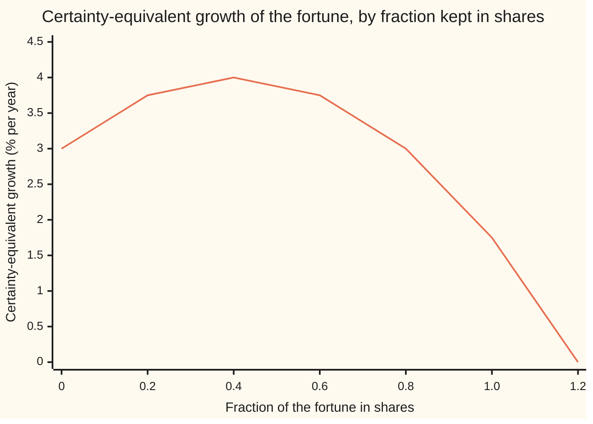
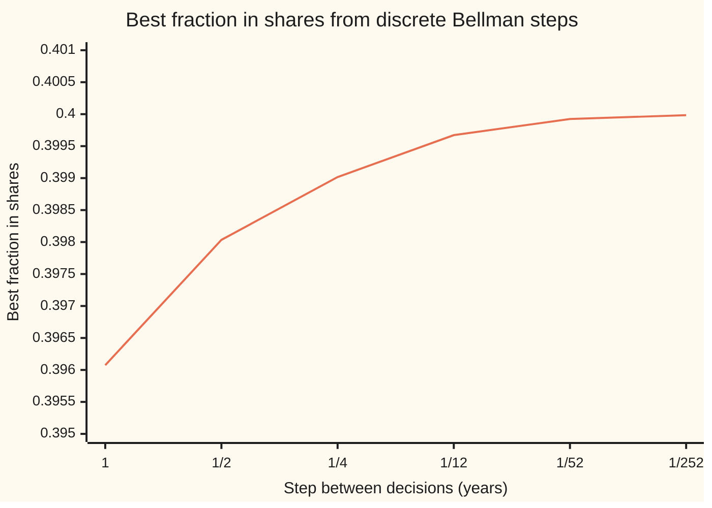
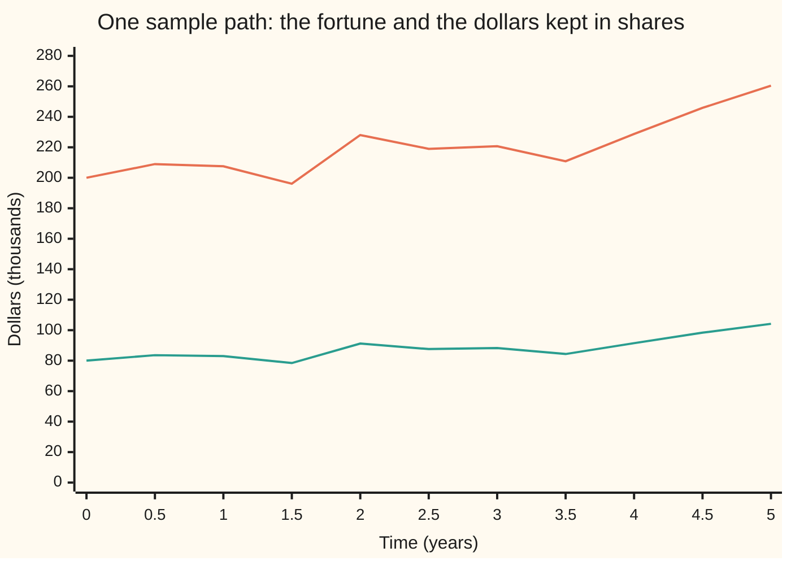

# Stochastic control: choosing a policy as the noise unfolds

Stochastic processes and calculus → Beyond Brownian → Controlled diffusions → Stochastic control

---

## General Overview

A fortune of \$200,000 has five years to grow. Two places can hold it. A bank account pays 3 percent a year, with no risk. A broad fund of shares is expected to return 8 percent a year, with a volatility of 25 percent: a typical year's surprise is about 25 percentage points either way. The money can be moved between them at any moment, for free.

The question is not one decision but a rule. The shares will rise and fall in ways nobody can foresee. After each move, the holder looks at the fortune and decides again. A rule that maps "what the fortune is now, and how much time is left" to "how much to keep in shares" is a **policy**. Choosing the best policy for a quantity driven by noise is **stochastic control**, the term used from here on.

The tool is the one that solved the noiseless case: write down the best achievable score as a function of the state, and demand that it balance over every instant. Without noise that balance is the Hamilton-Jacobi-Bellman (HJB) equation of [the-hjb-equation-and-the-linear-quadratic-regulator](../../08-Differential%20equations%20and%20dynamics/12-Calculus%20of%20Variations%20and%20Optimal%20Control/08-the-hjb-equation-and-the-linear-quadratic-regulator.md). Noise adds exactly one term, a second derivative, and that term is where caution lives. For the fortune, the answer is short: keep 40 percent in shares, always. Today that is \$80,000. The dollars move every day; the fraction never does.

**The best score from each state, as a function of time and state, satisfies the HJB equation: its rate in time plus the best available expected rate of change, drift times slope plus half the squared noise times curvature, is zero; the control that achieves the best is the optimal policy.**

**What kind of fact this is:** a theorem. The verification half (a smooth solution of HJB is the best score, and its maximiser is the best policy) is proved on this card in the folded Detailed proof; the converse (the best score is smooth and solves HJB) is stated with a named source. Merton's answer for the fortune is a theorem inside a model: geometric Brownian motion for the shares and a power-law taste for risk.

### The picture: a hill with its top at 40 percent

Each fixed fraction kept in shares gives a random fortune at five years. Its **certainty equivalent** is the sure sum the holder would accept in its place; the growth rate that turns \$200,000 into that sum is plotted below.



The one line is the certainty-equivalent growth rate for each fraction held constant, printed by both checks. All in the bank earns a sure 3.00 percent. The top, 4.00 percent, sits at 0.4. Past it, extra shares add more risk than reward: at 0.8 the holder is no better off than with none, and at 1.2 (borrowing to buy shares) the fortune is worth no growth at all.

---

## The formula

Notation first, in words. The fortune at time $t$ (in years) is $X_t$, and $x$ is a particular value of it. The control is $u$; for the fortune it is $\pi$, the fraction in shares (here $\pi$ is a fraction, not 3.14159). $W_t$ is Brownian motion, the shares' accumulated surprise, and $dW_t$ is shorthand for an Ito integral, never a derivative, since the path has none ([ito-integral](../06-Ito%20Calculus/01-ito-integral.md)). Subscripts on $V$ are partial derivatives, as on the noiseless card.

A **controlled diffusion** is an SDE whose drift and noise depend on the control:

$$dX_t = b(X_t, u_t)\,dt + s(X_t, u_t)\,dW_t, \qquad X_0 = x_0 .$$

The holder scores the final fortune with a utility $U$ and wants the largest average score. The **value function** is the best average still reachable from fortune $x$ at time $t$:

$$V(t, x) = \sup_{\text{policies}} E\big[\,U(X_T) \mid X_t = x\,\big].$$

The HJB equation for it is

$$V_t + \max_u \Big( b(x,u)\,V_x + \tfrac12\, s(x,u)^2\, V_{xx} \Big) = 0, \qquad V(T, x) = U(x).$$

**Read it aloud:** the best score changes in time at minus the best expected rate any control can produce now, and that rate is drift times slope plus half the squared noise times curvature.

The bracket is the generator of the controlled process applied to $V$, written $L^u V$ ([infinitesimal-generator](../08-Generators%2C%20Densities%20and%20Simulation/01-infinitesimal-generator.md)). So HJB reads $V_t + \max_u L^u V = 0$. A reward earned along the way, at rate $f(x,u)$, joins the bracket as $+f$.

For the fortune, a fraction $\pi$ in shares and the rest in the bank give drift $b = x\,(r + \pi(\mu - r))$ and noise size $s = x\,\pi\,\sigma$. The taste for risk is power utility, $U(x) = x^{1-\gamma}/(1-\gamma)$, which for $\gamma = 2$ is $-1/x$. Merton's answer is

$$\pi^* = \frac{\mu - r}{\gamma\,\sigma^2}, \qquad V(t,x) = U(x)\, e^{(1-\gamma)\, g^*\,(T-t)}, \qquad g^* = r + \frac{(\mu - r)^2}{2\gamma\sigma^2}.$$

**Read it aloud:** keep in shares the excess return over the bank divided by risk aversion times variance; the best score is the utility of the fortune grown at the certainty-equivalent rate.

| Symbol | Plain meaning | In our example | Push it up and the answer… |
| --- | --- | --- | --- |
| $X_t$, $x$, $x_0$ | the fortune at time $t$, dollars; a particular value; the start | $x_0$ = \$200,000 | fraction unchanged; dollars in shares scale with it |
| $u$, $u_t$, $\pi$, $\pi^*$ | the control; its value at time $t$ under a policy; the fraction of the fortune in shares; the best fraction | $\pi^*$ = 0.4 | — |
| $W_t$, $dW_t$ | Brownian motion driving the shares; one small increment | — | — |
| $b$, $s$, $f$ | drift and noise size of the controlled fortune, both depending on $x$ and $u$; a running reward rate | $b = x(r + \pi(\mu-r))$, $s = x\pi\sigma$; $f = 0$ | — |
| $\mu$, $r$ | the shares' expected return per year; the bank rate, continuously compounded | 0.08; 0.03 | $\mu$ up: more in shares; $r$ up: less |
| $\sigma$ | the shares' volatility per year; $\sigma^2$ is the variance | 0.25; 0.0625 | best fraction falls with the square |
| $\gamma$, $U$ | relative risk aversion; the utility that scores a final fortune | 2; $U(x) = -1/x$ | $\gamma$ up: fraction falls in proportion |
| $V$, $V_t$, $V_x$, $V_{xx}$, $F$ | value function; its rate in time; its slope in the fortune; its curvature; $F$ a candidate solution of HJB | $V(0, x_0) = -1/244{,}280.55$ | — |
| $L^u$ | the generator under control $u$: drift times slope plus half squared noise times curvature | — | — |
| $t$, $T$, $h$ | time in years; the horizon; a short step | $T$ = 5; $h$ from 1 to 1/252 | — |
| $g$, $g^*$, CE | certainty-equivalent growth of a fixed fraction; its best value; certainty-equivalent fortune | $g^*$ = 0.04; CE = \$244,280.55 | — |
| $A$, $\varphi$ | absolute risk aversion of an exponential taste; the time factor in the guess $V = U(x)\varphi(t)$ | $A$ = 0.00001 per dollar | — |

The helper $g(\pi) = r + \pi(\mu - r) - \tfrac12\gamma\sigma^2\pi^2$ is the certainty-equivalent growth of keeping fraction $\pi$ for good: bank rate, plus the shares' extra return, minus a charge for risk that grows with the square of the fraction. The CE fortune is $x_0\, e^{g T}$.

### When it holds

- **A smooth value function.** The derivation uses $V_x$ and $V_{xx}$. With a cap on the control or a kink in the payoff, the value can have a corner; HJB then holds only in a weaker sense, viscosity solutions (wing 19).
- **The fortune moves continuously.** If the shares can jump, the generator gains a jump term and HJB gains an average over jumps ([jump-diffusions](02-jump-diffusions.md)).
- **The state is seen.** HJB chooses from the current fortune. If the state is only glimpsed through noise, the state must first become the best estimate of it ([filtering-and-the-kalman-bucy-filter](04-filtering-and-the-kalman-bucy-filter.md)).
- **Admissible policies.** The verification proof needs the noise part of the score to average to zero. Policies that borrow without limit can break that, the way doubling up breaks optional stopping.
- **Power utility, for the constant fraction.** With exponential utility, $U(x) = -e^{-Ax}$, the best holding is a dollar sum that ignores the fortune, $(\mu - r)\,e^{-r(T-t)}/(A\sigma^2)$: \$68,856.64 today for $A$ = 0.00001 per dollar, rising to \$80,000.00 at the horizon.

---

## Why it works

### Step 0: the best score from here is the best average of the best score from where the next step lands

Hold some control for a short stretch, see where the fortune lands, and act optimally from there. The best score now is the best, over that first choice, of the average best score at the landing point. This is Bellman's principle ([dynamic-programming-and-the-bellman-equation](../../08-Differential%20equations%20and%20dynamics/12-Calculus%20of%20Variations%20and%20Optimal%20Control/07-dynamic-programming-and-the-bellman-equation.md)) with an average where the noiseless card had a single landing point. It works because the fortune is Markov: where it goes next depends only on where it is now and what is done now, so the best policy needs nothing but the current time and fortune.

### Step 1: Bellman's rule over a short step

Hold the control $u$ for a short time $h$. Then, up to terms smaller than $h$,

$$V(t, x) = \max_u E\big[\,V(t+h,\; X_{t+h}) \mid X_t = x\,\big].$$

The landing point is random, so the right side needs the average of $V$ at a random point. Ordinary calculus would expand $V$ to first order and stop. Here that is not enough.

### Step 2: Ito's lemma supplies the second-derivative term

Over the step the fortune moves by about $b\,h + s\,\Delta W$, where $\Delta W$ has mean 0 and variance $h$. Expand $V$ to second order in the move. The first-order noise term averages to zero. The square of the move is about $s^2(\Delta W)^2$, and $(\Delta W)^2$ averages $h$: the same order as the drift. So it survives:

$$E\big[V(t+h, X_{t+h})\big] - V(t,x) = \Big(V_t + b\,V_x + \tfrac12 s^2 V_{xx}\Big)\,h + o(h),$$

where $o(h)$ is smaller than $h$ as $h$ shrinks. This is Ito's lemma averaged ([itos-lemma](../06-Ito%20Calculus/02-itos-lemma.md)), and the bracket is the generator $L^u V$. Put it into Step 1, subtract $V(t,x)$ from both sides, divide by $h$ and let $h$ shrink:

$$0 = V_t + \max_u \Big( b\,V_x + \tfrac12 s^2 V_{xx} \Big).$$

That is the HJB equation. With $s = 0$ it is the noiseless equation of the earlier card. The new term $\tfrac12 s^2 V_{xx}$ is the price of noise: when the score is curved downward ($V_{xx} < 0$, a holder who dislikes risk), every unit of squared noise lowers the expected score.

### Step 3: a solution of HJB is the best score

Steps 1 and 2 show that a smooth best score must satisfy HJB. The useful direction is the converse: find any smooth $F$ that solves HJB with $F(T,x) = U(x)$, and it is the best score, with its maximiser the best policy. This **verification theorem** is proved in full below, using only Ito's lemma and the fact that an Ito integral of a square-integrable integrand averages zero. Whether the best score is always smooth enough to solve HJB is a harder question; Fleming and Soner (Sources) prove it under conditions and give the weaker viscosity sense where it fails. This card does not prove that half.

<details>
<summary>Detailed proof: the verification theorem</summary>

Let $F(t, x)$ have a continuous first derivative in $t$ and continuous first and second derivatives in $x$, with $F_t + \max_u L^u F = 0$ and $F(T, x) = U(x)$. Take any admissible policy $u_t$, meaning one for which the fortune exists and $E\int_0^T \big(F_x\, s\big)^2 dt$ is finite.

Ito's lemma applied to $F(t, X_t)$ gives
$$U(X_T) = F(0, x_0) + \int_0^T \big(F_t + L^{u_t} F\big)(t, X_t)\,dt + \int_0^T F_x\, s\,(t, X_t)\,dW_t .$$
The first integrand is at most 0 at every instant, because the maximum over all controls makes $F_t + L^u F$ exactly 0 and any particular control does no better. The last integral is an Ito integral with a square-integrable integrand, so its average is 0. Taking averages: $E[U(X_T)] \le F(0, x_0)$ for every admissible policy.

Now use the policy $u^*(t, x)$ that attains the maximum at every $(t, x)$, assuming the fortune it drives exists and is admissible. The first integrand is then exactly 0, so $E[U(X_T)] = F(0, x_0)$. No policy beats $F(0,x_0)$, and $u^*$ reaches it: $F$ is the value function and $u^*$ is optimal. The same argument from any start $(t, x)$ gives $F = V$ everywhere.

Where admissibility matters: drop the square-integrability condition and the Ito integral can be a local martingale that is not a true martingale, with an average that is not 0. Then the bound, or the equality for $u^*$, can fail, and $F$ need not be the value.

</details>

### Step 4: Merton's problem in outline

For the fortune, put $b = x(r + \pi(\mu - r))$ and $s = x\pi\sigma$ into the bracket:

$$x\,(r + \pi(\mu - r))\,V_x + \tfrac12\, x^2 \pi^2 \sigma^2\, V_{xx}.$$

In $\pi$ this is a straight line plus a square. With $V_{xx} < 0$ the square bends it into a hill, and the slope is zero at

$$\pi^* = -\frac{(\mu - r)\, V_x}{\sigma^2\, x\, V_{xx}} .$$

The ratio $-x V_{xx}/V_x$ is the holder's relative risk aversion. For power utility it is the constant $\gamma$, so guess $V = U(x)\,\varphi(t)$. Then $V_x = x^{-\gamma}\varphi$ and $V_{xx} = -\gamma x^{-\gamma-1}\varphi$, and the bracket becomes $x^{1-\gamma}\varphi\; g(\pi)$. Since $x^{1-\gamma}\varphi > 0$, maximising the bracket means maximising $g(\pi)$, whose top is $\pi^* = (\mu - r)/(\gamma\sigma^2)$ with height $g^*$. HJB is left as $U\varphi' + (1-\gamma)U\varphi\, g^* = 0$, so $\varphi(t) = e^{(1-\gamma) g^* (T - t)}$, which is 1 at the horizon as required. The verification theorem of Step 3 then certifies the guess.

For the fortune: excess return 0.05, variance 0.0625, risk aversion 2, so $\pi^*$ = 0.05 / 0.125 = 0.4. Nothing in the answer mentions the fortune or the date. The same problem in finance terms, with the rule followed quarter by quarter and the fraction's sensitivity to each input, is [mertons-portfolio-problem](../../12-Financial%20mathematics/38-Performance%20and%20Multi-Period/03-mertons-portfolio-problem.md). Consumption along the way is in Merton (1971), and the hedging demand that appears when the odds move is in Merton (1973), both in Sources.

### Step 5: an independent road, Bellman on steps that shrink

The continuous-time claim can be tested without Ito's lemma. Let the shares move on steps of $h$ years by one of two factors, $e^{(\mu - \sigma^2/2)h \pm \sigma\sqrt{h}}$, each with chance one half, and let the bank pay $e^{rh}$. Apply Bellman's rule exactly on each step. Power utility makes every step the same problem, whatever the fortune, so one search over the fraction settles the whole five years. A bisection on the slope of one step's score (halving an interval that holds the point where the slope is zero) finds the best fraction for each step size:



The one line is the best fraction found at each step size. The gap to 0.4 is −0.003925 at yearly decisions and −0.000016 at daily ones (1/252 of a year): it shrinks in proportion to the step, and the certainty-equivalent growth climbs to 0.040000.

Two more checks test the formula rather than search for the fraction afresh. A simulation needs no HJB: it draws the fortune from its exact lognormal law ([geometric-brownian-motion](../05-Brownian%20Motion/07-geometric-brownian-motion.md)). Both checks draw 100,000 five-year outcomes from a SplitMix64 generator with seed 2026, normals by Box-Muller, and score each fixed fraction. At 0.4 the simulated CE fortune is \$244,394.43 with a standard error of \$174.75, against \$244,280.55 from the formula: 0.65 standard errors apart. Finite differences put the formula's $V$ into HJB at two points and scan the fraction from 0 to 2 in steps of 0.001; the top is at 0.4000 both times and the equation balances to six decimals. In the code the formula is road 1, finite differences road 2, Bellman road 3 and the simulation road 4.

---

## Worked numbers, by hand

| Step | Arithmetic | Value |
| --- | --- | --- |
| excess return | 0.08 − 0.03 | 0.05 |
| variance | 0.25 × 0.25 | 0.0625 |
| risk aversion times variance | 2 × 0.0625 | 0.125 |
| best fraction $\pi^*$ | 0.05 / 0.125 | **0.4** |
| dollars in shares today | 0.4 × \$200,000 | \$80,000.00 |
| best CE growth $g^*$ | 0.03 + 0.05 × 0.05 / (2 × 0.125) | 0.04 |
| CE fortune at 5 years | 200,000 × $e^{0.2}$ | **\$244,280.55** |
| all in the bank | 200,000 × $e^{0.15}$ | \$232,366.85 |

The holder should treat the random fortune from the best policy as worth \$244,280.55 for certain, against \$232,366.85 for the bank alone.

### What breaks if you drop a piece

The checks measure each mistake. The HJB residual below is $V_t$ plus the bracket, divided by the size of $V_t$; at the right fraction it is 0, and it equals $(g(\pi) - g^*)/g^*$.

| Mistake | Comes out at | What went wrong |
| --- | --- | --- |
| Ordinary chain rule: drop $\tfrac12 s^2 V_{xx}$ | residual 0.2500 at 0.4, 1.0000 at 1, 12.2500 at 10, 124.7500 at 100; no best fraction | Without the noise term the bracket is a straight line in $\pi$: more shares always look better, so the "answer" is to borrow without limit. With the term, the residual at 1, 10 and 100 is −0.5625, −144.0000 and about −15,500. |
| $\sigma$ for $\sigma^2$ | fraction 0.1000, CE \$237,505.88 | Risk scales with variance; dividing by volatility shrinks the holding fourfold here. |
| Risk aversion 1 for 2 | fraction 0.8000, CE \$232,366.85 | Twice the right holding; for a holder with $\gamma$ = 2 this is worth exactly what the bank alone gives. |
| A rule that reacts to luck: 0.6 below \$200,000, 0.2 above | CE \$241,383.62, SE \$301.00 | About 9.6 standard errors below the best. Each fraction it uses is worth only 3.75 percent a year. |

The first row is the hypothesis this wing keeps testing: Ito's chain rule in place of the ordinary one. Mixing them silently turns a hill into a ramp.

---

## The policy as the noise unfolds

The fraction never changes, yet the holder trades all the time. After a rise, shares make up more than 40 percent of the larger fortune, so some are sold. After a fall, some are bought. The policy is a rule applied to the state, not a schedule written in advance.

One sample path, drawn on a monthly grid from seed 7, with the fraction held at 0.4:

| Years | Fortune (\$000) | In shares (\$000) |
| --- | --- | --- |
| 0.0 | 200.00 | 80.00 |
| 1.5 | 196.10 | 78.44 |
| 2.0 | 228.05 | 91.22 |
| 3.5 | 210.87 | 84.35 |
| 5.0 | 260.43 | 104.17 |

Between 1.5 and 2.0 years the fortune rose, and the dollars in shares rose with it, from 78.44 to 91.22 thousand, while the fraction stayed at 0.4.



Top line: the fortune. Bottom line: the dollars in shares, always 0.4 of the line above. This is one sample on a grid of one month; another seed gives another path, and the rule is the same.

---

## Code, from first principles, and it actually runs

Both programs take four roads. Road 1 is Merton's formula from HJB. Road 2 checks it: it puts the formula's value function into the HJB equation by finite differences (slopes measured from nearby values, no calculus) and scans the fraction. Road 3 is the independent search: it applies Bellman's rule exactly on two-point steps of shrinking length, with a bisection on the slope of each step's score, and prints the error falling with the step. Road 4 checks the formula's fixed fractions: it simulates the fortune with a SplitMix64 generator and Box-Muller normals written out, prints every simulated number with its standard error, and also scores a rule that reacts differently to luck. Then come the hill, every what-breaks number and the sample path.

### Python

```python
# Stochastic control and the HJB equation -- the check behind the card.  Standard library only.
# How much of a $200,000 fortune to keep in shares over 5 years.  Four roads to the best fraction:
# the HJB formula, the HJB equation tested by finite differences, discrete Bellman steps that
# shrink, and a seeded Monte Carlo.  The generator, normals and searches are written out here.
from math import exp, log, sqrt, cos, pi as PI

X0, T, R, MU, SIG, GAM = 200000.0, 5.0, 0.03, 0.08, 0.25, 2.0

def g(p, gam=GAM):                       # certainty-equivalent growth per year of a fixed fraction p
    return R + p * (MU - R) - 0.5 * gam * SIG * SIG * p * p
def U(x):                                # power utility, risk aversion GAM
    return x ** (1.0 - GAM) / (1.0 - GAM)

# Road 1: the formula the HJB equation gives
p_star = (MU - R) / (GAM * SIG * SIG)
g_star = g(p_star)
ce_star = X0 * exp(g_star * T)
def V(t, x):                             # the value function found by solving HJB
    return U(x) * exp((1.0 - GAM) * g_star * (T - t))
print(f"setting: fortune {X0:.0f}, {T:.0f} years, bank {R}, shares drift {MU}, volatility {SIG}, risk aversion {GAM:.0f}")
print(f"road 1 formula: excess {MU - R:.6f}, variance {SIG * SIG:.6f}, risk aversion x variance {GAM * SIG * SIG:.6f}")
print(f"road 1 formula: best fraction            {p_star:.6f}")
print(f"road 1 formula: dollars in shares now    {p_star * X0:.2f}")
print(f"road 1 formula: CE growth per year       {g_star:.6f}")
print(f"road 1 formula: CE fortune at 5 years    {ce_star:.2f}")

# Road 2: put V into the HJB equation by finite differences; scan the fraction, no calculus
def bracket(t, x, p, ito=True):
    e, k = 1e-4, x * 1e-4
    vt = (V(t + e, x) - V(t - e, x)) / (2 * e)
    vx = (V(t, x + k) - V(t, x - k)) / (2 * k)
    vxx = (V(t, x + k) - 2 * V(t, x) + V(t, x - k)) / (k * k)
    b = x * (R + p * (MU - R)) * vx + (0.5 * x * x * p * p * SIG * SIG * vxx if ito else 0.0)
    return (vt + b) / abs(vt)            # HJB says: at most 0, and exactly 0 at the best p
for t, x in ((0.0, X0), (2.5, 100000.0)):
    best = max(range(0, 2001), key=lambda i: bracket(t, x, i / 1000))
    print(f"road 2 HJB test at t={t:.1f}, x={x:.0f}: best fraction {best / 1000:.4f}, residual {bracket(t, x, best / 1000):.6f}")
    if t == 0.0: scan_best, scan_res = best / 1000, bracket(t, x, best / 1000)

# Road 3: Bellman's rule on steps of h years, exact two-point shares, bisection on the slope
def bellman(h):
    up = exp((MU - 0.5 * SIG * SIG) * h + SIG * sqrt(h))
    dn = exp((MU - 0.5 * SIG * SIG) * h - SIG * sqrt(h))
    b = exp(R * h)
    def score(p):                        # expected utility of one step's growth factor
        return 0.5 * (U(b + p * (up - b)) + U(b + p * (dn - b)))
    def slope(p):                        # its derivative in p, falling through zero at the best p
        return 0.5 * ((up - b) * (b + p * (up - b)) ** -GAM + (dn - b) * (b + p * (dn - b)) ** -GAM)
    lo, hi = 0.0, 1.0
    for _ in range(100):
        m = 0.5 * (lo + hi)
        if slope(m) > 0: lo = m
        else: hi = m
    p = 0.5 * (lo + hi)
    m = score(p) * (1.0 - GAM)           # E[G^(1-GAM)] for the best step
    return p, log(m) / ((1.0 - GAM) * h)
print("road 3 Bellman steps: step in years, best fraction, its error, CE growth per year")
steps = []
for name, h in (("1", 1.0), ("1/2", 0.5), ("1/4", 0.25), ("1/12", 1 / 12), ("1/52", 1 / 52), ("1/252", 1 / 252)):
    p, gh = bellman(h)
    steps.append((p, gh))
    print(f"  {name:>6} {p:.6f} {p - p_star:+.6f} {gh:.6f}")

# Road 4: Monte Carlo with SplitMix64 and Box-Muller, written out
M64 = (1 << 64) - 1
state = 2026
def unif():
    global state
    state = (state + 0x9E3779B97F4A7C15) & M64
    z = state
    z = ((z ^ (z >> 30)) * 0xBF58476D1CE4E5B9) & M64
    z = ((z ^ (z >> 27)) * 0x94D049BB133111EB) & M64
    z ^= z >> 31
    return ((z >> 11) + 0.5) / 9007199254740992.0
def normal():
    u1, u2 = unif(), unif()
    return sqrt(-2.0 * log(u1)) * cos(2.0 * PI * u2)
def ce_and_se(ys):                       # ys are X_T^(1-GAM); CE and its standard error
    n = len(ys); m = sum(ys) / n
    sd = sqrt(sum((y - m) ** 2 for y in ys) / (n - 1))
    ce = m ** (1.0 / (1.0 - GAM))
    return ce, ce * sd / sqrt(n) / (abs(1.0 - GAM) * m)
N = 100000
zs = [normal() for _ in range(N)]
print(f"road 4 Monte Carlo, fixed fractions, {N} paths, seed 2026: fraction, CE fortune, SE, exact")
mc = {}
for p in (0.2, 0.4, 0.8):
    drift = (R + p * (MU - R) - 0.5 * p * p * SIG * SIG) * T
    ys = [(X0 * exp(drift + p * SIG * sqrt(T) * z)) ** (1.0 - GAM) for z in zs]
    mc[p] = ce_and_se(ys)
    print(f"  {p:.1f} {mc[p][0]:10.2f} {mc[p][1]:7.2f} {X0 * exp(g(p) * T):10.2f}")
def run_rule(rule, n, months, rec=False):
    hm, out, path = 1.0 / 12, [], []
    for _ in range(n):
        x = X0
        for k in range(months):
            if rec and k % 6 == 0: path.append(x)
            p = rule(x)
            x *= exp((R + p * (MU - R) - 0.5 * p * p * SIG * SIG) * hm + p * SIG * sqrt(hm) * normal())
        out.append(x ** (1.0 - GAM))
        if rec: path.append(x)
    return out, path
print(f"road 4 fraction 0.4: simulated minus exact, in standard errors {(mc[0.4][0] - ce_star) / mc[0.4][1]:.2f}")
ce_fb, se_fb = ce_and_se(run_rule(lambda x: 0.6 if x < X0 else 0.2, 20000, 60)[0])
print(f"road 4 feedback rule, 0.6 below 200000 and 0.2 above, monthly, 20000 paths: CE {ce_fb:.2f}, SE {se_fb:.2f}")
print(f"road 4 feedback rule: shortfall from the best, in standard errors {(ce_star - ce_fb) / se_fb:.1f}")

# The hill, the mistakes, the other taste, one sample path
fr = [0.0, 0.2, 0.4, 0.6, 0.8, 1.0, 1.2]
print("hill, fraction in shares:     " + " ".join(f"{p:5.1f}" for p in fr))
print("hill, CE growth, % per year:  " + " ".join(f"{100 * g(p):5.2f}" for p in fr))
print("wrong: ordinary chain rule, residual at fraction 0.4, 1, 10, 100: "
      + " ".join(f"{bracket(0.0, X0, p, ito=False):.4f}" for p in (0.4, 1.0, 10.0, 100.0)))
print("right: Ito chain rule,     residual at fraction 0.4, 1, 10, 100: "
      + " ".join(f"{bracket(0.0, X0, p):.4f}" for p in (0.4, 1.0, 10.0, 100.0)))
p_s = (MU - R) / (GAM * SIG)
print(f"wrong: sigma for sigma^2: fraction {p_s:.4f}, CE fortune {X0 * exp(g(p_s) * T):.2f}")
p_1 = (MU - R) / (1.0 * SIG * SIG)
print(f"wrong: risk aversion 1 for 2: fraction {p_1:.4f}, CE fortune {X0 * exp(g(p_1) * T):.2f}")
print(f"all in the bank: CE fortune {X0 * exp(R * T):.2f}")
print(f"exponential taste, A = 0.00001 per dollar: dollars in shares now {(MU - R) * exp(-R * T) / (0.00001 * SIG * SIG):.2f}, at any fortune")
state = 7
path = run_rule(lambda x: p_star, 1, 60, rec=True)[1]
print("path, years:              " + " ".join(f"{k / 2:6.1f}" for k in range(11)))
print("path, fortune ($000):     " + " ".join(f"{x / 1000:6.2f}" for x in path))
print("path, in shares ($000):   " + " ".join(f"{p_star * x / 1000:6.2f}" for x in path))

assert abs(steps[-1][0] - p_star) < 1e-3          # shrinking Bellman steps reach the HJB fraction
assert abs(steps[-1][1] - g_star) < 1e-4          # and the HJB growth rate
assert abs(scan_best - p_star) < 1e-3              # the scan finds the HJB maximiser at p_star
assert abs(scan_res) < 1e-5                         # and V makes the HJB equation balance there
assert abs(mc[0.4][0] - ce_star) < 4 * mc[0.4][1] # simulation agrees with the formula
assert ce_fb + 3 * se_fb < ce_star                # a rule that reacts differently does worse
print("all checks passed")
```

**Ran 2026-10-07 on macOS, Python 3.14.6, standard library only. All checks passed. Output, pasted from the run:**

```
setting: fortune 200000, 5 years, bank 0.03, shares drift 0.08, volatility 0.25, risk aversion 2
road 1 formula: excess 0.050000, variance 0.062500, risk aversion x variance 0.125000
road 1 formula: best fraction            0.400000
road 1 formula: dollars in shares now    80000.00
road 1 formula: CE growth per year       0.040000
road 1 formula: CE fortune at 5 years    244280.55
road 2 HJB test at t=0.0, x=200000: best fraction 0.4000, residual 0.000000
road 2 HJB test at t=2.5, x=100000: best fraction 0.4000, residual 0.000000
road 3 Bellman steps: step in years, best fraction, its error, CE growth per year
       1 0.396075 -0.003925 0.039937
     1/2 0.398034 -0.001966 0.039968
     1/4 0.399016 -0.000984 0.039984
    1/12 0.399672 -0.000328 0.039995
    1/52 0.399924 -0.000076 0.039999
   1/252 0.399984 -0.000016 0.040000
road 4 Monte Carlo, fixed fractions, 100000 paths, seed 2026: fraction, CE fortune, SE, exact
  0.2  241299.49   85.50  241246.05
  0.4  244394.43  174.75  244280.55
  0.8  232615.50  345.16  232366.85
road 4 fraction 0.4: simulated minus exact, in standard errors 0.65
road 4 feedback rule, 0.6 below 200000 and 0.2 above, monthly, 20000 paths: CE 241383.62, SE 301.00
road 4 feedback rule: shortfall from the best, in standard errors 9.6
hill, fraction in shares:       0.0   0.2   0.4   0.6   0.8   1.0   1.2
hill, CE growth, % per year:   3.00  3.75  4.00  3.75  3.00  1.75  0.00
wrong: ordinary chain rule, residual at fraction 0.4, 1, 10, 100: 0.2500 1.0000 12.2500 124.7500
right: Ito chain rule,     residual at fraction 0.4, 1, 10, 100: 0.0000 -0.5625 -144.0000 -15500.2499
wrong: sigma for sigma^2: fraction 0.1000, CE fortune 237505.88
wrong: risk aversion 1 for 2: fraction 0.8000, CE fortune 232366.85
all in the bank: CE fortune 232366.85
exponential taste, A = 0.00001 per dollar: dollars in shares now 68856.64, at any fortune
path, years:                 0.0    0.5    1.0    1.5    2.0    2.5    3.0    3.5    4.0    4.5    5.0
path, fortune ($000):     200.00 208.98 207.53 196.10 228.05 218.99 220.74 210.87 228.73 245.87 260.43
path, in shares ($000):    80.00  83.59  83.01  78.44  91.22  87.60  88.30  84.35  91.49  98.35 104.17
all checks passed
```

### Rust

```rust
// Stochastic control and the HJB equation -- the check behind the card.  Rust std only.
// How much of a $200,000 fortune to keep in shares over 5 years.  Four roads to the best fraction:
// the HJB formula, the HJB equation tested by finite differences, discrete Bellman steps that
// shrink, and a seeded Monte Carlo.  The generator, normals and searches are written out here.
use std::f64::consts::PI;

const X0: f64 = 200000.0;
const T: f64 = 5.0;
const R: f64 = 0.03;
const MU: f64 = 0.08;
const SIG: f64 = 0.25;
const GAM: f64 = 2.0;

fn g(p: f64, gam: f64) -> f64 { R + p * (MU - R) - 0.5 * gam * SIG * SIG * p * p }
fn u(x: f64) -> f64 { x.powf(1.0 - GAM) / (1.0 - GAM) }
fn p_star() -> f64 { (MU - R) / (GAM * SIG * SIG) }
fn v(t: f64, x: f64) -> f64 { u(x) * ((1.0 - GAM) * g(p_star(), GAM) * (T - t)).exp() }

// HJB residual by finite differences, divided by |V_t|; ito = false drops the second-derivative term
fn bracket(t: f64, x: f64, p: f64, ito: bool) -> f64 {
    let (e, k) = (1e-4, x * 1e-4);
    let vt = (v(t + e, x) - v(t - e, x)) / (2.0 * e);
    let vx = (v(t, x + k) - v(t, x - k)) / (2.0 * k);
    let vxx = (v(t, x + k) - 2.0 * v(t, x) + v(t, x - k)) / (k * k);
    let b = x * (R + p * (MU - R)) * vx + if ito { 0.5 * x * x * p * p * SIG * SIG * vxx } else { 0.0 };
    (vt + b) / vt.abs()
}

// Bellman's rule on one step of h years, exact two-point shares, bisection on the slope
fn bellman(h: f64) -> (f64, f64) {
    let up = ((MU - 0.5 * SIG * SIG) * h + SIG * h.sqrt()).exp();
    let dn = ((MU - 0.5 * SIG * SIG) * h - SIG * h.sqrt()).exp();
    let b = (R * h).exp();
    let score = |p: f64| 0.5 * (u(b + p * (up - b)) + u(b + p * (dn - b)));
    let slope = |p: f64| 0.5 * ((up - b) * (b + p * (up - b)).powf(-GAM) + (dn - b) * (b + p * (dn - b)).powf(-GAM));
    let (mut lo, mut hi) = (0.0f64, 1.0f64);
    for _ in 0..100 {
        let m = 0.5 * (lo + hi);
        if slope(m) > 0.0 { lo = m; } else { hi = m; }
    }
    let p = 0.5 * (lo + hi);
    let m = score(p) * (1.0 - GAM);
    (p, m.ln() / ((1.0 - GAM) * h))
}

struct Rng { s: u64 }
impl Rng {
    fn unif(&mut self) -> f64 {
        self.s = self.s.wrapping_add(0x9E3779B97F4A7C15);
        let mut z = self.s;
        z = (z ^ (z >> 30)).wrapping_mul(0xBF58476D1CE4E5B9);
        z = (z ^ (z >> 27)).wrapping_mul(0x94D049BB133111EB);
        z ^= z >> 31;
        ((z >> 11) as f64 + 0.5) / 9007199254740992.0
    }
    fn normal(&mut self) -> f64 {
        let (u1, u2) = (self.unif(), self.unif());
        (-2.0 * u1.ln()).sqrt() * (2.0 * PI * u2).cos()
    }
}

fn ce_and_se(ys: &[f64]) -> (f64, f64) {
    let n = ys.len() as f64;
    let m = ys.iter().sum::<f64>() / n;
    let sd = (ys.iter().map(|y| (y - m) * (y - m)).sum::<f64>() / (n - 1.0)).sqrt();
    let ce = m.powf(1.0 / (1.0 - GAM));
    (ce, ce * sd / n.sqrt() / ((1.0 - GAM).abs() * m))
}

fn run_rule(rng: &mut Rng, rule: &dyn Fn(f64) -> f64, n: usize, months: usize, rec: bool) -> (Vec<f64>, Vec<f64>) {
    let hm = 1.0 / 12.0;
    let (mut out, mut path) = (Vec::new(), Vec::new());
    for _ in 0..n {
        let mut x = X0;
        for k in 0..months {
            if rec && k % 6 == 0 { path.push(x); }
            let p = rule(x);
            x *= ((R + p * (MU - R) - 0.5 * p * p * SIG * SIG) * hm + p * SIG * hm.sqrt() * rng.normal()).exp();
        }
        out.push(x.powf(1.0 - GAM));
        if rec { path.push(x); }
    }
    (out, path)
}

fn row(v: &[f64], f: &dyn Fn(f64) -> String) -> String { v.iter().map(|&x| f(x)).collect::<Vec<_>>().join(" ") }

fn main() {
    let ps = p_star();
    let gs = g(ps, GAM);
    let ce_star = X0 * (gs * T).exp();
    println!("setting: fortune {:.0}, {:.0} years, bank {}, shares drift {}, volatility {}, risk aversion {:.0}", X0, T, R, MU, SIG, GAM);
    println!("road 1 formula: excess {:.6}, variance {:.6}, risk aversion x variance {:.6}", MU - R, SIG * SIG, GAM * SIG * SIG);
    println!("road 1 formula: best fraction            {:.6}", ps);
    println!("road 1 formula: dollars in shares now    {:.2}", ps * X0);
    println!("road 1 formula: CE growth per year       {:.6}", gs);
    println!("road 1 formula: CE fortune at 5 years    {:.2}", ce_star);

    let (mut scan_best, mut scan_res) = (0.0, 1.0);
    for &(t, x) in &[(0.0, X0), (2.5, 100000.0)] {
        let mut best = 0usize;
        for i in 0..=2000usize { if bracket(t, x, i as f64 / 1000.0, true) > bracket(t, x, best as f64 / 1000.0, true) { best = i; } }
        let (bp, res) = (best as f64 / 1000.0, bracket(t, x, best as f64 / 1000.0, true));
        println!("road 2 HJB test at t={:.1}, x={:.0}: best fraction {:.4}, residual {:.6}", t, x, bp, res);
        if t == 0.0 { scan_best = bp; scan_res = res; }
    }

    println!("road 3 Bellman steps: step in years, best fraction, its error, CE growth per year");
    let mut steps = Vec::new();
    for &(name, h) in &[("1", 1.0), ("1/2", 0.5), ("1/4", 0.25), ("1/12", 1.0 / 12.0), ("1/52", 1.0 / 52.0), ("1/252", 1.0 / 252.0)] {
        let (p, gh) = bellman(h);
        steps.push((p, gh));
        println!("  {:>6} {:.6} {:+.6} {:.6}", name, p, p - ps, gh);
    }

    let mut rng = Rng { s: 2026 };
    let n = 100000usize;
    let zs: Vec<f64> = (0..n).map(|_| rng.normal()).collect();
    println!("road 4 Monte Carlo, fixed fractions, {} paths, seed 2026: fraction, CE fortune, SE, exact", n);
    let mut mc = Vec::new();
    for &p in &[0.2f64, 0.4, 0.8] {
        let drift = (R + p * (MU - R) - 0.5 * p * p * SIG * SIG) * T;
        let ys: Vec<f64> = zs.iter().map(|z| (X0 * (drift + p * SIG * T.sqrt() * z).exp()).powf(1.0 - GAM)).collect();
        let (ce, se) = ce_and_se(&ys);
        mc.push((ce, se));
        println!("  {:.1} {:10.2} {:7.2} {:10.2}", p, ce, se, X0 * (g(p, GAM) * T).exp());
    }
    println!("road 4 fraction 0.4: simulated minus exact, in standard errors {:.2}", (mc[1].0 - ce_star) / mc[1].1);
    let (ce_fb, se_fb) = ce_and_se(&run_rule(&mut rng, &|x| if x < X0 { 0.6 } else { 0.2 }, 20000, 60, false).0);
    println!("road 4 feedback rule, 0.6 below 200000 and 0.2 above, monthly, 20000 paths: CE {:.2}, SE {:.2}", ce_fb, se_fb);
    println!("road 4 feedback rule: shortfall from the best, in standard errors {:.1}", (ce_star - ce_fb) / se_fb);

    let fr = [0.0, 0.2, 0.4, 0.6, 0.8, 1.0, 1.2];
    println!("hill, fraction in shares:     {}", row(&fr, &|p| format!("{:5.1}", p)));
    println!("hill, CE growth, % per year:  {}", row(&fr, &|p| format!("{:5.2}", 100.0 * g(p, GAM))));
    let q = [0.4, 1.0, 10.0, 100.0];
    println!("wrong: ordinary chain rule, residual at fraction 0.4, 1, 10, 100: {}", row(&q, &|p| format!("{:.4}", bracket(0.0, X0, p, false))));
    println!("right: Ito chain rule,     residual at fraction 0.4, 1, 10, 100: {}", row(&q, &|p| format!("{:.4}", bracket(0.0, X0, p, true))));
    let p_s = (MU - R) / (GAM * SIG);
    println!("wrong: sigma for sigma^2: fraction {:.4}, CE fortune {:.2}", p_s, X0 * (g(p_s, GAM) * T).exp());
    let p_1 = (MU - R) / (1.0 * SIG * SIG);
    println!("wrong: risk aversion 1 for 2: fraction {:.4}, CE fortune {:.2}", p_1, X0 * (g(p_1, GAM) * T).exp());
    println!("all in the bank: CE fortune {:.2}", X0 * (R * T).exp());
    println!("exponential taste, A = 0.00001 per dollar: dollars in shares now {:.2}, at any fortune", (MU - R) * (-R * T).exp() / (0.00001 * SIG * SIG));
    let mut rng7 = Rng { s: 7 };
    let path = run_rule(&mut rng7, &|_x| ps, 1, 60, true).1;
    let yrs: Vec<f64> = (0..11).map(|k| k as f64 / 2.0).collect();
    println!("path, years:              {}", row(&yrs, &|y| format!("{:6.1}", y)));
    println!("path, fortune ($000):     {}", row(&path, &|x| format!("{:6.2}", x / 1000.0)));
    println!("path, in shares ($000):   {}", row(&path, &|x| format!("{:6.2}", ps * x / 1000.0)));

    let last = steps[steps.len() - 1];
    assert!((last.0 - ps).abs() < 1e-3);          // shrinking Bellman steps reach the HJB fraction
    assert!((last.1 - gs).abs() < 1e-4);          // and the HJB growth rate
    assert!((scan_best - ps).abs() < 1e-3);       // the scan finds the HJB maximiser at p_star
    assert!(scan_res.abs() < 1e-5);               // and V makes the HJB equation balance there
    assert!((mc[1].0 - ce_star).abs() < 4.0 * mc[1].1); // simulation agrees with the formula
    assert!(ce_fb + 3.0 * se_fb < ce_star);       // a rule that reacts differently does worse
    println!("all checks passed");
}
```

**Ran 2026-10-07 on macOS, rustc 1.98.1, no crates. All checks passed. Output, pasted from the run:**

```
setting: fortune 200000, 5 years, bank 0.03, shares drift 0.08, volatility 0.25, risk aversion 2
road 1 formula: excess 0.050000, variance 0.062500, risk aversion x variance 0.125000
road 1 formula: best fraction            0.400000
road 1 formula: dollars in shares now    80000.00
road 1 formula: CE growth per year       0.040000
road 1 formula: CE fortune at 5 years    244280.55
road 2 HJB test at t=0.0, x=200000: best fraction 0.4000, residual 0.000000
road 2 HJB test at t=2.5, x=100000: best fraction 0.4000, residual 0.000000
road 3 Bellman steps: step in years, best fraction, its error, CE growth per year
       1 0.396075 -0.003925 0.039937
     1/2 0.398034 -0.001966 0.039968
     1/4 0.399016 -0.000984 0.039984
    1/12 0.399672 -0.000328 0.039995
    1/52 0.399924 -0.000076 0.039999
   1/252 0.399984 -0.000016 0.040000
road 4 Monte Carlo, fixed fractions, 100000 paths, seed 2026: fraction, CE fortune, SE, exact
  0.2  241299.49   85.50  241246.05
  0.4  244394.43  174.75  244280.55
  0.8  232615.50  345.16  232366.85
road 4 fraction 0.4: simulated minus exact, in standard errors 0.65
road 4 feedback rule, 0.6 below 200000 and 0.2 above, monthly, 20000 paths: CE 241383.62, SE 301.00
road 4 feedback rule: shortfall from the best, in standard errors 9.6
hill, fraction in shares:       0.0   0.2   0.4   0.6   0.8   1.0   1.2
hill, CE growth, % per year:   3.00  3.75  4.00  3.75  3.00  1.75  0.00
wrong: ordinary chain rule, residual at fraction 0.4, 1, 10, 100: 0.2500 1.0000 12.2500 124.7500
right: Ito chain rule,     residual at fraction 0.4, 1, 10, 100: 0.0000 -0.5625 -144.0000 -15500.2499
wrong: sigma for sigma^2: fraction 0.1000, CE fortune 237505.88
wrong: risk aversion 1 for 2: fraction 0.8000, CE fortune 232366.85
all in the bank: CE fortune 232366.85
exponential taste, A = 0.00001 per dollar: dollars in shares now 68856.64, at any fortune
path, years:                 0.0    0.5    1.0    1.5    2.0    2.5    3.0    3.5    4.0    4.5    5.0
path, fortune ($000):     200.00 208.98 207.53 196.10 228.05 218.99 220.74 210.87 228.73 245.87 260.43
path, in shares ($000):    80.00  83.59  83.01  78.44  91.22  87.60  88.30  84.35  91.49  98.35 104.17
all checks passed
```

> [!TIP]
> **Try changing**
> Guess first, then run.
> - **Double the risk aversion.** Set `GAM = 4.0`. Guess: the best fraction halves and the hill's top moves left. It does, on the first three roads together. The simulation assert then fails, as it should: it tests the 0.4 row against the best, and 0.4 is no longer best.
> - **Double the volatility.** Set `SIG = 0.5`. Guess before reading on: the fraction falls to a quarter of its value, not a half, because variance is the square.
> - **Use the best rule as the feedback rule.** Replace the rule with `lambda x: p_star`. The simulated CE lands within a standard error of the formula: each monthly step is exact for a fixed fraction, so the gap is noise. The last assert then fails, as it should: the rule is no longer worse.
> - **Starve the Bellman steps.** Add a step of `5.0` years at the front of the list; the asserts read the last row, so 1/252 stays last. Guess: further from 0.4 than the yearly step, since the error grows in proportion to the step.

---

## The usual mistake

> [!warning]
> **Doing the calculus as if the path were smooth.** Expand the best score to first order, as for a car on a road, and the noise disappears from the equation. The bracket becomes a straight line in the fraction, more shares always look better, and the "best policy" is to borrow without limit. The second-derivative term $\tfrac12 s^2 V_{xx}$ is not a correction; it is the whole reason a cautious holder stops at 0.4.
>
> Smaller traps:
> - **Volatility where variance belongs.** Dividing by $\sigma$ instead of $\sigma^2$ gives 0.1 in shares instead of 0.4.
> - **A fixed fraction read as fixed dollars.** The rule keeps 0.4 of the current fortune, so it sells after rises and buys after falls. Freezing the $80,000 is a different, worse policy, and under a power taste it is not what HJB gives.
> - **Maximising the average fortune.** That is risk aversion 0: the curvature term vanishes and the answer is again unlimited borrowing. A taste for risk is part of the problem, not decoration.
> - **The max taken outside the average.** HJB chooses the control at each state after seeing it. Fixing one plan in advance is a smaller choice and in general a worse answer. Merton's problem hides this, because its best rule ignores the state; reacting to luck the wrong way costs, as the rule at \$241,383.62 in the table above shows.

---

## Where you meet it in real life

- **Rebalancing funds and robo-advisers.** A target mix, such as 60 percent shares, rebalanced as markets move, is a constant-fraction policy of exactly this kind; the target comes from a version of $\pi^*$ with estimated inputs.
- **The Kelly rule.** With risk aversion 1 (logarithmic utility), the best fraction is $(\mu - r)/\sigma^2$, 0.8 here: the fraction that maximises the long-run growth of the fortune. Gamblers and some funds use it, often at half strength, because at full strength the swings are large.
- **Market making.** A dealer quoting buy and sell prices chooses the quotes as a policy of the inventory held; the HJB equation for that problem gives the Avellaneda-Stoikov quotes ([market-making-avellaneda-stoikov](../../12-Financial%20mathematics/49-Microstructure%20and%20Execution/05-market-making-avellaneda-stoikov.md)).
- **Engineering under noise.** A controller steering a system hit by random disturbances of fixed size, with squared costs, solves HJB with a quadratic guess: a time-varying multiple of the squared state, plus a term in time alone. The multiple obeys the same Riccati equation as without noise ([the-hjb-equation-and-the-linear-quadratic-regulator](../../08-Differential%20equations%20and%20dynamics/12-Calculus%20of%20Variations%20and%20Optimal%20Control/08-the-hjb-equation-and-the-linear-quadratic-regulator.md)), so the feedback gain is unchanged; the noise adds only the extra term, its cost. Combined with an estimate of the hidden state it becomes the linear-quadratic-Gaussian controller ([filtering-and-the-kalman-bucy-filter](04-filtering-and-the-kalman-bucy-filter.md)).
- **Insurance and pensions.** How much risk to reinsure, how fast to pay dividends, how a pension's mix should glide toward retirement: each is a controlled diffusion with a value function.

> **Say it back**
> Stochastic control chooses a policy, a rule from the current state to an action, for a quantity driven by noise. The best score from each state satisfies the HJB equation: its rate in time plus the best expected rate of change any action can produce is zero. Ito's lemma puts half the squared noise times the curvature into that rate, and that term is where caution enters. A smooth solution of HJB is the best score, and its maximiser is the best policy. For a fortune split between a bank at 3 percent and shares at 8 percent with 25 percent volatility, a holder with risk aversion 2 keeps 0.4 in shares at every moment.

---

## What this builds on

- [infinitesimal-generator](../08-Generators%2C%20Densities%20and%20Simulation/01-infinitesimal-generator.md): the expected rate of change of a function of a diffusion, drift times slope plus half squared noise times curvature. HJB maximises it over the control.
- [the-hjb-equation-and-the-linear-quadratic-regulator](../../08-Differential%20equations%20and%20dynamics/12-Calculus%20of%20Variations%20and%20Optimal%20Control/08-the-hjb-equation-and-the-linear-quadratic-regulator.md): the noiseless HJB equation and the verification idea, here given one more term.
- [itos-lemma](../06-Ito%20Calculus/02-itos-lemma.md): the chain rule for diffusions, the source of the second-derivative term and of the verification proof.
- [geometric-brownian-motion](../05-Brownian%20Motion/07-geometric-brownian-motion.md): the model of the shares, and the reason a fixed fraction gives a lognormal fortune that the checks can simulate exactly.

---

## Where this goes next

- [mertons-portfolio-problem](../../12-Financial%20mathematics/38-Performance%20and%20Multi-Period/03-mertons-portfolio-problem.md): the same problem in finance terms, with the rule followed quarter by quarter and the fraction's sensitivity to each input.
- [market-making-avellaneda-stoikov](../../12-Financial%20mathematics/49-Microstructure%20and%20Execution/05-market-making-avellaneda-stoikov.md): an HJB equation whose state is an inventory and whose controls are prices, solved for a dealer's quotes.
- hamilton-jacobi-bellman-and-verification: the half this card states without proof: when the value function is smooth, and what HJB means when it is not.

This card assumed the value function is smooth enough to differentiate twice; what happens to HJB at a corner, where a cap on the control or a kinked payoff makes that false, is the open question the partial-differential-equations card answers.

---

## Sources

Verified 2026-10-07: every link below resolves to the publisher's page.

- Merton, Robert C. "Lifetime Portfolio Selection under Uncertainty: The Continuous-Time Case." *Review of Economics and Statistics* 51, no. 3 (1969): 247–257. [doi:10.2307/1926560](https://doi.org/10.2307/1926560). The constant fraction for power utility, found by the HJB equation.
- Merton, Robert C. "Optimum Consumption and Portfolio Rules in a Continuous-Time Model." *Journal of Economic Theory* 3, no. 4 (1971): 373–413. [doi:10.1016/0022-0531(71)90038-X](https://doi.org/10.1016/0022-0531(71)90038-X). The general controlled-diffusion setting, other utilities and consumption.
- Merton, Robert C. "An Intertemporal Capital Asset Pricing Model." *Econometrica* 41, no. 5 (1973): 867–887. [doi:10.2307/1913811](https://doi.org/10.2307/1913811). The hedging demand: a second holding that guards against changes in the odds.
- Fleming, Wendell H., and H. Mete Soner. *Controlled Markov Processes and Viscosity Solutions*, 2nd ed. Springer, 2006. [doi:10.1007/0-387-31071-1](https://doi.org/10.1007/0-387-31071-1). The verification theorem, when the value function is smooth, and viscosity solutions when it is not.
- Øksendal, Bernt. *Stochastic Differential Equations: An Introduction with Applications*, 6th ed. Springer, 2003. [doi:10.1007/978-3-642-14394-6](https://doi.org/10.1007/978-3-642-14394-6). The chapter on stochastic control: the HJB equation derived from the generator, with the portfolio problem worked.
