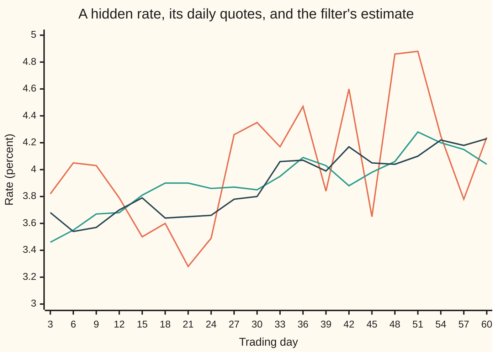
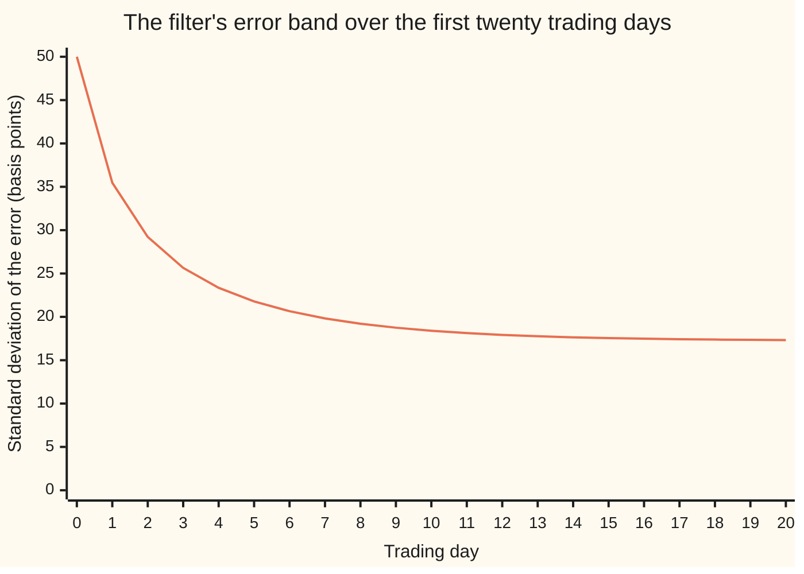

# Filtering: estimating a hidden state from noisy observations in continuous time

[Syllabus](../../../SYLLABUS.md) → [Stochastic processes and calculus](../../../SYLLABUS.md#w11) → [Beyond Brownian](../../../SYLLABUS.md#w11-s09) → Filtering

---

## General Overview

A bank's true overnight funding rate is never published. Dealers quote it all day, and averaged over one trading day the quotes miss the true rate by about half a percentage point, up or down. The true rate drifts: it sits near 4 percent in the long run, is pulled back toward 4 when it strays, and is knocked about by news. The task: say at every moment where the true rate most likely is, and how sure that guess can be.

Two easy answers are both poor. Trusting the latest day's quotes leaves an error of about half a point. Ignoring them and saying "4 percent" leaves the same half point, because that is how far the rate itself wanders. The right answer blends the two. After a week of quotes the error is down to 0.22 points; after a month it settles at 0.17 points and stays there.

Estimating a hidden quantity from noisy observations, using everything seen so far and nothing later, is called **filtering**. When the hidden quantity follows a linear stochastic differential equation and the observations add normal noise, the best filter is one equation, the **Kalman-Bucy filter**: the continuous-time limit of the step-by-step Kalman filter.

**The best estimate of a hidden linear-normal state is its conditional mean, which moves like the state itself plus a gain times the surprise in each new observation; the gain is the estimate's own variance divided by the observation noise, and that variance follows a deterministic equation, the Riccati equation, fixed before any data arrives.**

**What kind of fact this is:** a theorem. The card derives the filter as the limit of the discrete Kalman filter and proves no gain in a filter of the same shape does better; the passage to the whole continuous record has its key steps here and its complete proof in Øksendal, Chapter 6. Using an Ornstein-Uhlenbeck equation for a real funding rate is a model.

### The picture: sixty trading days of one hidden rate



Orange: that day's average quote, every third trading day, jumping between 3.28 and 4.88 percent. Green: the true rate, never seen by the filter, climbing from 3.46. Dark blue: the filter's estimate, close to green while ignoring most orange jumps. One sample path: seed 20260930, ten grid steps per trading day; another seed draws another path.

---

## The formula

Notation first, in words. Time $t$ is in years, with 250 trading days a year, so one day is $\Delta$ = 1/250 = 0.004 years. The hidden rate at time $t$ is $X_t$, in percentage points. It follows the Ornstein-Uhlenbeck equation of [Mean reversion](../06-Ito%20Calculus/05-ornstein-uhlenbeck-and-cir-processes.md):

$$dX_t = -a\,(X_t - \theta)\,dt + \sigma\,dW_t .$$

Here $a$ = 2 a year is the pull's speed, $\theta$ = 4 percent the long-run level, and $\sigma$ = 1 point per root-year the size of the news shocks. $W_t$ is Brownian motion, the random walk seen from far away; $dW_t$ is shorthand for an Ito integral, never a derivative, because the path has none. The quotes form a running total $Y_t$, each quote weighted by the time it covered:

$$dY_t = X_t\,dt + \rho\,dB_t .$$

**Read it aloud:** over the next instant, the quote total grows by the true rate times the instant, plus noise. $B_t$ is a second Brownian motion, independent of $W_t$, and $\rho$ sets the size of the quote noise. One day's average quote is the day's average rate plus an error of standard deviation $\rho/\sqrt{\Delta}$, here $s$ = 0.5 points, so $\rho^2 = s^2\Delta$ = 0.001.

"What the quotes have shown by time $t$" is the filtration of the quotes, $\mathcal{F}^Y_t$ ([Filtrations](../01-Random%20Walks%20and%20Filtrations/03-filtrations-and-information.md)). The filter is the conditional mean and variance given it:

$$m_t = E[X_t \mid \mathcal{F}^Y_t], \qquad P_t = E[(X_t - m_t)^2] .$$

The **Kalman-Bucy filter** says they obey

$$dm_t = -a\,(m_t - \theta)\,dt + K_t\,(dY_t - m_t\,dt), \qquad K_t = \frac{P_t}{\rho^2},$$

$$\frac{dP_t}{dt} = -2a\,P_t + \sigma^2 - \frac{P_t^2}{\rho^2} .$$

**Read it aloud:** the estimate drifts as the rate would, nudged by the gain times the surprise, the new quote minus what was expected; the uncertainty is drained by the pull, filled by the rate's noise, and drained again by the quotes.

The second is the **Riccati equation**: a differential equation whose right side is quadratic in the unknown. That right side is zero at two roots, $P_+$ and $P_-$, and the solution from $P_0$ is

$$P_t = \frac{P_+ - P_-\,c\,e^{-2\lambda t}}{1 - c\,e^{-2\lambda t}}, \qquad \lambda = \sqrt{a^2 + \sigma^2/\rho^2}, \quad P_\pm = \rho^2(\pm\lambda - a), \quad c = \frac{P_0 - P_+}{P_0 - P_-} .$$

In the long run $P_t$ settles at $P_\infty = P_+$ = 0.029686, a standard deviation of 0.1723 points, and the gain at $K_\infty = \lambda - a$ = 29.685959 a year.

| Symbol | Plain meaning | In our example | Push it up and the answer… |
| --- | --- | --- | --- |
| $t$, $\Delta$ | time in years; one trading day | $\Delta$ = 0.004 | — |
| $X_t$, $X$, $X_0$ | the hidden rate, percentage points; at the start | starts near 4 | — |
| $a$, $\theta$, $\sigma$ | pull speed per year; long-run level; the rate's noise, points per root-year | 2; 4; 1 | larger $\sigma$: larger $P_\infty$ and gain |
| $W_t$, $dW_t$, $B_t$, $W$, $B$ | independent Brownian motions: rate shocks, quote noise | one draw each per grid step | — |
| $Y_t$, $dY_t$, $Y$ | the running quote total; its increment | — | — |
| $s$, $\rho$ | one day's quote error; quote noise per root-year, $\rho = s\sqrt{\Delta}$ | 0.5; $\rho^2$ = 0.001 | larger: smaller gain, larger $P_\infty$ |
| $\mathcal{F}^Y_t$ | what the quotes have shown by time $t$ | — | — |
| $m_t$, $m_0$, $m$ | the estimate, the conditional mean; at the start; at one step | $m_0$ = 4 | — |
| $P_t$, $P_0$, $P_\infty$, $P$ | its error variance; at the start; long run; at one step | 0.25 falling to 0.029686 | — |
| $K_t$, $K$ | the gain $P_t/\rho^2$, per year; any gain | 250 at the start, then 29.685959 | too large or too small raises the error |
| $\lambda$, $P_+$, $P_-$, $c$ | forgetting rate; the Riccati roots; the start's distance from them | 31.685959; 0.029686, −0.033686; 0.776612 | — |
| $h$, $R$ | the step between quotes, in years; the error variance of one step's average quote, $\rho^2/h$ | $h$ = 0.004 (one a day), $R$ = 0.25 | smaller $h$: larger $R$, the same information per year |
| $\varphi$, $q_h$ | one step's shrink of the gap to $\theta$, $e^{-ah}$; the variance that step's news adds | — | — |
| $k$, $y$ | the discrete gain $P/(P+R)$; one step's average quote | — | — |
| $u$, $f$ | Step 4's ratio $(P - P_+)/(P - P_-)$; the Riccati right side as a function of $P$ | $u$ starts at $c$ = 0.776612 | — |
| $e_t$, $v$ | a filter's error $X_t - m_t$; a fixed gain's long-run error variance | $v$ = 0.029686 at the best fixed gain | — |
| $r$ | a quote's age, in years | — | older: less weight |
| $n$, $t_j$, $\mathcal{G}_n$, $\Pi_n$ | the Detailed proof's number of grid steps; the grid times; what the grid's quote increments show; the variance left given them | — | larger $n$: $\Pi_n$ falls toward $P_t$ |

### When it holds

- **A linear state equation.** A pull like $-a(X_t-\theta)^3$ makes the conditional law not normal, so no two-number summary is exact; the extended Kalman filter linearises and accepts an error.
- **Normal noise in both equations.** That lets a mean and a variance carry the whole conditional law. With jumpy noise this is still the best *linear* filter, not the best filter.
- **Observations linear in the state, with noise that never vanishes.** At $\rho = 0$ the gain is infinite: the rate is read off exactly.
- **The model's numbers are right.** The gain is fixed by $a$, $\sigma$ and $\rho$ before any quote arrives; a wrong model gives a wrong gain and a false error band, as the usual mistake below shows.

---

## Why it works

### Step 0: normal in, normal out

The rate is linear in its normal shocks and the quotes are linear in the rate plus normal noise, so rate and quotes are jointly normal. The rate given the quotes is then normal, fixed by its mean and variance: filtering reduces to tracking $m_t$ and $P_t$. The plan: build the discrete Kalman filter one quote at a time, then shrink the time between quotes to zero.

### Step 1: one quote is a regression

Before a quote, the rate has mean $m$ and variance $P$. A quote $y = X + \text{error}$ arrives, with error variance $R$, independent of the rate. The best guess of $X$ given $y$ is a straight line in $y$ with slope $k = \operatorname{Cov}(X, y)/\operatorname{Var}(y)$, exactly as in least squares ([Multiple regression](../../09-Probability%20and%20statistics/09-Regression/03-multiple-regression-and-gauss-markov.md)): the filter's gain is a regression coefficient. Here $\operatorname{Cov}(X, y) = P$ and $\operatorname{Var}(y) = P + R$, so

$$m^{\text{new}} = m + k\,(y - m), \qquad k = \frac{P}{P+R}, \qquad P^{\text{new}} = (1-k)\,P = \frac{PR}{P+R} .$$

Why this is the conditional mean, not just the best straight line: the leftover $X - m - k(y - m)$ has zero correlation with $y$ by the choice of $k$, and jointly normal variables with zero correlation are independent ([Bivariate normal](../../09-Probability%20and%20statistics/05-Transformations%20and%20Joint%20Laws/05-bivariate-normal-and-conditioning.md)), so the quote says nothing more about the leftover. Its variance is $P - P^2/(P+R)$, which does not depend on $y$: the uncertainty after a quote is known before the quote is seen.

### Step 2: time passes between quotes

Over a step $h$ the Ornstein-Uhlenbeck card gives the rate's exact move: the gap to $\theta$ shrinks by $\varphi = e^{-ah}$, and fresh noise adds variance $q_h = \sigma^2(1-\varphi^2)/(2a)$. So the prediction is

$$m \to \theta + \varphi\,(m - \theta), \qquad P \to \varphi^2 P + q_h .$$

Predict, update, predict again: that is the discrete Kalman filter. It is the forward algorithm of [Hidden Markov models](../03-Markov%20Chains/08-hidden-markov-models.md) with a normal law in place of a table of chances.

### Step 3: shrink the step

Now quote more often. With a quote every $h$ years, the step's average quote is $y = X + \text{error}$ with error variance $R = \rho^2/h$: half the step, twice the noise variance per quote, the same information per unit of time. To first order in $h$:

- the update: $PR/(P+R) = P - P^2/(P+R)$, and $P + R = \rho^2/h + P$, so the update removes $P^2 h/\rho^2$;
- the prediction: $\varphi^2 = 1 - 2ah + \dots$ and $q_h = \sigma^2 h + \dots$, so it adds $(\sigma^2 - 2aP)\,h$.

Divide the net change by $h$ and let $h \to 0$:

$$\frac{dP_t}{dt} = -2aP_t + \sigma^2 - \frac{P_t^2}{\rho^2} .$$

The mean works the same way. The discrete gain is $k = P/(P + \rho^2/h) = (P/\rho^2)\,h + \dots$, and $y\,h$ is the increment $dY_t$. So $k(y - m) \approx (P/\rho^2)(dY_t - m\,dt)$; add the prediction's $-a(m-\theta)\,dt$ and that is the filter equation. At 1, 10, 100 and 1000 quotes a day, the discrete variance at day 5 misses the Riccati value by 0.00152736, 0.00016114, 0.00001620, 0.00000162: ten times closer for ten times the quotes, a first-order limit.

### Step 4: solve the Riccati equation

The right side is $-\tfrac{1}{\rho^2}(P - P_+)(P - P_-)$, with roots $P_\pm = \rho^2(\pm\lambda - a)$. Then the ratio $u = (P - P_+)/(P - P_-)$ obeys $u' = -2\lambda\,u$, because the two factors' rates differ by $(P_+ - P_-)/\rho^2 = 2\lambda$. So $u$ decays like $e^{-2\lambda t}$, which solved for $P$ is the formula on this card. As $t$ grows, $P_t \to P_+$: 0.029686 here.

<details>
<summary>The algebra behind Step 4</summary>

With $f(P) = -\tfrac{1}{\rho^2}(P-P_+)(P-P_-)$: $u' = \dfrac{P'(P-P_-) - (P-P_+)P'}{(P-P_-)^2} = \dfrac{(P_+ - P_-)\,P'}{(P-P_-)^2} = -\dfrac{P_+ - P_-}{\rho^2}\,u = -2\lambda u$. So $u_t = c\,e^{-2\lambda t}$ with $c = u_0$, and $P = (P_+ - P_- u)/(1 - u)$. Expanding the product checks the roots: $(P-P_+)(P-P_-) = P^2 - (P_+ + P_-)P + P_+P_- = P^2 + 2a\rho^2 P - \sigma^2\rho^2$, since $P_+ + P_- = -2a\rho^2$ and $P_+P_- = \rho^4(a^2 - \lambda^2) = -\sigma^2\rho^2$.

</details>

### Step 5: why this gain and no other

A second road, with no limits taken. Take any filter of the same shape with gain $K_t$, and write $e_t = X_t - m_t$ for its error. Subtracting the filter equation from the state equation:

$$de_t = -(a + K_t)\,e_t\,dt + \sigma\,dW_t - K_t\,\rho\,dB_t .$$

Ito's lemma ([Ito's lemma](../06-Ito%20Calculus/02-itos-lemma.md)) on $e_t^2$ adds the squared noise sizes, $\sigma^2 + K_t^2\rho^2$, because the two Brownian motions are independent. Take expectations, where the Ito integrals have mean zero:

$$\frac{d}{dt}E[e_t^2] = -2(a + K_t)\,E[e_t^2] + \sigma^2 + K_t^2\rho^2 .$$

The gain drains error at rate $2K_t$ and pours in quote noise $K_t^2\rho^2$. The right side is a parabola in $K_t$, smallest at $K_t = E[e_t^2]/\rho^2$; put that in and it is the Riccati equation again. So the Kalman-Bucy gain makes the error variance fall as fast as any gain can, at every instant.

That is a statement about one instant; the whole path follows by comparing two differential equations. Both variances start at $P_0$. For any gain, the rate of change of $E[e_t^2]$ is at least the Riccati right side evaluated at $E[e_t^2]$; for $P_t$ it is exactly the right side at $P_t$. Subtracting, the gap $E[e_t^2] - P_t$ starts at zero, and its rate of change is at least $-\big(2a + (E[e_t^2] + P_t)/\rho^2\big)$ times the gap itself. So the gap, multiplied by a positive factor that grows over time, never decreases: it stays at or above zero. No fixed or time-varying gain of this shape ever beats $P_t$.

A fixed gain $K$ settles where the right side is zero: $v(K) = (\sigma^2 + K^2\rho^2)/(2(a+K))$. A golden-section search lands on 29.685959 a year, which is $\lambda - a$, with $v$ = 0.029686 = $P_\infty$. Gain 0, ignoring the quotes, gives 0.250000; gain 1000 a year gives 0.499501, because it chases quote noise.

### Step 6: what the filter remembers

In the long run the estimate's own pull is $a + K_\infty = \lambda$, so $m_t$ is an exponentially weighted average of past quotes and $\theta$: a quote $r$ years old carries weight proportional to $e^{-\lambda r}$. The memory $1/\lambda$ is 7.8899 trading days; longer would average away more noise but lag the rate. The surprise $dY_t - m_t\,dt$ is the **innovation**: the part of each quote the past could not predict.

<details>
<summary>Detailed proof</summary>

**Claim.** Under the two equations of The formula, with $X_0$ normal (mean $m_0$, variance $P_0$) and independent of $W$ and $B$, the conditional mean $E[X_t \mid \mathcal{F}^Y_t]$ solves the filter equation and the conditional variance is the deterministic $P_t$ of the Riccati equation.

**1. Finite grids give exact linear conditioning.** Fix $t$ and a grid $0 = t_0 < \dots < t_n = t$. $X_t$ and the increments $Y_{t_{j+1}} - Y_{t_j}$ are jointly normal, being linear in the normal start and the two Brownian motions. Let $\mathcal{G}_n$ be the sigma-algebra the increments generate. By Step 1's argument in many dimensions, $E[X_t \mid \mathcal{G}_n]$ is linear in them and the conditional variance $\Pi_n$ is a number, not random.

**2. Finer grids, more information.** On dyadic grids, each refining the last, $\mathcal{G}_n$ grows with $n$. $Y$ has continuous paths, so its dyadic values fix the path on $[0, t]$, and the $\mathcal{G}_n$ together generate $\mathcal{F}^Y_t$. The sequence $E[X_t \mid \mathcal{G}_n]$ is a martingale bounded in mean square, so by martingale convergence ([Martingale convergence](../02-Martingales/04-martingale-convergence.md)) it converges in mean square to $E[X_t \mid \mathcal{F}^Y_t]$, and $\Pi_n$ decreases to the conditional variance given $\mathcal{F}^Y_t$, again a number.

**3. The limit is the filter.** On each grid, Steps 1 and 2 compute the conditional law, up to a term of order $h$ from the gap between a step's average rate and its end rate. Step 3 shows the recursions converge to the two filter equations as $h \to 0$, and Step 5 shows no filter of that shape beats $P_t$.

**Left to the source.** Bounding the order-$h$ terms uniformly, and showing the innovation $(Y_t - \int_0^t m_u\,du)/\rho$ is a Brownian motion for $\mathcal{F}^Y_t$: Øksendal, Chapter 6, proves the one-dimensional filter in full; Bain and Crisan, Chapter 6, the many-dimensional one. $\blacksquare$

</details>

---

## Worked numbers, by hand

The rate: $a$ = 2 a year, $\theta$ = 4 percent, $\sigma$ = 1 point per root-year, long-run variance $\sigma^2/(2a)$ = 0.25. The quotes: $s$ = 0.5, $\Delta$ = 0.004, $\rho^2$ = 0.001. The filter starts at $m_0$ = 4, $P_0$ = 0.25: before any quote, only the long-run spread is known.

| Step | Arithmetic | Value |
| --- | --- | --- |
| noise ratio | $\sigma^2/\rho^2$ = 1 / 0.001 | 1000.0 |
| forgetting rate $\lambda$ | square root of 2 × 2 + 1000 = square root of 1004.0 | 31.685959 a year |
| memory in trading days | 250 / 31.685959 | 7.8899 |
| **steady variance $P_\infty$** | 0.001 × (31.685959 − 2) | **0.029686** |
| steady standard deviation | square root of 0.029686 | 0.1723 points |
| steady gain $K_\infty$ | 31.685959 − 2 | 29.685959 a year |
| lower root $P_-$ | −0.001 × (31.685959 + 2) | −0.033686 |
| start's distance, $c$ | (0.25 − 0.029686) / (0.25 + 0.033686) = 0.220314 / 0.283686 | 0.776612 |
| day 5: $2\lambda t$ | 2 × 31.685959 × 0.02 | 1.267438 |
| day 5: $c\,e^{-2\lambda t}$ | 0.776612 × 0.281552 | 0.218657 |
| **day 5: $P_t$** | (0.029686 + 0.033686 × 0.218657) / (1 − 0.218657) | **0.047420, sd 0.2178 points** |

After five trading days the estimate is within about 0.22 points of the true rate, two times in three. After a month it is within 0.17 points and gets no better: the rate moves on as fast as the quotes pin it down. The steady variance is one day's quote variance, 0.25, divided by 8.4215: worth 8.4 days of quotes on a rate that never moved.

### What breaks if you drop a piece

| Mistake | Comes out at | What went wrong |
| --- | --- | --- |
| $s^2$ = 0.25 in place of $\rho^2$ = 0.001 | gain 0.828427 a year, error variance 0.176898 | $\rho^2 = s^2\Delta$ is per unit time; the quotes get far too little trust |
| Filter told the rate has no shocks ($\sigma$ = 0) | claims 0.000073 after a year; truly 0.221714 | Its gain falls to nearly zero while the rate moves on |
| Trusting the latest day's quotes | 0.253259 ± 0.008292, simulated | One day's noise, 0.25, plus the rate's move within the day |
| Fixed gain 1000 a year | 0.499501 | Chases quote noise: worse than ignoring the quotes, 0.250000 |

The code prints every row.

---

## How the uncertainty settles

The mystery: the error band does not depend on the quotes. $P_t$ comes from the Riccati equation, which holds $a$, $\sigma$ and $\rho$ and no data. Two desks running the same model on different quote streams report the same band every day.

The first day of quotes halves the variance, from 0.250000 to 0.125829. Day 10 reaches 0.033843 and day 20 0.029997, within a hair of the steady 0.029686: the ratio $u$ of Step 4 falls by the same factor, $e^{-2\lambda\Delta}$, every day.



Orange: the square root of $P_t$ from the closed form, in basis points (hundredths of a percentage point), falling from 50.00 to 17.32. The same curve serves every quote stream.

A desk reading one point-in-time quote at each close, error 0.5, runs Steps 1 and 2 with $h = \Delta$: its steady variance saw-tooths between 0.027973 after each quote and 0.031497 before the next, around the continuous 0.029686.

---

## Code, from first principles, and it actually runs

Five roads. One: the closed form for $P_t$. Two: the Riccati equation solved by a Runge-Kutta stepper, with no solution formula. Three: the discrete Kalman filter at 1, 10, 100 and 1000 quotes a day, its error printed shrinking. Four: a golden-section search for the best fixed gain, using only Step 5's error equation. Five: 2000 simulated years, ten grid steps per trading day, from a SplitMix64 generator (seed 20260930) and Box-Muller normals, each error variance with its standard error. The asserts match roads one and two to twelve decimals on every day after the start, the discrete error falling about tenfold per step, the daily filter's saw-tooth as a fixed point, the golden-section gain to $\lambda - a$, and each simulated number to its formula within 4 standard errors, including the extra error of a filter run at 1.5 times the gain on the same draws.

### Python

```python
# Kalman-Bucy filter -- the check behind the card.  Only math is imported.
# A hidden rate X_t (percentage points, t in years) follows dX = -A (X - TH) dt + SIG dW.
# Quotes arrive as dY = X dt + RHO dB: one trading day's quotes average to the rate plus an
# error of S_Q = 0.5 points.  Roads: the Riccati equation's closed form; the same equation by
# RK4; the discrete Kalman filter with shrinking steps; the best constant gain by golden
# section; 2000 simulated years from a SplitMix64 generator and Box-Muller normals.
import math

A, TH, SIG, S_Q, DAY = 2.0, 4.0, 1.0, 0.5, 1 / 250      # per year, points, points/sqrt(yr), points, years
RHO2, P0, M0 = S_Q * S_Q * DAY, SIG * SIG / (2 * A), TH  # quote noise rho^2; prior variance and mean
LAM = math.sqrt(A * A + SIG * SIG / RHO2)               # the filter's forgetting rate, per year
PP, PM = RHO2 * (LAM - A), -RHO2 * (LAM + A)            # the two roots of the Riccati right side
SEED, MASK, PATHS, SUB = 20260930, (1 << 64) - 1, 2000, 10    # 10 simulation steps per trading day

def p_closed(t):                        # Riccati solution: (P - PP)/(P - PM) decays like e^(-2 LAM t)
    c = (P0 - PP) / (P0 - PM) * math.exp(-2 * LAM * t)
    return (PP - PM * c) / (1 - c)

def ric(p, sig2): return -2 * A * p + sig2 - p * p / RHO2

def rk4(f, y, t, n=4000):               # integrate y' = f(y) from 0 to t; y is a tuple
    h = t / n
    for _ in range(n):
        k1 = f(y); k2 = f(tuple(a + h / 2 * b for a, b in zip(y, k1)))
        k3 = f(tuple(a + h / 2 * b for a, b in zip(y, k2))); k4 = f(tuple(a + h * b for a, b in zip(y, k3)))
        y = tuple(a + h / 6 * (b + 2 * c + 2 * d + e) for a, b, c, d, e in zip(y, k1, k2, k3, k4))
    return y

def discrete_kf(h, t):                  # predict with the exact OU step, update on y = x + noise, R = RHO2/h
    phi, p, r = math.exp(-A * h), P0, RHO2 / h
    q = SIG * SIG * (1 - phi * phi) / (2 * A)
    for _ in range(round(t / h)):
        p = phi * phi * p + q
        p = p * r / (p + r)
    return p

def v_const(k): return (SIG * SIG + k * k * RHO2) / (2 * (A + k))   # steady error variance, fixed gain k

class SplitMix64:                       # the wing's generator, written out
    def __init__(self, seed): self.s = seed & MASK
    def uniform(self):
        self.s = (self.s + 0x9E3779B97F4A7C15) & MASK
        z = self.s
        z = ((z ^ (z >> 30)) * 0xBF58476D1CE4E5B9) & MASK
        z = ((z ^ (z >> 27)) * 0x94D049BB133111EB) & MASK
        return ((z ^ (z >> 31)) >> 11) / 9007199254740992.0
    def normal(self):                   # Box-Muller, cosine half only
        u1, u2 = 1.0 - self.uniform(), self.uniform()
        return math.sqrt(-2.0 * math.log(u1)) * math.cos(2.0 * math.pi * u2)

def total(xs):                          # plain left-to-right sum (Python's sum() compensates)
    s = 0.0
    for x in xs: s += x
    return s

def mse(xs):                            # mean of squared errors and its standard error
    n = len(xs); m = total(xs) / n
    return m, math.sqrt(total([(x - m) * (x - m) for x in xs]) / (n - 1) / n)

print(f"pull A {A}/yr, level {TH}, noise {SIG}, quote error {S_Q} per day, rho^2 {RHO2:.6f}, prior var {P0:.4f}")
print(f"forgetting rate lambda {LAM:.6f}/yr = 1 / {250 / LAM:.4f} trading days; roots {PP:.6f}, {PM:.6f}")
print(f"one trading day {DAY:.3f} years; gain at the start P0/rho^2 {P0 / RHO2:.1f}/yr")
print(f"steady state: P {PP:.6f}, sd {math.sqrt(PP):.4f} points, gain K {PP / RHO2:.6f}/yr, worth {S_Q * S_Q / PP:.4f} days of quotes")
print(f"hand: sigma^2/rho^2 {SIG * SIG / RHO2:.1f}, a^2 + that {A * A + SIG * SIG / RHO2:.1f}, P0 - PP {P0 - PP:.6f}, P0 - PM {P0 - PM:.6f}, c {(P0 - PP) / (P0 - PM):.6f}")
e5 = math.exp(-2 * LAM * 5 * DAY); c5 = (P0 - PP) / (P0 - PM) * e5
print(f"hand, day 5: 2 lambda t {2 * LAM * 5 * DAY:.6f}, e^-that {e5:.6f}, c e^-that {c5:.6f}, P {(PP - PM * c5) / (1 - c5):.6f}")
for d in (0, 1, 2, 5, 10, 20, 250):
    t = d * DAY
    (pr,) = rk4(lambda y: (ric(y[0], SIG * SIG),), (P0,), t) if d else (P0,)
    print(f"day {d:3d}: P closed {p_closed(t):.6f}, RK4 {pr:.6f}, sd {math.sqrt(p_closed(t)):.4f} points")
    if d: assert abs(pr - p_closed(t)) < 1e-12              # day 0 is the start itself: nothing to test
errs = []
for n in (1, 10, 100, 1000):
    pd = discrete_kf(DAY / n, 5 * DAY)
    errs.append(abs(pd - p_closed(5 * DAY)))
    print(f"discrete filter, {n:4d} quotes a day: P at day 5 {pd:.8f}, off by {errs[-1]:.8f}")
assert errs[3] < errs[2] / 5 < errs[1] / 25 < errs[0] / 125
dd = discrete_kf(DAY, 1.0); pb = math.exp(-2 * A * DAY) * dd + SIG * SIG * (1 - math.exp(-2 * A * DAY)) / (2 * A)
print(f"discrete daily filter, steady after-quote P {dd:.6f}; before the quote {pb:.6f}")
assert abs(pb * S_Q * S_Q / (pb + S_Q * S_Q) - dd) < 1e-12 and dd < PP < pb   # a fixed point, around the continuous P
lo, hi, gr = 0.0, 200.0, (math.sqrt(5) - 1) / 2          # golden section for the best fixed gain
for _ in range(200):
    k1, k2 = hi - gr * (hi - lo), lo + gr * (hi - lo)
    lo, hi = (lo, k2) if v_const(k1) < v_const(k2) else (k1, hi)
print(f"best fixed gain by golden section {lo:.6f}/yr, error var {v_const(lo):.6f}; gain x rho^2 {lo * RHO2:.6f}")
assert abs(lo - (LAM - A)) < 1e-6 and abs(v_const(lo) - PP) < 1e-12
for k in (0.0, 10.0, 100.0, 1000.0):
    print(f"fixed gain {k:6.1f}/yr: steady error var {v_const(k):.6f}")
lw = math.sqrt(A * A + SIG * SIG / (S_Q * S_Q))           # mistake: per-quote variance in place of rho^2
print(f"mistake, S_Q^2 in place of rho^2: gain {lw - A:.6f}/yr, steady error var {v_const(lw - A):.6f}")
for sq, sg in ((1.0, SIG), (S_Q, 2.0)):                 # try changing: noisier quotes; a livelier rate
    r2 = sq * sq * DAY; lt = math.sqrt(A * A + sg * sg / r2)
    print(f"try: quote error {sq}, noise {sg}: lambda {lt:.4f}, memory {250 / lt:.2f} days, gain {lt - A:.4f}, P {r2 * (lt - A):.6f}, sd {math.sqrt(r2 * (lt - A)):.4f}")
still = lambda y: (-2 * A * y[0] - y[0] * y[0] / RHO2,  # filter's own P if it assumes SIG = 0,
                   -2 * (A + y[0] / RHO2) * y[1] + SIG * SIG + (y[0] / RHO2) * (y[0] / RHO2) * RHO2)  # and its true error
s_own, s_true = rk4(still, (P0, P0), 1.0, 40000)
print(f"filter assuming no shocks (SIG = 0), at 1 year: claims var {s_own:.6f}, true error var {s_true:.6f}")
wide = lambda y: (ric(y[0], SIG * SIG), -2 * (A + 1.5 * y[0] / RHO2) * y[1] + SIG * SIG + (1.5 * y[0] / RHO2) * (1.5 * y[0] / RHO2) * RHO2)
w_true = rk4(wide, (P0, P0), 1.0, 40000)[1]             # true error of a filter run at 1.5 times the gain
print(f"filter at 1.5 times the Kalman-Bucy gain, at 1 year: true error var {w_true:.6f}")

g = SplitMix64(SEED)
dt, steps = DAY / SUB, 250 * SUB
phi = math.exp(-A * dt); q = math.sqrt(SIG * SIG * (1 - phi * phi) / (2 * A))
c0 = 1 / P0 + 1 / (2 * A * RHO2)                         # no-shock P in closed form: 1/P is linear in e^(2At)
gain = [p_closed(k * dt) / RHO2 for k in range(steps)]
gfro = [1 / (c0 * math.exp(2 * A * k * dt) - 1 / (2 * A * RHO2)) / RHO2 for k in range(steps)]
kal, quote, lvl, frozen, early, bias, fig, worse = [], [], [], [], [], [], [], []
for p in range(PATHS):
    x = TH + math.sqrt(P0) * g.normal()
    m, mf, mw, ydays = M0, M0, M0, 0.0
    for k in range(steps):
        dy = x * dt + math.sqrt(RHO2 * dt) * g.normal()
        m += -A * (m - TH) * dt + gain[k] * (dy - m * dt)
        mf += -A * (mf - TH) * dt + gfro[k] * (dy - mf * dt)
        mw += -A * (mw - TH) * dt + 1.5 * gain[k] * (dy - mw * dt)
        ydays += dy
        x = TH + phi * (x - TH) + q * g.normal()
        if (k + 1) % SUB == 0:
            qd, ydays = ydays / DAY, 0.0
            if (k + 1) // SUB == 5: early.append((x - m) * (x - m))
            if p == 0 and ((k + 1) // SUB) % 3 == 0 and (k + 1) // SUB <= 60: fig.append((x, qd, m))
    kal.append((x - m) * (x - m)); quote.append((x - qd) * (x - qd)); lvl.append((x - TH) * (x - TH))
    frozen.append((x - mf) * (x - mf)); bias.append(x - m); worse.append((x - mw) * (x - mw) - (x - m) * (x - m))
for lab, xs, ref in (("Kalman-Bucy at day 5", early, p_closed(5 * DAY)), ("Kalman-Bucy at 1 year", kal, p_closed(1.0)),
                     ("latest daily quote", quote, S_Q * S_Q + SIG * SIG * DAY / 3), ("long-run level 4", lvl, P0),
                     ("no-shock filter", frozen, s_true), ("1.5x gain minus K-B", worse, w_true - p_closed(1.0))):  # same draws
    v, se = mse(xs)
    print(f"simulated error var, {lab:21s}: {v:.6f} +- {se:.6f} (formula {ref:.6f})")
    assert abs(v - ref) < 4 * se
b, sb = total(bias) / PATHS, math.sqrt(mse(kal)[0] / PATHS)
print(f"simulated mean error at 1 year {b:.4f} +- {sb:.4f} points")
assert abs(b) < 4 * sb
print("figure, trading day: " + ", ".join(str(3 * i + 3) for i in range(len(fig))))
print("figure, true rate: " + ", ".join(f"{r[0]:.2f}" for r in fig))
print("figure, daily quote: " + ", ".join(f"{r[1]:.2f}" for r in fig))
print("figure, filter estimate: " + ", ".join(f"{r[2]:.2f}" for r in fig))
print("figure, sd in basis points by day 0..20: " + ", ".join(f"{100 * math.sqrt(p_closed(d * DAY)):.2f}" for d in range(21)))
print("ALL CHECKS PASS")
```

**Ran 2026-10-07 on macOS, Python 3.14.6, standard library only. All checks passed. Output, pasted from the run:**

```
pull A 2.0/yr, level 4.0, noise 1.0, quote error 0.5 per day, rho^2 0.001000, prior var 0.2500
forgetting rate lambda 31.685959/yr = 1 / 7.8899 trading days; roots 0.029686, -0.033686
one trading day 0.004 years; gain at the start P0/rho^2 250.0/yr
steady state: P 0.029686, sd 0.1723 points, gain K 29.685959/yr, worth 8.4215 days of quotes
hand: sigma^2/rho^2 1000.0, a^2 + that 1004.0, P0 - PP 0.220314, P0 - PM 0.283686, c 0.776612
hand, day 5: 2 lambda t 1.267438, e^-that 0.281552, c e^-that 0.218657, P 0.047420
day   0: P closed 0.250000, RK4 0.250000, sd 0.5000 points
day   1: P closed 0.125829, RK4 0.125829, sd 0.3547 points
day   2: P closed 0.085382, RK4 0.085382, sd 0.2922 points
day   5: P closed 0.047420, RK4 0.047420, sd 0.2178 points
day  10: P closed 0.033843, RK4 0.033843, sd 0.1840 points
day  20: P closed 0.029997, RK4 0.029997, sd 0.1732 points
day 250: P closed 0.029686, RK4 0.029686, sd 0.1723 points
discrete filter,    1 quotes a day: P at day 5 0.04589306, off by 0.00152736
discrete filter,   10 quotes a day: P at day 5 0.04725928, off by 0.00016114
discrete filter,  100 quotes a day: P at day 5 0.04740422, off by 0.00001620
discrete filter, 1000 quotes a day: P at day 5 0.04741879, off by 0.00000162
discrete daily filter, steady after-quote P 0.027973; before the quote 0.031497
best fixed gain by golden section 29.685959/yr, error var 0.029686; gain x rho^2 0.029686
fixed gain    0.0/yr: steady error var 0.250000
fixed gain   10.0/yr: steady error var 0.045833
fixed gain  100.0/yr: steady error var 0.053922
fixed gain 1000.0/yr: steady error var 0.499501
mistake, S_Q^2 in place of rho^2: gain 0.828427/yr, steady error var 0.176898
try: quote error 1.0, noise 1.0: lambda 15.9374, memory 15.69 days, gain 13.9374, P 0.055750, sd 0.2361
try: quote error 0.5, noise 2.0: lambda 63.2772, memory 3.95 days, gain 61.2772, P 0.061277, sd 0.2475
filter assuming no shocks (SIG = 0), at 1 year: claims var 0.000073, true error var 0.221714
filter at 1.5 times the Kalman-Bucy gain, at 1 year: true error var 0.032053
simulated error var, Kalman-Bucy at day 5 : 0.047668 +- 0.001453 (formula 0.047420)
simulated error var, Kalman-Bucy at 1 year: 0.028161 +- 0.000894 (formula 0.029686)
simulated error var, latest daily quote   : 0.253259 +- 0.008292 (formula 0.251333)
simulated error var, long-run level 4     : 0.249764 +- 0.007806 (formula 0.250000)
simulated error var, no-shock filter      : 0.221780 +- 0.007032 (formula 0.221714)
simulated error var, 1.5x gain minus K-B  : 0.002898 +- 0.000379 (formula 0.002367)
simulated mean error at 1 year 0.0050 +- 0.0038 points
figure, trading day: 3, 6, 9, 12, 15, 18, 21, 24, 27, 30, 33, 36, 39, 42, 45, 48, 51, 54, 57, 60
figure, true rate: 3.46, 3.55, 3.67, 3.68, 3.81, 3.90, 3.90, 3.86, 3.87, 3.85, 3.95, 4.09, 4.03, 3.88, 3.98, 4.06, 4.28, 4.20, 4.15, 4.04
figure, daily quote: 3.82, 4.05, 4.03, 3.79, 3.50, 3.60, 3.28, 3.49, 4.26, 4.35, 4.17, 4.47, 3.84, 4.60, 3.65, 4.86, 4.88, 4.25, 3.78, 4.24
figure, filter estimate: 3.68, 3.54, 3.57, 3.70, 3.79, 3.64, 3.65, 3.66, 3.78, 3.80, 4.06, 4.07, 3.99, 4.17, 4.05, 4.04, 4.10, 4.22, 4.18, 4.23
figure, sd in basis points by day 0..20: 50.00, 35.47, 29.22, 25.65, 23.35, 21.78, 20.65, 19.82, 19.21, 18.75, 18.40, 18.13, 17.92, 17.77, 17.64, 17.55, 17.48, 17.42, 17.38, 17.35, 17.32
ALL CHECKS PASS
```

The simulated Kalman-Bucy error at one year, 0.028161 ± 0.000894, sits 1.7 standard errors below the formula's 0.029686: an ordinary sampling draw, inside the 4 standard errors the assert allows. Averages this loose cannot tell a good gain from a poor one: a filter at 1.5 times the gain truly errs by 0.032053, under 3 standard errors away. Run on the same draws, though, the two filters share most of their noise, and the 1.5-times filter's extra error comes out at 0.002898 ± 0.000379 against the formula's 0.002367, more than six standard errors clear of zero. The mean error, 0.0050 ± 0.0038 points, is zero within its noise: the estimate is not biased.

### Rust

```rust
// Kalman-Bucy filter -- the same check as filtering_and_the_kalman_bucy_filter_check.py, in Rust.
// Standard library only, no crates.  A hidden rate X_t (percentage points, t in years) follows
// dX = -A (X - TH) dt + SIG dW; quotes arrive as dY = X dt + RHO dB.  Roads: the Riccati closed
// form; the same equation by RK4; the discrete Kalman filter with shrinking steps; the best fixed
// gain by golden section; 2000 simulated years from SplitMix64 and Box-Muller normals.
use std::f64::consts::PI;

const A: f64 = 2.0; const TH: f64 = 4.0; const SIG: f64 = 1.0; const S_Q: f64 = 0.5; const DAY: f64 = 1.0 / 250.0;
const RHO2: f64 = S_Q * S_Q * DAY; const P0: f64 = SIG * SIG / (2.0 * A); const M0: f64 = TH;
const SEED: u64 = 20260930; const PATHS: usize = 2000; const SUB: usize = 10;

fn lam() -> f64 { (A * A + SIG * SIG / RHO2).sqrt() }     // the filter's forgetting rate, per year
fn pp() -> f64 { RHO2 * (lam() - A) }
fn pm() -> f64 { -RHO2 * (lam() + A) }

fn p_closed(t: f64) -> f64 {                // (P - PP)/(P - PM) decays like e^(-2 LAM t)
    let c = (P0 - pp()) / (P0 - pm()) * (-2.0 * lam() * t).exp();
    (pp() - pm() * c) / (1.0 - c)
}

fn ric(p: f64, sig2: f64) -> f64 { -2.0 * A * p + sig2 - p * p / RHO2 }

fn rk4(f: &dyn Fn([f64; 2]) -> [f64; 2], mut y: [f64; 2], t: f64, n: usize) -> [f64; 2] {
    let h = t / n as f64;
    let step = |y: [f64; 2], k: [f64; 2], s: f64| [y[0] + s * k[0], y[1] + s * k[1]];
    for _ in 0..n {
        let k1 = f(y); let k2 = f(step(y, k1, h / 2.0));
        let k3 = f(step(y, k2, h / 2.0)); let k4 = f(step(y, k3, h));
        for i in 0..2 { y[i] = y[i] + h / 6.0 * (k1[i] + 2.0 * k2[i] + 2.0 * k3[i] + k4[i]); }
    }
    y
}

fn discrete_kf(h: f64, t: f64) -> f64 {     // exact OU predict, update on y = x + noise, R = RHO2/h
    let (phi, mut p, r) = ((-A * h).exp(), P0, RHO2 / h);
    let q = SIG * SIG * (1.0 - phi * phi) / (2.0 * A);
    for _ in 0..(t / h).round() as usize { p = phi * phi * p + q; p = p * r / (p + r); }
    p
}

fn v_const(k: f64) -> f64 { (SIG * SIG + k * k * RHO2) / (2.0 * (A + k)) }

struct SplitMix64 { s: u64 }                 // the wing's generator, written out
impl SplitMix64 {
    fn uniform(&mut self) -> f64 {
        self.s = self.s.wrapping_add(0x9E3779B97F4A7C15);
        let mut z = self.s;
        z = (z ^ (z >> 30)).wrapping_mul(0xBF58476D1CE4E5B9);
        z = (z ^ (z >> 27)).wrapping_mul(0x94D049BB133111EB);
        ((z ^ (z >> 31)) >> 11) as f64 / 9007199254740992.0
    }
    fn normal(&mut self) -> f64 {            // Box-Muller, cosine half only
        let u1 = 1.0 - self.uniform(); let u2 = self.uniform();
        (-2.0 * u1.ln()).sqrt() * (2.0 * PI * u2).cos()
    }
}

fn total(xs: &[f64]) -> f64 { let mut s = 0.0; for x in xs { s += *x; } s }

fn mse(xs: &[f64]) -> (f64, f64) {
    let n = xs.len() as f64; let m = total(xs) / n;
    let d: Vec<f64> = xs.iter().map(|x| (x - m) * (x - m)).collect();
    (m, (total(&d) / (n - 1.0) / n).sqrt())
}

fn main() {
    let (lm, ppv, pmv) = (lam(), pp(), pm());
    println!("pull A {:.1}/yr, level {:.1}, noise {:.1}, quote error {:.1} per day, rho^2 {:.6}, prior var {:.4}", A, TH, SIG, S_Q, RHO2, P0);
    println!("forgetting rate lambda {:.6}/yr = 1 / {:.4} trading days; roots {:.6}, {:.6}", lm, 250.0 / lm, ppv, pmv);
    println!("one trading day {:.3} years; gain at the start P0/rho^2 {:.1}/yr", DAY, P0 / RHO2);
    println!("steady state: P {:.6}, sd {:.4} points, gain K {:.6}/yr, worth {:.4} days of quotes", ppv, ppv.sqrt(), ppv / RHO2, S_Q * S_Q / ppv);
    println!("hand: sigma^2/rho^2 {:.1}, a^2 + that {:.1}, P0 - PP {:.6}, P0 - PM {:.6}, c {:.6}",
             SIG * SIG / RHO2, A * A + SIG * SIG / RHO2, P0 - ppv, P0 - pmv, (P0 - ppv) / (P0 - pmv));
    let e5 = (-2.0 * lm * 5.0 * DAY).exp(); let c5 = (P0 - ppv) / (P0 - pmv) * e5;
    println!("hand, day 5: 2 lambda t {:.6}, e^-that {:.6}, c e^-that {:.6}, P {:.6}", 2.0 * lm * 5.0 * DAY, e5, c5, (ppv - pmv * c5) / (1.0 - c5));
    for d in [0usize, 1, 2, 5, 10, 20, 250] {
        let t = d as f64 * DAY;
        let pr = if d > 0 { rk4(&|y| [ric(y[0], SIG * SIG), 0.0], [P0, 0.0], t, 4000)[0] } else { P0 };
        println!("day {:3}: P closed {:.6}, RK4 {:.6}, sd {:.4} points", d, p_closed(t), pr, p_closed(t).sqrt());
        if d > 0 { assert!((pr - p_closed(t)).abs() < 1e-12); }   // day 0 is the start itself
    }
    let mut errs = vec![];
    for n in [1usize, 10, 100, 1000] {
        let pd = discrete_kf(DAY / n as f64, 5.0 * DAY);
        errs.push((pd - p_closed(5.0 * DAY)).abs());
        println!("discrete filter, {:4} quotes a day: P at day 5 {:.8}, off by {:.8}", n, pd, errs[errs.len() - 1]);
    }
    assert!(errs[3] < errs[2] / 5.0 && errs[2] / 5.0 < errs[1] / 25.0 && errs[1] / 25.0 < errs[0] / 125.0);
    let dd = discrete_kf(DAY, 1.0);
    let pb = (-2.0 * A * DAY).exp() * dd + SIG * SIG * (1.0 - (-2.0 * A * DAY).exp()) / (2.0 * A);
    println!("discrete daily filter, steady after-quote P {:.6}; before the quote {:.6}", dd, pb);
    assert!((pb * S_Q * S_Q / (pb + S_Q * S_Q) - dd).abs() < 1e-12 && dd < ppv && ppv < pb);
    let (mut lo, mut hi, gr) = (0.0f64, 200.0f64, (5f64.sqrt() - 1.0) / 2.0);
    for _ in 0..200 {
        let (k1, k2) = (hi - gr * (hi - lo), lo + gr * (hi - lo));
        if v_const(k1) < v_const(k2) { hi = k2; } else { lo = k1; }
    }
    println!("best fixed gain by golden section {:.6}/yr, error var {:.6}; gain x rho^2 {:.6}", lo, v_const(lo), lo * RHO2);
    assert!((lo - (lm - A)).abs() < 1e-6 && (v_const(lo) - ppv).abs() < 1e-12);
    for k in [0.0f64, 10.0, 100.0, 1000.0] { println!("fixed gain {:6.1}/yr: steady error var {:.6}", k, v_const(k)); }
    let lw = (A * A + SIG * SIG / (S_Q * S_Q)).sqrt();
    println!("mistake, S_Q^2 in place of rho^2: gain {:.6}/yr, steady error var {:.6}", lw - A, v_const(lw - A));
    for (sq, sg) in [(1.0f64, SIG), (S_Q, 2.0)] {
        let r2 = sq * sq * DAY; let lt = (A * A + sg * sg / r2).sqrt();
        println!("try: quote error {:.1}, noise {:.1}: lambda {:.4}, memory {:.2} days, gain {:.4}, P {:.6}, sd {:.4}", sq, sg, lt, 250.0 / lt, lt - A, r2 * (lt - A), (r2 * (lt - A)).sqrt());
    }
    let still = |y: [f64; 2]| [-2.0 * A * y[0] - y[0] * y[0] / RHO2,
                               -2.0 * (A + y[0] / RHO2) * y[1] + SIG * SIG + (y[0] / RHO2) * (y[0] / RHO2) * RHO2];
    let st = rk4(&still, [P0, P0], 1.0, 40000);
    println!("filter assuming no shocks (SIG = 0), at 1 year: claims var {:.6}, true error var {:.6}", st[0], st[1]);
    let wide = |y: [f64; 2]| [ric(y[0], SIG * SIG), -2.0 * (A + 1.5 * y[0] / RHO2) * y[1] + SIG * SIG + (1.5 * y[0] / RHO2) * (1.5 * y[0] / RHO2) * RHO2];
    let w_true = rk4(&wide, [P0, P0], 1.0, 40000)[1];      // true error of a filter run at 1.5 times the gain
    println!("filter at 1.5 times the Kalman-Bucy gain, at 1 year: true error var {:.6}", w_true);

    let mut g = SplitMix64 { s: SEED };
    let (dt, steps) = (DAY / SUB as f64, 250 * SUB);
    let phi = (-A * dt).exp(); let q = (SIG * SIG * (1.0 - phi * phi) / (2.0 * A)).sqrt();
    let c0 = 1.0 / P0 + 1.0 / (2.0 * A * RHO2);
    let gain: Vec<f64> = (0..steps).map(|k| p_closed(k as f64 * dt) / RHO2).collect();
    let gfro: Vec<f64> = (0..steps).map(|k| 1.0 / (c0 * (2.0 * A * k as f64 * dt).exp() - 1.0 / (2.0 * A * RHO2)) / RHO2).collect();
    let (mut kal, mut quote, mut lvl, mut frozen, mut early, mut bias, mut fig, mut worse) = (vec![], vec![], vec![], vec![], vec![], vec![], vec![], vec![]);
    for p in 0..PATHS {
        let mut x = TH + P0.sqrt() * g.normal();
        let (mut m, mut mf, mut mw, mut ydays, mut qd) = (M0, M0, M0, 0.0, 0.0);
        for k in 0..steps {
            let dy = x * dt + (RHO2 * dt).sqrt() * g.normal();
            m += -A * (m - TH) * dt + gain[k] * (dy - m * dt);
            mf += -A * (mf - TH) * dt + gfro[k] * (dy - mf * dt);
            mw += -A * (mw - TH) * dt + 1.5 * gain[k] * (dy - mw * dt);
            ydays += dy;
            x = TH + phi * (x - TH) + q * g.normal();
            if (k + 1) % SUB == 0 {
                qd = ydays / DAY; ydays = 0.0;
                if (k + 1) / SUB == 5 { early.push((x - m) * (x - m)); }
                if p == 0 && ((k + 1) / SUB) % 3 == 0 && (k + 1) / SUB <= 60 { fig.push((x, qd, m)); }
            }
        }
        kal.push((x - m) * (x - m)); quote.push((x - qd) * (x - qd)); lvl.push((x - TH) * (x - TH));
        frozen.push((x - mf) * (x - mf)); bias.push(x - m); worse.push((x - mw) * (x - mw) - (x - m) * (x - m));
    }
    let rows: [(&str, &Vec<f64>, f64); 6] = [("Kalman-Bucy at day 5", &early, p_closed(5.0 * DAY)), ("Kalman-Bucy at 1 year", &kal, p_closed(1.0)),
        ("latest daily quote", &quote, S_Q * S_Q + SIG * SIG * DAY / 3.0), ("long-run level 4", &lvl, P0), ("no-shock filter", &frozen, st[1]),
        ("1.5x gain minus K-B", &worse, w_true - p_closed(1.0))];   // same draws
    for (lab, xs, rf) in rows.iter() {
        let (v, se) = mse(xs);
        println!("simulated error var, {:21}: {:.6} +- {:.6} (formula {:.6})", lab, v, se, rf);
        assert!((v - rf).abs() < 4.0 * se);
    }
    let (b, sb) = (total(&bias) / PATHS as f64, (mse(&kal).0 / PATHS as f64).sqrt());
    println!("simulated mean error at 1 year {:.4} +- {:.4} points", b, sb);
    assert!(b.abs() < 4.0 * sb);
    let join = |v: Vec<String>| v.join(", ");
    println!("figure, trading day: {}", join((0..fig.len()).map(|i| format!("{}", 3 * i + 3)).collect()));
    println!("figure, true rate: {}", join(fig.iter().map(|r| format!("{:.2}", r.0)).collect()));
    println!("figure, daily quote: {}", join(fig.iter().map(|r| format!("{:.2}", r.1)).collect()));
    println!("figure, filter estimate: {}", join(fig.iter().map(|r| format!("{:.2}", r.2)).collect()));
    println!("figure, sd in basis points by day 0..20: {}", join((0..21).map(|d| format!("{:.2}", 100.0 * p_closed(d as f64 * DAY).sqrt())).collect()));
    println!("ALL CHECKS PASS");
}
```

**Ran 2026-10-07 on macOS, rustc 1.98.1, no crates. All checks passed. Output, pasted from the run:**

```
pull A 2.0/yr, level 4.0, noise 1.0, quote error 0.5 per day, rho^2 0.001000, prior var 0.2500
forgetting rate lambda 31.685959/yr = 1 / 7.8899 trading days; roots 0.029686, -0.033686
one trading day 0.004 years; gain at the start P0/rho^2 250.0/yr
steady state: P 0.029686, sd 0.1723 points, gain K 29.685959/yr, worth 8.4215 days of quotes
hand: sigma^2/rho^2 1000.0, a^2 + that 1004.0, P0 - PP 0.220314, P0 - PM 0.283686, c 0.776612
hand, day 5: 2 lambda t 1.267438, e^-that 0.281552, c e^-that 0.218657, P 0.047420
day   0: P closed 0.250000, RK4 0.250000, sd 0.5000 points
day   1: P closed 0.125829, RK4 0.125829, sd 0.3547 points
day   2: P closed 0.085382, RK4 0.085382, sd 0.2922 points
day   5: P closed 0.047420, RK4 0.047420, sd 0.2178 points
day  10: P closed 0.033843, RK4 0.033843, sd 0.1840 points
day  20: P closed 0.029997, RK4 0.029997, sd 0.1732 points
day 250: P closed 0.029686, RK4 0.029686, sd 0.1723 points
discrete filter,    1 quotes a day: P at day 5 0.04589306, off by 0.00152736
discrete filter,   10 quotes a day: P at day 5 0.04725928, off by 0.00016114
discrete filter,  100 quotes a day: P at day 5 0.04740422, off by 0.00001620
discrete filter, 1000 quotes a day: P at day 5 0.04741879, off by 0.00000162
discrete daily filter, steady after-quote P 0.027973; before the quote 0.031497
best fixed gain by golden section 29.685959/yr, error var 0.029686; gain x rho^2 0.029686
fixed gain    0.0/yr: steady error var 0.250000
fixed gain   10.0/yr: steady error var 0.045833
fixed gain  100.0/yr: steady error var 0.053922
fixed gain 1000.0/yr: steady error var 0.499501
mistake, S_Q^2 in place of rho^2: gain 0.828427/yr, steady error var 0.176898
try: quote error 1.0, noise 1.0: lambda 15.9374, memory 15.69 days, gain 13.9374, P 0.055750, sd 0.2361
try: quote error 0.5, noise 2.0: lambda 63.2772, memory 3.95 days, gain 61.2772, P 0.061277, sd 0.2475
filter assuming no shocks (SIG = 0), at 1 year: claims var 0.000073, true error var 0.221714
filter at 1.5 times the Kalman-Bucy gain, at 1 year: true error var 0.032053
simulated error var, Kalman-Bucy at day 5 : 0.047668 +- 0.001453 (formula 0.047420)
simulated error var, Kalman-Bucy at 1 year: 0.028161 +- 0.000894 (formula 0.029686)
simulated error var, latest daily quote   : 0.253259 +- 0.008292 (formula 0.251333)
simulated error var, long-run level 4     : 0.249764 +- 0.007806 (formula 0.250000)
simulated error var, no-shock filter      : 0.221780 +- 0.007032 (formula 0.221714)
simulated error var, 1.5x gain minus K-B  : 0.002898 +- 0.000379 (formula 0.002367)
simulated mean error at 1 year 0.0050 +- 0.0038 points
figure, trading day: 3, 6, 9, 12, 15, 18, 21, 24, 27, 30, 33, 36, 39, 42, 45, 48, 51, 54, 57, 60
figure, true rate: 3.46, 3.55, 3.67, 3.68, 3.81, 3.90, 3.90, 3.86, 3.87, 3.85, 3.95, 4.09, 4.03, 3.88, 3.98, 4.06, 4.28, 4.20, 4.15, 4.04
figure, daily quote: 3.82, 4.05, 4.03, 3.79, 3.50, 3.60, 3.28, 3.49, 4.26, 4.35, 4.17, 4.47, 3.84, 4.60, 3.65, 4.86, 4.88, 4.25, 3.78, 4.24
figure, filter estimate: 3.68, 3.54, 3.57, 3.70, 3.79, 3.64, 3.65, 3.66, 3.78, 3.80, 4.06, 4.07, 3.99, 4.17, 4.05, 4.04, 4.10, 4.22, 4.18, 4.23
figure, sd in basis points by day 0..20: 50.00, 35.47, 29.22, 25.65, 23.35, 21.78, 20.65, 19.82, 19.21, 18.75, 18.40, 18.13, 17.92, 17.77, 17.64, 17.55, 17.48, 17.42, 17.38, 17.35, 17.32
ALL CHECKS PASS
```

The two outputs agree line for line: both draw the same SplitMix64 stream and do the same arithmetic in the same order.

> [!TIP]
> **Try changing**
> - **Noisier quotes.** Guess first: does doubling the quote error double the steady error? Set `S_Q = 1.0`. The first `try` line: $P_\infty$ = 0.055750, a standard deviation of 0.2361 points against 0.1723. Not double: the memory stretches from 7.89 to 15.69 days, averaging more quotes.
> - **A livelier rate.** Guess first: more trust in the quotes or less? Set `SIG = 2.0`. The second `try` line: the gain rises from 29.685959 to 61.2772 a year and the memory falls to 3.95 days, because old quotes go stale sooner; the error rises to 0.2475 points.
> - **Wrong units.** Guess first. The `mistake` line: the per-quote variance 0.25 in place of $\rho^2$ gives gain 0.828427 a year and error variance 0.176898, against 0.029686.

---

## The usual mistake

> [!warning]
> **Believing the filter learns its own accuracy from the data.** $P_t$ comes from the model: the Riccati equation contains no data. A wrong model reports a confidence it does not have. Told the rate has no shocks, the filter claims an error variance of 0.000073 after a year; its true error variance is 0.221714. Checking that the innovations look like pure noise is how a wrong model is caught.
>
> Smaller traps:
> - **Per-quote noise in place of noise per unit time.** $\rho^2$ is $s^2\Delta$, 0.001, not $s^2$ = 0.25. The wrong one gives a gain of 0.828427 a year instead of 29.685959.
> - **Reading $dY_t/dt$ as an instantaneous quote.** It does not exist: $B_t$ has no derivative, and $dY_t$ is shorthand for an integral. Only averages over a stretch of time carry finite noise.
> - **Dropping the Ito term in Step 5.** Ordinary calculus misses the $\sigma^2 + K_t^2\rho^2$ term, leaves the error variance draining to zero, and finds no best gain at all.
> - **Filter and smoother confused.** The filter uses quotes up to now; looking back with later quotes too gives a better, smoothed estimate.

---

## Where you meet it in real life

- **Navigation.** Kalman's filter estimated the Apollo spacecraft's position; a phone blends satellite fixes with motion sensors the same way.
- **Interest-rate models.** Short rates are not observed directly. Ornstein-Uhlenbeck and Cox-Ingersoll-Ross models are fitted to bond yields through a Kalman filter, the yields serving as noisy quotes.
- **Hedge ratios that drift.** In pairs trading the ratio between two prices is a hidden state filtered from daily prices: [A moving hedge ratio](../../12-Financial%20mathematics/50-Signals%2C%20Mean%20Reversion%20and%20Backtesting/07-kalman-filter-for-dynamic-hedge-ratios.md).
- **Control under noise.** Steering a linear-normal system with a quadratic cost, seen through noisy sensors, splits in two: filter the state, then control the estimate as if it were exact. The control half is [Stochastic control](03-stochastic-control-and-the-hjb-equation.md).

> **Say it back**
> A hidden rate follows a linear equation with normal noise and is seen through quotes with normal noise. So the rate given the quotes is normal, tracked by two numbers: the estimate and its variance. Each quote moves the estimate by a gain times the surprise; the gain, variance over quote noise, is a regression coefficient. Shrinking the time between quotes turns the discrete Kalman filter into the Kalman-Bucy filter, whose variance follows the Riccati equation, fixed before any data arrives. Here it settles at 0.029686, an error of 0.17 points.

---

## What this builds on

- [Mean reversion](../06-Ito%20Calculus/05-ornstein-uhlenbeck-and-cir-processes.md): the hidden rate's equation and its exact one-step law, used in Step 2.
- [Hidden Markov models](../03-Markov%20Chains/08-hidden-markov-models.md): filtering a hidden chain by a forward recursion; this card does the same with a normal law in place of a table.
- [Multiple regression](../../09-Probability%20and%20statistics/09-Regression/03-multiple-regression-and-gauss-markov.md): the best linear predictor, whose coefficient is the gain of Step 1.

## Where this goes next

- The Kalman filter: the discrete filter with many hidden states at once, in matrices, as engineers run it.

This card tracks one hidden number with a known model; it leaves open how to track several at once and run the filter step by step on a computer, which the engineering card answers.

---

## Sources

Verified 2026-09-30: every link below resolves to the publisher's page.

- Kalman, R. E. "A New Approach to Linear Filtering and Prediction Problems." *Journal of Basic Engineering* 82, no. 1 (1960): 35–45. [doi:10.1115/1.3662552](https://doi.org/10.1115/1.3662552). The discrete filter of Steps 1 and 2.
- Kalman, R. E., and R. S. Bucy. "New Results in Linear Filtering and Prediction Theory." *Journal of Basic Engineering* 83, no. 1 (1961): 95–108. [doi:10.1115/1.3658902](https://doi.org/10.1115/1.3658902). The continuous-time filter and its Riccati equation.
- Øksendal, Bernt. *Stochastic Differential Equations: An Introduction with Applications*. 6th ed. Springer, 2003. [doi:10.1007/978-3-642-14394-6](https://doi.org/10.1007/978-3-642-14394-6). Chapter 6, "The Filtering Problem": the complete proof of the one-dimensional Kalman-Bucy filter behind the Detailed proof.
- Bain, Alan, and Dan Crisan. *Fundamentals of Stochastic Filtering*. Springer, 2009. [doi:10.1007/978-0-387-76896-0](https://doi.org/10.1007/978-0-387-76896-0). Chapter 6, "Finite-Dimensional Filters": the many-dimensional Kalman-Bucy filter from the general filtering equations.
