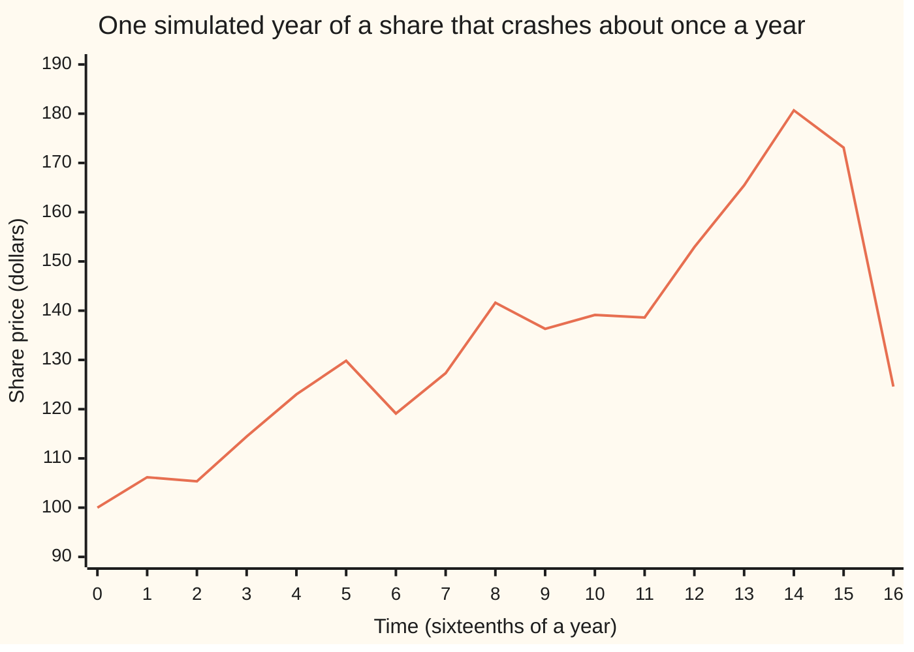

# Semimartingales: the largest class you can integrate against

[Syllabus](../../../SYLLABUS.md) → [Stochastic processes and calculus](../README.md) → [Beyond Brownian](../README.md#s09) → Semimartingales

---

## General Overview

A share trades at \$100 today. Time is measured in years. Most days the price wobbles, with a yearly volatility of 20%. About once a year, at a moment nobody can see coming, it crashes by 20% in an instant. Between crashes it climbs steadily, and the climb is just large enough that on average the share grows 5% a year. This is a jump-diffusion price ([Jump diffusions](02-jump-diffusions.md)).

A trader's gain over the year is holding times price change, added over short stretches of time. As the stretches shrink, the sum becomes an integral against the price. The Ito integral was built for Brownian motion, which never jumps. This price jumps. Which prices can be integrated against? What replaces Ito's extra term at a jump? And does the answer survive adding prices, multiplying them, applying a smooth function, or changing to a second probability measure?

One class answers all three. A **semimartingale** is a process that splits into a fair-game part and a part whose path has finite total travel. Every such process can be integrated against. Ito's formula holds for it, with one extra sum over the jumps. Every operation in the list keeps a semimartingale a semimartingale. And a theorem of Bichteler and of Dellacherie says no larger class of processes supports an integral with the basic continuity a trading gain needs.

**A semimartingale is a fair game plus a path of finite travel; its quadratic variation counts the wobble and the squared jumps, and Ito's formula for it adds one correction per jump.**

**What kind of fact this is:** a definition. Ito's formula for semimartingales and the closure properties are theorems: this card proves the key steps and the jump term, and states the rest precisely with a named source, Protter's book, chapters II and III.

### The picture: one year of the price, one crash



One sample path, simulated on a grid of 4,096 steps a year with seed 20260930 and plotted every sixteenth of a year. The crash comes at 0.9641 years; after it the price ends the year at \$124.60. The plotted line joins the points, so the crash shows as a steep segment; the real path drops in one instant. Another seed draws another path, with its crashes elsewhere or none at all.

---

## The formula

Notation first, in words. A process is written $X_t$, read "the value at time t". Its paths are **càdlàg**: right-continuous with left limits, so at each time the path has a value just before, written $X_{t-}$, and a value at, $X_t$. The **jump** at time t is $\Delta X_t = X_t - X_{t-}$, zero except at the crash instants. A **local martingale** is a process that becomes a fair game (a martingale: best forecast of later is now, [Martingales](../02-Martingales/01-martingales.md)) once it is stopped at each of a sequence of stopping times running off to infinity. A path of **finite variation** has finite total up-and-down travel over every bounded stretch of time, like the path of a function with a continuous slope.

**Definition.** A càdlàg process, adapted (its value at t is known by time t), is a semimartingale when it can be written

$$X_t = X_0 + M_t + A_t,$$

with $M_t$ a local martingale and $A_t$ an adapted process of finite variation, both starting at 0.

**Read it aloud:** the process is where it started, plus a fair-game part, plus a part whose path travels a finite distance.

The **quadratic covariation** of two semimartingales is the limit, as the grid of times gets finer, of the sum of matched products of their changes:

$$[X,Y]_t = \lim \sum_k \big(X_{t_{k+1}} - X_{t_k}\big)\big(Y_{t_{k+1}} - Y_{t_k}\big).$$

The limit is in probability, over grids from 0 to t whose longest step shrinks to zero. With $Y = X$ it is the quadratic variation $[X]_t$. It splits into a continuous part and the squared jumps:

$$[X]_t = [X]^c_t + \sum_{0 < s \le t} (\Delta X_s)^2.$$

**Ito's formula for semimartingales.** For a function f with two continuous derivatives,

$$f(X_t) = f(X_0) + \int_0^t f'(X_{s-})\,dX_s + \tfrac12 \int_0^t f''(X_{s-})\,d[X]^c_s + \sum_{0 < s \le t}\Big(f(X_s) - f(X_{s-}) - f'(X_{s-})\,\Delta X_s\Big).$$

**Read it aloud:** the function's change is the integral of its slope against the process, plus half its curvature against the continuous wobble, plus, at each jump, the exact change minus the part the slope already counted.

Taking $f(x) = x^2$ and then splitting a product into squares gives **integration by parts**:

$$X_t Y_t = X_0 Y_0 + \int_0^t X_{s-}\,dY_s + \int_0^t Y_{s-}\,dX_s + [X,Y]_t.$$

| Symbol | Plain meaning | In our example | Push it up and the answer… |
| --- | --- | --- | --- |
| $X_t$, $Y_t$ | semimartingales in general | the share price, or the price and a second asset | — |
| $M_t$, $M$ | the local martingale part: fair-game noise | the wobble plus the crashes, with their average loss added back | more noise, larger quadratic variation |
| $A_t$ | the finite-variation part: steady drift | $\mu S_{t-}$ per year, \$5 a year at \$100 | the price grows faster on average |
| $S_t$, $S_{t-}$, $S_1$ | the share price at t, just before t, and at one year | \$100 at the start, \$124.60 on the path at one year | — |
| $\Delta S_t$ | the jump at t: value at minus value just before | $j\,S_{t-}$ at a crash, 0 otherwise | — |
| $[X,Y]_t$, $[X]_t$, $[X]^c_t$ | covariation, quadratic variation, and its continuous part | $[S]_1$ is 1,842.28 on the path | Ito's correction terms grow |
| $W_t$, $dW_t$, $N_t$ | Brownian motion and its step; the number of crashes by time t | $N_1 = 1$ on the path | — |
| $\mu$, $\sigma$ | average growth rate; volatility | 0.05 and 0.20 a year | $E[S_1^2]$ rises through $2\mu + \sigma^2$ |
| $\lambda$, $j$ | crash rate; crash size as a fraction of the price | 1 a year; $-0.20$ | jump part of $[S]$ grows as $\lambda j^2$ |
| $c$ | growth rate of $E[S_t^2]$: $2\mu + \sigma^2 + \lambda j^2$ | 0.18 a year | $E[S_1^2]$ rises as $S_0^2 e^{c}$ |
| $H_t$, $h_k$, $t_k$ | the integrand: shares held, decided just before t; a simple holding from grid time $t_k$ | $S_{t-}$ for the by-parts integral | — |
| $b$, $D_k$, $I$, $\epsilon$ | in the Detailed proof: the bound on the holdings; the martingale's change over step k; the simple gain $\sum_k h_k D_k$; a fixed small size of gain | — | smaller $b$: the chance that $I$ exceeds $\epsilon$ falls |
| $f$, $f'$, $f''$ | a smooth function and its first and second derivatives | $x^2$ and $\ln x$ | — |
| $t$, $T$, $n$, $k$, $G$ | time in years; horizon; grid steps; step number; log-drift between crashes | $T = 1$; $n$ from 16 to 4,096; $G = 0.23$ | finer grid, closer to the limit |

The share's own equation, written as a semimartingale:

$$dS_t = S_{t-}\big(\mu\,dt + \sigma\,dW_t + j\,(dN_t - \lambda\,dt)\big).$$

As on [The Ito integral](../06-Ito%20Calculus/01-ito-integral.md), $dW_t$ is shorthand for an integral, never a derivative. The finite-variation part is $dA_t = \mu S_{t-}\,dt$. The local martingale part is everything else: the Brownian wobble, and the crash count minus its average, $N_t - \lambda t$, which is a fair game ([Poisson process](../04-Poisson%20and%20Jump%20Processes/01-poisson-process.md)). Between crashes the price climbs at $\mu - \lambda j = 0.25$ a year; the crashes take that back down to 0.05 on average. Solved, the path is

$$S_t = 100\, e^{G t + \sigma W_t}\,(1 + j)^{N_t}, \qquad G = \mu - \lambda j - \tfrac12\sigma^2 = 0.23.$$

### When it holds

- **The integrand is predictable: decided just before each instant.** That is why every integral above uses $X_{s-}$. Use the value at the instant instead and a crash is known before it is traded: on the path, the by-parts integral moves from 1,841.03 to 2,938.49. That 2,938.49 is $\int S_{s-}\,dS_s$ plus the squared crash, 1,097.46, because the value at an instant differs from the value just before only at a crash. A right-point grid sum peeks further, at every step's wobble too, and adds the whole of $[S]_1$.
- **The function has two continuous derivatives.** Ito's formula needs the curvature term. A function with a kink, such as a call payoff, needs a further local-time term, which this card does not treat.
- **The process is a semimartingale.** A price driven by fractional Brownian motion with a Hurst exponent (its roughness index) other than one half is not one; ordinary Ito calculus fails for it ([Rougher than Brownian](06-rough-paths-and-fractional-brownian-motion-in-outline.md)).

---

## Why it works

### Step 0: an integrator must make trading gains behave

Gains on a grid are holding times price change, added up. Write a **simple** holding: hold $h_k$ shares from grid time $t_k$ to $t_{k+1}$, with $h_k$ decided at $t_k$. The gain is $\sum_k h_k\,(X_{t_{k+1}} - X_{t_k})$. To pass from these sums to an integral, small holdings must give small gains: if the holdings shrink to zero uniformly, the gains must shrink to zero in probability. A process with that property is a **good integrator**. Everything else on this card is built for this one property.

### Step 1: the two easy kinds of integrator

A path of finite variation is a good integrator path by path. The gain is at most the largest holding times the total travel of the path, so shrinking holdings shrink the gain. This is the ordinary integral against an increasing or decreasing function, done for each path.

A square-integrable martingale is a good integrator on average. Its changes over different steps are uncorrelated, so the mean square of the gain is the sum of the mean squares of its pieces. That is bounded by the largest holding squared times the mean square of the martingale at the end. The proof is complete in discrete time and is in the callout.

A local martingale needs one more step. Stopped, it is a martingale, but not always one with a finite mean square: a single jump can be too large. A theorem of Doléans-Dade and Meyer splits it into a martingale that has a finite mean square after stopping, plus a finite-variation part (Protter, chapter III, stated here without proof). Both pieces are covered, and stopping changes nothing before the stopping time. The sum of two good integrators is a good integrator. So every semimartingale is a good integrator. The integral $\int H\,dX$ for a predictable, locally bounded $H_t$ (bounded once stopped at suitable stopping times) is then the limit of the simple gains, and it splits as $\int H\,dM + \int H\,dA$.

<details>
<summary>Detailed proof: a martingale is a good integrator for simple holdings</summary>

Let $M$ be a martingale with $E[M_t^2]$ finite, grid times $0 = t_0 < \dots < t_n = t$, and holdings $h_k$ known at $t_k$ with $|h_k| \le b$. Write $D_k = M_{t_{k+1}} - M_{t_k}$ and $I = \sum_k h_k D_k$.

Expand $E[I^2] = \sum_k E[h_k^2 D_k^2] + 2\sum_{k < l} E[h_k D_k h_l D_l]$. In a cross term with k before l, every factor except the later change is known at the start of step l. Conditioning on what is known then (the tower rule from wing 10) gives $E\big[h_k D_k h_l\,E[D_l \mid F_{t_l}]\big] = 0$, because the martingale's best forecast of its own change is zero. So $E[I^2] = \sum_k E[h_k^2 D_k^2] \le b^2 \sum_k E[D_k^2]$.

The same orthogonality with every $h_k = 1$ gives $\sum_k E[D_k^2] = E[(M_t - M_0)^2]$. So $E[I^2] \le b^2\,E[(M_t - M_0)^2]$. By Chebyshev's inequality, $P(|I| > \epsilon) \le b^2\,E[(M_t - M_0)^2]/\epsilon^2$, which goes to zero as the bound b on the holdings does. That is the good-integrator property.

For a finite-variation part, $|\sum_k h_k (A_{t_{k+1}} - A_{t_k})| \le b \times$ (total variation of A up to t), path by path. Adding the two bounds covers $M + A$. For a local martingale, first split it, by the Doléans-Dade–Meyer theorem quoted in Step 1, into a locally square-integrable martingale plus finite variation. Apply the two bounds to the stopped pieces; the stopping times run off to infinity, so the event where stopping matters has probability going to zero.

</details>

### Step 2: the converse, which is where "largest" comes from

The opposite direction is deep. **Bichteler–Dellacherie theorem:** an adapted càdlàg process is a good integrator exactly when it is a semimartingale. Any process that supports a stochastic integral with the continuity of Step 0 splits as a local martingale plus finite variation. This card states it without proof; Protter's book proves it in chapter III, and takes the good-integrator property as the definition of a semimartingale in chapter II. So the class is not chosen for convenience. It is the largest class that does the job.

### Step 3: the jumps enter the quadratic variation one square at a time

Cut the year into $n$ steps and add the squared price changes. A step with no crash behaves as on [Quadratic variation](../05-Brownian%20Motion/03-quadratic-variation.md): its squared change is about $\sigma^2 S_t^2$ times the step length, and those add up to the continuous part $\sigma^2 \int_0^1 S_t^2\,dt$. A step containing a crash has a change close to the crash itself, $j\,S_{t-}$. Its square does not shrink as the step shrinks. It stays, one squared jump per crash:

$$[S]_1 = \sigma^2 \int_0^1 S_t^2\,dt + \sum_{\text{crashes}} (j\,S_{t-})^2.$$

On the plotted path the jump part is 1,097.46 and the total is 1,842.28. From 64 steps on, the grid sums range between 1,741.90 and 1,959.48, and at 4,096 steps read 1,910.00: one sample path's scatter around the target. Over 400 paths the average distance to the target falls from 217.18 at 16 steps to 13.42 at 4,096, halving each time the grid gets four times finer.

### Step 4: Ito's formula, from a Taylor expansion on the grid

Write $f(X_1) - f(X_0)$ as the sum of its changes over the grid steps. On a step with no jump, Taylor's theorem gives slope times change plus half the curvature times change squared, with an error smaller than the change squared. The slope terms build $\int f'(X_{s-})\,dX_s$. The curvature terms build $\tfrac12\int f''\,d[X]^c$, by the same convergence as Brownian quadratic variation. The errors vanish.

On a step that contains a jump, the change does not shrink, and a second-order Taylor expansion is not accurate. The formula uses the exact change $f(X_s) - f(X_{s-})$ there. The slope term $f'(X_{s-})\,\Delta X_s$ is already inside the integral, so it is subtracted. That gives the jump sum. It converges because each term is at most a constant times $(\Delta X_s)^2$, and those add to a finite total: over any bounded time the squared jumps of a semimartingale add to at most $[X]_t$, automatically from the definition.

The same bound covers infinitely many jumps. Over a bounded time a càdlàg path has only finitely many jumps larger than any fixed size, but it may have infinitely many small ones, as many Lévy processes do ([Levy processes](01-levy-processes.md)). Then the jumps themselves need not add up to anything finite, and neither need the exact changes $f(X_s) - f(X_{s-})$. The bracketed differences still do, which is why the slope term is subtracted inside the sum. The integral $\int f'(X_{s-})\,dX_s$ still exists, because the small jumps can be placed, with their average taken out, inside the fair-game part $M$. The proof treats the finitely many large jumps exactly, as above, and lets the size cut-off shrink to zero.

That is the shape of the proof; the full argument is in Protter, chapter II.

Check it on the path with $f(x) = \ln x$, whose derivatives are $1/x$ and $-1/x^2$. Then $\int dS/S_{s-}$ is the running return, the curvature term is $-\tfrac12\sigma^2$, and each crash adds $\ln(1 + j) - j = -0.0231$. The exact value of $\ln S_1$ on the path is 4.8251. The formula, with the integral as a left-point sum on 4,096 steps, gives 4.8266. Drop the jump sum and it gives 4.8498: one crash's correction, missed.

### Step 5: why the class is closed

Each closure property is one of the facts above, read the right way.

- **Sums.** Fair-game parts add to a fair-game part; finite-travel parts add to a finite-travel part.
- **Integrals.** $\int H\,dX = \int H\,dM + \int H\,dA$. The first is a local martingale when $H_t$ is predictable and locally bounded, by the martingale transform of [Betting on a martingale](../02-Martingales/02-predictable-bets-and-the-martingale-transform.md) passed to the limit; the second has finite travel. Trading gains in a semimartingale price are semimartingales.
- **Smooth functions.** Ito's formula writes $f(X_t)$ as an integral against X (a semimartingale, by the last bullet), plus an integral against $[X]^c$ (increasing, so finite travel), plus a jump sum (absolutely summable, so finite travel). That is a semimartingale decomposition, written out.
- **Products.** $XY = \tfrac14\big((X+Y)^2 - (X-Y)^2\big)$, a smooth function of two semimartingales. Integration by parts is the decomposition. The covariation is $[X,Y] = \tfrac14\big([X+Y] - [X-Y]\big)$, which is how its jump part comes out as the sum of the products of matched jumps.
- **Stopping.** A process stopped at a stopping time keeps both parts.
- **A second probability measure.** Under a measure Q that agrees with P on which events are impossible, a P-semimartingale is still a Q-semimartingale. The split changes, and the class does not. This is the Girsanov–Meyer theorem, stated here and proved in Protter, chapter III; the Brownian case is on [Girsanov](../07-Changing%20Measure/02-girsanov-theorem.md).

For continuous processes, [Ito's product rule](../06-Ito%20Calculus/03-ito-product-rule.md) proves integration by parts from Ito's lemma by the same difference of squares. This card adds the jumps, and the left limits that keep the integrands predictable.

---

## Worked numbers, by hand

The share: $S_0 = 100$, $\mu = 0.05$, $\sigma = 0.20$, $\lambda = 1$, $j = -0.20$, one year. The question: what is the average of the squared price at one year, and how much of the quadratic variation comes from crashes?

| Step | Arithmetic | Value |
| --- | --- | --- |
| by parts with $X = Y = S$ | $S_1^2 = S_0^2 + 2\int S_{t-}\,dS_t + [S]_1$ | three terms |
| average rate of $[S]$, per unit $S^2$ | $\sigma^2 + \lambda j^2 = 0.04 + 1 \times 0.04$ | $0.08$ |
| average rate of $2\int S_{t-}\,dS_t$, per unit $S^2$ | $2\mu$ | $0.10$ |
| growth rate of $E[S_t^2]$ | $0.10 + 0.08$ | $c = 0.18$ |
| $E[S_1^2]$ | $10{,}000 \times e^{0.18} = 10{,}000 \times 1.197217$ | **11,972.17** |
| $\int_0^1 E[S_t^2]\,dt$ | $10{,}000 \times (e^{0.18} - 1)/0.18 = 10{,}000 \times 1.095652$ | 10,956.52 |
| continuous part of $E[[S]_1]$ | $0.04 \times 10{,}956.52$ | 438.26 |
| jump part of $E[[S]_1]$ | $1 \times 0.04 \times 10{,}956.52$ | **438.26** |
| $E\big[\int_0^1 S_{t-}\,dS_t\big]$ | $0.05 \times 10{,}956.52$ | 547.83 |
| log, jump term per crash | $\ln(1 + j) - j = \ln 0.8 + 0.2$ | $-0.0231$ |
| $E[\ln S_1]$ | $\ln 100 + 0.05 - 0.02 + 1 \times (-0.0231)$ | 4.6120 |

The squared price averages 11,972.17 dollars squared at one year, and exactly half the average quadratic variation comes from crashes: $\sigma^2$ and $\lambda j^2$ are both 0.04. A crash once a year moves the variance as much as a whole year of wobble.

### What breaks if you drop a piece

| Mistake | Comes out at | What went wrong |
| --- | --- | --- |
| Ordinary chain rule for $S_1^2$ | 11,051.71 instead of 11,972.17 (simulated 11,953.83, se 48.76) | no quadratic variation at all |
| Brownian Ito's lemma for $S_1^2$, jumps left out of $[S]$ | 11,502.74, far outside four standard errors of the simulation | the jump part, $\lambda j^2$, of the growth rate is missing |
| Integrand $S_t$ instead of $S_{t-}$ in the by-parts integral | 2,938.49 instead of 1,841.03 on the path | a holding that sees the crash: the gap is the squared crash, 1,097.46; on average 438.26 |
| Ito's formula for $\ln S_1$ without the jump sum | 4.8498 instead of 4.8251 on the path | the per-crash correction $-0.0231$, never subtracted |

Every number in this table is printed by both checks below.

---

## Code, from first principles, and it actually runs

The checks take four roads. Road A evaluates the formulas. It prints $E[\int S_{t-}\,dS_t]$ both as $\mu$ times the integral of $E[S_t^2]$ and by integration by parts, and $E[\ln S_1]$ both from the solved path and from Ito's formula with its jump sum; each pair agrees by algebra alone, so neither pair is a check. The asserts test Road A against Roads C and D, and Road B's grid sums against the path's exact values. Road B simulates the plotted path on 4,096 steps a year, with crash times drawn exactly and placed on the grid, and computes grid sums at five step sizes: the sum of squared changes, the left-point sum of $S\,dS$, and the exact grid identity $S_1^2 - S_0^2 = 2\sum S_k\,\Delta S_k + \sum (\Delta S_k)^2$. Road D repeats the grid on 400 paths, printing the shrinking error and the path averages with standard errors. Road C draws 20,000 values of $S_1$ exactly, without a grid, and compares their averages with Road A. Random numbers come from SplitMix64 with seed 20260930, normals from Box-Muller, crash gaps from the exponential law written out.

### Python

```python
# Semimartingales -- the check behind the card.  Only math is imported.
# A share starts at $100.  dS = S_-(mu dt + sigma dW + j (dN - lam dt)):
# average growth mu, wobble sigma, crashes of j = -20% at rate lam = 1 a year.
# Roads: (A) formulas; (B) one path, grid sums at five step sizes;
# (D) 400 grid paths; (C) 20000 exact draws at t = 1.  Plain-loop additions.
import math

S0, MU, SIG, LAM, J, T, SEED = 100.0, 0.05, 0.20, 1.0, -0.20, 1.0, 20260930
G = MU - LAM * J - 0.5 * SIG * SIG           # log-drift between crashes: 0.23
NF, MASK, state = 4096, (1 << 64) - 1, SEED

def uniform():                               # SplitMix64, top 53 bits
    global state
    state = (state + 0x9E3779B97F4A7C15) & MASK
    z = state
    z = ((z ^ (z >> 30)) * 0xBF58476D1CE4E5B9) & MASK
    z = ((z ^ (z >> 27)) * 0x94D049BB133111EB) & MASK
    return ((z ^ (z >> 31)) >> 11) / 9007199254740992.0

def normal():                                # Box-Muller, cosine half only
    u1 = 1.0 - uniform(); u2 = uniform()
    return math.sqrt(-2.0 * math.log(u1)) * math.cos(2.0 * math.pi * u2)

def expo(): return -math.log(1.0 - uniform()) / LAM

def mean_se(xs):
    m, v = 0.0, 0.0
    for x in xs: m += x
    m /= len(xs)
    for x in xs: v += (x - m) * (x - m)
    return m, math.sqrt(v / (len(xs) - 1) / len(xs))

def path():                                  # fine grid; crash times exact, then put on the grid
    dt, w, ws = T / NF, 0.0, [0.0]
    for k in range(NF):
        w += math.sqrt(dt) * normal(); ws.append(w)
    jk, t = [], expo()
    while t < T:
        jk.append(int(t * NF) + 1); t = t + expo()
    s, m, p, jsq, comp, cont = [], 1.0, 0, 0.0, 0.0, 0.0
    for k in range(NF + 1):
        while p < len(jk) and jk[p] == k:    # crash at grid time k: pre-crash price times j
            pre = S0 * math.exp(G * k * dt + SIG * ws[k]) * m
            jsq += (J * pre) * (J * pre); comp += math.log(1.0 + J) - J
            m *= 1.0 + J; p += 1
        s.append(S0 * math.exp(G * k * dt + SIG * ws[k]) * m)
        if k < NF: cont += SIG * SIG * s[k] * s[k] * dt   # sigma^2 * integral of S^2 dt
    return s, jk, jsq, cont, comp

def grid(s, n):                              # sum (dS)^2, left sum S dS, left sum dS/S
    p = s[::NF // n]
    qv, left, ret = 0.0, 0.0, 0.0
    for k in range(n):
        ds = p[k + 1] - p[k]
        qv += ds * ds; left += p[k] * ds; ret += ds / p[k]
    return qv, left, ret

def row(label, v): print(f"{label:<44}{v:>12.4f}")
def row_se(label, m, se): print(f"{label:<44}{m:>12.4f}  se {se:.4f}")

print("A  formulas")
c = 2.0 * MU + SIG * SIG + LAM * J * J
ints2 = S0 * S0 * (math.exp(c * T) - 1.0) / c        # integral of E[S_t^2] dt
fs1, fs2 = S0 * math.exp(MU * T), S0 * S0 * math.exp(c * T)
fbr, ford = S0 * S0 * math.exp((2.0 * MU + SIG * SIG) * T), S0 * S0 * math.exp(2.0 * MU * T)
fqc, fqj = SIG * SIG * ints2, LAM * J * J * ints2
fl_a, fl_b = MU * ints2, 0.5 * (fs2 - S0 * S0 - fqc - fqj)
flog_a = math.log(S0) + G * T + LAM * T * math.log(1.0 + J)
flog_b = math.log(S0) + MU * T - 0.5 * SIG * SIG * T + LAM * T * (math.log(1.0 + J) - J)
for lab, v in (("E[S_1]", fs1), ("E[S_1^2], semimartingale Ito", fs2),
               ("E[S_1^2], jumps left out of [S]", fbr), ("E[S_1^2], ordinary chain rule", ford),
               ("E[[S]_1], continuous part", fqc), ("E[[S]_1], jump part", fqj),
               ("E[int S_- dS], as mu * int E[S^2] dt", fl_a), ("E[int S_- dS], by parts", fl_b),
               ("E[log S_1], solved path", flog_a), ("E[log S_1], Ito with jump sum", flog_b),
               ("jump term per crash, log(1+j) - j", math.log(1.0 + J) - J),
               ("try: E[S_1^2], lam = 4, j = -0.10", S0 * S0 * math.exp(2 * MU + SIG * SIG + 4 * 0.01))):
    row(lab, v)
print(f"hand: G {G:.4f}, mu - lam j {MU - LAM * J:.4f}, [S] rate {SIG * SIG + LAM * J * J:.4f}, c {c:.4f}")
print(f"hand: e^c {math.exp(c):.6f}, (e^c - 1)/c {(math.exp(c) - 1) / c:.6f}, int E[S^2] dt {ints2:.2f}")

s, jk, jsq, cont, comp = path()
qs = cont + jsq
print("B  one path, 4096 steps: crashes at", " ".join(f"{k / NF:.4f}" for k in jk))
row("   S_1 on this path", s[NF])
row("   [S]_1 = continuous part + jump part", qs)
row("   jump part, sum of squared crashes", jsq)
lim_left = 0.5 * (s[NF] * s[NF] - S0 * S0 - qs)
row("   left-sum limit (S_1^2 - S_0^2 - [S]_1)/2", lim_left)
row("   integrand S_t, not S_t-: limit", lim_left + jsq)
print("   steps     sum (dS)^2     left sum S dS     identity gap")
for n in (16, 64, 256, 1024, 4096):
    qv, left, ret = grid(s, n)
    gap = abs((s[NF] * s[NF] - S0 * S0) - (2.0 * left + qv))
    print(f"   n {n:>5}   {qv:>11.4f}   {left:>14.4f}   {gap:.9f}")
qv_b, left_b, ret_b = grid(s, NF)
log_ito, log_ex = math.log(S0) + ret_b - 0.5 * SIG * SIG * T + comp, math.log(s[NF])
row("   log S_1, exact", log_ex)
row("   log S_1, Ito formula, 4096-step integral", log_ito)
row("   log S_1, jump sum dropped", log_ito - comp)
print("chart, path " + " ".join(f"{s[k]:.2f}" for k in range(0, NF + 1, 256)))

D_N, ns = 400, (16, 64, 256, 1024, 4096)
err, qsl, jsl, lsl = [0.0] * 5, [], [], []
for i in range(D_N):
    sd, jd, jsd, cd, compd = path()
    for a, n in enumerate(ns):
        err[a] += abs(grid(sd, n)[0] - (cd + jsd)) / D_N
    qsl.append(cd + jsd); jsl.append(jsd); lsl.append(grid(sd, NF)[1])
print("D  400 paths: mean |sum (dS)^2 - [S]_1| by steps")
for a, n in enumerate(ns): print(f"   n {n:>5}   {err[a]:9.4f}")
print("chart, error " + " ".join(f"{e:.2f}" for e in err))
mq, mj, ml = mean_se(qsl), mean_se(jsl), mean_se(lsl)
for lab, v in (("   mean [S]_1", mq), ("   mean jump part", mj), ("   mean left sum S dS, 4096 steps", ml)):
    row_se(lab, *v)
NP = 20000
s1l, s2l, lgl, nl = [], [], [], []
for i in range(NP):
    w, nj, t = normal(), 0, expo()
    while t < T:
        nj += 1; t = t + expo()
    m = 1.0
    for q in range(nj): m *= 1.0 + J
    x = S0 * math.exp(G * T + SIG * w) * m
    s1l.append(x); s2l.append(x * x); lgl.append(math.log(x)); nl.append(float(nj))
m1, m2, mlg, mn = mean_se(s1l), mean_se(s2l), mean_se(lgl), mean_se(nl)
print("C  20000 exact draws at t = 1")
for lab, v in (("   mean S_1", m1), ("   mean S_1^2", m2), ("   mean log S_1", mlg), ("   mean number of crashes", mn)):
    row_se(lab, *v)
assert abs(m2[0] - fs2) < 4 * m2[1], "E[S^2] needs the jump part of [S]"
assert m2[0] - fbr > 4 * m2[1], "the Brownian-only Ito formula is too low"
assert abs(mlg[0] - flog_b) < 4 * mlg[1], "Ito with jump sum gives E[log S]"
assert abs(m1[0] - fs1) < 4 * m1[1], "mean grows at mu"
assert abs(qv_b - qs) < 0.05 * qs, "(dS)^2 sums to [S] on the 4096-step grid"
assert abs(log_ito - log_ex) < 0.01 < abs(log_ito - comp - log_ex), "log needs the jump sum"
assert err[4] < err[0] / 4, "grid error shrinks"
assert abs(mq[0] - fqc - fqj) < 4 * mq[1] and abs(mj[0] - fqj) < 4 * mj[1], "[S] and its jump part"
assert abs(ml[0] - fl_b) < 4 * ml[1], "left sums average to the by-parts value"
print("ALL CHECKS PASS")
```

**Ran 2026-10-07 on macOS, Python 3.14.6, standard library only. All checks passed. Output, pasted from the run:**

```
A  formulas
E[S_1]                                          105.1271
E[S_1^2], semimartingale Ito                  11972.1736
E[S_1^2], jumps left out of [S]               11502.7380
E[S_1^2], ordinary chain rule                 11051.7092
E[[S]_1], continuous part                       438.2608
E[[S]_1], jump part                             438.2608
E[int S_- dS], as mu * int E[S^2] dt            547.8260
E[int S_- dS], by parts                         547.8260
E[log S_1], solved path                           4.6120
E[log S_1], Ito with jump sum                     4.6120
jump term per crash, log(1+j) - j                -0.0231
try: E[S_1^2], lam = 4, j = -0.10             11972.1736
hand: G 0.2300, mu - lam j 0.2500, [S] rate 0.0800, c 0.1800
hand: e^c 1.197217, (e^c - 1)/c 1.095652, int E[S^2] dt 10956.52
B  one path, 4096 steps: crashes at 0.9641
   S_1 on this path                             124.5967
   [S]_1 = continuous part + jump part         1842.2795
   jump part, sum of squared crashes           1097.4568
   left-sum limit (S_1^2 - S_0^2 - [S]_1)/2    1841.0325
   integrand S_t, not S_t-: limit              2938.4893
   steps     sum (dS)^2     left sum S dS     identity gap
   n    16     3668.7636         927.7905   0.000000000
   n    64     1741.9004        1891.2220   0.000000000
   n   256     1892.1899        1816.0773   0.000000000
   n  1024     1959.4798        1782.4323   0.000000000
   n  4096     1910.0028        1807.1708   0.000000000
   log S_1, exact                                 4.8251
   log S_1, Ito formula, 4096-step integral       4.8266
   log S_1, jump sum dropped                      4.8498
chart, path 100.00 106.18 105.34 114.44 123.00 129.83 119.12 127.31 141.61 136.31 139.13 138.62 152.90 165.44 180.68 173.11 124.60
D  400 paths: mean |sum (dS)^2 - [S]_1| by steps
   n    16    217.1757
   n    64     98.6820
   n   256     51.6685
   n  1024     25.1944
   n  4096     13.4157
chart, error 217.18 98.68 51.67 25.19 13.42
   mean [S]_1                                   874.5504  se 18.9871
   mean jump part                               425.9074  se 20.1535
   mean left sum S dS, 4096 steps               782.1730  se 180.0260
C  20000 exact draws at t = 1
   mean S_1                                     105.0826  se 0.2135
   mean S_1^2                                 11953.8337  se 48.7626
   mean log S_1                                   4.6120  se 0.0021
   mean number of crashes                         0.9994  se 0.0070
ALL CHECKS PASS
```

Road B: the grid identity holds to the ninth decimal, as algebra says it must; the squared-change sum swings at 16 steps, where one step swallows the crash and the climb before it, then settles near 1,842.28. Road D: the 400-path average of $[S]_1$ is 874.55 (se 18.99) against two formula halves of 438.26; the jump part averages 425.91 (se 20.15). Road C: the averages of $S_1$, $S_1^2$ and $\ln S_1$ sit within two standard errors of Road A.

### Rust

Same roads, same draws, same order of additions, std only.

```rust
// Semimartingales -- the same check as semimartingales_in_outline_check.py, in Rust.
// Standard library only, no crates.  Same generator, same seed, same order of
// draws and additions, so the output matches the Python twin line for line.
// dS = S_-(mu dt + sigma dW + j (dN - lam dt)), S_0 = $100, crashes of 20%.
const S0: f64 = 100.0;
const MU: f64 = 0.05;
const SIG: f64 = 0.20;
const LAM: f64 = 1.0;
const J: f64 = -0.20;
const T: f64 = 1.0;
const NF: usize = 4096;

struct Rng(u64);
impl Rng {
    fn uniform(&mut self) -> f64 {            // SplitMix64, top 53 bits
        self.0 = self.0.wrapping_add(0x9E3779B97F4A7C15);
        let mut z = self.0;
        z = (z ^ (z >> 30)).wrapping_mul(0xBF58476D1CE4E5B9);
        z = (z ^ (z >> 27)).wrapping_mul(0x94D049BB133111EB);
        ((z ^ (z >> 31)) >> 11) as f64 / 9007199254740992.0
    }
    fn normal(&mut self) -> f64 {             // Box-Muller, cosine half only
        let u1 = 1.0 - self.uniform();
        let u2 = self.uniform();
        (-2.0 * u1.ln()).sqrt() * (2.0 * std::f64::consts::PI * u2).cos()
    }
    fn expo(&mut self) -> f64 { -(1.0 - self.uniform()).ln() / LAM }
}

fn mean_se(xs: &[f64]) -> (f64, f64) {
    let (mut m, mut v) = (0.0, 0.0);
    for x in xs { m += x; }
    m /= xs.len() as f64;
    for x in xs { v += (x - m) * (x - m); }
    (m, (v / (xs.len() as f64 - 1.0) / xs.len() as f64).sqrt())
}

fn g() -> f64 { MU - LAM * J - 0.5 * SIG * SIG }

// fine grid; crash times exact, then put on the grid
fn path(r: &mut Rng) -> (Vec<f64>, Vec<usize>, f64, f64, f64) {
    let dt = T / NF as f64;
    let (mut w, mut ws) = (0.0, vec![0.0]);
    for _ in 0..NF { w += dt.sqrt() * r.normal(); ws.push(w); }
    let (mut jk, mut t) = (Vec::new(), r.expo());
    while t < T { jk.push((t * NF as f64) as usize + 1); t = t + r.expo(); }
    let (mut s, mut m, mut p, mut jsq, mut comp, mut cont) = (Vec::new(), 1.0, 0, 0.0, 0.0, 0.0);
    for k in 0..=NF {
        while p < jk.len() && jk[p] == k {    // crash at grid time k: pre-crash price times j
            let pre = S0 * (g() * k as f64 * dt + SIG * ws[k]).exp() * m;
            jsq += (J * pre) * (J * pre); comp += (1.0 + J).ln() - J;
            m *= 1.0 + J; p += 1;
        }
        s.push(S0 * (g() * k as f64 * dt + SIG * ws[k]).exp() * m);
        if k < NF { cont += SIG * SIG * s[k] * s[k] * dt; }   // sigma^2 * integral of S^2 dt
    }
    (s, jk, jsq, cont, comp)
}

fn grid(s: &[f64], n: usize) -> (f64, f64, f64) {  // sum (dS)^2, left sum S dS, left sum dS/S
    let p: Vec<f64> = s.iter().step_by(NF / n).cloned().collect();
    let (mut qv, mut left, mut ret) = (0.0, 0.0, 0.0);
    for k in 0..n {
        let ds = p[k + 1] - p[k];
        qv += ds * ds; left += p[k] * ds; ret += ds / p[k];
    }
    (qv, left, ret)
}

fn row(label: &str, v: f64) { println!("{:<44}{:>12.4}", label, v); }
fn row_se(label: &str, m: (f64, f64)) { println!("{:<44}{:>12.4}  se {:.4}", label, m.0, m.1); }

fn main() {
    let mut r = Rng(20260930);
    let gg = g();
    println!("A  formulas");
    let c = 2.0 * MU + SIG * SIG + LAM * J * J;
    let ints2 = S0 * S0 * ((c * T).exp() - 1.0) / c;   // integral of E[S_t^2] dt
    let (fs1, fs2) = (S0 * (MU * T).exp(), S0 * S0 * (c * T).exp());
    let (fbr, ford) = (S0 * S0 * ((2.0 * MU + SIG * SIG) * T).exp(), S0 * S0 * (2.0 * MU * T).exp());
    let (fqc, fqj) = (SIG * SIG * ints2, LAM * J * J * ints2);
    let (fl_a, fl_b) = (MU * ints2, 0.5 * (fs2 - S0 * S0 - fqc - fqj));
    let flog_a = S0.ln() + gg * T + LAM * T * (1.0 + J).ln();
    let flog_b = S0.ln() + MU * T - 0.5 * SIG * SIG * T + LAM * T * ((1.0 + J).ln() - J);
    for (lab, v) in [("E[S_1]", fs1), ("E[S_1^2], semimartingale Ito", fs2),
                     ("E[S_1^2], jumps left out of [S]", fbr), ("E[S_1^2], ordinary chain rule", ford),
                     ("E[[S]_1], continuous part", fqc), ("E[[S]_1], jump part", fqj),
                     ("E[int S_- dS], as mu * int E[S^2] dt", fl_a), ("E[int S_- dS], by parts", fl_b),
                     ("E[log S_1], solved path", flog_a), ("E[log S_1], Ito with jump sum", flog_b),
                     ("jump term per crash, log(1+j) - j", (1.0 + J).ln() - J),
                     ("try: E[S_1^2], lam = 4, j = -0.10", S0 * S0 * (2.0 * MU + SIG * SIG + 4.0 * 0.01).exp())] {
        row(lab, v);
    }
    println!("hand: G {:.4}, mu - lam j {:.4}, [S] rate {:.4}, c {:.4}", gg, MU - LAM * J, SIG * SIG + LAM * J * J, c);
    println!("hand: e^c {:.6}, (e^c - 1)/c {:.6}, int E[S^2] dt {:.2}", c.exp(), (c.exp() - 1.0) / c, ints2);

    let (s, jk, jsq, cont, comp) = path(&mut r);
    let qs = cont + jsq;
    let times: Vec<String> = jk.iter().map(|k| format!("{:.4}", *k as f64 / NF as f64)).collect();
    println!("B  one path, 4096 steps: crashes at {}", times.join(" "));
    row("   S_1 on this path", s[NF]);
    row("   [S]_1 = continuous part + jump part", qs);
    row("   jump part, sum of squared crashes", jsq);
    let lim_left = 0.5 * (s[NF] * s[NF] - S0 * S0 - qs);
    row("   left-sum limit (S_1^2 - S_0^2 - [S]_1)/2", lim_left);
    row("   integrand S_t, not S_t-: limit", lim_left + jsq);
    println!("   steps     sum (dS)^2     left sum S dS     identity gap");
    for n in [16usize, 64, 256, 1024, 4096] {
        let (qv, left, _) = grid(&s, n);
        let gap = ((s[NF] * s[NF] - S0 * S0) - (2.0 * left + qv)).abs();
        println!("   n {:>5}   {:>11.4}   {:>14.4}   {:.9}", n, qv, left, gap);
    }
    let (qv_b, _, ret_b) = grid(&s, NF);
    let (log_ito, log_ex) = (S0.ln() + ret_b - 0.5 * SIG * SIG * T + comp, s[NF].ln());
    row("   log S_1, exact", log_ex);
    row("   log S_1, Ito formula, 4096-step integral", log_ito);
    row("   log S_1, jump sum dropped", log_ito - comp);
    let pts: Vec<String> = (0..=NF).step_by(256).map(|k| format!("{:.2}", s[k])).collect();
    println!("chart, path {}", pts.join(" "));

    let (d_n, ns) = (400usize, [16usize, 64, 256, 1024, 4096]);
    let (mut err, mut qsl, mut jsl, mut lsl) = ([0.0f64; 5], Vec::new(), Vec::new(), Vec::new());
    for _ in 0..d_n {
        let (sd, _, jsd, cd, _) = path(&mut r);
        for (a, n) in ns.iter().enumerate() {
            err[a] += (grid(&sd, *n).0 - (cd + jsd)).abs() / d_n as f64;
        }
        qsl.push(cd + jsd); jsl.push(jsd); lsl.push(grid(&sd, NF).1);
    }
    println!("D  400 paths: mean |sum (dS)^2 - [S]_1| by steps");
    for (a, n) in ns.iter().enumerate() { println!("   n {:>5}   {:9.4}", n, err[a]); }
    let ec: Vec<String> = err.iter().map(|e| format!("{:.2}", e)).collect();
    println!("chart, error {}", ec.join(" "));
    let (mq, mj, ml) = (mean_se(&qsl), mean_se(&jsl), mean_se(&lsl));
    for (lab, v) in [("   mean [S]_1", mq), ("   mean jump part", mj), ("   mean left sum S dS, 4096 steps", ml)] {
        row_se(lab, v);
    }
    let np = 20000;
    let (mut s1l, mut s2l, mut lgl, mut nl) = (Vec::new(), Vec::new(), Vec::new(), Vec::new());
    for _ in 0..np {
        let w = r.normal();
        let (mut nj, mut t) = (0, r.expo());
        while t < T { nj += 1; t = t + r.expo(); }
        let mut m = 1.0;
        for _ in 0..nj { m *= 1.0 + J; }
        let x = S0 * (gg * T + SIG * w).exp() * m;
        s1l.push(x); s2l.push(x * x); lgl.push(x.ln()); nl.push(nj as f64);
    }
    let (m1, m2, mlg, mn) = (mean_se(&s1l), mean_se(&s2l), mean_se(&lgl), mean_se(&nl));
    println!("C  20000 exact draws at t = 1");
    for (lab, v) in [("   mean S_1", m1), ("   mean S_1^2", m2), ("   mean log S_1", mlg), ("   mean number of crashes", mn)] {
        row_se(lab, v);
    }
    assert!((m2.0 - fs2).abs() < 4.0 * m2.1, "E[S^2] needs the jump part of [S]");
    assert!(m2.0 - fbr > 4.0 * m2.1, "the Brownian-only Ito formula is too low");
    assert!((mlg.0 - flog_b).abs() < 4.0 * mlg.1, "Ito with jump sum gives E[log S]");
    assert!((m1.0 - fs1).abs() < 4.0 * m1.1, "mean grows at mu");
    assert!((qv_b - qs).abs() < 0.05 * qs, "(dS)^2 sums to [S] on the 4096-step grid");
    assert!((log_ito - log_ex).abs() < 0.01 && 0.01 < (log_ito - comp - log_ex).abs(), "log needs the jump sum");
    assert!(err[4] < err[0] / 4.0, "grid error shrinks");
    assert!((mq.0 - fqc - fqj).abs() < 4.0 * mq.1 && (mj.0 - fqj).abs() < 4.0 * mj.1, "[S] and its jump part");
    assert!((ml.0 - fl_b).abs() < 4.0 * ml.1, "left sums average to the by-parts value");
    println!("ALL CHECKS PASS");
}
```

**Ran 2026-10-07 on macOS, rustc 1.98.1, no crates. All checks passed. Output, pasted from the run:**

```
A  formulas
E[S_1]                                          105.1271
E[S_1^2], semimartingale Ito                  11972.1736
E[S_1^2], jumps left out of [S]               11502.7380
E[S_1^2], ordinary chain rule                 11051.7092
E[[S]_1], continuous part                       438.2608
E[[S]_1], jump part                             438.2608
E[int S_- dS], as mu * int E[S^2] dt            547.8260
E[int S_- dS], by parts                         547.8260
E[log S_1], solved path                           4.6120
E[log S_1], Ito with jump sum                     4.6120
jump term per crash, log(1+j) - j                -0.0231
try: E[S_1^2], lam = 4, j = -0.10             11972.1736
hand: G 0.2300, mu - lam j 0.2500, [S] rate 0.0800, c 0.1800
hand: e^c 1.197217, (e^c - 1)/c 1.095652, int E[S^2] dt 10956.52
B  one path, 4096 steps: crashes at 0.9641
   S_1 on this path                             124.5967
   [S]_1 = continuous part + jump part         1842.2795
   jump part, sum of squared crashes           1097.4568
   left-sum limit (S_1^2 - S_0^2 - [S]_1)/2    1841.0325
   integrand S_t, not S_t-: limit              2938.4893
   steps     sum (dS)^2     left sum S dS     identity gap
   n    16     3668.7636         927.7905   0.000000000
   n    64     1741.9004        1891.2220   0.000000000
   n   256     1892.1899        1816.0773   0.000000000
   n  1024     1959.4798        1782.4323   0.000000000
   n  4096     1910.0028        1807.1708   0.000000000
   log S_1, exact                                 4.8251
   log S_1, Ito formula, 4096-step integral       4.8266
   log S_1, jump sum dropped                      4.8498
chart, path 100.00 106.18 105.34 114.44 123.00 129.83 119.12 127.31 141.61 136.31 139.13 138.62 152.90 165.44 180.68 173.11 124.60
D  400 paths: mean |sum (dS)^2 - [S]_1| by steps
   n    16    217.1757
   n    64     98.6820
   n   256     51.6685
   n  1024     25.1944
   n  4096     13.4157
chart, error 217.18 98.68 51.67 25.19 13.42
   mean [S]_1                                   874.5504  se 18.9871
   mean jump part                               425.9074  se 20.1535
   mean left sum S dS, 4096 steps               782.1730  se 180.0260
C  20000 exact draws at t = 1
   mean S_1                                     105.0826  se 0.2135
   mean S_1^2                                 11953.8337  se 48.7626
   mean log S_1                                   4.6120  se 0.0021
   mean number of crashes                         0.9994  se 0.0070
ALL CHECKS PASS
```

The two outputs are identical, line for line.

> [!TIP]
> **Try changing**
> - **Four crashes a year of 10% each**, `LAM = 4.0` and `J = -0.10`. Guess first: more crashes, more variance? The answer: $E[S_1^2]$ is unchanged at 11,972.17, the `try` row, because $\lambda j^2$ is 0.04 either way. Quadratic variation sees rate times squared size, nothing else.
> - **No crashes**, `J = 0.0`. Guess first: which formula wins? The answer: the Brownian-only value 11,502.74 becomes correct, the jump part prints 0, and the log-drift G drops to 0.03. The run then stops at the assert that the Brownian-only formula is too low, as it should: with no crashes there is nothing for it to miss.
> - **Peek at the crash**: change `left += p[k] * ds` to `left += p[k + 1] * ds`. Guess first: by how much does the average move? The answer: a right-point grid sum peeks at the wobble as well as the crash, so it moves by the whole quadratic variation, about 876.52 on average, not only the jump part; the by-parts assert fails.
> - **Another seed.** The plotted path changes, perhaps with no crash at all, in which case the log assert has nothing to detect and fails; the averages in Roads C and D move by about a standard error.

---

## The usual mistake

> [!warning]
> **Using Ito's lemma from the Brownian cards on a price that jumps.** That lemma assumes continuous paths. Its curvature term counts only the wobble, so every crash goes missing: for the squared price it gives 11,502.74 where the truth is 11,972.17. The fix is not a bigger curvature term. A crash is not small, so a second-order expansion does not describe it; the jump sum replaces it with the exact change.
>
> - **The integrand at the instant, not just before.** $\int S_t\,dS_t$ and $\int S_{t-}\,dS_t$ differ by the sum of squared jumps: 1,097.46 on the path. A holding that uses $S_t$ has seen the crash.
> - **Calling the visible climb the drift.** Between crashes the price climbs at 0.25 a year. The finite-variation part grows at only 0.05: the rest is the average crash loss, added back to make the crash count a fair game.
> - **Dropping the jump sum in the log.** Realised log returns then miss $-0.0231$ per crash: 4.8498 instead of 4.8251 on the path.
> - **Thinking every random process is a semimartingale.** Fractional Brownian motion with a Hurst exponent other than one half is not, and the Bichteler–Dellacherie theorem says no stochastic integral with the Step 0 continuity exists against it.

---

## Where you meet it in real life

- **Jump models of share prices.** Merton's model is the price on this card with random crash sizes; its pricing rests on the semimartingale Ito formula ([Merton jump-diffusion](../../12-Financial%20mathematics/13-Local%20volatility%20and%20jumps/04-merton-jump-diffusion.md)).
- **Variance swaps.** Realised variance is a grid sum of squared log returns, and it converges to the quadratic variation, jumps included. The hedged log contract collects each crash too, but as $-2\big(\ln(1+j) - j\big)$, minus twice Step 4's jump term, where realised variance collects $\big(\ln(1+j)\big)^2$; the gap between the two, led by $-\tfrac13\big(\ln(1+j)\big)^3$, is the jump bias ([The volatility swap and the jump bias](../../12-Financial%20mathematics/19-Variance%20swaps%2C%20the%20log%20contract%20and%20VIX/05-volatility-swap-and-jump-bias.md)).
- **No-arbitrage theory.** Delbaen and Schachermayer showed that a locally bounded price process admitting no free lunch with simple trades must be a semimartingale. Prices are modelled as semimartingales because the alternative allows a free lunch with vanishing risk.
- **Insurance surplus.** Premiums flow in steadily and claims arrive as jumps: a finite-variation drift plus a compensated compound Poisson martingale ([Compound Poisson](../04-Poisson%20and%20Jump%20Processes/04-compound-poisson.md)).
- **Electricity prices with spikes, and filtering.** Spiking prices ([Jump diffusions](02-jump-diffusions.md)), every Lévy process ([Levy processes](01-levy-processes.md)) and the observation process of a filter ([Filtering](04-filtering-and-the-kalman-bucy-filter.md)) are all semimartingales.

> **Say it back**
> A semimartingale is a fair-game part plus a part whose path travels a finite distance. Those are exactly the processes a trading gain can be integrated against, and no larger class works. Its quadratic variation is the continuous wobble plus the sum of squared jumps. Ito's formula for it adds, at each jump, the exact change minus what the slope already counted, and its integrands use the value just before each instant. Sums, integrals, smooth functions, products, stopping and a change of measure all keep a semimartingale a semimartingale.

---

## What this builds on

- [Jump diffusions](02-jump-diffusions.md): the price with wobble and crashes that this card integrates against.
- [Ito's product rule](../06-Ito%20Calculus/03-ito-product-rule.md): covariation and integration by parts for continuous Ito processes, which this card extends to jumps.

---

## Where this goes next

- [Rougher than Brownian](06-rough-paths-and-fractional-brownian-motion-in-outline.md): card 06 on this shelf, about paths too rough or too smooth to be semimartingales, and how to integrate against them anyway.
- [Merton jump-diffusion](../../12-Financial%20mathematics/13-Local%20volatility%20and%20jumps/04-merton-jump-diffusion.md): the finance use, pricing options when the share can crash.

Semimartingales are the largest class with an Ito integral of the usual kind; the open question is what calculus is left for a path outside it, such as fractional Brownian motion, which the rough-paths card answers.

---

## Sources

Verified 2026-10-06: every link below resolves to the publisher's page.

- Philip E. Protter, *Stochastic Integration and Differential Equations*, 2nd ed., Springer, 2005: [doi.org/10.1007/978-3-662-10061-5](https://doi.org/10.1007/978-3-662-10061-5). Semimartingales as good integrators, quadratic covariation, Ito's formula with jumps (chapter II); the Bichteler–Dellacherie theorem and Girsanov–Meyer (chapter III).
- Klaus Bichteler, "Stochastic Integration and L^p-Theory of Semimartingales", *Annals of Probability* 9(1), 1981: [doi.org/10.1214/aop/1176994509](https://doi.org/10.1214/aop/1176994509). The proof that good integrators are semimartingales.
- Jean Jacod and Albert N. Shiryaev, *Limit Theorems for Stochastic Processes*, 2nd ed., Springer, 2003: [doi.org/10.1007/978-3-662-05265-5](https://doi.org/10.1007/978-3-662-05265-5). Chapter I: semimartingales and quadratic covariation with jumps; Chapter II: their characteristics.
- Rama Cont and Peter Tankov, *Financial Modelling with Jump Processes*, Chapman and Hall/CRC, 2004: [routledge.com](https://www.routledge.com/Financial-Modelling-with-Jump-Processes/Cont-Tankov/p/book/9781584884132). Ito's formula for jump processes worked on price models like this card's.
