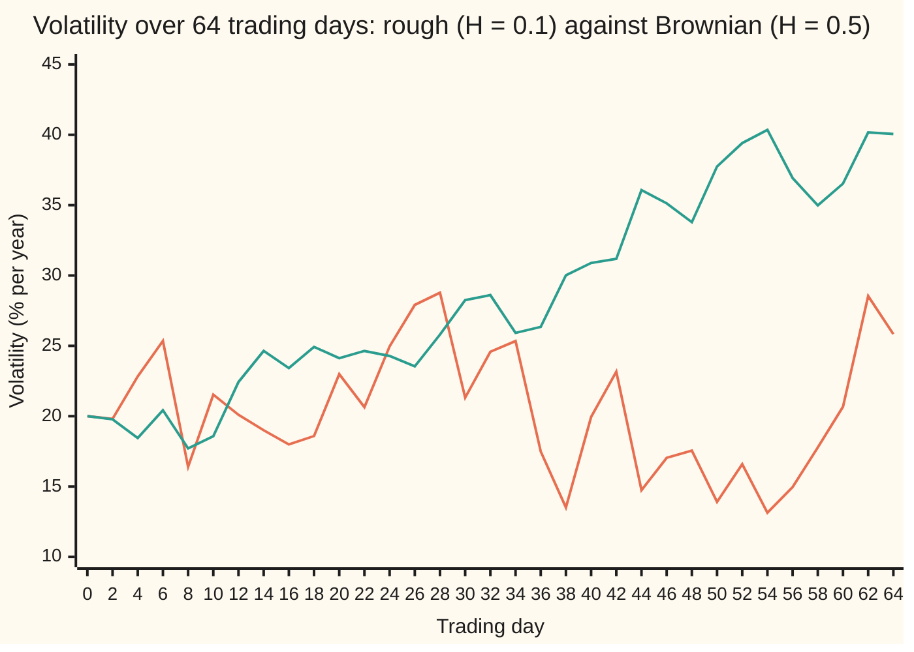
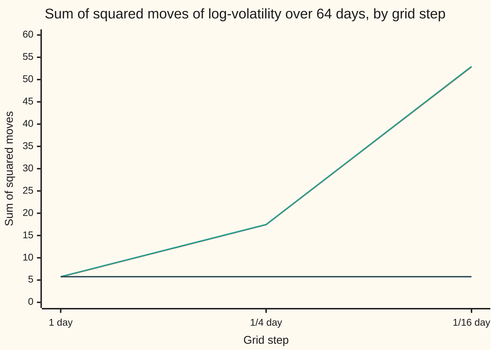

# Rougher than Brownian: fractional Brownian motion and why rough volatility needs new tools

[Syllabus](../../../SYLLABUS.md) → [Stochastic processes and calculus](../README.md) → [Beyond Brownian](../README.md#s09) → Rougher than Brownian

---

## General Overview

A stock index has a volatility: how widely its price swings, quoted as a percentage per year. Say it sits at 20% today. Volatility is never seen directly; it is estimated each day from the many small price moves inside that day. Plot the daily estimates over a few years and the line is jagged. Zoom into one quarter and it is just as jagged. Zoom into one week of intraday estimates and it is jagged again.

That alone sounds like Brownian motion, which also looks the same at every zoom ([Brownian paths](../05-Brownian%20Motion/02-scaling-and-path-roughness.md)). The numbers say otherwise. In the example on this card, the log of volatility moves about 0.3 in a day (0.3 is its standard deviation, called the spread from here on): 20% becomes 27.00% or 14.82%. If those daily moves were independent, as Brownian moves are, the typical move over 1,024 trading days, about four years, would be 0.3 times the square root of 1,024: 9.6, a factor of about 15,000. In fact it is 0.6: from 20% a one-spread move reaches only 36.44%. Volatility is wild over a day and tame over years. Its moves are not independent. A rise tends to be followed by a fall.

Jim Gatheral, Thibault Jaisson and Mathieu Rosenbaum measured this across many stock indices in 2018. The log of volatility scales with an exponent of about 0.1 where Brownian motion has 0.5. The model with an exponent other than one half is **fractional Brownian motion**. Its exponent is the **Hurst exponent**, named after Harold Hurst, who found exponents other than one half in the floods of the Nile.

**Fractional Brownian motion is the Gaussian process (any set of its values is jointly normal) that zooms by the power H of time instead of the square root; for H below one half its increments push against each other, its paths are rougher than Brownian, and the sums Ito calculus is built on blow up, so integrating against it needs rough paths, and a rough volatility's long memory needs non-Markov pricing tools.**

**What kind of fact this is:** a definition. Its covariance, its scaling, the correlation of its increments and the blow-up of its squared moves are proved on this card in Why it works. That it is not a semimartingale is a theorem proved here in a folded Detailed proof, resting on the facts of [Semimartingales](05-semimartingales-in-outline.md). The rough-path repair is stated with a named source, not proved. Using it for volatility is a model.

### The picture: a rough volatility against a Brownian one with the same quarterly spread

One sample path of each, from a seeded simulation (SplitMix64, seed 20260930, in the code), drawn on a grid with step 1/16 day and read off every 2 days. The Brownian path's daily size is set so that both have the same spread over 64 days.



Orange: rough volatility, H = 0.1. Green: Brownian, H = 0.5, its daily size 5.2780 times smaller. The orange line lurches and keeps returning to its band. The green line drifts to 40%, a move of 1.5 spreads, which one sample is free to make.

---

## The formula

Notation first, in words. Fractional Brownian motion is written $B^H_t$, read "the value at time t, with exponent H". The Hurst exponent $H$ is a fixed number strictly between 0 and 1. Brownian motion $W_t$ is the case H = ½. The correlation between two unit increments n steps apart is written $\rho(n)$.

Fractional Brownian motion is the process that starts at 0, has jointly normal values with mean 0, continuous paths, and this covariance:

$$E\big[B^H_s B^H_t\big] = \tfrac12\left(s^{2H} + t^{2H} - \lvert t - s\rvert^{2H}\right).$$

**Read it aloud:** the shared part of the values at two times is half of: the first time to the power 2H, plus the second time to the power 2H, minus the gap between them to the power 2H.

Two consequences carry the card. The size of a move depends only on the gap, through the power H:

$$B^H_t - B^H_s \sim \text{normal, mean } 0,\ \text{variance } \lvert t - s\rvert^{2H}, \qquad B^H_{ct} \overset{d}{=} c^H B^H_t.$$

**Read it aloud:** a move over a gap of length g has spread g to the power H, and running the clock c times faster multiplies the whole path by c to the power H.

The moves over neighbouring steps of length 1 are correlated:

$$\rho(n) = \tfrac12\left((n+1)^{2H} - 2n^{2H} + (n-1)^{2H}\right), \quad n \ge 1.$$

**Read it aloud:** the correlation of two unit moves n steps apart is half the second difference of the function "time to the power 2H" at n.

The example is the log of volatility: $X_t = \nu B^H_t$ with volatility $\sigma_t = 20\% \times e^{X_t}$.

| Symbol | Plain meaning | In our example | Push it up and the answer… |
| --- | --- | --- | --- |
| $B^H_t$ | fractional Brownian motion: the value at time t | the noise in the log of volatility | — |
| $H$ | Hurst exponent: the power of time that sets the spread | 0.1 | smoother paths; above ½ moves reinforce each other |
| $W_t$ | Brownian motion, the case H = ½ | the comparison path | — |
| $X_t$ | log of volatility over its starting level, $\nu B^H_t$ | starts at 0 | — |
| $\sigma_t$ | volatility, % per year, $20\% \times e^{X_t}$ | starts at 20% | — |
| $\nu$ | spread of a one-day move in $X_t$ | 0.3 | every move scales with it |
| $t$, $s$, $g$ | times, in trading days; a gap | 0 to 64; 1,024 for four years | spread grows like t to the power H |
| $c$ | zoom factor for the clock | 32 | path multiplied by c to the power H |
| $n$ | gap between two increments, in steps | 1, 2, 4, 16 | correlation fades towards 0 |
| $\rho(n)$ | correlation of two unit moves n steps apart | −0.4257 at n = 1 | — |
| $h$ | grid step, in days | 1, 1/4, 1/16 | finer grid, larger sum of squared moves when H < ½ |
| $\Delta X$ | one grid step's move in X | spread 0.3 on a 1-day step | — |
| $S$ | Step 6's price | — | — |
| $m$, $U$, $V$, $r$, $M$ | Detailed proof: step count; squared-move sum; absolute-move sum; a correlation; local martingale part | — | — |
| $T$ | horizon, in days | 64 | — |

### When it holds

- **A definition, so it holds by construction.** The covariance above is a legitimate one exactly when H lies in (0, 1]; H = 1 gives only straight lines, t times one normal number, so H stays below 1. At H = 1.2 the formula asks for a correlation of 1.6390 between neighbouring moves, and no correlation exceeds 1.
- **Gaussian and stationary moves.** Real volatility has fatter tails and bursts. The model captures the scaling, not every feature; Gatheral, Jaisson and Rosenbaum fit the scaling of moments of several orders and find the same H.
- **For volatility, not for a price.** A traded price driven by fractional Brownian motion with H ≠ ½ could be forecast from its own past, and L. C. G. Rogers showed in 1997 that it allows arbitrage: profit with no risk. Rough volatility models keep the price Brownian and make only its volatility rough.
- **Estimated, not observed.** Volatility is read off price moves inside each day, with error. Part of the measured roughness could be that error, a point still argued over.

---

## Why it works

### Step 0: Brownian motion's exponent comes from independence

Brownian moves over separate days are independent, so their variances add: 1,024 days of spread 0.3 give spread 0.3 × 32 = 9.6. Adding forces the square root. Drop independence, keep moves whose law depends only on the gap and a path that looks alike at every zoom, and the exponent is free. Each value gives exactly one Gaussian process: fractional Brownian motion.

### Step 1: the covariance is forced by scaling and stationary moves

Suppose a Gaussian process, written B with the H dropped, starts at 0 and its move over a gap of length g has variance g to the power 2H, whatever the start. For any two times, write the product as a difference of squares:

$$B_s B_t = \tfrac12\left(B_s^2 + B_t^2 - (B_t - B_s)^2\right).$$

Take means. The value at s is the move from 0 to s, variance s to the power 2H. The same for t. The last term is the move over the gap. That is the covariance formula: no choice was left. A Gaussian process with mean 0 is fixed by its covariance, so there is at most one such process for each H.

The zoom follows. Replace both times by c times them. Each of the three powers is multiplied by c to the power 2H, so the covariance of the zoomed path is that of the original times c to the power 2H. Multiplying a Gaussian path by c to the power H does the same. Same covariance, same law: running the clock 32 times faster multiplies the path by 32 to the power 0.1, which is why the spread over 32 days is 0.4243 and not the Brownian 1.6971.

### Step 2: the covariance is a real one, for H strictly between 0 and 1

A covariance formula must give every combination of values a variance of at least zero. Benoit Mandelbrot and John Van Ness showed in 1968 that for H between 0 and 1 this one does: they built the process as a weighted sum of a Brownian motion's past moves, with weights decaying like a power of the lag. That construction is stated here with its source, not reproduced.

The code checks the grid version by a second road. It embeds the 1,024-step covariance in a circular one of size 2,048 and computes that matrix's eigenvalues (its stretch factors) with a hand-written Fourier transform. The smallest is 0.000781, above zero, so an exact sample can be built from it: the Davies-Harte method. At H = 1.2 the formula asks for correlation 1.6390, and breaks.

### Step 3: the increments are correlated, and the sign depends on H

Expanding the covariance of two unit moves n steps apart with Step 1 gives half the second difference of "time to the power 2H". For H = ½ that function is a straight line, with second difference 0: Brownian moves are independent. For H below ½ it bends down, and the correlation is negative; above ½ it bends up, and it is positive.

| gap n | 1 | 2 | 4 | 16 |
| --- | --- | --- | --- | --- |
| H = 0.1 | −0.4257 | −0.0258 | −0.0068 | −0.0005 |
| H = 0.5 | 0.0000 | 0.0000 | 0.0000 | 0.0000 |
| H = 0.7 | 0.3195 | 0.1888 | 0.1225 | 0.0531 |

At H = 0.1 a rise tends to be followed by a fall. The best forecast of tomorrow's move from today's captures ρ(1) squared, 0.1812 of its variance, about 18%. So the process is not a martingale (a fair game: the best forecast of the next move is zero) in its own past. Nor is it Markov: the whole past, not only today's value, sharpens the forecast. Far correlations decay like a power of the gap. Adding all the correlations among 64 consecutive unit moves, every pair counted, gives the variance of their total, 64 to the power 0.2. The code computes both sides separately: 2.2973967100 each.

### Step 4: rougher paths, and squared moves that do not settle

A move over a step h has spread h to the power H. For H = 0.1, cutting the step from a day to 1/16 day shrinks the typical move by less than a quarter. Paths of fractional Brownian motion are continuous, and are Hölder continuous (moves bounded by a constant times the step to a power) for every power below H, by Kolmogorov's continuity criterion (Friz and Hairer, Sources). They are rougher than Brownian paths when H is below ½.

Ito calculus rests on one sum: the squared moves over a fine grid, which for Brownian motion settle at the elapsed time, the quadratic variation ([Quadratic variation](../05-Brownian%20Motion/03-quadratic-variation.md)). For fractional Brownian motion, over a horizon T with T/h steps of size h, and ΔX the move of X over one step, the mean of that sum is

$$E\sum (\Delta X)^2 = \frac{T}{h}\,\nu^2 h^{2H} = \nu^2\,T\,h^{2H-1}.$$

For H = ½ the step cancels, and the sum is the same at every grid. For H = 0.1 the power of h is −0.8: each refinement by 4 roughly triples the sum. For H above ½ the sum falls to zero.



Orange: mean over 1,000 simulated paths of rough log-volatility. Green: the formula. Dark: the formula for Brownian motion with the same daily size, flat at 5.76. The rough sum keeps climbing as the grid is refined; the Brownian one stays put.

### Step 5: what breaks in Ito calculus

Ito's integral evaluates the integrand at the left end of each step. For Brownian motion, left and right ends give sums that differ by the squared moves, which settle at the elapsed time: a finite, known correction, the dt term in Ito's formula ([Ito's lemma](../06-Ito%20Calculus/02-itos-lemma.md)). Take the integral of X against its own moves. Algebra alone gives, path by path,

$$\sum X_{\text{left}}\,\Delta X = \tfrac12\Big(X_T^2 - \sum (\Delta X)^2\Big), \qquad \sum X_{\text{right}}\,\Delta X = \tfrac12\Big(X_T^2 + \sum (\Delta X)^2\Big).$$

For rough volatility over 64 days on a 1/16-day grid, the left sum averages −26.32 and the right +26.52, while X at 64 days, squared, averages only 0.2068. The gap is the sum of squared moves, which grows without limit as the grid is refined. The left-point rule has no limit; neither has the right. The Ito integral against fractional Brownian motion with H < ½ does not exist as a limit of these sums.

The general theory of stochastic integrals covers exactly the processes called semimartingales: a local martingale plus a path of finite total movement ([Semimartingales](05-semimartingales-in-outline.md)). Fractional Brownian motion with H ≠ ½ is not one.

<details>
<summary>Detailed proof: for H ≠ ½, fractional Brownian motion is not a semimartingale</summary>

Two facts about a continuous semimartingale are used. First ([Semimartingales](05-semimartingales-in-outline.md)): as the grid step shrinks, the sum of squared moves converges in probability to a finite limit. Second: if that limit is 0, the sum of absolute moves stays bounded however fine the grid. Why: the finite-travel part adds nothing to the limit (as on [Quadratic variation](../05-Brownian%20Motion/03-quadratic-variation.md), its terms are at most a largest move times a total travel), so the local martingale part M has quadratic variation 0. Card 05's integration by parts makes M squared a local martingale, never negative, starting at 0, so M is 0, and the finite-travel part's total travel bounds every grid's absolute moves.

Use unit-free time: horizon 1, m steps of size 1/m, and write each move as m to the power −H times a standard normal number; these numbers have correlations ρ(n) at gap n.

**H below ½.** Let U be the sum of squared moves. Its mean is m to the power 1 − 2H, which tends to infinity. Two standard normals with correlation r have squares with covariance 2r squared, so the variance of U is m to the power −4H times the sum over all pairs of 2ρ(i − j) squared. For large n, ρ(n) is close to H(2H − 1) times n to the power 2H − 2, so its square is summable when H < ¾, and that pair sum is at most a constant times m. The variance of U over its mean squared is then at most a constant over m. By Chebyshev's inequality U over its mean tends to 1 in probability, so U tends to infinity. A semimartingale's U has a finite limit. Contradiction.

**H above ½.** Now the mean of U, m to the power 1 − 2H, tends to 0, so U tends to 0 in probability by Markov's inequality, and a semimartingale would have bounded absolute moves. Let V be their sum. Its mean is m to the power 1 − H times the mean absolute value of a standard normal: it tends to infinity. Two standard normals with correlation r have absolute values with covariance (2/π)(r arcsin r + the square root of 1 − r squared − 1), a power series in r squared with positive coefficients, so at most (1 − 2/π) times r squared. The variance of V is then at most m to the power −2H times the pair sum of ρ squared, which is of order m below H = ¾, m log m at ¾, and m to the power 4H − 2 above. Over the mean of V squared, of order m to the power 2 − 2H, each tends to 0. So V tends to infinity in probability. Contradiction.

This is Rogers's 1997 result; the argument here follows its shape.

</details>

### Step 6: the repair, in outline: rough paths

Above ½ the trouble is mild. Two paths with Hölder powers adding to more than 1 can be integrated one against the other by plain Riemann sums, and the limit ignores where in each step the integrand is read: Young integration. Fractional Brownian motion with H > ½ qualifies against itself, and ordinary calculus, chain rule included, works path by path.

Below ½, Terry Lyons's theory of rough paths (1998) adds data. Alongside the path, record its iterated integrals over each step: in one dimension half the squared move, in several also the signed area swept between two coordinates. Added to the Riemann sum as a correction, they make the sums converge, and differential equations driven by the path get solutions that depend continuously on the path plus that data. For H above 1/3 one extra level suffices; rougher paths need more. In one dimension the data is fixed by the path: the corrected left sum here is exactly half of X at 64 days squared. With two noises, a price and its volatility, it is new information. Friz and Hairer give the theory in full (Sources).

Rough volatility takes a gentler route. The price is still an Ito integral against Brownian motion, $dS = \sigma_t S\,dW_t$, valid because volatility is known at each moment. What breaks is the Markov property: volatility's future depends on its whole history, so pricing does not reduce to an equation in today's state, and simulation must carry the history, as the Fourier road in the code does.

---

## Worked numbers, by hand

| Step | Arithmetic | Value |
| --- | --- | --- |
| 2 to the power 2H | 2 to the power 0.2 | 1.1487 |
| neighbouring correlation ρ(1) | ½ × (1.1487 − 2 + 0) | **−0.4257** |
| share of tomorrow forecast from today | (−0.4257) squared | 0.1812 |
| spread over 1 day, and volatility after one spread | 0.3; 20% × e to the ±0.3 | 27.00% and 14.82% |
| spread over 1,024 days, rough | 0.3 × 1,024 to the power 0.1 = 0.3 × 2 | **0.6000** |
| spread over 1,024 days, if Brownian | 0.3 × 32 | 9.6000 |
| mean of X at 64 days squared | 0.09 × 64 to the power 0.2 = 0.09 × 2.2974 | 0.2068 |
| sum of squared moves, 1-day grid | 0.09 × 64 | 5.76 |
| sum of squared moves, 1/16-day grid | 5.76 × 16 to the power 0.8 = 5.76 × 9.1896 | **52.93** |
| mean left-point sum, 1/16-day grid | ½ × (0.2068 − 52.93) | −26.36 |

Volatility moves by a third in a day yet by less than a factor of two over four years, because each move undoes part of the last. Sampling it 16 times a day instead of once multiplies its summed squared moves by more than nine.

### What breaks if you drop a piece

| Mistake | Comes out at | What went wrong |
| --- | --- | --- |
| Treat daily moves as independent | spread over 1,024 days 9.6000, true 0.6000 | Variances add only for independent moves; here neighbours have correlation −0.4257 |
| Use Ito's left-point rule on the 1/16-day grid | left sum −26.32 ± 0.04, right +26.52 ± 0.04 | Their gap, the sum of squared moves, is 52.85 and grows like h to the power −0.8 |
| Fit Brownian scaling to the realised squared moves | 5.72, 17.43, 52.85 at steps 1, 1/4, 1/16 day, where Brownian stays at 5.76 | The sum depends on the grid; no quadratic variation exists |
| Take H above 1 | neighbouring correlation 1.6390 at H = 1.2 | Not a covariance; no process has it |

---

## Code, from first principles, and it actually runs

Random numbers come from SplitMix64, seed 20260930, made normal by Box-Muller; the Fourier transform is written out. Three roads. **Formulas:** the covariance, the correlations, the spreads, the mean sums. **Exact sums:** the double sum of correlations over 64 steps against 64 to the power 2H, and the smallest eigenvalue of the circular embedding. **Simulation:** 1,000 paths of log-volatility over 64 days on a 1/16-day grid by the Davies-Harte method, which builds a sample with exactly the right covariance on the grid. Each simulated number carries its standard error, and each assert allows four. The fitted H regresses, on each path, the log of the mean squared move against the log of the lag, for lags from 1/16 day to 1 day, and halves the slope. That regression has a small known bias from taking logs, so its assert allows 0.005 on top of four standard errors.

### Python

```python
# Rougher than Brownian: fractional Brownian motion and what breaks in Ito calculus.
# Standard library only; nothing imported holds the answer.  Log-volatility X_t =
# nu * B^H_t, time t in days, nu = 0.3, H = 0.1, volatility 20% * exp(X_t).
# Roads: the formulas; exact sums over the covariance; seeded simulation by
# Davies-Harte (SplitMix64, seed 20260930, Box-Muller, own FFT), with standard errors.
from math import sqrt, log, cos, sin, pi, exp

M64, state, spare = (1 << 64) - 1, 20260930, None

def uniform():                          # SplitMix64 -> a number in (0, 1]
    global state
    state = (state + 0x9E3779B97F4A7C15) & M64
    z = state
    z = ((z ^ (z >> 30)) * 0xBF58476D1CE4E5B9) & M64
    z = ((z ^ (z >> 27)) * 0x94D049BB133111EB) & M64
    return (((z ^ (z >> 31)) >> 11) + 1) / 2.0**53

def normal():                           # Box-Muller, both values of each pair used
    global spare
    if spare is not None:
        z, spare = spare, None
        return z
    r, th = sqrt(-2.0 * log(uniform())), 2.0 * pi * uniform()
    spare = r * sin(th)
    return r * cos(th)

def total(xs):                          # plain left-to-right sum, as in the Rust
    s = 0.0
    for x in xs:
        s += x
    return s

def gam(k, H):                          # covariance of unit-step increments k steps apart
    k = abs(k)
    return 0.5 * ((k + 1) ** (2 * H) - 2 * k ** (2 * H) + abs(k - 1) ** (2 * H))

def fft(a):                             # radix-2 Fourier transform, written out
    n = len(a)
    if n == 1:
        return a[:]
    ev, od = fft(a[0::2]), fft(a[1::2])
    out = [0j] * n
    for k in range(n // 2):
        t = complex(cos(2 * pi * k / n), -sin(2 * pi * k / n)) * od[k]
        out[k], out[k + n // 2] = ev[k] + t, ev[k] - t
    return out

def eigen(n, H):                        # circulant embedding of the covariance
    c = [gam(k, H) for k in range(n + 1)] + [gam(k, H) for k in range(n - 1, 0, -1)]
    return [z.real for z in fft([complex(x, 0.0) for x in c])]

def fgn(n, lam):                        # Davies-Harte: n increments with covariance gam
    m = 2 * n
    w = [0j] * m
    w[0] = complex(sqrt(lam[0] / m) * normal(), 0.0)
    w[n] = complex(sqrt(lam[n] / m) * normal(), 0.0)
    for j in range(1, n):
        s = sqrt(lam[j] / (2 * m))
        a = s * normal()
        w[j] = complex(a, s * normal())
        w[m - j] = w[j].conjugate()
    return [z.real for z in fft(w)[:n]]

def mean_se(xs):
    m = total(xs) / len(xs)
    return m, sqrt(total([(x - m) * (x - m) for x in xs]) / (len(xs) - 1) / len(xs))

H, NU, T, N = 0.1, 0.3, 64.0, 1024     # 64 days on a grid of 1/16 day
h = T / N
print("log-vol X_t = 0.3 B^H_t, t in days, H = 0.1; SplitMix64 seed 20260930")
print("increment correlation rho(n), n = 1 2 4 16:")
for hh in (0.1, 0.5, 0.7):
    print(f"  H = {hh}: " + " ".join(f"{gam(n, hh):+.4f}" for n in (1, 2, 4, 16)))
print(f"H = 1.2 would need rho(1) = {gam(1, 1.2):.4f}, above 1: impossible")
print(f"share of the next step forecast by the last one, rho(1)^2: {gam(1, H) ** 2:.4f}")
print("sd of X over 1, 32, 1024 days, rough: " + " ".join(f"{NU * d ** H:.4f}" for d in (1, 32, 1024))
      + "; Brownian, same daily size: " + " ".join(f"{NU * d ** 0.5:.4f}" for d in (1, 32, 1024)))
print(f"hand: 2^0.2 {2 ** 0.2:.4f}, 64^0.2 {64 ** 0.2:.4f}, 16^0.8 {16 ** 0.8:.4f}; vol from 20% after one sd:"
      f" 1 day up {20 * exp(NU):.2f} down {20 * exp(-NU):.2f}, 1024 days up {20 * exp(2 * NU):.2f}")
dbl = total([gam(i - j, H) for i in range(64) for j in range(64)])
print(f"exact: double sum of rho over 64 steps {dbl:.10f}, formula 64^(2H) {64 ** (2 * H):.10f}")
lam = eigen(N, H)
print(f"exact: smallest circulant eigenvalue {min(lam):.6f} (must be >= 0)")
assert abs(dbl - 64 ** (2 * H)) < 1e-9, "covariance sums do not rebuild the variance law"
assert min(lam) > 0, "embedding not valid"

M = 1000                                # paths
lag1, lag2, xt2, qv, lft, rgt, hest = [], [], [], {1: [], 4: [], 16: []}, [], [], []
for p in range(M):
    g = fgn(N, lam)
    lag1.append(total([g[i] * g[i + 1] for i in range(N - 1)]) / (N - 1))
    lag2.append(total([g[i] * g[i + 2] for i in range(N - 2)]) / (N - 2))
    x = [0.0]
    for v in g:
        x.append(x[-1] + NU * h ** H * v)
    dx = [x[i + 1] - x[i] for i in range(N)]
    xt2.append(x[N] ** 2)
    for f in (1, 4, 16):                # f fine steps per sampling step
        qv[f].append(total([(x[i + f] - x[i]) ** 2 for i in range(0, N, f)]))
    lft.append(total([x[i] * dx[i] for i in range(N)]))
    rgt.append(total([x[i + 1] * dx[i] for i in range(N)]))
    lx, ly = [], []
    for e in range(5):                  # lags 1/16 day up to 1 day
        k = 2 ** e
        lx.append(log(k * h))
        ly.append(log(total([(x[i + k] - x[i]) ** 2 for i in range(N - k)]) / (N - k)))
    mx, my = total(lx) / 5, total(ly) / 5
    hest.append(total([(a - mx) * (b - my) for a, b in zip(lx, ly)])
                / total([(a - mx) ** 2 for a in lx]) / 2)
    if p == 0:
        path_r = [20 * exp(x[32 * i]) for i in range(33)]

print(f"-- simulation, {M} paths, 64 days, grid 1/16 day --")
rows = [("rho(1)", lag1, gam(1, H)), ("rho(2)", lag2, gam(2, H)), ("E X_64^2", xt2, NU * NU * T ** (2 * H))]
for f, lab in ((16, "1 day"), (4, "1/4 day"), (1, "1/16 day")):
    rows.append((f"sum dX^2, step {lab}", qv[f], NU * NU * T * (f * h) ** (2 * H - 1)))
rows += [("left-point sum", lft, 0.5 * NU * NU * (T ** (2 * H) - T * h ** (2 * H - 1))),
         ("right-point sum", rgt, 0.5 * NU * NU * (T ** (2 * H) + T * h ** (2 * H - 1))),
         ("H fitted per path", hest, H)]
for lab, xs, fm in rows:
    m, se = mean_se(xs)
    print(f"{lab:<22} sim {m:9.4f} +- {se:7.4f}   formula {fm:9.4f}")
    assert abs(m - fm) < 4 * se + (0.005 if lab[0] == "H" else 0.0), lab   # the fit's log bias
print("sum dX^2 by step, Brownian with the same daily size: "
      + " ".join(f"{NU * NU * T:.4f}" for _ in range(3)))

# ---- Brownian with the same 64-day spread, for the picture: nu_B = 0.3 * 64^0.1 / 8 ----
nub = NU * T ** H / sqrt(T)
lam_b = eigen(N, 0.5)
gb = fgn(N, lam_b)
xb = [0.0]
for v in gb:
    xb.append(xb[-1] + nub * sqrt(h) * v)
print(f"Brownian nu matched over 64 days: {nub:.4f} per root day; daily sd ratio {NU / nub:.4f}")
print("chart, day          " + " ".join(f"{2 * i}" for i in range(33)))
print("chart, rough vol %  " + " ".join(f"{v:.2f}" for v in path_r))
print("chart, Brownian %   " + " ".join(f"{20 * exp(xb[32 * i]):.2f}" for i in range(33)))
print("chart, sum dX^2 sim " + " ".join(f"{mean_se(qv[f])[0]:.2f}" for f in (16, 4, 1)))
print("chart, formula      " + " ".join(f"{NU * NU * T * (f * h) ** (2 * H - 1):.2f}" for f in (16, 4, 1)))
print("ALL CHECKS PASS")
```

**Ran 2026-09-30 on macOS, Python 3.14.6, standard library only. All checks passed. Output, pasted from the run:**

```
log-vol X_t = 0.3 B^H_t, t in days, H = 0.1; SplitMix64 seed 20260930
increment correlation rho(n), n = 1 2 4 16:
  H = 0.1: -0.4257 -0.0258 -0.0068 -0.0005
  H = 0.5: +0.0000 +0.0000 +0.0000 +0.0000
  H = 0.7: +0.3195 +0.1888 +0.1225 +0.0531
H = 1.2 would need rho(1) = 1.6390, above 1: impossible
share of the next step forecast by the last one, rho(1)^2: 0.1812
sd of X over 1, 32, 1024 days, rough: 0.3000 0.4243 0.6000; Brownian, same daily size: 0.3000 1.6971 9.6000
hand: 2^0.2 1.1487, 64^0.2 2.2974, 16^0.8 9.1896; vol from 20% after one sd: 1 day up 27.00 down 14.82, 1024 days up 36.44
exact: double sum of rho over 64 steps 2.2973967100, formula 64^(2H) 2.2973967100
exact: smallest circulant eigenvalue 0.000781 (must be >= 0)
-- simulation, 1000 paths, 64 days, grid 1/16 day --
rho(1)                 sim   -0.4245 +-  0.0012   formula   -0.4257
rho(2)                 sim   -0.0258 +-  0.0011   formula   -0.0258
E X_64^2               sim    0.1990 +-  0.0095   formula    0.2068
sum dX^2, step 1 day   sim    5.7187 +-  0.0385   formula    5.7600
sum dX^2, step 1/4 day sim   17.4306 +-  0.0575   formula   17.4611
sum dX^2, step 1/16 day sim   52.8459 +-  0.0863   formula   52.9320
left-point sum         sim  -26.3235 +-  0.0435   formula  -26.3626
right-point sum        sim   26.5225 +-  0.0434   formula   26.5694
H fitted per path      sim    0.0997 +-  0.0004   formula    0.1000
sum dX^2 by step, Brownian with the same daily size: 5.7600 5.7600 5.7600
Brownian nu matched over 64 days: 0.0568 per root day; daily sd ratio 5.2780
chart, day          0 2 4 6 8 10 12 14 16 18 20 22 24 26 28 30 32 34 36 38 40 42 44 46 48 50 52 54 56 58 60 62 64
chart, rough vol %  20.00 19.81 22.83 25.35 16.40 21.53 20.10 19.00 17.99 18.59 22.99 20.64 24.96 27.91 28.78 21.32 24.58 25.34 17.49 13.51 19.94 23.16 14.74 17.04 17.55 13.91 16.59 13.14 14.96 17.78 20.67 28.54 25.83
chart, Brownian %   20.00 19.78 18.45 20.42 17.71 18.58 22.43 24.64 23.42 24.93 24.12 24.64 24.28 23.54 25.80 28.25 28.61 25.92 26.35 30.02 30.89 31.18 36.07 35.13 33.79 37.75 39.41 40.35 36.93 34.98 36.53 40.17 40.06
chart, sum dX^2 sim 5.72 17.43 52.85
chart, formula      5.76 17.46 52.93
ALL CHECKS PASS
```

### Rust

Same numbers, same labels, built with `rustc --edition 2021 -O`.

```rust
// Rougher than Brownian: fractional Brownian motion and what breaks in Ito calculus.
// The same check as the Python, std only.  Log-volatility X_t = nu * B^H_t, time t
// in days, nu = 0.3, H = 0.1, volatility 20% * exp(X_t).  Roads: the formulas; exact
// sums over the covariance; seeded simulation by Davies-Harte (SplitMix64, seed
// 20260930, Box-Muller, own FFT), with standard errors.
use std::f64::consts::PI;

struct Rng { state: u64, spare: Option<f64> }

impl Rng {
    fn uniform(&mut self) -> f64 {      // SplitMix64 -> a number in (0, 1]
        self.state = self.state.wrapping_add(0x9E3779B97F4A7C15);
        let mut z = self.state;
        z = (z ^ (z >> 30)).wrapping_mul(0xBF58476D1CE4E5B9);
        z = (z ^ (z >> 27)).wrapping_mul(0x94D049BB133111EB);
        (((z ^ (z >> 31)) >> 11) + 1) as f64 / 9007199254740992.0
    }
    fn normal(&mut self) -> f64 {       // Box-Muller, both values of each pair used
        if let Some(z) = self.spare.take() { return z; }
        let r = (-2.0 * self.uniform().ln()).sqrt();
        let th = 2.0 * PI * self.uniform();
        self.spare = Some(r * th.sin());
        r * th.cos()
    }
}

#[derive(Clone, Copy)]
struct C { re: f64, im: f64 }           // a complex number, by hand

fn mul(a: C, b: C) -> C { C { re: a.re * b.re - a.im * b.im, im: a.re * b.im + a.im * b.re } }

fn total(xs: &[f64]) -> f64 { let mut s = 0.0; for x in xs { s += x; } s }

fn gam(k: i64, h: f64) -> f64 {         // covariance of unit-step increments k steps apart
    let k = k.abs() as f64;
    0.5 * ((k + 1.0).powf(2.0 * h) - 2.0 * k.powf(2.0 * h) + (k - 1.0).abs().powf(2.0 * h))
}

fn fft(a: &[C]) -> Vec<C> {             // radix-2 Fourier transform, written out
    let n = a.len();
    if n == 1 { return a.to_vec(); }
    let ev = fft(&a.iter().step_by(2).copied().collect::<Vec<C>>());
    let od = fft(&a.iter().skip(1).step_by(2).copied().collect::<Vec<C>>());
    let mut out = vec![C { re: 0.0, im: 0.0 }; n];
    for k in 0..n / 2 {
        let ang = 2.0 * PI * k as f64 / n as f64;
        let t = mul(C { re: ang.cos(), im: -ang.sin() }, od[k]);
        out[k] = C { re: ev[k].re + t.re, im: ev[k].im + t.im };
        out[k + n / 2] = C { re: ev[k].re - t.re, im: ev[k].im - t.im };
    }
    out
}

fn eigen(n: usize, h: f64) -> Vec<f64> { // circulant embedding of the covariance
    let mut c: Vec<f64> = (0..=n as i64).map(|k| gam(k, h)).collect();
    c.extend((1..n as i64).rev().map(|k| gam(k, h)));
    fft(&c.iter().map(|&x| C { re: x, im: 0.0 }).collect::<Vec<C>>()).iter().map(|z| z.re).collect()
}

fn fgn(n: usize, lam: &[f64], rng: &mut Rng) -> Vec<f64> { // Davies-Harte increments
    let m = 2 * n;
    let mut w = vec![C { re: 0.0, im: 0.0 }; m];
    w[0] = C { re: (lam[0] / m as f64).sqrt() * rng.normal(), im: 0.0 };
    w[n] = C { re: (lam[n] / m as f64).sqrt() * rng.normal(), im: 0.0 };
    for j in 1..n {
        let s = (lam[j] / (2 * m) as f64).sqrt();
        let a = s * rng.normal();
        w[j] = C { re: a, im: s * rng.normal() };
        w[m - j] = C { re: w[j].re, im: -w[j].im };
    }
    fft(&w)[..n].iter().map(|z| z.re).collect()
}

fn mean_se(xs: &[f64]) -> (f64, f64) {
    let n = xs.len() as f64;
    let m = total(xs) / n;
    let v: Vec<f64> = xs.iter().map(|x| (x - m) * (x - m)).collect();
    (m, (total(&v) / (n - 1.0) / n).sqrt())
}

fn join(xs: &[f64], f: &dyn Fn(f64) -> String) -> String {
    xs.iter().map(|&x| f(x)).collect::<Vec<_>>().join(" ")
}

fn main() {
    let mut rng = Rng { state: 20260930, spare: None };
    let (hh, nu, t, n) = (0.1f64, 0.3f64, 64.0f64, 1024usize); let h = t / n as f64; // grid 1/16 day
    println!("log-vol X_t = 0.3 B^H_t, t in days, H = 0.1; SplitMix64 seed 20260930");
    println!("increment correlation rho(n), n = 1 2 4 16:");
    for hv in [0.1f64, 0.5, 0.7] {
        let r: Vec<f64> = [1i64, 2, 4, 16].iter().map(|&k| gam(k, hv)).collect();
        println!("  H = {}: {}", hv, join(&r, &|x| format!("{:+.4}", x)));
    }
    println!("H = 1.2 would need rho(1) = {:.4}, above 1: impossible", gam(1, 1.2));
    println!("share of the next step forecast by the last one, rho(1)^2: {:.4}", gam(1, hh).powi(2));
    let days = [1.0f64, 32.0, 1024.0];
    println!("sd of X over 1, 32, 1024 days, rough: {}; Brownian, same daily size: {}",
             join(&days, &|d| format!("{:.4}", nu * d.powf(hh))), join(&days, &|d| format!("{:.4}", nu * d.powf(0.5))));
    println!("hand: 2^0.2 {:.4}, 64^0.2 {:.4}, 16^0.8 {:.4}; vol from 20% after one sd: 1 day up {:.2} down {:.2}, 1024 days up {:.2}",
             2f64.powf(0.2), 64f64.powf(0.2), 16f64.powf(0.8), 20.0 * nu.exp(), 20.0 * (-nu).exp(), 20.0 * (2.0 * nu).exp());
    let cells: Vec<f64> = (0..64i64).flat_map(|i| (0..64i64).map(move |j| gam(i - j, 0.1))).collect();
    let dbl = total(&cells);
    println!("exact: double sum of rho over 64 steps {:.10}, formula 64^(2H) {:.10}", dbl, 64f64.powf(2.0 * hh));
    let lam = eigen(n, hh);
    let lmin = lam.iter().cloned().fold(f64::INFINITY, f64::min);
    println!("exact: smallest circulant eigenvalue {:.6} (must be >= 0)", lmin);
    assert!((dbl - 64f64.powf(2.0 * hh)).abs() < 1e-9, "covariance sums do not rebuild the variance law");
    assert!(lmin > 0.0, "embedding not valid");

    let m_paths = 1000;
    let (mut lag1, mut lag2, mut xt2, mut lft, mut rgt, mut hest) = (vec![], vec![], vec![], vec![], vec![], vec![]);
    let mut qv: Vec<Vec<f64>> = vec![vec![], vec![], vec![]]; // f = 1, 4, 16 fine steps
    let (fs, mut path_r) = ([1usize, 4, 16], vec![]);
    for p in 0..m_paths {
        let g = fgn(n, &lam, &mut rng);
        lag1.push(total(&(0..n - 1).map(|i| g[i] * g[i + 1]).collect::<Vec<_>>()) / (n - 1) as f64);
        lag2.push(total(&(0..n - 2).map(|i| g[i] * g[i + 2]).collect::<Vec<_>>()) / (n - 2) as f64);
        let mut x = vec![0.0f64];
        for v in &g { let last = *x.last().unwrap(); x.push(last + nu * h.powf(hh) * v); }
        let dx: Vec<f64> = (0..n).map(|i| x[i + 1] - x[i]).collect();
        xt2.push(x[n].powi(2));
        for (q, &f) in qv.iter_mut().zip(&fs) {
            q.push(total(&(0..n).step_by(f).map(|i| (x[i + f] - x[i]).powi(2)).collect::<Vec<_>>()));
        }
        lft.push(total(&(0..n).map(|i| x[i] * dx[i]).collect::<Vec<_>>()));
        rgt.push(total(&(0..n).map(|i| x[i + 1] * dx[i]).collect::<Vec<_>>()));
        let (mut lx, mut ly) = (vec![], vec![]);
        for e in 0..5 {                 // lags 1/16 day up to 1 day
            let k = 1usize << e;
            lx.push((k as f64 * h).ln());
            ly.push((total(&(0..n - k).map(|i| (x[i + k] - x[i]).powi(2)).collect::<Vec<_>>()) / (n - k) as f64).ln());
        }
        let (mx, my) = (total(&lx) / 5.0, total(&ly) / 5.0);
        let num: Vec<f64> = lx.iter().zip(&ly).map(|(a, b)| (a - mx) * (b - my)).collect();
        let den: Vec<f64> = lx.iter().map(|a| (a - mx).powi(2)).collect();
        hest.push(total(&num) / total(&den) / 2.0);
        if p == 0 { path_r = (0..33).map(|i| 20.0 * x[32 * i].exp()).collect(); }
    }

    println!("-- simulation, {} paths, 64 days, grid 1/16 day --", m_paths);
    let qf = |f: usize| nu * nu * t * (f as f64 * h).powf(2.0 * hh - 1.0);
    let rows: Vec<(&str, &Vec<f64>, f64)> = vec![
        ("rho(1)", &lag1, gam(1, hh)), ("rho(2)", &lag2, gam(2, hh)), ("E X_64^2", &xt2, nu * nu * t.powf(2.0 * hh)),
        ("sum dX^2, step 1 day", &qv[2], qf(16)), ("sum dX^2, step 1/4 day", &qv[1], qf(4)),
        ("sum dX^2, step 1/16 day", &qv[0], qf(1)),
        ("left-point sum", &lft, 0.5 * nu * nu * (t.powf(2.0 * hh) - t * h.powf(2.0 * hh - 1.0))),
        ("right-point sum", &rgt, 0.5 * nu * nu * (t.powf(2.0 * hh) + t * h.powf(2.0 * hh - 1.0))),
        ("H fitted per path", &hest, hh)];
    for (lab, xs, fm) in &rows {
        let (m, se) = mean_se(xs);
        println!("{:<22} sim {:9.4} +- {:7.4}   formula {:9.4}", lab, m, se, fm);
        assert!((m - fm).abs() < 4.0 * se + if lab.starts_with('H') { 0.005 } else { 0.0 }, "{}", lab); // the fit's log bias
    }
    println!("sum dX^2 by step, Brownian with the same daily size: {}", join(&[0.0; 3], &|_| format!("{:.4}", nu * nu * t)));

    // ---- Brownian with the same 64-day spread, for the picture: nu_B = 0.3 * 64^0.1 / 8 ----
    let nub = nu * t.powf(hh) / t.sqrt();
    let gb = fgn(n, &eigen(n, 0.5), &mut rng);
    let mut xb = vec![0.0f64];
    for v in &gb { let last = *xb.last().unwrap(); xb.push(last + nub * h.sqrt() * v); }
    println!("Brownian nu matched over 64 days: {:.4} per root day; daily sd ratio {:.4}", nub, nu / nub);
    println!("chart, day          {}", (0..33).map(|i| format!("{}", 2 * i)).collect::<Vec<_>>().join(" "));
    println!("chart, rough vol %  {}", join(&path_r, &|v| format!("{:.2}", v)));
    let vb: Vec<f64> = (0..33).map(|i| 20.0 * xb[32 * i].exp()).collect();
    println!("chart, Brownian %   {}", join(&vb, &|v| format!("{:.2}", v)));
    println!("chart, sum dX^2 sim {}", join(&[2usize, 1, 0].iter().map(|&i| mean_se(&qv[i]).0).collect::<Vec<_>>(), &|v| format!("{:.2}", v)));
    println!("chart, formula      {}", join(&[16usize, 4, 1].iter().map(|&f| qf(f)).collect::<Vec<_>>(), &|v| format!("{:.2}", v)));
    println!("ALL CHECKS PASS");
}
```

**Ran 2026-09-30 on macOS, rustc 1.98.1, no crates. All checks passed. Output, pasted from the run:**

```
log-vol X_t = 0.3 B^H_t, t in days, H = 0.1; SplitMix64 seed 20260930
increment correlation rho(n), n = 1 2 4 16:
  H = 0.1: -0.4257 -0.0258 -0.0068 -0.0005
  H = 0.5: +0.0000 +0.0000 +0.0000 +0.0000
  H = 0.7: +0.3195 +0.1888 +0.1225 +0.0531
H = 1.2 would need rho(1) = 1.6390, above 1: impossible
share of the next step forecast by the last one, rho(1)^2: 0.1812
sd of X over 1, 32, 1024 days, rough: 0.3000 0.4243 0.6000; Brownian, same daily size: 0.3000 1.6971 9.6000
hand: 2^0.2 1.1487, 64^0.2 2.2974, 16^0.8 9.1896; vol from 20% after one sd: 1 day up 27.00 down 14.82, 1024 days up 36.44
exact: double sum of rho over 64 steps 2.2973967100, formula 64^(2H) 2.2973967100
exact: smallest circulant eigenvalue 0.000781 (must be >= 0)
-- simulation, 1000 paths, 64 days, grid 1/16 day --
rho(1)                 sim   -0.4245 +-  0.0012   formula   -0.4257
rho(2)                 sim   -0.0258 +-  0.0011   formula   -0.0258
E X_64^2               sim    0.1990 +-  0.0095   formula    0.2068
sum dX^2, step 1 day   sim    5.7187 +-  0.0385   formula    5.7600
sum dX^2, step 1/4 day sim   17.4306 +-  0.0575   formula   17.4611
sum dX^2, step 1/16 day sim   52.8459 +-  0.0863   formula   52.9320
left-point sum         sim  -26.3235 +-  0.0435   formula  -26.3626
right-point sum        sim   26.5225 +-  0.0434   formula   26.5694
H fitted per path      sim    0.0997 +-  0.0004   formula    0.1000
sum dX^2 by step, Brownian with the same daily size: 5.7600 5.7600 5.7600
Brownian nu matched over 64 days: 0.0568 per root day; daily sd ratio 5.2780
chart, day          0 2 4 6 8 10 12 14 16 18 20 22 24 26 28 30 32 34 36 38 40 42 44 46 48 50 52 54 56 58 60 62 64
chart, rough vol %  20.00 19.81 22.83 25.35 16.40 21.53 20.10 19.00 17.99 18.59 22.99 20.64 24.96 27.91 28.78 21.32 24.58 25.34 17.49 13.51 19.94 23.16 14.74 17.04 17.55 13.91 16.59 13.14 14.96 17.78 20.67 28.54 25.83
chart, Brownian %   20.00 19.78 18.45 20.42 17.71 18.58 22.43 24.64 23.42 24.93 24.12 24.64 24.28 23.54 25.80 28.25 28.61 25.92 26.35 30.02 30.89 31.18 36.07 35.13 33.79 37.75 39.41 40.35 36.93 34.98 36.53 40.17 40.06
chart, sum dX^2 sim 5.72 17.43 52.85
chart, formula      5.76 17.46 52.93
ALL CHECKS PASS
```

The two outputs match line for line; both add sums left to right in the same order.

The simulated neighbouring correlation, −0.4245 ± 0.0012, sits one standard error from −0.4257. The summed squared moves track the formula at all three grids, tripling with each refinement. Left and right sums straddle zero by half that sum each. The fitted H comes out at 0.0997 ± 0.0004: the regression of Gatheral, Jaisson and Rosenbaum, run on paths whose H is known, recovers it.

> [!TIP]
> **Try changing**
> Guess first, then run it.
> - **Brownian volatility.** Set `H = 0.5` in the line `H, NU, T, N = ...`. Guess: the simulated correlations sit near 0, the three summed squared moves all sit near 5.76, and the left sum sits near 0, as an Ito integral must, while the right sits near 5.76.
> - **Smoother volatility.** Set `H = 0.7` in the same line. Guess: the neighbouring correlation turns positive, 0.3195, and the summed squared moves fall as the grid is refined, towards zero.
> - **Forget the power of the step.** In the line that builds `x`, change `h ** H` to `h ** 0.5`. Guess: the paths come out too calm, and the assert on the mean of X at 64 days squared stops the run.
> - **Another seed.** Change 20260930 to any other number. Guess: simulated numbers move by about their standard errors, the formula column stays put, and the left and right sums still sit about 52.93 apart, the mean sum of squared moves.

---

## The usual mistake

> [!warning]
> **Taking "rough" to mean "more volatile".** Roughness is about how moves scale with the step, not about their size. Rough volatility moves more over a day than a Brownian path with the same quarterly spread, 5.2780 times more, and less over years. A low H means strong reversal, not wild drift: its neighbouring moves have correlation −0.4257.
>
> - **Applying Ito's formula to fractional Brownian motion.** The dt correction comes from quadratic variation, which for H = 0.1 does not exist: the summed squared moves read 5.72, 17.43 and 52.85 on three grids.
> - **Driving a price with fractional Brownian motion.** The last move alone forecasts about 18% of the next move's variance at H = 0.1; a traded price with that property allows riskless profit. The roughness belongs in the volatility.
> - **Reading H off a single coarse estimate.** The fit needs many lags and a stated grid; on the simulated paths it lands at 0.0997 ± 0.0004, within one standard error of the true 0.1.
> - **Taking the simulated picture for the path.** The chart joins grid points 2 days apart. Between them the path has endless further reversals; 1/16 day is a stated step, not the limit.

---

## Where you meet it in real life

- **Rough volatility in option pricing.** Models in which the log of volatility is driven by a fractional process with H near 0.1 reproduce how the implied volatility (the volatility that makes the standard option formula match a market price) of short-dated options steepens as expiry approaches, which Brownian volatility models struggle to fit. The open questions are in Open questions in finance mathematics.
- **River flows and reservoirs.** Hurst found that the range of cumulative Nile flows grew faster than the square root of the number of years: long runs of wet and dry years, positive correlation, H above ½.
- **Other ways beyond Brownian.** Jumps rather than memory: [Levy processes](01-levy-processes.md) and [Jump diffusions](02-jump-diffusions.md). The class of processes Ito-style integration covers: [Semimartingales](05-semimartingales-in-outline.md).
- **Estimating a hidden state.** Volatility is never observed, only inferred from prices, a filtering problem: [Filtering](04-filtering-and-the-kalman-bucy-filter.md).

> **Say it back**
> Fractional Brownian motion is the Gaussian process whose move over a gap has spread the gap to the power H; H = ½ is Brownian motion. Scaling and stationary moves force its covariance, and for H below ½ neighbouring moves are negatively correlated, −0.4257 at H = 0.1. Its paths are rougher than Brownian, and the summed squared moves grow without limit as the grid is refined, so left- and right-point sums part company and the Ito integral against it does not exist. It is not a semimartingale. Rough-path theory repairs integration by carrying the path's iterated integrals; rough volatility models keep Ito for the price and put the roughness, with its long memory, in the volatility.

---

## What this builds on

- [Brownian paths](../05-Brownian%20Motion/02-scaling-and-path-roughness.md): the root-t zoom and the missing slope of Brownian motion, the case H = ½ that this card generalises.
- [Semimartingales](05-semimartingales-in-outline.md): semimartingales, the class the Detailed proof rests on.

## Where this goes next

- Open questions in finance mathematics: pricing options when volatility is rough, the computational cost of its long memory, and what remains unsettled.

Rough paths rescue the integral; pricing when volatility remembers its whole past is that card's question.

---

## Sources

Verified 6 Oct 2026: every link below resolves to the publisher's page.

- Mandelbrot, Benoit B., and John W. Van Ness. "Fractional Brownian Motions, Fractional Noises and Applications." *SIAM Review* 10, no. 4 (1968): 422–437. [doi:10.1137/1010093](https://doi.org/10.1137/1010093). The definition, the integral construction that proves existence, scaling and the correlated increments.
- Gatheral, Jim, Thibault Jaisson, and Mathieu Rosenbaum. "Volatility is Rough." *Quantitative Finance* 18, no. 6 (2018): 933–949. [doi:10.1080/14697688.2017.1393551](https://doi.org/10.1080/14697688.2017.1393551). The measurement: log-volatility scales with H of order 0.1 at every reasonable time scale; the regression the code repeats.
- Rogers, L. C. G. "Arbitrage with Fractional Brownian Motion." *Mathematical Finance* 7, no. 1 (1997): 95–105. [doi:10.1111/1467-9965.00025](https://doi.org/10.1111/1467-9965.00025). Fractional Brownian motion with H ≠ ½ is not a semimartingale, and a price driven by it admits arbitrage.
- Davies, R. B., and D. S. Harte. "Tests for Hurst Effect." *Biometrika* 74, no. 1 (1987): 95–101. [doi:10.1093/biomet/74.1.95](https://doi.org/10.1093/biomet/74.1.95). The circular-embedding method the code uses to simulate exactly on a grid.
- Friz, Peter K., and Martin Hairer. *A Course on Rough Paths*, 2nd ed. Springer, 2020. [doi:10.1007/978-3-030-41556-3](https://doi.org/10.1007/978-3-030-41556-3). Lyons's rough-path theory, Young integration, and fractional Brownian motion as a rough path.
