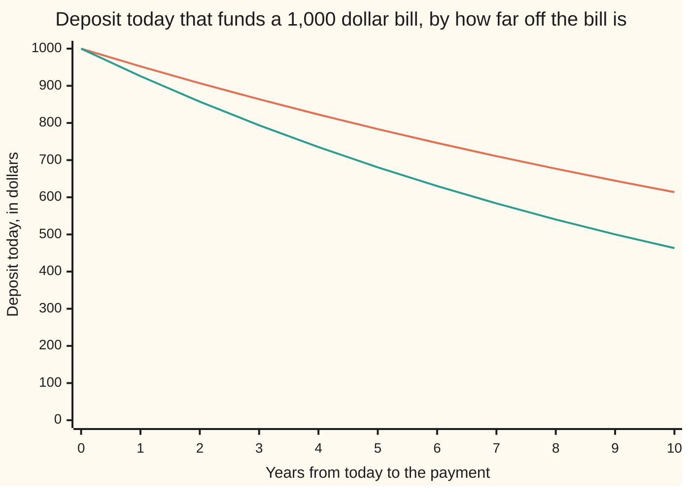

# Discount factors: the price today of one unit later, under any compounding convention

[Syllabus](../../../SYLLABUS.md) → [Financial mathematics](../README.md) → [Money, Dates and Discounting](../README.md#s01) → Discount factors

---

## General Overview

A town council has a repair bill of 1,000 dollars falling due five years from today. The money can be set aside now. The bank takes the deposit and pays 5 percent a year, added once a year and left in the account. The question in front of the council is a single number: how much must go in today so that the balance is exactly 1,000 dollars on the day the bill lands?

The answer is 783.53. That is 1,000 multiplied by 0.7835261665, and 0.7835261665 is the **discount factor** for five years at this rate: the deposit that funds one dollar on that date. A discount factor is a price, not a chance: what a dollar later costs today.

The trap sits in the words "5 percent". A rate is a label, and the label is incomplete until it says how often the interest is added. The same account, reaching the same balance on the same day, is quoted at 5.000000 percent when interest lands once a year, 4.939015 percent when it lands twice a year, 4.888949 percent monthly, and 4.879016 percent when it is added continuously, meaning at every instant. Four numbers, one account, one deposit of 783.53. Read a quote under the wrong convention and the deposit comes out wrong.

**A discount factor is the deposit that funds one unit of money on a stated later date; every compounding convention is a different label for the same factor, and moving between labels is what a logarithm is for.**

**What kind of fact this is:** a definition, wrapped in market conventions. Nothing here is proved about the world. What is derived, in Why it works, is the arithmetic that ties the labels together, and the argument that pins a certain payment to this price.

### The picture: what a later dollar costs today



The upper line is the 5 percent account, the lower one an 8 percent account. Both start at 1,000 dollars, because a bill due today must be paid today. Both bend: each extra year of waiting costs less than the year before it, because the sum being discounted is already smaller.

---

## The formula

Two pieces of notation, in words before they are used. The discount factor for a payment $T$ years away is written $D(T)$, said "D of T": one letter with the waiting time in brackets, the way a function is written. A small numeral set low and to the right of a rate says how many times a year the interest is added, so $r_1$ is the quote for interest added once a year, and a 2 in that place would mean twice a year. The letter $m$ holds that place when the count is left open, and the c in $r_c$ stands for continuous.

$$D(T) \;=\; \frac{1}{(1+r_1)^{T}} \;=\; \left(1 + \frac{r_m}{m}\right)^{-mT} \;=\; e^{-r_c T}$$

**Read it aloud:** one unit of money due $T$ years from now costs, today, one unit divided by whatever the account grows to over those $T$ years — and the three expressions are three ways of writing that same growth.

| Symbol | Plain meaning | In our example | Push it up and the deposit… |
| --- | --- | --- | --- |
| $D(T)$ | the discount factor: today's price of one unit paid at $T$ | 0.7835261665 | — |
| $T$ | time from today to the payment, counted in years | 5 | falls: 613.91 per 1,000 at ten years |
| $r_1$ | the quote when interest is added once a year | 5.000000 percent | falls: 680.58 per 1,000 at 8 percent |
| $r_m$ | the quote when interest is added $m$ times a year | 4.939015 percent at $m$ = 2 | falls, for the same reason |
| $m$ | how many times a year the interest is added | twice a year, monthly, daily | barely moves: the quotes crowd toward one floor |
| $A$ | the growth factor over the wait: what one unit in the bank becomes by the date | 1.05 multiplied in five times | falls: growth and discount are reciprocals |
| $r_c$ | the continuous quote: interest added at every instant | 4.879016 percent | falls |
| $e$ | the number the continuous convention is built on, met on the compounding-frequency card | — | — |
| $C$ | a cash amount due on a stated later date | 1000.00 | rises in step: the deposit scales with it |
| $P$ | today's price of a whole stream of dated cash amounts | 1043.29 for the bond below | — |

Two quotes describe the same money when they grow one unit to the same place in one year. Setting those growths equal and solving gives the conversion pair:

$$r_c = m\,\ln\!\left(1 + \frac{r_m}{m}\right), \qquad r_m = m\left(e^{r_c/m} - 1\right)$$

In words: to put a quote onto the continuous label, work out the growth it actually delivers in a year and take its natural logarithm — the natural logarithm being the operation that undoes $e$ raised to a power. To come back, undo the logarithm. Run on the town's account, the pair gives every label below.

| The council's 5 percent, quoted as | The same money, same deposit |
| --- | --- |
| once a year | 5.000000 percent |
| twice a year | 4.939015 percent |
| monthly | 4.888949 percent |
| daily | 4.879343 percent |
| continuously | 4.879016 percent |

**Conventions verified 14 Sep 2026.** Quoting is a market habit, and habits are dated. The United States Treasury publishes its yield curve on a bond-equivalent, semi-annual basis: the printed rate is halved and applied twice a year, so it is not the effective annual growth and must be converted before it is used as $r_1$. Derivative desks convert everything to $r_c$ first, because only the continuous label lets exponents be added. Day-count rules decide what counts as a year in the first place, and those live on [Day counts](02-day-counts-and-dates.md).

### When it holds

- **One certain payment on one known date.** The factor prices a promise that will be kept. A promise that can fail needs a survival term as well, which is what [Pricing a CDS](../42-Credit%20Default%20Swaps%20-%20Pricing%2C%20the%20Par%20Spread%20and%20the%20Hazard%20Behind%20It/02-cds-legs-risky-annuity-and-par-spread.md) adds.
- **The same terms for putting money in and taking it out, with no fees or spreads.** If borrowing costs more than lending pays, there is no single factor, only a band, and the price of the promise sits anywhere inside it.
- **A schedule known in advance.** Today's factor for a future date is fixed arithmetic only while the rate for that stretch is known now. Rates that move are a later model, and the curve that records them is [Spot, forward and par rates](../02-Curves/01-spot-forward-and-par-rates.md).
- **Time in years, matched to the quote.** Feed the same 5 percent sixty times because there are sixty months, and the deposit collapses from 783.53 to 53.54.

---

## Why it works

### Step 0: a promise is worth what it costs to fund

The council is not guessing at the value of its bill. There is one machine in the room — a bank account whose growth is known in advance — and the bill can be funded through it. The deposit that ends the five years holding exactly 1,000 dollars is a single number, reachable by arithmetic, and that number is the price of the promise. Every line below is bookkeeping on that one move.

### Step 1: one multiply per period makes the growth a power

Interest added once a year and left in multiplies the balance by 1.05 each year ([Compound interest](../../01-Foundations/04-Compound%20Growth%20and%20Discounting/03-compound-interest.md)). Five years is five multiplies. Funding the bill runs the same five multiplies backwards, which is five divisions, so the five-year factor is one divided by five 1.05s: 0.7835261665.

That road need not leave whole numbers at all. One divided by 1.05 is 20 over 21, so the five-year factor is 20 to the fifth over 21 to the fifth, an exact fraction. The check works it out that way, in whole numbers until the last step, and lands on the same 0.7835261665. It then grows the 783.53 deposit forward again, a year at a time, and lands on 1000.00.

### Step 2: the label moves, the money does not

Now let the bank add the interest twice a year instead, into the same account, ending at the same balance. Half of 5 percent twice over is too much, because the interest added in June earns interest from June to December. To land in the same place the quote must come down, to 4.939015 percent a year applied in two halves. Add the interest more often still and it falls again: 4.888949 percent monthly, 4.879343 percent daily. Nothing has happened to the money. All five conventions in the check produce the same 0.7835261665 and the same 783.53 deposit.

### Step 3: adding it more often runs into a floor

The drops shrink fast. Going from once a year to twice moves the quote most; twice to monthly moves it less; monthly to daily less again. The quotes are crowding down onto a floor, and the floor is 4.879016 percent. That floor is the continuous quote $r_c$, and it is exactly the natural logarithm of one year's growth ([Compounding more often, and the number e](../../01-Foundations/04-Compound%20Growth%20and%20Discounting/04-compounding-frequency-and-e.md)). Written forward, growth over $T$ years is $e$ raised to $r_c T$; written backwards, the factor is $e$ raised to minus $r_c T$.

<details>
<summary>The algebra behind the floor</summary>

Interest added $m$ times a year at quote $r_m$ grows one unit to $(1 + r_m/m)^m$ in a year. Take the natural logarithm and the power becomes a product: $m\ln(1 + r_m/m)$. For a small $x$, $\ln(1+x) = x - x^2/2 + x^3/3 - \cdots$, so with $x = r_m/m$,
$$m\ln\!\left(1+\frac{r_m}{m}\right) = r_m - \frac{r_m^2}{2m} + \frac{r_m^3}{3m^2} - \cdots$$
Every term after the first carries an $m$ underneath, so as $m$ grows the whole tail is squeezed to nothing and the expression settles on $r_m$. Read the other way round — fixing the growth and letting $m$ rise — the quote needed slides down to the logarithm of that growth, and stops there. The check runs the interest added once a year, twice a year, monthly and daily, and prints the four quotes crowding down.

</details>

### Step 4: factors multiply, so a dated stream is one sum

The one-year factor multiplied in five times is the five-year factor. On the continuous label that is the exponent law, since $e$ raised to one exponent times $e$ raised to another is $e$ raised to their sum — which is why desks convert to $r_c$ before touching anything with more than one date.

So a contract paying on several dates needs no new idea. A cash amount $C$ due at $T$ is worth $C$ times $D(T)$ today, and the price $P$ of a whole stream is those products added up, one per date. That is the whole of the shelf's bond, and the whole of [NPV and IRR](04-net-present-value-and-irr.md).

<details>
<summary>Detailed proof: why a certain payment must trade at this price</summary>

Step 0 fixes the cost of funding a promise. It does not by itself fix the price of a promise that other people are trading. That takes one more assumption, and two trades.

Suppose a promise to pay one unit on the date can be bought or sold in either direction at the quoted price $z$; suppose the bank lends and borrows on the same schedule, growing one unit by the factor $A$ over the wait, so that $D = 1/A$; and suppose no trade is available that costs nothing today and is certain to pay something later.

If $z > D$: sell the promise for $z$ and deposit all of it. Today's cashflow is $z - z = 0$. On the date the deposit has grown by the factor $A$ and one unit is owed, leaving $zA - 1 = (z - D)A$, which is positive. Something from nothing.

If $z < D$: borrow $z$ and buy the promise. Today's cashflow is $z - z = 0$ again. On the date one unit arrives, the loan has grown by that same factor $A$, and the balance left is $1 - zA = (D - z)A$, positive again.

Both are ruled out by assumption, and the only remaining case is $z = D$. Conversely, in this two-instrument market any holding of promises and bank balance costs some amount today and pays exactly $A$ times that amount on the date, so a position costing nothing today pays nothing later: there is no such trade to find. The argument needs the payment certain and sellable in both directions. It proves nothing about a defaultable promise, and nothing about a larger market.

</details>

A second road skips rates entirely. A traded price for a payment on that date *is* the factor, once divided by the size of the payment; rates are then read out of prices rather than fed into them — the inverse direction, done properly on [Yield from price](07-yield-from-price.md).

That reading back always works, and works only one way. Over a wait $T$ longer than zero, $e^{-r_c T}$ falls strictly as $r_c$ rises, and on the way down it passes through every positive number exactly once. So a positive factor names one continuous rate and no other: $r_c$ is minus the natural logarithm of $D(T)$, divided by $T$. The boundaries follow from the same sweep. A factor of exactly 1 means a rate of 0. A factor above 1 means a rate below 0, the shrinking account of a negative-rate market. A factor of zero or less names no rate at all, because a positive deposit never grows to nothing. And at $T$ = 0 the factor is 1 whatever the rate, so a payment due today fixes no rate. The check does the small version: 0.7835261665 goes in, 4.879016 percent comes back.

---

## Worked numbers, by hand

The council's bill first, then the shelf's bond. The bond repays 1,000 dollars five years out — its **face value** — and pays 6 percent of that, 60.00 dollars, each year on the way, which is its **coupon**. The **market yield** is the rate money of that term earns elsewhere, and it is 5 percent. Same account, same factors.

| Step | Arithmetic | Value |
| --- | --- | --- |
| one year's factor | 1 divided by 1.05 | 0.9523809524 |
| five years' factor | 1.05 multiplied in five times, then inverted | 0.7835261665 |
| the council's deposit | 1000.00 × 0.7835261665 | **783.53** |
| bond, year 1 coupon | 60.00 × 0.9523809524 | 57.14 |
| bond, year 2 coupon | 60.00 × 0.9070294785 | 54.42 |
| bond, year 3 coupon | 60.00 × 0.8638375985 | 51.83 |
| bond, year 4 coupon | 60.00 × 0.8227024748 | 49.36 |
| bond, year 5 coupon and face | 1060.00 × 0.7835261665 | 830.54 |
| bond price, adding the five | 57.14 + 54.42 + 51.83 + 49.36 + 830.54 | **1043.29** |
| bond price, coupons as one block | 60.00 × (1 − 0.7835261665) ÷ 0.05, plus 1000.00 × 0.7835261665 | **1043.29** |

The bond changes hands above its face value because it pays 6 percent into a market willing to accept 5 percent. The extra coupon it pays each year, discounted and added up, is what lifts its price above 1000.00.

### What breaks if you drop a piece

Each wrong deposit below is then grown at the account's real 5 percent, to show what the council would actually be holding on the day the 1,000 dollar bill lands.

| Mistake | Deposit comes out at | Grows to | What went wrong |
| --- | --- | --- | --- |
| Reading the 5 percent as a continuous quote | 778.80 | 993.97 | The continuous label for this account is 4.879016 percent, not 5.000000 percent |
| Halving the 5 percent and applying it twice a year | 781.20 | 997.03 | A nominal quote is one simply divided by the number of payments, so it outgrows its printed number |
| Simple interest: dividing by 1 + 0.05 × 5 | 800.00 | 1021.03 | Interest left in the account earns interest; simple interest ignores that |
| Counting the time in months, not years | 53.54 | 68.33 | The quote is per year, so the waiting time must be in years too |

The code prints all four, and their grown-forward balances.

---

## How it moves: the clock alone

The bond above was bought at 1043.29. Suppose the market yield never moves for five years: 5 percent on the day it is bought, 5 percent every day after, 5 percent on the day it matures. Nothing in the world changes. And yet the bond is worth 1000.00 at the end, because that is what its final payment is worth once it arrives. The price has slid from 1043.29 to 1000.00 with nothing at all happening. The yield did nothing. The clock did it.

| Years still to run | Price at a 5 percent yield |
| --- | --- |
| 5 | 1043.29 |
| 4 | 1035.46 |
| 3 | 1027.23 |
| 2 | 1018.59 |
| 1 | 1009.52 |
| 0 | 1000.00 |

The drift is called **pull to par**, par being the face value the bond repays. It is not a loss: the 6 percent coupons arriving each year are what pays for it. Any bond bought above its face value has to give the extra back.

Two things move a discount factor, and each is worth seeing alone. First, how far off the payment is.

```
years to wait   deposit today that funds a 1,000 dollar bill at 5 percent, one block = 30 dollars
        1   ███████████████████████████████    $952.38
        2   ██████████████████████████████     $907.03
        5   ██████████████████████████         $783.53
       10   ████████████████████               $613.91
       30   ███████                            $231.38
```

Waiting is what costs. Five years takes about a fifth off the bill; thirty years takes more than three quarters of it.

Second, the rate itself, with the wait held at five years.

```
yearly rate   deposit today that funds a 1,000 dollar bill in five years, one block = 30 dollars
        0%   █████████████████████████████████  $1,000.00
        2%   ██████████████████████████████     $905.73
        5%   ██████████████████████████         $783.53
        8%   ██████████████████████             $680.58
       12%   ██████████████████                 $567.43
```

At a zero rate the bill costs its full 1,000 dollars, which is the sanity check: with money earning nothing, waiting buys no discount. The chart at the top of the card is both forces at once — each curve is one rate, and running left to right along it is time.

---

## Code, from first principles, and it actually runs

Nothing is imported, and no library exponential or logarithm is used: both are built from their own series, because on this card they *are* the answer. The five-year factor is then reached five ways — one multiply a year, exact whole numbers, the continuous quote, ten half-years, and 1825 daily steps. The deposit is grown forward again to check that it lands on the bill, the factor is read back out as a rate, the factor is checked to fall strictly as the rate rises and to rise above 1 at a negative rate, and the shelf's bond is priced twice over.

### Python

```python
# Compounding and discount factors -- the check behind the card.  Nothing is
# imported: the exponential and the natural logarithm are built here from their
# own series, so no library hands back the answer.  The money is a 1,000 bill
# due in five years at a 5 percent annual yield, and the shelf's 1,000
# five-year bond paying a 6 percent coupon, priced at that same yield.
FACE, COUPON, YEARS, R1 = 1000.0, 60.0, 5, 0.05

def my_exp(x):                                # e^x: halve the argument, sum the series, square back
    k = 0
    while abs(x) > 0.5:
        x, k = x / 2.0, k + 1
    term, total, n = 1.0, 1.0, 1
    while abs(term) > 1e-18:
        term *= x / n
        total += term
        n += 1
    for _ in range(k):
        total *= total
    return total

def ln_core(x):                               # ln x from the series in z = (x - 1) / (x + 1)
    z = (x - 1.0) / (x + 1.0)
    z2, term, total, n = z * z, z, 0.0, 1
    while abs(term) > 1e-18:
        total += term / n
        term *= z2
        n += 2
    return 2.0 * total

LN2 = ln_core(2.0)

def my_ln(x):                                 # halved into the range where the series is fast
    k = 0
    while x > 1.5:
        x, k = x / 2.0, k + 1
    while x < 0.75:
        x, k = x * 2.0, k - 1
    return ln_core(x) + k * LN2

def growth(factor, periods):                  # one multiply per period; no power function used
    out = 1.0
    for _ in range(periods):
        out *= factor
    return out

def row(name, value):
    print(f"{name:<46}{value:>14}")

# ---- five roads to one discount factor for five years ----
d_annual = 1.0 / growth(1.0 + R1, YEARS)                       # 1: one multiply a year
num, den = 20 ** YEARS, 21 ** YEARS                            # 2: exact whole numbers
d_exact = ((num * 10 ** 12 + den // 2) // den) / 10 ** 12
rc = my_ln(1.0 + R1)                                           # 3: the continuous quote
d_cont = my_exp(-rc * YEARS)
r2 = 2.0 * (my_exp(rc / 2.0) - 1.0)                            # 4: twice a year
d_semi = 1.0 / growth(1.0 + r2 / 2.0, 2 * YEARS)
r12 = 12.0 * (my_exp(rc / 12.0) - 1.0)
r365 = 365.0 * (my_exp(rc / 365.0) - 1.0)                      # 5: every day
d_daily = 1.0 / growth(1.0 + r365 / 365.0, 365 * YEARS)
deposit = FACE * d_annual
ledger = deposit                                               # the deposit grown forward again
for _ in range(YEARS):
    ledger *= 1.0 + R1
rate_back = -my_ln(d_annual) / YEARS                           # the factor read back as a rate

# ---- the shelf's bond, two ways ----
dfs = [1.0 / growth(1.0 + R1, t) for t in range(1, YEARS + 1)]
flows = [COUPON] * (YEARS - 1) + [COUPON + FACE]
price_sum = 0.0
for c, d in zip(flows, dfs):
    price_sum += c * d
annuity = (1.0 - dfs[-1]) / R1                                 # coupons as one annuity factor
price_closed = COUPON * annuity + FACE * dfs[-1]
pulls = [COUPON * (1.0 - 1.0 / growth(1.0 + R1, n)) / R1 + FACE / growth(1.0 + R1, n)
         for n in range(YEARS, -1, -1)]

# ---- the two forces, and the curve ----
by_maturity = [FACE / growth(1.0 + R1, t) for t in (1, 2, 5, 10, 30)]
by_rate = [FACE / growth(1.0 + r, YEARS) for r in (0.0, 0.02, 0.05, 0.08, 0.12)]
curve5 = [FACE / growth(1.05, t) for t in range(11)]
curve8 = [FACE / growth(1.08, t) for t in range(11)]

# ---- what breaks if the convention is read wrong ----
grow5 = growth(1.0 + R1, YEARS)
wrongs = [("5 percent read as a continuous rate", FACE * my_exp(-R1 * YEARS)),
          ("nominal 5 percent, paid twice a year", FACE / growth(1.0 + R1 / 2.0, 2 * YEARS)),
          ("simple interest, 1 + 0.05 x 5", FACE / (1.0 + R1 * YEARS)),
          ("time counted in months, not years", FACE / growth(1.0 + R1, 12 * YEARS))]

print("a 1,000 bill due in five years, quoted at 5 percent a year")
for name, r in (("quoted once a year", R1), ("the same money, twice a year", r2),
                ("the same money, monthly", r12), ("the same money, daily", r365),
                ("the same money, continuously", rc)):
    row(name, f"{100.0 * r:.6f} percent")
print()
print("five roads to the discount factor D(5):")
for name, d in (("1 annual, 1.05 multiplied in five times", d_annual),
                ("2 whole numbers, 20^5 / 21^5", d_exact),
                ("3 continuous, e to the minus 4.879016% x 5", d_cont),
                ("4 semi-annual, ten half-years", d_semi),
                ("5 daily, 1825 days", d_daily)):
    row(name, f"{d:.10f}")
row("deposit today for the 1,000 bill", f"{deposit:.2f}")
row("that deposit grown five years at 5 percent", f"{ledger:.2f}")
row("the factor read back as a rate, -ln(D) / 5", f"{100.0 * rate_back:.6f} percent")
print()
print("the shelf's bond: 1,000 face, 6 percent coupon, five years, yield 5 percent")
print("  year    cashflow    discount factor     present value")
for t, (c, d) in enumerate(zip(flows, dfs), start=1):
    print(f"  {t:>4}  {c:>10.2f}       {d:.10f}      {c * d:>11.2f}")
row("price, cashflow by cashflow", f"{price_sum:.2f}")
row("price, coupon annuity plus discounted face", f"{price_closed:.2f}")
print()
print("pull to par, 5 years left down to 0: " + "  ".join(f"{p:.2f}" for p in pulls))
print()
print("deposit funding 1,000 by maturity 1 2 5 10 30 years: "
      + " ".join(f"{v:.2f}" for v in by_maturity))
print("deposit funding 1,000 by rate 0 2 5 8 12 percent:    "
      + " ".join(f"{v:.2f}" for v in by_rate))
print()
print("chart, years from now       " + " ".join(f"{t:>7}" for t in range(11)))
print("chart, deposit at 5 percent " + " ".join(f"{v:>7.2f}" for v in curve5))
print("chart, deposit at 8 percent " + " ".join(f"{v:>7.2f}" for v in curve8))
print()
print("what breaks, each deposit then grown at the true 5 percent:")
for name, v in wrongs:
    print(f"  {name:<40} deposit {v:>8.2f}   grows to {v * grow5:>8.2f}")

assert abs(d_annual - d_exact) < 1e-11,        "floats against exact whole-number arithmetic"
assert abs(d_cont - d_annual) < 1e-12,         "the continuous road against the annual one"
assert abs(d_daily - d_annual) < 1e-12,        "1825 daily steps against five yearly ones"
assert abs(ledger - FACE) < 1e-9,              "the deposit grown forward must land on the bill"
assert abs(price_sum - price_closed) < 1e-9,   "cashflow by cashflow against the annuity form"
assert abs(rate_back - rc) < 1e-14,            "the rate read back out of the factor"
assert abs(my_ln(my_exp(0.37)) - 0.37) < 1e-14, "the series exp and ln must undo each other"
d_neg = 1.0 / growth(1.0 - 0.02, YEARS)        # a shrinking account: the rate is minus 2 percent
assert all(a > b for a, b in zip(by_rate, by_rate[1:])), "a higher rate must give a smaller factor"
assert d_neg > 1.0,                            "a negative rate lifts the factor above one"
print("ALL CHECKS PASS")
```

**Ran 2026-09-14 on macOS, Python 3.14.6, standard library only. All checks passed. Output, pasted from the run:**

```
a 1,000 bill due in five years, quoted at 5 percent a year
quoted once a year                            5.000000 percent
the same money, twice a year                  4.939015 percent
the same money, monthly                       4.888949 percent
the same money, daily                         4.879343 percent
the same money, continuously                  4.879016 percent

five roads to the discount factor D(5):
1 annual, 1.05 multiplied in five times         0.7835261665
2 whole numbers, 20^5 / 21^5                    0.7835261665
3 continuous, e to the minus 4.879016% x 5      0.7835261665
4 semi-annual, ten half-years                   0.7835261665
5 daily, 1825 days                              0.7835261665
deposit today for the 1,000 bill                      783.53
that deposit grown five years at 5 percent           1000.00
the factor read back as a rate, -ln(D) / 5    4.879016 percent

the shelf's bond: 1,000 face, 6 percent coupon, five years, yield 5 percent
  year    cashflow    discount factor     present value
     1       60.00       0.9523809524            57.14
     2       60.00       0.9070294785            54.42
     3       60.00       0.8638375985            51.83
     4       60.00       0.8227024748            49.36
     5     1060.00       0.7835261665           830.54
price, cashflow by cashflow                          1043.29
price, coupon annuity plus discounted face           1043.29

pull to par, 5 years left down to 0: 1043.29  1035.46  1027.23  1018.59  1009.52  1000.00

deposit funding 1,000 by maturity 1 2 5 10 30 years: 952.38 907.03 783.53 613.91 231.38
deposit funding 1,000 by rate 0 2 5 8 12 percent:    1000.00 905.73 783.53 680.58 567.43

chart, years from now             0       1       2       3       4       5       6       7       8       9      10
chart, deposit at 5 percent 1000.00  952.38  907.03  863.84  822.70  783.53  746.22  710.68  676.84  644.61  613.91
chart, deposit at 8 percent 1000.00  925.93  857.34  793.83  735.03  680.58  630.17  583.49  540.27  500.25  463.19

what breaks, each deposit then grown at the true 5 percent:
  5 percent read as a continuous rate      deposit   778.80   grows to   993.97
  nominal 5 percent, paid twice a year     deposit   781.20   grows to   997.03
  simple interest, 1 + 0.05 x 5            deposit   800.00   grows to  1021.03
  time counted in months, not years        deposit    53.54   grows to    68.33
ALL CHECKS PASS
```

### Rust

Same numbers, same labels, built with `rustc --edition 2021 -O`.

```rust
// Compounding and discount factors -- the same check as the Python, in Rust.
// No crates, and no library exponential or logarithm: both are built here from
// their own series.  The money is a 1,000 bill due in five years at a 5 percent
// annual yield, and the shelf's 1,000 five-year bond paying a 6 percent coupon,
// priced at that same yield.
const FACE: f64 = 1000.0;
const COUPON: f64 = 60.0;
const YEARS: u32 = 5;
const R1: f64 = 0.05;

fn my_exp(mut x: f64) -> f64 {          // e^x: halve the argument, sum the series, square back
    let mut k = 0;
    while x.abs() > 0.5 { x /= 2.0; k += 1; }
    let (mut term, mut total, mut n) = (1.0_f64, 1.0_f64, 1.0_f64);
    while term.abs() > 1e-18 { term *= x / n; total += term; n += 1.0; }
    for _ in 0..k { total *= total; }
    total
}

fn ln_core(x: f64) -> f64 {             // ln x from the series in z = (x - 1) / (x + 1)
    let z = (x - 1.0) / (x + 1.0);
    let z2 = z * z;
    let (mut term, mut total, mut n) = (z, 0.0_f64, 1.0_f64);
    while term.abs() > 1e-18 { total += term / n; term *= z2; n += 2.0; }
    2.0 * total
}

fn my_ln(mut x: f64) -> f64 {           // halved into the range where the series is fast
    let (ln2, mut k) = (ln_core(2.0), 0.0_f64);
    while x > 1.5 { x /= 2.0; k += 1.0; }
    while x < 0.75 { x *= 2.0; k -= 1.0; }
    ln_core(x) + k * ln2
}

fn growth(factor: f64, periods: u32) -> f64 {   // one multiply per period; no power function used
    let mut out = 1.0;
    for _ in 0..periods { out *= factor; }
    out
}

fn row(name: &str, value: String) { println!("{:<46}{:>14}", name, value); }

fn main() {
    // ---- five roads to one discount factor for five years ----
    let d_annual = 1.0 / growth(1.0 + R1, YEARS);                        // 1: one multiply a year
    let (num, den) = (20i128.pow(YEARS), 21i128.pow(YEARS));             // 2: exact whole numbers
    let d_exact = ((num * 1_000_000_000_000i128 + den / 2) / den) as f64 / 1e12;
    let rc = my_ln(1.0 + R1);                                            // 3: the continuous quote
    let d_cont = my_exp(-rc * YEARS as f64);
    let r2 = 2.0 * (my_exp(rc / 2.0) - 1.0);                             // 4: twice a year
    let d_semi = 1.0 / growth(1.0 + r2 / 2.0, 2 * YEARS);
    let r12 = 12.0 * (my_exp(rc / 12.0) - 1.0);
    let r365 = 365.0 * (my_exp(rc / 365.0) - 1.0);                       // 5: every day
    let d_daily = 1.0 / growth(1.0 + r365 / 365.0, 365 * YEARS);
    let deposit = FACE * d_annual;
    let mut ledger = deposit;                                            // grown forward again
    for _ in 0..YEARS { ledger *= 1.0 + R1; }
    let rate_back = -my_ln(d_annual) / YEARS as f64;                     // the factor read back as a rate

    // ---- the shelf's bond, two ways ----
    let dfs: Vec<f64> = (1..=YEARS).map(|t| 1.0 / growth(1.0 + R1, t)).collect();
    let mut flows: Vec<f64> = vec![COUPON; (YEARS - 1) as usize];
    flows.push(COUPON + FACE);
    let mut price_sum = 0.0;
    for (c, d) in flows.iter().zip(dfs.iter()) { price_sum += c * d; }
    let annuity = (1.0 - dfs[dfs.len() - 1]) / R1;                       // coupons as one annuity factor
    let price_closed = COUPON * annuity + FACE * dfs[dfs.len() - 1];
    let pulls: Vec<f64> = (0..=YEARS).rev()
        .map(|n| COUPON * (1.0 - 1.0 / growth(1.0 + R1, n)) / R1 + FACE / growth(1.0 + R1, n))
        .collect();

    // ---- the two forces, and the curve ----
    let by_maturity: Vec<f64> = [1u32, 2, 5, 10, 30].iter().map(|&t| FACE / growth(1.0 + R1, t)).collect();
    let by_rate: Vec<f64> = [0.0, 0.02, 0.05, 0.08, 0.12].iter().map(|&r| FACE / growth(1.0 + r, YEARS)).collect();
    let curve5: Vec<f64> = (0..11).map(|t| FACE / growth(1.05, t)).collect();
    let curve8: Vec<f64> = (0..11).map(|t| FACE / growth(1.08, t)).collect();

    // ---- what breaks if the convention is read wrong ----
    let grow5 = growth(1.0 + R1, YEARS);
    let wrongs: Vec<(&str, f64)> = vec![
        ("5 percent read as a continuous rate", FACE * my_exp(-R1 * YEARS as f64)),
        ("nominal 5 percent, paid twice a year", FACE / growth(1.0 + R1 / 2.0, 2 * YEARS)),
        ("simple interest, 1 + 0.05 x 5", FACE / (1.0 + R1 * YEARS as f64)),
        ("time counted in months, not years", FACE / growth(1.0 + R1, 12 * YEARS)),
    ];

    println!("a 1,000 bill due in five years, quoted at 5 percent a year");
    for (name, r) in [("quoted once a year", R1), ("the same money, twice a year", r2),
                      ("the same money, monthly", r12), ("the same money, daily", r365),
                      ("the same money, continuously", rc)] {
        row(name, format!("{:.6} percent", 100.0 * r));
    }
    println!();
    println!("five roads to the discount factor D(5):");
    for (name, d) in [("1 annual, 1.05 multiplied in five times", d_annual),
                      ("2 whole numbers, 20^5 / 21^5", d_exact),
                      ("3 continuous, e to the minus 4.879016% x 5", d_cont),
                      ("4 semi-annual, ten half-years", d_semi),
                      ("5 daily, 1825 days", d_daily)] {
        row(name, format!("{:.10}", d));
    }
    row("deposit today for the 1,000 bill", format!("{:.2}", deposit));
    row("that deposit grown five years at 5 percent", format!("{:.2}", ledger));
    row("the factor read back as a rate, -ln(D) / 5", format!("{:.6} percent", 100.0 * rate_back));
    println!();
    println!("the shelf's bond: 1,000 face, 6 percent coupon, five years, yield 5 percent");
    println!("  year    cashflow    discount factor     present value");
    for (i, (c, d)) in flows.iter().zip(dfs.iter()).enumerate() {
        println!("  {:>4}  {:>10.2}       {:.10}      {:>11.2}", i + 1, c, d, c * d);
    }
    row("price, cashflow by cashflow", format!("{:.2}", price_sum));
    row("price, coupon annuity plus discounted face", format!("{:.2}", price_closed));
    println!();
    println!("pull to par, 5 years left down to 0: {}",
             pulls.iter().map(|p| format!("{:.2}", p)).collect::<Vec<_>>().join("  "));
    println!();
    println!("deposit funding 1,000 by maturity 1 2 5 10 30 years: {}",
             by_maturity.iter().map(|v| format!("{:.2}", v)).collect::<Vec<_>>().join(" "));
    println!("deposit funding 1,000 by rate 0 2 5 8 12 percent:    {}",
             by_rate.iter().map(|v| format!("{:.2}", v)).collect::<Vec<_>>().join(" "));
    println!();
    println!("chart, years from now       {}",
             (0..11).map(|t| format!("{:>7}", t)).collect::<Vec<_>>().join(" "));
    println!("chart, deposit at 5 percent {}",
             curve5.iter().map(|v| format!("{:>7.2}", v)).collect::<Vec<_>>().join(" "));
    println!("chart, deposit at 8 percent {}",
             curve8.iter().map(|v| format!("{:>7.2}", v)).collect::<Vec<_>>().join(" "));
    println!();
    println!("what breaks, each deposit then grown at the true 5 percent:");
    for (name, v) in &wrongs {
        println!("  {:<40} deposit {:>8.2}   grows to {:>8.2}", name, v, v * grow5);
    }

    assert!((d_annual - d_exact).abs() < 1e-11, "floats against exact whole-number arithmetic");
    assert!((d_cont - d_annual).abs() < 1e-12, "the continuous road against the annual one");
    assert!((d_daily - d_annual).abs() < 1e-12, "1825 daily steps against five yearly ones");
    assert!((ledger - FACE).abs() < 1e-9, "the deposit grown forward must land on the bill");
    assert!((price_sum - price_closed).abs() < 1e-9, "cashflow by cashflow against the annuity form");
    assert!((rate_back - rc).abs() < 1e-14, "the rate read back out of the factor");
    assert!((my_ln(my_exp(0.37)) - 0.37).abs() < 1e-14, "the series exp and ln must undo each other");
    let d_neg = 1.0 / growth(1.0 - 0.02, YEARS);   // a shrinking account: the rate is minus 2 percent
    assert!(by_rate.windows(2).all(|w| w[0] > w[1]), "a higher rate must give a smaller factor");
    assert!(d_neg > 1.0, "a negative rate lifts the factor above one");
    println!("ALL CHECKS PASS");
}
```

**Ran 2026-09-14 on macOS, rustc 1.98.1, no crates. All checks passed. Output, pasted from the run:**

```
a 1,000 bill due in five years, quoted at 5 percent a year
quoted once a year                            5.000000 percent
the same money, twice a year                  4.939015 percent
the same money, monthly                       4.888949 percent
the same money, daily                         4.879343 percent
the same money, continuously                  4.879016 percent

five roads to the discount factor D(5):
1 annual, 1.05 multiplied in five times         0.7835261665
2 whole numbers, 20^5 / 21^5                    0.7835261665
3 continuous, e to the minus 4.879016% x 5      0.7835261665
4 semi-annual, ten half-years                   0.7835261665
5 daily, 1825 days                              0.7835261665
deposit today for the 1,000 bill                      783.53
that deposit grown five years at 5 percent           1000.00
the factor read back as a rate, -ln(D) / 5    4.879016 percent

the shelf's bond: 1,000 face, 6 percent coupon, five years, yield 5 percent
  year    cashflow    discount factor     present value
     1       60.00       0.9523809524            57.14
     2       60.00       0.9070294785            54.42
     3       60.00       0.8638375985            51.83
     4       60.00       0.8227024748            49.36
     5     1060.00       0.7835261665           830.54
price, cashflow by cashflow                          1043.29
price, coupon annuity plus discounted face           1043.29

pull to par, 5 years left down to 0: 1043.29  1035.46  1027.23  1018.59  1009.52  1000.00

deposit funding 1,000 by maturity 1 2 5 10 30 years: 952.38 907.03 783.53 613.91 231.38
deposit funding 1,000 by rate 0 2 5 8 12 percent:    1000.00 905.73 783.53 680.58 567.43

chart, years from now             0       1       2       3       4       5       6       7       8       9      10
chart, deposit at 5 percent 1000.00  952.38  907.03  863.84  822.70  783.53  746.22  710.68  676.84  644.61  613.91
chart, deposit at 8 percent 1000.00  925.93  857.34  793.83  735.03  680.58  630.17  583.49  540.27  500.25  463.19

what breaks, each deposit then grown at the true 5 percent:
  5 percent read as a continuous rate      deposit   778.80   grows to   993.97
  nominal 5 percent, paid twice a year     deposit   781.20   grows to   997.03
  simple interest, 1 + 0.05 x 5            deposit   800.00   grows to  1021.03
  time counted in months, not years        deposit    53.54   grows to    68.33
ALL CHECKS PASS
```

The two outputs match line for line, from series written out twice in two languages.

> [!TIP]
> **Try changing**
> Guess first, then run it. The asserts are pinned to a 5 percent annual quote over five years, so two of these stop the program on purpose.
> - **Read the quote as continuous.** Replace the line setting `d_annual` with `d_annual = my_exp(-R1 * YEARS)`. The deposit drops to 778.80, and the whole-number road, still 20 to the fifth over 21 to the fifth, makes the first assert stop it.
> - **Raise the yield to 8 percent.** Set `R1` to `0.08`. The deposit becomes 680.58, the middle value on the lower curve at the top of the card. The whole-number road is still built on 5 percent, so again the first assert stops it.
> - **Stretch the wait to ten years.** Set `YEARS` to `10`. The deposit becomes 613.91, every road follows the change, and all nine asserts still pass.
> - **Cut the coupon to the yield.** Set `COUPON` to `50.0`. Both roads price the bond at 1000.00 and the pull-to-par row goes flat. A bond whose coupon matches the market's yield is worth exactly its face value, on every day of its life.

---

## The usual mistake

> [!warning]
> **Treating a rate as a number instead of a label.** "5 percent" is not money until the convention is attached. The same account is 5.000000 percent annual, 4.939015 percent semi-annual and 4.879016 percent continuous, and all three fund the bill with the same 783.53. Two quotes can only be compared after both are converted to the same convention; comparing the printed numbers compares nothing.
>
> - **Feeding an annual quote into a continuous formula.** Option and swap formulas want $r_c$. Putting 5.000000 percent where 4.879016 percent belongs sets aside 778.80 for a bill that then needs 1000.00, and the account arrives holding 993.97.
> - **Halving a nominal quote and calling it equivalent.** A nominal rate split across two payments a year grows faster than its printed number. The deposit comes out at 781.20 rather than 783.53.
> - **Mixing the time unit.** The quote is per year, so the waiting time is in years. Sixty months fed in as sixty periods gives 53.54.
> - **Reading the factor as a probability.** It sits between 0 and 1 and it is not a chance of anything. It is a price, and in a market where rates go negative it climbs above 1: a deposit larger than the bill, because the account shrinks while it waits.

---

## Where you meet it in real life

- **Every bond screen.** A price and a set of dated payments are all a desk needs; the factors are what turns one into the other, and back. The full treatment is [Bond price and yield](05-bonds-price-and-yield.md).
- **Mortgages and car loans.** A loan is a stream of equal dated payments whose factors add to the sum borrowed, which is [Annuities](03-annuities-and-loans.md).
- **Capital budgeting.** A project is a list of dated cash amounts; discount each and add, and the sign of the total decides it. That is [NPV and IRR](04-net-present-value-and-irr.md).
- **Pension and insurance reserves.** A regulator sets the discount curve, and the reserve a fund must hold is its promised payments run through that curve. Move the curve and every balance sheet in the industry moves.
- **The bracket in every option formula.** The cash half of the Black-Scholes call is a strike multiplied by a discount factor and a probability; the factor is this card, unchanged. See [Black–Scholes call](../08-The%20Black-Scholes%20call%20and%20put/01-black-scholes-call.md).

> **Say it back**
> A discount factor is the deposit that funds one unit of money on a stated later date. At 5 percent a year the five-year factor is 0.7835261665, so a 1,000 dollar bill five years out costs 783.53 today. A rate is only a label: the same account is quoted at 5.000000 percent once a year, 4.939015 percent twice, 4.888949 percent monthly and 4.879016 percent continuously, and a logarithm moves between them. Factors multiply across stretches of time, so a contract with several payment dates is priced one date at a time and added — which is how the shelf's bond comes to 1043.29.

---

## What this builds on

- [Compound interest](../../01-Foundations/04-Compound%20Growth%20and%20Discounting/03-compound-interest.md): why interest left in makes growth a multiply per period rather than a fixed step.
- [Discounting](../../01-Foundations/04-Compound%20Growth%20and%20Discounting/06-discounting-and-present-value.md): running that growth backwards to value one future amount today.
- [Compounding more often, and the number e](../../01-Foundations/04-Compound%20Growth%20and%20Discounting/04-compounding-frequency-and-e.md): the ceiling that paying more often runs into, and the number $e$ that names it.

## Where this goes next

- [Day counts](02-day-counts-and-dates.md): what a market counts as a year, so that $T$ can be filled in from two calendar dates.
- [Annuities](03-annuities-and-loans.md): a run of equal payments, with the factors collapsed into one block as in the last row of the worked table.
- [Spot, forward and par rates](../02-Curves/01-spot-forward-and-par-rates.md): a different rate for every maturity, and the rate for a stretch that starts later.
- [Forward price](../03-Contracts%20and%20No-Arbitrage/03-forward-price-by-cash-and-carry.md): the two trades in the folded proof run on a physical asset instead of a promise.
- [Pricing a CDS](../42-Credit%20Default%20Swaps%20-%20Pricing%2C%20the%20Par%20Spread%20and%20the%20Hazard%20Behind%20It/02-cds-legs-risky-annuity-and-par-spread.md): the same factors once the payment might not arrive at all.

This card assumed one rate for every date, which no market has. What replaces it is a whole curve of factors, one per maturity, read out of traded prices: [Bootstrapping](../02-Curves/04-bootstrapping-the-discount-curve.md).

---

## Sources

Verified 14 Sep 2026: every link below resolves to the publisher's page.

- Hull, John C. *Options, Futures, and Other Derivatives*, 11th ed. Pearson. [Publisher page](https://www.pearson.com/en-us/subject-catalog/p/options-futures-and-other-derivatives/P200000005938). The chapter on interest rates sets out the compounding conventions and the conversion pair used here.
- *Contemporary Mathematics*, section 6.4, "Compound Interest." OpenStax, Rice University. [Textbook page](https://openstax.org/books/contemporary-mathematics/pages/6-4-compound-interest). Free and complete on the discrete side, in the standard notation.
- Brigo, Damiano, and Fabio Mercurio. *Interest Rate Models — Theory and Practice*, 2nd ed. Springer, 2006. [Publisher page](https://link.springer.com/book/10.1007/978-3-540-34604-3). Chapter 1 defines the bank account and the discount factor exactly as this card uses them.
- U.S. Department of the Treasury. "Interest Rates — Frequently Asked Questions." [Official page](https://home.treasury.gov/policy-issues/financing-the-government/interest-rate-statistics/interest-rates-frequently-asked-questions). The source for the dated conventions line: published Treasury yields are bond-equivalent and semi-annual, not effective annual rates.
- Veronesi, Pietro. *Fixed Income Securities: Valuation, Risk, and Risk Management*. Wiley, 2010. [Publisher page](https://www.wiley.com/en-us/Fixed+Income+Securities%3A+Valuation%2C+Risk%2C+and+Risk+Management-p-9780470109106). Discount factors as the primitive from which coupon bonds and curves are built.
