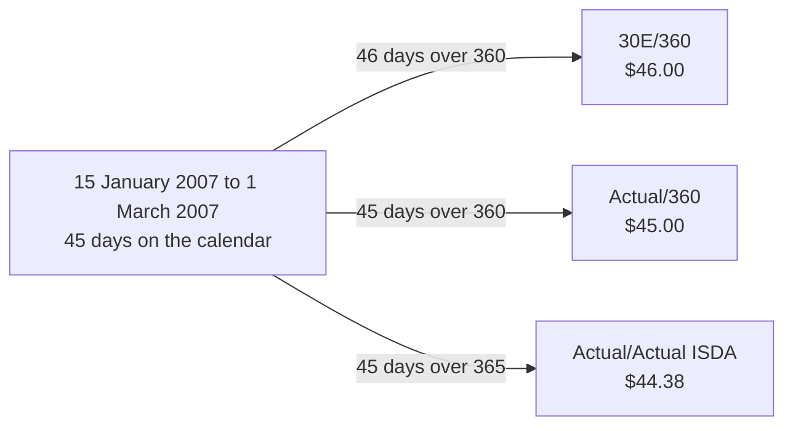
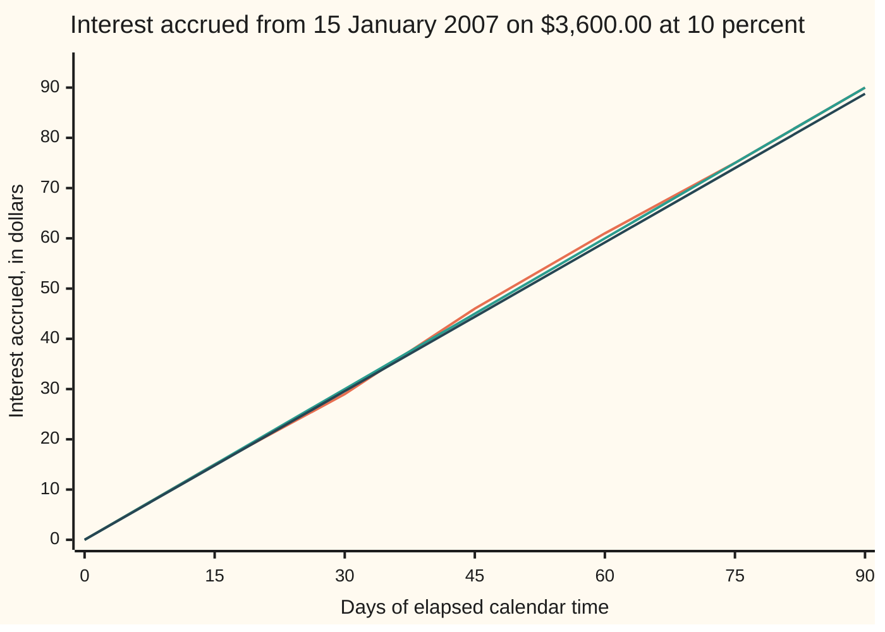
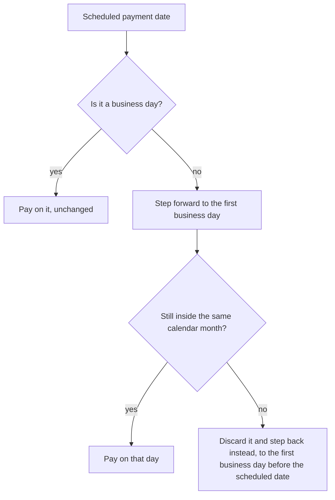

# Day counts: Actual/360, 30/360 and Actual/Actual, and why the same coupon has three sizes

[Syllabus](../../../SYLLABUS.md) → [Financial mathematics](../README.md) → [Money, Dates and Discounting](../README.md#s01) → Day counts

---

## General Overview

A note for $3,600.00 pays 10 percent a year. It is bought on 15 January 2007, and its first coupon falls due on 1 March 2007. Three banks work out that coupon and three different cheques come back: $46.00, $45.00 and $44.38.

None of them has made an error. The dates match, the rate matches, and the interest is simple: nothing compounds inside the period. What differs is the agreed rule for turning two dates into a slice of a year. From 15 January to 1 March is 45 days on a calendar. Is a year 360 days long, or 365, or however many days the calendar happens to hold that year? Does February have 28 days, or a flat 30? Each answer is chosen and written into the contract before anyone reaches for a calculator.

The rule that does the turning is the **day count convention**, the term used from here on. It returns one number, the **year fraction**: how much of a year the period counts as. Interest is then the amount lent, times the yearly rate, times that fraction. Three conventions cover most of the market: Actual/360, Actual/Actual ISDA and 30E/360. A fourth decision, separate from all three, settles what happens when the payment date lands on a Saturday.

**A day count convention is an agreement about how to read a calendar, not a fact about one, so the same dates at the same rate can pay three different amounts and each of them is correct.**

**What kind of fact this is:** a convention — a rule the two sides agree and write down. The arithmetic that follows from it is exact, and the only thing proved on this card is the counting, never the choice.

**Conventions verified 14 September 2026** against section 4.16 of the 2006 ISDA Definitions for the three day count fractions and the FpML 5.10 schema for the rolling rule, both linked in Sources. Markets revise these choices: a convention is a dated fact, not a permanent one.

### The picture: one period, three answers



The calendar supplies one input, the 45 days, and only the middle branch uses it unchanged.

---

## The formula

Notation first, in words. A period runs from a start date to an end date. Written $[s, e)$ — square bracket, then round bracket — it means the start date counts and the end date does not. That is the standard half-open interval, and it is what stops two back-to-back periods from both claiming the day they share.

Interest over one period is always the same product:

$$\text{interest} = N \times q \times \alpha$$

**Read it aloud:** the amount lent, times the yearly rate, times the slice of a year the period counts as.

Here $N$ is the **notional**, the amount the rate is applied to, and $q$ is the **simple annual rate**, quoted as a percent and used as a decimal. The year fraction $\alpha$, said "alpha", is the whole subject of this card. Three conventions compute it three ways.

**Actual/360.** Count the days, divide by 360.

$$\alpha = \frac{n}{360}$$

$n$ is the actual number of days in $[s, e)$: 45 for the note's first period.

**Actual/Actual ISDA.** Cut the period at every 1 January. Divide each piece by the length of the calendar year it sits in, then add.

$$\alpha = \sum_{y} \frac{n_y}{L_y}, \qquad L_y = 365 \text{ or } 366$$

$n_y$ is how many of the days fall in calendar year $y$, and $L_y$ is how many days that year holds: 366 in a leap year, 365 otherwise. Every day of a leap year divides by 366, including a day in January that never sees 29 February.

**30E/360**, the European 30/360, as set out in section 4.16(g) of the 2006 ISDA Definitions. Pretend every month has 30 days and every year 360. Write the start date as year $Y_1$, month $M_1$, day $d_1$, and the end date as $Y_2$, $M_2$, $d_2$. Replace any 31st by a 30th: $D_1 = \min(d_1, 30)$ and $D_2 = \min(d_2, 30)$. Then

$$\alpha = \frac{360(Y_2 - Y_1) + 30(M_2 - M_1) + D_2 - D_1}{360}$$

Read the top line as synthetic years of 360 days, plus synthetic months of 30 days, plus the adjusted difference in day numbers. It is not elapsed time, and Step 3 shows exactly where it parts company with the calendar.

| Symbol | Plain meaning | In our example | Push it up and the answer… |
| --- | --- | --- | --- |
| $N$ | the notional: the amount the rate is applied to | $3,600.00 | every coupon scales with it |
| $q$ | the simple annual rate, as a decimal | 0.10, quoted as 10 percent | every coupon scales with it |
| $\alpha$ | the year fraction: how much of a year the period counts as | 0.125000 under Actual/360 | more interest, in proportion |
| $s$, $e$ | the start and end dates of the period | 15 January and 1 March 2007 | a later end date lengthens the period |
| $n$ | the actual days in $[s, e)$, counted on a calendar | 45 | the fraction rises by 1/360 a day |
| $y$, $n_y$, $L_y$ | a calendar year the period touches; days of the period falling in it; days that year holds | 2007; 45; 365 | a longer year shrinks each day's share |
| $Y$, $M$, $d$, with $Y_1$, $M_1$, $d_1$ and $Y_2$, $M_2$, $d_2$ | any date's year, month and day number; subscript 1 marks the start date, 2 the end date | 2007, 1, 15 and 2007, 3, 1 | a later month adds 30 synthetic days |
| $D_1$, $D_2$ | those two day numbers after any 31st is replaced by a 30th | 15 and 1 | — |
| $O$ | a date's ordinal: how many days it sits after 1 January of year 1 | — | — |
| $C$ | days in the months of $Y$ already completed before month $M$ | 0 for January, 31 for February | — |

### When it holds

- **Valid dates, in order.** Real Gregorian dates, end on or after start. Reversed, every fraction turns negative or zero, and the interest with it.
- **Simple interest across the period.** The year fraction multiplies the rate exactly once; compounding inside the period is the separate calculation in [Discount factors](01-compounding-and-discount-factors.md). Two simple factors multiplied together do not equal one simple factor over the joined period.
- **Unadjusted accrual endpoints.** This contract accrues between the scheduled dates and moves only the payment. A contract may instead say "adjusted" and accrue to the moved date, differing by whole days of interest.
- **A named variant.** "Actual/Actual" alone is not a rule: the ISDA, ICMA and AFB versions share the name and answer differently, which is why the 1999 ISDA paper prints all three. "30/360" collides the same way: the 30E/360 ISDA of section 4.16(h) drags a February month-end to a 30th, which 4.16(g) here never does.
- **30E/360 is not elapsed time.** It reads 46 days where the calendar reads 45, 89 where it reads 91, and 0 where it reads 1, from 30 to 31 January, both clipped to the 30th. Anything treating it as a measure of time is wrong by days.

---

## Why it works

### Step 0: a year fraction is agreed, not measured

Ask how much time sits between 15 January and 1 March and the calendar answers cleanly: 45 days. Ask what fraction of a year that is and the calendar has no answer, because a year is not a fixed number of days. 2007 holds 365 of them; 2008 holds 366. Some denominator has to be chosen, and choosing it is an act of agreement.

A convention can still be held to two forms of honesty. A period of no length must pay nothing. And splitting a period and adding the pieces must give the whole, or a lender could manufacture money by chopping a loan up. The code splits the first period at 1 February: 17 + 28 = 45 days under Actual/360, 16 + 30 = 46 under 30E/360, each matching the undivided period. Actual/Actual passes by construction, being already a sum over pieces.

### Step 1: count the days once, and count them right

Everything starts with the actual day count $n$: how many dates lie in $[s, e)$. Counting by hand across a year boundary is where mistakes live. The reliable method gives every date a serial number and subtracts.

That serial number is the date's **ordinal**, written $O$: how many days it sits after 1 January of year 1. For a date with year $Y$, month $M$ and day number $d$,

$$O = 365(Y-1) + \left\lfloor \frac{Y-1}{4} \right\rfloor - \left\lfloor \frac{Y-1}{100} \right\rfloor + \left\lfloor \frac{Y-1}{400} \right\rfloor + C + d - 1$$

The half-brackets mean "round down to a whole number". The first term counts 365 days for each completed year; the three rounded terms add a day for every fourth year, take one back for every hundredth and hand one over again for every four-hundredth — the Gregorian leap rule, which made 2000 a leap year and 1900 not. $C$ covers the completed months of $Y$, and the last two terms the days inside the current month.

Then $n$ is one subtraction, $O(e) - O(s)$, and the excluded end date takes care of itself.

The code takes a second road sharing no arithmetic with the first: walk every year, month and day number in range, ask of each whether it is a real date inside the period, and count. The roads agree on 45 days, on 182 and on 91.

<details>
<summary>Detailed proof: the ordinal formula counts each calendar day exactly once</summary>

The claim is that $O$ rises by exactly 1 when a date advances by one calendar day. Given that, $O(e) - O(s)$ counts the dates from $s$ up to but not including $e$, which is the definition of $n$.

**Inside a month.** Moving from day $d$ to day $d+1$ leaves $Y$, $M$ and therefore $C$ untouched, and the final term rises by 1.

**Across a month boundary.** The last day of month $M$ carries the day number equal to that month's length. The next date is day 1 of month $M+1$. Completing one more month raises $C$ by that month's length, while the day term drops from it to 1 — a fall of one less. Net change: 1. February's length comes from the same leap test the year terms use, so a leap February counts as 29 in both places.

**Across a year boundary.** From 31 December of year $Y$ to 1 January of year $Y+1$, $C$ falls from eleven months of days to 0 and the day term falls from 31 to 1, together giving up the whole of year $Y$ bar its last day. Meanwhile $Y-1$ rises by one, so the leading terms add 365, plus one more if the newly completed year was a leap year — exactly that year's length. Net change: 1 again.

Only the leap rule and the list of month lengths are special to the Gregorian calendar, and both are supplied, not derived. A calendar is data.

</details>

### Step 2: pick a denominator, and know what it costs

Dividing by 360 is inherited from hand arithmetic: 360 splits evenly into halves, quarters, thirds, sixths and twelfths, so one table of coupon factors served every period. Dividing by the year's real length measures elapsed time honestly.

The gap is not academic. Over the note's 45 days, Actual/360 pays $45.00 and Actual/Actual pays $44.38 on the identical 10 percent quote, because 45/360 is a larger slice of a year than 45/365. The same number on a 360-day basis is worth more cash than on a 365-day basis, which is why a quote without its convention is not a price.

### Step 3: or replace the calendar with a synthetic one

30E/360 goes further and abolishes the calendar. Every month has 30 days, every year 360, and two dates six months apart on the same day number are exactly half a year. Clipping a 31st down to a 30th is what keeps the months equal; without it a period ending on the 31st would quietly buy a free day.

The price is that the count stops tracking time. Over the note's first period 30E/360 reads 46 days where the calendar reads 45; over the second, 180 where the calendar reads 182; over the final stub, 89 where it reads 91. Ahead, then behind, then behind again.



The middle line is Actual/360: elapsed days over 360, dead straight. The lowest is Actual/Actual ISDA, the same days over 365. The third is 30E/360, the only one that bends — behind at 30 elapsed days ($29.00 against $30.00), ahead at 45 ($46.00 against $45.00), level again at 75 and 90. A straight line is what elapsed time looks like; 30E/360 is measuring something else.

### Step 4: Actual/Actual ISDA, and why a leap year gets its own denominator

The note's second period runs 1 September 2007 to 1 March 2008: 182 actual days, of which 122 sit in 2007, a 365-day year, and 60 in 2008, a 366-day year. Actual/Actual ISDA refuses to average them. Each block is divided by its own year's length, then added: a year fraction of 0.498181 and a coupon of $179.35.

Pushing all 182 days through one flat 365 gives 0.498630 and $179.51 — sixteen cents adrift on a small note, and the error grows with the notional. Every day of 2008 is worth 1/366 of a year here, whether or not the period reaches 29 February.

The code takes a second road again, walking the period one day at a time and adding 1/365 or 1/366 as each day requires. Splitting by year and walking day by day are different arithmetic; landing on the same fraction is evidence.

<details>
<summary>Why "Actual/Actual" alone is not a rule</summary>

ISDA's 1999 paper names three versions. The ISDA version is the year split used here. The ICMA version divides by the coupon period's own length multiplied by the number of coupons a year, so a bond's coupon comes out exactly right by construction. The AFB version counts whole years back from the end date and treats the remainder separately. On the same dates they give different numbers, so a contract that writes "Actual/Actual" and stops has not specified a coupon.

</details>

### Step 5: the payment date is a separate decision

A year fraction says how much is owed. It says nothing about when the money moves. The coupon for the leap-year period is due on 1 March 2008, which is a Saturday. The banks are shut.

**Modified following** is the usual answer, and the FpML schema states it in one sentence: move to the first following business day, unless that day falls in the next calendar month, in which case move to the first preceding business day instead.



On the note's four payment dates: 1 March 2007 is a Thursday and stays put. 1 September 2007 and 1 March 2008 are Saturdays and move forward to the Monday. The final payment, due 31 May 2008, is also a Saturday, but stepping forward reaches Monday 2 June — a new month — so it steps back to Friday 30 May. That backward step is the point of the word "modified": it stops a run of month-end payments drifting into the following month and colliding with the next one.

Holidays enter through the same door: any date the contract's calendar marks closed is not a business day, whatever the weekday. With 3 March 2008 named a holiday the March payment moves on to Tuesday 4 March; with 30 May named a holiday the May payment steps back further, to Thursday 29 May.

Deciding whether a date is a Saturday is the one arithmetic step here, and the code does it twice: once by dividing the ordinal by 7 and reading the remainder, since 1 January of year 1 was a Monday, and once by Zeller's congruence, which never mentions ordinals ([Day of the week for any date](../../02-Number%20theory/05-Check%20Digits%2C%20Calendars%20and%20Cycles/03-day-of-the-week.md)). They agree on all four dates.

One separation matters more than the rest. Rolling moves the cash, not the accrual. The final stub still accrues from 1 March to 31 May — 91 days, $91.00 under Actual/360 — and merely pays on 30 May. Accruing to the moved date instead counts 90 days and pays $90.00. Both are legal contracts; only one was signed.

---

## Worked numbers, by hand

The note's first coupon, 15 January 2007 to 1 March 2007, on $3,600.00 at 10 percent.

| Step | Arithmetic | Value |
| --- | --- | --- |
| 15 January to 1 February | 31 − 15 + 1 | 17 |
| 1 February to 1 March | all of February 2007, not a leap year | 28 |
| actual days in the period | 17 + 28 | **45** |
| Actual/360 fraction | 45 ÷ 360 | 0.125000 |
| Actual/360 coupon | 3,600.00 × 0.10 × 0.125000 | **$45.00** |
| Actual/Actual fraction | 45 ÷ 365, every day in 2007 | 0.123288 |
| Actual/Actual coupon | 3,600.00 × 0.10 × 45/365, exactly 3240/73 | **$44.38** |
| 30E/360 numerator | 360 × 0 + 30 × (3 − 1) + 1 − 15 | **46** |
| 30E/360 fraction | 46 ÷ 360 | 0.127778 |
| 30E/360 coupon | 3,600.00 × 0.10 × 0.127778 | **$46.00** |
| the spread the conventions open | 46.00 − 44.38 | **$1.62** |

Forty-five days of a 10 percent note on $3,600.00 is worth $45.00 if a year is 360 days long and $44.38 if it is 365, and the contract, not the calendar, decides which.

### What breaks if you drop a piece

| Mistake | Comes out at | What went wrong |
| --- | --- | --- |
| Counting the first date and the last | 46 days, a coupon of $46.00 | The period is $[s, e)$: the end date belongs to the next period. The wrong answer happens to equal the correct 30E/360 coupon, which hides it |
| Leaving the 31st unclipped in 30E/360 | 33 days from 28 February to 31 March 2007, not 32 | The rule replaces each 31st by a 30th before subtracting |
| One flat 365 across the leap year | $179.51 instead of $179.35 | Under Actual/Actual ISDA the 60 days in 2008 divide by 366, not 365 |
| Accruing to the moved payment date | 90 days instead of 91, $90.00 instead of $91.00 | Modified following moves the cheque; accrual still runs between the scheduled dates |

The code prints all four.

---

## Code, from first principles, and it actually runs

Nothing is imported: no date library, no calendar, no weekday function. Three pairs of independent roads reach the answers. Day counts come from ordinal subtraction and, separately, from visiting every year, month and day number in range and testing each for membership of the period. The Actual/Actual fraction comes from the year split and, separately, from walking the period a day at a time adding 1/365 or 1/366. Weekdays come from the ordinal's remainder on division by 7 and from Zeller's congruence. Money is held in whole cents as integers while the fractions are decimals, so a rounding slip shows as a mismatch instead of hiding.

One piece of luck makes errors visible: $3,600.00 at 10 percent accrues $360.00 in a full year, so under Actual/360 the coupon in dollars is numerically the day count. A wrong count is a wrong dollar figure, in plain sight.

### Python

```python
# Day counts -- the check behind the card.  Nothing is imported.  A note for
# $3,600.00 pays 10 percent a year, simple, so a whole year of accrual pays
# $360.00 and the Actual/360 coupon in dollars equals the day count.  Every
# answer is reached twice: day counts by an ordinal formula and by visiting
# every calendar date, the Actual/Actual fraction in closed form and one day
# at a time, weekdays from the ordinal and by Zeller's congruence.  Money is
# held in whole cents by integer arithmetic, so no rounding can drift.
PAY = 360            # the notional $3,600.00 times the rate 0.10
DEN = 365 * 366      # 133590, one denominator holding both 1/365 and 1/366
MONTHS = [31, 28, 31, 30, 31, 30, 31, 31, 30, 31, 30, 31]
NAMES = ["Monday", "Tuesday", "Wednesday", "Thursday", "Friday", "Saturday", "Sunday"]

def leap(y): return y % 4 == 0 and (y % 100 != 0 or y % 400 == 0)   # 2000 leap, 1900 not
def year_len(y): return 366 if leap(y) else 365
def month_len(y, m): return 29 if m == 2 and leap(y) else MONTHS[m - 1]
def days(s, e): return ordinal(e) - ordinal(s)                      # road one, by ordinals
def thirty_e(s, e):                                                 # 30E/360, ISDA 4.16(g)
    return 360 * (e[0] - s[0]) + 30 * (e[1] - s[1]) + min(e[2], 30) - min(s[2], 30)
def act_act(s, e): return sum(k * (DEN // L) for _, k, L in pieces(s, e))   # over DEN
def cents(num, den): return (200 * PAY * num + den) // (2 * den)    # to the nearest cent
def dollars(c): return f"${c // 100}.{c % 100:02d}"
def show(dt): return f"{dt[0]:04d}-{dt[1]:02d}-{dt[2]:02d}"
def yn(claim): return "yes" if claim else "no"
def weekday(dt): return ordinal(dt) % 7          # 1 January of year 1 was a Monday
def business(dt, hols): return weekday(dt) < 5 and dt not in hols

def ordinal(dt):                         # days since 1 January of year 1, zero based
    y, m, d = dt
    z = y - 1
    return (365 * z + z // 4 - z // 100 + z // 400
            + sum(month_len(y, k) for k in range(1, m)) + d - 1)

def visited(s, e):                       # road two: visit every date on the calendar
    return sum(1 for y in range(s[0], e[0] + 1) for m in range(1, 13)
               for d in range(1, month_len(y, m) + 1) if s <= (y, m, d) < e)

def next_day(dt):
    y, m, d = dt
    if d < month_len(y, m): return (y, m, d + 1)
    return (y, m + 1, 1) if m < 12 else (y + 1, 1, 1)

def prev_day(dt):
    y, m, d = dt
    if d > 1: return (y, m, d - 1)
    return (y, m - 1, month_len(y, m - 1)) if m > 1 else (y - 1, 12, 31)

def pieces(s, e):                        # Actual/Actual ISDA: days in each calendar year
    out = []
    for y in range(s[0], e[0] + 1):
        lo, hi = max(s, (y, 1, 1)), min(e, (y + 1, 1, 1))
        if lo < hi: out.append((y, days(lo, hi), year_len(y)))
    return out

def one_at_a_time(s, e):                 # road two: add one day's share at a time
    total, cur = 0, s
    while cur < e: total, cur = total + DEN // year_len(cur[0]), next_day(cur)
    return total

def gcd(a, b):
    while b: a, b = b, a % b
    return a

def zeller(dt):                          # road two to the weekday, Monday as 0
    y, m, d = dt
    if m < 3: y, m = y - 1, m + 12
    return ((d + (13 * (m + 1)) // 5 + y + y // 4 - y // 100 + y // 400) % 7 + 5) % 7

def modified_following(dt, hols):        # forward, but back if the month changes
    if business(dt, hols): return dt
    f = next_day(dt)
    while not business(f, hols): f = next_day(f)
    if f[1] == dt[1]: return f
    b = prev_day(dt)
    while not business(b, hols): b = prev_day(b)
    return b

def report(label, s, e):
    n, h, aa = days(s, e), thirty_e(s, e), act_act(s, e)
    split = " + ".join(f"{k} in {y} over {L}" for y, k, L in pieces(s, e))
    print(f"{label}: {show(s)} to {show(e)}")
    print(f"  actual days {n} by ordinals, {visited(s, e)} by visiting every date; "
          f"30E/360 numerator {h}; Act/Act days {split}")
    for name, num, den in (("30E/360     ", h, 360), ("Actual/360  ", n, 360),
                           ("Act/Act ISDA", aa, DEN)):
        print(f"  {name}  year fraction {num / den:.6f}  coupon {dollars(cents(num, den))}")
    return n, h, aa

S1, E1, MID = (2007, 1, 15), (2007, 3, 1), (2007, 2, 1)
S2, E2 = (2007, 9, 1), (2008, 3, 1)
S3, E3 = (2008, 3, 1), (2008, 5, 31)
PAYS = [(2007, 3, 1), (2007, 9, 1), (2008, 3, 1), (2008, 5, 31)]
OFFSETS = [0, 15, 30, 45, 60, 75, 90]
print("A note for $3,600.00 at 10 percent a year, simple: a whole year accrues $360.00")
n1, h1, a1 = report("first period, the 45-day stub", S1, E1)
g = gcd(PAY * a1, DEN)
print(f"  Act/Act coupon exactly {PAY * a1 // g}/{DEN // g} dollars = {PAY * a1 / DEN:.6f}; "
      f"one day at a time agrees: {yn(one_at_a_time(S1, E1) == a1)}")
print(f"  widest gap, 30E/360 less Act/Act: {dollars(cents(h1, 360) - cents(a1, DEN))}")
n2, _, a2 = report("second period, across the leap year", S2, E2)
print(f"  one flat 365 instead of the year split: {n2 / 365:.6f}, coupon {dollars(cents(n2, 365))}")
n3, _, _ = report("final stub, due at the month end", S3, E3)
print(f"additivity at {show(MID)}: Actual/360 {days(S1, MID)} + {days(MID, E1)} = {days(S1, E1)}; "
      f"30E/360 {thirty_e(S1, MID)} + {thirty_e(MID, E1)} = {thirty_e(S1, E1)}")
ends, cur, k = [], S1, 0
for off in OFFSETS:
    while k < off: cur, k = next_day(cur), k + 1
    ends.append(cur)
print("accrued from 2007-01-15, in dollars, against days of elapsed calendar time")
print("  elapsed days  " + "".join(f"{o:>7}" for o in OFFSETS))
print("  30E/360       " + "".join(f"{dollars(cents(thirty_e(S1, x), 360)):>7}" for x in ends))
print("  Actual/360    " + "".join(f"{dollars(cents(days(S1, x), 360)):>7}" for x in ends))
print("  Act/Act ISDA  " + "".join(f"{dollars(cents(act_act(S1, x), DEN)):>7}" for x in ends))
print("payment dates: weekday by two roads, then modified following, weekends closed")
for p in PAYS:
    r = modified_following(p, set())
    moved = "stays put" if r == p else f"moves to {show(r)}, a {NAMES[weekday(r)]}"
    print(f"  {show(p)}  {NAMES[weekday(p)]:<9} by ordinal, {NAMES[zeller(p)]:<9} by Zeller; {moved}")
print(f"  with 2008-03-03 a stated holiday, 2008-03-01 moves forward to "
      f"{show(modified_following((2008, 3, 1), {(2008, 3, 3)}))}")
print(f"  with 2008-05-30 a stated holiday, 2008-05-31 moves back to "
      f"{show(modified_following((2008, 5, 31), {(2008, 5, 30)}))}")
u, v, jan = (2007, 2, 28), (2007, 3, 31), ((2007, 1, 30), (2007, 1, 31))   # 30E/360 reads jan as 0
unclipped = 360 * (v[0] - u[0]) + 30 * (v[1] - u[1]) + v[2] - u[2]
rolled = days(S3, (2008, 5, 30))
print("what breaks")
print(f"  counting both endpoints: {n1 + 1} days, Actual/360 coupon "
      f"{dollars(cents(n1 + 1, 360))}, not {dollars(cents(n1, 360))}")
print(f"  leaving the 31st unclipped, {show(u)} to {show(v)}: {unclipped} days, not {thirty_e(u, v)}")
print(f"  one flat 365 across the leap year: coupon {dollars(cents(n2, 365))}, "
      f"not {dollars(cents(a2, DEN))}")
print(f"  accruing to the rolled date, {show(S3)} to 2008-05-30: {rolled} days, "
      f"Actual/360 coupon {dollars(cents(rolled, 360))}, not {dollars(cents(n3, 360))}")
assert days(S1, E1) == visited(S1, E1) == 45 and days(S2, E2) == visited(S2, E2) == 182
assert act_act(S1, E1) == one_at_a_time(S1, E1) and act_act(S2, E2) == one_at_a_time(S2, E2)
assert act_act(S2, E2) == 122 * 366 + 60 * 365 and thirty_e(S2, E2) == 180
assert days(S1, MID) + days(MID, E1) == 45 and thirty_e(S1, MID) + thirty_e(MID, E1) == 46
assert [weekday(p) for p in PAYS] == [zeller(p) for p in PAYS]
assert [modified_following(p, set()) for p in PAYS] == [E1, (2007, 9, 3), (2008, 3, 3), (2008, 5, 30)]
assert (cents(h1, 360), cents(n1, 360), cents(a1, DEN), thirty_e(u, v), rolled, thirty_e(*jan), days(*jan)) == (4600, 4500, 4438, 32, 90, 0, 1)
print("ALL CHECKS PASS")
```

**Ran 2026-09-14 on macOS, Python 3.14.6, standard library only. All checks passed. Output, pasted from the run:**

```
A note for $3,600.00 at 10 percent a year, simple: a whole year accrues $360.00
first period, the 45-day stub: 2007-01-15 to 2007-03-01
  actual days 45 by ordinals, 45 by visiting every date; 30E/360 numerator 46; Act/Act days 45 in 2007 over 365
  30E/360       year fraction 0.127778  coupon $46.00
  Actual/360    year fraction 0.125000  coupon $45.00
  Act/Act ISDA  year fraction 0.123288  coupon $44.38
  Act/Act coupon exactly 3240/73 dollars = 44.383562; one day at a time agrees: yes
  widest gap, 30E/360 less Act/Act: $1.62
second period, across the leap year: 2007-09-01 to 2008-03-01
  actual days 182 by ordinals, 182 by visiting every date; 30E/360 numerator 180; Act/Act days 122 in 2007 over 365 + 60 in 2008 over 366
  30E/360       year fraction 0.500000  coupon $180.00
  Actual/360    year fraction 0.505556  coupon $182.00
  Act/Act ISDA  year fraction 0.498181  coupon $179.35
  one flat 365 instead of the year split: 0.498630, coupon $179.51
final stub, due at the month end: 2008-03-01 to 2008-05-31
  actual days 91 by ordinals, 91 by visiting every date; 30E/360 numerator 89; Act/Act days 91 in 2008 over 366
  30E/360       year fraction 0.247222  coupon $89.00
  Actual/360    year fraction 0.252778  coupon $91.00
  Act/Act ISDA  year fraction 0.248634  coupon $89.51
additivity at 2007-02-01: Actual/360 17 + 28 = 45; 30E/360 16 + 30 = 46
accrued from 2007-01-15, in dollars, against days of elapsed calendar time
  elapsed days        0     15     30     45     60     75     90
  30E/360         $0.00 $15.00 $29.00 $46.00 $61.00 $75.00 $90.00
  Actual/360      $0.00 $15.00 $30.00 $45.00 $60.00 $75.00 $90.00
  Act/Act ISDA    $0.00 $14.79 $29.59 $44.38 $59.18 $73.97 $88.77
payment dates: weekday by two roads, then modified following, weekends closed
  2007-03-01  Thursday  by ordinal, Thursday  by Zeller; stays put
  2007-09-01  Saturday  by ordinal, Saturday  by Zeller; moves to 2007-09-03, a Monday
  2008-03-01  Saturday  by ordinal, Saturday  by Zeller; moves to 2008-03-03, a Monday
  2008-05-31  Saturday  by ordinal, Saturday  by Zeller; moves to 2008-05-30, a Friday
  with 2008-03-03 a stated holiday, 2008-03-01 moves forward to 2008-03-04
  with 2008-05-30 a stated holiday, 2008-05-31 moves back to 2008-05-29
what breaks
  counting both endpoints: 46 days, Actual/360 coupon $46.00, not $45.00
  leaving the 31st unclipped, 2007-02-28 to 2007-03-31: 33 days, not 32
  one flat 365 across the leap year: coupon $179.51, not $179.35
  accruing to the rolled date, 2008-03-01 to 2008-05-30: 90 days, Actual/360 coupon $90.00, not $91.00
ALL CHECKS PASS
```

### Rust

Same numbers, same labels, built with `rustc --edition 2021 -O`.

```rust
// Day counts -- the same check as the Python, in Rust.  No crates.  A note for
// $3,600.00 pays 10 percent a year, simple, so a whole year of accrual pays
// $360.00 and the Actual/360 coupon in dollars equals the day count.  Every
// answer is reached twice: day counts by an ordinal formula and by visiting
// every calendar date, the Actual/Actual fraction in closed form and one day
// at a time, weekdays from the ordinal and by Zeller's congruence.  Money is
// held in whole cents by integer arithmetic, so no rounding can drift.
type D = (i64, i64, i64);
const PAY: i64 = 360;          // the notional $3,600.00 times the rate 0.10
const DEN: i64 = 365 * 366;    // 133590, one denominator holding both 1/365 and 1/366
const MONTHS: [i64; 12] = [31, 28, 31, 30, 31, 30, 31, 31, 30, 31, 30, 31];
const NAMES: [&str; 7] = ["Monday", "Tuesday", "Wednesday", "Thursday", "Friday", "Saturday", "Sunday"];

fn leap(y: i64) -> bool { y % 4 == 0 && (y % 100 != 0 || y % 400 == 0) }  // 2000 leap, 1900 not
fn year_len(y: i64) -> i64 { if leap(y) { 366 } else { 365 } }
fn month_len(y: i64, m: i64) -> i64 { if m == 2 && leap(y) { 29 } else { MONTHS[(m - 1) as usize] } }
fn days(s: D, e: D) -> i64 { ordinal(e) - ordinal(s) }                    // road one, by ordinals
// 30E/360 numerator, ISDA 2006 4.16(g)
fn thirty_e(s: D, e: D) -> i64 { 360 * (e.0 - s.0) + 30 * (e.1 - s.1) + e.2.min(30) - s.2.min(30) }
// Actual/Actual ISDA, counted over DEN
fn act_act(s: D, e: D) -> i64 { pieces(s, e).iter().map(|&(_, k, l)| k * (DEN / l)).sum() }
fn cents(num: i64, den: i64) -> i64 { (200 * PAY * num + den) / (2 * den) }  // to the cent
fn dollars(c: i64) -> String { format!("${}.{:02}", c / 100, c % 100) }
fn show(dt: D) -> String { format!("{:04}-{:02}-{:02}", dt.0, dt.1, dt.2) }
fn yn(claim: bool) -> &'static str { if claim { "yes" } else { "no" } }
fn weekday(dt: D) -> usize { (ordinal(dt) % 7) as usize }   // 1 January of year 1 was a Monday
fn business(dt: D, hols: &[D]) -> bool { weekday(dt) < 5 && !hols.contains(&dt) }

fn ordinal(dt: D) -> i64 {                    // days since 1 January of year 1, zero based
    let (y, m, d) = dt;
    let z = y - 1;
    365 * z + z / 4 - z / 100 + z / 400 + (1..m).map(|k| month_len(y, k)).sum::<i64>() + d - 1
}

fn visited(s: D, e: D) -> i64 {               // road two: visit every date on the calendar
    (s.0..=e.0).map(|y| (1..=12).map(|m| (1..=month_len(y, m))
        .filter(|&d| s <= (y, m, d) && (y, m, d) < e).count() as i64).sum::<i64>()).sum()
}

fn next_day(dt: D) -> D {
    let (y, m, d) = dt;
    if d < month_len(y, m) { (y, m, d + 1) } else if m < 12 { (y, m + 1, 1) } else { (y + 1, 1, 1) }
}

fn prev_day(dt: D) -> D {
    let (y, m, d) = dt;
    if d > 1 { (y, m, d - 1) } else if m > 1 { (y, m - 1, month_len(y, m - 1)) } else { (y - 1, 12, 31) }
}

fn pieces(s: D, e: D) -> Vec<D> {             // Actual/Actual ISDA: days in each calendar year
    let mut out = Vec::new();
    for y in s.0..=e.0 {
        let (lo, hi) = (s.max((y, 1, 1)), e.min((y + 1, 1, 1)));
        if lo < hi { out.push((y, days(lo, hi), year_len(y))) }
    }
    out
}

fn one_at_a_time(s: D, e: D) -> i64 {         // road two: add one day's share at a time
    let (mut total, mut cur) = (0, s);
    while cur < e { total += DEN / year_len(cur.0); cur = next_day(cur) }
    total
}

fn gcd(mut a: i64, mut b: i64) -> i64 {
    while b != 0 { (a, b) = (b, a % b) }
    a
}

fn zeller(dt: D) -> usize {                   // road two to the weekday, Monday as 0
    let (mut y, mut m, d) = dt;
    if m < 3 { y -= 1; m += 12 }
    (((d + 13 * (m + 1) / 5 + y + y / 4 - y / 100 + y / 400) % 7 + 5) % 7) as usize
}

fn modified_following(dt: D, hols: &[D]) -> D {   // forward, but back if the month changes
    if business(dt, hols) { return dt }
    let mut f = next_day(dt);
    while !business(f, hols) { f = next_day(f) }
    if f.1 == dt.1 { return f }
    let mut b = prev_day(dt);
    while !business(b, hols) { b = prev_day(b) }
    b
}

fn report(label: &str, s: D, e: D) -> D {
    let (n, h, aa) = (days(s, e), thirty_e(s, e), act_act(s, e));
    let split: Vec<String> = pieces(s, e).iter()
        .map(|&(y, k, l)| format!("{} in {} over {}", k, y, l)).collect();
    println!("{}: {} to {}", label, show(s), show(e));
    println!("  actual days {} by ordinals, {} by visiting every date; \
              30E/360 numerator {}; Act/Act days {}", n, visited(s, e), h, split.join(" + "));
    for (name, num, den) in [("30E/360     ", h, 360), ("Actual/360  ", n, 360), ("Act/Act ISDA", aa, DEN)] {
        println!("  {}  year fraction {:.6}  coupon {}",
                 name, num as f64 / den as f64, dollars(cents(num, den)));
    }
    (n, h, aa)
}

fn main() {
    let (s1, e1, mid) = ((2007, 1, 15), (2007, 3, 1), (2007, 2, 1));
    let (s2, e2) = ((2007, 9, 1), (2008, 3, 1));
    let (s3, e3) = (e2, (2008, 5, 31));
    let pays: [D; 4] = [(2007, 3, 1), (2007, 9, 1), (2008, 3, 1), (2008, 5, 31)];
    let offsets = [0, 15, 30, 45, 60, 75, 90];
    println!("A note for $3,600.00 at 10 percent a year, simple: a whole year accrues $360.00");
    let (n1, h1, a1) = report("first period, the 45-day stub", s1, e1);
    let g = gcd(PAY * a1, DEN);
    println!("  Act/Act coupon exactly {}/{} dollars = {:.6}; one day at a time agrees: {}",
             PAY * a1 / g, DEN / g, (PAY * a1) as f64 / DEN as f64, yn(one_at_a_time(s1, e1) == a1));
    println!("  widest gap, 30E/360 less Act/Act: {}", dollars(cents(h1, 360) - cents(a1, DEN)));
    let (n2, _, a2) = report("second period, across the leap year", s2, e2);
    println!("  one flat 365 instead of the year split: {:.6}, coupon {}",
             n2 as f64 / 365.0, dollars(cents(n2, 365)));
    let (n3, _, _) = report("final stub, due at the month end", s3, e3);
    println!("additivity at {}: Actual/360 {} + {} = {}; 30E/360 {} + {} = {}", show(mid),
             days(s1, mid), days(mid, e1), days(s1, e1),
             thirty_e(s1, mid), thirty_e(mid, e1), thirty_e(s1, e1));
    let (mut ends, mut cur, mut k): (Vec<D>, D, i64) = (Vec::new(), s1, 0);
    for off in offsets { while k < off { cur = next_day(cur); k += 1 } ends.push(cur) }
    println!("accrued from 2007-01-15, in dollars, against days of elapsed calendar time");
    let mut head = String::from("  elapsed days  ");
    for o in offsets { head.push_str(&format!("{:>7}", o)) }
    println!("{}", head);
    for (name, road) in [("  30E/360       ", 0), ("  Actual/360    ", 1), ("  Act/Act ISDA  ", 2)] {
        let mut line = name.to_string();
        for &x in &ends {
            let c = match road { 0 => cents(thirty_e(s1, x), 360), 1 => cents(days(s1, x), 360),
                                 _ => cents(act_act(s1, x), DEN) };
            line.push_str(&format!("{:>7}", dollars(c)));
        }
        println!("{}", line);
    }
    println!("payment dates: weekday by two roads, then modified following, weekends closed");
    for &p in &pays {
        let r = modified_following(p, &[]);
        let moved = if r == p { "stays put".to_string() }
                    else { format!("moves to {}, a {}", show(r), NAMES[weekday(r)]) };
        println!("  {}  {:<9} by ordinal, {:<9} by Zeller; {}",
                 show(p), NAMES[weekday(p)], NAMES[zeller(p)], moved);
    }
    println!("  with 2008-03-03 a stated holiday, 2008-03-01 moves forward to {}",
             show(modified_following((2008, 3, 1), &[(2008, 3, 3)])));
    println!("  with 2008-05-30 a stated holiday, 2008-05-31 moves back to {}",
             show(modified_following((2008, 5, 31), &[(2008, 5, 30)])));
    let (u, v, jan): (D, D, (D, D)) = ((2007, 2, 28), (2007, 3, 31), ((2007, 1, 30), (2007, 1, 31)));  // 30E/360 reads jan as 0
    let unclipped = 360 * (v.0 - u.0) + 30 * (v.1 - u.1) + v.2 - u.2;
    let rolled = days(s3, (2008, 5, 30));
    println!("what breaks");
    println!("  counting both endpoints: {} days, Actual/360 coupon {}, not {}",
             n1 + 1, dollars(cents(n1 + 1, 360)), dollars(cents(n1, 360)));
    println!("  leaving the 31st unclipped, {} to {}: {} days, not {}",
             show(u), show(v), unclipped, thirty_e(u, v));
    println!("  one flat 365 across the leap year: coupon {}, not {}",
             dollars(cents(n2, 365)), dollars(cents(a2, DEN)));
    println!("  accruing to the rolled date, {} to 2008-05-30: {} days, Actual/360 coupon {}, \
              not {}", show(s3), rolled, dollars(cents(rolled, 360)), dollars(cents(n3, 360)));
    assert!(days(s1, e1) == visited(s1, e1) && visited(s1, e1) == 45);
    assert!(days(s2, e2) == visited(s2, e2) && visited(s2, e2) == 182);
    assert!(act_act(s1, e1) == one_at_a_time(s1, e1) && act_act(s2, e2) == one_at_a_time(s2, e2));
    assert!(act_act(s2, e2) == 122 * 366 + 60 * 365 && thirty_e(s2, e2) == 180);
    assert!(days(s1, mid) + days(mid, e1) == 45 && thirty_e(s1, mid) + thirty_e(mid, e1) == 46);
    assert!(pays.iter().all(|&p| weekday(p) == zeller(p)));
    assert!(pays.iter().map(|&p| modified_following(p, &[])).collect::<Vec<D>>()
            == vec![e1, (2007, 9, 3), (2008, 3, 3), (2008, 5, 30)]);
    assert!((cents(h1, 360), cents(n1, 360), cents(a1, DEN), thirty_e(u, v), rolled, thirty_e(jan.0, jan.1), days(jan.0, jan.1)) == (4600, 4500, 4438, 32, 90, 0, 1));
    println!("ALL CHECKS PASS");
}
```

**Ran 2026-09-14 on macOS, rustc 1.98.1, no crates. All checks passed. Output, pasted from the run:**

```
A note for $3,600.00 at 10 percent a year, simple: a whole year accrues $360.00
first period, the 45-day stub: 2007-01-15 to 2007-03-01
  actual days 45 by ordinals, 45 by visiting every date; 30E/360 numerator 46; Act/Act days 45 in 2007 over 365
  30E/360       year fraction 0.127778  coupon $46.00
  Actual/360    year fraction 0.125000  coupon $45.00
  Act/Act ISDA  year fraction 0.123288  coupon $44.38
  Act/Act coupon exactly 3240/73 dollars = 44.383562; one day at a time agrees: yes
  widest gap, 30E/360 less Act/Act: $1.62
second period, across the leap year: 2007-09-01 to 2008-03-01
  actual days 182 by ordinals, 182 by visiting every date; 30E/360 numerator 180; Act/Act days 122 in 2007 over 365 + 60 in 2008 over 366
  30E/360       year fraction 0.500000  coupon $180.00
  Actual/360    year fraction 0.505556  coupon $182.00
  Act/Act ISDA  year fraction 0.498181  coupon $179.35
  one flat 365 instead of the year split: 0.498630, coupon $179.51
final stub, due at the month end: 2008-03-01 to 2008-05-31
  actual days 91 by ordinals, 91 by visiting every date; 30E/360 numerator 89; Act/Act days 91 in 2008 over 366
  30E/360       year fraction 0.247222  coupon $89.00
  Actual/360    year fraction 0.252778  coupon $91.00
  Act/Act ISDA  year fraction 0.248634  coupon $89.51
additivity at 2007-02-01: Actual/360 17 + 28 = 45; 30E/360 16 + 30 = 46
accrued from 2007-01-15, in dollars, against days of elapsed calendar time
  elapsed days        0     15     30     45     60     75     90
  30E/360         $0.00 $15.00 $29.00 $46.00 $61.00 $75.00 $90.00
  Actual/360      $0.00 $15.00 $30.00 $45.00 $60.00 $75.00 $90.00
  Act/Act ISDA    $0.00 $14.79 $29.59 $44.38 $59.18 $73.97 $88.77
payment dates: weekday by two roads, then modified following, weekends closed
  2007-03-01  Thursday  by ordinal, Thursday  by Zeller; stays put
  2007-09-01  Saturday  by ordinal, Saturday  by Zeller; moves to 2007-09-03, a Monday
  2008-03-01  Saturday  by ordinal, Saturday  by Zeller; moves to 2008-03-03, a Monday
  2008-05-31  Saturday  by ordinal, Saturday  by Zeller; moves to 2008-05-30, a Friday
  with 2008-03-03 a stated holiday, 2008-03-01 moves forward to 2008-03-04
  with 2008-05-30 a stated holiday, 2008-05-31 moves back to 2008-05-29
what breaks
  counting both endpoints: 46 days, Actual/360 coupon $46.00, not $45.00
  leaving the 31st unclipped, 2007-02-28 to 2007-03-31: 33 days, not 32
  one flat 365 across the leap year: coupon $179.51, not $179.35
  accruing to the rolled date, 2008-03-01 to 2008-05-30: 90 days, Actual/360 coupon $90.00, not $91.00
ALL CHECKS PASS
```

The two outputs match line for line.

> [!TIP]
> **Try changing**
> Guess the new number first, then run it. The asserts are pinned to this note's dates, so expect one to stop the program each time.
> - **Count the end date as well.** In `visited`, change `< e` to `<= e`: the period reads 46 days instead of 45, the two roads disagree, and the first assert stops it.
> - **Stop clipping the 31st.** In `thirty_e`, replace `min(e[2], 30) - min(s[2], 30)` by `e[2] - s[2]`. Neither date of the first period is a 31st, so it is unaffected; the February-to-March case reads 33 days and the last assert stops it.
> - **Make every year 365 days.** Set `year_len` to return 365 always: the 122-and-60 split no longer matches and the third assert stops it.
> - **Always roll forward.** In `modified_following`, replace `if f[1] == dt[1]: return f` by `return f`: the final payment moves to 2 June 2008 instead of back to 30 May, and the rolls assert stops it.

---

## The usual mistake

> [!warning]
> **Treating a year fraction as a measurement.** "Forty-five days at 10 percent" sounds like a question with an answer. It is not one until the convention is named: the same 45 days on the same note pays $46.00, $45.00 or $44.38, and no care with the arithmetic chooses between them.
>
> - **Counting both endpoints.** 46 days, not 45, and a coupon of $46.00 — which is the correct 30E/360 answer, so the error survives a sanity check.
> - **Writing "Actual/Actual" and stopping.** ISDA, ICMA and AFB share the name and disagree on the number.
> - **Averaging across a leap year.** One flat 365 over the second period pays $179.51 where the rule pays $179.35.
> - **Rolling the accrual with the payment.** Unless the contract says "adjusted", the final stub still earns 91 days, $91.00, not 90 days and $90.00.

---

## Where you meet it in real life

- **Money-market deposits.** Dollar and euro deposits count Actual/360; sterling counts on a 365-day year. The same quoted rate hands over different cash, which is why a cross-currency comparison converts the basis first. The overnight benchmarks built on those deposits are in [Money markets](../02-Curves/03-money-market-instruments-and-sofr.md).
- **Accrued interest on a bond.** A buyer between coupon dates pays the seller the part of the coupon already earned: a year fraction under the bond's stated convention, and the first line of [Bond price and yield](05-bonds-price-and-yield.md).
- **Interest rate swaps.** A fixed leg on 30E/360 against a floating leg on Actual/360 is ordinary, not sloppy; the mismatch is written into the confirmation and priced.
- **Loan schedules.** Whether a monthly instalment is a twelfth of a year or the actual days over 365 changes the payment, and changes it in February most of all — the level-payment machinery is in [Annuities](03-annuities-and-loans.md).

> **Say it back**
> A day count convention turns two dates into a year fraction, and interest is the notional times the rate times that fraction. Actual/360 counts real days over 360. Actual/Actual ISDA counts real days but divides each calendar year's share by that year's own length, 365 or 366. 30E/360 throws the calendar away and pretends every month has 30 days, clipping any 31st to a 30th. On the same 45 days at the same 10 percent, the three pay $46.00, $45.00 and $44.38. A separate rule, modified following, moves a payment off a closed day to the next business day, or back to the previous one if the next would fall in a new month — and it moves the cash only, not the accrual.

---

## What this builds on

- [Discount factors](01-compounding-and-discount-factors.md): what a rate does to money over a stated span of time, which is the question a year fraction supplies the time for.
- [Day of the week for any date](../../02-Number%20theory/05-Check%20Digits%2C%20Calendars%20and%20Cycles/03-day-of-the-week.md): the calendar arithmetic behind the ordinal and Zeller's congruence, both used here to find the Saturdays.

## Where this goes next

- [Bond price and yield](05-bonds-price-and-yield.md): a bond's quoted price excludes the interest already accrued, and the year fraction on this card is what separates the two.
- [Money markets](../02-Curves/03-money-market-instruments-and-sofr.md): deposits, bills and overnight benchmarks, every one of them quoted with a convention attached.

A convention fixes the size of one coupon on one date. What it cannot do is say what a coupon promised years from now is worth today, and a bond is a whole string of them — which is where [Bond price and yield](05-bonds-price-and-yield.md) begins.

---

## Sources

Verified 14 September 2026: every link below resolves to the publisher's page.

- *2006 ISDA Definitions*. International Swaps and Derivatives Association, 2006. [Publisher page](https://www.isda.org/book/2006-isda-definitions/). Section 4.16 sets out the day count fractions used here, including the 30E/360 rule at 4.16(g), in the wording contracts incorporate by reference.
- International Swaps and Derivatives Association. "The Actual/Actual Day Count Fraction," 1999. [Paper](https://www.isda.org/a/pIJEE/The-Actual-Actual-Day-Count-Fraction-1999.pdf). Prints the ISDA, ICMA and AFB versions side by side, with worked periods across year ends.
- *FpML 5.10 Recommendation*, `BusinessDayConventionEnum`. Financial products Markup Language. [Schema page](https://www.fpml.org/spec/fpml-5-10-5-rec-1/html/confirmation/schemaDocumentation/schemas/fpml-enum-5-10_xsd/simpleTypes/BusinessDayConventionEnum.html). Defines MODFOLLOWING in one sentence, which is the rule the code implements verbatim.
- OpenGamma. *Interest Rate Instruments and Market Conventions Guide*. [Guide](https://quant.opengamma.io/Interest-Rate-Instruments-and-Market-Conventions.pdf). Market by market, which day count and which roll convention is actually quoted.
