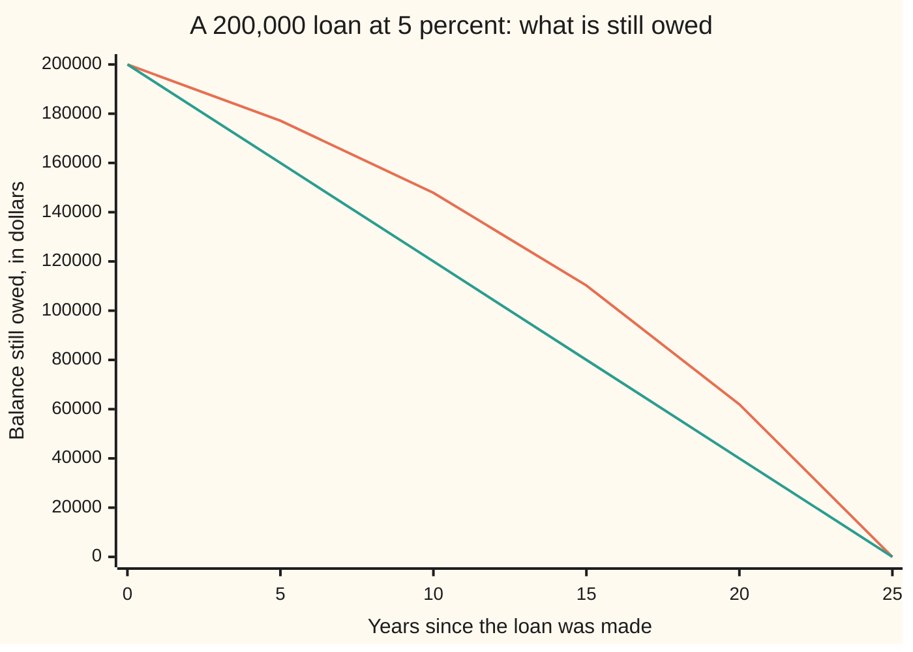
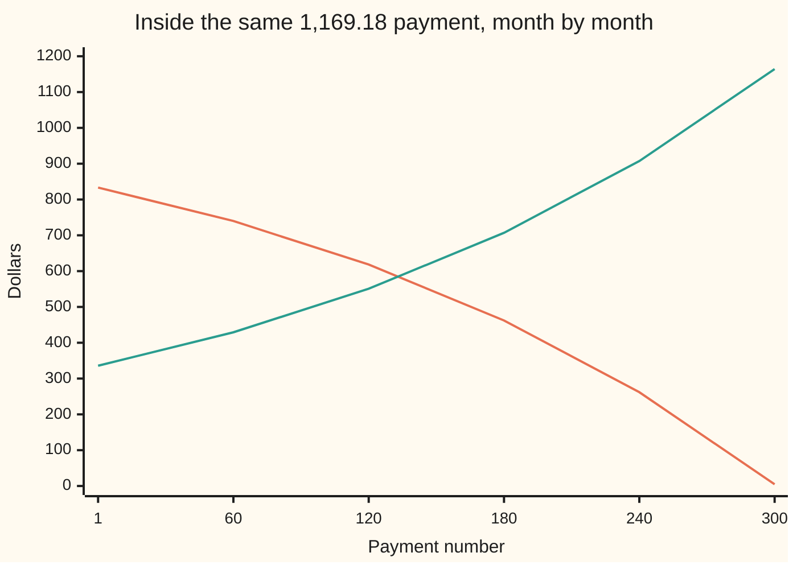

# Annuities: a level stream of payments as one closed form, and the loan schedule it implies

Financial mathematics → Money, Dates and Discounting → Repeating payments → Annuities

---

## General Overview

A bank lends $200,000 to buy a house. The loan runs 25 years, quoted at 5 percent a year, and the borrower pays the same amount at the end of every month until the debt is gone. Three hundred payments, every one identical. The amount is $1,169.18.

That number has work to do. It has to cover the interest charged on whatever is still owed, which falls a little every month, and land the balance on zero at the three hundredth payment, not a month sooner or later.

The way in is to stop looking at the loan and look at the payments. Each payment is a separate promise to hand over $1,169.18 on a fixed date. A promise due later is worth less today, and the fraction of face value it keeps is its **discount factor** ([compounding-and-discount-factors](01-compounding-and-discount-factors.md)). Adding three hundred of those factors one at a time would work, and is unnecessary: each factor is the one before it divided by the same number, and a chain built that way collapses into a single short fraction. That fraction is the **annuity factor**, the term used from here on.

One factor then does three jobs. It turns a loan into a payment. It turns a stream of payments into a price. Run month by month, it splits each payment into interest and repayment. Over the 25 years the borrower hands over $350,754.02, of which $150,754.02 is interest — three quarters of the sum borrowed, handed over again.

**A level stream of payments is a chain of discounted amounts, each a fixed fraction of the one before, so the whole stream collapses to one short formula; dividing a loan by that formula gives the payment that clears it exactly.**

**What kind of fact this is:** a theorem, proved on this card in Why it works. It is exact algebra about dated amounts, not a model of anyone's behaviour. The rate convention fed into it is a market convention, dated below.

### The picture: what is still owed, year by year



The sagging line is the real balance. The straight line is the same debt cleared in 25 equal slices of principal, which is what most people picture. After five years the real balance is $177,160.38, not $160,000.00, because the early payments are mostly interest. The two lines meet again only at the end.

---

## The formula

Notation first, in words. A **period** is one gap between payments: here, one month. The **period rate** $i$ is the interest charged on the balance over one period, written as a decimal. The **discount factor** for a payment $k$ periods away is $(1+i)^{-k}$ — divide by $1+i$ once for every period the money has to wait. The value today of one dollar paid at the end of each of $n$ periods is written $a_n(i)$, said "a-n at i": the annuity factor. (Actuarial books draw an angle over the $n$; this card puts the period count in brackets and the rate after it.)

$$a_n(i) \;=\; \sum_{k=1}^{n} (1+i)^{-k} \;=\; \frac{1-(1+i)^{-n}}{i}$$

**Read it aloud:** one dollar at the end of every period for n periods is worth, today, one minus the discount factor of the very last payment, all divided by the period rate.

A level stream of $A$ per period is $A$ copies of that dollar, so a loan and its payment are two readings of the same line:

$$L \;=\; A\,a_n(i), \qquad A \;=\; \frac{L}{a_n(i)}$$

**Read it aloud:** the sum borrowed is the payment times the annuity factor, so the payment is the sum borrowed divided by the annuity factor.

If the payments never stop and the rate is above zero, the last discount factor falls away to nothing and the factor settles at $1/i$. A never-ending level stream is a **perpetuity**, worth $A/i$.

| Symbol | Plain meaning | In our example | Push it up and the answer… |
| --- | --- | --- | --- |
| $L$ | the sum borrowed today | $200,000.00 | the payment rises in step: twice the loan, twice the payment |
| $A$ | the level payment, at the end of each period | $1,169.18 | the debt clears sooner, and the term no longer fits |
| $i$ | the period rate: interest on the balance over one period | 0.416667 percent a month | less of each payment reaches the debt, so the payment must rise |
| $n$ | how many payments the contract has | 300 | the payment falls, and the total interest climbs |
| $k$ | which payment is being looked at, 1 to $n$ | 100 | — |
| $a_n(i)$ | the annuity factor: today's value of 1 per period for $n$ periods | 171.060047 | each dollar of payment supports more debt |
| $s_k(i)$ | the accumulation factor: what 1 at the end of each of $k$ periods grows into by period $k$ | 123.740222 after 100 | — |
| $B_k$ | the balance still owed just after payment $k$ | $158,442.25 after 100 | — |
| $I_k$ | the interest inside payment $k$ | $833.33 in month 1 | — |
| $Q_k$ | the principal inside payment $k$: what comes off the debt | $335.85 in month 1 | — |
| $r$ | the rate as the market quotes it, per year | 5 percent | the payment rises, and more of each one is interest |
| $m$ | payments per year, the number that turns $r$ into $i$ | 12 | each payment is smaller, and interest is charged more often |

Three helper lines. The first is the market's translation from the quoted rate to the period rate:

$$i \;=\; \frac{r}{m}, \qquad n \;=\; m \times (\text{years in the term})$$

In plain words: cut the quoted yearly rate into $m$ equal pieces, one per payment period, and count the periods. That is a convention, not algebra; the next bullet list says what depends on it.

The second gives the balance at any point, two ways round:

$$B_k \;=\; A\,a_{n-k}(i) \;=\; L(1+i)^k - A\,s_k(i), \qquad s_k(i) = \frac{(1+i)^k-1}{i}$$

In plain words: what is still owed is the value of the payments still due; equally, it is the loan grown forward to date $k$ less every payment made, each grown forward to the same date. The accumulation factor $s_k(i)$ is what one dollar at the end of each of $k$ periods grows into by period $k$.

The third splits a single payment:

$$I_k \;=\; i\,B_{k-1}, \qquad Q_k \;=\; A - I_k$$

In plain words: interest is charged on last period's balance, and whatever is left of the payment comes off the debt.

### When it holds

- **Equal periods, one payment at the end of each.** Move every payment to the start of its month and each one arrives a period earlier: the same loan then needs $1,164.33 a month, $4.85 less.
- **One rate for the whole run.** A rate that resets makes the factor right only up to the reset; after it, a fresh factor is worked out on the balance owing then. Rates fixed for a whole 25-year term are ordinary in some markets and unavailable in others.
- **The rate must match the period.** $i$ is per payment period, never per year unless the payments are yearly. Price the loan as 25 year-end payments and split each by twelve and it comes to $1,182.54: wrong, and close enough to look right.
- **Payments as written, nothing else charged.** Fees, arrears, default and early repayment all sit outside the formula. The schedule is the contract's arithmetic, not a forecast of what a household will do ([mortgage-cash-flows-and-prepayment](../35-Mortgages%2C%20Callables%20and%20Prepayment/02-mortgage-cash-flows-and-prepayment.md)).
- **A perpetuity needs a rate above zero.** At zero or below, the discounted payments stop shrinking and the total runs away. $A/i$ would still print a number; it would not be a value.

**Conventions verified 14 Sep 2026:** the 5 percent here is a nominal yearly rate charged as one twelfth of itself each month, which is how United States mortgages are quoted and disclosed (Regulation Z, cited below). Canadian mortgage law makes the lender state a rate "calculated yearly or half-yearly, not in advance", so the identical quoted number produces a different monthly charge there. Check the quoting rule before feeding a rate into the factor; day counts and payment dates are the sibling card [day-counts-and-dates](02-day-counts-and-dates.md).

---

## Why it works

### Step 0: price each payment on its own, then add them up

There is no way to value a whole loan in one stroke. There is an easy way to value one payment: a dollar due $k$ months out is worth $(1+i)^{-k}$ today. So value the three hundred payments one at a time and add the answers. The loan is the payment times the sum of three hundred discount factors, and the only hard part left is that sum.

### Step 1: the terms form a chain with a fixed ratio

The first term is $1/(1+i)$. The second is that divided by $1+i$ again. Every term is the one before it divided by the same number, three hundred rungs down. A chain with a constant ratio like this is a geometric series ([series-convergence](../../06-Calculus%20and%20analysis/06-Series/01-series-convergence.md)), and geometric chains are the one kind that can be added in closed form.

### Step 2: shift the chain and subtract it from itself

Multiply the whole sum by $1+i$. Every term climbs one rung: the month-two term becomes the month-one term, the month-three term becomes the month-two term, and so on. Now subtract the original sum from the shifted one. Every rung in the middle appears in both lists and cancels. Two survive: a bare 1 at the top, and $(1+i)^{-n}$ at the bottom. The left-hand side of that subtraction is the sum multiplied by $i$, so

$$i\,a_n(i) \;=\; 1 - (1+i)^{-n}.$$

Divide by $i$ and the closed form is out. For the mortgage the last discount factor is 0.287250 and the monthly rate is 0.416667 percent, so the factor is 171.060047: the entire 25-year stream of one dollar a month is worth a little over 171 dollars today.

<details>
<summary>Detailed proof: the collapse, the balance and the limit</summary>

**The sum.** Write $S = \sum_{k=1}^{n}(1+i)^{-k}$. Then
$$(1+i)S = \sum_{k=1}^{n}(1+i)^{-(k-1)} = \sum_{j=0}^{n-1}(1+i)^{-j}.$$
Subtracting, $(1+i)S - S = iS$, and on the right every index from 1 to $n-1$ appears in both sums and cancels, leaving $(1+i)^{0} - (1+i)^{-n} = 1-(1+i)^{-n}$. So $iS = 1-(1+i)^{-n}$, which is the closed form for $i \ne 0$. At $i = 0$ every term is 1 and $S = n$ directly; the closed form's zero denominator is an artefact of the division, and the sum has no trouble there.

**The balance.** Let $B_0 = L$ and $B_k = (1+i)B_{k-1} - A$: interest is added, then the payment lands. Induction gives $B_k = L(1+i)^k - A\sum_{j=1}^{k}(1+i)^{k-j} = L(1+i)^k - A\,s_k(i)$, since multiplying the previous line by $1+i$ raises every exponent and the new $-A$ joins the sum at exponent 0. Substituting $L = A\sum_{j=1}^{n}(1+i)^{-j}$ and multiplying through by $(1+i)^k$ cancels the terms with $j \le k$ against $s_k(i)$, leaving $B_k = A\sum_{j=k+1}^{n}(1+i)^{k-j} = A\,a_{n-k}(i)$. At $k=n$ the sum is empty, so $B_n = 0$: the payment from Step 3 clears the loan exactly.

**The split.** $Q_k = A - iB_{k-1} = B_{k-1} - B_k$. Using $B_k = A\,a_{n-k}(i)$ and $a_m(i) - a_{m-1}(i) = (1+i)^{-m}$ gives $Q_k = A(1+i)^{-(n-k+1)}$, so $Q_{k+1} = (1+i)Q_k$ and the principal parts are themselves a geometric chain. Adding them telescopes to $B_0 - B_n = L$, so the principal parts total the loan and the interest parts total $nA - L$ — no separate calculation needed.

**The limit.** For $i>0$, $(1+i)^{-n} \to 0$, so $a_n(i) \to 1/i$ and the tail beyond payment $n$ is $A/i - A\,a_n(i) = (A/i)(1+i)^{-n}$. For $-1 < i \le 0$ each discounted payment is at least $A$, so $n$ of them total at least $n$ times the payment, which grows without bound: no perpetuity value exists there.

</details>

### Step 3: divide, and know the division is safe

Before inverting anything, check the inversion is legitimate. The annuity factor is a sum of $n$ strictly positive terms, so it is positive for every rate above $-1$; dividing by it is always allowed and always gives exactly one answer. It also falls steadily as the rate rises, since every term shrinks, so a higher rate always means a bigger payment and never a second solution. The one boundary case is a rate of exactly zero: the closed form divides by zero, while the sum itself is $n$, and the payment is the loan split $n$ ways.

So $200,000.00 \div 171.060047$, which is **$1,169.18** a month.

### Step 4: the balance runs forwards and backwards to the same place

What is still owed after 100 payments can be read two ways, and they have to agree.

Looking ahead: 200 payments remain, so the debt is worth exactly what those 200 payments are worth today — $158,442.25.

Looking back: grow the original $200,000.00 forward 100 months at the monthly rate, then subtract each of the 100 payments made, every one grown forward to the same date. Same answer, $158,442.25. The first view is what a lender quotes as a redemption figure; the second is what the ledger actually did.

The split inside a payment follows at once. Interest is the rate times last month's balance; the rest is principal. Because the balance falls, the interest part falls and the principal part grows — by a factor of exactly $1+i$ each month, which makes the principal parts their own geometric chain, climbing at the loan's own rate. The final month's principal is the payment divided by $1+i$: $1,164.33.

### Step 5: let the payments run on forever

As $n$ grows, $(1+i)^{-n}$ shrinks toward nothing whenever $i > 0$, so the factor settles at $1/i$ and a never-ending stream is worth $A/i$. Read backwards, it says which payment a sum will support forever: $200,000.00 at 0.416667 percent a month gives exactly $833.33. That is the interest-only payment, and it repays nothing at all. Every cent of the real $1,169.18 above it is principal.

The same limit measures what the 25-year contract leaves on the table: everything past the three hundredth payment is worth $80,603.22 today. A mortgage is a perpetuity with its tail sold off.

A different route reaches the same factor from the other end: a bond's coupons are a level stream, so a bond price is an annuity plus one lump at maturity. That route is [bonds-price-and-yield](05-bonds-price-and-yield.md); the cross-check below shows the two agreeing.

---

## Worked numbers, by hand

| Step | Arithmetic | Value |
| --- | --- | --- |
| the period rate | 5 percent ÷ 12 | 0.416667 percent a month |
| discount factor for the last payment | divide by 1.00416667 three hundred times | 0.287250 |
| the annuity factor | (1 − 0.287250) ÷ the period rate | 171.060047 |
| the payment | 200,000.00 ÷ 171.060047 | **1,169.18** |
| month 1 interest | 200,000.00 × 0.416667 percent | 833.33 |
| month 1 principal | 1,169.18 − 833.33 | 335.85 |
| balance after month 1 | 200,000.00 − 335.85 | 199,664.15 |
| everything handed over | 300 × 1,169.18 | 350,754.02 |
| interest over the 25 years | 350,754.02 − 200,000.00 | **150,754.02** |

Twenty-five years of payments buy the house and three quarters of it again: $200,000.00 of debt, and $150,754.02 of rent on the money.

The same factor prices this shelf's house bond, which is the cross-check. A $1,000 five-year bond paying 6 percent a year is $60 a year for five years plus $1,000 back at the end. Valued at a 5 percent market yield, the coupons are $60 times the five-year annuity factor and the face value is one discounted lump. Together they come to $1,043.29. Adding the six payments one at a time gives $1,043.29 as well.

### What breaks if you drop a piece

| Mistake | Comes out at | What went wrong |
| --- | --- | --- |
| Yearly rate, 25 yearly payments, then split by 12 | 1,182.54 | Eleven of each year's twelve payments arrive early and start cutting the balance sooner; one year-end payment does not |
| 5 percent charged flat on the whole $200,000 for 25 years | 1,500.00 | The balance falls every month, so flat quoting charges interest on money already repaid |
| Payments taken at the start of each month, priced as if at the end | 1,164.33 is right, 1,169.18 charged | Every payment arrives one period earlier, so the right payment is the level one divided by $1+i$ |
| Paying the interest and nothing else | 833.33 | That is the perpetuity payment: it rents the money forever and never buys any of it |

The code prints all four.

---

## The payment never moves; everything inside it does

Month 1 and month 300 cost the same $1,169.18. The first buys $335.85 of the house; the last buys $1,164.33 of it. Nothing in the contract changed, and no rate moved. The balance moved, and interest is charged on the balance.

| Payment | Interest | Principal | Balance after |
| --- | --- | --- | --- |
| 1 | 833.33 | 335.85 | 199,664.15 |
| 2 | 831.93 | 337.25 | 199,326.91 |
| 3 | 830.53 | 338.65 | 198,988.26 |
| 100 | 662.29 | 506.89 | 158,442.25 |
| 200 | 400.94 | 768.24 | 95,457.97 |
| 299 | 9.68 | 1,159.50 | 1,164.33 |
| 300 | 4.85 | 1,164.33 | 0 |

Payment 100 is a third of the way through the term and the balance is still $158,442.25 of the original $200,000.00. That is the shape of every level-payment loan: slow at the start, quick at the end.

### One force at a time: the interest inside the payment

One block stands for the same number of dollars in every row; the payment holding the interest is $1,169.18 every time.

```
payment    interest inside the payment
     1   █████████████████████████   $833.33
    60   ██████████████████████      $739.96
   120   ███████████████████         $618.33
   180   ██████████████              $462.25
   240   ████████                    $261.93
   300                               $4.85
```

### Both halves in one picture



The falling line is interest, the rising line is principal, and at every payment number the two add to $1,169.18. They cross a little before the halfway point: until then most of the money is rent, and after it most of the money is the house. The rising line is not straight: each month's principal is the month before it multiplied by one plus the period rate, which is the loan's own rate working for the borrower rather than against.

---

## Code, from first principles, and it actually runs

Nothing is imported. The annuity factor is built two ways that share no arithmetic: the closed form, and adding all three hundred discount factors one at a time. The payment is then found two ways: dividing the loan by the factor, and a bisection that hunts for the payment leaving a zero balance after a month-by-month ledger, a search that never sees a formula at all. The balance after payment 100 comes out three ways, the perpetuity tail two ways, and the house bond is priced both with the factor and by adding its six payments in turn. The quoted payment, trimmed to whole cents, is run through the same ledger to see what it leaves owing. Every wrong number in the tables above is reproduced at the end.

### Python

```python
# Annuities and loans -- the check behind the card.  Nothing is imported.  A
# 200,000 mortgage over 25 years, quoted at 5 percent a year and charged as
# 5/12 of a percent on the balance each month.  The level payment is reached
# three independent ways, the balance after a chosen month three ways, and the
# same factor prices the shelf's 1,000 five-year 6 percent bond at 5 percent.
LOAN, RATE, YEARS, PER = 200000.0, 0.05, 25, 12
N, I = YEARS * PER, RATE / PER            # 300 payments; monthly rate 0.05/12

def a_closed(i, n):                       # road 1: the closed form on the card
    return (1.0 - (1.0 + i) ** (-n)) / i

def a_added(i, n):                        # road 2: add the n discount factors
    total, d = 0.0, 1.0
    for _ in range(n):
        d = d / (1.0 + i)
        total = total + d
    return total

def schedule(payment, i, n, loan):        # road 3: the ledger, month by month
    bal, interest, rows = loan, 0.0, []
    for k in range(1, n + 1):
        charge = bal * i                  # interest on what is still owed
        bal = bal + charge - payment      # then the payment lands
        interest = interest + charge
        rows.append((k, charge, payment - charge, bal))
    return bal, interest, rows

def payment_bisect(i, n, loan):           # road 3: hunt the payment ending at zero
    lo, hi = 0.0, loan
    for _ in range(100):
        mid = 0.5 * (lo + hi)
        if schedule(mid, i, n, loan)[0] > 0.0:
            lo = mid                      # too small: debt left over
        else:
            hi = mid                      # too big: overshot into credit
    return 0.5 * (lo + hi)

def one(name, value):
    print(f"{name:<44}{value:>14.6f}")

fac_closed, fac_added = a_closed(I, N), a_added(I, N)
A = LOAN / fac_closed
A_bisect = payment_bisect(I, N, LOAN)
end_balance, interest_total, rows = schedule(A, I, N, LOAN)
K = 100
bal_ledger = rows[K - 1][3]
bal_ahead = A * a_closed(I, N - K)                        # the payments still due
s_k = ((1.0 + I) ** K - 1.0) / I                          # 1 a month for 100 months, grown
bal_behind = LOAN * (1.0 + I) ** K - A * s_k
perp = LOAN * I                                           # payment that never clears
tail_gap = A * (a_added(I, 20000) - fac_added)            # the payments past the 300th, added
tail_form = (A / I) * (1.0 + I) ** (-N)
ROUNDED = round(A * 100.0) / 100.0                        # the payment as a lender quotes it
short = schedule(ROUNDED, I, N, LOAN)[0]                  # what the trimmed cents leave owing
short_form = (A - ROUNDED) * ((1.0 + I) ** N - 1.0) / I   # the same shortfall, grown forward
FACE, COUPON, YLD, NY = 1000.0, 0.06, 0.05, 5             # the shelf's house bond
bond_factor = FACE * COUPON * a_closed(YLD, NY) + FACE * (1.0 + YLD) ** (-NY)
bond_terms = FACE * (1.0 + YLD) ** (-NY)
for k in range(1, NY + 1):
    bond_terms = bond_terms + FACE * COUPON * (1.0 + YLD) ** (-k)
wrong_annual = LOAN * RATE / (1.0 - (1.0 + RATE) ** (-YEARS)) / PER
wrong_flat = (LOAN + LOAN * RATE * YEARS) / N
wrong_due = A / (1.0 + I)

print(f"loan {LOAN:.2f}, {N} monthly payments, quoted {RATE * 100:.3f} percent a year")
one("monthly rate in percent, 5/12 of one", I * 100.0)
one("discount factor for month 300, (1+i)^-300", (1.0 + I) ** (-N))
one("annuity factor a(300), closed form", fac_closed)
one("annuity factor a(300), 300 terms added", fac_added)
one("payment, loan / factor", A)
one("payment, bisection on the final balance", A_bisect)
one("balance after the 300th payment", end_balance)
one("total handed over, 300 payments", N * A)
one("total interest, 300 payments - loan", N * A - LOAN)
one("total interest, summed from the ledger", interest_total)

print()
print("month   payment   interest  principal    balance")
for k in (1, 2, 3, 100, 200, 299, 300):
    m, charge, principal, bal = rows[k - 1]
    print(f"{m:>5}{A:>10.2f}{charge:>11.2f}{principal:>11.2f}{bal:>11.2f}")

print()
one("balance after month 100, from the ledger", bal_ledger)
one("balance after month 100, payments still due", bal_ahead)
one("balance after month 100, grown less repaid", bal_behind)
one("accumulation factor s(100), 1 a month grown", s_k)

print()
one("perpetuity payment, loan x monthly rate", perp)
one("value past month 300, later payments added", tail_gap)
one("value past month 300, (A/i)(1+i)^-300", tail_form)

print()
one("left owing after 300 payments of 1169.18", short)
one("last payment when the rest are rounded cents", ROUNDED + short)

print()
one("bond 1000 5y 6pc at 5pc, 60 x a(5) + face", bond_factor)
one("bond 1000 5y 6pc at 5pc, six terms added", bond_terms)

print()
one("wrong: yearly rate, yearly payment, then /12", wrong_annual)
one("wrong: 5pc flat for 25 years, split 300 ways", wrong_flat)
one("wrong: paying at the start of each month", wrong_due)
one("wrong: interest only, principal never falls", perp)

print()
years = [0, 5, 10, 15, 20, 25]
months = [1, 60, 120, 180, 240, 300]
print(f"{'chart, years elapsed':<28}" + " ".join(f"{y:>9d}" for y in years))
print(f"{'chart, balance owed':<28}" + " ".join(
    f"{A * a_closed(I, N - y * PER):>9.2f}" for y in years))
print(f"{'chart, loan in equal chunks':<28}" + " ".join(
    f"{LOAN * (1 - y / YEARS):>9.2f}" for y in years))
print(f"{'chart, payment number':<28}" + " ".join(f"{m:>9d}" for m in months))
print(f"{'chart, interest part':<28}" + " ".join(f"{rows[m - 1][1]:>9.2f}" for m in months))
print(f"{'chart, principal part':<28}" + " ".join(f"{rows[m - 1][2]:>9.2f}" for m in months))

assert abs(A - A_bisect) < 1e-6                    # closed form vs the ledger's own answer
assert abs(fac_closed - fac_added) < 1e-9          # closed form vs 300 added terms
assert abs(bal_ahead - bal_ledger) < 1e-6 and abs(bal_behind - bal_ledger) < 1e-6
assert abs(bond_factor - bond_terms) < 1e-9        # one factor vs six discounted terms
assert abs(interest_total - (N * A - LOAN)) < 1e-6
assert abs(tail_gap - tail_form) < 1e-6            # the tail, added vs the closed form
assert abs(short - short_form) < 1e-6              # rounding shortfall, ledger vs grown
assert abs(end_balance) < 1e-6                     # the loan really does clear
print("ALL CHECKS PASS")
```

**Ran 2026-09-14 on macOS, Python 3.14.6, standard library only. All checks passed. Output, pasted from the run:**

```
loan 200000.00, 300 monthly payments, quoted 5.000 percent a year
monthly rate in percent, 5/12 of one              0.416667
discount factor for month 300, (1+i)^-300         0.287250
annuity factor a(300), closed form              171.060047
annuity factor a(300), 300 terms added          171.060047
payment, loan / factor                         1169.180083
payment, bisection on the final balance        1169.180083
balance after the 300th payment                  -0.000000
total handed over, 300 payments              350754.024905
total interest, 300 payments - loan          150754.024905
total interest, summed from the ledger       150754.024905

month   payment   interest  principal    balance
    1   1169.18     833.33     335.85  199664.15
    2   1169.18     831.93     337.25  199326.91
    3   1169.18     830.53     338.65  198988.26
  100   1169.18     662.29     506.89  158442.25
  200   1169.18     400.94     768.24   95457.97
  299   1169.18       9.68    1159.50    1164.33
  300   1169.18       4.85    1164.33      -0.00

balance after month 100, from the ledger     158442.248492
balance after month 100, payments still due  158442.248492
balance after month 100, grown less repaid   158442.248492
accumulation factor s(100), 1 a month grown     123.740222

perpetuity payment, loan x monthly rate         833.333333
value past month 300, later payments added    80603.219924
value past month 300, (A/i)(1+i)^-300         80603.219924

left owing after 300 payments of 1169.18          0.049437
last payment when the rest are rounded cents   1169.229437

bond 1000 5y 6pc at 5pc, 60 x a(5) + face      1043.294767
bond 1000 5y 6pc at 5pc, six terms added       1043.294767

wrong: yearly rate, yearly payment, then /12   1182.540955
wrong: 5pc flat for 25 years, split 300 ways   1500.000000
wrong: paying at the start of each month       1164.328713
wrong: interest only, principal never falls     833.333333

chart, years elapsed                0         5        10        15        20        25
chart, balance owed         200000.00 177160.38 147848.95 110231.88  61955.68      0.00
chart, loan in equal chunks 200000.00 160000.00 120000.00  80000.00  40000.00      0.00
chart, payment number               1        60       120       180       240       300
chart, interest part           833.33    739.96    618.33    462.25    261.93      4.85
chart, principal part          335.85    429.22    550.85    706.94    907.25   1164.33
ALL CHECKS PASS
```

### Rust

Same numbers, same labels, built with `rustc --edition 2021 -O`.

```rust
// Annuities and loans -- the same check as annuities_and_loans_check.py, in
// Rust.  No crates.  A 200,000 mortgage over 25 years, quoted at 5 percent a
// year and charged as 5/12 of a percent on the balance each month.  The level
// payment is reached three independent ways, the balance after a chosen month
// three ways, and the same factor prices the house bond at a 5 percent yield.
const LOAN: f64 = 200000.0;
const RATE: f64 = 0.05;
const YEARS: usize = 25;
const PER: usize = 12;

fn a_closed(i: f64, n: usize) -> f64 {          // road 1: the closed form on the card
    (1.0 - (1.0 + i).powf(-(n as f64))) / i
}

fn a_added(i: f64, n: usize) -> f64 {           // road 2: add the n discount factors
    let (mut total, mut d) = (0.0, 1.0);
    for _ in 0..n {
        d = d / (1.0 + i);
        total = total + d;
    }
    total
}

type Ledger = (f64, f64, Vec<(usize, f64, f64, f64)>);

fn schedule(payment: f64, i: f64, n: usize, loan: f64) -> Ledger {
    let (mut bal, mut interest, mut rows) = (loan, 0.0, Vec::new());  // road 3: the ledger
    for k in 1..=n {
        let charge = bal * i;                   // interest on what is still owed
        bal = bal + charge - payment;           // then the payment lands
        interest = interest + charge;
        rows.push((k, charge, payment - charge, bal));
    }
    (bal, interest, rows)
}

fn payment_bisect(i: f64, n: usize, loan: f64) -> f64 {   // road 3: the payment ending at zero
    let (mut lo, mut hi) = (0.0, loan);
    for _ in 0..100 {
        let mid = 0.5 * (lo + hi);
        if schedule(mid, i, n, loan).0 > 0.0 {
            lo = mid;                           // too small: debt left over
        } else {
            hi = mid;                           // too big: overshot into credit
        }
    }
    0.5 * (lo + hi)
}

fn one(name: &str, value: f64) { println!("{:<44}{:>14.6}", name, value); }

fn row(vals: Vec<String>) -> String { vals.join(" ") }

fn main() {
    let n = YEARS * PER;
    let i = RATE / PER as f64;                  // 300 payments; monthly rate 0.05/12
    let (fac_closed, fac_added) = (a_closed(i, n), a_added(i, n));
    let a = LOAN / fac_closed;
    let a_bisect = payment_bisect(i, n, LOAN);
    let (end_balance, interest_total, rows) = schedule(a, i, n, LOAN);
    let k = 100usize;
    let bal_ledger = rows[k - 1].3;
    let bal_ahead = a * a_closed(i, n - k);                       // the payments still due
    let s_k = ((1.0 + i).powf(k as f64) - 1.0) / i;               // 1 a month for 100 months, grown
    let bal_behind = LOAN * (1.0 + i).powf(k as f64) - a * s_k;
    let perp = LOAN * i;                                          // payment that never clears
    let tail_gap = a * (a_added(i, 20000) - fac_added);           // the payments past the 300th, added
    let tail_form = (a / i) * (1.0 + i).powf(-(n as f64));
    let rounded = (a * 100.0).round() / 100.0;                    // the payment as a lender quotes it
    let short = schedule(rounded, i, n, LOAN).0;                  // what the trimmed cents leave owing
    let short_form = (a - rounded) * ((1.0 + i).powf(n as f64) - 1.0) / i;  // the same, grown forward
    let (face, coupon, yld, ny) = (1000.0_f64, 0.06_f64, 0.05_f64, 5usize);   // the house bond
    let bond_factor = face * coupon * a_closed(yld, ny) + face * (1.0 + yld).powf(-(ny as f64));
    let mut bond_terms = face * (1.0 + yld).powf(-(ny as f64));
    for k in 1..=ny {
        bond_terms = bond_terms + face * coupon * (1.0 + yld).powf(-(k as f64));
    }
    let wrong_annual = LOAN * RATE / (1.0 - (1.0 + RATE).powf(-(YEARS as f64))) / PER as f64;
    let wrong_flat = (LOAN + LOAN * RATE * YEARS as f64) / n as f64;
    let wrong_due = a / (1.0 + i);

    println!("loan {:.2}, {} monthly payments, quoted {:.3} percent a year", LOAN, n, RATE * 100.0);
    one("monthly rate in percent, 5/12 of one", i * 100.0);
    one("discount factor for month 300, (1+i)^-300", (1.0 + i).powf(-(n as f64)));
    one("annuity factor a(300), closed form", fac_closed);
    one("annuity factor a(300), 300 terms added", fac_added);
    one("payment, loan / factor", a);
    one("payment, bisection on the final balance", a_bisect);
    one("balance after the 300th payment", end_balance);
    one("total handed over, 300 payments", n as f64 * a);
    one("total interest, 300 payments - loan", n as f64 * a - LOAN);
    one("total interest, summed from the ledger", interest_total);

    println!();
    println!("month   payment   interest  principal    balance");
    for k in [1usize, 2, 3, 100, 200, 299, 300] {
        let (m, charge, principal, bal) = rows[k - 1];
        println!("{:>5}{:>10.2}{:>11.2}{:>11.2}{:>11.2}", m, a, charge, principal, bal);
    }

    println!();
    one("balance after month 100, from the ledger", bal_ledger);
    one("balance after month 100, payments still due", bal_ahead);
    one("balance after month 100, grown less repaid", bal_behind);
    one("accumulation factor s(100), 1 a month grown", s_k);

    println!();
    one("perpetuity payment, loan x monthly rate", perp);
    one("value past month 300, later payments added", tail_gap);
    one("value past month 300, (A/i)(1+i)^-300", tail_form);

    println!();
    one("left owing after 300 payments of 1169.18", short);
    one("last payment when the rest are rounded cents", rounded + short);

    println!();
    one("bond 1000 5y 6pc at 5pc, 60 x a(5) + face", bond_factor);
    one("bond 1000 5y 6pc at 5pc, six terms added", bond_terms);

    println!();
    one("wrong: yearly rate, yearly payment, then /12", wrong_annual);
    one("wrong: 5pc flat for 25 years, split 300 ways", wrong_flat);
    one("wrong: paying at the start of each month", wrong_due);
    one("wrong: interest only, principal never falls", perp);

    println!();
    let years = [0usize, 5, 10, 15, 20, 25];
    let months = [1usize, 60, 120, 180, 240, 300];
    println!("{:<28}{}", "chart, years elapsed",
             row(years.iter().map(|y| format!("{:>9}", y)).collect()));
    println!("{:<28}{}", "chart, balance owed",
             row(years.iter().map(|y| format!("{:>9.2}", a * a_closed(i, n - y * PER))).collect()));
    println!("{:<28}{}", "chart, loan in equal chunks",
             row(years.iter()
                 .map(|y| format!("{:>9.2}", LOAN * (1.0 - *y as f64 / YEARS as f64)))
                 .collect()));
    println!("{:<28}{}", "chart, payment number",
             row(months.iter().map(|m| format!("{:>9}", m)).collect()));
    println!("{:<28}{}", "chart, interest part",
             row(months.iter().map(|m| format!("{:>9.2}", rows[m - 1].1)).collect()));
    println!("{:<28}{}", "chart, principal part",
             row(months.iter().map(|m| format!("{:>9.2}", rows[m - 1].2)).collect()));

    assert!((a - a_bisect).abs() < 1e-6);          // closed form vs the ledger's own answer
    assert!((fac_closed - fac_added).abs() < 1e-9);  // closed form vs 300 added terms
    assert!((bal_ahead - bal_ledger).abs() < 1e-6 && (bal_behind - bal_ledger).abs() < 1e-6);
    assert!((bond_factor - bond_terms).abs() < 1e-9);  // one factor vs six discounted terms
    assert!((interest_total - (n as f64 * a - LOAN)).abs() < 1e-6);
    assert!((tail_gap - tail_form).abs() < 1e-6);    // the tail, added vs the closed form
    assert!((short - short_form).abs() < 1e-6);      // rounding shortfall, ledger vs grown
    assert!(end_balance.abs() < 1e-6);               // the loan really does clear
    println!("ALL CHECKS PASS");
}
```

**Ran 2026-09-14 on macOS, rustc 1.98.1, no crates. All checks passed. Output, pasted from the run:**

```
loan 200000.00, 300 monthly payments, quoted 5.000 percent a year
monthly rate in percent, 5/12 of one              0.416667
discount factor for month 300, (1+i)^-300         0.287250
annuity factor a(300), closed form              171.060047
annuity factor a(300), 300 terms added          171.060047
payment, loan / factor                         1169.180083
payment, bisection on the final balance        1169.180083
balance after the 300th payment                  -0.000000
total handed over, 300 payments              350754.024905
total interest, 300 payments - loan          150754.024905
total interest, summed from the ledger       150754.024905

month   payment   interest  principal    balance
    1   1169.18     833.33     335.85  199664.15
    2   1169.18     831.93     337.25  199326.91
    3   1169.18     830.53     338.65  198988.26
  100   1169.18     662.29     506.89  158442.25
  200   1169.18     400.94     768.24   95457.97
  299   1169.18       9.68    1159.50    1164.33
  300   1169.18       4.85    1164.33      -0.00

balance after month 100, from the ledger     158442.248492
balance after month 100, payments still due  158442.248492
balance after month 100, grown less repaid   158442.248492
accumulation factor s(100), 1 a month grown     123.740222

perpetuity payment, loan x monthly rate         833.333333
value past month 300, later payments added    80603.219924
value past month 300, (A/i)(1+i)^-300         80603.219924

left owing after 300 payments of 1169.18          0.049437
last payment when the rest are rounded cents   1169.229437

bond 1000 5y 6pc at 5pc, 60 x a(5) + face      1043.294767
bond 1000 5y 6pc at 5pc, six terms added       1043.294767

wrong: yearly rate, yearly payment, then /12   1182.540955
wrong: 5pc flat for 25 years, split 300 ways   1500.000000
wrong: paying at the start of each month       1164.328713
wrong: interest only, principal never falls     833.333333

chart, years elapsed                0         5        10        15        20        25
chart, balance owed         200000.00 177160.38 147848.95 110231.88  61955.68      0.00
chart, loan in equal chunks 200000.00 160000.00 120000.00  80000.00  40000.00      0.00
chart, payment number               1        60       120       180       240       300
chart, interest part           833.33    739.96    618.33    462.25    261.93      4.85
chart, principal part          335.85    429.22    550.85    706.94    907.25   1164.33
ALL CHECKS PASS
```

The two outputs match line for line. The balance after the final payment prints as -0.000000 rather than a clean zero: that is the last speck of binary rounding left after three hundred multiplications, under a millionth of a cent, and the table above rounds it to 0.

> [!TIP]
> **Try changing**
> Guess first, then run it. The asserts are pinned to this loan, so expect one to stop the program.
> - **Pay the perpetuity payment.** Feed 833.33 to `schedule` instead of the computed payment. Three hundred months later the balance is roughly where it started and the debt is untouched, which is what an interest-only loan is.
> - **Pay in advance.** Feed 1164.33 instead. The loan still does not clear, and a few thousand dollars are left owing: that payment is right only if every payment arrives a month earlier than this ledger assumes.
> - **Set the rate to zero.** The closed form divides by zero; the road that adds three hundred discount factors returns 300 and the payment becomes the loan split three hundred ways. Two roads, and only one of them survives the boundary case.
> - **Starve the search.** Cut the bisection from 100 rounds to 20. The hunted payment is still within a few cents of the right one, but the first assert asks the two roads to agree to a millionth of a dollar, and it stops the run.

---

## The usual mistake

> [!warning]
> **Reading a level payment as level progress.** The payment is fixed by contract; nothing else in the loan is. Interest is charged on the balance, the balance falls, so the interest part of each payment falls and the principal part grows. Month 1 puts $335.85 against the debt and month 300 puts $1,164.33 against it, out of the identical $1,169.18. A borrower who assumes a third of the term means a third of the debt repaid is out by a long way: after 100 of 300 payments, $158,442.25 of the $200,000.00 is still owed.
>
> - **Pricing yearly, then paying monthly.** The rate and the payment must share a period. Pricing 25 year-end payments and splitting each by twelve gives $1,182.54, which looks entirely plausible next to $1,169.18.
> - **Flat quoting.** "5 percent for 25 years" applied to the whole sum gives $1,500.00 a month. It is a different and much more expensive contract, and it has been sold as though it were this one.
> - **Reading the quoted payment as exact.** $1,169.18 is $1,169.180083 trimmed to cents. Pay the trimmed figure three hundred times and $0.05 is still owing, so the last payment is $1,169.23. Contracts say which payment absorbs the difference.
> - **Counting $n$ in years.** $n$ counts payments, not years: 300 here, not 25.
> - **Dropping the perpetuity's condition.** $A/i$ needs a rate above zero. At or below zero the stream has no finite value, whatever the division prints.

---

## Where you meet it in real life

- **Mortgages, car loans and student loans.** Any debt with a fixed rate and a level payment is this formula and this ledger; the statement that arrives each month is one row of it.
- **Bonds.** A coupon stream is an annuity and the face value is one discounted lump, which is why the house bond comes out at $1,043.29 both ways above. See [bonds-price-and-yield](05-bonds-price-and-yield.md).
- **Pensions and insurance.** A pension in payment is an annuity whose length is a lifetime rather than a term, so the factor picks up survival chances: [life-annuities-and-insurance-values](../51-Insurance%20and%20Actuarial%20Mathematics/02-life-annuities-and-insurance-values.md).
- **Leases, licences and subscriptions.** Any level charge over a fixed term has a capital value, and it is this one; that is how a lease turns into a balance-sheet number.
- **Perpetuities in the wild.** Ground rents and the old British consols paid forever, and were valued at payment divided by rate — the $833.33 line, taken seriously.
- **Project appraisal.** Turning a lumpy project into an equivalent level cost per year uses the factor backwards, which is the door to [net-present-value-and-irr](04-net-present-value-and-irr.md).

> **Say it back**
> A level stream of payments is worth the sum of their discount factors, and those factors form a chain where each is the one before divided by the same number. Shifting the chain by one rung and subtracting collapses it to a single fraction, the annuity factor. Divide a loan by that factor and the result is the payment that clears it exactly: $1,169.18 a month on $200,000.00 over 25 years at 5 percent. Interest is charged on the balance, so the split inside that fixed payment moves every month, from $833.33 of interest in month 1 to $4.85 in month 300. Let the payments run forever and the factor settles at one divided by the rate, which values a perpetuity at $833.33 a month here.

---

## What this builds on

- [compounding-and-discount-factors](01-compounding-and-discount-factors.md): the value today of one dollar due later, which is the single term this card adds up three hundred times.
- [series-convergence](../../06-Calculus%20and%20analysis/06-Series/01-series-convergence.md): why a chain with a constant ratio below one adds to a finite total, and what fails when the ratio reaches one.

## Where this goes next

- [net-present-value-and-irr](04-net-present-value-and-irr.md): streams that are not level, and the rate that makes a stream worth zero.
- [bonds-price-and-yield](05-bonds-price-and-yield.md): this factor plus one lump at maturity, which is every fixed-rate bond.
- [mortgage-cash-flows-and-prepayment](../35-Mortgages%2C%20Callables%20and%20Prepayment/02-mortgage-cash-flows-and-prepayment.md): what happens when borrowers repay early and the schedule stops being the cash flow.
- [life-annuities-and-insurance-values](../51-Insurance%20and%20Actuarial%20Mathematics/02-life-annuities-and-insurance-values.md): the same factor when the number of payments is a lifetime rather than a term.

Every payment here was certain and every rate was fixed in advance, which is exactly what a real borrower is not: the next card asks what a stream is worth when the amounts vary, and what a single rate can still be made to mean.

---

## Sources

Verified 14 Sep 2026: every link below resolves to the publisher's page.

- Garrett, Stephen J. *An Introduction to the Mathematics of Finance: A Deterministic Approach*, 2nd ed. Butterworth-Heinemann, 2013. [Publisher page](https://shop.elsevier.com/books/an-introduction-to-the-mathematics-of-finance/garrett/978-0-08-098240-3). Chapter 3 derives the annuity factor; chapter 5 is loan repayment schedules, including the two readings of the balance.
- Lewin, C. G. "An Early Book on Compound Interest: Richard Witt's *Arithmeticall Questions*." *Journal of the Institute of Actuaries* 96, no. 1 (1970). [doi:10.1017/S002026810001636X](https://doi.org/10.1017/S002026810001636X). The 1613 book that printed the first usable annuity tables.
- "Early Tables of Compound Interest." *The Assurance Magazine* 1, no. 1 (1851). [doi:10.1017/S2046164X00055034](https://doi.org/10.1017/S2046164X00055034). What annuity valuation looked like when the factor had to be looked up rather than computed.
- Consumer Financial Protection Bureau. "§ 1026.18 Content of disclosures." Regulation Z. [Regulation text](https://www.consumerfinance.gov/rules-policy/regulations/1026/18/). The United States rule requiring the payment schedule and annual percentage rate behind the quoting convention used here.
- *Interest Act*, R.S.C. 1985, c. I-15, s. 6. [Justice Laws, Government of Canada](https://laws-lois.justice.gc.ca/eng/acts/I-15/page-1.html). Where a mortgage rate must be stated "calculated yearly or half-yearly, not in advance", so the same quoted number means a different monthly charge.
