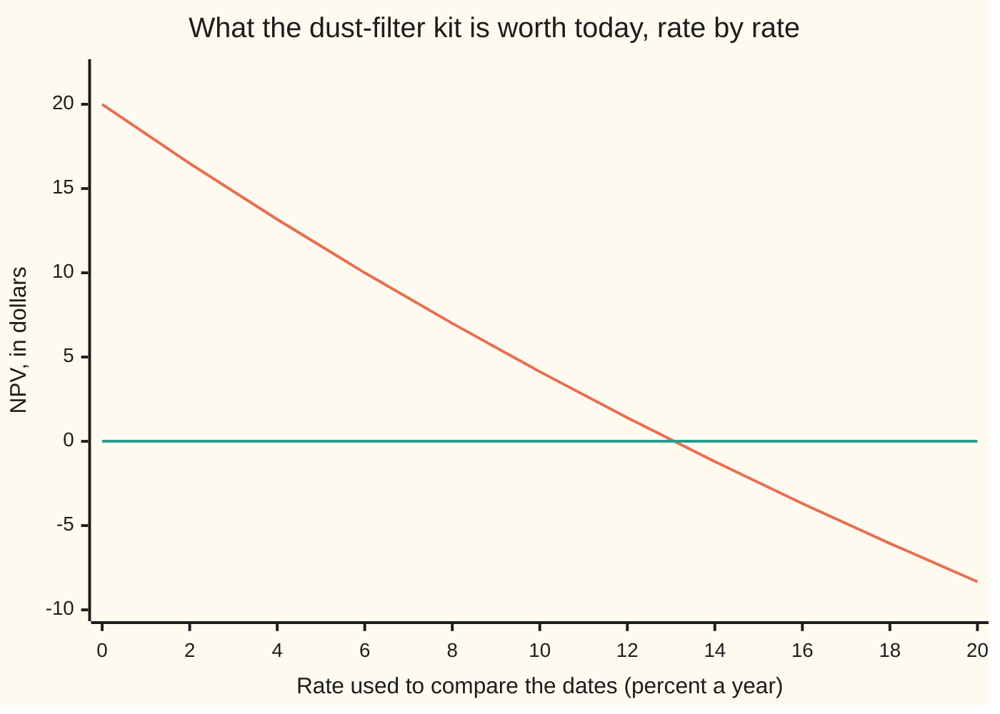
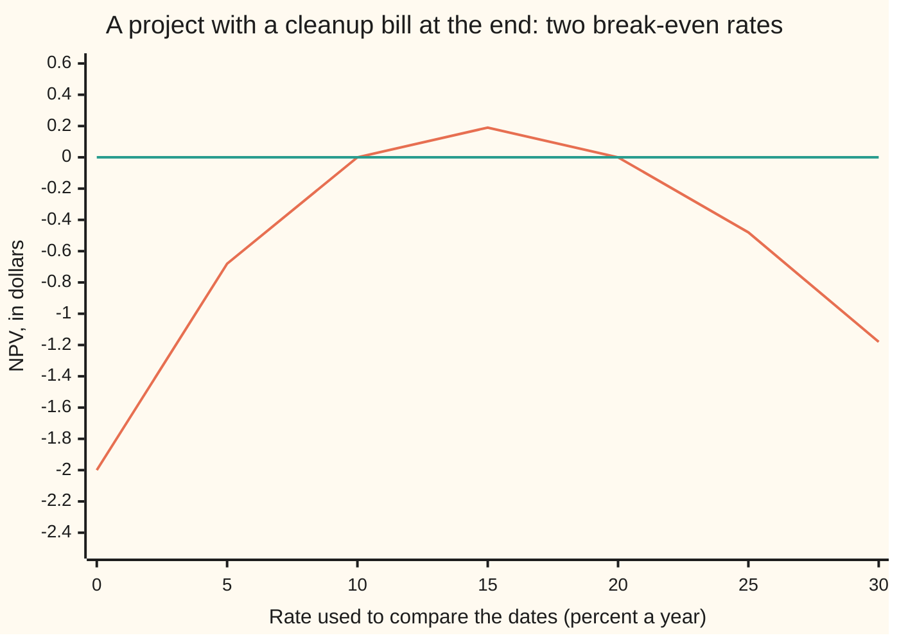

# NPV and IRR: is a project worth it, and the rate that makes it break even

[Syllabus](../../../SYLLABUS.md) → [Financial mathematics](../../../SYLLABUS.md#w12) → [Money, Dates and Discounting](../../../SYLLABUS.md#w12-s01) → NPV and IRR

---

## General Overview

A print shop is offered a dust-filter kit for one of its presses. The kit costs $100.00, paid today. It saves $60.00 of wasted ink at the end of the first year and $60.00 at the end of the second, and then it is worn out. The shop's bank both lends and takes deposits at 8 percent a year.

Add the three amounts up as though dates did not matter and the kit looks $20.00 ahead. That answer is wrong, because the savings arrive late, and late money is worth less: a dollar due in a year is worth 1 divided by 1.08 of a dollar now, about 93 cents ([Discount factors](01-compounding-and-discount-factors.md)).

Shrink each saving to today's money and add: $55.56 for year one, $51.44 for year two, $107.00 in all, against the $100.00 paid now. The kit is worth **$7.00** today. That number is the project's **net present value**, NPV: a dated list of cash turned into one amount of money at one date.

Now turn the question round. The shop's money costs 8 percent. How dear would money have to be before the kit stopped paying? At 13.07 percent a year the two shrunken savings come to exactly $100.00 and the kit breaks even. That rate is the project's **internal rate of return**, IRR — internal because it comes from the project's own cash and nothing else.

**NPV turns a dated list of cash into one number in today's money; the IRR is the rate at which that number is zero.**

**What kind of fact this is:** a method, resting on two definitions — NPV and IRR. Two claims here need proving: that the value today is exactly the money the project leaves in the bank at the end, and that a payment out followed by payments in has exactly one IRR. Both are theorems, proved on this card in Why it works.

### The picture: the kit's value at every rate



The sloping line is the kit's NPV at each rate; the flat line is zero. At the shop's own 8 percent the kit is worth $7.00. The two lines cross at 13.07 percent, the IRR. Left of the crossing the kit adds money, right of it the kit loses money.

---

## The formula

Notation first, in words. Each amount of cash carries the date it lands on: $c_i$ is the cash at date $i$, counted in whole years from today, with money received counted plus and money paid counted minus. So the kit's list is minus 100.00, then 60.00, then 60.00. The tall sigma is an instruction to add the terms as $i$ runs over the dates.

$$V(y) \;=\; \sum_{i=0}^{n} \frac{c_i}{(1+y)^i}$$

**Read it aloud:** today's cash is left alone; each later amount is divided by the growth factor for its own date; the results are added up.

| Symbol | Plain meaning | In our example | Push it up and the answer… |
| --- | --- | --- | --- |
| $c_i$ | the cash at date $i$: in counts plus, out counts minus | −100.00, 60.00, 60.00 | a bigger saving lifts the value, but by less than its face |
| $i$ | which date, counted in whole years from today | 0, 1, 2 | — |
| $n$ | the last date carrying any cash | 2 | more dates, more terms to add |
| $y$ | the rate used to compare money across dates, as a decimal | 0.08 | the value falls: later money counts for less |
| $(1+y)^i$ | the growth factor over $i$ years: what a dollar today becomes | 1.08, then 1.1664 | — |
| $V$ | the value of the whole list, in today's money | $7.00 | — |
| $y^\ast$ | the rate that makes $V$ zero: the IRR | 0.13066239 | more cash in, or sooner, and the project bears a dearer bank |
| $W_i$ | the bank balance after date $i$'s cash has moved | −100.00, −48.00, 8.16 | — |

The IRR is written as one short demand:

$$V(y^\ast) = 0$$

Written out for the kit, with $z$ standing for one year's growth factor, $z = 1 + y$:

$$-100 + \frac{60}{z} + \frac{60}{z^{2}} = 0 \qquad\Longleftrightarrow\qquad 5z^{2} - 3z - 3 = 0$$

Multiplying the left-hand equation by $z^2$ and dividing by −20 gives the right-hand one. With cash at only three dates the break-even growth factor is the positive root of that quadratic, $z = (3 + \sqrt{69})/10 = 1.1306624$, and the rate is that less 1: no searching is needed. For a longer list the equation is a polynomial in $z$ of higher degree, and a search is the only way in.

### When it holds

- **One rate for every date.** The formula uses a single $y$ for the whole life. When money costs more for longer terms, each amount takes its own discount factor from the curve ([Discount factors](01-compounding-and-discount-factors.md)); flattening a sloped curve to one number misprices the far-off amounts most.
- **Cash, dated, and certain.** Amounts are money actually moving, not accounting profit, and they are known. Feed in forecasts and the answer is only as sound as the forecasts.
- **Whole years here; real calendars need a rule.** Dates on this card are anniversaries. Actual payment dates need a day-count convention to turn them into fractions of a year ([Day counts](02-day-counts-and-dates.md)), and choosing the wrong one shifts the answer by a few cents on short trades and more on long ones.
- **The list is the difference the project makes.** Every amount is what changes if the project goes ahead, against a stated alternative. Money already spent changes nothing and belongs in neither list.
- **Borrowing and lending at the same rate, without limit.** That is what lets a value today stand in for money later. Under a budget cap, compare only the choices that fit the cap.
- **For the IRR alone: one change of direction.** Money out first, then nothing but money in, gives exactly one break-even rate (Step 4). Two changes of direction can give two answers, or none (Step 5).

**Conventions verified 14 September 2026:** this card compounds once a year on whole-year anniversaries, and the house bond below pays one coupon a year, which keeps the arithmetic visible. Markets quote otherwise — United States Treasury notes pay twice a year and are quoted on that basis, with the day counts to match ([Bond price and yield](05-bonds-price-and-yield.md) carries the citation). A quoting rule decides which equation is solved; it never changes how solving works.

---

## Why it works

### Step 0: a dollar is only a dollar once you say when

The bank is the machine that converts dates. A dollar left there for a year becomes $1 + y$ dollars, so $i$ years turn a dollar into $(1+y)^i$ dollars. Run that backwards: a dollar promised at date $i$ is worth exactly $1/(1+y)^i$ today, because that much cash, banked now, grows into the promised dollar. Nothing about the project is needed for this, only the bank.

### Step 1: amounts can be added once they all sit at the same date

Money at different dates cannot be added, any more than metres can be added to seconds. Move every amount to one common date and the obstacle goes. Each amount can be banked or borrowed on its own, so the moves do not interfere: shrinking the whole list to today and adding is legitimate, and the sum is $V(y)$.

### Step 2: the value is real money, not a score

Follow the kit through the shop's bank account. Borrow the $100.00 today, so the balance is −$100.00. A year of 8 percent makes the debt −$108.00; the first saving of $60.00 pays some of it off, leaving −$48.00. Another year makes that −$51.84; the second $60.00 clears it and leaves **$8.16** in the account.

That $8.16 is the whole gain, sitting at year two. Shrink it back: $8.16 divided by 1.1664 is $7.00, the NPV again. So NPV is not a rating out of ten. It is the money the project leaves behind at the end, carried back to today.

<details>
<summary>Detailed proof: the value is the extra money at the end</summary>

Let $W_i$ be the balance after date $i$'s cash has moved, starting from $W_0 = c_0$ against a balance of zero for doing nothing. Between dates the bank applies its factor, then the project's cash arrives:
$$W_i = W_{i-1}\,(1+y) + c_i .$$
Divide both sides by $(1+y)^i$:
$$\frac{W_i}{(1+y)^i} = \frac{W_{i-1}}{(1+y)^{i-1}} + \frac{c_i}{(1+y)^i}.$$
Each step adds one term of the sum and nothing else, so after the last date
$$\frac{W_n}{(1+y)^n} = \sum_{i=0}^{n} \frac{c_i}{(1+y)^i} = V(y), \qquad\text{that is}\qquad W_n = (1+y)^n\,V(y).$$
Since $(1+y)^n$ is positive for $y > -1$, the end balance and the value today always carry the same sign: a positive NPV is extra money in the account at the end, and that is what "worth doing" means. A negative balance along the way is borrowing, which the assumptions allow.

Two consequences come free. Adding two projects adds their values, because the sums add term by term; and doubling every amount doubles the value while leaving every root of $V$ exactly where it was. That second one is the crack the IRR falls through: the value records the size of the gain and the rate cannot.

</details>

### Step 3: the same equation, read backwards

Fix the cash and let the rate move. Then $V$ is a function of $y$, drawn as the sloping line in the picture above. Reading it one way — rate in, value out — prices the project. Reading it the other way — demand $V = 0$, solve for the rate — asks what the project is worth *as a rate*: the flat rate at which it exactly breaks even. That solved rate is the IRR. Every quoted yield in this wing is such a solved rate.

### Step 4: why the kit has exactly one break-even rate

Three plain facts settle it for the kit's sign pattern: one payment out today, then nothing but payments in.

The value falls whenever the rate rises. Every later amount is positive and divided by $(1+y)^i$, which grows with $y$; the outlay at date 0 is not divided by anything and does not move. So $V$ is strictly falling: no flat stretches, no bumps.

The two ends straddle zero. Push the rate down towards −100 percent and the divisors shrink towards zero, so the value grows without limit. Push the rate up and every later amount is crushed towards nothing, leaving the outlay: the value tends to −$100.00.

A function that falls without pause, starts above zero and ends below it, crosses zero exactly once. That crossing is the IRR, and it is the only one.

<details>
<summary>Detailed proof: one outlay, then inflows, gives exactly one rate</summary>

Let $c_0 < 0$, let every later $c_i$ be at least zero with at least one strictly positive, and read $V$ on rates $y > -1$.

**Strictly falling.** For $i \ge 1$ the term $c_i (1+y)^{-i}$ has derivative $-i\,c_i (1+y)^{-i-1}$, which is at most zero and strictly negative for the terms with $c_i > 0$. The date 0 term is a constant and has no derivative to contribute. So the slope $V'(y)$ is negative everywhere on $y > -1$.

**The ends.** As $y \to -1$ from above, $(1+y)^{-i} \to +\infty$ for every $i \ge 1$, and some $c_i$ is strictly positive, so $V(y) \to +\infty$. As $y \to \infty$, every term with $i \ge 1$ tends to zero, so $V(y) \to c_0 < 0$.

**The crossing.** $V$ is continuous on $(-1, \infty)$, so by the intermediate value theorem — a continuous function that changes sign must pass through zero on the way — it takes the value zero somewhere; strict decrease forbids a second such point. Hence exactly one $y^\ast$.

**The sign rule that follows.** Strict decrease also means $V(y) > 0$ exactly when $y < y^\ast$. For this sign pattern, and only for it, "the project is worth doing at rate $y$" and "the IRR beats $y$" are the same statement. Change the sign pattern and the equivalence goes; change the size of the project and it survives, which is why the IRR can agree about a single project and still rank two projects wrongly.

</details>

### Step 5: two changes of direction, two answers — or none

Nothing above survives a late payment out. Suppose the kit had to be stripped out and the waste disposed of: the list becomes −$100.00 today, $230.00 at year one, −$132.00 at year two. The cash now switches direction twice, and so does the answer: the value is zero at 10 percent **and** at 20 percent, positive only between them, negative on both sides. Two break-even rates, so "the return" does not exist; the next section draws it.

The number of changes of direction is the ceiling, not the count: that is Descartes' rule of signs, read on the polynomial in $z$. A list can switch twice and have no break-even rate at all: −$100.00, $150.00, −$100.00 is never worth doing at any rate, and its best value, over every rate there is, is −$43.75. A polynomial of degree $n$ has $n$ roots, real or not, and a root counts as a rate only when it is real and puts the growth factor above zero.

That is the practical half of the IRR: it exists and is unique for the ordinary shape of a project, and must be handled with care for anything else. Norstrøm's test on the running balances, in the sources, settles more cases; the everyday version is to look at the list, count the changes of direction, and if there is more than one, price the thing at the rate money actually costs instead.

The other route to the same ranking skips the shrinking entirely: run the ledger of Step 2 for each project and carry every balance to one common date. It gives the same order, since the balance at date $n$ is the value today multiplied by $(1+y)^n$ — one positive factor, the same for every project brought to that date. And where the root must be searched for rather than solved, bisection is the safe worker and Newton's method the fast one ([Newton's method](../../06-Calculus%20and%20analysis/03-What%20Derivatives%20Tell%20You/06-newtons-method.md)); the bond version of that search, brackets and all, is [Yield from price](07-yield-from-price.md).

---

## Worked numbers, by hand

The kit, at the shop's 8 percent.

| Step | Arithmetic | Value |
| --- | --- | --- |
| growth factor, one year | 1 + 0.08 | 1.08 |
| discount factor, year 1 | 1 ÷ 1.08 | 0.925926 |
| discount factor, year 2 | 1 ÷ (1.08 × 1.08) | 0.857339 |
| year 1 saving, in today's money | 60.00 × 0.925926 | 55.555556 |
| year 2 saving, in today's money | 60.00 × 0.857339 | 51.440329 |
| both savings | 55.555556 + 51.440329 | 106.995885 |
| **NPV** | 106.995885 − 100.00 | **6.995885, or $7.00** |
| the same by the ledger | −100.00 → −48.00 → 8.16, then 8.16 ÷ 1.1664 | **6.995885** |
| break-even rate | the positive root of $5z^2 - 3z - 3 = 0$, less 1 | **13.066239 percent** |

Fitting the kit adds $7.00 in today's money, which is the same thing as $8.16 in the bank two years from now, on top of what the $100.00 would have earned sitting in the bank.

The same arithmetic prices the shelf's house bond: $1,000.00 of face value, 6 percent coupons, five years, priced when the market yield is 5 percent, comes to $1,043.29. Pay that price and collect those coupons and the IRR of the resulting list is 5.000000 percent. A bond's yield is nothing but the IRR of its cashflows ([Bond price and yield](05-bonds-price-and-yield.md)).

### What breaks if you drop a piece

| Mistake | Comes out at | What went wrong |
| --- | --- | --- |
| Adding the three amounts, dates ignored | $20.00 | A dollar due in two years is counted as a dollar today |
| Shrinking today's $100.00 as well | $14.40 | Date 0 is already in today's money; dividing it treats part of the cost as if it fell due later |
| Using year one's factor for both savings | $11.11 | The second $60.00 waits two years, so it is divided twice |
| Choosing the higher IRR: this kit over a $250.00 kit saving $145.00 twice | $7.00 instead of $8.57 | A rate says nothing about size |

The code prints all four.

---

## NPV against the rate: where the answer flips sign

The kit's cash never changes: $100.00 out, then $60.00 in, then $60.00 in. Only the rate used to compare the dates changes — and that alone decides whether fitting the kit is worth doing.

| Rate a year | The kit's NPV | |
| --- | --- | --- |
| 0 percent | $20.00 | money later is money now |
| 4 percent | $13.17 | |
| 8 percent | $7.00 | the shop's own rate |
| 12 percent | $1.40 | |
| 13.07 percent | $0.00 | the IRR: break-even |
| 16 percent | −$3.69 | |
| 20 percent | −$8.33 | the savings are crushed |

One force at a time, and there is only one force here: the rate.

```
NPV of the kit at four rates, one block to 50 cents of value today
   0 percent  ████████████████████████████████████████  $20.00
   4 percent  ██████████████████████████                $13.17
   8 percent  ██████████████                             $7.00
  12 percent  ███                                        $1.40
  above 13.07 percent the NPV is negative, so no bar is drawn
```

The fall is not even. Going from 0 to 4 percent costs more value than going from 4 to 8 percent, and that step costs more than the one after it: the line is a curve, not a ramp. That bend is why two projects can change places when the rate moves.

Nothing in that shape promises a single crossing. Add a cleanup bill at the end and the line doubles back.



The curved line is the value of −$100.00, $230.00, −$132.00; the flat line is zero. It touches zero at 10 percent and again at 20 percent, and its best value anywhere is about $0.19, near 15 percent. A project worth doing only when money is dear is a warning that the single-rate summary has broken, not a bargain.

---

## Code, from first principles, and it actually runs

Nothing is imported that already knows an answer: the powers, the square root, the bisection and the Newton steps are all written out. The NPV is reached by three roads that reach it by different arithmetic — shrinking each dated amount, running the bank ledger forward and shrinking the final balance, and the exact fraction 5100/729 worked out by hand. The break-even rate is reached by three more: bisection, Newton's method, and the quadratic root (3 + √69)/10. Then the awkward streams are scanned across rates from −90 percent to 150 percent for every crossing, and the shelf's bond is priced and its yield recovered as an IRR.

### Python

```python
# NPV and IRR -- the check behind the card.  Standard library only, and nothing
# imported that already knows the answer: the powers, the square root, the
# bisection and the Newton steps are all written out below.  The project is a
# $100.00 dust-filter kit for a printing press that saves $60.00 at the end of
# each of two years.  Money in dollars, rates as decimals, dates in whole years.

def power(base, n):                      # repeated multiplication, so that the
    out = 1.0                            # Python and the Rust agree bit for bit
    for _ in range(n):
        out *= base
    return out

def npv(flows, y):                       # road 1: shrink each dated amount, add
    return sum(c / power(1.0 + y, i) for i, c in enumerate(flows))

def terminal(flows, y):                  # road 2: run a real bank account forward
    bal = 0.0
    for c in flows:
        bal = bal * (1.0 + y) + c
    return bal

def ledger_npv(flows, y):                # the end balance, shrunk back to today
    return terminal(flows, y) / power(1.0 + y, len(flows) - 1)

def slope(flows, y):                     # how NPV moves when the rate moves
    return sum(-i * c / power(1.0 + y, i + 1) for i, c in enumerate(flows))

def bisect(flows, lo, hi, steps=200):    # our own root finder: halve a bracket
    lo_is_positive = npv(flows, lo) > 0
    for _ in range(steps):
        mid = 0.5 * (lo + hi)
        if (npv(flows, mid) > 0) == lo_is_positive:
            lo = mid
        else:
            hi = mid
    return 0.5 * (lo + hi)

def newton(flows, y, steps=40):          # our own Newton: slide down the slope
    for _ in range(steps):
        y -= npv(flows, y) / slope(flows, y)
    return y

def square_root(a, steps=60):            # our own square root, the same method
    x = a
    for _ in range(steps):
        x = 0.5 * (x + a / x)
    return x

def sign_changes(flows):                 # how often the cash switches direction
    marks = [c > 0 for c in flows if c != 0.0]
    return sum(1 for a, b in zip(marks, marks[1:]) if a != b)

def crossings(flows, lo=-0.90, hi=1.50, n=2400):   # every rate where NPV is zero
    found, step, before = [], (hi - lo) / n, npv(flows, lo)
    for k in range(1, n + 1):
        after = npv(flows, lo + k * step)
        if (after > 0) != (before > 0):
            found.append(bisect(flows, lo + (k - 1) * step, lo + k * step))
        before = after
    return found

def zeroed(v):                           # a crumb left by rounding is zero
    return 0.0 if abs(v) < 1e-9 else v

def row(name, v):
    print(f"{name:<52}{v:>13.6f}")

KIT = [-100.0, 60.0, 60.0]               # the card's project
BIG = [-250.0, 145.0, 145.0]             # the same press, a bigger kit
CLEANUP = [-100.0, 230.0, -132.0]        # a cleanup bill at the end: two IRRs
NEVER = [-100.0, 150.0, -100.0]          # a cleanup bill too big: no IRR at all
R = 0.08

print("project: pay 100.00 today, save 60.00 at the end of year 1 and 60.00 at the end of year 2")
print(f"growth factors at 8 percent: one year {1.0 + R:.6f}, two years {power(1.08, 2):.6f}")
row("discount factor for year 1, 1/1.08", 1.0 / power(1.08, 1))
row("discount factor for year 2, 1/(1.08 x 1.08)", 1.0 / power(1.08, 2))
row("year 1 saving in today's money", 60.0 / power(1.08, 1))
row("year 2 saving in today's money", 60.0 / power(1.08, 2))
row("both savings in today's money", 60.0 / power(1.08, 1) + 60.0 / power(1.08, 2))
row("1 NPV at 8 percent, by shrinking each amount", npv(KIT, R))
row("2 NPV at 8 percent, by the bank ledger", ledger_npv(KIT, R))
row("3 NPV at 8 percent, the exact fraction 5100/729", 5100.0 / 729.0)
print(f"{'NPV at 8 percent, to the cent':<52}{npv(KIT, R):>13.2f}")
row("bank balance at the end of year 2", terminal(KIT, R))
ledger = [KIT[0]]
for c in KIT[1:]:
    ledger += [ledger[-1] * (1.0 + R), ledger[-1] * (1.0 + R) + c]
print("bank ledger at 8 percent, after each move: " + ", ".join(f"{v:.2f}" for v in ledger))
irr_bisect = bisect(KIT, 0.0, 1.0)
irr_newton = newton(KIT, 0.20)
irr_exact = (3.0 + square_root(69.0)) / 10.0 - 1.0
row("1 IRR by bisection, percent", 100.0 * irr_bisect)
row("2 IRR by Newton, percent", 100.0 * irr_newton)
row("3 IRR from the exact root (3 + sqrt 69)/10, percent", 100.0 * irr_exact)
row("NPV at that rate, distance from zero", abs(npv(KIT, irr_bisect)))
row("wrong: the three amounts added with no dates", KIT[0] + KIT[1] + KIT[2])
row("wrong: today's 100.00 shrunk as well", npv(KIT, R) - KIT[0] + KIT[0] / power(1.08, 1))
row("wrong: year 1's factor used for both years", KIT[0] + (KIT[1] + KIT[2]) / power(1.08, 1))
npv_big = npv(BIG, R)
row("bigger kit: pay 250.00, save 145.00 twice -- its NPV", npv_big)
row("bigger kit, its IRR, percent", 100.0 * bisect(BIG, 0.0, 1.0))
row("dollars the bigger kit adds over the small one", npv_big - npv(KIT, R))
print("cleanup kit: -100.00 today, +230.00 at year 1, -132.00 at year 2")
print(f"  times the cash switches direction: {sign_changes(CLEANUP)}")
roots = crossings(CLEANUP)
print("  rates where its NPV is zero, percent: " + ", ".join(f"{100.0 * y:.6f}" for y in roots))
row("  its NPV at 15 percent, between those two rates", npv(CLEANUP, 0.15))
print("doomed kit: -100.00 today, +150.00 at year 1, -100.00 at year 2")
print(f"  times the cash switches direction: {sign_changes(NEVER)}")
print(f"  rates where its NPV is zero: {len(crossings(NEVER))} found between -90 and 150 percent")
row("  the best its NPV ever reaches, at 33.33 percent", npv(NEVER, 1.0 / 3.0))
price = sum(60.0 / power(1.05, i) for i in range(1, 6)) + 1000.0 / power(1.05, 5)
bond = [-price, 60.0, 60.0, 60.0, 60.0, 1060.0]
row("house bond at a 5 percent yield: its price today", price)
row("  the IRR of that bond's cashflows, percent", 100.0 * bisect(bond, 0.0, 0.50))
rates = [0.02 * i for i in range(11)]
print("chart, rate percent        " + " ".join(f"{100.0 * y:6.0f}" for y in rates))
print("chart, NPV dollars         " + " ".join(f"{zeroed(npv(KIT, y)):6.2f}" for y in rates))
cleanup_rates = [0.05 * i for i in range(7)]
print("chart, cleanup rate percent" + " ".join(f"{100.0 * y:6.0f}" for y in cleanup_rates))
print("chart, cleanup NPV dollars " + " ".join(f"{zeroed(npv(CLEANUP, y)):6.2f}" for y in cleanup_rates))
print("bars, NPV at 0, 4, 8 and 12 percent: "
      + " ".join(f"{npv(KIT, y):.2f}" for y in (0.0, 0.04, 0.08, 0.12)))

assert abs(npv(KIT, R) - ledger_npv(KIT, R)) < 1e-12       # shrinking vs the ledger
assert abs(npv(KIT, R) - 5100.0 / 729.0) < 1e-12           # vs the exact fraction
assert abs(irr_bisect - irr_exact) < 1e-10                 # bisection vs the root formula
assert abs(irr_newton - irr_exact) < 1e-10                 # Newton vs the root formula
assert abs(slope(KIT, R) - (npv(KIT, R + 1e-6) - npv(KIT, R - 1e-6)) / 2e-6) < 1e-4
assert abs(npv(KIT, irr_bisect)) < 1e-9                    # that rate really breaks even
assert len(roots) == 2 and max(abs(roots[0] - 0.10), abs(roots[1] - 0.20)) < 1e-9
assert (sign_changes(KIT), sign_changes(CLEANUP), sign_changes(NEVER)) == (1, 2, 2)
assert crossings(NEVER) == [] and npv(NEVER, 1.0 / 3.0) < 0.0
assert abs(bisect(bond, 0.0, 0.50) - 0.05) < 1e-12         # the bond's IRR is its yield
assert npv_big > npv(KIT, R) and bisect(BIG, 0.0, 1.0) < irr_bisect
print("ALL CHECKS PASS")
```

**Ran 2026-09-14 on macOS, Python 3.14.6, standard library only. All checks passed. Output, pasted from the run:**

```
project: pay 100.00 today, save 60.00 at the end of year 1 and 60.00 at the end of year 2
growth factors at 8 percent: one year 1.080000, two years 1.166400
discount factor for year 1, 1/1.08                       0.925926
discount factor for year 2, 1/(1.08 x 1.08)              0.857339
year 1 saving in today's money                          55.555556
year 2 saving in today's money                          51.440329
both savings in today's money                          106.995885
1 NPV at 8 percent, by shrinking each amount             6.995885
2 NPV at 8 percent, by the bank ledger                   6.995885
3 NPV at 8 percent, the exact fraction 5100/729          6.995885
NPV at 8 percent, to the cent                                7.00
bank balance at the end of year 2                        8.160000
bank ledger at 8 percent, after each move: -100.00, -108.00, -48.00, -51.84, 8.16
1 IRR by bisection, percent                             13.066239
2 IRR by Newton, percent                                13.066239
3 IRR from the exact root (3 + sqrt 69)/10, percent     13.066239
NPV at that rate, distance from zero                     0.000000
wrong: the three amounts added with no dates            20.000000
wrong: today's 100.00 shrunk as well                    14.403292
wrong: year 1's factor used for both years              11.111111
bigger kit: pay 250.00, save 145.00 twice -- its NPV     8.573388
bigger kit, its IRR, percent                            10.492331
dollars the bigger kit adds over the small one           1.577503
cleanup kit: -100.00 today, +230.00 at year 1, -132.00 at year 2
  times the cash switches direction: 2
  rates where its NPV is zero, percent: 10.000000, 20.000000
  its NPV at 15 percent, between those two rates         0.189036
doomed kit: -100.00 today, +150.00 at year 1, -100.00 at year 2
  times the cash switches direction: 2
  rates where its NPV is zero: 0 found between -90 and 150 percent
  the best its NPV ever reaches, at 33.33 percent      -43.750000
house bond at a 5 percent yield: its price today      1043.294767
  the IRR of that bond's cashflows, percent              5.000000
chart, rate percent             0      2      4      6      8     10     12     14     16     18     20
chart, NPV dollars          20.00  16.49  13.17  10.00   7.00   4.13   1.40  -1.20  -3.69  -6.06  -8.33
chart, cleanup rate percent     0      5     10     15     20     25     30
chart, cleanup NPV dollars  -2.00  -0.68   0.00   0.19   0.00  -0.48  -1.18
bars, NPV at 0, 4, 8 and 12 percent: 20.00 13.17 7.00 1.40
ALL CHECKS PASS
```

### Rust

Same numbers, same labels, built with `rustc --edition 2021 -O`.

```rust
// NPV and IRR -- the same check as net_present_value_and_irr_check.py, in Rust.
// Standard library only, no crates, and nothing that already knows the answer:
// the powers, the square root, the bisection and the Newton steps are written out
// below.  The project is a $100.00 dust-filter kit for a printing press that saves
// $60.00 at the end of each of two years.  Money in dollars, rates as decimals.

fn power(base: f64, n: usize) -> f64 {   // repeated multiplication, so that the
    let mut out = 1.0;                   // Python and the Rust agree bit for bit
    for _ in 0..n { out *= base; }
    out
}

fn npv(flows: &[f64], y: f64) -> f64 {   // road 1: shrink each dated amount, add
    let mut total = 0.0;
    for (i, c) in flows.iter().enumerate() {
        total += c / power(1.0 + y, i);
    }
    total
}

fn terminal(flows: &[f64], y: f64) -> f64 {   // road 2: run a real bank account forward
    let mut bal = 0.0;
    for c in flows {
        bal = bal * (1.0 + y) + c;
    }
    bal
}

fn ledger_npv(flows: &[f64], y: f64) -> f64 { // the end balance, shrunk back to today
    terminal(flows, y) / power(1.0 + y, flows.len() - 1)
}

fn slope(flows: &[f64], y: f64) -> f64 {      // how NPV moves when the rate moves
    let mut total = 0.0;
    for (i, c) in flows.iter().enumerate() {
        total += -(i as f64) * c / power(1.0 + y, i + 1);
    }
    total
}

fn bisect(flows: &[f64], lo0: f64, hi0: f64) -> f64 {   // our own root finder
    let (mut lo, mut hi) = (lo0, hi0);
    let lo_is_positive = npv(flows, lo) > 0.0;
    for _ in 0..200 {
        let mid = 0.5 * (lo + hi);
        if (npv(flows, mid) > 0.0) == lo_is_positive { lo = mid } else { hi = mid }
    }
    0.5 * (lo + hi)
}

fn newton(flows: &[f64], start: f64) -> f64 {  // our own Newton: slide down the slope
    let mut y = start;
    for _ in 0..40 { y -= npv(flows, y) / slope(flows, y); }
    y
}

fn square_root(a: f64) -> f64 {                // our own square root, the same method
    let mut x = a;
    for _ in 0..60 { x = 0.5 * (x + a / x); }
    x
}

fn sign_changes(flows: &[f64]) -> usize {      // how often the cash switches direction
    let marks: Vec<bool> = flows.iter().filter(|c| **c != 0.0).map(|c| *c > 0.0).collect();
    (1..marks.len()).filter(|k| marks[*k] != marks[k - 1]).count()
}

fn crossings(flows: &[f64]) -> Vec<f64> {      // every rate where NPV is zero
    let (lo, hi, n) = (-0.90, 1.50, 2400);
    let step = (hi - lo) / n as f64;
    let mut found = Vec::new();
    let mut before = npv(flows, lo);
    for k in 1..=n {
        let after = npv(flows, lo + k as f64 * step);
        if (after > 0.0) != (before > 0.0) {
            found.push(bisect(flows, lo + (k - 1) as f64 * step, lo + k as f64 * step));
        }
        before = after;
    }
    found
}

fn zeroed(v: f64) -> f64 { if v.abs() < 1e-9 { 0.0 } else { v } }  // a rounding crumb is zero

fn row(name: &str, v: f64) { println!("{:<52}{:>13.6}", name, v); }

fn main() {
    let kit = [-100.0, 60.0, 60.0];            // the card's project
    let big = [-250.0, 145.0, 145.0];          // the same press, a bigger kit
    let cleanup = [-100.0, 230.0, -132.0];     // a cleanup bill at the end: two IRRs
    let never = [-100.0, 150.0, -100.0];       // a cleanup bill too big: no IRR at all
    let r = 0.08;
    println!("project: pay 100.00 today, save 60.00 at the end of year 1 and 60.00 at the end of year 2");
    println!("growth factors at 8 percent: one year {:.6}, two years {:.6}", 1.0 + r, power(1.08, 2));
    row("discount factor for year 1, 1/1.08", 1.0 / power(1.08, 1));
    row("discount factor for year 2, 1/(1.08 x 1.08)", 1.0 / power(1.08, 2));
    row("year 1 saving in today's money", 60.0 / power(1.08, 1));
    row("year 2 saving in today's money", 60.0 / power(1.08, 2));
    row("both savings in today's money", 60.0 / power(1.08, 1) + 60.0 / power(1.08, 2));
    row("1 NPV at 8 percent, by shrinking each amount", npv(&kit, r));
    row("2 NPV at 8 percent, by the bank ledger", ledger_npv(&kit, r));
    row("3 NPV at 8 percent, the exact fraction 5100/729", 5100.0 / 729.0);
    println!("{:<52}{:>13.2}", "NPV at 8 percent, to the cent", npv(&kit, r));
    row("bank balance at the end of year 2", terminal(&kit, r));
    let mut ledger = vec![kit[0]];
    for c in &kit[1..] {
        let grown = ledger[ledger.len() - 1] * (1.0 + r);
        ledger.push(grown);
        ledger.push(grown + c);
    }
    let moves: Vec<String> = ledger.iter().map(|v| format!("{:.2}", v)).collect();
    println!("bank ledger at 8 percent, after each move: {}", moves.join(", "));
    let irr_bisect = bisect(&kit, 0.0, 1.0);
    let irr_newton = newton(&kit, 0.20);
    let irr_exact = (3.0 + square_root(69.0)) / 10.0 - 1.0;
    row("1 IRR by bisection, percent", 100.0 * irr_bisect);
    row("2 IRR by Newton, percent", 100.0 * irr_newton);
    row("3 IRR from the exact root (3 + sqrt 69)/10, percent", 100.0 * irr_exact);
    row("NPV at that rate, distance from zero", npv(&kit, irr_bisect).abs());
    row("wrong: the three amounts added with no dates", kit[0] + kit[1] + kit[2]);
    row("wrong: today's 100.00 shrunk as well", npv(&kit, r) - kit[0] + kit[0] / power(1.08, 1));
    row("wrong: year 1's factor used for both years", kit[0] + (kit[1] + kit[2]) / power(1.08, 1));
    let npv_big = npv(&big, r);
    row("bigger kit: pay 250.00, save 145.00 twice -- its NPV", npv_big);
    row("bigger kit, its IRR, percent", 100.0 * bisect(&big, 0.0, 1.0));
    row("dollars the bigger kit adds over the small one", npv_big - npv(&kit, r));
    println!("cleanup kit: -100.00 today, +230.00 at year 1, -132.00 at year 2");
    println!("  times the cash switches direction: {}", sign_changes(&cleanup));
    let roots = crossings(&cleanup);
    let listed: Vec<String> = roots.iter().map(|y| format!("{:.6}", 100.0 * y)).collect();
    println!("  rates where its NPV is zero, percent: {}", listed.join(", "));
    row("  its NPV at 15 percent, between those two rates", npv(&cleanup, 0.15));
    println!("doomed kit: -100.00 today, +150.00 at year 1, -100.00 at year 2");
    println!("  times the cash switches direction: {}", sign_changes(&never));
    println!("  rates where its NPV is zero: {} found between -90 and 150 percent", crossings(&never).len());
    row("  the best its NPV ever reaches, at 33.33 percent", npv(&never, 1.0 / 3.0));
    let mut price = 0.0;
    for i in 1..=5 { price += 60.0 / power(1.05, i); }
    price += 1000.0 / power(1.05, 5);
    let bond = [-price, 60.0, 60.0, 60.0, 60.0, 1060.0];
    row("house bond at a 5 percent yield: its price today", price);
    row("  the IRR of that bond's cashflows, percent", 100.0 * bisect(&bond, 0.0, 0.50));
    let rates: Vec<f64> = (0..11).map(|i| 0.02 * i as f64).collect();
    let heads: Vec<String> = rates.iter().map(|y| format!("{:6.0}", 100.0 * y)).collect();
    let vals: Vec<String> = rates.iter().map(|y| format!("{:6.2}", zeroed(npv(&kit, *y)))).collect();
    println!("chart, rate percent        {}", heads.join(" "));
    println!("chart, NPV dollars         {}", vals.join(" "));
    let cleanup_rates: Vec<f64> = (0..7).map(|i| 0.05 * i as f64).collect();
    let ch: Vec<String> = cleanup_rates.iter().map(|y| format!("{:6.0}", 100.0 * y)).collect();
    let cv: Vec<String> = cleanup_rates.iter().map(|y| format!("{:6.2}", zeroed(npv(&cleanup, *y)))).collect();
    println!("chart, cleanup rate percent{}", ch.join(" "));
    println!("chart, cleanup NPV dollars {}", cv.join(" "));
    let bars: Vec<String> = [0.0, 0.04, 0.08, 0.12].iter().map(|y| format!("{:.2}", npv(&kit, *y))).collect();
    println!("bars, NPV at 0, 4, 8 and 12 percent: {}", bars.join(" "));

    assert!((npv(&kit, r) - ledger_npv(&kit, r)).abs() < 1e-12);   // shrinking vs the ledger
    assert!((npv(&kit, r) - 5100.0 / 729.0).abs() < 1e-12);        // vs the exact fraction
    assert!((irr_bisect - irr_exact).abs() < 1e-10);               // bisection vs the root formula
    assert!((irr_newton - irr_exact).abs() < 1e-10);               // Newton vs the root formula
    assert!((slope(&kit, r) - (npv(&kit, r + 1e-6) - npv(&kit, r - 1e-6)) / 2e-6).abs() < 1e-4);
    assert!(npv(&kit, irr_bisect).abs() < 1e-9);                   // that rate really breaks even
    assert!(roots.len() == 2 && (roots[0] - 0.10).abs().max((roots[1] - 0.20).abs()) < 1e-9);
    assert!((sign_changes(&kit), sign_changes(&cleanup), sign_changes(&never)) == (1, 2, 2));
    assert!(crossings(&never).is_empty() && npv(&never, 1.0 / 3.0) < 0.0);
    assert!((bisect(&bond, 0.0, 0.50) - 0.05).abs() < 1e-12);      // the bond's IRR is its yield
    assert!(npv_big > npv(&kit, r) && bisect(&big, 0.0, 1.0) < irr_bisect);
    println!("ALL CHECKS PASS");
}
```

**Ran 2026-09-14 on macOS, rustc 1.98.1, no crates. All checks passed. Output, pasted from the run:**

```
project: pay 100.00 today, save 60.00 at the end of year 1 and 60.00 at the end of year 2
growth factors at 8 percent: one year 1.080000, two years 1.166400
discount factor for year 1, 1/1.08                       0.925926
discount factor for year 2, 1/(1.08 x 1.08)              0.857339
year 1 saving in today's money                          55.555556
year 2 saving in today's money                          51.440329
both savings in today's money                          106.995885
1 NPV at 8 percent, by shrinking each amount             6.995885
2 NPV at 8 percent, by the bank ledger                   6.995885
3 NPV at 8 percent, the exact fraction 5100/729          6.995885
NPV at 8 percent, to the cent                                7.00
bank balance at the end of year 2                        8.160000
bank ledger at 8 percent, after each move: -100.00, -108.00, -48.00, -51.84, 8.16
1 IRR by bisection, percent                             13.066239
2 IRR by Newton, percent                                13.066239
3 IRR from the exact root (3 + sqrt 69)/10, percent     13.066239
NPV at that rate, distance from zero                     0.000000
wrong: the three amounts added with no dates            20.000000
wrong: today's 100.00 shrunk as well                    14.403292
wrong: year 1's factor used for both years              11.111111
bigger kit: pay 250.00, save 145.00 twice -- its NPV     8.573388
bigger kit, its IRR, percent                            10.492331
dollars the bigger kit adds over the small one           1.577503
cleanup kit: -100.00 today, +230.00 at year 1, -132.00 at year 2
  times the cash switches direction: 2
  rates where its NPV is zero, percent: 10.000000, 20.000000
  its NPV at 15 percent, between those two rates         0.189036
doomed kit: -100.00 today, +150.00 at year 1, -100.00 at year 2
  times the cash switches direction: 2
  rates where its NPV is zero: 0 found between -90 and 150 percent
  the best its NPV ever reaches, at 33.33 percent      -43.750000
house bond at a 5 percent yield: its price today      1043.294767
  the IRR of that bond's cashflows, percent              5.000000
chart, rate percent             0      2      4      6      8     10     12     14     16     18     20
chart, NPV dollars          20.00  16.49  13.17  10.00   7.00   4.13   1.40  -1.20  -3.69  -6.06  -8.33
chart, cleanup rate percent     0      5     10     15     20     25     30
chart, cleanup NPV dollars  -2.00  -0.68   0.00   0.19   0.00  -0.48  -1.18
bars, NPV at 0, 4, 8 and 12 percent: 20.00 13.17 7.00 1.40
ALL CHECKS PASS
```

The two outputs match line for line. Both languages build their powers by repeated multiplication, so the last digits agree as well as the first.

> [!TIP]
> **Try changing**
> Guess first, then run it. The asserts are pinned to the kit at 8 percent, so expect one to stop the program.
> - **Make money dearer.** Set `R` to `0.14`. The kit's value falls to −$1.20, below zero, and the assert against the exact fraction 5100/729 stops the run.
> - **Fit the bigger kit instead.** Put `BIG` where `KIT` is in the first rows: $8.57 of value at a 10.49 percent break-even rate. More money, lower rate — the ranking trap, in two lines.
> - **Take the cleanup bill off.** Set `CLEANUP` to `[-100.0, 120.0, 132.0]`, so nothing goes out after date 0. One change of direction, one crossing: the scan reports a single rate, and the assert that expects 10 percent and 20 percent stops the run.
> - **Starve the search.** Cut `steps` in `bisect` from 200 to 10. Ten halvings of a bracket a hundred points wide leave it about a tenth of a point across, so the rate comes out a few hundredths low and the assert against the exact root (3 + √69)/10 stops the run.

---

## The usual mistake

> [!warning]
> **Reading the IRR as the money a project makes.** It is the rate that makes one equation balance, not an amount and not a promise about what the cash earns after it arrives. The small kit's 13.07 percent beats the bigger kit's 10.49 percent, and the bigger kit is still the better buy: $8.57 against $7.00, a difference of $1.58 in today's money. Two rates can only be compared when the size and the dates behind them match.
>
> - **Discounting today's outlay.** The $100.00 is already in today's money. Dividing it by 1.08 as well flatters the kit to $14.40.
> - **Assuming a break-even rate exists, or that only one does.** The cleanup list has two, 10 percent and 20 percent. The −$100.00, $150.00, −$100.00 list has none, and never rises above −$43.75 at any rate.
> - **Hearing a reinvestment promise.** The IRR equation says nothing about where the $60.00 goes after it arrives. What it earns next is a separate input, and putting a different one in changes the money without changing the IRR at all.
> - **One flat rate on a sloped curve.** Where money costs more for longer terms, each amount needs its own discount factor. One rate for everything is a convenience, and the far-off amounts pay for it.
> - **Counting sunk money.** A survey already paid for appears in neither list. Only amounts that change between the choices belong in the comparison.

---

## Where you meet it in real life

- **Deciding what to buy.** Companies rank equipment, buildings and product launches this way; the discipline is called capital budgeting, and the argument in the room is nearly always about the rate and the forecasts, not the arithmetic.
- **Bond yields.** The yield quoted on any bond is the IRR of paying its price and collecting its coupons — $1,043.29 in, 5.000000 percent out, on this shelf's house bond ([Bond price and yield](05-bonds-price-and-yield.md)).
- **Loans and leases.** A quoted loan rate is the IRR of the borrower's own cashflows: cash in now, payments out later ([Annuities](03-annuities-and-loans.md)). Comparing two offers means comparing two such rates, which is safe only when the amounts and the dates line up.
- **Fund performance.** The money-weighted return an investor actually earns is the IRR of their own deposits and withdrawals. It differs from the fund's published return, which ignores when the money arrived.
- **Mines, reactors and wind farms.** Anything with a large bill at the end of its life has the sign pattern that breaks the IRR, which is why those industries argue over discount rates instead of over returns.

> **Say it back**
> Cash at different dates cannot be added until it is moved to one date. Moving every amount to today with the bank's own factors and adding gives the net present value, which is the money the project leaves in the account at the end, carried back. Demanding that the value be zero instead gives the internal rate of return, the rate at which the project exactly breaks even. One payment out followed by payments in has exactly one such rate, and the project is worth doing whenever money costs less than it. Change the sign pattern, or compare projects of different sizes, and the rate stops being a fair summary — the value in dollars does not.

---

## What this builds on

- [Annuities](03-annuities-and-loans.md): the same sum where the amounts repeat, and the closed form for it that prices this card's bond in one line.
- [Newton's method](../../06-Calculus%20and%20analysis/03-What%20Derivatives%20Tell%20You/06-newtons-method.md): the slope-following search used here as a second road to the break-even rate, and the reason it needs a sane starting guess.

## Where this goes next

- [Yield from price](07-yield-from-price.md): the same root-finding done properly on a traded price, with brackets that cannot escape and a starting guess that converges.

This card finds a break-even rate for a project whose cash is known; a bond's price is quoted every second, and turning that moving price into its rate, quickly and safely, is what comes next.

---

## Sources

Verified 14 Sep 2026: every link below resolves to the publisher's page.

- Lorie, James H., and Leonard J. Savage. "Three Problems in Rationing Capital." *The Journal of Business* 28, no. 4 (1955). [doi:10.1086/294081](https://doi.org/10.1086/294081). Where the multiple break-even rates and the ranking failure were first set out as practical problems.
- Hirshleifer, J. "On the Theory of Optimal Investment Decision." *Journal of Political Economy* 66, no. 4 (1958). [doi:10.1086/258057](https://doi.org/10.1086/258057). The argument that discounting at the rate money actually costs is the rule, and the IRR the special case.
- Norstrøm, Carl J. "A Sufficient Condition for a Unique Nonnegative Internal Rate of Return." *The Journal of Financial and Quantitative Analysis* 7, no. 3 (1972). [doi:10.2307/2329806](https://doi.org/10.2307/2329806). A test on the running balances that guarantees exactly one rate, wider than the sign rule proved here.
- Hazen, Gordon B. "A New Perspective on Multiple Internal Rates of Return." *The Engineering Economist* 48, no. 1 (2003). [doi:10.1080/00137910308965050](https://doi.org/10.1080/00137910308965050). What each of several roots means, and how to use one without being misled.
- *Principles of Finance*, section 16.3, "Internal Rate of Return (IRR) Method." OpenStax, Rice University. [Textbook page](https://openstax.org/books/principles-finance/pages/16-3-internal-rate-of-return-irr-method). A free current treatment in the standard notation.
