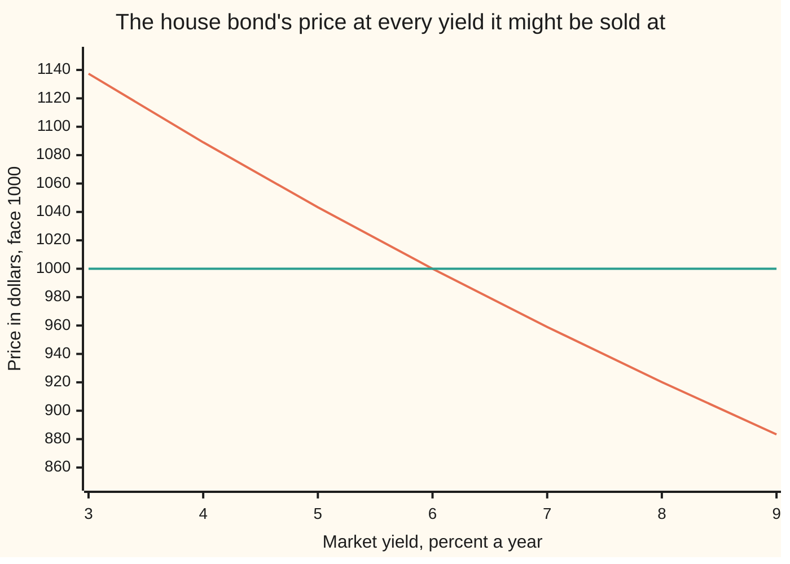
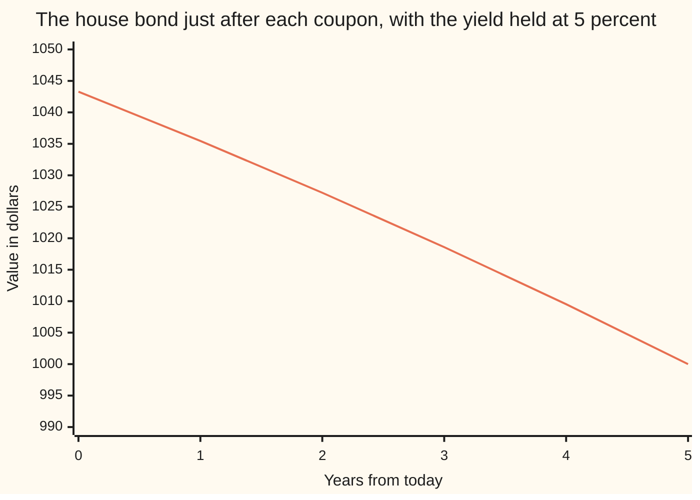

# Bond price and yield: coupons and face discounted at one rate

Financial mathematics → Money, Dates and Discounting → Pricing a fixed stream → Bond price and yield

---

## General Overview

A government needs to borrow 1,000 dollars for five years. It prints a contract: 60 dollars every 15 March for five years, and the 1,000 handed back with the last payment. That contract is a **bond**. The 1,000 is its **face**, the 60 is its **coupon** — six percent of the face, fixed for life — and 15 March 2031 is its **maturity**.

The promise is fixed. The price is not. Whoever buys the contract today is lending at whatever rate the market charges for five-year money, and that rate moves. Call it the **yield**. When the market wants five percent a year, this contract sells for **$1,043.29** — more than the $1,000 it hands back, because it pays $60 a year in a market that only asks for $50.

That is the whole job of this card. Five dated promises, one rate, one price. A payment due later is worth less than the same payment today, and the further off it is the less it is worth; price each of the five payments on its own and add them up.

**A bond's price is the sum of everything it promises, each payment shrunk by the same rate for as long as the wait, and that rate is the yield.**

**What kind of fact this is:** a method — discount every promised payment at one rate and add them; the closed form it collapses to, and the rule that reads premium or discount off the coupon, are theorems, proved on this card in Why it works.

### The picture: one bond, every yield it could be priced at



The falling line is the price. The flat line is the $1,000 face. They cross at six percent, where the yield equals the coupon: that crossing is **par**. Left of it the bond sells above face, a **premium**. Right of it, below face, a **discount**. The line only ever falls, which is the one fact about bonds everybody half-remembers: price and yield move opposite ways.

Going the other way — a price is quoted, and the yield has to be dug back out of it — is the inverse job, and it has its own card: [yield-from-price](07-yield-from-price.md).

---

## The formula

Two pieces of shorthand first, both in words.

A **discount factor** is what one dollar due later is worth today. Written $D(t)$, read "D of t", where $t$ counts the years until the dollar lands. With one payment a year at a yield $y$, waiting $t$ years divides the value by $(1+y)$ once per year: $D(t) = 1/(1+y)^t$. A dollar due in five years at five percent is worth $0.783526 today. Where that comes from is [compounding-and-discount-factors](01-compounding-and-discount-factors.md).

The second is the **annuity factor**, written $a_N(y)$: the value today of one dollar a year for $N$ years, which is just the discount factors added up. The count of payments sits low and to the right, the rate goes in brackets, and $a$ on its own is the short form where only one is in play. It is the closed form proved on [annuities-and-loans](03-annuities-and-loans.md).

The price, payment by payment:

$$P \;=\; \sum_{t=1}^{N} \frac{c}{(1+y)^{t}} \;+\; \frac{F}{(1+y)^{N}}$$

**Read it aloud:** every coupon and the face, each one shrunk by the yield for as long as it has to be waited for, all added together.

The coupons are the same number every year, so they collapse into the annuity factor:

$$P \;=\; c \cdot a_N(y) \;+\; F\,(1+y)^{-N}, \qquad a_N(y) \;=\; \frac{1-(1+y)^{-N}}{y}$$

The closed form divides by $y$, so it needs a yield that is not zero. At $y = 0$ nothing shrinks, $a_N(0) = N$, and the price is the cash added up: $1,300.

| Symbol | Plain meaning | In the house bond | Push it up and the price… |
| --- | --- | --- | --- |
| $P$ | the price: what the contract sells for today | $1,043.29 | — |
| $F$ | the face: the lump handed back at maturity | $1,000 | rises |
| $c$ | the coupon: the fixed cash paid each year | $60 | rises |
| $y$ | the yield: the one rate every payment is discounted at | 5% | falls, always |
| $N$ | how many payments are still to come | 5 | moves further from face, either way |
| $t$ | which payment: years of waiting until it lands | 1 to 5 | that one payment is worth less |
| $D(t)$ | the discount factor: what one dollar due in $t$ years is worth now | $D(5) = 0.783526$ | — |
| $a_N(y)$, short form $a$ | the annuity factor: one dollar a year for $N$ years, valued today | 4.329477 | the coupons are worth more |
| $v$ | one year's discount factor, $1/(1+y)$; shorthand inside the proof | 0.952381 | — |
| $A$ | accrued interest: coupon earned by the seller, not yet paid | $30.25 half-way through a year | the buyer hands over more cash |
| $w$ | the fraction of the current coupon period already run | 184/365 = 0.504110 | accrued interest rises |

### When it holds

- **Every payment arrives in full and on time.** A borrower who can miss one is worth less than this; a chance of default has to be priced with a survival curve, and that is [pricing-a-defaultable-bond-from-the-survival-curve](../44-Reduced-Form%20Models%20-%20Risky%20Bonds%2C%20Spreads%20and%20Random%20Hazards/01-pricing-a-defaultable-bond-from-the-survival-curve.md).
- **The same rate does for every date.** Real markets charge a different rate for one-year money than for five-year money. The single $y$ is a summary of the whole set, fitted to this contract; borrow it to price a different bond and the answer is wrong.
- **The rate is quoted for the period the coupons arrive in.** Annual coupons want an annual yield. The same 6% paid twice a year, discounted at 2.5% a half-year, prices at $1,043.76, not $1,043.29: half of every coupon lands six months early, and 2.5% twice over compounds to 5.0625% a year, which takes part of that back.
- **Nothing can end the contract early.** An issuer with the right to repay early will use it when rates fall, which caps the price: [callable-bonds-and-yield-to-worst](../35-Mortgages%2C%20Callables%20and%20Prepayment/01-callable-bonds-and-yield-to-worst.md).
- **The payments sit exactly one period apart.** Between two coupon dates the calendar takes over and a day count decides how much of the next coupon has been earned: [day-counts-and-dates](02-day-counts-and-dates.md).

---

## Why it works

### Step 0: the contract is not one promise but five

Nothing in the contract ties the payments together. The $60 due in 2027 and the $1,060 due in 2031 are separate dated promises that happen to be printed on the same sheet. Markets take that literally: a dealer can strip a government bond into its individual payments and sell them one by one.

So the price of the bundle is the sum of the prices of the pieces. If it were not, the cheaper side would be bought and the dearer side sold until it was. Every line below is bookkeeping on that one idea.

### Step 1: each dated dollar already has a price

At a yield of 5%, one dollar due in a year is worth $1/1.05 = 0.952381$ today, and one due in five years is worth $0.783526$. That is the discount factor $D(t)$, and it is the only pricing instrument needed.

Multiply each promised payment by its own factor: $60 \times 0.952381 = 57.14$ for the first coupon, down to $1060 \times 0.783526 = 830.54$ for the last payment, which carries the face. Five numbers, added: **$1,043.29**.

### Step 2: the coupons are the same number five times, so they collapse

Every one of the five years carries the same $60 coupon; only the last payment has the face bolted onto it. So the coupons together are worth $60 \times (D(1)+D(2)+D(3)+D(4)+D(5))$, and that bracket is the annuity factor $a_5(0.05) = 4.329477$. So the price splits into two pieces:

$$P \;=\; \underbrace{60 \times 4.329477}_{\text{the coupon stream, } \$259.77} \;+\; \underbrace{1000 \times 0.783526}_{\text{the face, } \$783.53}$$

The bracket is a geometric series: each term is the one before it times $1/(1+y)$. That is what gives the closed form.

<details>
<summary>Detailed proof: the annuity factor, and why par is exact</summary>

**The annuity factor.** Write $v = 1/(1+y)$. The factors to be added are $v, v^2, \dots, v^N$. Call the sum $a$. Multiply it by $v$ and every term shifts up one place:
$$a = v + v^2 + \dots + v^N, \qquad v\,a = v^2 + v^3 + \dots + v^{N+1}.$$
Subtract the second from the first and everything in the middle cancels, leaving $a - v a = v - v^{N+1}$, so $a(1-v) = v(1 - v^{N})$. Now $1 - v = y/(1+y)$ and $v = 1/(1+y)$, so dividing gives
$$a_N(y) = \frac{1-(1+y)^{-N}}{y}.$$
At $N=5$ and $y=0.05$ that is $(1 - 0.783526)/0.05 = 4.329477$.

**Par is exact, not approximate.** Start from $P = c\,a + F(1+y)^{-N}$ and split the coupon into the interest the market demands on the face, $y \times F$, plus whatever is left over:
$$P = (yF)\,a + (c - yF)\,a + F(1+y)^{-N}.$$
The first piece is $yF \cdot \dfrac{1-(1+y)^{-N}}{y} = F\left(1 - (1+y)^{-N}\right)$, and the $y$ cancels exactly. Add the face term and the two $(1+y)^{-N}$ pieces cancel too:
$$P = F + (c - yF)\,a_N(y).$$
Every symbol on the right is known, and $a$ is positive. So the sign of $P - F$ is the sign of $c - yF$ and nothing else. $\blacksquare$

</details>

### Step 3: premium, par and discount are one subtraction

That last line is the reading rule, and it is worth saying in words. The market demands $y$ on every dollar lent. On $1,000 of face at 5% that is $50 a year. The contract pays $60. The extra $10 a year is the only reason the price is not exactly the face, and $10 a year for five years is worth $10 \times 4.329477 = 43.29$ today.

$$1{,}043.29 \;=\; 1{,}000 \;+\; 10 \times 4.329477$$

Three cases, and no others:

- **Coupon above the yield** — the contract overpays, the price sits above face: a **premium**.
- **Coupon equal to the yield** — nothing is left over, the price is the face exactly: **par**. The house bond priced at a 6% yield comes out at $1,000.000000, to every decimal the machine has.
- **Coupon below the yield** — the contract underpays, and the price falls below face to make up the difference: a **discount**.

None of that is convention. It is one subtraction, $c - yF$, multiplied by a positive number.

### Step 4: the test that the price is right — spend it

An argument about discount factors can feel like a rule someone made up. Here is the same claim with no discounting in it at all.

Put $1,043.29 in a savings account paying 5%. Every year, withdraw $60 and hand it to whoever holds the contract. Year one: the balance grows by 5%, $60 goes out, and $1,035.46 is left. Carry on. After the fifth withdrawal the balance is **$1,000.000000** — exactly the face, exactly what the contract still owes.

So $1,043.29 in an account and the bond are the same object. Anyone selling the bond for less would be handing over the cheaper of two identical things; anyone paying more could build the copy for less. That is why the price is the price.

The account's balances after each coupon are $1,043.29, $1,035.46, $1,027.23, $1,018.59, $1,009.52 and $1,000.00 — and those are exactly the bond's prices with five, four, three, two, one and no coupons left. The checks compute both lists separately and compare them.

**The other route.** A careful market does not use one rate for all five dates; it uses a different rate per date and discounts each payment on its own. The single $y$ is then whatever flat rate reproduces the same total, which is the same move [net-present-value-and-irr](04-net-present-value-and-irr.md) makes for a project's cash flows. Finding that flat rate from a quoted price is [yield-from-price](07-yield-from-price.md).

---

## Worked numbers, by hand

The house bond: face $1,000, a 6% coupon paid once a year, five years to run, market yield 5%.

| Step | Arithmetic | Value |
| --- | --- | --- |
| year 1 coupon | $60 \times 0.952381$ | 57.14 |
| year 2 coupon | $60 \times 0.907029$ | 54.42 |
| year 3 coupon | $60 \times 0.863838$ | 51.83 |
| year 4 coupon | $60 \times 0.822702$ | 49.36 |
| year 5, coupon and face together | $1060 \times 0.783526$ | 830.54 |
| **price** | the five added | **$1,043.29** |
| the same, in two pieces: the coupons | $60 \times 4.329477$ | 259.77 |
| and the face | $1000 \times 0.783526$ | 783.53 |
| the premium, checked a third way | $10 \times 4.329477$ | 43.29 |

A buyer hands over $1,043.29 and is repaid $1,000. The $43.29 apparently thrown away is the price of five years of $10-a-year overpayment, and it comes back in the coupons.

```
Where the $1,043.29 comes from, one payment at a time. Each block is $30 of value today, to the nearest block.
  year 1    $60 coupon    ██                              $57.14
  year 2    $60 coupon    ██                              $54.42
  year 3    $60 coupon    ██                              $51.83
  year 4    $60 coupon    ██                              $49.36
  year 5    $60 + $1,000  ████████████████████████████   $830.54
```

Four fifths of the price is the last payment, because that is where the face is. Everything the coupons contribute, $259.77 of it, is the four short bars plus the coupon hidden inside the long one.

### What breaks if you drop a piece

| Mistake | Comes out at | What went wrong |
| --- | --- | --- |
| Discounting at the 6% coupon rate instead of the 5% market yield | 1,000.00 | The coupon is what the contract pays. The yield is what the market charges. Only at par are they the same number. |
| Adding the promised cash up with no discounting at all | 1,300.00 | Dollars due in 2031 counted as if they were in hand today. |
| Typing the yield as 5 rather than 0.05 | 12.13 | A 500% rate. The output still looks like a price, which is what makes it dangerous. |
| Reading the invoice price as the quoted price, half-way through a coupon year | 1,069.27 against a quote of 1,039.03 | $30.25 of that invoice is the seller's share of the coming coupon, not part of what the bond is worth. |

The code prints all four.

---

## The price moves even when the yield does not

This is the part that sends people back to the formula. Suppose the market's five percent never budges, for five years. The bond's price still changes every single day, and on one day a year it falls by $60.

### One bond, followed through its life

| Date | What happens | Value |
| --- | --- | --- |
| 15 Mar 2026 | bought, five coupons to come | $1,043.29 |
| 15 Sep 2026 | nothing at all happens | invoice $1,069.27, quote $1,039.03 |
| 15 Mar 2027 | $60 coupon paid, four left | $1,035.46 |
| 15 Mar 2029 | two left | $1,018.59 |
| 15 Mar 2031 | the last $60 coupon and the $1,000 face are handed over | $1,000.00 |

Two things are moving. Between coupons the bond creeps up, because the next payment is one day closer. On a coupon date it drops by the coupon paid, because that payment has left the contract. Net of both, the price walks down to the face and arrives there exactly at maturity. That walk is called the **pull to par**, and it is the premium being used up: all $43.29 of it, gone by maturity.



The single line is the bond's value the moment after each coupon is paid. It ends at $1,000, the face, on the day it is handed back. Nothing about the market changed to make that happen.

### Clean and dirty: the quote and the invoice

Now the 15 September puzzle. A buyer settling that day is buying a bond whose next $60 coupon is six months away — but the seller held it for the first half of that year and earned half of that coupon. The seller gets paid for it at settlement.

Two prices, and every market quotes one and charges the other:

- The **dirty price** (also called the invoice price) is the honest value of everything still to come, on the settlement day: **$1,069.27**. This is the cash that changes hands.
- **Accrued interest** is the seller's earned share of the coming coupon: the coupon times the fraction of the period already run, $A = c \times w$. From 15 March to 15 September 2026 is 184 days of a 365-day coupon year, so $w = 0.504110$ and $A = 60 \times 0.504110 = 30.25$.
- The **clean price** is the dirty price minus the accrued interest: **$1,039.03**. This is the number on the screen.

The reason for the split is readability. The dirty price sawtooths: it climbs all year and drops by $60 on every coupon date, which would make a price chart useless. Subtracting the accrued interest takes the sawtooth out. What is left still drifts, because the pull to par is in it, but it no longer drops $60 once a year. Here the clean price, $1,039.03, sits between the two coupon-date values either side of it, $1,043.29 and $1,035.46 — a check the code makes.

**Conventions verified 14 September 2026:** US Treasury notes and bonds pay interest every six months, quote a clean price per $100 of face, and charge accrued interest on top at settlement; the day counts and worked examples are set out in the Treasury's own appendix, cited below. The house bond pays once a year to keep the arithmetic visible. Quoting conventions are decisions markets have made and can unmake; the mathematics above does not change if they do.

---

## Code, from first principles, and it actually runs

Nothing is imported. The price is built four ways that share no arithmetic: discounting the five payments one at a time; the annuity closed form; rolling back from maturity a year at a time with no powers anywhere; and the face-plus-premium split. Then a fifth road tests the answer from the other end — a savings account is loaded with the price, the coupons are paid out of it, and the balance left at maturity is compared against the face. The day count between 15 March and 15 September is computed from the calendar, not typed in, and the accrued interest is built twice: one multiplication, and one day's worth of coupon added 184 times.

### Python

```python
# Bond price and yield -- the check behind the card.  Nothing is imported.
# The house bond: face 1000, a 6% coupon paid once a year, five years to run,
# priced when the market yield is 5%.  The price is built four ways that share
# no arithmetic, then tested a fifth way by spending it; the clean and dirty
# prices are built from the calendar, with the day count written out here.
FACE, CRATE, YEARS, Y = 1000.0, 0.06, 5, 0.05

def flows(face, crate, years, k=1):
    """(period number, cash) for every payment; the last one carries the face."""
    n, c = years * k, face * crate / k
    return [(t, c + (face if t == n else 0.0)) for t in range(1, n + 1)]

def price(face, crate, y, years, k=1):
    """Road 1: discount every payment on its own, then add them up."""
    return sum(cf / (1.0 + y / k) ** t for t, cf in flows(face, crate, years, k))

def annuity(n, i):
    """Value today of 1 at the end of each of n periods, i a period."""
    return (1.0 - (1.0 + i) ** (-n)) / i

def price_closed(face, crate, y, years):
    """Road 2: the coupons as one annuity, plus the face discounted once."""
    return face * crate * annuity(years, y) + face * (1.0 + y) ** (-years)

def price_rollback(face, crate, y, years):
    """Road 3: start at maturity holding nothing, walk back a year at a time."""
    v = 0.0
    for t in range(years, 0, -1):
        v = (v + face * crate + (face if t == years else 0.0)) / (1.0 + y)
    return v

def price_par_split(face, crate, y, years):
    """Road 4: the face, plus the slice of each coupon above the market's rate."""
    return face + (face * crate - y * face) * annuity(years, y)

def account(start, face, crate, y, years):
    """Road 5: a savings account paying the coupons out; the balances it leaves."""
    bal, path = start, [start]
    for _ in range(years):
        bal = bal * (1.0 + y) - face * crate
        path.append(bal)
    return path

def day_number(y, m, d):
    """Days from 1970-01-01 to a civil date, leap years and all."""
    y -= 1 if m <= 2 else 0
    era = (y if y >= 0 else y - 399) // 400
    yoe = y - era * 400
    doy = (153 * (m - 3 if m > 2 else m + 9) + 2) // 5 + d - 1
    return era * 146097 + yoe * 365 + yoe // 4 - yoe // 100 + doy - 719468

def row(label, value):
    print(f"{label:<46}{value:>15.6f}")

def strip(label, values):
    print(f"{label:<42}" + "".join(f"{v:>10.2f}" for v in values))

p1 = price(FACE, CRATE, Y, YEARS)
p2 = price_closed(FACE, CRATE, Y, YEARS)
p3 = price_rollback(FACE, CRATE, Y, YEARS)
p4 = price_par_split(FACE, CRATE, Y, YEARS)
path = account(p1, FACE, CRATE, Y, YEARS)
par_path = [price(FACE, CRATE, Y, n) for n in range(YEARS, 0, -1)] + [FACE]
pvs = [cf * (1.0 + Y) ** (-t) for t, cf in flows(FACE, CRATE, YEARS)]

print(f"the house bond: face {FACE:.2f}, coupon {CRATE * 100:.2f}% once a year, "
      f"{YEARS} payments, market yield {Y * 100:.2f}%")
for t, cf in flows(FACE, CRATE, YEARS):
    d = (1.0 + Y) ** (-t)
    print(f"  year {t}  cash {cf:>9.2f}  discount factor D({t}) {d:.6f}"
          f"  present value {cf * d:>11.6f}")
strip("present values, to the cent", pvs)
row("road 1  the five present values added", p1)
row("road 2  coupon annuity plus the face", p2)
row("road 3  rolled back from maturity", p3)
row("road 4  face plus the coupon above the yield", p4)
row("road 5  savings account, balance at year 5", path[YEARS])
row("annuity factor for 5 years at 5%", annuity(YEARS, Y))
row("the five coupons, 60 x the annuity factor", FACE * CRATE * annuity(YEARS, Y))
row("the face, 1000 x D(5)", FACE * (1.0 + Y) ** (-YEARS))
row("coupon above the market's rate, 60 - 50", FACE * CRATE - Y * FACE)
row("price above face, the premium paid", p1 - FACE)

ys = [0.03, 0.04, 0.05, 0.06, 0.07, 0.08, 0.09]
strip("price at yields 3% to 9%", [price(FACE, CRATE, yy, YEARS) for yy in ys])
strip("value just after each coupon, years 0-5", par_path)
strip("savings account balances, years 0-5", path)

first, settle, second = day_number(2026, 3, 15), day_number(2026, 9, 15), day_number(2027, 3, 15)
elapsed, full = settle - first, second - first
w = elapsed / full
accrued = FACE * CRATE * w
daily = sum(FACE * CRATE / full for _ in range(elapsed))
dirty_a = p1 * (1.0 + Y) ** w
dirty_b = sum(cf / (1.0 + Y) ** (t - w) for t, cf in flows(FACE, CRATE, YEARS))
clean = dirty_a - accrued
print(f"settling 2026-09-15: {elapsed} days of the {full}-day coupon period have run")
row("fraction of the period elapsed", w)
row("accrued interest, 60 x 184/365", accrued)
row("the same, earned one day at a time", daily)
row("dirty price, the 15 March price grown at 5%", dirty_a)
row("dirty price, each payment from settlement", dirty_b)
row("clean price, the quote: dirty minus accrued", clean)

row("price when the yield equals the 6% coupon", price(FACE, CRATE, CRATE, YEARS))
row("mistake: cash added with no discounting", sum(cf for _, cf in flows(FACE, CRATE, YEARS)))
row("mistake: yield typed as 5, not 0.05", price(FACE, CRATE, 5.0, YEARS))
row("try: coupon 0%, a zero-coupon bond", price(FACE, 0.0, Y, YEARS))
row("try: 30 years to run instead of 5", price(FACE, CRATE, Y, 30))
row("try: the same 6% paid twice a year", price(FACE, CRATE, Y, YEARS, 2))
row("the half-yearly 5% quote as an annual rate", (1.0 + Y / 2) ** 2 - 1.0)

assert abs(p1 - p2) < 1e-9, "term-by-term sum against the annuity closed form"
assert abs(p1 - p3) < 1e-9, "term-by-term sum against the roll-back recursion"
assert abs(p1 - p4) < 1e-9, "term-by-term sum against the face-plus-premium split"
assert abs(path[YEARS] - FACE) < 1e-9, "spending the price leaves exactly the face"
assert max(abs(a - b) for a, b in zip(path, par_path)) < 1e-9, "balances are the prices"
assert abs(price(FACE, CRATE, CRATE, YEARS) - FACE) < 1e-9, "yield = coupon prices at face"
assert all(price(FACE, CRATE, ys[i], YEARS) > price(FACE, CRATE, ys[i + 1], YEARS)
           for i in range(len(ys) - 1)), "the price falls at every step up in yield"
assert abs(dirty_a - dirty_b) < 1e-9, "two roads to the dirty price"
assert abs(accrued - daily) < 1e-9, "accrued interest: one day's worth, 184 times"
assert par_path[1] < clean < par_path[0], "the clean price sits inside the year's fall"
assert elapsed == 184, "15 March to 15 September 2026 is 184 days"
assert full == 365, "15 March 2026 to 15 March 2027 is 365 days"
print("ALL CHECKS PASS")
```

**Ran 2026-09-14 on macOS, Python 3.14.6, standard library only. All checks passed. Output, pasted from the run:**

```
the house bond: face 1000.00, coupon 6.00% once a year, 5 payments, market yield 5.00%
  year 1  cash     60.00  discount factor D(1) 0.952381  present value   57.142857
  year 2  cash     60.00  discount factor D(2) 0.907029  present value   54.421769
  year 3  cash     60.00  discount factor D(3) 0.863838  present value   51.830256
  year 4  cash     60.00  discount factor D(4) 0.822702  present value   49.362148
  year 5  cash   1060.00  discount factor D(5) 0.783526  present value  830.537736
present values, to the cent                    57.14     54.42     51.83     49.36    830.54
road 1  the five present values added             1043.294767
road 2  coupon annuity plus the face              1043.294767
road 3  rolled back from maturity                 1043.294767
road 4  face plus the coupon above the yield      1043.294767
road 5  savings account, balance at year 5        1000.000000
annuity factor for 5 years at 5%                     4.329477
the five coupons, 60 x the annuity factor          259.768600
the face, 1000 x D(5)                              783.526166
coupon above the market's rate, 60 - 50             10.000000
price above face, the premium paid                  43.294767
price at yields 3% to 9%                     1137.39   1089.04   1043.29   1000.00    959.00    920.15    883.31
value just after each coupon, years 0-5      1043.29   1035.46   1027.23   1018.59   1009.52   1000.00
savings account balances, years 0-5          1043.29   1035.46   1027.23   1018.59   1009.52   1000.00
settling 2026-09-15: 184 days of the 365-day coupon period have run
fraction of the period elapsed                       0.504110
accrued interest, 60 x 184/365                      30.246575
the same, earned one day at a time                  30.246575
dirty price, the 15 March price grown at 5%       1069.273387
dirty price, each payment from settlement         1069.273387
clean price, the quote: dirty minus accrued       1039.026811
price when the yield equals the 6% coupon         1000.000000
mistake: cash added with no discounting           1300.000000
mistake: yield typed as 5, not 0.05                 12.127058
try: coupon 0%, a zero-coupon bond                 783.526166
try: 30 years to run instead of 5                 1153.724510
try: the same 6% paid twice a year                1043.760320
the half-yearly 5% quote as an annual rate           0.050625
ALL CHECKS PASS
```

Four roads land on the same eleven digits, and the fifth road, the savings account, empties to exactly the face.

### Rust

Same numbers, same labels, built with `rustc --edition 2021 -O`.

```rust
// Bond price and yield -- the same check as the Python, in Rust.  No crates.
// The house bond: face 1000, a 6% coupon paid once a year, five years to run,
// priced when the market yield is 5%.  The price is built four ways that share
// no arithmetic, then tested a fifth way by spending it; the clean and dirty
// prices are built from the calendar, with the day count written out here.
const FACE: f64 = 1000.0;
const CR: f64 = 0.06;
const YEARS: usize = 5;
const Y: f64 = 0.05;

/// (period number, cash) for every payment; the last one carries the face.
fn flows(face: f64, cr: f64, years: usize, k: usize) -> Vec<(usize, f64)> {
    let n = years * k;
    let c = face * cr / k as f64;
    (1..=n).map(|t| (t, c + if t == n { face } else { 0.0 })).collect()
}

/// Road 1: discount every payment on its own, then add them up.
fn price(face: f64, cr: f64, y: f64, years: usize, k: usize) -> f64 {
    let mut s = 0.0;
    for (t, cf) in flows(face, cr, years, k) {
        s += cf / (1.0 + y / k as f64).powf(t as f64);
    }
    s
}

/// Value today of 1 at the end of each of n periods, i a period.
fn annuity(n: usize, i: f64) -> f64 {
    (1.0 - (1.0 + i).powf(-(n as f64))) / i
}

/// Road 2: the coupons as one annuity, plus the face discounted once.
fn price_closed(face: f64, cr: f64, y: f64, years: usize) -> f64 {
    face * cr * annuity(years, y) + face * (1.0 + y).powf(-(years as f64))
}

/// Road 3: start at maturity holding nothing, walk back a year at a time.
fn price_rollback(face: f64, cr: f64, y: f64, years: usize) -> f64 {
    let mut v = 0.0;
    for t in (1..=years).rev() {
        v = (v + face * cr + if t == years { face } else { 0.0 }) / (1.0 + y);
    }
    v
}

/// Road 4: the face, plus the slice of each coupon above the market's rate.
fn price_par_split(face: f64, cr: f64, y: f64, years: usize) -> f64 {
    face + (face * cr - y * face) * annuity(years, y)
}

/// Road 5: a savings account paying the coupons out; the balances it leaves.
fn account(start: f64, face: f64, cr: f64, y: f64, years: usize) -> Vec<f64> {
    let (mut bal, mut path) = (start, vec![start]);
    for _ in 0..years {
        bal = bal * (1.0 + y) - face * cr;
        path.push(bal);
    }
    path
}

/// Days from 1970-01-01 to a civil date, leap years and all.
fn day_number(y: i64, m: i64, d: i64) -> i64 {
    let y = y - if m <= 2 { 1 } else { 0 };
    let era = if y >= 0 { y } else { y - 399 } / 400;
    let yoe = y - era * 400;
    let doy = (153 * (if m > 2 { m - 3 } else { m + 9 }) + 2) / 5 + d - 1;
    era * 146097 + yoe * 365 + yoe / 4 - yoe / 100 + doy - 719468
}

fn row(label: &str, value: f64) { println!("{:<46}{:>15.6}", label, value); }

fn strip(label: &str, values: &[f64]) {
    let mut line = format!("{:<42}", label);
    for v in values { line.push_str(&format!("{:>10.2}", v)); }
    println!("{}", line);
}

fn main() {
    let p1 = price(FACE, CR, Y, YEARS, 1);
    let p2 = price_closed(FACE, CR, Y, YEARS);
    let p3 = price_rollback(FACE, CR, Y, YEARS);
    let p4 = price_par_split(FACE, CR, Y, YEARS);
    let path = account(p1, FACE, CR, Y, YEARS);
    let mut par_path: Vec<f64> = (1..=YEARS).rev().map(|n| price(FACE, CR, Y, n, 1)).collect();
    par_path.push(FACE);
    let pvs: Vec<f64> = flows(FACE, CR, YEARS, 1).iter()
        .map(|&(t, cf)| cf * (1.0 + Y).powf(-(t as f64))).collect();

    println!("the house bond: face {:.2}, coupon {:.2}% once a year, {} payments, market yield {:.2}%",
             FACE, CR * 100.0, YEARS, Y * 100.0);
    for (t, cf) in flows(FACE, CR, YEARS, 1) {
        let d = (1.0 + Y).powf(-(t as f64));
        println!("  year {}  cash {:>9.2}  discount factor D({}) {:.6}  present value {:>11.6}",
                 t, cf, t, d, cf * d);
    }
    strip("present values, to the cent", &pvs);
    row("road 1  the five present values added", p1);
    row("road 2  coupon annuity plus the face", p2);
    row("road 3  rolled back from maturity", p3);
    row("road 4  face plus the coupon above the yield", p4);
    row("road 5  savings account, balance at year 5", path[YEARS]);
    row("annuity factor for 5 years at 5%", annuity(YEARS, Y));
    row("the five coupons, 60 x the annuity factor", FACE * CR * annuity(YEARS, Y));
    row("the face, 1000 x D(5)", FACE * (1.0 + Y).powf(-(YEARS as f64)));
    row("coupon above the market's rate, 60 - 50", FACE * CR - Y * FACE);
    row("price above face, the premium paid", p1 - FACE);

    let ys = [0.03, 0.04, 0.05, 0.06, 0.07, 0.08, 0.09];
    let curve: Vec<f64> = ys.iter().map(|&yy| price(FACE, CR, yy, YEARS, 1)).collect();
    strip("price at yields 3% to 9%", &curve);
    strip("value just after each coupon, years 0-5", &par_path);
    strip("savings account balances, years 0-5", &path);

    let (first, settle, second) = (day_number(2026, 3, 15), day_number(2026, 9, 15), day_number(2027, 3, 15));
    let (elapsed, full) = (settle - first, second - first);
    let w = elapsed as f64 / full as f64;
    let accrued = FACE * CR * w;
    let mut daily = 0.0;
    for _ in 0..elapsed { daily += FACE * CR / full as f64; }
    let dirty_a = p1 * (1.0 + Y).powf(w);
    let mut dirty_b = 0.0;
    for (t, cf) in flows(FACE, CR, YEARS, 1) { dirty_b += cf / (1.0 + Y).powf(t as f64 - w); }
    let clean = dirty_a - accrued;
    println!("settling 2026-09-15: {} days of the {}-day coupon period have run", elapsed, full);
    row("fraction of the period elapsed", w);
    row("accrued interest, 60 x 184/365", accrued);
    row("the same, earned one day at a time", daily);
    row("dirty price, the 15 March price grown at 5%", dirty_a);
    row("dirty price, each payment from settlement", dirty_b);
    row("clean price, the quote: dirty minus accrued", clean);

    row("price when the yield equals the 6% coupon", price(FACE, CR, CR, YEARS, 1));
    let mut total = 0.0;
    for (_, cf) in flows(FACE, CR, YEARS, 1) { total += cf; }
    row("mistake: cash added with no discounting", total);
    row("mistake: yield typed as 5, not 0.05", price(FACE, CR, 5.0, YEARS, 1));
    row("try: coupon 0%, a zero-coupon bond", price(FACE, 0.0, Y, YEARS, 1));
    row("try: 30 years to run instead of 5", price(FACE, CR, Y, 30, 1));
    row("try: the same 6% paid twice a year", price(FACE, CR, Y, YEARS, 2));
    row("the half-yearly 5% quote as an annual rate", (1.0 + Y / 2.0) * (1.0 + Y / 2.0) - 1.0);

    assert!((p1 - p2).abs() < 1e-9, "term-by-term sum against the annuity closed form");
    assert!((p1 - p3).abs() < 1e-9, "term-by-term sum against the roll-back recursion");
    assert!((p1 - p4).abs() < 1e-9, "term-by-term sum against the face-plus-premium split");
    assert!((path[YEARS] - FACE).abs() < 1e-9, "spending the price leaves exactly the face");
    assert!(path.iter().zip(par_path.iter()).all(|(a, b)| (a - b).abs() < 1e-9),
            "balances are the prices");
    assert!((price(FACE, CR, CR, YEARS, 1) - FACE).abs() < 1e-9, "yield = coupon prices at face");
    assert!((0..ys.len() - 1).all(|i| curve[i] > curve[i + 1]),
            "the price falls at every step up in yield");
    assert!((dirty_a - dirty_b).abs() < 1e-9, "two roads to the dirty price");
    assert!((accrued - daily).abs() < 1e-9, "accrued interest: one day's worth, 184 times");
    assert!(par_path[1] < clean && clean < par_path[0], "the clean price sits inside the year's fall");
    assert!(elapsed == 184, "15 March to 15 September 2026 is 184 days");
    assert!(full == 365, "15 March 2026 to 15 March 2027 is 365 days");
    println!("ALL CHECKS PASS");
}
```

**Ran 2026-09-14 on macOS, rustc 1.98.1, no crates. All checks passed. Output, pasted from the run:**

```
the house bond: face 1000.00, coupon 6.00% once a year, 5 payments, market yield 5.00%
  year 1  cash     60.00  discount factor D(1) 0.952381  present value   57.142857
  year 2  cash     60.00  discount factor D(2) 0.907029  present value   54.421769
  year 3  cash     60.00  discount factor D(3) 0.863838  present value   51.830256
  year 4  cash     60.00  discount factor D(4) 0.822702  present value   49.362148
  year 5  cash   1060.00  discount factor D(5) 0.783526  present value  830.537736
present values, to the cent                    57.14     54.42     51.83     49.36    830.54
road 1  the five present values added             1043.294767
road 2  coupon annuity plus the face              1043.294767
road 3  rolled back from maturity                 1043.294767
road 4  face plus the coupon above the yield      1043.294767
road 5  savings account, balance at year 5        1000.000000
annuity factor for 5 years at 5%                     4.329477
the five coupons, 60 x the annuity factor          259.768600
the face, 1000 x D(5)                              783.526166
coupon above the market's rate, 60 - 50             10.000000
price above face, the premium paid                  43.294767
price at yields 3% to 9%                     1137.39   1089.04   1043.29   1000.00    959.00    920.15    883.31
value just after each coupon, years 0-5      1043.29   1035.46   1027.23   1018.59   1009.52   1000.00
savings account balances, years 0-5          1043.29   1035.46   1027.23   1018.59   1009.52   1000.00
settling 2026-09-15: 184 days of the 365-day coupon period have run
fraction of the period elapsed                       0.504110
accrued interest, 60 x 184/365                      30.246575
the same, earned one day at a time                  30.246575
dirty price, the 15 March price grown at 5%       1069.273387
dirty price, each payment from settlement         1069.273387
clean price, the quote: dirty minus accrued       1039.026811
price when the yield equals the 6% coupon         1000.000000
mistake: cash added with no discounting           1300.000000
mistake: yield typed as 5, not 0.05                 12.127058
try: coupon 0%, a zero-coupon bond                 783.526166
try: 30 years to run instead of 5                 1153.724510
try: the same 6% paid twice a year                1043.760320
the half-yearly 5% quote as an annual rate           0.050625
ALL CHECKS PASS
```

The two outputs match line for line.

> [!TIP]
> **Try changing**
> Guess first, then run it. Every answer below is also a row in the output above. The first two mean editing the inputs at the top, and the asserts are pinned to the house bond, so an edited run prints its numbers and then stops — on purpose.
> - **Make the yield equal the coupon.** Set `Y` to `0.06`. The price becomes $1,000.000000 — par, exact, not rounded. The last coupon's overpayment has vanished because there is none.
> - **Take the coupon away.** Set `CRATE` to `0.0`. The price collapses to $783.53, the face alone. That is a zero-coupon bond, and the whole of it is the one last payment.
> - **Stretch the bond.** Price it over 30 years instead of 5. The price rises to $1,153.72, because the same $10-a-year overpayment is collected six times as long.
> - **Split the coupon in two.** Pay the same 6% twice a year against a 5% yield quoted per half-year. The price rises to $1,043.76: the coupons arrive earlier, the half-yearly quote discounts harder, and the earlier coupons win.

---

## The usual mistake

> [!warning]
> **Reading the coupon rate as the return.** A 6% bond bought at $1,043.29 does not earn 6%. It earns 5%, the yield — and 5% across the whole five years only if every coupon is put back to work at 5%, which is exactly what the account in Step 4 does. The extra coupon was paid for in advance, in the $43.29 above face, and it is handed back one year at a time as the price walks down to $1,000. The coupon is what the contract pays; the yield is what the buyer gets. They agree only at par.
>
> - **Expecting a bond to gain when yields rise.** The payments are printed on the contract and never change. Discount them harder and the total must shrink: at 5% this bond is $1,043.29, at 7% it is $959.00. A bond already held loses value when the market's rate goes up.
> - **Treating a discount as a bargain.** A bond below face is below face because its coupon undershoots the market. Nothing is being given away. Premium and discount say one thing only: how the coupon compares with the yield.
> - **Paying the quoted price.** Half-way through a coupon year the quote is $1,039.03 and the cash due is $1,069.27. The $30.25 gap is the seller's earned share of the next coupon, and it is not a markup.
> - **Feeding a percent in where a decimal belongs.** A yield of 5 instead of 0.05 prices this bond at $12.13. It is still a number, and it still looks like a price.
> - **Reusing one bond's yield on another bond.** The yield is fitted to this contract's dates. Two bonds maturing on the same day, with different coupons, generally carry different yields.

---

## Where you meet it in real life

- **A government auction.** Bids arrive as prices per $100 of face and are converted to yields on the spot; the US Treasury publishes the exact formulas it uses, accrued interest and all.
- **The screen.** "Trading at 98" is a clean price: 98% of face, a discount, so that bond's yield is above its coupon. The cash actually wired on settlement day is higher, by the accrued interest.
- **A bond fund's daily price.** Every holding is repriced from the day's yields. A fund can fall on a day nothing defaulted and no payment was missed: rates moved, and every contract in it was discounted harder.
- **A mortgage, from the lender's side.** The same stream of dated payments, valued the same way — set out from the borrower's side in [annuities-and-loans](03-annuities-and-loans.md).
- **Company debt.** The same arithmetic with one extra question: whether the payments arrive at all. That gap between a government's yield and a company's is the credit spread.

> **Say it back**
> A bond is a handful of dated promises: a fixed coupon each year and the face at the end. Its price is what those promises are worth today, each one divided by $(1+y)$ once for every year of waiting, where $y$ is the market's yield. The coupons are the same number every year, so they collapse into an annuity factor, and the price becomes the face plus whatever the coupon pays above the yield. That leftover decides everything: coupon above the yield is a premium, equal is par, below is a discount. Between coupon dates the quoted price leaves out the seller's earned share of the coming coupon; the cash paid puts it back.

---

## What this builds on

- [annuities-and-loans](03-annuities-and-loans.md): the annuity factor, 4.329477 here, which is the only reason five coupons can be priced with one multiplication.
- [day-counts-and-dates](02-day-counts-and-dates.md): what 184 days out of 365 means, and why a market has to agree on the count before it can agree on a price.

## Where this goes next

- [duration-and-convexity](06-duration-and-convexity.md): how far the price falls for a given rise in yield, measured in years, and the bend the straight-line answer misses.
- [yield-from-price](07-yield-from-price.md): the same equation solved the other way round, with a price given and the yield hunted for.
- [real-rates-and-the-fisher-equation](../34-Inflation%20and%20Real%20Rates/01-real-rates-and-the-fisher-equation.md): what the 5% is worth once inflation has taken its cut.
- [callable-bonds-and-yield-to-worst](../35-Mortgages%2C%20Callables%20and%20Prepayment/01-callable-bonds-and-yield-to-worst.md): contracts the issuer can end early, which breaks the fixed-payment assumption on purpose.
- [pricing-a-defaultable-bond-from-the-survival-curve](../44-Reduced-Form%20Models%20-%20Risky%20Bonds%2C%20Spreads%20and%20Random%20Hazards/01-pricing-a-defaultable-bond-from-the-survival-curve.md): payments that might not arrive, weighted by the chance they do.

This card takes the yield as given and hands back a price. Every quoted market does the opposite — the price is what is visible — and whether one yield always comes back out of one price is the question of [yield-from-price](07-yield-from-price.md).

---

## Sources

Verified 14 Sep 2026: every link below resolves to the publisher's page.

- US Department of the Treasury. "Formulas and Tables." 31 CFR part 356, appendix B (Uniform Offering Circular). [eCFR, current text](https://www.ecfr.gov/current/title-31/subtitle-B/chapter-II/subchapter-A/part-356/appendix-Appendix%20B%20to%20Part%20356). The price-from-yield formulas a real government actually uses, with the accrued-interest day counts and worked examples.
- TreasuryDirect. "Treasury Notes." [Treasury marketable securities](https://www.treasurydirect.gov/marketable-securities/treasury-notes/). The live conventions: fixed rate, interest every six months, prices quoted per $100 of face.
- Tuckman, Bruce, and Angel Serrat. *Fixed Income Securities: Tools for Today's Markets*, 4th ed. Wiley, 2022. [Publisher page](https://www.wiley.com/en-us/Fixed+Income+Securities%3A+Tools+for+Today%27s+Markets%2C+4th+Edition-p-9781119835554). Chapter 3 on prices, yields and the pull to par; the standard desk reference.
- Fabozzi, Frank J., and Francesco A. Fabozzi. *Bond Markets, Analysis, and Strategies*, 10th ed. MIT Press, 2021. [Publisher page](https://www.penguinrandomhouse.com/books/679151/bond-markets-analysis-and-strategies-tenth-edition-by-frank-j-fabozzi-and-francesco-a-fabozzi/). The textbook treatment of pricing, premium and discount, and clean against dirty.
- *Principles of Finance*, section 10.2, "Bond Valuation." OpenStax, Rice University. [Textbook page](https://openstax.org/books/principles-finance/pages/10-2-bond-valuation). A free current treatment in the same notation, useful for a second pass.
