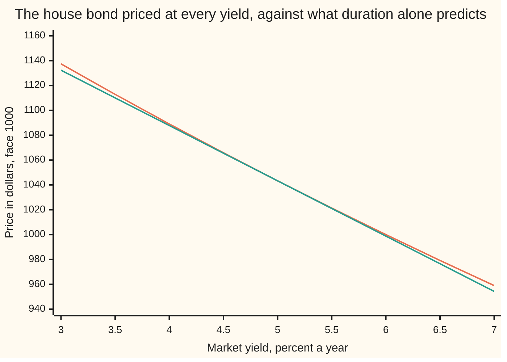
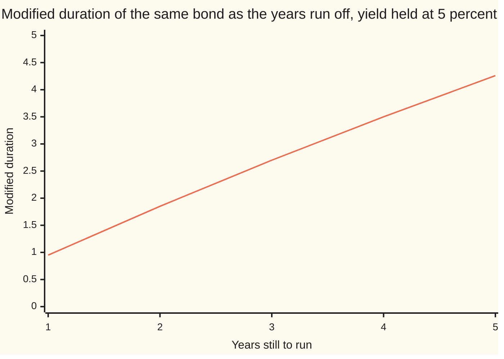

# Duration and convexity: how a bond price moves when its yield moves

Financial mathematics → Money, Dates and Discounting → Rate sensitivity → Duration and convexity

---

## General Overview

The house bond pays 60 dollars a year for five years and hands back 1,000 dollars with the last payment. At a market yield of five percent it sells for **$1,043.29** ([bonds-price-and-yield](05-bonds-price-and-yield.md)).

Rates rise. The yield goes to six percent. Price the five payments again, one at a time, and the total comes out at exactly **$1,000.00** — face value, because a six percent yield now matches the six percent coupon.

Repricing is fine for one bond. A desk holding four hundred of them wants the answer before the move, for any size of move, without rebuilding four hundred payment schedules. It wants one or two numbers per bond that stand in for the whole calculation.

Two numbers do it. Plot the bond's price against its yield and a curve appears, falling to the right. The **slope** of that curve, scaled by the price, says what fraction of its value the bond loses per unit of yield: that is **duration**, 4.264525 here. The curve is not straight, so a second number measures the **bend**: **convexity**, 23.444091.

Watch them work on the one-point rise. The slope on its own predicts $998.80. Slope plus bend predicts $1,000.03. The truth is $1,000.00. Duration alone was $1.20 out on a thousand-dollar bond; adding convexity cut the miss to under three cents.

**Duration is the slope of a bond's price-against-yield curve and convexity is its bend, so a yield move turns into a price move by arithmetic instead of a reprice.**

**What kind of fact this is:** an approximation, and this card states its error — the second-order price move comes with a bound that the checks confirm on both a rise and a fall. The two durations and convexity are definitions; that modified duration and convexity come from the price's first and second derivatives is a theorem, proved in Why it works.

### The picture: the curve, and the straight line duration draws through it



The bending line is the bond's real price. The straight line is duration's prediction: the tangent, which touches the curve at a five percent yield and shares its slope there. They agree at five percent and part company either side, with the curve above the line in both directions. That gap is convexity: a rise costs less than duration threatens, a fall pays more than it promises.

---

## The formula

Three pieces of notation first, in words.

The tall sigma sign, with $t$ running from 1 to $N$, says: write one term for each year and add them up. A **derivative**, written $dP/dy$, is the rate at which the price changes as the yield changes — the slope of the curve above. Doing it twice, $d^2P/dy^2$, gives the rate at which that slope itself changes: the bend. Capital delta marks a change, so $\Delta y$ is a yield move and $\Delta P$ the price move it causes. Rates are decimals inside a formula: one percentage point is $\Delta y = 0.01$.

The price of a bond, from the previous card, with $A_t$ standing for the whole amount paid in year $t$ — the coupon, and in the final year the coupon plus the face:

$$P(y) \;=\; \sum_{t=1}^{N} \frac{A_t}{(1+y)^{t}}$$

Each payment's share of today's price is its **weight**. The weights are what turn a pile of dates into one number:

$$w_t \;=\; \frac{A_t/(1+y)^t}{P}, \qquad D_{\text{Mac}} \;=\; \sum_{t=1}^{N} t\,w_t, \qquad D_{\text{mod}} \;=\; \frac{D_{\text{Mac}}}{1+y}$$

**Read it aloud:** weigh each payment by the share of the price it accounts for, average the payment years under those weights to get Macaulay duration, then divide by one plus the yield to get modified duration — the fraction of its price the bond loses per unit of yield.

Convexity is the same list of payments weighted by $t(t+1)$ instead of $t$, with two extra years of discounting:

$$C \;=\; \frac{1}{P}\sum_{t=1}^{N} \frac{t(t+1)\,A_t}{(1+y)^{t+2}}$$

And the two of them together answer the question the card asks:

$$\frac{\Delta P}{P} \;\approx\; -\,D_{\text{mod}}\,\Delta y \;+\; \tfrac12\,C\,(\Delta y)^2$$

**Read it aloud:** the price falls by duration times the yield move, then bends back up by half the convexity times the move squared.

| Symbol | Plain meaning | In the house bond | Push it up and the price move… |
| --- | --- | --- | --- |
| $P$ | the price: what the bond sells for today | $1,043.29 | — |
| $y$ | the yield: the one rate every payment is discounted at | 5% | shrinks, because everything is discounted harder already |
| $A_t$ | the amount paid in year $t$ | 60 four times, then 1,060 | grows: more money is exposed to the rate |
| $t$ | which year a payment lands in | 1 to 5 | — |
| $N$ | years until the last payment | 5 | grows sharply: far-off money is rate-sensitive money |
| $w_t$ | that payment's share of today's price | 0.054772 in year 1, 0.796072 in year 5 | pulls the average year toward that payment |
| $D_{\text{Mac}}$ | Macaulay duration: the weighted average year a dollar comes back | 4.477751 years | grows |
| $D_{\text{mod}}$ | modified duration: fraction of price lost per unit of yield | 4.264525 | grows in proportion |
| $C$ | convexity: how fast the slope itself changes, in years squared | 23.444091 | the correction grows, and always upward |
| $M$ | the most the third derivative can reach in size across a move | the error bound's only input | — |
| $R$ | what the two terms leave out | at most 0.026649 on the one-point rise | — |

One more number falls straight out, and desks quote it more often than duration. A **basis point** is a hundredth of a percentage point. **DV01** is the cash lost on a one-basis-point rise:

$$\text{DV01} \;=\; D_{\text{mod}} \times P \times 0.0001$$

For the house bond that is $0.444916, a shade under 45 cents per 1,000 dollars of face. Duration is a percentage; DV01 is cash, and cash is what adds up across a book.

### When it holds

- **One yield moves, and it moves every payment together.** A curve that twists — short rates up, long rates down — is not a move in $y$ at all, and no single duration describes it.
- **The payments are fixed.** Nothing may cancel, reschedule or repay early. When the payments themselves react to rates, as a callable bond's or a mortgage's do, the bend can turn the other way: [negative-convexity](../35-Mortgages%2C%20Callables%20and%20Prepayment/03-negative-convexity.md).
- **The move is modest.** What the two terms leave out grows as the cube of the move. On this bond a one-point move leaves under three cents unaccounted for; a three-point rise leaves 0.680863 dollars unaccounted for, and the two numbers are no longer enough.
- **The yield stays above minus one hundred percent,** so $(1+y)$ is positive and the discounting means something.
- **The quote is annual, as here.** Conventions verified 14 September 2026: this card uses one coupon a year discounted at an annual yield. A bond quoted with two coupons a year discounts once per half-year, so with $t$ still in years $(1+y)^t$ becomes $(1+y/2)^{2t}$, modified duration divides by $(1+y/2)$, and convexity weights each year by $t(t+\tfrac12)$. The calendar rule that fixes each $t$ is its own card: [day-counts-and-dates](02-day-counts-and-dates.md).

---

## Why it works

### Step 0: freeze the contract and one number is left moving

The bond's payments and their dates are printed in the contract. None of them change when the market changes its mind about interest rates. The only thing that moves is the yield.

So the price is a function of one number, and everything known about such functions applies: it has a slope, the slope has a slope, and Taylor's theorem turns those two into a prediction with a stated error ([taylors-theorem](../../06-Calculus%20and%20analysis/03-What%20Derivatives%20Tell%20You/05-taylors-theorem.md)). That is the whole card; the rest is working out the two slopes for this particular function.

### Step 1: differentiate once, and a weighted average time falls out

Each payment contributes $A_t/(1+y)^t$ to the price: the amount, times the discount factor for its year ([compounding-and-discount-factors](01-compounding-and-discount-factors.md)). Nudge the yield up and that term shrinks, and it shrinks faster the further off the payment is, because it is being divided by $(1+y)$ more times. Differentiating one term gives $-t\,A_t/(1+y)^{t+1}$: the extra factor of $t$ is the whole story, and it is why long bonds are dangerous.

Add the terms and pull out one factor of $(1+y)$:

$$-\frac{dP}{dy} \;=\; \frac{1}{1+y}\sum_{t=1}^{N} \frac{t\,A_t}{(1+y)^{t}}$$

Divide by the price. Each $A_t/(1+y)^t$ over $P$ is the weight $w_t$, so what is left is an average of the years $t$ under those weights:

$$-\frac{1}{P}\frac{dP}{dy} \;=\; \frac{1}{1+y}\sum_{t=1}^{N} t\,w_t \;=\; \frac{D_{\text{Mac}}}{1+y} \;=\; D_{\text{mod}}$$

The checks confirm it the honest way: they get the slope by nudging the yield up and down, never touching the weights, and land on the same 4.264525.

<details>
<summary>The algebra behind this</summary>

Write one term as $A_t (1+y)^{-t}$. The power rule sends $(1+y)^{-t}$ to $-t(1+y)^{-t-1}$, so the term's derivative is $-t A_t (1+y)^{-t-1}$. Summing over $t$ gives
$$\frac{dP}{dy} = -\sum_{t=1}^{N} t\,A_t\,(1+y)^{-t-1} = -\frac{1}{1+y}\sum_{t=1}^{N} t\,A_t\,(1+y)^{-t}.$$
Divide both sides by $-P$ and insert $w_t = A_t(1+y)^{-t}/P$. The weights are non-negative and add to one, since their numerators are the pieces the price was built from, so $\sum t\,w_t$ is a genuine average of the numbers 1 to $N$ and must land between them.

</details>

### Step 2: the same number is the bond's centre of gravity

Macaulay duration was defined as an average of payment years, so it is measured in years — and that gives it a second meaning with no calculus in it. Lay the five payments along a line at their dates, each weighing what it contributes to today's price. Macaulay duration is the balance point.

For the house bond it is 4.477751 years, short of the five years to maturity: the four coupons hand part of the money back early and pull the balance point in. The final payment is 0.796072 of the price on its own, which is why the point still sits close to year five.

A bond with no coupons pays once, at maturity, so all the weight sits at one date and the balance point is that date: a five-year zero-coupon bond has a Macaulay duration of exactly 5.000000 years, which the checks confirm.

### Step 3: differentiate twice, and the bend is always upward

Differentiate the terms of $dP/dy$ once more. Each $-t A_t (1+y)^{-t-1}$ becomes $t(t+1) A_t (1+y)^{-t-2}$:

$$\frac{d^2P}{dy^2} \;=\; \sum_{t=1}^{N} \frac{t(t+1)\,A_t}{(1+y)^{t+2}}$$

Divide by the price and that is $C$, convexity, 23.444091 for the house bond.

Now look at what the formula cannot do. Every payment $A_t$ is positive, every $t(t+1)$ is positive, every power of $(1+y)$ is positive. A sum of positive things is positive, so the second derivative is positive for any bond whose payments are all positive. A positive second derivative means the slope is rising: the curve flattens as the yield climbs, and it sits above every tangent it has. That is the promise in the first picture, and it holds for far more than this one bond.

<details>
<summary>The algebra behind this</summary>

Applying the power rule to $(1+y)^{-t-1}$ gives $(-t-1)(1+y)^{-t-2}$. The term $-t A_t (1+y)^{-t-1}$ therefore differentiates to $t(t+1) A_t (1+y)^{-t-2}$, and summing gives the displayed second derivative.
In weights, $C = \frac{1}{(1+y)^2}\sum_t t(t+1) w_t$: a weighted average of $t(t+1)$, discounted twice more. Since $t(t+1)$ grows about as the square of $t$, convexity grows about as the square of a bond's length while duration grows in proportion to it — which is why convexity matters far more on a thirty-year bond than on a two-year one.
One more differentiation gives $\frac{d^3P}{dy^3} = -\sum_t t(t+1)(t+2) A_t (1+y)^{-t-3}$, which Step 4 needs.

</details>

### Step 4: Taylor's theorem stitches them together and bounds the leftover

Taylor's theorem says a function with three continuous derivatives equals its value, plus its slope times the step, plus half its bend times the step squared, plus a remainder $R$: one sixth of the third derivative, taken somewhere along the way, times the step cubed. Written for the price, moving the yield by $\Delta y$:

$$P(y+\Delta y) \;=\; P(y)\Big[1 - D_{\text{mod}}\,\Delta y + \tfrac12\,C\,(\Delta y)^2\Big] \;+\; R$$

The remainder is not left vague. The third derivative is a sum of terms sitting over powers of $(1+y)$, so its size is largest at the low end of the move. Take the lower of the two yields — the starting one on a rise, the ending one on a fall — and call it the move's floor. The largest size the third derivative reaches anywhere on that move, written $M$, then caps the leftover:

$$M \;=\; \sum_{t=1}^{N} \frac{t(t+1)(t+2)\,A_t}{(1+y_{\text{floor}})^{t+3}}, \qquad |R| \;\le\; \frac{M\,|\Delta y|^3}{6}$$

That is a certificate, computed before the move is made, and it covers the whole move rather than just its endpoint. On the one-point rise it says the leftover is at most 0.026649 dollars; the actual leftover is 0.026155. On the one-point fall it says at most 0.028743; the actual is 0.027159. Both are asserted in the checks.

<details>
<summary>Detailed proof: why the low end of the move bounds the whole of it</summary>

The price is a finite sum of powers of $(1+y)$, so it has continuous derivatives of every order wherever $(1+y)$ is positive. Fix the starting yield $y$ and a move $\Delta y$ with both ends above minus one hundred percent, and write $y_{\text{floor}}$ for the lower of the two.

Taylor's theorem with the Lagrange form of the remainder gives, for some yield $u$ strictly between $y$ and $y + \Delta y$,
$$P(y+\Delta y) = P(y) + P'(y)\,\Delta y + \tfrac12 P''(y)\,(\Delta y)^2 + \tfrac16 P'''(u)\,(\Delta y)^3 .$$
Substituting $P'(y) = -D_{\text{mod}} P(y)$ from Step 1 and $P''(y) = C\,P(y)$ from Step 3 produces the bracketed form above, with $R = \tfrac16 P'''(u)(\Delta y)^3$.

The bound now only needs the size of $P'''$ on the segment. From Step 3's last line,
$$|P'''(u)| = \sum_{t=1}^{N} \frac{t(t+1)(t+2)\,A_t}{(1+u)^{t+3}},$$
and every term of that sum shrinks as $u$ grows, because $u$ sits in a denominator raised to a positive power. So the whole expression is largest at the move's floor, giving $|P'''(u)| \le M$ and $|R| \le M|\Delta y|^3/6$.

Two limits. It bounds the truncation error alone: a wrongly assembled payment schedule, or a yield that is itself a guess, needs its own accounting. And as the floor approaches minus one hundred percent the bound blows up, so no claim is made that every move is well approximated.

</details>

The third derivative is negative for a bond with positive payments, so the remainder has the opposite sign to the cube of the move: the two-term estimate sits above the true price on a rise and below it on a fall. Both appear in the checks, as an error of $-0.026155$ going up and $+0.027159$ coming down.

There is a second road to any single answer here, needing no calculus: reprice the bond at the new yield and subtract. It is exact, and the checks use it as the yardstick. Duration and convexity earn their keep elsewhere — they combine across a portfolio, so one line on a risk report can stand for a thousand positions.

---

## Worked numbers, by hand

The house bond, at a five percent yield, to six decimals.

| Step | Arithmetic | Value |
| --- | --- | --- |
| year 1 payment, discounted | $60 / 1.05$ | 57.142857 |
| year 2 | $60 / 1.05^2$ | 54.421769 |
| year 3 | $60 / 1.05^3$ | 51.830256 |
| year 4 | $60 / 1.05^4$ | 49.362148 |
| year 5, coupon plus face | $1060 / 1.05^5$ | 830.537736 |
| price | the five added | **1,043.294767** |
| year 5's weight | $830.537736 / 1043.294767$ | 0.796072 |
| Macaulay duration | $0.054772 + 0.104327 + 0.149038 + 0.189255 + 3.980360$ | **4.477751 years** |
| modified duration | $4.477751 / 1.05$ | **4.264525** |
| convexity | weighted $t(t+1)$, twice more discounted | **23.444091** |
| DV01 | $4.264525 \times 1043.294767 \times 0.0001$ | **0.444916** |
| a one-point rise, duration only | $1043.294767 \times (1 - 4.264525 \times 0.01)$ | **998.803201** |
| the convexity correction | $\tfrac12 \times 23.444091 \times 0.01^2$ | **+0.117220%** |
| the same rise, with convexity | duration-only plus that correction | **1,000.026155** |
| the bond, simply repriced at 6% | $60/1.06 + \dots + 1060/1.06^5$ | **1,000.000000** |

In the world: the bond loses 4.149812 percent of its value when the market yield rises one point. Duration on its own claimed 4.264525 percent; the convexity term hands back 0.117220 percentage points of it, and what is still missing is under three cents on a bond worth over a thousand dollars.

Run it the other way and the asymmetry shows. A one-point fall lifts the bond 4.384349 percent, more than the 4.264525 percent duration promised. Same duration, same size of move, bigger gain than loss — that is convexity, and it is why a bond holder would rather own a convex bond than a straight-line one.

### How wrong the straight line gets, by size of the move

Dollars missed on 1,000 of face, yield rising, duration used alone:

```
   10 bp  ▏                                   $0.01
   50 bp  █                                   $0.30
  100 bp  ████                                $1.20
  200 bp  ████████████████                    $4.69
  300 bp  ███████████████████████████████████ $10.33
```

Double the move and the miss roughly quadruples: $1.20 at a hundred basis points becomes $4.69 at two hundred. That squaring is what the convexity term is shaped to catch, which is why one extra number closes so much of the gap.

### What breaks if you drop a piece

Same bond, same one-point rise, right answer 1,000.000000:

| Mistake | Comes out at | What went wrong |
| --- | --- | --- |
| Macaulay duration used where modified belongs | 996.578622 | The missing division by 1.05 overstates the fall by a factor of 1.05 |
| Convexity term without the one-half | 1001.249110 | Taylor's second term carries a half; doubling it overshoots past the true price |
| Convexity term subtracted instead of added | 997.580246 | The curve is above its tangent, so the correction is upward on a rise and a fall alike |
| A hundred basis points typed as 1.0 | −3,405.861841 | A yield move is a decimal. Read as 100 percentage points it returns a negative price |

Both checks print all four.

---

## Duration and convexity do not stay put

A hedge built on this morning's duration is wrong by the afternoon, and nothing needs to happen in the market for that to be true. Duration is a slope measured at one yield on one day. Move the yield, or move the day, and it changes.

Take the day first. Hold the yield at five percent and let the bond age:

| Years still to run | Modified duration |
| --- | --- |
| 5 | 4.26 |
| 4 | 3.50 |
| 3 | 2.70 |
| 2 | 1.85 |
| 1 | 0.95 |

Every year the bond lives through, it sheds the best part of a year of duration, and more of one near the end. On a risk report, a five-year bond and the same bond four years later are different instruments.



The single line is the bond's modified duration, read off at each remaining maturity.

Now the yield. Hold the maturity at five years and slide the yield instead: duration is 4.37 at a three percent yield, 4.26 at five percent, 4.16 at seven percent. The slide is gentle, and it is the bend showing itself from another angle: a curve with no bend would have the same slope at every yield. The more convexity a bond carries, the faster its duration runs away as rates climb.

So the number a desk hedges with has a shelf life, which is why a rates book is re-measured daily and rebalanced when it drifts. Carrying the arithmetic onto an instrument with two legs is [swap-dv01-and-hedging](../28-Swaps/03-swap-dv01-and-hedging.md).

---

## Code, from first principles, and it actually runs

Nothing is imported, in either language. Three independent roads reach the same numbers, and a fourth certifies the error. The first builds duration and convexity out of present-value weighted sums. The second never mentions a weight: it nudges the yield up and down and reads the slope and the bend straight off the price function. The third prices the bond in whole numbers — a 5% yield is exactly 21/20, so the price is one integer over another, with a single division at the end. The fourth is Step 4's bound, computed before the estimate is made. The outputs also carry every number quoted anywhere on this card, each plotted point and each bar included.

### Python

```python
# Duration and convexity -- the check behind the card.  Nothing is imported.
# The bond: 1,000 face, 6% annual coupon, five years, priced at a 5% yield.
# Four roads reach the same numbers: present-value weighted sums; central
# differences on the price function itself; whole-number arithmetic with a
# single division at the end; and a certified bound on what the second-order
# estimate leaves out.
FACE, COUPON, YEARS, Y, UP = 1000, 60, 5, 0.05, 0.01

def flows(face=FACE, coupon=COUPON, years=YEARS):
    return [(t, coupon + (face if t == years else 0)) for t in range(1, years + 1)]

def price(y, fl):
    return sum(c / (1.0 + y) ** t for t, c in fl)

def macaulay(y, fl):                 # road 1: the present-value weighted average time
    return sum(t * c / (1.0 + y) ** t for t, c in fl) / price(y, fl)

def convexity(y, fl):                # road 1: weighted t(t+1), two extra discounts
    return sum(t * (t + 1) * c / (1.0 + y) ** (t + 2) for t, c in fl) / price(y, fl)

def third_size(y, fl):               # the largest the third derivative gets on a move
    return sum(t * (t + 1) * (t + 2) * c / (1.0 + y) ** (t + 3) for t, c in fl)

def slope(y, fl, h=1e-5):            # road 2: dP/dy by nudging the yield both ways
    return (price(y + h, fl) - price(y - h, fl)) / (2.0 * h)

def bend(y, fl, h=1e-4):             # road 2: d2P/dy2 by nudging the yield both ways
    return (price(y + h, fl) - 2.0 * price(y, fl) + price(y - h, fl)) / (h * h)

def exact_price(a, b, fl, n=YEARS):  # road 3: (1+y) = a/b, whole numbers, one division
    return sum(c * b ** t * a ** (n - t) for t, c in fl) / a ** n

def pair(label, vals):
    print(f"{label:<38}" + "".join(f"{v:>15.6f}" for v in vals))

fl = flows()
P = price(Y, fl)
Dmac = macaulay(Y, fl)
Dmod = Dmac / (1.0 + Y)
Cvx = convexity(Y, fl)

print("the house bond: 1000 face, 6% annual coupon, 5 years, priced at a 5% yield")
print(f"{'year':>4}{'cash':>10}{'present value':>16}{'share of price':>16}{'year x share':>14}")
for t, c in fl:
    pv = c / (1.0 + Y) ** t
    print(f"{t:>4}{c:>10.2f}{pv:>16.6f}{pv / P:>16.6f}{t * pv / P:>14.6f}")
print(f"{'totals':>14}{P:>16.6f}{1.0:>16.6f}{Dmac:>14.6f}")
print()
print(f"{'price P':<40}{P:>14.6f}")
print(f"{'  by whole-number arithmetic':<40}{exact_price(21, 20, fl):>14.6f}")
print(f"{'Macaulay duration, years':<40}{Dmac:>14.6f}")
print(f"{'modified duration, per 1.00 of yield':<40}{Dmod:>14.6f}")
print(f"{'  -(1/P) dP/dy by nudging':<40}{-slope(Y, fl) / P:>14.6f}")
print(f"{'convexity, years squared':<40}{Cvx:>14.6f}")
print(f"{'  (1/P) d2P/dy2 by nudging':<40}{bend(Y, fl) / P:>14.6f}")
print(f"{'DV01, dollars per basis point':<40}{Dmod * P * 1e-4:>14.6f}")

shocks = []
for h, a, b in ((UP, 53, 50), (-UP, 26, 25)):
    exact = exact_price(a, b, fl)
    lin = P * (1.0 - Dmod * h)
    quad = lin + P * 0.5 * Cvx * h * h
    bound = third_size(min(Y, Y + h), fl) * abs(h) ** 3 / 6.0
    shocks.append((h, exact, lin, quad, bound))
print()
print(f"{'a 1-point move from the 5% yield':<38}{'rise to 6%':>15}{'fall to 4%':>15}")
pair("  exact new price, whole numbers", [s[1] for s in shocks])
pair("  duration-only estimate", [s[2] for s in shocks])
pair("  duration + convexity estimate", [s[3] for s in shocks])
pair("  duration-only error, dollars", [s[1] - s[2] for s in shocks])
pair("  duration + convexity error, dollars", [s[1] - s[3] for s in shocks])
pair("  certified error bound, dollars", [s[4] for s in shocks])
pair("  actual move, percent of price", [100.0 * (s[1] - P) / P for s in shocks])
pair("  duration-only said, percent", [-100.0 * Dmod * s[0] for s in shocks])
pair("  convexity correction, percent", [50.0 * Cvx * s[0] * s[0] for s in shocks])

print()
print("what breaks, on the 1-point rise (right answer 1000.000000)")
print(f"{'  Macaulay used in place of modified':<40}{P * (1.0 - Dmac * UP):>14.6f}")
print(f"{'  convexity term without the half':<40}{shocks[0][2] + P * Cvx * UP * UP:>14.6f}")
print(f"{'  convexity term subtracted':<40}{shocks[0][2] - P * 0.5 * Cvx * UP * UP:>14.6f}")
print(f"{'  100 basis points typed as 1.0':<40}{P * (1.0 - Dmod * 1.0):>14.6f}")

print()
zc = flows(coupon=0)
ten = flows(years=10)
big = 3.0 * UP
print(f"{'try: 5-year zero, Macaulay duration':<40}{macaulay(Y, zc):>14.6f}")
print(f"{'try: 5-year zero, convexity':<40}{convexity(Y, zc):>14.6f}")
print(f"{'try: 10-year bond, modified duration':<40}{macaulay(Y, ten) / (1.0 + Y):>14.6f}")
print(f"{'try: 3-point rise, with convexity error':<40}"
      f"{price(Y + big, fl) - P * (1.0 - Dmod * big + 0.5 * Cvx * big * big):>14.6f}")

print()
chart_y = [0.03 + 0.005 * i for i in range(9)]
print("chart, yield percent      " + " ".join(f"{100.0 * y:7.2f}" for y in chart_y))
print("chart, actual price       " + " ".join(f"{price(y, fl):7.2f}" for y in chart_y))
print("chart, duration-only line " + " ".join(f"{P * (1.0 - Dmod * (y - Y)):7.2f}" for y in chart_y))
moves = [0.001, 0.005, 0.01, 0.02, 0.03]
print("bars, move in basis points" + " ".join(f"{10000.0 * h:7.0f}" for h in moves))
print("bars, duration-only error " + " ".join(
    f"{price(Y + h, fl) - P * (1.0 - Dmod * h):7.2f}" for h in moves))
ages = [5, 4, 3, 2, 1]
print("chart, years remaining    " + " ".join(f"{n:7d}" for n in ages))
print("chart, modified duration  " + " ".join(
    f"{macaulay(Y, flows(years=n)) / (1.0 + Y):7.2f}" for n in ages))
drift = [0.03, 0.04, 0.05, 0.06, 0.07]
print("drift, yield percent      " + " ".join(f"{100.0 * y:7.2f}" for y in drift))
print("drift, modified duration  " + " ".join(f"{macaulay(y, fl) / (1.0 + y):7.2f}" for y in drift))

assert abs(-slope(Y, fl) / P - Dmod) < 1e-6, "nudged slope must land on Macaulay/(1+y)"
assert abs(bend(Y, fl) / P - Cvx) < 1e-4, "nudged bend must land on the weighted t(t+1) sum"
assert abs(exact_price(21, 20, fl) - P) < 1e-9, "whole numbers must land on the float price"
assert abs(macaulay(Y, zc) - YEARS) < 1e-12, "a zero's average payment time is its maturity"
for h, exact, lin, quad, bound in shocks:
    assert abs(exact - quad) <= bound, "the second-order error must respect its bound"
    assert abs(exact - quad) < abs(exact - lin), "convexity must shrink the error"
    assert exact > lin, "the curve must sit above its tangent on both sides"
print("ALL CHECKS PASS")
```

**Ran 2026-09-14 on macOS, Python 3.14.6, standard library only. All checks passed. Output, pasted from the run:**

```
the house bond: 1000 face, 6% annual coupon, 5 years, priced at a 5% yield
year      cash   present value  share of price  year x share
   1     60.00       57.142857        0.054772      0.054772
   2     60.00       54.421769        0.052163      0.104327
   3     60.00       51.830256        0.049679      0.149038
   4     60.00       49.362148        0.047314      0.189255
   5   1060.00      830.537736        0.796072      3.980360
        totals     1043.294767        1.000000      4.477751

price P                                    1043.294767
  by whole-number arithmetic               1043.294767
Macaulay duration, years                      4.477751
modified duration, per 1.00 of yield          4.264525
  -(1/P) dP/dy by nudging                     4.264525
convexity, years squared                     23.444091
  (1/P) d2P/dy2 by nudging                   23.444092
DV01, dollars per basis point                 0.444916

a 1-point move from the 5% yield           rise to 6%     fall to 4%
  exact new price, whole numbers          1000.000000    1089.036447
  duration-only estimate                   998.803201    1087.786333
  duration + convexity estimate           1000.026155    1089.009288
  duration-only error, dollars               1.196799       1.250114
  duration + convexity error, dollars       -0.026155       0.027159
  certified error bound, dollars             0.026649       0.028743
  actual move, percent of price             -4.149812       4.384349
  duration-only said, percent               -4.264525       4.264525
  convexity correction, percent              0.117220       0.117220

what breaks, on the 1-point rise (right answer 1000.000000)
  Macaulay used in place of modified        996.578622
  convexity term without the half          1001.249110
  convexity term subtracted                 997.580246
  100 basis points typed as 1.0           -3405.861841

try: 5-year zero, Macaulay duration           5.000000
try: 5-year zero, convexity                  27.210884
try: 10-year bond, modified duration          7.516332
try: 3-point rise, with convexity error      -0.680863

chart, yield percent         3.00    3.50    4.00    4.50    5.00    5.50    6.00    6.50    7.00
chart, actual price       1137.39 1112.88 1089.04 1065.85 1043.29 1021.35 1000.00  979.22  959.00
chart, duration-only line 1132.28 1110.03 1087.79 1065.54 1043.29 1021.05  998.80  976.56  954.31
bars, move in basis points     10      50     100     200     300
bars, duration-only error    0.01    0.30    1.20    4.69   10.33
chart, years remaining          5       4       3       2       1
chart, modified duration     4.26    3.50    2.70    1.85    0.95
drift, yield percent         3.00    4.00    5.00    6.00    7.00
drift, modified duration     4.37    4.32    4.26    4.21    4.16
ALL CHECKS PASS
```

### Rust

Same inputs, same labels, same four roads, built with `rustc --edition 2021 -O`. The whole-number road uses 128-bit integers so nothing overflows.

```rust
// Duration and convexity -- the same check as the Python, in Rust.  No crates.
// The bond: 1,000 face, 6% annual coupon, five years, priced at a 5% yield.
// Four roads reach the same numbers: present-value weighted sums; central
// differences on the price function itself; whole-number arithmetic with a
// single division at the end; and a certified bound on what the second-order
// estimate leaves out.
const FACE: f64 = 1000.0;
const COUPON: f64 = 60.0;
const YEARS: u32 = 5;
const Y: f64 = 0.05;
const UP: f64 = 0.01;

fn flows(coupon: f64, years: u32) -> Vec<(u32, f64)> {
    (1..=years).map(|t| (t, coupon + if t == years { FACE } else { 0.0 })).collect()
}

fn price(y: f64, fl: &[(u32, f64)]) -> f64 {
    let mut s = 0.0;
    for &(t, c) in fl { s += c / (1.0 + y).powf(t as f64) }
    s
}

fn macaulay(y: f64, fl: &[(u32, f64)]) -> f64 {   // road 1: the present-value weighted average time
    let mut s = 0.0;
    for &(t, c) in fl { s += (t as f64) * c / (1.0 + y).powf(t as f64) }
    s / price(y, fl)
}

fn convexity(y: f64, fl: &[(u32, f64)]) -> f64 {  // road 1: weighted t(t+1), two extra discounts
    let mut s = 0.0;
    for &(t, c) in fl { s += (t as f64) * ((t + 1) as f64) * c / (1.0 + y).powf((t + 2) as f64) }
    s / price(y, fl)
}

fn third_size(y: f64, fl: &[(u32, f64)]) -> f64 { // the largest the third derivative gets on a move
    let mut s = 0.0;
    for &(t, c) in fl {
        s += (t as f64) * ((t + 1) as f64) * ((t + 2) as f64) * c / (1.0 + y).powf((t + 3) as f64)
    }
    s
}

fn slope(y: f64, fl: &[(u32, f64)]) -> f64 {      // road 2: dP/dy by nudging the yield both ways
    let h = 1e-5;
    (price(y + h, fl) - price(y - h, fl)) / (2.0 * h)
}

fn bend(y: f64, fl: &[(u32, f64)]) -> f64 {       // road 2: d2P/dy2 by nudging the yield both ways
    let h = 1e-4;
    (price(y + h, fl) - 2.0 * price(y, fl) + price(y - h, fl)) / (h * h)
}

fn exact_price(a: i128, b: i128, fl: &[(u32, f64)]) -> f64 {  // road 3: (1+y) = a/b, whole numbers
    let mut num: i128 = 0;
    for &(t, c) in fl { num += (c as i128) * b.pow(t) * a.pow(YEARS - t) }
    num as f64 / a.pow(YEARS) as f64
}

fn pair(label: &str, vals: [f64; 2]) {
    let mut line = format!("{:<38}", label);
    for v in vals { line.push_str(&format!("{:>15.6}", v)) }
    println!("{}", line);
}

fn row(prefix: &str, cells: Vec<String>) { println!("{}{}", prefix, cells.join(" ")) }

fn main() {
    let fl = flows(COUPON, YEARS);
    let p = price(Y, &fl);
    let dmac = macaulay(Y, &fl);
    let dmod = dmac / (1.0 + Y);
    let cvx = convexity(Y, &fl);

    println!("the house bond: 1000 face, 6% annual coupon, 5 years, priced at a 5% yield");
    println!("{:>4}{:>10}{:>16}{:>16}{:>14}",
             "year", "cash", "present value", "share of price", "year x share");
    for &(t, c) in &fl {
        let pv = c / (1.0 + Y).powf(t as f64);
        println!("{:>4}{:>10.2}{:>16.6}{:>16.6}{:>14.6}", t, c, pv, pv / p, (t as f64) * pv / p);
    }
    println!("{:>14}{:>16.6}{:>16.6}{:>14.6}", "totals", p, 1.0, dmac);
    println!();
    println!("{:<40}{:>14.6}", "price P", p);
    println!("{:<40}{:>14.6}", "  by whole-number arithmetic", exact_price(21, 20, &fl));
    println!("{:<40}{:>14.6}", "Macaulay duration, years", dmac);
    println!("{:<40}{:>14.6}", "modified duration, per 1.00 of yield", dmod);
    println!("{:<40}{:>14.6}", "  -(1/P) dP/dy by nudging", -slope(Y, &fl) / p);
    println!("{:<40}{:>14.6}", "convexity, years squared", cvx);
    println!("{:<40}{:>14.6}", "  (1/P) d2P/dy2 by nudging", bend(Y, &fl) / p);
    println!("{:<40}{:>14.6}", "DV01, dollars per basis point", dmod * p * 1e-4);

    let mut shocks: Vec<(f64, f64, f64, f64, f64)> = Vec::new();
    for (h, a, b) in [(UP, 53i128, 50i128), (-UP, 26i128, 25i128)] {
        let exact = exact_price(a, b, &fl);
        let lin = p * (1.0 - dmod * h);
        let quad = lin + p * 0.5 * cvx * h * h;
        let bound = third_size(Y.min(Y + h), &fl) * h.abs().powf(3.0) / 6.0;
        shocks.push((h, exact, lin, quad, bound));
    }
    let (s0, s1) = (shocks[0], shocks[1]);
    println!();
    println!("{:<38}{:>15}{:>15}", "a 1-point move from the 5% yield", "rise to 6%", "fall to 4%");
    pair("  exact new price, whole numbers", [s0.1, s1.1]);
    pair("  duration-only estimate", [s0.2, s1.2]);
    pair("  duration + convexity estimate", [s0.3, s1.3]);
    pair("  duration-only error, dollars", [s0.1 - s0.2, s1.1 - s1.2]);
    pair("  duration + convexity error, dollars", [s0.1 - s0.3, s1.1 - s1.3]);
    pair("  certified error bound, dollars", [s0.4, s1.4]);
    pair("  actual move, percent of price", [100.0 * (s0.1 - p) / p, 100.0 * (s1.1 - p) / p]);
    pair("  duration-only said, percent", [-100.0 * dmod * s0.0, -100.0 * dmod * s1.0]);
    pair("  convexity correction, percent",
         [50.0 * cvx * s0.0 * s0.0, 50.0 * cvx * s1.0 * s1.0]);

    println!();
    println!("what breaks, on the 1-point rise (right answer 1000.000000)");
    println!("{:<40}{:>14.6}", "  Macaulay used in place of modified", p * (1.0 - dmac * UP));
    println!("{:<40}{:>14.6}", "  convexity term without the half", s0.2 + p * cvx * UP * UP);
    println!("{:<40}{:>14.6}", "  convexity term subtracted", s0.2 - p * 0.5 * cvx * UP * UP);
    println!("{:<40}{:>14.6}", "  100 basis points typed as 1.0", p * (1.0 - dmod * 1.0));

    println!();
    let zc = flows(0.0, YEARS);
    let ten = flows(COUPON, 10);
    let big = 3.0 * UP;
    println!("{:<40}{:>14.6}", "try: 5-year zero, Macaulay duration", macaulay(Y, &zc));
    println!("{:<40}{:>14.6}", "try: 5-year zero, convexity", convexity(Y, &zc));
    println!("{:<40}{:>14.6}", "try: 10-year bond, modified duration", macaulay(Y, &ten) / (1.0 + Y));
    println!("{:<40}{:>14.6}", "try: 3-point rise, with convexity error",
             price(Y + big, &fl) - p * (1.0 - dmod * big + 0.5 * cvx * big * big));

    println!();
    let chart_y: Vec<f64> = (0..9).map(|i| 0.03 + 0.005 * i as f64).collect();
    row("chart, yield percent      ", chart_y.iter().map(|y| format!("{:7.2}", 100.0 * y)).collect());
    row("chart, actual price       ", chart_y.iter().map(|&y| format!("{:7.2}", price(y, &fl))).collect());
    row("chart, duration-only line ",
        chart_y.iter().map(|&y| format!("{:7.2}", p * (1.0 - dmod * (y - Y)))).collect());
    let moves = [0.001, 0.005, 0.01, 0.02, 0.03];
    row("bars, move in basis points", moves.iter().map(|h| format!("{:7.0}", 10000.0 * h)).collect());
    row("bars, duration-only error ",
        moves.iter().map(|&h| format!("{:7.2}", price(Y + h, &fl) - p * (1.0 - dmod * h))).collect());
    let ages = [5u32, 4, 3, 2, 1];
    row("chart, years remaining    ", ages.iter().map(|n| format!("{:7}", n)).collect());
    row("chart, modified duration  ",
        ages.iter().map(|&n| format!("{:7.2}", macaulay(Y, &flows(COUPON, n)) / (1.0 + Y))).collect());
    let drift = [0.03, 0.04, 0.05, 0.06, 0.07];
    row("drift, yield percent      ", drift.iter().map(|y| format!("{:7.2}", 100.0 * y)).collect());
    row("drift, modified duration  ",
        drift.iter().map(|&y| format!("{:7.2}", macaulay(y, &fl) / (1.0 + y))).collect());

    assert!((-slope(Y, &fl) / p - dmod).abs() < 1e-6, "nudged slope must land on Macaulay/(1+y)");
    assert!((bend(Y, &fl) / p - cvx).abs() < 1e-4, "nudged bend must land on the weighted t(t+1) sum");
    assert!((exact_price(21, 20, &fl) - p).abs() < 1e-9, "whole numbers must land on the float price");
    assert!((macaulay(Y, &zc) - YEARS as f64).abs() < 1e-12, "a zero's average payment time is its maturity");
    for &(_h, exact, lin, quad, bound) in &shocks {
        assert!((exact - quad).abs() <= bound, "the second-order error must respect its bound");
        assert!((exact - quad).abs() < (exact - lin).abs(), "convexity must shrink the error");
        assert!(exact > lin, "the curve must sit above its tangent on both sides");
    }
    println!("ALL CHECKS PASS");
}
```

**Ran 2026-09-14 on macOS, rustc 1.98.1, no crates. All checks passed. Output, pasted from the run:**

```
the house bond: 1000 face, 6% annual coupon, 5 years, priced at a 5% yield
year      cash   present value  share of price  year x share
   1     60.00       57.142857        0.054772      0.054772
   2     60.00       54.421769        0.052163      0.104327
   3     60.00       51.830256        0.049679      0.149038
   4     60.00       49.362148        0.047314      0.189255
   5   1060.00      830.537736        0.796072      3.980360
        totals     1043.294767        1.000000      4.477751

price P                                    1043.294767
  by whole-number arithmetic               1043.294767
Macaulay duration, years                      4.477751
modified duration, per 1.00 of yield          4.264525
  -(1/P) dP/dy by nudging                     4.264525
convexity, years squared                     23.444091
  (1/P) d2P/dy2 by nudging                   23.444092
DV01, dollars per basis point                 0.444916

a 1-point move from the 5% yield           rise to 6%     fall to 4%
  exact new price, whole numbers          1000.000000    1089.036447
  duration-only estimate                   998.803201    1087.786333
  duration + convexity estimate           1000.026155    1089.009288
  duration-only error, dollars               1.196799       1.250114
  duration + convexity error, dollars       -0.026155       0.027159
  certified error bound, dollars             0.026649       0.028743
  actual move, percent of price             -4.149812       4.384349
  duration-only said, percent               -4.264525       4.264525
  convexity correction, percent              0.117220       0.117220

what breaks, on the 1-point rise (right answer 1000.000000)
  Macaulay used in place of modified        996.578622
  convexity term without the half          1001.249110
  convexity term subtracted                 997.580246
  100 basis points typed as 1.0           -3405.861841

try: 5-year zero, Macaulay duration           5.000000
try: 5-year zero, convexity                  27.210884
try: 10-year bond, modified duration          7.516332
try: 3-point rise, with convexity error      -0.680863

chart, yield percent         3.00    3.50    4.00    4.50    5.00    5.50    6.00    6.50    7.00
chart, actual price       1137.39 1112.88 1089.04 1065.85 1043.29 1021.35 1000.00  979.22  959.00
chart, duration-only line 1132.28 1110.03 1087.79 1065.54 1043.29 1021.05  998.80  976.56  954.31
bars, move in basis points     10      50     100     200     300
bars, duration-only error    0.01    0.30    1.20    4.69   10.33
chart, years remaining          5       4       3       2       1
chart, modified duration     4.26    3.50    2.70    1.85    0.95
drift, yield percent         3.00    4.00    5.00    6.00    7.00
drift, modified duration     4.37    4.32    4.26    4.21    4.16
ALL CHECKS PASS
```

The two outputs match line for line, from two programs that share no code.

> [!TIP]
> **Try changing**
> Guess the direction first, then run it.
> - **Strip the coupons.** Set `COUPON` to `0`: a five-year zero. Macaulay duration becomes 5.000000 years, exactly the maturity, and convexity climbs from 23.444091 to 27.210884. Coupons pull money forward, and that cuts both.
> - **Double the maturity.** Set `YEARS` to `10`. Modified duration goes from 4.264525 to 7.516332, so the same one-point rise costs three quarters as much again.
> - **Make the move big.** A three-point rise leaves the second-order estimate 0.680863 out, against under three cents for one point: the leftover grows as the cube of the move.
> - **Break the maths.** Change `0.5 * Cvx` to `Cvx` in the quadratic estimate and the certificate assert stops the program: the error is now larger than Step 4 proved it could be.

---

## The usual mistake

> [!warning]
> **Reading duration as a date.** "Duration 4.48 years" sounds like a maturity, and it is not one. It is the average year a dollar comes back, weighted by what each payment contributes to today's price — 4.477751 years on a bond that runs five. Only a bond with no coupons has the two coincide. And modified duration, 4.264525, is not a time at all: it is a fraction of the price per unit of yield, which happens to be written in the same units.
>
> - **Using the wrong duration in the price formula.** Macaulay where modified belongs prices the one-point rise at 996.578622 when the answer is 1,000.000000. The two differ by one factor of $(1+y)$, so at a five percent yield the predicted fall comes out five percent too big.
> - **Feeding in the wrong units.** A hundred basis points is $\Delta y = 0.01$. Typed as 1.0 the formula returns −3,405.861841, a negative price, which at least announces itself. Ten basis points typed as 10 does not.
> - **Dropping the one-half.** Taylor's second term carries a half. Without it the same rise prices at 1001.249110, past the true price rather than short of it.
> - **Believing every bond is convex.** Positive payments make the bend positive, and only positive payments. A bond the issuer can repay early, or a pool of mortgages that can be refinanced, has payments that move with rates, and its curve can bend the other way: [negative-convexity](../35-Mortgages%2C%20Callables%20and%20Prepayment/03-negative-convexity.md).

---

## Where you meet it in real life

- **A rates desk's risk screen.** Every position shows a DV01, the cash it loses on a one-basis-point rise: 0.444916 dollars per 1,000 of face here. Summed across the book, it is the one number the desk manages all day.
- **Pension funds and insurers.** A pension promises payments decades out: a very long bond in disguise. Matching the duration of what is owned to the duration of what is owed makes the fund roughly indifferent to a rate move — immunisation, set out by F. M. Redington in 1952.
- **Comparing loans and projects.** The same arithmetic works on any fixed stream of cash, so a mortgage, a lease or a project appraisal has a duration too: [annuities-and-loans](03-annuities-and-loans.md) and [net-present-value-and-irr](04-net-present-value-and-irr.md).
- **The options desk, under other names.** Delta and gamma are the first and second derivatives of an option's price against the share price: same Taylor expansion, different curve.
- **Reading a price backwards.** Everything here starts from a yield. Markets quote prices, and getting the yield out of a price takes a search rather than a formula: [yield-from-price](07-yield-from-price.md).

> **Say it back**
> A bond's price is a curve drawn against its yield: falling, and bending. Duration is the slope of that curve, convexity the bend. Macaulay duration is the average year a dollar comes back, weighted by each payment's share of the price; divide it by one plus the yield to get modified duration, the fraction of the price lost per unit of yield. Convexity weights the same payments by $t(t+1)$ and is positive whenever the payments are, so the curve always sits above its tangent: a rise costs less than duration threatens and a fall pays more than it promises. Together they predict a price move to second order, with a leftover that grows as the cube of the move and can be bounded before the move happens.

---

## What this builds on

- [bonds-price-and-yield](05-bonds-price-and-yield.md): the price function itself — five dated payments, one yield, one number — and the discount factors that build it. This card differentiates it twice.
- [taylors-theorem](../../06-Calculus%20and%20analysis/03-What%20Derivatives%20Tell%20You/05-taylors-theorem.md): the rule that a smooth function near a point equals its value, plus slope times step, plus half the bend times step squared, plus a remainder that can be bounded. Duration and convexity are the first two terms; Step 4's certificate is the remainder.

## Where this goes next

- [swap-dv01-and-hedging](../28-Swaps/03-swap-dv01-and-hedging.md): DV01 applied to an instrument with two legs, and the trade that sets a book's rate risk to zero.
- [negative-convexity](../35-Mortgages%2C%20Callables%20and%20Prepayment/03-negative-convexity.md): what happens when the payments themselves react to rates, and the bend turns the wrong way.

This card held two things still: the payments were fixed, and the whole yield moved as one block. Let go of the first and convexity can turn negative; let go of the second and one number per bond stops being enough — and those are the two doors later cards go through.

---

## Sources

Verified 14 Sep 2026: every link below resolves to the publisher's page.

- Macaulay, Frederick R. *Some Theoretical Problems Suggested by the Movements of Interest Rates, Bond Yields and Stock Prices in the United States since 1856*. National Bureau of Economic Research, 1938. [Publisher page](https://www.nber.org/books-and-chapters/some-theoretical-problems-suggested-movements-interest-rates-bond-yields-and-stock-prices-united). Where the weighted average time to payment was first defined and named.
- Redington, F. M. "Review of the Principles of Life-Office Valuations." *Journal of the Institute of Actuaries* 78, no. 3 (1952): 286–340. [doi:10.1017/S0020268100052811](https://doi.org/10.1017/S0020268100052811). Immunisation: matching the duration of assets to liabilities, and why the second derivative decides whether the match helps or hurts.
- Tuckman, Bruce, and Angel Serrat. *Fixed Income Securities: Tools for Today's Markets*, 4th ed. Wiley, 2022. [Publisher page](https://www.wiley.com/en-us/Fixed+Income+Securities%3A+Tools+for+Today%27s+Markets%2C+4th+Edition-p-9781119835554). The market-desk treatment: DV01, duration, convexity and the hedges built from them.
- Hull, John C. *Options, Futures, and Other Derivatives*, 11th ed. Pearson. [Publisher page](https://www.pearson.com/en-us/subject-catalog/p/options-futures-and-other-derivatives/P200000005938). The textbook derivation of duration and the convexity correction, and the bridge to delta and gamma.
