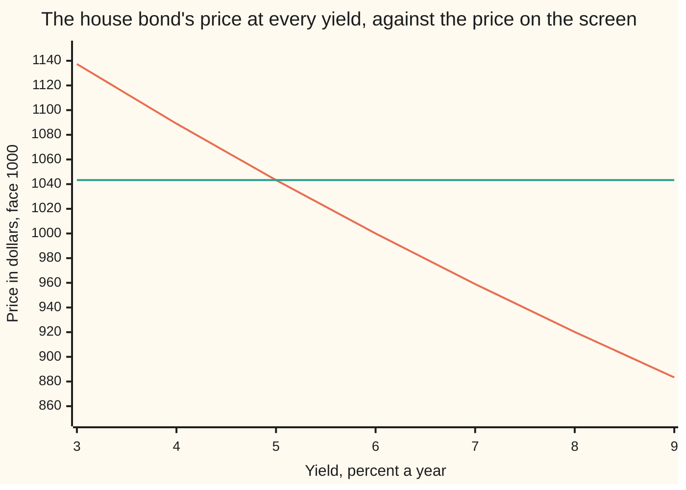
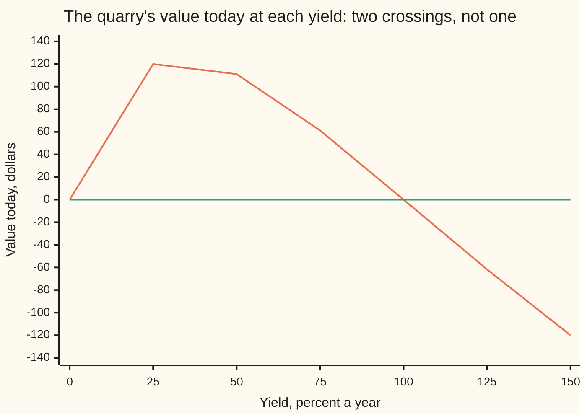

# Yield from price: the first inverse problem, and when it has exactly one answer

[Syllabus](../../../SYLLABUS.md) → [Financial mathematics](../README.md) → [Money, Dates and Discounting](../README.md#s01) → Yield from price

---

## General Overview

A screen quotes the five-year government bond at 1,043.29 dollars. The contract itself prints two numbers and neither of them is the one a lender wants: it promises 60 dollars a year for five years and 1,000 dollars back at the end. What the buyer actually earns at that price is nowhere on the paper. It has to be dug out of the price.

Going the other way is arithmetic: pick a rate, discount the five payments, add them up. That is the job of [Bond price and yield](05-bonds-price-and-yield.md). Going backwards has no such recipe. The price is built from five powers of one unknown rate, and fifth-degree equations have no general formula in ordinary roots — a fact proved once and for all by Abel and Galois. The rate can only be hunted.

Hunting is fine, so long as two questions are settled before the hunt starts. Does an answer exist? Is there only one? For this bond both answers are yes, and the price quoted, 1,043.29, comes back as a yield of **5.000 percent**. For a stream that pays out as well as in, both answers can be no — and that failure is the most useful thing on this card.

**A quoted price names the yield where the falling price curve crosses it, and while every payment is positive that crossing happens exactly once, so any honest search lands on the same number.**

**What kind of fact this is:** a method — two searches, each returning a number to a stated precision; the existence and uniqueness of the yield they hunt for, and the rule that says when to stop, are theorems, proved on this card in Why it works.

### The picture: one quoted price, one crossing



The falling line is the price the bond would fetch at each yield. The flat line is the 1,043.29 on the screen. They meet once, at five percent, and the whole card is about why once is guaranteed and how to find the meeting point without looking at a chart.

---

## The formula

Three pieces of notation, in words first.

$P(y)$, read "P of y", is the price the bond's payments would fetch if the market's rate were $y$ — a machine that takes a rate and returns a price. $p$ is the price actually quoted. A star marks the answer being hunted: $y_*$, read "y star", is the yield that makes the machine produce the quoted price.

$$P(y) \;=\; \sum_{t=1}^{N} \frac{c_t}{(1+y)^{t}}, \qquad \text{the yield is the } y_* \text{ with } P(y_*) = p$$

**Read it aloud:** the yield is the one rate at which the bond's own payments, each shrunk for its own wait, add up to the price on the screen.

Nothing here is new arithmetic. What is new is which side is known. The forward card is handed $y$ and computes $P$; this card is handed $p$ and must produce $y_*$.

Two searches do it. **Bisection** keeps a bracket $[a, b]$ — two rates whose prices lie on opposite sides of the quote — and halves it, over and over, keeping whichever half still straddles. **Newton's method** replaces the curve by its tangent line at the current guess and jumps to where that line crosses the quote:

$$y_{k+1} \;=\; y_k - \frac{P(y_k) - p}{P'(y_k)}, \qquad P'(y) \;=\; -\sum_{t=1}^{N} \frac{t\,c_t}{(1+y)^{t+1}}$$

$P'(y)$, read "P dashed", is the slope of the price curve, negative because the price falls: dollars of price per unit of yield. For the house bond at five percent it is −4,449.156608 dollars, so one basis point of yield — one hundredth of one percent — costs 0.444916 dollars of price.

A search stops when the price it produces is close enough to the quote. That closeness has to be converted into yield before it means anything:

$$\lvert y_k - y_*\rvert \;\le\; \frac{\lvert P(y_k) - p\rvert}{m}, \qquad m \;=\; \sum_{t=1}^{N} \frac{t\,c_t}{(1+b)^{t+1}}$$

**Read it aloud:** divide the price still missing by the slowest the price can possibly fall, and the answer is how far the yield can still be out.

| Symbol | Plain meaning | In the house bond | Push it up and the yield… |
| --- | --- | --- | --- |
| $p$ | the quoted price, the number on the screen | 1,043.294767 | falls |
| $P(y)$ | the price the payments fetch at a trial rate $y$ | 1,300.000000 at a rate of 0 | — |
| $y$ | a trial rate: any rate the search cares to test | 0 to 1 during the search | — |
| $y_k$, $y_*$ | the guess after $k$ steps, and the answer it closes on | 0.049722 after one tangent step; 0.05 | — |
| $c_t$ | the payment due in year $t$ | 60, 60, 60, 60, 1,060 | rises |
| $t$, $N$ | which year a payment lands in, and how many there are | 1 to 5, and $N = 5$ | — |
| $P'(y)$ | the slope: price lost per unit of yield | −4,449.156608 at five percent | — |
| $a$, $b$ | the two ends of the bracket the answer is trapped in | 0 and 1 to start the halving; 4% and 6% for the bound | — |
| $k$ | which step a search is on | 1 to 40 halvings, 1 to 4 tangent steps | — |
| $m$ | the slowest the price falls anywhere in the bracket | 4,212.363786 on 4% to 6% | — |
| $z$ | the growth factor $1+y$; shorthand in the algebra | 1.05 | — |

### When it holds

- **Every payment is positive, and the price is paid once, at the start.** One change of sign in the whole stream is what buys a single answer. Two sign changes can give two yields, and Step 5 shows a stream with exactly that.
- **The quoted price is positive.** A price of zero is only ever approached, as the yield runs off to infinity, so a quote of zero names no rate. A quote above the undiscounted total of 1,300.00 is legal and gives a negative yield.
- **The payments are fixed, known, and a whole period apart.** A coupon that resets, or a settlement date part-way through a period, changes the equation being solved before any search begins: [Day counts](02-day-counts-and-dates.md).
- **Bisection needs a genuine bracket; Newton needs a slope.** Two ends on the same side of the quote and bisection converges to nothing useful. A tangent taken where the curve is nearly flat throws the next guess into the distance, which is what happens at the end of Step 5.
- **The answer arrives with a precision, not exactly.** Forty halvings pin the yield to about a trillionth. Anything less has to be defended with the bound above.

**Conventions verified 14 September 2026:** the price-to-yield formulas the US Treasury itself uses, with the twice-yearly compounding and the day counts its yields are quoted under, are printed in 31 CFR part 356, appendix B, cited below. A market can change how it quotes; that changes which equation is inverted, never how the inverting works.

---

## Why it works

### Step 0: the price only ever falls

Raise the rate and every single term gets smaller, because each is a fixed positive payment divided by a bigger number. A sum of falling terms falls. So the house bond prices at 1,137.39 at three percent, 1,043.29 at five, and 883.31 at nine, and never once climbs.

That is the whole uniqueness argument in one line: a curve that only falls cannot be at 1,043.29 twice.

### Step 1: the two ends of the range, and what lies between

At a rate of nothing at all, no discounting happens and the price is just the cash added up: 60 + 60 + 60 + 60 + 1,060 = 1,300.00. Push the rate down towards −1 and the divisors shrink towards zero, so the price climbs without limit. Push it up and every payment is divided by a bigger and bigger number: at 100 percent the bond is worth 89.375, and the price keeps shrinking towards zero.

So the price sweeps every value above zero, exactly once each. Any positive quote is therefore hit, and hit once. The quote 1,043.29 sits between 1,300.00 and 89.375, which is all bisection needs to start.

<details>
<summary>Detailed proof: one yield, and exactly one</summary>

Let every payment $c_t$ be at least zero with at least one strictly positive, and work on rates $y > -1$ so that $1+y$ is positive.

**It falls.** Differentiating term by term, $P'(y) = -\sum_{t} t\,c_t (1+y)^{-t-1}$. Every term of that sum is at least zero and at least one is strictly positive, so $P'(y) < 0$ everywhere. A function with a strictly negative derivative on an interval is strictly decreasing there, by the mean value theorem. Two different rates cannot share a price.

**It covers everything.** At least one payment is strictly positive. As $y$ falls towards $-1$, that payment's own term runs to infinity while no term is ever negative, so $P(y)$ runs to infinity. As $y$ grows without bound, each of the finitely many terms falls to zero, so $P(y)$ falls to zero. $P$ is a finite sum of continuous functions, so it is continuous, and the intermediate value theorem puts a solution of $P(y) = p$ somewhere between those extremes for every $p > 0$. Strict decrease makes it the only one. $\blacksquare$

**Where the claim stops.** A quote of zero or below names no rate. If every payment is zero the price is always zero and no rate is identified. And if payments change sign, $P'$ need no longer be negative anywhere — which is the whole of Step 5.

</details>

### Step 2: halving a bracket cannot miss

Bisection needs nothing but the two ends and a comparison. Halve the bracket, price the midpoint, and throw away the half that does not straddle the quote. The answer is still trapped, in an interval half as wide.

Starting from the ends 0 and 1, the halfway rate of 50 percent prices far below the quote, so the top half goes at once. The midpoint of what is left, 25 percent, is worth 489.036800 — still too cheap. Then 12.5 percent, 768.563058; then 6.25 percent, 989.540327; then 3.125 percent, 1,131.197970, too dear at last, so the bracket closes to 3.125–6.25 percent.

Ten halvings give 5.029297 percent, twenty give 5.000000 to six places, forty leave a bracket one part in a million million of the range it started from. The width after $k$ halvings is the starting width divided by two $k$ times, and that is a promise made before the first step, independent of the bond.

### Step 3: the tangent step, and what the slope is

Bisection ignores everything the price curve says except which side of the quote it is on. Newton's method uses the slope.

At a trial rate, the curve is replaced by its tangent — the straight line touching it there — and the next guess is where that line crosses the quoted price. The step is the price still missing, divided by the slope.

That slope is not an abstraction. $-P'(y)$ is the money the bond loses per unit of yield, known on a desk as dollar duration; divided by the price it is the percentage loss, and the rest of that story is [Duration and convexity](06-duration-and-convexity.md). Here it is 4,449.156608 dollars per unit of yield at the answer, so one basis point of yield is 0.444916 dollars of price.

Starting from the 6 percent coupon rate — the natural first guess, since it is the right answer whenever a bond trades at its face — the bond prices at 1,000.00, which is 43.294767 too cheap. The slope there is −4,212.363786. One step:

$$0.06 - \frac{-43.294767}{-4212.363786} = 0.049722.$$

The next step reaches 4.9999788 percent, and the one after that is right to seven places. Each step roughly doubles the number of correct digits, because the error left after a step is proportional to the square of the error before it — the general statement lives on [Fixed points](../../06-Calculus%20and%20analysis/03-What%20Derivatives%20Tell%20You/07-fixed-point-iteration-and-the-contraction-principle.md).

<details>
<summary>Why the tangent is worth two guesses</summary>

The tangent's crossing is exact for a straight line and wrong for a curved one, and the price curve bends the same way everywhere. So every tangent step after the first lands on the same side of the answer — below it here — and the guesses creep in from one direction rather than bouncing around it. What it never does is guarantee anything: a tangent taken where the curve is nearly flat crosses the quote far away, which is Step 5's failure.

</details>

### Step 4: knowing when to stop

A search reports a price residual — how far the current guess's price is from the quote — and that number is in dollars, not in yield. Converting needs the slope again, but honestly: on a bracket holding both the guess and the answer, the price can fall no slower than at the bracket's high end, which for a positive stream is $m$ — on 4 to 6 percent, 4,212.363786 dollars. Dividing the leftover dollars by $m$ can only overstate the yield still missing.

Stopping the halving after ten steps gives 5.029297 percent, which is out by 0.029297 percentage points. The 1.302415 of price still missing there allows at most 0.030919 percentage points. The bound holds and sits just above the true error, which is what a useful bound looks like.

At the other end, one cent of price error on this bond can hide no more than 0.000237 percentage points of yield — about a fortieth of a basis point. That is why a bond yield quoted to three decimal places is a claim about a price quoted to the cent.

### Step 5: one sign change is what buys the single answer

A quarry costs 1,000 today. It returns 3,000 in a year. Then the site has to be filled and planted, which costs 2,000 at the end of the second year. The cash goes out, comes in, and goes out again: two changes of sign.

Its value at a rate of nothing at all is −1,000 + 3,000 − 2,000 = 0.00. At 25 percent it is worth 120.00, at 50 percent 111.11, at 75 percent 61.22, and at 100 percent it is 0.00 again. The curve climbs, turns over and comes back down, crossing zero twice.

Both crossings are real rates of return. Whole-number algebra pins them exactly: clearing the denominators turns the break-even condition into $1000\,z^2 - 3000\,z + 2000 = 0$, where $z = 1+y$ is the growth factor. The number under the root sign is 1,000,000, a perfect square, so the quadratic formula lands on whole numbers and the two rates come out exactly: **yields of 0.000000 percent and 100.000000 percent, both correct.**

The same algebra says how many answers exist for any price. Buy the quarry for 1,125 instead and the number under the root sign is 0: the two answers merge into one, 33.333333 percent. Buy it for 1,200 and that number is −600,000, so no rate on earth breaks even — the stream simply cannot be worth 1,200 today at any yield.



The curved line is the quarry's value; the flat line is break-even. They meet at nought percent and at a hundred percent. Nothing in between is wrong, and nothing outside is a near miss. A count of sign changes is the general rule: written in $z = 1+y$, the price equation is a polynomial, and Descartes' rule of signs says it has no more positive roots — no more rates above −100 percent — than the payments have changes of sign. One change of sign, at most one answer, and Step 1 says exactly one. The project side of this, and what a single rate can and cannot be asked to mean, is [NPV and IRR](04-net-present-value-and-irr.md).

**The other route.** A yield is a single rate stretched over every date. A market that keeps a different rate for each date does not invert a price for one rate at all; it asks what fixed extra spread, added to every rate on the curve, reproduces the quote. Same search, different unknown: [Spreads over the curve](../02-Curves/06-z-spread-and-asset-swap-spread.md).

---

## Worked numbers, by hand

The house bond, face 1,000, a 6 percent coupon once a year, five years to run, quoted at 1,043.294767. That quote is not a rounded decimal: at a yield of exactly one twentieth the price is the whole-number fraction 4,260,921,200 / 4,084,101, which long division opens out to 1,043.294766706308.

| Step | Arithmetic | Value |
| --- | --- | --- |
| the left end, a rate of nothing | 60 + 60 + 60 + 60 + 1,060 | 1,300.000000 |
| the right end, 100 percent | 30 + 15 + 7.50 + 3.75 + 33.125 | 89.375000 |
| after halving 1, midpoint 25 percent | too cheap, keep the lower half | 489.036800 |
| after halving 2, midpoint 12.5 percent | too cheap again | 768.563058 |
| after halving 3, midpoint 6.25 percent | still too cheap | 989.540327 |
| after halving 4, midpoint 3.125 percent | too dear at last: the bracket closes | 1,131.197970 |
| after halving 10, midpoint 5.029297 percent | 1.302415 of price still missing | 1,041.992352 |
| after halving 40 | the bracket is a million-millionth of its first width | **5.000000 percent** |
| tangent step 1, from 6 percent | 0.06 − (−43.294767) / (−4,212.363786) | 4.9721978 percent |
| tangent step 2 | 1.237908 of price still missing | 4.9999788 percent |
| tangent step 4 | nothing left to correct | **5.000000 percent** |

Both searches say the same thing: a buyer paying 1,043.29 for this contract is lending at five percent a year. The 6 percent printed on the bond is what the borrower pays on the face, not what the lender earns on the price. Five percent prices the contract; it says nothing about the rate each 60 will earn once it has been received.

### What breaks if you drop a piece

| Mistake | Comes out at | What went wrong |
| --- | --- | --- |
| Dividing the coupon by the price and calling it the yield | 5.751011 percent | The current yield counts the 60 a year and ignores the 43.29 of premium that is never handed back. |
| Reading the coupon rate off the contract | 6.000000 percent | That is the rate the borrower pays on 1,000 of face. The lender paid 1,043.29. |
| Stopping the halving after ten steps | 5.029297 percent | Three basis points out, and 1.30 dollars of the price still unaccounted for. |
| A tangent step from 30 percent on the quarry | −243.0000 percent | The curve is nearly flat at its turning point, so the tangent crosses break-even far outside the range where prices exist at all. |

The code prints all four.

---

## How the two searches close in

Both methods reach the same 5.000000 percent. They do not reach it at the same speed, and the difference is not a detail of tuning — it is what each method is promising.

Bisection promises the answer is inside a bracket, and halves that bracket each step. Ten halvings of a one-unit bracket leave about a thousandth: two settled digits. Newton's method promises nothing at all about brackets, and in exchange roughly squares the error each step.

```
Decimal digits of the yield settled, one block per digit, after each step
  halving,  step 1                             0 digits
  halving,  step 3   █                         1 digit
  halving,  step 6   ██                        2 digits
  tangent,  step 1   ███                       3 digits
  tangent,  step 2   ██████                    6 digits
  tangent,  step 3   ████████████             12 digits
  tangent,  step 4   ████████████████         16 digits
```

Four tangent steps exhaust what a computer can represent; forty halvings are still short of it. The trade is certainty against speed: the halving cannot fail on a real bracket, and the tangent can, as the quarry showed. Production code keeps both — a bracket for safety, a tangent step for speed, and the bracket vetoes any tangent step that leaves it.

---

## Code, from first principles, and it actually runs

Nothing is imported. The yield is found two ways that share no arithmetic: halving a bracket and following tangents from the coupon rate. The quote they aim at is built as a fraction of two whole numbers — the exact price at a yield of one twentieth — so the target was not produced by the floating-point code being tested. Then the quarry is solved, its two yields confirmed by whole-number algebra that never touches a decimal point, and a tangent step is shown leaving the range where prices exist.

### Python

```python
# Yield from price -- the check behind the card.  Nothing is imported.  The
# house bond: face 1000, a 6% coupon paid once a year, five years to run,
# quoted at 1043.294767.  The yield is found two ways that share no
# arithmetic: halving a bracket and following tangents.  The quote itself is
# a whole-number fraction, the exact price at 21/20, so the target is not an
# artefact of the floating-point code.  A quarry stream is then solved too.
FACE, CRATE, YEARS = 1000.0, 0.06, 5
BOND = [(t, FACE * CRATE + (FACE if t == YEARS else 0.0)) for t in range(1, YEARS + 1)]
QUARRY = [(0, -1000.0), (1, 3000.0), (2, -2000.0)]
NUM = sum(round(cf) * 20 ** t * 21 ** (YEARS - t) for t, cf in BOND)   # exact price at y = 1/20,
DEN = 21 ** YEARS                                                      # as a whole-number fraction
QUOTE = NUM / DEN

def pv(flows, y):                      # the price at a yield: every payment discounted, then added
    return sum(cf / (1.0 + y) ** t for t, cf in flows)

def slope(flows, y):                   # dP/dy: dollars of price per unit of yield
    return -sum(t * cf / (1.0 + y) ** (t + 1) for t, cf in flows)

def digits(err):                       # decimal digits of the answer that have settled
    d, e = 0, abs(err)
    while e < 1.0 and d < 17:
        e, d = e * 10.0, d + 1
    return d - 1

def bisect(flows, target, lo, hi, steps):
    """Halve a bracket whose ends price on opposite sides of the target."""
    trace, flo = [], pv(flows, lo) - target
    for k in range(steps):
        mid = 0.5 * (lo + hi)
        if (pv(flows, mid) - target) * flo > 0.0:
            lo = mid
        else:
            hi = mid
        trace.append((k + 1, lo, hi, 0.5 * (lo + hi)))
    return trace

def newton(flows, target, y0, steps):
    """Follow the tangent to where it crosses the quoted price."""
    trace, y = [], y0
    for k in range(steps):
        resid = pv(flows, y) - target
        y = y - resid / slope(flows, y)
        trace.append((k + 1, y, resid))
        if y <= -1.0:
            break
    return trace

def isqrt(n):                          # whole-number square root, written out here
    x = n
    while x * x > n:
        x = (x + n // x) // 2
    return x

def row(label, value):
    print(f"{label:<48}{value:>14.6f}")

def strip(label, values):
    print(f"{label:<38}" + "".join(f"{v:>10.2f}" for v in values))

print(f"the house bond: face {FACE:.2f}, coupon {CRATE * 100:.2f}% once a year, "
      f"{YEARS} payments, quoted at {QUOTE:.6f}")
print(f"the quote as a whole-number fraction: {NUM} / {DEN}")
print(f"the same fraction by long division:   {NUM // DEN}.{(NUM * 10 ** 12 // DEN) % 10 ** 12:012d}")
YS = [0.03, 0.04, 0.05, 0.06, 0.07, 0.08, 0.09]
curve = [pv(BOND, y) for y in YS]
strip("price at yields 3% to 9%", curve)
strip("the quote, flat, at those yields", [QUOTE] * len(YS))
print(f"bracket: the price at 0% is {pv(BOND, 0.0):.6f} and at 100% is {pv(BOND, 1.0):.6f}, "
      f"so the quote is caught between")
print("road 1  halving the bracket [0%, 100%]")
tr = bisect(BOND, QUOTE, 0.0, 1.0, 40)
for k, lo, hi, mid in tr:
    if k <= 6 or k in (10, 20, 40):
        print(f"  step {k:>2}  bracket [{lo:.6f}, {hi:.6f}]  midpoint {mid:.6f}"
              f"  price {pv(BOND, mid):>11.6f}")
print("road 2  tangent steps from the 6% coupon rate")
nt = newton(BOND, QUOTE, CRATE, 6)
for k, y, resid in nt[:4]:
    print(f"  step {k:>2}  price residual before the step {resid:>12.6f}"
          f"  yield after it {y * 100.0:.7f}%")
y_bis, y_new = tr[-1][3], nt[3][1]
row("road 1  yield after 40 halvings, percent", y_bis * 100.0)
row("road 2  yield after 4 tangent steps, percent", y_new * 100.0)
row("the exact 1/20 the quote was built at, percent", 100.0 / 20.0)
row("roads 1 and 2 apart by, percent", abs(y_bis - y_new) * 100.0)
print(f"{'digits of the yield settled after step':<38}" + "".join(f"{k:>10d}" for k in range(1, 7)))
print(f"{'  by halving':<38}" + "".join(f"{digits(tr[k][3] - 0.05):>10d}" for k in range(6)))
print(f"{'  by tangents':<38}" + "".join(f"{digits(nt[k][1] - 0.05):>10d}" for k in range(6)))
m = -slope(BOND, 0.06)                 # the slowest the price falls anywhere in 4% to 6%
stop10 = tr[9][3]
row("price fall per unit of yield at 5%, dollars", -slope(BOND, 0.05))
row("price fall for one basis point, dollars", -slope(BOND, 0.05) * 0.0001)
row("slowest price fall anywhere in 4% to 6%", m)
row("yield a 1 cent price error can hide, percent", 0.01 / m * 100.0)
row("mistake: coupon over price, the current yield, %", FACE * CRATE / QUOTE * 100.0)
row("mistake: the 6% coupon read as the yield, %", CRATE * 100.0)
row("mistake: halving stopped after 10 steps, %", stop10 * 100.0)
row("  that guess is out by, percent", abs(stop10 - 0.05) * 100.0)
row("  with this much price still missing, dollars", abs(pv(BOND, stop10) - QUOTE))
row("  and that residual allows a yield error of, %", abs(pv(BOND, stop10) - QUOTE) / m * 100.0)
print("the quarry: 1000 paid out today, 3000 back in a year, 2000 of clean-up at the end")
strip("its value at yields 0% to 150%", [pv(QUARRY, y) for y in (0.0, 0.25, 0.5, 0.75, 1.0, 1.25, 1.5)])
strip("the zero line it must cross", [0.0] * 7)
qr = bisect(QUARRY, 0.0, 0.5, 3.0, 60)[-1][3]
row("quarry yield by halving [50%, 300%], percent", qr * 100.0)
row("quarry value at a yield of 0%, dollars", pv(QUARRY, 0.0))
roots = []
for cost in (1000, 1125, 1200):
    disc = 3000 * 3000 - 4 * cost * 2000          # the whole-number test for how many yields exist
    if disc < 0:
        print(f"  bought for {cost}: the root sign holds {disc}, so no yield exists at all")
    else:
        zs = sorted({3000 - isqrt(disc), 3000 + isqrt(disc)})
        ys = [z / (2 * cost) - 1.0 for z in zs]
        roots = ys if cost == 1000 else roots
        print(f"  bought for {cost}: the root sign holds {disc}, giving "
              f"{'one yield' if len(ys) == 1 else 'two yields'}: "
              + " and ".join(f"{y * 100.0:.6f}%" for y in ys))
print(f"  a tangent step from a yield of 30% lands at {newton(QUARRY, 0.0, 0.30, 1)[0][1] * 100.0:.4f}%,"
      f" outside every price")
assert abs(y_bis - y_new) < 1e-9, "halving and tangents must land on the same yield"
assert abs(pv(BOND, y_new) - QUOTE) < 1e-9, "the found yield must reprice the whole-number quote"
assert abs(y_bis - 0.05) < 1e-11, "the search must find the 1/20 built into the quote"
assert abs(stop10 - 0.05) <= abs(pv(BOND, stop10) - QUOTE) / m, "the price-residual bound holds"
assert all(curve[i] > curve[i + 1] for i in range(len(curve) - 1)), "one price per yield, no ties"
assert abs(qr - roots[1]) < 1e-9 and pv(QUARRY, roots[0]) == 0.0, "both quarry yields, two ways"
print("ALL CHECKS PASS")
```

**Ran 2026-09-14 on macOS, Python 3.14.6, standard library only. All checks passed. Output, pasted from the run:**

```
the house bond: face 1000.00, coupon 6.00% once a year, 5 payments, quoted at 1043.294767
the quote as a whole-number fraction: 4260921200 / 4084101
the same fraction by long division:   1043.294766706308
price at yields 3% to 9%                 1137.39   1089.04   1043.29   1000.00    959.00    920.15    883.31
the quote, flat, at those yields         1043.29   1043.29   1043.29   1043.29   1043.29   1043.29   1043.29
bracket: the price at 0% is 1300.000000 and at 100% is 89.375000, so the quote is caught between
road 1  halving the bracket [0%, 100%]
  step  1  bracket [0.000000, 0.500000]  midpoint 0.250000  price  489.036800
  step  2  bracket [0.000000, 0.250000]  midpoint 0.125000  price  768.563058
  step  3  bracket [0.000000, 0.125000]  midpoint 0.062500  price  989.540327
  step  4  bracket [0.000000, 0.062500]  midpoint 0.031250  price 1131.197970
  step  5  bracket [0.031250, 0.062500]  midpoint 0.046875  price 1057.318628
  step  6  bracket [0.046875, 0.062500]  midpoint 0.054688  price 1022.705340
  step 10  bracket [0.049805, 0.050781]  midpoint 0.050293  price 1041.992352
  step 20  bracket [0.049999, 0.050000]  midpoint 0.050000  price 1043.296040
  step 40  bracket [0.050000, 0.050000]  midpoint 0.050000  price 1043.294767
road 2  tangent steps from the 6% coupon rate
  step  1  price residual before the step   -43.294767  yield after it 4.9721978%
  step  2  price residual before the step     1.237908  yield after it 4.9999788%
  step  3  price residual before the step     0.000945  yield after it 5.0000000%
  step  4  price residual before the step     0.000000  yield after it 5.0000000%
road 1  yield after 40 halvings, percent              5.000000
road 2  yield after 4 tangent steps, percent          5.000000
the exact 1/20 the quote was built at, percent        5.000000
roads 1 and 2 apart by, percent                       0.000000
digits of the yield settled after step         1         2         3         4         5         6
  by halving                                   0         1         1         1         2         2
  by tangents                                  3         6        12        16        16        16
price fall per unit of yield at 5%, dollars        4449.156608
price fall for one basis point, dollars               0.444916
slowest price fall anywhere in 4% to 6%            4212.363786
yield a 1 cent price error can hide, percent          0.000237
mistake: coupon over price, the current yield, %      5.751011
mistake: the 6% coupon read as the yield, %           6.000000
mistake: halving stopped after 10 steps, %            5.029297
  that guess is out by, percent                       0.029297
  with this much price still missing, dollars         1.302415
  and that residual allows a yield error of, %        0.030919
the quarry: 1000 paid out today, 3000 back in a year, 2000 of clean-up at the end
its value at yields 0% to 150%              0.00    120.00    111.11     61.22      0.00    -61.73   -120.00
the zero line it must cross                 0.00      0.00      0.00      0.00      0.00      0.00      0.00
quarry yield by halving [50%, 300%], percent        100.000000
quarry value at a yield of 0%, dollars                0.000000
  bought for 1000: the root sign holds 1000000, giving two yields: 0.000000% and 100.000000%
  bought for 1125: the root sign holds 0, giving one yield: 33.333333%
  bought for 1200: the root sign holds -600000, so no yield exists at all
  a tangent step from a yield of 30% lands at -243.0000%, outside every price
ALL CHECKS PASS
```

### Rust

Same numbers, same labels, built with `rustc --edition 2021 -O`.

```rust
// Yield from price -- the same check as the Python, in Rust.  No crates.  The
// house bond: face 1000, a 6% coupon paid once a year, five years to run,
// quoted at 1043.294767.  The yield is found two ways that share no
// arithmetic: halving a bracket and following tangents.  The quote itself is
// a whole-number fraction, the exact price at 21/20, so the target is not an
// artefact of the floating-point code.  A quarry stream is then solved too.
const FACE: f64 = 1000.0;
const CRATE_: f64 = 0.06;
const YEARS: usize = 5;

/// the price at a yield: every payment discounted, then added
fn pv(flows: &[(usize, f64)], y: f64) -> f64 {
    let mut s = 0.0;
    for &(t, cf) in flows { s += cf / (1.0 + y).powf(t as f64); }
    s
}

/// dP/dy: dollars of price per unit of yield
fn slope(flows: &[(usize, f64)], y: f64) -> f64 {
    let mut s = 0.0;
    for &(t, cf) in flows { s += t as f64 * cf / (1.0 + y).powf(t as f64 + 1.0); }
    -s
}

/// decimal digits of the answer that have settled
fn digits(err: f64) -> i32 {
    let (mut d, mut e) = (0, err.abs());
    while e < 1.0 && d < 17 { e *= 10.0; d += 1; }
    d - 1
}

/// Halve a bracket whose ends price on opposite sides of the target.
fn bisect(flows: &[(usize, f64)], target: f64, lo0: f64, hi0: f64, steps: usize)
          -> Vec<(usize, f64, f64, f64)> {
    let (mut lo, mut hi) = (lo0, hi0);
    let flo = pv(flows, lo) - target;
    let mut trace = Vec::new();
    for k in 0..steps {
        let mid = 0.5 * (lo + hi);
        if (pv(flows, mid) - target) * flo > 0.0 { lo = mid } else { hi = mid }
        trace.push((k + 1, lo, hi, 0.5 * (lo + hi)));
    }
    trace
}

/// Follow the tangent to where it crosses the quoted price.
fn newton(flows: &[(usize, f64)], target: f64, y0: f64, steps: usize) -> Vec<(usize, f64, f64)> {
    let (mut trace, mut y) = (Vec::new(), y0);
    for k in 0..steps {
        let resid = pv(flows, y) - target;
        y -= resid / slope(flows, y);
        trace.push((k + 1, y, resid));
        if y <= -1.0 { break }
    }
    trace
}

/// whole-number square root, written out here
fn isqrt(n: i128) -> i128 {
    let mut x = n;
    while x * x > n { x = (x + n / x) / 2 }
    x
}

fn row(label: &str, value: f64) { println!("{:<48}{:>14.6}", label, value); }

fn strip(label: &str, values: &[f64]) {
    let mut line = format!("{:<38}", label);
    for v in values { line.push_str(&format!("{:>10.2}", v)); }
    println!("{}", line);
}

fn main() {
    let bond: Vec<(usize, f64)> = (1..=YEARS)
        .map(|t| (t, FACE * CRATE_ + if t == YEARS { FACE } else { 0.0 })).collect();
    let quarry: Vec<(usize, f64)> = vec![(0, -1000.0), (1, 3000.0), (2, -2000.0)];
    let mut num: i128 = 0;                            // exact price at y = 1/20,
    for &(t, cf) in &bond {                           // as a whole-number fraction
        num += cf.round() as i128 * 20i128.pow(t as u32) * 21i128.pow((YEARS - t) as u32);
    }
    let den: i128 = 21i128.pow(YEARS as u32);
    let quote = num as f64 / den as f64;

    println!("the house bond: face {:.2}, coupon {:.2}% once a year, {} payments, quoted at {:.6}",
             FACE, CRATE_ * 100.0, YEARS, quote);
    println!("the quote as a whole-number fraction: {} / {}", num, den);
    println!("the same fraction by long division:   {}.{:012}",
             num / den, (num * 10i128.pow(12) / den) % 10i128.pow(12));
    let ys = [0.03, 0.04, 0.05, 0.06, 0.07, 0.08, 0.09];
    let curve: Vec<f64> = ys.iter().map(|&y| pv(&bond, y)).collect();
    strip("price at yields 3% to 9%", &curve);
    strip("the quote, flat, at those yields", &[quote; 7]);
    println!("bracket: the price at 0% is {:.6} and at 100% is {:.6}, so the quote is caught between",
             pv(&bond, 0.0), pv(&bond, 1.0));
    println!("road 1  halving the bracket [0%, 100%]");
    let tr = bisect(&bond, quote, 0.0, 1.0, 40);
    for &(k, lo, hi, mid) in &tr {
        if k <= 6 || k == 10 || k == 20 || k == 40 {
            println!("  step {:>2}  bracket [{:.6}, {:.6}]  midpoint {:.6}  price {:>11.6}",
                     k, lo, hi, mid, pv(&bond, mid));
        }
    }
    println!("road 2  tangent steps from the 6% coupon rate");
    let nt = newton(&bond, quote, CRATE_, 6);
    for &(k, y, resid) in nt.iter().take(4) {
        println!("  step {:>2}  price residual before the step {:>12.6}  yield after it {:.7}%",
                 k, resid, y * 100.0);
    }
    let (y_bis, y_new) = (tr[tr.len() - 1].3, nt[3].1);
    row("road 1  yield after 40 halvings, percent", y_bis * 100.0);
    row("road 2  yield after 4 tangent steps, percent", y_new * 100.0);
    row("the exact 1/20 the quote was built at, percent", 100.0 / 20.0);
    row("roads 1 and 2 apart by, percent", (y_bis - y_new).abs() * 100.0);
    let mut head = format!("{:<38}", "digits of the yield settled after step");
    let (mut bh, mut th) = (format!("{:<38}", "  by halving"), format!("{:<38}", "  by tangents"));
    for k in 0..6 {
        head.push_str(&format!("{:>10}", k + 1));
        bh.push_str(&format!("{:>10}", digits(tr[k].3 - 0.05)));
        th.push_str(&format!("{:>10}", digits(nt[k].1 - 0.05)));
    }
    println!("{}\n{}\n{}", head, bh, th);
    let m = -slope(&bond, 0.06);        // the slowest the price falls anywhere in 4% to 6%
    let stop10 = tr[9].3;
    row("price fall per unit of yield at 5%, dollars", -slope(&bond, 0.05));
    row("price fall for one basis point, dollars", -slope(&bond, 0.05) * 0.0001);
    row("slowest price fall anywhere in 4% to 6%", m);
    row("yield a 1 cent price error can hide, percent", 0.01 / m * 100.0);
    row("mistake: coupon over price, the current yield, %", FACE * CRATE_ / quote * 100.0);
    row("mistake: the 6% coupon read as the yield, %", CRATE_ * 100.0);
    row("mistake: halving stopped after 10 steps, %", stop10 * 100.0);
    row("  that guess is out by, percent", (stop10 - 0.05).abs() * 100.0);
    row("  with this much price still missing, dollars", (pv(&bond, stop10) - quote).abs());
    row("  and that residual allows a yield error of, %", (pv(&bond, stop10) - quote).abs() / m * 100.0);
    println!("the quarry: 1000 paid out today, 3000 back in a year, 2000 of clean-up at the end");
    let qys = [0.0, 0.25, 0.5, 0.75, 1.0, 1.25, 1.5];
    strip("its value at yields 0% to 150%", &qys.iter().map(|&y| pv(&quarry, y)).collect::<Vec<f64>>());
    strip("the zero line it must cross", &[0.0; 7]);
    let qr = bisect(&quarry, 0.0, 0.5, 3.0, 60)[59].3;
    row("quarry yield by halving [50%, 300%], percent", qr * 100.0);
    row("quarry value at a yield of 0%, dollars", pv(&quarry, 0.0));
    let mut roots: Vec<f64> = Vec::new();
    for cost in [1000i128, 1125, 1200] {
        let disc = 3000 * 3000 - 4 * cost * 2000;   // the whole-number test for how many yields exist
        if disc < 0 {
            println!("  bought for {}: the root sign holds {}, so no yield exists at all", cost, disc);
        } else {
            let mut zs = vec![3000 - isqrt(disc), 3000 + isqrt(disc)];
            zs.dedup();
            let rs: Vec<f64> = zs.iter().map(|&z| z as f64 / (2 * cost) as f64 - 1.0).collect();
            if cost == 1000 { roots = rs.clone() }
            let shown: Vec<String> = rs.iter().map(|y| format!("{:.6}%", y * 100.0)).collect();
            println!("  bought for {}: the root sign holds {}, giving {}: {}", cost, disc,
                     if rs.len() == 1 { "one yield" } else { "two yields" }, shown.join(" and "));
        }
    }
    println!("  a tangent step from a yield of 30% lands at {:.4}%, outside every price",
             newton(&quarry, 0.0, 0.30, 1)[0].1 * 100.0);
    assert!((y_bis - y_new).abs() < 1e-9, "halving and tangents must land on the same yield");
    assert!((pv(&bond, y_new) - quote).abs() < 1e-9, "the found yield must reprice the whole-number quote");
    assert!((y_bis - 0.05).abs() < 1e-11, "the search must find the 1/20 built into the quote");
    assert!((stop10 - 0.05).abs() <= (pv(&bond, stop10) - quote).abs() / m, "the price-residual bound holds");
    assert!((0..curve.len() - 1).all(|i| curve[i] > curve[i + 1]), "one price per yield, no ties");
    assert!((qr - roots[1]).abs() < 1e-9 && pv(&quarry, roots[0]) == 0.0, "both quarry yields, two ways");
    println!("ALL CHECKS PASS");
}
```

**Ran 2026-09-14 on macOS, rustc 1.98.1, no crates. All checks passed. Output, pasted from the run:**

```
the house bond: face 1000.00, coupon 6.00% once a year, 5 payments, quoted at 1043.294767
the quote as a whole-number fraction: 4260921200 / 4084101
the same fraction by long division:   1043.294766706308
price at yields 3% to 9%                 1137.39   1089.04   1043.29   1000.00    959.00    920.15    883.31
the quote, flat, at those yields         1043.29   1043.29   1043.29   1043.29   1043.29   1043.29   1043.29
bracket: the price at 0% is 1300.000000 and at 100% is 89.375000, so the quote is caught between
road 1  halving the bracket [0%, 100%]
  step  1  bracket [0.000000, 0.500000]  midpoint 0.250000  price  489.036800
  step  2  bracket [0.000000, 0.250000]  midpoint 0.125000  price  768.563058
  step  3  bracket [0.000000, 0.125000]  midpoint 0.062500  price  989.540327
  step  4  bracket [0.000000, 0.062500]  midpoint 0.031250  price 1131.197970
  step  5  bracket [0.031250, 0.062500]  midpoint 0.046875  price 1057.318628
  step  6  bracket [0.046875, 0.062500]  midpoint 0.054688  price 1022.705340
  step 10  bracket [0.049805, 0.050781]  midpoint 0.050293  price 1041.992352
  step 20  bracket [0.049999, 0.050000]  midpoint 0.050000  price 1043.296040
  step 40  bracket [0.050000, 0.050000]  midpoint 0.050000  price 1043.294767
road 2  tangent steps from the 6% coupon rate
  step  1  price residual before the step   -43.294767  yield after it 4.9721978%
  step  2  price residual before the step     1.237908  yield after it 4.9999788%
  step  3  price residual before the step     0.000945  yield after it 5.0000000%
  step  4  price residual before the step     0.000000  yield after it 5.0000000%
road 1  yield after 40 halvings, percent              5.000000
road 2  yield after 4 tangent steps, percent          5.000000
the exact 1/20 the quote was built at, percent        5.000000
roads 1 and 2 apart by, percent                       0.000000
digits of the yield settled after step         1         2         3         4         5         6
  by halving                                   0         1         1         1         2         2
  by tangents                                  3         6        12        16        16        16
price fall per unit of yield at 5%, dollars        4449.156608
price fall for one basis point, dollars               0.444916
slowest price fall anywhere in 4% to 6%            4212.363786
yield a 1 cent price error can hide, percent          0.000237
mistake: coupon over price, the current yield, %      5.751011
mistake: the 6% coupon read as the yield, %           6.000000
mistake: halving stopped after 10 steps, %            5.029297
  that guess is out by, percent                       0.029297
  with this much price still missing, dollars         1.302415
  and that residual allows a yield error of, %        0.030919
the quarry: 1000 paid out today, 3000 back in a year, 2000 of clean-up at the end
its value at yields 0% to 150%              0.00    120.00    111.11     61.22      0.00    -61.73   -120.00
the zero line it must cross                 0.00      0.00      0.00      0.00      0.00      0.00      0.00
quarry yield by halving [50%, 300%], percent        100.000000
quarry value at a yield of 0%, dollars                0.000000
  bought for 1000: the root sign holds 1000000, giving two yields: 0.000000% and 100.000000%
  bought for 1125: the root sign holds 0, giving one yield: 33.333333%
  bought for 1200: the root sign holds -600000, so no yield exists at all
  a tangent step from a yield of 30% lands at -243.0000%, outside every price
ALL CHECKS PASS
```

The two outputs match line for line.

> [!TIP]
> **Try changing**
> Guess first, then run it. The asserts are pinned to the house bond at five percent, so an experiment that moves the target will stop the program on purpose.
> - **Quote the bond at its face.** Aim the search at 1000.00 instead. The yield comes back as 6.000000 percent, the coupon rate itself: par is the one price at which the contract prints its own answer.
> - **Stop the halving early.** Ask `bisect` for ten steps instead of forty. The answer degrades to 5.029297 percent, and the printed bound shows that the 1.302415 of price still missing allowed 0.030919 percentage points of error all along.
> - **Take a tangent step at the quarry's turning point.** Start the tangent from 33.333333 percent, where the curve is flat. The step divides by a slope of almost nothing and lands even further outside than the step from 30 percent does.
> - **Turn the clean-up into a receipt.** Change the quarry's last payment from −2000 to +2000. One change of sign returns, the second crossing disappears, and there is a single yield again — a high one, since nothing is ever paid back out.

---

## The usual mistake

> [!warning]
> **Trusting a solver because it returned a number.** A root finder always returns something. It cannot tell whether the stream it was handed has one answer, two, or none: that is decided by the payments and the price before any search starts, and it is the only part of this card a computer will not do unasked. The quarry's solver is not broken when it reports 100.000000 percent instead of 0.000000 percent. Both are right, and the question was wrong.
>
> - **Coupon over price, called the yield.** That is the current yield, 5.751011 percent here. It counts the 60 a year and quietly ignores the 43.29 of premium that never comes back.
> - **Stopping on a small price residual.** A residual is dollars, not rate. Dividing it by the slowest the price can fall turns it into yield: on this bond one cent hides at most 0.000237 percent, but on a flatter stream the same cent hides far more.
> - **A tangent step with no bracket around it.** From 30 percent on the quarry a single step lands at −243.0000 percent, a rate at which no price exists. Keeping a bracket and refusing any step that leaves it costs one comparison.
> - **Two bracket ends on the same side of the quote.** Halving then converges neatly to an end of the bracket and reports it, with no sign that anything went wrong. The first thing any search should do is check that the two ends straddle.
> - **A yield quoted without its convention.** The same payments quoted with twice-yearly compounding, or a different day count, produce a different number for the same price. The number is only a yield alongside the convention that produced it.

---

## Where you meet it in real life

- **Every bond screen and every auction.** Dealers quote a price and the yield beside it is this search, run in microseconds. A government auction takes bids as prices and publishes the yields it filled at.
- **A loan's stated rate.** The advertised rate on a loan is the yield of its own payment schedule, fees and all: the rate that makes the payments worth exactly the cash handed over. The payment side of that is [Annuities](03-annuities-and-loans.md).
- **Project appraisal.** The internal rate of return is this same inversion applied to a project's cash flows, and quarries are not rare: any stream with clean-up costs at the end can carry two answers. [NPV and IRR](04-net-present-value-and-irr.md).
- **Option desks.** An option's price is quoted and the volatility that reproduces it is hunted the same way. The forward machine is different, the inverse problem is identical: [Solving backwards](../07-Greeks%20by%20Numbers%20and%20Calibration/05-root-finding-for-inverses.md).
- **Spreadsheets.** The built-in yield and rate functions run this same search behind a single cell. They return one number and say nothing about how many there were.

> **Say it back**
> A price is quoted; the yield is not. The yield is the rate at which the contract's own payments, discounted, add up to that price, and no formula rearranges to give it. It has to be hunted. The hunt is safe because, while every payment is positive, the price curve only falls and sweeps every positive value once: an answer exists and there is exactly one. Halving a bracket finds it slowly and cannot fail; a tangent step finds it in four tries and can. A stream that pays out twice can have two yields or none, and no solver will mention it.

---

## What this builds on

- [Bond price and yield](05-bonds-price-and-yield.md): the machine this card runs backwards — the price of a fixed stream at a given yield, and the 1,043.29 quoted here.
- [NPV and IRR](04-net-present-value-and-irr.md): the same equation set to zero for a project's cash flows, where a single rate is asked to stand in for a whole decision.
- [Fixed points](../../06-Calculus%20and%20analysis/03-What%20Derivatives%20Tell%20You/07-fixed-point-iteration-and-the-contraction-principle.md): why repeating a step closes in on an answer at all, and what has to be true for it to keep closing.

## Where this goes next

- [Spreads over the curve](../02-Curves/06-z-spread-and-asset-swap-spread.md): the same search with a better unknown — not one flat rate, but the constant extra spread over a whole curve of dated rates.
- [Solving backwards](../07-Greeks%20by%20Numbers%20and%20Calibration/05-root-finding-for-inverses.md): the machinery on its own, bracketing and tangents combined, aimed at every other quoted price that hides a parameter.

This card assumed one rate could stand for every date, because one contract was being inverted; the moment two bonds with different dates are priced together, that assumption has to go, and a later card replaces it with a curve.

---

## Sources

Verified 14 Sep 2026: every link below resolves to the publisher's page.

- US Department of the Treasury. "Formulas and Tables." 31 CFR part 356, appendix B (Uniform Offering Circular). [eCFR, current text](https://www.ecfr.gov/current/title-31/subtitle-B/chapter-II/subchapter-A/part-356/appendix-Appendix%20B%20to%20Part%20356). The official price-to-yield inversion, including the compounding and day counts a real government's yields are quoted under.
- Norstrøm, Carl J. "A Sufficient Condition for a Unique Nonnegative Internal Rate of Return." *Journal of Financial and Quantitative Analysis* 7, no. 3 (1972): 1835–1839. [doi:10.2307/2329806](https://doi.org/10.2307/2329806). The sign-change condition that decides whether a stream has one answer.
- Hazen, Gordon B. "A New Perspective on Multiple Internal Rates of Return." *The Engineering Economist* 48, no. 1 (2003): 31–51. [doi:10.1080/00137910308965050](https://doi.org/10.1080/00137910308965050). What to do with a stream that has several answers: how they relate to one another, and which of them, if any, to use.
- Ypma, Tjalling J. "Historical Development of the Newton–Raphson Method." *SIAM Review* 37, no. 4 (1995): 531–551. [doi:10.1137/1037125](https://doi.org/10.1137/1037125). Where the tangent step came from, and how long it took to become the method taught today.
- Tuckman, Bruce, and Angel Serrat. *Fixed Income Securities: Tools for Today's Markets*, 4th ed. Wiley, 2022. [Publisher page](https://www.wiley.com/en-us/Fixed+Income+Securities%3A+Tools+for+Today%27s+Markets%2C+4th+Edition-p-9781119835554). The desk treatment of yield, what it does and does not measure, and the conventions it is quoted under.
