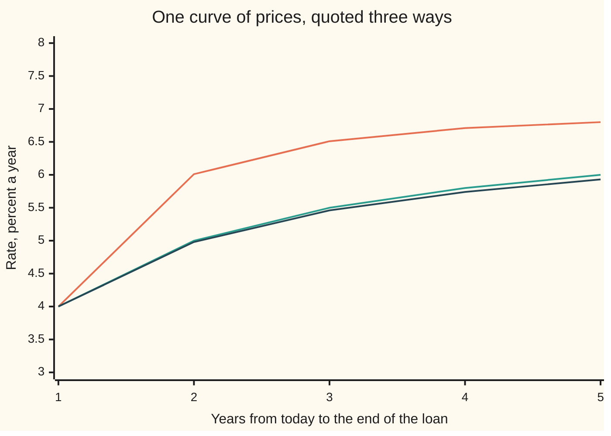

# Spot, forward and par rates: three ways to read one curve

Financial mathematics → Curves → Term structure → Spot, forward and par rates

---

## General Overview

One morning a screen carries two quotes for lending to the same borrower. Money placed for one year comes back with 4 percent a year. Money placed for two years comes back with 5 percent a year. Both are fixed and certain: the dates are set, the amounts are set, nothing is optional.

A treasurer with 100 dollars to place has a third question, and the screen does not answer it directly. What rate can be fixed today for the second year on its own — for money that starts working a year from now and is repaid a year after that?

The answer is already on the screen, and it is neither 5 percent nor the 4.50 percent that averaging the two quotes gives. It is 6.01 percent. Placing 100 dollars for two years returns 110.25. Placing it for one year returns 104.00, and whatever happens in the second year must carry that 104.00 to the same 110.25, or one of the two routes is free money for somebody. Carrying 104.00 to 110.25 in one year is a rate of 6.01 percent.

So rates for different dates are not separate quotes that happen to sit near each other. Fix the rate from today out to each future date and every rate for every stretch in between is fixed along with them.

Three names are in daily use for that one body of information. A **spot rate** is the rate from today out to a single date. A **forward rate** is the rate for a stretch that begins later, agreed today. A **par rate** is the coupon a newly issued bond must pay to sell for exactly its face value. Quote any one of the three across all maturities and the other two follow.

**One set of prices for future money carries everything: spot rates, forward rates and par yields are three ways of quoting those prices, and each converts into the others by arithmetic alone.**

**What kind of fact this is:** a theorem, proved on this card in Why it works — with certain cash flows and free two-way trading, two spot rates force the forward rate between them. The three rates themselves are definitions, and "at par" is a market convention.

### The picture: one curve, three quotes



Top line: the forward rates, each one the rate for a single later year. Middle line: the spot rates, the two quotes from the screen extended out to five years. Bottom line: the par rates. All three start together at 4.00 percent, because at one year the three questions are the same question. They fan out after that. On a curve that rises, forwards run above spots and par rates below them, and the reason is worth the rest of the card.

---

## The formula

Notation first, in plain words. A small numeral set low and to the right of a rate names the date it belongs to, so $z_1$ is the rate from today out to one year and $z_2$ the rate from today out to two years; $z_T$ is the general one, said "z sub T". The letter $f$ is a rate for a stretch that starts later, and the two dates naming the stretch go with it: $f_{1,2}$ is the rate for the year running from date 1 to date 2. As on [compounding-and-discount-factors](../01-Money%2C%20Dates%20and%20Discounting/01-compounding-and-discount-factors.md), $D(T)$ is the discount factor: today's price of one dollar paid at $T$.

$$(1 + z_2)^2 \;=\; (1 + z_1)\,(1 + f_{1,2})$$

**Read it aloud:** two years of growth at the two-year rate must come to exactly the same as one year of growth at the one-year rate followed by one year at the rate fixed today for the second year.

| Symbol | Plain meaning | In our example | Push it up and the answer… |
| --- | --- | --- | --- |
| $z_T$, $z_1$, $z_2$ | the spot rate: one rate for money lent from today until year $T$ and repaid in one go | 4.0000 and 5.0000 percent | a later spot rate up lifts the forward for that year and every par rate reaching past it |
| $f$, $f_{1,2}$ | the forward rate: the rate for a stretch beginning later, fixed today | 6.0096 percent for year two | it cannot move alone: a spot rate on one side of it must move too |
| $D$, $D(T)$ | the discount factor: what one dollar paid at year $T$ costs today | 0.961538 at one year, 0.907029 at two | rates fall: a dearer future dollar is a cheaper loan |
| $T$, $t$, $T_1$, $T_2$ | time from today, counted in whole years | 1 to 5 | the curve runs further out |
| $c$, $c_n$ | the par rate: the coupon rate that prices a new $n$-year bond at exactly its face value | 4.9755 percent at two years | the bond is worth more than face, so it is no longer at par |
| $A$, $A_n$, $A_2$ | the annuity factor: the discount factors for years 1 to $n$ added up | 1.868568 at two years | each coupon carries more weight, so the par rate needed falls |
| $G$, $G_1$, $G_2$ | the growth factor: what one dollar in the bank becomes by a stated date | 1.040000 at one year, 1.102500 at two | the loan earns more, and the discount factor, its reciprocal, falls |
| $n$ | the bond's maturity, in whole years | 5 | more coupons in the sum |
| $N$ | the face value the bond repays at the end | 100 | coupons and face scale together, so the par rate does not move |
| $e$ | the number continuous compounding is built on, from the discount-factor card | — | — |

The other two relations, each in one line of plain words.

$$D(T) \;=\; \frac{1}{(1 + z_T)^T}, \qquad 1 + f_{t-1,\,t} \;=\; \frac{D(t-1)}{D(t)}, \qquad c_n \;=\; \frac{1 - D(n)}{A_n}, \qquad A_n = D(1) + \cdots + D(n)$$

The first says a spot rate and a price for a future dollar are the same fact written two ways. The second says the forward rate for one year is the ratio of two neighbouring prices: a dollar at year $t-1$ buys $D(t-1)/D(t)$ dollars at year $t$, so that ratio, less the original dollar, is the interest earned. The third says a new bond sells at face value when its coupons exactly pay for the wait, and the wait costs one dollar less the dollar that comes back at the end.

**Conventions verified 14 Sep 2026.** This card compounds once a year and pays coupons once a year, so the arithmetic stays visible. Markets do neither uniformly. The United States Treasury publishes its official curve as a par yield curve fitted by a monotone convex method, quoted on a bond-equivalent semi-annual basis, a description last revised 18 February 2025; swap markets quote par rates against their own payment calendars. Convert quotes to one compounding convention before comparing them.

### When it holds

- **Cash flows that are certain and dates that are fixed.** The identity prices promises that will be kept. A borrower that can default needs a survival term as well, and the gap that opens up is measured on [z-spread-and-asset-swap-spread](06-z-spread-and-asset-swap-spread.md).
- **The same terms for lending and borrowing, in the size required.** If borrowing costs more than lending pays, the argument gives a band rather than a number, and the forward can sit anywhere inside it.
- **One stated compounding convention throughout.** Under annual compounding the growth factors multiply, which is the identity above. Under continuous compounding the same fact reads as a straight-line rule on rate times time, and that rule gives 6.0000 percent here rather than 6.0096: a basis point, from the convention alone.
- **Dates a whole year apart, as written here.** Real calendars count days under a day-count rule, and a stretch that is not a whole year carries a fraction in the exponent instead.
- **A rate you can actually fix.** The forward is a price available today, not a forecast. Nothing here says the one-year rate a year from now will be 6.01 percent.

---

## Why it works

### Step 0: two certain routes to the same date must cost the same

Everything below rests on one refusal. If two ways of holding money are both certain, both start today, and both finish on the same day, they must end with the same amount. If they did not, anyone could take the cheap route and sell the dear one, in any size, and collect the difference without risk and without capital. Such a trade would be taken until it disappeared.

The treasurer has exactly two certain routes from today to year two: lend once for two years, or lend for one year and fix the second year's rate now. Step 0 says those routes must land on the same number, and that is enough to pin the forward rate.

### Step 1: the two routes, in dollars

Place 100 dollars for two years at 5 percent. The balance is multiplied by 1.05 in the first year and by 1.05 again in the second, so one dollar becomes 1.102500 and the treasurer ends with 110.25.

Place the same 100 dollars for one year at 4 percent and it becomes 104.00. That money must now travel through the second year. At a rate fixed today it will be multiplied by one plus that rate, and the end has to be 110.25.

So the second year's multiplier is 110.25 divided by 104.00, which is 1.102500 divided by 1.040000, which is 1.060096. Subtract the dollar that was already there and the rate for the second year alone is 6.0096 percent.

```
rate earned on money, percent a year; one block is a sixth of a percent
   today to year 1   ████████████████████████             4.0000
   today to year 2   ██████████████████████████████       5.0000
   year 1 to year 2  ████████████████████████████████████ 6.0096
```

The third bar is the first two pulled apart. The two-year rate of 5.0000 percent is not a rate anything earns twice over: it is the level that a first year at 4.0000 and a second year at 6.0096 average out to. That averaging happens on the growth, not on the rates, which is why the second year needs a shade more than the 6.0000 percent that doubling the gap would suggest.

### Step 2: what happens if the forward is quoted wrong

Suppose a dealer offers to fix the second year at 6.50 percent instead. Borrow 100 dollars for two years at the two-year rate, owing 110.25 at the end. Lend the same 100 for one year, collecting 104.00, and hand it to the dealer for the second year at 6.50 percent. That returns 110.76. Pay off the 110.25 and 0.51 is left over, from a position that needed no money of its own on day one.

A quote below 6.0096 percent is the same trade in reverse. Only 6.0096 leaves nothing on the table, which is what "the forward rate is implied by two spots" means.

<details>
<summary>Detailed proof: the forward rate is forced, in both directions</summary>

Write $G_1 = 1 + z_1$ for what one dollar becomes in a year and $G_2 = (1 + z_2)^2$ for what it becomes in two, both certain and both available for lending and for borrowing at the same terms. Let $x$ be the rate a dealer quotes today for the year from date 1 to date 2, deliverable in either direction in the size needed. Claim: no trade can cost nothing today and be certain to pay something later unless $1 + x = G_2/G_1$.

Suppose $1 + x > G_2 / G_1$. Borrow one dollar for two years and lend it for one year. Today's net cash flow is zero: the dollar borrowed is the dollar lent. At date 1, collect $G_1$ and place it with the dealer for the second year. At date 2, collect $G_1(1 + x)$ and repay $G_2$. What is left is $G_1(1 + x) - G_2$, which is positive by assumption, and no cash was ever committed. With 100 dollars, $G_1 = 1.04$ and a quote of 6.50 percent, that residue is 0.51.

Suppose instead $1 + x < G_2 / G_1$. Run every leg the other way: lend one dollar for two years, borrow one dollar for one year, and at date 1 borrow $G_1$ from the dealer for the second year. Today's net cash flow is zero again. At date 2 the two-year loan pays $G_2$ and the dealer is owed $G_1(1 + x)$, leaving $G_2 - G_1(1 + x)$, positive by assumption.

Both cases are ruled out, so $1 + x = G_2/G_1$, which rearranges to $(1 + z_2)^2 = (1 + z_1)(1 + f_{1,2})$. The argument needs the cash flows certain, the trading free in both directions, and the two loans available at one set of terms; it says nothing about what rates will actually be quoted at date 1.

</details>

### Step 3: the same fact as prices, and then the whole chain

Rates were convenient for the treasurer. Prices are more convenient for everything that comes after. One dollar due in a year costs $D(1) = 0.961538$ today, since 0.961538 placed at 4 percent grows to a dollar. One dollar due in two years costs $D(2) = 0.907029$.

Now the forward rate is a ratio of two prices, with no rate arithmetic at all: the same 0.961538 dollars today buys either one dollar at year 1 or $0.961538 / 0.907029 = 1.060096$ dollars at year 2. Selling the first and buying the second is the forward loan, and the interest earned is 6.0096 percent. The check builds the forward both ways and prints the same digits.

Running the ratio along the whole curve gives one forward rate per year: 4.0000, 6.0096, 6.5072, 6.7051 and 6.8038 percent. Multiply those five multipliers together and the product is the growth from today to year 5; divide one dollar by it and the five-year discount factor 0.747258 comes back exactly. The spot rate is the level average of the forwards up to its date, which is why it lags behind them on a rising curve.

### Step 4: the par rate is the coupon that makes a bond worth its face

A new bond with face value 100 pays a coupon each year and repays the face at the end. Price it off the same curve: each coupon is worth the coupon times the discount factor for its year, and the face is worth 100 times the factor for the final year.

Before solving: does such a coupon exist, and is it the only one? Each extra dollar of coupon lifts the price by $A_n$ dollars, and $A_n$ is positive whenever the discount factors are, so the price crosses 100 exactly once. The only failure is at the boundary, where a discount factor reaches zero or turns negative, which needs a spot rate of minus 100 percent or worse. The strictness runs backwards as well, so each par rate names exactly one spot rate.

Set that price equal to 100 and one unknown is left, the coupon. Adding the discount factors gives the annuity factor $A_2 = 0.961538 + 0.907029 = 1.868568$, and the face costs 100 times 0.907029, so the coupons have to make up the rest: one dollar less 0.907029, which is 0.092971 per dollar of face. Spread across the annuity factor, the coupon rate is 0.092971 divided by 1.868568, or 4.9755 percent.

That number sits below the two-year spot rate of 5.0000 percent, though above the one-year rate. A coupon bond pays part of its money early, and early money is discounted at the cheaper short rates, so the single coupon rate that balances the books comes out under the rate for the final date. On a falling curve it would sit above. The check also runs the ladder backwards, recovering all five spot rates from the five par rates alone, and lands on the original curve to twelve decimal places.

<details>
<summary>The same three rates under continuous compounding</summary>

Continuous compounding replaces the multiplier $(1 + z_T)^T$ with $e$ raised to $z_T T$, and multiplying growth factors becomes adding exponents. The forward for the stretch from $T_1$ to $T_2$ is then a straight-line rule: the rate times the time out to the far date, less the rate times the time out to the near date, divided by the stretch between them. On this curve that is twice 5 percent less 4 percent, or 6.0000 percent, against the exact 6.0096. The gap is the convention, not an error, and it is why desks convert every quote to one convention before touching a curve.

</details>

One more road reaches the same place from the other end. Nothing above needed rates at all: given the five prices $D(1)$ to $D(5)$, spot, forward and par rates are three ways of reading them out. Getting those prices from a morning's market quotes, one maturity at a time, is [bootstrapping-the-discount-curve](04-bootstrapping-the-discount-curve.md).

---

## Worked numbers, by hand

The screen's two quotes: 4 percent for one year, 5 percent for two.

| Step | Arithmetic | Value |
| --- | --- | --- |
| one dollar for one year | 1 + 0.04 | 1.040000 |
| one dollar for two years | 1.05 × 1.05 | 1.102500 |
| price of a dollar at year 1, $D(1)$ | 1 ÷ 1.040000 | 0.961538 |
| price of a dollar at year 2, $D(2)$ | 1 ÷ 1.102500 | 0.907029 |
| the second year on its own | 1.102500 ÷ 1.040000 | 1.060096 |
| **forward rate for year two** | 1.060096 − 1 | **6.0096 percent** |
| annuity factor, $A_2$ | 0.961538 + 0.907029 | 1.868568 |
| what the coupons must cover | 1 − 0.907029 | 0.092971 |
| **two-year par rate** | 0.092971 ÷ 1.868568 | **4.9755 percent** |

So a two-year loan at 5 percent is a first year at 4 percent followed by a second year at 6.01 percent, and a new two-year bond sells at its face value of 100 if it pays 4.9755 percent a year. Three numbers, one curve.

### What breaks if you drop a piece

Same two quotes, 100 dollars placed, correct two-year proceeds 110.25.

| Mistake | Comes out at | What went wrong |
| --- | --- | --- |
| Roll at today's one-year rate twice | 108.16, short by 2.09 | Today's one-year rate covers this year only; the second year is fixed at 6.0096 percent, not 4 |
| Use the two-year spot rate for the second year | 109.20, short by 1.05 | The two-year rate is the average of both years, so using it for the back year drops the front year's shortfall |
| Average the two spot rates | 4.5000 percent against 6.0096 | Growth multiplies, so the average that matters is of the multipliers, not of the rates |
| Read the five-year par yield as the five-year spot rate | a five-year zero priced at 74.99 instead of 74.73, over by 0.26 | The par rate is a blended coupon rate; one payment on one date needs the spot rate for that date |

The code prints every figure in both tables.

---

## Code, from first principles, and it actually runs

Nothing is imported. The root finder is a bisection written out in the file, and every power is a loop of multiplications, so the two languages do the same arithmetic in the same order. One annual-compounding curve of five maturities is quoted three ways, and each answer is reached by roads that share no arithmetic: algebra on the discount factors; a bisection that simply matches what two investments come to; and a ladder run backwards, which takes the par rates on their own and recovers the spot curve that produced them.

### Python

```python
# Spot, forward and par rates -- the check behind the card.  Standard library
# only, and nothing imported that already knows an answer: the root finder is
# a bisection written out here, and every power is a loop of multiplications.
# One annual-compounding curve, five maturities.  The forward rate and the par
# rate are each reached by roads that share no arithmetic: algebra on the
# discount factors, a bisection that matches two investments, and a ladder run
# backwards that recovers the spot curve from the par curve alone.
YEARS = [1, 2, 3, 4, 5]
SPOT = [0.04, 0.05, 0.055, 0.058, 0.06]
FACE = 100.0


def grow(rate, n):
    """(1 + rate) multiplied in n times: what one dollar in the bank becomes."""
    out = 1.0
    for _ in range(n):
        out *= 1.0 + rate
    return out


def bisect(f, lo, hi):
    """The root finder, written out: halve the bracket 200 times."""
    for _ in range(200):
        mid = 0.5 * (lo + hi)
        if f(lo) * f(mid) <= 0.0:
            hi = mid
        else:
            lo = mid
    return 0.5 * (lo + hi)


D = [1.0 / grow(SPOT[t - 1], t) for t in YEARS]                 # D(t)
ann = [sum(D[:n]) for n in YEARS]                               # A_n
fwd = [SPOT[0]] + [D[t - 2] / D[t - 1] - 1.0 for t in YEARS[1:]]  # road 1
par = [(1.0 - D[n - 1]) / ann[n - 1] for n in YEARS]              # road 1


def price(coupon, n, factors):
    """An n-year annual bond, coupon in dollars, priced off given factors."""
    return sum(coupon * factors[t - 1] for t in range(1, n + 1)) + FACE * factors[n - 1]


one_year = FACE * grow(SPOT[0], 1)          # 100 lent for one year
two_year = FACE * grow(SPOT[1], 2)          # 100 lent for two years
rolled = one_year * (1.0 + fwd[1])          # 100 lent for one year, then rolled
f12_bisect = bisect(lambda x: one_year * (1.0 + x) - two_year, -0.5, 0.5)   # road 2
par_bisect = [bisect(lambda c, n=n: price(c, n, D) - FACE, 0.0, 50.0) / FACE
              for n in YEARS]                                               # road 2


def bootstrap(par_rates):
    """Road 3: spot rates out of the par curve alone, shortest maturity first."""
    z = []
    for n, c in zip(YEARS, par_rates):
        cpn = c * FACE
        known = sum(cpn / grow(z[t - 1], t) for t in range(1, n))
        z.append(bisect(lambda x, n=n, cpn=cpn, known=known:
                        known + (cpn + FACE) / grow(x, n) - FACE, -0.5, 1.0))
    return z


spot_back = bootstrap(par)
fwd_back = [spot_back[0]] + [grow(spot_back[t - 1], t) / grow(spot_back[t - 2], t - 1) - 1.0
                             for t in YEARS[1:]]
chain = 1.0
for f in fwd:
    chain /= 1.0 + f                        # the forwards multiplied back into D(5)

g1 = grow(SPOT[0], 1)                       # what one dollar becomes in one year
g2 = grow(SPOT[1], 2)                       # what one dollar becomes in two years
fake = 0.065                                # a forward quoted too high
arb_end = one_year * (1.0 + fake)           # what the rolled 100 dollars would come to
roll_short = FACE * grow(SPOT[0], 2)        # mistake: roll at today's 1-year rate
spot_as_fwd = one_year * (1.0 + SPOT[1])    # mistake: use the 2-year spot for year two
average = 0.5 * (SPOT[0] + SPOT[1])         # mistake: average the two spots
linear = 2.0 * SPOT[1] - SPOT[0]            # the continuous-compounding shortcut
zero_true = FACE * D[4]                     # 5-year zero, priced on the spot curve
zero_par = FACE / grow(par[4], 5)           # mistake: par yield read as a spot rate

print("one curve, annual compounding, five maturities")
print(f"{'year':>4}{'spot %':>11}{'D(t)':>11}{'forward %':>11}{'par %':>11}")
for t in YEARS:
    print(f"{t:>4}{100 * SPOT[t - 1]:>11.4f}{D[t - 1]:>11.6f}"
          f"{100 * fwd[t - 1]:>11.4f}{100 * par[t - 1]:>11.4f}")
print()
print("the two-year question, on 100 dollars")
print(f"  lend for two years at {100 * SPOT[1]:.2f} percent      {two_year:>10.4f}")
print(f"  lend one year at {100 * SPOT[0]:.2f} percent           {one_year:>10.4f}")
print(f"  then roll at the forward {100 * fwd[1]:.4f} percent  {rolled:>10.4f}")
print(f"  forward by bisection, not by algebra    {100 * f12_bisect:>10.4f}")
print(f"  forward from the bootstrapped curve     {100 * fwd_back[1]:>10.4f}")
print(f"  D(1)/D(2) - 1                           {100 * (D[0] / D[1] - 1.0):>10.4f}")
print()
print("by hand, from the two quotes")
print(f"  one dollar for one year               {g1:>10.6f}")
print(f"  one dollar for two years              {g2:>10.6f}")
print(f"  the ratio: year two on its own        {g2 / g1:>10.6f}")
print(f"  annuity A(2) = D(1) + D(2)            {ann[1]:>10.6f}")
print(f"  one dollar less D(2)                  {1.0 - D[1]:>10.6f}")
print()
print("the par rate, two roads")
print(f"{'year':>4}{'formula %':>12}{'bisected %':>12}{'bond price':>12}")
for n in YEARS:
    print(f"{n:>4}{100 * par[n - 1]:>12.4f}{100 * par_bisect[n - 1]:>12.4f}"
          f"{price(par[n - 1] * FACE, n, D):>12.6f}")
print()
print("the ladder backwards: spot rates recovered from the par curve alone")
print("  " + "  ".join(f"{100 * z:.4f}" for z in spot_back))
print(f"  largest gap from the curve we started with: {max(abs(a - b) for a, b in zip(spot_back, SPOT)):.12f}")
print(f"  forwards multiplied back into D(5): {chain:.6f} against {D[4]:.6f}")
print()
print("what breaks")
print(f"  roll at today's 1-year rate twice        {roll_short:>10.4f}  short {two_year - roll_short:.4f}")
print(f"  use the 2-year spot for year two         {spot_as_fwd:>10.4f}  short {two_year - spot_as_fwd:.4f}")
print(f"  average the two spots, as a rate         {100 * average:>10.4f}  against {100 * fwd[1]:.4f}")
print(f"  2 x 2-year minus 1-year, as a rate       {100 * linear:>10.4f}  against {100 * fwd[1]:.4f}")
print(f"  5-year zero on the spot curve            {zero_true:>10.4f}")
print(f"  5-year zero on the par yield             {zero_par:>10.4f}  over by {zero_par - zero_true:.4f}")
print(f"  roll at a forward quoted {100 * fake:.2f} percent  {arb_end:>10.4f}  free {arb_end - two_year:.4f}")
print()
print(f"{'chart, year':<22}" + " ".join(f"{t:6d}" for t in YEARS))
for label, series in (("chart, spot %", SPOT), ("chart, forward %", fwd), ("chart, par %", par)):
    print(f"{label:<22}" + " ".join(f"{100 * v:6.2f}" for v in series))

assert abs(rolled - two_year) < 1e-9, "rolled deposit must land on the two-year deposit"
assert abs(f12_bisect - fwd[1]) < 1e-9, "bisected forward vs the algebra"
assert abs(price(par[4] * FACE, 5, D) - FACE) < 1e-9, "par coupon must price the bond at 100"
assert max(abs(a - b) for a, b in zip(par_bisect, par)) < 1e-9, "bisected par rates vs the algebra"
assert max(abs(a - b) for a, b in zip(spot_back, SPOT)) < 1e-9, "the ladder must recover the curve"
assert abs(chain - D[4]) < 1e-12, "the forwards must multiply back into D(5)"
assert par[4] < SPOT[4], "on a rising curve the par rate sits below the spot rate"
print("ALL CHECKS PASS")
```

**Ran 2026-09-14 on macOS, Python 3.14.6, standard library only. All checks passed. Output, pasted from the run:**

```
one curve, annual compounding, five maturities
year     spot %       D(t)  forward %      par %
   1     4.0000   0.961538     4.0000     4.0000
   2     5.0000   0.907029     6.0096     4.9755
   3     5.5000   0.851614     6.5072     5.4550
   4     5.8000   0.798100     6.7051     5.7386
   5     6.0000   0.747258     6.8038     5.9252

the two-year question, on 100 dollars
  lend for two years at 5.00 percent        110.2500
  lend one year at 4.00 percent             104.0000
  then roll at the forward 6.0096 percent    110.2500
  forward by bisection, not by algebra        6.0096
  forward from the bootstrapped curve         6.0096
  D(1)/D(2) - 1                               6.0096

by hand, from the two quotes
  one dollar for one year                 1.040000
  one dollar for two years                1.102500
  the ratio: year two on its own          1.060096
  annuity A(2) = D(1) + D(2)              1.868568
  one dollar less D(2)                    0.092971

the par rate, two roads
year   formula %  bisected %  bond price
   1      4.0000      4.0000  100.000000
   2      4.9755      4.9755  100.000000
   3      5.4550      5.4550  100.000000
   4      5.7386      5.7386  100.000000
   5      5.9252      5.9252  100.000000

the ladder backwards: spot rates recovered from the par curve alone
  4.0000  5.0000  5.5000  5.8000  6.0000
  largest gap from the curve we started with: 0.000000000000
  forwards multiplied back into D(5): 0.747258 against 0.747258

what breaks
  roll at today's 1-year rate twice          108.1600  short 2.0900
  use the 2-year spot for year two           109.2000  short 1.0500
  average the two spots, as a rate             4.5000  against 6.0096
  2 x 2-year minus 1-year, as a rate           6.0000  against 6.0096
  5-year zero on the spot curve               74.7258
  5-year zero on the par yield                74.9900  over by 0.2642
  roll at a forward quoted 6.50 percent    110.7600  free 0.5100

chart, year                1      2      3      4      5
chart, spot %           4.00   5.00   5.50   5.80   6.00
chart, forward %        4.00   6.01   6.51   6.71   6.80
chart, par %            4.00   4.98   5.46   5.74   5.93
ALL CHECKS PASS
```

### Rust

Same curve, same roads, same labels, built with `rustc --edition 2021 -O`.

```rust
// Spot, forward and par rates -- the same check as the Python, in Rust.  No
// crates, std only, and nothing borrowed that already knows an answer: the
// root finder is a bisection written out here, and every power is a loop of
// multiplications.  One annual-compounding curve, five maturities.  The
// forward rate and the par rate are each reached by roads that share no
// arithmetic: algebra on the discount factors, a bisection that matches two
// investments, and a ladder run backwards that recovers the spot curve from
// the par curve alone.
const YEARS: [usize; 5] = [1, 2, 3, 4, 5];
const SPOT: [f64; 5] = [0.04, 0.05, 0.055, 0.058, 0.06];
const FACE: f64 = 100.0;

fn grow(rate: f64, n: usize) -> f64 {
    // (1 + rate) multiplied in n times: what one dollar in the bank becomes.
    let mut out = 1.0;
    for _ in 0..n {
        out *= 1.0 + rate;
    }
    out
}

fn bisect<F: Fn(f64) -> f64>(f: F, lo0: f64, hi0: f64) -> f64 {
    // The root finder, written out: halve the bracket 200 times.
    let (mut lo, mut hi) = (lo0, hi0);
    for _ in 0..200 {
        let mid = 0.5 * (lo + hi);
        if f(lo) * f(mid) <= 0.0 {
            hi = mid;
        } else {
            lo = mid;
        }
    }
    0.5 * (lo + hi)
}

fn price(coupon: f64, n: usize, factors: &[f64]) -> f64 {
    // An n-year annual bond, coupon in dollars, priced off given factors.
    (1..=n).map(|t| coupon * factors[t - 1]).sum::<f64>() + FACE * factors[n - 1]
}

fn bootstrap(par_rates: &[f64]) -> Vec<f64> {
    // Road 3: spot rates out of the par curve alone, shortest maturity first.
    let mut z: Vec<f64> = Vec::new();
    for (i, c) in par_rates.iter().enumerate() {
        let n = YEARS[i];
        let cpn = c * FACE;
        let known: f64 = (1..n).map(|t| cpn / grow(z[t - 1], t)).sum();
        z.push(bisect(|x| known + (cpn + FACE) / grow(x, n) - FACE, -0.5, 1.0));
    }
    z
}

fn main() {
    let d: Vec<f64> = YEARS.iter().map(|&t| 1.0 / grow(SPOT[t - 1], t)).collect(); // D(t)
    let ann: Vec<f64> = YEARS.iter().map(|&n| d[..n].iter().sum()).collect(); // A_n
    let mut fwd: Vec<f64> = vec![SPOT[0]]; // road 1
    for &t in YEARS[1..].iter() {
        fwd.push(d[t - 2] / d[t - 1] - 1.0);
    }
    let par: Vec<f64> = YEARS.iter().map(|&n| (1.0 - d[n - 1]) / ann[n - 1]).collect(); // road 1

    let one_year = FACE * grow(SPOT[0], 1); // 100 lent for one year
    let two_year = FACE * grow(SPOT[1], 2); // 100 lent for two years
    let rolled = one_year * (1.0 + fwd[1]); // 100 lent for one year, then rolled
    let f12_bisect = bisect(|x| one_year * (1.0 + x) - two_year, -0.5, 0.5); // road 2
    let par_bisect: Vec<f64> = YEARS // road 2
        .iter()
        .map(|&n| bisect(|c| price(c, n, &d) - FACE, 0.0, 50.0) / FACE)
        .collect();

    let spot_back = bootstrap(&par);
    let mut fwd_back: Vec<f64> = vec![spot_back[0]];
    for &t in YEARS[1..].iter() {
        fwd_back.push(grow(spot_back[t - 1], t) / grow(spot_back[t - 2], t - 1) - 1.0);
    }
    let mut chain = 1.0;
    for f in fwd.iter() {
        chain /= 1.0 + f; // the forwards multiplied back into D(5)
    }
    let gap = spot_back
        .iter()
        .zip(SPOT.iter())
        .map(|(a, b)| (a - b).abs())
        .fold(0.0_f64, f64::max);
    let par_gap = par_bisect
        .iter()
        .zip(par.iter())
        .map(|(a, b)| (a - b).abs())
        .fold(0.0_f64, f64::max);

    let g1 = grow(SPOT[0], 1); // what one dollar becomes in one year
    let g2 = grow(SPOT[1], 2); // what one dollar becomes in two years
    let fake = 0.065; // a forward quoted too high
    let arb_end = one_year * (1.0 + fake); // what the rolled 100 dollars would come to
    let roll_short = FACE * grow(SPOT[0], 2); // mistake: roll at today's 1-year rate
    let spot_as_fwd = one_year * (1.0 + SPOT[1]); // mistake: 2-year spot for year two
    let average = 0.5 * (SPOT[0] + SPOT[1]); // mistake: average the two spots
    let linear = 2.0 * SPOT[1] - SPOT[0]; // the continuous-compounding shortcut
    let zero_true = FACE * d[4]; // 5-year zero, priced on the spot curve
    let zero_par = FACE / grow(par[4], 5); // mistake: par yield read as a spot rate

    println!("one curve, annual compounding, five maturities");
    println!("{:>4}{:>11}{:>11}{:>11}{:>11}", "year", "spot %", "D(t)", "forward %", "par %");
    for &t in YEARS.iter() {
        println!("{:>4}{:>11.4}{:>11.6}{:>11.4}{:>11.4}",
                 t, 100.0 * SPOT[t - 1], d[t - 1], 100.0 * fwd[t - 1], 100.0 * par[t - 1]);
    }
    println!();
    println!("the two-year question, on 100 dollars");
    println!("  lend for two years at {:.2} percent      {:>10.4}", 100.0 * SPOT[1], two_year);
    println!("  lend one year at {:.2} percent           {:>10.4}", 100.0 * SPOT[0], one_year);
    println!("  then roll at the forward {:.4} percent  {:>10.4}", 100.0 * fwd[1], rolled);
    println!("  forward by bisection, not by algebra    {:>10.4}", 100.0 * f12_bisect);
    println!("  forward from the bootstrapped curve     {:>10.4}", 100.0 * fwd_back[1]);
    println!("  D(1)/D(2) - 1                           {:>10.4}", 100.0 * (d[0] / d[1] - 1.0));
    println!();
    println!("by hand, from the two quotes");
    println!("  one dollar for one year               {:>10.6}", g1);
    println!("  one dollar for two years              {:>10.6}", g2);
    println!("  the ratio: year two on its own        {:>10.6}", g2 / g1);
    println!("  annuity A(2) = D(1) + D(2)            {:>10.6}", ann[1]);
    println!("  one dollar less D(2)                  {:>10.6}", 1.0 - d[1]);
    println!();
    println!("the par rate, two roads");
    println!("{:>4}{:>12}{:>12}{:>12}", "year", "formula %", "bisected %", "bond price");
    for &n in YEARS.iter() {
        println!("{:>4}{:>12.4}{:>12.4}{:>12.6}",
                 n, 100.0 * par[n - 1], 100.0 * par_bisect[n - 1], price(par[n - 1] * FACE, n, &d));
    }
    println!();
    println!("the ladder backwards: spot rates recovered from the par curve alone");
    println!("  {}", spot_back.iter().map(|z| format!("{:.4}", 100.0 * z))
             .collect::<Vec<String>>().join("  "));
    println!("  largest gap from the curve we started with: {:.12}", gap);
    println!("  forwards multiplied back into D(5): {:.6} against {:.6}", chain, d[4]);
    println!();
    println!("what breaks");
    println!("  roll at today's 1-year rate twice        {:>10.4}  short {:.4}",
             roll_short, two_year - roll_short);
    println!("  use the 2-year spot for year two         {:>10.4}  short {:.4}",
             spot_as_fwd, two_year - spot_as_fwd);
    println!("  average the two spots, as a rate         {:>10.4}  against {:.4}",
             100.0 * average, 100.0 * fwd[1]);
    println!("  2 x 2-year minus 1-year, as a rate       {:>10.4}  against {:.4}",
             100.0 * linear, 100.0 * fwd[1]);
    println!("  5-year zero on the spot curve            {:>10.4}", zero_true);
    println!("  5-year zero on the par yield             {:>10.4}  over by {:.4}",
             zero_par, zero_par - zero_true);
    println!("  roll at a forward quoted {:.2} percent  {:>10.4}  free {:.4}",
             100.0 * fake, arb_end, arb_end - two_year);
    println!();
    println!("{:<22}{}", "chart, year",
             YEARS.iter().map(|t| format!("{:6}", t)).collect::<Vec<String>>().join(" "));
    for (label, series) in [("chart, spot %", &SPOT[..]), ("chart, forward %", &fwd[..]),
                            ("chart, par %", &par[..])] {
        println!("{:<22}{}", label,
                 series.iter().map(|v| format!("{:6.2}", 100.0 * v)).collect::<Vec<String>>().join(" "));
    }

    assert!((rolled - two_year).abs() < 1e-9, "rolled deposit must land on the two-year deposit");
    assert!((f12_bisect - fwd[1]).abs() < 1e-9, "bisected forward vs the algebra");
    assert!((price(par[4] * FACE, 5, &d) - FACE).abs() < 1e-9, "par coupon must price the bond at 100");
    assert!(par_gap < 1e-9, "bisected par rates vs the algebra");
    assert!(gap < 1e-9, "the ladder must recover the curve");
    assert!((chain - d[4]).abs() < 1e-12, "the forwards must multiply back into D(5)");
    assert!(par[4] < SPOT[4], "on a rising curve the par rate sits below the spot rate");
    println!("ALL CHECKS PASS");
}
```

**Ran 2026-09-14 on macOS, rustc 1.98.1, no crates. All checks passed. Output, pasted from the run:**

```
one curve, annual compounding, five maturities
year     spot %       D(t)  forward %      par %
   1     4.0000   0.961538     4.0000     4.0000
   2     5.0000   0.907029     6.0096     4.9755
   3     5.5000   0.851614     6.5072     5.4550
   4     5.8000   0.798100     6.7051     5.7386
   5     6.0000   0.747258     6.8038     5.9252

the two-year question, on 100 dollars
  lend for two years at 5.00 percent        110.2500
  lend one year at 4.00 percent             104.0000
  then roll at the forward 6.0096 percent    110.2500
  forward by bisection, not by algebra        6.0096
  forward from the bootstrapped curve         6.0096
  D(1)/D(2) - 1                               6.0096

by hand, from the two quotes
  one dollar for one year                 1.040000
  one dollar for two years                1.102500
  the ratio: year two on its own          1.060096
  annuity A(2) = D(1) + D(2)              1.868568
  one dollar less D(2)                    0.092971

the par rate, two roads
year   formula %  bisected %  bond price
   1      4.0000      4.0000  100.000000
   2      4.9755      4.9755  100.000000
   3      5.4550      5.4550  100.000000
   4      5.7386      5.7386  100.000000
   5      5.9252      5.9252  100.000000

the ladder backwards: spot rates recovered from the par curve alone
  4.0000  5.0000  5.5000  5.8000  6.0000
  largest gap from the curve we started with: 0.000000000000
  forwards multiplied back into D(5): 0.747258 against 0.747258

what breaks
  roll at today's 1-year rate twice          108.1600  short 2.0900
  use the 2-year spot for year two           109.2000  short 1.0500
  average the two spots, as a rate             4.5000  against 6.0096
  2 x 2-year minus 1-year, as a rate           6.0000  against 6.0096
  5-year zero on the spot curve               74.7258
  5-year zero on the par yield                74.9900  over by 0.2642
  roll at a forward quoted 6.50 percent    110.7600  free 0.5100

chart, year                1      2      3      4      5
chart, spot %           4.00   5.00   5.50   5.80   6.00
chart, forward %        4.00   6.01   6.51   6.71   6.80
chart, par %            4.00   4.98   5.46   5.74   5.93
ALL CHECKS PASS
```

The two outputs match line for line, from different code taking the same three roads.

> [!TIP]
> **Try changing**
> Guess the direction first, then run it.
> - **Flatten the curve.** Set every entry of `SPOT` to `0.05`. All three quotes collapse onto 5 percent at every maturity: with nothing to fan out, spot, forward and par are one number. The last assert stops the program, since the par rate no longer sits strictly below the spot rate.
> - **Invert it.** Try `SPOT = [0.06, 0.058, 0.055, 0.05, 0.04]`. Forwards now run below spots and par rates above them, and the last assert stops the program, since it is pinned to the rising case.
> - **Pull one pillar.** Change the three-year spot to `0.05` and leave the rest. Only the third and fourth forward rates move, and they move violently: a small dent in the spot curve is a crater in the forwards.
> - **Starve the root finder.** Cut the bisection from 200 halvings to 20. The bisected forward and par rates drift from the algebra and the asserts catch it, which is the point of having two roads.

---

## The usual mistake

> [!warning]
> **Treating the forward rate as a forecast.** It is a price available today, not an opinion about the future. The 6.0096 percent for next year is the rate that can be locked in now, and it is set by two spot rates and the refusal to leave free money on the table. Whether the one-year rate next year turns out to be 3 percent or 9 percent changes nothing about it. Rolling short deposits and locking the forward are different bets, and the forward is the one with no uncertainty in it.
>
> - **Averaging rates instead of growth.** Halfway between 4 and 5 percent is 4.50 percent, and the forward is 6.0096. Rates compound, so the averaging has to be done on the multipliers.
> - **Discounting a single payment at a par yield.** The five-year par rate of 5.9252 percent prices a coupon bond at face value; it is the wrong rate for one lump sum on one date. Used that way it prices a five-year zero at 74.99 instead of 74.73.
> - **Mixing compounding conventions.** The same curve quoted continuously gives a forward of 6.0000 percent rather than 6.0096. Neither is wrong; reading one as the other is.
> - **Quoting a forward without both dates.** A forward rate needs a start and an end. "The one-year forward" is ambiguous until it says one year starting when.
> - **Expecting the forward curve to look tame.** Spot rates are averages, forwards are the pieces being averaged, so mild bends in the spot curve turn into sharp swings in the forwards. That sensitivity is what curve fitting has to control: [curve-interpolation-and-shape](05-curve-interpolation-and-shape.md).

---

## Where you meet it in real life

- **The headline Treasury yield.** The rate quoted for the 10-year Treasury is a par yield: the coupon a new 10-year note would need to sell at face value. It is not the rate for a single payment ten years out, which is the 10-year spot rate.
- **Swap rates.** The fixed rate on a new interest rate swap is a par rate by construction: the rate that makes the contract worth nothing to either side at the start.
- **Locking a rate before you need the money.** A borrower who knows the loan starts in six months can fix the rate now at the forward. The contract that does it is [forward-rate-agreements](02-forward-rate-agreements.md), and the short end of the curve where it lives is [money-market-instruments-and-sofr](03-money-market-instruments-and-sofr.md).
- **Central bank statistics.** Central banks report estimated zero-coupon curves to the Bank for International Settlements, and publish forward curves derived from them; commentary about "what the market expects" is usually reading those forwards.
- **Valuing anything with several payment dates.** A swap, a mortgage, a pension liability: each payment gets the discount factor for its own date. A stream of averaged prices works the same way, which is where [commodity-swap-and-average-price-forward](../27-Averages%20-%20commodity%20swaps%20and%20Asian%20options/01-commodity-swap-and-average-price-forward.md) starts.

> **Say it back**
> A spot rate runs from today to one date, a forward rate covers a stretch starting later, and a par rate is the coupon that prices a new bond at its face value. They are not independent. Two certain routes to the same date must end with the same money, so a one-year rate of 4 percent and a two-year rate of 5 percent leave only one possible rate for the second year: 6.0096 percent. In prices rather than rates, a forward is a ratio of two discount factors and a par rate is one dollar less the final factor, spread over the factors added up. Quote any one curve and the other two are arithmetic.

---

## What this builds on

- [compounding-and-discount-factors](../01-Money%2C%20Dates%20and%20Discounting/01-compounding-and-discount-factors.md): the discount factor $D(T)$, and why a rate is meaningless until its compounding convention is stated. Every conversion on this card is that one idea applied twice.

## Where this goes next

- [forward-rate-agreements](02-forward-rate-agreements.md): the forward rate as a traded contract, with the cash settlement worked out.
- [bootstrapping-the-discount-curve](04-bootstrapping-the-discount-curve.md): the ladder that extracts the discount factors from real quotes, one maturity at a time.
- [commodity-swap-and-average-price-forward](../27-Averages%20-%20commodity%20swaps%20and%20Asian%20options/01-commodity-swap-and-average-price-forward.md): the same discounting over a stream of averaged prices.

This card was handed five spot rates and asked what follows from them. Where those five numbers come from — a morning of deposits, futures and swaps quoted from one week to thirty years, stripped down to one price per date — is [bootstrapping-the-discount-curve](04-bootstrapping-the-discount-curve.md).

---

## Sources

Verified 14 Sep 2026: every link below resolves to the publisher's page.

- Tuckman, Bruce, and Angel Serrat. *Fixed Income Securities: Tools for Today's Markets*, 4th ed. Wiley, 2022. [Publisher page](https://www.wiley.com/en-us/Fixed+Income+Securities%3A+Tools+for+Today%27s+Markets%2C+4th+Edition-p-9781119835554). The chapter on spot, forward and par rates; the three-way conversion on this card follows its treatment.
- United States Department of the Treasury. "Treasury Yield Curve Methodology," description revised 18 February 2025. [Methodology page](https://home.treasury.gov/policy-issues/financing-the-government/interest-rate-statistics/treasury-yield-curve-methodology). States that the published curve is a par yield curve, fitted by a monotone convex method from bid-side quotes.
- Bank for International Settlements. *Zero-coupon yield curves: technical documentation*, BIS Papers No 25, 2005. [Paper page](https://www.bis.org/publ/bppdf/bispap25.htm). How reporting central banks estimate spot curves and derive forwards from them.
- Hull, John C. *Options, Futures, and Other Derivatives*, 11th ed. Pearson. [Publisher page](https://www.pearson.com/en-us/subject-catalog/p/options-futures-and-other-derivatives/P200000005938). The no-arbitrage argument for forward rates, in the interest rates chapter.
