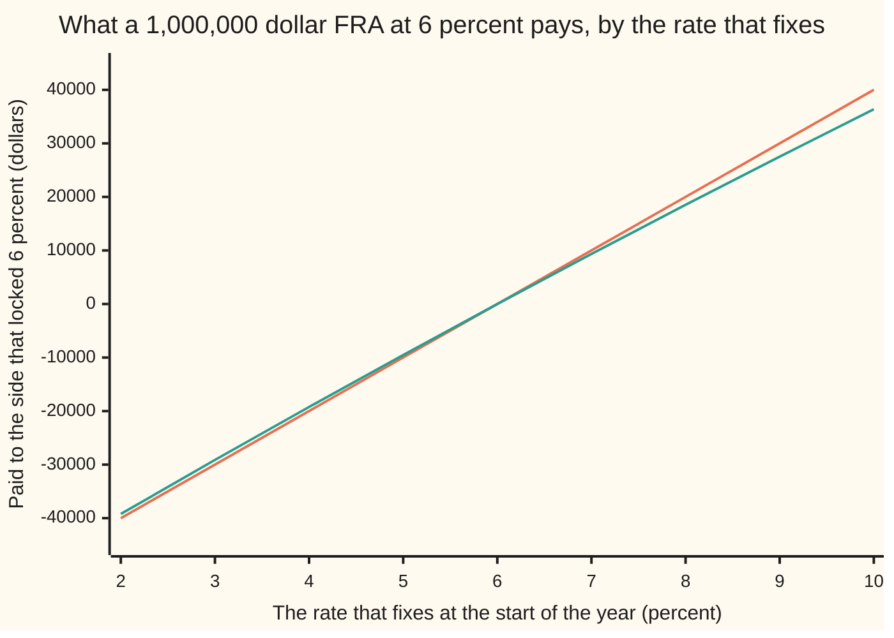

# Forward rate agreements: locking a rate for a future period

Financial mathematics → Curves → Locking a future rate → Forward rate agreements

---

## General Overview

Kestrel Dairy has ordered two milk tanks. They arrive in a year, and the 1,000,000.00 dollars they cost will be borrowed for the year after that. What that loan will cost is not known today. At 4 percent the year's interest is 40,000.00 dollars. At 8 percent it is 80,000.00. Same tanks, same loan, 40,000.00 dollars apart.

The bank's deposit board this morning carries two quotes. A dollar left on deposit for one year comes back as 1.05 dollars, which is 5 percent for the year. A dollar left for two years comes back as 1.113 dollars, which is 11.3 percent in total, with nothing compounded inside.

Those two quotes have already settled the second year, and nobody had to guess. Borrow 952,380.95 dollars for two years and put the same sum on deposit for one. Today the two cancel. At year one, 1,000,000.00 dollars arrives. At year two, 1,060,000.00 dollars goes back out. That is a loan of a million for the second year at exactly 6 percent, arranged this morning, from two ordinary deposits.

Kestrel would rather not carry a two-year loan for a one-year need. A **forward rate agreement** — an FRA from here on — does the same job without the deposits and without the principal. Two parties name an amount, a future period and a fixed rate. On the day the period starts, the agreed benchmark rate is read off the screen, and only the difference in interest changes hands. Kestrel borrows as usual when the time comes and holds an FRA at 6 percent alongside; together they cost 6 percent whatever the screen says.

**Two deposits of different lengths already pin the interest rate for the stretch between them, and an FRA is the contract that pays the gap between that pinned rate and the rate that turns up, so the borrower ends the period paying the rate it locked.**

**What kind of fact this is:** a method — price it by replication, settle it by the market's rule. The contract is a definition. The payment date and the discounting done on that date are a market convention. That the fair fixed rate is the rate the curve already contains is forced by a no-arbitrage argument, proved on this card in Why it works.

### The picture: what the agreement pays



The straight line is the interest difference itself, settled at the end of the year. The slightly bent line is what actually changes hands, paid a year earlier at the start of the period and shrunk to allow for that. Both cross zero at 6 percent: at the rate that was locked, nobody owes anybody. The side shown here pays the fixed rate and receives the fixing, which is the side a borrower takes.

---

## The formula

Notation first, in words. The period the contract covers starts at a date written $T_1$, said "T one", and ends at $T_2$. Today's price of one dollar paid on a later date is the **discount factor**, written $D(T)$ with that date in the brackets and said "D of T" ([compounding-and-discount-factors](../01-Money%2C%20Dates%20and%20Discounting/01-compounding-and-discount-factors.md)). The **year fraction** $\alpha$, said "alpha", is how much of a year the period counts as under the day-count rule the contract names ([day-counts-and-dates](../01-Money%2C%20Dates%20and%20Discounting/02-day-counts-and-dates.md)); for Kestrel's second year it is 1. Rates are simple: the rate multiplies the year fraction once, and nothing compounds inside the period.

The rate the curve already contains, over that period:

$$G \;=\; \frac{D(T_1)}{D(T_2)}, \qquad F \;=\; \frac{G - 1}{\alpha}$$

**Read it aloud:** a dollar parked from the start of the period to its end grows by the ratio of the two discount factors, and the forward rate is that growth stated as a rate per year.

Three more names. The **notional** $N$ is the amount the rate is applied to, never itself exchanged. $K$ is the fixed rate written into the contract. $L$ is the **fixing**, the benchmark rate read off the screen at $T_1$. Every sign below is for the side that pays $K$ and receives $L$, which is the side a borrower takes; the other side is the same numbers negated.

The settlement, once the fixing is known:

$$X \;=\; N\,\alpha\,(L - K) \quad\text{due at } T_2, \qquad S \;=\; \frac{N\,\alpha\,(L - K)}{1 + \alpha L} \quad\text{paid at } T_1$$

**Read it aloud:** the difference in a period's interest between the rate that turned up and the rate that was locked, paid early and therefore shrunk by exactly the growth the money would have earned over the period at the rate that turned up.

The value of an agreement already on the books, at any date before $T_1$:

$$V \;=\; N\,\alpha\,D(T_2)\,(F - K) \;=\; N\big[\,D(T_1) - (1 + \alpha K)\,D(T_2)\,\big]$$

**Read it aloud:** the gap between today's forward rate and the contract's rate, turned into money over the period and discounted to today — or, the same number, one dollar owed at the start of the period against a dollar plus locked interest owed at the end.

| Symbol | Plain meaning | In our example | Push it up and the answer… |
| --- | --- | --- | --- |
| $N$ | the notional: the amount the rate is applied to, never itself exchanged | 1,000,000.00 dollars | every amount scales with it |
| $\alpha$ | the year fraction: how much of a year the period counts as | 1 | longer period, more interest at stake |
| $T_1$, $T_2$ | the dates the period starts and ends | one year and two years from today | — |
| $D(T)$ | the discount factor: today's price of one dollar paid on the date in the brackets | 0.952380952381 and 0.898472596586 | a dearer future dollar means a lower forward rate |
| $G$ | the growth across the period a dollar earns if parked from $T_1$ to $T_2$ | 1.06 | raises the forward rate in step |
| $F$ | the forward rate: the rate for the period that today's curve already contains | 6 percent | the contract gains value for the side paying fixed |
| $K$ | the fixed rate written into the contract, agreed at the start | 6 percent | the fixed payer does worse |
| $L$ | the fixing: the benchmark rate read off the screen at $T_1$ | 8 percent | the fixed payer is paid more |
| $X$ | the interest difference, as it would fall due at the end of the period | 20,000.00 dollars | — |
| $S$ | the settlement actually paid, at the start of the period | 18,518.52 dollars | — |
| $V$ | what an agreement already on the books is worth today | 0.00 dollars at the fair rate | — |

**Conventions verified 14 Sep 2026.** An FRA is quoted by the two ends of its period in months: a "1 against 4" fixes the rate for a three-month deposit starting in one month, and a "3 against 9" fixes a six-month rate starting in three. The settlement rule used here — paid at the start of the period, discounted at the fixing — is the rule the Federal Reserve Bank of Richmond sets out in its money-market handbook, and it is what makes the early payment worth the same as the interest it stands in for. None of it is implied by the word FRA: the FpML contract schema carries the fixing-date offset, the day-count fraction, the payment date and the discounting method as four separate fields, each named in the trade. The benchmark itself is not permanent either. The dollar market's fixing was LIBOR for decades; it is now SOFR, published each morning by the Federal Reserve Bank of New York, and the change altered which curve does the discounting.

### When it holds

- **One curve for both directions.** The replication borrows and lends at the same quotes. Where a desk borrows dearer than it lends, there is no single forward rate, only a band, and the FRA is priced inside it.
- **The fixing is the rate that is actually paid.** Kestrel's own loan will cost the benchmark plus a margin for Kestrel's own credit. The FRA locks the benchmark part. A margin that widens between today and the fixing is not hedged, and shows up as extra interest.
- **The dates, the day count and the payment rule are named in the contract.** Pay the end-of-period amount at the start without shrinking it first and it is a different deal, worth 1,600.00 dollars more by the end.
- **Both sides pay.** An FRA is not an option. At a 4 percent fixing Kestrel pays out 19,230.77 dollars and is glad to, because its loan got cheaper by the same amount. Anyone treating it as protection against only one direction has misread it.
- **The forward rate is a price, not a forecast.** $F$ is the rate that can be locked today, which is a fact about today's quotes. Whether the fixing tends to land above or below it is a separate question this card does not touch.

---

## Why it works

### Step 0: a rate for a future year is already for sale today

Nothing about the second year has to be predicted, because the second year can be arranged now. A two-year deposit is a one-year deposit followed by a second year. Once the market has priced the one-year deposit and the two-year deposit, the second year is the only piece left, and its price is whatever makes the two quotes agree.

### Step 1: the ledger that locks it

Take out a two-year loan today of 952,380.95 dollars, and put exactly that sum on one-year deposit. Every number below is a real cash movement on a real date.

| Position | Today | Year 1 | Year 2 |
| --- | ---: | ---: | ---: |
| borrow for two years | +952,380.95 | 0.00 | −1,060,000.00 |
| lend the same for one year | −952,380.95 | +1,000,000.00 | 0.00 |
| **net** | **0.00** | **+1,000,000.00** | **−1,060,000.00** |

Nothing today, a million in hand at year one, 1,060,000.00 dollars handed back at year two. That is a one-year loan of a million at 6 percent, and it was arranged with two deposits and no view about the future. Any other rate for the second year would let someone run this ledger one way and the cheaper alternative the other, for money out of nothing. So 6 percent is the rate, and it is the $F$ in the formula: the two-year growth 1.113 divided by the one-year growth 1.05 is 1.06.

### Step 2: the fair fixed rate is the one nobody pays for

Now strip the principal out. Kestrel does not want a million dollars at year one from this ledger; it will get that from its own bank. It wants only the interest difference. So pair a deposit at the forward rate with a loan at the contract's fixed rate, both over the same period and both for the notional. Take a contract struck at 5 percent to see it move:

| Position | Year 1 | Year 2 |
| --- | ---: | ---: |
| lend the notional from year 1 to year 2 at the forward 6 percent | −1,000,000.00 | +1,060,000.00 |
| borrow the notional over the same period at the contract's 5 percent | +1,000,000.00 | −1,050,000.00 |
| **net** | **0.00** | **+10,000.00** |

The principals cancel at year one, exactly as the notional does in the real contract, and what is left at year two is the interest difference $N\alpha(F - K)$: 10,000.00 dollars. Today that is worth 10,000.00 × 0.898472596586, which is 8,984.73 dollars, and that is what a contract struck at 5 percent costs the side paying fixed.

An agreement on notional $N$ at fixed rate $K$ is therefore worth, today, the same as a package of dated claims worth $N[D(T_1) - (1 + \alpha K)D(T_2)]$. Set that to zero and solve for $K$:

$$D(T_1) = (1 + \alpha K)\,D(T_2) \quad\Longrightarrow\quad K = \frac{1}{\alpha}\left(\frac{D(T_1)}{D(T_2)} - 1\right) = F$$

Exactly one rate makes the contract free to enter. The value falls steadily as $K$ rises, by $N\alpha D(T_2)$ per unit of rate, and $D(T_2)$ is a price and so is positive: a strictly falling line crosses zero once. The crossing is at $F$, and every other fixed rate costs one side money up front. The exception is a contract with nothing in it: if the notional or the year fraction is zero, every fixed rate gives a value of zero and no rate can be recovered from the cashflows. This is the fair-rate test, and the check runs it twice — once by the algebra above, once by a root finder that hunts for the strike where the value crosses zero and lands on the same 6 percent.

### Step 3: paying at the start instead of the end

The interest difference belongs at the end of the period. Kestrel's extra interest at an 8 percent fixing is 20,000.00 dollars, and it falls due at year two with the rest of the loan.

The market pays it a year earlier, at $T_1$, as soon as the fixing is known. Paying the same amount early would be a gift, so the amount is shrunk first — and the right shrinking factor is not the curve's, it is the fixing's. The party receiving 18,518.52 dollars at year one can deposit it at the rate that just fixed, 8 percent, and hold exactly 20,000.00 dollars at year two. One year earlier, one year of interest smaller, at the rate the year is actually paying.

<details>
<summary>The algebra behind the early payment</summary>

Let the end-of-period amount be $X = N\alpha(L - K)$ and let $S$ be the amount paid at $T_1$ instead. For the two to be the same deal, $S$ must grow into $X$ over the period at the rate now known to apply, which is $L$:
$$S\,(1 + \alpha L) = X \quad\Longrightarrow\quad S = \frac{N\alpha(L - K)}{1 + \alpha L}.$$
Nothing here assumes $X$ is positive. If the fixing comes in below $K$, both $X$ and $S$ are negative and the same growth argument runs with the signs reversed: borrowing and lending use the same factor. The one thing the step needs is $1 + \alpha L > 0$, which is the statement that a dollar deposited over the period does not vanish. At deeply negative rates it can fail, and then the early-settlement rule has nothing to say.

</details>

### Step 4: what a live agreement is worth

Between the trade and the fixing, the curve moves and the agreement stops being worth nothing. Its value is the same package as before, priced on today's curve, and the two forms in The formula are the same number written two ways: as a rate gap turned into money and discounted, or as one dated claim against another.

<details>
<summary>Detailed proof: the value of an off-market fixed rate</summary>

Take a contract that receives the fixing and pays a fixed rate $K$, on notional $N$, over the period from $T_1$ to $T_2$. Under one curve with no defaults and no spread between borrowing and lending, the fixing is known in advance as $F$, so the end-of-period payment is the certain amount $N\alpha(F - K)$ and its price today is that amount times $D(T_2)$. That is the first form.

Substitute $\alpha F = D(T_1)/D(T_2) - 1$ from Step 1:
$$N\alpha D(T_2)(F - K) = N\Big[D(T_2)\Big(\tfrac{D(T_1)}{D(T_2)} - 1\Big) - \alpha K D(T_2)\Big] = N\big[D(T_1) - (1 + \alpha K)D(T_2)\big].$$
That is the second form: a claim to one dollar per unit of notional at $T_1$, against a debt of one dollar plus the locked interest at $T_2$.

The start-paid version has the same value. Its payment $S = X/(1 + \alpha F)$ falls at $T_1$, so its price today is $D(T_1)S$, and since $1 + \alpha F = D(T_1)/D(T_2)$ that is $D(T_2)X$ again. The choice of payment date changes nothing, as long as the amount is adjusted with it.

At the fixing date itself the same expression, with $D(T_1) = 1$ and $D(T_2) = 1/(1 + \alpha L)$, returns 18,518.52 dollars: the mark to market has converged on the settlement amount. The check computes it both ways and compares.

</details>

A different road reaches the same place. An interest rate swap is a row of these agreements, one per period, and valuing a swap as a strip of FRAs is the standard construction: [interest-rate-swaps](../28-Swaps/01-interest-rate-swaps.md).

---

## Worked numbers, by hand

Kestrel's period: 1,000,000.00 dollars, the second year, year fraction 1, locked at 6 percent, and a fixing that comes in at 8 percent.

| Step | Arithmetic | Value |
| --- | --- | --- |
| the one-year quote | a dollar comes back as | 1.05 |
| the two-year quote | a dollar comes back as | 1.113 |
| $D(T_1)$ | 1 ÷ 1.05 | 0.952380952381 |
| $D(T_2)$ | 1 ÷ 1.113 | 0.898472596586 |
| growth across the second year, $G$ | 1.113 ÷ 1.05 | 1.06 |
| the forward rate, $F$ | (1.06 − 1) ÷ 1 | **6 percent** |
| interest locked in, $N\alpha K$ | 1,000,000 × 1 × 0.06 | **60,000.00** |
| the fixing lands at | $L$ | 8 percent |
| interest at the fixing, $N\alpha L$ | 1,000,000 × 1 × 0.08 | 80,000.00 |
| the difference at year 2, $X$ | 80,000.00 − 60,000.00 | **20,000.00** |
| the settlement at year 1, $S$ | 20,000.00 ÷ 1.08 | **18,518.52** |
| borrowed at year 1, net of it | 1,000,000.00 − 18,518.52 | 981,481.48 |
| repaid at year 2 | 981,481.48 × 1.08 | **1,060,000.00** |

The dairy borrowed at 8 percent and still repaid 1,060,000.00 dollars, which is a million at 6 percent. The settlement did not reduce the rate on the loan; it reduced the amount that had to be borrowed at that rate, by exactly enough.

```
Kestrel's second year at an 8 percent fixing, in dollars, one block = $2,000

  interest on the loan at 8%   ████████████████████████████████████████  $80,000.00
  FRA settlement, by year 2    ██████████                                $20,000.00
  net interest for the year    ██████████████████████████████            $60,000.00
```

### What breaks if you drop a piece

| Mistake | Comes out at | What went wrong |
| --- | --- | --- |
| Paying the 20,000.00 at year 1 instead of the discounted amount | 21,600.00 by year 2, over by 1,600.00 | The money arrives a year early and earns a year's interest |
| Discounting the settlement at the curve's 6 percent rather than the fixing | 18,867.92, which grows to 20,377.36, over by 377.36 | The period is actually paying 8 percent; that is the rate the early payment forgoes |
| Reading the forward as the two-year rate minus the one-year rate | 6.3 percent, so 63,000.00 of interest, over by 3,000.00 | Growth multiplies, it does not add: 1.05 × 1.06 = 1.113, and 5 + 6 ≠ 11.3 |
| Dropping the year fraction on a 3-against-9, where it is 0.508333 | 20,000.00 instead of 10,166.67 | A six-month period pays about half a year's interest |

The code prints all four.

---

## How the value moves before the fixing

The agreement is struck at 6 percent and is worth nothing at that moment, by construction. It does not stay worth nothing. Hold the one-year quote still and move only the market's view of the second year, and the 6 percent written into the contract becomes a bargain or a burden.

| The forward for the second year moves to | Value today of the locked 6 percent |
| --- | ---: |
| 5.0 percent | −9,070.29 |
| 5.5 percent | −4,513.65 |
| 6.0 percent | 0.00 |
| 6.5 percent | 4,471.27 |
| 7.0 percent | 8,900.76 |

An agreement struck at 5 percent instead, on today's unchanged curve, is worth 8,984.73 dollars to the side paying fixed — a positive number on day one, which is why an off-market rate is paid for up front.

| Sensitivity | What it is | In our example |
| --- | --- | --- |
| value per basis point on the forward | $N\alpha D(T_2)$ × 0.0001, the slope at the struck rate; a basis point is one hundredth of a percent | 89.85 |
| value per basis point on the fixed rate | the same size, the other sign | −89.85 |
| curvature in the forward rate | slight: straight in $F$ at a frozen $D(T_2)$, but moving $F$ moves $D(T_2)$ too | each 50 basis point step is worth about 43 less than the last |
| the settlement's own curvature | a fixing one percentage point above the locked rate pays 9,345.79; one point below costs 9,523.81 | a gap of 178.02 |

Both bends have one cause: the rate that moves also moves the factor that discounts. Raise the forward and the gap widens while $D(T_2)$ cheapens, so each 50 basis point step adds a little less than the last. Raise the fixing and the settlement grows while its own discount shrinks it, so receipts come out slightly smaller than payments. Tiny here. At scale it is one reason a futures contract on the same rate, settled daily and paying the difference straight, is not an FRA.

---

## Code, from first principles, and it actually runs

Nothing is imported that already holds the answer. The forward rate is reached four independent ways: as the ratio of two discount factors, by running the two-deposit ledger and reading the rate off its year-two flow, in whole-number fractions with no decimals anywhere, and by a bisection root finder hunting the fixed rate that makes the contract worth nothing. The settlement is then checked across nine fixings by rebuilding the dairy's borrowing each time, the mark at the fixing date is compared with the settlement amount, and the money-market handbook's own 1x4 example is reproduced to the cent.

### Python

```python
# Forward rate agreements -- the check behind the card.  Standard library
# only, and nothing is imported that already holds the answer: the root
# finder is a bisection written out below, and one road works in whole-number
# fractions.  Kestrel Dairy borrows 1,000,000 dollars for the second year.
from fractions import Fraction as Q

N, A, K, FIX = 1000000.0, 1.0, 0.06, 0.08   # notional, year fraction, rate locked, the fixing
G1, G2 = 1.05, 1.113                        # what a dollar left one year, and two years, comes back as

def bisect(f, lo, hi, steps=200):           # a root finder, written out here
    for _ in range(steps):
        mid = 0.5 * (lo + hi)
        if f(lo) * f(mid) <= 0.0:
            hi = mid
        else:
            lo = mid
    return 0.5 * (lo + hi)

def value(strike, d1, d2):                  # receive the fixing, pay the strike: the two-bond form
    return N * (d1 - (1.0 + A * strike) * d2)

def settle(fixing, alpha=A, strike=K, notional=N):    # the market settlement, paid at the start
    end = notional * alpha * (fixing - strike)
    return end, end / (1.0 + alpha * fixing)

def lab(name, text):
    print(f"{name:<46}{text:>16}")

D1, D2 = 1.0 / G1, 1.0 / G2                 # today's price of a dollar at year 1 and at year 2
fwd_curve = (D1 / D2 - 1.0) / A                              # road 1: two discount factors
stake = N * D1                                               # road 2: two dated deposits
borrow = (stake, 0.0, -stake * G2)          # borrow this today for two years, repay at year 2
lend = (-stake, stake * G1, 0.0)            # lend the same sum for one year, drawn at year 1
net = tuple(a + b for a, b in zip(borrow, lend))
fwd_ledger = (-net[2] / net[1] - 1.0) / A
fwd_exact = (Q(1113, 1000) / Q(21, 20) - 1) / Q(1)           # road 3: whole-number fractions
fair = bisect(lambda k: value(k, D1, D2), 0.0, 1.0)          # road 4: the zero-value strike

end_paid, start_paid = settle(FIX)
span = 2.0 * abs(end_paid) + 1.0            # a bracket that holds the root whichever way it points
start_solved = bisect(lambda s: s * (1.0 + A * FIX) - end_paid, -span, span)
grown_back = start_paid * (1.0 + A * FIX)
borrowed = N - start_paid
repaid = borrowed * (1.0 + A * FIX)
mtm_at_fixing = value(K, 1.0, 1.0 / (1.0 + A * FIX))
locked_interest = N * A * K

print(f"Kestrel Dairy borrows {N:.2f} for the second year, starting one year from today")
lab("a dollar left for one year comes back as", f"{G1:.6f}")
lab("a dollar left for two years comes back as", f"{G2:.6f}")
lab("the two quotes as rates, one year and two", f"{G1 - 1:.6f} {G2 - 1:.6f}")
lab("D(1), today's price of a dollar at year 1", f"{D1:.12f}")
lab("D(2), today's price of a dollar at year 2", f"{D2:.12f}")
lab("growth across the second year, D(1)/D(2)", f"{D1 / D2:.12f}")
lab("1 forward rate F from the two discounts", f"{fwd_curve:.12f}")
lab("2 the same F from the two-deposit ledger", f"{fwd_ledger:.12f}")
lab("3 the same F from whole-number fractions", f"{float(fwd_exact):.12f}")
lab("4 the same F from a bisection root finder", f"{fair:.12f}")
print()
print("the replicating ledger, in dollars")
print(f"{'':<28}{'today':>16}{'year 1':>16}{'year 2':>16}")
for name, flows in (("borrow for two years", borrow), ("lend the same for one year", lend), ("net", net)):
    print(f"{name:<28}" + "".join(f"{f:>16.2f}" for f in flows))
print()
lab("the fixing at year 1 comes in at", f"{FIX:.6f}")
lab("interest at the fixing, N x alpha x L", f"{N * A * FIX:.2f}")
lab("interest at the locked rate, N x alpha x K", f"{locked_interest:.2f}")
lab("X, the difference, due at year 2", f"{end_paid:.2f}")
lab("S, the settlement paid at year 1", f"{start_paid:.2f}")
lab("S grown at the fixing to year 2", f"{grown_back:.2f}")
lab("borrowed at year 1, net of the settlement", f"{borrowed:.2f}")
lab("repaid at year 2", f"{repaid:.2f}")
lab("the mark at year 1, two-bond form", f"{mtm_at_fixing:.2f}")
print()
print("the settlement and the hedge, across fixings")
print(f"{'fixing L':>10}{'X at year 2':>16}{'S at year 1':>16}{'repaid at year 2':>20}")
sweep = []
for i in range(9):
    fixing = 0.02 + 0.01 * i
    x, s = settle(fixing)
    total = (N - s) * (1.0 + A * fixing)
    sweep.append(total)
    print(f"{fixing:>10.2f}{x:>16.2f}{s:>16.2f}{total:>20.2f}")
print("the forward moves, the locked 0.06 stays: value today of the agreement")
moves = []
for i in range(5):
    fwd = 0.05 + 0.005 * i
    d2 = D1 / (1.0 + A * fwd)
    moves.append(N * A * d2 * (fwd - K))
    print(f"{fwd:>10.3f}{moves[-1]:>16.2f}")
gap_form = N * A * D2 * (fwd_curve - 0.05)
two_bond = value(0.05, D1, D2)
up, down = settle(0.07)[1], settle(0.05)[1]
print(f"a 0.05 strike: {N * (1.0 + A * fwd_curve):.2f} lent against {N * (1.0 + A * 0.05):.2f} "
      f"borrowed, gap {N * A * (fwd_curve - 0.05):.2f} at year 2, worth today {gap_form:.2f} by the "
      f"gap form and {two_bond:.2f} by the two-bond form")
print(f"value per basis point: on the forward {N * A * D2 * 0.0001:.2f}, "
      f"on the fixed rate {-N * A * D2 * 0.0001:.2f}")
print(f"a point up on the fixing pays {up:.2f}, a point down costs {down:.2f}, "
      f"a gap of {-(up + down):.2f}")
wrong_date = end_paid * (1.0 + A * FIX)
wrong_disc = end_paid / (1.0 + A * K)
wrong_fwd = (G2 - 1.0) - (G1 - 1.0)
alpha9 = 183.0 / 360.0
x9, s9 = settle(FIX, alpha9)
hist_end, hist_start = settle(0.06, 90.0 / 360.0, 0.05)
print(f"wrong: X paid at year 1 grows to {wrong_date:.2f}, over by {wrong_date - end_paid:.2f}")
print(f"wrong: discounted at 0.06 gives {wrong_disc:.2f}, which grows to "
      f"{wrong_disc * (1.0 + A * FIX):.2f}, over by {wrong_disc * (1.0 + A * FIX) - end_paid:.2f}")
print(f"wrong: rates subtracted gives F {wrong_fwd:.6f} and interest {N * A * wrong_fwd:.2f}, "
      f"over by {N * A * wrong_fwd - locked_interest:.2f}")
print(f"3 against 9, alpha {alpha9:.6f}: X {x9:.2f}, S {s9:.2f}, "
      f"year fraction dropped {N * (FIX - K):.2f}")
print(f"Richmond Fed 1x4 example: {N:.2f} at {0.05:.6f} against a {0.06:.6f} fixing over "
      f"{90.0 / 360.0:.6f} of a year: X {hist_end:.2f}, S {hist_start:.2f}")
assert abs(fwd_ledger - fwd_curve) < 1e-12                  # the ledger road meets the curve road
assert fwd_exact == Q(3, 50)                                # and the exact road lands on 6 percent
assert abs(fair - fwd_curve) < 1e-9                         # the root finder finds the same rate
assert max(abs(t - N * (1.0 + A * K)) for t in sweep) < 1e-6    # every fixing repays 1,060,000
assert abs(mtm_at_fixing - start_paid) < 1e-9               # the mark equals the settlement
assert abs(start_solved - start_paid) < 1e-6                # solved for, not divided out
assert abs(gap_form - two_bond) < 1e-9                      # the two value formulas agree
assert round(hist_start * 100) == 246305                    # the Richmond chapter's 2,463.05
assert abs(net[1] - N) < 1e-6 and abs(net[2] + N * (1.0 + A * K)) < 1e-6   # the ledger is that loan
assert abs(moves[4] - value(K, D1, D1 / (1.0 + A * 0.07))) < 1e-9   # both value forms, moved curve
print("ALL CHECKS PASS")
```

**Ran 2026-09-14 on macOS, Python 3.14.6, standard library only. All checks passed. Output, pasted from the run:**

```
Kestrel Dairy borrows 1000000.00 for the second year, starting one year from today
a dollar left for one year comes back as              1.050000
a dollar left for two years comes back as             1.113000
the two quotes as rates, one year and two     0.050000 0.113000
D(1), today's price of a dollar at year 1       0.952380952381
D(2), today's price of a dollar at year 2       0.898472596586
growth across the second year, D(1)/D(2)        1.060000000000
1 forward rate F from the two discounts         0.060000000000
2 the same F from the two-deposit ledger        0.060000000000
3 the same F from whole-number fractions        0.060000000000
4 the same F from a bisection root finder       0.060000000000

the replicating ledger, in dollars
                                       today          year 1          year 2
borrow for two years               952380.95            0.00     -1060000.00
lend the same for one year        -952380.95      1000000.00            0.00
net                                     0.00      1000000.00     -1060000.00

the fixing at year 1 comes in at                      0.080000
interest at the fixing, N x alpha x L                 80000.00
interest at the locked rate, N x alpha x K            60000.00
X, the difference, due at year 2                      20000.00
S, the settlement paid at year 1                      18518.52
S grown at the fixing to year 2                       20000.00
borrowed at year 1, net of the settlement            981481.48
repaid at year 2                                    1060000.00
the mark at year 1, two-bond form                     18518.52

the settlement and the hedge, across fixings
  fixing L     X at year 2     S at year 1    repaid at year 2
      0.02       -40000.00       -39215.69          1060000.00
      0.03       -30000.00       -29126.21          1060000.00
      0.04       -20000.00       -19230.77          1060000.00
      0.05       -10000.00        -9523.81          1060000.00
      0.06            0.00            0.00          1060000.00
      0.07        10000.00         9345.79          1060000.00
      0.08        20000.00        18518.52          1060000.00
      0.09        30000.00        27522.94          1060000.00
      0.10        40000.00        36363.64          1060000.00
the forward moves, the locked 0.06 stays: value today of the agreement
     0.050        -9070.29
     0.055        -4513.65
     0.060            0.00
     0.065         4471.27
     0.070         8900.76
a 0.05 strike: 1060000.00 lent against 1050000.00 borrowed, gap 10000.00 at year 2, worth today 8984.73 by the gap form and 8984.73 by the two-bond form
value per basis point: on the forward 89.85, on the fixed rate -89.85
a point up on the fixing pays 9345.79, a point down costs -9523.81, a gap of 178.02
wrong: X paid at year 1 grows to 21600.00, over by 1600.00
wrong: discounted at 0.06 gives 18867.92, which grows to 20377.36, over by 377.36
wrong: rates subtracted gives F 0.063000 and interest 63000.00, over by 3000.00
3 against 9, alpha 0.508333: X 10166.67, S 9769.38, year fraction dropped 20000.00
Richmond Fed 1x4 example: 1000000.00 at 0.050000 against a 0.060000 fixing over 0.250000 of a year: X 2500.00, S 2463.05
ALL CHECKS PASS
```

### Rust

Same numbers, same labels, built with `rustc --edition 2021 -O`.

```rust
// Forward rate agreements -- the same check as the Python, in Rust.  No
// crates, and nothing here already holds the answer: the root finder is a
// bisection written out below, and one road works in whole-number fractions.
// Kestrel Dairy borrows 1,000,000 dollars for the second year.
const N: f64 = 1000000.0;      // notional
const A: f64 = 1.0;            // year fraction
const K: f64 = 0.06;           // rate locked
const FIX: f64 = 0.08;         // the fixing
const G1: f64 = 1.05;          // what a dollar left one year comes back as
const G2: f64 = 1.113;         // and left two years

fn bisect(f: &dyn Fn(f64) -> f64, mut lo: f64, mut hi: f64) -> f64 {   // a root finder, written out here
    for _ in 0..200 {
        let mid = 0.5 * (lo + hi);
        if f(lo) * f(mid) <= 0.0 { hi = mid } else { lo = mid }
    }
    0.5 * (lo + hi)
}

fn value(strike: f64, d1: f64, d2: f64) -> f64 {    // receive the fixing, pay the strike: two-bond form
    N * (d1 - (1.0 + A * strike) * d2)
}

fn settle(fixing: f64, alpha: f64, strike: f64, notional: f64) -> (f64, f64) {   // market settlement
    let end = notional * alpha * (fixing - strike);
    (end, end / (1.0 + alpha * fixing))
}

fn gcd(mut a: i128, mut b: i128) -> i128 {
    while b != 0 { let t = a % b; a = b; b = t }
    a.abs()
}

fn lab(name: &str, text: String) { println!("{:<46}{:>16}", name, text) }

fn main() {
    let (d1, d2) = (1.0 / G1, 1.0 / G2);          // today's price of a dollar at year 1 and at year 2
    let fwd_curve = (d1 / d2 - 1.0) / A;                          // road 1: two discount factors
    let stake = N * d1;                                           // road 2: two dated deposits
    let borrow = [stake, 0.0, -stake * G2];       // borrow this today for two years, repay at year 2
    let lend = [-stake, stake * G1, 0.0];         // lend the same sum for one year, drawn at year 1
    let net = [borrow[0] + lend[0], borrow[1] + lend[1], borrow[2] + lend[2]];
    let fwd_ledger = (-net[2] / net[1] - 1.0) / A;
    let (num, den) = (1113i128 * 20 - 1000 * 21, 1000i128 * 21);   // road 3: whole-number fractions
    let g = gcd(num, den);
    let (en, ed) = (num / g, den / g);
    let fair = bisect(&|k| value(k, d1, d2), 0.0, 1.0);            // road 4: the zero-value strike

    let (end_paid, start_paid) = settle(FIX, A, K, N);
    let span = 2.0 * end_paid.abs() + 1.0;   // a bracket that holds the root whichever way it points
    let start_solved = bisect(&|s| s * (1.0 + A * FIX) - end_paid, -span, span);
    let grown_back = start_paid * (1.0 + A * FIX);
    let borrowed = N - start_paid;
    let repaid = borrowed * (1.0 + A * FIX);
    let mtm_at_fixing = value(K, 1.0, 1.0 / (1.0 + A * FIX));
    let locked_interest = N * A * K;

    println!("Kestrel Dairy borrows {:.2} for the second year, starting one year from today", N);
    lab("a dollar left for one year comes back as", format!("{:.6}", G1));
    lab("a dollar left for two years comes back as", format!("{:.6}", G2));
    lab("the two quotes as rates, one year and two", format!("{:.6} {:.6}", G1 - 1.0, G2 - 1.0));
    lab("D(1), today's price of a dollar at year 1", format!("{:.12}", d1));
    lab("D(2), today's price of a dollar at year 2", format!("{:.12}", d2));
    lab("growth across the second year, D(1)/D(2)", format!("{:.12}", d1 / d2));
    lab("1 forward rate F from the two discounts", format!("{:.12}", fwd_curve));
    lab("2 the same F from the two-deposit ledger", format!("{:.12}", fwd_ledger));
    lab("3 the same F from whole-number fractions", format!("{:.12}", en as f64 / ed as f64));
    lab("4 the same F from a bisection root finder", format!("{:.12}", fair));
    println!();
    println!("the replicating ledger, in dollars");
    println!("{:<28}{:>16}{:>16}{:>16}", "", "today", "year 1", "year 2");
    for (name, flows) in [("borrow for two years", borrow), ("lend the same for one year", lend),
                          ("net", net)] {
        let mut line = format!("{:<28}", name);
        for f in flows { line.push_str(&format!("{:>16.2}", f)) }
        println!("{}", line);
    }
    println!();
    lab("the fixing at year 1 comes in at", format!("{:.6}", FIX));
    lab("interest at the fixing, N x alpha x L", format!("{:.2}", N * A * FIX));
    lab("interest at the locked rate, N x alpha x K", format!("{:.2}", locked_interest));
    lab("X, the difference, due at year 2", format!("{:.2}", end_paid));
    lab("S, the settlement paid at year 1", format!("{:.2}", start_paid));
    lab("S grown at the fixing to year 2", format!("{:.2}", grown_back));
    lab("borrowed at year 1, net of the settlement", format!("{:.2}", borrowed));
    lab("repaid at year 2", format!("{:.2}", repaid));
    lab("the mark at year 1, two-bond form", format!("{:.2}", mtm_at_fixing));
    println!();
    println!("the settlement and the hedge, across fixings");
    println!("{:>10}{:>16}{:>16}{:>20}", "fixing L", "X at year 2", "S at year 1", "repaid at year 2");
    let mut sweep: Vec<f64> = Vec::new();
    for i in 0..9 {
        let fixing = 0.02 + 0.01 * i as f64;
        let (x, s) = settle(fixing, A, K, N);
        let total = (N - s) * (1.0 + A * fixing);
        sweep.push(total);
        println!("{:>10.2}{:>16.2}{:>16.2}{:>20.2}", fixing, x, s, total);
    }
    println!("the forward moves, the locked 0.06 stays: value today of the agreement");
    let mut moves: Vec<f64> = Vec::new();
    for i in 0..5 {
        let fwd = 0.05 + 0.005 * i as f64;
        let d = d1 / (1.0 + A * fwd);
        moves.push(N * A * d * (fwd - K));
        println!("{:>10.3}{:>16.2}", fwd, moves[moves.len() - 1]);
    }
    let gap_form = N * A * d2 * (fwd_curve - 0.05);
    let two_bond = value(0.05, d1, d2);
    let (up, down) = (settle(0.07, A, K, N).1, settle(0.05, A, K, N).1);
    println!("a 0.05 strike: {:.2} lent against {:.2} borrowed, gap {:.2} at year 2, worth today {:.2} \
by the gap form and {:.2} by the two-bond form",
             N * (1.0 + A * fwd_curve), N * (1.0 + A * 0.05), N * A * (fwd_curve - 0.05), gap_form, two_bond);
    println!("value per basis point: on the forward {:.2}, on the fixed rate {:.2}",
             N * A * d2 * 0.0001, -N * A * d2 * 0.0001);
    println!("a point up on the fixing pays {:.2}, a point down costs {:.2}, a gap of {:.2}",
             up, down, -(up + down));
    let wrong_date = end_paid * (1.0 + A * FIX);
    let wrong_disc = end_paid / (1.0 + A * K);
    let wrong_fwd = (G2 - 1.0) - (G1 - 1.0);
    let alpha9 = 183.0 / 360.0;
    let (x9, s9) = settle(FIX, alpha9, K, N);
    let (hist_end, hist_start) = settle(0.06, 90.0 / 360.0, 0.05, N);
    println!("wrong: X paid at year 1 grows to {:.2}, over by {:.2}", wrong_date, wrong_date - end_paid);
    println!("wrong: discounted at 0.06 gives {:.2}, which grows to {:.2}, over by {:.2}",
             wrong_disc, wrong_disc * (1.0 + A * FIX), wrong_disc * (1.0 + A * FIX) - end_paid);
    println!("wrong: rates subtracted gives F {:.6} and interest {:.2}, over by {:.2}",
             wrong_fwd, N * A * wrong_fwd, N * A * wrong_fwd - locked_interest);
    println!("3 against 9, alpha {:.6}: X {:.2}, S {:.2}, year fraction dropped {:.2}",
             alpha9, x9, s9, N * (FIX - K));
    println!("Richmond Fed 1x4 example: {:.2} at {:.6} against a {:.6} fixing over {:.6} of a year: X {:.2}, S {:.2}",
             N, 0.05, 0.06, 90.0 / 360.0, hist_end, hist_start);
    assert!((fwd_ledger - fwd_curve).abs() < 1e-12);              // the ledger road meets the curve road
    assert!(en == 3 && ed == 50);                                 // and the exact road lands on 6 percent
    assert!((fair - fwd_curve).abs() < 1e-9);                     // the root finder finds the same rate
    assert!(sweep.iter().all(|t| (t - N * (1.0 + A * K)).abs() < 1e-6));   // every fixing repays 1,060,000
    assert!((mtm_at_fixing - start_paid).abs() < 1e-9);           // the mark equals the settlement
    assert!((start_solved - start_paid).abs() < 1e-6);            // solved for, not divided out
    assert!((gap_form - two_bond).abs() < 1e-9);                  // the two value formulas agree
    assert!((hist_start * 100.0).round() as i64 == 246305);       // the Richmond chapter's 2,463.05
    assert!((net[1] - N).abs() < 1e-6 && (net[2] + N * (1.0 + A * K)).abs() < 1e-6); // the ledger is that loan
    assert!((moves[4] - value(K, d1, d1 / (1.0 + A * 0.07))).abs() < 1e-9);  // both value forms, moved curve
    println!("ALL CHECKS PASS");
}
```

**Ran 2026-09-14 on macOS, rustc 1.98.1, no crates. All checks passed. Output, pasted from the run:**

```
Kestrel Dairy borrows 1000000.00 for the second year, starting one year from today
a dollar left for one year comes back as              1.050000
a dollar left for two years comes back as             1.113000
the two quotes as rates, one year and two     0.050000 0.113000
D(1), today's price of a dollar at year 1       0.952380952381
D(2), today's price of a dollar at year 2       0.898472596586
growth across the second year, D(1)/D(2)        1.060000000000
1 forward rate F from the two discounts         0.060000000000
2 the same F from the two-deposit ledger        0.060000000000
3 the same F from whole-number fractions        0.060000000000
4 the same F from a bisection root finder       0.060000000000

the replicating ledger, in dollars
                                       today          year 1          year 2
borrow for two years               952380.95            0.00     -1060000.00
lend the same for one year        -952380.95      1000000.00            0.00
net                                     0.00      1000000.00     -1060000.00

the fixing at year 1 comes in at                      0.080000
interest at the fixing, N x alpha x L                 80000.00
interest at the locked rate, N x alpha x K            60000.00
X, the difference, due at year 2                      20000.00
S, the settlement paid at year 1                      18518.52
S grown at the fixing to year 2                       20000.00
borrowed at year 1, net of the settlement            981481.48
repaid at year 2                                    1060000.00
the mark at year 1, two-bond form                     18518.52

the settlement and the hedge, across fixings
  fixing L     X at year 2     S at year 1    repaid at year 2
      0.02       -40000.00       -39215.69          1060000.00
      0.03       -30000.00       -29126.21          1060000.00
      0.04       -20000.00       -19230.77          1060000.00
      0.05       -10000.00        -9523.81          1060000.00
      0.06            0.00            0.00          1060000.00
      0.07        10000.00         9345.79          1060000.00
      0.08        20000.00        18518.52          1060000.00
      0.09        30000.00        27522.94          1060000.00
      0.10        40000.00        36363.64          1060000.00
the forward moves, the locked 0.06 stays: value today of the agreement
     0.050        -9070.29
     0.055        -4513.65
     0.060            0.00
     0.065         4471.27
     0.070         8900.76
a 0.05 strike: 1060000.00 lent against 1050000.00 borrowed, gap 10000.00 at year 2, worth today 8984.73 by the gap form and 8984.73 by the two-bond form
value per basis point: on the forward 89.85, on the fixed rate -89.85
a point up on the fixing pays 9345.79, a point down costs -9523.81, a gap of 178.02
wrong: X paid at year 1 grows to 21600.00, over by 1600.00
wrong: discounted at 0.06 gives 18867.92, which grows to 20377.36, over by 377.36
wrong: rates subtracted gives F 0.063000 and interest 63000.00, over by 3000.00
3 against 9, alpha 0.508333: X 10166.67, S 9769.38, year fraction dropped 20000.00
Richmond Fed 1x4 example: 1000000.00 at 0.050000 against a 0.060000 fixing over 0.250000 of a year: X 2500.00, S 2463.05
ALL CHECKS PASS
```

The two outputs match line for line.

> [!TIP]
> **Try changing**
> Guess first, then run it. The asserts are pinned to the dairy's curve, so expect one to stop the program.
> - **Flatten the curve.** Set `G2` to `1.1025`, which is 1.05 twice over. The forward rate for the second year becomes 5 percent, the same as the first, and the ledger assert stops the program because the two deposits no longer build a 6 percent loan.
> - **Settle at the wrong rate.** In `settle`, divide by `1.0 + alpha * strike` instead of `1.0 + alpha * fixing`. Every row of the hedge table still prints, but the repayments drift off 1,060,000.00 and the sweep assert stops it.
> - **Drop the year fraction.** In `value`, use `1.0 + strike` in place of `1.0 + A * strike`. With alpha at 1 nothing visible changes; set `A` to `0.5` as well and the root finder and the curve part company.
> - **Make the rate negative.** Set `FIX` to `-0.02`. The settlement is a payment from the dairy, the hedge still lands on 1,060,000.00, and every assert holds: none of the algebra needed a positive rate. Set it to `-1.0` instead and the program stops on a division by zero, which is the boundary $1 + \alpha L > 0$ arriving.

---

## The usual mistake

> [!warning]
> **Thinking the forward rate is a prediction.** It is not a view about next year; it is today's price for next year, fixed by two deposits that can both be done this morning. A trader who believes rates will be higher is not disagreeing with the number, but betting against it. The number itself is arithmetic on the curve.
>
> - **Netting the rates instead of the growths.** The two-year quote minus the one-year quote gives 6.3 percent and 63,000.00 dollars of interest, 3,000.00 too much. 1.05 × 1.06 = 1.113, and rates chain by multiplication.
> - **Treating the notional as a loan.** No million changes hands under an FRA. Only 18,518.52 dollars does, and the credit at risk is that amount, not the notional.
> - **Forgetting the settlement is early.** Paying the full 20,000.00 at the start of the period overpays by 1,600.00 by the time the period ends.
> - **Expecting the hedge to fix the borrowing rate.** Kestrel still borrows at 8 percent. What the FRA fixes is the total interest for the year, 60,000.00 dollars, by handing over cash that reduces how much must be borrowed.

---

## Where you meet it in real life

- **Treasury desks.** A company that knows it will borrow, or roll over a loan, on a known future date locks the rate with an FRA and leaves its banking arrangements alone.
- **Bank funding.** A bank whose loans reprice on a different date from its deposits has a gap in exactly one period. An FRA closes that period without moving either book.
- **Building the curve.** The forward rates read off deposits and futures are the raw material the discount curve is bootstrapped from ([bootstrapping-the-discount-curve](04-bootstrapping-the-discount-curve.md)), and money-market instruments supply the short end of it ([money-market-instruments-and-sofr](03-money-market-instruments-and-sofr.md)).
- **The statistics.** The Bank for International Settlements counts forward rate agreements as their own instrument in its survey of over-the-counter derivatives, alongside swaps and options, defined there as the rate on a future period determined at contract initiation, which is this card's sentence in their words.

> **Say it back**
> Two deposits of different lengths already fix the rate for the stretch between them: borrow long, lend short, and the principals cancel, leaving a loan for that stretch at a rate the market has already set. That rate is the forward rate, 6 percent on this curve. A forward rate agreement pays the difference between it and whatever the benchmark turns out to be, on a notional that never changes hands. The payment is made at the start of the period rather than the end, shrunk by the rate that just fixed, so that it grows back into the interest difference it stands in for. A borrower who holds one ends the year paying the rate it locked, whatever the screen said.

---

## What this builds on

- [spot-forward-and-par-rates](01-spot-forward-and-par-rates.md): where the forward rate comes from, and how spot, forward and par rates describe one curve.

## Where this goes next

- [interest-rate-swaps](../28-Swaps/01-interest-rate-swaps.md): the same exchange repeated every period for years, valued as a row of these agreements.

One agreement fixes one period. A borrower rolling its debt every quarter for ten years would need one for every quarter, all struck at once and all settled separately, which is the problem the swap solves.

---

## Sources

Verified 14 Sep 2026: every link below resolves to the publisher's page.

- Kuprianov, Anatoli. "Over-the-Counter Interest Rate Derivatives," chapter 16 of *Instruments of the Money Market*. Federal Reserve Bank of Richmond, 1998. [Publisher PDF](https://www.richmondfed.org/~/media/richmondfedorg/publications/research/special_reports/instruments_of_the_money_market/pdf/chapter_16.pdf). Gives the settlement formula, the 1x4 quoting convention, the 2,463.05 worked example reproduced in the check, and the statement that an FRA is worth nothing to either side at inception.
- International Swaps and Derivatives Association. *FpML 5.8 Recommendation: the Fra complex type*. [Schema documentation](https://www.fpml.org/spec/fpml-5-8-8-rec-1/html/reporting/schemaDocumentation/schemas/fpml-ird-5-8_xsd/complexTypes/Fra.html). The fields a real contract must name: fixing-date offset, day-count fraction, payment date, discounting method.
- Federal Reserve Bank of New York. *Secured Overnight Financing Rate data*. [Reference-rate page](https://www.newyorkfed.org/markets/reference-rates/sofr). The benchmark that replaced dollar LIBOR as the fixing named in new contracts.
- Bank for International Settlements. *OTC derivatives statistics*. [Statistics page and glossary](https://www.bis.org/statistics/derstats.htm). Counts forward rate agreements as a separate instrument and defines them as a rate agreed at contract initiation for a set future period.
