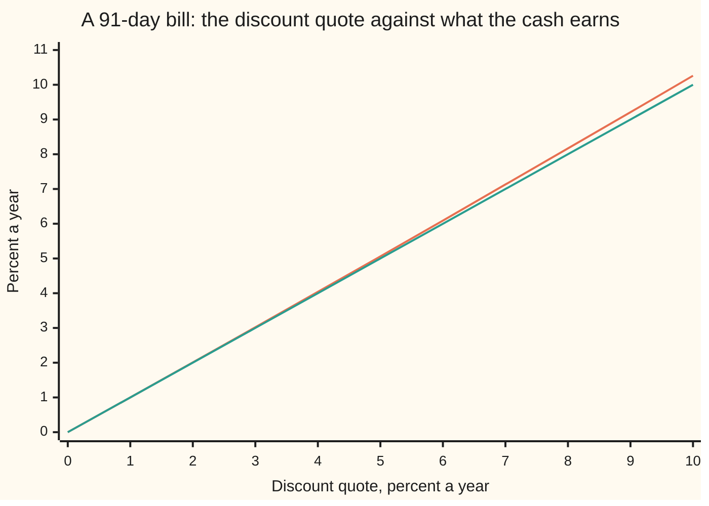
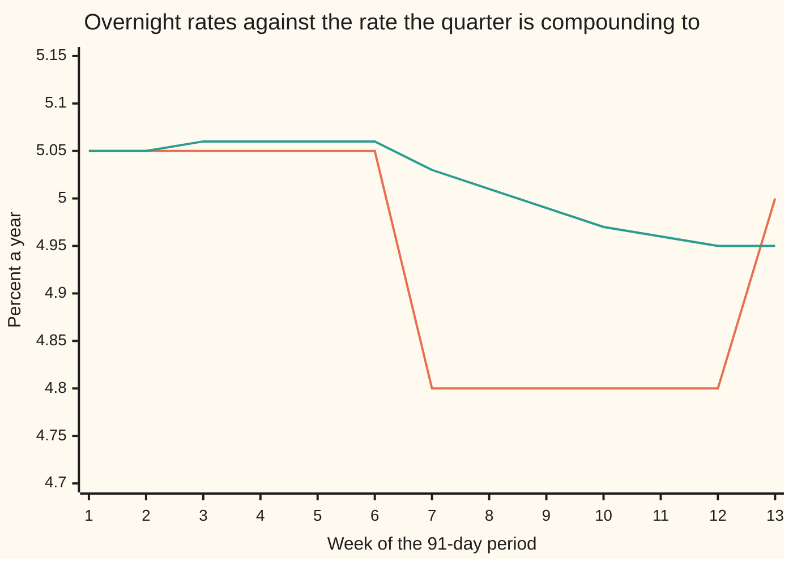

# Money markets: bills, repos and overnight rates, and the compounded-in-arrears convention

Financial mathematics → Curves → The short end → Money markets

---

## General Overview

A Treasury bill pays no interest along the way. Cash goes out today, and one round amount comes back on one date. The thirteen-week bill is auctioned every week; take one with 91 days left and a face value of $1,000,000.00, the amount the Treasury will repay.

This morning that bill is quoted at 4.90. The number is a discount rate: 4.90% a year of the face value, charged for 91 days of a 360-day year. Take it off the million and the price is $987,613.89. The buyer pays that today and collects $1,000,000.00 in 91 days, a gain of $12,386.11.

The quote is not the return. The discount was taken off the million; the gain was earned on the $987,613.89 that actually left the buyer's account. Measured against the cash and scaled to a 360-day year, the return is 4.9615% a year — six basis points above the quote. A basis point is a hundredth of a percentage point.

The other half of the money market is overnight. A repo, short for repurchase agreement, lends cash for one night against collateral: sell a Treasury bond today, agree to buy it back tomorrow at a slightly higher price, and the difference is the interest. Those trades are counted every day to produce SOFR, the Secured Overnight Financing Rate — a volume-weighted median of real overnight repo, published each business day at about 8 a.m. New York time.

An overnight rate covers one night. A loan runs three months. Compounding is the bridge: each day's interest joins the balance, the balance earns the next day's rate, and the rate for the whole period can only be read off at the end. That is the compounded-in-arrears convention, and it is what replaced LIBOR, a rate that panel banks submitted as an answer to a question and that was known in advance.

**Every money-market number is a rate bolted to a base and a day count, so comparing two of them, or turning overnight rates into a three-month rate, means converting both to what the cash actually earns.**

**What kind of fact this is:** a convention — the market's rules for quoting and accruing short-dated money; the conversions between those rules are algebra, derived on this card in Why it works.

### The picture: the quote and the return are two different numbers



The lower, straight line is the quote itself. The upper, bending line is the return on the cash at that quote. At a quote of 4.90 they read 4.90 and 4.9615. At a quote of 10.00 they read 10.00 and 10.26. The gap opens because the discount is taken off the face amount while the return is earned on the smaller price.

---

## The formula

Three rules, in the order a trade meets them. Notation first, in words. A year fraction is the days in a period divided by the days the convention calls a year; dollar money markets count actual days over 360, written actual/360. The tall sign ∏ in the third rule means "multiply all of these together", the way a sum sign adds a list up.

$$P = F\left(1 - d\cdot\frac{n}{360}\right)$$

**Read it aloud:** take the quoted discount off the face amount, in proportion to the days left, and what remains is the price.

$$i = \frac{F - P}{P}\cdot\frac{360}{n}$$

**Read it aloud:** the gain, divided by the cash that earned it, scaled up to a 360-day year.

$$G = \prod_{j=1}^{m}\left(1 + r_j\cdot\frac{n_j}{360}\right), \qquad R = (G - 1)\cdot\frac{360}{n}$$

**Read it aloud:** let each block's interest join the balance, multiply the blocks together, and quote the whole period's growth as one simple rate.

| Symbol | Plain meaning | In our example | Push it up and the answer… |
| --- | --- | --- | --- |
| $F$ | face value: the round amount repaid at maturity | $1,000,000.00 | price and gain both scale with it |
| $P$ | price: the cash actually handed over | $987,613.89 | the return falls, the same gain spread over more cash |
| $d$ | discount quote: a percent a year of the face value | 4.90% | the price falls and the return rises a little faster |
| $n$ | days in the period, counted actual: to the bill's maturity, or across the whole overnight path | 91 | more days, more discount and more interest |
| $i$ | the return on the cash, simple, actual/360 | 4.9615% | — |
| $y$ | the same return stated on a 365-day year | 5.0304% | — |
| $r_j$ | the overnight rate applying to one block of the path | 5.05%, later 4.80% | every balance after it grows faster |
| $n_j$ | calendar days that block covers: 1, or 3 over a weekend | 1 or 3 | — |
| $m$ | how many blocks the period holds | 65 | — |
| $G$ | growth factor over the whole period, all blocks multiplied | 1.0125065396 | — |
| $R$ | the compounded-in-arrears rate, simple, actual/360 | 4.9476% | — |
| $J$ | a published index: the same product run from a fixed start date | 1.00000000 on day 0 | — |

Two helpers. A bill of six months or less is also quoted on a 365-day year, the bond-equivalent yield $y = i\cdot 365/360$, which puts it beside a bond's yield instead of a deposit's. And because an index is one long product, the growth factor between any two of its dates is one level divided by the other: $G = J_{\text{end}}/J_{\text{start}}$. The published SOFR Index began at 1.00000000 on 2 April 2018 and is quoted to eight decimal places for exactly this purpose.

### When it holds

- **The day count is part of the quote, not decoration.** Dollar bills, repo and SOFR all accrue actual/360. Price the same bill on a 365-day year and it comes out $169.67 dearer per million, on identical cash flows.
- **The price has to stay positive.** The discount rule needs $d\cdot n/360 < 1$. At 91 days that means a quote under 395.6% a year, so it never binds in practice; at very long maturities the discount basis breaks, which is one reason only short paper uses it.
- **Overnight blocks come from a published calendar.** One rate covers one block. A Friday rate normally covers Saturday and Sunday as a single three-day block of simple interest, not three compounded days; compounding them adds $0.74 per million over this quarter.
- **In arrears means the last rate is missing until the end.** The formula is exact arithmetic on a path, not a forecast. Before the period closes, any number quoted for it is an estimate from futures or swaps, not an observation.
- **Conventions verified 14 September 2026:** bills quoted as a discount on actual/360; SOFR published each business day at about 8 a.m. New York time; the SOFR Index set to 1.00000000 on 2 April 2018 and published to eight decimals, with rolling compounded averages over 30, 90 and 180 calendar days. Markets can change these rules. The algebra does not change with them.

---

## Why it works

### Step 0: a rate is a number bolted to a base

Cash flows have no rate of their own. A rate appears only when three choices are made: what the percentage is taken of, over what length of year, and whether interest earned inside the period is carried forward. Change any one choice and the quoted number moves while the money does not. Every conversion on this card is bookkeeping between those choices, so the first question about any money-market number is never "is it high?" but "of what, over what year, compounded or not?"

### Step 1: the discount is taken off the round number

A bill has one payment, the face value, and that is the number everyone knows in advance. So the market quotes the amount knocked off it. At 4.90 for 91 days the discount is $1{,}000{,}000.00\times 0.049\times 91/360$, which is $12,386.11, and the price is what is left, $987,613.89.

The convention is hand arithmetic from before calculators: the discount is a plain slice of a round number. It also checks cleanly. Because 91 days over a 360-day year leave the price with a denominator of 36, the price before rounding to cents, times 36, is the whole number 35,554,100 — a check the code repeats.

### Step 2: the return is earned on the price, not the face

The buyer's money is $987,613.89. The gain is $12,386.11. The return over 91 days is the gain divided by the money, and annualising on a 360-day year multiplies by 360/91. That is 4.9615% a year, against a 4.90 quote.

Writing the price rule inside the return rule removes the dollars entirely:

$$i = \frac{d}{1 - d\cdot n/360}, \qquad i - d = \frac{d^2\cdot n/360}{1 - d\cdot n/360}$$

The gap is a squared term, so it is small at small rates and grows quickly: at a 4.90 quote it is six basis points, at a 10.00 quote it is 26. That is the bend in the opening picture.

<details>
<summary>Detailed proof: the price and the quote determine each other exactly</summary>

Fix a face value and a day count, both positive. The price rule is a straight line in the quote with slope $-F\cdot n/360$, which is negative, so it is strictly decreasing: raising the quote always lowers the price, and no two quotes give the same price. The price is positive exactly when $d\cdot n/360 < 1$. On that range the line runs from arbitrarily large prices down towards zero, so every positive price is hit, and rearranging gives the one quote that produces it: $d = (1 - P/F)\cdot 360/n$.

The return behaves the same way from the other side. The map $P \mapsto (F/P - 1)\cdot 360/n$ is strictly decreasing on positive prices, running from arbitrarily large returns down to $-360/n$, so each positive price names exactly one return and each return above that floor names exactly one price, $P = F/(1 + i\cdot n/360)$. Substituting $P/F = 1 - d\cdot n/360$ into it gives the boxed conversion above, and subtracting $d$ gives the squared gap, which is zero only when the quote is zero and positive otherwise. Boundary cases: a zero quote is a bill sold at face with no gain; a negative quote is a price above face, which the algebra allows and the auction rules may not.

</details>

### Step 3: overnight money is a loan rolled, and the interest rolls with it

A repo lends for one night. Lending for a quarter means rolling it: the next night's loan is of last night's principal *plus* last night's interest, because that is the cash now in hand. So the periods do not add — the growth factors multiply.

One night at 5.05% multiplies the balance by $1 + 0.0505/360 = 1.0001402778$. A Friday rate that covers the weekend multiplies by $1 + 0.0505\times 3/360 = 1.0004208333$: three days of simple interest in one block, because the rate was only published once. Thirteen weeks of those blocks — 52 single days and 13 weekend blocks, 91 calendar days in all — multiply to 1.0125065396 along the path this card uses: 5.05%, cut to 4.80% from week seven, 5.00% on the last Thursday.

Annualising that growth on a 360-day year gives the compounded-in-arrears rate for the quarter, 4.9476%, and on a million dollars, $12,506.54 of interest.

### Step 4: compounding is not averaging

The same 91 days have a weighted average daily rate of 4.9176%. The compounded rate is 4.9476%. Three basis points, $75.98 per million, separate them, and the compounded number is always the larger of the two when rates are positive.

The reason is visible in the multiplication. Multiplying the blocks out gives one, plus the sum of every block's interest fraction — which annualises to the average — plus every product of two distinct fractions, plus every product of three, and so on. Those cross terms are interest earned on interest. Day 30's interest is in the balance for the remaining 61 days.

<details>
<summary>The algebra behind the extra three basis points</summary>

Each block contributes an interest fraction $r_j\cdot n_j/360$. Multiplying the blocks out and keeping the terms up to second order leaves the total of those fractions, plus half of the total squared minus the sum of the squares:

$$G \approx 1 + \sum_j r_j\frac{n_j}{360} + \frac{1}{2}\left[\left(\sum_j r_j\frac{n_j}{360}\right)^{2} - \sum_j \left(r_j\frac{n_j}{360}\right)^{2}\right]$$

The bracket is exactly the sum of all the products of two distinct fractions: every such product appears twice in the squared total and not at all in the sum of squares.

For this path that estimate is 1.0125062378 against the true 1.0125065396: right to six decimal places, with the remainder being the triple products and beyond. The second-order term is roughly half the square of the period's total interest, so the compounding gain grows with the square of the period. On a flat 5% it is $8.40 per million over 30 days, $79.32 over 91 days, $320.39 over 182 days and $1,303.25 over a year — all four printed by the code.

</details>

### Step 5: why the rate is fixed in arrears, and why SOFR replaced LIBOR

LIBOR was a survey. Each panel bank answered a question about the rate at which it could borrow unsecured funds for a term — three months, say — and the average of the middle answers was published as the rate. That design gave borrowers a term rate in advance, which is convenient, and it had two fatal weaknesses: the borrowing it described had largely stopped happening, and an answer to a question can be shaded. The Financial Conduct Authority confirmed the end date, and panel-bank US dollar LIBOR stopped immediately after 30 June 2023.

SOFR is measured instead of asked. It is a volume-weighted median of overnight repo backed by Treasury collateral, taken from transactions that happened. The price of that robustness is the missing term: those trades last one night, so there is no three-month SOFR to observe. A three-month rate has to be *built* from about sixty-five published overnight rates, and the last of them is published the morning after the period ends.

That is why the convention is compounded in arrears, and why floating coupons need a rule that buys the borrower some notice:

| Convention | What it does |
| --- | --- |
| Payment delay | The period keeps its own rates; the cash is paid some days after the period ends. |
| Lookback | Each day of the period uses the rate published a fixed number of days earlier, with the period's own day weights. |
| Observation shift | The whole observation window slides back, carrying the day weights of the observation dates with it. |
| Lockout | The rate for the last few days is frozen at the last one published before them. |

The four give different coupons from the same daily rates. A contract that fixes the period's weights before shifting the observations is not the same trade as one that shifts both, which is the small print that makes two "SOFR + 50" loans pay different amounts.

There is another route to a term rate: infer it from what the futures and swaps market expects, rather than from what has happened. That is the forward-looking family, quoted in advance like LIBOR but derived from traded prices. Its machinery is the forward rate, built in [spot-forward-and-par-rates](01-spot-forward-and-par-rates.md) and traded in [forward-rate-agreements](02-forward-rate-agreements.md).

---

## Worked numbers, by hand

The bill first, then the quarter of overnight rates it is competing with.

| Step | Arithmetic | Value |
| --- | --- | --- |
| the discount | 1,000,000.00 × 0.049 × 91/360 | $12,386.11 |
| price | 1,000,000.00 − 12,386.11 | **$987,613.89** |
| hand check | the price before rounding, × 36 | 35,554,100 |
| return on the cash | (12,386.11 / 987,613.89) × 360/91 | **4.9615%** |
| on a 365-day year | 4.9615% × 365/360 | 5.0304% |
| effective annual rate | (1,000,000.00 / 987,613.89) raised to 365/91 | 5.1261% |
| one night at 5.05% | 1 + 0.0505/360 | 1.0001402778 |
| a Friday block, three days | 1 + 0.0505 × 3/360 | 1.0004208333 |
| all 65 blocks multiplied | 52 single days and 13 weekend blocks | **1.0125065396** |
| compounded in arrears | 0.0125065396 × 360/91 | **4.9476%** |
| interest on a million | 1,000,000.00 × 0.0125065396 | **$12,506.54** |

Four numbers describe the same quarter of money: the bill is quoted at 4.90, earns 4.9615% on the cash, reads 5.0304% on a bond's year, and the overnight market compounded to 4.9476% over the same days. A fifth, 5.1261%, is the bill rolled and compounded for a whole year, the effective annual rate. Nothing was gained or lost between them; only the base moved.

### What breaks if you drop a piece

| Mistake | Comes out at | What went wrong |
| --- | --- | --- |
| Reading the 4.90 quote as the return | $153.42 less interest than the bill pays | The discount is a slice of the face value; the return is earned on the price |
| Using a 365-day year in the price rule | Price $169.67 too high | The quote means nothing without its day count, and dollars use actual/360 |
| Averaging the daily rates instead of compounding | $75.98 short per million | Interest paid on day 30 earns for the remaining 61 days |
| Compounding through the weekend | $0.74 too much per million | One published rate is one block: Friday's covers three days as simple interest |

```
What each mistake costs, per $1,000,000 of the same 91 days; one block = $5
  actual/365 in the price rule    ██████████████████████████████████  $169.67
  quote read as the return        ███████████████████████████████     $153.42
  average instead of compounding  ███████████████                     $75.98
  weekends compounded separately                                      $0.74
```

The first two are quoting errors and cost real money on day one. The last two are accrual errors and show up at the coupon date.

---

## The rate is not known until the last day

A borrower draws $1,000,000.00 on a 91-day SOFR loan this morning and asks what the interest will be. Nobody can say. Most of the rates that will set it have not been published yet. The coupon is exact arithmetic on a path that has not happened.

That path again: 5.05% for six weeks, a quarter-point cut from day 42, and a 20 basis point squeeze on the last Thursday, the sort of jump quarter-end funding pressure produces. The rates are invented; the shape is ordinary.

| | Overnight rate that Thursday | Interest so far | Running rate in arrears |
| --- | --- | --- | --- |
| end of week 1 | 5.05% | $982.30 | 5.05% |
| end of week 6 | 5.05% | $5,908.28 | 5.06% |
| end of week 7 | 4.80% | $6,847.45 | 5.03% |
| end of week 10 | 4.80% | $9,670.23 | 4.97% |
| end of week 13 | 5.00% | $12,506.54 | 4.95% |

Two forces are at work. The first is the clock: interest accrues whether or not rates move.

```
Interest earned per $1,000,000 by the end of week k; one block = $400
  week  1  ██                                 $982.30
  week  3  ███████                            $2,949.79
  week  5  ████████████                       $4,921.15
  week  7  █████████████████                  $6,847.45
  week  9  ██████████████████████             $8,728.43
  week 11  ███████████████████████████        $10,612.91
  week 13  ███████████████████████████████    $12,506.54
```

The second is compounding, which barely registers over a month and dominates the difference over a year, because it grows with the square of the period.

```
Compounding gain over the plain sum, per $1,000,000, flat 5% compounded daily; one block = $40
  30 days                                      $8.40
  91 days   ██                                 $79.32
  182 days  ████████                           $320.39
  365 days  █████████████████████████████████  $1,303.25
```

Put the path and the running rate on one picture and the in-arrears problem is obvious.



The stepped line is the overnight rate in force each Thursday: flat, then cut, then the quarter-end spike. The smooth line is the rate the period has compounded to so far. It drifts up while rates hold, because compounding adds to the average; it sags after the cut; and it settles at 4.9476% only when the last rate is in. A lender who needs to know the coupon a week early cannot have it from this rate — hence lookbacks and payment delays.

The published index makes the arithmetic portable. Starting the same product at 1.00000000, the level reaches 1.00590828 on day 42 and 1.01250654 on day 91, and dividing the second by the first gives the factor for the second half, to the eight decimals the index publishes. Any two dates, one division, no path needed.

---

## Code, from first principles, and it actually runs

Nothing is imported that already holds an answer. The bill's return is found twice — in closed form, and by a bisection root finder written out here that solves for the rate which grows the price to the face value. The effective annual rate is found twice the same way. The compounded overnight factor is built three ways: block by block, by adding logarithms and undoing them, and by the two-term expansion of Step 4. Then the four mistake costs and every charted number are printed.

### Python

```python
# Money markets -- the check behind the card.  Standard library only, and
# nothing imported that already holds an answer: each yield is found twice,
# once in closed form and once by a bisection root finder written out here,
# and the compounded overnight factor is built three separate ways.
# The bill: face 1,000,000 dollars, 91 days left, quoted at a 4.9 percent
# discount, actual/360.  The overnight path: 13 weeks of business-day blocks,
# invented but market-shaped -- 5.05 percent for six weeks, a quarter-point
# cut from day 42, and a 20 basis point quarter-end squeeze on day 87.
from math import log, exp

F, DAYS, DQ, N = 1_000_000.0, 91, 0.049, 1_000_000.0

def bisect(f, lo, hi):                       # our own root finder: 200 halvings
    for _ in range(200):
        mid = 0.5 * (lo + hi)
        if f(lo) * f(mid) <= 0.0: hi = mid
        else: lo = mid
    return 0.5 * (lo + hi)

def blocks_of(cut_day):                      # the business-day blocks, in order
    out = []
    for w in range(13):
        for k in range(5):
            start, days = 7 * w + k, (3 if k == 4 else 1)   # Friday carries 3 days
            r = 0.0505 if start < cut_day else 0.0480
            if start == 87: r += 0.0020                     # quarter-end squeeze
            out.append((start, days, r))
    return out

def grow(bl):                                # road 1: multiply the block factors
    g = 1.0
    for _, days, r in bl: g *= 1.0 + r * days / 360.0
    return g

def grow_by_logs(bl):                        # road 2: add logs, then undo them
    s = 0.0
    for _, days, r in bl: s += log(1.0 + r * days / 360.0)
    return exp(s)

def grow_each_day(bl):                       # the weekend mistake: compound Sat and Sun
    g = 1.0
    for _, days, r in bl: g *= (1.0 + r / 360.0) ** days
    return g

def rate_from(g, days): return (g - 1.0) * 360.0 / days      # simple, actual/360

def money(name, v): print(f"{name:<46}{v:>16.2f}")
def pct(name, v):   print(f"{name:<46}{100.0 * v:>15.4f}%")
def fac(name, v):   print(f"{name:<46}{v:>16.10f}")

P = F * (1.0 - DQ * DAYS / 360.0)                            # the quoting rule
i_mm = (F - P) / P * 360.0 / DAYS                            # road 1
i_bs = bisect(lambda i: P * (1.0 + i * DAYS / 360.0) - F, -0.5, 0.5)   # road 2
y_bey = i_mm * 365.0 / 360.0
ear = (F / P) ** (365.0 / DAYS) - 1.0
ear_bs = bisect(lambda e: (1.0 + e) ** (DAYS / 365.0) - F / P, -0.5, 0.5)

bl = blocks_of(42)
G, G_log = grow(bl), grow_by_logs(bl)
s1 = sum(r * d / 360.0 for _, d, r in bl)                    # the plain sum
s2 = sum((r * d / 360.0) ** 2 for _, d, r in bl)
G_2nd = 1.0 + s1 + 0.5 * (s1 * s1 - s2)                      # road 3
R_c = rate_from(G, DAYS)
r_bar = sum(r * d for _, d, r in bl) / DAYS
j0 = 1.00000000
j42, j91 = j0 * grow(bl[:30]), j0 * G

print("THE BILL: face 1,000,000 dollars, 91 days, quoted at a 4.9 percent discount")
money("price paid, actual/360 discount rule", P)
money("price times 36, a whole number by hand", P * 36.0)
money("discount, face minus price", F - P)
pct("1 money-market yield, closed form", i_mm)
pct("2 money-market yield, by bisection", i_bs)
pct("bond-equivalent yield, actual/365", y_bey)
pct("3 effective annual rate, closed form", ear)
pct("4 effective annual rate, by bisection", ear_bs)

print()
print("THE OVERNIGHT PATH: 13 weeks, 65 blocks, 91 calendar days")
print(f"{'blocks: one-day, three-day, calendar days':<46}"
      f"{sum(1 for _, d, _ in bl if d == 1):>6}{sum(1 for _, d, _ in bl if d == 3):>5}"
      f"{sum(d for _, d, _ in bl):>5}")
fac("one-day block at 5.05 percent", 1.0 + 0.0505 / 360.0)
fac("Friday block, three days at 5.05 percent", 1.0 + 0.0505 * 3.0 / 360.0)
fac("1 compounded factor, block by block", G)
fac("2 compounded factor, from logs", G_log)
fac("3 compounded factor, two-term expansion", G_2nd)
pct("compounded in arrears, actual/360", R_c)
pct("weighted average of the daily rates", r_bar)
money("interest on 1,000,000, compounded", N * (G - 1.0))
money("interest on 1,000,000, at the average", N * s1)
print(f"{'index levels, day 0, day 42, day 91':<46}{j0:>16.8f}{j42:>14.8f}{j91:>14.8f}")
fac("factor from the two index levels", j91 / j0)

print()
print("WHAT THE MISTAKES COST, per 1,000,000 of the same 91 days")
money("quote read as the return: interest short by", (F - P) - P * DQ * DAYS / 360.0)
money("actual/365 in the price rule: overpaid by", F * (1.0 - DQ * DAYS / 365.0) - P)
money("average instead of compounding: short by", N * (G - 1.0 - s1))
money("weekends compounded, not one block: over by", N * (grow_each_day(bl) - G))

print()
print("THE SAME 91 DAYS, FOUR WAYS OF QUOTING IT")
pct("discount quote on the face", DQ)
pct("compounded overnight, in arrears", R_c)
pct("money-market yield on the cash", i_mm)
pct("bond-equivalent yield", y_bey)

print()
weeks = list(range(1, 14))
g_w = [grow(bl[:5 * w]) for w in weeks]
print(f"{'week':<24}" + "".join(f"{w:>9d}" for w in weeks))
print(f"{'overnight rate, Thursday':<24}" + "".join(f"{100.0 * bl[5 * (w - 1) + 3][2]:>9.2f}" for w in weeks))
print(f"{'interest by week end':<24}" + "".join(f"{N * (g - 1.0):>9.2f}" for g in g_w))
print(f"{'running rate in arrears':<24}" + "".join(f"{100.0 * rate_from(g, 7 * w):>9.2f}" for g, w in zip(g_w, weeks)))

print()
ds = [0.01 * k for k in range(11)]
print(f"{'chart, discount quote, percent':<34}" + "".join(f"{100.0 * d:>7.2f}" for d in ds))
print(f"{'chart, money-market yield, percent':<34}"
      + "".join(f"{100.0 * d / (1.0 - d * DAYS / 360.0):>7.2f}" for d in ds))

print()
print("COMPOUNDING GAIN per 1,000,000, flat 5 percent compounded every day")
for n in (30, 91, 182, 365):
    money(f"  over {n} days", N * ((1.0 + 0.05 / 360.0) ** n - (1.0 + 0.05 * n / 360.0)))

assert abs(P * 36.0 - 35554100.0) < 1e-6      # against the hand arithmetic
assert abs(i_bs - i_mm) < 1e-12               # root finder against closed form
assert abs(ear_bs - ear) < 1e-10              # root finder against the power
assert abs(G_log - G) < 1e-12                 # logs against multiplication
assert abs(G_2nd - G) < 5e-7                  # expansion against the product
assert i_mm > DQ + 1e-4                       # the return beats the quote
assert R_c > r_bar + 1e-5                     # compounding beats the average
print("ALL CHECKS PASS")
```

**Ran 2026-09-14 on macOS, Python 3.14.6, standard library only. All checks passed. Output, pasted from the run:**

```
THE BILL: face 1,000,000 dollars, 91 days, quoted at a 4.9 percent discount
price paid, actual/360 discount rule                 987613.89
price times 36, a whole number by hand             35554100.00
discount, face minus price                            12386.11
1 money-market yield, closed form                      4.9615%
2 money-market yield, by bisection                     4.9615%
bond-equivalent yield, actual/365                      5.0304%
3 effective annual rate, closed form                   5.1261%
4 effective annual rate, by bisection                  5.1261%

THE OVERNIGHT PATH: 13 weeks, 65 blocks, 91 calendar days
blocks: one-day, three-day, calendar days         52   13   91
one-day block at 5.05 percent                     1.0001402778
Friday block, three days at 5.05 percent          1.0004208333
1 compounded factor, block by block               1.0125065396
2 compounded factor, from logs                    1.0125065396
3 compounded factor, two-term expansion           1.0125062378
compounded in arrears, actual/360                      4.9476%
weighted average of the daily rates                    4.9176%
interest on 1,000,000, compounded                     12506.54
interest on 1,000,000, at the average                 12430.56
index levels, day 0, day 42, day 91                 1.00000000    1.00590828    1.01250654
factor from the two index levels                  1.0125065396

WHAT THE MISTAKES COST, per 1,000,000 of the same 91 days
quote read as the return: interest short by             153.42
actual/365 in the price rule: overpaid by               169.67
average instead of compounding: short by                 75.98
weekends compounded, not one block: over by               0.74

THE SAME 91 DAYS, FOUR WAYS OF QUOTING IT
discount quote on the face                             4.9000%
compounded overnight, in arrears                       4.9476%
money-market yield on the cash                         4.9615%
bond-equivalent yield                                  5.0304%

week                            1        2        3        4        5        6        7        8        9       10       11       12       13
overnight rate, Thursday     5.05     5.05     5.05     5.05     5.05     5.05     4.80     4.80     4.80     4.80     4.80     4.80     5.00
interest by week end       982.30  1965.56  2949.79  3934.99  4921.15  5908.28  6847.45  7787.50  8728.43  9670.23 10612.91 11556.47 12506.54
running rate in arrears      5.05     5.05     5.06     5.06     5.06     5.06     5.03     5.01     4.99     4.97     4.96     4.95     4.95

chart, discount quote, percent       0.00   1.00   2.00   3.00   4.00   5.00   6.00   7.00   8.00   9.00  10.00
chart, money-market yield, percent   0.00   1.00   2.01   3.02   4.04   5.06   6.09   7.13   8.17   9.21  10.26

COMPOUNDING GAIN per 1,000,000, flat 5 percent compounded every day
  over 30 days                                            8.40
  over 91 days                                           79.32
  over 182 days                                         320.39
  over 365 days                                        1303.25
ALL CHECKS PASS
```

### Rust

Same numbers, same labels, built with `rustc --edition 2021 -O`.

```rust
// Money markets -- the same check as the Python, in Rust.  No crates, std only,
// and nothing here already holds an answer: each yield is found twice, once in
// closed form and once by a bisection root finder written out here, and the
// compounded overnight factor is built three separate ways.
// The bill: face 1,000,000 dollars, 91 days left, quoted at a 4.9 percent
// discount, actual/360.  The overnight path: 13 weeks of business-day blocks,
// invented but market-shaped -- 5.05 percent for six weeks, a quarter-point
// cut from day 42, and a 20 basis point quarter-end squeeze on day 87.
const F: f64 = 1_000_000.0;
const DAYS: f64 = 91.0;
const DQ: f64 = 0.049;
const N: f64 = 1_000_000.0;

fn bisect<G: Fn(f64) -> f64>(f: G, mut lo: f64, mut hi: f64) -> f64 {  // 200 halvings
    for _ in 0..200 {
        let mid = 0.5 * (lo + hi);
        if f(lo) * f(mid) <= 0.0 { hi = mid } else { lo = mid }
    }
    0.5 * (lo + hi)
}

fn blocks_of(cut_day: i32) -> Vec<(i32, f64, f64)> {   // start day, days, rate
    let mut out = Vec::new();
    for w in 0..13 {
        for k in 0..5 {
            let start = 7 * w + k;
            let days = if k == 4 { 3.0 } else { 1.0 };   // Friday carries 3 days
            let mut r = if start < cut_day { 0.0505 } else { 0.0480 };
            if start == 87 { r += 0.0020 }               // quarter-end squeeze
            out.push((start, days, r));
        }
    }
    out
}

fn grow(bl: &[(i32, f64, f64)]) -> f64 {       // road 1: multiply the block factors
    let mut g = 1.0;
    for &(_, days, r) in bl { g *= 1.0 + r * days / 360.0 }
    g
}

fn grow_by_logs(bl: &[(i32, f64, f64)]) -> f64 {   // road 2: add logs, then undo them
    let mut s = 0.0;
    for &(_, days, r) in bl { s += (1.0 + r * days / 360.0).ln() }
    s.exp()
}

fn grow_each_day(bl: &[(i32, f64, f64)]) -> f64 {  // the weekend mistake: compound Sat and Sun
    let mut g = 1.0;
    for &(_, days, r) in bl { g *= (1.0 + r / 360.0).powf(days) }
    g
}

fn rate_from(g: f64, days: f64) -> f64 { (g - 1.0) * 360.0 / days }   // simple, actual/360

fn money(name: &str, v: f64) { println!("{:<46}{:>16.2}", name, v) }
fn pct(name: &str, v: f64) { println!("{:<46}{:>15.4}%", name, 100.0 * v) }
fn fac(name: &str, v: f64) { println!("{:<46}{:>16.10}", name, v) }

fn main() {
    let p = F * (1.0 - DQ * DAYS / 360.0);                          // the quoting rule
    let i_mm = (F - p) / p * 360.0 / DAYS;                          // road 1
    let i_bs = bisect(|i| p * (1.0 + i * DAYS / 360.0) - F, -0.5, 0.5);   // road 2
    let y_bey = i_mm * 365.0 / 360.0;
    let ear = (F / p).powf(365.0 / DAYS) - 1.0;
    let ear_bs = bisect(|e: f64| (1.0 + e).powf(DAYS / 365.0) - F / p, -0.5, 0.5);

    let bl = blocks_of(42);
    let (g_all, g_log) = (grow(&bl), grow_by_logs(&bl));
    let mut s1 = 0.0;
    let mut s2 = 0.0;
    for &(_, d, r) in &bl { s1 += r * d / 360.0; s2 += (r * d / 360.0) * (r * d / 360.0) }
    let g_2nd = 1.0 + s1 + 0.5 * (s1 * s1 - s2);                    // road 3
    let r_c = rate_from(g_all, DAYS);
    let mut weighted = 0.0;
    for &(_, d, r) in &bl { weighted += r * d }
    let r_bar = weighted / DAYS;
    let j0 = 1.00000000;
    let (j42, j91) = (j0 * grow(&bl[..30]), j0 * g_all);

    println!("THE BILL: face 1,000,000 dollars, 91 days, quoted at a 4.9 percent discount");
    money("price paid, actual/360 discount rule", p);
    money("price times 36, a whole number by hand", p * 36.0);
    money("discount, face minus price", F - p);
    pct("1 money-market yield, closed form", i_mm);
    pct("2 money-market yield, by bisection", i_bs);
    pct("bond-equivalent yield, actual/365", y_bey);
    pct("3 effective annual rate, closed form", ear);
    pct("4 effective annual rate, by bisection", ear_bs);

    println!();
    println!("THE OVERNIGHT PATH: 13 weeks, 65 blocks, 91 calendar days");
    let ones = bl.iter().filter(|&&(_, d, _)| d == 1.0).count();
    let threes = bl.iter().filter(|&&(_, d, _)| d == 3.0).count();
    let total: f64 = bl.iter().map(|&(_, d, _)| d).sum();
    println!("{:<46}{:>6}{:>5}{:>5}", "blocks: one-day, three-day, calendar days", ones, threes, total as i64);
    fac("one-day block at 5.05 percent", 1.0 + 0.0505 / 360.0);
    fac("Friday block, three days at 5.05 percent", 1.0 + 0.0505 * 3.0 / 360.0);
    fac("1 compounded factor, block by block", g_all);
    fac("2 compounded factor, from logs", g_log);
    fac("3 compounded factor, two-term expansion", g_2nd);
    pct("compounded in arrears, actual/360", r_c);
    pct("weighted average of the daily rates", r_bar);
    money("interest on 1,000,000, compounded", N * (g_all - 1.0));
    money("interest on 1,000,000, at the average", N * s1);
    println!("{:<46}{:>16.8}{:>14.8}{:>14.8}", "index levels, day 0, day 42, day 91", j0, j42, j91);
    fac("factor from the two index levels", j91 / j0);

    println!();
    println!("WHAT THE MISTAKES COST, per 1,000,000 of the same 91 days");
    money("quote read as the return: interest short by", (F - p) - p * DQ * DAYS / 360.0);
    money("actual/365 in the price rule: overpaid by", F * (1.0 - DQ * DAYS / 365.0) - p);
    money("average instead of compounding: short by", N * (g_all - 1.0 - s1));
    money("weekends compounded, not one block: over by", N * (grow_each_day(&bl) - g_all));

    println!();
    println!("THE SAME 91 DAYS, FOUR WAYS OF QUOTING IT");
    pct("discount quote on the face", DQ);
    pct("compounded overnight, in arrears", r_c);
    pct("money-market yield on the cash", i_mm);
    pct("bond-equivalent yield", y_bey);

    println!();
    let weeks: Vec<usize> = (1..14).collect();
    let g_w: Vec<f64> = weeks.iter().map(|&w| grow(&bl[..5 * w])).collect();
    let mut head = format!("{:<24}", "week");
    let mut thu = format!("{:<24}", "overnight rate, Thursday");
    let mut cash = format!("{:<24}", "interest by week end");
    let mut run = format!("{:<24}", "running rate in arrears");
    for (idx, &w) in weeks.iter().enumerate() {
        head.push_str(&format!("{:>9}", w));
        thu.push_str(&format!("{:>9.2}", 100.0 * bl[5 * (w - 1) + 3].2));
        cash.push_str(&format!("{:>9.2}", N * (g_w[idx] - 1.0)));
        run.push_str(&format!("{:>9.2}", 100.0 * rate_from(g_w[idx], 7.0 * w as f64)));
    }
    for line in [head, thu, cash, run] { println!("{}", line) }

    println!();
    let mut quote = format!("{:<34}", "chart, discount quote, percent");
    let mut yield_line = format!("{:<34}", "chart, money-market yield, percent");
    for k in 0..11 {
        let d = 0.01 * k as f64;
        quote.push_str(&format!("{:>7.2}", 100.0 * d));
        yield_line.push_str(&format!("{:>7.2}", 100.0 * d / (1.0 - d * DAYS / 360.0)));
    }
    println!("{}", quote);
    println!("{}", yield_line);

    println!();
    println!("COMPOUNDING GAIN per 1,000,000, flat 5 percent compounded every day");
    for n in [30.0_f64, 91.0, 182.0, 365.0] {
        money(&format!("  over {} days", n as i64),
              N * ((1.0_f64 + 0.05 / 360.0).powf(n) - (1.0 + 0.05 * n / 360.0)));
    }

    assert!((p * 36.0 - 35554100.0).abs() < 1e-6);   // against the hand arithmetic
    assert!((i_bs - i_mm).abs() < 1e-12);            // root finder against closed form
    assert!((ear_bs - ear).abs() < 1e-10);           // root finder against the power
    assert!((g_log - g_all).abs() < 1e-12);          // logs against multiplication
    assert!((g_2nd - g_all).abs() < 5e-7);           // expansion against the product
    assert!(i_mm > DQ + 1e-4);                       // the return beats the quote
    assert!(r_c > r_bar + 1e-5);                     // compounding beats the average
    println!("ALL CHECKS PASS");
}
```

**Ran 2026-09-14 on macOS, rustc 1.98.1, no crates. All checks passed. Output, pasted from the run:**

```
THE BILL: face 1,000,000 dollars, 91 days, quoted at a 4.9 percent discount
price paid, actual/360 discount rule                 987613.89
price times 36, a whole number by hand             35554100.00
discount, face minus price                            12386.11
1 money-market yield, closed form                      4.9615%
2 money-market yield, by bisection                     4.9615%
bond-equivalent yield, actual/365                      5.0304%
3 effective annual rate, closed form                   5.1261%
4 effective annual rate, by bisection                  5.1261%

THE OVERNIGHT PATH: 13 weeks, 65 blocks, 91 calendar days
blocks: one-day, three-day, calendar days         52   13   91
one-day block at 5.05 percent                     1.0001402778
Friday block, three days at 5.05 percent          1.0004208333
1 compounded factor, block by block               1.0125065396
2 compounded factor, from logs                    1.0125065396
3 compounded factor, two-term expansion           1.0125062378
compounded in arrears, actual/360                      4.9476%
weighted average of the daily rates                    4.9176%
interest on 1,000,000, compounded                     12506.54
interest on 1,000,000, at the average                 12430.56
index levels, day 0, day 42, day 91                 1.00000000    1.00590828    1.01250654
factor from the two index levels                  1.0125065396

WHAT THE MISTAKES COST, per 1,000,000 of the same 91 days
quote read as the return: interest short by             153.42
actual/365 in the price rule: overpaid by               169.67
average instead of compounding: short by                 75.98
weekends compounded, not one block: over by               0.74

THE SAME 91 DAYS, FOUR WAYS OF QUOTING IT
discount quote on the face                             4.9000%
compounded overnight, in arrears                       4.9476%
money-market yield on the cash                         4.9615%
bond-equivalent yield                                  5.0304%

week                            1        2        3        4        5        6        7        8        9       10       11       12       13
overnight rate, Thursday     5.05     5.05     5.05     5.05     5.05     5.05     4.80     4.80     4.80     4.80     4.80     4.80     5.00
interest by week end       982.30  1965.56  2949.79  3934.99  4921.15  5908.28  6847.45  7787.50  8728.43  9670.23 10612.91 11556.47 12506.54
running rate in arrears      5.05     5.05     5.06     5.06     5.06     5.06     5.03     5.01     4.99     4.97     4.96     4.95     4.95

chart, discount quote, percent       0.00   1.00   2.00   3.00   4.00   5.00   6.00   7.00   8.00   9.00  10.00
chart, money-market yield, percent   0.00   1.00   2.01   3.02   4.04   5.06   6.09   7.13   8.17   9.21  10.26

COMPOUNDING GAIN per 1,000,000, flat 5 percent compounded every day
  over 30 days                                            8.40
  over 91 days                                           79.32
  over 182 days                                         320.39
  over 365 days                                        1303.25
ALL CHECKS PASS
```

The two outputs match line for line, including the tenth decimal place of the growth factor.

> [!TIP]
> **Try changing**
> Guess first, then run it.
> - **Move the quote.** Set `DQ = 0.098`. The bill's price and return both move, and the first assert stops the run: 35,554,100 is the hand-checked whole number for a 4.9 quote, and nothing else.
> - **Cancel the cut.** Call `blocks_of(91)` so the cut never happens. Does the quarter compound to more or less than the plain average of its own daily rates? More: compounding always adds to the average, the same effect the run already shows as 4.9476% against 4.9176%. All three factor roads still agree, because they are three ways of multiplying the same blocks.
> - **Compound the weekends.** Use `grow_each_day` in place of `grow`. The factor rises in the seventh decimal place, and the whole-quarter cost is the $0.74 the run prints.
> - **Change the year.** Use 365 in place of 360 inside `rate_from`. Every compounded rate rises by the ratio 365/360 — the same step that carries the bill's 4.9615% to 5.0304% — while not one dollar of interest changes.

---

## The usual mistake

> [!warning]
> **Comparing two rates without checking their bases.** A 4.90 bill quote, a 4.9615% money-market yield and a 5.0304% bond-equivalent yield are the same bill on the same morning. Whichever number wins an argument is usually the one whose convention was never stated.
>
> - **Treating a discount quote as a return.** It understates by six basis points here, and by more as rates rise. In cash, $153.42 per million per quarter.
> - **Mixing 360 and 365.** The two year lengths differ by 1.39%, so a rate carried across them unchanged is wrong in the second decimal place: $169.67 per million on this bill's price alone.
> - **Averaging overnight rates.** Simple averaging drops the interest-on-interest and comes out $75.98 light per million on this quarter — and roughly sixteen times that over a year, since the gap grows with the square of the period.
> - **Compounding a weekend three times.** One published rate is one block of simple interest, however many calendar days it covers. Compounding inside the block overstates by $0.74 per million here, which is small until the amount lent is a billion.
> - **Quoting a compounded-in-arrears rate before the period ends.** Until the last rate is published the number is an estimate from futures, not an observation. Saying it as though it were fixed is how contracts end up mismatched.

---

## Where you meet it in real life

- **Treasury bill auctions.** Bids are made on the discount rate; the price follows from the rule on this card, and the Treasury publishes the resulting investment rate beside it.
- **Repo desks.** Overnight secured lending funds most of the bond market. The cash leg and the collateral leg are two halves of one loan, and the rate on it is the raw material SOFR is measured from.
- **Floating-rate loans and notes.** A "SOFR + 150" coupon means the compounded-in-arrears rate for the period plus 1.50%, set by the arithmetic above under whichever lookback or payment-delay convention the contract names.
- **The front of the curve.** The short end is built from exactly these instruments — deposits and bills at a week to a year, then futures — before longer swap quotes take over: [bootstrapping-the-discount-curve](04-bootstrapping-the-discount-curve.md).
- **Collateral and discounting.** Because cash posted as collateral earns the overnight rate, the overnight curve is the one that discounts collateralised trades, which is where the multi-curve world starts.

> **Say it back**
> A bill is quoted as a discount off the round face amount, so the quote is not the return: 4.90 on a 91-day million is a price of $987,613.89 and a return of 4.9615% on the cash. Overnight money is different again — one night at a time, each day's interest joining the balance — so a three-month rate is the product of sixty-five daily factors, 4.9476% here, three basis points above the plain average of the same rates. SOFR is measured from real overnight repo rather than submitted like LIBOR, which is why it is robust and why it has no term of its own. Building the term by compounding means the rate is only known at the end, and the lookback, shift, lockout and payment-delay conventions exist to give the payer notice.

---

## What this builds on

- [day-counts-and-dates](../01-Money%2C%20Dates%20and%20Discounting/02-day-counts-and-dates.md): what actual/360 counts, how a business-day calendar rolls a date, and why every quote on this card carries its day count with it.

## Where this goes next

- [basis-swaps-and-the-multi-curve-framework](../28-Swaps/04-basis-swaps-and-the-multi-curve-framework.md): what happens when one trade's coupon is set from compounded overnight rates while its cash is discounted on another curve, and how the market prices the gap between two floating rates.

Every rate here was read off cash that is repaid in full at the end, on one curve; the open question is which curve does the discounting when the rate that sets a coupon and the rate that funds it are no longer the same one.

---

## Sources

Verified 14 September 2026: every link below resolves to the publisher's page.

- "Understanding Pricing and Interest Rates." TreasuryDirect, U.S. Department of the Treasury. [Official page](https://treasurydirect.gov/marketable-securities/understanding-pricing/). States the bill price rule, face value times one minus discount rate times time over 360, with a worked example.
- "Secured Overnight Financing Rate (SOFR)." Federal Reserve Bank of New York. [Reference rate page](https://www.newyorkfed.org/markets/reference-rates/sofr). The definition used on this card: a volume-weighted median of overnight Treasury repo, published each business day at about 8 a.m. ET.
- "SOFR Averages and Index Data." Federal Reserve Bank of New York. [Index and averages page](https://www.newyorkfed.org/markets/reference-rates/sofr-averages-and-index). The compounded averages over 30, 90 and 180 calendar days, and the index set to 1.00000000 on 2 April 2018.
- Alternative Reference Rates Committee. *A User's Guide to SOFR*, February 2021 update. [Published PDF](https://www.newyorkfed.org/medialibrary/Microsites/arrc/files/2021/users-guide-to-sofr2021-update.pdf). Sets out in-advance against in-arrears, and the payment delay, lookback, observation shift and lockout conventions in the table above.
- "Announcements on the end of LIBOR." Financial Conduct Authority, 5 March 2021. [Press release](https://www.fca.org.uk/news/press-releases/announcements-end-libor). Confirms the dates panel-bank submissions ceased, including the remaining US dollar settings immediately after 30 June 2023.
