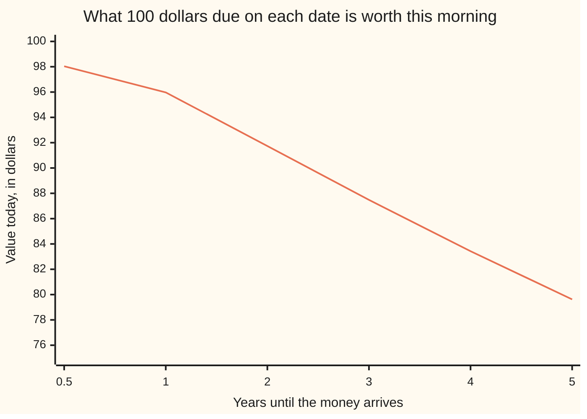
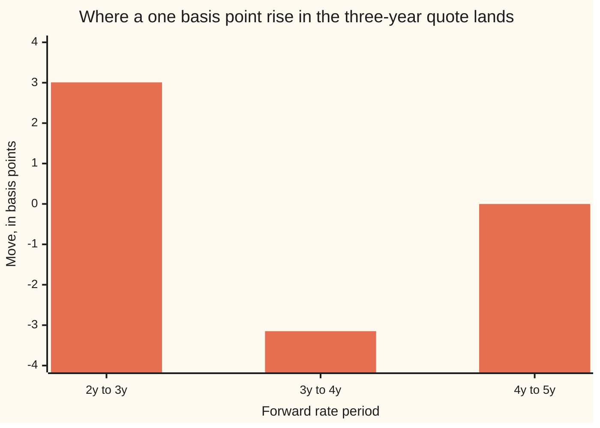

# Bootstrapping: solving for discount factors one maturity at a time

[Syllabus](../../../SYLLABUS.md) → [Financial mathematics](../../../SYLLABUS.md#w12) → [Curves](../../../SYLLABUS.md#w12-s02) → Bootstrapping

---

## General Overview

At half past eight one morning a screen carries six quotes for lending to the same borrower. Money placed for six months comes back at 4.0000 percent a year. Money placed for twelve months comes back at 4.2000 percent. Then four swap quotes, at two, three, four and five years: 4.4000, 4.5500, 4.6200 and 4.6500 percent a year. Those last four are par swap rates — the fixed coupon that makes a brand-new swap worth nothing to either side on the day it is struck ([Spot, forward and par rates](01-spot-forward-and-par-rates.md)).

A desk cannot value anything with rates in that form. What it needs is the price of a future dollar: what 100 dollars due in six months is worth this morning, and 100 dollars due in five years. Six quotes, six dates, six prices. That list is the **discount curve**, and every bond, loan and swap on the book is valued off it.

Only the two deposits name a single date each. A par swap rate does not. The five-year quote is one number covering five payments, in years one to five, so it holds five unknown prices at once. Reading each quote as the rate for its own maturity overvalues a 10,000,000 dollar five-year loan by 5,565.07 dollars on the morning it is written.

The way out is to take the quotes shortest first. The deposits hand over the six-month and one-year prices outright. The two-year swap pays in years one and two, and the one-year price is now known, so one unknown is left inside it. Solve that, and the three-year swap has one unknown left, then the four-year, then the five-year. Each quote gives up one new price, and the curve is built rung by rung out of the rungs below it. That climb is called **bootstrapping**.

**Order the quotes shortest first and every quote holds exactly one price that is not yet known, so each rung of the curve is one equation with one unknown.**

**What kind of fact this is:** a method, and an exact one — no fitting and no approximation — whenever each quote pays only on dates already solved plus one new date. Its conditions are set out in When it holds.

### The picture: what a future dollar costs this morning



The line falls because money arriving later is worth less this morning. Nothing is drawn between the marked dates: six quotes buy six prices and not one more.

---

## The formula

Notation first, in words. $D(T)$ is the discount factor for a date: what one dollar paid at time $T$, in years, costs this morning. Every swap here pays once a year, so its dates can be numbered by the year they fall in: $D_n$ is short for $D(n)$, the price of a dollar $n$ years out. A rate quoted for a period becomes money only after it is multiplied by the length of the period, and that length is the **accrual fraction** $\alpha$: half a year is $\alpha = 0.5$, a full year is $\alpha = 1$, and $\alpha_n$ is the fraction for the period ending at year $n$. A deposit's simple rate is $r$. A par swap rate is written $S_n$ — the same kind of number as the bond par rate on [Spot, forward and par rates](01-spot-forward-and-par-rates.md).

A deposit pays once, at its own maturity $T$. One dollar lent grows to $1 + \alpha r$, so the price of a dollar on that date is:

$$D(T) \;=\; \frac{1}{1 + \alpha r}$$

A par swap pays a coupon on every date in its schedule. Its equation, derived in Why it works, is:

$$S_n \, A_n \;=\; 1 - D_n, \qquad A_n \;=\; \alpha_1 D_1 + \alpha_2 D_2 + \cdots + \alpha_n D_n$$

$A_n$ is the **annuity**: the accrual-weighted discount factors added up, the cost today of one unit of coupon on every date of the schedule. Split it into the part already known and the one new term, $A_n = B_n + \alpha_n D_n$, and a single unknown is left:

$$\bigl(1 + \alpha_n S_n\bigr) D_n \;=\; 1 - S_n B_n \qquad\Longrightarrow\qquad \boxed{\;D_n \;=\; \frac{1 - S_n B_n}{1 + \alpha_n S_n}\;}$$

**Read it aloud:** take one dollar, take away what the earlier coupons already cost, and divide by one dollar plus the last coupon.

| Symbol | Plain meaning | In our example | Push it up and the answer… |
| --- | --- | --- | --- |
| $D(T)$, $D_n$ | the discount factor: what one dollar paid at time $T$ costs today | 0.79621728 at five years | — |
| $T$ | time from this morning until the money arrives, in years | 0.5, 1, 2, 3, 4, 5 | later money is worth less today |
| $n$ | the year a swap payment lands in, and the swap's own maturity | 1 to 5 here | a longer swap mixes more prices into one quote |
| $r$ | a deposit's simple interest rate, quoted per year | 4.0000 and 4.2000 percent | the deposit's rung falls |
| $S_n$ | the par swap rate: the fixed coupon making a new swap worth nothing | 4.6500 percent at five years | that rung falls |
| $\alpha_n$, $\alpha$ | the accrual fraction: how much of a year a period covers | 0.5 for the short deposit, 1 for each swap coupon | each coupon is worth more, so the rung falls further |
| $A_n$ | the annuity: the cost today of one unit of coupon on every date of a schedule | 3.586207 for the four-year schedule | a given coupon buys more, so the rung rises |
| $B_n$ | the annuity stopping one date short: the part already solved | the same 3.586207 at the five-year rung | the earlier coupons eat more of the dollar |
| $z$, $z(T)$ | the zero rate: the single continuously compounded rate with $e^{-z T} = D(T)$ | 4.5577 percent at five years | the rung falls |
| $f$ | the forward rate: the continuously compounded rate for one period between two dates | 4.6742 percent from year 4 to year 5 | the later rung falls |

Zero rates and forward rates are the same six prices read out loud; converting between the three is [Spot, forward and par rates](01-spot-forward-and-par-rates.md).

**Conventions verified 14 Sep 2026.** The accrual fractions here are fixed by hand at 0.5 and 1 so every number can be checked. Real quotes carry day-count rules that shift them by a day or two of interest, and markets differ in which rules they use; those rules are on [Money markets](03-money-market-instruments-and-sofr.md).

### When it holds

- **Each quote pays on solved dates plus one new date.** This is a property of the quote list, not of the maths. Drop the four-year swap and the five-year quote has two unknowns in it: the code prints two curves that both reprice it exactly, and nothing chooses between them.
- **The quote is in range.** The rung divides by $1 + \alpha_n S_n$, so a par rate at $-1/\alpha_n$ leaves no answer at all, and one at $1/B_n$ drives the price of a future dollar to zero. For the five-year rung that range runs from $-100.00$ percent to 27.88 percent; real quotes sit nowhere near either edge.
- **One snapshot, one curve.** The six quotes must be readings from one instant. A curve built from a four-year rate seen at 08:30 and a five-year rate seen at 09:15 reprices neither.
- **One curve doing two jobs.** This card discounts cash flows and projects floating payments off the same six prices. Since 2008 desks separate those jobs, discounting collateralised trades on an overnight-rate curve; the ladder is unchanged, but runs once per curve.
- **The quotes are tradable.** A price nobody will deal at is not an equation. The curve inherits its quality from its inputs, never from the arithmetic.

---

## Why it works

### Step 0: a quote is an equation, not a number

The temptation is to read a rate as a rate. It is more useful to read every quote as a sentence about today's prices. The six-month deposit says: *one dollar handed over this morning buys 1.02 dollars in six months.* The five-year swap says: *a coupon of 4.6500 percent for five years is worth what lending a dollar today and getting it back in five years is worth.* Both are equations whose unknowns are the prices of future dollars. Six quotes, six equations, six unknowns.

### Step 1: the deposit, one payment and one unknown

A six-month deposit at 4.0000 percent with accrual 0.5 pays back 1.020000 dollars per dollar lent. If a dollar due in six months costs $D(0.5)$, then 1.02 of them cost 1.02 times that, and it must come to the dollar that was lent: $D(0.5) = 1 \div 1.02 = 0.98039216$. The twelve-month deposit does the same with 1.042000 and gives 0.95969290. Two rungs, no ladder needed.

### Step 2: why a par swap rate is an equation in prices

A swap exchanges fixed coupons for floating ones on the same dates. The fixed side is easy: a coupon of $S_n$ per year on every date is worth $S_n A_n$ today.

The floating side looks hard and is not. The rate for the period between two dates is already pinned by the two prices around it — that is the forward rate. Multiply it by the accrual fraction to get the payment and discount it, and its value today is the price of a dollar at the start of the period minus the price of a dollar at the end. Add those along the schedule and the middle cancels, because the end of one period is the start of the next. What survives is one dollar today, less $D_n$, whatever the rates turn out to be.

A new swap is struck at the rate that makes it worth nothing to either side, so the two sides are equal: $S_n A_n = 1 - D_n$. That is the equation, and it is linear in the prices.

<details>
<summary>Why the floating side telescopes</summary>

The forward rate $f$ for the period ending at date $n$ satisfies $\alpha_n f = D_{n-1}/D_n - 1$: lending a dollar across that period must return what buying the two prices returns, or one route is free money ([Spot, forward and par rates](01-spot-forward-and-par-rates.md)). The payment arrives at date $n$, so today it is worth $\alpha_n f D_n = D_{n-1} - D_n$. Summing from the first date to the $n$-th leaves one dollar minus $D_n$. The check does not use this shortcut: it builds each floating payment from its forward rate, discounts it, and compares.

</details>

### Step 3: ordered by maturity, the equations form a staircase

Line the six equations up with the six prices as columns and the quotes as rows, shortest first. Each deposit row touches one column. The two-year swap row touches the one-year and two-year columns; the five-year row touches five. Every row's rightmost entry sits one step further right than the row above: the matrix is lower triangular.

A triangular system is the one case needing no elimination. The first row has one unknown; substitute its answer into the second, which then has one unknown, and so on. That staircase is what [Gaussian elimination](../../03-Algebra/05-Solving%20Systems/02-gaussian-elimination.md) spends its first phase manufacturing, and bootstrapping gets it free from the market's habit of quoting nested schedules. The ladder is not a trick standing beside the linear algebra; it is the linear algebra with the hard half already done.

### Step 4: one rung, one answer, and when there is none

Solving the rung is one line: expand $A_n = B_n + \alpha_n D_n$ in $S_n A_n = 1 - D_n$, gather the terms in $D_n$, divide. What deserves a moment is whether the division is legitimate and the answer is a price.

The denominator $1 + \alpha_n S_n$ is positive whenever $S_n$ exceeds $-1/\alpha_n$, and the answer is then positive exactly when $1 - S_n B_n$ is, which means $S_n$ below $1/B_n$. Inside that range there is one answer and only one, because a linear equation with a non-zero coefficient has one root. At the top edge the answer is zero — a dollar five years away costing nothing — and past it negative, which no price can be. At the bottom edge the equation reads 0 times $D_n$ = 4.586207, which no number satisfies. The check prints both edges: the five-year quote must lie between $-100.00$ percent and 27.88 percent.

<details>
<summary>Detailed proof: one positive answer, and only one</summary>

Take the rung $\bigl(1 + \alpha_n S_n\bigr) D_n = 1 - S_n B_n$ with $\alpha_n > 0$ and $B_n \ge 0$.

*At and below the bottom edge.* If $S_n \le -1/\alpha_n$ then the rate is negative and $-S_n B_n$ is at least $B_n/\alpha_n \ge 0$, so the right-hand side is at least 1. At $S_n = -1/\alpha_n$ the coefficient is zero and the equation reads 0 = something positive: no solution, and a vanishing coefficient does not admit every price at once. Below that the coefficient is negative while the right-hand side is positive, so the single root is negative and is not a price.

*Inside the range.* Above $-1/\alpha_n$ the coefficient is positive, so there is exactly one root, and it is positive exactly when $1 - S_n B_n > 0$ — which is $S_n < 1/B_n$ when $B_n > 0$, and automatic at the first rung, where $B_n$ is zero. At $S_n = 1/B_n$ the root is zero, excluded: a dollar at a future date does not cost nothing.

*Up the ladder.* The first rung is a deposit and gives one positive price whenever $1 + \alpha r > 0$. If every rung below year $n$ is solved and positive, $B_n$ is a known non-negative number and an in-range quote gives exactly one positive answer; no later equation holds an earlier price as an unknown, so nothing computed later disturbs it. The finished list is therefore the only positive list fitting every quote, and if one quote is out of range no positive list fits at all.

The argument uses only this shelf's model: certain cash flows, one currency, free lending and borrowing at the curve, no fees and no defaults.

</details>

Another road reaches the same six numbers without any ladder. Hand all six equations to Gaussian elimination with partial pivoting, rows in the wrong order on purpose, longest quote first. Pivoting shuffles them back into a staircase and back-substitution walks down it, agreeing with the ladder to twelve decimal places. That is the second road in the code.

---

## Worked numbers, by hand

The six quotes from the screen, rung by rung. The deposits have accrual 0.5 and 1; every swap coupon has accrual 1.

| Step | Arithmetic | Value |
| --- | --- | --- |
| six-month deposit | 1 ÷ (1 + 0.5 × 0.0400) | 0.98039216 |
| one-year deposit | 1 ÷ (1 + 1 × 0.0420) | 0.95969290 |
| two-year rung | (1 − 0.0440 × 0.959693) ÷ 1.044000 = 0.957774 ÷ 1.044000 | 0.91740758 |
| three-year rung | (1 − 0.0455 × 1.877100) ÷ 1.045500 = 0.914592 ÷ 1.045500 | 0.87478903 |
| four-year rung | (1 − 0.0462 × 2.751890) ÷ 1.046200 = 0.872863 ÷ 1.046200 | 0.83431725 |
| five-year rung | (1 − 0.0465 × 3.586207) ÷ 1.046500 = 0.833241 ÷ 1.046500 | **0.79621728** |

The second number in each swap row is the annuity already solved: 0.959693 is the one-year price alone, 1.877100 adds the two-year price, and so on up to 3.586207. A dollar due in five years costs a shade under 80 cents.

The same six numbers, read as rates, are what a trading screen shows.

| Years | Price of a dollar | Zero rate | Forward rate over the period |
| --- | --- | --- | --- |
| 0.5 | 0.98039216 | 3.9605 percent | 3.9605 percent |
| 1 | 0.95969290 | 4.1142 percent | 4.2679 percent |
| 2 | 0.91740758 | 4.3102 percent | 4.5061 percent |
| 3 | 0.87478903 | 4.4591 percent | 4.7569 percent |
| 4 | 0.83431725 | 4.5285 percent | 4.7369 percent |
| 5 | 0.79621728 | 4.5577 percent | 4.6742 percent |

Two things are worth reading off it. The six-month deposit was quoted at 4.0000 percent and its zero rate is 3.9605 percent: the same money, once as simple interest over half a year and once continuously compounded. And after the first period, which starts today and so just repeats the zero rate, every forward rate sits above the zero rate for its end date, which is what a rising curve looks like from the inside — later years are lent at more than the average so far.

### What breaks if you drop a piece

Each wrong curve below keeps the two deposits and rebuilds the four swap rungs the wrong way. The last column prices a 10,000,000 dollar five-year loan paying 4.6500 percent a year — worth exactly its face value on the right curve, since 4.6500 percent is the five-year par rate.

| Mistake | The five-year price comes out at | The loan prices at |
| --- | --- | --- |
| Each par rate read as a zero rate for its own maturity | 0.79671655 | 10,005,565.07 dollars: 5,565.07 dollars of profit that is not there |
| The earlier coupons forgotten, dividing 1 by 1.046500 | 0.95556617 | 11,780,888.45 dollars, out by 1,780,888.45 |
| Simple interest for five years, 1 ÷ (1 + 5 × 0.0465) | 0.81135903 | 10,166,141.32 dollars, out by 166,141.32 |

The code prints all three.

---

## How the curve moves when one quote moves

A curve is not a fact about the world; it is a photograph of a screen, rebuilt every few seconds on a live desk. The question is where a move lands.

At 08:31 the three-year quote ticks up one basis point, from 4.5500 to 4.5600 percent. A basis point is a hundredth of a percentage point, the unit rates are traded in. Every other quote holds still.

| Pillar | Zero rate this morning | Move, in basis points |
| --- | --- | --- |
| 0.5 years | 3.9605 percent | +0.0000 |
| 1 year | 4.1142 percent | +0.0000 |
| 2 years | 4.3102 percent | +0.0000 |
| 3 years | 4.4591 percent | +1.0030 |
| 4 years | 4.5285 percent | -0.0348 |
| 5 years | 4.5577 percent | -0.0281 |

Two facts, both consequences of the staircase. Nothing below three years moves: those rungs were solved before the three-year quote was read, and no later equation reaches back down. And the rungs above move the *wrong* way — down, when the quote went up. The four-year swap's own quote has not changed, so its equation must still hold; its three-year coupon is now worth slightly less, so the four-year price must rise to make up the difference, which is a small fall in the four-year zero rate.

```
zero rate moves after a one basis point rise in the three-year quote, one bar per 0.025 basis points
   0.5y                                            +0.0000
     1y                                            +0.0000
     2y                                            +0.0000
     3y  ████████████████████████████████████████  +1.0030
     4y  █                                         -0.0348
     5y  █                                         -0.0281
```

The bars show the size of each move; the sign is printed beside it. The same event in forward rates is where it really lives.



Three bars, one per period whose forward rate changed. The third year's forward rate rises 3.0090 basis points, the fourth year's falls 3.1483, and the fifth barely stirs at -0.0011. A one basis point nudge to a par rate is a three basis point see-saw in the forward rates on either side of that date, because a par rate is an average over a schedule and an average moves only if the pieces move more. This is why desks hedge in forward rates, and why the shape of a curve between its pillars is a subject of its own: [Between the pillars](05-curve-interpolation-and-shape.md).

---

## Code, from first principles, and it actually runs

Nothing is imported that already knows an answer: the bisection and the Gaussian elimination are both written out in the file. The six prices are reached three independent ways — the ladder, one rung at a time; the same six equations handed to elimination all at once, rows fed backwards so the pivoting has to find the staircase itself; and a numerical hunt that ignores the algebra and looks for the price at which a swap's two legs, built payment by payment from the forward rates, are worth the same. A fourth pass is the one that matters on a desk: value every quote on the finished curve out of the cash flows the contract actually pays. Then the edges of the five-year rung, the three wrong curves, the bump, and the two curves that both fit when a quote goes missing.

### Python

```python
# Bootstrapping the discount curve -- the check behind the card.  Standard library
# only; nothing imported that already knows an answer.  Six quotes from one morning,
# two deposits and four par swaps, become six discount factors by three independent
# roads; the finished curve is then made to reprice every quote it was built from,
# out of the cash flows the contracts actually pay.
from math import log

DEPOSITS = ((0.5, 0.0400), (1.0, 0.0420))     # (maturity in years, simple rate)
SWAPS = ((2, 0.0440), (3, 0.0455), (4, 0.0462), (5, 0.0465))   # (years, par rate)
DATES = (0.5, 1.0, 2.0, 3.0, 4.0, 5.0)        # the six pillar dates, in years
PAIRS = tuple(zip((0.0,) + DATES[:-1], DATES))  # the periods between pillars
LOAN = 10_000_000.0                           # a round notional, to price in dollars

def ladder(swaps=SWAPS):                      # road 1: one maturity at a time
    D = {T: 1.0 / (1.0 + T * r) for T, r in DEPOSITS}
    for n, S in swaps:
        B = sum(D[float(j)] for j in range(1, n))      # the earlier coupons, funded
        D[float(n)] = (1.0 - S * B) / (1.0 + S)
    return D

def solve(rows, rhs):                         # Gaussian elimination, partial pivoting
    n = len(rhs)
    M = [rows[i][:] + [rhs[i]] for i in range(n)]
    for c in range(n):
        p = max(range(c, n), key=lambda i: abs(M[i][c]))
        M[c], M[p] = M[p], M[c]
        for i in range(c + 1, n):
            f = M[i][c] / M[c][c]
            M[i] = [M[i][j] - f * M[c][j] for j in range(n + 1)]
    x = [0.0] * n
    for i in range(n - 1, -1, -1):
        x[i] = (M[i][n] - sum(M[i][j] * x[j] for j in range(i + 1, n))) / M[i][i]
    return x

def by_elimination():                         # road 2: all six equations at once
    rows, rhs = [], []
    for n, S in reversed(SWAPS):              # longest first: pivoting must do real work
        row = [0.0] * 6
        for j in range(1, n + 1):
            row[DATES.index(float(j))] = S + (1.0 if j == n else 0.0)
        rows.append(row); rhs.append(1.0)
    for T, r in reversed(DEPOSITS):
        row = [0.0] * 6
        row[DATES.index(T)] = 1.0 + T * r
        rows.append(row); rhs.append(1.0)
    return dict(zip(DATES, solve(rows, rhs)))

def legs(D, n, S):                            # what the swap actually pays, leg by leg
    floating = fixed = 0.0
    prev = 1.0                                # one dollar today is worth one dollar
    for j in range(1, n + 1):
        d = D[float(j)]
        floating += (prev / d - 1.0) * d      # this year's forward rate, times this year
        fixed += S * d
        prev = d
    return floating, fixed

def by_bisection():                           # road 3: hunt each pillar numerically
    D = {T: 1.0 / (1.0 + T * r) for T, r in DEPOSITS}
    for n, S in SWAPS:
        lo, hi = 1e-9, 1.0
        for _ in range(200):
            mid = 0.5 * (lo + hi)
            D[float(n)] = mid
            lo, hi = (mid, hi) if legs(D, n, S)[0] - legs(D, n, S)[1] > 0.0 else (lo, mid)
        D[float(n)] = 0.5 * (lo + hi)
    return D

def zero(D, T): return -log(D[T]) / T         # continuously compounded zero rate
def fwd(D, a, b): return (log(D[a] / D[b]) if a else -log(D[b])) / (b - a)
def loan(D, S, n): return LOAN * (S * sum(D[float(j)] for j in range(1, n + 1)) + D[float(n)])

D, E, Z = ladder(), by_elimination(), by_bisection()
gap_e = max(abs(D[T] - E[T]) for T in DATES)
gap_z = max(abs(D[T] - Z[T]) for T in DATES)
print("Six quotes on one morning; accruals 0.5 and 1.0 exactly, one year per swap coupon")
print(f"{'quote':<13}{'rate %':>8}{'T':>6}{'B_n':>11}{'1 - S_n B_n':>13}{'1 + a_n S_n':>13}{'D(T)':>13}")
for T, r in DEPOSITS:
    print(f"{'deposit ' + f'{T:g}y':<13}{100 * r:>8.4f}{T:>6.1f}{0.0:>11.6f}{1.0:>13.6f}"
          f"{1.0 + T * r:>13.6f}{D[T]:>13.8f}")
for n, S in SWAPS:
    B = sum(D[float(j)] for j in range(1, n))
    print(f"{'par swap ' + f'{n}y':<13}{100 * S:>8.4f}{float(n):>6.1f}{B:>11.6f}{1.0 - S * B:>13.6f}"
          f"{1.0 + S:>13.6f}{D[float(n)]:>13.8f}")
print(f"\n{'T':>5}{'D(T)':>13}{'$100 due then':>15}{'zero rate %':>13}{'forward rate %':>16}")
for a, b in PAIRS:
    print(f"{b:>5.1f}{D[b]:>13.8f}{100 * D[b]:>15.2f}{100 * zero(D, b):>13.4f}{100 * fwd(D, a, b):>16.4f}")
print(f"\nroad 2, elimination on the 6 by 6 system, rows fed longest first: largest gap {gap_e:.12f}")
print(f"road 3, bisection against the legs the swaps actually pay: largest gap {gap_z:.12f}")
worst_dep = max(abs((1.0 + T * r) * D[T] - 1.0) for T, r in DEPOSITS)
worst_par = max(abs(legs(D, n, S)[0] / sum(D[float(j)] for j in range(1, n + 1)) - S) for n, S in SWAPS)
worst_val = max(abs(LOAN * (legs(D, n, S)[0] - legs(D, n, S)[1])) for n, S in SWAPS)
print(f"road 4, reprice: deposits come back to within {worst_dep:.12f} of a dollar per dollar lent, "
      f"par rates to within {worst_par:.12f},")
print(f"         and every input swap values at zero: the worst is ${worst_val:.6f} on $10,000,000")
B5 = sum(D[float(j)] for j in range(1, 5))
print(f"\nthe 5-year rung: B_5 = {B5:.6f}, so a positive D(5) needs a 5-year quote between "
      f"{-100.0:.2f}% and {100.0 / B5:.2f}%")
print(f"at {100.0 / B5:.2f}% the rung returns D(5) = {0.0:.2f}; at {-100.0:.2f}% it reads "
      f"0 x D(5) = {1.0 + B5:.6f}, which no number solves")
wrong = {"par rate read as a zero rate": {float(n): 1.0 / (1.0 + S) ** n for n, S in SWAPS},
         "earlier coupons forgotten": {float(n): 1.0 / (1.0 + S) for n, S in SWAPS},
         "simple interest for n years": {float(n): 1.0 / (1.0 + n * S) for n, S in SWAPS}}
print(f"\n{'the 5-year pillar, built this way':<34}{'D(5)':>13}"
      f"{'a $10,000,000 5-year loan at 4.6500% prices at':>48}{'off by':>13}")
print(f"{'bootstrapped, the right answer':<34}{D[5.0]:>13.8f}{loan(D, 0.0465, 5):>48,.2f}"
      f"{loan(D, 0.0465, 5) - LOAN:>13,.2f}")
for name, curve in wrong.items():
    curve.update({T: D[T] for T, _ in DEPOSITS})
    print(f"{name:<34}{curve[5.0]:>13.8f}{loan(curve, 0.0465, 5):>48,.2f}"
          f"{loan(curve, 0.0465, 5) - LOAN:>13,.2f}")
bumped = ladder(tuple((n, S + 0.0001 if n == 3 else S) for n, S in SWAPS))
print("\nthe 3-year quote ticks up one basis point; every other quote on the screen holds still")
print("  pillar zero rates move, in basis points: " +
      ", ".join(f"{T:g}y {10000.0 * (zero(bumped, T) - zero(D, T)):+.4f}" for T in DATES))
print("  forward rates move, in basis points:     " +
      ", ".join(f"{a:g}y-{b:g}y {10000.0 * (fwd(bumped, a, b) - fwd(D, a, b)):+.4f}" for a, b in PAIRS[3:]))
alt4 = D[3.0]                                  # a flat guess where the 4-year quote should be
alt5 = (1.0 - 0.0465 * (D[1.0] + D[2.0] + D[3.0] + alt4)) / 1.0465
print(f"\ndrop the 4-year quote and the 5-year swap holds two unknowns: D(4) = {D[4.0]:.8f} with "
      f"D(5) = {D[5.0]:.8f} reprices it")
print(f"and so does D(4) = {alt4:.8f} with D(5) = {alt5:.8f}")
print(f"the 4y-5y forward rate is {100 * fwd(D, 4.0, 5.0):.4f}% on the first pair, "
      f"{100 * log(alt4 / alt5):.4f}% on the second")
print(f"\n{'chart, T':<26}" + "".join(f"{T:>8.1f}" for T in DATES))
print(f"{'chart, $100 due at T':<26}" + "".join(f"{100 * D[T]:>8.2f}" for T in DATES))
assert gap_e < 1e-12, "the ladder and the 6 by 6 solve must land on the same six numbers"
assert gap_z < 1e-9, "the ladder and the numerical hunt must land on the same six numbers"
assert worst_par < 1e-12, "the curve must hand back every par rate it was built from"
assert worst_val < 1e-6, "every input swap must value at zero on its own curve"
assert all(D[DATES[i]] > D[DATES[i + 1]] for i in range(5)), "discount factors must fall with time"
assert all(fwd(D, a, b) > zero(D, b) for a, b in PAIRS[1:]), "forwards sit above zeros on a rising curve"
assert abs(loan(wrong["par rate read as a zero rate"], 0.0465, 5) - LOAN) > 1000.0, "the mistake costs real money"
print("ALL CHECKS PASS")
```

**Ran 2026-09-14 on macOS, Python 3.14.6, standard library only. All checks passed. Output, pasted from the run:**

```
Six quotes on one morning; accruals 0.5 and 1.0 exactly, one year per swap coupon
quote          rate %     T        B_n  1 - S_n B_n  1 + a_n S_n         D(T)
deposit 0.5y   4.0000   0.5   0.000000     1.000000     1.020000   0.98039216
deposit 1y     4.2000   1.0   0.000000     1.000000     1.042000   0.95969290
par swap 2y    4.4000   2.0   0.959693     0.957774     1.044000   0.91740758
par swap 3y    4.5500   3.0   1.877100     0.914592     1.045500   0.87478903
par swap 4y    4.6200   4.0   2.751890     0.872863     1.046200   0.83431725
par swap 5y    4.6500   5.0   3.586207     0.833241     1.046500   0.79621728

    T         D(T)  $100 due then  zero rate %  forward rate %
  0.5   0.98039216          98.04       3.9605          3.9605
  1.0   0.95969290          95.97       4.1142          4.2679
  2.0   0.91740758          91.74       4.3102          4.5061
  3.0   0.87478903          87.48       4.4591          4.7569
  4.0   0.83431725          83.43       4.5285          4.7369
  5.0   0.79621728          79.62       4.5577          4.6742

road 2, elimination on the 6 by 6 system, rows fed longest first: largest gap 0.000000000000
road 3, bisection against the legs the swaps actually pay: largest gap 0.000000000000
road 4, reprice: deposits come back to within 0.000000000000 of a dollar per dollar lent, par rates to within 0.000000000000,
         and every input swap values at zero: the worst is $0.000000 on $10,000,000

the 5-year rung: B_5 = 3.586207, so a positive D(5) needs a 5-year quote between -100.00% and 27.88%
at 27.88% the rung returns D(5) = 0.00; at -100.00% it reads 0 x D(5) = 4.586207, which no number solves

the 5-year pillar, built this way          D(5)  a $10,000,000 5-year loan at 4.6500% prices at       off by
bootstrapped, the right answer       0.79621728                                   10,000,000.00         0.00
par rate read as a zero rate         0.79671655                                   10,005,565.07     5,565.07
earlier coupons forgotten            0.95556617                                   11,780,888.45 1,780,888.45
simple interest for n years          0.81135903                                   10,166,141.32   166,141.32

the 3-year quote ticks up one basis point; every other quote on the screen holds still
  pillar zero rates move, in basis points: 0.5y +0.0000, 1y +0.0000, 2y +0.0000, 3y +1.0030, 4y -0.0348, 5y -0.0281
  forward rates move, in basis points:     2y-3y +3.0090, 3y-4y -3.1483, 4y-5y -0.0011

drop the 4-year quote and the 5-year swap holds two unknowns: D(4) = 0.83431725 with D(5) = 0.79621728 reprices it
and so does D(4) = 0.87478903 with D(5) = 0.79441897
the 4y-5y forward rate is 4.6742% on the first pair, 9.6372% on the second

chart, T                       0.5     1.0     2.0     3.0     4.0     5.0
chart, $100 due at T         98.04   95.97   91.74   87.48   83.43   79.62
ALL CHECKS PASS
```

### Rust

Same numbers, same labels, built with `rustc --edition 2021 -O`. A curve is an array of six numbers here rather than a lookup by date, and the thousands separators are written out by hand, because Rust's formatter has none.

```rust
// Bootstrapping the discount curve -- the same check as the Python, in Rust.  No crates.
// Six quotes from one morning, two deposits and four par swaps, become six discount
// factors by three independent roads; the finished curve is then made to reprice every
// quote it was built from, out of the cash flows the contracts actually pay.  A curve is
// six numbers: slot 0 is the 0.5-year pillar and slot j the j-year pillar.
const DEPOSITS: [(f64, f64); 2] = [(0.5, 0.0400), (1.0, 0.0420)];   // (years, simple rate)
const SWAPS: [(usize, f64); 4] = [(2, 0.0440), (3, 0.0455), (4, 0.0462), (5, 0.0465)];
const DATES: [f64; 6] = [0.5, 1.0, 2.0, 3.0, 4.0, 5.0];             // the six pillar dates
const PAIRS: [(f64, f64); 6] = [(0.0, 0.5), (0.5, 1.0), (1.0, 2.0), (2.0, 3.0), (3.0, 4.0), (4.0, 5.0)];
const LOAN: f64 = 10_000_000.0;                                     // a round notional

fn money(x: f64) -> String {                  // Python's {:,.2f}: thousands, two decimals
    let s = format!("{:.2}", x);
    let (int, dec) = s.split_once('.').unwrap();
    let mut out = String::new();
    for (i, c) in int.chars().enumerate() {
        if i > 0 && (int.len() - i) % 3 == 0 { out.push(',') } out.push(c);
    }
    format!("{}.{}", out, dec)
}
fn g(x: f64) -> String {                      // Python's {:g} on these numbers: 0.5, 1, 2
    if x.fract() == 0.0 { format!("{}", x as i64) } else { format!("{}", x) }
}
fn slot(t: f64) -> usize { DATES.iter().position(|&x| x == t).unwrap() }
fn zero(d: &[f64; 6], t: f64) -> f64 { -d[slot(t)].ln() / t }       // continuous zero rate
fn fwd(d: &[f64; 6], a: f64, b: f64) -> f64 {
    (if a > 0.0 { (d[slot(a)] / d[slot(b)]).ln() } else { -d[slot(b)].ln() }) / (b - a)
}
fn loan(d: &[f64; 6], s: f64, n: usize) -> f64 {
    LOAN * ((1..n + 1).map(|j| s * d[j]).sum::<f64>() + d[n])
}
fn deposits_only() -> [f64; 6] {
    let mut d = [0.0_f64; 6];
    for (i, &(t, r)) in DEPOSITS.iter().enumerate() { d[i] = 1.0 / (1.0 + t * r) }
    d
}

fn ladder(swaps: &[(usize, f64); 4]) -> [f64; 6] {     // road 1: one maturity at a time
    let mut d = deposits_only();
    for &(n, s) in swaps {
        let b: f64 = (1..n).map(|j| d[j]).sum();       // the earlier coupons, funded
        d[n] = (1.0 - s * b) / (1.0 + s);
    }
    d
}

fn by_elimination() -> [f64; 6] {             // road 2: all six equations at once
    let mut rows: Vec<[f64; 7]> = Vec::new();
    for &(n, s) in SWAPS.iter().rev() {       // longest first: pivoting must do real work
        let mut row = [0.0_f64; 7];
        for j in 1..n + 1 { row[j] = s + if j == n { 1.0 } else { 0.0 } }
        row[6] = 1.0; rows.push(row);
    }
    for (i, &(t, r)) in DEPOSITS.iter().enumerate().rev() {
        let mut row = [0.0_f64; 7];
        row[i] = 1.0 + t * r;
        row[6] = 1.0; rows.push(row);
    }
    let n = rows.len();
    for c in 0..n {                           // Gaussian elimination, partial pivoting
        let mut p = c;
        for i in c..n { if rows[i][c].abs() > rows[p][c].abs() { p = i } }
        rows.swap(c, p);
        for i in c + 1..n {
            let f = rows[i][c] / rows[c][c];
            for j in c..n + 1 { rows[i][j] -= f * rows[c][j] }
        }
    }
    let mut x = [0.0_f64; 6];
    for i in (0..n).rev() {
        let mut acc = rows[i][n];
        for j in i + 1..n { acc -= rows[i][j] * x[j] }
        x[i] = acc / rows[i][i];
    }
    x
}

fn legs(d: &[f64; 6], n: usize, s: f64) -> (f64, f64) {   // what the swap actually pays
    let (mut floating, mut fixed, mut prev) = (0.0_f64, 0.0_f64, 1.0_f64);
    for j in 1..n + 1 {
        floating += (prev / d[j] - 1.0) * d[j];  // this year's forward rate, times this year
        fixed += s * d[j];
        prev = d[j];
    }
    (floating, fixed)
}

fn by_bisection() -> [f64; 6] {               // road 3: hunt each pillar numerically
    let mut d = deposits_only();
    for &(n, s) in SWAPS.iter() {
        let (mut lo, mut hi) = (1e-9_f64, 1.0_f64);
        for _ in 0..200 {
            let mid = 0.5 * (lo + hi);
            d[n] = mid;
            if legs(&d, n, s).0 - legs(&d, n, s).1 > 0.0 { lo = mid } else { hi = mid }
        }
        d[n] = 0.5 * (lo + hi);
    }
    d
}

fn main() {
    let (d, e, z) = (ladder(&SWAPS), by_elimination(), by_bisection());
    let gap_e = (0..6).map(|i| (d[i] - e[i]).abs()).fold(0.0_f64, f64::max);
    let gap_z = (0..6).map(|i| (d[i] - z[i]).abs()).fold(0.0_f64, f64::max);
    println!("Six quotes on one morning; accruals 0.5 and 1.0 exactly, one year per swap coupon");
    println!("{:<13}{:>8}{:>6}{:>11}{:>13}{:>13}{:>13}", "quote", "rate %", "T", "B_n", "1 - S_n B_n", "1 + a_n S_n", "D(T)");
    for (i, &(t, r)) in DEPOSITS.iter().enumerate() {
        println!("{:<13}{:>8.4}{:>6.1}{:>11.6}{:>13.6}{:>13.6}{:>13.8}", format!("deposit {}y", g(t)), 100.0 * r, t, 0.0, 1.0, 1.0 + t * r, d[i]);
    }
    for &(n, s) in SWAPS.iter() {
        let b: f64 = (1..n).map(|j| d[j]).sum();
        println!("{:<13}{:>8.4}{:>6.1}{:>11.6}{:>13.6}{:>13.6}{:>13.8}", format!("par swap {}y", n), 100.0 * s, n as f64, b, 1.0 - s * b, 1.0 + s, d[n]);
    }
    println!("\n{:>5}{:>13}{:>15}{:>13}{:>16}", "T", "D(T)", "$100 due then", "zero rate %", "forward rate %");
    for &(a, b) in PAIRS.iter() {
        println!("{:>5.1}{:>13.8}{:>15.2}{:>13.4}{:>16.4}", b, d[slot(b)], 100.0 * d[slot(b)], 100.0 * zero(&d, b), 100.0 * fwd(&d, a, b));
    }
    println!("\nroad 2, elimination on the 6 by 6 system, rows fed longest first: largest gap {:.12}", gap_e);
    println!("road 3, bisection against the legs the swaps actually pay: largest gap {:.12}", gap_z);
    let worst_dep = DEPOSITS.iter().map(|&(t, r)| ((1.0 + t * r) * d[slot(t)] - 1.0).abs()).fold(0.0_f64, f64::max);
    let worst_par = SWAPS.iter().map(|&(n, s)| (legs(&d, n, s).0 / (1..n + 1).map(|j| d[j]).sum::<f64>() - s).abs()).fold(0.0_f64, f64::max);
    let worst_val = SWAPS.iter().map(|&(n, s)| (LOAN * (legs(&d, n, s).0 - legs(&d, n, s).1)).abs()).fold(0.0_f64, f64::max);
    println!("road 4, reprice: deposits come back to within {:.12} of a dollar per dollar lent, par rates to within {:.12},", worst_dep, worst_par);
    println!("         and every input swap values at zero: the worst is ${:.6} on $10,000,000", worst_val);
    let b5: f64 = (1..5).map(|j| d[j]).sum();
    println!("\nthe 5-year rung: B_5 = {:.6}, so a positive D(5) needs a 5-year quote between {:.2}% and {:.2}%", b5, -100.0, 100.0 / b5);
    println!("at {:.2}% the rung returns D(5) = {:.2}; at {:.2}% it reads 0 x D(5) = {:.6}, which no number solves", 100.0 / b5, 0.0, -100.0, 1.0 + b5);
    let names = ["par rate read as a zero rate", "earlier coupons forgotten", "simple interest for n years"];
    let wrong: Vec<[f64; 6]> = (0..3).map(|rule| {
        let mut c = d;                        // the deposits stay right on every wrong curve
        for &(n, s) in SWAPS.iter() {
            c[n] = match rule { 0 => 1.0 / (1.0 + s).powf(n as f64), 1 => 1.0 / (1.0 + s), _ => 1.0 / (1.0 + n as f64 * s) };
        }
        c
    }).collect();
    println!("\n{:<34}{:>13}{:>48}{:>13}", "the 5-year pillar, built this way", "D(5)", "a $10,000,000 5-year loan at 4.6500% prices at", "off by");
    println!("{:<34}{:>13.8}{:>48}{:>13}", "bootstrapped, the right answer", d[5], money(loan(&d, 0.0465, 5)), money(loan(&d, 0.0465, 5) - LOAN));
    for (name, c) in names.iter().zip(wrong.iter()) {
        println!("{:<34}{:>13.8}{:>48}{:>13}", name, c[5], money(loan(c, 0.0465, 5)), money(loan(c, 0.0465, 5) - LOAN));
    }
    let mut quotes = SWAPS;
    for q in quotes.iter_mut() { if q.0 == 3 { q.1 += 0.0001 } }
    let bumped = ladder(&quotes);
    println!("\nthe 3-year quote ticks up one basis point; every other quote on the screen holds still");
    println!("  pillar zero rates move, in basis points: {}", DATES.iter()
        .map(|&t| format!("{}y {:+.4}", g(t), 10000.0 * (zero(&bumped, t) - zero(&d, t)))).collect::<Vec<String>>().join(", "));
    println!("  forward rates move, in basis points:     {}", PAIRS[3..].iter()
        .map(|&(a, b)| format!("{}y-{}y {:+.4}", g(a), g(b), 10000.0 * (fwd(&bumped, a, b) - fwd(&d, a, b)))).collect::<Vec<String>>().join(", "));
    let alt4 = d[3];                          // a flat guess where the 4-year quote should be
    let alt5 = (1.0 - 0.0465 * (d[1] + d[2] + d[3] + alt4)) / 1.0465;
    println!("\ndrop the 4-year quote and the 5-year swap holds two unknowns: D(4) = {:.8} with D(5) = {:.8} reprices it", d[4], d[5]);
    println!("and so does D(4) = {:.8} with D(5) = {:.8}", alt4, alt5);
    println!("the 4y-5y forward rate is {:.4}% on the first pair, {:.4}% on the second", 100.0 * fwd(&d, 4.0, 5.0), 100.0 * (alt4 / alt5).ln());
    let cells = |vals: Vec<f64>, dp: usize| vals.iter()
        .map(|v| if dp == 1 { format!("{:>8.1}", v) } else { format!("{:>8.2}", v) }).collect::<Vec<String>>().join("");
    println!("\n{:<26}{}", "chart, T", cells(DATES.to_vec(), 1));
    println!("{:<26}{}", "chart, $100 due at T", cells(DATES.iter().map(|&t| 100.0 * d[slot(t)]).collect(), 2));
    assert!(gap_e < 1e-12, "the ladder and the 6 by 6 solve must land on the same six numbers");
    assert!(gap_z < 1e-9, "the ladder and the numerical hunt must land on the same six numbers");
    assert!(worst_par < 1e-12, "the curve must hand back every par rate it was built from");
    assert!(worst_val < 1e-6, "every input swap must value at zero on its own curve");
    assert!((0..5).all(|i| d[slot(DATES[i])] > d[slot(DATES[i + 1])]), "discount factors must fall with time");
    assert!(PAIRS[1..].iter().all(|&(a, b)| fwd(&d, a, b) > zero(&d, b)), "forwards sit above zeros on a rising curve");
    assert!((loan(&wrong[0], 0.0465, 5) - LOAN).abs() > 1000.0, "the mistake costs real money");
    println!("ALL CHECKS PASS");
}
```

**Ran 2026-09-14 on macOS, rustc 1.98.1, no crates. All checks passed. Output, pasted from the run:**

```
Six quotes on one morning; accruals 0.5 and 1.0 exactly, one year per swap coupon
quote          rate %     T        B_n  1 - S_n B_n  1 + a_n S_n         D(T)
deposit 0.5y   4.0000   0.5   0.000000     1.000000     1.020000   0.98039216
deposit 1y     4.2000   1.0   0.000000     1.000000     1.042000   0.95969290
par swap 2y    4.4000   2.0   0.959693     0.957774     1.044000   0.91740758
par swap 3y    4.5500   3.0   1.877100     0.914592     1.045500   0.87478903
par swap 4y    4.6200   4.0   2.751890     0.872863     1.046200   0.83431725
par swap 5y    4.6500   5.0   3.586207     0.833241     1.046500   0.79621728

    T         D(T)  $100 due then  zero rate %  forward rate %
  0.5   0.98039216          98.04       3.9605          3.9605
  1.0   0.95969290          95.97       4.1142          4.2679
  2.0   0.91740758          91.74       4.3102          4.5061
  3.0   0.87478903          87.48       4.4591          4.7569
  4.0   0.83431725          83.43       4.5285          4.7369
  5.0   0.79621728          79.62       4.5577          4.6742

road 2, elimination on the 6 by 6 system, rows fed longest first: largest gap 0.000000000000
road 3, bisection against the legs the swaps actually pay: largest gap 0.000000000000
road 4, reprice: deposits come back to within 0.000000000000 of a dollar per dollar lent, par rates to within 0.000000000000,
         and every input swap values at zero: the worst is $0.000000 on $10,000,000

the 5-year rung: B_5 = 3.586207, so a positive D(5) needs a 5-year quote between -100.00% and 27.88%
at 27.88% the rung returns D(5) = 0.00; at -100.00% it reads 0 x D(5) = 4.586207, which no number solves

the 5-year pillar, built this way          D(5)  a $10,000,000 5-year loan at 4.6500% prices at       off by
bootstrapped, the right answer       0.79621728                                   10,000,000.00         0.00
par rate read as a zero rate         0.79671655                                   10,005,565.07     5,565.07
earlier coupons forgotten            0.95556617                                   11,780,888.45 1,780,888.45
simple interest for n years          0.81135903                                   10,166,141.32   166,141.32

the 3-year quote ticks up one basis point; every other quote on the screen holds still
  pillar zero rates move, in basis points: 0.5y +0.0000, 1y +0.0000, 2y +0.0000, 3y +1.0030, 4y -0.0348, 5y -0.0281
  forward rates move, in basis points:     2y-3y +3.0090, 3y-4y -3.1483, 4y-5y -0.0011

drop the 4-year quote and the 5-year swap holds two unknowns: D(4) = 0.83431725 with D(5) = 0.79621728 reprices it
and so does D(4) = 0.87478903 with D(5) = 0.79441897
the 4y-5y forward rate is 4.6742% on the first pair, 9.6372% on the second

chart, T                       0.5     1.0     2.0     3.0     4.0     5.0
chart, $100 due at T         98.04   95.97   91.74   87.48   83.43   79.62
ALL CHECKS PASS
```

The two outputs match line for line.

> [!TIP]
> **Try changing**
> Guess first, then run it. Two of these stop the program outright; the other two rebuild the curve and still pass every assert.
> - **Feed the quotes longest first.** Reverse `SWAPS`. The five-year rung is solved first, asks for a two-year price nobody has solved yet, and the program stops on the missing key. Order is not a convenience here; it is the method.
> - **Move the three-year quote.** Set the 3-year entry of `SWAPS` to `0.0456`. The three-year zero rate climbs 1.0030 basis points, the four-year falls 0.0348, and everything shorter is untouched.
> - **Push the five-year quote to the edge.** Set the 5-year entry to `0.2788`. The five-year price collapses to 0.00012946, a hundredth of a cent per 100 dollars, and its zero rate jumps to 179.0423 percent. Every assert still passes: the edge is where the answer stops being a sane price, not where the arithmetic breaks.
> - **Drop the four-year quote.** Delete the `(4, 0.0462)` entry. The ladder cannot reach the five-year rung and the program stops. The last block of the run above shows what is left: 0.83431725 with 0.79621728, or 0.87478903 with 0.79441897, both repricing the five-year swap exactly.

---

## The usual mistake

> [!warning]
> **Reading a swap rate as the rate for five-year money.** A par swap rate is a coupon paid on every date of a schedule, an average of the curve weighted by when the money moves. The rate for one dollar on one date is the zero rate, 4.5577 percent here, not the 4.6500 percent quote. Discounting with the quote gives 0.79671655 instead of 0.79621728, and doing that at every maturity prices a 10,000,000 dollar loan at 10,005,565.07 dollars instead of 10,000,000.00.
>
> - **Forgetting what the earlier coupons already cost.** The rung is $1 - S_n B_n$ over $1 + \alpha_n S_n$, not 1 over $1 + S_n$. Dropping $B_n$ gives 0.95556617 and a loan worth 11,780,888.45 dollars instead of face value. The deposit formula, which has no $B_n$, looks just similar enough to invite it.
> - **Bootstrapping through a hole.** A missing maturity does not give a slightly worse curve; it gives no curve. Two pairs of four- and five-year prices fit the same quote exactly and disagree about the fifth year's forward rate by five percentage points: 4.6742 percent against 9.6372 percent.
> - **Believing the curve between the pillars.** Six quotes buy six prices. A discount factor for two and a half years is a choice made by whoever wrote the interpolation, not a fact read off the market.
> - **Quoting a curve without repricing its inputs.** A bootstrap that will not hand its own quotes back is broken, and the test costs one line. Desk systems run it on every build.

---

## Where you meet it in real life

- **Every valuation on a fixed-income book.** Bonds, loans, swaps and their collateral are valued by multiplying cash flows by discount factors, and those factors came from a bootstrap run this morning.
- **The floating side of a swap.** The forward rates this curve implies are the payments a swap is assumed to make, which is why the same six numbers both project and discount: [Interest rate swaps](../28-Swaps/01-interest-rate-swaps.md).
- **The short end of the curve.** Deposits, futures and overnight-rate instruments fill the first year or two, each with its own quoting convention: [Money markets](03-money-market-instruments-and-sofr.md). A rate locked in for one future period is a forward rate agreement: [Forward rate agreements](02-forward-rate-agreements.md).
- **Measuring a bond against the curve.** The constant spread that makes a bond's own price come out right is its z-spread: [Spreads over the curve](06-z-spread-and-asset-swap-spread.md).
- **Credit, with the same ladder.** Credit default swap spreads at one, three, five and ten years are stripped into survival probabilities one maturity at a time, by the same argument: [Bootstrapping a hazard curve](../42-Credit%20Default%20Swaps%20-%20Pricing%2C%20the%20Par%20Spread%20and%20the%20Hazard%20Behind%20It/06-bootstrapping-the-hazard-curve-from-cds-quotes.md).
- **Central bank publications.** The zero-coupon curves central banks publish are built from market quotes this way, with a fitted shape where quotes are sparse.

> **Say it back**
> A screen quotes rates; a valuation needs the price of a dollar on each future date. A deposit names one date and gives its price outright. A par swap rate names a whole schedule, mixing several prices into one number — but taken shortest first, every price in a swap except the last is already known, so the quote becomes one equation with one unknown. Solving them in order builds the curve rung by rung, 0.98039216 at six months up to 0.79621728 at five years. Elimination on all six equations at once gives the same six numbers, and the finished curve hands every quote back exactly. Between the pillars it says nothing.

---

## What this builds on

- [Spot, forward and par rates](01-spot-forward-and-par-rates.md): what a par rate is, what a forward rate is, and why one set of prices for future money carries all three.
- [Gaussian elimination](../../03-Algebra/05-Solving%20Systems/02-gaussian-elimination.md): how a linear system is solved in general, and why a triangular one is already solved.

## Where this goes next

- [Between the pillars](05-curve-interpolation-and-shape.md): what to put between the pillars, and what a bad choice does to the forward rates.
- [Spreads over the curve](06-z-spread-and-asset-swap-spread.md): measuring one bond against the finished curve.
- [Interest rate swaps](../28-Swaps/01-interest-rate-swaps.md): the contract whose quotes built the long end, valued away from its start date.
- [Bootstrapping a hazard curve](../42-Credit%20Default%20Swaps%20-%20Pricing%2C%20the%20Par%20Spread%20and%20the%20Hazard%20Behind%20It/06-bootstrapping-the-hazard-curve-from-cds-quotes.md): the same ladder climbed with credit quotes, stripping out the chance of default.

This curve is six points and nothing else, while a trade can settle on any date; what fills the gaps, and what that choice does to the forward rates between the pillars, is [Between the pillars](05-curve-interpolation-and-shape.md).

---

## Sources

Verified 14 Sep 2026: every link below resolves to the publisher's page.

- Tuckman, Bruce, and Angel Serrat. *Fixed Income Securities: Tools for Today's Markets*, 4th ed. Wiley, 2022. [Publisher page](https://www.wiley.com/en-us/Fixed+Income+Securities%3A+Tools+for+Today%27s+Markets%2C+4th+Edition-p-9781119835554). The standard treatment of discount factors, par rates and curve construction in one place.
- Hull, John C. *Options, Futures, and Other Derivatives*. Pearson. [Publisher page](https://www.pearson.com/en-us/subject-catalog/p/options-futures-and-other-derivatives/P200000005938). Works the bootstrap from deposits and swap rates as a numbered procedure.
- Ametrano, Ferdinando M., and Marco Bianchetti. "Everything You Always Wanted to Know about Multiple Interest Rate Curve Bootstrapping but Were Afraid to Ask." SSRN, 2013. [doi:10.2139/ssrn.2219548](https://doi.org/10.2139/ssrn.2219548). Why one curve became several after 2008, and how the same ladder is run once per curve.
- Hagan, Patrick S., and Graeme West. "Interpolation Methods for Curve Construction." *Applied Mathematical Finance* 13, no. 2 (2006). [doi:10.1080/13504860500396032](https://doi.org/10.1080/13504860500396032). What happens between the pillars, and which interpolation rules wreck the forward rates.
- Bank for International Settlements. *Zero-coupon Yield Curves: Technical Documentation*. BIS Papers No 25, 2005. [Publication page](https://www.bis.org/publications/paper-25-zero-coupon-yield-curves-technical-documentation). How thirteen central banks actually build and publish their curves.
