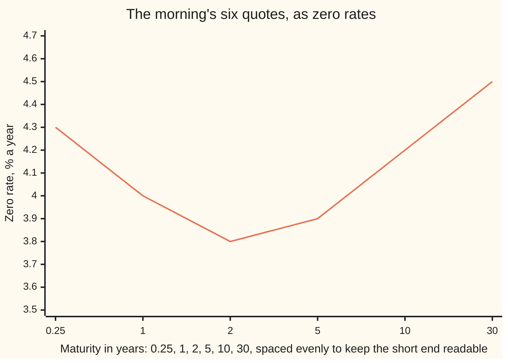
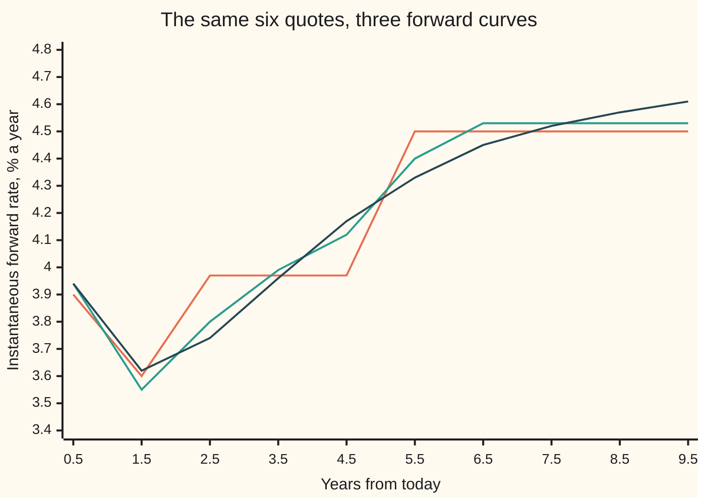

# Between the pillars: log-linear, monotone convex and Nelson-Siegel, and what each does to forwards

Financial mathematics → Curves → Shape between the quotes → Between the pillars

---

## General Overview

A different morning, and a screen that reaches further out: a three-month deposit, then interest rate swaps at one, two, five, ten and thirty years. Bootstrapping turns those six quotes into six **discount factors**, each one the price today of a dollar due on that date ([bootstrapping-the-discount-curve](04-bootstrapping-the-discount-curve.md)).

Six dates, six numbers. Written as **zero rates** — the one steady rate that grows a dollar today into the dollar due at that date — they read 4.30%, 4.00%, 3.80%, 3.90%, 4.20% and 4.50% a year. Those six dates are the **pillars** of the curve.

Then a client asks what a payment of 10,000,000.00 dollars due in three years is worth. Nobody quoted three years.

So the desk fills in the curve between its pillars. Any filling must still hand back all six quotes exactly, and two rules that do exactly that still value that one payment at 8,907,720.98 dollars and 8,922,579.56 dollars — 14,858.58 apart, on a single trade. The rates they imply for borrowing at a future date part company further still: at two and a half years the three rules on this card disagree by 22.81 basis points, a basis point being one hundredth of one percent.

That is the subject: not the quotes, but the room between them.

**Each quote fixes the area under the curve's forward rates across one gap; nothing fixes the shape inside the gap, so the shape is chosen, and the choice is worth money.**

**What kind of fact this is:** a method — three rules for choosing that shape, each a convention rather than a fact. What each rule then does to the forward rates is worked out on this card in Why it works.

### The picture: six dots and nothing in between



The line only joins the dots. The six corners are the data; the straight pieces between them are already an interpolation rule, chosen by whoever drew the chart. The rest of this card is about choosing it deliberately.

---

## The formula

Notation first, in words. A discount factor at time $t$ is written $D(t)$: the price today of one dollar due at $t$, so $D(0) = 1$ and a falling $D$ means a positive interest rate. The **instantaneous forward rate**, written $f(t)$, is the rate the curve implies for a loan starting at $t$ and lasting a moment. It is the rate per year that the curve is charging at that instant, and it is what every rule on this card really chooses.

$$D(t) = \exp\left(-\int_0^t f(u)\,du\right)$$

**Read it aloud:** a dollar due later is worth what is left of it after the forward rate has been charged, continuously, from today until the payment date.

Two quoted pillars therefore fix one number about the forward rate between them: its total. Writing $t_i$ for the pillar dates, $h_i = t_i - t_{i-1}$ for the length of the gap in years and $D_i$ for the quoted discount factor at $t_i$,

$$m_i = \frac{\ln D_{i-1} - \ln D_i}{h_i}$$

**Read it aloud:** the **segment forward** is the gap's total forward rate spread evenly across it — the average height of $f$ over the gap, and the only thing the two quotes say about it.

The three rules differ in what they do with that freedom. Writing $w$ for the fraction of a gap already elapsed, $w = (t - t_{i-1})/h_i$, and $g_0$, $g_1$ for how far the curve's forward sits above the segment forward at the gap's two ends:

| Rule | What it sets | Forward rate it implies |
| --- | --- | --- |
| Log-linear | $\ln D(t) = (1 - w)\ln D_{i-1} + w \ln D_i$ | flat at $m_i$ across the gap, jumping at each pillar |
| Monotone convex | $f$ continuous, piecewise quadratic, same area on every gap | a curve through a forward at each pillar, with no invented humps |
| Nelson-Siegel | $f(t) = \beta_0 + \beta_1 e^{-t/\tau} + \beta_2 \frac{t}{\tau} e^{-t/\tau}$ | smooth everywhere, and not pinned to the quotes |

The middle rule starts from one formula on each gap, with $x$ the same fraction $w$ written short:

$$f(t) = m_i + g_0\,(1 - 4x + 3x^2) + g_1\,(3x^2 - 2x)$$

Both bracketed pieces average to zero across the gap, which is why the area — and so every quote — survives. Where that plain parabola would invent a hump, Hagan and West replace part of it with a flat piece, turning at a point $\eta$ chosen to keep the area right; Step 3 says when and why.

| Symbol | Plain meaning | In our example | Push it up and the answer… |
| --- | --- | --- | --- |
| $D(t)$, $D_i$ | price today of a dollar due at $t$, and at the pillar dated $t_i$ | 0.926816 at two years | rises: the payment is worth more today |
| $t$, $t_i$ | time from today in years, and the quoted dates | 3 years; 0.25, 1, 2, 5, 10, 30 | later payments are worth less |
| $h_i$ | length of the gap ending at $t_i$, in years | 3 years, from 2 to 5 | wider gaps leave the rule more room |
| $m_i$ | the segment forward: the gap's average forward rate | 3.9667% from 2 to 5 years | every discount factor past the gap falls |
| $f(t)$ | the instantaneous forward rate at $t$ | 3.8021% at 2.5 years, monotone convex | the curve is charging more at that instant |
| $z$ | the zero rate: one steady rate from today to $t$ | 3.80% at two years | the same, averaged from today |
| $w$, $x$ | fraction of the gap already elapsed, 0 to 1 | 1/3 at three years | moves the point across the gap |
| $g_0$, $g_1$ | the gap's end forwards, measured from $m_i$ | −0.2750% and +0.2000% from 2 to 5 years | the curve leans harder inside the gap |
| $\eta$ | where a gap's shape turns from curved to flat | 0.2477 across the 5-to-10-year gap | the flat piece takes more of the gap |
| $\beta_0$, $\beta_1$, $\beta_2$ | Nelson-Siegel's level, its fading start, its hump | 4.6580%, −0.1885%, −2.6184% | lifts the far end, the near end, the middle |
| $\tau$ | Nelson-Siegel's time scale: where the hump sits | 1.67 years | pushes the hump out to longer maturities |
| $A$ | the level where a gap's two half-parabolas meet | used only on the 1-to-2-year gap | the crossing sits nearer one end |

### When it holds

- **The pillars are already exact.** The bootstrap that produced them used an interpolation rule inside itself, so it must be this same rule; change the rule afterwards and the pillars stop repricing the swaps they came from ([bootstrapping-the-discount-curve](04-bootstrapping-the-discount-curve.md)).
- **Dates sorted and distinct, discount factors positive.** Repeated dates divide by a zero gap length; a discount factor of zero or less has no logarithm.
- **Inside the quoted range only.** The two exact rules say nothing past thirty years: extrapolation is a separate rule, and the usual one is to hold the last forward flat. Nelson-Siegel does run on, but only on the strength of its assumed shape.
- **One curve, no spread.** These are one currency's risk-free discount factors, with no credit or collateral adjustment on top; a spread over this curve is measured separately ([z-spread-and-asset-swap-spread](06-z-spread-and-asset-swap-spread.md)).
- **Nelson-Siegel also assumes its own shape.** It says the whole curve is a level plus a fading piece plus one hump. When the market disagrees, the fit misses the quotes: by 1.5162 basis points here, which is 1,456.86 dollars on a 10,000,000.00 dollar payment due in a year.

Conventions verified 14 Sep 2026: rates on this card are continuously compounded and times are in years. Market quotes carry day-count conventions that decide where the pillars fall, not what happens between them ([money-market-instruments-and-sofr](03-money-market-instruments-and-sofr.md)).

---

## Why it works

### Step 0: a quote fixes an area, not a shape

Take the two quotes either side of three years. Their discount factors are 0.926816 at two years and 0.822835 at five. Their logarithms are −0.076000 and −0.195000.

The formula above says the difference of those logarithms is the total of the forward rate across the gap: 0.119000, spread over three years. Divide, and the gap's average forward is 3.9667% a year. That is the whole content of those two quotes about the three years between them.

Which means: any forward curve at all whose average over that gap is 3.9667% reprices both quotes exactly. Flat at 3.9667%, or low then high, or high then low. The quotes cannot tell these apart, and neither can a repricing test. The rule decides, and nothing else does.

### Step 1: log-linear spreads the area flat

The first rule takes the obvious option: hold the forward at $m_i$ all the way across the gap. Then the logarithm of the discount factor falls at a constant rate, which is a straight line between the two quoted logarithms, so

$$D(t) = D_{i-1}^{\,1-w}\,D_i^{\,w}.$$

Every quote comes back exactly; every discount factor stays positive, because an exponential cannot be negative. It is one line of arithmetic, and it is the common default.

What it does to forward rates is a staircase. Inside a gap the forward never moves; at a pillar it jumps. At ten years the log-linear forward steps from 4.5000% to 4.6500% — fifteen basis points from one day to the next, purely because a quote happens to land there. A forward rate agreement fixing just before that date and one fixing just after are priced apart by a step no market put there ([forward-rate-agreements](02-forward-rate-agreements.md)).

### Step 2: the same areas, drawn as one continuous curve

The second rule keeps every area and removes the jumps. It needs a forward rate at each pillar to aim at, and it builds one by joining the staircase's own steps.

Picture the staircase's two steps either side of a pillar, each drawn at the middle of its gap. Join those two midpoints with a straight line and read the line off at the pillar. The arithmetic of that reading is

$$f_i = \frac{h_{i+1}\,m_i + h_i\,m_{i+1}}{h_i + h_{i+1}},$$

where the weight on each step is the *other* gap's length: a long gap next door pulls its own step's weight down, because the pillar is far from that gap's middle. At ten years, a five-year gap at 4.5000% beside a twenty-year gap at 4.6500% gives 4.5300%. The two ends of the curve have only one neighbour each, so their forwards are reflected: each is set half as far from its gap's average as the inner pillar's forward, and on the other side of it. At the short end, 4.2000% inside an average of 4.3000% gives 4.3500% at today's date.

Now fill each gap with the one quadratic that hits those two pillar forwards and keeps the area. Measure the ends from the gap's own average, $g_0 = f_{i-1} - m_i$ and $g_1 = f_i - m_i$, and the shape is the formula in the last section. Check it: at $x = 0$ it gives $m_i + g_0$, at $x = 1$ it gives $m_i + g_1$, and each bracket integrates to zero across the gap, so the area — the quote — is untouched.

### Step 3: a plain parabola invents humps, so it is amended

A parabola through two end values can swing past both of them. On the gap from five to ten years the ends sit −0.3333% below and +0.0300% above an average of 4.5000%, and the plain parabola, forced to make up the deficit left by that low start, rises above *both* ends in the second half of the gap before dropping back to the far one. Nothing in the quotes asked for that hump; the algebra invented it.

Hagan and West's fix is to spend part of the gap flat: curve between the two ends over part of it, hold one of them over the rest, and place the turning point $\eta$ so the area is still exactly right. From five to ten years that means curving up to 4.5300% a quarter of the way across, then flat. There are four cases, depending on where the two ends sit relative to each other; three of them occur in this morning's quotes, and the check prints which one each gap uses.

<details>
<summary>Detailed proof: the four shapes, and why each keeps the quote</summary>

Work in the gap's own units: $x$ runs from 0 to 1, and $g(x)$ is the forward measured from the segment forward $m_i$, so the quote is honoured exactly when $\int_0^1 g\,dx = 0$, with $g(0) = g_0$ and $g(1) = g_1$.

**Region 1, the plain parabola.** $g(x) = g_0(1 - 4x + 3x^2) + g_1(3x^2 - 2x)$. Its integral is $g_0(1 - 2 + 1) + g_1(1 - 1) = 0$. It is used when the two ends are related closely enough that it cannot overshoot: $-\tfrac12 g_0 \le g_1 \le -2g_0$ when $g_0 < 0$, and the same chain reversed when $g_0 > 0$.

**Region 2, flat then curved.** When $g_1$ is too far past $-2g_0$, hold $g = g_0$ on $[0, \eta]$ and run $g = g_0 + (g_1 - g_0)\left(\frac{x - \eta}{1 - \eta}\right)^2$ after it. The integral is $g_0 + (g_1 - g_0)(1 - \eta)/3$, which vanishes at $\eta = (g_1 + 2g_0)/(g_1 - g_0)$.

**Region 3, curved then flat.** When $g_1$ sits between 0 and $-\tfrac12 g_0$, run $g = g_1 + (g_0 - g_1)\left(\frac{\eta - x}{\eta}\right)^2$ on $[0, \eta)$ and hold $g = g_1$ after it. The integral is $g_1 + (g_0 - g_1)\eta/3$, which vanishes at $\eta = 3g_1/(g_1 - g_0)$.

**Region 4, both ends the same side.** When $g_0$ and $g_1$ share a sign the curve must cross to the other side in between, so it is built from two parabola halves meeting at a level $A$: $g = A + (g_0 - A)\left(\frac{\eta - x}{\eta}\right)^2$ before $\eta$ and $g = A + (g_1 - A)\left(\frac{x - \eta}{1 - \eta}\right)^2$ after it, with $\eta = g_1/(g_0 + g_1)$ and $A = -g_0g_1/(g_0 + g_1)$. Its integral is $A + (g_0 - A)\eta/3 + (g_1 - A)(1 - \eta)/3$; substituting $s = g_0 + g_1$ gives $A + g_0g_1/s = A - A = 0$.

In every region the value at $x = 0$ is $g_0$ and at $x = 1$ is $g_1$, so neighbouring gaps agree at the pillar they share and the forward curve is continuous. The check integrates each gap numerically and compares the answer with the quote that fixed it, to fourteen decimal places.

One step is left out here: Hagan and West first clip each pillar forward into $[0,\,2\min(m_i, m_{i+1})]$, which is what keeps the forward curve positive in a steeper market. On this morning's quotes nothing is clipped.

</details>

### Step 4: Nelson-Siegel fits a shape instead of filling gaps

The third rule stops interpolating altogether. It proposes that the whole forward curve, from today to thirty years, is three simple shapes added up: a flat level $\beta_0$; a piece $\beta_1 e^{-t/\tau}$ that starts at full size and fades; and a hump $\beta_2 \frac{t}{\tau}e^{-t/\tau}$ that is zero today, peaks at $\tau$ years and fades after. Integrating that from 0 to $t$ and dividing by $t$ gives the zero rate the curve implies, which is what the quotes are compared against.

Four numbers cannot pass through six quotes. So the numbers are fitted: with $\tau$ held fixed the zero rate is a plain weighted sum of the three levels, so the best three are the solution of a three-by-three linear system, and $\tau$ is then swept to find the best of those solutions. This morning it lands on $\tau$ = 1.67 years, with $\beta_0$ = 4.6580%, $\beta_1$ = −0.1885% and $\beta_2$ = −2.6184%.

The fit is close and it is not exact. Against the six quotes, in basis points:

```
one bar is 0.2 basis points; the fitted zero rate minus the quote
 0.25 years  ███                            +0.54
 1 year      ████████                       -1.52
 2 years     ██████                         +1.24
 5 years     █                              -0.14
 10 years    ██                             -0.30
 30 years    █                              +0.18
```

Missing a quote by 1.52 basis points sounds small and costs 1,456.86 dollars on a 10,000,000.00 dollar payment due in a year. A desk that has to reprice its own trades cannot use a curve that disagrees with the prices it was built from. What a fitted family buys instead is smoothness and a shape that survives noisy data — which is why many central banks publish a handful of fitted numbers rather than a list of pillars.

### The three curves, side by side



First line, log-linear: sampled once a year, it looks like a slope, but between samples it is flat and it moves only at a pillar. Second line, monotone convex: continuous, and flat at 4.5300% from about a quarter of the way into the five-to-ten-year gap onward, which is the amendment holding a hump down. Third line, Nelson-Siegel: smooth throughout, and free to sit away from the other two because it is not pinned to the quotes. The first two carry all six quotes exactly. The third misses them by up to 1.5162 basis points, which is why it sits away from the others in places.

The fourth candidate is a cubic spline through the zero rates, which is what a drawing program would do. It looks best of all on a chart of the curve and worst of all here: a forward rate is a derivative of what the spline drew, and a spline's derivative swings well outside its data, so the forwards ripple. That was Hagan and West's argument for building the forward curve first and the discount curve from it. The spline machinery itself is a card of its own (splines), and the tension spline is the version that pulls those ripples flat.

---

## Worked numbers, by hand

The client's payment: 10,000,000.00 dollars due in three years, from this morning's six quotes.

| Step | Arithmetic | Value |
| --- | --- | --- |
| the pillars either side | the quotes at 2 and 5 years | 0.926816 and 0.822835 |
| their logarithms | $\ln$ of each | −0.076000 and −0.195000 |
| the area over the gap | −0.076000 − (−0.195000) | 0.119000 |
| the segment forward | 0.119000 ÷ 3 years | 3.9667% |
| log-linear at three years | $e^{-0.076000 - 0.119000/3}$ | 0.890772 |
| **the payment, log-linear** | 10,000,000.00 × 0.890772 | **8,907,720.98** |
| monotone convex, average forward from 2 to 3 years | the fitted shape on that gap | 3.8000% |
| monotone convex at three years | 0.926816 × $e^{-0.038000}$, that 3.8000% for one year | 0.892258 |
| **the payment, monotone convex** | 10,000,000.00 × 0.892258 | **8,922,579.56** |
| **what the choice of rule cost** | 8,922,579.56 − 8,907,720.98 | **14,858.58** |

Both rules reprice all six quotes to the last decimal place. The 14,858.58 dollars between them is the price of an assumption, not of a trade.

### What breaks if you drop a piece

Four ways to go wrong on the same six quotes. Money amounts are in dollars, on the same payment unless the row says otherwise.

| Mistake | Comes out at | What went wrong |
| --- | --- | --- |
| A straight line between the discount factors, not their logarithms | 8,921,556.90 | Inside the 2-to-5-year gap the forward slides from 3.7397% to 4.2123%, a slope no quote called for |
| A straight line between the zero rates | 8,913,661.44 | At ten years the forward *falls*, from 4.8000% to 4.3500%, while the quotes' own segment forwards *rise*, from 4.5000% to 4.6500% |
| Nelson-Siegel used as though it repriced the quotes | 9,609,351.25 for a one-year payment the quotes value at 9,607,894.39 | A fitted shape is close, never exact: 1.5162 basis points here, 1,456.86 dollars |
| Reading the log-linear forward as the market's rate at a date | a fifteen-basis-point step at ten years, 4.5000% to 4.6500% | The step belongs to the rule. The quotes constrain averages across gaps, not heights at a point |

Every number in that table is printed by the code below.

---

## Code, from first principles, and it actually runs

Nothing is imported that already knows an answer: the quadrature rule is a two-point Gauss rule written out, the least-squares fit is Gaussian elimination written out, and $\tau$ is found by sweeping a hundredth of a year at a time. Six roads cross-check each other. Each pillar forward is computed twice, once from the weights above and once by reading the line through the two step midpoints. Both exact rules are asked for every quoted discount factor back. The log-linear discount factor at three years is computed twice — once from the straight line between the logarithms, once by integrating the staircase forward from today. Every gap's area under the monotone convex forward is compared with the quote that fixed it. Nelson-Siegel's zero rate is compared with the integral of its own forward. And the fitted levels are nudged six ways to confirm they sit at a genuine low point of the total squared miss.

### Python

```python
# Curve interpolation and shape -- the check behind the card.  Standard library only: the quadrature rule,
# the three-by-three solve and the tau sweep are written out.  Six pillars, filled three ways, then compared.
from math import log, exp, sqrt

T = [0.0, 0.25, 1.0, 2.0, 5.0, 10.0, 30.0]            # today, then the six quoted dates, in years
Z = [0.0430, 0.0400, 0.0380, 0.0390, 0.0420, 0.0450]  # the bootstrap's zero rates, a year each
D = [1.0] + [exp(-z * t) for z, t in zip(Z, T[1:])]   # discount factors at the pillars
L = [log(d) for d in D]                               # and their logarithms
H = [T[i + 1] - T[i] for i in range(6)]               # gap lengths, in years
SEG = [(L[i] - L[i + 1]) / H[i] for i in range(6)]    # the segment forwards the quotes pin down

def gauss(f, a, b, n):                                # two sample points per strip, ends untouched
    h = (b - a) / n; c = h / (2.0 * sqrt(3.0))        # exact for any cubic on each strip
    return h / 2.0 * sum(f(a + (i + 0.5) * h - c) + f(a + (i + 0.5) * h + c) for i in range(n))
def integral(f, a, b, breaks, n):                     # cut at the breaks, n strips per piece
    p = [a] + sorted(x for x in breaks if a < x < b) + [b]
    return sum(gauss(f, p[k], p[k + 1], n) for k in range(len(p) - 1))
def gap(t): return next((i for i in range(6) if t < T[i + 1]), 5)   # a pillar starts a new gap
def f_loglin(t): return SEG[gap(t)]                   # rule 1's forward: one flat step per gap
def d_loglin(t):                                      # rule 1: a straight line between the log discounts
    i = gap(t); w = (t - T[i]) / H[i]; return exp((1.0 - w) * L[i] + w * L[i + 1])

PF = [0.0] * 7                                        # rule 2, step one: a forward at every pillar
for i in range(1, 6):
    PF[i] = (H[i] * SEG[i - 1] + H[i - 1] * SEG[i]) / (H[i - 1] + H[i])
PF[0] = SEG[0] - 0.5 * (PF[1] - SEG[0])
PF[6] = SEG[5] - 0.5 * (PF[5] - SEG[5])

def shape(i):                                         # Hagan-West: which region, and where it turns
    g0, g1 = PF[i] - SEG[i], PF[i + 1] - SEG[i]       # the two ends, measured from the segment forward
    if g0 == 0.0 or g1 == 0.0 or (g0 < 0 and -0.5 * g0 <= g1 <= -2.0 * g0) or (g0 > 0 and -0.5 * g0 >= g1 >= -2.0 * g0):
        return g0, g1, 1, 1.0                         # the plain parabola already behaves
    if (g0 < 0 and g1 > -2.0 * g0) or (g0 > 0 and g1 < -2.0 * g0):
        return g0, g1, 2, (g1 + 2.0 * g0) / (g1 - g0)   # flat, then a curve
    if (g0 > 0 > g1 > -0.5 * g0) or (g0 < 0 < g1 < -0.5 * g0):
        return g0, g1, 3, 3.0 * g1 / (g1 - g0)        # a curve, then flat
    return g0, g1, 4, g1 / (g0 + g1)                  # both ends the same side: a dip between them

def f_mc(t):                                          # rule 2: the monotone convex forward
    i = gap(t); x = (t - T[i]) / H[i]
    g0, g1, region, eta = shape(i)
    if region == 1:
        g = g0 * (1.0 - 4.0 * x + 3.0 * x * x) + g1 * (3.0 * x * x - 2.0 * x)
    elif region == 2:
        g = g0 if x <= eta else g0 + (g1 - g0) * ((x - eta) / (1.0 - eta)) ** 2
    elif region == 3:
        g = g1 + (g0 - g1) * ((eta - x) / eta) ** 2 if x < eta else g1
    else:
        a = -g0 * g1 / (g0 + g1)
        g = a + (g0 - a) * ((eta - x) / eta) ** 2 if x < eta else a + (g1 - a) * ((x - eta) / (1.0 - eta)) ** 2
    return SEG[i] + g

BREAKS = T + [T[i] + shape(i)[3] * H[i] for i in range(6)]    # pillars plus every turning point
def d_mc(t): return exp(-integral(f_mc, 0.0, t, BREAKS, 1))
def basis(t, tau):                                    # rule 3: the three Nelson-Siegel shapes at t
    e = exp(-t / tau); slope = (1.0 - e) / (t / tau); return 1.0, slope, slope - e
def solve3(A, v):                                     # Gaussian elimination, largest pivot first
    M = [row[:] + [b] for row, b in zip(A, v)]
    for c in range(3):
        p = max(range(c, 3), key=lambda r: abs(M[r][c])); M[c], M[p] = M[p], M[c]
        for r in range(3):
            if r != c:
                M[r] = [M[r][k] - M[r][c] / M[c][c] * M[c][k] for k in range(4)]
    return [M[i][3] / M[i][i] for i in range(3)]

def fit(tau):                                         # least squares on the six quotes, tau held fixed
    rows = [basis(t, tau) for t in T[1:]]
    A = [[sum(r[a] * r[b] for r in rows) for b in range(3)] for a in range(3)]
    return solve3(A, [sum(r[a] * z for r, z in zip(rows, Z)) for a in range(3)])

def sse(tau, beta):                                   # total squared miss across the six quotes
    return sum((sum(c * r for c, r in zip(beta, basis(t, tau))) - z) ** 2 for t, z in zip(T[1:], Z))
TAU = min((k * 0.01 for k in range(10, 1501)), key=lambda tau: sse(tau, fit(tau)))
BETA = fit(TAU)
def z_ns(t): return sum(c * r for c, r in zip(BETA, basis(t, TAU)))
def f_ns(t): return BETA[0] + (BETA[1] + BETA[2] * t / TAU) * exp(-t / TAU)
def d_ns(t): return exp(-z_ns(t) * t)

def d_lind(t):                                        # mistake: a straight line between the discounts
    i = gap(t); w = (t - T[i]) / H[i]; return (1.0 - w) * D[i] + w * D[i + 1]
def f_lind(t): return (D[gap(t)] - D[gap(t) + 1]) / H[gap(t)] / d_lind(t)
ZF = [Z[0]] + Z                                       # mistake: a straight line between the zero rates
def z_linz(t):
    i = gap(t); w = (t - T[i]) / H[i]; return (1.0 - w) * ZF[i] + w * ZF[i + 1]
def f_linz(t): return z_linz(t) + t * (ZF[gap(t) + 1] - ZF[gap(t)]) / H[gap(t)]

PAY, EPS = 10000000.0, 1e-9
print("six pillars from one morning: years, zero rate %, discount factor, log discount")
for t, z, d, l in zip(T[1:], Z, D[1:], L[1:]):
    print(f"{t:8.2f}{100 * z:9.4f}{d:12.6f}{l:12.6f}")
print("across each gap: the segment forward %, then the shape monotone convex gives it")
for i in range(6):
    g0, g1, region, eta = shape(i)
    print(f"{T[i]:6.2f} to{T[i + 1]:6.2f}{100 * SEG[i]:9.4f}   region {region}   ends"
          f"{100 * g0:+8.4f}{100 * g1:+8.4f}   turn at{eta:7.4f}")
print("monotone convex, forward at each pillar %: " + " ".join(f"{100 * p:.4f}" for p in PF))
print("three forward curves, % a year: years, log-linear, monotone convex, Nelson-Siegel")
for k in range(10):
    t = 0.5 + k
    print(f"{t:8.2f}{100 * f_loglin(t):8.2f}{100 * f_mc(t):8.2f}{100 * f_ns(t):8.2f}")
three = (f_loglin(2.5), f_mc(2.5), f_ns(2.5))
print(f"forward at 2.50 years %: log-linear {100 * three[0]:.4f}, monotone convex {100 * three[1]:.4f}, "
      f"Nelson-Siegel {100 * three[2]:.4f}; widest gap {10000 * (max(three) - min(three)):.2f} basis points")
print(f"forward at 3.00 years %: log-linear {100 * f_loglin(3.0):.4f}, monotone convex {100 * f_mc(3.0):.4f}, "
      f"Nelson-Siegel {100 * f_ns(3.0):.4f}")
print(f"monotone convex, average forward from 2 to 3 years %: {100 * integral(f_mc, 2.0, 3.0, BREAKS, 1):.4f}")
print(f"Nelson-Siegel fit: tau {TAU:.2f} years, beta0 {100 * BETA[0]:.4f}, beta1 {100 * BETA[1]:.4f}, "
      f"beta2 {100 * BETA[2]:.4f}, all % a year")
print("Nelson-Siegel minus the quote at each pillar, basis points: "
      + " ".join(f"{10000 * (z_ns(t) - z):+.2f}" for t, z in zip(T[1:], Z)))
def worst(rule): return 10000 * max(abs(log(rule(t) / d) / t) for t, d in zip(T[1:], D[1:]))
print(f"largest quote missed, basis points: log-linear {worst(d_loglin):.4f}, monotone convex "
      f"{worst(d_mc):.4f}, Nelson-Siegel {worst(d_ns):.4f}")
print(f"{PAY:.2f} due in 1 year: the quotes say {PAY * D[2]:.2f}, Nelson-Siegel says {PAY * d_ns(1.0):.2f}, "
      f"a gap of {PAY * (d_ns(1.0) - D[2]):.2f}")
print(f"the 3-year discount factor, {PAY:.2f} due in 3 years, and the gap to the log-linear value")
for name, d in (("log-linear", d_loglin(3.0)), ("monotone convex", d_mc(3.0)), ("Nelson-Siegel", d_ns(3.0)),
                ("line between discounts", d_lind(3.0)), ("line between zero rates", exp(-z_linz(3.0) * 3.0))):
    print(f"  {name:<24}{d:12.6f}{PAY * d:16.2f}{PAY * (d - d_loglin(3.0)):+12.2f}")
print("forward across the 10-year pillar, % a year: log-linear "
      f"{100 * f_loglin(10.0 - EPS):.4f} to {100 * f_loglin(10.0 + EPS):.4f}, monotone convex "
      f"{100 * f_mc(10.0 - EPS):.4f} to {100 * f_mc(10.0 + EPS):.4f}, line between zero rates "
      f"{100 * f_linz(10.0 - EPS):.4f} to {100 * f_linz(10.0 + EPS):.4f}")
print(f"inside the 2-to-5-year gap the line between discounts slides the forward from {100 * f_lind(2.0):.4f}"
      f" to {100 * f_lind(5.0 - EPS):.4f} % a year, on no instruction from the quotes")
for i in range(1, 6):                                 # the pillar forwards, read off the step midpoints
    assert abs(PF[i] - (SEG[i - 1] + (SEG[i] - SEG[i - 1]) * H[i - 1] / (H[i - 1] + H[i]))) < 1e-15
for t, d in zip(T[1:], D[1:]):                        # both exact rules hand every quote back
    assert abs(d_loglin(t) - d) < 1e-12 and abs(d_mc(t) - d) < 1e-12
assert abs(d_loglin(3.0) - exp(-integral(f_loglin, 0.0, 3.0, T, 1))) < 1e-12
for i in range(6):                                    # area under the forward equals the quoted gap
    assert abs(integral(f_mc, T[i], T[i + 1], BREAKS, 1) - H[i] * SEG[i]) < 1e-14
assert abs(z_ns(5.0) * 5.0 - integral(f_ns, 0.0, 5.0, [], 2000)) < 1e-11
for j in range(3):                                    # the fitted levels sit at a genuine low point
    for step in (1e-5, -1e-5):
        moved = [BETA[0], BETA[1], BETA[2]]; moved[j] += step
        assert sse(TAU, moved) > sse(TAU, BETA)
assert max(abs(f_mc(t + EPS) - f_mc(t - EPS)) for t in T[1:6]) < 1e-9
assert abs(f_loglin(10.0 + EPS) - f_loglin(10.0 - EPS)) > 0.001
print("ALL CHECKS PASS")
```

**Ran 2026-09-14 on macOS, Python 3.14.6, standard library only. All checks passed. Output, pasted from the run:**

```
six pillars from one morning: years, zero rate %, discount factor, log discount
    0.25   4.3000    0.989308   -0.010750
    1.00   4.0000    0.960789   -0.040000
    2.00   3.8000    0.926816   -0.076000
    5.00   3.9000    0.822835   -0.195000
   10.00   4.2000    0.657047   -0.420000
   30.00   4.5000    0.259240   -1.350000
across each gap: the segment forward %, then the shape monotone convex gives it
  0.00 to  0.25   4.3000   region 1   ends +0.0500 -0.1000   turn at 1.0000
  0.25 to  1.00   3.9000   region 3   ends +0.3000 -0.1286   turn at 0.9000
  1.00 to  2.00   3.6000   region 4   ends +0.1714 +0.0917   turn at 0.3484
  2.00 to  5.00   3.9667   region 1   ends -0.2750 +0.2000   turn at 1.0000
  5.00 to 10.00   4.5000   region 3   ends -0.3333 +0.0300   turn at 0.2477
 10.00 to 30.00   4.6500   region 1   ends -0.1200 +0.0600   turn at 1.0000
monotone convex, forward at each pillar %: 4.3500 4.2000 3.7714 3.6917 4.1667 4.5300 4.7100
three forward curves, % a year: years, log-linear, monotone convex, Nelson-Siegel
    0.50    3.90    3.94    3.94
    1.50    3.60    3.55    3.62
    2.50    3.97    3.80    3.74
    3.50    3.97    3.99    3.96
    4.50    3.97    4.12    4.17
    5.50    4.50    4.40    4.33
    6.50    4.50    4.53    4.45
    7.50    4.50    4.53    4.52
    8.50    4.50    4.53    4.57
    9.50    4.50    4.53    4.61
forward at 2.50 years %: log-linear 3.9667, monotone convex 3.8021, Nelson-Siegel 3.7386; widest gap 22.81 basis points
forward at 3.00 years %: log-linear 3.9667, monotone convex 3.9000, Nelson-Siegel 3.8464
monotone convex, average forward from 2 to 3 years %: 3.8000
Nelson-Siegel fit: tau 1.67 years, beta0 4.6580, beta1 -0.1885, beta2 -2.6184, all % a year
Nelson-Siegel minus the quote at each pillar, basis points: +0.54 -1.52 +1.24 -0.14 -0.30 +0.18
largest quote missed, basis points: log-linear 0.0000, monotone convex 0.0000, Nelson-Siegel 1.5162
10000000.00 due in 1 year: the quotes say 9607894.39, Nelson-Siegel says 9609351.25, a gap of 1456.86
the 3-year discount factor, 10000000.00 due in 3 years, and the gap to the log-linear value
  log-linear                  0.890772      8907720.98       +0.00
  monotone convex             0.892258      8922579.56   +14858.58
  Nelson-Siegel               0.892551      8925506.17   +17785.19
  line between discounts      0.892156      8921556.90   +13835.93
  line between zero rates     0.891366      8913661.44    +5940.46
forward across the 10-year pillar, % a year: log-linear 4.5000 to 4.6500, monotone convex 4.5300 to 4.5300, line between zero rates 4.8000 to 4.3500
inside the 2-to-5-year gap the line between discounts slides the forward from 3.7397 to 4.2123 % a year, on no instruction from the quotes
ALL CHECKS PASS
```

### Rust

Same numbers, same labels, built with `rustc --edition 2021 -O`.

```rust
// Curve interpolation and shape -- the same check as the Python, in Rust.  No crates: the quadrature rule,
// the three-by-three solve and the tau sweep are written out.  Six pillars, three rules, compared.
struct Curve { t: [f64; 7], d: [f64; 7], l: [f64; 7], h: [f64; 6], seg: [f64; 6], pf: [f64; 7] }

fn build(t: [f64; 7], z: [f64; 6]) -> Curve {                 // pillars, their logs, and the gaps
    let (mut d, mut l, mut h) = ([1.0f64; 7], [0.0f64; 7], [0.0f64; 6]);
    let (mut seg, mut pf) = ([0.0f64; 6], [0.0f64; 7]);
    for i in 1..7 { d[i] = (-z[i - 1] * t[i]).exp(); l[i] = d[i].ln(); }
    for i in 0..6 { h[i] = t[i + 1] - t[i]; seg[i] = (l[i] - l[i + 1]) / h[i]; }
    for i in 1..6 { pf[i] = (h[i] * seg[i - 1] + h[i - 1] * seg[i]) / (h[i - 1] + h[i]); }   // rule 2, step one
    pf[0] = seg[0] - 0.5 * (pf[1] - seg[0]);
    pf[6] = seg[5] - 0.5 * (pf[5] - seg[5]);
    Curve { t, d, l, h, seg, pf }
}
fn gauss<F: Fn(f64) -> f64>(f: &F, a: f64, b: f64, n: usize) -> f64 {   // two sample points per strip
    let h = (b - a) / n as f64; let c = h / (2.0 * 3.0_f64.sqrt());     // exact for any cubic on a strip
    h / 2.0 * (0..n).map(|i| { let m = a + (i as f64 + 0.5) * h; f(m - c) + f(m + c) }).sum::<f64>()
}
fn integral<F: Fn(f64) -> f64>(f: &F, a: f64, b: f64, breaks: &[f64], n: usize) -> f64 {
    let mut p: Vec<f64> = breaks.iter().copied().filter(|&x| x > a && x < b).collect();
    p.sort_by(|x, y| x.partial_cmp(y).unwrap()); p.insert(0, a); p.push(b);   // cut at the breaks
    (0..p.len() - 1).map(|k| gauss(f, p[k], p[k + 1], n)).sum()
}
fn gap(c: &Curve, t: f64) -> usize { (0..6).find(|&i| t < c.t[i + 1]).unwrap_or(5) }  // a pillar starts a gap
fn f_loglin(c: &Curve, t: f64) -> f64 { c.seg[gap(c, t)] }    // rule 1's forward: one flat step per gap
fn d_loglin(c: &Curve, t: f64) -> f64 {                       // rule 1: a line between the log discounts
    let i = gap(c, t); let w = (t - c.t[i]) / c.h[i]; ((1.0 - w) * c.l[i] + w * c.l[i + 1]).exp()
}
fn shape(c: &Curve, i: usize) -> (f64, f64, u8, f64) {        // Hagan-West: which region, where it turns
    let (g0, g1) = (c.pf[i] - c.seg[i], c.pf[i + 1] - c.seg[i]);   // the ends, from the segment forward
    if g0 == 0.0 || g1 == 0.0 || (g0 < 0.0 && -0.5 * g0 <= g1 && g1 <= -2.0 * g0)
        || (g0 > 0.0 && -0.5 * g0 >= g1 && g1 >= -2.0 * g0) { return (g0, g1, 1, 1.0); }  // parabola behaves
    if (g0 < 0.0 && g1 > -2.0 * g0) || (g0 > 0.0 && g1 < -2.0 * g0) {
        return (g0, g1, 2, (g1 + 2.0 * g0) / (g1 - g0));      // flat, then a curve
    }
    if (g0 > 0.0 && 0.0 > g1 && g1 > -0.5 * g0) || (g0 < 0.0 && 0.0 < g1 && g1 < -0.5 * g0) {
        return (g0, g1, 3, 3.0 * g1 / (g1 - g0));             // a curve, then flat
    }
    (g0, g1, 4, g1 / (g0 + g1))                               // both ends the same side: a dip between
}
fn f_mc(c: &Curve, t: f64) -> f64 {                           // rule 2: the monotone convex forward
    let i = gap(c, t); let x = (t - c.t[i]) / c.h[i];
    let (g0, g1, region, eta) = shape(c, i);
    let g = if region == 1 {
        g0 * (1.0 - 4.0 * x + 3.0 * x * x) + g1 * (3.0 * x * x - 2.0 * x)
    } else if region == 2 {
        if x <= eta { g0 } else { g0 + (g1 - g0) * ((x - eta) / (1.0 - eta)).powi(2) }
    } else if region == 3 {
        if x < eta { g1 + (g0 - g1) * ((eta - x) / eta).powi(2) } else { g1 }
    } else {
        let a = -g0 * g1 / (g0 + g1);
        if x < eta { a + (g0 - a) * ((eta - x) / eta).powi(2) } else { a + (g1 - a) * ((x - eta) / (1.0 - eta)).powi(2) }
    };
    c.seg[i] + g
}
fn basis(t: f64, tau: f64) -> [f64; 3] {                      // rule 3: the three Nelson-Siegel shapes
    let e = (-t / tau).exp(); let slope = (1.0 - e) / (t / tau); [1.0, slope, slope - e]
}
fn solve3(a: [[f64; 3]; 3], v: [f64; 3]) -> [f64; 3] {        // Gaussian elimination, largest pivot first
    let mut m = [[0.0f64; 4]; 3];
    for r in 0..3 { for k in 0..3 { m[r][k] = a[r][k]; } m[r][3] = v[r]; }
    for c in 0..3 {
        let mut p = c;
        for r in c + 1..3 { if m[r][c].abs() > m[p][c].abs() { p = r; } }
        m.swap(c, p);
        for r in 0..3 { if r != c {
            let factor = m[r][c] / m[c][c];
            for k in 0..4 { m[r][k] -= factor * m[c][k]; }
        } }
    }
    [m[0][3] / m[0][0], m[1][3] / m[1][1], m[2][3] / m[2][2]]
}
fn fit(ts: &[f64], zs: &[f64], tau: f64) -> [f64; 3] {        // least squares on the six quotes, tau fixed
    let rows: Vec<[f64; 3]> = ts.iter().map(|&t| basis(t, tau)).collect();
    let (mut a, mut v) = ([[0.0f64; 3]; 3], [0.0f64; 3]);
    for x in 0..3 { v[x] = rows.iter().zip(zs.iter()).map(|(r, z)| r[x] * z).sum();
        for y in 0..3 { a[x][y] = rows.iter().map(|r| r[x] * r[y]).sum(); } }
    solve3(a, v)
}
fn line(beta: [f64; 3], r: [f64; 3]) -> f64 { beta[0] * r[0] + beta[1] * r[1] + beta[2] * r[2] }
fn sse(ts: &[f64], zs: &[f64], tau: f64, beta: [f64; 3]) -> f64 {   // total squared miss on the quotes
    ts.iter().zip(zs.iter()).map(|(&t, &z)| (line(beta, basis(t, tau)) - z).powi(2)).sum()
}
fn main() {
    let t = [0.0, 0.25, 1.0, 2.0, 5.0, 10.0, 30.0];           // today, then the six quoted dates, in years
    let z = [0.0430, 0.0400, 0.0380, 0.0390, 0.0420, 0.0450]; // the bootstrap's zero rates, a year each
    let c = build(t, z);
    let (ts, zs) = (&c.t[1..], &z[..]);
    let mut breaks: Vec<f64> = c.t.to_vec();                  // pillars plus every turning point
    for i in 0..6 { breaks.push(c.t[i] + shape(&c, i).3 * c.h[i]); }
    let fmc = |x: f64| f_mc(&c, x);
    let d_mc = |x: f64| (-integral(&fmc, 0.0, x, &breaks, 1)).exp();
    let (mut tau, mut best) = (0.10f64, f64::INFINITY);
    for k in 10..=1500 {                                      // hunt for tau, a hundredth of a year apart
        let cand = k as f64 * 0.01; let s = sse(ts, zs, cand, fit(ts, zs, cand));
        if s < best { best = s; tau = cand; } }
    let beta = fit(ts, zs, tau);
    let z_ns = |x: f64| line(beta, basis(x, tau));
    let f_ns = |x: f64| beta[0] + (beta[1] + beta[2] * x / tau) * (-x / tau).exp();
    let d_ns = |x: f64| (-z_ns(x) * x).exp();
    let d_lind = |x: f64| { let i = gap(&c, x); let w = (x - c.t[i]) / c.h[i];   // mistake: a line
        (1.0 - w) * c.d[i] + w * c.d[i + 1] };                                   // between the discounts
    let f_lind = |x: f64| { let i = gap(&c, x); (c.d[i] - c.d[i + 1]) / c.h[i] / d_lind(x) };
    let zf = [z[0], z[0], z[1], z[2], z[3], z[4], z[5]];      // mistake: a line between the zero rates
    let z_linz = |x: f64| { let i = gap(&c, x); let w = (x - c.t[i]) / c.h[i];
        (1.0 - w) * zf[i] + w * zf[i + 1] };
    let f_linz = |x: f64| { let i = gap(&c, x); z_linz(x) + x * (zf[i + 1] - zf[i]) / c.h[i] };
    let (pay, eps) = (10000000.0f64, 1e-9f64);
    println!("six pillars from one morning: years, zero rate %, discount factor, log discount");
    for i in 1..7 { println!("{:8.2}{:9.4}{:12.6}{:12.6}", c.t[i], 100.0 * z[i - 1], c.d[i], c.l[i]); }
    println!("across each gap: the segment forward %, then the shape monotone convex gives it");
    for i in 0..6 {
        let (g0, g1, region, eta) = shape(&c, i);
        println!("{:6.2} to{:6.2}{:9.4}   region {}   ends{:+8.4}{:+8.4}   turn at{:7.4}",
                 c.t[i], c.t[i + 1], 100.0 * c.seg[i], region, 100.0 * g0, 100.0 * g1, eta);
    }
    let pillars: Vec<String> = c.pf.iter().map(|p| format!("{:.4}", 100.0 * p)).collect();
    println!("monotone convex, forward at each pillar %: {}", pillars.join(" "));
    println!("three forward curves, % a year: years, log-linear, monotone convex, Nelson-Siegel");
    for k in 0..10 {
        let x = 0.5 + k as f64;
        println!("{:8.2}{:8.2}{:8.2}{:8.2}", x, 100.0 * f_loglin(&c, x), 100.0 * fmc(x), 100.0 * f_ns(x));
    }
    let three = [f_loglin(&c, 2.5), fmc(2.5), f_ns(2.5)];
    let (hi, lo) = (three.iter().cloned().fold(f64::MIN, f64::max), three.iter().cloned().fold(f64::MAX, f64::min));
    println!("forward at 2.50 years %: log-linear {:.4}, monotone convex {:.4}, Nelson-Siegel {:.4}; \
              widest gap {:.2} basis points", 100.0 * three[0], 100.0 * three[1], 100.0 * three[2], 10000.0 * (hi - lo));
    println!("forward at 3.00 years %: log-linear {:.4}, monotone convex {:.4}, Nelson-Siegel {:.4}",
             100.0 * f_loglin(&c, 3.0), 100.0 * fmc(3.0), 100.0 * f_ns(3.0));
    println!("monotone convex, average forward from 2 to 3 years %: {:.4}",
             100.0 * integral(&fmc, 2.0, 3.0, &breaks, 1));
    println!("Nelson-Siegel fit: tau {:.2} years, beta0 {:.4}, beta1 {:.4}, beta2 {:.4}, all % a year",
             tau, 100.0 * beta[0], 100.0 * beta[1], 100.0 * beta[2]);
    let misses: Vec<String> = (1..7).map(|i| format!("{:+.2}", 10000.0 * (z_ns(c.t[i]) - z[i - 1]))).collect();
    println!("Nelson-Siegel minus the quote at each pillar, basis points: {}", misses.join(" "));
    let worst = |rule: &dyn Fn(f64) -> f64| (1..7).map(|i| (rule(c.t[i]) / c.d[i]).ln().abs() / c.t[i])
        .fold(0.0f64, f64::max) * 10000.0;
    println!("largest quote missed, basis points: log-linear {:.4}, monotone convex {:.4}, Nelson-Siegel {:.4}",
             worst(&|x| d_loglin(&c, x)), worst(&d_mc), worst(&d_ns));
    println!("{:.2} due in 1 year: the quotes say {:.2}, Nelson-Siegel says {:.2}, a gap of {:.2}",
             pay, pay * c.d[2], pay * d_ns(1.0), pay * (d_ns(1.0) - c.d[2]));
    println!("the 3-year discount factor, {:.2} due in 3 years, and the gap to the log-linear value", pay);
    for (name, d) in [("log-linear", d_loglin(&c, 3.0)), ("monotone convex", d_mc(3.0)),
                      ("Nelson-Siegel", d_ns(3.0)), ("line between discounts", d_lind(3.0)),
                      ("line between zero rates", (-z_linz(3.0) * 3.0).exp())] {
        println!("  {:<24}{:12.6}{:16.2}{:+12.2}", name, d, pay * d, pay * (d - d_loglin(&c, 3.0)));
    }
    println!("forward across the 10-year pillar, % a year: log-linear {:.4} to {:.4}, monotone convex \
              {:.4} to {:.4}, line between zero rates {:.4} to {:.4}",
             100.0 * f_loglin(&c, 10.0 - eps), 100.0 * f_loglin(&c, 10.0 + eps), 100.0 * fmc(10.0 - eps),
             100.0 * fmc(10.0 + eps), 100.0 * f_linz(10.0 - eps), 100.0 * f_linz(10.0 + eps));
    println!("inside the 2-to-5-year gap the line between discounts slides the forward from {:.4} to {:.4} \
              % a year, on no instruction from the quotes", 100.0 * f_lind(2.0), 100.0 * f_lind(5.0 - eps));
    for i in 1..6 { let mid = c.seg[i - 1] + (c.seg[i] - c.seg[i - 1]) * c.h[i - 1] / (c.h[i - 1] + c.h[i]);
        assert!((c.pf[i] - mid).abs() < 1e-15); }             // the pillar forwards, off the step midpoints
    // both exact rules hand every quote back
    for i in 1..7 { assert!((d_loglin(&c, c.t[i]) - c.d[i]).abs() < 1e-12 && (d_mc(c.t[i]) - c.d[i]).abs() < 1e-12); }
    let floglin = |x: f64| f_loglin(&c, x);
    assert!((d_loglin(&c, 3.0) - (-integral(&floglin, 0.0, 3.0, &c.t, 1)).exp()).abs() < 1e-12);
    // area under the forward equals the quoted gap
    for i in 0..6 { assert!((integral(&fmc, c.t[i], c.t[i + 1], &breaks, 1) - c.h[i] * c.seg[i]).abs() < 1e-14); }
    assert!((z_ns(5.0) * 5.0 - integral(&f_ns, 0.0, 5.0, &[], 2000)).abs() < 1e-11);
    for j in 0..3 { for step in [1e-5, -1e-5] {               // the fitted levels sit at a genuine low point
        let mut moved = beta; moved[j] += step;
        assert!(sse(ts, zs, tau, moved) > sse(ts, zs, tau, beta));
    } }
    assert!((1..6).map(|i| (fmc(c.t[i] + eps) - fmc(c.t[i] - eps)).abs()).fold(0.0f64, f64::max) < 1e-9);
    assert!((f_loglin(&c, 10.0 + eps) - f_loglin(&c, 10.0 - eps)).abs() > 0.001);
    println!("ALL CHECKS PASS");
}
```

**Ran 2026-09-14 on macOS, rustc 1.98.1, no crates. All checks passed. Output, pasted from the run:**

```
six pillars from one morning: years, zero rate %, discount factor, log discount
    0.25   4.3000    0.989308   -0.010750
    1.00   4.0000    0.960789   -0.040000
    2.00   3.8000    0.926816   -0.076000
    5.00   3.9000    0.822835   -0.195000
   10.00   4.2000    0.657047   -0.420000
   30.00   4.5000    0.259240   -1.350000
across each gap: the segment forward %, then the shape monotone convex gives it
  0.00 to  0.25   4.3000   region 1   ends +0.0500 -0.1000   turn at 1.0000
  0.25 to  1.00   3.9000   region 3   ends +0.3000 -0.1286   turn at 0.9000
  1.00 to  2.00   3.6000   region 4   ends +0.1714 +0.0917   turn at 0.3484
  2.00 to  5.00   3.9667   region 1   ends -0.2750 +0.2000   turn at 1.0000
  5.00 to 10.00   4.5000   region 3   ends -0.3333 +0.0300   turn at 0.2477
 10.00 to 30.00   4.6500   region 1   ends -0.1200 +0.0600   turn at 1.0000
monotone convex, forward at each pillar %: 4.3500 4.2000 3.7714 3.6917 4.1667 4.5300 4.7100
three forward curves, % a year: years, log-linear, monotone convex, Nelson-Siegel
    0.50    3.90    3.94    3.94
    1.50    3.60    3.55    3.62
    2.50    3.97    3.80    3.74
    3.50    3.97    3.99    3.96
    4.50    3.97    4.12    4.17
    5.50    4.50    4.40    4.33
    6.50    4.50    4.53    4.45
    7.50    4.50    4.53    4.52
    8.50    4.50    4.53    4.57
    9.50    4.50    4.53    4.61
forward at 2.50 years %: log-linear 3.9667, monotone convex 3.8021, Nelson-Siegel 3.7386; widest gap 22.81 basis points
forward at 3.00 years %: log-linear 3.9667, monotone convex 3.9000, Nelson-Siegel 3.8464
monotone convex, average forward from 2 to 3 years %: 3.8000
Nelson-Siegel fit: tau 1.67 years, beta0 4.6580, beta1 -0.1885, beta2 -2.6184, all % a year
Nelson-Siegel minus the quote at each pillar, basis points: +0.54 -1.52 +1.24 -0.14 -0.30 +0.18
largest quote missed, basis points: log-linear 0.0000, monotone convex 0.0000, Nelson-Siegel 1.5162
10000000.00 due in 1 year: the quotes say 9607894.39, Nelson-Siegel says 9609351.25, a gap of 1456.86
the 3-year discount factor, 10000000.00 due in 3 years, and the gap to the log-linear value
  log-linear                  0.890772      8907720.98       +0.00
  monotone convex             0.892258      8922579.56   +14858.58
  Nelson-Siegel               0.892551      8925506.17   +17785.19
  line between discounts      0.892156      8921556.90   +13835.93
  line between zero rates     0.891366      8913661.44    +5940.46
forward across the 10-year pillar, % a year: log-linear 4.5000 to 4.6500, monotone convex 4.5300 to 4.5300, line between zero rates 4.8000 to 4.3500
inside the 2-to-5-year gap the line between discounts slides the forward from 3.7397 to 4.2123 % a year, on no instruction from the quotes
ALL CHECKS PASS
```

The two outputs match line for line: different languages, the same six roads, the same numbers.

> [!TIP]
> **Try changing**
> Guess first, then run it. The asserts test the rules rather than this morning's numbers, so some of these leave every one of them passing — which is itself the lesson.
> - **Drop the amendment.** Return `(g0, g1, 1, 1.0)` at the top of `shape`, so every gap gets the plain parabola. Every assert still passes, because the areas are still right. But between five and ten years the forward now climbs above the pillar values at *both* ends of that gap. That invented hump is the whole reason for the amendment.
> - **Freeze the decay.** Replace the sweep with `TAU = 5.0`. The Nelson-Siegel curve stiffens and the largest quote missed grows by more than a factor of ten.
> - **Interpolate the discount factors, not their logarithms.** In `d_loglin`, return `(1.0 - w) * D[i] + w * D[i + 1]`. The pillars still come back exactly, so that assert survives; the two-road assert stops the program, because the closed form no longer matches the area under the staircase forward.
> - **Re-quote the market.** Set the five-year zero rate to `0.0360`. Every assert passes again, and the 2-to-5-year segment forward falls, taking the whole middle of all three curves with it.

---

## The usual mistake

> [!warning]
> **Treating the curve between the pillars as market data.** Six numbers were quoted. Every rate the curve reports at any other date was manufactured by a rule, and is exactly as trustworthy as that rule. A forward rate at a date nobody traded is an output, not an observation.
>
> - **Believing that repricing the quotes makes a rule right.** Log-linear and monotone convex both hand back all six quotes to the last decimal, and still value one payment 14,858.58 dollars apart.
> - **Judging a rule by the look of the discount curve.** All these discount curves look identical: smooth, falling, indistinguishable by eye. Differentiate and they separate. The forward curve is where a rule shows what it is doing.
> - **Interpolating the zero rates because they look like the quoted numbers.** At ten years that makes the forward fall from 4.8000% to 4.3500% while the quotes' own segment forwards rise from 4.5000% to 4.6500%: the curve says the opposite of the market it was built from.
> - **Swapping the rule after the bootstrap.** The bootstrap uses the interpolation inside itself to value the swaps it is solving. Change the rule afterwards and the pillars are no longer the solution of anything.
> - **Reading Nelson-Siegel's misses as small because they are fractions of a percent.** 1.5162 basis points is 1,456.86 dollars on one 10,000,000.00 dollar payment, and the sign of the miss changes from pillar to pillar, so the errors do not cancel across a book.

---

## Where you meet it in real life

- **A curve build, every morning.** Every rates system asks which interpolation to use, and the answer is a setting saved in a file. Log-linear on discount factors and monotone convex on forwards are the two usual answers ([bootstrapping-the-discount-curve](04-bootstrapping-the-discount-curve.md)).
- **Pricing a forward rate agreement.** Its rate is read off the curve between two future dates that are rarely pillars, so the number quoted to the client is partly the rule's ([forward-rate-agreements](02-forward-rate-agreements.md)).
- **Published central bank curves.** Many central banks publish Nelson-Siegel or Svensson parameters rather than pillar-by-pillar discount factors; the BIS documentation below lists which country fits what.
- **Risk reports.** A bucketed sensitivity asks what the book is worth if the five-year quote moves one basis point. Under a local rule only the neighbouring gaps move; under a fitted family the whole curve moves, and the report reads differently for the same book.
- **Spread measurement.** A bond's spread is quoted over this curve, so whatever the rule invented between the pillars is inside the spread ([z-spread-and-asset-swap-spread](06-z-spread-and-asset-swap-spread.md)).

> **Say it back**
> Quotes pin the curve down at a handful of dates and nowhere else. Between two pillars they fix only the average forward rate across the gap, so the shape inside it is a choice. Log-linear spreads that average flat, which reprices everything and leaves the forward curve a staircase that jumps at every pillar. Monotone convex keeps the same averages but draws a continuous forward through a rate at each pillar, flattening part of a gap wherever the plain parabola would invent a hump. Nelson-Siegel abandons the gaps and fits four numbers to the whole curve, which is smooth but misses the quotes. On one 10,000,000.00 dollar payment due in three years, the first two rules differ by 14,858.58 dollars.

---

## What this builds on

- [bootstrapping-the-discount-curve](04-bootstrapping-the-discount-curve.md): where the six pillars come from, and why the interpolation rule is already inside the bootstrap that produced them.
- [spot-forward-and-par-rates](01-spot-forward-and-par-rates.md): zero rates, forward rates and the discount factors they all describe — the vocabulary this card interpolates.

## Where this goes next

- [nelson-siegel-and-svensson-fitting](../33-Curves%20in%20Depth/03-nelson-siegel-and-svensson-fitting.md): the fitted family taken seriously — a second hump for the long end, weighting the quotes, and what the four numbers mean when they move day to day.
- splines: the general machinery, including why a cubic spline's derivative ripples and what tension does about it.

This card trusted six quotes completely and asked only what to do between them; the next question is what to do when eighty quotes arrive and disagree with each other, which is where fitting a shape stops being a compromise and starts being the point.

---

## Sources

Verified 14 Sep 2026: every link below resolves to the publisher's page.

- Hagan, Patrick S., and Graeme West. "Interpolation Methods for Curve Construction." *Applied Mathematical Finance* 13, no. 2 (2006): 89–129. [doi:10.1080/13504860500396032](https://doi.org/10.1080/13504860500396032). The monotone convex method, its four regions, and the case against splining the zero rates.
- Nelson, Charles R., and Andrew F. Siegel. "Parsimonious Modeling of Yield Curves." *The Journal of Business* 60, no. 4 (1987): 473–489. [doi:10.1086/296409](https://doi.org/10.1086/296409). The level, the fading piece and the hump, proposed as the whole curve.
- Svensson, Lars E. O. "Estimating and Interpreting Forward Interest Rates: Sweden 1992–1994." NBER Working Paper 4871 (1994). [Working paper page](https://www.nber.org/papers/w4871). The second hump, and the standard extension of the fit.
- Bank for International Settlements. *Zero-Coupon Yield Curves: Technical Documentation*. BIS Papers No 25, 2005. [Publication page](https://www.bis.org/publ/bppdf/bispap25.htm). Which method each central bank uses, written up by the banks themselves.
- Andersen, Leif. "Discount Curve Construction with Tension Splines." *Review of Derivatives Research* 10, no. 3 (2007): 227–267. [doi:10.1007/s11147-008-9021-2](https://doi.org/10.1007/s11147-008-9021-2). The middle road: smoothness bought without the ripples.
