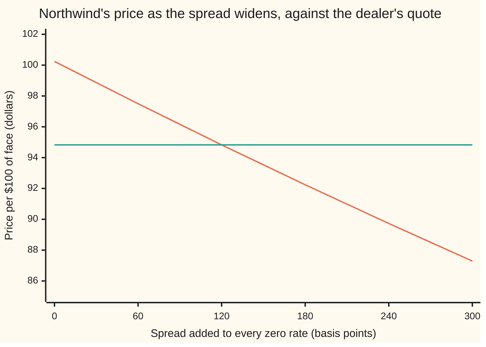
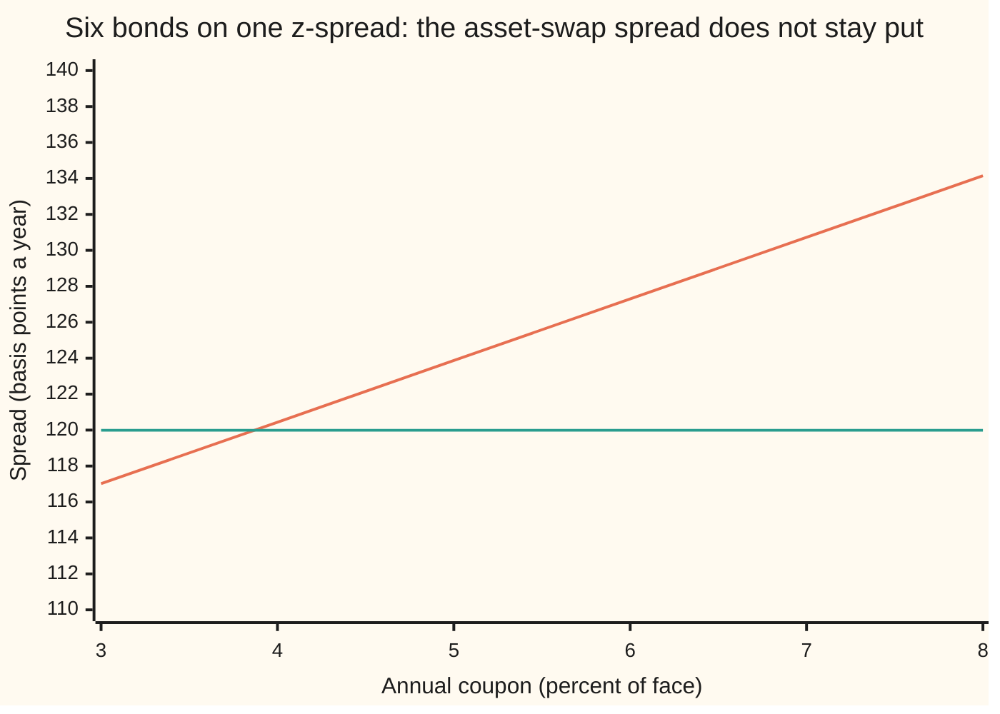

# Spreads over the curve: the z-spread and asset-swap spread of a risky bond

[Syllabus](../../../SYLLABUS.md) → [Financial mathematics](../README.md) → [Curves](../README.md#s02) → Spreads over the curve

---

## General Overview

Northwind Capital has a bond outstanding. On every $100 of face — the amount repaid at the end — it pays $4.00 a year for five years, then hands back the $100. Nothing in the contract is uncertain except whether Northwind is still there to pay.

This morning's curve prices that stream at **$100.24**. The curve is built from deposits, futures and swaps quoted for 1 week to 30 years, the way [Bootstrapping](04-bootstrapping-the-discount-curve.md) builds one, and it is as close to risk-free as a market gets.

The dealer's screen shows the bond at **$94.83**.

The $5.41 difference is not an error in the curve. It is what buyers charge Northwind for the chance the money never arrives. A number like $5.41 is useless for comparing bonds, though: it depends on the coupon, the maturity and the size of the trade. Turn it into a *rate* and bonds become comparable. That is what a **spread** is — an extra rate a bond pays over the curve — and two ways of measuring one are in daily use.

The first adds a constant rate to every discount rate on the curve until the bond's model price falls onto the market price. That is the **z-spread**. The second builds a package — buy the bond, swap its fixed coupons for a floating rate — and asks what extra rate the package throws off each year. That is the **asset-swap spread**. Both are quoted in **basis points**: one basis point is one hundredth of one percent, 0.01%, so 120 basis points is 1.20% a year.

**A risky bond's price gap against the curve, restated as a rate: buried inside the discounting it is the z-spread, paid out as an extra yearly amount it is the asset-swap spread.**

**What kind of fact this is:** a definition — two of them, one dug out of a price by search, the other divided out of it. The uniqueness that makes the search legitimate is proved on this card in Why it works.

**Conventions verified 14 Sep 2026:** spreads are quoted in basis points a year. This card uses annual coupons on whole-year dates and continuously compounded zero rates, so the discount factor for $T$ years is $e^{-r_T T}$ ([Discount factors](../01-Money%2C%20Dates%20and%20Discounting/01-compounding-and-discount-factors.md)). Real markets vary the coupon frequency and the day count ([Day counts](../01-Money%2C%20Dates%20and%20Discounting/02-day-counts-and-dates.md)); those choices move a quoted spread by a basis point or two on a bond like this one.

### The picture: the price falls as the spread rises, and crosses the quote



The falling line is the bond priced off the curve with a spread added to every zero rate. The flat line is the dealer's quote, $94.83. They cross a shade under 120 basis points, and that crossing is the z-spread. Finding it is the whole job.

---

## The formula

A **zero rate** is the single rate that discounts one payment landing on one date, with nothing in between; the curve supplies one for each of the bond's dates. The bond's price on the curve, with a spread $z$ added to every zero rate, is one sum:

$$V(z) \;=\; \sum_i C_i \, e^{-(r_{t_i} + z)\,t_i}$$

The sum runs over every payment the bond makes: five of them for Northwind, the last one carrying the face amount along with the coupon.

**Read it aloud:** take each payment the bond promises, discount it at the curve's rate for that date plus the same extra rate everywhere, and add the discounted payments up.

The z-spread is the value of $z$ that makes that sum equal the market price:

$$V(z) = P \quad\Longrightarrow\quad z = \text{the z-spread}$$

**Read it aloud:** the z-spread is the one constant rate which, added to the whole curve, reprices the bond exactly.

The asset-swap spread comes from the same gap, divided instead of solved:

$$A \;=\; \frac{V(0) - P}{F \sum_i D(t_i)}$$

**Read it aloud:** the price gap, spread evenly over the years as a yearly payment on the face amount, each year's payment discounted on the curve.

The sum on the bottom is the **annuity**: the discount factors for the payment dates added up. It converts a lump sum today into an equal payment each year, and it is doing exactly that here.

| Symbol | Plain meaning | In our example | Push it up and the spread… |
| --- | --- | --- | --- |
| $P$ | the bond's market price, per $100 of face | 94.833 | falls: a dearer bond is a safer bond |
| $V$ | the bond's price computed off the curve | 100.239842 at $z = 0$ | rises: a bigger gap to explain |
| $C_i$ | the payment due on date $t_i$: a coupon, plus the face at the end | 4, 4, 4, 4, 104 | rises, and the price with it |
| $c$ | the annual coupon in dollars per $100 of face | 4.00 | the two spreads drift apart |
| $F$ | the face amount, repaid at the end | 100 | — |
| $t_i$ | the year each payment lands | 1, 2, 3, 4, 5 | — |
| $T$ | the year the last payment lands | 5 | falls: the gap is spread over more years |
| $r_t$ | the curve's zero rate, read off at each payment date, continuously compounded | 3.00% to 3.90% | falls: the curve explains more of the price |
| $D$ | the discount factor $D(t) = e^{-r_t t}$ | 0.970446 at 1 year, 0.822835 at 5 | — |
| $z$ | the z-spread, added to every zero rate | 119.99 bp | — |
| $A$ | the asset-swap spread, paid yearly on the face | 120.44 bp | — |
| $y$ | the bond's yield: one rate that reprices it alone | 5.0694% continuously compounded, 5.2001% a year | rises with the spread, but is not the spread |

### When it holds

- **The bond's payments are fixed and known.** A floating-rate note or a callable bond has payments that move, and a single spread then absorbs that movement as if it were credit risk. Stripping the option value out first is [Option-adjusted spread](../35-Mortgages%2C%20Callables%20and%20Prepayment/04-option-adjusted-spread.md).
- **One agreed curve.** A spread is measured against a chosen curve; quote the same bond over government bonds instead of swaps and the number changes by the gap between those two curves. A spread without its curve named is meaningless.
- **The spread is the same at every date.** A real issuer's credit deteriorates or improves with time, so the true compensation has a term structure. One constant $z$ is the flat line that happens to fit this bond's total price, not the truth at each date.
- **A price, not a probability.** $z$ is fitted to a price. It bundles default odds, recovery, illiquidity and risk appetite into one rate, and nothing in the arithmetic separates them. Prising them apart is [Implied hazard from a bond price, and why the CDS disagrees](../44-Reduced-Form%20Models%20-%20Risky%20Bonds%2C%20Spreads%20and%20Random%20Hazards/02-implied-hazard-from-a-bond-price-and-the-cds-bond-basis.md).
- **A positive price.** Any price above zero has a spread. A price *above* the curve's price gives a negative spread, which is ordinary for the safest government bonds against a swap curve.

---

## Why it works

### Step 0: a gap in price is a gap in rate

The curve says $100.24 and the market says $94.83. Both numbers discount the same five payments. If they disagree, the market must be discounting at higher rates than the curve.

That is the whole idea. Every remaining step is bookkeeping about *how* the extra rate is charged, and both answers on this card charge the same $5.41.

### Step 1: one spread fits, and only one

Before solving for $z$ it is worth knowing a solution exists and is unique, or the solver is hunting something that may not be there.

$V(z)$ adds up terms $C_i e^{-(r_{t_i}+z)t_i}$. Every payment $C_i$ is positive and every date $t_i$ is in the future, so raising $z$ shrinks every term at once: the total falls, always, with no flat spots. Push $z$ far enough up and the price goes to zero; pull it far enough down and the price goes to infinity. A quantity that slides smoothly from infinity to zero, never turning back, passes each price in between exactly once.

<details>
<summary>Detailed proof: exactly one spread fits any positive price</summary>

Fix the payments $C_i > 0$ at dates $t_1 < t_2 < \dots$, every one of them in the future, and the curve's rates $r_t$ at those dates. Write
$$V(z) = \sum_i C_i e^{-(r_{t_i}+z)t_i}.$$
**Continuity.** Each term is a constant times $e^{-z t_i}$, continuous in $z$; a finite sum of continuous functions is continuous.

**Strictly falling.** Differentiate term by term:
$$V'(z) = -\sum_i t_i\,C_i\,e^{-(r_{t_i}+z)t_i} < 0,$$
since every $t_i$ and every $C_i$ is positive and an exponential is never zero. So $V$ is strictly decreasing: no two spreads give the same price.

**The full range.** As $z \to -\infty$ each term grows without bound, so $V(z) \to +\infty$. As $z \to +\infty$ each term goes to zero, so $V(z) \to 0$. A continuous function on the whole line with those two limits takes every value in $(0, \infty)$, by the intermediate value theorem.

Together: for any market price $P > 0$ there is exactly one $z$ with $V(z) = P$. Differentiating once more gives $V''(z) = \sum t_i^2 C_i e^{-(r_{t_i}+z)t_i} > 0$, so $V$ is convex, which is why Newton's method started at $z = 0$ walks straight down to the root instead of oscillating.

**Where it fails.** Let one $C_i$ be negative — a fee, or a package with a payment running the other way — and $V'$ can change sign. Two spreads can then fit one price, and the word "the" z-spread stops being safe.

</details>

Boundary cases follow from the same picture. $P = V(0)$ gives $z = 0$: the bond is priced exactly on the curve. $P > V(0)$ gives $z < 0$. As $P$ falls towards zero, $z$ runs off to infinity, which is why the spread on a bond trading at a few cents is quoted as a recovery value instead — cents on the dollar a holder expects to salvage in a default.

### Step 2: solving for it, twice

There is no formula for $z$. It comes out of a search, and two searches confirm each other.

**Bisection.** Start with a spread too small (0 basis points gives $100.24, above the quote) and one too large (300 basis points gives $87.29, below it). Take the midpoint, price the bond, and keep whichever half still straddles the quote. Each pass halves the uncertainty, so two hundred passes leave nothing. Step 1 guarantees the straddle never breaks. The code opens wider still, from minus 50% to plus 100%, so the same routine lands on any bond it is handed.

**Newton's method.** Guess a spread, measure how fast the price is falling there, and step to where a straight line of that slope would hit the quote. The slope is the derivative from Step 1, $V'(z) = -\sum t_i C_i e^{-(r_{t_i}+z)t_i}$. Convexity keeps it converging. It reaches the same 119.99 basis points from a standing start of zero.

### Step 3: the asset swap charges the same gap a different way

An **asset swap** is a package sold as one trade. The buyer pays par — the face amount, $100 — and receives the bond plus a swap. In the swap the buyer hands over the bond's fixed coupons and receives a floating rate plus a fixed extra, $A$, each year. The buyer ends up holding a floating-rate asset. $A$ is what the package pays for taking Northwind's credit risk.

Setting the package's value to zero at the start gives the formula above, and the derivation is short because the floating leg collapses.

<details>
<summary>The algebra behind it, if you want it</summary>

Value everything on the curve. The buyer pays $F$ and receives the bond, worth $P$ in the market. Each year the buyer receives the floating fixing plus $A$ on notional $F$, and pays the coupon $c$.

**The floating leg telescopes.** The rate fixed for the year ending at $t_i$ is the curve's own forward rate, which by construction satisfies $1 + L_i = D(t_{i-1})/D(t_i)$. So that year's floating payment, discounted, is
$$F\left(\frac{D(t_{i-1})}{D(t_i)} - 1\right) D(t_i) = F\,\bigl(D(t_{i-1}) - D(t_i)\bigr).$$
Add over the years and the middle terms cancel in pairs, leaving $F\bigl(D(t_0) - D(T)\bigr) = F\bigl(1 - D(T)\bigr)$. A floating leg is worth par today minus par at the end, whatever the curve does in between.

**Set the package to zero.**
$$-F + P + \Bigl[F\bigl(1 - D(T)\bigr) + A\,F\sum_i D(t_i)\Bigr] - c\sum_i D(t_i) = 0.$$
The two $F$ terms cancel, and $F D(T) + c\sum_i D(t_i)$ is exactly $V(0)$, the bond priced on the curve. What survives is
$$A\,F\sum_i D(t_i) = V(0) - P,$$
which is the formula. No root-finding: one division.

</details>

So the same $5.41 becomes 119.99 basis points one way and 120.44 the other. They are close and they are not equal, and the reason matters. The z-spread sits *inside* the discounting, so its effect on the price is weighted by each payment's size and date and is itself discounted at the higher rate. The asset-swap spread is an equal cash payment on a fixed notional of $100 — the notional being the face amount a swap's payments are worked out on — discounted on the plain curve. So a bigger coupon means a bigger gap for the spread to explain, while the $100 of notional it is paid on stays put, and the two measures drift apart.

### The picture: where the two measures separate



The sloping line is the asset-swap spread. The flat line is the z-spread, held at 119.99 basis points for every bond on the chart. At Northwind's 4% coupon the two agree to within half a basis point. At an 8% coupon they are 14 apart: bigger coupons open a bigger dollar gap at the very same z-spread, and that gap is still paid out on $100 of notional.

An older measure sits alongside both. Subtract the curve's five-year par rate — the coupon that would price a five-year bond on the curve at exactly $100 — from the bond's own yield ([Yield from price](../01-Money%2C%20Dates%20and%20Discounting/07-yield-from-price.md)), 5.2001% a year against a 3.9466% par rate, and you have the **I-spread**, a single-point comparison that ignores the curve's shape entirely. It is quick, it is quoted, and on this bond it reads 125.35 basis points, five wider than the z-spread.

---

## Worked numbers, by hand

The curve, bootstrapped this morning out of deposits, futures and swaps: zero rates of 3.00%, 3.30%, 3.55%, 3.75% and 3.90% for one to five years, continuously compounded.

| Step | Arithmetic | Value |
| --- | --- | --- |
| the five discount factors | $e^{-0.0300 \times 1}$ down to $e^{-0.0390 \times 5}$ | 0.970446 … 0.822835 |
| the annuity | the five factors added up | 4.489094 |
| price on the curve | $4 \times 4.489094 + 100 \times 0.822835$ | $100.2398 |
| the dealer's quote | from the screen | $94.8330 |
| the gap | $100.2398 - 94.8330$ | $5.4068 |
| bracket the spread | 60 bp gives $97.50, above; 120 bp gives $94.83, below | between the two |
| solve, bisection then Newton | both land on the same root | **119.99 bp** |
| the asset-swap spread | $5.406842 \div 4.489094$, read per $100 of face | **120.44 bp** |

Northwind is paying about 1.2% a year more than the risk-free curve, every year, on every dollar lent to it. That is the price of its credit.

### What breaks if you drop a piece

Four ways to get a spread that looks right and is not. The correct answers are 119.99 and 120.44 basis points.

| Mistake | Comes out at | What went wrong |
| --- | --- | --- |
| Spread over the five-year zero rate only | 116.94 bp | The curve rises from 3.00% to 3.90%; flattening it to the back end discounts the early coupons too hard, so 3 bp of Northwind's spread is swallowed by the curve's slope |
| Quote the I-spread and read it as the z-spread | 125.35 bp | Yield minus par rate replaces the whole curve with one number at one date |
| Discount the asset-swap annuity with the spread in it | 124.72 bp | The swap's floating leg is a curve trade with a clearing house, not a loan to Northwind; it discounts on the curve |
| Read a high-coupon bond's asset-swap spread as its z-spread | 134.15 bp | An 8% coupon at the very same z-spread: bigger payments, a bigger dollar gap, the same $100 of notional to pay it on |

Every number in that table is printed by the code below.

---

## How a spread moves the price

A spread is quoted as a rate, but it is traded as a price. A credit desk that buys Northwind at 120 over and watches the market move to 220 over has lost money, and the amount is worth knowing before the trade, not after.

Widening the spread by one basis point costs **$0.043764** per $100 of face. That number is the slope of the price against the spread, $-V'(z)$ divided by 10,000, and it has a name: the **spread DV01**, the price given up per basis point of spread.

| Spread | Price | Given up against the curve |
| --- | --- | --- |
| 0 bp | $100.24 | $0.00 |
| 60 bp | $97.50 | $2.74 |
| 120 bp | $94.83 | $5.41 |
| 180 bp | $92.24 | $8.00 |
| 240 bp | $89.73 | $10.51 |
| 300 bp | $87.29 | $12.95 |

```
price given up against the curve, per $100 of face; each block is 25 cents
      0 bp                                                         $0.00
     60 bp   ███████████                                           $2.74
    120 bp   ██████████████████████                                $5.41
    180 bp   ████████████████████████████████                      $8.00
    240 bp   ██████████████████████████████████████████            $10.51
    300 bp   ████████████████████████████████████████████████████  $12.95
```

Two things show in those bars. The steps are nearly equal, which is why a desk can multiply a spread move by a single number and get close. And they shrink: the first 60 basis points cost $2.74 of price, while the last 60 carry the total only from $10.51 to $12.95. Each extra basis point is charged on a price the earlier basis points have already cut down. So widening the real spread by a full 100 basis points, from 119.99 to 219.99, costs $4.272234 — less than a hundred steps of $0.043764 each. The same curvature runs through [Duration and convexity](../01-Money%2C%20Dates%20and%20Discounting/06-duration-and-convexity.md) for yields.

---

## Code, from first principles, and it actually runs

Nothing is imported that already knows an answer: the root finders, the forward rates and the swap legs are written out. Four pairs of independent roads meet. The curve's discount factors come both straight out of the zero rates and by chaining the one-year forward factors hidden inside them. The z-spread comes by bisection and by Newton's method. The floating leg comes by the telescoping identity and by summing its forward payments one year at a time. And the asset-swap spread comes by the one-line division and by building the whole package cash flow by cash flow and solving it to zero.

### Python

```python
# Z-spread and asset-swap spread -- the check behind the card.  Standard
# library only, and nothing imported that already knows an answer: the root
# finders, the forward rates and the swap legs are all written out here.
# The curve is this morning's bootstrapped zero curve, 1 to 5 years.  The bond
# is Northwind 4s of 2031.  Each answer is reached twice by roads that share no
# arithmetic: discount factors straight from the zero rates against the same
# factors chained out of the one-year forwards; bisection against Newton; the
# asset-swap spread in closed form against the whole package priced cash flow
# by cash flow and solved to zero.
from math import exp

ZERO = [0.0300, 0.0330, 0.0355, 0.0375, 0.0390]      # continuously compounded, 1 to 5 years
YEAR = [1.0, 2.0, 3.0, 4.0, 5.0]
FACE, CPN, QUOTE = 100.0, 4.00, 94.833
FWD = [ZERO[0] * YEAR[0]] + [ZERO[i] * YEAR[i] - ZERO[i - 1] * YEAR[i - 1] for i in range(1, 5)]

def df(i, s=0.0):                          # road one: one exponential per pillar
    return exp(-(ZERO[i] + s) * YEAR[i])

def df_chain(i, s=0.0):                    # road two: multiply the one-year factors together
    out = 1.0
    for k in range(i + 1):
        out *= exp(-(FWD[k] + s))
    return out

def price(s, cpn=CPN, factor=df):          # the bond, discounted at curve plus spread
    return sum(cpn * factor(i, s) for i in range(5)) + FACE * factor(4, s)

def slope(s, cpn=CPN):                     # dP/ds, differentiated by hand, for Newton
    body = sum(YEAR[i] * cpn * df_chain(i, s) for i in range(5))
    return -(body + YEAR[4] * FACE * df_chain(4, s))

def bisect(f, lo, hi):                     # f falls from positive at lo to negative at hi
    for _ in range(200):
        mid = 0.5 * (lo + hi)
        if f(mid) > 0.0:
            lo = mid
        else:
            hi = mid
    return 0.5 * (lo + hi)

def newton(f, fp, x):                      # the other solver: follow the slope
    for _ in range(60):
        x -= f(x) / fp(x)
    return x

curve_price = price(0.0)
chain_price = price(0.0, factor=df_chain)
z_bisect = bisect(lambda s: price(s) - QUOTE, -0.5, 1.0)
z_newton = newton(lambda s: price(s, factor=df_chain) - QUOTE, slope, 0.0)
annuity = sum(df(i) for i in range(5))
float_par = FACE * (1.0 - df(4))                                        # par leg identity
float_fwd = sum(FACE * (exp(FWD[i]) - 1.0) * df_chain(i) for i in range(5))
asw = (curve_price - QUOTE) / annuity / FACE                            # closed form

def package(a):                            # buy the bond, pay par, swap fixed for floating + a
    pv = QUOTE - FACE
    for i in range(5):
        pv += (FACE * (exp(FWD[i]) - 1.0) + FACE * a - CPN) * df_chain(i)
    return pv

asw_pkg = bisect(lambda a: -package(a), -0.5, 1.0)
ytm = bisect(lambda y: sum(CPN * exp(-y * t) for t in YEAR) + FACE * exp(-y * YEAR[4]) - QUOTE, -0.5, 1.0)
ytm_annual = exp(ytm) - 1.0
par_rate = (FACE - FACE * df(4)) / annuity / FACE
flat_z = bisect(lambda s: sum(CPN * exp(-(ZERO[4] + s) * t) for t in YEAR)
                + FACE * exp(-(ZERO[4] + s) * YEAR[4]) - QUOTE, -0.5, 1.0)
asw_risky = (curve_price - QUOTE) / sum(df(i, z_bisect) for i in range(5)) / FACE
asw8 = (price(0.0, cpn=8.0) - price(z_bisect, cpn=8.0)) / annuity / FACE
widened = price(z_bisect + 0.01)
bps = [0, 60, 120, 180, 240, 300]
curve_prices = [price(b / 10000.0) for b in bps]
coupons = [3.0, 4.0, 5.0, 6.0, 7.0, 8.0]
asw_curve = [(price(0.0, cpn=c) - price(z_bisect, cpn=c)) / annuity / FACE for c in coupons]

print("the curve this morning, bootstrapped from deposits, futures and swaps")
for i in range(5):
    print(f"   {int(YEAR[i])}y  zero {ZERO[i] * 100:.4f}%   D {df(i):.6f}   one-year forward {FWD[i] * 100:.4f}%")
print()
print("Northwind 4.000% of 2031, face 100, five annual coupons")
for label, v in (("price on the curve, from the zero rates", curve_price),
                 ("price on the curve, from chained forwards", chain_price),
                 ("market price, the dealer's quote", QUOTE),
                 ("price gap, curve minus market", curve_price - QUOTE)):
    print(f"{label:<45}{v:>12.6f}")
print(f"{'z-spread, bisection':<45}{z_bisect * 10000:>12.4f} bp")
print(f"{'z-spread, Newton':<45}{z_newton * 10000:>12.4f} bp")
for label, v in (("the bond repriced at the z-spread", price(z_bisect)),
                 ("floating leg, par minus the final factor", float_par),
                 ("floating leg, forward by forward", float_fwd),
                 ("annuity, the discount factors added up", annuity)):
    print(f"{label:<45}{v:>12.6f}")
print(f"{'asset-swap spread, closed form':<45}{asw * 10000:>12.4f} bp")
print(f"{'asset-swap spread, package solved to zero':<45}{asw_pkg * 10000:>12.4f} bp")
print(f"{'the bond yield, continuous then annual':<45}{ytm * 100:>12.4f}% {ytm_annual * 100:.4f}%")
print()
print(f"as the card quotes them: curve {curve_price:.2f}, market {QUOTE:.2f}, gap "
      f"{curve_price - QUOTE:.2f}, z {z_bisect * 10000:.2f} bp, asw {asw * 10000:.2f} bp")
print()
print("what breaks")
print(f"{'spread over the 5-year zero rate alone':<45}{flat_z * 10000:>12.4f} bp")
print(f"I-spread, yield {ytm_annual * 100:.4f}% less par rate {par_rate * 100:.4f}%"
      f"{(ytm_annual - par_rate) * 10000:>12.4f} bp")
print(f"{'asset-swap annuity discounted with the spread':<45}{asw_risky * 10000:>12.4f} bp")
print(f"{'the same z-spread on an 8% coupon bond, asw':<45}{asw8 * 10000:>12.4f} bp")
print()
print("how the price moves when the spread moves")
print(f"{'price slope, minus dP/dz at the quote':<45}{-slope(z_bisect):>12.4f}")
print(f"{'price given up per basis point of widening':<45}{-slope(z_bisect) / 10000.0:>12.6f}")
print(f"{'widen the spread by 100 bp: price':<45}{widened:>12.6f}, a drop of {price(z_bisect) - widened:.6f}")
print()
print(f"{'chart, spread in basis points':<32}" + "".join(f"{b:>8d}" for b in bps))
print(f"{'chart, price':<32}" + "".join(f"{p:>8.2f}" for p in curve_prices))
print(f"{'chart, the market quote':<32}" + "".join(f"{QUOTE:>8.2f}" for _ in bps))
print(f"{'bars, price given up per 100 face':<32}" + "".join(f"{curve_price - p:>8.2f}" for p in curve_prices))
print(f"{'chart, coupon in percent':<32}" + "".join(f"{c:>8.2f}" for c in coupons))
print(f"{'chart, asset-swap spread in bp':<32}" + "".join(f"{a * 10000:>8.2f}" for a in asw_curve))
print(f"{'chart, z-spread in bp':<32}" + "".join(f"{z_bisect * 10000:>8.2f}" for _ in coupons))
print()
print("try changing")
print(f"{'quote 94.733 instead of 94.833: z-spread':<45}"
      f"{bisect(lambda s: price(s) - 94.733, -0.5, 1.0) * 10000:>12.4f} bp")
print(f"{'quote 101.000, a bond richer than the curve':<45}"
      f"{bisect(lambda s: price(s) - 101.000, -0.5, 1.0) * 10000:>12.4f} bp")
print(f"{'every zero rate flattened to 3.9000%: z':<45}{flat_z * 10000:>12.4f} bp")
assert abs(curve_price - chain_price) < 1e-10          # zero rates against chained forwards
assert abs(z_bisect - z_newton) < 1e-12                # bisection against Newton
assert abs(float_par - float_fwd) < 1e-10              # par identity against forward by forward
assert abs(asw - asw_pkg) < 1e-12                      # closed form against the package priced out
assert abs(price(z_bisect) - QUOTE) < 1e-9             # the solved spread reprices the bond
print("ALL CHECKS PASS")
```

**Ran 2026-09-14 on macOS, Python 3.14.6, standard library only. All checks passed. Output, pasted from the run:**

```
the curve this morning, bootstrapped from deposits, futures and swaps
   1y  zero 3.0000%   D 0.970446   one-year forward 3.0000%
   2y  zero 3.3000%   D 0.936131   one-year forward 3.6000%
   3y  zero 3.5500%   D 0.898975   one-year forward 4.0500%
   4y  zero 3.7500%   D 0.860708   one-year forward 4.3500%
   5y  zero 3.9000%   D 0.822835   one-year forward 4.5000%

Northwind 4.000% of 2031, face 100, five annual coupons
price on the curve, from the zero rates        100.239842
price on the curve, from chained forwards      100.239842
market price, the dealer's quote                94.833000
price gap, curve minus market                    5.406842
z-spread, bisection                              119.9943 bp
z-spread, Newton                                 119.9943 bp
the bond repriced at the z-spread               94.833000
floating leg, par minus the final factor        17.716534
floating leg, forward by forward                17.716534
annuity, the discount factors added up           4.489094
asset-swap spread, closed form                   120.4439 bp
asset-swap spread, package solved to zero        120.4439 bp
the bond yield, continuous then annual             5.0694% 5.2001%

as the card quotes them: curve 100.24, market 94.83, gap 5.41, z 119.99 bp, asw 120.44 bp

what breaks
spread over the 5-year zero rate alone           116.9363 bp
I-spread, yield 5.2001% less par rate 3.9466%    125.3482 bp
asset-swap annuity discounted with the spread    124.7172 bp
the same z-spread on an 8% coupon bond, asw      134.1493 bp

how the price moves when the spread moves
price slope, minus dP/dz at the quote            437.6369
price given up per basis point of widening       0.043764
widen the spread by 100 bp: price               90.560766, a drop of 4.272234

chart, spread in basis points          0      60     120     180     240     300
chart, price                      100.24   97.50   94.83   92.24   89.73   87.29
chart, the market quote            94.83   94.83   94.83   94.83   94.83   94.83
bars, price given up per 100 face    0.00    2.74    5.41    8.00   10.51   12.95
chart, coupon in percent            3.00    4.00    5.00    6.00    7.00    8.00
chart, asset-swap spread in bp    117.02  120.44  123.87  127.30  130.72  134.15
chart, z-spread in bp             119.99  119.99  119.99  119.99  119.99  119.99

try changing
quote 94.733 instead of 94.833: z-spread         122.2805 bp
quote 101.000, a bond richer than the curve      -16.3249 bp
every zero rate flattened to 3.9000%: z          116.9363 bp
ALL CHECKS PASS
```

### Rust

The same numbers under the same labels, built with `rustc --edition 2021 -O`.

```rust
// Z-spread and asset-swap spread -- the same check as the Python, in Rust, std
// only and no crates: the root finders, the forward rates and the swap legs
// are all written out here.  The curve is this morning's bootstrapped zero
// curve, 1 to 5 years.  The bond is Northwind 4s of 2031.  Each answer is
// reached twice by roads that share no arithmetic: discount factors straight
// from the zero rates against the same factors chained out of the one-year
// forwards; bisection against Newton; the asset-swap spread in closed form
// against the whole package priced cash flow by cash flow and solved to zero.
const ZERO: [f64; 5] = [0.0300, 0.0330, 0.0355, 0.0375, 0.0390];   // continuously compounded
const YEAR: [f64; 5] = [1.0, 2.0, 3.0, 4.0, 5.0];
const FACE: f64 = 100.0;
const CPN: f64 = 4.00;
const QUOTE: f64 = 94.833;

fn fwd() -> [f64; 5] {                     // the one-year forwards hiding in the zero rates
    let mut f = [0.0f64; 5];
    f[0] = ZERO[0] * YEAR[0];
    for i in 1..5 { f[i] = ZERO[i] * YEAR[i] - ZERO[i - 1] * YEAR[i - 1] }
    f
}

fn df(i: usize, s: f64) -> f64 {           // road one: one exponential per pillar
    (-(ZERO[i] + s) * YEAR[i]).exp()
}

fn df_chain(i: usize, s: f64) -> f64 {     // road two: multiply the one-year factors together
    let f = fwd();
    let mut out = 1.0;
    for k in 0..=i { out *= (-(f[k] + s)).exp() }
    out
}

fn price(s: f64, cpn: f64, chain: bool) -> f64 {        // the bond, at curve plus spread
    let g = |i: usize| if chain { df_chain(i, s) } else { df(i, s) };
    let mut p = 0.0;
    for i in 0..5 { p += cpn * g(i) }
    p + FACE * g(4)
}

fn slope(s: f64, cpn: f64) -> f64 {        // dP/ds, differentiated by hand, for Newton
    let mut body = 0.0;
    for i in 0..5 { body += YEAR[i] * cpn * df_chain(i, s) }
    -(body + YEAR[4] * FACE * df_chain(4, s))
}

fn bisect<F: Fn(f64) -> f64>(f: F, lo: f64, hi: f64) -> f64 {   // f falls from + at lo to - at hi
    let (mut lo, mut hi) = (lo, hi);
    for _ in 0..200 {
        let mid = 0.5 * (lo + hi);
        if f(mid) > 0.0 { lo = mid } else { hi = mid }
    }
    0.5 * (lo + hi)
}

fn newton<F: Fn(f64) -> f64, G: Fn(f64) -> f64>(f: F, fp: G, x: f64) -> f64 {
    let mut x = x;                         // the other solver: follow the slope
    for _ in 0..60 { x -= f(x) / fp(x) }
    x
}

fn package(a: f64) -> f64 {                // buy the bond, pay par, swap fixed for floating + a
    let f = fwd();
    let mut pv = QUOTE - FACE;
    for i in 0..5 { pv += (FACE * (f[i].exp() - 1.0) + FACE * a - CPN) * df_chain(i, 0.0) }
    pv
}

fn main() {
    let f = fwd();
    let curve_price = price(0.0, CPN, false);
    let chain_price = price(0.0, CPN, true);
    let z_bisect = bisect(|s| price(s, CPN, false) - QUOTE, -0.5, 1.0);
    let z_newton = newton(|s| price(s, CPN, true) - QUOTE, |s| slope(s, CPN), 0.0);
    let mut annuity = 0.0;
    for i in 0..5 { annuity += df(i, 0.0) }
    let float_par = FACE * (1.0 - df(4, 0.0));
    let mut float_fwd = 0.0;
    for i in 0..5 { float_fwd += FACE * (f[i].exp() - 1.0) * df_chain(i, 0.0) }
    let asw = (curve_price - QUOTE) / annuity / FACE;
    let asw_pkg = bisect(|a| -package(a), -0.5, 1.0);
    let ytm = bisect(|y| {
        let mut p = 0.0;
        for t in YEAR { p += CPN * (-y * t).exp() }
        p + FACE * (-y * YEAR[4]).exp() - QUOTE
    }, -0.5, 1.0);
    let ytm_annual = ytm.exp() - 1.0;
    let par_rate = (FACE - FACE * df(4, 0.0)) / annuity / FACE;
    let flat_z = bisect(|s| {
        let mut p = 0.0;
        for t in YEAR { p += CPN * (-(ZERO[4] + s) * t).exp() }
        p + FACE * (-(ZERO[4] + s) * YEAR[4]).exp() - QUOTE
    }, -0.5, 1.0);
    let mut risky_annuity = 0.0;
    for i in 0..5 { risky_annuity += df(i, z_bisect) }
    let asw_risky = (curve_price - QUOTE) / risky_annuity / FACE;
    let asw8 = (price(0.0, 8.0, false) - price(z_bisect, 8.0, false)) / annuity / FACE;
    let widened = price(z_bisect + 0.01, CPN, false);
    let bps = [0, 60, 120, 180, 240, 300];
    let prices: Vec<f64> = bps.iter().map(|&b| price(b as f64 / 10000.0, CPN, false)).collect();
    let coupons = [3.0, 4.0, 5.0, 6.0, 7.0, 8.0];
    let asw_curve: Vec<f64> = coupons.iter()
        .map(|&c| (price(0.0, c, false) - price(z_bisect, c, false)) / annuity / FACE).collect();

    println!("the curve this morning, bootstrapped from deposits, futures and swaps");
    for i in 0..5 {
        println!("   {}y  zero {:.4}%   D {:.6}   one-year forward {:.4}%",
                 YEAR[i] as i64, ZERO[i] * 100.0, df(i, 0.0), f[i] * 100.0);
    }
    println!();
    println!("Northwind 4.000% of 2031, face 100, five annual coupons");
    for (label, v) in [("price on the curve, from the zero rates", curve_price),
                       ("price on the curve, from chained forwards", chain_price),
                       ("market price, the dealer's quote", QUOTE),
                       ("price gap, curve minus market", curve_price - QUOTE)] {
        println!("{:<45}{:>12.6}", label, v);
    }
    println!("{:<45}{:>12.4} bp", "z-spread, bisection", z_bisect * 10000.0);
    println!("{:<45}{:>12.4} bp", "z-spread, Newton", z_newton * 10000.0);
    for (label, v) in [("the bond repriced at the z-spread", price(z_bisect, CPN, false)),
                       ("floating leg, par minus the final factor", float_par),
                       ("floating leg, forward by forward", float_fwd),
                       ("annuity, the discount factors added up", annuity)] {
        println!("{:<45}{:>12.6}", label, v);
    }
    println!("{:<45}{:>12.4} bp", "asset-swap spread, closed form", asw * 10000.0);
    println!("{:<45}{:>12.4} bp", "asset-swap spread, package solved to zero", asw_pkg * 10000.0);
    println!("{:<45}{:>12.4}% {:.4}%", "the bond yield, continuous then annual", ytm * 100.0, ytm_annual * 100.0);
    println!();
    println!("as the card quotes them: curve {:.2}, market {:.2}, gap {:.2}, z {:.2} bp, asw {:.2} bp",
             curve_price, QUOTE, curve_price - QUOTE, z_bisect * 10000.0, asw * 10000.0);
    println!();
    println!("what breaks");
    println!("{:<45}{:>12.4} bp", "spread over the 5-year zero rate alone", flat_z * 10000.0);
    println!("I-spread, yield {:.4}% less par rate {:.4}%{:>12.4} bp",
             ytm_annual * 100.0, par_rate * 100.0, (ytm_annual - par_rate) * 10000.0);
    println!("{:<45}{:>12.4} bp", "asset-swap annuity discounted with the spread", asw_risky * 10000.0);
    println!("{:<45}{:>12.4} bp", "the same z-spread on an 8% coupon bond, asw", asw8 * 10000.0);
    println!();
    println!("how the price moves when the spread moves");
    println!("{:<45}{:>12.4}", "price slope, minus dP/dz at the quote", -slope(z_bisect, CPN));
    println!("{:<45}{:>12.6}", "price given up per basis point of widening", -slope(z_bisect, CPN) / 10000.0);
    println!("{:<45}{:>12.6}, a drop of {:.6}", "widen the spread by 100 bp: price",
             widened, price(z_bisect, CPN, false) - widened);
    println!();
    let row = |label: &str, cells: String| println!("{:<32}{}", label, cells);
    row("chart, spread in basis points", bps.iter().map(|b| format!("{:>8}", b)).collect());
    row("chart, price", prices.iter().map(|p| format!("{:>8.2}", p)).collect());
    row("chart, the market quote", bps.iter().map(|_| format!("{:>8.2}", QUOTE)).collect());
    row("bars, price given up per 100 face",
        prices.iter().map(|p| format!("{:>8.2}", curve_price - p)).collect());
    row("chart, coupon in percent", coupons.iter().map(|c| format!("{:>8.2}", c)).collect());
    row("chart, asset-swap spread in bp",
        asw_curve.iter().map(|a| format!("{:>8.2}", a * 10000.0)).collect());
    row("chart, z-spread in bp",
        coupons.iter().map(|_| format!("{:>8.2}", z_bisect * 10000.0)).collect());
    println!();
    println!("try changing");
    println!("{:<45}{:>12.4} bp", "quote 94.733 instead of 94.833: z-spread",
             bisect(|s| price(s, CPN, false) - 94.733, -0.5, 1.0) * 10000.0);
    println!("{:<45}{:>12.4} bp", "quote 101.000, a bond richer than the curve",
             bisect(|s| price(s, CPN, false) - 101.000, -0.5, 1.0) * 10000.0);
    println!("{:<45}{:>12.4} bp", "every zero rate flattened to 3.9000%: z", flat_z * 10000.0);
    assert!((curve_price - chain_price).abs() < 1e-10);      // zero rates against chained forwards
    assert!((z_bisect - z_newton).abs() < 1e-12);            // bisection against Newton
    assert!((float_par - float_fwd).abs() < 1e-10);          // par identity against forward by forward
    assert!((asw - asw_pkg).abs() < 1e-12);                  // closed form against the package priced out
    assert!((price(z_bisect, CPN, false) - QUOTE).abs() < 1e-9);   // the spread reprices the bond
    println!("ALL CHECKS PASS");
}
```

**Ran 2026-09-14 on macOS, rustc 1.98.1, no crates. All checks passed. Output, pasted from the run:**

```
the curve this morning, bootstrapped from deposits, futures and swaps
   1y  zero 3.0000%   D 0.970446   one-year forward 3.0000%
   2y  zero 3.3000%   D 0.936131   one-year forward 3.6000%
   3y  zero 3.5500%   D 0.898975   one-year forward 4.0500%
   4y  zero 3.7500%   D 0.860708   one-year forward 4.3500%
   5y  zero 3.9000%   D 0.822835   one-year forward 4.5000%

Northwind 4.000% of 2031, face 100, five annual coupons
price on the curve, from the zero rates        100.239842
price on the curve, from chained forwards      100.239842
market price, the dealer's quote                94.833000
price gap, curve minus market                    5.406842
z-spread, bisection                              119.9943 bp
z-spread, Newton                                 119.9943 bp
the bond repriced at the z-spread               94.833000
floating leg, par minus the final factor        17.716534
floating leg, forward by forward                17.716534
annuity, the discount factors added up           4.489094
asset-swap spread, closed form                   120.4439 bp
asset-swap spread, package solved to zero        120.4439 bp
the bond yield, continuous then annual             5.0694% 5.2001%

as the card quotes them: curve 100.24, market 94.83, gap 5.41, z 119.99 bp, asw 120.44 bp

what breaks
spread over the 5-year zero rate alone           116.9363 bp
I-spread, yield 5.2001% less par rate 3.9466%    125.3482 bp
asset-swap annuity discounted with the spread    124.7172 bp
the same z-spread on an 8% coupon bond, asw      134.1493 bp

how the price moves when the spread moves
price slope, minus dP/dz at the quote            437.6369
price given up per basis point of widening       0.043764
widen the spread by 100 bp: price               90.560766, a drop of 4.272234

chart, spread in basis points          0      60     120     180     240     300
chart, price                      100.24   97.50   94.83   92.24   89.73   87.29
chart, the market quote            94.83   94.83   94.83   94.83   94.83   94.83
bars, price given up per 100 face    0.00    2.74    5.41    8.00   10.51   12.95
chart, coupon in percent            3.00    4.00    5.00    6.00    7.00    8.00
chart, asset-swap spread in bp    117.02  120.44  123.87  127.30  130.72  134.15
chart, z-spread in bp             119.99  119.99  119.99  119.99  119.99  119.99

try changing
quote 94.733 instead of 94.833: z-spread         122.2805 bp
quote 101.000, a bond richer than the curve      -16.3249 bp
every zero rate flattened to 3.9000%: z          116.9363 bp
ALL CHECKS PASS
```

The two outputs match line for line. They were produced by different code, different root finders written twice, and two languages' own exponential functions, which is the point.

> [!TIP]
> **Try changing**
> Guess the direction first, then run it. The last two break the maths on purpose, and a different assert stops each: that is the check proving it can fail.
> - **Move the quote a dime.** Set `QUOTE` to `94.733`. The spread goes to **122.2805 basis points**. The size of the move is the dime divided by the spread DV01, $0.10 ÷ $0.043764, a sum worth doing before the run.
> - **Buy the bond above the curve.** Set `QUOTE` to `101.000`. The spread turns negative, **−16.3249 basis points**, and nothing breaks. The bond is simply dearer than risk-free, which is what the safest government paper looks like against a swap curve.
> - **Chain the wrong rates.** In `df_chain`, use `ZERO[k]` where it reads `FWD[k]`. Discount factors built from zero rates and from chained forwards stop agreeing, and the first assert stops the program.
> - **Send bisection the wrong way.** In `bisect`, change `if f(mid) > 0.0` to `if f(mid) < 0.0`. The search walks away from the root, Newton's method still finds it, and the second assert stops the program.

---

## The usual mistake

> [!warning]
> **Reading the spread as the chance of default.** It is not. 120 basis points is what the price gap works out to as a rate, and the gap holds default odds, the recovery a holder would get, the cost of not being able to sell quickly, and plain risk appetite, all rolled together. Historically most of a corporate spread has been paid for the last of those, not the first. Splitting the rate into its parts needs a model and an extra market price, not arithmetic.
>
> - **Quoting a spread without its curve.** The same bond is 120 over swaps and a different number over government bonds. The curve is half the quote.
> - **Treating the z-spread and the asset-swap spread as the same number.** They agree to half a basis point on Northwind at 4% and differ by 14 on the same credit at 8%. A trader comparing one bond's z-spread with another bond's asset-swap spread is comparing nothing.
> - **Measuring against one point of the curve.** Price the bond off the five-year rate alone, the way a yield does, and the spread reads 116.94 basis points. A yield discounts every payment at one rate; the curve does not, and the 3 bp difference is Northwind's spread hidden inside the curve's slope.
> - **Using it on a bond with an option.** A callable bond's z-spread includes what the issuer's right to call is worth, so a callable looks cheap when it is not. The number to use is the option-adjusted spread.
> - **Units.** A spread of 120 basis points is 0.0120 in the discounting, not 1.20 and not 120. The code carries rates as decimals and prints them in basis points, and keeps the two apart on purpose.

---

## Where you meet it in real life

- **Corporate bond screens.** Most investment-grade bonds are quoted on spread, not price. A dealer says "Northwind 4s of 31, 120 over" and the price follows from the curve, which is why two desks holding different curves can agree on the quote and disagree on the cash.
- **Bond index rules.** Index providers rank and weight bonds by spread, so the definition used decides which bonds look cheap. Most publish whether they use a z-spread or an asset-swap spread.
- **Bank funding desks.** A bank that issues a bond and swaps it to floating cares about exactly one number: the asset-swap spread it ends up paying over the floating benchmark, quoted as "SOFR plus 120" ([Money markets](03-money-market-instruments-and-sofr.md)).
- **Mark-to-market and risk limits.** The spread DV01, the $0.043764 per basis point above, is how a credit book states its risk. Limits are set in it.
- **The basis trade.** A bond's spread and the cost of insuring the same bond with a credit default swap should match. When they do not, the difference is the basis, and desks trade it.

> **Say it back**
> A risky bond trades below what the risk-free curve says its payments are worth. The z-spread is the single extra rate which, added to every rate on the curve, discounts the bond's payments down to its market price. The price falls smoothly and forever as that rate rises, so exactly one rate fits, and a search finds it. The asset-swap spread takes the same price gap and turns it into an equal yearly payment on the face amount instead, by dividing the gap by the annuity. On Northwind the two answers are within half a basis point; on a bigger coupon at the same z-spread they are not. Neither is a probability of default.

---

## What this builds on

- [Bootstrapping](04-bootstrapping-the-discount-curve.md): the zero rates and discount factors a spread is measured against. Without a curve there is no "over".
- [Yield from price](../01-Money%2C%20Dates%20and%20Discounting/07-yield-from-price.md): solving one rate out of a price by search, which is the same machinery pointed at a different unknown.

Two more cards on this shelf feed straight in. [Spot, forward and par rates](01-spot-forward-and-par-rates.md) supplies the forward rates the second road chains together and the par rate the I-spread subtracts. [Between the pillars](05-curve-interpolation-and-shape.md) decides the rates between the pillars, and a spread inherits every choice made there.

## Where this goes next

- [Option-adjusted spread](../35-Mortgages%2C%20Callables%20and%20Prepayment/04-option-adjusted-spread.md): the same idea for a bond whose payments are not fixed, with the embedded option priced and removed first.
- [Implied hazard from a bond price, and why the CDS disagrees](../44-Reduced-Form%20Models%20-%20Risky%20Bonds%2C%20Spreads%20and%20Random%20Hazards/02-implied-hazard-from-a-bond-price-and-the-cds-bond-basis.md): the spread split into a default rate and a recovery, and checked against what the insurance costs.

This card turns a price into a rate but says nothing about what that rate is made of; how much of Northwind's 120 basis points is the chance of default and how much is the price of bearing it is the next question.

---

## Sources

Verified 14 Sep 2026: every link below resolves to the publisher's page.

- Duffie, Darrell, and Kenneth J. Singleton. "Modeling Term Structures of Defaultable Bonds." *Review of Financial Studies* 12, no. 4 (1999): 687–720. [doi:10.1093/rfs/12.4.687](https://doi.org/10.1093/rfs/12.4.687). Shows when discounting a risky bond's promised payments at the curve plus a spread is legitimate rather than a convenience, which is the theory under the z-spread.
- Duffie, Darrell, and Kenneth J. Singleton. *Credit Risk: Pricing, Measurement, and Management*. Princeton University Press, 2003. [Publisher page](https://press.princeton.edu/books/hardcover/9780691090467/credit-risk). What a spread contains: default odds, recovery, liquidity and risk premium, and why the last is larger than most expect.
- Tuckman, Bruce, and Angel Serrat. *Fixed Income Securities: Tools for Today's Markets*, 4th ed. Wiley, 2022. [Publisher page](https://www.wiley.com/en-us/Fixed+Income+Securities%3A+Tools+for+Today%27s+Markets%2C+4th+Edition-p-9781119835554). Spread measures in market conventions, and the arithmetic of pricing off a curve rather than a yield.
- O'Kane, Dominic. *Modelling Single-name and Multi-name Credit Derivatives*. Wiley, 2008. [Publisher page](https://www.wiley.com/en-us/Modelling+Single+name+and+Multi+name+Credit+Derivatives-p-9780470519288). The par asset swap set out as a package, including why its spread drifts on bonds far from par.
- Hull, John C. *Options, Futures, and Other Derivatives*, 11th ed. Pearson. [Publisher page](https://www.pearson.com/en-us/subject-catalog/p/options-futures-and-other-derivatives/P200000005938). The swap curve, and the floating leg worth par today minus par at the end.
