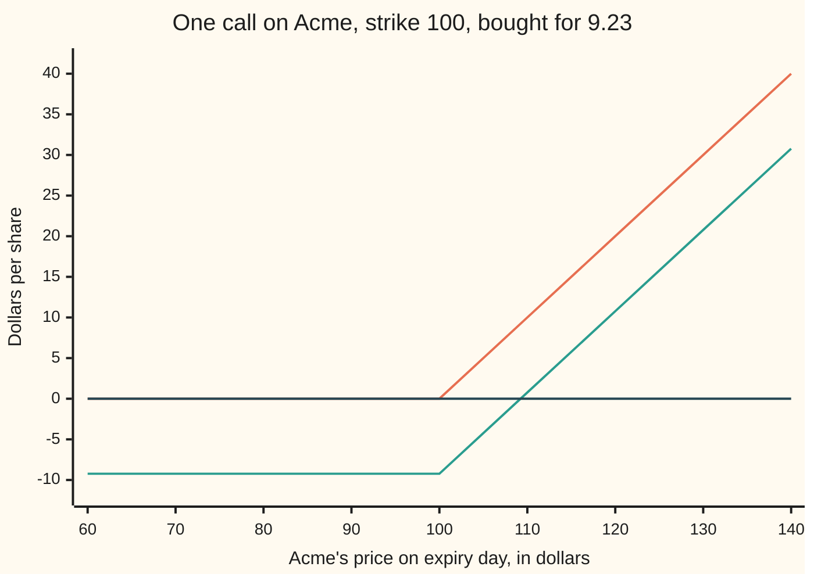
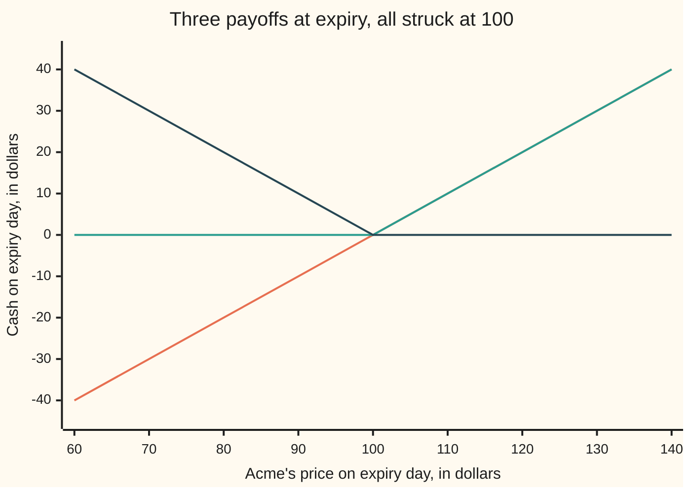
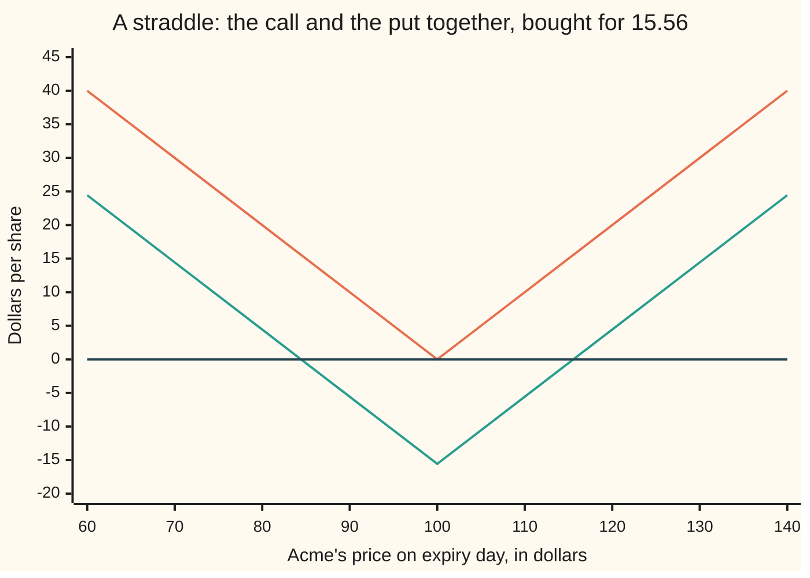

# Payoffs: long and short, calls and puts, and the diagram that shows what you get at the end

[Syllabus](../../../SYLLABUS.md) → [Financial mathematics](../../../SYLLABUS.md#w12) → [Contracts and No-Arbitrage](../../../SYLLABUS.md#w12-s03) → Payoffs

---

## General Overview

Acme shares trade at $100.00 today. Three tickets sit on a desk. Each names the same share, the same price of $100.00, and the same day, one year from today.

The first ticket is a **forward**: an obligation to buy one Acme share for $100.00 on that day, whatever Acme is worth by then. Neither side may walk away, and no premium changes hands for it — though struck at $100.00 it is not worth nothing, as the worked numbers show. The second is a **call**: the right, not the duty, to buy one share for $100.00 that day. It costs $9.23. The third is a **put**: the right to sell one share for $100.00 that day. It costs $6.33.

On expiry day one number settles all three: Acme's price that morning. Each ticket is a rule that turns that number into one cash amount. That rule is the contract's **payoff**, and for pricing it is the whole of the contract.

A payoff counts what the contract hands over on the day, and nothing else. **Profit** subtracts what the ticket cost. The two differ by a fixed amount, and confusing them is the most expensive mistake on this shelf: Acme finishing at exactly $100.00 pays the call holder nothing, and leaves that holder down $9.23.

Holding a ticket is a **long** position; having sold one is a **short** position. One ledger, read from two ends: every dollar the long side receives, the short side pays. So these diagrams come in mirror-image pairs.

**A payoff is a rule that turns the single price on expiry day into a single cash amount; drawn against that price it is a straight line with at most one bend, and profit is that same line pushed down by what the contract cost.**

**What kind of fact this is:** a definition. A payoff records what the contract promises, so the diagram is bookkeeping, not a model. The one theorem here — a long call minus a long put is a forward — is proved in Why it works.

### The picture: the long call, bought for $9.23



The upper line is the payoff: flat at zero while Acme finishes below $100.00, then rising a dollar for every dollar above. The middle line is that shape dropped by the $9.23 premium — the profit. The third marks zero, and profit crosses it at $109.23, the **break-even** price. Below $100.00 the loss stops at $9.23 however far Acme falls, and that floor is the reason to buy the ticket rather than the share.

---

## The formula

One piece of notation first. A raised plus sign after a bracket means *keep this if it is positive, otherwise zero*. So $(S_T - K)^+$ reads "the positive part of the price minus the strike": the gap when there is one, nothing when there is not.

Write $S_T$ for Acme's price on expiry day, and $K$ for the **strike**, the price written on the ticket. Per share, the three payoffs are

$$f(S_T) = S_T - K, \qquad c(S_T) = (S_T - K)^+, \qquad p(S_T) = (K - S_T)^+$$

**Read it aloud:** the forward pays the gap between the closing price and the agreed price whichever way it runs; the call keeps that gap only when it is a gain; the put keeps the opposite gap only when it is a gain.

Position and cost come next. Let $a$ be the signed size: $+1$ for one contract held, $-1$ for one written. Let $V_0$ be what one contract costs today, per share. Profit at expiry on a call position is

$$\Pi(S_T) = a\,\bigl[\,c(S_T) - V_0\,\bigr]$$

**Read it aloud:** take what the contract pays, subtract what was paid for it, then scale by the position — sign flipped if the position was sold rather than bought.

Swap $c$ for $p$ or $f$ for the other two. All three tickets carry the same strike, so their diagrams lay over one another; a forward is normally written instead at the delivery price that makes $V_0$ zero, and which price that is, is [Forward price](03-forward-price-by-cash-and-carry.md).

Break-even is the price at which profit is zero. A long call bought for a positive premium has exactly one, and which number it is depends on where the premium is dated:

$$S_T = K + V_0 \qquad\text{or}\qquad S_T = K + V_0\,e^{rT}$$

The left leaves the premium at today's date. The right carries it to expiry at the riskless rate $r$ over $T$ years — the honest comparison, since the premium was paid a year before the payoff arrives. For the Acme call the two read $109.23 and $109.70.

| Symbol | Plain meaning | In our example | Push it up and the answer… |
| --- | --- | --- | --- |
| $S_T$ | Acme's price on expiry day: the one number every payoff reads | 60.00 to 140.00 in the tables | each contract slides along its line |
| $K$ | the strike: the price written on the ticket | 100.00 | the call pays less, the put more |
| $c$ | the call's payoff: the gain above the strike kept, the loss below dropped | 0.00 at 90.00, 10.00 at 110.00 | — |
| $p$ | the put's payoff: the same rule the other way round | 10.00 at 90.00, 0.00 at 110.00 | — |
| $f$ | the forward's payoff, with no choice in it | −10.00 at 90.00, 10.00 at 110.00 | — |
| $a$ | signed size: +1 for one held, −1 for one written | +1 | the line steepens; a minus sign turns it upside down |
| $V_0$ | what one contract costs today, per share | 9.23 call, 6.33 put | break-even moves further away |
| $\Pi$ | profit at expiry: payoff less what was paid | −9.23 at 100.00 | — |
| $S_0$ | Acme's price today | 100.00 | calls cost more, puts less |
| $r$ | the riskless rate, continuously compounded | 5% | the financed break-even rises |
| $q$ | the dividend yield the share pays out | 2% | — |
| $T$ | time to expiry, in years | 1 | — |

### When it holds

- **Exercise happens on expiry day only.** These are European contracts: one decision, one date. A contract usable earlier is a different promise, and this diagram is only its last day.
- **The share can be bought or sold at that price at that moment.** The call payoff assumes exercising and selling straight away. Where dealing costs a spread, every line drops by it and break-even moves the same distance right.
- **One share per contract, no fees, no tax, no default.** Each shifts a line down bodily rather than bending it, so the shape survives and the crossing moves.
- **The premium and the payoff are dated a year apart.** Added as though same-dated they understate break-even: $109.23 against $109.70 once the premium is carried at 5%.
- **Prices are not negative.** Quantities that can go below zero — a rate spread, a power price — need the same algebra restated on that range.

---

## Why it works

### Step 0: on expiry day there is only one unknown left

Before expiry, what a contract is worth depends on where Acme might still go, on how long is left, on how jumpy the share is. On the morning of expiry all of that has happened. One number remains — Acme's price that day — and every clause settles by reading it.

So a European contract collapses into a function of a single number, and such a function can be drawn on a page. That collapse makes the rest of the shelf possible: two contracts paying the same cash at every ending price are the same contract, whatever their paperwork says.

### Step 1: the choice is arithmetic, not judgement

A call holder on expiry day faces two ledgers and no third option. Use the ticket: hand over $K$, take a share worth $S_T$, sell it, and the cash is $S_T - K$. Decline, and nothing moves. Above the strike the first ledger wins, below it the second, and at the strike both are zero. The payoff is the larger of the two, which is exactly $(S_T - K)^+$.

No forecast and no preference enters. The code computes every payoff twice — from the positive-part formula, and by walking both ledgers and keeping the better one — and the two agree at all 801 prices tested, quarter-dollar steps that straddle the strike where the line bends.

The put runs the same way reversed: buy a share for $S_T$, hand it over for $K$, keep $K - S_T$ when that is positive. The forward has no second ledger at all. That is the difference between an obligation and a right, and why a right is never free.

### Step 2: the short side is the long side upside down

Every dollar under a contract moves between two parties. The call's writer takes the premium today and must deliver a share for $K$ if asked. On expiry day the writer's cash is the call's payoff with a minus sign: zero when the holder walks away, a loss with no floor as Acme climbs. Setting $a = -1$ does that, and the code builds its short row from the writer's own ledger rather than by negating the holder's.

A long call's loss is capped at the premium and its gain is not. A short call is that sentence with the two words swapped: the gain is capped, the loss is not. Selling options is not a capped-risk trade; the cap is on the good side.

### Step 3: a long call minus a long put is a forward

Put the three payoffs on one page.



The straight line through the middle is the forward. The flat-then-rising line is the call. The falling-then-flat line is the put.

Read the chart at $90.00: the forward loses $10.00, the call pays nothing, the put pays $10.00, so call minus put is −$10.00 — the forward. At $120.00 the forward and the call both pay $20.00 and the put nothing, so call minus put is $20.00. It holds at every price:

$$c(S_T) - p(S_T) = f(S_T)$$

**Read it aloud:** holding a call and having written a put at the same strike is an obligation to buy the share at that strike — a forward, assembled from two options.

<details>
<summary>Detailed proof: the three cases, and the signed version</summary>

Split on the sign of $S_T - K$: above the strike, below it, or equal. That is every case.

- Above: $c = S_T - K$ and $p = 0$, so $c - p = S_T - K = f$.
- Below: $c = 0$ and $p = K - S_T$, so $c - p = -(K - S_T) = S_T - K = f$.
- Equal: both positive parts are zero, and so is $f$.

Multiplying by one signed size preserves it, since $a(c - p) = ac - ap$. With $a = 0$ every term is zero, so an empty position satisfies the identity rather than breaking it; written as a ratio it would need a division by the size and would lose that case.

This is a statement about cash on expiry day, not about what the two tickets cost today. Turning it into a statement about prices is the next card.

</details>

### Step 4: payoffs add, so any bent line can be built

Cash adds. Hold two contracts and the money arriving on expiry day is the sum of the two payoffs, price by price. A portfolio's diagram is its parts' diagrams stacked, each keeping its own bend at its own strike.

Buying the call and the put together at the same strike is a **straddle**. Its payoff is the distance from the strike either way — a V with its point at $100.00. It costs $9.23 plus $6.33, so profit is that V dropped by $15.56, and it crosses zero twice.



The upper V is the straddle's payoff, the lower V its profit after the $15.56, the flat line zero. Profit turns positive below $84.44 and above $115.56. A straddle is a position on movement, not direction: it pays if Acme ends far enough from $100.00 either way, and loses most if Acme sits still.

Stacking runs the other way too. The code takes the call apart into 100,000 thin bets — one per price level above the strike, each paying a sliver if Acme clears it — and adding the slivers back rebuilds the call's payoff to within a billionth of a dollar. Any payoff drawn as a line can be built from simple pieces, and what the pieces cost is how the line gets a price. The simplest piece has a card of its own, [Cash-or-nothing digital](../10-Digitals%20and%20the%20implied%20density/01-cash-or-nothing-digital.md).

### Step 5: where the profit line crosses zero

Setting $\Pi$ to zero for a long call with a positive premium gives $(S_T - K)^+ = V_0$. The right side is positive, so the flat branch cannot supply it: the live branch is the sloping one, $S_T - K = V_0$, and $S_T = K + V_0$. One crossing, not two, and it exists for every positive premium.

The boundary cases are the interesting part. A ticket that cost nothing breaks even at every price at or below the strike, since both sides are then zero — an interval, not a point. A position of zero size breaks even everywhere, no cash having moved. Dividing through by the size would lose both.

The code finds the same crossing a second way, by bisection: take a price where profit is negative and one where it is positive, halve the interval two hundred times, and read where the sign changes. The bisection knows nothing of strikes or premiums; it only asks the profit line for its sign. It lands on $109.227006, and so does the algebra.

One route was not taken here. A payoff can also be built from the other end, by holding shares and cash and adjusting them as the price moves until the expiry-day cash matches. That is [Replication](06-replication-and-self-financing.md): how a shape acquires a price instead of only a picture.

---

## Worked numbers, by hand

One share of Acme, strike $100.00, one year. The call cost $9.23 and the put $6.33.

| Step | Arithmetic | Value |
| --- | --- | --- |
| call payoff at 90.00 | the positive part of 90.00 − 100.00 | 0.00 |
| call profit there | 0.00 − 9.23 | −9.23 |
| call payoff at 110.00 | the positive part of 110.00 − 100.00 | 10.00 |
| call profit there | 10.00 − 9.23 | 0.77 |
| call payoff at 140.00 | 140.00 − 100.00 | 40.00 |
| call profit there | 40.00 − 9.23 | 30.77 |
| put payoff at 90.00 | the positive part of 100.00 − 90.00 | 10.00 |
| call minus put at 90.00 | 0.00 − 10.00 | −10.00, the forward |
| break-even, premium left at today's date | 100.00 + 9.23 | **109.23** |
| the premium carried to expiry at 5% | 9.23 × e^{0.05} | 9.70 |
| break-even, premium financed | 100.00 + 9.70 | **109.70** |
| straddle cost | 9.23 + 6.33 | 15.56 |
| straddle break-evens | 100.00 − 15.56 and 100.00 + 15.56 | **84.44 and 115.56** |

So the ticket that cost $9.23 needed Acme above $109.23 on the day to have been worth buying, and above $109.70 if the $9.23 was borrowed.

The shelf's two premiums are not free-standing numbers. Carry Step 3's identity into today's money and the call's price less the put's must equal $S_0 e^{-qT} - K e^{-rT}$: $2.896925 both ways, on two lines of the output. That figure is also what the forward struck at $100.00 is worth today, since Step 3 makes that forward the call held against the put written. Why it must be so is the next card.

### What breaks if you drop a piece

| Mistake | Comes out at | What went wrong |
| --- | --- | --- |
| Payoff read as profit | 0.00 at 100.00, with the position down 9.23 | A payoff ignores what the ticket cost |
| Break-even read at the strike | 100.00, not 109.23 | The first 9.23 of gain only repays the premium |
| Premium never carried to expiry | 109.23, not 109.70 | Cashflows a year apart, added as if same-dated |
| "A short call is capped-risk" | −40.00 at 140.00, and falling | The cap is on the gain; the loss has no floor |
| The put's gap written the call's way | 0.00 at 90.00, not 10.00 | A put pays when the price ends *below* the strike |
| Straddle break-evens from one premium | 90.77 and 109.23, both losing | A straddle costs both premiums, 15.56 |

The code prints all six.

---

## Code, from first principles, and it actually runs

Nothing is imported that already knows an answer; the only library call is the exponential, for the discount and growth factors. Payoffs are built four ways: the positive-part formula, the holder's exercise ledger, the writer's ledger on the far side of the same contract, and a stack of 100,000 thin cash bets summed by hand. The first three are compared at 801 prices a quarter of a dollar apart, so the bend at the strike is crossed rather than jumped. Each break-even is found twice, by a bisection written out in the file and by the algebra it is compared against.

### Python

```python
# Payoffs and positions -- the check behind the card.  Nothing is imported that
# already knows an answer: the root finder is written out here, and the only
# library call is exp, for the discount and growth factors.  One share of Acme,
# strike 100, European exercise one year from today.  Payoffs are built four ways
# -- the positive-part formula, the holder's ledger, the writer's ledger and a
# stack of thin cash bets -- and every break-even twice, by bisection and algebra.
from math import exp

K = 100.0                                     # the strike written on the tickets
CALL, PUT = 9.227005508154, 6.330080627550    # today's quoted premiums, one share
S0, R, Q, T = 100.0, 0.05, 0.02, 1.0          # Acme today, rates, dividend, years
STRADDLE = CALL + PUT                         # buying the call and the put together
GRID = [60.0 + 10.0 * i for i in range(9)]    # the nine prices the table shows
FINE = [0.25 * i for i in range(801)]         # 801 prices, 0.00 to 200.00, across the bend


def pos(x):                                   # the positive part: a gain kept, a loss dropped
    return x if x > 0.0 else 0.0


def by_formula(s, kind):                      # road 1: the payoff as a positive part
    if kind == "forward":
        return s - K
    if kind == "call":
        return pos(s - K)
    return pos(K - s)


def by_ledger(s, kind):                       # road 2: the cash the holder actually moves
    if kind == "forward":
        return s - K                          # no choice: hand over K, hold a share worth s
    if kind == "call":
        use = s - K                           # hand over K, sell the share for s
    else:
        use = K - s                           # buy a share for s, hand it over for K
    return use if use > 0.0 else 0.0          # or walk away, and no cash moves at all


def by_writer(s):                             # road 3: the same call from the writer's side
    called = by_ledger(s, "call") > 0.0       # the holder exercises only when it pays
    return (K - s) if called else 0.0         # deliver a share worth s, receive the strike


def by_digitals(s, n=100000, hi=200.0):
    # road 4: a call is a stack of thin bets, one for each price level above the
    # strike, each paying h if Acme clears that level.  No positive part is used.
    h = (hi - K) / n
    total = 0.0
    for i in range(n):
        if s > K + (i + 0.5) * h:
            total += h
    return total


def bisect(g, lo, hi, steps=200):             # our own root finder, halving an interval
    for _ in range(steps):
        mid = 0.5 * (lo + hi)
        if (g(lo) > 0.0) == (g(mid) > 0.0):
            lo = mid
        else:
            hi = mid
    return 0.5 * (lo + hi)


def yn(claim):
    return "yes" if claim else "no"


call_pay = [by_formula(s, "call") for s in GRID]
put_pay = [by_formula(s, "put") for s in GRID]
fwd_pay = [by_formula(s, "forward") for s in GRID]
digital = [by_digitals(s) for s in GRID]
rows = [
    ("long forward", fwd_pay),
    ("long call", call_pay),
    ("long put", put_pay),
    ("short call, the writer's ledger", [by_writer(s) for s in GRID]),
    ("call minus put", [c - p for c, p in zip(call_pay, put_pay)]),
    ("long call, from thin cash bets", digital),
    ("straddle, call plus put", [c + p for c, p in zip(call_pay, put_pay)]),
    ("long call profit, less 9.23", [v - CALL for v in call_pay]),
    ("straddle profit, less 15.56", [c + p - STRADDLE for c, p in zip(call_pay, put_pay)]),
]
print("One share of Acme, strike 100.  Acme's price on expiry day runs across.")
print(f"{'Acme at expiry':<32}" + "".join(f"{s:>8.2f}" for s in GRID))
for name, vals in rows:
    print(f"{name:<32}" + "".join(f"{v:>8.2f}" for v in vals))

ledger_ok = all(by_formula(s, k) == by_ledger(s, k)
                for s in FINE for k in ("forward", "call", "put"))
identity_ok = all(abs(by_formula(s, "call") - by_formula(s, "put") - (s - K)) < 1e-12 for s in FINE)
writer_ok = all(by_formula(s, "call") + by_writer(s) == 0.0 for s in FINE)
digital_gap = max(abs(d - c) for d, c in zip(digital, call_pay))
print()
print(f"{'holder ledger matches the formula, 801 prices':<50}{yn(ledger_ok):>10}")
print(f"{'call minus put equals the forward, 801 prices':<50}{yn(identity_ok):>10}")
print(f"{'writer ledger mirrors the holder, 801 prices':<50}{yn(writer_ok):>10}")
print(f"{'largest gap, thin-bet call against the formula':<50}{digital_gap:>10.6f}")

be_call = bisect(lambda s: by_formula(s, "call") - CALL, K, 200.0)
be_low = bisect(lambda s: by_formula(s, "call") + by_formula(s, "put") - STRADDLE, 0.0, K)
be_high = bisect(lambda s: by_formula(s, "call") + by_formula(s, "put") - STRADDLE, K, 200.0)
carried = CALL * exp(R * T)
priced = [
    ("call premium quoted today", CALL),
    ("put premium quoted today", PUT),
    ("call minus put, in today's money", CALL - PUT),
    ("  S e^-qT - K e^-rT", S0 * exp(-Q * T) - K * exp(-R * T)),
    ("long call break-even, by bisection", be_call),
    ("  the same, strike plus premium", K + CALL),
    ("premium carried to expiry at 5 percent", carried),
    ("  break-even once the premium is financed", K + carried),
    ("straddle cost today", STRADDLE),
    ("straddle break-even below, by bisection", be_low),
    ("  the same, strike minus cost", K - STRADDLE),
    ("straddle break-even above, by bisection", be_high),
    ("  the same, strike plus cost", K + STRADDLE),
]
print()
for name, v in priced:
    print(f"{name:<42}{v:>14.6f}")

print()
print(f"mistake 1, payoff read as profit, Acme at 100: {by_formula(100.0, 'call'):.2f}, "
      f"when the position is down {CALL:.2f}")
print(f"mistake 2, break-even read at the strike: {K:.2f}, not {K + CALL:.2f}")
print(f"mistake 3, premium never carried to expiry: {K + CALL:.2f}, not {K + carried:.2f}")
print(f"mistake 4, short call called a capped loss: {by_writer(140.0):.2f} "
      f"at 140, and falling")
print(f"mistake 5, put's gap written the call's way, Acme at 90: "
      f"{by_formula(90.0, 'call'):.2f}, not {by_formula(90.0, 'put'):.2f}")
print(f"mistake 6, straddle break-evens from one premium: {K - CALL:.2f} and {K + CALL:.2f}")
assert ledger_ok and identity_ok and writer_ok       # four roads, one set of payoffs
assert digital_gap < 1e-9                            # thin bets rebuild the call's payoff
assert abs(be_call - (K + CALL)) < 1e-9              # bisection against the algebra
assert abs(be_low - (K - STRADDLE)) < 1e-9
assert abs(be_high - be_low - 2.0 * STRADDLE) < 1e-9
assert abs((CALL - PUT) - (S0 * exp(-Q * T) - K * exp(-R * T))) < 1e-9
print("ALL CHECKS PASS")
```

**Ran 2026-09-14 on macOS, Python 3.14.6, standard library only. All checks passed. Output, pasted from the run:**

```
One share of Acme, strike 100.  Acme's price on expiry day runs across.
Acme at expiry                     60.00   70.00   80.00   90.00  100.00  110.00  120.00  130.00  140.00
long forward                      -40.00  -30.00  -20.00  -10.00    0.00   10.00   20.00   30.00   40.00
long call                           0.00    0.00    0.00    0.00    0.00   10.00   20.00   30.00   40.00
long put                           40.00   30.00   20.00   10.00    0.00    0.00    0.00    0.00    0.00
short call, the writer's ledger     0.00    0.00    0.00    0.00    0.00  -10.00  -20.00  -30.00  -40.00
call minus put                    -40.00  -30.00  -20.00  -10.00    0.00   10.00   20.00   30.00   40.00
long call, from thin cash bets      0.00    0.00    0.00    0.00    0.00   10.00   20.00   30.00   40.00
straddle, call plus put            40.00   30.00   20.00   10.00    0.00   10.00   20.00   30.00   40.00
long call profit, less 9.23        -9.23   -9.23   -9.23   -9.23   -9.23    0.77   10.77   20.77   30.77
straddle profit, less 15.56        24.44   14.44    4.44   -5.56  -15.56   -5.56    4.44   14.44   24.44

holder ledger matches the formula, 801 prices            yes
call minus put equals the forward, 801 prices            yes
writer ledger mirrors the holder, 801 prices             yes
largest gap, thin-bet call against the formula      0.000000

call premium quoted today                       9.227006
put premium quoted today                        6.330081
call minus put, in today's money                2.896925
  S e^-qT - K e^-rT                             2.896925
long call break-even, by bisection            109.227006
  the same, strike plus premium               109.227006
premium carried to expiry at 5 percent          9.700084
  break-even once the premium is financed     109.700084
straddle cost today                            15.557086
straddle break-even below, by bisection        84.442914
  the same, strike minus cost                  84.442914
straddle break-even above, by bisection       115.557086
  the same, strike plus cost                  115.557086

mistake 1, payoff read as profit, Acme at 100: 0.00, when the position is down 9.23
mistake 2, break-even read at the strike: 100.00, not 109.23
mistake 3, premium never carried to expiry: 109.23, not 109.70
mistake 4, short call called a capped loss: -40.00 at 140, and falling
mistake 5, put's gap written the call's way, Acme at 90: 0.00, not 10.00
mistake 6, straddle break-evens from one premium: 90.77 and 109.23
ALL CHECKS PASS
```

### Rust

Same numbers, same labels, built with `rustc --edition 2021 -O`.

```rust
// Payoffs and positions -- the same check as payoffs_and_positions_check.py, in
// Rust.  Std only, no crates.  One share of Acme, strike 100, European exercise
// one year from today.  Payoffs are built four ways -- the positive-part formula,
// the holder's ledger, the writer's ledger and a stack of thin cash bets -- and
// every break-even twice, by a bisection written out here and by algebra.
// Compile: rustc --edition 2021 -O payoffs_and_positions_check.rs -o chk
const K: f64 = 100.0;                      // the strike written on the tickets
const CALL: f64 = 9.227005508154;          // today's quoted call premium, one share
const PUT: f64 = 6.330080627550;           // today's quoted put premium, one share
const S0: f64 = 100.0;                     // Acme today
const R: f64 = 0.05;                       // the riskless rate
const Q: f64 = 0.02;                       // the dividend yield
const T: f64 = 1.0;                        // years to expiry

fn pos(x: f64) -> f64 {                    // the positive part: a gain kept, a loss dropped
    if x > 0.0 { x } else { 0.0 }
}

fn by_formula(s: f64, kind: &str) -> f64 { // road 1: the payoff as a positive part
    match kind {
        "forward" => s - K,
        "call" => pos(s - K),
        _ => pos(K - s),
    }
}

fn by_ledger(s: f64, kind: &str) -> f64 {  // road 2: the cash the holder actually moves
    if kind == "forward" {
        return s - K;                      // no choice: hand over K, hold a share worth s
    }
    let use_it = if kind == "call" {
        s - K                              // hand over K, sell the share for s
    } else {
        K - s                              // buy a share for s, hand it over for K
    };
    if use_it > 0.0 { use_it } else { 0.0 } // or walk away, and no cash moves at all
}

fn by_writer(s: f64) -> f64 {              // road 3: the same call from the writer's side
    let called = by_ledger(s, "call") > 0.0; // the holder exercises only when it pays
    if called { K - s } else { 0.0 }       // deliver a share worth s, receive the strike
}

fn by_digitals(s: f64) -> f64 {
    // road 4: a call is a stack of thin bets, one for each price level above the
    // strike, each paying h if Acme clears that level.  No positive part is used.
    let (n, hi) = (100000_i64, 200.0_f64);
    let h = (hi - K) / n as f64;
    let mut total = 0.0;
    for i in 0..n {
        if s > K + (i as f64 + 0.5) * h {
            total += h;
        }
    }
    total
}

fn bisect<F: Fn(f64) -> f64>(g: F, mut lo: f64, mut hi: f64) -> f64 {
    for _ in 0..200 {                      // our own root finder, halving an interval
        let mid = 0.5 * (lo + hi);
        if (g(lo) > 0.0) == (g(mid) > 0.0) { lo = mid } else { hi = mid }
    }
    0.5 * (lo + hi)
}

fn yn(claim: bool) -> &'static str { if claim { "yes" } else { "no" } }

fn main() {
    let grid: Vec<f64> = (0..9).map(|i| 60.0 + 10.0 * i as f64).collect();
    let fine: Vec<f64> = (0..801).map(|i| 0.25 * i as f64).collect();
    let straddle = CALL + PUT;             // buying the call and the put together
    let call_pay: Vec<f64> = grid.iter().map(|&s| by_formula(s, "call")).collect();
    let put_pay: Vec<f64> = grid.iter().map(|&s| by_formula(s, "put")).collect();
    let fwd_pay: Vec<f64> = grid.iter().map(|&s| by_formula(s, "forward")).collect();
    let digital: Vec<f64> = grid.iter().map(|&s| by_digitals(s)).collect();
    let short_call: Vec<f64> = grid.iter().map(|&s| by_writer(s)).collect();
    let minus: Vec<f64> = call_pay.iter().zip(&put_pay).map(|(c, p)| c - p).collect();
    let both: Vec<f64> = call_pay.iter().zip(&put_pay).map(|(c, p)| c + p).collect();
    let call_profit: Vec<f64> = call_pay.iter().map(|&v| v - CALL).collect();
    let both_profit: Vec<f64> = both.iter().map(|&v| v - straddle).collect();
    let rows: Vec<(&str, &Vec<f64>)> = vec![
        ("long forward", &fwd_pay),
        ("long call", &call_pay),
        ("long put", &put_pay),
        ("short call, the writer's ledger", &short_call),
        ("call minus put", &minus),
        ("long call, from thin cash bets", &digital),
        ("straddle, call plus put", &both),
        ("long call profit, less 9.23", &call_profit),
        ("straddle profit, less 15.56", &both_profit),
    ];
    println!("One share of Acme, strike 100.  Acme's price on expiry day runs across.");
    let mut head = format!("{:<32}", "Acme at expiry");
    for s in &grid { head.push_str(&format!("{:>8.2}", s)); }
    println!("{}", head);
    for (name, vals) in &rows {
        let mut line = format!("{:<32}", name);
        for v in vals.iter() { line.push_str(&format!("{:>8.2}", v)); }
        println!("{}", line);
    }

    let ledger_ok = fine.iter().all(|&s| ["forward", "call", "put"].iter()
        .all(|k| by_formula(s, k) == by_ledger(s, k)));
    let identity_ok = fine.iter()
        .all(|&s| (by_formula(s, "call") - by_formula(s, "put") - (s - K)).abs() < 1e-12);
    let writer_ok = fine.iter().all(|&s| by_formula(s, "call") + by_writer(s) == 0.0);
    let digital_gap = (0..grid.len()).map(|i| (digital[i] - call_pay[i]).abs())
        .fold(0.0_f64, f64::max);
    println!();
    println!("{:<50}{:>10}", "holder ledger matches the formula, 801 prices", yn(ledger_ok));
    println!("{:<50}{:>10}", "call minus put equals the forward, 801 prices", yn(identity_ok));
    println!("{:<50}{:>10}", "writer ledger mirrors the holder, 801 prices", yn(writer_ok));
    println!("{:<50}{:>10.6}", "largest gap, thin-bet call against the formula", digital_gap);

    let be_call = bisect(|s| by_formula(s, "call") - CALL, K, 200.0);
    let cost = |s: f64| by_formula(s, "call") + by_formula(s, "put") - straddle;
    let be_low = bisect(cost, 0.0, K);
    let be_high = bisect(cost, K, 200.0);
    let carried = CALL * (R * T).exp();
    let priced: Vec<(&str, f64)> = vec![
        ("call premium quoted today", CALL),
        ("put premium quoted today", PUT),
        ("call minus put, in today's money", CALL - PUT),
        ("  S e^-qT - K e^-rT", S0 * (-Q * T).exp() - K * (-R * T).exp()),
        ("long call break-even, by bisection", be_call),
        ("  the same, strike plus premium", K + CALL),
        ("premium carried to expiry at 5 percent", carried),
        ("  break-even once the premium is financed", K + carried),
        ("straddle cost today", straddle),
        ("straddle break-even below, by bisection", be_low),
        ("  the same, strike minus cost", K - straddle),
        ("straddle break-even above, by bisection", be_high),
        ("  the same, strike plus cost", K + straddle),
    ];
    println!();
    for (name, v) in &priced { println!("{:<42}{:>14.6}", name, v); }

    println!();
    println!("mistake 1, payoff read as profit, Acme at 100: {:.2}, when the position is down {:.2}",
             by_formula(100.0, "call"), CALL);
    println!("mistake 2, break-even read at the strike: {:.2}, not {:.2}", K, K + CALL);
    println!("mistake 3, premium never carried to expiry: {:.2}, not {:.2}", K + CALL, K + carried);
    println!("mistake 4, short call called a capped loss: {:.2} at 140, and falling",
             by_writer(140.0));
    println!("mistake 5, put's gap written the call's way, Acme at 90: {:.2}, not {:.2}",
             by_formula(90.0, "call"), by_formula(90.0, "put"));
    println!("mistake 6, straddle break-evens from one premium: {:.2} and {:.2}", K - CALL, K + CALL);
    assert!(ledger_ok && identity_ok && writer_ok);    // four roads, one set of payoffs
    assert!(digital_gap < 1e-9);                       // thin bets rebuild the call's payoff
    assert!((be_call - (K + CALL)).abs() < 1e-9);      // bisection against the algebra
    assert!((be_low - (K - straddle)).abs() < 1e-9);
    assert!((be_high - be_low - 2.0 * straddle).abs() < 1e-9);
    assert!(((CALL - PUT) - (S0 * (-Q * T).exp() - K * (-R * T).exp())).abs() < 1e-9);
    println!("ALL CHECKS PASS");
}
```

**Ran 2026-09-14 on macOS, rustc 1.98.1, no crates. All checks passed. Output, pasted from the run:**

```
One share of Acme, strike 100.  Acme's price on expiry day runs across.
Acme at expiry                     60.00   70.00   80.00   90.00  100.00  110.00  120.00  130.00  140.00
long forward                      -40.00  -30.00  -20.00  -10.00    0.00   10.00   20.00   30.00   40.00
long call                           0.00    0.00    0.00    0.00    0.00   10.00   20.00   30.00   40.00
long put                           40.00   30.00   20.00   10.00    0.00    0.00    0.00    0.00    0.00
short call, the writer's ledger     0.00    0.00    0.00    0.00    0.00  -10.00  -20.00  -30.00  -40.00
call minus put                    -40.00  -30.00  -20.00  -10.00    0.00   10.00   20.00   30.00   40.00
long call, from thin cash bets      0.00    0.00    0.00    0.00    0.00   10.00   20.00   30.00   40.00
straddle, call plus put            40.00   30.00   20.00   10.00    0.00   10.00   20.00   30.00   40.00
long call profit, less 9.23        -9.23   -9.23   -9.23   -9.23   -9.23    0.77   10.77   20.77   30.77
straddle profit, less 15.56        24.44   14.44    4.44   -5.56  -15.56   -5.56    4.44   14.44   24.44

holder ledger matches the formula, 801 prices            yes
call minus put equals the forward, 801 prices            yes
writer ledger mirrors the holder, 801 prices             yes
largest gap, thin-bet call against the formula      0.000000

call premium quoted today                       9.227006
put premium quoted today                        6.330081
call minus put, in today's money                2.896925
  S e^-qT - K e^-rT                             2.896925
long call break-even, by bisection            109.227006
  the same, strike plus premium               109.227006
premium carried to expiry at 5 percent          9.700084
  break-even once the premium is financed     109.700084
straddle cost today                            15.557086
straddle break-even below, by bisection        84.442914
  the same, strike minus cost                  84.442914
straddle break-even above, by bisection       115.557086
  the same, strike plus cost                  115.557086

mistake 1, payoff read as profit, Acme at 100: 0.00, when the position is down 9.23
mistake 2, break-even read at the strike: 100.00, not 109.23
mistake 3, premium never carried to expiry: 109.23, not 109.70
mistake 4, short call called a capped loss: -40.00 at 140, and falling
mistake 5, put's gap written the call's way, Acme at 90: 0.00, not 10.00
mistake 6, straddle break-evens from one premium: 90.77 and 109.23
ALL CHECKS PASS
```

The two outputs match line for line.

> [!TIP]
> **Try changing**
> Guess first, then run it. An assert is a line that stops the program when a number comes out wrong, and these are pinned to the Acme tickets, so expect one to stop it.
> - **Move the strike.** Set `K` to `120.0`. Break-even follows the strike up and both roads still agree, but the premiums belong to the old strike, so the last assert — the one tying the quoted pair to the discounted share and strike — stops the run.
> - **Make the ticket free.** Set `CALL` to `0.0`. Profit rises onto the payoff line, break-even slides down to the strike, and the straddle's crossings close in to the put's premium either side. The last assert stops it again.
> - **Coarsen the stack of thin bets.** Set `n` to `7` in `by_digitals`. Seven bets cannot follow a line that bends: the gap against the formula opens by several dollars, and the second assert stops the run.
> - **Look past the top of the stack.** Add `260.0` to `GRID`. The formula prices the call there, but the bets were stacked only as far as 200, so the stack stops rising and the second assert stops it.

---

## The usual mistake

> [!warning]
> **Reading a payoff diagram as a forecast.** The diagram says what each ending price pays. It says nothing about which ending price is likely, and contains no probabilities at all. Two people who disagree completely about Acme's prospects draw the same picture. What is missing — how likely each ending is, and so what the ticket is worth today — is the rest of this shelf.
>
> - **Payoff read as profit.** At $100.00 the payoff is $0.00 and the position is down $9.23. Never the same line.
> - **Break-even placed at the strike.** The first $9.23 above the strike only repays the premium: $109.23, or $109.70 financed.
> - **Selling options called capped-risk income.** The premium caps the gain; nothing caps the loss. The short call is $40.00 down at $140.00, and falling.
> - **The put's gap written the call's way.** A put pays below the strike. The wrong way round it reads $0.00 at $90.00 instead of $10.00.
> - **A combination costed from one leg.** A straddle pays both premiums, $15.56, so it crosses at $84.44 and $115.56, not $90.77 and $109.23.

---

## Where you meet it in real life

- **A broker's option screen.** The diagram beside every quote is this card: payoff, profit and break-even, for whatever strike is selected.
- **Employee share options.** A grant is a call struck near the share price on the grant date. The flat stretch to the left is why a grant can be worth nothing for years, then a great deal quickly.
- **Insurance.** A policy with an excess pays the loss above a threshold and nothing below: the same positive-part rule, with a loss in place of a price. An airline's call on jet fuel is the same ticket, capping the price paid without forcing the purchase.
- **Structured deposits.** "Your money back, plus a share of the index" is a bond plus a call sold as one product: two payoff lines added, each with a cost.
- **The rest of this shelf.** [No arbitrage](02-no-arbitrage-and-the-law-of-one-price.md) turns shapes into prices, and [State prices](07-state-prices-and-risk-neutral-pricing-in-one-period.md) prices each ending separately — what the stack of thin bets was pointing at.

**Conventions verified 14 Sep 2026:** one listed US equity option contract covers 100 shares, so a screen price is per share and the cash paid is a hundred times it; listed equity options are normally American-style, usable any day up to expiry, while most index options are European and cash-settled.

> **Say it back**
> A contract's payoff is the rule that turns the one price on expiry day into one cash amount. A forward pays the gap between that price and the strike either way; a call keeps that gap only when it is a gain, a put only when it runs the other way. Short is long with the sign reversed, so the two sides of one contract add to nothing. Payoffs add, so combinations are lines stacked, and a call minus a put is a forward at every price. Profit is the payoff less what was paid: the Acme call cost $9.23 and needs $109.23 to break even.

---

## What this builds on

- [Negative numbers](../../01-Foundations/01-Everyday%20Arithmetic/06-negative-numbers.md): every one of these diagrams runs below zero, and the short side is the long side multiplied by −1. Losses written as negative numbers are what let one identity cover both sides of a contract.

## Where this goes next

- [No arbitrage](02-no-arbitrage-and-the-law-of-one-price.md): the rule that two contracts paying the same cash in every ending must cost the same today — the step from a shape to a price.

The $9.23 and $6.33 used here were quoted, never justified. What forces those two numbers to be what they are is the next card, and the identity in Step 3 is the lever it uses.

---

## Sources

Verified 14 Sep 2026: every link below resolves to the publisher's page.

- Merton, Robert C. "Theory of Rational Option Pricing." *Bell Journal of Economics and Management Science* 4, no. 1 (1973): 141–183. [doi:10.2307/3003143](https://doi.org/10.2307/3003143). Sets out the call and put payoffs before any pricing model.
- Hull, John C. *Options, Futures, and Other Derivatives*, 11th ed. Pearson. [Publisher page](https://www.pearson.com/en-us/subject-catalog/p/options-futures-and-other-derivatives/P200000005938). The mechanics and trading-strategies chapters draw these diagrams, the straddle included.
- Lo, Andrew W. *Finance Theory I*, lecture 10, "Options." MIT OpenCourseWare 15.401, Fall 2008. [Lecture slides (PDF)](https://ocw.mit.edu/courses/15-401-finance-theory-i-fall-2008/c40ecc0cc0dce0fbf2d229bc4027c43b_MIT15_401F08_lec10.pdf). Payoff and profit diagrams for the four basic positions, worked from the exercise decision.
- FINRA. "Options." [Investor page](https://www.finra.org/investors/investing/investment-products/options). Source for the dated conventions line: contract size, and which listed options are American or European.
