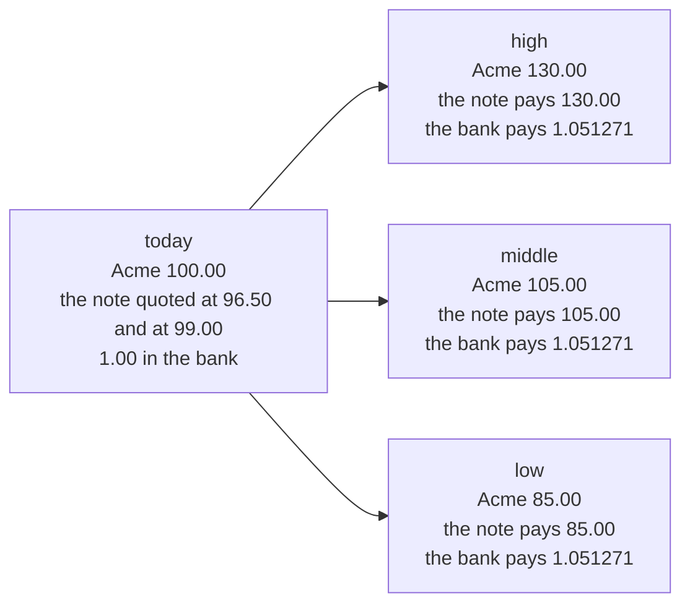
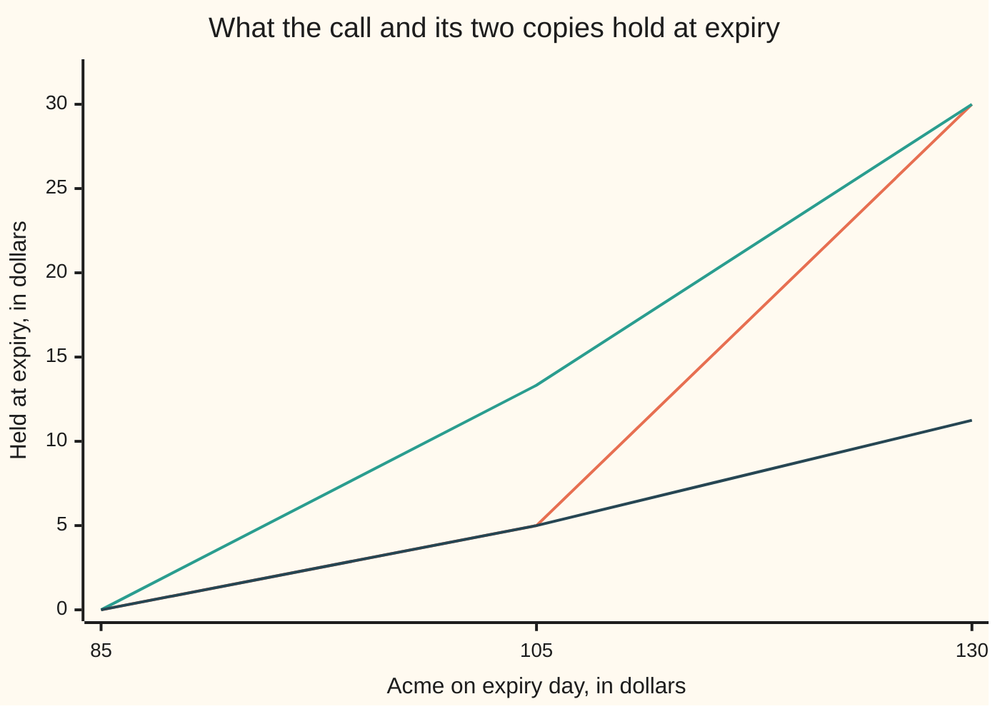

# No arbitrage: you cannot make something from nothing, so same payoff means same price

[Syllabus](../../../SYLLABUS.md) → [Financial mathematics](../README.md) → [Contracts and No-Arbitrage](../README.md#s03) → No arbitrage

---

## General Overview

Two desks are selling the same promise. Each will write a note that pays, one year from today, whatever one Acme share is worth that morning: same share, same day, settled in cash. One asks 96.50 dollars for it. The other asks 99.00.

Buy the note from the cheaper desk and sell it to the dearer one. On expiry day the two promises cancel — whatever one pays in, the other takes out — so what Acme did makes no difference. What is left is the 2.50 collected this morning. Bank it at 5 percent and it is **2.63** on expiry day.

Nothing was forecast and nothing was at risk. A trade like that is an **arbitrage**: it costs nothing to put on, cannot lose, and pays.

Notice what the trade does not show: which desk is wrong. Both could be; it shows only that the two cannot stand at once. That is the engine of the shelf: an unknown price becomes known whenever the thing can be built from things already priced.

The assumption underneath is that the market has been picked over: trades like this get taken, and taking them moves the quotes until they agree.

**Two holdings that pay the same in every scenario must cost the same today, and a holding that never pays less can never cost less.**

**What kind of fact this is:** a theorem, proved in Why it works — but from an assumption. "No arbitrage" models a market with no money left on the floor, not a law of nature; When it holds gives the conditions the proof needs.

### The picture: one morning, three ways the year can end



Acme's closing price is the one thing nobody knows this morning. Three scenarios keep the arithmetic in view; the argument never uses how many there are, only that the list is finite.

---

## The formula

Three words first.

A **scenario** is one complete way the year can turn out: Acme finishing high at 130.00, middle at 105.00 or low at 85.00. Write $\omega$, said "omega", for one of them.

A **position** is anything held from today to expiry — a note, a share, a deposit or loan, any bundle of them, long or short ([Payoffs](01-payoffs-and-positions.md)). Write $p$ for what it costs today, negative if it pays to put on, and $X(\omega)$ for what it is worth at expiry in scenario $\omega$.

An **arbitrage** is a position for which

$$p \le 0, \qquad X(\omega) \ge 0 \;\text{ in every scenario}, \qquad \text{and either } p < 0 \text{ or } X(\omega) > 0 \text{ somewhere.}$$

**Read it aloud:** nothing to pay going in, nothing to lose coming out, and money somewhere — cash today or a gain in some scenario.

*No arbitrage* is the assumption that no position in the market fits that description. The last clause is deliberately weak: a ticket that is free and might pay is already free money.

Two rules follow. Take positions A and B, with prices $p_A$, $p_B$ and payoffs $X_A$, $X_B$.

$$X_A(\omega) = X_B(\omega) \;\text{ in every scenario} \quad\Longrightarrow\quad p_A = p_B$$

**Read it aloud:** same payoff, same price. This is the **law of one price**.

$$X_A(\omega) \ge X_B(\omega) \;\text{ in every scenario} \quad\Longrightarrow\quad p_A \ge p_B$$

**Read it aloud:** a payoff that is never worse cannot be cheaper. This is the **dominance rule**; if A also pays strictly more somewhere, its price is strictly higher.

Two things trade on this card. One is the bank, at 5 percent continuously compounded, as this wing quotes rates: a dollar left in becomes $R$, a dollar due at expiry costs $D$ today, with $r$ the rate as a decimal and $T$ the term in years.

$$R = e^{rT} = 1.051271, \qquad D = e^{-rT} = 0.951229$$

The other is the note, price $P$ = 98.019867 — less than Acme's 100.00, because Acme pays its holders 2 percent a year and the note's holder collects none of it. That level is settled by [Forward price](03-forward-price-by-cash-and-carry.md); this card takes it as given and asks what it forces on everything else.

| Symbol | Plain meaning | In our example | Push it up and the answer… |
| --- | --- | --- | --- |
| $\omega$ | one scenario: a complete way the year turns out | high, middle or low | more scenarios, wider bounds |
| $X$, $X_A$, $X_B$ | a payoff: what a position is worth at expiry, scenario by scenario | 30.00, 5.00, 0.00 for the call | — |
| $p$, $p_A$, $p_B$ | what a position costs today, negative if it pays to put on | 96.50 at one desk, 99.00 at the other | — |
| $r$ | the bank's rate, continuously compounded, as a decimal | 0.05, quoted as 5 percent | both ends of the band rise |
| $T$ | the term in years, today to expiry | 1 | the same as raising $r$ |
| $R$ | what 1.00 in the bank becomes at expiry | 1.051271 | a banked gap grows faster |
| $D$ | the discount factor, written D(T) when the date matters: what 1.00 due at expiry costs today | 0.951229 | the call's floor falls: waiting to pay the strike is worth less |
| $S_T$ | Acme's price on expiry day, the one unknown | 130.00, 105.00 or 85.00 | — |
| $P$ | the note's price today: one Acme share, delivered at expiry | 98.019867 | both ends of the band rise |
| $K$ | the strike: the price written on the call | 100.00 | the call's band slides down |
| $a$ | notes held in a copy | 0.666667 in the dominating copy | — |
| $b$ | dollars due from the bank at expiry, negative when the bank is owed | −56.666667 in that copy | — |
| $C$ | the call's price today, the unknown being bounded | between 4.29 and 11.44 | — |

**Conventions verified 14 Sep 2026:** every rate here is continuously compounded and $T$ counts calendar years. Day-count and compounding conventions differ by market and do change; convert before substituting.

### When it holds

- **Both directions, one price.** What can be bought can be sold short, on the same terms. Bar short selling of the note and the floor loses its trade — 4.291342 falls back to 0.00 — while the ceiling, which writes the call, buys notes and borrows, survives.
- **The quotes on the table agree with each other.** Carried to delivery day the note is 103.045453, between the lowest scenario and the highest. Outside that range the note and the bank are an arbitrage by themselves, and any band drawn from them is worthless.
- **Nothing lost in or out, and both sides pay.** Fees, the gap between the buying and the selling quote, and the cost of borrowing stock eat the gain: at 0.10 a note per leg the 2.50 above nets 2.30 today and 2.417924 at expiry. The dear leg is also someone's promise, and default turns a sure profit into a bet.
- **The scenario list is complete, every entry genuinely possible.** If Acme could also finish at 60.00, the dominating copy below holds −16.666667 against a payoff of 0.00, and its ceiling is gone.
- **Money arriving in between is in the ledger.** Dividends, coupons and margin calls land before expiry. Acme's 2 percent is already inside the note's 98.019867; nothing else is paid here.

---

## Why it works

### Step 0: two moves, and a bank

Two things are done to positions here, both bookkeeping rather than forecast. **Hold two at once:** costs add and payoffs add, scenario by scenario. **Reverse one:** sell what you would have bought, and cost and payoff both change sign.

One position is always available: 1.00 left in the bank, costing 1.00 and paying $R$ = 1.051271 in every scenario. What matters about $R$ is its sign, not its size: it is positive, so banked money stays money.

### Step 1: the difference trade

Take any two positions, A and B, and build a third: hold A, reverse B, put the price difference $p_B - p_A$ in the bank. Its cost today is $p_A - p_B + (p_B - p_A)$ — exactly zero, by the choice of the third leg. Its payoff at expiry in scenario $\omega$ is

$$X_A(\omega) - X_B(\omega) + (p_B - p_A)\,R.$$

Call the left part the payoff difference and the right part the banked gap.

### Step 2: same payoff, same price

Suppose A and B pay the same in every scenario, and A is cheaper. The payoff difference is zero everywhere; the banked gap is a positive gap times a positive $R$. A trade that cost nothing pays in every scenario: an arbitrage. It cannot happen, and swapping the letters rules out the other inequality. The prices are equal, and the law of one price is proved.

The two desks are exactly this. Both notes pay Acme's closing price, so the payoff difference cancels — 130.00 against 130.00, and so down the list — leaving 2.50 banked, 2.628178 at expiry.

### Step 3: never pays less, never costs less

Weaken it: A pays at least as much as B in every scenario, and nothing else is known. Suppose A is still cheaper. The payoff difference is no longer zero, but it is never negative, and the banked gap is still strictly positive; their sum is strictly positive, so the zero-cost trade pays everywhere. Arbitrage again, so A cannot be cheaper. That is the dominance rule, and the law of one price is its two-sided case.

If A pays strictly more somewhere and the prices are equal, no banking is needed: hold A, reverse B, and that trade already costs nothing, never loses, and gains in that scenario. Arbitrage. So A is strictly the dearer.

<details>
<summary>Detailed proof, with the cases written out</summary>

**Setting.** Finitely many scenarios, each genuinely possible. A position has one price fixed this morning and one payoff per scenario. Combining adds prices and payoffs; scaling by a real number multiplies both, and a negative scale is selling short. The bank costs 1 and pays $R > 0$ everywhere.

**Dominance, with one price as its two-sided case.** Suppose A's payoff is at least B's everywhere and A is cheaper. The difference trade — A, minus B, plus $p_B - p_A$ bank units — has price $p_A - p_B + (p_B - p_A) = 0$ and payoff
$$[X_A(\omega) - X_B(\omega)] + (p_B - p_A)R > 0$$
in every scenario: a bracket that is at least 0, plus a positive gap times a positive $R$. Zero cost, a gain everywhere — an arbitrage. None exists, so A is not cheaper. If the payoffs agree exactly the bracket vanishes, and swapping the letters forces the prices equal. If the prices are equal and A pays strictly more somewhere, A minus B costs 0 and gains there: excluded too, so A is strictly dearer.

**What each assumption did.** Combining and scaling made the difference trade holdable. The positive bank factor carries a credit today into a gain at expiry; with no bank, the bare difference A minus B still has a negative price and a zero payoff, which the definition already counts. Finiteness is used only where the scenarios are checked one by one, as the code does.

</details>

<details>
<summary>The law of one price is weaker than no arbitrage</summary>

Take a market of bank units and one certificate, which costs nothing and pays 1.00 if Acme finishes high, nothing otherwise. A holding costs whatever its bank units cost, and pays their value plus the certificates in the high scenario, that value alone in the other two.

Read the payoff backwards: the middle entry gives the bank holding, since the bank factor is not zero, and the first then gives the certificate holding. Same payoff means the same holding, so the prices agree and the law of one price holds here with nothing to check. Yet one certificate alone costs 0.00 and pays 1.00 in the high scenario. The code sweeps 194481 pairs and finds no price gap anywhere, while counting ten holdings in the same grid that are free money. Matched payoffs at matched prices does not certify a set of quotes.

</details>

### Step 4: squeezing a price that no copy pins down

The desks' notes could be compared because their payoffs were identical. Most contracts have no exact twin; then the dominance rule bites from both sides at once.

Take a **call** on Acme struck at $K$ = 100.00, expiring with the notes: the right to buy one share for 100.00 that day, paying 30.00, 5.00 or 0.00. Write $C$ for its price today, the unknown. Copies are built from the two things already priced: $a$ notes and $b$ dollars due from the bank at expiry, costing $aP + bD$ today and holding $a S_T + b$ at expiry. Two dials, three scenarios to hit: no copy matches the call everywhere, so $C$ is not pinned to a point.

A copy paying **at least** the call everywhere cannot cost less than the call: the cheapest such copy is a ceiling. A copy paying **at most** the call everywhere is a floor, the dearest of those the best. Neither end is a legal quote. The cheapest dominating copy pays strictly more in the middle scenario, so Step 3's last paragraph puts the call strictly under the ceiling, and the same argument strictly over the floor. Between them this card cannot go further; at either end, or outside, the quote is itself a trade, and the code builds two.

### The other door

A second route inverts the question: find positive weights on the scenarios that reprice everything already trading. Every payoff is then the weighted sum of its scenario values — equal for equal payoffs, larger for larger — so both rules follow with no trade built. Such weights exist exactly when no arbitrage does: [State prices](07-state-prices-and-risk-neutral-pricing-in-one-period.md).

---

## Worked numbers, by hand

Acme at 100.00 today, the bank at 5 percent, the note at 98.019867, three scenarios: 130.00, 105.00, 85.00.

| Step | Arithmetic | Value |
| --- | --- | --- |
| the gap between the two quotes | 99.00 − 96.50 | 2.50 |
| the two notes at expiry, high scenario | 130.00 − 130.00 | 0.00 |
| the gap, banked for the year | 2.50 × 1.051271 | **2.628178** |
| the call's payoffs | 130.00 − 100.00, 105.00 − 100.00, nothing | 30.00, 5.00, 0.00 |
| cheapest copy that never pays less | 0.666667 notes, −56.666667 dollars at expiry | **11.443577** |
| dearest copy that never pays more | 0.250000 notes, −21.250000 dollars at expiry | **4.291342** |
| the floor if the scenarios are not used | 98.019867 − 100.00 × 0.951229 | 2.896925 |
| the ceiling if the scenarios are not used | the note by itself | 98.019867 |

The trade against the two desks pays 2.63 whatever happens. The call is a different kind of answer: nobody has said what it costs, only that it costs between **4.29 and 11.44**. The band is narrow because the scenario list is short; without that list the same two rules give 2.90 and 98.02 — useless, and true in any market at all.

The scenario-free floor, 2.896925, is the shelf's own call price less its own put, 9.227006 less 6.330081 — what [Put-call parity](../08-The%20Black-Scholes%20call%20and%20put/03-put-call-parity.md) proves by this card's Step 2. That call price lands inside the narrow band, though nothing here forced it to: it comes from a model with far more endings than three.

### The picture: the call between its two copies



Three lines, in the order drawn: the call, the dominating copy, the dominated copy. The dominating copy never runs below the call — it matches at 85.00 and 130.00 and rises to 13.33 where the call pays 5.00. The dominated copy never runs above — it matches at 85.00 and 105.00 and stops at 11.25 where the call pays 30.00. Each touches the call twice, and those touches make the band tight.

### The trade, when a quote steps outside

A quote of 12.00 is above the 11.443577 ceiling. Sell the call, buy the dominating copy, bank the 0.556423 difference, and by expiry every dollar is accounted for:

```
profit at expiry from selling the call at 12.00, per share; one block = $0.25
 high,   Acme 130.00   ██                                             $0.58
 middle, Acme 105.00   ████████████████████████████████████           $8.92
 low,    Acme  85.00   ██                                             $0.58
```

The short bars are the banked difference alone, copy and call having cancelled. The tall one is the middle scenario, where the copy holds 13.33 against the call's 5.00. Never a loss, sometimes a large gain: the shape of arbitrage.

### What breaks if you drop a piece

| Mistake | Comes out at | What went wrong |
| --- | --- | --- |
| Counting the gap taken in today as money at expiry | 2.50, not 2.628178 | Money has a date on it, and this gap sits in the bank for a year |
| Reading the copy holding 0.250000 notes as a ceiling | 4.291342, not 11.443577 | That copy holds 11.25 where the call pays 30.00, so it is a floor |
| Quoting the narrow floor as if it held in any market | 4.291342, not 2.896925 | The narrow band is bought with the scenario list; without it the floor falls |
| Testing only that matched payoffs carry matched prices | no price gap in 194481 pairs, and ten free-money holdings | The law of one price is the two-sided case, not the whole rule |

Every number there is printed by the code below.

---

## Code, from first principles, and it actually runs

Nothing is imported that knows an option price; only the exponential function, for the bank and for Acme's dividend. The band is reached by **two independent roads**: a narrowing search over copies holding −5 to 5 notes, and an exact solve matching the call two scenarios at a time. A third checks the desks' trade scenario by scenario against the one-line answer, a fourth builds the trades against quotes of 12.00 and 4.00, and a fifth sweeps the certificate market.

### Python

```python
# No arbitrage and the law of one price -- the check behind the card.  Only
# math.exp is imported, and nothing here is handed an option price.  Acme is
# 100.00 today and finishes the year at 130.00, 105.00 or 85.00; one dollar
# banked becomes e^0.05.  A note paying Acme's closing price trades at
# 100.00 x e^-0.02.  The call's price band is reached twice, by roads that find
# the copy different ways: a narrowing search, and exact two-scenario solves.
from math import exp

S0, K, QA, QB = 100.0, 100.0, 96.50, 99.00
STATES, NAMES = (130.0, 105.0, 85.0), ("high", "middle", "low")
R, D = exp(0.05), exp(-0.05)                  # a banked dollar; a dollar due at expiry
P = S0 * exp(-0.02)                           # the note: one Acme share, delivered at expiry
PAY = tuple(max(s - K, 0.0) for s in STATES)  # the call pays 30.00, 5.00, 0.00
HOUSE_CALL, HOUSE_PUT = 9.227005508154, 6.330080627550   # the shelf's quoted pair

def cost(a, b):                    # a notes bought today, b dollars due from the bank
    return a * P + b * D

def held(a, b, s):                 # what that copy holds at expiry if Acme ends at s
    return a * s + b

def ceiling_at(a):                 # cheapest copy holding a notes that never pays less
    return cost(a, max(PAY[i] - a * STATES[i] for i in range(3)))

def floor_at(a):                   # dearest copy holding a notes that never pays more
    return cost(a, min(PAY[i] - a * STATES[i] for i in range(3)))

def hunt(f, want_min, lo=-5.0, hi=5.0):        # road one: narrow in on the best copy
    for _ in range(200):                       # chop a third off the range each round
        m1, m2 = lo + (hi - lo) / 3.0, hi - (hi - lo) / 3.0
        if (f(m1) < f(m2)) == want_min:
            hi = m2
        else:
            lo = m1
    return f(0.5 * (lo + hi))

def matched(i, j):                 # road two: the copy matching the call in scenarios i, j
    a = (PAY[i] - PAY[j]) / (STATES[i] - STATES[j])
    return a, PAY[i] - a * STATES[i]

def line(name, v):
    print(f"{name:<48}{v:>12}")

def row(name, values):
    print(f"{name:<34}" + "".join(f"{v:>10}" for v in values))

row("scenario", NAMES)
row("Acme in one year", [f"{s:.2f}" for s in STATES])
row("call payoff, strike 100.00", [f"{p:.2f}" for p in PAY])
line("banked dollar R, discount factor D", f"{R:.6f} {D:.6f}")
line("the note's price P = 100.00 x e^-0.02", f"{P:.6f}")
line("the same note priced for delivery day, P / D", f"{P / D:.6f}")

print()
print(f"two desks quote that same note: {QA:.2f} and {QB:.2f}")
gap = QB - QA
legs = ((1.0, QA), (-1.0, QB))                 # bought from one desk, sold to the other
banked = -sum(q * price for q, price in legs)  # what is left over goes to the bank
ledger = [sum(q * s for q, _ in legs) + banked * R for s in STATES]
line("  gap taken in today", f"{gap:.2f}")
for nm, v in zip(NAMES, ledger):
    line(f"  profit at expiry, {nm} scenario", f"{v:.6f}")
line("  the same, in one line: gap x R", f"{gap * R:.6f}")
line("  mistake, banking the gap and not its interest", f"{gap:.2f}")
line("  with 0.10 a note of round-trip cost, net today", f"{gap - 0.20:.2f}")
line("  and that net at expiry", f"{(gap - 0.20) * R:.6f}")

print()
print("what no arbitrage allows the call to cost")
ceiling, floor_ = hunt(ceiling_at, True), hunt(floor_at, False)
pairs = [matched(i, j) for i, j in ((0, 1), (0, 2), (1, 2))]
over = [(cost(a, b), a, b) for a, b in pairs
        if all(held(a, b, s) >= PAY[k] - 1e-9 for k, s in enumerate(STATES))]
under = [(cost(a, b), a, b) for a, b in pairs
         if all(held(a, b, s) <= PAY[k] + 1e-9 for k, s in enumerate(STATES))]
(ex_ceiling, a_up, b_up), (ex_floor, a_dn, b_dn) = min(over), max(under)
line("  cheapest dominating copy, by search", f"{ceiling:.6f}")
line("  the same copy, by a two-scenario solve", f"{ex_ceiling:.6f}")
line("  it holds notes, and dollars due at expiry", f"{a_up:.6f} {b_up:.6f}")
line("  dearest dominated copy, by search", f"{floor_:.6f}")
line("  the same copy, by a two-scenario solve", f"{ex_floor:.6f}")
line("  it holds notes, and dollars due at expiry", f"{a_dn:.6f} {b_dn:.6f}")
line("  floor with no scenario list, P - K x D", f"{P - K * D:.6f}")
line("  the shelf's call minus its put", f"{HOUSE_CALL - HOUSE_PUT:.6f}")
line("  ceiling with no scenario list, the note itself", f"{P:.6f}")
line("  the other dominated copy, 1 note and -100.00", f"{min(c for c, _, _ in under):.6f}")
line("  the shelf's call price, inside the band", f"{HOUSE_CALL:.6f}")

print()
for quote, sign, a, b, copy in ((12.00, 1.0, a_up, b_up, ex_ceiling),
                                (4.00, -1.0, a_dn, b_dn, ex_floor)):
    credit = sign * (quote - copy)
    what = "sell the call, buy the dominating copy" if sign > 0 else \
           "buy the call, sell the dominated copy"
    print(f"a call quoted at {quote:.2f}: {what}")
    line("  credit today, and that credit at expiry", f"{credit:.6f} {credit * R:.6f}")
    profits = [sign * (held(a, b, s) - PAY[i]) + credit * R for i, s in enumerate(STATES)]
    row("  profit at expiry", [f"{v:.2f}" for v in profits])
    assert min(profits) > 1e-9, "a quote outside the band must pay in every scenario"

print()
print("one price is weaker than no free money: a bank unit and a free certificate")
cert, cert_cost = (1.0, 0.0, 0.0), 0.0    # a dollar in the high scenario only; free
market = [(b + h * cert_cost, tuple(b * R + h * cert[i] for i in range(3)))
          for b in range(-10, 11) for h in range(-10, 11)]  # each holding: price, then payoff
seen, same, worst, free = 0, 0, 0.0, 0
for c1, x1 in market:
    if c1 <= 1e-9 and min(x1) >= -1e-9 and max(x1) > 1e-9:
        free += 1                             # costs nothing, never loses, gains somewhere
    for c2, x2 in market:
        seen += 1
        if all(abs(u - v) < 1e-9 for u, v in zip(x1, x2)):
            same += 1
            worst = max(worst, abs(c1 - c2))  # two prices, each from its own holding
line("  portfolio pairs checked", f"{seen}")
line("  pairs paying the same in all three scenarios", f"{same}")
line("  the largest price gap among those pairs", f"{worst:.6f}")
line("  holdings in the grid that are free money", f"{free}")
row("  the free certificate pays", [f"{c:.2f}" for c in cert])
line("  and it costs", f"{cert_cost:.2f}")

print()
row("chart, Acme in one year", [f"{s:.2f}" for s in reversed(STATES)])
row("chart, call payoff", [f"{p:.2f}" for p in reversed(PAY)])
row("chart, dominating copy", [f"{held(a_up, b_up, s):.2f}" for s in reversed(STATES)])
row("chart, dominated copy", [f"{held(a_dn, b_dn, s):.2f}" for s in reversed(STATES)])
line("  add a 60.00 scenario and that copy would hold", f"{held(a_up, b_up, 60.0):.6f}")

assert abs(ceiling - ex_ceiling) < 1e-9, "search and two-scenario solve must agree"
assert abs(floor_ - ex_floor) < 1e-9, "search and two-scenario solve must agree"
assert abs((HOUSE_CALL - HOUSE_PUT) - (P - K * D)) < 1e-9, "the shelf's pair vs the floor"
assert min(STATES) < P / D < max(STATES), "the note and the bank are no arbitrage on their own"
assert all(abs(v - gap * R) < 1e-12 for v in ledger), "the note legs must cancel"
assert ex_floor > P - K * D and ex_ceiling < P, "the scenario list tightens both ends"
assert same == 441 and worst < 1e-9, "matched payoffs carried matched prices on every pair"
assert free == 10, "yet ten holdings in that same market are free money"
print("ALL CHECKS PASS")
```

**Ran 2026-09-14 on macOS, Python 3.14.6, standard library only. All checks passed. Output, pasted from the run:**

```
scenario                                high    middle       low
Acme in one year                      130.00    105.00     85.00
call payoff, strike 100.00             30.00      5.00      0.00
banked dollar R, discount factor D              1.051271 0.951229
the note's price P = 100.00 x e^-0.02              98.019867
the same note priced for delivery day, P / D      103.045453

two desks quote that same note: 96.50 and 99.00
  gap taken in today                                    2.50
  profit at expiry, high scenario                   2.628178
  profit at expiry, middle scenario                 2.628178
  profit at expiry, low scenario                    2.628178
  the same, in one line: gap x R                    2.628178
  mistake, banking the gap and not its interest         2.50
  with 0.10 a note of round-trip cost, net today        2.30
  and that net at expiry                            2.417924

what no arbitrage allows the call to cost
  cheapest dominating copy, by search              11.443577
  the same copy, by a two-scenario solve           11.443577
  it holds notes, and dollars due at expiry     0.666667 -56.666667
  dearest dominated copy, by search                 4.291342
  the same copy, by a two-scenario solve            4.291342
  it holds notes, and dollars due at expiry     0.250000 -21.250000
  floor with no scenario list, P - K x D            2.896925
  the shelf's call minus its put                    2.896925
  ceiling with no scenario list, the note itself   98.019867
  the other dominated copy, 1 note and -100.00      2.896925
  the shelf's call price, inside the band           9.227006

a call quoted at 12.00: sell the call, buy the dominating copy
  credit today, and that credit at expiry       0.556423 0.584951
  profit at expiry                      0.58      8.92      0.58
a call quoted at 4.00: buy the call, sell the dominated copy
  credit today, and that credit at expiry       0.291342 0.306279
  profit at expiry                     19.06      0.31      0.31

one price is weaker than no free money: a bank unit and a free certificate
  portfolio pairs checked                             194481
  pairs paying the same in all three scenarios           441
  the largest price gap among those pairs           0.000000
  holdings in the grid that are free money                10
  the free certificate pays             1.00      0.00      0.00
  and it costs                                          0.00

chart, Acme in one year                85.00    105.00    130.00
chart, call payoff                      0.00      5.00     30.00
chart, dominating copy                  0.00     13.33     30.00
chart, dominated copy                   0.00      5.00     11.25
  add a 60.00 scenario and that copy would hold   -16.666667
ALL CHECKS PASS
```

### Rust

Same numbers, same labels, built with `rustc --edition 2021 -O`.

```rust
// No arbitrage and the law of one price -- the same check as the Python, in
// Rust.  No crates.  Acme is 100.00 today and finishes the year at 130.00,
// 105.00 or 85.00; one dollar banked becomes e^0.05.  A note paying Acme's
// closing price trades at 100.00 x e^-0.02.  The call's price band is reached
// twice, by roads that find the copy different ways: a narrowing search, and
// exact two-scenario solves.
const S0: f64 = 100.0;
const K: f64 = 100.0;
const QA: f64 = 96.50;
const QB: f64 = 99.00;
const STATES: [f64; 3] = [130.0, 105.0, 85.0];
const NAMES: [&str; 3] = ["high", "middle", "low"];
const HOUSE_CALL: f64 = 9.227005508154;      // the shelf's quoted pair
const HOUSE_PUT: f64 = 6.330080627550;

fn r() -> f64 { (0.05_f64).exp() }           // a banked dollar, one year on
fn d() -> f64 { (-0.05_f64).exp() }          // what a dollar due at expiry costs today
fn p_note() -> f64 { S0 * (-0.02_f64).exp() } // the note: one Acme share at expiry
fn pay(i: usize) -> f64 { (STATES[i] - K).max(0.0) }   // the call pays 30.00, 5.00, 0.00

fn cost(a: f64, b: f64) -> f64 { a * p_note() + b * d() }   // a notes now, b dollars at expiry
fn held(a: f64, b: f64, s: f64) -> f64 { a * s + b }        // what that copy holds at expiry

fn ceiling_at(a: f64) -> f64 {               // cheapest copy with a notes that never pays less
    let mut m = f64::NEG_INFINITY;
    for i in 0..3 { m = m.max(pay(i) - a * STATES[i]); }
    cost(a, m)
}

fn floor_at(a: f64) -> f64 {                 // dearest copy with a notes that never pays more
    let mut m = f64::INFINITY;
    for i in 0..3 { m = m.min(pay(i) - a * STATES[i]); }
    cost(a, m)
}

fn hunt(f: fn(f64) -> f64, want_min: bool) -> f64 {    // road one: narrow in on the best copy
    let (mut lo, mut hi) = (-5.0_f64, 5.0_f64);
    for _ in 0..200 {                                  // chop a third off the range each round
        let (m1, m2) = (lo + (hi - lo) / 3.0, hi - (hi - lo) / 3.0);
        if (f(m1) < f(m2)) == want_min { hi = m2 } else { lo = m1 }
    }
    f(0.5 * (lo + hi))
}

fn matched(i: usize, j: usize) -> (f64, f64) {   // road two: the copy matching scenarios i, j
    let a = (pay(i) - pay(j)) / (STATES[i] - STATES[j]);
    (a, pay(i) - a * STATES[i])
}

fn line(name: &str, v: String) { println!("{:<48}{:>12}", name, v); }

fn row(name: &str, values: &[String]) {
    let mut out = format!("{:<34}", name);
    for v in values { out.push_str(&format!("{:>10}", v)); }
    println!("{}", out);
}

fn two(values: &[f64]) -> Vec<String> { values.iter().map(|v| format!("{:.2}", v)).collect() }

fn main() {
    row("scenario", &NAMES.iter().map(|s| s.to_string()).collect::<Vec<_>>());
    row("Acme in one year", &two(&STATES));
    row("call payoff, strike 100.00", &two(&[pay(0), pay(1), pay(2)]));
    line("banked dollar R, discount factor D", format!("{:.6} {:.6}", r(), d()));
    line("the note's price P = 100.00 x e^-0.02", format!("{:.6}", p_note()));
    line("the same note priced for delivery day, P / D", format!("{:.6}", p_note() / d()));

    println!();
    println!("two desks quote that same note: {:.2} and {:.2}", QA, QB);
    let gap = QB - QA;
    let legs = [(1.0_f64, QA), (-1.0_f64, QB)];        // bought from one desk, sold to the other
    let banked: f64 = -legs.iter().map(|(q, price)| q * price).sum::<f64>();
    let ledger: Vec<f64> = STATES.iter()
        .map(|s| legs.iter().map(|(q, _)| q * s).sum::<f64>() + banked * r()).collect();
    line("  gap taken in today", format!("{:.2}", gap));
    for i in 0..3 {
        line(&format!("  profit at expiry, {} scenario", NAMES[i]), format!("{:.6}", ledger[i]));
    }
    line("  the same, in one line: gap x R", format!("{:.6}", gap * r()));
    line("  mistake, banking the gap and not its interest", format!("{:.2}", gap));
    line("  with 0.10 a note of round-trip cost, net today", format!("{:.2}", gap - 0.20));
    line("  and that net at expiry", format!("{:.6}", (gap - 0.20) * r()));

    println!();
    println!("what no arbitrage allows the call to cost");
    let (ceiling, floor_) = (hunt(ceiling_at, true), hunt(floor_at, false));
    let (mut over, mut under): (Vec<(f64, f64, f64)>, Vec<(f64, f64, f64)>) = (vec![], vec![]);
    for (i, j) in [(0_usize, 1_usize), (0, 2), (1, 2)] {
        let (a, b) = matched(i, j);
        if (0..3).all(|k| held(a, b, STATES[k]) >= pay(k) - 1e-9) { over.push((cost(a, b), a, b)) }
        if (0..3).all(|k| held(a, b, STATES[k]) <= pay(k) + 1e-9) { under.push((cost(a, b), a, b)) }
    }
    let pick = |v: &Vec<(f64, f64, f64)>, want_min: bool| -> (f64, f64, f64) {
        let mut best = v[0];
        for &c in v.iter() { if (c.0 < best.0) == want_min && c.0 != best.0 { best = c } }
        best
    };
    let (ex_ceiling, a_up, b_up) = pick(&over, true);
    let (ex_floor, a_dn, b_dn) = pick(&under, false);
    line("  cheapest dominating copy, by search", format!("{:.6}", ceiling));
    line("  the same copy, by a two-scenario solve", format!("{:.6}", ex_ceiling));
    line("  it holds notes, and dollars due at expiry", format!("{:.6} {:.6}", a_up, b_up));
    line("  dearest dominated copy, by search", format!("{:.6}", floor_));
    line("  the same copy, by a two-scenario solve", format!("{:.6}", ex_floor));
    line("  it holds notes, and dollars due at expiry", format!("{:.6} {:.6}", a_dn, b_dn));
    line("  floor with no scenario list, P - K x D", format!("{:.6}", p_note() - K * d()));
    line("  the shelf's call minus its put", format!("{:.6}", HOUSE_CALL - HOUSE_PUT));
    line("  ceiling with no scenario list, the note itself", format!("{:.6}", p_note()));
    line("  the other dominated copy, 1 note and -100.00", format!("{:.6}", pick(&under, true).0));
    line("  the shelf's call price, inside the band", format!("{:.6}", HOUSE_CALL));

    println!();
    for (quote, sign, a, b, copy) in [(12.00_f64, 1.0_f64, a_up, b_up, ex_ceiling),
                                      (4.00, -1.0, a_dn, b_dn, ex_floor)] {
        let credit = sign * (quote - copy);
        let what = if sign > 0.0 { "sell the call, buy the dominating copy" }
                   else { "buy the call, sell the dominated copy" };
        println!("a call quoted at {:.2}: {}", quote, what);
        line("  credit today, and that credit at expiry", format!("{:.6} {:.6}", credit, credit * r()));
        let profits: Vec<f64> = (0..3).map(|i| sign * (held(a, b, STATES[i]) - pay(i)) + credit * r()).collect();
        row("  profit at expiry", &two(&profits));
        assert!(profits.iter().cloned().fold(f64::INFINITY, f64::min) > 1e-9, "a quote outside the band must pay in every scenario");
    }

    println!();
    println!("one price is weaker than no free money: a bank unit and a free certificate");
    let (cert, cert_cost) = ([1.0_f64, 0.0, 0.0], 0.0_f64);  // a dollar in the high state; free
    let mut market: Vec<(f64, [f64; 3])> = vec![];            // each holding: price, then payoff
    for b in -10..=10 { for h in -10..=10 { let (b, h) = (b as f64, h as f64);
        market.push((b + h * cert_cost, [b * r() + h * cert[0], b * r() + h * cert[1], b * r() + h * cert[2]])); }}
    let (mut seen, mut same, mut worst, mut free) = (0_i64, 0_i64, 0.0_f64, 0_i64);
    for (c1, x1) in market.iter() {
        if *c1 <= 1e-9 && x1.iter().all(|v| *v >= -1e-9) && x1.iter().any(|v| *v > 1e-9) { free += 1 }
        for (c2, x2) in market.iter() {
            seen += 1;
            if (0..3).all(|i| (x1[i] - x2[i]).abs() < 1e-9) {
                same += 1;
                worst = worst.max((c1 - c2).abs());           // two prices, each from its own holding
            }
        }
    }
    line("  portfolio pairs checked", format!("{}", seen));
    line("  pairs paying the same in all three scenarios", format!("{}", same));
    line("  the largest price gap among those pairs", format!("{:.6}", worst));
    line("  holdings in the grid that are free money", format!("{}", free));
    row("  the free certificate pays", &two(&cert));
    line("  and it costs", format!("{:.2}", cert_cost));

    println!();
    let back = [STATES[2], STATES[1], STATES[0]];
    row("chart, Acme in one year", &two(&back));
    row("chart, call payoff", &two(&[pay(2), pay(1), pay(0)]));
    row("chart, dominating copy", &two(&back.map(|s| held(a_up, b_up, s))));
    row("chart, dominated copy", &two(&back.map(|s| held(a_dn, b_dn, s))));
    line("  add a 60.00 scenario and that copy would hold", format!("{:.6}", held(a_up, b_up, 60.0)));

    assert!((ceiling - ex_ceiling).abs() < 1e-9, "search and two-scenario solve must agree");
    assert!((floor_ - ex_floor).abs() < 1e-9, "search and two-scenario solve must agree");
    assert!(((HOUSE_CALL - HOUSE_PUT) - (p_note() - K * d())).abs() < 1e-9, "the shelf's pair vs the floor");
    assert!(STATES[2] < p_note() / d() && p_note() / d() < STATES[0], "the note and the bank are no arbitrage on their own");
    assert!(ledger.iter().all(|v| (v - gap * r()).abs() < 1e-12), "the note legs must cancel");
    assert!(ex_floor > p_note() - K * d() && ex_ceiling < p_note(), "the scenario list tightens both ends");
    assert!(same == 441 && worst < 1e-9, "matched payoffs carried matched prices on every pair");
    assert!(free == 10, "yet ten holdings in that same market are free money");
    println!("ALL CHECKS PASS");
}
```

**Ran 2026-09-14 on macOS, rustc 1.98.1, no crates. All checks passed. Output, pasted from the run:**

```
scenario                                high    middle       low
Acme in one year                      130.00    105.00     85.00
call payoff, strike 100.00             30.00      5.00      0.00
banked dollar R, discount factor D              1.051271 0.951229
the note's price P = 100.00 x e^-0.02              98.019867
the same note priced for delivery day, P / D      103.045453

two desks quote that same note: 96.50 and 99.00
  gap taken in today                                    2.50
  profit at expiry, high scenario                   2.628178
  profit at expiry, middle scenario                 2.628178
  profit at expiry, low scenario                    2.628178
  the same, in one line: gap x R                    2.628178
  mistake, banking the gap and not its interest         2.50
  with 0.10 a note of round-trip cost, net today        2.30
  and that net at expiry                            2.417924

what no arbitrage allows the call to cost
  cheapest dominating copy, by search              11.443577
  the same copy, by a two-scenario solve           11.443577
  it holds notes, and dollars due at expiry     0.666667 -56.666667
  dearest dominated copy, by search                 4.291342
  the same copy, by a two-scenario solve            4.291342
  it holds notes, and dollars due at expiry     0.250000 -21.250000
  floor with no scenario list, P - K x D            2.896925
  the shelf's call minus its put                    2.896925
  ceiling with no scenario list, the note itself   98.019867
  the other dominated copy, 1 note and -100.00      2.896925
  the shelf's call price, inside the band           9.227006

a call quoted at 12.00: sell the call, buy the dominating copy
  credit today, and that credit at expiry       0.556423 0.584951
  profit at expiry                      0.58      8.92      0.58
a call quoted at 4.00: buy the call, sell the dominated copy
  credit today, and that credit at expiry       0.291342 0.306279
  profit at expiry                     19.06      0.31      0.31

one price is weaker than no free money: a bank unit and a free certificate
  portfolio pairs checked                             194481
  pairs paying the same in all three scenarios           441
  the largest price gap among those pairs           0.000000
  holdings in the grid that are free money                10
  the free certificate pays             1.00      0.00      0.00
  and it costs                                          0.00

chart, Acme in one year                85.00    105.00    130.00
chart, call payoff                      0.00      5.00     30.00
chart, dominating copy                  0.00     13.33     30.00
chart, dominated copy                   0.00      5.00     11.25
  add a 60.00 scenario and that copy would hold   -16.666667
ALL CHECKS PASS
```

The two outputs match line for line. Search and two-scenario solve find the copy different ways, and all four runs landed on 11.443577 and 4.291342.

> [!TIP]
> **Try changing**
> Guess the direction first, then run it. Some stop the program: the asserts are pinned to this market.
> - **Make the desks agree.** Set `QB` to `96.50`. The gap is zero, the trade pays nothing anywhere, and nothing stops the run: no disagreement to feed on.
> - **Move the middle scenario up.** Set the middle entry of `STATES` to `120.0`. The three scenarios now sit closer to a line a copy can match, so the floor climbs to within two dollars of the ceiling. It still passes — and the shelf's own 9.227006 no longer fits the band.
> - **Widen the low scenario.** Set the last entry of `STATES` to `60.0`. More room for Acme to fall is more room for the copy to be wrong: the ceiling climbs past the 12.00 quote, that trade stops being free money, and its assert stops the run.
> - **Take the interest away.** Set `R, D` to `exp(0.0), exp(0.0)`. The band slides down, the 4.00 quote is no longer under the floor, and the trade built on it stops the run.

---

## The usual mistake

> [!warning]
> **Reading "no arbitrage" as "prices are right".** It says only that quotes must agree with each other. Both desks above could be pricing the note badly; the trade proves only that 96.50 and 99.00 cannot both stand. A market can be free of arbitrage and wrong by every other measure.
>
> - **Quoting a bound as a price.** The band 4.291342 to 11.443577 says nothing about where in it the call sits. The shelf's 9.227006 lies inside, but from a model of how Acme moves, not from dominance.
> - **Forgetting that the scenario list is an assumption.** Everything narrow here came from Acme finishing at 130.00, 105.00 or 85.00, and nowhere else.

---

## Where you meet it in real life

- **One company, two listings.** A share quoted in two places, or a share and its depositary receipt (the same share, repackaged to trade in another country), pay the same holder the same dividends. Anyone with both accounts can run the difference trade, so the quotes part by the round-trip cost and no further.
- **Three currencies in a ring.** Dollars to euros to yen and back must return what went in, or the loop is a difference trade: [Reading a currency quote](../20-FX%20spot%2C%20forwards%20and%20interest%20parity/01-currency-quotes-and-cross-rates.md).
- **Options quoted against each other.** A call and a put on one strike and date differ by a payoff anyone can build, which pins the gap between their prices: [Put-call parity](../08-The%20Black-Scholes%20call%20and%20put/03-put-call-parity.md). The band drawn here around one call is drawn for every strike and date by [Option price bounds](../08-The%20Black-Scholes%20call%20and%20put/04-option-price-bounds.md).
- **Anything with a warehouse.** Buying copper and storing it pays what a contract for later delivery pays, so the two cannot separate by more than the storage bill: [Storage and the carry ceiling](../25-Commodity%20forwards%20-%20carry%2C%20storage%2C%20convenience%20yield%20and%20the%20curve/02-storage-cost-and-the-carry-ceiling.md).
- **Where the rule visibly fails.** In a crisis short selling is banned, funding dries up and counterparties are doubted. Gaps open and stay open, because the closing trade cannot be put on.

> **Say it back**
> An arbitrage is a position that costs nothing or pays to put on, loses nothing in any scenario, and gains somewhere. Assuming none exists, take two positions and build a third: hold one, reverse the other, bank the price difference. It costs nothing, so its payoff cannot be positive everywhere. Two rules follow: equal payoffs carry equal prices, and a payoff that is never worse is never cheaper. That turns a 2.50 gap between two desks into a sure 2.63, and squeezes a call nobody can copy exactly between 4.291342 and 11.443577.

---

## What this builds on

- [Payoffs](01-payoffs-and-positions.md): what a payoff is, how long and short reverse each other's signs, and the call payoff used here.

## Where this goes next

- [Forward price](03-forward-price-by-cash-and-carry.md): the first exact copy, pinning the note's price taken as given here.
- [Replication](06-replication-and-self-financing.md): copies that match exactly and stay matched as the market moves.
- [Put-call parity](../08-The%20Black-Scholes%20call%20and%20put/03-put-call-parity.md): Step 2 on a call and a put, giving the 2.896925 above.
- [Option price bounds](../08-The%20Black-Scholes%20call%20and%20put/04-option-price-bounds.md): the squeeze of Step 4, every strike and date at once.
- [Reading a currency quote](../20-FX%20spot%2C%20forwards%20and%20interest%20parity/01-currency-quotes-and-cross-rates.md): the two rules round a ring of currencies.
- [Storage and the carry ceiling](../25-Commodity%20forwards%20-%20carry%2C%20storage%2C%20convenience%20yield%20and%20the%20curve/02-storage-cost-and-the-carry-ceiling.md): what the rules give when holding goods costs money.

This card says what a price cannot be and stops. The band closes to a point when the copy is exact rather than merely dominating, which is what the next cards build.

---

## Sources

Verified 14 Sep 2026: every link below resolves to the publisher's page.

- Merton, Robert C. "Theory of Rational Option Pricing." *Bell Journal of Economics and Management Science* 4, no. 1 (1973): 141–183. [doi:10.2307/3003143](https://doi.org/10.2307/3003143). Option bounds from dominance alone: Step 4, in its original form.
- Ross, Stephen A. "A Simple Approach to the Valuation of Risky Streams." *The Journal of Business* 51, no. 3 (1978): 453–475. [doi:10.1086/296008](https://doi.org/10.1086/296008). No arbitrage matched to positive scenario weights: the other door.
- Harrison, J. Michael, and David M. Kreps. "Martingales and Arbitrage in Multiperiod Securities Markets." *Journal of Economic Theory* 20, no. 3 (1979): 381–408. [doi:10.1016/0022-0531(79)90043-7](https://doi.org/10.1016/0022-0531(79)90043-7). This card's argument in full generality.
- Harrison, J. Michael, and Stanley R. Pliska. "Martingales and Stochastic Integrals in the Theory of Continuous Trading." *Stochastic Processes and their Applications* 11, no. 3 (1981): 215–260. [doi:10.1016/0304-4149(81)90026-0](https://doi.org/10.1016/0304-4149(81)90026-0). The same rules once trading is continuous.
- Delbaen, Freddy, and Walter Schachermayer. "A General Version of the Fundamental Theorem of Asset Pricing." *Mathematische Annalen* 300 (1994): 463–520. [doi:10.1007/BF01450498](https://doi.org/10.1007/BF01450498). Why the finite proof above does not simply carry over.
