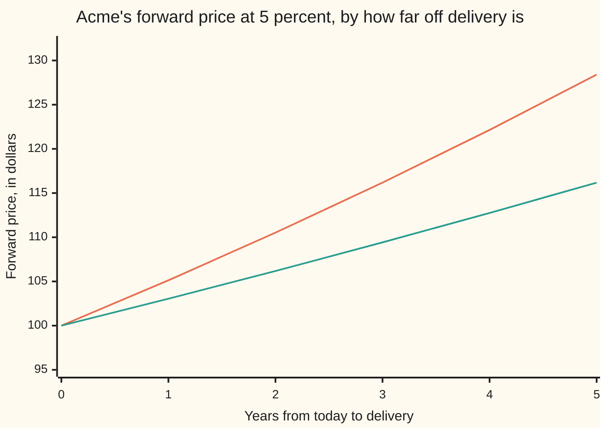

# Forward price: what you must agree to pay later so the contract costs nothing now

[Syllabus](../../../SYLLABUS.md) → [Financial mathematics](../README.md) → [Contracts and No-Arbitrage](../README.md#s03) → Forward price

---

## General Overview

Acme shares trade at 100.00 dollars today. Two firms agree, this morning, to trade one Acme share a year from today: one hands over the share, the other hands over cash. Nothing moves now — no premium, no deposit, no fee. The single number they must settle on is the cash figure written into the paperwork.

That agreement is a **forward contract**, and the number is its **forward price**. For Acme, with the bank paying and charging 5 percent a year and the share paying its holders 2 percent a year in dividends, the number is **103.05**.

It is not a forecast. It comes from what it costs the seller to be certain of delivering: borrow money this morning, buy Acme, hold it a year, hand it over. The loan costs interest; the share pays dividends. Interest out, dividends in: 100.00 carried for a year at 5 percent less 2 percent is 103.05.

Two words need separating. The forward **price** is paid on delivery day; the **value** of the contract is what it is worth today, which at signing is zero — and that is the condition picking the price out. [An old forward](04-forward-value-after-inception.md) takes up what the value becomes later.

**The forward price is today's price of the asset, grown at the interest rate and shrunk by whatever income the asset pays before delivery, because that is what it costs to buy the asset now and carry it to the delivery date.**

**What kind of fact this is:** a theorem, proved on this card in Why it works, inside a stated model: one interest rate both ways, no fees, the asset freely bought and sold short. Loosen the model and the single price widens into a band, the last bullet under When it holds.

### The picture: the same share, priced for six different delivery dates



The upper line is a share paying nothing; the lower line is Acme, paying 2 percent a year. Both start at 100.00: a share delivered today costs today's price. They separate because each extra year of waiting is another year of interest and another year of dividends.

---

## The formula

Four letters carry the card, named in words first. $S$ is the **spot price**: what one share costs right now, for delivery right now. $r$ is the **bank rate**: the interest a safe loan costs and a safe deposit earns, quoted continuously compounded — added at every instant ([Discount factors](../01-Money%2C%20Dates%20and%20Discounting/01-compounding-and-discount-factors.md)). $q$ is the **dividend yield**: the income the share pays its holder each year as a fraction of its price, also continuous. $T$ is the wait until delivery, in years. The answer is $F$, the forward price.

$$F = S\,e^{(r-q)T}$$

**Read it aloud:** today's price of the share, grown at the bank rate, shrunk by the income the share pays before delivery day.

The card uses both halves of that growth factor, so split it:

$$e^{(r-q)T} = e^{rT} \times e^{-qT}$$

The first grows money at the bank rate; the second shrinks a share by the income it throws off. Their net, $r - q$, is the **cost of carry**.

Some assets pay a lump on a known date rather than a trickle: Acme might declare a single cash dividend of 2.00 dollars payable in six months. Then $I$, today's price of that payment, replaces the trickle and the shrinking becomes a subtraction:

$$F = (S - I)\,e^{rT}, \qquad I = C\,e^{-rt}$$

Take the known payment off the spot price at what it is worth today, and grow only what is left.

| Symbol | Plain meaning | In our example | Push it up and the forward price… |
| --- | --- | --- | --- |
| $F$ | the forward price: cash handed over on delivery day | 103.05 | — |
| $S$ | the spot price: what one share costs now | 100.00 | rises one for one |
| $r$ | the bank rate, continuously compounded | 5 percent | rises: carrying costs more |
| $q$ | the dividend yield, continuously compounded | 2 percent | falls: the holder is paid already |
| $T$ | time from today to delivery, in years | 1 | pushes further from spot while $r$ beats $q$ |
| $C$ | a known cash payment made before delivery | 2.00 | falls: the buyer never gets it |
| $t$ | when that payment lands, in years | 0.5 | rises: the seller holds the cash less long |
| $I$ | today's price of that payment | 1.95 | falls |
| $K$ | any delivery price written into a contract | 103.05 makes it free | — |
| $G$ | what a contract at delivery price $K$ is worth today | 0.00 at $K = F$ | falls as $K$ rises |
| $e^{rT}$ | the growth factor: what a bank dollar becomes by delivery | 1.051271 | rises |
| $e^{-qT}$ | the fraction of a share that grows into one whole share | 0.980199 | — |
| $e^{-rT}$ | the discount factor: what a delivery-day dollar costs now | 0.951229 | — |
| $r - q$ | the cost of carry: holding, net of income | 3 percent | rises: it is the whole exponent |

**Conventions verified 14 Sep 2026:** every rate here is continuously compounded and $T$ counts calendar years. Markets quote on day-count and compounding conventions that differ by market and do change; convert before substituting.

### When it holds

- **One rate for borrowing and for lending, no fees or spreads.** The proof runs the same trade both ways. Where borrowing costs more than lending pays, the two directions stop at different numbers and the price is pinned only inside a band.
- **The asset can be bought, held and sold short.** Selling short means borrowing the asset, selling it, and buying one back later to return. Without it only one trade is possible, so the forward has an upper bound and no lower one — the ordinary case for a commodity somebody needs in the warehouse ([Gold forward](../25-Commodity%20forwards%20-%20carry%2C%20storage%2C%20convenience%20yield%20and%20the%20curve/01-gold-forward-and-the-lease-rate.md)).
- **The income is known in advance.** A dividend that might be cut is a different problem, and the formula run backwards on a quote then reports a belief, not a fact ([Implied forward and dividend from parity](../11-Implied%20volatility%20and%20the%20vanilla%20inverses/05-implied-forward-and-dividend-from-parity.md)).
- **The bank rate is known for the whole wait.** Then a daily-settled exchange contract prices the same as this private one; once rates move unpredictably the two part company ([Futures](05-futures-margining-and-the-forward-futures-difference.md)).
- **Both sides actually deliver.** A counterparty that might fail turns a delivery price into a credit question, and the quote then carries a charge for it.

---

## Why it works

### Step 0: two packages that end the same must cost the same today

Everything rests on one sentence from the previous card: if two bundles are certain to be worth the same on delivery day, whatever happens in between, they must cost the same today ([No arbitrage](02-no-arbitrage-and-the-law-of-one-price.md)). Otherwise anyone could buy the cheap bundle, sell the dear one, take the gap in cash this morning and owe nothing later.

So the job is to build a bundle that ends holding exactly one Acme share, out of things priced today.

### Step 1: one whole share on delivery day costs 98.02 today

Buy a share and the dividends belong to the buyer. Spend each dividend on more Acme as it arrives and the holding grows by itself at 2 percent a year. So to end the year holding exactly one share, do not buy one share. Buy $e^{-qT}$ of a share: $e^{-0.02} = 0.980199$ of a share, costing 98.019867 dollars. Left alone with its dividends ploughed back, that fraction grows into one whole share, no cash in or out along the way.

That 98.02 is the **prepaid forward**: the price of one share delivered in a year, paid this morning. Only the timing of the payment separates it from the forward price.

### Step 2: pay for it on delivery day instead, and the price is 103.05

Two packages, each certain to hold one Acme share in a year.

- **Package A.** Sign a forward at delivery price $F$ and put $F\,e^{-rT}$ in the bank. The deposit grows to exactly $F$ by delivery day, and that is handed over for the share. Signing costs nothing, so the package costs $F\,e^{-rT}$.
- **Package B.** Buy 0.980199 of a share and reinvest the dividends: $S\,e^{-qT}$ today, or 98.019867.

Both end holding one share, so their prices today are equal:

$$F\,e^{-rT} = S\,e^{-qT} \quad\Longrightarrow\quad F = S\,e^{(r-q)T}$$

For Acme, 98.019867 carried forward a year at 5 percent is $98.019867 \times 1.051271 = 103.045453$, or **103.05**. In one step, $100.00 \times e^{0.03}$.

### Step 3: quote it too high and the seller mints money

Suppose the market quotes 105.00 for delivery in a year. Here is the trade, with no money down.

| When | What is done | Cash | Shares held |
| --- | --- | --- | --- |
| Today | Sell a forward at 105.00: promise one share in a year | 0.00 | 0 |
| Today | Borrow 98.019867 at 5 percent | +98.019867 | 0 |
| Today | Buy 0.980199 of a share at 100.00 | −98.019867 | 0.980199 |
| Through the year | Collect the dividends, buy more Acme with them | 0.00 | grows to 1 |
| Delivery day | Hand over the share, collect the agreed 105.00 | +105.000000 | −1 |
| Delivery day | Repay the loan, 98.019867 grown at 5 percent | −103.045453 | 0 |
| **Net** | | **+1.954547** | **0** |

This is the **cash-and-carry** trade, and the name is the recipe: raise cash, carry the asset. Nothing was staked, and Acme's price during the year appears nowhere in the ledger. The profit of 1.954547 on delivery day is the gap between the quote and 103.045453; brought back to today at 5 percent it is 1.86.

### Step 4: quote it too low and the buyer mints money

Now suppose the quote is 101.00. Run every line backwards. Borrow 0.980199 of a share from an owner, sell it for 98.019867 and lend that cash to the bank. Through the year, owe the share's lender its dividends, funded by shorting a sliver more, so the debt grows to exactly one share. On delivery day the deposit has become 103.045453; buy one share through the forward for 101.00 and return it. The net is **2.045453** on delivery day, or 1.95 brought back to today.

This is **reverse cash-and-carry**. Between the two trades, every delivery price above 103.045453 and every one below it is knocked out. One number survives, and that is the theorem.

<details>
<summary>Detailed proof: the value of any delivery price, and why only one of them is free</summary>

Write $K$ for any delivery price agreed now, and $G$ for what a contract paying Acme's price on delivery day minus that $K$ is worth today. Build that payoff: hold $e^{-qT}$ of a share with dividends reinvested, and borrow $K\,e^{-rT}$. On delivery day the holding is one share and the loan is a bill for exactly $K$ — the contract's payoff, on every path. The bundle cost $S\,e^{-qT} - K\,e^{-rT}$ today, so by Step 0,
$$G = S\,e^{-qT} - K\,e^{-rT} = e^{-rT}\left(S\,e^{(r-q)T} - K\right).$$
The forward price is the $K$ that makes $G$ zero, since a contract entered for no money must be worth no money. In $K$ that is a straight line of slope $-e^{-rT}$, never zero, so it crosses zero once and only once: existence and uniqueness in one sentence, at $K = S\,e^{(r-q)T}$. The boundaries behave. At $T = 0$ the root is $S$, delivery today at today's price. At $r = q$ it is $S$ for every $T$. At $S = 0$ it is zero: a worthless asset costs nothing to carry.

Steps 3 and 4 are that line in algebra. At any zero-cost delivery price above $F$ the matching bundle costs $G < 0$, so selling the contract and buying the bundle pays cash this morning and the two cancel on delivery day; below $F$, buy the contract and sell the bundle short. Both are money from nothing, which Step 0 forbids.

The known-cash-income version replaces only the bundle. A lump on a fixed date cannot be reinvested into a fraction of a share before it arrives. Instead buy one whole share, costing $S$, and borrow $I = C\,e^{-rt}$, sized so the dividend clears that debt the day it lands. The outlay is $S - I$, and delivery day arrives with one share and no debt, so $F = (S-I)\,e^{rT}$. The payment never had to be positive: a known holding cost such as storage is the same algebra with the sign flipped, and raises the forward price.

</details>

<details>
<summary>Why the share's jumpiness never enters</summary>

Neither ledger holds a number describing how wildly Acme swings: the trade holds the share the whole way, so every move goes to the counterparty rather than the bank. The check runs the funded purchase day by day down three random Acme paths, reinvesting each day's dividend at that day's price. Acme finishes at 90.91 on one path and 111.69 on another; the break-even delivery price is 103.045453 on all three, because the day's price cancels out of the share count. A trade that banks the dividends instead leaks: its break-even is 103.245541 on the first path and 103.050821 on the second.

</details>

### Another road: the average share price in a world priced at the bank rate

A second route reaches the same number, and it runs the rest of this wing. Price every contract as though each asset were valued so that it grows on average at the bank rate, a device set out in [State prices](07-state-prices-and-risk-neutral-pricing-in-one-period.md). A share's whole return there is $r$, but part is paid out as dividends at $q$ a year, so only $r - q$ shows as the price climbing. The average Acme price on delivery day is $S\,e^{(r-q)T}$, which is $F$ again.

The check works that average out the long way, at 10, 20 and 50 percent a year of jumpiness. All three land on 103.045453: volatility cancels out, the ledgers' fact from the other side.

---

## Worked numbers, by hand

Acme at 100.00, the bank at 5 percent, the dividend yield 2 percent, delivery one year out.

| Step | Arithmetic | Value |
| --- | --- | --- |
| the share fraction to buy | $e^{-0.02}$ | 0.980199 |
| what it costs, the prepaid forward | $100.00 \times 0.980199$ | 98.02 |
| a year of bank growth | $e^{0.05}$ | 1.051271 |
| **the forward price** | $98.019867 \times 1.051271$ | **103.05** |
| the same in one step | $100.00 \times e^{0.03}$ | **103.05** |
| the same share paying nothing | $100.00 \times e^{0.05}$ | 105.13 |
| a 2.00 dividend due in six months, priced today | $2.00 \times e^{-0.025}$ | 1.95 |
| that share, with that cash dividend instead | $(100.00 - 1.950620) \times 1.051271$ | 103.08 |

Read the answer as a bill: a firm promising Acme in a year must charge 103.05 to come out level. The 2 percent yield is worth 2.08 dollars of it, the gap between 105.13 and 103.05.

### What breaks if you drop a piece

| Mistake | Comes out at | What went wrong |
| --- | --- | --- |
| Income forgotten | 105.13 | Charging for financing already partly repaid, 2.08 too much |
| Income added instead of subtracted | 107.25 | Dividends treated as a cost of holding, not a payment |
| A cash dividend taken at face value | 103.02 | The 2.00 lands at six months and is then lent to delivery day; face value ignores that, 0.05 short of 103.08 |
| Simple interest instead of compounded | 103.00 | Interest earning interest is the convention; the gap widens with the wait |
| Discounted back instead of grown | 97.04 | Delivery is ahead, so the price is carried forward, not pulled back |

Both checks print every number in that table.

---

## How the quote moves: two forces, and the length of the wait

Acme's spot price does not change anywhere in this section. What changes is the wait and what the carry costs. In the chart at the top of the card the share stands still while its five-year delivery price sits 16 dollars above its price for delivery today. The share did nothing; the calendar did it. Those lines as numbers:

| Delivery in | Acme, paying 2 percent | A share paying nothing |
| --- | --- | --- |
| today | 100.00 | 100.00 |
| 1 year | 103.05 | 105.13 |
| 2 years | 106.18 | 110.52 |
| 3 years | 109.42 | 116.18 |
| 4 years | 112.75 | 122.14 |
| 5 years | 116.18 | 128.40 |

Two forces set the gap between those columns. Here they are one at a time, at one year out.

### Force one: what the bank charges

```
bank rate    Acme's one-year forward price, dividend yield held at 2 percent; one block = 50 cents above 90.00
      0%   ████████████████                  $98.02
      2%   ████████████████████              $100.00
      5%   ██████████████████████████        $103.05
      8%   ████████████████████████████████  $106.18
```

At a bank rate of zero there is no financing to charge for and the dividends stand alone: the forward sits below spot, at 98.02, the prepaid forward from Step 1. Every extra percent of interest lifts it.

### Force two: what the share pays its holder

```
dividend yield   Acme's one-year forward price, bank rate held at 5 percent; one block = 50 cents above 90.00
           0%   ██████████████████████████████  $105.13
           2%   ██████████████████████████      $103.05
           5%   ████████████████████            $100.00
           8%   ██████████████                  $97.04
```

The forces cancel when the yield equals the rate: at 5 percent against 5 percent the forward is the spot, 100.00. Push the yield past the rate and the forward falls below spot, which markets call **backwardation**; the ordinary case, a forward above spot, is **contango**. Both are the sign of $r - q$ made visible.

---

## Code, from first principles, and it actually runs

Nothing is imported that already holds the answer: the random numbers and the integrator are written out in the file. The delivery price is reached four ways — the formula; the funded purchase run day by day down three random paths; the average share price on delivery day under a risk-neutral valuation; and, for the lump-sum dividend, a dated ledger lending the dividend from the day it lands to delivery day. Both arbitrage profits and every what-breaks number are printed too.

### Python

```python
# Forward price by cash and carry -- the check behind the card.  Standard
# library only, and nothing imported that already holds the answer: the random
# numbers and the integrator are written out here.  Acme trades at 100.00, the
# bank charges and pays 5 percent, the share yields 2 percent, delivery is one
# year out.  Four roads reach the same delivery price.
from math import cos, exp, log, pi, sqrt

S, R, Q, T = 100.0, 0.05, 0.02, 1.0     # spot, bank rate, dividend yield, years
SIGMA, STEPS = 0.20, 365                # jumpiness and days, for the day-by-day road
DIV, T_DIV = 2.00, 0.5                  # a known cash dividend, paid at six months
HIGH, LOW = 105.00, 101.00              # two off-market delivery quotes

def forward(s, r, q, t):                # road 1: the formula
    return s * exp((r - q) * t)

class Rng:                              # a 64-bit linear congruential generator
    def __init__(self, seed):
        self.s = seed & 0xFFFFFFFFFFFFFFFF
    def unit(self):                     # a fresh number strictly inside (0, 1)
        self.s = (self.s * 6364136223846793005 + 1442695040888963407) & 0xFFFFFFFFFFFFFFFF
        return ((self.s >> 11) + 0.5) / 9007199254740992.0
    def normal(self):                   # Box-Muller: two flat draws make one bell draw
        return sqrt(-2.0 * log(self.unit())) * cos(2.0 * pi * self.unit())

def funded_trade(seed):
    """Road 2: the funded purchase, run day by day down one random share path.
    Trade A buys e^-qT shares and spends each dividend on more shares.  Trade B
    buys one whole share and banks each dividend instead.  Both borrow what they
    spend.  Returns where the share ended and the delivery price that leaves
    each trade holding exactly nothing at the end."""
    dt, rng, price = T / STEPS, Rng(seed), S
    shares, loan_a = exp(-Q * T), exp(-Q * T) * S
    loan_b, bank = S, 0.0
    for _ in range(STEPS):
        price *= exp((R - Q - 0.5 * SIGMA * SIGMA) * dt + SIGMA * sqrt(dt) * rng.normal())
        paid = exp(Q * dt) - 1.0                  # the day's dividend, per share held
        cash = shares * price * paid              # what trade A collects that day
        shares += cash / price                    # spent on more shares at that day's price
        bank = bank * exp(R * dt) + price * paid  # trade B's dividend, left at the bank
        loan_a *= exp(R * dt)
        loan_b *= exp(R * dt)
    return price, loan_a / shares, loan_b - bank

def simpson(f, a, b, n):                # the integrator, written out
    h = (b - a) / n
    total = f(a) + f(b)
    for i in range(1, n):
        total += (4.0 if i % 2 else 2.0) * f(a + i * h)
    return total * h / 3.0

def risk_neutral_average(sigma, n=40000):
    """Road 3: the average share price on delivery day when the share is taken
    to grow at the bank rate less its yield.  The bell curve is written out."""
    drift = (R - Q - 0.5 * sigma * sigma) * T
    def f(z):
        return S * exp(drift + sigma * sqrt(T) * z) * exp(-0.5 * z * z) / sqrt(2.0 * pi)
    return simpson(f, -10.0, 10.0, n)

F = forward(S, R, Q, T)                                      # road 1
F_none = forward(S, R, 0.0, T)
prepaid = S * exp(-Q * T)
repay = prepaid * exp(R * T)
pv_div = DIV * exp(-R * T_DIV)
F_cash = (S - pv_div) * exp(R * T)                           # road 1, known cash income
F_cash_ledger = S * exp(R * T) - DIV * exp(R * (T - T_DIV))  # road 4, the dated ledger
paths = [funded_trade(s) for s in (20260914, 7, 4242424242)]
finals, reinvested, banked = [list(c) for c in zip(*paths)]
rn = [risk_neutral_average(v) for v in (0.10, 0.20, 0.50)]
cc_T, rcc_T = HIGH - repay, repay - LOW
cc_now, rcc_now = cc_T * exp(-R * T), rcc_T * exp(-R * T)
years = [0.0, 1.0, 2.0, 3.0, 4.0, 5.0]
curve_q = [forward(S, R, Q, y) for y in years]
curve_0 = [forward(S, R, 0.0, y) for y in years]
levels = [0.0, 0.02, 0.05, 0.08]
by_yield = [forward(S, R, y, T) for y in levels]
by_rate = [forward(S, x, Q, T) for x in levels]

def row(name, value):
    print(f"{name:<44}{value:>14.6f}")

print(f"Acme spot {S:.2f}, bank rate {R:.0%}, dividend yield {Q:.0%}, delivery in {T:.0f} year")
row("1 formula   F = S e^((r-q)T)", F)
for i, seed in enumerate((20260914, 7, 4242424242)):
    print(f"2 funded trade, day by day, path {i + 1:d} (seed {seed:d})")
    row("    share ended at", finals[i])
    row("    break-even delivery, dividends reinvested", reinvested[i])
    row("    break-even delivery, dividends banked", banked[i])
for v, a in zip((0.10, 0.20, 0.50), rn):
    row(f"3 average share price at delivery, sigma {v:.2f}", a)
row("prepaid forward   S e^-qT", prepaid)
row("carried to delivery, S e^-qT e^rT", repay)
row("no income at all, F = S e^rT", F_none)
print("known cash dividend of 2.00 at six months:")
row("    present value of the dividend", pv_div)
row("    1 formula   F = (S - I) e^rT", F_cash)
row("    4 dated ledger, dividend lent to delivery", F_cash_ledger)
print(f"cash-and-carry against a quote of {HIGH:.2f}:")
row("    shares bought today", prepaid / S)
row("    borrowed today", prepaid)
row("    repaid on delivery day", repay)
row("    profit on delivery day", cc_T)
row("    profit today", cc_now)
print(f"reverse cash-and-carry against a quote of {LOW:.2f}:")
row("    profit on delivery day", rcc_T)
row("    profit today", rcc_now)
print("what breaks if a piece goes missing:")
row("    income forgotten", F_none)
row("    income added, not subtracted", S * exp((R + Q) * T))
row("    cash dividend taken at face value", (S - DIV) * exp(R * T))
row("    simple interest, not compounded", S * (1.0 + (R - Q) * T))
row("    discounted back instead of grown", S * exp(-(R - Q) * T))
print()
print(f"{'chart, years to delivery':<38}" + "".join(f"{y:>9.0f}" for y in years))
print(f"{'chart, forward with the 2% yield':<38}" + "".join(f"{v:>9.2f}" for v in curve_q))
print(f"{'chart, forward with no income':<38}" + "".join(f"{v:>9.2f}" for v in curve_0))
print(f"{'bars, dividend yield 0/2/5/8 percent':<38}" + "".join(f"{v:>9.2f}" for v in by_yield))
print(f"{'bars, bank rate 0/2/5/8 percent':<38}" + "".join(f"{v:>9.2f}" for v in by_rate))

assert abs(F - 103.045453395352) < 1e-9,           "the delivery price quoted on the card"
assert abs(F_none - 105.127109637602) < 1e-9,      "the same share with no income"
assert abs(F_cash - 103.076479396554) < 1e-9,      "the known cash dividend version"
assert abs(F_cash_ledger - F_cash) < 1e-9,         "dated ledger vs the cash-income formula"
assert all(abs(b - F) < 1e-9 for b in reinvested), "the day-by-day road lands on the formula"
assert max(reinvested) - min(reinvested) < 1e-9,   "and does not care which path the share took"
assert max(finals) - min(finals) > 10.0,           "though the three paths end far apart"
assert max(banked) - min(banked) > 0.01,           "banking the dividends does not hedge"
assert all(abs(a - F) < 1e-6 for a in rn),         "three volatilities, one average"
assert abs(cc_T - (HIGH - F)) < 1e-9,              "the trade nets exactly the mispricing"
assert abs(rcc_T - (F - LOW)) < 1e-9,              "and so does the trade run backwards"
print("ALL CHECKS PASS")
```

**Ran 2026-09-14 on macOS, Python 3.14.6, standard library only. All checks passed. Output, pasted from the run:**

```
Acme spot 100.00, bank rate 5%, dividend yield 2%, delivery in 1 year
1 formula   F = S e^((r-q)T)                    103.045453
2 funded trade, day by day, path 1 (seed 20260914)
    share ended at                               90.908821
    break-even delivery, dividends reinvested    103.045453
    break-even delivery, dividends banked       103.245541
2 funded trade, day by day, path 2 (seed 7)
    share ended at                              111.693989
    break-even delivery, dividends reinvested    103.045453
    break-even delivery, dividends banked       103.050821
2 funded trade, day by day, path 3 (seed 4242424242)
    share ended at                              102.655532
    break-even delivery, dividends reinvested    103.045453
    break-even delivery, dividends banked       103.047702
3 average share price at delivery, sigma 0.10    103.045453
3 average share price at delivery, sigma 0.20    103.045453
3 average share price at delivery, sigma 0.50    103.045453
prepaid forward   S e^-qT                        98.019867
carried to delivery, S e^-qT e^rT               103.045453
no income at all, F = S e^rT                    105.127110
known cash dividend of 2.00 at six months:
    present value of the dividend                 1.950620
    1 formula   F = (S - I) e^rT                103.076479
    4 dated ledger, dividend lent to delivery    103.076479
cash-and-carry against a quote of 105.00:
    shares bought today                           0.980199
    borrowed today                               98.019867
    repaid on delivery day                      103.045453
    profit on delivery day                        1.954547
    profit today                                  1.859222
reverse cash-and-carry against a quote of 101.00:
    profit on delivery day                        2.045453
    profit today                                  1.945695
what breaks if a piece goes missing:
    income forgotten                            105.127110
    income added, not subtracted                107.250818
    cash dividend taken at face value           103.024567
    simple interest, not compounded             103.000000
    discounted back instead of grown             97.044553

chart, years to delivery                      0        1        2        3        4        5
chart, forward with the 2% yield         100.00   103.05   106.18   109.42   112.75   116.18
chart, forward with no income            100.00   105.13   110.52   116.18   122.14   128.40
bars, dividend yield 0/2/5/8 percent     105.13   103.05   100.00    97.04
bars, bank rate 0/2/5/8 percent           98.02   100.00   103.05   106.18
ALL CHECKS PASS
```

### Rust

Same numbers and labels, built with `rustc --edition 2021 -O`.

```rust
// Forward price by cash and carry -- the same check as
// forward_price_by_cash_and_carry_check.py, in Rust.  Standard library only,
// no crates, and nothing here already holds the answer: the random numbers and
// the integrator are written out below.  Acme trades at 100.00, the bank
// charges and pays 5 percent, the share yields 2 percent, delivery is one year
// out.  Four roads reach the same delivery price.
use std::f64::consts::PI;

const S: f64 = 100.0;                   // spot, bank rate, dividend yield, years
const R: f64 = 0.05;
const Q: f64 = 0.02;
const T: f64 = 1.0;
const SIGMA: f64 = 0.20;                // jumpiness and days, for the day-by-day road
const STEPS: usize = 365;
const DIV: f64 = 2.00;                  // a known cash dividend, paid at six months
const T_DIV: f64 = 0.5;
const HIGH: f64 = 105.00;               // two off-market delivery quotes
const LOW: f64 = 101.00;

fn forward(s: f64, r: f64, q: f64, t: f64) -> f64 {     // road 1: the formula
    s * ((r - q) * t).exp()
}

struct Rng { s: u64 }                   // a 64-bit linear congruential generator

impl Rng {
    fn unit(&mut self) -> f64 {         // a fresh number strictly inside (0, 1)
        self.s = self.s.wrapping_mul(6364136223846793005).wrapping_add(1442695040888963407);
        ((self.s >> 11) as f64 + 0.5) / 9007199254740992.0
    }
    fn normal(&mut self) -> f64 {       // Box-Muller: two flat draws make one bell draw
        let (u1, u2) = (self.unit(), self.unit());
        (-2.0 * u1.ln()).sqrt() * (2.0 * PI * u2).cos()
    }
}

/// Road 2: the funded purchase, run day by day down one random share path.
/// Trade A buys e^-qT shares and spends each dividend on more shares.  Trade B
/// buys one whole share and banks each dividend instead.  Both borrow what they
/// spend.  Returns where the share ended and the delivery price that leaves
/// each trade holding exactly nothing at the end.
fn funded_trade(seed: u64) -> (f64, f64, f64) {
    let (dt, mut rng, mut price) = (T / STEPS as f64, Rng { s: seed }, S);
    let (mut shares, mut loan_a) = ((-Q * T).exp(), (-Q * T).exp() * S);
    let (mut loan_b, mut bank) = (S, 0.0);
    for _ in 0..STEPS {
        price *= ((R - Q - 0.5 * SIGMA * SIGMA) * dt + SIGMA * dt.sqrt() * rng.normal()).exp();
        let paid = (Q * dt).exp() - 1.0;          // the day's dividend, per share held
        let cash = shares * price * paid;         // what trade A collects that day
        shares += cash / price;                   // spent on more shares at that day's price
        bank = bank * (R * dt).exp() + price * paid;  // trade B's dividend, left at the bank
        loan_a *= (R * dt).exp();
        loan_b *= (R * dt).exp();
    }
    (price, loan_a / shares, loan_b - bank)
}

fn simpson<F: Fn(f64) -> f64>(f: F, a: f64, b: f64, n: usize) -> f64 {   // the integrator
    let h = (b - a) / n as f64;
    let mut total = f(a) + f(b);
    for i in 1..n { total += (if i % 2 == 1 { 4.0 } else { 2.0 }) * f(a + i as f64 * h) }
    total * h / 3.0
}

/// Road 3: the average share price on delivery day when the share is taken
/// to grow at the bank rate less its yield.  The bell curve is written out.
fn risk_neutral_average(sigma: f64) -> f64 {
    let drift = (R - Q - 0.5 * sigma * sigma) * T;
    let f = |z: f64| S * (drift + sigma * T.sqrt() * z).exp() * (-0.5 * z * z).exp() / (2.0 * PI).sqrt();
    simpson(f, -10.0, 10.0, 40000)
}

fn row(name: &str, value: f64) { println!("{:<44}{:>14.6}", name, value) }

fn cells(vals: &[f64], dp: usize) -> String {
    vals.iter().map(|v| format!("{:>9.*}", dp, v)).collect::<Vec<String>>().join("")
}

fn main() {
    let f = forward(S, R, Q, T);                                    // road 1
    let f_none = forward(S, R, 0.0, T);
    let prepaid = S * (-Q * T).exp();
    let repay = prepaid * (R * T).exp();
    let pv_div = DIV * (-R * T_DIV).exp();
    let f_cash = (S - pv_div) * (R * T).exp();                      // road 1, known cash income
    let f_cash_ledger = S * (R * T).exp() - DIV * (R * (T - T_DIV)).exp();   // road 4, dated ledger
    let seeds = [20260914u64, 7, 4242424242];
    let paths: Vec<(f64, f64, f64)> = seeds.iter().map(|&s| funded_trade(s)).collect();
    let finals: Vec<f64> = paths.iter().map(|p| p.0).collect();
    let reinvested: Vec<f64> = paths.iter().map(|p| p.1).collect();
    let banked: Vec<f64> = paths.iter().map(|p| p.2).collect();
    let vols = [0.10, 0.20, 0.50];
    let rn: Vec<f64> = vols.iter().map(|&v| risk_neutral_average(v)).collect();
    let (cc_t, rcc_t) = (HIGH - repay, repay - LOW);
    let (cc_now, rcc_now) = (cc_t * (-R * T).exp(), rcc_t * (-R * T).exp());
    let years = [0.0, 1.0, 2.0, 3.0, 4.0, 5.0];
    let curve_q: Vec<f64> = years.iter().map(|&y| forward(S, R, Q, y)).collect();
    let curve_0: Vec<f64> = years.iter().map(|&y| forward(S, R, 0.0, y)).collect();
    let levels = [0.0, 0.02, 0.05, 0.08];
    let by_yield: Vec<f64> = levels.iter().map(|&y| forward(S, R, y, T)).collect();
    let by_rate: Vec<f64> = levels.iter().map(|&x| forward(S, x, Q, T)).collect();

    println!("Acme spot {:.2}, bank rate {:.0}%, dividend yield {:.0}%, delivery in {:.0} year",
             S, R * 100.0, Q * 100.0, T);
    row("1 formula   F = S e^((r-q)T)", f);
    for (i, seed) in seeds.iter().enumerate() {
        println!("2 funded trade, day by day, path {} (seed {})", i + 1, seed);
        row("    share ended at", finals[i]);
        row("    break-even delivery, dividends reinvested", reinvested[i]);
        row("    break-even delivery, dividends banked", banked[i]);
    }
    for (v, a) in vols.iter().zip(rn.iter()) {
        row(&format!("3 average share price at delivery, sigma {:.2}", v), *a);
    }
    row("prepaid forward   S e^-qT", prepaid);
    row("carried to delivery, S e^-qT e^rT", repay);
    row("no income at all, F = S e^rT", f_none);
    println!("known cash dividend of 2.00 at six months:");
    row("    present value of the dividend", pv_div);
    row("    1 formula   F = (S - I) e^rT", f_cash);
    row("    4 dated ledger, dividend lent to delivery", f_cash_ledger);
    println!("cash-and-carry against a quote of {:.2}:", HIGH);
    row("    shares bought today", prepaid / S);
    row("    borrowed today", prepaid);
    row("    repaid on delivery day", repay);
    row("    profit on delivery day", cc_t);
    row("    profit today", cc_now);
    println!("reverse cash-and-carry against a quote of {:.2}:", LOW);
    row("    profit on delivery day", rcc_t);
    row("    profit today", rcc_now);
    println!("what breaks if a piece goes missing:");
    row("    income forgotten", f_none);
    row("    income added, not subtracted", S * ((R + Q) * T).exp());
    row("    cash dividend taken at face value", (S - DIV) * (R * T).exp());
    row("    simple interest, not compounded", S * (1.0 + (R - Q) * T));
    row("    discounted back instead of grown", S * (-(R - Q) * T).exp());
    println!();
    println!("{:<38}{}", "chart, years to delivery", cells(&years, 0));
    println!("{:<38}{}", "chart, forward with the 2% yield", cells(&curve_q, 2));
    println!("{:<38}{}", "chart, forward with no income", cells(&curve_0, 2));
    println!("{:<38}{}", "bars, dividend yield 0/2/5/8 percent", cells(&by_yield, 2));
    println!("{:<38}{}", "bars, bank rate 0/2/5/8 percent", cells(&by_rate, 2));

    assert!((f - 103.045453395352).abs() < 1e-9, "the delivery price quoted on the card");
    assert!((f_none - 105.127109637602).abs() < 1e-9, "the same share with no income");
    assert!((f_cash - 103.076479396554).abs() < 1e-9, "the known cash dividend version");
    assert!((f_cash_ledger - f_cash).abs() < 1e-9, "dated ledger vs the cash-income formula");
    assert!(reinvested.iter().all(|b| (b - f).abs() < 1e-9), "the day-by-day road lands on the formula");
    let spread = |v: &Vec<f64>| v.iter().cloned().fold(f64::MIN, f64::max) - v.iter().cloned().fold(f64::MAX, f64::min);
    assert!(spread(&reinvested) < 1e-9, "and does not care which path the share took");
    assert!(spread(&finals) > 10.0, "though the three paths end far apart");
    assert!(spread(&banked) > 0.01, "banking the dividends does not hedge");
    assert!(rn.iter().all(|a| (a - f).abs() < 1e-6), "three volatilities, one average");
    assert!((cc_t - (HIGH - f)).abs() < 1e-9, "the trade nets exactly the mispricing");
    assert!((rcc_t - (f - LOW)).abs() < 1e-9, "and so does the trade run backwards");
    println!("ALL CHECKS PASS");
}
```

**Ran 2026-09-14 on macOS, rustc 1.98.1, no crates. All checks passed. Output, pasted from the run:**

```
Acme spot 100.00, bank rate 5%, dividend yield 2%, delivery in 1 year
1 formula   F = S e^((r-q)T)                    103.045453
2 funded trade, day by day, path 1 (seed 20260914)
    share ended at                               90.908821
    break-even delivery, dividends reinvested    103.045453
    break-even delivery, dividends banked       103.245541
2 funded trade, day by day, path 2 (seed 7)
    share ended at                              111.693989
    break-even delivery, dividends reinvested    103.045453
    break-even delivery, dividends banked       103.050821
2 funded trade, day by day, path 3 (seed 4242424242)
    share ended at                              102.655532
    break-even delivery, dividends reinvested    103.045453
    break-even delivery, dividends banked       103.047702
3 average share price at delivery, sigma 0.10    103.045453
3 average share price at delivery, sigma 0.20    103.045453
3 average share price at delivery, sigma 0.50    103.045453
prepaid forward   S e^-qT                        98.019867
carried to delivery, S e^-qT e^rT               103.045453
no income at all, F = S e^rT                    105.127110
known cash dividend of 2.00 at six months:
    present value of the dividend                 1.950620
    1 formula   F = (S - I) e^rT                103.076479
    4 dated ledger, dividend lent to delivery    103.076479
cash-and-carry against a quote of 105.00:
    shares bought today                           0.980199
    borrowed today                               98.019867
    repaid on delivery day                      103.045453
    profit on delivery day                        1.954547
    profit today                                  1.859222
reverse cash-and-carry against a quote of 101.00:
    profit on delivery day                        2.045453
    profit today                                  1.945695
what breaks if a piece goes missing:
    income forgotten                            105.127110
    income added, not subtracted                107.250818
    cash dividend taken at face value           103.024567
    simple interest, not compounded             103.000000
    discounted back instead of grown             97.044553

chart, years to delivery                      0        1        2        3        4        5
chart, forward with the 2% yield         100.00   103.05   106.18   109.42   112.75   116.18
chart, forward with no income            100.00   105.13   110.52   116.18   122.14   128.40
bars, dividend yield 0/2/5/8 percent     105.13   103.05   100.00    97.04
bars, bank rate 0/2/5/8 percent           98.02   100.00   103.05   106.18
ALL CHECKS PASS
```

The two outputs match line for line.

> [!TIP]
> **Try changing**
> Guess first, then run it. The asserts are pinned to Acme's numbers, so expect one to stop the program.
> - **Let the dividend equal the rate.** Set `Q` to `0.05`. The delivery price becomes 100.00, the spot: interest and dividends cancel. The first assert stops it.
> - **Break the hedge.** Delete `shares += cash / price`. The day-by-day road no longer grows into a whole share and its break-even leaves the formula. The fifth assert stops it.
> - **Forget that jumpiness drags on the average.** Change `drift` to `(R - Q) * T`. Each volatility now gives a different, too-large average: 103.56 at 10 percent, 116.77 at 50 percent. The ninth assert stops it.
> - **Take the dividend at face value.** Change `pv_div` to `DIV`. The cash-dividend price drops to 103.024567. The third assert stops it.

---

## The usual mistake

> [!warning]
> **Reading 103.05 as a prediction.** It is a bill: what a year of borrowing 100.00 dollars costs once a year of Acme's dividends is knocked off. It would be the same number if every analyst expected Acme to halve, because either a bull or a bear can collect a certain 1.954547 when the quote is 105.00.
>
> - **Confusing the price with the value.** Saying "the forward is worth 103.05" when the delivery price is 103.05 is how contracts get marked with the wrong sign: the value at signing is zero.
> - **Dropping the income.** Acme priced as if it paid nothing comes out at 105.13, a loss of 2.08 a share.
> - **Taking a cash dividend at face value.** A 2.00 dividend due in six months is worth 1.95 today. Subtract the full 2.00 and the price comes out at 103.02 instead of 103.08.
> - **Mismatched units.** $T$ counts years, not months, and $q$ is 0.02, not 2. Rates must be continuously compounded: a bank quoting 5 percent added once a year is $\ln(1.05) = 4.88$ percent here, and the forward moves to 102.92.
> - **Assuming it always holds in the market.** It is a theorem about a model. Where borrowing is scarce or a short sale impossible, the two trades stop at different prices and the quote sits between them — measured in currency markets since 2008, the last source below.

---

## Where you meet it in real life

- **Equity index futures.** A stock index future's screen price is the index carried at the money-market rate less its dividend yield; the gap between future and index is the carry moving.
- **Currency forwards.** Holding a foreign currency earns that currency's interest, income in the asset itself, so the yield becomes the foreign rate: [Covered interest parity](../20-FX%20spot%2C%20forwards%20and%20interest%20parity/02-covered-interest-parity.md), the same formula under a new name.
- **Commodity curves.** Storage is a negative dividend and having the physical thing to hand is a positive one, so the carry can point either way: [Gold forward](../25-Commodity%20forwards%20-%20carry%2C%20storage%2C%20convenience%20yield%20and%20the%20curve/01-gold-forward-and-the-lease-rate.md).
- **Option pricing.** Quote options on the forward and the carry drops out of the formula: [Black-76](../05-Black-Scholes%20from%20the%20Ground%20Up/06-black-76-and-forward-level-pricing.md). The forward is also the strike at which a call and a put cost the same: [Put-call parity](../08-The%20Black-Scholes%20call%20and%20put/03-put-call-parity.md).
- **Building the hedge.** Step 1's holding is rebalanced by its own dividends and needs no outside cash: [Replication](06-replication-and-self-financing.md). The forward's payoff picture is on [Payoffs](01-payoffs-and-positions.md).

> **Say it back**
> A forward contract fixes today the cash to be paid for an asset on a later date, with nothing paid now. The number is pinned by what it costs to deliver: borrow, buy the asset, hold it, hand it over. Interest pushes that cost up and any income the asset pays pulls it down, so the forward price is the spot grown at the rate less the yield — 103.05 for Acme. Quote more and a seller mints money with a borrowed purchase; quote less and a buyer mints it with a short sale.

---

## What this builds on

- [No arbitrage](02-no-arbitrage-and-the-law-of-one-price.md): the rule in Step 0, that two bundles ending the same must cost the same today.
- [Discount factors](../01-Money%2C%20Dates%20and%20Discounting/01-compounding-and-discount-factors.md): why a dollar due on delivery day costs $e^{-rT}$ today, and what continuous compounding means.

## Where this goes next

- [An old forward](04-forward-value-after-inception.md): what the contract is worth once the delivery price is no longer today's.
- [Futures](05-futures-margining-and-the-forward-futures-difference.md): the exchange-traded cousin, settled every evening, and when that changes the price.
- [Black-76](../05-Black-Scholes%20from%20the%20Ground%20Up/06-black-76-and-forward-level-pricing.md): options written on the forward price, with the carry already absorbed.
- [Put-call parity](../08-The%20Black-Scholes%20call%20and%20put/03-put-call-parity.md): the forward rebuilt from a call and a put, how a market's forward is read off option screens.
- [Implied forward and dividend from parity](../11-Implied%20volatility%20and%20the%20vanilla%20inverses/05-implied-forward-and-dividend-from-parity.md): this card run backwards, recovering the income the market assumes.
- [Covered interest parity](../20-FX%20spot%2C%20forwards%20and%20interest%20parity/02-covered-interest-parity.md) and [Gold forward](../25-Commodity%20forwards%20-%20carry%2C%20storage%2C%20convenience%20yield%20and%20the%20curve/01-gold-forward-and-the-lease-rate.md): the same carry with the yield replaced by a foreign rate, and by storage against usefulness.

This card priced a contract on the day it is signed, the one day it is worth nothing; what it is worth on every day after that is the next card's question.

---

## Sources

Verified 14 Sep 2026: every link below resolves to the publisher's page.

- Hull, John C. *Options, Futures, and Other Derivatives*, 11th ed. Pearson. [Publisher page](https://www.pearson.com/en-us/subject-catalog/p/options-futures-and-other-derivatives/P200000005938). Chapter 5: cash-and-carry, a known yield, a known cash income, and the conditions under When it holds.
- McDonald, Robert L. *Derivatives Markets*, 3rd ed. Pearson. [Publisher page](https://www.pearson.com/en-us/subject-catalog/p/derivatives-markets/P200000005976/9780137612864). Chapter 5 builds the price from the prepaid forward, Step 1 here.
- Cox, John C., Jonathan E. Ingersoll, and Stephen A. Ross. "The Relation between Forward Prices and Futures Prices." *Journal of Financial Economics* 9, no. 4 (1981): 321–346. [doi:10.1016/0304-405X(81)90002-7](https://doi.org/10.1016/0304-405X(81)90002-7). Proves that a fixed, known rate is what makes a daily-settled contract price the same as this one.
- Shreve, Steven E. *Stochastic Calculus for Finance II: Continuous-Time Models*. Springer, 2004. [Publisher page](https://link.springer.com/book/9780387401010). The second road done carefully: the forward as an average under a risk-neutral valuation.
- Borio, Claudio, Robert McCauley, Patrick McGuire, and Vladyslav Sushko. "Covered Interest Parity Lost: Understanding the Cross-Currency Basis." *BIS Quarterly Review*, September 2016. [Article page](https://www.bis.org/publ/qtrpdf/r_qt1609e.htm). Measures how far the currency version has drifted since 2008, and why balance-sheet costs rather than the algebra are responsible.
