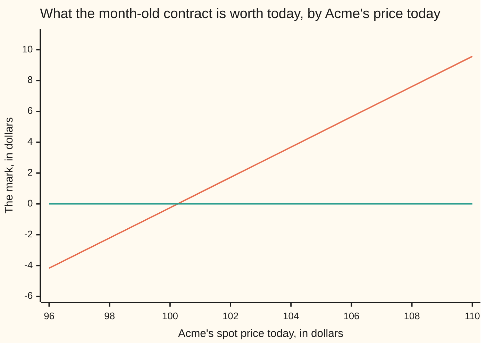
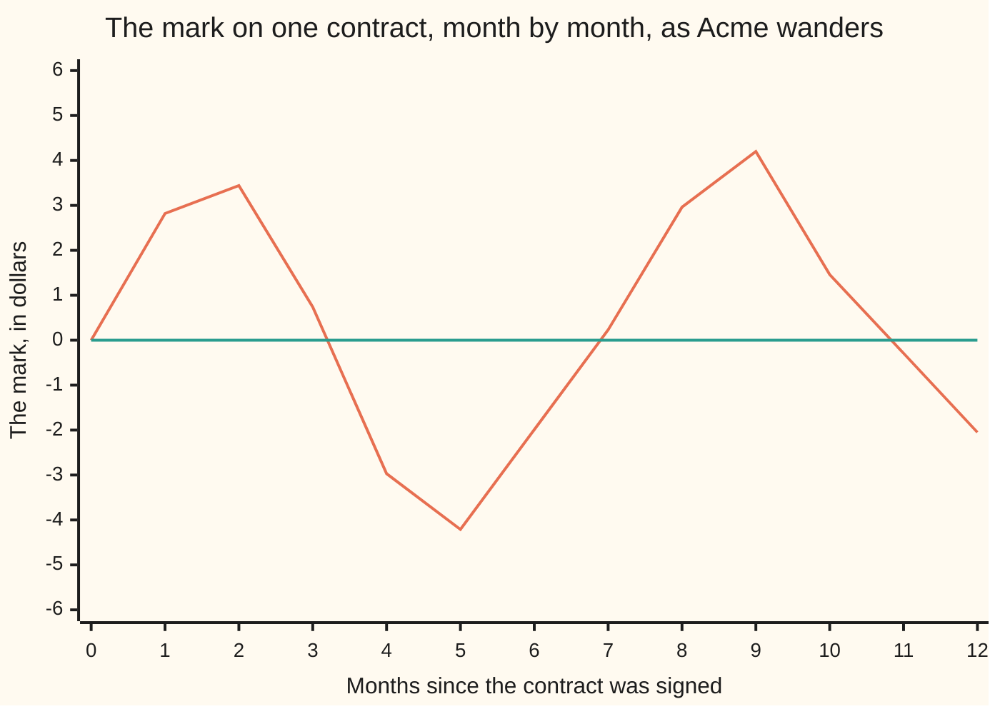

# An old forward: worth the discounted gap between today's forward price and the one you locked

Financial mathematics → Contracts and No-Arbitrage → Mark to market → An old forward

---

## General Overview

A month ago two firms signed a **forward contract** on one Acme share: an agreement made that morning to trade the share on a fixed day a year later, at a cash figure fixed that same morning. The paperwork says 103.05. No fee, no deposit, nothing at all changed hands, which is the ordinary shape of a forward.

That figure was not a forecast. It was the one number that made the agreement worth nothing to either side on the day ([forward-price-by-cash-and-carry](03-forward-price-by-cash-and-carry.md)).

A month has passed. Acme now trades at 103.12, and a brand-new contract for that same delivery day is being written at 106.00. The old paperwork still says 103.05, so the buying side holds a bargain: a duty to pay 103.05 for a share everyone else is contracting to pay 106.00 for. A dealer would buy that contract off them, and this card works out the price.

It is not 2.95, the gap between 106.00 and 103.05. That gap is collected on delivery day, eleven months off, and money due later is worth less than money now. Shrink it by the eleven-month discount factor, 0.9552, and the answer is **2.82**. That is the contract's **mark**: what it fetches if sold this afternoon, and the profit the buying side has made since signing. Writing open contracts down at their marks, day after day, is marking to market.

**An existing forward is worth the gap between today's forward price and the price written on the paperwork, shrunk back to today's money.**

**What kind of fact this is:** a theorem, proved on this card in Why it works, inside the market model set out under When it holds. No forecast of Acme's price appears anywhere in it.

### The picture: the mark, against Acme's price today



The sloping line is the mark with eleven months still to run; the flat line is zero. The mark's line is **straight**, with no kink and no floor: a forward is a duty, not a choice, so its holder gains and loses alike. It crosses zero at **100.25**, the share price at which today's forward price would be back at 103.05.

---

## The formula

Three prices sit on this card and the subject turns on keeping them apart. $S_t$ is the **spot price**: what one Acme share costs right now, for delivery right now. $F_t$ is today's **forward price**: the figure a brand-new contract for that same delivery day would name, signed this morning for nothing. $K$ is the **delivery price** on the old paperwork, fixed at signing and never moving again. A small $t$ means "read today"; $T$ is delivery day; the time still to run is $\tau = T - t$, said "tau", in years. Two rates work underneath: the bank rate $r$ and the dividend yield $q$, both continuously compounded.

$$V_t = (F_t - K)\,e^{-r\tau}$$

**Read it aloud:** the old contract is worth today's forward price minus the price written on it, shrunk back to today's money, because that difference is not collected until delivery day.

The same statement written in the share price rather than the forward price:

$$V_t = S_t\,e^{-q\tau} - K\,e^{-r\tau}$$

In words: the shares that must be bought today to end up holding one on delivery day, less the cash that must be set aside today to cover the payment. The two lines say one thing, because today's forward price is today's spot price carried to delivery day, $F_t = S_t e^{(r-q)\tau}$, which is the previous card's result.

| Symbol | Plain meaning | In our example | Push it up and the mark… |
| --- | --- | --- | --- |
| $V_t$ | the mark: what the old contract is worth today | 2.82 | — it is the answer |
| $K$ | the delivery price on the paperwork, fixed at signing | 103.05 | falls by 0.96 a dollar |
| $F_t$ | today's forward price for that same delivery day | 106.00 | rises by 0.96 a dollar |
| $S_t$ | the spot price: one share, for delivery right now | 103.12 | rises by 0.98 a dollar |
| $S_T$ | Acme's price on delivery day, unknown until it arrives | never used | — it is not in the formula |
| $r$ | the bank rate: what safe money earns and costs, continuously compounded | 5 percent | rises: a payment due later shrinks in today's money |
| $q$ | the dividend yield: cash the share pays its holder yearly, as a fraction of its price | 2 percent | falls: a forward's buyer collects no dividends |
| $T$, $t$, $\tau$ | delivery day, today, and the years still to run: $\tau = T - t$ | one year out, one month in, 0.9167 | rises, while interest on the delayed payment beats the dividends given up |
| $D$ | the discount factor $e^{-r\tau}$: what a dollar due on delivery day costs today | 0.9552 | — |
| $\sigma$ | volatility: how wildly the share price swings | absent | nothing at all, and Why it works says why |

The second exponential is the **share fraction**, $e^{-q\tau} = 0.9818$: the piece of a share that grows into one whole share by delivery day, dividends reinvested.

### When it holds

- **The share can be bought, held and sold short, at one rate for borrowing and lending, with no fees.** The proof runs the same trade both ways, so it needs the same rate each way. Where borrowing costs more than lending pays, the mark is pinned only inside a band.
- **The rate and the dividend yield are known for the rest of the contract's life.** A rise of 1 percent in the bank rate adds 0.90 to this mark — a trader calls that rho — and a rise of 1 percent in the yield takes 0.93 off it.
- **Nothing is settled before delivery day.** A contract that pays over the day's gain each evening and resets is a future, knocked back to zero nightly, so this is not its mark: [futures-margining-and-the-forward-futures-difference](05-futures-margining-and-the-forward-futures-difference.md).
- **Both sides deliver.** Where the other side might fail, the 2.82 stops being a price and becomes an exposure: the amount at risk, and the reason collateral is lodged against it.

---

## Why it works

### Step 0: an old promise can be cancelled by a new one

Nobody can say what Acme will fetch on delivery day, and the old contract's payoff depends on it. One move removes the obstacle.

The holder signs a **new** forward for the same delivery day, in the opposite direction: a promise to sell one share at today's forward price of 106.00. Entering it costs nothing, because 106.00 is exactly the figure at which a fresh contract is free.

Now the unknown cancels. Whatever Acme does, the share is bought for 103.05 under the old contract and sold for 106.00 under the new: it passes straight through, leaving 2.95 in cash on delivery day.

### Step 1: the cancelling ledger

Four ways delivery day could land. The old contract pays Acme's price minus 103.05, the new one pays 106.00 minus Acme's price.

| Acme on delivery day | The old contract pays | The new contract pays | The pair pays |
| --- | --- | --- | --- |
| 80.00 | −23.05 | 26.00 | 2.95 |
| 95.00 | −8.05 | 11.00 | 2.95 |
| 110.00 | 6.95 | −4.00 | 2.95 |
| 130.00 | 26.95 | −24.00 | 2.95 |

The last column never moves: holding the old contract is holding 2.95 on a known date eleven months out, and nothing else.

### Step 2: a sure sum on a known date is worth its discounted value

Deposit 0.9552 today at 5 percent and it is exactly a dollar by delivery day, so 2.95 due then is worth 2.95 × 0.9552 = **2.82** now. That is the formula: the gap between today's forward price and the paperwork's, times the discount factor.

<details>
<summary>Detailed proof: why no other number can stand</summary>

Suppose a contract on the old paperwork's terms changes hands above $V_t$. Take the short side at that price, sign a fresh long forward at $F_t$ for nothing, and bank the proceeds: nothing is paid today. On delivery day the two forward positions pay $-(S_T - K) + (S_T - F_t) = K - F_t$, and the banked cash has grown by the factor $1/D$, so the total is the sale price over $D$, less the gap $F_t - K$ — positive in every future, from a position that cost nothing. That is an arbitrage, and prices offering one do not last. Below $V_t$ the mirror trade does it: buy the contract, sign a fresh short at $F_t$, borrow the purchase price.

Neither trade needed an opinion about $S_T$: it cancels between the contracts before the bank is involved. Both are shut only at $V_t = (F_t - K)D$, and both lean on shorting, on one rate for deposit and loan, and on both contracts paying — the When it holds assumptions, doing real work.

</details>

### Step 3: the same number, built from shares and a loan

A second road never mentions a second contract: build the old one out of parts.

Buy 0.9818 of a share today and reinvest every dividend in more shares. Dividends arrive at 2 percent a year, so the holding grows into exactly one whole share by delivery day. Borrow 98.43 at the same time, which at 5 percent grows into exactly 103.05 by then.

That fraction of a share costs 101.25 today. On delivery day the package holds one share and owes 103.05 — the old contract's position, in every future — so it must cost the same today:

$$101.25 \;-\; 98.43 \;=\; 2.82.$$

The code steps that package hour by hour, adding interest to the loan and buying shares with each hour's dividend. It ends holding 1.000000 shares and owing 103.045440, a thousandth of a cent short of the paperwork's 103.045453, and its cash on delivery day matches the contract's payoff to within 0.000012 in all four scenarios.

### Step 4: where volatility went

Neither road asked how jumpy Acme is — not an oversight, and what separates this card from an option.

A forward's payoff is a straight line in the delivery-day price, and averaging a straight line over a spread of outcomes gives the line at the average outcome, however wide the spread: the two sides move out together and cancel. An option's payoff bends at the strike, so its sides do not cancel and a wider spread genuinely makes it worth more. Step 3 says the same thing: the copy is bought once and never touched, and a hedge that never needs adjusting cannot care how bumpy the road is.

The code tests it bluntly, averaging Acme's delivery-day price over the whole bell curve at 20 percent a year and again at 60 percent. Both times the average is 106.000000, today's forward price on the nose, and the mark 2.822186.

That average belongs to the pricing world where every asset earns the bank rate in total return, which has a card of its own: [state-prices-and-risk-neutral-pricing-in-one-period](07-state-prices-and-risk-neutral-pricing-in-one-period.md). Taking that as read, the whole derivation is one line: the average payoff is $F_t - K$, discounted.

---

## Worked numbers, by hand

Acme at signing: spot 100.00, bank rate 5 percent, dividend yield 2 percent, one year to delivery. One month later, eleven months left, the market quotes 106.00 for that delivery day.

| Step | Arithmetic | Value |
| --- | --- | --- |
| the price locked at signing | 100.00 carried a year at 5 less 2 percent | 103.045453 |
| today's forward price, same day | quoted by the market | 106.000000 |
| the gap | 106.000000 − 103.045453 | 2.954547 |
| the years still to run | 11 months out of 12 | 0.916667 |
| the discount factor, $D$ | 5 percent for 0.916667 of a year | 0.955201 |
| **the mark** | 2.954547 × 0.955201 | **2.822186** |
| the same by the share form | 101.251322 − 98.429135 | 2.822186 |
| the spot that puts the mark at zero | 103.045453 shrunk by 3 percent carry for 0.916667 years | 100.250313 |

The contract that cost nothing a month ago would fetch **2.82** this afternoon, and the selling side has lost exactly that: the two marks are one number with opposite signs. Nobody has paid anything yet: the 2.82 stays on paper until the contract is sold or delivery day comes.

*Conventions verified 14 Sep 2026:* rates continuously compounded, time in years, eleven months read as 11/12. A desk counts the contract's actual days on its own day-count basis instead, which moves this mark by about eight tenths of a cent for every day of difference.

### What breaks if you drop a piece

| Mistake | Comes out at | What went wrong |
| --- | --- | --- |
| Spot price against delivery price: 103.12 − 103.05 | 0.08 | Two prices for different days: one buys a share this afternoon, the other in eleven months. |
| The gap left undiscounted | 2.95 | The gap is real, but booking it in full claims the money eleven months early. |
| The original year discounted, not the eleven months left | 3.06 | The clock that matters is the time still to run, and the error grows daily. |
| The dividend yield dropped from the share form | 4.70 | A whole share today is more than the contract delivers: its buyer collects no dividends. |
| The buyer's mark booked on the seller's position | +2.82, when the truth is −2.82 | An error of twice the number, and why a sign check is a risk report's first job. |

Every number in that table is printed by the code below.

---

## How the mark moves, day by day

Two forces move a mark, and only one of them is the share. Pin Acme at 103.12 for the last three months and the mark still falls from 0.84 to 0.08: the clock did that.

### Force one: Acme moves

That is the overview chart: with the clock held still, every dollar on Acme's price adds 0.98 to the mark, the share fraction $e^{-q\tau} = 0.981834$. Traders call the slope the **delta**.

### Force two: the clock runs down

Now freeze Acme at 103.12 and let the months go by. The forward price for delivery day slides from 106.00 to 105.47, then 104.68, 103.90 and finally 103.12, because there is less and less carry left to add, and the gap over the paperwork's 103.05 closes with it.

```
Acme's price held still at 103.12; the mark, by how long the contract still has to run
one block = 25 cents

  11 months  ███████████    2.82
   9 months  █████████      2.34
   6 months  ██████         1.60
   3 months  ███            0.84
delivery day                0.08
```

That melt looks like an option's time decay and is nothing of the sort: it is the carry unwinding. The bargain is a bargain because the buying side keeps its 103.05 in the bank a while longer, net of the dividends it gives up meanwhile. As the wait shortens, so does the advantage.

### Both forces in one picture



The wandering line is the mark, month by month, along the Acme path printed in the run below; the flat line is zero. It starts at zero because that is how the delivery price was chosen, and lands on the payoff at the right-hand edge. An account that read only the two ends would report −2.05 and miss the 4.20 the contract was worth in month nine.

The mark is a straight line in the spot with slope $e^{-q\tau}$, a positive number, so it crosses zero exactly once — at the break-even $K e^{-(r-q)\tau}$ — and below that it runs negative without limit: no floor sits under a forward. That break-even moves as the clock runs, from 100.25 with eleven months left to 103.05 on delivery day, as the carry left to earn runs out. Hence month eleven, marked −0.29 with Acme at 102.50. On the last day discounting has nothing left to do, the forward price for delivery is the spot price of 101.00, and the mark is the raw payoff.

### How the mark answers a nudge

Each row moves one input and holds the rest still; the trading names are in brackets. The two rate rows are under When it holds.

| Nudge | What the mark does | In this contract |
| --- | --- | --- |
| Acme's spot up a dollar (delta) | rises by the share fraction $e^{-q\tau}$ | 0.981834 |
| the spot up a dollar, twice over (gamma) | nothing: the mark is a straight line in the spot | 0.000000 |
| volatility up (vega) | nothing: it is not in the formula | 0.000000 |
| a day gone, spot held still (theta) | falls by the interest earned on the delayed payment, less the dividends given up | −2.896431 a year, −0.007935 a day |

A gamma of zero and a vega of zero are the card in miniature: whoever sells this contract can hedge it once, on day one, and go on holiday.

---

## Code, from first principles, and it actually runs

The mark is reached four independent ways — the gap form, the share form, the hour-by-hour copy, and the pretend world's average at two very different volatilities — and a bisection then hunts the spot that puts the mark back at zero, landing on the derived 100.250313. Nothing imported holds the answer already: the root finder and the bell-curve integrator are written out in the file.

### Python

```python
# An old forward -- the check behind the card.  Standard library only, and
# nothing is imported that already holds the answer: the root finder is a
# bisection written out below, the pretend world's average is Simpson's rule
# written out below, and the copy is stepped hour by hour on a bank account
# paying simple interest.  Acme: spot 100.00 the morning the contract was
# signed, bank rate 5 percent, dividend yield 2 percent, one year to delivery.
# A month later the forward price for that same delivery day is 106.00.
from math import exp, sqrt, pi

S0, R, Q, T = 100.0, 0.05, 0.02, 1.0
FT, TAU = 106.0, 11.0 / 12.0
HOURS, YEAR = 8030, 8760                 # hours in eleven months, hours in a year
SCEN = (80.0, 95.0, 110.0, 130.0)        # four ways Acme could land on delivery day
PATH = [100.00, 0.00, 104.00, 101.50, 98.00, 97.00, 99.50,
        102.00, 105.00, 106.50, 104.00, 102.50, 101.00]   # month by month; month 1 filled in below
GRID = (96.0, 98.0, 100.0, 102.0, 104.0, 106.0, 108.0, 110.0)
LEFT = (11, 9, 6, 3, 0)                  # months still to run, for the clock bars


def mark(spot, strike, r, q, tau):       # the copy's cost: the shares, less the loan
    return spot * exp(-q * tau) - strike * exp(-r * tau)


def clean(v):                            # a residue under a millionth of a cent is zero
    return v if abs(v) > 1e-8 else 0.0


def bisect(f, lo, hi):                   # a root finder, written out here
    for _ in range(200):
        mid = 0.5 * (lo + hi)
        if f(lo) * f(mid) <= 0.0:
            hi = mid
        else:
            lo = mid
    return 0.5 * (lo + hi)


def simpson(f, a, b, n):                 # thin slices under a curve
    h, s = (b - a) / n, f(a) + f(b)
    for i in range(1, n):
        s += (4.0 if i % 2 else 2.0) * f(a + i * h)
    return s * h / 3.0


def average_delivery(spot, sigma, tau):  # the pretend world's average price on delivery day
    def slice_at(z):
        bell = exp(-0.5 * z * z) / sqrt(2.0 * pi)
        return spot * exp((R - Q - 0.5 * sigma * sigma) * tau + sigma * sqrt(tau) * z) * bell
    return simpson(slice_at, -10.0, 10.0, 40000)


def hourly(rate):                        # one dollar, interest added hour by hour for eleven months
    grown = 1.0
    for _ in range(HOURS):
        grown *= 1.0 + rate / YEAR
    return grown


def row(name, text):
    print(f"{name:<50}{text:>24}")


K = S0 * exp((R - Q) * T)                # cash and carry, the morning it was signed
St = FT * exp(-(R - Q) * TAU)            # today's spot, read back from today's forward price
D, drag = exp(-R * TAU), exp(-Q * TAU)
gap_form, spot_form = (FT - K) * D, mark(St, K, R, Q, TAU)
grow_q, grow_r = hourly(Q), hourly(R)
shares_end, debt_end = drag * grow_q, K * D * grow_r
worst = max(abs((shares_end * x - debt_end) - (x - K)) for x in SCEN)
cost_hourly = St / grow_q - K / grow_r
avg20, avg60 = average_delivery(St, 0.20, TAU), average_delivery(St, 0.60, TAU)
v20, v60 = (avg20 - K) * D, (avg60 - K) * D
s_zero = bisect(lambda s: mark(s, K, R, Q, TAU), 50.0, 200.0)
h, hr = 0.01, 0.0001
delta = (mark(St + h, K, R, Q, TAU) - mark(St - h, K, R, Q, TAU)) / (2.0 * h)
gamma = (mark(St + h, K, R, Q, TAU) - 2.0 * spot_form + mark(St - h, K, R, Q, TAU)) / (h * h)
theta = (mark(St, K, R, Q, TAU - h) - mark(St, K, R, Q, TAU + h)) / (2.0 * h)
rho = (mark(St, K, R + hr, Q, TAU) - mark(St, K, R - hr, Q, TAU)) / (2.0 * hr) / 100.0
qsens = (mark(St, K, R, Q + hr, TAU) - mark(St, K, R, Q - hr, TAU)) / (2.0 * hr) / 100.0
PATH[1] = St
marks = [mark(PATH[m], K, R, Q, (12 - m) / 12.0) for m in range(13)]

print("Acme the morning it was signed: spot 100.00, rate 5 percent, yield 2 percent, one year out")
row("K, the delivery price locked that morning", f"{K:.6f}")
row("the mark that morning, distance from zero", f"{clean(marks[0]):.6f}")
print("one month on, eleven months still to run")
row("F, today's forward price for that same day", f"{FT:.6f}")
row("S, Acme's spot price today", f"{St:.6f}")
row("tau, the years still to run", f"{TAU:.6f}")
row("D = e^-r tau, a dollar due on delivery, priced today", f"{D:.6f}")
row("e^-q tau, the share fraction that grows into one", f"{drag:.6f}")
row("1 the gap form, (F - K) x D", f"{gap_form:.6f}")
row("2 the spot form, S e^-q tau - K D", f"{St * drag:.6f} - {K * D:.6f} = {spot_form:.6f}")
print("close-out ledger: the old long at K, plus a new short signed at 106.00")
print(f"{'Acme on delivery day':>22}{'old long':>14}{'new short':>14}{'the pair':>14}")
for x in SCEN:
    print(f"{x:>22.2f}{x - K:>14.2f}{FT - x:>14.2f}{(x - K) + (FT - x):>14.2f}")
print("3 the copy, stepped hour by hour from today to delivery")
row("  shares held on delivery day", f"{shares_end:.6f}")
row("  the loan owed on delivery day", f"{debt_end:.6f}")
row("  worst gap, the copy's cash against S_T - K", f"{worst:.6f}")
row("  what that copy costs today", f"{cost_hourly:.6f}")
print("4 the pretend world's average delivery price, by thin slices")
row("  volatility 20 percent: average, then the mark", f"{avg20:.6f} {v20:.6f}")
row("  volatility 60 percent: average, then the mark", f"{avg60:.6f} {v60:.6f}")
row("5 the spot that puts the mark back at zero, hunted", f"{s_zero:.6f}")
row("  the same spot, K e^-(r-q)tau", f"{K * exp(-(R - Q) * TAU):.6f}")
row("the mark on delivery day, Acme at 101.00", f"{marks[12]:.6f}")
print("how the mark answers a nudge, with everything else held still")
row("  delta: bumped, then e^-q tau", f"{delta:.6f} {drag:.6f}")
row("  gamma and vega, distance from zero", f"{abs(gamma):.6f} {abs((v60 - v20) / 0.40):.6f}")
row("  theta a year, then a day", f"{theta:.6f} {theta / 365.0:.6f}")
row("  rho per 1 percent on r, then on q", f"{rho:.6f} {qsens:.6f}")
print("what breaks")
row("  spot minus strike", f"{St - K:.6f}")
row("  the gap left undiscounted", f"{FT - K:.6f}")
row("  the original year discounted, not the months left", f"{mark(St, K, R, Q, T):.6f}")
row("  the dividend yield forgotten", f"{St - K * D:.6f}")
row("  the long mark booked on a short, and the truth", f"{gap_form:.6f} {-gap_form:.6f}")
print(f"{'chart, months gone':<34}" + "".join(f"{m:>8d}" for m in range(13)))
print(f"{'chart, Acme spot that month':<34}" + "".join(f"{p:>8.2f}" for p in PATH))
print(f"{'chart, the mark that month':<34}" + "".join(f"{clean(v):>8.2f}" for v in marks))
print(f"{'chart, Acme spot today':<34}" + "".join(f"{s:>8.2f}" for s in GRID))
print(f"{'chart, the mark today':<34}" + "".join(f"{mark(s, K, R, Q, TAU):>8.2f}" for s in GRID))
print(f"{'clock, months still to run':<34}" + "".join(f"{m:>8d}" for m in LEFT))
print(f"{'clock, forward price for that day':<34}" + "".join(f"{St * exp((R - Q) * m / 12.0):>8.2f}" for m in LEFT))
print(f"{'clock, the mark, Acme frozen':<34}" + "".join(f"{mark(St, K, R, Q, m / 12.0):>8.2f}" for m in LEFT))
assert abs(gap_form - spot_form) < 1e-12               # the two forms of the formula agree
assert abs(shares_end - 1.0) < 1e-6                    # hour by hour, the shares grow into one
assert abs(debt_end - K) < 1e-3                        # and the loan grows into K
assert worst < 1e-3                                    # so the copy pays S_T - K on delivery day
assert abs(cost_hourly - gap_form) < 1e-4              # and it costs what the formula says
assert abs(v20 - gap_form) < 1e-6                      # the pretend-world average, at 20 percent
assert abs(v60 - gap_form) < 1e-6                      # and at 60: volatility never enters
assert abs(s_zero - K * exp(-(R - Q) * TAU)) < 1e-9    # break-even spot, hunted then derived
assert abs(delta - drag) < 1e-9                        # delta by bumping the spot
assert abs(theta - (Q * St * drag - R * K * D)) < 1e-6  # theta by bumping the clock
assert abs(marks[0]) < 1e-9                            # nothing changed hands at signing
print("ALL CHECKS PASS")
```

**Ran 2026-09-14 on macOS, Python 3.14.6, standard library only. All checks passed. Output, pasted from the run:**

```
Acme the morning it was signed: spot 100.00, rate 5 percent, yield 2 percent, one year out
K, the delivery price locked that morning                       103.045453
the mark that morning, distance from zero                         0.000000
one month on, eleven months still to run
F, today's forward price for that same day                      106.000000
S, Acme's spot price today                                      103.124716
tau, the years still to run                                       0.916667
D = e^-r tau, a dollar due on delivery, priced today                0.955201
e^-q tau, the share fraction that grows into one                  0.981834
1 the gap form, (F - K) x D                                       2.822186
2 the spot form, S e^-q tau - K D                 101.251322 - 98.429135 = 2.822186
close-out ledger: the old long at K, plus a new short signed at 106.00
  Acme on delivery day      old long     new short      the pair
                 80.00        -23.05         26.00          2.95
                 95.00         -8.05         11.00          2.95
                110.00          6.95         -4.00          2.95
                130.00         26.95        -24.00          2.95
3 the copy, stepped hour by hour from today to delivery
  shares held on delivery day                                     1.000000
  the loan owed on delivery day                                 103.045440
  worst gap, the copy's cash against S_T - K                      0.000012
  what that copy costs today                                      2.822176
4 the pretend world's average delivery price, by thin slices
  volatility 20 percent: average, then the mark        106.000000 2.822186
  volatility 60 percent: average, then the mark        106.000000 2.822186
5 the spot that puts the mark back at zero, hunted              100.250313
  the same spot, K e^-(r-q)tau                                  100.250313
the mark on delivery day, Acme at 101.00                         -2.045453
how the mark answers a nudge, with everything else held still
  delta: bumped, then e^-q tau                           0.981834 0.981834
  gamma and vega, distance from zero                     0.000000 0.000000
  theta a year, then a day                             -2.896431 -0.007935
  rho per 1 percent on r, then on q                     0.902267 -0.928137
what breaks
  spot minus strike                                               0.079263
  the gap left undiscounted                                       2.954547
  the original year discounted, not the months left                3.062843
  the dividend yield forgotten                                    4.695581
  the long mark booked on a short, and the truth        2.822186 -2.822186
chart, months gone                       0       1       2       3       4       5       6       7       8       9      10      11      12
chart, Acme spot that month         100.00  103.12  104.00  101.50   98.00   97.00   99.50  102.00  105.00  106.50  104.00  102.50  101.00
chart, the mark that month            0.00    2.82    3.44    0.74   -2.97   -4.21   -1.99    0.23    2.96    4.20    1.46   -0.29   -2.05
chart, Acme spot today               96.00   98.00  100.00  102.00  104.00  106.00  108.00  110.00
chart, the mark today                -4.17   -2.21   -0.25    1.72    3.68    5.65    7.61    9.57
clock, months still to run              11       9       6       3       0
clock, forward price for that day   106.00  105.47  104.68  103.90  103.12
clock, the mark, Acme frozen          2.82    2.34    1.60    0.84    0.08
ALL CHECKS PASS
```

Four roads, one mark. The hour-by-hour copy is the only one that misses, by a thousandth of a cent, because interest added hourly is not quite interest added continuously.

### Rust

Same inputs, same labels, no crates.

```rust
// An old forward -- the same check as forward_value_after_inception_check.py,
// in Rust, with no crates.  Nothing here already holds the answer: the root
// finder is a bisection, the pretend world's average is Simpson's rule, and the
// copy is stepped hour by hour on a bank account paying simple interest.  Acme:
// spot 100.00 the morning the contract was signed, bank rate 5 percent, yield 2
// percent, one year out; a month later the forward for that same day is 106.00.
use std::f64::consts::PI;

const S0: f64 = 100.0;
const R: f64 = 0.05;
const Q: f64 = 0.02;
const T: f64 = 1.0;
const FT: f64 = 106.0;
const HOURS: usize = 8030;                 // hours in eleven months
const YEAR: f64 = 8760.0;                  // hours in a year

fn mark(spot: f64, strike: f64, r: f64, q: f64, tau: f64) -> f64 {
    spot * (-q * tau).exp() - strike * (-r * tau).exp()   // the shares, less the loan
}

fn clean(v: f64) -> f64 {                  // a residue under a millionth of a cent is zero
    if v.abs() > 1e-8 { v } else { 0.0 }
}

fn bisect<F: Fn(f64) -> f64>(f: F, lo0: f64, hi0: f64) -> f64 {   // a root finder, written out here
    let (mut lo, mut hi) = (lo0, hi0);
    for _ in 0..200 {
        let mid = 0.5 * (lo + hi);
        if f(lo) * f(mid) <= 0.0 { hi = mid } else { lo = mid }
    }
    0.5 * (lo + hi)
}

fn simpson<F: Fn(f64) -> f64>(f: F, a: f64, b: f64, n: usize) -> f64 {   // thin slices under a curve
    let h = (b - a) / n as f64;
    let mut s = f(a) + f(b);
    for i in 1..n {
        let w = if i % 2 == 1 { 4.0 } else { 2.0 };
        s += w * f(a + i as f64 * h);
    }
    s * h / 3.0
}

fn average_delivery(spot: f64, sigma: f64, tau: f64) -> f64 {   // the pretend world's average price
    let slice_at = |z: f64| {
        let bell = (-0.5 * z * z).exp() / (2.0 * PI).sqrt();
        spot * ((R - Q - 0.5 * sigma * sigma) * tau + sigma * tau.sqrt() * z).exp() * bell
    };
    simpson(slice_at, -10.0, 10.0, 40000)
}

fn hourly(rate: f64) -> f64 {              // one dollar, interest added hour by hour for eleven months
    let mut grown = 1.0;
    for _ in 0..HOURS {
        grown *= 1.0 + rate / YEAR;
    }
    grown
}

fn row(name: &str, text: String) {
    println!("{:<50}{:>24}", name, text);
}

fn chart(label: &str, cells: Vec<String>) {        // one wide row: a label, then the values
    println!("{:<34}{}", label, cells.join(""));
}

fn main() {
    let tau = 11.0 / 12.0;
    let scen = [80.0_f64, 95.0, 110.0, 130.0];     // four ways Acme could land on delivery day
    let grid = [96.0_f64, 98.0, 100.0, 102.0, 104.0, 106.0, 108.0, 110.0];
    let left = [11_usize, 9, 6, 3, 0];             // months still to run, for the clock bars
    let mut path: [f64; 13] = [100.00, 0.00, 104.00, 101.50, 98.00, 97.00, 99.50,
                               102.00, 105.00, 106.50, 104.00, 102.50, 101.00];

    let k = S0 * ((R - Q) * T).exp();              // cash and carry, the morning it was signed
    let st = FT * (-(R - Q) * tau).exp();          // today's spot, read back from today's forward price
    let (d, drag) = ((-R * tau).exp(), (-Q * tau).exp());
    let (gap_form, spot_form) = ((FT - k) * d, mark(st, k, R, Q, tau));
    let (grow_q, grow_r) = (hourly(Q), hourly(R));
    let (shares_end, debt_end) = (drag * grow_q, k * d * grow_r);
    let mut worst = 0.0_f64;
    for x in scen.iter() {
        let gap = ((shares_end * x - debt_end) - (x - k)).abs();
        if gap > worst { worst = gap }
    }
    let cost_hourly = st / grow_q - k / grow_r;
    let (avg20, avg60) = (average_delivery(st, 0.20, tau), average_delivery(st, 0.60, tau));
    let (v20, v60) = ((avg20 - k) * d, (avg60 - k) * d);
    let s_zero = bisect(|s| mark(s, k, R, Q, tau), 50.0, 200.0);
    let (h, hr) = (0.01, 0.0001);
    let delta = (mark(st + h, k, R, Q, tau) - mark(st - h, k, R, Q, tau)) / (2.0 * h);
    let gamma = (mark(st + h, k, R, Q, tau) - 2.0 * spot_form + mark(st - h, k, R, Q, tau)) / (h * h);
    let theta = (mark(st, k, R, Q, tau - h) - mark(st, k, R, Q, tau + h)) / (2.0 * h);
    let rho = (mark(st, k, R + hr, Q, tau) - mark(st, k, R - hr, Q, tau)) / (2.0 * hr) / 100.0;
    let qsens = (mark(st, k, R, Q + hr, tau) - mark(st, k, R, Q - hr, tau)) / (2.0 * hr) / 100.0;
    path[1] = st;
    let marks: Vec<f64> = (0..13).map(|m| mark(path[m], k, R, Q, (12 - m) as f64 / 12.0)).collect();

    println!("Acme the morning it was signed: spot 100.00, rate 5 percent, yield 2 percent, one year out");
    row("K, the delivery price locked that morning", format!("{:.6}", k));
    row("the mark that morning, distance from zero", format!("{:.6}", clean(marks[0])));
    println!("one month on, eleven months still to run");
    row("F, today's forward price for that same day", format!("{:.6}", FT));
    row("S, Acme's spot price today", format!("{:.6}", st));
    row("tau, the years still to run", format!("{:.6}", tau));
    row("D = e^-r tau, a dollar due on delivery, priced today", format!("{:.6}", d));
    row("e^-q tau, the share fraction that grows into one", format!("{:.6}", drag));
    row("1 the gap form, (F - K) x D", format!("{:.6}", gap_form));
    row("2 the spot form, S e^-q tau - K D",
        format!("{:.6} - {:.6} = {:.6}", st * drag, k * d, spot_form));
    println!("close-out ledger: the old long at K, plus a new short signed at 106.00");
    println!("{:>22}{:>14}{:>14}{:>14}", "Acme on delivery day", "old long", "new short", "the pair");
    for x in scen.iter() {
        println!("{:>22.2}{:>14.2}{:>14.2}{:>14.2}", x, x - k, FT - x, (x - k) + (FT - x));
    }
    println!("3 the copy, stepped hour by hour from today to delivery");
    row("  shares held on delivery day", format!("{:.6}", shares_end));
    row("  the loan owed on delivery day", format!("{:.6}", debt_end));
    row("  worst gap, the copy's cash against S_T - K", format!("{:.6}", worst));
    row("  what that copy costs today", format!("{:.6}", cost_hourly));
    println!("4 the pretend world's average delivery price, by thin slices");
    row("  volatility 20 percent: average, then the mark", format!("{:.6} {:.6}", avg20, v20));
    row("  volatility 60 percent: average, then the mark", format!("{:.6} {:.6}", avg60, v60));
    row("5 the spot that puts the mark back at zero, hunted", format!("{:.6}", s_zero));
    row("  the same spot, K e^-(r-q)tau", format!("{:.6}", k * (-(R - Q) * tau).exp()));
    row("the mark on delivery day, Acme at 101.00", format!("{:.6}", marks[12]));
    println!("how the mark answers a nudge, with everything else held still");
    row("  delta: bumped, then e^-q tau", format!("{:.6} {:.6}", delta, drag));
    row("  gamma and vega, distance from zero", format!("{:.6} {:.6}", gamma.abs(), ((v60 - v20) / 0.40).abs()));
    row("  theta a year, then a day", format!("{:.6} {:.6}", theta, theta / 365.0));
    row("  rho per 1 percent on r, then on q", format!("{:.6} {:.6}", rho, qsens));
    println!("what breaks");
    row("  spot minus strike", format!("{:.6}", st - k));
    row("  the gap left undiscounted", format!("{:.6}", FT - k));
    row("  the original year discounted, not the months left", format!("{:.6}", mark(st, k, R, Q, T)));
    row("  the dividend yield forgotten", format!("{:.6}", st - k * d));
    row("  the long mark booked on a short, and the truth", format!("{:.6} {:.6}", gap_form, -gap_form));
    chart("chart, months gone", (0..13).map(|m| format!("{:>8}", m)).collect());
    chart("chart, Acme spot that month", path.iter().map(|p| format!("{:>8.2}", p)).collect());
    chart("chart, the mark that month", marks.iter().map(|v| format!("{:>8.2}", clean(*v))).collect());
    chart("chart, Acme spot today", grid.iter().map(|s| format!("{:>8.2}", s)).collect());
    chart("chart, the mark today", grid.iter().map(|s| format!("{:>8.2}", mark(*s, k, R, Q, tau))).collect());
    chart("clock, months still to run", left.iter().map(|m| format!("{:>8}", m)).collect());
    chart("clock, forward price for that day",
          left.iter().map(|m| format!("{:>8.2}", st * ((R - Q) * *m as f64 / 12.0).exp())).collect());
    chart("clock, the mark, Acme frozen",
          left.iter().map(|m| format!("{:>8.2}", mark(st, k, R, Q, *m as f64 / 12.0))).collect());
    assert!((gap_form - spot_form).abs() < 1e-12);          // the two forms of the formula agree
    assert!((shares_end - 1.0).abs() < 1e-6);               // hour by hour, the shares grow into one
    assert!((debt_end - k).abs() < 1e-3);                   // and the loan grows into K
    assert!(worst < 1e-3);                                  // so the copy pays S_T - K on delivery day
    assert!((cost_hourly - gap_form).abs() < 1e-4);         // and it costs what the formula says
    assert!((v20 - gap_form).abs() < 1e-6);                 // the pretend-world average, at 20 percent
    assert!((v60 - gap_form).abs() < 1e-6);                 // and at 60: volatility never enters
    assert!((s_zero - k * (-(R - Q) * tau).exp()).abs() < 1e-9);  // break-even spot, hunted then derived
    assert!((delta - drag).abs() < 1e-9);                   // delta by bumping the spot
    assert!((theta - (Q * st * drag - R * k * d)).abs() < 1e-6);  // theta by bumping the clock
    assert!(marks[0].abs() < 1e-9);                         // nothing changed hands at signing
    println!("ALL CHECKS PASS");
}
```

**Ran 2026-09-14 on macOS, rustc 1.98.1, no crates. All checks passed. Output, pasted from the run:**

```
Acme the morning it was signed: spot 100.00, rate 5 percent, yield 2 percent, one year out
K, the delivery price locked that morning                       103.045453
the mark that morning, distance from zero                         0.000000
one month on, eleven months still to run
F, today's forward price for that same day                      106.000000
S, Acme's spot price today                                      103.124716
tau, the years still to run                                       0.916667
D = e^-r tau, a dollar due on delivery, priced today                0.955201
e^-q tau, the share fraction that grows into one                  0.981834
1 the gap form, (F - K) x D                                       2.822186
2 the spot form, S e^-q tau - K D                 101.251322 - 98.429135 = 2.822186
close-out ledger: the old long at K, plus a new short signed at 106.00
  Acme on delivery day      old long     new short      the pair
                 80.00        -23.05         26.00          2.95
                 95.00         -8.05         11.00          2.95
                110.00          6.95         -4.00          2.95
                130.00         26.95        -24.00          2.95
3 the copy, stepped hour by hour from today to delivery
  shares held on delivery day                                     1.000000
  the loan owed on delivery day                                 103.045440
  worst gap, the copy's cash against S_T - K                      0.000012
  what that copy costs today                                      2.822176
4 the pretend world's average delivery price, by thin slices
  volatility 20 percent: average, then the mark        106.000000 2.822186
  volatility 60 percent: average, then the mark        106.000000 2.822186
5 the spot that puts the mark back at zero, hunted              100.250313
  the same spot, K e^-(r-q)tau                                  100.250313
the mark on delivery day, Acme at 101.00                         -2.045453
how the mark answers a nudge, with everything else held still
  delta: bumped, then e^-q tau                           0.981834 0.981834
  gamma and vega, distance from zero                     0.000000 0.000000
  theta a year, then a day                             -2.896431 -0.007935
  rho per 1 percent on r, then on q                     0.902267 -0.928137
what breaks
  spot minus strike                                               0.079263
  the gap left undiscounted                                       2.954547
  the original year discounted, not the months left                3.062843
  the dividend yield forgotten                                    4.695581
  the long mark booked on a short, and the truth        2.822186 -2.822186
chart, months gone                       0       1       2       3       4       5       6       7       8       9      10      11      12
chart, Acme spot that month         100.00  103.12  104.00  101.50   98.00   97.00   99.50  102.00  105.00  106.50  104.00  102.50  101.00
chart, the mark that month            0.00    2.82    3.44    0.74   -2.97   -4.21   -1.99    0.23    2.96    4.20    1.46   -0.29   -2.05
chart, Acme spot today               96.00   98.00  100.00  102.00  104.00  106.00  108.00  110.00
chart, the mark today                -4.17   -2.21   -0.25    1.72    3.68    5.65    7.61    9.57
clock, months still to run              11       9       6       3       0
clock, forward price for that day   106.00  105.47  104.68  103.90  103.12
clock, the mark, Acme frozen          2.82    2.34    1.60    0.84    0.08
ALL CHECKS PASS
```

The two outputs agree line for line.

> [!TIP]
> **Try changing**
> Guess the direction first, then run it.
> - **Volatility up to 150 percent.** Change `0.60` to `1.50` in the call to `average_delivery`. Average and mark still print 106.000000 and 2.822186: a straight-line payoff does not care how wide the spread of outcomes is.
> - **Today's forward price back at the locked price.** Put 103.045453 into `FT`. The mark prints −0.000000 and Acme's spot prints 100.250312, the break-even — "worth nothing at signing", seen from the other end.
> - **Step the copy by the day, not the hour.** Set `HOURS, YEAR = 334, 365`. The shares come up short of 1.000000, the loan lands about a cent under 103.045453, and the assert pinned to a millionth of a share stops the run.
> - **A negative bank rate.** Set `R = -0.01`. The discount factor prints above one and the mark beats the raw gap: when money costs money to hold, a payment due later is worth more than one due now.

---

## The usual mistake

> [!warning]
> **Reading the forward price as the contract's value.** The forward price, 106.00, is a figure for delivery day, quoted like a share price, and it exists whether or not anybody holds a contract. The mark, 2.82, is what an existing contract is worth today: zero on the day of signing, moving afterwards. Report the first where the second was asked for and a contract worth under three dollars is booked at a hundred and six.
>
> Three smaller traps sit in the What breaks table above: spot against delivery price, the wrong clock, the dividend yield dropped. One habit cures all three — never compare two prices standing on different dates. Carry the spot forward to 106.00, or discount the 103.05 back to 98.43. A fourth trap is not arithmetic at all:
> - **Futures marked with this formula.** A future pays over the day's gain every evening and starts the next day at zero, so its mark is not this number: [futures-margining-and-the-forward-futures-difference](05-futures-margining-and-the-forward-futures-difference.md).

---

## Where you meet it in real life

- **A dealer's books, every evening.** Every open forward is carried at this number. Its change is the day's profit or loss; the number itself is the exposure to the other side, and sets the collateral one firm lodges with the other as security.
- **Getting out early.** A firm that no longer wants the position rarely tears the contract up. It signs the offsetting forward of Step 0, or sells the contract for its mark.
- **Corporate hedging.** An importer with a bill in euros locks the rate with a currency forward and marks it each quarter until the cash moves — the same formula, with the foreign interest rate in the dividend yield's job: [fx-forward-value-after-inception](../20-FX%20spot%2C%20forwards%20and%20interest%20parity/04-fx-forward-value-after-inception.md).
- **Swaps.** A commodity swap is a row of forwards at one shared delivery price, one per payment date, worth the sum of the marks: [commodity-swap-and-average-price-forward](../27-Averages%20-%20commodity%20swaps%20and%20Asian%20options/01-commodity-swap-and-average-price-forward.md).
- **Options, underneath.** A call minus a put at one strike and date is a long forward at that strike, so put-call parity is this formula in another hat: [put-call-parity](../08-The%20Black-Scholes%20call%20and%20put/03-put-call-parity.md).

> **Say it back**
> A forward signed today is worth nothing: the delivery price is chosen to make it so. Once the market moves, a fresh contract for the same day names a different price, and the old one is worth that difference, discounted because it is not collected until delivery day. The proof is a cancelling pair, leaving a fixed sum on a known date. No forecast and no volatility enter: the payoff is a straight line, and the copy that builds it is never touched.

---

## What this builds on

- [forward-price-by-cash-and-carry](03-forward-price-by-cash-and-carry.md): where today's 106.00 comes from, and why 103.05 made the contract free at signing. Every $F_t$ here is that card's result.
- [compounding-and-discount-factors](../01-Money%2C%20Dates%20and%20Discounting/01-compounding-and-discount-factors.md): the discount factor 0.9552, and what "continuously compounded" does to a rate.

## Where this goes next

- [futures-margining-and-the-forward-futures-difference](05-futures-margining-and-the-forward-futures-difference.md): the same trade on an exchange, where the mark is paid over in cash nightly and the contract is reborn at zero.
- [fx-forward-value-after-inception](../20-FX%20spot%2C%20forwards%20and%20interest%20parity/04-fx-forward-value-after-inception.md): the same two lines in a currency, with the foreign interest rate in the dividend yield's seat.
- [commodity-swap-and-average-price-forward](../27-Averages%20-%20commodity%20swaps%20and%20Asian%20options/01-commodity-swap-and-average-price-forward.md): a long row of these marks, summed, which is what a swap is.

This card assumed nothing changes hands until delivery day. The next asks what happens when the mark is settled in cash every evening instead, and whether the price agreed under that arrangement is still 103.05.

---

## Sources

Verified 14 Sep 2026: every link below resolves to the publisher's page.

- Hull, John C. *Options, Futures, and Other Derivatives*, 11th ed. Pearson. [Publisher page](https://www.pearson.com/en-us/subject-catalog/p/options-futures-and-other-derivatives/P200000005938). Chapter 5: both forms of the formula, and the dividend and currency variants.
- McDonald, Robert L. *Derivatives Markets*, 3rd ed. Pearson. [Publisher page](https://www.pearson.com/en-us/subject-catalog/p/derivatives-markets/P200000005976/9780137612864). Chapter 5 builds the contract from shares and a loan: Step 3 here.
- Baxter, Martin, and Andrew Rennie. *Financial Calculus: An Introduction to Derivative Pricing*. Cambridge University Press, 1996. [doi:10.1017/CBO9780511806636](https://doi.org/10.1017/cbo9780511806636). Chapter 1 opens on this contract, and on why a forecast is the wrong tool.
- Cox, John C., Jonathan E. Ingersoll, and Stephen A. Ross. "The Relation between Forward Prices and Futures Prices." *Journal of Financial Economics* 9, no. 4 (1981): 321–346. [doi:10.1016/0304-405X(81)90002-7](https://doi.org/10.1016/0304-405X(81)90002-7). What changes when the gain is settled nightly.
- Shreve, Steven E. *Stochastic Calculus for Finance II: Continuous-Time Models*. Springer, 2004. [Publisher page](https://link.springer.com/book/9780387401010). Step 4's pricing-world average, done carefully.
