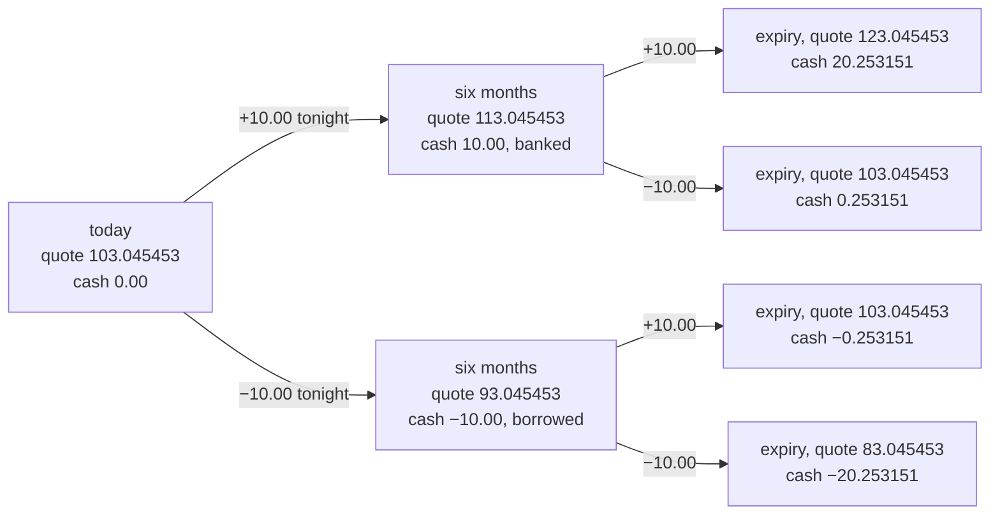
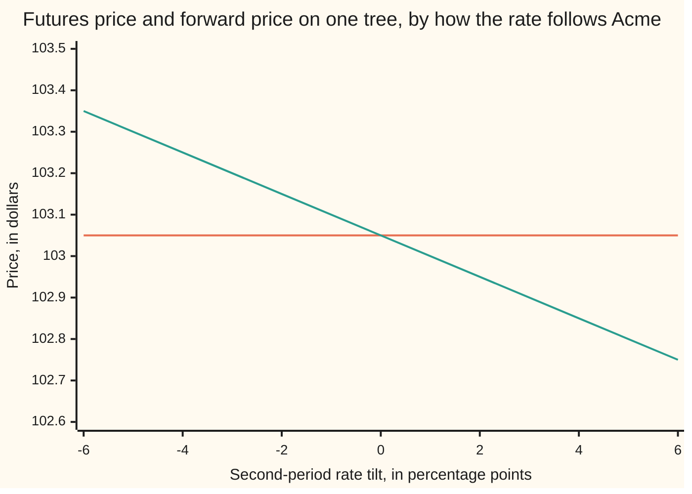

# Futures: daily settlement, and why a futures price can differ from a forward

Financial mathematics → Contracts and No-Arbitrage → Daily settlement → Futures

---

## General Overview

An exchange lists a contract on Acme shares for delivery in a year. Acme trades at 100.00 dollars today, the bank pays and charges 5 percent a year, and Acme pays its holders 2 percent a year in dividends, so the agreed delivery price is 103.05 — the cash-and-carry figure from [forward-price-by-cash-and-carry](03-forward-price-by-cash-and-carry.md).

A forward settles once, on delivery day. The exchange's contract settles every evening: it marks every open position to one official closing quote and moves that day's change in cash between the two sides the same night. Losers pay winners, daily. That contract is a **futures contract**, the nightly transfer is **margining**, and the cash moved is **variation margin**. This card uses two settlement dates rather than 252, six months in and at expiry, so the account can be followed by hand.

Take two records of the quote — two ways the year could go, called paths in the checks below. On the first the quote rises 10.00 to 113.05 at six months, then falls 10.00 back to 103.05 at expiry. On the second it falls first and rises second. Both open and close at 103.05, so a forward struck at 103.05 pays nothing on either.

The margin account disagrees. On the first record the 10.00 arrived mid-year and earned 0.25 in the bank; the 10.00 handed back at expiry is still only 10.00, so the account closes at **0.25**. On the second the 10.00 went out first, borrowed for six months at a cost of 0.25, and came back unchanged: **−0.25**. Same contract, same opening and closing quote, two answers half a dollar apart — and a third, zero, for the forward. None of that is about Acme. Cash that moves early earns interest or costs it, and settling nightly moves cash early.

**A futures contract pays every change in its quote on the date of the change, so a known interest rate lets a fixed shrinking of the position cancel that timing exactly and hold the futures price on the forward price, while an unknown rate leaves a gap.**

**What kind of fact this is:** a theorem, proved on this card in Why it works: the two prices agree when interest rates are known in advance. Nightly settlement itself is a convention set by the exchange; the two-date tree is a model.

### The picture: one contract, four records, and where the cash lands



The two middle branches finish at the same quote and at different cash. A forward struck at 103.045453 pays 0.00 on both and 20.00 or −20.00 on the outer two: a quarter of a dollar under the futures account on the records that rose first, a quarter over it on the rest.

---

## The formula

A futures position is not one purchase but a list of decisions, one per settlement date. The dates run from today, numbered 0, to expiry, numbered $N$. On each, the exchange publishes one official quote, written $F_i$, so $F_0$ is today's and $F_N$ the last. The contracts carried from one date to the next are written $h_i$; that number may be fractional, and may be changed at any settlement at no charge, because a contract that has just settled is worth nothing. The bank account starts at 1.00 and grows at the interest rate, written $B_i$ on each date and $B_N$ at expiry. Cash in the margin account just after a settlement is $V_i$. One settlement pays the change in the quote times the contracts carried across it, and that is the whole ledger:

$$V_{i+1} \;=\; V_i\,\frac{B_{i+1}}{B_i} \;+\; h_i\,(F_{i+1} - F_i)$$

**Read it aloud:** last night's balance grows at the bank rate, and then tonight's settlement is added to it.

Run that to expiry and every settlement carries its own interest from its own date:

$$V_N \;=\; \sum_{i=0}^{N-1} h_i\,\frac{B_N}{B_{i+1}}\,(F_{i+1}-F_i)$$

**Read it aloud:** carry each settlement forward from the evening it was paid, then add the results.

Those weights are the entire difference from a forward, which carries nothing because it pays once. So choose the position to cancel them:

$$h_i \;=\; \frac{B_{i+1}}{B_N}$$

**Read it aloud:** hold fewer contracts early, scaled down by exactly what that settlement's cash will grow by before expiry. Desks call this **tailing**, and the shrinking factor the **tail**.

With those sizes the sum collapses to $F_N - F_0$. The last quote is the share's own price on expiry day, $F_N = S_T$, so that is the payoff of a forward struck at today's quote. Both contracts now cost nothing to enter and pay the same on every record, so today's quote must equal $K$, the delivery price written into that forward. Step 3 prices any daylight between them as free money.

Both prices are also averages taken in the **risk-neutral world**, the pretend market in which every asset drifts at the bank rate ([state-prices-and-risk-neutral-pricing-in-one-period](07-state-prices-and-risk-neutral-pricing-in-one-period.md)). The futures price $F_0$ is the plain average of the finishing price $S_T$; $K$ is that same average weighted by $D$, what one dollar paid at expiry is worth today on one record. Step 5 works out when the two part.

| Symbol | Plain meaning | In our example | Push it up and the answer… |
| --- | --- | --- | --- |
| $F_i$, $F_0$, $F_N$ | the official futures quote on each settlement date, today's and the last | 103.045453, then 113.045453 or 93.045453 | the whole tree lifts; widen the steps between them instead and more cash moves early |
| $S$, $S_T$ | Acme's price today, and on expiry day | 100.00, and 123.045453, 103.045453 or 83.045453 | every quote lifts with it |
| $K$ | the delivery price written into a forward | 103.045453 | the forward is worth less to its buyer |
| $h_i$ | contracts carried from one settlement date to the next | 1, or the tailed 0.975310 | every settlement scales with it |
| $B_i$, $B_N$ | the bank account, starting at 1.00 and growing at the interest rate | 1.025315 after six months | early cash is carried further |
| $V_i$, $V_N$ | cash in the margin account just after a settlement, and at expiry | 0.253151 on the up-then-down record | — |
| $D$ | today's worth of one dollar paid at expiry, on one record | 0.951229 with a flat bank | the forward price is pulled down |
| $N$ | how many settlement dates there are | 2 here, about 252 in a year of nightly settlement | the same cash moves earlier |
| $T$ | time to expiry, in years | 1 | more interest on each settlement |
| $r$ | the interest rate, continuously compounded | 5 percent, or 8 and 2 | every carrying weight grows |
| $q$ | Acme's dividend yield | 2 percent | the quote tree slides down |
| $\tanh x$ | a function of one number, $(e^{x} - e^{-x})/(e^{x} + e^{-x})$, very near $x$ itself when $x$ is small | times the 10.00 move it gives the 0.149989 gap | the gap widens, a little slower than the tilt |

### When it holds

- **One rate for borrowing and lending, no fees, any position size, trades reversible.** Drop it and the single fair price widens into a band, as on [no-arbitrage-and-the-law-of-one-price](02-no-arbitrage-and-the-law-of-one-price.md).
- **The rate over each period is known before the position for that period is chosen.** The load-bearing assumption: take it away and the tail cannot be computed in time, and on this tree the two prices part by 0.15.
- **Settlement cash moves freely at that rate.** Real margin sits in a clearing account paying less, and part of it cannot be withdrawn, pushing the futures price further from the forward than the model says.
- **Every margin call is met.** A position closed out by force leaves a ledger no fixed rescaling repairs — which is how a correct hedge still bankrupts its holder.
- **The last quote is the share's own price, $F_N = S_T$.** Where the final settlement is an average over a window, or a basket, a residue is left that this argument does not price.

---

## Why it works

### Step 0: cash has a date, and a date is worth money

At 5 percent a year the half-year growth factor is 1.025315, so 10.00 received at six months is worth 10.25 by expiry, and 10.00 paid out at six months costs 10.25 to borrow until then. A forward has no such balance: it pays nothing before delivery day. That is the entire difference between the two contracts; everything below is bookkeeping on it.

### Step 1: the ledger, and what it adds up to

Start the margin account empty and apply the ledger every evening: the balance grows at the bank rate, then the settlement lands. Unrolled to expiry, each settlement carries the bank's growth from its own evening.

One contract held throughout, on the up-then-down record: the 10.00 received at six months is carried by 1.025315, the 10.00 paid at expiry by nothing, so the total is 10.253151 − 10.00 = 0.253151. Every sign flips on the down-then-up record: −0.253151, against 0.00 for the forward on both.

### Step 2: hold less early, and the weights vanish

The weights are the problem: the six-month settlement is multiplied by 1.025315, the one at expiry by 1. Hold less early and the multiplication is absorbed. Carry 1 ÷ 1.025315 = 0.975310 contracts for the first half-year and 1 for the second: the first settlement is then 0.975310 × 10.00 = 9.753099, which grows to exactly 10.00 by expiry, and the two cancel.

This is exact, not approximate, and it holds on every record. The tailed position ends at 20.00, 0.00, 0.00 and −20.00 across the four, which is $F_N - F_0$ on each.

### Step 3: no free money, so the two prices are one price

Two positions now cost nothing to open and pay the identical amount on every record: the tailed futures position, and a forward struck at $F_0$. Suppose the exchange's quote sat below the fair forward price. Buy the tailed position, sell a forward at that price: the finishing price cancels between the legs, and what is left is the difference between the two prices — positive on every record, with nothing staked and no risk. Free money cannot survive. Above the forward price, both legs reverse.

So the futures quote is forced onto the cash-and-carry forward price, 103.045453 for Acme: the nightly settlements visibly change the cash and do not touch the price.

<details>
<summary>Detailed proof: the sum, the tail, and the sign of the gap</summary>

**The sum.** Divide the ledger by $B_{i+1}$: the balance in bank units on one date is the balance in bank units on the date before, plus that evening's settlement divided by the bank's value that evening. Adding those changes from today to expiry leaves the last bank-unit balance minus the first, and the account starts empty, so multiplying back by $B_N$ gives the displayed sum. No step needed the sizes positive or constant, so reversing a position reverses the whole cash path.

**The tail.** Substitute the tail sizes. Each term becomes the bank's growth from a date to expiry, times its own reciprocal, times the change in the quote: the weights cancel and consecutive changes add to $F_N - F_0$. Every size is a finite positive number fixed by the known rate schedule and available before its period starts, and resizing a settled contract costs nothing, so the strategy is executable and self-financing.

**The gap.** Write the risk-neutral average as a bar. The futures price is the bar of $S_T$, the forward price the bar of $D\,S_T$ divided by the bar of $D$. The bar of a product is the product of the bars plus the covariance, so the forward price is the futures price plus that covariance divided by the bar of $D$. Rates rising with the asset make $D$ small exactly where $S_T$ is large, so the covariance is negative and the futures price the higher; rates falling with it reverse the sign. A known rate makes $D$ constant, the covariance zero and the two prices equal — Step 3 by another road.

</details>

### Step 4: the tail wants tomorrow's interest rate

The tail asks for the bank's growth from the next settlement date to expiry, at the moment the position is chosen — before that date arrives. Against a known rate schedule that is arithmetic. Against an unknown one it is a request for tomorrow's newspaper.

Let the second half-year's rate depend on what Acme does: 8 percent if the quote rises, 2 percent if it falls. The tail needed is then 0.960789 after a rise and 0.990050 after a fall, and the size must be fixed before anyone knows which. No single number does both jobs, so the tailed replication is unavailable — and with it goes the argument that pinned the two prices together.

### Step 5: two averages, and which way the gap points

What remains is the pair of averages. Nothing is carried across a futures settlement, so the futures price stays the plain average; the forward pays once, so its price is that average weighted by $D$. When the interest rate rises with Acme, the records where Acme finishes high are the records where money is dear, so $D$ is small exactly where the finishing price is large. The weighted average is dragged below the plain one, the forward price sits below the futures price, and reversing the link reverses the gap.

On this tree the arithmetic closes in one line. The gap is the size of the quote's move times $\tanh$ of the rate tilt over half a year, where $\tanh x = (e^{x} - e^{-x})/(e^{x} + e^{-x})$, a function very nearly equal to its own argument for small inputs. So 10.00 × tanh(0.015) = 0.149989, computed without reference to either average and agreeing with their difference to the last digit. In words: **the gap is a covariance, between the finishing price and the cost of money.**

A second road to Step 3 avoids trees entirely. In the risk-neutral world a futures quote is a **martingale** — a running number whose average next value is its current value — since a position that costs nothing and settles instantly has no drift to pay for. A forward price is a ratio of two averages; it equals the plain average whenever $D$ and the finishing price do not move together, which a known rate guarantees by making $D$ the same on every record. That framing belongs to [state-prices-and-risk-neutral-pricing-in-one-period](07-state-prices-and-risk-neutral-pricing-in-one-period.md).

---

## Worked numbers, by hand

Acme at 100.00, the bank at 5 percent, the dividend yield 2 percent, expiry a year away, settlement at six months and at expiry. The quote opens at the cash-and-carry level and moves 10.00 each time.

| Step | Arithmetic | Value |
| --- | --- | --- |
| the opening quote | $100.00 \times e^{0.03}$ | 103.045453 |
| six months in, the quote rises | $103.045453 + 10.00$ | 113.045453 |
| the settlement paid that evening | the change in the quote | 10.00 |
| half a year of bank growth | $e^{0.025}$ | 1.025315 |
| that 10.00 by expiry | $10.00 \times 1.025315$ | 10.253151 |
| expiry, the quote falls back | the settlement paid away | −10.00 |
| **cash at expiry, one contract** | $10.253151 - 10.00$ | **0.253151** |
| **the other record, down then up** | every sign reversed | **−0.253151** |
| a forward struck at 103.045453 | $103.045453 - 103.045453$ | **0.00** |
| the tail for the first half-year | $1 \div 1.025315$ | 0.975310 |
| **cash at expiry, tailed** | $0.975310 \times 10.00 \times 1.025315 - 10.00$ | **0.00** |

Read the last five rows together: one contract is out by a quarter of a dollar, in whichever direction the quote moved first, while 0.975310 contracts for the first half-year lands exactly where the forward lands — on every record, not on average.

### What breaks if you drop a piece

| Mistake | Comes out at | What went wrong |
| --- | --- | --- |
| Adding the settlements up with no interest | 0.00 | The 10.00 in and the 10.00 out do cancel; the six months between them do not |
| One contract where a forward's payoff was wanted | 0.253151 | The early settlement is carried to expiry, arriving larger than it left |
| Tailing from today instead of from the settlement date | −0.246901 | 0.951229 contracts is too small for the first half, so the 10.00 paid back at expiry outruns the 9.75 carried into it |
| Pricing the futures by cash and carry when the rate rises with Acme | 0.149989 too low | Cash and carry prices a forward; the margin account's timing advantage is worth 0.15 more |

Both checks print every number in both tables.

---

## How the gap moves: the bank does it, not the share

In the two middle records the quote comes home to 103.05 and the margin account does not come home to zero. Acme finished the year where it started; the bank did the rest.

Settle the same round trip nightly instead of twice: the quote climbs in 126 equal daily steps to 113.05, then falls back the same way over 126 more, one contract held throughout.

| months gone | 0 | 3 | 6 | 9 | 12 |
| --- | --- | --- | --- | --- | --- |
| margin balance | 0.00 | 5.03 | 10.13 | 5.22 | 0.26 |

The balance ends at 0.26, not at 0.00 and not at the 0.25 of the two-date version: spreading the round trip over 252 settlements moves both the gains and the losses about three months earlier, and the extra interest on the gains beats the extra interest on the losses by a third of a cent. Tailing day by day returns the balance to 0.00 exactly, which the checks assert. Two forces set its size, one at a time below.

### Force one: what the bank charges

```
bank rate   cash at expiry, up-then-down record, one contract
     0%                                                       $0.00
     2%   ████████                                            $0.10
     5%   ████████████████████                                $0.25
     8%   ████████████████████████████████                    $0.41
```

At a rate of zero the early cash earns nothing and the account comes home to zero, so both contracts end with the same cash — though the futures still moves money in between. Every further percent of interest opens the gap, very nearly in proportion.

### Force two: how closely the rate follows Acme

```
rate tilt   futures price minus forward price, same tree
     0 pts                                                    $0.00
     1 pt   █████                                             $0.05
     3 pts  ███████████████                                   $0.15
     6 pts  ██████████████████████████████                    $0.30
```

A tilt of 3 points means the second half-year's rate is 8 percent after an up move and 2 percent after a down move. The gap is very nearly proportional to the tilt: make the rate follow the quote twice as hard and the gap doubles.

### Both prices on one chart



The flat line is the futures price, the plain average of the finishing quote, which the rate cannot touch. The sloping line is the forward price. They cross where the tilt is zero and the rate is known in advance, and that crossing is the theorem.

One honest detail: holding the risk-neutral odds on Acme's finishing price fixed while the bank changes shifts Acme's own spot between the three worlds — 100.00 with a flat bank, 99.87 when the rate rises with Acme, 100.16 when it falls. The checks print all three, and the two prices are always compared inside one world.

---

## Code, from first principles, and it actually runs

Nothing is imported that already holds an answer: the quote tree, the margin ledger, the bisection search and tanh are written out. Every figure is reached twice. The ledger runs by carrying the whole balance forward date by date, and again by converting each settlement into bank units to cash out at expiry; the futures price by averaging forward over the four paths, and again by averaging backwards through the tree; the forward price as a weighted average, and again by a bisection search for the delivery price worth nothing today. The flat-rate answer must then match the previous card's cash-and-carry figure and return Acme's spot at 100.00, the gap must match its closed form, and one branch's tail used on the other branch's record must leave cash behind.

### Python

```python
# Futures margining and the forward-futures difference -- the check behind the
# card.  Nothing is imported that already holds an answer: the quote tree, the
# margin ledger, the bisection search and the hyperbolic tangent are written out
# here.  Acme: spot 100.00, bank 5 percent a year continuously compounded,
# dividend yield 2 percent, one year, settled at six months and at expiry.  The
# futures quote jumps 10.00 at every settlement.
from math import exp

S0, R, Q, T, DT, MOVE, DAYS = 100.0, 0.05, 0.02, 1.0, 0.5, 10.0, 252
F0 = S0 * exp((R - Q) * T)                 # cash and carry: where the quote tree starts
PATHS = (("up, up", (1, 1)), ("up, down", (1, -1)),
         ("down, up", (-1, 1)), ("down, down", (-1, -1)))
TILTS = (0.0, 0.03, -0.03)

def quotes(path):                          # the futures quote after each settlement
    return [F0 + MOVE * sum(path[:i]) for i in range(len(path) + 1)]

def bank(path, tilt):                      # growth factor per half year; tilt ties rates to the quote
    return [exp(R * DT), exp((R + tilt * path[0]) * DT)]

def ledger(path, sizes, tilt=0.0):         # road 1: carry the whole balance forward, date by date
    f, b, v = quotes(path), bank(path, tilt), 0.0
    for i, h in enumerate(sizes):
        v = v * b[i] + h * (f[i + 1] - f[i])
    return v

def bank_units(path, sizes, tilt=0.0):     # road 2: hold each settlement in bank units, cash out at expiry
    f, b, units, level = quotes(path), bank(path, tilt), 0.0, 1.0
    for i, h in enumerate(sizes):
        level *= b[i]                      # the bank account's value at that settlement date
        units += h * (f[i + 1] - f[i]) / level
    return units * level

def tail(path, tilt=0.0):                  # the sizes that cancel the carrying weights
    return [1.0 / bank(path, tilt)[1], 1.0]

def prices(tilt):                          # four equally likely paths: plain and weighted averages
    plain = weighted = bond = 0.0
    for _, path in PATHS:
        f, b = quotes(path), bank(path, tilt)
        d = 1.0 / (b[0] * b[1])            # today's worth of a dollar paid at expiry, on this path
        plain, weighted, bond = plain + 0.25 * f[-1], weighted + 0.25 * f[-1] * d, bond + 0.25 * d
    return plain, weighted / bond, weighted * exp(Q * T)

def forward_by_search(tilt):               # road 2 to the forward: the price worth nothing today
    def value(k):                          # what the contract is worth today, averaged over the paths
        return sum(0.25 * (quotes(p)[-1] - k) / (bank(p, tilt)[0] * bank(p, tilt)[1]) for _, p in PATHS)
    lo, hi = 50.0, 200.0
    for _ in range(200):
        mid = 0.5 * (lo + hi)
        lo, hi = (mid, hi) if value(mid) > 0.0 else (lo, mid)
    return 0.5 * (lo + hi)

def futures_backward():                    # road 2 to the futures price: average backwards, node by node
    level = [F0 + 2 * MOVE, F0, F0 - 2 * MOVE]
    while len(level) > 1:
        level = [0.5 * (level[i] + level[i + 1]) for i in range(len(level) - 1)]
    return level[0]

def tanh(x): return (exp(x) - exp(-x)) / (exp(x) + exp(-x))   # written out here, not imported
def tidy(x): return 0.0 if abs(x) < 1e-9 else x              # a clean zero for a billionth

def daily(tailed):                         # 252 settlements: the quote ramps up 10.00, then back down
    g, v, marks = exp(R / DAYS), 0.0, [0.0]
    for day in range(1, DAYS + 1):
        step = MOVE / (DAYS // 2) * (1 if day <= DAYS // 2 else -1)
        v = v * g + step * (exp(-R * (T - day / DAYS)) if tailed else 1.0)
        if day % 63 == 0: marks.append(v)
    return v, marks

def row(label, value): print(f"{label:<46}{value:>14.6f}")

def table(title, sizes_of):
    print(title)
    print(f"{'path':<18}{'final quote':>14}{'futures cash':>14}{'forward pay':>14}{'difference':>14}")
    for name, path in PATHS:
        f, v = quotes(path), ledger(path, sizes_of(path))
        print(f"{name:<18}{f[-1]:>14.6f}{v:>14.6f}{f[-1] - F0:>14.6f}{tidy(v - (f[-1] - F0)):>14.6f}")

print(f"Acme spot {S0:.2f}, bank {R * 100:.0f} percent, dividend yield {Q * 100:.0f} percent, one year")
row("futures quote today, S e^(r-q)T", F0)
row("half-year bank growth factor, flat rates", bank((1, 1), 0.0)[1])
row("today's worth of a dollar at expiry, flat bank", 1.0 / (exp(R * DT) * bank((1, 1), 0.0)[1]))
print(f"quote tree: {F0:.6f} -> {F0 + MOVE:.6f} or {F0 - MOVE:.6f}")
print(f"         -> {F0 + 2 * MOVE:.6f}, {F0:.6f} or {F0 - 2 * MOVE:.6f}")
print()
table("one contract held throughout, flat rates", lambda path: [1.0, 1.0])
gaps = [abs(ledger(p, [1.0, 1.0], t) - bank_units(p, [1.0, 1.0], t)) for t in TILTS for _, p in PATHS]
row("widest gap between the two ledger roads, 12 cases", tidy(max(gaps)))
print()
table(f"tailed sizes {tail((1, 1))[0]:.6f} then 1.000000, flat rates", tail)
print(f"a settlement of {MOVE:.2f} at six months grows to {MOVE * bank((1, 1), 0.0)[1]:.6f} by expiry; tailed, {tail((1, 1))[0] * MOVE:.6f} grows to {tail((1, 1))[0] * MOVE * bank((1, 1), 0.0)[1]:.6f}")
print(f"tail needed once the bank tilts: {exp(-0.08 * DT):.6f} after a rise, "
      f"{exp(-0.02 * DT):.6f} after a fall")
print()
one_day, marks = daily(False)
print(f"daily settlement, {DAYS} steps, quote up {MOVE:.2f} then back down")
row("one contract, cash at expiry", one_day)
row("tailed sizes, cash at expiry", tidy(daily(True)[0]))
print("margin balance at months 0, 3, 6, 9, 12: " + " ".join(f"{m:.2f}" for m in marks))
print()
print("futures price and forward price, three banks")
print(f"{'bank':<30}{'futures':>13}{'forward':>13}{'gap':>13}{'Acme spot':>13}")
for label, tilt in (("flat at 5 percent", 0.0), ("up with Acme, 8 or 2", 0.03),
                    ("down with Acme, 2 or 8", -0.03)):
    fut, fwd, spot = prices(tilt)
    print(f"{label:<30}{fut:>13.6f}{fwd:>13.6f}{tidy(fut - fwd):>13.6f}{spot:>13.6f}")
row("gap by the closed form, MOVE tanh(tilt DT)", MOVE * tanh(0.03 * DT))
print(f"try: a quote moving 20.00 a settlement -> cash {2 * MOVE * (exp(R * DT) - 1.0):.6f}, "
      f"gap {2 * MOVE * tanh(0.03 * DT):.6f}")
print()
print("bars, gap on path up-down by bank rate:   "
      + " ".join(f"{MOVE * (exp(x * DT) - 1.0):.2f}" for x in (0.0, 0.02, 0.05, 0.08)))
print("bars, price gap by rate tilt:             "
      + " ".join(f"{MOVE * tanh(x * DT):.2f}" for x in (0.0, 0.01, 0.03, 0.06)))
grid = (-0.06, -0.04, -0.02, 0.0, 0.02, 0.04, 0.06)
print("chart, rate tilt in points:               " + " ".join(f"{x * 100:6.0f}" for x in grid))
print("chart, futures price:                     " + " ".join(f"{prices(x)[0]:6.2f}" for x in grid))
print("chart, forward price:                     " + " ".join(f"{prices(x)[1]:6.2f}" for x in grid))
print()
print("what breaks")
row("settlements added with no interest", tidy(sum(quotes((1, -1))[i + 1] - quotes((1, -1))[i] for i in (0, 1))))
row("one contract where a forward was wanted", ledger((1, -1), [1.0, 1.0]))
row("tail taken from today, not from the date", ledger((1, -1), [exp(-R * T), 1.0]))
row("futures quoted at the forward, rates up", prices(0.03)[0] - prices(0.03)[1])
for tilt in TILTS:                                          # two ledger roads, then tailing, every path
    for _, path in PATHS:
        assert abs(ledger(path, [1.0, 1.0], tilt) - bank_units(path, [1.0, 1.0], tilt)) < 1e-12
        assert abs(ledger(path, tail(path, tilt), tilt) - (quotes(path)[-1] - F0)) < 1e-12
assert abs(ledger((-1, 1), tail((1, 1), 0.03), 0.03)) > 0.2  # one size cannot serve both branches
assert abs(daily(True)[0]) < 1e-12                          # the same tail, over 252 settlements
assert abs(futures_backward() - prices(0.0)[0]) < 1e-12     # backwards tree vs the path average
for tilt in TILTS:                                          # bisection vs the weighted average
    assert abs(forward_by_search(tilt) - prices(tilt)[1]) < 1e-9
assert abs(prices(0.0)[1] - S0 * exp((R - Q) * T)) < 1e-12  # flat rates: forward = cash and carry
assert abs(prices(0.0)[2] - S0) < 1e-9                      # and Acme's spot comes back at 100.00
for tilt in (0.03, -0.03):                                  # the gap against its closed form
    assert abs((prices(tilt)[0] - prices(tilt)[1]) - MOVE * tanh(tilt * DT)) < 1e-12
assert prices(0.03)[0] > prices(0.03)[1] and prices(-0.03)[0] < prices(-0.03)[1]
print("ALL CHECKS PASS")
```

**Ran 2026-09-14 on macOS, Python 3.14.6, standard library only. All checks passed. Output, pasted from the run:**

```
Acme spot 100.00, bank 5 percent, dividend yield 2 percent, one year
futures quote today, S e^(r-q)T                   103.045453
half-year bank growth factor, flat rates            1.025315
today's worth of a dollar at expiry, flat bank      0.951229
quote tree: 103.045453 -> 113.045453 or 93.045453
         -> 123.045453, 103.045453 or 83.045453

one contract held throughout, flat rates
path                 final quote  futures cash   forward pay    difference
up, up                123.045453     20.253151     20.000000      0.253151
up, down              103.045453      0.253151      0.000000      0.253151
down, up              103.045453     -0.253151      0.000000     -0.253151
down, down             83.045453    -20.253151    -20.000000     -0.253151
widest gap between the two ledger roads, 12 cases      0.000000

tailed sizes 0.975310 then 1.000000, flat rates
path                 final quote  futures cash   forward pay    difference
up, up                123.045453     20.000000     20.000000      0.000000
up, down              103.045453      0.000000      0.000000      0.000000
down, up              103.045453      0.000000      0.000000      0.000000
down, down             83.045453    -20.000000    -20.000000      0.000000
a settlement of 10.00 at six months grows to 10.253151 by expiry; tailed, 9.753099 grows to 10.000000
tail needed once the bank tilts: 0.960789 after a rise, 0.990050 after a fall

daily settlement, 252 steps, quote up 10.00 then back down
one contract, cash at expiry                        0.256317
tailed sizes, cash at expiry                        0.000000
margin balance at months 0, 3, 6, 9, 12: 0.00 5.03 10.13 5.22 0.26

futures price and forward price, three banks
bank                                futures      forward          gap    Acme spot
flat at 5 percent                103.045453   103.045453     0.000000   100.000000
up with Acme, 8 or 2             103.045453   102.895465     0.149989    99.865678
down with Acme, 2 or 8           103.045453   103.195442    -0.149989   100.156822
gap by the closed form, MOVE tanh(tilt DT)          0.149989
try: a quote moving 20.00 a settlement -> cash 0.506302, gap 0.299978

bars, gap on path up-down by bank rate:   0.00 0.10 0.25 0.41
bars, price gap by rate tilt:             0.00 0.05 0.15 0.30
chart, rate tilt in points:                   -6     -4     -2      0      2      4      6
chart, futures price:                     103.05 103.05 103.05 103.05 103.05 103.05 103.05
chart, forward price:                     103.35 103.25 103.15 103.05 102.95 102.85 102.75

what breaks
settlements added with no interest                  0.000000
one contract where a forward was wanted             0.253151
tail taken from today, not from the date           -0.246901
futures quoted at the forward, rates up             0.149989
ALL CHECKS PASS
```

### Rust

Same numbers, same labels, built with `rustc --edition 2021 -O`.

```rust
// Futures margining and the forward-futures difference -- the same check as the
// Python, in Rust.  No crates.  Nothing is called that already holds an answer:
// the quote tree, the margin ledger, the bisection search and the hyperbolic
// tangent are written out here.  Acme: spot 100.00, bank 5 percent a year
// continuously compounded, dividend yield 2 percent, one year, settled at six
// months and at expiry.  The futures quote jumps 10.00 at every settlement.
const S0: f64 = 100.0; const R: f64 = 0.05; const Q: f64 = 0.02;
const T: f64 = 1.0; const DT: f64 = 0.5; const MOVE: f64 = 10.0; const DAYS: usize = 252;
const PATHS: [(&str, [i32; 2]); 4] = [("up, up", [1, 1]), ("up, down", [1, -1]),
                                      ("down, up", [-1, 1]), ("down, down", [-1, -1])];
const TILTS: [f64; 3] = [0.0, 0.03, -0.03];

fn f0() -> f64 { S0 * ((R - Q) * T).exp() }          // cash and carry: where the quote tree starts

fn quotes(path: &[i32; 2]) -> [f64; 3] {             // the futures quote after each settlement
    let (mut out, mut acc) = ([f0(); 3], 0.0);
    for i in 0..2 { acc += path[i] as f64; out[i + 1] = f0() + MOVE * acc; }
    out
}

fn bank(path: &[i32; 2], tilt: f64) -> [f64; 2] {    // growth per half year; tilt ties rates to the quote
    [(R * DT).exp(), ((R + tilt * path[0] as f64) * DT).exp()]
}

fn ledger(path: &[i32; 2], sizes: &[f64; 2], tilt: f64) -> f64 {   // road 1: carry the balance forward
    let (f, b) = (quotes(path), bank(path, tilt));
    let mut v = 0.0;
    for i in 0..2 { v = v * b[i] + sizes[i] * (f[i + 1] - f[i]); }
    v
}

fn bank_units(path: &[i32; 2], sizes: &[f64; 2], tilt: f64) -> f64 {  // road 2: hold it in bank units
    let (f, b) = (quotes(path), bank(path, tilt));
    let (mut units, mut level) = (0.0, 1.0);         // level is the bank account at the settlement date
    for i in 0..2 { level *= b[i]; units += sizes[i] * (f[i + 1] - f[i]) / level; }
    units * level
}

fn tail(path: &[i32; 2], tilt: f64) -> [f64; 2] { [1.0 / bank(path, tilt)[1], 1.0] }

fn prices(tilt: f64) -> (f64, f64, f64) {            // four equally likely paths: plain and weighted
    let (mut plain, mut weighted, mut bond) = (0.0, 0.0, 0.0);
    for (_, path) in PATHS.iter() {
        let (f, b) = (quotes(path), bank(path, tilt));
        let d = 1.0 / (b[0] * b[1]);                 // today's worth of a dollar paid at expiry
        plain += 0.25 * f[2]; weighted += 0.25 * f[2] * d; bond += 0.25 * d;
    }
    (plain, weighted / bond, weighted * (Q * T).exp())
}

fn forward_by_search(tilt: f64) -> f64 {             // road 2 to the forward: worth nothing today
    let value = |k: f64| -> f64 {
        let mut v = 0.0;
        for (_, p) in PATHS.iter() { v += 0.25 * (quotes(p)[2] - k) / (bank(p, tilt)[0] * bank(p, tilt)[1]); }
        v
    };
    let (mut lo, mut hi) = (50.0, 200.0);
    for _ in 0..200 { let mid = 0.5 * (lo + hi); if value(mid) > 0.0 { lo = mid } else { hi = mid } }
    0.5 * (lo + hi)
}

fn futures_backward() -> f64 {                       // road 2 to the futures price: average backwards
    let mut level = vec![f0() + 2.0 * MOVE, f0(), f0() - 2.0 * MOVE];
    while level.len() > 1 { level = (0..level.len() - 1).map(|i| 0.5 * (level[i] + level[i + 1])).collect(); }
    level[0]
}

fn tanh(x: f64) -> f64 { (x.exp() - (-x).exp()) / (x.exp() + (-x).exp()) }   // written out, not called in
fn tidy(x: f64) -> f64 { if x.abs() < 1e-9 { 0.0 } else { x } }             // a clean zero for a billionth

fn daily(tailed: bool) -> (f64, Vec<f64>) {          // 252 settlements: quote up 10.00, then back down
    let g = (R / DAYS as f64).exp();
    let (mut v, mut marks) = (0.0, vec![0.0]);
    for day in 1..=DAYS {
        let step = MOVE / (DAYS / 2) as f64 * if day <= DAYS / 2 { 1.0 } else { -1.0 };
        v = v * g + step * if tailed { (-R * (T - day as f64 / DAYS as f64)).exp() } else { 1.0 };
        if day % 63 == 0 { marks.push(v) }
    }
    (v, marks)
}

fn row(label: &str, value: f64) { println!("{:<46}{:>14.6}", label, value); }

fn join(values: &[f64], places: usize) -> String {
    values.iter().map(|v| if places == 2 { format!("{:.2}", v) } else { format!("{:6.0}", v) })
        .collect::<Vec<String>>().join(" ")
}

fn table(title: String, tailed: bool) {
    println!("{}", title);
    println!("{:<18}{:>14}{:>14}{:>14}{:>14}", "path", "final quote", "futures cash", "forward pay", "difference");
    for (name, path) in PATHS.iter() {
        let sizes = if tailed { tail(path, 0.0) } else { [1.0, 1.0] };
        let (f, v) = (quotes(path), ledger(path, &sizes, 0.0));
        println!("{:<18}{:>14.6}{:>14.6}{:>14.6}{:>14.6}", name, f[2], v, f[2] - f0(), tidy(v - (f[2] - f0())));
    }
}

fn main() {
    println!("Acme spot {:.2}, bank {:.0} percent, dividend yield {:.0} percent, one year", S0, R * 100.0, Q * 100.0);
    row("futures quote today, S e^(r-q)T", f0());
    row("half-year bank growth factor, flat rates", bank(&[1, 1], 0.0)[1]);
    row("today's worth of a dollar at expiry, flat bank", 1.0 / ((R * DT).exp() * bank(&[1, 1], 0.0)[1]));
    println!("quote tree: {:.6} -> {:.6} or {:.6}", f0(), f0() + MOVE, f0() - MOVE);
    println!("         -> {:.6}, {:.6} or {:.6}", f0() + 2.0 * MOVE, f0(), f0() - 2.0 * MOVE);
    println!();
    table("one contract held throughout, flat rates".to_string(), false);
    let mut widest: f64 = 0.0;
    for t in TILTS.iter() { for (_, p) in PATHS.iter() {
        widest = widest.max((ledger(p, &[1.0, 1.0], *t) - bank_units(p, &[1.0, 1.0], *t)).abs()); } }
    row("widest gap between the two ledger roads, 12 cases", tidy(widest));
    println!();
    table(format!("tailed sizes {:.6} then 1.000000, flat rates", tail(&[1, 1], 0.0)[0]), true);
    println!("a settlement of {:.2} at six months grows to {:.6} by expiry; tailed, {:.6} grows to {:.6}",
             MOVE, MOVE * bank(&[1, 1], 0.0)[1], tail(&[1, 1], 0.0)[0] * MOVE,
             tail(&[1, 1], 0.0)[0] * MOVE * bank(&[1, 1], 0.0)[1]);
    println!("tail needed once the bank tilts: {:.6} after a rise, {:.6} after a fall",
             (-0.08 * DT).exp(), (-0.02 * DT).exp());
    println!();
    let (one_day, marks) = daily(false);
    println!("daily settlement, {} steps, quote up {:.2} then back down", DAYS, MOVE);
    row("one contract, cash at expiry", one_day);
    row("tailed sizes, cash at expiry", tidy(daily(true).0));
    println!("margin balance at months 0, 3, 6, 9, 12: {}", join(&marks, 2));
    println!();
    println!("futures price and forward price, three banks");
    println!("{:<30}{:>13}{:>13}{:>13}{:>13}", "bank", "futures", "forward", "gap", "Acme spot");
    for (label, tilt) in [("flat at 5 percent", 0.0), ("up with Acme, 8 or 2", 0.03),
                          ("down with Acme, 2 or 8", -0.03)] {
        let (fut, fwd, spot) = prices(tilt);
        println!("{:<30}{:>13.6}{:>13.6}{:>13.6}{:>13.6}", label, fut, fwd, tidy(fut - fwd), spot);
    }
    row("gap by the closed form, MOVE tanh(tilt DT)", MOVE * tanh(0.03 * DT));
    println!("try: a quote moving 20.00 a settlement -> cash {:.6}, gap {:.6}",
             2.0 * MOVE * ((R * DT).exp() - 1.0), 2.0 * MOVE * tanh(0.03 * DT));
    println!();
    let by_rate: Vec<f64> = [0.0, 0.02, 0.05, 0.08].iter().map(|x| MOVE * ((x * DT).exp() - 1.0)).collect();
    println!("bars, gap on path up-down by bank rate:   {}", join(&by_rate, 2));
    let by_tilt: Vec<f64> = [0.0, 0.01, 0.03, 0.06].iter().map(|x| MOVE * tanh(x * DT)).collect();
    println!("bars, price gap by rate tilt:             {}", join(&by_tilt, 2));
    let grid = [-0.06, -0.04, -0.02, 0.0, 0.02, 0.04, 0.06];
    println!("chart, rate tilt in points:               {}",
             join(&grid.iter().map(|x| x * 100.0).collect::<Vec<f64>>(), 0));
    println!("chart, futures price:                     {}",
             join(&grid.iter().map(|x| prices(*x).0).collect::<Vec<f64>>(), 2));
    println!("chart, forward price:                     {}",
             join(&grid.iter().map(|x| prices(*x).1).collect::<Vec<f64>>(), 2));
    println!();
    println!("what breaks");
    let ud = quotes(&[1, -1]);
    row("settlements added with no interest", tidy((ud[1] - ud[0]) + (ud[2] - ud[1])));
    row("one contract where a forward was wanted", ledger(&[1, -1], &[1.0, 1.0], 0.0));
    row("tail taken from today, not from the date", ledger(&[1, -1], &[(-R * T).exp(), 1.0], 0.0));
    row("futures quoted at the forward, rates up", prices(0.03).0 - prices(0.03).1);
    for t in TILTS.iter() { for (_, p) in PATHS.iter() {            // two ledger roads, then tailing
        assert!((ledger(p, &[1.0, 1.0], *t) - bank_units(p, &[1.0, 1.0], *t)).abs() < 1e-12);
        assert!((ledger(p, &tail(p, *t), *t) - (quotes(p)[2] - f0())).abs() < 1e-12); } }
    assert!(ledger(&[-1, 1], &tail(&[1, 1], 0.03), 0.03).abs() > 0.2);  // one size cannot serve both
    assert!(daily(true).0.abs() < 1e-12);                           // the same tail, 252 settlements
    assert!((futures_backward() - prices(0.0).0).abs() < 1e-12);    // backwards tree vs the path average
    for t in TILTS.iter() { assert!((forward_by_search(*t) - prices(*t).1).abs() < 1e-9); }
    assert!((prices(0.0).1 - S0 * ((R - Q) * T).exp()).abs() < 1e-12);  // flat: forward = cash and carry
    assert!((prices(0.0).2 - S0).abs() < 1e-9);                         // Acme's spot comes back at 100.00
    for t in [0.03, -0.03] { assert!(((prices(t).0 - prices(t).1) - MOVE * tanh(t * DT)).abs() < 1e-12); }
    assert!(prices(0.03).0 > prices(0.03).1 && prices(-0.03).0 < prices(-0.03).1);
    println!("ALL CHECKS PASS");
}
```

**Ran 2026-09-14 on macOS, rustc 1.98.1, no crates. All checks passed. Output, pasted from the run:**

```
Acme spot 100.00, bank 5 percent, dividend yield 2 percent, one year
futures quote today, S e^(r-q)T                   103.045453
half-year bank growth factor, flat rates            1.025315
today's worth of a dollar at expiry, flat bank      0.951229
quote tree: 103.045453 -> 113.045453 or 93.045453
         -> 123.045453, 103.045453 or 83.045453

one contract held throughout, flat rates
path                 final quote  futures cash   forward pay    difference
up, up                123.045453     20.253151     20.000000      0.253151
up, down              103.045453      0.253151      0.000000      0.253151
down, up              103.045453     -0.253151      0.000000     -0.253151
down, down             83.045453    -20.253151    -20.000000     -0.253151
widest gap between the two ledger roads, 12 cases      0.000000

tailed sizes 0.975310 then 1.000000, flat rates
path                 final quote  futures cash   forward pay    difference
up, up                123.045453     20.000000     20.000000      0.000000
up, down              103.045453      0.000000      0.000000      0.000000
down, up              103.045453      0.000000      0.000000      0.000000
down, down             83.045453    -20.000000    -20.000000      0.000000
a settlement of 10.00 at six months grows to 10.253151 by expiry; tailed, 9.753099 grows to 10.000000
tail needed once the bank tilts: 0.960789 after a rise, 0.990050 after a fall

daily settlement, 252 steps, quote up 10.00 then back down
one contract, cash at expiry                        0.256317
tailed sizes, cash at expiry                        0.000000
margin balance at months 0, 3, 6, 9, 12: 0.00 5.03 10.13 5.22 0.26

futures price and forward price, three banks
bank                                futures      forward          gap    Acme spot
flat at 5 percent                103.045453   103.045453     0.000000   100.000000
up with Acme, 8 or 2             103.045453   102.895465     0.149989    99.865678
down with Acme, 2 or 8           103.045453   103.195442    -0.149989   100.156822
gap by the closed form, MOVE tanh(tilt DT)          0.149989
try: a quote moving 20.00 a settlement -> cash 0.506302, gap 0.299978

bars, gap on path up-down by bank rate:   0.00 0.10 0.25 0.41
bars, price gap by rate tilt:             0.00 0.05 0.15 0.30
chart, rate tilt in points:                   -6     -4     -2      0      2      4      6
chart, futures price:                     103.05 103.05 103.05 103.05 103.05 103.05 103.05
chart, forward price:                     103.35 103.25 103.15 103.05 102.95 102.85 102.75

what breaks
settlements added with no interest                  0.000000
one contract where a forward was wanted             0.253151
tail taken from today, not from the date           -0.246901
futures quoted at the forward, rates up             0.149989
ALL CHECKS PASS
```

The two outputs match line for line.

> [!TIP]
> **Try changing**
> Guess the direction first, then run it. An assert is a line that stops the program when a number comes out wrong.
> - **Turn the bank off.** Set `R = 0.0`. Every difference column falls to 0.00, since one contract now lands where the forward lands — and yet the price gap is unchanged at 0.149989. The gap lives on how the rate varies, not on how large it is.
> - **Double the swing.** Set `MOVE = 20.0`. The cash on the up-then-down record doubles to 0.506302 and the price gap to 0.299978, both previewed on the `try:` line above.
> - **Break the tail.** Make `tail` return `[1.0, 1.0]`. The tailing assert stops the program: one contract held throughout no longer reproduces the forward's payoff.

---

## The usual mistake

> [!warning]
> **Reading the futures price as the price of something.** No money changes hands when a position is opened. The quote is not a cost; it is the level from which tonight's settlement will be measured, and a contract that has just settled is worth nothing. That is why a position can be resized for free at every settlement — and free resizing is what the tailing argument spends.
>
> - **Concluding the contracts are identical because their prices agree.** Under known rates the prices agree and the cash does not: one contract on the up-then-down record ends at 0.253151 where the forward ends at 0.00 — real money to whoever finances the position.
> - **Concluding the contracts are unrelated because their cash differs.** The opposite error: 0.975310 contracts for the first half-year and 1 for the second lands on the forward's payoff exactly.
> - **Tailing with the wrong factor.** The tail runs from the settlement date to the end of the hedge, never from today. Taking it from today gives −0.246901 where 0.00 was wanted.
> - **Getting the sign of the correction backwards.** The futures price is the higher when the rate rises with the underlying. For rate futures the sign never wavers: the quoted futures rate has to be cut before it may be used as a forward rate.

---

## Where you meet it in real life

- **Every exchange-traded futures contract.** One official settlement price per contract per day, the difference moved in cash that night, so no loss is carried forward to threaten the clearing house.
- **Tailing a hedge.** A treasurer using futures in place of a forward scales the position down by the discount factor to the hedge's end date, and rescales as that date nears: Step 2, on a desk.
- **Interest-rate futures.** The underlying is itself a rate, so the correlation with the bank is as strong as it gets and the gap is no rounding error. A quoted futures rate must be cut by a **convexity adjustment** before it is treated as a forward rate — see [futures-forward-convexity](../32-Convexity%20and%20Exotics/01-futures-forward-convexity.md).
- **Short-dated equity and commodity futures.** Weak correlation and a short life, so the gap hides inside the bid-offer spread and desks quote the two interchangeably. French measured it on silver and copper in 1983: small, but not always zero.
- **Cleared swaps.** Since the reforms that followed 2008, over-the-counter forwards and swaps mostly post variation margin daily too, so the dividing line now runs between cleared and uncleared.

**Conventions verified 14 Sep 2026:** CME Group fixes corn's daily settlement from a one-minute window ending at 13:15 Central Time, and the E-mini S&P 500's from a volume-weighted average of trades between 15:14:30 and 15:15:00; the difference from the previous day's settlement is exchanged that evening. Exchanges change those windows; the mathematics depends only on cash moving on a date, not on which window fixed it.

> **Say it back**
> A forward pays once, at delivery. A futures contract settles the change in its quote every evening, in cash, so its account depends on when the quote moved and not only on where it finished: a quote that leaves 103.05 and comes home to 103.05 leaves 0.25 in the account if it rose first and −0.25 if it fell first, against 0.00 for the forward. Hold fewer contracts early — 0.975310 for the first half-year here — and the interest on that early cash cancels exactly, so the position reproduces the forward's payoff and the two prices must agree. That rescaling needs the rate known before it is used. When the rate moves with the asset, nothing cancels and the gap is a covariance: 0.15 on this tree, positive when rates rise with the asset.

---

## What this builds on

- [forward-value-after-inception](04-forward-value-after-inception.md): what a signed forward is worth once the market has moved, and why a freshly struck one is worth nothing. That second fact is what lets a futures position be resized for free at every settlement, which is the whole of Step 2.

## Where this goes next

- [options-on-commodity-futures](../26-Options%20on%20commodity%20futures%20and%20spreads/01-options-on-commodity-futures.md): options written on the futures quote rather than the share. The quote's being a plain risk-neutral average is what lets the familiar formula price them with the quote in place of the spot.
- [futures-forward-convexity](../32-Convexity%20and%20Exotics/01-futures-forward-convexity.md): the same gap on real interest-rate contracts, where the correlation is strongest and the numbers are large enough to trade on.

This card gives the sign of the difference and its size on one two-step tree. It cannot give the size in a market where the rate wanders continuously and the contract runs for years: that number is the convexity adjustment, a later card's subject.

---

## Sources

Verified 14 Sep 2026: every link below resolves to the publisher's page.

- Cox, John C., Jonathan E. Ingersoll, and Stephen A. Ross. "The Relation between Forward Prices and Futures Prices." *Journal of Financial Economics* 9, no. 4 (1981): 321–346. [doi:10.1016/0304-405X(81)90002-7](https://doi.org/10.1016/0304-405X(81)90002-7). The equality under known rates, and the covariance that sets the sign when they are random.
- Jarrow, Robert A., and George S. Oldfield. "Forward Contracts and Futures Contracts." *Journal of Financial Economics* 9, no. 4 (1981): 373–382. [doi:10.1016/0304-405X(81)90004-0](https://doi.org/10.1016/0304-405X(81)90004-0). The same equality by an explicit rolling strategy — the tail used here.
- French, Kenneth R. "A Comparison of Futures and Forward Prices." *Journal of Financial Economics* 12, no. 3 (1983): 311–342. [doi:10.1016/0304-405X(83)90052-1](https://doi.org/10.1016/0304-405X(83)90052-1). Measures the gap in real markets rather than assuming it away.
- CME Group Institute. "Mark-to-Market." Introduction to Futures course. [Course page](https://www.cmegroup.com/education/courses/introduction-to-futures/mark-to-market.html). The exchange's own account of nightly settlement, and the windows quoted above.
- Hull, John C. *Options, Futures, and Other Derivatives*, 11th ed. Pearson. [Publisher page](https://www.pearson.com/en-us/subject-catalog/p/options-futures-and-other-derivatives/P200000005938). The textbook route, including the convexity adjustment for rate futures.
