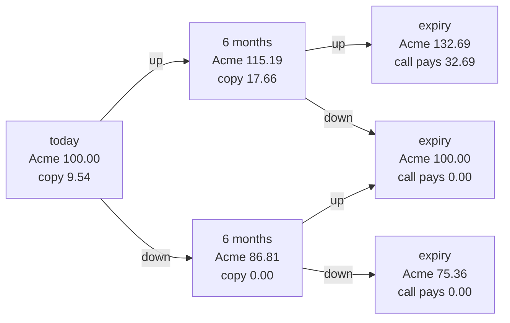
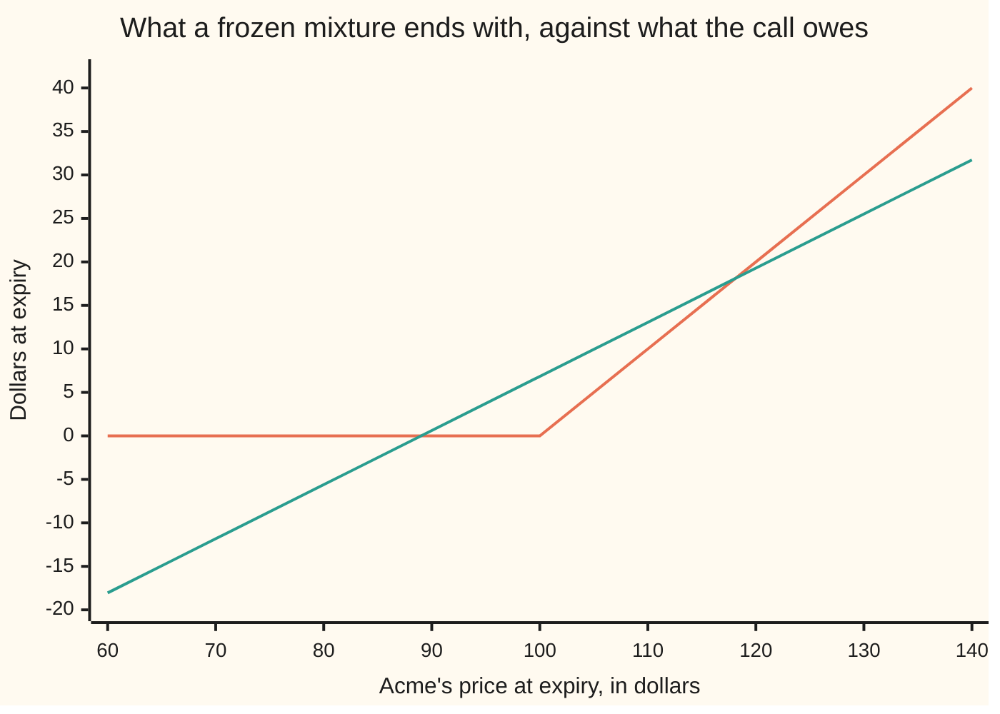

# Replication: a portfolio that copies a payoff without new money

[Syllabus](../../../SYLLABUS.md) → [Financial mathematics](../README.md) → [Contracts and No-Arbitrage](../README.md#s03) → Replication

---

## General Overview

Acme shares trade at $100.00 today. A call written on them sits on the desk with no price on it: the right, not the duty, to buy one Acme share for $100.00 in a year's time ([Payoffs](01-payoffs-and-positions.md)). Nobody knows where Acme will be by then, and the price has to be found anyway.

Two things can be bought today at prices already on the screen: Acme shares, and a bank account paying 5 percent. Buy a mixture of the two, and fix a rule for changing the mixture as Acme moves. The rule carries one clause: after the opening day, no money goes in and none comes out. Every share bought is paid for by a sale or by borrowing. A strategy carrying that clause is **self-financing**, the term used from here on.

Suppose such a mixture ends the year holding exactly what the call pays, whatever Acme did. It is a copy of the call. Two things that pay the same in every state cost the same today, or free money is on the table ([No arbitrage](02-no-arbitrage-and-the-law-of-one-price.md)), so the call's price is the cost of the copy.

Cut the year into two six-month steps. Acme's 20 percent-a-year jumpiness makes each step multiply its price by 1.151910 or by 0.868123. The copy then costs **$9.54**: 0.6223 of a share, funded by that $9.54 and a loan of $52.69. Not a forecast. A bill.

**A strategy that is never fed and never raided, and that ends holding exactly what a contract pays on every path, has one cost today, and that cost is the contract's price.**

**What kind of fact this is:** self-financing is a definition; the gains identity and the pricing conclusion are theorems, proved on this card in Why it works. The two-way step is a model, the coarsest picture in which the copy can be built at all.

### The picture: two steps, and what the copy is worth at each node



An up move then a down lands where a down then an up lands, so the middle node at expiry is shared. Every figure is printed by the checks below.

---

## The formula

Trading happens on dates $0, 1, \dots, N$, one step apart. On each date two numbers are chosen and held until the next: how many Acme shares to hold, and how many dollars to leave in the bank. Both may be fractions and both may be negative — a negative share count is a borrowed share sold, a negative balance is a loan.

Write $h_i$ for the share count and $b_i$ for the bank balance, both fixed just after trading on date $i$; $S_i$ for Acme's price then; and $g = e^{r\Delta t}$ for the factor the balance is multiplied by over one step, where $r$ is the riskless rate and $\Delta t$ the step's length in years. Wealth just after trading, and on arrival at the next date before anything is traded, are

$$V_i = h_i S_i + b_i, \qquad V_{i+1}^- = h_i S_{i+1} + b_i\,g$$

**Read it aloud:** the portfolio is worth its shares at today's price plus the bank balance; one step on, the same shares at the new price plus that balance with its interest.

The strategy is **self-financing** when trading changes the mixture and nothing else, at every date and on every path:

$$h_{i+1} S_{i+1} + b_{i+1} = h_i S_{i+1} + b_i\,g \qquad\text{that is}\qquad V_{i+1} = V_{i+1}^-$$

**Read it aloud:** the new holdings cost exactly what the old ones are worth, so the money from outside is zero.

Subtracting $V_i$ gives the **gains identity**:

$$V_{i+1} - V_i = h_i\,(S_{i+1} - S_i) + b_i\,(g - 1)$$

**Read it aloud:** wealth moves for two reasons only — the shares held changed in price, and the bank paid interest.

One step of a two-way tree is matched by two equations. If the contract is worth $V_u$ where the share reaches $S_u$ and $V_d$ where it reaches $S_d$, the holdings paying both are

$$h = \frac{V_u - V_d}{S_u - S_d}, \qquad b = \frac{V_u - h\,S_u}{g}, \qquad V = h\,S + b$$

**Read it aloud:** hold as many shares as the contract gains per dollar the share gains, bank whatever makes the up state come out right, and the pair's cost is the contract's value at that node.

Write $X$ for the payoff owed at the final date, a number that depends on the path. The card's conclusion:

$$V_N = X \text{ on every path, and the strategy self-financing} \implies \text{price of } X = V_0$$

| Symbol | Plain meaning | In our example | Push it up and the answer… |
| --- | --- | --- | --- |
| $S_i$, $S_u$, $S_d$ | Acme's price on date $i$, and one step on | 100.00; 115.19 and 86.81 | the copy costs more |
| $K$ | the strike: the price the call may buy at | 100.00 | the call pays less, so the copy costs less |
| $h_i$, $h$ | shares held from date $i$ to the next | 0.6223 today, 1.0000 after a rise | more of the cost sits in shares |
| $b_i$, $b$ | dollars in the bank; negative is a loan | −52.69 today, −97.53 after a rise | less borrowed, so more capital needed |
| $V$, $V_i$, $V_0$, $V_N$, $V_u$, $V_d$, $V_{i+1}^-$ | the holdings' worth just after trading; the one with the minus sign, on arrival before trading | 9.54 today; 17.66 and 0.00 one step on | — |
| $X$ | the payoff owed at expiry, path by path | 32.69, 0.00, 0.00 | the copy costs more |
| $g$, $r$, $\Delta t$ | the bank's growth over a step, $e^{r\Delta t}$; the riskless rate a year; a step, in years | 1.025315; 5 percent; 0.5 | borrowing costs more |
| $u$, $d$ | the factors one step multiplies the price by | 1.151910 and 0.868123 | a wider tree, a dearer call |
| $N$, $i$ | steps in the year; which date | 2 by hand, 1024 in the checks | the tree fits a real share better |
| $D_i$ | the discount factor back to today, $e^{-r t_i}$ | 0.975310 after one step | — |

### When it holds

- **Two ways out of each node, two things to hold.** Two unknowns meet two demands. A node with three possible next prices cannot be matched by shares and cash: the copy fails and the price becomes a range — an incomplete market, on a later shelf.
- **The two next prices differ.** The share count divides by $S_u - S_d$, and a share doing the same thing in both states hedges nothing.
- **No frictions.** A spread paid at each rebalance is money leaving the account, so a real copy costs more than $V_0$, and more again the more often it trades. Pay more to borrow than the account earns, or fail to get shares in any fraction, long or short, and the one price spreads into a band.
- **Holdings use only what is known at the node.** A rule reading the next price can be written down but not traded — and it matches any payoff at all, which is why it proves nothing.
- **No dividends here.** The wing's Acme pays 2 percent a year; the checks price that variant too.

---

## Why it works

### Step 0: two payoffs that agree everywhere must cost the same

Suppose a portfolio ends holding exactly what the call pays on every path, and sells for less than the call today. Buy the portfolio, sell the call, pocket the difference. Every future payment cancels: whatever the call owes, the portfolio hands over. The difference was free money, and free money does not sit on a screen ([No arbitrage](02-no-arbitrage-and-the-law-of-one-price.md)).

### Step 1: the clause that makes a cost meaningful

A cost today is the copy's cost only if nothing else is ever spent on it: deposit $50 halfway through and the thing matching the call cost $9.54 today and $50 six months on — two numbers, not one. The clause keeps a single number, $V_0$, in charge of a whole strategy. It is a funding rule, not a promise of profit.

### Step 2: wealth can only move through prices

Take the wealth just after trading on date $i$, and the wealth on arrival at date $i+1$, and subtract. The share count and the balance are the same at both ends of the step, since nothing was traded in between, so they factor out and the gains identity is left. Wealth moved because the shares moved and because the bank paid interest. That is the whole list. Summed over the steps, final wealth is the starting capital plus the gains, with no other term to hide a deposit in.

<details>
<summary>The algebra behind this, if you want it</summary>

By definition $V_i = h_i S_i + b_i$, and on arrival $V_{i+1}^- = h_i S_{i+1} + b_i g$. Subtract: $V_{i+1}^- - V_i = h_i(S_{i+1} - S_i) + b_i(g - 1)$, on every path, assuming nothing. Self-financing is the statement $V_{i+1} = V_{i+1}^-$, which puts $V_{i+1}$ on the left. Without it the identity carries one more term, the money added or taken at that date — and a deposit can be cancelled by a later withdrawal, so the clause has to hold date by date, not only at the end.

Rearranged, the same equation is the trading rule in its plainest form: $(h_{i+1} - h_i)\,S_{i+1} = -\,(b_{i+1} - b_i g)$. Shares bought are paid for out of the balance, to the cent.

</details>

### Step 3: discount, and the bank disappears

Measure each date's figures in today's dollars by multiplying by $D_i = e^{-r t_i}$. One step of interest and one of discounting cancel, $D_{i+1}\,g = D_i$, so the identity loses its second term:

$$D_{i+1} V_{i+1} - D_i V_i = h_i\,\bigl(D_{i+1} S_{i+1} - D_i S_i\bigr)$$

Discounted wealth changes only through the discounted share price, times a share count chosen before the move was known: the shape of a bet placed before a toss and settled after it ([Betting on a martingale](../../11-Stochastic%20processes%20and%20calculus/02-Martingales/02-predictable-bets-and-the-martingale-transform.md)). Much of pricing theory lives in that line: find weights making the discounted share price a fair game, and discounted wealth is a fair game for every self-financing strategy at once.

### Step 4: one step, two states, two equations

At the up node Acme is at $115.19 with six months to run. From there it reaches $132.69 or $100.00, where the call pays $32.69 or nothing. Holding $h$ shares and $b$ dollars must produce both numbers:

$$h \times 132.69 + b\,g = 32.69, \qquad h \times 100.00 + b\,g = 0$$

Subtract: $h \times 32.69 = 32.69$, so $h = 1$. One whole share. Put that back and $b\,g = -100.00$, so $b = -97.53$: borrow the strike, discounted. The copy there is one share against a debt that grows into exactly $100.00, which is a forward ([Forward price](03-forward-price-by-cash-and-carry.md)). It costs $115.19 − $97.53 = **$17.66**.

The down node is quicker. From $86.81 Acme reaches $100.00 or $75.36, and the call pays nothing at either: no shares, nothing in the bank, worth zero.

Nothing in those equations mentions the chance of a rise. The probabilities cancelled before they were written down.

### Step 5: the same move, backwards through the tree

Today's problem now looks like the one just solved: a node with two children carrying numbers, $17.66 above and $0.00 below. The same two equations give 0.6223 shares and a loan of $52.69, costing **$9.54**.

Nothing has to be checked for this to be self-financing. Today's holdings were chosen to be worth $17.66 once Acme has risen, and $17.66 is what the up node's holdings cost. The money arriving is the money needed.

### Step 6: therefore the cost is the price

The copy ends holding $32.69 after two up moves and nothing on the other three paths, which is what the call pays. It took $9.54 and never asked for another cent, so by Step 0 the call's price on this tree is $9.54.

<details>
<summary>Detailed proof: existence, self-financing, and uniqueness</summary>

**Existence.** Work backwards. Set $V_N = X$ at every final node. At a node one step earlier with children $V_u$, $V_d$ and prices $S_u \ne S_d$, the three formulas in The formula define $h$, $b$ and $V$. Both demands hold by construction: $h S_u + b g = V_u$ by the choice of $b$, and $h S_d + b g = V_u - h(S_u - S_d) = V_d$. Induction downwards defines $h$ and $b$ everywhere, each using only what is known when it is chosen.
**Self-financing.** Write $h'$ and $b'$ for the holdings chosen at the parent. Arriving here they are worth $h' S + b' g$, one of the two equations the parent solved, so they equal this node's $V$; the new holdings cost $h S + b = V$ by definition. The two agree, so nothing enters or leaves, at every node, and the strategy ends at $X$ everywhere.
**Uniqueness.** Subtract two such strategies holding by holding. The difference is self-financing, since the self-financing equation is linear in the holdings, and it ends at zero everywhere. One step from the end its holdings satisfy $h S_u + b g = 0$ and $h S_d + b g = 0$; subtracting gives $h(S_u - S_d) = 0$, so $h = 0$, then $b = 0$, so it is worth zero there. Repeating up the tree gives zero at the root, so $V_0$ is a single number, not a range.

</details>

The same two equations read the other way round solve for two weights instead of two holdings: the weights making today's share price the discounted average of its two next values. They price every payoff on the tree by averaging, with no hedging at all — the second road the checks take, and the subject of [State prices](07-state-prices-and-risk-neutral-pricing-in-one-period.md).

---

## Worked numbers, by hand

Acme at $100.00, a call struck at $100.00, one year, the bank at 5 percent, jumpiness 20 percent a year, two six-month steps.

| Step | Arithmetic | Value |
| --- | --- | --- |
| up factor over a step | $e^{0.20\sqrt{0.5}}$ | 1.151910 |
| down factor | $1 \div 1.151910$ | 0.868123 |
| the bank over a step | $e^{0.05 \times 0.5}$ | 1.025315 |
| Acme after six months | $100 \times 1.151910$, $100 \times 0.868123$ | 115.19, 86.81 |
| Acme at expiry | up-up, up-down, down-down | 132.69, 100.00, 75.36 |
| the call pays | the gap above 100.00, or nothing | 32.69, 0.00, 0.00 |
| shares at the up node | $(32.69 - 0.00) \div (132.69 - 100.00)$ | 1.000000 |
| bank at the up node | $(32.69 - 1.0000 \times 132.69) \div 1.025315$ | −97.53 |
| the copy at the up node | $1.0000 \times 115.19 - 97.53$ | **17.66** |
| the copy at the down node | nothing is paid either way | **0.00** |
| shares today | $(17.66 - 0.00) \div (115.19 - 86.81)$ | 0.622299 |
| bank today | $(17.66 - 0.6223 \times 115.19) \div 1.025315$ | −52.69 |
| **the copy's cost today** | $0.6223 \times 100.00 - 52.69$ | **9.54** |

The call is worth $9.54 on this tree because that is the cheque a desk writes today to own something paying whatever the call pays. Two steps is a caricature of a year, allowing Acme three closing prices; cutting finer changes the fit, not the method. The checks run the same recipe with 4, 16, 64, 256 and 1024 steps: the cost climbs to $10.4486, heading for $10.4506, the Black–Scholes price of this call ([Black–Scholes call](../08-The%20Black-Scholes%20call%20and%20put/01-black-scholes-call.md)). The wing's Acme also pays a 2 percent dividend, handled by letting a holding grow as its dividends go back in; with that on, 1024 steps give $9.2251 against the house price of $9.2270.

### What breaks if you drop a piece

| Mistake | Comes out at | What went wrong |
| --- | --- | --- |
| Buy 0.6223 shares and never trade again | 27.18 after two up moves against the 32.69 owed; −8.49 after two down moves | A fixed mixture draws a straight line, and the payoff has a bend in it |
| Set the up node's share count by value over price, $17.66 \div 115.19 = 0.1533$, with no loan | 20.34 at up-up where 32.69 is owed; 15.33 at up-down where nothing is owed | The count is a difference of values over a difference of prices, not a ratio of levels |
| Pay for the extra shares with new money: 43.51 deposited at the up node | 77.30 after two up moves | 44.61 of that is the deposit with its interest; the strategy no longer has one cost |

The code prints all three.

---

## How the copy changes as Acme moves

The copy is a basket plus a rule. By expiry its contents have nothing in common with the opening day's, and not one cent has been added or taken out. Follow the path where Acme rises to $115.19 and falls back to $100.00.

| Date | Acme | shares | bank | the copy is worth | what was traded |
| --- | --- | --- | --- | --- | --- |
| today | 100.00 | 0.6223 | −52.69 | 9.54 | 0.6223 of a share bought with 9.54 of capital and 52.69 borrowed |
| six months on, up | 115.19 | 1.0000 | −97.53 | 17.66 | topped up to one whole share; the extra shares cost 43.51, every cent borrowed |
| expiry, down | 100.00 | — | — | 0.00 | the share sells for 100.00, the debt has grown back to the strike, and the call pays nothing |

The middle row is the idea in one line: Acme rose, the copy's wealth rose from $9.54 to $17.66 on its own, and the extra shares were bought with the bank's money. At expiry the share pays off the debt exactly, leaving what the call is worth at $100.00 — nothing. The debt is not a fixed loan but a consequence of the share count:

```
the loan owed at each node, in dollars

today               ████████████████                $52.69
after an up move    ██████████████████████████████  $97.53
after a down move                                   $0.00
```

After a rise the copy leans harder on the bank: the call is closer to paying out, so more shares are needed. After a fall it is closed — no shares, no debt — because the call can no longer pay anything on this tree.

### Why the rule cannot be dropped



The bent line is what the call owes. The straight line is what 0.6223 shares and a $52.69 loan are worth at expiry if nothing is traded again. A straight line can cross a bent one; it cannot lie along it. Trading is not a refinement of the copy. It is the copy.

---

## Code, from first principles, and it actually runs

Nothing is imported that already knows the answer: the tree, the hedge ledger and the binomial weights are written out, and the bell-curve area behind the Black–Scholes limit is built from the library's error function. The price is reached three ways — backwards through the tree, node by node; forwards along every path, checking that the ledger ends on the payoff and takes nothing from outside; and by weights that never mention hedging. The recipe then runs on finer trees, and the three mistakes above are priced.

### Python

```python
# Replication and self-financing -- the check behind the card.  Nothing is imported that
# already knows the answer: the tree, the hedge ledger and the binomial weights are
# written out here; the bell-curve area is built from math.erf.  Acme starts at 100.00, a call struck at 100.00
# runs one year, the bank pays 5 percent, jumpiness is 20 percent, equal steps.
from math import exp, log, sqrt, erf

S0, K, R, SIG, T = 100.0, 100.0, 0.05, 0.20, 1.0

def lattice(n, q):
    """One step of n: up and down factors, the bank's growth over a step, and the factor
    a share holding grows by when its dividends are put back in."""
    u = exp(SIG * sqrt(T / n))
    return u, 1.0 / u, exp(R * T / n), exp(q * T / n)

def payoff(s):                            # the call: the gap above the strike, or nothing
    return max(s - K, 0.0)

def tree(n, q=0.0):
    """Every price Acme can reach: row m is the date m steps in, j ups so far."""
    u, d, _, _ = lattice(n, q)
    rows = [[S0]]
    for m in range(1, n + 1):
        rows.append([rows[m - 1][0] * d] + [rows[m - 1][j - 1] * u for j in range(1, m + 1)])
    return rows

def replicate(n, q=0.0):
    """Road 1.  Work backwards.  At each node two demands -- match the option if Acme
    rises, match it if Acme falls -- fix the share count h and the bank balance c.  What
    that pair costs is the node's wealth.  No probability anywhere in it."""
    u, d, grow, div = lattice(n, q)
    price = tree(n, q)
    v = [payoff(s) for s in price[n]]
    ledger = []
    for m in range(n - 1, -1, -1):
        w, row = [], []
        for j in range(m + 1):
            su, sd = price[m + 1][j + 1], price[m + 1][j]
            h = (v[j + 1] - v[j]) / (su - sd) / div
            c = (v[j + 1] - h * div * su) / grow
            row.append((h, c))
            w.append(h * price[m][j] + c)
        ledger.append(row)
        v = w
    ledger.reverse()
    return v[0], ledger, price

def by_weights(n, q=0.0):
    """Road 2.  No hedging at all.  Weight each ending price by the number that reproduces
    today's share price, average the payoff over those weights, discount it."""
    u, d, grow, div = lattice(n, q)
    p = (grow / div - d) / (u - d)
    ends, total, coeff = tree(n, q)[n], 0.0, 1.0
    for j in range(n + 1):
        total += coeff * p ** j * (1.0 - p) ** (n - j) * payoff(ends[j])
        coeff = coeff * (n - j) / (j + 1)
    return total / grow ** n

def walk(n, q=0.0):
    """Road 3.  Run the ledger forward down every path.  At each trading date, compare what
    the holdings arriving are worth with what the new ones cost: the difference is money
    from outside, and self-financing means it is zero."""
    u, d, grow, div = lattice(n, q)
    v0, ledger, price = replicate(n, q)
    gap, outside, rows = 0.0, 0.0, []
    for path in range(2 ** n):
        j, name = 0, ""
        h, c = ledger[0][0]
        for m in range(1, n + 1):
            up = (path >> (n - m)) & 1
            j += up
            name += ("-" if m > 1 else "") + ("up" if up else "down")
            marked = h * div * price[m][j] + c * grow
            if m < n:
                h, c = ledger[m][j]
                outside = max(outside, abs(h * price[m][j] + c - marked))
        gap = max(gap, abs(marked - payoff(price[n][j])))
        rows.append((name, marked, payoff(price[n][j])))
    return v0, gap, outside, rows

def normal_cdf(x):                        # bell-curve area to the left of x
    return 0.5 * (1.0 + erf(x / sqrt(2.0)))

def black_scholes(q=0.0):                 # the limit a refined tree walks toward
    wiggle = SIG * sqrt(T)
    d1 = (log(S0 / K) + (R - q + 0.5 * SIG * SIG) * T) / wiggle
    return S0 * exp(-q * T) * normal_cdf(d1) - K * exp(-R * T) * normal_cdf(d1 - wiggle)

u, d, grow, _ = lattice(2, 0.0)
v0, gap, outside, paths = walk(2)
price, ledger = tree(2), replicate(2)[1]
print(f"Acme {S0:.2f}, call struck at {K:.2f}, one year, bank {R * 100:.0f} percent, jumpiness {SIG * 100:.0f} percent")
print(f"two six-month steps: up factor {u:.6f}, down factor {d:.6f}, bank factor per step {grow:.6f}")
print(f"Acme after six months: up {price[1][1]:.6f}, down {price[1][0]:.6f}")
print(f"Acme at expiry: up-up {price[2][2]:.6f}, up-down {price[2][1]:.6f}, down-down {price[2][0]:.6f}")
print(f"call payoff at expiry: up-up {payoff(price[2][2]):.6f}, "
      f"up-down {payoff(price[2][1]):.6f}, down-down {payoff(price[2][0]):.6f}")
print()
print(f"{'the ledger':<13}{'Acme':>12}{'shares':>11}{'bank':>13}{'wealth':>12}")
for label, m, j in (("start", 0, 0), ("after an up", 1, 1), ("after a down", 1, 0)):
    h, c = ledger[m][j]
    print(f"{label:<13}{price[m][j]:>12.6f}{h:>11.6f}{c:>13.6f}{h * price[m][j] + c:>12.6f}")
print()
print(f"{'path':<13}{'wealth at expiry':>18}{'the payoff owed':>17}")
for name, wealth, owed in paths:
    print(f"{name:<13}{wealth:>18.6f}{owed:>17.6f}")
print()
print(f"road 1, backward replication, cost today       {v0:>12.6f}")
print(f"road 2, binomial weights, no hedging at all    {by_weights(2):>12.6f}")
print(f"road 3, worst gap between wealth and payoff    {gap:>12.6f}")
print(f"road 3, worst money from outside at a trade    {outside:>12.6f}")
print("\nthe same recipe, the year cut into more steps")
for n in (2, 4, 16, 64, 256, 1024):
    print(f"  {n:>4} steps: no dividend {replicate(n)[0]:>10.6f}    2 percent dividend {replicate(n, 0.02)[0]:>10.6f}")
print(f"  the limit: no dividend {black_scholes():>10.6f}    2 percent dividend {black_scholes(0.02):>10.6f}")
(h0, c0), (hu, cu) = ledger[0][0], ledger[1][1]
frozen = [h0 * s + c0 * exp(R * T) for s in price[2]]
ratio = (hu * price[1][1] + cu) / price[1][1]
deposit = -(cu - c0 * grow)
print("\nwhat breaks")
print(f"  never rebalanced: expiry wealth {frozen[0]:.6f} / {frozen[1]:.6f} / {frozen[2]:.6f},"
      f" payoff owed {payoff(price[2][0]):.6f} / {payoff(price[2][1]):.6f} / {payoff(price[2][2]):.6f}")
print(f"  hedge by value over price at the up node, {ratio:.6f} shares and no loan: pays"
      f" {ratio * price[2][2]:.6f} at up-up and {ratio * price[2][1]:.6f} at up-down")
print(f"  new money at the trade: {deposit:.6f} deposited, up-up ends at"
      f" {hu * price[2][2] + c0 * grow * grow:.6f}, {deposit * grow:.6f} of it the deposit grown")
print()
spots = [60.0 + 10.0 * i for i in range(9)]
print(f"{'chart, Acme at expiry':<25}" + " ".join(f"{s:7.2f}" for s in spots))
print(f"{'chart, call payoff':<25}" + " ".join(f"{payoff(s):7.2f}" for s in spots))
print(f"{'chart, never rebalanced':<25}" + " ".join(f"{h0 * s + c0 * exp(R * T):7.2f}" for s in spots))
assert abs(v0 - by_weights(2)) < 1e-10          # hedge ledger against probability weights
assert gap < 1e-9                               # the copy pays what the call pays, on every path
assert outside < 1e-9                           # and never takes a cent from outside
assert abs(replicate(1024)[0] - black_scholes()) < 0.01           # refinement reaches the limit
assert abs(replicate(1024, 0.02)[0] - 9.227005508154) < 0.01      # and the wing's house call
assert abs(frozen[2] - payoff(price[2][2])) > 5.0                 # a frozen hedge really does fail
print("ALL CHECKS PASS")
```

**Ran 2026-09-14 on macOS, Python 3.14.6, standard library only. All checks passed. Output, pasted from the run:**

```
Acme 100.00, call struck at 100.00, one year, bank 5 percent, jumpiness 20 percent
two six-month steps: up factor 1.151910, down factor 0.868123, bank factor per step 1.025315
Acme after six months: up 115.190991, down 86.812345
Acme at expiry: up-up 132.689644, up-down 100.000000, down-down 75.363832
call payoff at expiry: up-up 32.689644, up-down 0.000000, down-down 0.000000

the ledger           Acme     shares         bank      wealth
start          100.000000   0.622299   -52.689386    9.540501
after an up    115.190991   1.000000   -97.530991   17.660000
after a down    86.812345   0.000000     0.000000    0.000000

path           wealth at expiry  the payoff owed
down-down              0.000000         0.000000
down-up                0.000000         0.000000
up-down                0.000000         0.000000
up-up                 32.689644        32.689644

road 1, backward replication, cost today           9.540501
road 2, binomial weights, no hedging at all        9.540501
road 3, worst gap between wealth and payoff        0.000000
road 3, worst money from outside at a trade        0.000000

the same recipe, the year cut into more steps
     2 steps: no dividend   9.540501    2 percent dividend   8.342293
     4 steps: no dividend   9.970523    2 percent dividend   8.760327
    16 steps: no dividend  10.326651    2 percent dividend   9.106526
    64 steps: no dividend  10.419400    2 percent dividend   9.196691
   256 steps: no dividend  10.442776    2 percent dividend   9.219415
  1024 steps: no dividend  10.448631    2 percent dividend   9.225107
  the limit: no dividend  10.450584    2 percent dividend   9.227006

what breaks
  never rebalanced: expiry wealth -8.492001 / 6.839059 / 27.181788, payoff owed 0.000000 / 0.000000 / 32.689644
  hedge by value over price at the up node, 0.153311 shares and no loan: pays 20.342729 at up-up and 15.331060 at up-down
  new money at the trade: 43.507767 deposited, up-up ends at 77.298815, 44.609171 of it the deposit grown

chart, Acme at expiry      60.00   70.00   80.00   90.00  100.00  110.00  120.00  130.00  140.00
chart, call payoff          0.00    0.00    0.00    0.00    0.00   10.00   20.00   30.00   40.00
chart, never rebalanced   -18.05  -11.83   -5.61    0.62    6.84   13.06   19.29   25.51   31.73
ALL CHECKS PASS
```

### Rust

Same numbers, same labels, built with `rustc --edition 2021 -O`. Rust has no `erf`, so the bell-curve area behind the Black–Scholes limit is built by adding up thin slices under the curve.

```rust
// Replication and self-financing -- the same check as the Python, in Rust.  No crates.
// Acme starts at 100.00, a call struck at 100.00 runs one year, the bank pays 5 percent,
// jumpiness is 20 percent, and the year is cut into equal steps.  Rust has no erf, so the
// bell-curve area is built the honest way: add up thin slices under the curve (Simpson).
use std::f64::consts::PI;

const S0: f64 = 100.0;  const K: f64 = 100.0;  const R: f64 = 0.05;
const SIG: f64 = 0.20;  const T: f64 = 1.0;

/// One step of n: up and down factors, the bank's growth over a step, and the factor a
/// share holding grows by when its dividends are put back in.
fn lattice(n: usize, q: f64) -> (f64, f64, f64, f64) {
    let u = (SIG * (T / n as f64).sqrt()).exp();
    (u, 1.0 / u, (R * T / n as f64).exp(), (q * T / n as f64).exp())
}

fn payoff(s: f64) -> f64 { (s - K).max(0.0) }   // the call: the gap above the strike, or nothing
/// Every price Acme can reach: row m is the date m steps in, j ups so far.
fn tree(n: usize, q: f64) -> Vec<Vec<f64>> {
    let (u, d, _, _) = lattice(n, q);
    let mut rows = vec![vec![S0]];
    for m in 1..=n {
        let mut row = vec![rows[m - 1][0] * d];
        for j in 1..=m { row.push(rows[m - 1][j - 1] * u); }
        rows.push(row);
    }
    rows
}

/// Road 1.  Work backwards.  At each node two demands -- match the option if Acme rises,
/// match it if Acme falls -- fix the share count h and the bank balance c.  What that
/// pair costs is the node's wealth.  No probability anywhere in it.
fn replicate(n: usize, q: f64) -> (f64, Vec<Vec<(f64, f64)>>, Vec<Vec<f64>>) {
    let (_, _, grow, div) = lattice(n, q);
    let price = tree(n, q);
    let mut v: Vec<f64> = price[n].iter().map(|&s| payoff(s)).collect();
    let mut ledger: Vec<Vec<(f64, f64)>> = Vec::new();
    for m in (0..n).rev() {
        let (mut w, mut row) = (Vec::new(), Vec::new());
        for j in 0..=m {
            let (su, sd) = (price[m + 1][j + 1], price[m + 1][j]);
            let h = (v[j + 1] - v[j]) / (su - sd) / div;
            let c = (v[j + 1] - h * div * su) / grow;
            row.push((h, c));
            w.push(h * price[m][j] + c);
        }
        ledger.push(row);
        v = w;
    }
    ledger.reverse();
    (v[0], ledger, price)
}

/// Road 2.  No hedging at all.  Weight each ending price by the number that reproduces
/// today's share price, average the payoff over those weights, discount it.
fn by_weights(n: usize, q: f64) -> f64 {
    let (u, d, grow, div) = lattice(n, q);
    let p = (grow / div - d) / (u - d);
    let ends = &tree(n, q)[n];
    let (mut total, mut coeff) = (0.0, 1.0);
    for j in 0..=n {
        total += coeff * p.powi(j as i32) * (1.0 - p).powi((n - j) as i32) * payoff(ends[j]);
        coeff = coeff * (n - j) as f64 / (j + 1) as f64;
    }
    total / grow.powi(n as i32)
}

/// Road 3.  Run the ledger forward down every path.  At each trading date, compare what
/// the holdings arriving are worth with what the new ones cost: the difference is money
/// from outside, and self-financing means it is zero.
fn walk(n: usize, q: f64) -> (f64, f64, f64, Vec<(String, f64, f64)>) {
    let (_, _, grow, div) = lattice(n, q);
    let (v0, ledger, price) = replicate(n, q);
    let (mut gap, mut outside) = (0.0_f64, 0.0_f64);
    let mut rows = Vec::new();
    for path in 0..(1usize << n) {
        let (mut j, mut name) = (0usize, String::new());
        let (mut h, mut c) = ledger[0][0];
        let mut marked = v0;
        for m in 1..=n {
            let up = (path >> (n - m)) & 1;
            j += up;
            if m > 1 { name.push('-'); }
            name.push_str(if up == 1 { "up" } else { "down" });
            marked = h * div * price[m][j] + c * grow;
            if m < n {
                let (h2, c2) = ledger[m][j];
                outside = outside.max((h2 * price[m][j] + c2 - marked).abs());
                h = h2;
                c = c2;
            }
        }
        gap = gap.max((marked - payoff(price[n][j])).abs());
        rows.push((name, marked, payoff(price[n][j])));
    }
    (v0, gap, outside, rows)
}

fn bell(x: f64) -> f64 { (-0.5 * x * x).exp() / (2.0 * PI).sqrt() }   // bell-curve height at x
fn normal_cdf(x: f64) -> f64 {                                        // area to the left of x
    let (a, b, n) = (0.0_f64, x, 4000);
    let hh = (b - a) / n as f64;
    let mut s = bell(a) + bell(b);
    for i in 1..n { s += if i % 2 == 1 { 4.0 } else { 2.0 } * bell(a + i as f64 * hh); }
    0.5 + s * hh / 3.0
}

fn black_scholes(q: f64) -> f64 {                     // the limit a refined tree walks toward
    let wiggle = SIG * T.sqrt();
    let d1 = ((S0 / K).ln() + (R - q + 0.5 * SIG * SIG) * T) / wiggle;
    S0 * (-q * T).exp() * normal_cdf(d1) - K * (-R * T).exp() * normal_cdf(d1 - wiggle)
}

fn main() {
    let (u, d, grow, _) = lattice(2, 0.0);
    let (v0, gap, outside, paths) = walk(2, 0.0);
    let (price, ledger) = (tree(2, 0.0), replicate(2, 0.0).1);
    println!("Acme {:.2}, call struck at {:.2}, one year, bank {:.0} percent, jumpiness {:.0} percent", S0, K, R * 100.0, SIG * 100.0);
    println!("two six-month steps: up factor {:.6}, down factor {:.6}, bank factor per step {:.6}", u, d, grow);
    println!("Acme after six months: up {:.6}, down {:.6}", price[1][1], price[1][0]);
    println!("Acme at expiry: up-up {:.6}, up-down {:.6}, down-down {:.6}", price[2][2], price[2][1], price[2][0]);
    println!("call payoff at expiry: up-up {:.6}, up-down {:.6}, down-down {:.6}",
             payoff(price[2][2]), payoff(price[2][1]), payoff(price[2][0]));
    println!();
    println!("{:<13}{:>12}{:>11}{:>13}{:>12}", "the ledger", "Acme", "shares", "bank", "wealth");
    for (label, m, j) in [("start", 0, 0), ("after an up", 1, 1), ("after a down", 1, 0)] {
        let (h, c) = ledger[m][j];
        println!("{:<13}{:>12.6}{:>11.6}{:>13.6}{:>12.6}", label, price[m][j], h, c, h * price[m][j] + c)
    }
    println!();
    println!("{:<13}{:>18}{:>17}", "path", "wealth at expiry", "the payoff owed");
    for (name, wealth, owed) in &paths { println!("{:<13}{:>18.6}{:>17.6}", name, wealth, owed); }
    println!();
    println!("road 1, backward replication, cost today       {:>12.6}", v0);
    println!("road 2, binomial weights, no hedging at all    {:>12.6}", by_weights(2, 0.0));
    println!("road 3, worst gap between wealth and payoff    {:>12.6}", gap);
    println!("road 3, worst money from outside at a trade    {:>12.6}", outside);
    println!("\nthe same recipe, the year cut into more steps");
    for n in [2usize, 4, 16, 64, 256, 1024] {
        println!("  {:>4} steps: no dividend {:>10.6}    2 percent dividend {:>10.6}", n, replicate(n, 0.0).0, replicate(n, 0.02).0)
    }
    println!("  the limit: no dividend {:>10.6}    2 percent dividend {:>10.6}", black_scholes(0.0), black_scholes(0.02));
    let ((h0, c0), (hu, cu)) = (ledger[0][0], ledger[1][1]);
    let frozen: Vec<f64> = price[2].iter().map(|s| h0 * s + c0 * (R * T).exp()).collect();
    let ratio = (hu * price[1][1] + cu) / price[1][1];
    let deposit = -(cu - c0 * grow);
    println!("\nwhat breaks");
    println!("  never rebalanced: expiry wealth {:.6} / {:.6} / {:.6}, payoff owed {:.6} / {:.6} / {:.6}",
             frozen[0], frozen[1], frozen[2], payoff(price[2][0]), payoff(price[2][1]), payoff(price[2][2]));
    println!("  hedge by value over price at the up node, {:.6} shares and no loan: pays {:.6} at up-up and {:.6} at up-down",
             ratio, ratio * price[2][2], ratio * price[2][1]);
    println!("  new money at the trade: {:.6} deposited, up-up ends at {:.6}, {:.6} of it the deposit grown",
             deposit, hu * price[2][2] + c0 * grow * grow, deposit * grow);
    println!();
    let spots: Vec<f64> = (0..9).map(|i| 60.0 + 10.0 * i as f64).collect();
    let row = |label: &str, f: &dyn Fn(f64) -> f64| {
        println!("{:<25}{}", label,
                 spots.iter().map(|&s| format!("{:7.2}", f(s))).collect::<Vec<_>>().join(" "));
    };
    row("chart, Acme at expiry", &|s| s);
    row("chart, call payoff", &|s| payoff(s));
    row("chart, never rebalanced", &|s| h0 * s + c0 * (R * T).exp());
    assert!((v0 - by_weights(2, 0.0)).abs() < 1e-10);      // hedge ledger against probability weights
    assert!(gap < 1e-9);                                   // the copy pays what the call pays, every path
    assert!(outside < 1e-9);                               // and never takes a cent from outside
    assert!((replicate(1024, 0.0).0 - black_scholes(0.0)).abs() < 0.01);   // refinement reaches the limit
    assert!((replicate(1024, 0.02).0 - 9.227005508154).abs() < 0.01);      // and the wing's house call
    assert!((frozen[2] - payoff(price[2][2])).abs() > 5.0);                // a frozen hedge really fails
    println!("ALL CHECKS PASS");
}
```

**Ran 2026-09-14 on macOS, rustc 1.98.1, no crates. All checks passed. Output, pasted from the run:**

```
Acme 100.00, call struck at 100.00, one year, bank 5 percent, jumpiness 20 percent
two six-month steps: up factor 1.151910, down factor 0.868123, bank factor per step 1.025315
Acme after six months: up 115.190991, down 86.812345
Acme at expiry: up-up 132.689644, up-down 100.000000, down-down 75.363832
call payoff at expiry: up-up 32.689644, up-down 0.000000, down-down 0.000000

the ledger           Acme     shares         bank      wealth
start          100.000000   0.622299   -52.689386    9.540501
after an up    115.190991   1.000000   -97.530991   17.660000
after a down    86.812345   0.000000     0.000000    0.000000

path           wealth at expiry  the payoff owed
down-down              0.000000         0.000000
down-up                0.000000         0.000000
up-down                0.000000         0.000000
up-up                 32.689644        32.689644

road 1, backward replication, cost today           9.540501
road 2, binomial weights, no hedging at all        9.540501
road 3, worst gap between wealth and payoff        0.000000
road 3, worst money from outside at a trade        0.000000

the same recipe, the year cut into more steps
     2 steps: no dividend   9.540501    2 percent dividend   8.342293
     4 steps: no dividend   9.970523    2 percent dividend   8.760327
    16 steps: no dividend  10.326651    2 percent dividend   9.106526
    64 steps: no dividend  10.419400    2 percent dividend   9.196691
   256 steps: no dividend  10.442776    2 percent dividend   9.219415
  1024 steps: no dividend  10.448631    2 percent dividend   9.225107
  the limit: no dividend  10.450584    2 percent dividend   9.227006

what breaks
  never rebalanced: expiry wealth -8.492001 / 6.839059 / 27.181788, payoff owed 0.000000 / 0.000000 / 32.689644
  hedge by value over price at the up node, 0.153311 shares and no loan: pays 20.342729 at up-up and 15.331060 at up-down
  new money at the trade: 43.507767 deposited, up-up ends at 77.298815, 44.609171 of it the deposit grown

chart, Acme at expiry      60.00   70.00   80.00   90.00  100.00  110.00  120.00  130.00  140.00
chart, call payoff          0.00    0.00    0.00    0.00    0.00   10.00   20.00   30.00   40.00
chart, never rebalanced   -18.05  -11.83   -5.61    0.62    6.84   13.06   19.29   25.51   31.73
ALL CHECKS PASS
```

The two outputs match line for line, including the limit reached by two different bell-curve routines.

> [!TIP]
> **Try changing**
> Guess the direction first, then run it. The asserts are pinned to this call on this tree, so expect one to stop the program.
> - **Copy a different contract.** Make `payoff` return `abs(s - K)`, which pays the gap whichever way it runs. The ledger still lands on the payoff and takes nothing from outside, so the first three checks pass; the fourth stops the run, since the limit it is pinned to is the call's.
> - **Make the call harder to pay out.** Set `K` to `120.0`: Acme must climb before the call pays anything, so the share count falls and the copy gets cheaper. Setting `R` to `0.0` makes borrowing free and drops every price. Either way the assert pinned to the house call stops it.
> - **Break the rule.** In `walk`, add `c += 1.0` after `h, c = ledger[m][j]`. Terminal wealth stops matching the payoff, and the assert saying the copy pays what the call pays stops the run.

---

## The usual mistake

> [!warning]
> **Believing the copy needs a view on Acme.** It does not. The two equations at the up node hold the two prices, the two payoffs and the bank's growth, and nothing else. A forecaster certain Acme will rise and one certain it will fall must agree the copy costs $9.54. Opinion is priced out by the hedge, not averaged in.
>
> - **Reading "self-financing" as "riskless" or "profitable".** It means only that no outside money is used. This copy's wealth goes from $9.54 to $17.66 or to $0.00 inside six months.
> - **Freezing the hedge.** Holding 0.6223 shares all year ends at 27.18 where 32.69 is owed, and at −8.49 in the worst corner. The share count is a rule, not a number.
> - **Mistaking the two-step tree for the market.** It is a teaching tree: 9.54 with two steps, 10.4506 in the limit. What survives refinement is the method, not this number.

---

## Where you meet it in real life

- **An option desk.** A market maker who sells the call runs this ledger for real, rebalancing daily rather than twice a year. The share count is what the desk calls delta ([Delta](../09-The%20Greeks%2C%20one%20each/01-delta.md)); the gap between daily and continuous rebalancing is the hedging error a desk is paid to manage.
- **Structured products.** A bank selling a note that promises the money back plus half of any rise in an index prices it by building the copy: a bond for the money back, options for the rise.
- **Index funds.** An exchange-traded fund quotes a price because its shares can be swapped for a basket that copies them. While the copy is cheap to build, the fund's price stays pinned to it.
- **The rest of this wing.** Every price on the later shelves is a copy's cost in disguise, taken to the limit of continuous trading ([Black–Scholes call](../08-The%20Black-Scholes%20call%20and%20put/01-black-scholes-call.md)).

> **Say it back**
> A copy of a contract is a holding of shares and cash, plus a rule for changing the mixture, that ends holding exactly what the contract pays on every path. The rule may never be fed: every purchase is paid for by a sale or by borrowing. Wealth then moves only through the share price and the interest, so the strategy has one cost: the money it started with. On a two-way tree it is built backwards, two equations at each node, and the money arriving is always the money needed. Two things that pay the same must cost the same, so the copy's cost is the contract's price: $9.54 for this call on a two-step tree, $10.4506 as the tree is refined.

---

## What this builds on

- [No arbitrage](02-no-arbitrage-and-the-law-of-one-price.md): the step from "pays the same" to "costs the same", which turns a copy into a price.
- [Betting on a martingale](../../11-Stochastic%20processes%20and%20calculus/02-Martingales/02-predictable-bets-and-the-martingale-transform.md): a bet chosen before the move and settled after it, summed over steps — the shape Step 3's discounted identity takes.

## Where this goes next

- [State prices](07-state-prices-and-risk-neutral-pricing-in-one-period.md): the same two equations solved for weights instead of holdings, which prices any payoff by averaging.
- [One step](../04-Binomial%20Trees/01-one-step-binomial-replication.md): the single step taken apart on its own, with the algebra in full.
- [Black–Scholes call](../08-The%20Black-Scholes%20call%20and%20put/01-black-scholes-call.md): this ledger with the steps made infinitely small, which is where 10.4506 comes from.

The copy here was built node by node, which needs the whole tree written down in advance. What the same argument gives when the price can land anywhere and trading never stops is the question the rest of the wing answers.

---

## Sources

Verified 14 Sep 2026: every link below resolves to the publisher's page.

- Harrison, J. Michael, and David M. Kreps. "Martingales and Arbitrage in Multiperiod Securities Markets." *Journal of Economic Theory* 20, no. 3 (1979): 381–408. [doi:10.1016/0022-0531(79)90043-7](https://doi.org/10.1016/0022-0531(79)90043-7). Self-financing strategies in discrete time, and no arbitrage as a pricing rule.
- Harrison, J. Michael, and Stanley R. Pliska. "Martingales and Stochastic Integrals in the Theory of Continuous Trading." *Stochastic Processes and their Applications* 11, no. 3 (1981): 215–260. [doi:10.1016/0304-4149(81)90026-0](https://doi.org/10.1016/0304-4149(81)90026-0). The reference statement of the gains identity, and of replication as a price.
- Cox, John C., Stephen A. Ross, and Mark Rubinstein. "Option Pricing: A Simplified Approach." *Journal of Financial Economics* 7, no. 3 (1979): 229–263. [doi:10.1016/0304-405X(79)90015-1](https://doi.org/10.1016/0304-405X(79)90015-1). The tree used here, its backward hedge, and its refinement to Black–Scholes.
- Shreve, Steven E. *Stochastic Calculus for Finance I: The Binomial Asset Pricing Model*. Springer, 2004. [Publisher page](https://link.springer.com/book/10.1007/978-0-387-22527-2). A book-length treatment of this ledger, with proofs.
- Black, Fischer, and Myron Scholes. "The Pricing of Options and Corporate Liabilities." *Journal of Political Economy* 81, no. 3 (1973): 637–654. [doi:10.1086/260062](https://doi.org/10.1086/260062). The continuous-time hedge, and the limit the refined tree walks toward.
