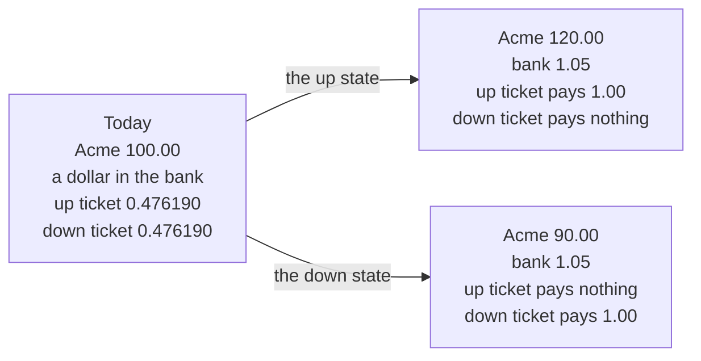
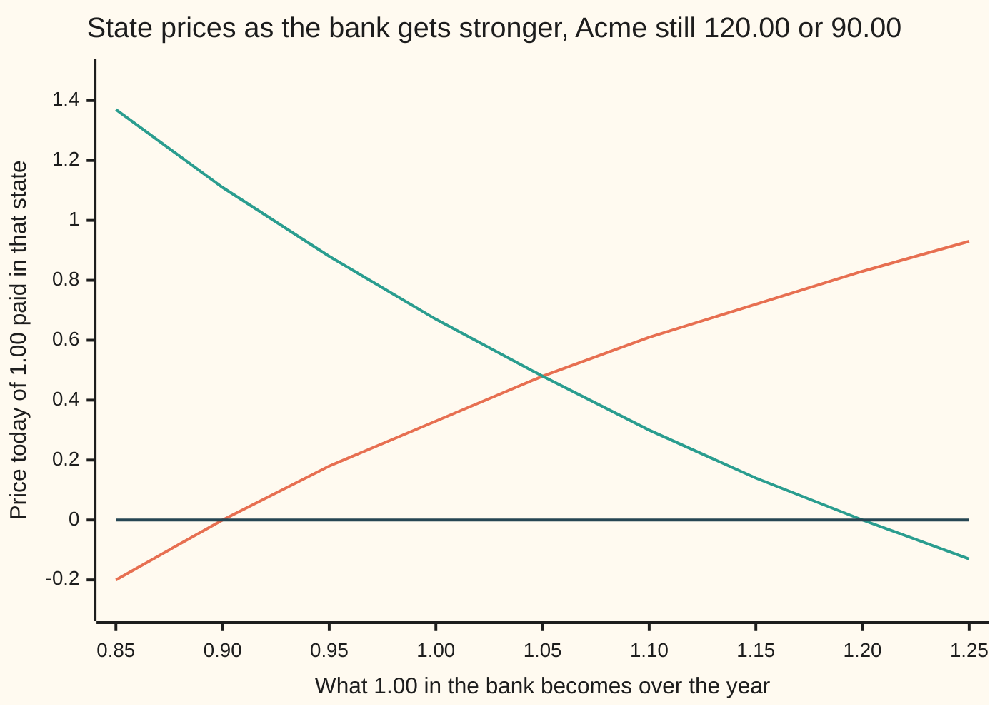

# State prices: the price of one unit in each future state, and the fake probabilities they become

Financial mathematics → Contracts and No-Arbitrage → Pricing state by state → State prices

---

## General Overview

Acme trades at $100.00 today. The market on this card is deliberately tiny: a year from now Acme is worth either $120.00 or $90.00, and nothing else can happen. Next to it sits a bank account, where a dollar left for the year comes back as $1.05 — 5 percent, added once at the end.

Now a strange little contract. It pays exactly $1.00 if Acme ends the year at $120.00, and nothing at all if Acme ends at $90.00: a ticket on one ending, worthless on the other. Nobody quotes it, so what is it worth today?

The market has already answered: $0.476190. The matching ticket on the other ending, paying $1.00 if Acme finishes at $90.00, costs exactly the same, $0.476190 — even though one ending is a $20.00 rise and the other a $10.00 fall.

A contract that pays one unit of money in a single future state and nothing in the others is an **elementary claim**; what it costs today is the **state price** of that state, the term from here on.

Those two numbers run everything, because every contract here is a pile of the two tickets. A call paying whatever Acme is worth above $100.00 pays $20.00 up and nothing down, so it is twenty up tickets: twenty lots of $0.476190, which is $9.52.

The two state prices add to 0.952381, which is what a dollar due in a year is worth today whatever happens — the discount factor. Divide each by that total and the pair becomes 0.500000 and 0.500000: two positive numbers adding to one. Numbers like that can be used exactly as probabilities are — weight each payment and add up — and when they come from state prices they are called **risk-neutral probabilities**. They forecast nothing. A sober forecast for this Acme might put the real chance of the up state at 0.70, and 0.70 never touches a price.

**Two traded prices fix what a dollar delivered in each future state costs today; every payoff is then priced by weighting its payments with those state prices, and rescaling the state prices to add to one turns that price into a discounted average that predicts nothing.**

**What kind of fact this is:** a theorem, proved on this card in Why it works. The state price itself is a definition, and the two-state market is a model small enough to solve by hand.

### The picture: two endings, and what each thing pays in each



---

## The formula

Notation first, in words. The two endings are called **states**: "up" is Acme at $120.00, "down" is Acme at $90.00, and a subscript u or d means "in that state", so $S_0$ is Acme's price today and $S_u$ and $S_d$ are its two endings. The Greek letter psi, written $\psi_u$ and $\psi_d$, is the standard letter for a state price; $D$ is today's price of a dollar due in a year whatever happens.

The two traded things give two equations. The bank account, read as a contract, pays $1.00 in both states; Acme pays $S_u$ or $S_d$:

$$\psi_u + \psi_d = D, \qquad \psi_u S_u + \psi_d S_d = S_0$$

**Read it aloud:** one dollar in both states costs what a sure dollar costs; and the two state prices, weighted by what Acme pays in each state, must add back to what Acme costs today.

Two equations, two unknowns. They are independent exactly when Acme pays different amounts in the two states, $S_u \neq S_d$; then one solution exists and no other:

$$\psi_u = \frac{S_0 - D\,S_d}{S_u - S_d}, \qquad \psi_d = \frac{D\,S_u - S_0}{S_u - S_d}$$

A contract paying $H_u$ in the up state and $H_d$ in the down state is $H_u$ up tickets plus $H_d$ down tickets, so its price today is

$$V_0 = \psi_u H_u + \psi_d H_d$$

**Read it aloud:** the price of a contract is each payment multiplied by what a dollar in that state costs, added up.

Divide the state prices by their own total, $D$, and they become weights adding to one:

$$q_u = \frac{\psi_u}{D}, \qquad q_d = \frac{\psi_d}{D}, \qquad V_0 = D\,\bigl(q_u H_u + q_d H_d\bigr)$$

**Read it aloud:** scale the state prices so they add to one, and the price is the average payment, discounted back to today.

That last line is the sentence quoted everywhere in finance: a price is a discounted expected payoff, where "expected" means averaged with $q_u$ and $q_d$, not with anything a forecaster would recognise ([expectation](../../09-Probability%20and%20statistics/02-Random%20Variables/02-expectation.md)).

| Symbol | Plain meaning | In our example | Push it up and the answer… |
| --- | --- | --- | --- |
| $S_0$ | Acme's price today | 100.00 | the up ticket dearer, the down ticket cheaper |
| $S_u$, $S_d$ | what Acme is worth in each state | 120.00 and 90.00 | a wider gap makes both tickets cheaper |
| $R$ | what $1.00 in the bank becomes over the year | 1.05 | the up ticket dearer, the down ticket cheaper |
| $D$ | the discount factor, $1/R$: today's price of a sure dollar | 0.952381 | — |
| $\psi_u$, $\psi_d$ | the state prices: today's price of $1.00 paid in that state alone | 0.476190 each | contracts paying in that state cost more |
| $H_u$, $H_d$ | what a contract pays in each state | 20.00 and 0.00 for the call | worth more, by that state's price per dollar |
| $V_0$ | what the contract costs today | 9.523810 for the call | — |
| $q_u$, $q_d$ | risk-neutral probabilities: the state prices scaled to add to one | 0.500000 each | the average tilts to that state's payment |
| $p$ | the real-world chance of the up state | 0.70 | nothing moves |

**Conventions verified 14 Sep 2026:** this card's bank adds its 5 percent once, at year end, so $R = 1.05$ and $D = 20/21$ exactly; the rest of this wing compounds continuously, where 5 percent gives 1.051271. Neither choice changes an argument below.

### When it holds

- **Two states, and two traded assets that pay different amounts in them.** If Acme paid the same in both states it would be a second bank account, the two equations would collapse into one, and no ticket would have a price.
- **A bank factor strictly inside the two returns:** $S_d < R\,S_0 < S_u$, here 90.00 < 105.00 < 120.00. Outside it a state price is zero or negative, which is free money rather than a market: the check sets the bank to 1.25 and prints −0.133333.
- **One period, settling at the end of it.** Nothing trades in between, Acme pays no dividend first, there are no fees, borrowing and lending cost the same, and positions may be long or short in any size. A dividend before settlement joins Acme's equation, and both state prices shift.
- **As many traded assets as states.** Three endings priced by two assets leaves an unknown too many: the equations allow a range of state prices, so a contract has a band of prices rather than one, until a third is quoted.

---

## Why it works

### Step 0: every contract in this market is a pile of two tickets

A contract paying $H_u$ up and $H_d$ down is $H_u$ up tickets and $H_d$ down tickets, with nothing left over: the call is twenty up tickets, a put struck at 100.00 is ten down tickets, Acme itself is 120.00 up tickets plus 90.00 down tickets, and a sure dollar is one of each.

Price the two tickets and the market is priced. The step is legal because two contracts paying the same in every state cost the same today ([no-arbitrage-and-the-law-of-one-price](02-no-arbitrage-and-the-law-of-one-price.md)).

### Step 1: the two prices already quoted fix the two ticket prices

Acme and the bank are the two contracts the market does quote; read as piles of tickets, their prices are the two equations above. Multiply the first by $S_d$ and subtract it from the second, and the down ticket vanishes:

$$\psi_u\,(S_u - S_d) = S_0 - D\,S_d$$

Here the bank turns 20 into 21, so a sure dollar costs 20/21 exactly and working over 21 keeps every number whole: the numerator is 100.00 × 21 − 90.00 × 20 = 300, the gap between Acme's endings is 30.00, so 21 up tickets cost 300 ÷ 30.00 = 10 and one costs 10/21, which is 0.476190. The same subtraction the other way gives the down ticket, also 10/21.

### Step 2: no free money means both prices are positive

A ticket never pays less than nothing and sometimes pays 1.00. If its price were zero or below, buying it would be free or would pay the buyer, and could only return money: free money, which no market allows for long.

The reverse holds too, and matters more. If both state prices are positive then every price is a positive mix of payments, so a contract that never pays less than zero cannot cost less than zero: no free money anywhere in the market. That two-way link — **no arbitrage exactly when every state price is positive** — is the theorem this card exists for, and in the literature it is the first fundamental theorem of asset pricing ([risk-neutral-measure-and-the-fundamental-theorems](../05-Black-Scholes%20from%20the%20Ground%20Up/02-risk-neutral-measure-and-the-fundamental-theorems.md)).

<details>
<summary>Detailed proof: positive state prices and free money are exact opposites</summary>

Free money means a contract costing nothing or less today that never pays out less than nothing and pays something in at least one state. A contract paying $(H_u, H_d)$ costs $V_0 = \psi_u H_u + \psi_d H_d$.

**Positive prices rule it out.** Suppose both state prices are above zero, and take any contract with $H_u \ge 0$, $H_d \ge 0$ and at least one of them above zero. Every term of $\psi_u H_u + \psi_d H_d$ is at least zero and one is strictly above it, so $V_0 > 0$: the contract costs real money today, and free money is impossible.

**Free money rules them out.** Suppose instead $\psi_u \le 0$. The up ticket is a real portfolio — the mix of Acme and cash that pays 1.00 in the up state and nothing in the down state — so anyone may hold it at that price. It pays its holder today or costs nothing, and it never returns less than nothing: free money. The same argument runs for $\psi_d \le 0$ with the other ticket, so no free money forces both prices strictly above zero.

Neither half assumed anything about how likely a state is; both used only the two quoted prices.

</details>

That fixes a band for the bank. Below a factor of 0.90 the up ticket goes negative: Acme beats cash in both states, so borrowing to buy Acme is free money. Above 1.20 the down ticket goes negative: at 1.25, selling one share and lending 100.00 leaves 5.00 in the up state and 35.00 in the down state, never less.



The climbing line is the up state's price, the falling line the down state's, the flat line zero. Both stay above zero only between 0.90 and 1.20, crossing at this card's 1.05.

### Step 3: rescale, and the state prices turn into probabilities

The state prices add to $D$, since a dollar in both states is a sure dollar. Divide each by $D$: the two numbers keep their ratio, stay positive, and now add to one, 0.500000 and 0.500000. That is all averaging asks for, so the price reads as an average of the two payments taken with those weights, discounted once by $D$. Nothing new has been claimed; it is the same arithmetic, cut differently.

Dividing by $D$ also clears it out of the formula: $q_u = (R\,S_0 - S_d)/(S_u - S_d)$, how far the banked $R\,S_0$ sits between the two endings. Here 105.00 sits halfway between 90.00 and 120.00, so $q_u$ is 0.500000. That is the code's third road, and it needs no state price.

### Step 4: under those weights Acme earns the bank rate

Acme's payments average, under the new weights, to 0.500000 × 120.00 + 0.500000 × 90.00 = 105.000000 — which is 100.00 grown at the bank's 1.05. Discounted, that average is 100.00 again — a price that drifts neither way is called a **martingale**. That is the second equation rearranged, and every traded price has the same property by construction.

A world where every asset is expected to earn the bank rate is one where nobody charges for taking risk: a **risk-neutral** world, which is where the name comes from. The real Acme is not expected to earn 5.00 percent: under a 0.70 chance of the up state it averages 111.000000 in a year, an 11.00 percent return. No forecast entered any equation above, which is why a bull and a bear quote the same price.

The other route to the same number is [replication-and-self-financing](06-replication-and-self-financing.md): copy the contract with shares and cash, and the copy's cost is the price. The two roads must agree, since each ticket is itself a copy: 0.033333 shares and −2.857143 of cash pay 1.00 in the up state and nothing in the down state, at a cost of 0.476190. The call is twenty of those.

---

## Worked numbers, by hand

The bank turns 1.00 into 1.05, which is 20 into 21.

| Step | Arithmetic | Value |
| --- | --- | --- |
| a sure dollar | 1 ÷ 1.05, which is 20/21 | 0.952381 |
| the up ticket | (100.00 × 21 − 90.00 × 20) ÷ (21 × 30.00) | **10/21 = 0.476190** |
| the down ticket | (120.00 × 20 − 100.00 × 21) ÷ (21 × 30.00) | **10/21 = 0.476190** |
| the two together | 10/21 + 10/21 | 20/21 = 0.952381 |
| check against Acme | 120.00 × 10/21 + 90.00 × 10/21 | 100.000000 |
| the call, twenty up tickets | 20.00 × 10/21 | **200/21 = 9.523810** |
| the put, ten down tickets | 10.00 × 10/21 | **100/21 = 4.761905** |
| the risk-neutral weights | (10/21) ÷ (20/21), twice | 0.500000 and 0.500000 |
| the call as a discounted average | 0.952381 × (0.500000 × 20.00) | **9.523810** |
| Acme under those weights | 0.500000 × 120.00 + 0.500000 × 90.00 | 105.000000 |

The call is worth $9.52 today, the put $4.76, and nobody had to decide whether Acme is going up. The difference, 4.761905, is Acme's price minus 100 sure dollars — the parity relation the code checks.

### What breaks if you drop a piece

| Mistake | Comes out at | What went wrong |
| --- | --- | --- |
| The real chance of the up state, 0.70, used as the weight, discounted at the bank's 5 percent | 13.333333 | Real odds with a riskless rate: it prices the hope, not the copy |
| The same real odds, discounted at Acme's own expected 11.00 percent | 12.612613 | Nearer, still wrong: the call is riskier than Acme, so it needs a steeper rate |
| The right weights, 0.500000 each, but the discount forgotten | 10.000000 | The average is a payment a year away, and has to be carried back to today |
| A bank factor of 1.25, outside the band | down state price −0.133333 | No market: lending beats Acme in both states, and the rule stops meaning anything |

Only one discount rate makes the real-odds sum land on 9.523810, and the code prints it: 47.000000 percent. That figure says nothing about Acme; it is what the wrong method must be told to get the right answer.

```
the call, priced four ways, in dollars

  state prices, the right answer   ███████████████████████  $9.52
  right weights, no discounting    ████████████████████████  $10.00
  real odds at Acme's 11 percent   ██████████████████████████████  $12.61
  real odds at the bank's 5        ████████████████████████████████  $13.33
```

---

## Code, from first principles, and it actually runs

Nothing is imported. The prices are reached by four roads that meet only at the answer: a two-by-two solve of the market's own equations; a copy of each payoff built from shares and cash, priced at what the copy costs; the risk-neutral weights, read off from where the banked 105.00 sits between the two endings; and whole numbers over 21, which cannot round. A coin the script builds itself is then flipped 200,000 times at those weights, and again at the real 0.70. The last block sweeps the bank factor across the band, checking that positive state prices and no free money hold and fail together.

### Python

```python
# State prices and risk-neutral pricing in one period -- the check behind the
# card.  Nothing is imported.  Acme is 100.00 today; in a year it is 120.00 or
# 90.00, and a dollar in the bank becomes 1.05.  Every price below is reached
# by roads that meet only at the answer: the two tickets, a share-and-cash copy,
# the fake coin, whole numbers over 21, and 200,000 flips of a built coin.
S0, SU, SD, R, P_UP = 100.0, 120.0, 90.0, 1.05, 0.7
D = 1.0 / R                                        # today's price of a sure dollar
FLIPS, SEED, TWO32 = 200000, 20260914, 4294967296.0

def solve2(a11, a12, a21, a22, b1, b2):            # 2x2 solve, Cramer's rule
    det = a11 * a22 - a12 * a21
    return ((b1 * a22 - a12 * b2) / det, (a11 * b2 - b1 * a21) / det)

psi_u, psi_d = solve2(SU, SD, 1.0, 1.0, S0, D)     # road 1: solve the market's two equations

def by_tickets(hu, hd):                            # road 1, applied to any payoff
    return psi_u * hu + psi_d * hd

def by_copy(hu, hd):                               # road 2: copy the payoff with shares and cash
    delta, cash = solve2(SU, R, SD, R, hu, hd)     # delta*SU + cash*R = hu, and the same down
    return delta, cash, delta * S0 + cash

q_u = (R * S0 - SD) / (SU - SD)                    # road 3: the fake coin
q_d = 1.0 - q_u

def by_coin(hu, hd):
    return D * (q_u * hu + q_d * hd)

# road 4: whole numbers only.  The bank turns 20 into 21, so a sure dollar
# costs 20/21 and both ticket prices can be written over that same 21.
SU_I, SD_I, S0_I, NUM, DEN = 120, 90, 100, 20, 21
det_i = SU_I - SD_I
a_num, b_num = S0_I * DEN - SD_I * NUM, SU_I * NUM - S0_I * DEN
a_i, b_i = a_num // det_i, b_num // det_i          # 21 x each ticket price
call_i, put_i = a_i * 20, b_i * 10                 # 21 x each contract price

def coin_flips(threshold):                         # road 5: a coin built from scratch
    x, ups = SEED, 0
    for _ in range(FLIPS):
        x = (6364136223846793005 * x + 1442695040888963407) & 0xFFFFFFFFFFFFFFFF
        if (x >> 32) < threshold:
            ups += 1
    return ups

def yn(claim):
    return "yes" if claim else "no"

def row(label, value):
    print(f"  {label:<40}{value:>11.6f}")

CONTRACTS = (("call K=100", 20.0, 0.0), ("put K=100", 0.0, 10.0),
             ("forward K=105", 15.0, -15.0), ("one share", 120.0, 90.0),
             ("sure dollar", 1.0, 1.0))
call_p, put_p = by_copy(20.0, 0.0)[2], by_copy(0.0, 10.0)[2]
du, cu, ku = by_copy(1.0, 0.0)
dd, cd, kd = by_copy(0.0, 1.0)
eq_s1, ep_s1 = q_u * SU + q_d * SD, P_UP * SU + (1.0 - P_UP) * SD
ups_q, ups_p = coin_flips(int(q_u * TWO32)), coin_flips(int(P_UP * TWO32))
mc_q, mc_p = D * (ups_q / FLIPS) * 20.0, D * (ups_p / FLIPS) * 20.0
naive_bank = D * (P_UP * 20.0 + (1.0 - P_UP) * 0.0)          # real odds, bank rate
naive_share = (P_UP * 20.0) / (ep_s1 / S0)                   # real odds, Acme's own return
no_discount = q_u * 20.0 + q_d * 0.0                         # fake coin, forgot to discount
needed_rate = ((P_UP * 20.0) / call_p - 1.0) * 100.0         # the only real-odds rate that works
R_HIGH = 1.25                                                # a bank that beats Acme everywhere
psi_hi_u = (R_HIGH * S0 - SD) / ((SU - SD) * R_HIGH)
psi_hi_d = (SU - R_HIGH * S0) / ((SU - SD) * R_HIGH)
free_up, free_dn = S0 * R_HIGH - SU, S0 * R_HIGH - SD
grid = [(85 + 5 * i) / 100.0 for i in range(9)]
band = [((g * S0 - SD) / ((SU - SD) * g), (SU - g * S0) / ((SU - SD) * g)) for g in grid]

print(f"market: Acme {S0:.2f} today, {SU:.2f} up or {SD:.2f} down; bank 1.00 -> {R:.2f}")
print("the two tickets, from the two prices the market already quotes")
row(f"up ticket, pays 1.00 if Acme is {SU:.2f}", psi_u)
row(f"down ticket, pays 1.00 if Acme is {SD:.2f}", psi_d)
row("the two together, a sure dollar", psi_u + psi_d)
row("a sure dollar the other way, 1 / 1.05", D)
print(f"  in whole numbers: up {a_i}/{DEN}, down {b_i}/{DEN}, sure dollar {NUM}/{DEN}")
print("the same two tickets, copied with shares and cash")
print(f"  up ticket   {du:>10.6f} shares and {cu:>10.6f} cash, cost {ku:>10.6f}")
print(f"  down ticket {dd:>10.6f} shares and {cd:>10.6f} cash, cost {kd:>10.6f}")
print(f"the fake coin: each ticket price divided by {D:.6f}")
print(f"  weight on up {q_u:.6f}, weight on down {q_d:.6f}, sum {q_u + q_d:.6f}")
row("fake average of Acme in a year", eq_s1)
row(f"the bank turning {S0:.2f} into", S0 * R)
row(f"real average of Acme, up chance {P_UP:.2f}", ep_s1)
print(f"  that is a real return of {(ep_s1 / S0 - 1.0) * 100.0:.2f} percent, "
      f"against the bank's 5.00")
print()
print(f"{'contract':<16}{'pays up':>10}{'pays down':>11}{'tickets':>12}{'copy':>12}{'fake coin':>12}")
for name, hu, hd in CONTRACTS:
    print(f"{name:<16}{hu:>10.2f}{hd:>11.2f}{by_tickets(hu, hd):>12.6f}"
          f"{by_copy(hu, hd)[2]:>12.6f}{by_coin(hu, hd):>12.6f}")
print(f"call minus put {call_p - put_p:.6f}, and Acme minus 100 sure dollars "
      f"{S0 - 100.0 * D:.6f}")
print(f"in whole numbers: call {call_i}/{DEN}, put {put_i}/{DEN}, difference {call_i - put_i}/{DEN}")
print()
print(f"the coin flipped {FLIPS} times by the script's own generator, seed {SEED}")
print(f"  fake coin, weight {q_u:.2f}: up {ups_q} times, share {ups_q / FLIPS:.6f}, "
      f"call {mc_q:>9.6f} against {call_p:.6f}")
print(f"  real coin, chance {P_UP:.2f}: up {ups_p} times, share {ups_p / FLIPS:.6f}, "
      f"call {mc_p:>9.6f} against {call_p:.6f}")
print()
print(f"what breaks, against the call's {call_p:.6f}")
print(f"  real odds, discounted at the bank's 5 percent   {naive_bank:>10.6f}")
print(f"  real odds, discounted at Acme's 11 percent      {naive_share:>10.6f}")
print(f"  the fake coin with no discounting               {no_discount:>10.6f}")
print(f"  the only rate that makes real odds work         {needed_rate:>10.6f} percent")
print(f"  bank at 25 percent: up ticket {psi_hi_u:.6f}, down ticket {psi_hi_d:.6f}")
print(f"    free money there: sell one share, lend {S0:.2f}; up {free_up:.2f}, down {free_dn:.2f}")
print()
print("chart, bank factor  " + "".join(f"{g:>7.2f}" for g in grid))
print("chart, up ticket    " + "".join(f"{p[0]:>7.2f}" for p in band))
print("chart, down ticket  " + "".join(f"{p[1]:>7.2f}" for p in band))
print("chart, both positive" + "".join(f"{yn(p[0] > 0.0 and p[1] > 0.0):>7}" for p in band))
print(f"bars, the call four ways: {call_p:.2f}, {no_discount:.2f}, "
      f"{naive_share:.2f}, {naive_bank:.2f}")

assert abs(NUM / DEN - D) < 1e-15, "the whole-number road's sure dollar against 1 / R"
assert abs(psi_u - a_i / DEN) < 1e-12, "float solve against the whole-number solve, up ticket"
assert abs(psi_d - b_i / DEN) < 1e-12, "float solve against the whole-number solve, down ticket"
assert abs(by_tickets(20.0, 0.0) - call_p) < 1e-12, "tickets against the share-and-cash copy"
assert abs(by_coin(20.0, 0.0) - call_p) < 1e-12, "fake coin against the share-and-cash copy"
assert abs(mc_q - call_p) < 0.05, "200,000 flips of the fake coin land on the price"
assert abs((call_p - put_p) - (S0 - 100.0 * D)) < 1e-12, "call minus put against Acme minus cash"
assert abs(eq_s1 - S0 * R) < 1e-12, "under the fake coin Acme earns the bank rate"
assert abs(naive_bank - 40.0 / 3.0) < 1e-12, "the real-odds answer, by an independent fraction"
for g, (pu, pd) in zip(grid, band):
    assert (pu > 0.0 and pd > 0.0) == (SD / S0 < g < SU / S0), "positive tickets = no free money"
print("ALL CHECKS PASS")
```

**Ran 2026-09-14 on macOS, Python 3.14.6, standard library only. All checks passed. Output, pasted from the run:**

```
market: Acme 100.00 today, 120.00 up or 90.00 down; bank 1.00 -> 1.05
the two tickets, from the two prices the market already quotes
  up ticket, pays 1.00 if Acme is 120.00     0.476190
  down ticket, pays 1.00 if Acme is 90.00    0.476190
  the two together, a sure dollar            0.952381
  a sure dollar the other way, 1 / 1.05      0.952381
  in whole numbers: up 10/21, down 10/21, sure dollar 20/21
the same two tickets, copied with shares and cash
  up ticket     0.033333 shares and  -2.857143 cash, cost   0.476190
  down ticket  -0.033333 shares and   3.809524 cash, cost   0.476190
the fake coin: each ticket price divided by 0.952381
  weight on up 0.500000, weight on down 0.500000, sum 1.000000
  fake average of Acme in a year           105.000000
  the bank turning 100.00 into             105.000000
  real average of Acme, up chance 0.70     111.000000
  that is a real return of 11.00 percent, against the bank's 5.00

contract           pays up  pays down     tickets        copy   fake coin
call K=100           20.00       0.00    9.523810    9.523810    9.523810
put K=100             0.00      10.00    4.761905    4.761905    4.761905
forward K=105        15.00     -15.00    0.000000    0.000000    0.000000
one share           120.00      90.00  100.000000  100.000000  100.000000
sure dollar           1.00       1.00    0.952381    0.952381    0.952381
call minus put 4.761905, and Acme minus 100 sure dollars 4.761905
in whole numbers: call 200/21, put 100/21, difference 100/21

the coin flipped 200000 times by the script's own generator, seed 20260914
  fake coin, weight 0.50: up 99679 times, share 0.498395, call  9.493238 against 9.523810
  real coin, chance 0.70: up 139894 times, share 0.699470, call 13.323238 against 9.523810

what breaks, against the call's 9.523810
  real odds, discounted at the bank's 5 percent    13.333333
  real odds, discounted at Acme's 11 percent       12.612613
  the fake coin with no discounting                10.000000
  the only rate that makes real odds work          47.000000 percent
  bank at 25 percent: up ticket 0.933333, down ticket -0.133333
    free money there: sell one share, lend 100.00; up 5.00, down 35.00

chart, bank factor     0.85   0.90   0.95   1.00   1.05   1.10   1.15   1.20   1.25
chart, up ticket      -0.20   0.00   0.18   0.33   0.48   0.61   0.72   0.83   0.93
chart, down ticket     1.37   1.11   0.88   0.67   0.48   0.30   0.14   0.00  -0.13
chart, both positive     no     no    yes    yes    yes    yes    yes     no     no
bars, the call four ways: 9.52, 10.00, 12.61, 13.33
ALL CHECKS PASS
```

Four roads, one set of prices, agreeing to every digit printed. The flips land at 9.493238 against the formula's 9.523810, three cents of sampling noise that shrinks as the count rises.

### Rust

Same numbers, same labels, built with `rustc --edition 2021 -O`.

```rust
// State prices and risk-neutral pricing in one period -- the same check as the
// Python, in Rust.  No crates.  Acme is 100.00 today; in a year it is 120.00 or
// 90.00, and a dollar in the bank becomes 1.05.  Every price below is reached
// by roads that meet only at the answer: the two tickets, a share-and-cash copy,
// the fake coin, whole numbers over 21, and 200,000 flips of a built coin.
const S0: f64 = 100.0;
const SU: f64 = 120.0;
const SD: f64 = 90.0;
const R: f64 = 1.05;
const P_UP: f64 = 0.7;
const D: f64 = 1.0 / R;                            // today's price of a sure dollar
const FLIPS: u64 = 200000;
const SEED: u64 = 20260914;
const TWO32: f64 = 4294967296.0;

fn solve2(a11: f64, a12: f64, a21: f64, a22: f64, b1: f64, b2: f64) -> (f64, f64) {
    let det = a11 * a22 - a12 * a21;               // 2x2 solve, Cramer's rule
    ((b1 * a22 - a12 * b2) / det, (a11 * b2 - b1 * a21) / det)
}

fn tickets() -> (f64, f64) { solve2(SU, SD, 1.0, 1.0, S0, D) }   // road 1

fn by_tickets(hu: f64, hd: f64) -> f64 {           // road 1, applied to any payoff
    let (pu, pd) = tickets();
    pu * hu + pd * hd
}

fn by_copy(hu: f64, hd: f64) -> (f64, f64, f64) {  // road 2: shares and cash
    let (delta, cash) = solve2(SU, R, SD, R, hu, hd);
    (delta, cash, delta * S0 + cash)
}

fn q_up() -> f64 { (R * S0 - SD) / (SU - SD) }     // road 3: the fake coin

fn by_coin(hu: f64, hd: f64) -> f64 { D * (q_up() * hu + (1.0 - q_up()) * hd) }

fn coin_flips(threshold: u64) -> u64 {             // road 5: a coin built from scratch
    let (mut x, mut ups) = (SEED, 0u64);
    for _ in 0..FLIPS {
        x = x.wrapping_mul(6364136223846793005).wrapping_add(1442695040888963407);
        if (x >> 32) < threshold { ups += 1 }
    }
    ups
}

fn yn(claim: bool) -> &'static str { if claim { "yes" } else { "no" } }

fn row(label: &str, value: f64) { println!("  {:<40}{:>11.6}", label, value) }

fn main() {
    let (psi_u, psi_d) = tickets();
    let (q_u, q_d) = (q_up(), 1.0 - q_up());
    // road 4: whole numbers only.  The bank turns 20 into 21, so a sure dollar
    // costs 20/21 and both ticket prices can be written over that same 21.
    let (su_i, sd_i, s0_i, num, den): (i64, i64, i64, i64, i64) = (120, 90, 100, 20, 21);
    let det_i = su_i - sd_i;
    let (a_num, b_num) = (s0_i * den - sd_i * num, su_i * num - s0_i * den);
    let (a_i, b_i) = (a_num / det_i, b_num / det_i);         // 21 x each ticket price
    let (call_i, put_i) = (a_i * 20, b_i * 10);              // 21 x each contract price

    let contracts: [(&str, f64, f64); 5] = [("call K=100", 20.0, 0.0), ("put K=100", 0.0, 10.0),
        ("forward K=105", 15.0, -15.0), ("one share", 120.0, 90.0), ("sure dollar", 1.0, 1.0)];
    let (call_p, put_p) = (by_copy(20.0, 0.0).2, by_copy(0.0, 10.0).2);
    let (du, cu, ku) = by_copy(1.0, 0.0);
    let (dd, cd, kd) = by_copy(0.0, 1.0);
    let eq_s1 = q_u * SU + q_d * SD;
    let ep_s1 = P_UP * SU + (1.0 - P_UP) * SD;
    let (ups_q, ups_p) = (coin_flips((q_u * TWO32) as u64), coin_flips((P_UP * TWO32) as u64));
    let mc_q = D * (ups_q as f64 / FLIPS as f64) * 20.0;
    let mc_p = D * (ups_p as f64 / FLIPS as f64) * 20.0;
    let naive_bank = D * (P_UP * 20.0 + (1.0 - P_UP) * 0.0);      // real odds, bank rate
    let naive_share = (P_UP * 20.0) / (ep_s1 / S0);               // real odds, Acme's own return
    let no_discount = q_u * 20.0 + q_d * 0.0;                     // fake coin, forgot to discount
    let needed_rate = ((P_UP * 20.0) / call_p - 1.0) * 100.0;     // the only real-odds rate that works
    let r_high = 1.25;                                            // a bank that beats Acme everywhere
    let psi_hi_u = (r_high * S0 - SD) / ((SU - SD) * r_high);
    let psi_hi_d = (SU - r_high * S0) / ((SU - SD) * r_high);
    let (free_up, free_dn) = (S0 * r_high - SU, S0 * r_high - SD);
    let grid: Vec<f64> = (0..9).map(|i| (85 + 5 * i) as f64 / 100.0).collect();
    let band: Vec<(f64, f64)> = grid.iter()
        .map(|&g| ((g * S0 - SD) / ((SU - SD) * g), (SU - g * S0) / ((SU - SD) * g))).collect();

    println!("market: Acme {:.2} today, {:.2} up or {:.2} down; bank 1.00 -> {:.2}", S0, SU, SD, R);
    println!("the two tickets, from the two prices the market already quotes");
    row(&format!("up ticket, pays 1.00 if Acme is {:.2}", SU), psi_u);
    row(&format!("down ticket, pays 1.00 if Acme is {:.2}", SD), psi_d);
    row("the two together, a sure dollar", psi_u + psi_d);
    row("a sure dollar the other way, 1 / 1.05", D);
    println!("  in whole numbers: up {}/{}, down {}/{}, sure dollar {}/{}", a_i, den, b_i, den, num, den);
    println!("the same two tickets, copied with shares and cash");
    println!("  up ticket   {:>10.6} shares and {:>10.6} cash, cost {:>10.6}", du, cu, ku);
    println!("  down ticket {:>10.6} shares and {:>10.6} cash, cost {:>10.6}", dd, cd, kd);
    println!("the fake coin: each ticket price divided by {:.6}", D);
    println!("  weight on up {:.6}, weight on down {:.6}, sum {:.6}", q_u, q_d, q_u + q_d);
    row("fake average of Acme in a year", eq_s1);
    row(&format!("the bank turning {:.2} into", S0), S0 * R);
    row(&format!("real average of Acme, up chance {:.2}", P_UP), ep_s1);
    println!("  that is a real return of {:.2} percent, against the bank's 5.00",
             (ep_s1 / S0 - 1.0) * 100.0);
    println!();
    println!("{:<16}{:>10}{:>11}{:>12}{:>12}{:>12}", "contract", "pays up", "pays down",
             "tickets", "copy", "fake coin");
    for (name, hu, hd) in contracts.iter() {
        println!("{:<16}{:>10.2}{:>11.2}{:>12.6}{:>12.6}{:>12.6}", name, hu, hd,
                 by_tickets(*hu, *hd), by_copy(*hu, *hd).2, by_coin(*hu, *hd));
    }
    println!("call minus put {:.6}, and Acme minus 100 sure dollars {:.6}",
             call_p - put_p, S0 - 100.0 * D);
    println!("in whole numbers: call {}/{}, put {}/{}, difference {}/{}",
             call_i, den, put_i, den, call_i - put_i, den);
    println!();
    println!("the coin flipped {} times by the script's own generator, seed {}", FLIPS, SEED);
    println!("  fake coin, weight {:.2}: up {} times, share {:.6}, call {:>9.6} against {:.6}",
             q_u, ups_q, ups_q as f64 / FLIPS as f64, mc_q, call_p);
    println!("  real coin, chance {:.2}: up {} times, share {:.6}, call {:>9.6} against {:.6}",
             P_UP, ups_p, ups_p as f64 / FLIPS as f64, mc_p, call_p);
    println!();
    println!("what breaks, against the call's {:.6}", call_p);
    println!("  real odds, discounted at the bank's 5 percent   {:>10.6}", naive_bank);
    println!("  real odds, discounted at Acme's 11 percent      {:>10.6}", naive_share);
    println!("  the fake coin with no discounting               {:>10.6}", no_discount);
    println!("  the only rate that makes real odds work         {:>10.6} percent", needed_rate);
    println!("  bank at 25 percent: up ticket {:.6}, down ticket {:.6}", psi_hi_u, psi_hi_d);
    println!("    free money there: sell one share, lend {:.2}; up {:.2}, down {:.2}",
             S0, free_up, free_dn);
    println!();
    let mut l1 = String::from("chart, bank factor  ");
    let mut l2 = String::from("chart, up ticket    ");
    let mut l3 = String::from("chart, down ticket  ");
    let mut l4 = String::from("chart, both positive");
    for (g, p) in grid.iter().zip(band.iter()) {
        l1.push_str(&format!("{:>7.2}", g));
        l2.push_str(&format!("{:>7.2}", p.0));
        l3.push_str(&format!("{:>7.2}", p.1));
        l4.push_str(&format!("{:>7}", yn(p.0 > 0.0 && p.1 > 0.0)));
    }
    for l in [l1, l2, l3, l4] { println!("{}", l) }
    println!("bars, the call four ways: {:.2}, {:.2}, {:.2}, {:.2}",
             call_p, no_discount, naive_share, naive_bank);

    assert!((num as f64 / den as f64 - D).abs() < 1e-15, "the whole-number road's sure dollar against 1 / R");
    assert!((psi_u - a_i as f64 / den as f64).abs() < 1e-12, "float solve against whole numbers, up");
    assert!((psi_d - b_i as f64 / den as f64).abs() < 1e-12, "float solve against whole numbers, down");
    assert!((by_tickets(20.0, 0.0) - call_p).abs() < 1e-12, "tickets against the share-and-cash copy");
    assert!((by_coin(20.0, 0.0) - call_p).abs() < 1e-12, "fake coin against the share-and-cash copy");
    assert!((mc_q - call_p).abs() < 0.05, "200,000 flips of the fake coin land on the price");
    assert!(((call_p - put_p) - (S0 - 100.0 * D)).abs() < 1e-12, "call minus put against Acme minus cash");
    assert!((eq_s1 - S0 * R).abs() < 1e-12, "under the fake coin Acme earns the bank rate");
    assert!((naive_bank - 40.0 / 3.0).abs() < 1e-12, "the real-odds answer, by an independent fraction");
    for (g, p) in grid.iter().zip(band.iter()) {
        assert!((p.0 > 0.0 && p.1 > 0.0) == (SD / S0 < *g && *g < SU / S0),
                "positive tickets = no free money");
    }
    println!("ALL CHECKS PASS");
}
```

**Ran 2026-09-14 on macOS, rustc 1.98.1, no crates. All checks passed. Output, pasted from the run:**

```
market: Acme 100.00 today, 120.00 up or 90.00 down; bank 1.00 -> 1.05
the two tickets, from the two prices the market already quotes
  up ticket, pays 1.00 if Acme is 120.00     0.476190
  down ticket, pays 1.00 if Acme is 90.00    0.476190
  the two together, a sure dollar            0.952381
  a sure dollar the other way, 1 / 1.05      0.952381
  in whole numbers: up 10/21, down 10/21, sure dollar 20/21
the same two tickets, copied with shares and cash
  up ticket     0.033333 shares and  -2.857143 cash, cost   0.476190
  down ticket  -0.033333 shares and   3.809524 cash, cost   0.476190
the fake coin: each ticket price divided by 0.952381
  weight on up 0.500000, weight on down 0.500000, sum 1.000000
  fake average of Acme in a year           105.000000
  the bank turning 100.00 into             105.000000
  real average of Acme, up chance 0.70     111.000000
  that is a real return of 11.00 percent, against the bank's 5.00

contract           pays up  pays down     tickets        copy   fake coin
call K=100           20.00       0.00    9.523810    9.523810    9.523810
put K=100             0.00      10.00    4.761905    4.761905    4.761905
forward K=105        15.00     -15.00    0.000000    0.000000    0.000000
one share           120.00      90.00  100.000000  100.000000  100.000000
sure dollar           1.00       1.00    0.952381    0.952381    0.952381
call minus put 4.761905, and Acme minus 100 sure dollars 4.761905
in whole numbers: call 200/21, put 100/21, difference 100/21

the coin flipped 200000 times by the script's own generator, seed 20260914
  fake coin, weight 0.50: up 99679 times, share 0.498395, call  9.493238 against 9.523810
  real coin, chance 0.70: up 139894 times, share 0.699470, call 13.323238 against 9.523810

what breaks, against the call's 9.523810
  real odds, discounted at the bank's 5 percent    13.333333
  real odds, discounted at Acme's 11 percent       12.612613
  the fake coin with no discounting                10.000000
  the only rate that makes real odds work          47.000000 percent
  bank at 25 percent: up ticket 0.933333, down ticket -0.133333
    free money there: sell one share, lend 100.00; up 5.00, down 35.00

chart, bank factor     0.85   0.90   0.95   1.00   1.05   1.10   1.15   1.20   1.25
chart, up ticket      -0.20   0.00   0.18   0.33   0.48   0.61   0.72   0.83   0.93
chart, down ticket     1.37   1.11   0.88   0.67   0.48   0.30   0.14   0.00  -0.13
chart, both positive     no     no    yes    yes    yes    yes    yes     no     no
bars, the call four ways: 9.52, 10.00, 12.61, 13.33
ALL CHECKS PASS
```

The two outputs match line for line, flips included: the generator is written out in both languages, so both see the same 99679 heads.

> [!TIP]
> **Try changing**
> Guess first, then run it. The asserts are pinned to this market, so expect one to stop the program.
> - **Make the down state worse.** Set `SD` to `80.0`. The up ticket is dearer, the call rises well above 9.523810, and the whole-number road, still pinned to a down state of 90, stops the run at its first assert.
> - **Push the bank to 1.25.** Set `R` to `1.25`. The down ticket's price goes negative, −0.133333, as the what-breaks table says, and the whole-number road, pinned to a bank of 20 into 21, stops the run at its first assert.
> - **Believe the forecast.** Set `P_UP` to `0.5`. The real-odds line stops differing from the right answer and the only rate that works falls to the bank's 5.00 — the one case where the wrong method looks right, and only because the forecast equals the weight.

---

## The usual mistake

> [!warning]
> **Reading the risk-neutral probabilities as a forecast.** The 0.500000 here is not anyone's view of Acme. It is the up ticket's price, 0.476190, divided by the price of a sure dollar, 0.952381 — a ratio of two prices, wearing a probability's clothes. The real chance can be 0.70, and both numbers can be right: they answer different questions.
>
> - **Averaging with the real odds instead.** With 0.70 and the bank's rate the call comes out at 13.333333 rather than 9.523810, and no discount rate chosen honestly repairs it. The only rate that would is 47.000000 percent.
> - **Forgetting that a state price already contains the discount.** The state prices add to 0.952381, not to 1. Treating them as probabilities and then discounting again charges the year twice; treating the weights as prices and never discounting gives 10.000000 instead of 9.523810.
> - **Reading a negative state price as a strange market.** It is an instruction to trade: at a bank factor of 1.25 the down state costs −0.133333, so sell one share, lend 100.00, and collect 5.00 or 35.00 with nothing at risk.

---

## Where you meet it in real life

- **Prediction markets.** A contract paying $1.00 if a named event happens is an up ticket, and its quoted price is a state price. Dividing by the discount factor is the step the press skips when it reports that price as "the market's probability".
- **Digital options.** A cash-or-nothing digital pays a fixed amount above a strike and nothing below: a ticket sold on a desk. A strip of them across every level is how option prices imply a distribution, which is where [black-scholes-call](../08-The%20Black-Scholes%20call%20and%20put/01-black-scholes-call.md) ends up.
- **Credit.** A credit default swap quote is the market's price for a dollar paid in the state where a company fails. The gap between that and the odds counted from company histories is a standing feature, not a mistake: [market-implied-versus-historical-default-probability](../42-Credit%20Default%20Swaps%20-%20Pricing%2C%20the%20Par%20Spread%20and%20the%20Hazard%20Behind%20It/09-market-implied-versus-historical-default-probability.md).
- **Two currencies at once.** State prices are quoted in a currency, so a contract settling in another needs that currency's tickets: [garman-kohlhagen](../21-FX%20vanilla%20options%20-%20Garman-Kohlhagen%20and%20the%20desk%20conventions/01-garman-kohlhagen.md) — and [quanto-forward-and-adjustment](../24-Quantos%20and%20composites/01-quanto-forward-and-adjustment.md) when the payoff is in one currency but the asset in another.
- **Forwards on this shelf.** The contract paying 15.00 up and −15.00 down prices at 0.000000, so the forward price here is 105.00: Acme carried at this card's bank, with no dividend. [forward-price-by-cash-and-carry](03-forward-price-by-cash-and-carry.md) runs the same carry argument with the wing's continuous rate and a 2 percent dividend, and [forward-value-after-inception](04-forward-value-after-inception.md) revalues it later.

> **Say it back**
> A state price is what one dollar costs today if it is paid in one future state and nowhere else. Two endings, two traded prices, two state prices: here 0.476190 and 0.476190. Every contract is a pile of the two tickets, so its price is its payments weighted by those numbers. The state prices add to the price of a sure dollar, 0.952381; divide by that and they become weights adding to one, so the price reads as a discounted average. Those weights make Acme average the bank's return, which is why they are called risk-neutral — and no forecast enters any price here.

---

## What this builds on

- [replication-and-self-financing](06-replication-and-self-financing.md): the share-and-cash copy of a payoff, and why its cost is the payoff's price. Each ticket here is one of those copies, and the code's second road.
- [expectation](../../09-Probability%20and%20statistics/02-Random%20Variables/02-expectation.md): weighting outcomes and adding them up, the operation the rescaled state prices are borrowed for.
- [no-arbitrage-and-the-law-of-one-price](02-no-arbitrage-and-the-law-of-one-price.md): two contracts paying the same in every state cost the same — used in Step 0 and Step 2.
- [payoffs-and-positions](01-payoffs-and-positions.md): reading a contract as what it pays in each ending, the column of numbers this card weights.

## Where this goes next

- [one-step-binomial-replication](../04-Binomial%20Trees/01-one-step-binomial-replication.md): the same step written as the building block of a tree, ready to be stacked.
- [risk-neutral-measure-and-the-fundamental-theorems](../05-Black-Scholes%20from%20the%20Ground%20Up/02-risk-neutral-measure-and-the-fundamental-theorems.md): Step 2 in general — positive state prices in any finite market, and what changes when the market is incomplete.
- [black-scholes-call](../08-The%20Black-Scholes%20call%20and%20put/01-black-scholes-call.md): the same average taken over a continuum of endings instead of two.
- [garman-kohlhagen](../21-FX%20vanilla%20options%20-%20Garman-Kohlhagen%20and%20the%20desk%20conventions/01-garman-kohlhagen.md): two bank accounts, one in each currency, and the state prices that serve both.
- [quanto-forward-and-adjustment](../24-Quantos%20and%20composites/01-quanto-forward-and-adjustment.md): what happens to the weights when the payoff is paid in the wrong currency.
- [market-implied-versus-historical-default-probability](../42-Credit%20Default%20Swaps%20-%20Pricing%2C%20the%20Par%20Spread%20and%20the%20Hazard%20Behind%20It/09-market-implied-versus-historical-default-probability.md): the gap between a market-implied weight and a counted frequency, in the market where it is largest.

Two endings can be priced by two assets; real markets have thousands of endings and nothing like thousands of independent contracts, which is the question the next shelf opens by stacking this single step into a tree.

---

## Sources

Verified 14 Sep 2026: every link below resolves to the publisher's page.

- Arrow, Kenneth J. "The Role of Securities in the Optimal Allocation of Risk-bearing." *The Review of Economic Studies* 31, no. 2 (1964): 91–96. [doi:10.2307/2296188](https://doi.org/10.2307/2296188). Introduced securities paying in one state of the world, and the prices named after it.
- Ross, Stephen A. "A Simple Approach to the Valuation of Risky Streams." *The Journal of Business* 51, no. 3 (1978): 453–475. [doi:10.1086/296008](https://doi.org/10.1086/296008). No arbitrage exactly when a positive linear pricing rule exists: Step 2, in any finite market.
- Harrison, J. Michael, and David M. Kreps. "Martingales and Arbitrage in Multiperiod Securities Markets." *Journal of Economic Theory* 20, no. 3 (1979): 381–408. [doi:10.1016/0022-0531(79)90043-7](https://doi.org/10.1016/0022-0531(79)90043-7). Rescaling state prices into a probability measure, and the machinery for many periods.
- Pliska, Stanley R. *Introduction to Mathematical Finance: Discrete Time Models*. Wiley, 1997. [Publisher page](https://www.wiley.com/en-us/Introduction+to+Mathematical+Finance%3A+Discrete+Time+Models-p-9781557869456). Works the finite-state case first, with the linear algebra written out.
- Hull, John C. *Options, Futures, and Other Derivatives*, 11th ed. Pearson. [Publisher page](https://www.pearson.com/en-us/subject-catalog/p/options-futures-and-other-derivatives/P200000005938). The desk version of the one-period argument, in the binomial-tree chapter.
