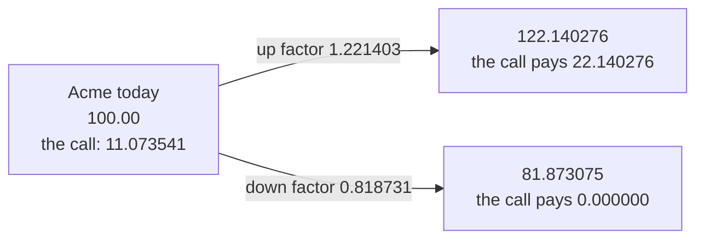
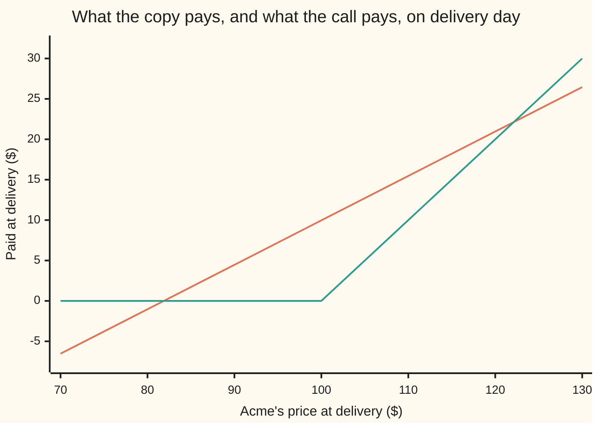

# One step: two states, two instruments, one hedge

[Syllabus](../../../SYLLABUS.md) → [Financial mathematics](../README.md) → [Binomial Trees](../README.md#s04) → One step

---

## General Overview

Acme trades at $100.00 today. Take a model of the coming year so coarse that it admits only two futures: one year from now the share is either $122.14 or $81.87. Nothing between them, nothing outside them.

A call on Acme is a contract giving the right, and no duty, to buy one share for $100.00 on that delivery day. In the up future it is worth $22.14: buy at $100.00, hold a share worth $122.14. In the down future nobody pays $100.00 for an $81.87 share, so it expires worth nothing. Two futures, two payments.

Coarse as it is, that model is enough to price the call, and the pricing needs no opinion about which future arrives.

The move is this. Build those two payments out of two ordinary things: Acme shares, and a bank account. Shares pay more in the up future than in the down one; cash in the bank pays the same in both. Two instruments that respond differently, two payments to match, so two equations in two unknowns — and the solution is a pile of shares and cash that pays $22.14 up and $0.00 down. Not approximately: exactly.

A pile that pays whatever the call pays, in every future, must cost whatever the call costs. Anything else is money for nothing; Step 5 collects it.

For Acme the copy is 0.5389 shares, costing $53.89, part-funded by borrowing $42.82. Net cost today: **$11.07**. That is the call's price. The share count is the second prize: a desk short one call buys 0.5389 shares today, which reinvested dividends carry to the 0.5498 it holds at delivery. Either number is the **hedge ratio**; the date has to be said.

**Two states and two instruments that pay differently in them: solving two equations copies the contract exactly, and the copy's cost today is the contract's price.**

**What kind of fact this is:** a theorem, proved on this card in Why it works. It stands inside a model — a year with exactly two endings is an assumption about Acme, not a law of nature.

### The picture: the whole model, on one screen



The two factors, 1.221403 up and 0.818731 down, are $e^{\sigma\sqrt{T}}$ and its reciprocal, where sigma ($\sigma$) is Acme's volatility, how jumpy the share is, 20 percent a year here, and $T$ is the years to delivery. Why that pair and not another is the business of [Cox-Ross-Rubinstein](04-crr-tree-and-convergence.md); here they are handed over, along with the rest of the house market: a riskless rate of 5 percent, a dividend yield of 2 percent, both continuously compounded, and one year to delivery.

---

## The formula

Notation first, in words. A capital Greek D, written $\Delta$ and said "delta", counts shares: it is a difference between payments divided by a difference between prices, which is why the letter for difference names it. A letter carrying a small letter below it names a state: $H_u$ is the payment to copy in the up state, $H_d$ the payment in the down state. $B$ is the cash in the bank today, negative when the copy borrows.

$$\Delta = \frac{H_u - H_d}{S(u - d)}, \qquad B = e^{-rT}\,\frac{u H_d - d H_u}{u - d}$$

**Read it aloud:** the share holding is the gap between the two payments divided by the gap between the two share prices; the bank balance is then whatever it takes to land on either payment exactly.

Those holdings cost

$$V = \Delta\,S\,e^{-qT} + B.$$

**Read it aloud:** the copy's cost today is the shares it needs, made cheaper by the dividends they pay before delivery, plus the cash left in the bank.

The two delivery prices are today's price multiplied by each factor, $S u$ and $S d$. The call's two payments are $\max(S u - K, 0)$ and $\max(S d - K, 0)$: whatever the share is worth above the strike, or nothing.

| Symbol | Plain meaning | In our example | Push it up and the answer… |
| --- | --- | --- | --- |
| $S$ | Acme's share price today, in dollars | 100.00 | rises: more to copy, so a dearer call |
| $K$ | the strike, the price the call may buy at | 100.00 | rises: less to copy, so a cheaper call |
| $u$, $d$ | the up and down factors | 1.221403 and 0.818731 | the wider the gap, the dearer the call |
| $H_u$, $H_d$ | the payments to copy, up state and down state | 22.140276 and 0.000000 | the copy costs more, in proportion |
| $\Delta$ | shares held at delivery per contract: the hedge ratio | 0.549834 | more of the copy rides on Acme |
| $B$ | cash in the bank today, negative when borrowing | −42.821115 | less borrowed, so a dearer copy |
| $V$ | what the copy costs, and so what the contract is worth | 11.073541 | — |
| $r$ | the riskless rate, continuously compounded | 5 percent | rises: the same debt raises less today, so a dearer call |
| $q$ | the dividend yield leaking out of the share each year | 2 percent | rises: fewer shares to buy today, so a cheaper call |
| $T$ | time to delivery, in years | 1 | — |
| $\sigma$ | volatility: how jumpy the share is, per year | 20 percent | rises: the futures spread apart, and the call is dearer |
| $e^{-rT}$, $e^{-qT}$ | the discount, and the dividend drag | 0.951229 and 0.980199 | — |

$\Delta$ counts shares held **at delivery**, which is not the number to buy now. A share paying a dividend yield of $q$, each dividend spent on more shares, breeds shares at that rate, so $\Delta e^{-qT}$ shares today grow into $\Delta$ by delivery: 0.538947 become 0.549834.

### When it holds

- **Exactly two delivery prices, both possible.** Two instruments pin down two numbers and no more: let a third price into the model and the copy is short in the state it never saw. What three states need is [Trinomial trees](06-trinomial-trees-and-the-grid-connection.md).
- **The two states differ, $u > d$.** With one price in both futures the two equations have identical left-hand sides: unequal payments then have no copy at all, and the division by $S(u-d)$ is a division by zero.
- **The forward growth factor lands strictly between the two: $d < e^{(r-q)T} < u$.** Acme's is 1.030455, inside 0.818731 and 1.221403. Break it and the market itself is broken: the folded proof below builds a trade that costs nothing, never loses and sometimes wins. A copy's cost is a price only where such trades are absent.
- **Trading is frictionless.** Fractional shares, borrowing and lending at the same 5 percent, no fees, no spread, no default, holdings untouched until delivery. Every friction widens the price from a point to a band: a bid-ask spread of 20 cents on Acme moves the copy's cost by 0.107789.
- **The dividend yield is known and leaks out steadily.** That is what makes $e^{-qT}$ the right shrink on the share leg. A lump dividend on a known date needs its present value subtracted instead; charging the yield twice prices this call at 10.619190 rather than 11.073541.

---

## Why it works

### Step 0: two unknowns are enough, because there are only two futures

The idea underneath everything else: in a model with two states, a contract's payoff is just two numbers, and two numbers can be hit with two dials. Shares are one dial and cash the other, and they respond differently — what the shares pay depends on the state, what the bank pays does not. Setting the dials is the whole of pricing here ([Two equations, two unknowns](../../03-Algebra/01-Letters%20and%20Equations/04-two-equations-two-unknowns.md)). No probability enters the algebra below: how likely the up state is never comes up.

### Step 1: write down what the copy must pay in each state

Let $\Delta$ be the shares held at delivery and $B$ the cash in the bank today, which grows to $Be^{rT}$ by delivery whatever happens. The shares are worth $\Delta S u$ in the up state and $\Delta S d$ in the down state. Matching the call in both:

$$\Delta S u + B e^{rT} = H_u, \qquad \Delta S d + B e^{rT} = H_d.$$

With Acme's numbers: $\Delta \times 122.140276 + B \times 1.051271 = 22.140276$ up, and $\Delta \times 81.873075 + B \times 1.051271 = 0$ down.

### Step 2: subtract, and the bank disappears

The bank pays the same in both states, so subtracting one equation from the other removes $B$ entirely:

$$\Delta\,S(u - d) = H_u - H_d \quad\Longrightarrow\quad \Delta = \frac{H_u - H_d}{S(u-d)}.$$

For Acme, 22.140276 divided by 40.267201 is 0.549834 shares. Read it as an exchange rate between the two futures: across the gap the share gains $40.27 and the call gains $22.14, so the call moves like 0.5498 of a share. A desk short one call and long 0.549834 shares at delivery ends with the same money in either state, and so has no stake in which arrives.

### Step 3: put the share holding back, and the bank balance falls out

The down equation now carries one unknown. The debt due at delivery is whatever the shares overshoot by: $-0.549834 \times 81.873075 = -45.016600$. Discounted one year at 5 percent, $-45.016600 \times 0.951229 = -42.821115$: the copy borrows $42.82 today and owes $45.02 at delivery. In symbols, with $H_d$ kept general:

$$B = e^{-rT}\,\frac{u H_d - d H_u}{u - d}.$$

Borrowing $45.02 today instead leaves a different debt at delivery, and the copy misses both states.

### Step 4: add up what it costs, and see the straight line it draws

The shares first: 0.549834 shares at delivery need 0.538947 bought today, at $100.00 each, so $53.894655. Then the bank: −$42.821115. Net, **$11.073541**.



The sloping straight line is the copy: 0.549834 of every dollar of delivery price, less the fixed debt of 45.016600. The bent line is the call's payment. They meet at 81.87 and at 122.14 and nowhere else, and the model allows nowhere else. At $130 the copy pays 26.46 against the call's 30.00; the model's whole content is that $130 cannot happen. Many short steps soften that: [Many steps](03-multi-step-trees-and-backward-induction.md).

### Step 5: why the price has to be the copy's cost

Suppose the call traded at $11.50 instead. Sell one call, build the copy for 11.073541, bank the difference of 0.426459. The position cost nothing to open. At delivery the copy pays exactly what the call owes, in both states, and the banked difference has grown to 0.448324 — a certain gain, in either future, out of nothing. Below 11.073541 the trade runs backwards: buy the call, sell the copy, bank the difference. Such trades are taken the moment they appear, which is why the quoted price sits on the copy's cost ([Replication](../03-Contracts%20and%20No-Arbitrage/06-replication-and-self-financing.md)).

### Step 6: the same number, regrouped

Collecting the cost around the two payments instead of the two holdings gives one line:

$$V = e^{-rT}\left[\frac{e^{(r-q)T} - d}{u - d}\,H_u \;+\; \frac{u - e^{(r-q)T}}{u - d}\,H_d\right].$$

For Acme the two brackets are 0.525797 and 0.474203. They add to exactly 1, and both are positive exactly when the forward factor sits between $d$ and $u$ — the band from When it holds. The cost then reads a second way: weigh the two payments, add, discount once. Those weights are the one-period state prices ([State prices](../03-Contracts%20and%20No-Arbitrage/07-state-prices-and-risk-neutral-pricing-in-one-period.md)) in the tree's clothes. Why 0.525797 looks so much like a chance of an up move, and what follows from treating it as one, is the next card: [The risk-neutral probability](02-risk-neutral-probability.md). None of the algebra above needed it.

<details>
<summary>Detailed proof: a copy exists, only one exists, and the band is exactly right</summary>

**Existence and uniqueness.** Subtracting the two delivery equations gives $\Delta S(u-d) = H_u - H_d$. Since $S > 0$ and $u > d$, the factor $S(u-d)$ is not zero, so $\Delta$ is forced; substituting it into the down equation and dividing by $e^{rT} > 0$ forces $B$. Both put back confirm they work: the up value is $[u(H_u-H_d) + uH_d - dH_u]/(u-d) = H_u$, the down value $[d(H_u-H_d) + uH_d - dH_u]/(u-d) = H_d$.

Uniqueness needs no search. If two pairs of holdings both copy the same payments, subtracting their up and down equations gives $(\Delta - \Delta')S(u-d) = 0$, so $\Delta = \Delta'$, and then $e^{rT}(B - B') = 0$ forces $B = B'$. That covers every real pair of holdings at once.

**The band.** Buying $e^{-qT}$ shares today costs $Se^{-qT}$ and delivers one share, worth $S u$ or $S d$, so a dollar in shares returns $ue^{qT}$ or $de^{qT}$ while a dollar in the bank returns $e^{rT}$ either way. If $e^{rT} \le de^{qT}$, borrow $Se^{-qT}$ and buy the shares: the position costs nothing, the debt at delivery is $Se^{(r-q)T}$, and the shares are worth at least that in the down state and strictly more in the up state. If $e^{rT} \ge ue^{qT}$, reverse it: sell the shares short, bank the proceeds. Either way money appears from nothing, so no-arbitrage forces $d < e^{(r-q)T} < u$.

Inside the band both weights of Step 6 are positive, and Step 6 holds for any pair of payments, so it returns the cost of every share-and-cash position. One that never pays less than zero and sometimes more must then cost something strictly positive: it cannot be had for nothing. The band is necessary and sufficient.

**Price equals cost.** Let the contract also trade, at a quote above its copy's cost $V$. Sell the contract, build the copy, deposit the difference: the copy meets the obligation in both states and the deposit grows at the bank rate, a certain gain from a position that cost nothing. A quote below $V$ gives the same trade with every leg reversed. Only $V$ itself leaves nothing on the table, and the contract added at that price creates no new arbitrage, since any use of it rewrites as copies.

</details>

---

## Worked numbers, by hand

Acme on the house tree: $S = 100.00$, $K = 100.00$, $u = 1.221403$, $d = 0.818731$, $r = 5$ percent, $q = 2$ percent, $T = 1$ year.

| Step | Arithmetic | Value |
| --- | --- | --- |
| the two delivery prices | $100.00 \times 1.221403$ and $\times 0.818731$ | 122.140276 and 81.873075 |
| the call's two payments | $\max(122.140276 - 100, 0)$, $\max(81.873075 - 100, 0)$ | 22.140276 and 0.000000 |
| the price gap | $122.140276 - 81.873075$ | 40.267201 |
| the hedge ratio | $22.140276 \div 40.267201$ | **0.549834 shares** |
| the debt at delivery | $-0.549834 \times 81.873075$ | −45.016600 |
| the bank balance today | $-45.016600 \times 0.951229$ | **−42.821115** |
| shares to buy today | $0.549834 \times 0.980199$ | 0.538947 |
| the share leg's cost | $0.538947 \times 100.00$ | 53.894655 |
| **the copy's cost** | $53.894655 - 42.821115$ | **11.073541** |

Manufacturing that call out of Acme shares and a bank loan costs $11.07, so that is what the call is worth: about 11 percent of the share price for a year of upside with the downside cut off.

### The hedge ratio moves with the strike

```
strike   shares held at delivery per call, one block = 0.025 shares
   80   ████████████████████████████████████████  1.000000
   90   ████████████████████████████████          0.798175
  100   ██████████████████████                    0.549834
  110   ████████████                              0.301493
  120   ██                                        0.053152
  130                                             0.000000
```

At a strike of $80 both futures finish above it: the call is a share with a fixed bill attached, and the copy is one whole share. At $130 neither future reaches the strike, so the call pays nothing either way and the copy is nothing at all. In between the hedge ratio slides.

### What breaks if you drop a piece

| Mistake | Comes out at | What went wrong |
| --- | --- | --- |
| The payoff gap divided by the factor gap | 54.983400 shares | The gap between the futures is $40.27, in dollars; today's price belongs in the denominator |
| Buying $\Delta$ whole shares today | 12.162285 | Reinvested dividends breed shares: only 0.538947 need buying to hold 0.549834 |
| Borrowing the debt's face value, 45.016600 | 8.878055 | The loan is repaid at delivery, so today it raises 42.821115 |
| Taking the 2 percent dividend out twice | 10.619190 | Shrinking the share price and then the answer charges one leak twice |
| Weighing the two payments with a fair coin | 10.530241 | Nothing in the solve ever asked how likely the up state is |

Every one of those five numbers is printed by the code below.

---

## Code, from first principles, and it actually runs

Nothing is imported that already knows an option price. Road 1 eliminates and substitutes, the algebra of Steps 2 and 3. Road 2 never divides by $u - d$: it fixes the bank balance to match the down state, then hunts the share count that closes the up state by bisection, the root finder written out. Road 3 uses the regrouped weights of Step 6. Road 4 repeats the solve in whole-number fractions on a toy market where the share moves by a fifth and the bank multiplies cash by 21/20, so the exact answers — half a share, −800/21 of cash, 250/21 of cost — carry no rounding at all. The copy is then tested state by state, on this call and on one struck at 80 that pays in both; the weights are checked against the share's own price; the mispricing trade of Step 5 is run; and every wrong number above is reproduced.

### Python

```python
# One-step binomial replication -- the check behind the card.  Nothing imported
# knows an option price.  Acme: S = 100, K = 100, one year, r = 5%, q = 2%,
# sigma = 20%, so the share ends at 122.14 or 81.87.  The holding and the bank
# balance that copy the call are found four ways: elimination; a bisection that
# never divides by u - d; the regrouped weights; exact fractions on a toy market.
from math import exp, sqrt

S, K, r, q, sigma, T = 100.0, 100.0, 0.05, 0.02, 0.20, 1.0
u = exp(sigma * sqrt(T))                      # up factor: one year of 20% jumpiness
d = 1.0 / u                                   # down factor
disc, grow = exp(-r * T), exp(r * T)          # the bank, backward and forward
drag = exp(-q * T)                            # shares to buy today to hold one at delivery
Su, Sd = S * u, S * d                         # the two delivery prices
Hu, Hd = max(Su - K, 0.0), max(Sd - K, 0.0)   # the call's two payoffs

def solved(hu, hd, s, uu, dd):                # road 1: subtract, then substitute
    return (hu - hd) / (s * (uu - dd)), disc * (uu * hd - dd * hu) / (uu - dd)

def cost(delta, bank, s=S):                   # what the pair costs today
    return delta * s * drag + bank

def bank_for_down(delta):                     # the cash that matches the down state alone
    return (Hd - delta * Sd) * disc

def up_shortfall(delta):                      # what the up state is then still short
    return delta * Su + bank_for_down(delta) * grow - Hu

def bisect(f, lo, hi):                        # road 2: a search, written out here
    for _ in range(200):
        mid = 0.5 * (lo + hi)
        if (f(lo) > 0.0) == (f(mid) > 0.0):
            lo = mid
        else:
            hi = mid
    return 0.5 * (lo + hi)

def reduced(n, m):                            # a fraction in lowest terms
    a, b = abs(n), abs(m)
    while b:
        a, b = b, a % b
    return n // a, m // a

def clean(v):                                 # a residue below a billionth is zero
    return 0.0 if abs(v) < 1e-9 else v

def row(name, v):
    print(f"  {name:<43}{v:>12.6f}")

delta, bank = solved(Hu, Hd, S, u, d)
V = cost(delta, bank)
copy_up, copy_down = delta * Su + bank * grow, delta * Sd + bank * grow
delta_b = bisect(up_shortfall, 0.0, 2.0)                    # road 2
V_b = cost(delta_b, bank_for_down(delta_b))
fwd = exp((r - q) * T)                                      # the forward's growth factor
w_up, w_down = (fwd - d) / (u - d), (u - fwd) / (u - d)     # road 3
V_w = disc * (w_up * Hu + w_down * Hd)
d80, b80 = solved(max(Su - 80.0, 0.0), max(Sd - 80.0, 0.0), S, u, d)  # both states pay
sold = 11.50                                                # a call sold too dear
banked = sold - V
arb_up = copy_up - Hu + banked * grow
arb_down = copy_down - Hd + banked * grow
spread = delta * drag * 0.20                                # a 20-cent wider share price
un, dn, ud, rn, rd, s0, hu0 = 6, 4, 5, 21, 20, 100, 20      # road 4: the toy market
dl_n, dl_d = reduced(hu0 * ud, s0 * (un - dn))
cs_n, cs_d = reduced(-dn * hu0 * rd, rn * (un - dn))
v_n, v_d = reduced(dl_n * s0 * cs_d + cs_n * dl_d, dl_d * cs_d)
wrong_gap = (Hu - Hd) / (u - d)                             # share price left out
wrong_drag = delta * S + bank                               # a whole share per Delta
wrong_face = delta * S * drag + (u * Hd - d * Hu) / (u - d)  # the debt at face value
Sx = S * drag
dx, bx = solved(max(Sx * u - K, 0.0), max(Sx * d - K, 0.0), Sx, u, d)
wrong_twice = (dx * Sx + bx) * drag                         # dividend taken out twice
wrong_coin = disc * 0.5 * (Hu + Hd)                         # a fair coin instead of a hedge

print(f"Acme: S = {S:.2f}  K = {K:.2f}  T = {T:.0f} year  r = 5%  q = 2%  sigma = 20%")
row("up factor u = e^(sigma sqrt T)", u)
row("down factor d = 1/u", d)
row("share at delivery, up state", Su)
row("share at delivery, down state", Sd)
row("the gap between the two, S u - S d", Su - Sd)
row("call payoff, up state", Hu)
row("call payoff, down state", Hd)
print(f"  bank growth e^rT {grow:.6f}, discount e^-rT {disc:.6f}, "
      f"dividend drag e^-qT {drag:.6f}")
print("road 1, the two delivery equations solved")
row("Delta, shares held at delivery", delta)
row("shares bought today, Delta e^-qT", delta * drag)
row("the share leg costs today", delta * S * drag)
row("B, cash in the bank today", bank)
row("the debt at delivery, B e^rT", bank * grow)
row("V, what the pair costs today", V)
row("the copy at delivery, up state", clean(copy_up))
row("the call pays, up state", Hu)
row("the copy at delivery, down state", clean(copy_down))
row("the call pays, down state", Hd)
print("road 2, bisection for Delta, no formula used")
row("Delta", delta_b)
row("V", V_b)
print("road 3, the two payoffs regrouped as weights")
row("weight on the up payoff", w_up)
row("weight on the down payoff", w_down)
row("the two weights add to", w_up + w_down)
row("V", V_w)
row("the weights price the share itself", disc * (w_up * Su + w_down * Sd))
print(f"the band: d {d:.6f} < forward factor {fwd:.6f} < u {u:.6f}")
print(f"sell the call at {sold:.2f} and build the copy")
row("banked today", banked)
row("at delivery, up state", arb_up)
row("at delivery, down state", arb_down)
row("a 0.20 wider share price costs", spread)
print("road 4, whole-number fractions, toy market u = 6/5, d = 4/5, bank x 21/20")
print(f"  Delta = {dl_n}/{dl_d}   cash = {cs_n}/{cs_d}   "
      f"cost = {v_n}/{v_d} = {v_n / v_d:.6f}")
print("hedge ratio by strike, shares at delivery per call")
for strike in (80.0, 90.0, 100.0, 110.0, 120.0, 130.0):
    row(f"strike {strike:.0f}", (max(Su - strike, 0.0) - max(Sd - strike, 0.0)) / (S * (u - d)))
print("what breaks")
row("payoff gap over factor gap, shares", wrong_gap)
row("dividend ignored on the share leg", wrong_drag)
row("the debt borrowed at its face value", wrong_face)
row("the dividend taken out twice", wrong_twice)
row("a fair coin instead of the hedge", wrong_coin)
grid = [70.0, 80.0, 90.0, 100.0, 110.0, 120.0, 130.0]
print("chart, delivery price   " + " ".join(f"{x:6.2f}" for x in grid))
print("chart, the copy         " + " ".join(f"{delta * x + bank * grow:6.2f}" for x in grid))
print("chart, the call's payoff" + " ".join(f"{max(x - K, 0.0):6.2f}" for x in grid))

assert abs(V - 11.073540703840) < 1e-9          # the cost the card quotes
assert abs(copy_up - Hu) < 1e-9                 # the copy really pays the call, up state
assert abs(copy_down - Hd) < 1e-9               # and down
assert max(abs(d80 - 1.0), abs(b80 + 80.0 * disc)) < 1e-10   # a strike both states clear
assert abs(V_b - V) < 1e-10                     # the search lands on the solved road
assert abs(V_w - V) < 1e-12                     # the weights land there too
assert abs(disc * (w_up * Su + w_down * Sd) - S * drag) < 1e-10  # they price the share too
assert abs(arb_up - arb_down) < 1e-12           # a mispriced call pays the same either way
assert arb_up > 0.0                             # and the difference is a gain out of nothing
assert d < fwd < u                              # the band that makes a cost a price
assert (v_n, v_d) == (250, 21)                  # the toy market, in exact fractions
print("ALL CHECKS PASS")
```

**Ran 2026-09-14 on macOS, Python 3.14.6, standard library only. All checks passed. Output, pasted from the run:**

```
Acme: S = 100.00  K = 100.00  T = 1 year  r = 5%  q = 2%  sigma = 20%
  up factor u = e^(sigma sqrt T)                 1.221403
  down factor d = 1/u                            0.818731
  share at delivery, up state                  122.140276
  share at delivery, down state                 81.873075
  the gap between the two, S u - S d            40.267201
  call payoff, up state                         22.140276
  call payoff, down state                        0.000000
  bank growth e^rT 1.051271, discount e^-rT 0.951229, dividend drag e^-qT 0.980199
road 1, the two delivery equations solved
  Delta, shares held at delivery                 0.549834
  shares bought today, Delta e^-qT               0.538947
  the share leg costs today                     53.894655
  B, cash in the bank today                    -42.821115
  the debt at delivery, B e^rT                 -45.016600
  V, what the pair costs today                  11.073541
  the copy at delivery, up state                22.140276
  the call pays, up state                       22.140276
  the copy at delivery, down state               0.000000
  the call pays, down state                      0.000000
road 2, bisection for Delta, no formula used
  Delta                                          0.549834
  V                                             11.073541
road 3, the two payoffs regrouped as weights
  weight on the up payoff                        0.525797
  weight on the down payoff                      0.474203
  the two weights add to                         1.000000
  V                                             11.073541
  the weights price the share itself            98.019867
the band: d 0.818731 < forward factor 1.030455 < u 1.221403
sell the call at 11.50 and build the copy
  banked today                                   0.426459
  at delivery, up state                          0.448324
  at delivery, down state                        0.448324
  a 0.20 wider share price costs                 0.107789
road 4, whole-number fractions, toy market u = 6/5, d = 4/5, bank x 21/20
  Delta = 1/2   cash = -800/21   cost = 250/21 = 11.904762
hedge ratio by strike, shares at delivery per call
  strike 80                                      1.000000
  strike 90                                      0.798175
  strike 100                                     0.549834
  strike 110                                     0.301493
  strike 120                                     0.053152
  strike 130                                     0.000000
what breaks
  payoff gap over factor gap, shares            54.983400
  dividend ignored on the share leg             12.162285
  the debt borrowed at its face value            8.878055
  the dividend taken out twice                  10.619190
  a fair coin instead of the hedge              10.530241
chart, delivery price    70.00  80.00  90.00 100.00 110.00 120.00 130.00
chart, the copy          -6.53  -1.03   4.47   9.97  15.47  20.96  26.46
chart, the call's payoff  0.00   0.00   0.00   0.00  10.00  20.00  30.00
ALL CHECKS PASS
```

### Rust

Same roads, same labels, built with `rustc --edition 2021 -O`.

```rust
// One-step binomial replication -- the same check as the Python, in Rust.  No
// crates.  Acme: S = 100, K = 100, one year, r = 5%, q = 2%, sigma = 20%, so
// the share ends at 122.14 or 81.87.  The holding and the bank balance that
// copy the call are found four ways: elimination; a bisection that never
// divides by u - d; the regrouped weights; exact fractions on a toy market.
const S: f64 = 100.0;
const K: f64 = 100.0;
const R: f64 = 0.05;
const Q: f64 = 0.02;
const SIGMA: f64 = 0.20;
const T: f64 = 1.0;

fn reduced(n: i64, m: i64) -> (i64, i64) {          // a fraction in lowest terms
    let (mut a, mut b) = (n.abs(), m.abs());
    while b != 0 { (a, b) = (b, a % b) }
    (n / a, m / a)
}

fn clean(v: f64) -> f64 {                           // a residue below a billionth is zero
    if v.abs() < 1e-9 { 0.0 } else { v }
}

fn row(name: &str, v: f64) {
    println!("  {:<43}{:>12.6}", name, v);
}

fn main() {
    let u = (SIGMA * T.sqrt()).exp();               // up factor: one year of 20% jumpiness
    let d = 1.0 / u;                                // down factor
    let (disc, grow) = ((-R * T).exp(), (R * T).exp());   // the bank, backward and forward
    let drag = (-Q * T).exp();                      // shares to buy today to hold one at delivery
    let (su, sd) = (S * u, S * d);                  // the two delivery prices
    let (hu, hd) = ((su - K).max(0.0), (sd - K).max(0.0));   // the call's two payoffs
    let solved = |hu: f64, hd: f64, s: f64, uu: f64, dd: f64| -> (f64, f64) {
        ((hu - hd) / (s * (uu - dd)), disc * (uu * hd - dd * hu) / (uu - dd))
    };                                              // road 1: subtract, then substitute
    let cost = |delta: f64, bank: f64, s: f64| delta * s * drag + bank;
    let bank_for_down = |delta: f64| (hd - delta * sd) * disc;   // matches the down state alone
    let up_shortfall = |delta: f64| delta * su + bank_for_down(delta) * grow - hu;
    let bisect = |f: &dyn Fn(f64) -> f64, mut lo: f64, mut hi: f64| -> f64 {
        for _ in 0..200 {                           // road 2: a search, written out here
            let mid = 0.5 * (lo + hi);
            if (f(lo) > 0.0) == (f(mid) > 0.0) { lo = mid } else { hi = mid }
        }
        0.5 * (lo + hi)
    };

    let (delta, bank) = solved(hu, hd, S, u, d);
    let v = cost(delta, bank, S);
    let (copy_up, copy_down) = (delta * su + bank * grow, delta * sd + bank * grow);
    let delta_b = bisect(&up_shortfall, 0.0, 2.0);                    // road 2
    let v_b = cost(delta_b, bank_for_down(delta_b), S);
    let fwd = ((R - Q) * T).exp();                                    // the forward's growth factor
    let (w_up, w_down) = ((fwd - d) / (u - d), (u - fwd) / (u - d));  // road 3
    let v_w = disc * (w_up * hu + w_down * hd);
    let (d80, b80) = solved((su - 80.0).max(0.0), (sd - 80.0).max(0.0), S, u, d);  // both states pay
    let sold = 11.50_f64;                                             // a call sold too dear
    let banked = sold - v;
    let arb_up = copy_up - hu + banked * grow;
    let arb_down = copy_down - hd + banked * grow;
    let spread = delta * drag * 0.20;                                 // a 20-cent wider share price
    let (un, dn, ud, rn, rd, s0, hu0) = (6_i64, 4, 5, 21, 20, 100, 20);   // road 4: the toy market
    let (dl_n, dl_d) = reduced(hu0 * ud, s0 * (un - dn));
    let (cs_n, cs_d) = reduced(-dn * hu0 * rd, rn * (un - dn));
    let (v_n, v_d) = reduced(dl_n * s0 * cs_d + cs_n * dl_d, dl_d * cs_d);
    let wrong_gap = (hu - hd) / (u - d);                              // share price left out
    let wrong_drag = delta * S + bank;                                // a whole share per Delta
    let wrong_face = delta * S * drag + (u * hd - d * hu) / (u - d);  // the debt at face value
    let sx = S * drag;
    let (dx, bx) = solved((sx * u - K).max(0.0), (sx * d - K).max(0.0), sx, u, d);
    let wrong_twice = (dx * sx + bx) * drag;                          // dividend taken out twice
    let wrong_coin = disc * 0.5 * (hu + hd);                          // a fair coin, not a hedge

    println!("Acme: S = {:.2}  K = {:.2}  T = {:.0} year  r = 5%  q = 2%  sigma = 20%", S, K, T);
    row("up factor u = e^(sigma sqrt T)", u);
    row("down factor d = 1/u", d);
    row("share at delivery, up state", su);
    row("share at delivery, down state", sd);
    row("the gap between the two, S u - S d", su - sd);
    row("call payoff, up state", hu);
    row("call payoff, down state", hd);
    println!("  bank growth e^rT {:.6}, discount e^-rT {:.6}, dividend drag e^-qT {:.6}",
             grow, disc, drag);
    println!("road 1, the two delivery equations solved");
    row("Delta, shares held at delivery", delta);
    row("shares bought today, Delta e^-qT", delta * drag);
    row("the share leg costs today", delta * S * drag);
    row("B, cash in the bank today", bank);
    row("the debt at delivery, B e^rT", bank * grow);
    row("V, what the pair costs today", v);
    row("the copy at delivery, up state", clean(copy_up));
    row("the call pays, up state", hu);
    row("the copy at delivery, down state", clean(copy_down));
    row("the call pays, down state", hd);
    println!("road 2, bisection for Delta, no formula used");
    row("Delta", delta_b);
    row("V", v_b);
    println!("road 3, the two payoffs regrouped as weights");
    row("weight on the up payoff", w_up);
    row("weight on the down payoff", w_down);
    row("the two weights add to", w_up + w_down);
    row("V", v_w);
    row("the weights price the share itself", disc * (w_up * su + w_down * sd));
    println!("the band: d {:.6} < forward factor {:.6} < u {:.6}", d, fwd, u);
    println!("sell the call at {:.2} and build the copy", sold);
    row("banked today", banked);
    row("at delivery, up state", arb_up);
    row("at delivery, down state", arb_down);
    row("a 0.20 wider share price costs", spread);
    println!("road 4, whole-number fractions, toy market u = 6/5, d = 4/5, bank x 21/20");
    println!("  Delta = {}/{}   cash = {}/{}   cost = {}/{} = {:.6}",
             dl_n, dl_d, cs_n, cs_d, v_n, v_d, v_n as f64 / v_d as f64);
    println!("hedge ratio by strike, shares at delivery per call");
    for strike in [80.0_f64, 90.0, 100.0, 110.0, 120.0, 130.0] {
        row(&format!("strike {:.0}", strike),
            ((su - strike).max(0.0) - (sd - strike).max(0.0)) / (S * (u - d)));
    }
    println!("what breaks");
    row("payoff gap over factor gap, shares", wrong_gap);
    row("dividend ignored on the share leg", wrong_drag);
    row("the debt borrowed at its face value", wrong_face);
    row("the dividend taken out twice", wrong_twice);
    row("a fair coin instead of the hedge", wrong_coin);
    let grid = [70.0_f64, 80.0, 90.0, 100.0, 110.0, 120.0, 130.0];
    let join = |vals: Vec<String>| vals.join(" ");
    println!("chart, delivery price   {}",
             join(grid.iter().map(|x| format!("{:6.2}", x)).collect()));
    println!("chart, the copy         {}",
             join(grid.iter().map(|x| format!("{:6.2}", delta * x + bank * grow)).collect()));
    println!("chart, the call's payoff{}",
             join(grid.iter().map(|x| format!("{:6.2}", (x - K).max(0.0))).collect()));

    assert!((v - 11.073540703840).abs() < 1e-9);      // the cost the card quotes
    assert!((copy_up - hu).abs() < 1e-9);             // the copy really pays the call, up state
    assert!((copy_down - hd).abs() < 1e-9);           // and down
    assert!((d80 - 1.0).abs().max((b80 + 80.0 * disc).abs()) < 1e-10);  // both states clear 80
    assert!((v_b - v).abs() < 1e-10);                 // the search lands on the solved road
    assert!((v_w - v).abs() < 1e-12);                 // the weights land there too
    assert!((disc * (w_up * su + w_down * sd) - S * drag).abs() < 1e-10);  // and price the share
    assert!((arb_up - arb_down).abs() < 1e-12);       // a mispriced call pays the same either way
    assert!(arb_up > 0.0);                            // and the difference is a gain out of nothing
    assert!(d < fwd && fwd < u);                      // the band that makes a cost a price
    assert!((v_n, v_d) == (250, 21));                 // the toy market, in exact fractions
    println!("ALL CHECKS PASS");
}
```

**Ran 2026-09-14 on macOS, rustc 1.98.1, no crates. All checks passed. Output, pasted from the run:**

```
Acme: S = 100.00  K = 100.00  T = 1 year  r = 5%  q = 2%  sigma = 20%
  up factor u = e^(sigma sqrt T)                 1.221403
  down factor d = 1/u                            0.818731
  share at delivery, up state                  122.140276
  share at delivery, down state                 81.873075
  the gap between the two, S u - S d            40.267201
  call payoff, up state                         22.140276
  call payoff, down state                        0.000000
  bank growth e^rT 1.051271, discount e^-rT 0.951229, dividend drag e^-qT 0.980199
road 1, the two delivery equations solved
  Delta, shares held at delivery                 0.549834
  shares bought today, Delta e^-qT               0.538947
  the share leg costs today                     53.894655
  B, cash in the bank today                    -42.821115
  the debt at delivery, B e^rT                 -45.016600
  V, what the pair costs today                  11.073541
  the copy at delivery, up state                22.140276
  the call pays, up state                       22.140276
  the copy at delivery, down state               0.000000
  the call pays, down state                      0.000000
road 2, bisection for Delta, no formula used
  Delta                                          0.549834
  V                                             11.073541
road 3, the two payoffs regrouped as weights
  weight on the up payoff                        0.525797
  weight on the down payoff                      0.474203
  the two weights add to                         1.000000
  V                                             11.073541
  the weights price the share itself            98.019867
the band: d 0.818731 < forward factor 1.030455 < u 1.221403
sell the call at 11.50 and build the copy
  banked today                                   0.426459
  at delivery, up state                          0.448324
  at delivery, down state                        0.448324
  a 0.20 wider share price costs                 0.107789
road 4, whole-number fractions, toy market u = 6/5, d = 4/5, bank x 21/20
  Delta = 1/2   cash = -800/21   cost = 250/21 = 11.904762
hedge ratio by strike, shares at delivery per call
  strike 80                                      1.000000
  strike 90                                      0.798175
  strike 100                                     0.549834
  strike 110                                     0.301493
  strike 120                                     0.053152
  strike 130                                     0.000000
what breaks
  payoff gap over factor gap, shares            54.983400
  dividend ignored on the share leg             12.162285
  the debt borrowed at its face value            8.878055
  the dividend taken out twice                  10.619190
  a fair coin instead of the hedge              10.530241
chart, delivery price    70.00  80.00  90.00 100.00 110.00 120.00 130.00
chart, the copy          -6.53  -1.03   4.47   9.97  15.47  20.96  26.46
chart, the call's payoff  0.00   0.00   0.00   0.00  10.00  20.00  30.00
ALL CHECKS PASS
```

The two outputs match line for line.

> [!TIP]
> **Try changing**
> Guess first, then run it. The asserts are pinned to Acme's tree, so expect one to stop the program.
> - **Move the strike above both futures.** Set `K` to `130.0`: neither state reaches it, hedge ratio and bank balance both come out at zero, and the copy costs nothing — the right price for a right nobody would use. The first assert stops the run.
> - **Break the band.** Set `r` to `0.30`: the bank now grows faster than the up factor and the down weight of road 3 turns negative. The pinned-cost assert stops the run first; the band assert would have caught it next. That market has free money in it.
> - **Starve the search.** Change `range(200)` to `range(8)` in `bisect`: eight halvings leave the searched hedge ratio thousandths from the solved one, and the assert comparing the roads stops the run.
> - **Collapse the two states.** Set `sigma` to `0.0`: both factors become 1, the two equations become one, and the run stops on a division by zero before any assert — the degenerate case the card excludes.

---

## The usual mistake

> [!warning]
> **Reading the hedge ratio as a probability.** 0.549834 is a count of shares, not a chance of anything. It sits between 0 and 1, which invites the error, but it is a slope: dollars of call per dollar of share across the gap between the futures. The number that really does look like odds is the weight 0.525797 of Step 6, and it is not the chance of an up move either.
>
> - **Thinking the copy needs the odds.** Weighing the two payments 50-50 prices this call at 10.530241. The copy pays the right amount in both states, however likely either is.
> - **Holding the delivery share count from today.** Buying 0.549834 shares today instead of 0.538947 prices the call at 12.162285, a dollar too dear, and over-hedges the copy.
> - **Borrowing the debt's face value.** The 45.016600 owed at delivery raises only 42.821115 today; borrowing the face amount prices the call at 8.878055.
> - **Believing the model instead of using it.** Acme will not finish at exactly one of two prices. The two-state year earns its place by being refinable — many short steps ([Many steps](03-multi-step-trees-and-backward-induction.md)), and in the limit a smooth formula ([Cox-Ross-Rubinstein](04-crr-tree-and-convergence.md)). One step alone prices nothing traded.

---

## Where you meet it in real life

- **An options desk, every day.** A market maker who sells that call buys 0.5389 shares against it, so Acme's move leaves the book flat. In a one-step world the hedge is set once; in the real one it is reset as the price and the clock move — the same solve at every node of [Many steps](03-multi-step-trees-and-backward-induction.md).
- **Listed American options.** Exchange-traded options on shares are priced on trees, because the holder may exercise early and a formula has nowhere to ask whether they should. That question is asked node by node in [Early exercise](05-american-exercise-on-a-tree.md).
- **Convertible bonds and structured notes.** A bond that converts into shares is a loan plus a call, and the call leg is priced and hedged exactly as above: shares plus borrowing, solved state by state.

> **Say it back**
> A one-step tree allows a share exactly two prices at delivery, so a contract on it is two numbers. Shares pay differently in the two states and cash pays the same in both, so two equations in two unknowns copy the contract exactly. The share holding is the gap between the payments over the gap between the prices, 0.549834 for the Acme call; the bank balance is whatever it then takes to land on either payment, a borrowing of 42.821115. The copy costs 11.073541 today, and no-arbitrage forces the contract to cost the same. Nowhere is either state's likelihood asked for.

---

## What this builds on

- [Replication](../03-Contracts%20and%20No-Arbitrage/06-replication-and-self-financing.md): what it means for shares and cash to copy a contract, and why a copy left untouched between two dates needs no cash injected. This card builds the smallest copy there is.
- [State prices](../03-Contracts%20and%20No-Arbitrage/07-state-prices-and-risk-neutral-pricing-in-one-period.md): the price of a dollar paid in one named state. The brackets of Step 6 are those prices, read off a tree.
- [Two equations, two unknowns](../../03-Algebra/01-Letters%20and%20Equations/04-two-equations-two-unknowns.md): eliminate one unknown by subtraction, substitute back for the other, and know when the solution is the only one. The derivation is that method applied to money.

## Where this goes next

- [The risk-neutral probability](02-risk-neutral-probability.md): the two weights of Step 6, taken seriously as odds in a world nobody lives in, which turns the copy's cost into an average and makes every later tree tractable.

Step 6 produced two positive weights adding to exactly 1 that were never asked to mean anything; whether they may be read as probabilities is the next card.

---

## Sources

Verified 14 Sep 2026: every link below resolves to the publisher's page.

- Cox, John C., Stephen A. Ross, and Mark Rubinstein. "Option Pricing: A Simplified Approach." *Journal of Financial Economics* 7, no. 3 (1979): 229–263. [doi:10.1016/0304-405X(79)90015-1](https://doi.org/10.1016/0304-405X(79)90015-1). Option pricing built out of one-step hedges like this one, then stacked.
- Rendleman, Richard J., and Brit J. Bartter. "Two-State Option Pricing." *Journal of Finance* 34, no. 5 (1979): 1093–1110. [doi:10.1111/j.1540-6261.1979.tb00058.x](https://doi.org/10.1111/j.1540-6261.1979.tb00058.x). The same year, the same two-state solve, reached independently.
- Merton, Robert C. "Theory of Rational Option Pricing." *Bell Journal of Economics and Management Science* 4, no. 1 (1973): 141–183. [doi:10.2307/3003143](https://doi.org/10.2307/3003143). Where the continuous dividend yield, and so the $e^{-qT}$ on the share leg, comes from.
- Shreve, Steven E. *Stochastic Calculus for Finance I: The Binomial Asset Pricing Model*. Springer, 2004. [Publisher page](https://link.springer.com/book/9780387401003). Chapter 1 is this card, at full length.
- Hull, John C. *Options, Futures, and Other Derivatives*, 11th ed. Pearson. [Publisher page](https://www.pearson.com/en-us/subject-catalog/p/options-futures-and-other-derivatives/P200000005938). The standard textbook treatment of the one-step tree and the hedge ratio.
