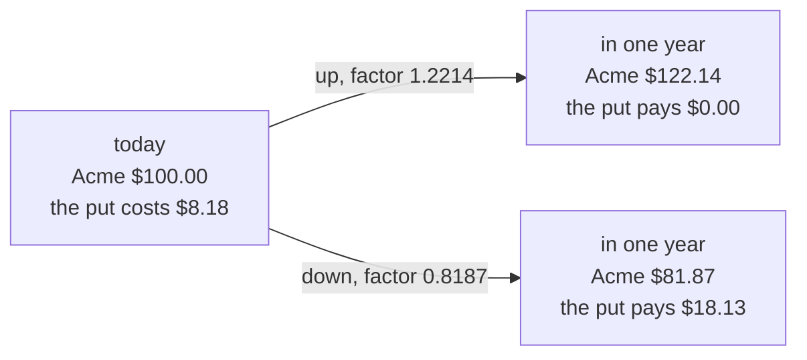
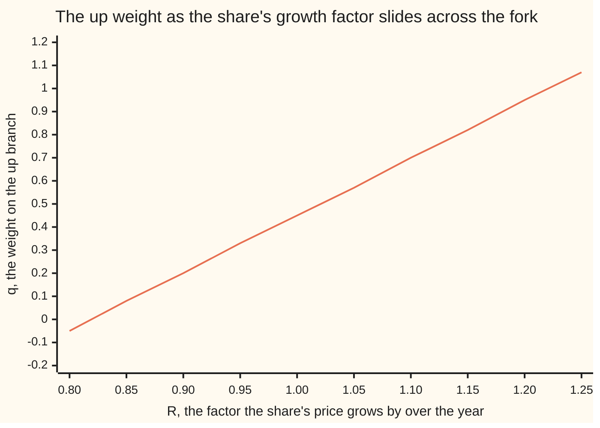

# The risk-neutral probability: q equals (R minus d) over (u minus d), and why it is not a forecast

[Syllabus](../../../SYLLABUS.md) → [Financial mathematics](../README.md) → [Binomial Trees](../README.md#s04) → The risk-neutral probability

---

## General Overview

Acme trades at $100.00 today. Model the coming year with a single fork: one year from now the share is either $122.14 or $81.87, and nothing in between. Those two prices are 20 percent yearly volatility cut into one step — a multiplier of 1.2214 up, 0.8187 down. Cash in the bank grows at 5 percent a year, compounded continuously, so a dollar becomes $1.0513 by year end. The share pays out 2 percent of its value a year as dividends.

A put is the right to sell one share for a fixed $100.00 in a year. At the upper price it is worthless: nobody sells a $122.14 share for $100.00. At the lower price it pays $18.13, the $100.00 received minus the $81.87 share handed over. The previous card solved, for the call on this same fork, how many shares and how much cash reproduce a contract's two payments: [One step](01-one-step-binomial-replication.md). Run that solve for the put's payments and the bill is $8.18, which is the put's price, because anything else is free money for whoever spots the gap.

This card does arithmetic on that bill. Multiply the upper payment by 0.5258, the lower by 0.4742, add, and divide by that 1.0513. Out comes $8.18 again, to the cent and well past it.

Two positive numbers adding to one look like the chances of the two branches. They are nothing of the kind. Three market numbers fix the pair — the up multiplier, the down multiplier, and the rate the share's own price grows at — so an investor convinced Acme rises seven years in ten uses the same pair and reaches the same price. Finance calls the upper one the **risk-neutral probability**, written q.

**The bill for copying a payoff can always be rewritten as a weighted average of its payments carried back through the bank, and the weight that does it comes from the market's own growth factors rather than from any view about the future.**

**What kind of fact this is:** a theorem, proved on this card in Why it works; the weight q that the theorem is about is a definition.

### The picture: one fork, two payments



Everything the weights ever see about a contract is the pair of payments on the right.

---

## The formula

A **factor** here is a multiplier over one step: the share's price is multiplied by the up factor or the down factor, a dollar in the bank by its own growth factor. The step's length in years is $\Delta t$, one whole year here. The letter $R$ is the factor the share's own price grows by over the step; it is not the bank's factor when the share pays dividends, because a dividend leaves the share's price when it is paid.

$$q = \frac{R - d}{u - d}, \qquad 1 - q = \frac{u - R}{u - d}$$

**Read it aloud:** the weight on the up branch is how far the share's growth factor sits above the down factor, measured as a share of the whole fork.

Those weights then price any contract that settles at the end of the step:

$$V_0 = e^{-r\Delta t}\left[\,q\,C_u + (1 - q)\,C_d\,\right]$$

**Read it aloud:** weight the two payments, add them, and carry the total back through the bank.

| Symbol | Plain meaning | In our example | Push it up and the put… |
| --- | --- | --- | --- |
| $S$ | Acme's price today | $100.00 | costs less: selling at a fixed price is worth less |
| $K$ | the strike: the price the put may sell at | $100.00 | costs more |
| $u$ | up factor: the multiplier on the up branch | 1.221403 | costs more: weight slides to the paying branch |
| $d$ | down factor: the multiplier on the down branch | 0.818731 | costs less: the bad ending is less bad |
| $R$ | the share's own price growth factor over the step | 1.030455 | costs less |
| $q$ | the weight on the up branch | 0.525797 | costs less |
| $p$ | the real-world chance of an up move | never appears | does not move at all |
| $r$ | the bank rate, continuously compounded | 5 percent | costs less: $R$ rises, the discount deepens |
| $y$ | the dividend yield paid out by the share | 2 percent | costs more: $R$ falls |
| $\Delta t$ | the length of one step, in years | 1 | — |
| $C_u$, $C_d$ | the contract's payment on each branch | $0.00 and $18.13 | costs more |
| $V_0$ | what the contract is worth today | $8.18 | — |

One warning about letters: cards elsewhere on this shelf write the weight $p$ and keep $q$ for the dividend yield. Here the weight is $q$, as the title has it, the real-world chance of an up move is $p$, and the dividend yield is $y$.

The growth factor has its own short formula, and it is the one place a dividend enters:

$$R = e^{(r - y)\Delta t}$$

In words: the share's price climbs at the bank rate less what leaks out as dividends, so at 5 percent and 2 percent it grows over the year by 1.030455 while a dollar of cash grows by 1.051271. The same number is the market's forward price for a share delivered in a year, divided by today's price. On a share paying nothing, $y$ is zero and $R$ is the bank's factor.

**Conventions verified 14 Sep 2026:** both rates here are continuously compounded and $\Delta t$ counts calendar years. Day-count and compounding conventions differ by market and do change; convert before substituting.

### When it holds

- **Two endings and one step.** With three possible prices, two instruments cannot reproduce three payments and a contract's price becomes a range: [Trinomial trees](06-trinomial-trees-and-the-grid-connection.md).
- **The fork straddles the growth factor: $d < R < u$.** Otherwise $q$ leaves the interval from 0 to 1 and free money is on the table, as Step 3 shows.
- **Borrowing, lending and shorting at one rate, in any quantity, with no fees.** Charge more to borrow than the bank pays and the single price widens into a band.
- **The payout is a known proportional yield.** A lump cash dividend is not one: its present value comes off the share price before the fork is built. Treating this share as paying nothing moves the weight to 0.577493.

---

## Why it works

### Step 0: a bill can be rearranged

Two instruments and two endings make the copy possible: the shares fix the gap between the two payments, the cash fixes the level, and there is exactly one answer. Whatever the copy costs, the contract costs, because two packages paying the same in every ending must cost the same today.

That solve is the previous card's. What follows is arithmetic on its finished bill: a cost of the form "shares at today's price, plus cash" regroups so that each payment stands in front of a coefficient.

### Step 1: the bill, regrouped, is a weighted average

Add the copy's two costs and gather the terms in $C_u$ and in $C_d$. The coefficient in front of $C_u$ comes out as $(R - d)/(u - d)$ divided by the bank's factor, the one in front of $C_d$ as $(u - R)/(u - d)$ divided by the same factor. Both are positive when the fork straddles the growth factor, and together they make exactly one over that factor. Nothing was assumed to arrange it; it is what the subtraction leaves behind.

<details>
<summary>Detailed proof: from the two matching equations to the weighted average</summary>

The copy holds $\Delta$ shares (a share count, not the step length $\Delta t$) and some cash, and dividends are reinvested in more shares, so $\Delta$ shares today become $\Delta e^{y\Delta t}$ shares by the end of the step. Matching the contract in both endings gives two equations:
$$\Delta S u\,e^{y\Delta t} + \text{cash}\;e^{r\Delta t} = C_u, \qquad \Delta S d\,e^{y\Delta t} + \text{cash}\;e^{r\Delta t} = C_d.$$
Subtracting kills the cash, and $u > d$ allows the division:
$$\Delta = e^{-y\Delta t}\,\frac{C_u - C_d}{S\,(u - d)}.$$
Putting that back into the first equation gives the cash:
$$\text{cash} = e^{-r\Delta t}\,\frac{u\,C_d - d\,C_u}{u - d}.$$
The bill is the shares at today's price plus that cash. To add the two pieces, write the share piece with the same discount out front, using $e^{-y\Delta t} = e^{-r\Delta t}\,e^{(r-y)\Delta t} = e^{-r\Delta t} R$:
$$V_0 = e^{-r\Delta t}\left[\frac{R\,(C_u - C_d) + u\,C_d - d\,C_u}{u - d}\right] = e^{-r\Delta t}\left[\frac{(R - d)\,C_u + (u - R)\,C_d}{u - d}\right].$$
The two numerators, divided by $u - d$, are $q$ and $1 - q$. That is the pricing rule. The derivation used the two matching equations and $u > d$, and nothing else: no probability was written down, because none appears in either equation.

</details>

### Step 2: the same weight is the one that prices the share itself

Run the rule on the simplest contract of all: one Acme share, delivered at the end of the step. Its payments are $122.14 and $81.87. The weighted average is $103.05, today's price multiplied by the growth factor, and carrying that back through the bank leaves $98.02.

That is the right answer: the cost today of having one share in a year is not $100.00 but $98.02, because buying 0.9802 shares now and reinvesting the dividends grows the holding to exactly one share. The algebra is $q$'s own formula read backwards, so it is no second proof; what it supplies is the property that picks $q$ out. Which weight averages the two factors to the growth factor is one equation in one unknown, and the two factors being different makes its answer unique. The check solves that equation a second way, halving a bracket until it stops moving, and lands on 0.525797.

A quantity whose weighted average equals its value today is called a **martingale**: a running total that neither drifts up nor down. Carried back through the bank, the share's price is one of those under these weights. And in a world where the weights really were the odds, nobody would be paid extra for holding a risky share rather than cash, so everything would grow at the bank rate — which is where **risk-neutral** comes from. Nobody claims to live in that world.

### Step 3: the weight sits between 0 and 1 exactly when there is no free money

Here is the trade that decides it. Borrow $98.02, buy 0.9802 Acme shares and reinvest the dividends, so a year later exactly one share is held, worth $122.14 or $81.87. The debt has grown to $103.05, today's price multiplied by the growth factor: the borrowing and the dividends between them turn the bank's factor into the share's own. The trade gains $19.09 in the up state and loses $21.17 in the down state. One ending wins, one loses. No free money.

Now push the growth factor around.

If $R$ is at or above $u$, the debt at the end matches or beats the share in **both** endings. Run the trade backwards — short the share, lend the cash — and it never loses: at $R = 1.30$ it collects $7.86 and $48.13. The check prints that pair as negatives, since its table gives the gains of the borrow-and-hold trade this one reverses. Meanwhile the weight is at or above 1: its top, $R - d$, has caught its bottom, $u - d$.

If $R$ is at or below $d$, the share matches or beats the debt in both endings, so borrowing and holding never loses: at $R = 0.80$ it collects $42.14 and $1.87. And the weight is at or below 0: its top, $R - d$, has fallen to zero or below.

Those are the same statement twice. $q > 0$ says exactly $R > d$, and $q < 1$ says exactly $R < u$. So **the weight is a genuine pair of positive numbers adding to one precisely when no trade in the share and the bank makes money out of nothing.** That is this card's theorem, in its one-step form.

The check runs both boundaries. At $R = u$, $q$ is 1 and the down branch is priced at nothing: short and lend, and the up state breaks even while the down state pays $40.27. At $R = d$ the mirror trade pays $40.27 in the up state and nothing in the down. A trade that cannot lose and sometimes wins is free money too, so the endpoints are out.

Slide the growth factor across a fixed fork and the whole theorem is one straight line.



The line crosses 0 where $R$ meets the down factor 0.8187 and 1 where it meets the up factor 1.2214, with Acme's own 1.030455 between them at 0.525797. Off either end every point is a market with a trade that prints money.

### Step 4: nothing in any of that was a forecast

Neither matching equation in the folded proof contains $p$, the real-world chance of an up move. They cannot: the copy reproduces the contract in **both** endings, so how often each occurs never comes up.

The check rebuilds the copy for three views of Acme and prices the put the naive way alongside:

| The real-world chance of an up move | What the copy costs | The put's average payment, discounted |
| --- | --- | --- |
| 0.30, a bear | $8.18 | $12.07 |
| 0.50, a coin flip | $8.18 | $8.62 |
| 0.70, a bull | $8.18 | $5.17 |

The right-hand column forecasts what the put will pay, and every row of it is defensible. Only the middle column is a price, and it does not move. The bear cannot buy this put for $12.07 from anyone: a seller assembles the copy for $8.18 and pockets the difference with no risk at all.

A second route reaches the same weights from the other end. Price a dollar paid only in the up ending, and a dollar paid only in the down ending: those two prices are $q$ and $1 - q$ carried back through the bank, and every contract here is those two multiplied by its payments. They are **state prices**: [State prices](../03-Contracts%20and%20No-Arbitrage/07-state-prices-and-risk-neutral-pricing-in-one-period.md).

---

## Worked numbers, by hand

Acme on the house tree: $S = 100$, $K = 100$, up 1.2214, down 0.8187, $r = 5$ percent, $y = 2$ percent, one year.

| Step | Arithmetic | Value |
| --- | --- | --- |
| the fork | $100 × 1.221403$ and $100 × 0.818731$ | 122.14 and 81.87 |
| the share's growth factor | $e^{(0.05 - 0.02) × 1}$ | 1.030455 |
| the bank's growth factor | $e^{0.05 × 1}$ | 1.051271 |
| the width of the fork | $1.221403 - 0.818731$ | 0.402672 |
| how far $R$ clears the down factor | $1.030455 - 0.818731$ | 0.211724 |
| the weight on the up branch | $0.211724 ÷ 0.402672$ | **0.525797** |
| the weight on the down branch | $1 - 0.525797$ | 0.474203 |
| the put's two payments | $\max(100 - 122.14,\,0)$ and $\max(100 - 81.87,\,0)$ | 0.00 and 18.13 |
| the weighted average | $0.525797 × 0 + 0.474203 × 18.126925$ | 8.595840 |
| carried back through the bank | $8.595840 ÷ 1.051271$ | **$8.18** |
| the same thing as a copy | 0.441252 shares sold short, 52.30 of cash | **$8.18** |

So the put's seller charges $8.18, sells 0.441252 shares short, banks $52.30, and finishes the year square whichever ending arrives.

One outside witness: the same weights price the call — the right to buy at $100.00 — at $11.07, and call minus put is $2.90. That difference also equals a share delivered in a year minus the strike carried back through the bank, an identity that never mentions the weight. The two agree to the sixth decimal.

### What breaks if you drop a piece

| Mistake | The put comes out at | What went wrong |
| --- | --- | --- |
| Weighting with a real-world view, 0.70 up | $5.17 | A copy's bill does not move when an opinion moves |
| Dropping the 2 percent dividend, so $R = 1.051271$ and $q = 0.577493$ | $7.29 | Dividends leave the price, so the price grows slower than the bank |
| Swapping the two weights | $9.07 | The up weight measures the climb from the down factor to the growth factor, not the fall from the up factor |
| Averaging the payments and never discounting | $8.60 | $18.13 arriving in a year is not $18.13 today |

The code prints all four.

---

## How the weight moves when the step shrinks

One fork is a crude picture of a year: real shares do not choose between two prices. Cut the year finer and the three factors are rebuilt on the shorter step. The fork narrows, volatility having less time to work, and the growth factor edges towards 1 along with it. The weight drifts towards a half.

```
how far the up weight clears a half, one block per 0.001
    1 step in the year   ██████████████████████████  0.5258
    2 steps              ██████████████████          0.5180
    4 steps              █████████████               0.5126
   12 steps              ███████                     0.5072
  252 steps              ██                          0.5016
```

Nothing about Acme changed down that list; only the bookkeeping interval did. Read as odds it is absurd: a share's chance of rising does not approach a coin flip because the clock is read more often. It is what $(R - d)/(u - d)$ does when top and bottom shrink at different speeds: the fork narrows like the square root of the step, while $R$'s climb above 1 shrinks like the step itself, so $R$ lands ever closer to the middle of the fork.

What a desk does with hundreds of those steps is [Many steps](03-multi-step-trees-and-backward-induction.md), and where the answer settles as the steps get finer is [Cox-Ross-Rubinstein](04-crr-tree-and-convergence.md).

---

## Code, from first principles, and it actually runs

Nothing is imported that already knows an option price. The weight is found twice: by the formula, and by a root finder written out in the script. The put is priced twice: as the discounted weighted average, and by solving the copy's two matching equations, which never mention the weight. The call is priced too, so call minus put can be checked against the share-minus-strike identity neither road uses. Then six markets go through the no-arbitrage test, and three real-world views of Acme are priced beside the copy's bill.

### Python

```python
# The risk-neutral probability -- the check behind the card.  Nothing is
# imported that already knows an option price.  One year, one step, on the
# house market: Acme at 100, strike 100, cash paying 5 percent, a 2 percent
# dividend yield, 20 percent volatility.  The weight q is found twice, the put
# is priced twice, and the no-arbitrage claim is tested market by market.
from math import exp, sqrt

S, K, r, y, sigma, T = 100.0, 100.0, 0.05, 0.02, 0.20, 1.0   # the house market
u, d = exp(sigma * sqrt(T)), exp(-sigma * sqrt(T))           # up and down factors
R, bank = exp((r - y) * T), exp(r * T)                       # share factor, cash factor

def bisect(f, lo, hi, rounds=200):          # our own root finder: halve the bracket
    for _ in range(rounds):
        mid = 0.5 * (lo + hi)
        lo, hi = (mid, hi) if (f(lo) > 0) == (f(mid) > 0) else (lo, mid)
    return 0.5 * (lo + hi)

def solve2(a11, a12, a21, a22, b1, b2):     # two equations, two unknowns: Cramer's rule
    det = a11 * a22 - a12 * a21
    return (b1 * a22 - a12 * b2) / det, (a11 * b2 - b1 * a21) / det

def copy_cost(pay_u, pay_d, ignored_p=None):   # shares + cash that match both payoffs
    sh, cs = solve2(S * u * exp(y * T), bank, S * d * exp(y * T), bank, pay_u, pay_d)
    return sh, cs, sh * S + cs                 # the real-world odds are never consulted

def weighted(pay_u, pay_d, w):              # discounted average, weight w on the up branch
    return (w * pay_u + (1.0 - w) * pay_d) / bank

def one(name, v): print(f"{name:<44}{v:>14.6f}")

put_u, put_d = max(K - S * u, 0.0), max(K - S * d, 0.0)
call_u, call_d = max(S * u - K, 0.0), max(S * d - K, 0.0)
q = (R - d) / (u - d)                                           # road 1: the formula
q_bis = bisect(lambda w: w * u + (1.0 - w) * d - R, -2.0, 2.0)  # road 2: solve for it
put_q = weighted(put_u, put_d, q)                               # road 1: the q-average
sh, cs, put_copy = copy_cost(put_u, put_d)                      # road 2: the copy's bill
call_q = weighted(call_u, call_d, q)
parity_left, parity_right = call_q - put_q, S * exp(-y * T) - K * exp(-r * T)

print("Acme, one year, one step: S 100, K 100, r 5 percent, dividend 2 percent, vol 20 percent")
one("u, the up factor", u)
one("d, the down factor", d)
one("u - d, the width of the fork", u - d)
one("R, the share's growth factor e^((r-y)T)", R)
one("R - d, how far R sits above the down factor", R - d)
one("the bank's growth factor e^(rT)", bank)
one("up node, S times u", S * u)
one("down node, S times d", S * d)
one("put payoff up, max(K - Su, 0)", put_u)
one("put payoff down, max(K - Sd, 0)", put_d)
one("call payoff up, max(Su - K, 0)", call_u)
one("1 q by the formula (R - d)/(u - d)", q)
one("2 q by bisection on q u + (1-q) d = R", q_bis)
one("  1 - q, the weight on the down branch", 1.0 - q)
one("3 put by the discounted q-average", put_q)
one("4 put by the copy, shares plus cash", put_copy)
one("  shares in the copy", sh)
one("  cash in the copy", cs)
one("5 call by the discounted q-average", call_q)
one("  call minus put", parity_left)
one("  S e^(-yT) - K e^(-rT)", parity_right)
one("6 q-average of the share, q Su + (1-q) Sd", q * S * u + (1.0 - q) * S * d)
one("  the same, discounted at the bank rate", (q * S * u + (1.0 - q) * S * d) / bank)
one("  S e^(-yT), the prepaid share", S * exp(-y * T))

print("real-world odds move the guess, not the copy's bill:")
print(f"{'p, the real chance of an up move':<34}{'copy cost':>12}{'p-average of the put':>22}")
for p in (0.30, 0.50, 0.70):
    print(f"{p:<34.2f}{copy_cost(put_u, put_d, p)[2]:>12.6f}{weighted(put_u, put_d, p):>22.6f}")

print("borrow S e^(-yT), hold one share, owe S R at the end.  Gains, by state:")
print(f"{'u':>8}{'d':>8}{'R':>8}{'q':>9}{'up':>9}{'down':>9}   the free trade, if any")
for uu, dd, RR in [(u, d, R), (u, d, 1.30), (u, d, 0.80), (u, d, u), (1.10, 0.95, R), (u, d, d)]:
    qq = (RR - dd) / (uu - dd)
    up_gain, down_gain = S * uu - S * RR, S * dd - S * RR
    if min(up_gain, down_gain) >= 0.0 and max(up_gain, down_gain) > 0.0:
        move = "borrow the cash, hold the share"
    elif max(up_gain, down_gain) <= 0.0 and min(up_gain, down_gain) < 0.0:
        move = "short the share, lend the cash"
    else:
        move = "none: each trade loses in one state"
    print(f"{uu:>8.4f}{dd:>8.4f}{RR:>8.4f}{qq:>9.4f}{up_gain:>9.2f}{down_gain:>9.2f}   {move}")
    assert (0.0 < qq < 1.0) == (dd < RR < uu)
    if 0.0 < qq < 1.0:
        assert min(up_gain, down_gain) < 0.0 < max(up_gain, down_gain)
    else:
        assert min(up_gain, down_gain) >= 0.0 or max(up_gain, down_gain) <= 0.0
        assert max(abs(up_gain), abs(down_gain)) > 0.0

print("the weight drifts towards a half as the step shrinks:")
print(f"{'steps in the year':>18}{'u':>12}{'d':>12}{'q':>12}")
fine = []
for n in (1, 2, 4, 12, 252):
    dt = T / n
    un, dn = exp(sigma * sqrt(dt)), exp(-sigma * sqrt(dt))
    fine.append((exp((r - y) * dt) - dn) / (un - dn))
    print(f"{n:>18d}{un:>12.6f}{dn:>12.6f}{fine[-1]:>12.6f}")

q_nodiv = (bank - d) / (u - d)
one("wrong: the real odds p = 0.70 as the weight", weighted(put_u, put_d, 0.70))
one("wrong: no dividend, q = (e^(rT) - d)/(u - d)", q_nodiv)
one("  the put it gives", weighted(put_u, put_d, q_nodiv))
one("wrong: q and 1 - q swapped", weighted(put_u, put_d, 1.0 - q))
one("wrong: the average, never discounted", q * put_u + (1.0 - q) * put_d)

print("chart, R across        " + "".join(f"{0.80 + 0.05 * i:>7.2f}" for i in range(10)))
print("chart, q down          " + "".join(f"{((0.80 + 0.05 * i) - d) / (u - d):>7.2f}" for i in range(10)))
print("the put under weights 0.30, q, 0.50, 0.70 " + "".join(
      f"{weighted(put_u, put_d, w):>8.2f}" for w in (0.30, q, 0.50, 0.70)))

assert abs(q_bis - q) < 1e-12                             # two roads to the weight
assert abs(put_copy - put_q) < 1e-10                      # the copy's bill vs the q-average
assert abs(sh * S * u * exp(y * T) + cs * bank - put_u) < 1e-10      # copy matches up
assert abs(sh * S * d * exp(y * T) + cs * bank - put_d) < 1e-10      # copy matches down
assert abs(parity_left - parity_right) < 1e-10            # an identity the weights never see
assert abs((q * S * u + (1.0 - q) * S * d) / bank - S * exp(-y * T)) < 1e-10   # the share too
assert abs(fine[-1] - 0.5) < abs(fine[0] - 0.5)           # finer steps, flatter weight
print("ALL CHECKS PASS")
```

**Ran 2026-09-14 on macOS, Python 3.14.6, standard library only. All checks passed. Output, pasted from the run:**

```
Acme, one year, one step: S 100, K 100, r 5 percent, dividend 2 percent, vol 20 percent
u, the up factor                                  1.221403
d, the down factor                                0.818731
u - d, the width of the fork                      0.402672
R, the share's growth factor e^((r-y)T)           1.030455
R - d, how far R sits above the down factor       0.211724
the bank's growth factor e^(rT)                   1.051271
up node, S times u                              122.140276
down node, S times d                             81.873075
put payoff up, max(K - Su, 0)                     0.000000
put payoff down, max(K - Sd, 0)                  18.126925
call payoff up, max(Su - K, 0)                   22.140276
1 q by the formula (R - d)/(u - d)                0.525797
2 q by bisection on q u + (1-q) d = R             0.525797
  1 - q, the weight on the down branch            0.474203
3 put by the discounted q-average                 8.176616
4 put by the copy, shares plus cash               8.176616
  shares in the copy                             -0.441252
  cash in the copy                               52.301828
5 call by the discounted q-average               11.073541
  call minus put                                  2.896925
  S e^(-yT) - K e^(-rT)                           2.896925
6 q-average of the share, q Su + (1-q) Sd       103.045453
  the same, discounted at the bank rate          98.019867
  S e^(-yT), the prepaid share                   98.019867
real-world odds move the guess, not the copy's bill:
p, the real chance of an up move     copy cost  p-average of the put
0.30                                  8.176616             12.070005
0.50                                  8.176616              8.621432
0.70                                  8.176616              5.172859
borrow S e^(-yT), hold one share, owe S R at the end.  Gains, by state:
       u       d       R        q       up     down   the free trade, if any
  1.2214  0.8187  1.0305   0.5258    19.09   -21.17   none: each trade loses in one state
  1.2214  0.8187  1.3000   1.1952    -7.86   -48.13   short the share, lend the cash
  1.2214  0.8187  0.8000  -0.0465    42.14     1.87   borrow the cash, hold the share
  1.2214  0.8187  1.2214   1.0000     0.00   -40.27   short the share, lend the cash
  1.1000  0.9500  1.0305   0.5364     6.95    -8.05   none: each trade loses in one state
  1.2214  0.8187  0.8187   0.0000    40.27     0.00   borrow the cash, hold the share
the weight drifts towards a half as the step shrinks:
 steps in the year           u           d           q
                 1    1.221403    0.818731    0.525797
                 2    1.151910    0.868123    0.517959
                 4    1.105171    0.904837    0.512599
                12    1.059434    0.943900    0.507236
               252    1.012679    0.987480    0.501575
wrong: the real odds p = 0.70 as the weight       5.172859
wrong: no dividend, q = (e^(rT) - d)/(u - d)      0.577493
  the put it gives                                7.285227
wrong: q and 1 - q swapped                        9.066248
wrong: the average, never discounted              8.595840
chart, R across           0.80   0.85   0.90   0.95   1.00   1.05   1.10   1.15   1.20   1.25
chart, q down            -0.05   0.08   0.20   0.33   0.45   0.57   0.70   0.82   0.95   1.07
the put under weights 0.30, q, 0.50, 0.70    12.07    8.18    8.62    5.17
ALL CHECKS PASS
```

### Rust

Same numbers, same labels, built with `rustc --edition 2021 -O`.

```rust
// The risk-neutral probability -- the same check as the Python, in Rust.  No
// crates.  One year, one step, on the house market: Acme at 100, strike 100,
// cash paying 5 percent, a 2 percent dividend yield, 20 percent volatility.
// The weight q is found twice, the put is priced twice, and the no-arbitrage
// claim is tested market by market.
const S: f64 = 100.0;
const K: f64 = 100.0;
const R_RATE: f64 = 0.05;
const Y: f64 = 0.02;
const SIGMA: f64 = 0.20;
const T: f64 = 1.0;

fn bisect<F: Fn(f64) -> f64>(f: F, mut lo: f64, mut hi: f64) -> f64 {
    for _ in 0..200 {                       // our own root finder: halve the bracket
        let mid = 0.5 * (lo + hi);
        if (f(lo) > 0.0) == (f(mid) > 0.0) { lo = mid } else { hi = mid }
    }
    0.5 * (lo + hi)
}

fn solve2(a11: f64, a12: f64, a21: f64, a22: f64, b1: f64, b2: f64) -> (f64, f64) {
    let det = a11 * a22 - a12 * a21;        // two equations, two unknowns: Cramer's rule
    ((b1 * a22 - a12 * b2) / det, (a11 * b2 - b1 * a21) / det)
}

fn copy_cost(u: f64, d: f64, bank: f64, pay_u: f64, pay_d: f64) -> (f64, f64, f64) {
    let (sh, cs) = solve2(S * u * (Y * T).exp(), bank, S * d * (Y * T).exp(), bank, pay_u, pay_d);
    (sh, cs, sh * S + cs)                   // the real-world odds are never consulted
}

fn weighted(bank: f64, pay_u: f64, pay_d: f64, w: f64) -> f64 {
    (w * pay_u + (1.0 - w) * pay_d) / bank  // discounted average, weight w on the up branch
}

fn one(name: &str, v: f64) { println!("{:<44}{:>14.6}", name, v) }

fn main() {
    let (u, d) = ((SIGMA * T.sqrt()).exp(), (-SIGMA * T.sqrt()).exp());
    let (r, y) = (R_RATE, Y);
    let (rr, bank) = (((r - y) * T).exp(), (r * T).exp());
    let (put_u, put_d) = ((K - S * u).max(0.0), (K - S * d).max(0.0));
    let (call_u, call_d) = ((S * u - K).max(0.0), (S * d - K).max(0.0));
    let q = (rr - d) / (u - d);                                    // road 1: the formula
    let q_bis = bisect(|w| w * u + (1.0 - w) * d - rr, -2.0, 2.0); // road 2: solve for it
    let put_q = weighted(bank, put_u, put_d, q);                   // road 1: the q-average
    let (sh, cs, put_copy) = copy_cost(u, d, bank, put_u, put_d);  // road 2: the copy's bill
    let call_q = weighted(bank, call_u, call_d, q);
    let parity_left = call_q - put_q;
    let parity_right = S * (-y * T).exp() - K * (-r * T).exp();

    println!("Acme, one year, one step: S 100, K 100, r 5 percent, dividend 2 percent, vol 20 percent");
    one("u, the up factor", u);
    one("d, the down factor", d);
    one("u - d, the width of the fork", u - d);
    one("R, the share's growth factor e^((r-y)T)", rr);
    one("R - d, how far R sits above the down factor", rr - d);
    one("the bank's growth factor e^(rT)", bank);
    one("up node, S times u", S * u);
    one("down node, S times d", S * d);
    one("put payoff up, max(K - Su, 0)", put_u);
    one("put payoff down, max(K - Sd, 0)", put_d);
    one("call payoff up, max(Su - K, 0)", call_u);
    one("1 q by the formula (R - d)/(u - d)", q);
    one("2 q by bisection on q u + (1-q) d = R", q_bis);
    one("  1 - q, the weight on the down branch", 1.0 - q);
    one("3 put by the discounted q-average", put_q);
    one("4 put by the copy, shares plus cash", put_copy);
    one("  shares in the copy", sh);
    one("  cash in the copy", cs);
    one("5 call by the discounted q-average", call_q);
    one("  call minus put", parity_left);
    one("  S e^(-yT) - K e^(-rT)", parity_right);
    one("6 q-average of the share, q Su + (1-q) Sd", q * S * u + (1.0 - q) * S * d);
    one("  the same, discounted at the bank rate", (q * S * u + (1.0 - q) * S * d) / bank);
    one("  S e^(-yT), the prepaid share", S * (-y * T).exp());

    println!("real-world odds move the guess, not the copy's bill:");
    println!("{:<34}{:>12}{:>22}", "p, the real chance of an up move", "copy cost", "p-average of the put");
    for p in [0.30_f64, 0.50, 0.70] {
        println!("{:<34.2}{:>12.6}{:>22.6}", p, copy_cost(u, d, bank, put_u, put_d).2,
                 weighted(bank, put_u, put_d, p));
    }

    println!("borrow S e^(-yT), hold one share, owe S R at the end.  Gains, by state:");
    println!("{:>8}{:>8}{:>8}{:>9}{:>9}{:>9}   the free trade, if any", "u", "d", "R", "q", "up", "down");
    for (uu, dd, big_r) in [(u, d, rr), (u, d, 1.30), (u, d, 0.80), (u, d, u), (1.10, 0.95, rr), (u, d, d)] {
        let qq = (big_r - dd) / (uu - dd);
        let (up_gain, down_gain) = (S * uu - S * big_r, S * dd - S * big_r);
        let move_ = if up_gain.min(down_gain) >= 0.0 && up_gain.max(down_gain) > 0.0 {
            "borrow the cash, hold the share"
        } else if up_gain.max(down_gain) <= 0.0 && up_gain.min(down_gain) < 0.0 {
            "short the share, lend the cash"
        } else {
            "none: each trade loses in one state"
        };
        println!("{:>8.4}{:>8.4}{:>8.4}{:>9.4}{:>9.2}{:>9.2}   {}", uu, dd, big_r, qq, up_gain, down_gain, move_);
        assert_eq!(0.0 < qq && qq < 1.0, dd < big_r && big_r < uu);
        if 0.0 < qq && qq < 1.0 {
            assert!(up_gain.min(down_gain) < 0.0 && 0.0 < up_gain.max(down_gain));
        } else {
            assert!(up_gain.min(down_gain) >= 0.0 || up_gain.max(down_gain) <= 0.0);
            assert!(up_gain.abs().max(down_gain.abs()) > 0.0);
        }
    }

    println!("the weight drifts towards a half as the step shrinks:");
    println!("{:>18}{:>12}{:>12}{:>12}", "steps in the year", "u", "d", "q");
    let mut fine: Vec<f64> = Vec::new();
    for n in [1_u32, 2, 4, 12, 252] {
        let dt = T / n as f64;
        let (un, dn) = ((SIGMA * dt.sqrt()).exp(), (-SIGMA * dt.sqrt()).exp());
        fine.push((((r - y) * dt).exp() - dn) / (un - dn));
        println!("{:>18}{:>12.6}{:>12.6}{:>12.6}", n, un, dn, fine[fine.len() - 1]);
    }

    let q_nodiv = (bank - d) / (u - d);
    one("wrong: the real odds p = 0.70 as the weight", weighted(bank, put_u, put_d, 0.70));
    one("wrong: no dividend, q = (e^(rT) - d)/(u - d)", q_nodiv);
    one("  the put it gives", weighted(bank, put_u, put_d, q_nodiv));
    one("wrong: q and 1 - q swapped", weighted(bank, put_u, put_d, 1.0 - q));
    one("wrong: the average, never discounted", q * put_u + (1.0 - q) * put_d);

    let mut across = String::from("chart, R across        ");
    let mut down = String::from("chart, q down          ");
    for i in 0..10 {
        let big_r = 0.80 + 0.05 * i as f64;
        across.push_str(&format!("{:>7.2}", big_r));
        down.push_str(&format!("{:>7.2}", (big_r - d) / (u - d)));
    }
    println!("{}", across);
    println!("{}", down);
    let mut bars = String::from("the put under weights 0.30, q, 0.50, 0.70 ");
    for w in [0.30, q, 0.50, 0.70] { bars.push_str(&format!("{:>8.2}", weighted(bank, put_u, put_d, w))) }
    println!("{}", bars);

    assert!((q_bis - q).abs() < 1e-12);                    // two roads to the weight
    assert!((put_copy - put_q).abs() < 1e-10);             // the copy's bill vs the q-average
    assert!((sh * S * u * (y * T).exp() + cs * bank - put_u).abs() < 1e-10);   // copy matches up
    assert!((sh * S * d * (y * T).exp() + cs * bank - put_d).abs() < 1e-10);   // copy matches down
    assert!((parity_left - parity_right).abs() < 1e-10);   // an identity the weights never see
    assert!(((q * S * u + (1.0 - q) * S * d) / bank - S * (-y * T).exp()).abs() < 1e-10);  // the share too
    assert!((fine[4] - 0.5).abs() < (fine[0] - 0.5).abs());  // finer steps, flatter weight
    println!("ALL CHECKS PASS");
}
```

**Ran 2026-09-14 on macOS, rustc 1.98.1, no crates. All checks passed. Output, pasted from the run:**

```
Acme, one year, one step: S 100, K 100, r 5 percent, dividend 2 percent, vol 20 percent
u, the up factor                                  1.221403
d, the down factor                                0.818731
u - d, the width of the fork                      0.402672
R, the share's growth factor e^((r-y)T)           1.030455
R - d, how far R sits above the down factor       0.211724
the bank's growth factor e^(rT)                   1.051271
up node, S times u                              122.140276
down node, S times d                             81.873075
put payoff up, max(K - Su, 0)                     0.000000
put payoff down, max(K - Sd, 0)                  18.126925
call payoff up, max(Su - K, 0)                   22.140276
1 q by the formula (R - d)/(u - d)                0.525797
2 q by bisection on q u + (1-q) d = R             0.525797
  1 - q, the weight on the down branch            0.474203
3 put by the discounted q-average                 8.176616
4 put by the copy, shares plus cash               8.176616
  shares in the copy                             -0.441252
  cash in the copy                               52.301828
5 call by the discounted q-average               11.073541
  call minus put                                  2.896925
  S e^(-yT) - K e^(-rT)                           2.896925
6 q-average of the share, q Su + (1-q) Sd       103.045453
  the same, discounted at the bank rate          98.019867
  S e^(-yT), the prepaid share                   98.019867
real-world odds move the guess, not the copy's bill:
p, the real chance of an up move     copy cost  p-average of the put
0.30                                  8.176616             12.070005
0.50                                  8.176616              8.621432
0.70                                  8.176616              5.172859
borrow S e^(-yT), hold one share, owe S R at the end.  Gains, by state:
       u       d       R        q       up     down   the free trade, if any
  1.2214  0.8187  1.0305   0.5258    19.09   -21.17   none: each trade loses in one state
  1.2214  0.8187  1.3000   1.1952    -7.86   -48.13   short the share, lend the cash
  1.2214  0.8187  0.8000  -0.0465    42.14     1.87   borrow the cash, hold the share
  1.2214  0.8187  1.2214   1.0000     0.00   -40.27   short the share, lend the cash
  1.1000  0.9500  1.0305   0.5364     6.95    -8.05   none: each trade loses in one state
  1.2214  0.8187  0.8187   0.0000    40.27     0.00   borrow the cash, hold the share
the weight drifts towards a half as the step shrinks:
 steps in the year           u           d           q
                 1    1.221403    0.818731    0.525797
                 2    1.151910    0.868123    0.517959
                 4    1.105171    0.904837    0.512599
                12    1.059434    0.943900    0.507236
               252    1.012679    0.987480    0.501575
wrong: the real odds p = 0.70 as the weight       5.172859
wrong: no dividend, q = (e^(rT) - d)/(u - d)      0.577493
  the put it gives                                7.285227
wrong: q and 1 - q swapped                        9.066248
wrong: the average, never discounted              8.595840
chart, R across           0.80   0.85   0.90   0.95   1.00   1.05   1.10   1.15   1.20   1.25
chart, q down            -0.05   0.08   0.20   0.33   0.45   0.57   0.70   0.82   0.95   1.07
the put under weights 0.30, q, 0.50, 0.70    12.07    8.18    8.62    5.17
ALL CHECKS PASS
```

The two outputs match line for line.

> [!TIP]
> **Try changing**
> Guess the direction first, then run it. The asserts compare road against road rather than memorised numbers, so most experiments still pass and the printed rows carry the answer.
> - **Raise the bank rate to 20 percent.** Set `r = 0.20`. Does the weight climb or fall, and does the put get dearer or cheaper? Rows 1 and 3 of the output carry the new weight and the new price.
> - **Flatten the fork to 2 percent volatility.** Set `sigma = 0.02`. The fork narrows so far it no longer straddles the growth factor, the weight leaves the interval from 0 to 1, and the first line of the market sweep names the trade that prints money. The run still passes: the market has broken, not the arithmetic.
> - **Pay dividends at the bank rate.** Set `y = 0.05`. The growth factor becomes 1, the weight falls, and the put gets dearer while the call gets cheaper.
> - **Break the copy on purpose.** In `copy_cost`, delete one `exp(y * T)`, so the copy forgets that dividends buy more shares. The assert comparing the copy's bill with the weighted average stops the run.

---

## The usual mistake

> [!warning]
> **Reading q as the chance that Acme goes up.** It is a ratio of prices in a probability's clothes. On this fork it is 0.525797 whoever is looking, because three market numbers build it and nothing else does. Somebody certain that Acme rises 70 percent of the time still prices this put at $8.18; their own discounted average, $5.17, answers a different question — what the put will pay.
>
> - **Averaging with the real odds and discounting at a rate adjusted for risk.** That rate is not known until the option's price is, which is the circle the copy cuts through.
> - **Pricing anyway when the weight falls outside the interval from 0 to 1.** The formula keeps returning numbers when the growth factor escapes the fork, and they are not prices: at $R = 1.30$ the weight is 1.1952 and a trade collects $7.86 and $48.13 for nothing.
> - **Expecting the weight to depend on the contract.** The same 0.525797 prices the put at $8.18 and the call at $11.07; a contract enters only through its two payments.

---

## Where you meet it in real life

- **Every tree on a trading desk.** One weight per step, then a walk backwards from the end: [Many steps](03-multi-step-trees-and-backward-induction.md). Contracts that can be cashed in early add one comparison per node, in [Early exercise](05-american-exercise-on-a-tree.md).
- **The fundamental theorems of asset pricing.** Step 3 for markets of any size: no free money exactly when a pricing weight exists, one price per contract exactly when that weight is unique. Stated in full in [The fundamental theorems](../05-Black-Scholes%20from%20the%20Ground%20Up/02-risk-neutral-measure-and-the-fundamental-theorems.md).
- **Black-Scholes.** This one weight in continuous time: average the payoff where the share drifts at the bank rate less its dividend yield, then discount. The formula at the end of that road is [Black–Scholes call](../08-The%20Black-Scholes%20call%20and%20put/01-black-scholes-call.md).
- **Insurance and prediction markets.** A quoted price is routinely read back as a probability. It is one only when nobody is paid to carry the risk — the assumption this card refuses to make.

> **Say it back**
> A one-step market has two endings, so a contract can be copied with shares and cash, and the copy's bill is the price. Regroup that bill and it becomes a weighted average of the two payments, carried back through the bank. The weight on the up branch is how far the share's growth factor clears the down factor as a share of the whole fork: 0.525797 on Acme's year-long fork, which prices the put at $8.18. The real chance of an up move never enters, because the copy works in both endings. And the weight is a pair of positive numbers adding to one exactly when no trade in the share and the bank makes money out of nothing.

---

## What this builds on

- [One step](01-one-step-binomial-replication.md): the copy itself — how many shares, how much cash, and why its bill is the only price the contract can have. This card regroups that bill.

## Where this goes next

- [Many steps](03-multi-step-trees-and-backward-induction.md): the same weight applied at every node of a tree, with the copy rebuilt at each step out of the previous one's proceeds.

One fork is a poor model of a year, so $8.18 prices the model rather than the option; what the same weight does when the year is cut into many forks is the open question.

---

## Sources

Verified 14 Sep 2026: every link below resolves to the publisher's page.

- Cox, John C., Stephen A. Ross, and Mark Rubinstein. "Option Pricing: A Simplified Approach." *Journal of Financial Economics* 7, no. 3 (1979): 229–263. [doi:10.1016/0304-405X(79)90015-1](https://doi.org/10.1016/0304-405X(79)90015-1). The weight and the tree set out together, dividends included.
- Rendleman, Richard J., and Brit J. Bartter. "Two-State Option Pricing." *The Journal of Finance* 34, no. 5 (1979): 1093–1110. [doi:10.1111/j.1540-6261.1979.tb00058.x](https://doi.org/10.1111/j.1540-6261.1979.tb00058.x). The same one-step market, published independently the same year.
- Harrison, J. Michael, and David M. Kreps. "Martingales and Arbitrage in Multiperiod Securities Markets." *Journal of Economic Theory* 20, no. 3 (1979): 381–408. [doi:10.1016/0022-0531(79)90043-7](https://doi.org/10.1016/0022-0531(79)90043-7). Step 3 in its general form: no free money, and weights that price everything.
- Harrison, J. Michael, and Stanley R. Pliska. "Martingales and Stochastic Integrals in the Theory of Continuous Trading." *Stochastic Processes and their Applications* 11, no. 3 (1981): 215–260. [doi:10.1016/0304-4149(81)90026-0](https://doi.org/10.1016/0304-4149(81)90026-0). The finite-market proof, and why the weight is unique when every payoff can be copied.
- Hull, John C. *Options, Futures, and Other Derivatives*, 11th ed. Pearson. [Publisher page](https://www.pearson.com/en-us/subject-catalog/p/options-futures-and-other-derivatives/P200000005938). The standard textbook route to the same one-step formula.
