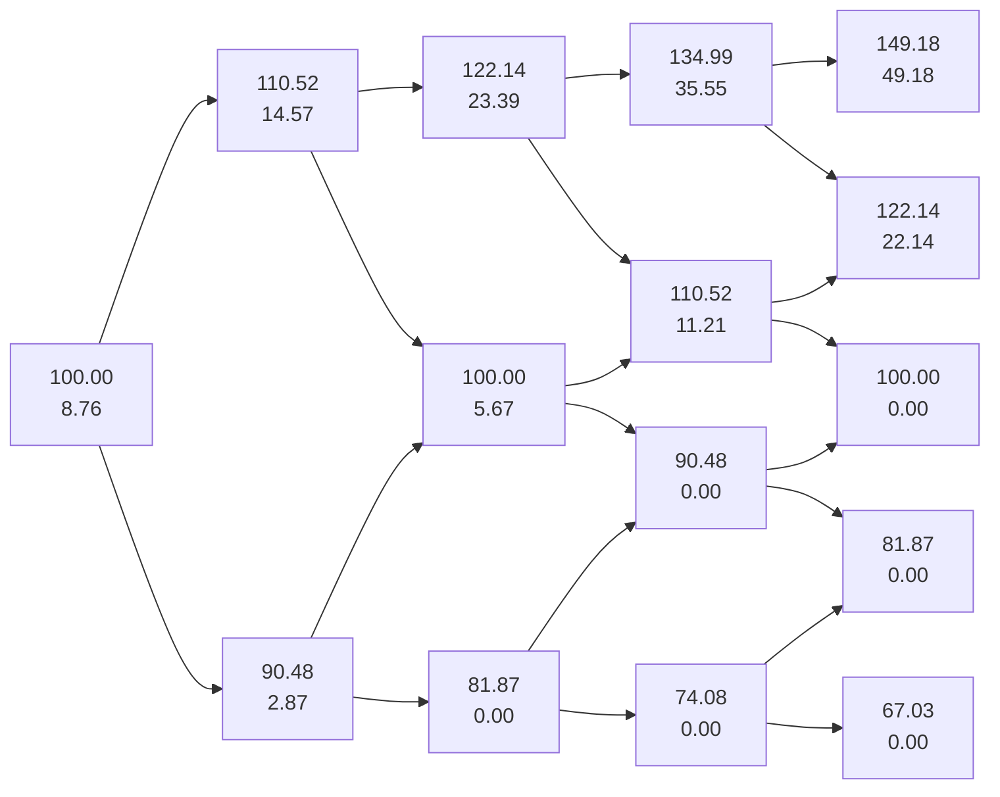
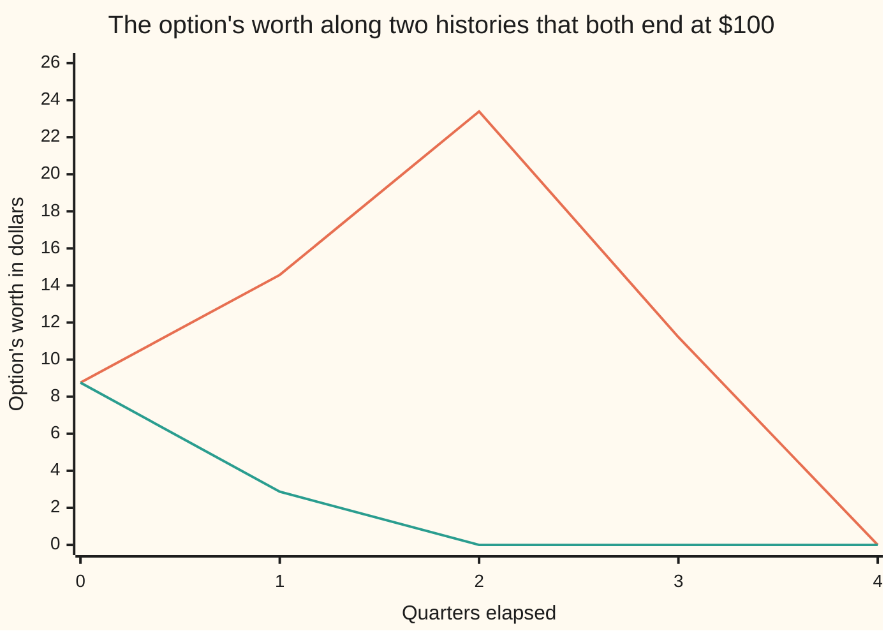

# Many steps: price at the end, roll back one step at a time

Financial mathematics → Binomial Trees → Backward induction → Many steps

---

## General Overview

Acme trades at $100. A call option on it — the right, but not the duty, to buy one share for $100 in a year — was priced on [one-step-binomial-replication](01-one-step-binomial-replication.md) by letting the year be a single coin flip: Acme ends at $122.14 or at $81.87, nothing else. That tree says $11.07.

Two ending prices is a thin picture of a year. Cut the year into four quarters instead. Each quarter Acme multiplies by 1.105171 or by 0.904837, the up and down factors that carry its 20 percent yearly jumpiness over a three-month step. Now there are sixteen histories and five ending prices, from $67.03 to $149.18. The same option comes out at **$8.76**.

The middle of that tree cannot be priced directly. The end can. On expiry day the option's worth is not a matter of opinion: it is the payoff, $22.14 at an ending price of $122.14, zero at $100. So fill in the last column from the payoff, treat every node in the column before it as a one-step problem whose two answers are now written down, and replace it by its one-step price. Keep going leftwards until only today is left. That walk is **backward induction**, and it is the whole method.

One walk, two results. The number at the root is the price. The numbers along the way are the trading plan: at every node the tree says how many Acme shares to hold and how much to borrow, so the copy funds itself to expiry without another dollar going in.

**Fill the last column with the payoff, then replace every node by the one-step price of the two nodes it leads to, and keep going until only today is left.**

**What kind of fact this is:** a method, resting on the one-step replication theorem of the earlier card applied over and over; the induction that licenses the repetition is proved on this card in Why it works.

### The picture: four quarters of Acme, priced backwards

Top number is Acme's price at that node, bottom number is what the option is worth there.



Arrows run forward in time; the numbers were filled in against them, from the right edge back. Where two arrows land on one box, an up quarter then a down has reached the same price as a down then an up.

---

## The formula

Notation first, in words. A node is fixed by two counts: how many steps have passed, and how many of those were up moves. Write the step count below the letter and the up count in brackets after it, so $V$ with a step of 2 and an up count of 1 is the option's worth after two quarters, one up and one down. The step length is written $\Delta t$, read "delta t", and those two letters always travel together; $\Delta$ alone, with no t, means the number of shares held.

$$V_N(j) = \max\big(S_N(j) - K,\ 0\big), \qquad S_n(j) = S\,u^{\,j}\,d^{\,n-j}$$

$$V_n(j) = e^{-r\Delta t}\Big[p\,V_{n+1}(j+1) + (1-p)\,V_{n+1}(j)\Big]$$

**Read it aloud:** the last column is the payoff; every other node is worth the two nodes it leads to, weighted by the risk-neutral coin and pulled back one step of interest.

The trading plan comes off the same pair:

$$\Delta_n(j) = e^{-q\Delta t}\,\frac{V_{n+1}(j+1) - V_{n+1}(j)}{S_{n+1}(j+1) - S_{n+1}(j)}, \qquad B_n(j) = V_n(j) - \Delta_n(j)\,S_n(j)$$

**Read it aloud:** hold the gap between the option's two possible values divided by the gap between Acme's two possible prices, shaved for the dividends those shares pay meanwhile; borrow the rest.

| Symbol | Plain meaning | In our example | Push it up and the answer… |
| --- | --- | --- | --- |
| $S$ | Acme's price today | $100 | rises: more to receive |
| $K$ | the strike, the price you may buy at | $100 | falls: further to climb |
| $T$, $N$, $n$, $j$ | the life in years; the number of steps; a step count; a count of up moves | 1 year, 4 steps | more steps: a finer picture |
| $\Delta t$ | one step's length, $T/N$, in years | 0.25 | coarser steps, a rougher price |
| $u$, $d$ | what Acme multiplies by on an up step and on a down step | 1.105171 and 0.904837 | wider branches, a dearer option |
| $p$ | the risk-neutral weight on an up step: a price, not a forecast | 0.512599 | up branches count for more |
| $r$ | the riskless rate, continuously compounded | 5% | rises: paying the strike later costs less today |
| $q$ | the dividend yield the shares pay out | 2% | falls: dividends leak out of the share price |
| $\sigma$ | volatility, how jumpy Acme is. Say "sigma". | 20% | rises: wider branches, a dearer option |
| $V$, $U$, $L$ | the worth at a node, and at the upper and lower nodes it leads to | $8.76 at the root | — |
| $\Delta$ | shares of Acme held against one option. Say "delta". | 0.5812 today | more of the move comes through |
| $B$ | cash in the bank at a node; negative means borrowed | −$49.36 today | — |

Three helpers feed the formulas. The step length is $\Delta t = T/N$, a quarter-year here. The branch factors are $u = e^{\sigma\sqrt{\Delta t}}$ and $d = 1/u$, the Cox–Ross–Rubinstein choice; why that pair is [crr-tree-and-convergence](04-crr-tree-and-convergence.md). The weight is $p = (e^{(r-q)\Delta t} - d)/(u - d)$, built on [risk-neutral-probability](02-risk-neutral-probability.md): the number making Acme's average growth on the tree equal the bank's, once dividends are off.

### When it holds

- **Two prices per step, and only two.** If Acme can gap to a third, the two-equation solve has no answer, the copy misses, and the tree quotes a price nobody can trade at.
- **The same factors at every node.** A constant volatility and rate keep $u$, $d$ and $p$ the same everywhere, which is what lets the tree fold back on itself. Let them vary and the tree can stop recombining; the walk still works, the node count stops being cheap.
- **Acme's own growth strictly between the branches**, $d < e^{(r-q)\Delta t} < u$ — the bank's rate less what dividends leak out, not the bank's own factor $e^{r\Delta t}$. Otherwise $p$ falls outside 0 to 1, one branch is free money, and no price is defensible.
- **Trading at every node, at no cost, in any fraction of a share**, borrowing and lending at $r$. Real costs make the copy dearer than the quoted price.
- **A payoff that depends on where you are, not how you got there.** Merging two histories into one node is legal only where they are worth the same from there on, as the merge test in Why it works shows.

---

## Why it works

### Step 0: the end is the only place the answer is known for free

At expiry there is nothing left to model. The option is worth what it pays: Acme's price minus $100, or nothing, whichever is larger. That is the whole of the last column, and every other number on the tree is built from it. Pricing is easy at the end and hard in the middle, so the work is arranged to run from the end.

### Step 1: one step back is the previous card's problem, unchanged

Take any node with one step to go. Acme sits at some price, and next step it is at that price times $u$ or times $d$. The option's two next values, the upper $U$ and the lower $L$, are already written down.

Hold $\Delta$ shares and $B$ dollars in the bank. Over the step, dividends are ploughed back into more shares, so $\Delta$ shares become $\Delta e^{q\Delta t}$ shares, and the bank balance grows to $B e^{r\Delta t}$. Demand that the pile is worth $U$ on an up step and $L$ on a down step. Two demands, two unknowns, one answer:

$$\Delta = e^{-q\Delta t}\,\frac{U - L}{S u - S d}, \qquad B = e^{-r\Delta t}\,\frac{uL - dU}{u - d}.$$

Assembling that pile today costs $\Delta S + B$, and anything else would be free money, so that cost is the node's value. Multiply out and the two pieces collapse into the weighted average at the top of this card. The weight $p$ falls out of the algebra; nobody chose it as a probability.

<details>
<summary>Detailed proof: the two-equation solve, and why the rolling copy never needs new money</summary>

Write $S$ for Acme's price at the node. The two demands are
$$\Delta e^{q\Delta t} S u + B e^{r\Delta t} = U, \qquad \Delta e^{q\Delta t} S d + B e^{r\Delta t} = L.$$
Subtracting kills the bank term and gives $\Delta e^{q\Delta t} S (u-d) = U - L$, hence the displayed $\Delta$; since $u > d > 0$ and $S > 0$ the divisor is never zero. Substituting back gives $B e^{r\Delta t} = (uL - dU)/(u-d)$. Putting the pair into either demand reproduces it, so a solution exists; subtracting two candidate solutions gives back the same $\Delta$ and $B$, so it is the only one.

Cost today:
$$\Delta S + B = \frac{e^{-q\Delta t}(U - L)}{u-d} + e^{-r\Delta t}\frac{uL - dU}{u-d} = \frac{e^{-r\Delta t}}{u-d}\Big[e^{(r-q)\Delta t}(U-L) + uL - dU\Big],$$
where the first term was put over $e^{-r\Delta t}$ by multiplying and dividing by $e^{r\Delta t}$. Collecting the $U$ and $L$ terms gives $e^{-r\Delta t}[pU + (1-p)L]$ with $p = (e^{(r-q)\Delta t} - d)/(u-d)$ exactly.

Now the induction. Suppose every node one step on already carries the cost of copying the option from there to expiry. At the current node buy the $\Delta$ and $B$ above for $V = \Delta S + B$. One step on, whichever way Acme moved, the pile is worth that node's $V$ by construction — exactly what its own hedge costs. The old holdings are sold and the new ones bought with the proceeds, no outside money changing hands: the copy is **self-financing**. The last column is the payoff, the cost of copying over zero remaining steps, so the supposition holds there, and therefore one column at a time back to the root. The two demands force the holdings at every node, so the copy is also the only one.

</details>

### Step 2: the same problem again, and again

Nothing in Step 1 used the fact that the node was one step from expiry, only that the two next values were known. Once the last column is filled the second-to-last is known, and then the one before it. Each pass makes one more column known: that is the word "backward".

The forward version is the one a trader lives: buy the root's holdings for $8.76, then at every node sell what you hold and buy what the next node prescribes. The check below runs that walk down all sixteen histories and lands on the payoff every time, worst miss 0.000000.

### Step 3: why the tree folds back on itself

Because $d = 1/u$, an up quarter then a down multiplies Acme by one: straight back to $100.00. Up-then-down and down-then-up are different histories arriving at the same price. A tree keeping them apart doubles its ending count every step; a tree merging them gains one. After four steps that is sixteen against five; after fifty, about a thousand trillion against fifty-one. **Recombining** is the name for the merge, and it is what makes trees usable rather than a curiosity.

The merge costs some bookkeeping about how many histories reach each node. Two ups out of four can be arranged six ways; the counts across the five ending prices run 1, 4, 6, 4, 1. Those are counts of lattice paths to a corner, read off in [lattice-paths](../../04-Combinatorics%20and%20graphs/06-Lattice%20Paths%20and%20Catalan%20Numbers/01-lattice-paths.md). The backward walk never computes them: merging counts automatically, since each merged node serves both parents.

### Step 4: the same number, written as one average

Because the walk is linear, unrolling it gives a single sum over the five ending prices, each weighted by its path count and by the chance of that many ups:

$$V_0 = e^{-rT} \sum_{j=0}^{N} \binom{N}{j}\, p^{\,j}(1-p)^{N-j} \max\big(S u^{\,j} d^{\,N-j} - K,\ 0\big).$$

Here $\binom{N}{j}$, said "N choose j", counts the ways to pick which steps were the up moves. The check computes the price this way too and gets 8.760327, the backward walk's figure. The sum is the walk multiplied out; the walk is how to do the sum without writing it down.

### What merging costs when the histories differ

Change the contract. Instead of a call, take a promise to pay $10 at the end of the year if Acme's *first* quarter was an up move, and nothing otherwise.

After two quarters, up-then-down and down-then-up both sit at $100.00. But the promise is already worth $9.7531 on the first history — the payment is certain, only a half-year of discounting remains — and $0.0000 on the second. One node cannot hold two numbers. Merge them and it reads $4.8765, the average, and the hedge read off it says to hold 0.1635 shares where the truth on either history is none.

Today's price survives: the two histories meeting there carry equal weight, so the average taken inside the node is the average the whole tree takes anyway. The node values and the trading plan do not survive. Hence the rule: merge only where the histories meeting at a node are worth the same from there on.

### The other route

Instead of rolling back, sum forward: list all sixteen histories, give each the product of its $p$ and $1-p$ weights, multiply by what it pays, add, discount. The check does this too and gets 8.760327. It scales badly — the count doubles every step — but it merges nothing, so it is the honest way to price a contract that pays on the route rather than the destination, and the road that becomes simulation for bigger problems.

---

## Worked numbers, by hand

Acme at $S = 100$, strike $K = 100$, riskless rate $r = 5\%$, dividend yield $q = 2\%$, volatility $\sigma = 20\%$, one year in four steps. The arithmetic runs on factors rounded to six figures.

| Step | Arithmetic | Value |
| --- | --- | --- |
| step length | $1 / 4$ | $0.25$ years |
| up factor | $e^{0.20\sqrt{0.25}} = e^{0.10}$ | $1.105171$ |
| down factor | $1 / 1.105171$ | $0.904837$ |
| one step of discounting | $e^{-0.05 \times 0.25}$ | $0.987578$ |
| the weight | $(e^{0.03 \times 0.25} - 0.904837)/(1.105171 - 0.904837)$ | $0.512599$ |
| ending prices | $100 \times 1.105171^{\,j} \times 0.904837^{\,4-j}$ | $67.03,\ 81.87,\ 100.00,\ 122.14,\ 149.18$ |
| ending payoffs | price minus $100$, floored at zero | $0,\ 0,\ 0,\ 22.14,\ 49.18$ |
| three steps in, three ups | $0.987578 \times (0.512599 \times 49.18 + 0.487401 \times 22.14)$ | $\$35.55$ |
| three steps in, two ups | $0.987578 \times (0.512599 \times 22.14 + 0.487401 \times 0)$ | $\$11.21$ |
| two steps in, same rule | from $35.55$ and $11.21$, then from $11.21$ and $0$ | $\$23.39$, $\$5.67$ |
| one step in, same rule | from $23.39$ and $5.67$, then from $5.67$ and $0$ | $\$14.57$, $\$2.87$ |
| **today** | $0.987578 \times (0.512599 \times 14.57 + 0.487401 \times 2.87)$ | **$\$8.76$** |

So the four-step tree charges $8.76 for a one-year call on Acme struck at today's price. Three readings confirm it is doing arithmetic and not wishful thinking: rolling back a payoff of "one Acme share" gives $98.019867, which is $S e^{-qT}$ to the last digit; the put on the same tree, $5.863402, sits exactly a forward apart from the call, $8.760327 - 5.863402 = 2.896925$; and the hedge carried forward hits the payoff on all sixteen histories.

Four steps is still coarse. The continuous formula on [black-scholes-call](../08-The%20Black-Scholes%20call%20and%20put/01-black-scholes-call.md) gives $9.227006 for the same option; one step gave $11.073541; five hundred steps give $9.223118. The tree overshoots and undershoots by turns as steps are added, and why that wobble happens is [crr-tree-and-convergence](04-crr-tree-and-convergence.md).

### What breaks if you drop a piece

Same tree, correct answer $8.76.

| Mistake | Comes out at | What went wrong |
| --- | --- | --- |
| A fair coin, weight 0.5 | $8.19 | Real-world odds have no business in a price. The weight is set by where the bank's growth sits between the branches, not by a view on Acme. |
| Dividend left out of the weight | $9.97 | Acme is made to drift at 5% instead of 3%, so every node is too high; $1.21 of the answer is pure bookkeeping error. |
| The five ending prices averaged equally | $13.57 | The middle price is reached six ways, the top price one way. Ignoring the counts 1, 4, 6, 4, 1 overweights the extremes. |
| Merging histories that differ from there on | node reads $4.88 | The truth is $9.75 on one history, $0.00 on the other. The merged node's hedge is 0.1635 shares where neither history needs any. |

Every number in that table is printed by the code below.

---

## How the value and the hedge move through the tree

Two histories, four quarters each, both ending at exactly $100.00 with the option worthless. Up, up, down, down. And down, down, up, up. Same start, same finish, same payoff — yet along the way one was worth $23.39 and the other nothing by the halfway mark.

That is not a paradox, it is what a price is. After two quarters the first history has Acme at $122.14 with half a year left; the second has it at $81.87. An option is a claim on the future from wherever you are standing, and those two places are not alike.

### One story, traced

Follow the first history, buying the copy at the root and rebalancing at each node.

| Point | Acme | Option worth | Shares held | Cash in the bank |
| --- | --- | --- | --- | --- |
| today | $100.00 | $8.76 | 0.5812 | −$49.36 |
| after one up | $110.52 | $14.57 | 0.7964 | −$73.44 |
| after up, up | $122.14 | $23.39 | 0.9900 | −$97.53 |
| after up, up, down | $110.52 | $11.21 | 0.9950 | −$98.76 |
| expiry, down again | $100.00 | $0.00 | — | — |

Read the first row across: 0.5812 shares of a $100 stock is $58.12 of Acme, less $49.36 borrowed, is $8.76 — the price. Every later row is what the row above is worth once Acme has moved, with not a cent added or taken out. The last row is the payoff: nothing, the shares sold paying off the loan to the dollar.

### One force at a time: where the shares go

Shares of Acme held against one option, down the all-up history and the all-down history. A full bar is one share.

```
  start, Acme $100.00           █████████████████              0.5812
  up, Acme $110.52              ████████████████████████       0.7964
  up up, Acme $122.14           ██████████████████████████████ 0.9900
  up up up, Acme $134.99        ██████████████████████████████ 0.9950
  down, Acme $90.48             █████████                      0.3114
  down down, Acme $81.87                                       0.0000
  down down down, Acme $74.08                                  0.0000
```

The copy starts a little over half a share, then commits or retreats. Climb, and it walks toward holding the stock outright: the option is turning into the share. Fall, and it sells out. It never quite reaches a whole share, and the shortfall is not rounding: 0.9950 is a full share shaved by the quarter's dividends, which the option holder does not receive and so must not pay for.

### Both histories in one picture



Upper line: up, up, down, down. Lower line: down, down, up, up. Same $8.76 at the start, same $0.00 at the end, nothing in common between.

---

## Code, from first principles, and it actually runs

Nothing is imported that already knows the answer. The price is reached five ways: the backward roll with the weight $p$; the same roll done by solving for shares and cash at every node, where $p$ never appears; a sum over the five ending prices with path counts built from scratch; a walk down all sixteen histories one at a time; and the road-two holdings carried forward down every history, to see whether they land on the payoff. A sixth routine, written for any step count, must return that same four-step price and must land within a cent of the Black-Scholes figure at five hundred steps: that pair is what ties the branch factors to the volatility. The share itself and the put go through the same machine as cross-checks, and every wrong number above is reproduced.

### Python

```python
# Multi-step binomial tree, priced by backward induction -- the check behind the
# card.  Standard library only; nothing imported that already knows the answer.
# Acme: S = 100, K = 100, r = 5%, q = 2%, sigma = 20%, one year cut into four
# quarterly steps.  Five roads to one price: the backward roll with the risk-
# neutral weight; the same roll done by solving for shares and cash, with no
# weight anywhere; a sum over the five end prices with path counts; a sum over
# all sixteen histories; and the hedge carried forward down every one of them.
from math import exp, sqrt

S, K, r, q, sigma, T, N = 100.0, 100.0, 0.05, 0.02, 0.20, 1.0, 4
BS = 9.227005508154                        # the same option, priced by the formula card
dt = T / N
u = exp(sigma * sqrt(dt))                  # up factor for one step
d = 1.0 / u                                # down factor, its reciprocal
disc = exp(-r * dt)                        # one step of discounting
grow = exp(q * dt)                         # dividends reinvested over one step
p = (exp((r - q) * dt) - d) / (u - d)      # the risk-neutral weight
paths = [tuple((m >> i) & 1 for i in range(N)) for m in range(2 ** N)]

def spot(step, ups): return S * u ** ups * d ** (step - ups)   # Acme's price at a node

def call(x): return max(x - K, 0.0)        # what the call pays at an end price

def roll(weight, pay):                     # road 1: roll a payoff back with a weight
    layers = [[pay(spot(N, k)) for k in range(N + 1)]]
    for j in range(N - 1, -1, -1):
        nxt = layers[0]
        layers.insert(0, [disc * (weight * nxt[k + 1] + (1.0 - weight) * nxt[k])
                          for k in range(j + 1)])
    return layers

def replicate():                           # road 2: shares and cash; no weight is used
    layers, shares, banks = [[call(spot(N, k)) for k in range(N + 1)]], [], []
    for j in range(N - 1, -1, -1):
        nxt, sh, ba, vals = layers[0], [], [], []
        for k in range(j + 1):
            s0 = spot(j, k)
            delta = (nxt[k + 1] - nxt[k]) / (grow * s0 * (u - d))
            bank = disc * (u * nxt[k] - d * nxt[k + 1]) / (u - d)
            sh.append(delta); ba.append(bank); vals.append(delta * s0 + bank)
        shares.insert(0, sh); banks.insert(0, ba); layers.insert(0, vals)
    return layers, shares, banks

def choose(n, k):                          # path counts, built here
    out = 1
    for i in range(k):
        out = out * (n - i) // (i + 1)
    return out

def tree_price(steps, strike, vol):        # the same machine at other settings
    h = T / steps
    uu = exp(vol * sqrt(h)); dd = 1.0 / uu
    ww = (exp((r - q) * h) - dd) / (uu - dd); ds = exp(-r * h)
    row = [max(S * uu ** k * dd ** (steps - k) - strike, 0.0) for k in range(steps + 1)]
    for j in range(steps - 1, -1, -1):
        row = [ds * (ww * row[k + 1] + (1.0 - ww) * row[k]) for k in range(j + 1)]
    return row[0]

def first_up(j, k):                        # $10 at expiry if the first quarter was up
    vals = [disc ** (N - j) * (10.0 if pp[0] else 0.0) for pp in paths if sum(pp[:j]) == k]
    return sum(vals) / len(vals)

def show(rows):
    for name, v in rows: print(f"{name:<45}{v:12.6f}")

lat = roll(p, call)
rep, shares, banks = replicate()
v_roll, v_rep = lat[0][0], rep[0][0]
v_nodes = disc ** N * sum(choose(N, k) * p ** k * (1 - p) ** (N - k) * call(spot(N, k))
                          for k in range(N + 1))
v_hist, mass = 0.0, 0.0
for path in paths:                         # road 4: walk each history from today
    price, w = S, 1.0
    for mv in path:
        price, w = (price * u, w * p) if mv else (price * d, w * (1.0 - p))
    v_hist += w * call(price); mass += w
v_hist *= disc ** N
worst = 0.0                                # road 5: carry the hedge forward
for path in paths:
    k, wealth = 0, v_rep
    for j, mv in enumerate(path):
        delta = shares[j][k]
        bank = wealth - delta * spot(j, k)
        k += mv
        wealth = delta * grow * spot(j + 1, k) + bank / disc
    worst = max(worst, abs(wealth - call(spot(N, k))))
v_share, v_put = roll(p, lambda x: x)[0][0], roll(p, lambda x: max(K - x, 0.0))[0][0]
share_now, parity = S * exp(-q * T), S * exp(-q * T) - K * exp(-r * T)
v_fair = roll(0.5, call)[0][0]                              # a fair coin instead
v_noq = roll((exp(r * dt) - d) / (u - d), call)[0][0]       # dividend left out
v_flat = disc ** N * sum(call(spot(N, k)) for k in range(N + 1)) / (N + 1)
node_ud, node_du, node_mix = disc ** (N - 2) * 10.0, 0.0, first_up(2, 1)
hedge_mix = (first_up(3, 2) - first_up(3, 1)) / (grow * spot(2, 1) * (u - d))

print(f"Acme {S:.2f}, strike {K:.2f}, r {r:.0%}, q {q:.0%}, sigma {sigma:.0%}, {N} steps in {T:.0f} year")
print(f"step {dt:.6f} yr   up {u:.6f}   down {d:.6f}   weight p {p:.6f}   step discount {disc:.6f}")
print()
print("node table: step, ups, Acme, option value, hedge in shares, cash in the bank")
for j in range(N):
    for k in range(j + 1):
        print(f"  step {j} ups {k}   Acme {spot(j, k):7.2f}   option {lat[j][k]:6.2f}"
              f"   hedge {shares[j][k]:7.4f}   cash {banks[j][k]:8.2f}")
print("  step 4 Acme   " + " ".join(f"{spot(N, k):8.2f}" for k in range(N + 1)))
print("  step 4 payoff " + " ".join(f"{call(spot(N, k)):8.2f}" for k in range(N + 1)))
print()
show([("road 1  backward roll with the weight p", v_roll), ("road 2  backward replication, no weight", v_rep),
      ("road 3  five end prices with path counts", v_nodes), ("road 4  sixteen histories, one at a time", v_hist),
      ("road 5  hedge carried forward, worst miss", worst), ("        path weights add to", mass)])
print(f"        path counts across the end prices  {[choose(N, k) for k in range(N + 1)]}")
show([("        the share itself rolled back", v_share), ("        S e^-qT", share_now),
      ("        the put on the same tree", v_put), ("        call minus put", v_roll - v_put),
      ("        S e^-qT - K e^-rT", parity), ("        one step across the same year", tree_price(1, K, sigma)),
      ("        the same roll at 500 steps", tree_price(500, K, sigma)),
      ("        Black-Scholes reference, same option", BS)])
print()
show([("wrong: a fair coin, p = 0.5", v_fair), ("wrong: dividend left out of the weight", v_noq),
      ("wrong: five end prices weighted equally", v_flat)])
print(f"merge test, $10 if the first quarter was up: after up-down {node_ud:.4f},"
      f" after down-up {node_du:.4f}, merged {node_mix:.4f}")
print(f"merge test, merged hedge {hedge_mix:.4f} shares where both histories need 0.0000")
print()
print("chart, step                     0       1       2       3       4")
print("chart, up-up-down-down     " + " ".join(f"{lat[j][k]:7.2f}" for j, k in ((0, 0), (1, 1), (2, 2), (3, 2))) + f" {0.0:7.2f}")
print("chart, down-down-up-up     " + " ".join(f"{lat[j][k]:7.2f}" for j, k in ((0, 0), (1, 0), (2, 0), (3, 1))) + f" {0.0:7.2f}")
print("bars,  hedge up history    " + " ".join(f"{shares[j][k]:7.4f}" for j, k in ((0, 0), (1, 1), (2, 2), (3, 3))))
print("bars,  hedge down history  " + " ".join(f"{shares[j][k]:7.4f}" for j, k in ((0, 0), (1, 0), (2, 0), (3, 0))))
print()
show([("try: eight steps instead of four", tree_price(8, K, sigma)), ("try: strike 120", tree_price(N, 120.0, sigma)),
      ("try: sigma 40%", tree_price(N, K, 0.40))])

assert abs(v_roll - v_rep) < 1e-12, "the weighted roll and the replication roll must agree"
assert abs(v_nodes - v_roll) < 1e-12, "path counts over end prices must match the roll"
assert abs(v_hist - v_roll) < 1e-12, "sixteen histories must match the roll"
assert worst < 1e-9, "the hedge must land on the payoff down every history"
assert abs(mass - 1.0) < 1e-12, "the path weights are a probability"
assert abs(v_share - share_now) < 1e-12, "the share rolled back must be worth S e^-qT today"
assert abs((v_roll - v_put) - parity) < 1e-12, "call minus put on the tree must be the forward"
assert abs(tree_price(N, K, sigma) - v_roll) < 1e-12, "the machine rebuilt from scratch must give the same four-step price"
assert abs(tree_price(500, K, sigma) - BS) < 0.01, "500 steps must land within a cent of the Black-Scholes price"
print("ALL CHECKS PASS")
```

**Ran 2026-09-19 on macOS, Python 3.14.6, standard library only. All checks passed. Output, pasted from the run:**

```
Acme 100.00, strike 100.00, r 5%, q 2%, sigma 20%, 4 steps in 1 year
step 0.250000 yr   up 1.105171   down 0.904837   weight p 0.512599   step discount 0.987578

node table: step, ups, Acme, option value, hedge in shares, cash in the bank
  step 0 ups 0   Acme  100.00   option   8.76   hedge  0.5812   cash   -49.36
  step 1 ups 0   Acme   90.48   option   2.87   hedge  0.3114   cash   -25.31
  step 1 ups 1   Acme  110.52   option  14.57   hedge  0.7964   cash   -73.44
  step 2 ups 0   Acme   81.87   option   0.00   hedge  0.0000   cash     0.00
  step 2 ups 1   Acme  100.00   option   5.67   hedge  0.5567   cash   -49.99
  step 2 ups 2   Acme  122.14   option  23.39   hedge  0.9900   cash   -97.53
  step 3 ups 0   Acme   74.08   option   0.00   hedge  0.0000   cash     0.00
  step 3 ups 1   Acme   90.48   option   0.00   hedge  0.0000   cash     0.00
  step 3 ups 2   Acme  110.52   option  11.21   hedge  0.9950   cash   -98.76
  step 3 ups 3   Acme  134.99   option  35.55   hedge  0.9950   cash   -98.76
  step 4 Acme      67.03    81.87   100.00   122.14   149.18
  step 4 payoff     0.00     0.00     0.00    22.14    49.18

road 1  backward roll with the weight p          8.760327
road 2  backward replication, no weight          8.760327
road 3  five end prices with path counts         8.760327
road 4  sixteen histories, one at a time         8.760327
road 5  hedge carried forward, worst miss        0.000000
        path weights add to                      1.000000
        path counts across the end prices  [1, 4, 6, 4, 1]
        the share itself rolled back            98.019867
        S e^-qT                                 98.019867
        the put on the same tree                 5.863402
        call minus put                           2.896925
        S e^-qT - K e^-rT                        2.896925
        one step across the same year           11.073541
        the same roll at 500 steps               9.223118
        Black-Scholes reference, same option     9.227006

wrong: a fair coin, p = 0.5                      8.189109
wrong: dividend left out of the weight           9.970523
wrong: five end prices weighted equally         13.568859
merge test, $10 if the first quarter was up: after up-down 9.7531, after down-up 0.0000, merged 4.8765
merge test, merged hedge 0.1635 shares where both histories need 0.0000

chart, step                     0       1       2       3       4
chart, up-up-down-down        8.76   14.57   23.39   11.21    0.00
chart, down-down-up-up        8.76    2.87    0.00    0.00    0.00
bars,  hedge up history     0.5812  0.7964  0.9900  0.9950
bars,  hedge down history   0.5812  0.3114  0.0000  0.0000

try: eight steps instead of four                 8.988363
try: strike 120                                  2.451151
try: sigma 40%                                  15.878329
ALL CHECKS PASS
```

The two rolls agree to twelve decimals although the second never forms the weight, and the hedge lands on the payoff exactly down all sixteen histories.

### Rust

Same numbers, same labels, built with `rustc --edition 2021 -O`, std only.

```rust
// Multi-step binomial tree, priced by backward induction -- the same check as
// multi_step_trees_and_backward_induction_check.py, in Rust.  std only, no
// crates.  Acme: S = 100, K = 100, r = 5%, q = 2%, sigma = 20%, one year cut
// into four quarterly steps.  Five roads to one price: the backward roll with
// the risk-neutral weight; the same roll done by solving for shares and cash,
// with no weight anywhere; a sum over the five end prices with path counts; a
// sum over all sixteen histories; and the hedge carried forward down every one.
const S: f64 = 100.0; const K: f64 = 100.0; const R: f64 = 0.05; const Q: f64 = 0.02;
const SIGMA: f64 = 0.20; const T: f64 = 1.0; const N: usize = 4;
const BS: f64 = 9.227005508154; // the same option, priced by the formula card

fn dt() -> f64 { T / N as f64 }
fn up() -> f64 { (SIGMA * dt().sqrt()).exp() }      // up factor for one step
fn dn() -> f64 { 1.0 / up() }                       // down factor, its reciprocal
fn disc() -> f64 { (-R * dt()).exp() }              // one step of discounting
fn grow() -> f64 { (Q * dt()).exp() }               // dividends reinvested over one step
fn weight() -> f64 { (((R - Q) * dt()).exp() - dn()) / (up() - dn()) }
fn call(x: f64) -> f64 { (x - K).max(0.0) }
fn spot(step: usize, ups: usize) -> f64 { S * up().powf(ups as f64) * dn().powf((step - ups) as f64) }
fn roll<F: Fn(f64) -> f64>(w: f64, pay: F) -> Vec<Vec<f64>> {   // road 1: roll a payoff back
    let mut layers: Vec<Vec<f64>> = vec![(0..=N).map(|k| pay(spot(N, k))).collect()];
    for j in (0..N).rev() {
        let nxt = layers[0].clone();
        layers.insert(0, (0..=j).map(|k| disc() * (w * nxt[k + 1] + (1.0 - w) * nxt[k])).collect());
    }
    layers
}

fn replicate() -> (Vec<Vec<f64>>, Vec<Vec<f64>>, Vec<Vec<f64>>) {   // road 2: shares and cash
    let mut layers: Vec<Vec<f64>> = vec![(0..=N).map(|k| call(spot(N, k))).collect()];
    let (mut shares, mut banks): (Vec<Vec<f64>>, Vec<Vec<f64>>) = (Vec::new(), Vec::new());
    for j in (0..N).rev() {
        let nxt = layers[0].clone();
        let (mut sh, mut ba, mut vals) = (Vec::new(), Vec::new(), Vec::new());
        for k in 0..=j {
            let s0 = spot(j, k);
            let delta = (nxt[k + 1] - nxt[k]) / (grow() * s0 * (up() - dn()));
            let bank = disc() * (up() * nxt[k] - dn() * nxt[k + 1]) / (up() - dn());
            sh.push(delta); ba.push(bank); vals.push(delta * s0 + bank);
        }
        shares.insert(0, sh); banks.insert(0, ba); layers.insert(0, vals);
    }
    (layers, shares, banks)
}

fn choose(n: usize, k: usize) -> i64 {              // path counts, built here
    let mut out: i64 = 1;
    for i in 0..k { out = out * (n - i) as i64 / (i + 1) as i64 }
    out
}
fn tree_price(steps: usize, strike: f64, vol: f64) -> f64 {   // the same machine, other settings
    let h = T / steps as f64;
    let (uu, ds) = ((vol * h.sqrt()).exp(), (-R * h).exp());
    let dd = 1.0 / uu;
    let ww = (((R - Q) * h).exp() - dd) / (uu - dd);
    let mut row: Vec<f64> = (0..=steps)
        .map(|k| (S * uu.powf(k as f64) * dd.powf((steps - k) as f64) - strike).max(0.0))
        .collect();
    for j in (0..steps).rev() {
        row = (0..=j).map(|k| ds * (ww * row[k + 1] + (1.0 - ww) * row[k])).collect();
    }
    row[0]
}

fn first_up(j: usize, k: usize, paths: &[Vec<usize>]) -> f64 {   // $10 if the first quarter was up
    let vals: Vec<f64> = paths.iter().filter(|pp| pp[..j].iter().sum::<usize>() == k)
        .map(|pp| disc().powf((N - j) as f64) * if pp[0] == 1 { 10.0 } else { 0.0 }).collect();
    vals.iter().sum::<f64>() / vals.len() as f64
}

fn show(rows: &[(&str, f64)]) { for (name, v) in rows { println!("{:<45}{:12.6}", name, v) } }
fn join(v: &[f64], w: usize, p: usize) -> String {
    v.iter().map(|x| format!("{:>w$.p$}", x, w = w, p = p)).collect::<Vec<_>>().join(" ")
}
fn main() {
    let paths: Vec<Vec<usize>> = (0..(1usize << N))
        .map(|m| (0..N).map(|i| (m >> i) & 1).collect()).collect();
    let p = weight();
    let lat = roll(p, call);
    let (rep, shares, banks) = replicate();
    let (v_roll, v_rep) = (lat[0][0], rep[0][0]);
    let v_nodes = disc().powf(N as f64) * (0..=N).map(|k| choose(N, k) as f64
        * p.powf(k as f64) * (1.0 - p).powf((N - k) as f64) * call(spot(N, k))).sum::<f64>();
    let (mut v_hist, mut mass) = (0.0, 0.0);
    for path in &paths {                            // road 4: walk each history from today
        let (mut price, mut w) = (S, 1.0);
        for mv in path {
            if *mv == 1 { price *= up(); w *= p } else { price *= dn(); w *= 1.0 - p }
        }
        v_hist += w * call(price); mass += w;
    }
    v_hist *= disc().powf(N as f64);
    let mut worst: f64 = 0.0;                       // road 5: carry the hedge forward
    for path in &paths {
        let (mut k, mut wealth) = (0usize, v_rep);
        for (j, mv) in path.iter().enumerate() {
            let delta = shares[j][k];
            let bank = wealth - delta * spot(j, k);
            k += mv;
            wealth = delta * grow() * spot(j + 1, k) + bank / disc();
        }
        worst = worst.max((wealth - call(spot(N, k))).abs());
    }
    let v_share = roll(p, |x| x)[0][0];
    let v_put = roll(p, |x| (K - x).max(0.0))[0][0];
    let share_now = S * (-Q * T).exp();
    let parity = S * (-Q * T).exp() - K * (-R * T).exp();
    let v_fair = roll(0.5, call)[0][0];                                     // a fair coin instead
    let v_noq = roll(((R * dt()).exp() - dn()) / (up() - dn()), call)[0][0]; // dividend left out
    let v_flat = disc().powf(N as f64)
        * (0..=N).map(|k| call(spot(N, k))).sum::<f64>() / (N + 1) as f64;
    let (node_ud, node_du, node_mix) = (disc().powf((N - 2) as f64) * 10.0, 0.0, first_up(2, 1, &paths));
    let hedge_mix = (first_up(3, 2, &paths) - first_up(3, 1, &paths))
        / (grow() * spot(2, 1) * (up() - dn()));

    println!("Acme {:.2}, strike {:.2}, r {:.0}%, q {:.0}%, sigma {:.0}%, {} steps in {:.0} year",
             S, K, R * 100.0, Q * 100.0, SIGMA * 100.0, N, T);
    println!("step {:.6} yr   up {:.6}   down {:.6}   weight p {:.6}   step discount {:.6}",
             dt(), up(), dn(), p, disc());
    println!();
    println!("node table: step, ups, Acme, option value, hedge in shares, cash in the bank");
    for j in 0..N {
        for k in 0..=j {
            println!("  step {} ups {}   Acme {:7.2}   option {:6.2}   hedge {:7.4}   cash {:8.2}",
                     j, k, spot(j, k), lat[j][k], shares[j][k], banks[j][k]);
        }
    }
    let ends: Vec<f64> = (0..=N).map(|k| spot(N, k)).collect();
    println!("  step 4 Acme   {}", join(&ends, 8, 2));
    println!("  step 4 payoff {}", join(&ends.iter().map(|x| call(*x)).collect::<Vec<f64>>(), 8, 2));
    println!();
    show(&[("road 1  backward roll with the weight p", v_roll), ("road 2  backward replication, no weight", v_rep),
           ("road 3  five end prices with path counts", v_nodes), ("road 4  sixteen histories, one at a time", v_hist),
           ("road 5  hedge carried forward, worst miss", worst), ("        path weights add to", mass)]);
    println!("        path counts across the end prices  {:?}",
             (0..=N).map(|k| choose(N, k)).collect::<Vec<i64>>());
    show(&[("        the share itself rolled back", v_share), ("        S e^-qT", share_now),
           ("        the put on the same tree", v_put), ("        call minus put", v_roll - v_put),
           ("        S e^-qT - K e^-rT", parity), ("        one step across the same year", tree_price(1, K, SIGMA)),
           ("        the same roll at 500 steps", tree_price(500, K, SIGMA)),
           ("        Black-Scholes reference, same option", BS)]);
    println!();
    show(&[("wrong: a fair coin, p = 0.5", v_fair), ("wrong: dividend left out of the weight", v_noq),
           ("wrong: five end prices weighted equally", v_flat)]);
    println!("merge test, $10 if the first quarter was up: after up-down {:.4}, after down-up {:.4}, merged {:.4}",
             node_ud, node_du, node_mix);
    println!("merge test, merged hedge {:.4} shares where both histories need 0.0000", hedge_mix);
    println!();
    println!("chart, step                     0       1       2       3       4");
    let upw: Vec<f64> = vec![lat[0][0], lat[1][1], lat[2][2], lat[3][2], 0.0];
    let dnw: Vec<f64> = vec![lat[0][0], lat[1][0], lat[2][0], lat[3][1], 0.0];
    println!("chart, up-up-down-down     {}", join(&upw, 7, 2));
    println!("chart, down-down-up-up     {}", join(&dnw, 7, 2));
    println!("bars,  hedge up history    {}", join(&[shares[0][0], shares[1][1], shares[2][2], shares[3][3]], 7, 4));
    println!("bars,  hedge down history  {}", join(&[shares[0][0], shares[1][0], shares[2][0], shares[3][0]], 7, 4));
    println!();
    show(&[("try: eight steps instead of four", tree_price(8, K, SIGMA)), ("try: strike 120", tree_price(N, 120.0, SIGMA)),
           ("try: sigma 40%", tree_price(N, K, 0.40))]);

    assert!((v_roll - v_rep).abs() < 1e-12, "the weighted roll and the replication roll must agree");
    assert!((v_nodes - v_roll).abs() < 1e-12, "path counts over end prices must match the roll");
    assert!((v_hist - v_roll).abs() < 1e-12, "sixteen histories must match the roll");
    assert!(worst < 1e-9, "the hedge must land on the payoff down every history");
    assert!((mass - 1.0f64).abs() < 1e-12, "the path weights are a probability");
    assert!((v_share - share_now).abs() < 1e-12, "the share rolled back must be worth S e^-qT today");
    assert!(((v_roll - v_put) - parity).abs() < 1e-12, "call minus put on the tree must be the forward");
    assert!((tree_price(N, K, SIGMA) - v_roll).abs() < 1e-12, "the machine rebuilt from scratch must give the same four-step price");
    assert!((tree_price(500, K, SIGMA) - BS).abs() < 0.01, "500 steps must land within a cent of the Black-Scholes price");
    println!("ALL CHECKS PASS");
}
```

**Ran 2026-09-19 on macOS, rustc 1.98.1, no crates. All checks passed. Output, pasted from the run:**

```
Acme 100.00, strike 100.00, r 5%, q 2%, sigma 20%, 4 steps in 1 year
step 0.250000 yr   up 1.105171   down 0.904837   weight p 0.512599   step discount 0.987578

node table: step, ups, Acme, option value, hedge in shares, cash in the bank
  step 0 ups 0   Acme  100.00   option   8.76   hedge  0.5812   cash   -49.36
  step 1 ups 0   Acme   90.48   option   2.87   hedge  0.3114   cash   -25.31
  step 1 ups 1   Acme  110.52   option  14.57   hedge  0.7964   cash   -73.44
  step 2 ups 0   Acme   81.87   option   0.00   hedge  0.0000   cash     0.00
  step 2 ups 1   Acme  100.00   option   5.67   hedge  0.5567   cash   -49.99
  step 2 ups 2   Acme  122.14   option  23.39   hedge  0.9900   cash   -97.53
  step 3 ups 0   Acme   74.08   option   0.00   hedge  0.0000   cash     0.00
  step 3 ups 1   Acme   90.48   option   0.00   hedge  0.0000   cash     0.00
  step 3 ups 2   Acme  110.52   option  11.21   hedge  0.9950   cash   -98.76
  step 3 ups 3   Acme  134.99   option  35.55   hedge  0.9950   cash   -98.76
  step 4 Acme      67.03    81.87   100.00   122.14   149.18
  step 4 payoff     0.00     0.00     0.00    22.14    49.18

road 1  backward roll with the weight p          8.760327
road 2  backward replication, no weight          8.760327
road 3  five end prices with path counts         8.760327
road 4  sixteen histories, one at a time         8.760327
road 5  hedge carried forward, worst miss        0.000000
        path weights add to                      1.000000
        path counts across the end prices  [1, 4, 6, 4, 1]
        the share itself rolled back            98.019867
        S e^-qT                                 98.019867
        the put on the same tree                 5.863402
        call minus put                           2.896925
        S e^-qT - K e^-rT                        2.896925
        one step across the same year           11.073541
        the same roll at 500 steps               9.223118
        Black-Scholes reference, same option     9.227006

wrong: a fair coin, p = 0.5                      8.189109
wrong: dividend left out of the weight           9.970523
wrong: five end prices weighted equally         13.568859
merge test, $10 if the first quarter was up: after up-down 9.7531, after down-up 0.0000, merged 4.8765
merge test, merged hedge 0.1635 shares where both histories need 0.0000

chart, step                     0       1       2       3       4
chart, up-up-down-down        8.76   14.57   23.39   11.21    0.00
chart, down-down-up-up        8.76    2.87    0.00    0.00    0.00
bars,  hedge up history     0.5812  0.7964  0.9900  0.9950
bars,  hedge down history   0.5812  0.3114  0.0000  0.0000

try: eight steps instead of four                 8.988363
try: strike 120                                  2.451151
try: sigma 40%                                  15.878329
ALL CHECKS PASS
```

The two outputs match line for line, from two programs that share no code.

> [!TIP]
> **Try changing**
> Guess the direction first, then run it.
> - **Double the steps.** Set `N = 8`: **$8.99**, not smoothly toward the formula's $9.23 but in a wobble that takes many more steps to settle.
> - **Raise the strike.** Call `tree_price(4, 120.0, 0.20)`: **$2.45**. Only the top two of the five endings clear $120, and 149.18 carries most of the price on its own.
> - **Double the jumpiness.** Call `tree_price(4, 100.0, 0.40)`: **$15.88**. Wider branches, a fatter fan of endings, a dearer option.
> - **Use a fair coin.** Change the `p` line to `p = 0.5`: $8.19, and the first assert stops the program, because the replication road still uses the real branch factors and no longer agrees.

---

## The usual mistake

> [!warning]
> **Reading the tree as a forecast.** The up and down factors are not where anyone thinks Acme is going, and the weight 0.512599 is not how likely an up quarter is. They are the numbers that make the copy fund itself. Put a real forecast in — a fair coin, say — and the price changes to $8.19 while the trade that funds the payoff does not change at all. The tree is a costing exercise wearing the clothes of a probability.
>
> - **Averaging the ending prices without the path counts.** Five endings, but not five equal futures: the counts are 1, 4, 6, 4, 1. Treat them as equal and the option comes out at $13.57.
> - **Dropping the dividend.** Acme must drift at $r - q$, not $r$. Leave $q$ out of the weight and the price reads $9.97; leave it out of the hedge as well and a node where Acme has climbed far above the strike holds a whole share instead of 0.9950.
> - **Merging histories that are not alike from there on.** A recombining node claims that any route into it leaves you in the same position — false for a payoff that looks at the route, and then the node values go wrong even where the price does not.
> - **Trusting a coarse tree's price to the cent.** The method is exact for the tree it is given; whether that tree is a good picture of Acme is the next card's question.

---

## Where you meet it in real life

- **Every listed American option.** The right to exercise early is one extra comparison at each node: the rolled-back value against the payoff from cashing in there and then. Backward induction is what makes that question askable, and it is asked on [american-exercise-on-a-tree](05-american-exercise-on-a-tree.md).
- **The hedge ratio on a trading screen.** The 0.5812 at the root is delta, quoted per option. Reading it off a tree rather than a formula is [greeks-from-a-tree-or-grid](../07-Greeks%20by%20Numbers%20and%20Calibration/04-greeks-from-a-tree-or-grid.md).
- **Grids that are not trees.** Finite-difference schemes solve the same backward problem on a rectangular mesh instead of a fan, with the three-branch step between them: [trinomial-trees-and-the-grid-connection](06-trinomial-trees-and-the-grid-connection.md).
- **Anything decided in stages.** Backward induction is older than option pricing: settle the last decision first, then the one before it knowing what the last will be. It values drilling rights, schedules reservoirs, solves chess endgames.
- **Company accounts.** Employee share options and convertible bonds are valued on trees in filings, for the early-exercise and conversion features no closed formula reaches.

> **Say it back**
> Cut the option's life into steps. At the end its worth is the payoff, known exactly. Every other node is a one-step problem whose two answers are already in hand, so replace it by the cost of copying those two answers with shares and cash — which equals the two values weighted by the risk-neutral number and discounted one step. Walk leftwards: the number at the root is the price, the numbers along the way are the trades. The tree folds back on itself because an up then a down returns to where it started, turning an exploding count of histories into a small grid — legal only while the histories meeting at a node are worth the same from there on.

---

## What this builds on

- [risk-neutral-probability](02-risk-neutral-probability.md): where the weight 0.512599 comes from, and why it is a price rather than a forecast. This card uses it once per node.
- [lattice-paths](../../04-Combinatorics%20and%20graphs/06-Lattice%20Paths%20and%20Catalan%20Numbers/01-lattice-paths.md): the count of routes to a point on a grid, 1, 4, 6, 4, 1 across four steps, which is why five endings are not five equal futures.

## Where this goes next

- [crr-tree-and-convergence](04-crr-tree-and-convergence.md): where $u$ and $d$ come from, and how the price walks from $8.76 toward the continuous answer as steps are added.
- [greeks-from-a-tree-or-grid](../07-Greeks%20by%20Numbers%20and%20Calibration/04-greeks-from-a-tree-or-grid.md): the sensitivities read off neighbouring nodes, delta from the first pair and the curvature from the next.
- [quanto-greeks-and-hedging](../24-Quantos%20and%20composites/03-quanto-greeks-and-hedging.md): the same backward walk when the payoff is in one currency and the asset in another.

Four steps gave $8.76 where the continuous formula gives $9.23, a gap of nearly half a dollar on a nine-dollar option. Whether adding steps closes it, how fast, and why the approach wobbles rather than glides, is the next card.

---

## Sources

Verified 14 Sep 2026: every link below resolves to the publisher's page.

- Cox, John C., Stephen A. Ross, and Mark Rubinstein. "Option Pricing: A Simplified Approach." *Journal of Financial Economics* 7, no. 3 (1979): 229–263. [doi:10.1016/0304-405X(79)90015-1](https://doi.org/10.1016/0304-405X(79)90015-1). The multi-step tree, the backward roll, the branch factors.
- Rendleman, Richard J., and Brit J. Bartter. "Two-State Option Pricing." *The Journal of Finance* 34, no. 5 (1979): 1093–1110. [doi:10.1111/j.1540-6261.1979.tb00058.x](https://doi.org/10.1111/j.1540-6261.1979.tb00058.x). The same construction, published independently that year.
- Shreve, Steven E. *Stochastic Calculus for Finance I: The Binomial Asset Pricing Model.* Springer, 2004. [Publisher page](https://link.springer.com/book/9780387249681). The careful version of the induction and self-financing argument in the folded proof.
- Hull, John C. *Options, Futures, and Other Derivatives*, 11th ed. Pearson. [Publisher page](https://www.pearson.com/en-us/subject-catalog/p/options-futures-and-other-derivatives/P200000005938). The textbook treatment, including dividend yields on a tree.
- Bellman, Richard. *Dynamic Programming*. Princeton University Press, 1957. [Publisher page](https://press.princeton.edu/books/paperback/9780691146683/dynamic-programming). Backward induction as a general method for staged decisions, decades before options.
