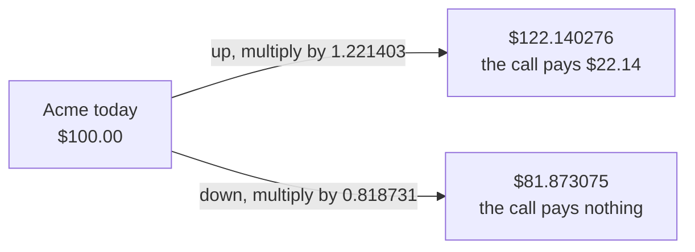
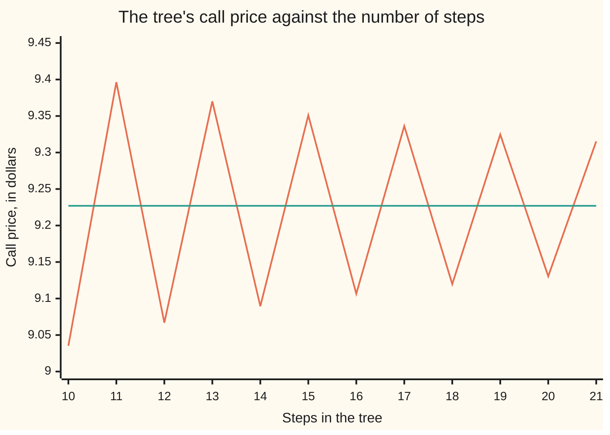

# Cox-Ross-Rubinstein: choosing u and d from volatility, and watching the tree price converge

[Syllabus](../../../SYLLABUS.md) → [Financial mathematics](../../../SYLLABUS.md#w12) → [Binomial Trees](../../../SYLLABUS.md#w12-s04) → Cox-Ross-Rubinstein

---

## General Overview

Acme shares trade at $100.00. A one-year call on them has to be priced: the right, and not the duty, to buy one share for $100.00 a year from today.

A tree prices that call by letting the share step up or down one step at a time, writing down what the option pays at each far end, and walking those values back to today ([Many steps](03-multi-step-trees-and-backward-induction.md)). That card walked the tree without saying where the up and down sizes come from, and everything hangs on them: too narrow and the tree describes a calmer company than Acme, too wide and it describes a wilder one, and either way the option is mispriced.

The market offers one number for how far Acme wanders: its volatility, 20 percent a year, the typical size of one year's move measured in [Logarithms](../../01-Foundations/03-Powers%2C%20Roots%20and%20Logarithms/05-logarithms.md), the scale on which multiplying turns into adding. John Cox, Stephen Ross and Mark Rubinstein published the standard way to turn that one number into branch sizes in 1979.

Their recipe on the crudest tree there is, one step of a whole year: Acme goes up to $122.14 or down to $81.87, and the call comes out at $11.07. Two steps: $8.34. Ten steps: $9.04. Eleven: $9.40. The answer is not creeping towards anything — it is hopping over it. Two thousand steps: **$9.2260**, against the $9.2270 it is chasing.

**Size the branches from volatility alone, let the weight on the up branch carry the drift, and the tree's price closes on the Black-Scholes price — alternately above and below it, never marching neatly in.**

**What kind of fact this is:** a method — a recipe for sizing a tree's steps — resting on a theorem that its prices approach the Black-Scholes price. Why it works does the per-step matching in full and folds the limit's proof.

### The picture: one year, one step



The two multipliers are reciprocals: 1.221403 is e raised to 0.20, and 0.818731 is e raised to minus 0.20. Where the 0.20 comes from is the next section.

---

## The formula

Notation first, in words. A step's length is written $\Delta t$, one symbol for one quantity — a step in years — not two symbols multiplied. A step's *log move* is the amount it adds to the natural logarithm of the share price: an up step adds it, a down step takes it away.

$$u = e^{\sigma\sqrt{\Delta t}}, \qquad d = \frac{1}{u} = e^{-\sigma\sqrt{\Delta t}}, \qquad \Delta t = \frac{T}{n}$$

**Read it aloud:** an up step multiplies the share by e raised to the volatility times the square root of the step, and a down step divides by exactly that.

$$p = \frac{e^{(r-q)\Delta t} - d}{u - d}$$

**Read it aloud:** the weight on the up branch is whatever makes the share's average growth over a step equal the bank's — growth at the riskless rate, the rate money earns with no risk taken — after the dividends that leak out of the price.

| Symbol | Plain meaning | In our example | Push it up and the answer… |
| --- | --- | --- | --- |
| $S$ | Acme's price today | $100.00 | rises: more share to receive |
| $K$ | the strike, the price the option may buy at | $100.00 | falls: further to climb before it pays |
| $T$ | the option's life, in years | 1 | rises: room for a bigger move |
| $n$ | how many steps the tree is chopped into | 1 to 2,001 | closes on the limit, alternating sides |
| $\Delta t$ | one step's length, $T$ divided by $n$ | 1 down to 0.0005 | coarser tree, bigger error |
| $\sigma$ | volatility, the typical size of one year's log move. Say "sigma" | 20% | rises: wider branches, dearer option |
| $r$ | the riskless rate, continuously compounded | 5% | rises: the $100.00 paid later is worth less now |
| $q$ | the dividend yield, continuously compounded | 2% | rises: the up weight falls, and so does the price |
| $e^{-r\Delta t}$ | one step's discount factor: a dollar at the step's end, valued today | 0.951229 on a year-long step | — |
| $u$ | the up factor, the multiplier on an up step | 1.221403 on a year-long step | — |
| $d$ | the down factor, one divided by $u$ | 0.818731 on a year-long step | — |
| $p$ | the weight on the up branch, a pricing weight and not a forecast | 0.525797 on a year-long step | — |
| $C_n$ | the price the $n$-step tree returns | 9.226034 at 2,000 steps | — |

Because $d$ is one divided by $u$, an up followed by a down lands back where it started: the tree *recombines*, and $n$ steps end in $n + 1$ prices rather than two raised to the $n$. The down branch carries the weight left over, one minus $p$ ([The risk-neutral probability](02-risk-neutral-probability.md)).

### When it holds

- **One fixed volatility for the whole life.** Every branch is sized by the same 20 percent. If Acme's volatility moves, the tree prices a share that does not exist, and no number of steps repairs it.
- **The weight has to be a weight.** It lands between 0 and 1 only when the bank's one-step growth sits between the two branches, which needs the size of $r - q$ times the square root of $\Delta t$ to stay under $\sigma$. A share with 2 percent volatility on a year-long step fails that: the formula returns 1.256313, and the tree still hands back a number.
- **Nothing happens between the nodes.** The payoff is read off the end price, and the holder cannot act early — letting them act is one extra comparison per node, on [Early exercise](05-american-exercise-on-a-tree.md). A dividend paid on a date rather than as a yield knocks the recombination out: [Known cash dividends](../08-The%20Black-Scholes%20call%20and%20put/08-known-cash-dividends.md).
- **Convergence is about the limit, not any one tree.** It certifies no step count, and the section on how the price moves shows why eyeballing a few is dangerous.

---

## Why it works

### Step 0: a tree only has to match two numbers

Prices multiply rather than add, so the quantity to track is the logarithm of the price, where multiplying becomes adding. The continuous model says the log of Acme's price in a year is spread like a bell curve, with a particular centre and a particular spread.

A tree cannot be a bell curve; it has finitely many ends. But it can match that centre and that spread, and the *shape* arrives on its own, because many small two-way moves pile up into a bell curve ([Normal approximation](../../09-Probability%20and%20statistics/06-Limit%20Theorems%20in%20Practice/03-normal-approximation-to-binomial.md)). Two dials, two targets: the branch size carries the spread, the weight the centre.

### Step 1: the branch size carries the volatility

Set one step's log move to $\sigma\sqrt{\Delta t}$: up adds it, down subtracts it. Spread, from here on, means the average squared distance from the middle. With equal weights the two outcomes sit symmetrically about the middle, so the spread of that move is the size squared, $\sigma^2\Delta t$.

Spreads of independent moves add, so $n$ steps give $\sigma^2 T$: over Acme's year, 20 percent squared, whatever $n$ is. That is why the square root is there: halve the step and the move shrinks by one over root two, not by half, because it is the *squares* that must add up to the year.

### Step 2: the weight carries the drift

Now the centre. Demand that the share's average growth over one step equals the bank's growth after dividends leak out:

$$p\,u + (1-p)\,d = e^{(r-q)\Delta t}$$

One equation, one unknown, and rearranged it is the $p$ from The formula. On a year-long step the bank's growth after dividends is 1.030455, the branches are 1.221403 and 0.818731, and the weight is 0.525797: a hair over a coin flip, and a pricing weight rather than a forecast ([The risk-neutral probability](02-risk-neutral-probability.md)).

The demand holds at the far end too, not only step by step: averaging the 2,001 end prices of the 2,000-step tree with their weights gives 103.045453, to the last printed digit the forward price — what the share is worth for delivery in a year, $S e^{(r-q)T}$.

### Step 3: what the two choices actually deliver, per step

The weights are not equal, so Step 1's clean statement is slightly off. With weight $p$ on a move of size $\sigma\sqrt{\Delta t}$, the average log move is that size times $2p - 1$, and the spread is the size squared minus the average squared. Expand both for a small step: the average is $(r - q - \tfrac12\sigma^2)\Delta t$ and the spread $\sigma^2\Delta t$, each off by a remainder the size of $\Delta t$ squared — the centre and spread the continuous model asks for, with an error that shrinks faster than the step.

On a 10-step tree the checks print a drift per year of 0.010032 against a target of 0.010000, and a spread of 0.999748 of $\sigma^2\Delta t$ against a predicted 0.999750; on a 2,000-step tree both agree to six decimals.

<details>
<summary>The algebra behind the expansion, if you want it</summary>

The weight, written out in full, is
$$p = \frac{e^{(r-q)\Delta t} - e^{-\sigma\sqrt{\Delta t}}}{e^{\sigma\sqrt{\Delta t}} - e^{-\sigma\sqrt{\Delta t}}}.$$
Expand all three exponentials in powers of the step, remembering that the move squared is $\sigma^2\Delta t$, one order higher than the move. The top is $\sigma\sqrt{\Delta t} + (r - q - \tfrac12\sigma^2)\Delta t + \dots$, the bottom $2\sigma\sqrt{\Delta t} + \tfrac13\sigma^3\Delta t\sqrt{\Delta t} + \dots$. Dividing,
$$p = \frac12 + \frac{r - q - \tfrac12\sigma^2}{2\sigma}\sqrt{\Delta t} + \dots$$
Twice the weight minus one is then $(r - q - \tfrac12\sigma^2)\sqrt{\Delta t}/\sigma$, so the average log move is $(r - q - \tfrac12\sigma^2)\Delta t$ plus a remainder of order $\Delta t$ squared. The spread is the move squared minus that average squared, $\sigma^2\Delta t - (r - q - \tfrac12\sigma^2)^2\Delta t^2$: as a fraction of the target, short by $((r - q - \tfrac12\sigma^2)/\sigma)^2\Delta t$, which for Acme is 0.0025 times the step. On a 10-step tree that is 0.000250, the predicted 0.999750 against the 0.999748 measured.

</details>

### Step 4: many steps pile up into the bell curve

The log of the end price is a sum of $n$ moves, each up or down by the same amount, each weighted by $p$. Step 3 pinned one move's average and spread, and both add over the $n$ steps: the sum has centre $(r - q - \tfrac12\sigma^2)T$ and spread $\sigma^2 T$, each missed by a remainder that shrinks with the step. At 10 steps the centre is out by 0.000032, a third of a percent of the drift it aims at; at 2,000 steps by nothing the six printed decimals can show.

What changes most with $n$ is the shape, and a sum of many two-way moves fills in towards a bell curve ([Normal approximation](../../09-Probability%20and%20statistics/06-Limit%20Theorems%20in%20Practice/03-normal-approximation-to-binomial.md)). So the end price stops being 2,001 spikes and becomes the distribution the Black-Scholes formula averages the payoff over: same centre, same spread, same shape, same price.

<details>
<summary>Detailed proof: matching the distribution is not quite enough</summary>

Step 4 settles the *distribution* of the end price and says nothing about the *average of the payoff*. Those differ: a payment of a thousand dollars with a chance of one in a thousand shrinks to nothing as a distribution while keeping an average of one dollar. A call's payoff is unbounded, so the gap needs closing.

**A ceiling for every tree at once.** The branches multiply to one, so either branch squared equals the sum of the branches times that branch, minus one. Take weighted averages, using that a branch averages $e^{(r-q)\Delta t}$ by construction: the average squared end price after $n$ steps is
$$S^2\left((u + d)\,e^{(r-q)\Delta t} - 1\right)^{n}.$$
The two branches added come to $2 + \sigma^2\Delta t$ plus a smaller remainder, so the bracket is at most one plus a constant times $\Delta t$, the constant built from $\sigma$, $r - q$ and $T$ alone, and that raised to the $n$ is at most e raised to the constant times $T$. Every tree therefore holds its average squared end price under one fixed ceiling.

**Cap the payoff.** A payoff capped at a large amount sits between two staircases built from finitely many bets of the form "does the share finish above this level". Convergence of the distribution prices every one of those bets correctly in the limit, so the capped average converges, and shrinking the stair height makes the squeeze exact.

**Remove the cap.** What the cap discards is at most the end price squared divided by the cap, so the ceiling turns it into a fixed number divided by the cap — the same for every tree and for the limit. Letting the cap grow kills it for all of them at once.

Nothing here proves a *rate*, and nothing says a tree's hedge holdings or exercise decisions converge.

</details>

**The other route.** Two dials and two targets can be set other ways: give both branches weight one half, let the up and down moves differ in size, and the same targets are met by a tree that wobbles to a different tune. A third branch, letting the share stay put, adds a spare dial — [Trinomial trees](06-trinomial-trees-and-the-grid-connection.md).

---

## Worked numbers, by hand

Acme on a tree: $S = 100$, $K = 100$, $r = 5\%$, $q = 2\%$, $\sigma = 20\%$, $T = 1$ year. One step first: at a step of a whole year the entire method is four multiplications.

| Step | Arithmetic | Value |
| --- | --- | --- |
| the log move, $0.20 \times \sqrt{1}$ | up factor e raised to 0.2, down factor its reciprocal | 1.221403 and 0.818731 |
| the two end prices | $100 \times 1.221403$, $100 \times 0.818731$ | 122.140276 and 81.873075 |
| what the call pays there | $122.140276 - 100$, nothing below | 22.140276 |
| bank growth after dividends | e raised to $(0.05 - 0.02)$ | 1.030455 |
| the weight on the up branch | $(1.030455 - 0.818731) / (1.221403 - 0.818731)$ | 0.525797 |
| one step's discount | e raised to $-0.05$ | 0.951229 |
| **the one-step price** | $0.951229 \times 0.525797 \times 22.140276$ | **11.073541** |
| two steps, same recipe | $\Delta t = 0.5$, up factor 1.151910, weight 0.517959 | **8.342293** |
| 2,000 steps, same recipe | by machine | **9.226034** |
| Black-Scholes, the limit | the continuous price being chased | **9.227006** |

One step says $11.07, two steps $8.34, the truth $9.23. A tree that coarse is not a rough answer; it is a different share, one that can finish at only two prices.

### What breaks if you drop a piece

Every line below is a 2,000-step tree with one piece changed. The right answer is 9.226034.

| Mistake | Comes out at | What went wrong |
| --- | --- | --- |
| Dividend left out of the weight | 10.449584 | The share now grows at 5 percent, not 3, so this prices a call on a company that pays nothing out |
| Move sized $\sigma\Delta t$, not $\sigma\sqrt{\Delta t}$ | 2.896925 | At 2,000 steps the branches are 45 times too narrow; only the discounted forward gain is left |
| A fair coin, weight 0.5 | 8.651564 | The weight is the only place the drift lives, and a fair coin grows the share at 2 percent |
| Stopping at 10 steps | 9.035326 | 19 cents low, where 11 steps would have been 17 cents high |

The code prints all four.

---

## How the price moves as the tree gets finer

Ten steps: $9.04. Eleven: $9.40. Twelve: $9.07. Thirteen: $9.37. Adding a step does not improve the answer, it flips it to the other side. Anyone who prices at 20 steps, prices again at 21, and reads 9.13 then 9.32 is right to suspect a bug. There is none. Two forces are at work, one at a time below.

| Steps | Tree price | Error against 9.227006 |
| --- | --- | --- |
| 10 | 9.035326 | -0.191680 |
| 11 | 9.396402 | +0.169397 |
| 100 | 9.207590 | -0.019416 |
| 1,000 | 9.225062 | -0.001944 |
| 2,000 | 9.226034 | -0.000972 |
| 2,001 | 9.227928 | +0.000923 |

### Force one: where the end nodes fall against the strike

The payoff has a kink at $100.00: flat below, sloping above, and the tree sees that kink only through the end prices it happens to own.

Acme starts at the strike, and an up followed by a down returns to the start, so an *even* number of steps lands an end node exactly on the kink — the two-step tree ends at 132.689644, 100.000000 and 75.363832 — while an *odd* number straddles it. Even trees come out below the limit, odd trees above, with no exception in the checks: of every consecutive pair of step counts from 10 to 41, all 31 land on opposite sides.

That gives a free trick. Average the $n$-step price with the $n + 1$-step price and the errors largely cancel: at 2,000 and 2,001 steps the average is 9.226981, an error of -0.000025 against -0.000972 for 2,000 steps alone. Forty times closer, for one extra run.

### Force two: doubling the steps halves the error

Ignore the flipping sign and look at the size. One block is one tenth of a cent:

```
steps   distance from 9.227006, one block = 0.001 dollars
   50   ███████████████████████████████████████  -0.038781
  100   ███████████████████                      -0.019416
  250   ████████                                 -0.007772
  500   ████                                     -0.003887
 1000   ██                                       -0.001944
 2000   █                                        -0.000972
```

Every doubling of the step count halves the distance: the error falls like one over $n$, not one over $n$ squared, which is why 2,000 steps buys three decimal places and not six. It is also why averaging pays, the leading part of the error being the same size on both sides.

### Both forces in one picture



The zigzag is the tree price, step count by step count; the flat line is the Black-Scholes price it is closing on. The teeth alternate below and above, and shrink towards the line as the count rises.

---

## Code, from first principles, and it actually runs

Nothing is imported that already knows the answer: the area under the bell curve is Simpson's rule written out, in both languages. The tree price comes by two roads that share only the step sizes and the weight — the backward walk node by node, and a single weighted average over the end prices, each end weighted by how many paths reach it times the weight each path carries — compared at every step count quoted here. The limit is reached twice too, by formula and by brute-force averaging of the payoff. Three more checks pin the model rather than the code: the average end price against the forward, and the per-step drift and spread against Step 3.

### Python

```python
# Cox-Ross-Rubinstein -- the check behind the card.  Nothing is imported that
# already knows the answer: the area under the bell curve is Simpson's rule
# written out here, and the limit the tree chases is reached twice.  Acme:
# S = 100, K = 100, r = 5%, q = 2%, sigma = 20%, one year, a call.
from math import exp, log, pi, sqrt

S, K, R, Q, SIG, T = 100.0, 100.0, 0.05, 0.02, 0.20, 1.0
HOUSE = 9.227005508154                  # the shelf's Black-Scholes call price

def phi(x):                             # bell-curve height at x
    return exp(-0.5 * x * x) / sqrt(2.0 * pi)

def simpson(f, a, b, n):                # area under f from a to b, n panels
    h = (b - a) / n
    s = f(a) + f(b)
    for i in range(1, n):
        s += (4.0 if i % 2 else 2.0) * f(a + i * h)
    return s * h / 3.0

def ncdf(x):                            # area under the bell curve left of x
    return 0.5 + simpson(phi, 0.0, x, 2000)

def bs_call():                          # road 3: the continuous formula
    vt = SIG * sqrt(T)
    d1 = (log(S / K) + (R - Q + 0.5 * SIG * SIG) * T) / vt
    return S * exp(-Q * T) * ncdf(d1) - K * exp(-R * T) * ncdf(d1 - vt)

def bs_slices():                        # road 4: average the payoff by brute force
    def f(z):
        st = S * exp((R - Q - 0.5 * SIG * SIG) * T + SIG * sqrt(T) * z)
        return max(st - K, 0.0) * phi(z)
    return exp(-R * T) * simpson(f, -9.0, 9.0, 36000)

def params(n, root=True, div=True):     # the CRR step: two sizes and a weight
    dt = T / n
    a = SIG * sqrt(dt) if root else SIG * dt      # one step's log move
    u, d = exp(a), exp(-a)
    grow = exp((R - Q) * dt) if div else exp(R * dt)
    return dt, a, u, d, (grow - d) / (u - d), exp(-R * dt)

def tree(n, coin=-1.0, root=True, div=True):      # road 1: walk it backwards
    _, a, _, _, p, disc = params(n, root, div)
    if coin >= 0.0:
        p = coin
    v = [max(S * exp((2 * j - n) * a) - K, 0.0) for j in range(n + 1)]
    for step in range(n, 0, -1):
        for j in range(step):
            v[j] = disc * (p * v[j + 1] + (1.0 - p) * v[j])
    return v[0]

def weights(n):                         # road 2: one weighted sum over the ends
    _, a, _, _, p, _ = params(n)
    w = [0.0] * (n + 1)
    mid = int(n * p)                    # start at the fattest end node, weight 1
    w[mid] = 1.0
    for j in range(mid, n):
        w[j + 1] = w[j] * (n - j) * p / ((j + 1) * (1.0 - p))
    for j in range(mid, 0, -1):
        w[j - 1] = w[j] * j * (1.0 - p) / ((n - j + 1) * p)
    total = price = mean = 0.0
    for j in range(n + 1):
        st = S * exp((2 * j - n) * a)
        total += w[j]
        price += w[j] * max(st - K, 0.0)
        mean += w[j] * st
    return exp(-R * T) * price / total, mean / total

def moments(n):                         # what one step's log move actually does
    dt, a, _, _, p, _ = params(n)
    mean = a * (2.0 * p - 1.0)
    return mean / dt, (a * a - mean * mean) / (SIG * SIG * dt)

def predicted(n):                       # the same two, from the expansion
    drift = R - Q - 0.5 * SIG * SIG
    return drift, 1.0 - (drift / SIG) ** 2 * (T / n)

def row(label, value, tail=""):
    print(f"{label:<46}{value:>11.6f}{tail}")

print(f"Acme on a tree: S {S:.2f}  K {K:.2f}  r 5%  q 2%  sigma 20%  T 1 year, a call")
for label, n in (("one step ", 1), ("two steps", 2)):
    dt, a, u, d, p, disc = params(n)
    ends = [S * exp((2 * j - n) * a) for j in range(n, -1, -1)]
    print(f"{label}  dt {dt:.6f}  u {u:.6f}  d {d:.6f}  grow {exp((R - Q) * dt):.6f}"
          f"  p {p:.6f}  discount {disc:.6f}")
    print("  ends at  " + ", ".join(f"{e:.6f}" for e in ends)
          + f"; the call pays {max(ends[0] - K, 0.0):.6f} at the top")
limit, slices = bs_call(), bs_slices()
forward, mean_2000 = S * exp((R - Q) * T), weights(2000)[1]
row("tree price, 1 step", tree(1))
row("tree price, 2 steps", tree(2))
row("Black-Scholes limit, by formula", limit)
row("the same limit, by brute-force average", slices)
row("tree average end price, 2000 steps", mean_2000)
row("the forward, S e^(r-q)T", forward)
print()
print("steps  tree price  weighted sum   error vs the limit")
gap, priced = 0.0, {}
for n in [10, 11, 12, 13, 14, 15, 16, 17, 18, 19, 20, 21,
          50, 100, 250, 500, 1000, 2000, 2001]:
    c, (w, _) = tree(n), weights(n)
    priced[n], gap = c, max(gap, abs(c - w))
    print(f"{n:>5}  {c:>10.6f}  {w:>12.6f}   {c - limit:>+12.6f}")
print("chart, steps 10 to 21, tree price to the cent")
print("  " + "  ".join(f"{priced[n]:.2f}" for n in range(10, 22)) + f"   the limit {limit:.2f}")
print()
pair = 0.5 * (priced[2000] + priced[2001])
row("average of the 2000- and 2001-step prices", pair)
row("its error, where 2000 steps alone is off by", pair - limit,
    f"   (2000 steps: {priced[2000] - limit:+.6f})")
straddle = sum(1 for n in range(10, 41)
               if (tree(n) - limit) * (tree(n + 1) - limit) < 0.0)
print(f"{'consecutive step counts on opposite sides, 10 to 41':<46}{straddle:>11d} of 31")
for n in (10, 2000):
    drift, spread = moments(n)
    p_drift, p_spread = predicted(n)
    row(f"one step log drift / dt, {n} steps", drift, f"   predicted {p_drift:.6f}")
    row(f"one step spread / (sigma^2 dt), {n} steps", spread, f"   predicted {p_spread:.6f}")
print()
row("wrong: dividend left out of p, 2000 steps", tree(2000, div=False))
row("wrong: jump sigma*dt, not sigma*sqrt(dt)", tree(2000, root=False))
row("wrong: a fair coin, p = 0.5, 2000 steps", tree(2000, coin=0.5))
row("wrong: stopping at 10 steps, calling it done", priced[10])
thin = 0.02                                    # a share that hardly moves at all
bad_p = (exp((R - Q) * T) - exp(-thin)) / (exp(thin) - exp(-thin))
row("wrong: sigma 2% on a year-long step, p =", bad_p)
assert bad_p > 1.0                             # too few steps and p stops being a weight
assert gap < 1e-9                              # recursion vs one weighted sum
assert abs(limit - HOUSE) < 1e-9               # own formula vs the house price
assert abs(slices - limit) < 1e-7              # brute-force average vs formula
assert abs(mean_2000 - forward) < 1e-9         # the tree's average end price is the forward
assert abs(priced[2000] - limit) < 1e-3        # 2000 steps, inside a tenth of a cent
assert abs(priced[2000] - limit) < abs(priced[250] - limit) < abs(priced[10] - limit)
assert straddle == 31                          # every consecutive pair straddles
assert abs(pair - limit) < 0.05 * abs(priced[2000] - limit)
assert all(abs(moments(n)[0] - predicted(n)[0]) < 1e-3 * T / n for n in (10, 250, 2000))
assert all(abs(moments(n)[1] - predicted(n)[1]) < 1e-3 * T / n for n in (10, 250, 2000))
print("ALL CHECKS PASS")
```

**Ran 2026-09-19 on macOS, Python 3.14.6, standard library only. All checks passed. Output, pasted from the run:**

```
Acme on a tree: S 100.00  K 100.00  r 5%  q 2%  sigma 20%  T 1 year, a call
one step   dt 1.000000  u 1.221403  d 0.818731  grow 1.030455  p 0.525797  discount 0.951229
  ends at  122.140276, 81.873075; the call pays 22.140276 at the top
two steps  dt 0.500000  u 1.151910  d 0.868123  grow 1.015113  p 0.517959  discount 0.975310
  ends at  132.689644, 100.000000, 75.363832; the call pays 32.689644 at the top
tree price, 1 step                              11.073541
tree price, 2 steps                              8.342293
Black-Scholes limit, by formula                  9.227006
the same limit, by brute-force average           9.227006
tree average end price, 2000 steps             103.045453
the forward, S e^(r-q)T                        103.045453

steps  tree price  weighted sum   error vs the limit
   10    9.035326      9.035326      -0.191680
   11    9.396402      9.396402      +0.169397
   12    9.066862      9.066862      -0.160144
   13    9.370163      9.370163      +0.143157
   14    9.089495      9.089495      -0.137511
   15    9.350957      9.350957      +0.123951
   16    9.106526      9.106526      -0.120479
   17    9.336291      9.336291      +0.109286
   18    9.119806      9.119806      -0.107200
   19    9.324728      9.324728      +0.097722
   20    9.130450      9.130450      -0.096556
   21    9.315376      9.315376      +0.088371
   50    9.188225      9.188225      -0.038781
  100    9.207590      9.207590      -0.019416
  250    9.219233      9.219233      -0.007772
  500    9.223118      9.223118      -0.003887
 1000    9.225062      9.225062      -0.001944
 2000    9.226034      9.226034      -0.000972
 2001    9.227928      9.227928      +0.000923
chart, steps 10 to 21, tree price to the cent
  9.04  9.40  9.07  9.37  9.09  9.35  9.11  9.34  9.12  9.32  9.13  9.32   the limit 9.23

average of the 2000- and 2001-step prices        9.226981
its error, where 2000 steps alone is off by     -0.000025   (2000 steps: -0.000972)
consecutive step counts on opposite sides, 10 to 41         31 of 31
one step log drift / dt, 10 steps                0.010032   predicted 0.010000
one step spread / (sigma^2 dt), 10 steps         0.999748   predicted 0.999750
one step log drift / dt, 2000 steps              0.010000   predicted 0.010000
one step spread / (sigma^2 dt), 2000 steps       0.999999   predicted 0.999999

wrong: dividend left out of p, 2000 steps       10.449584
wrong: jump sigma*dt, not sigma*sqrt(dt)         2.896925
wrong: a fair coin, p = 0.5, 2000 steps          8.651564
wrong: stopping at 10 steps, calling it done     9.035326
wrong: sigma 2% on a year-long step, p =         1.256313
ALL CHECKS PASS
```

### Rust

Same numbers, same labels, built with `rustc --edition 2021 -O`.

```rust
// Cox-Ross-Rubinstein -- the same check as the Python, in Rust.  No crates.
// Nothing here already knows the answer either: the area under the bell curve
// is Simpson's rule written out, and the limit the tree chases is reached
// twice.  Acme: S = 100, K = 100, r = 5%, q = 2%, sigma = 20%, one year, a call.
use std::collections::BTreeMap;
use std::f64::consts::PI;

const S: f64 = 100.0;
const K: f64 = 100.0;
const R: f64 = 0.05;
const Q: f64 = 0.02;
const SIG: f64 = 0.20;
const T: f64 = 1.0;
const HOUSE: f64 = 9.227005508154;      // the shelf's Black-Scholes call price

fn phi(x: f64) -> f64 { (-0.5 * x * x).exp() / (2.0 * PI).sqrt() }   // height at x

fn simpson<F: Fn(f64) -> f64>(f: F, a: f64, b: f64, n: usize) -> f64 {
    let h = (b - a) / n as f64;         // area under f from a to b, n panels
    let mut s = f(a) + f(b);
    for i in 1..n {
        s += if i % 2 == 1 { 4.0 } else { 2.0 } * f(a + i as f64 * h);
    }
    s * h / 3.0
}

fn ncdf(x: f64) -> f64 { 0.5 + simpson(phi, 0.0, x, 2000) }   // bell-curve area left of x

fn bs_call() -> f64 {                   // road 3: the continuous formula
    let vt = SIG * T.sqrt();
    let d1 = ((S / K).ln() + (R - Q + 0.5 * SIG * SIG) * T) / vt;
    S * (-Q * T).exp() * ncdf(d1) - K * (-R * T).exp() * ncdf(d1 - vt)
}

fn bs_slices() -> f64 {                 // road 4: average the payoff by brute force
    let f = |z: f64| {
        let st = S * ((R - Q - 0.5 * SIG * SIG) * T + SIG * T.sqrt() * z).exp();
        (st - K).max(0.0) * phi(z)
    };
    (-R * T).exp() * simpson(f, -9.0, 9.0, 36000)
}

fn params(n: usize, root: bool, div: bool) -> [f64; 6] {
    let dt = T / n as f64;              // the CRR step: two sizes and a weight
    let a = if root { SIG * dt.sqrt() } else { SIG * dt };   // one step's log move
    let (u, d) = (a.exp(), (-a).exp());
    let grow = if div { ((R - Q) * dt).exp() } else { (R * dt).exp() };
    [dt, a, u, d, (grow - d) / (u - d), (-R * dt).exp()]
}

fn tree(n: usize, coin: f64, root: bool, div: bool) -> f64 {
    let [_, a, _, _, mut p, disc] = params(n, root, div);     // road 1: backwards
    if coin >= 0.0 { p = coin; }
    let mut v: Vec<f64> = (0..=n)
        .map(|j| (S * ((2.0 * j as f64 - n as f64) * a).exp() - K).max(0.0))
        .collect();
    for step in (1..=n).rev() {
        for j in 0..step { v[j] = disc * (p * v[j + 1] + (1.0 - p) * v[j]); }
    }
    v[0]
}

fn weights(n: usize) -> (f64, f64) {    // road 2: one weighted sum over the ends
    let [_, a, _, _, p, _] = params(n, true, true);
    let mut w = vec![0.0f64; n + 1];
    let mid = (n as f64 * p) as usize;  // start at the fattest end node, weight 1
    w[mid] = 1.0;
    for j in mid..n { w[j + 1] = w[j] * (n - j) as f64 * p / ((j + 1) as f64 * (1.0 - p)); }
    for j in (1..=mid).rev() { w[j - 1] = w[j] * j as f64 * (1.0 - p) / ((n - j + 1) as f64 * p); }
    let (mut total, mut price, mut mean) = (0.0, 0.0, 0.0);
    for j in 0..=n {
        let st = S * ((2.0 * j as f64 - n as f64) * a).exp();
        total += w[j];
        price += w[j] * (st - K).max(0.0);
        mean += w[j] * st;
    }
    ((-R * T).exp() * price / total, mean / total)
}

fn moments(n: usize) -> (f64, f64) {    // what one step's log move actually does
    let [dt, a, _, _, p, _] = params(n, true, true);
    let mean = a * (2.0 * p - 1.0);
    (mean / dt, (a * a - mean * mean) / (SIG * SIG * dt))
}

fn predicted(n: usize) -> (f64, f64) {  // the same two, from the expansion
    let drift = R - Q - 0.5 * SIG * SIG;
    (drift, 1.0 - (drift / SIG).powi(2) * (T / n as f64))
}

fn row(label: &str, value: f64, tail: &str) { println!("{:<46}{:>11.6}{}", label, value, tail); }

fn main() {
    println!("Acme on a tree: S {:.2}  K {:.2}  r 5%  q 2%  sigma 20%  T 1 year, a call", S, K);
    for (label, n) in [("one step ", 1usize), ("two steps", 2)] {
        let [dt, a, u, d, p, disc] = params(n, true, true);
        let ends: Vec<f64> = (0..=n).rev()
            .map(|j| S * ((2.0 * j as f64 - n as f64) * a).exp()).collect();
        println!("{}  dt {:.6}  u {:.6}  d {:.6}  grow {:.6}  p {:.6}  discount {:.6}",
                 label, dt, u, d, ((R - Q) * dt).exp(), p, disc);
        println!("  ends at  {}; the call pays {:.6} at the top",
                 ends.iter().map(|e| format!("{:.6}", e)).collect::<Vec<_>>().join(", "),
                 (ends[0] - K).max(0.0));
    }
    let (limit, slices) = (bs_call(), bs_slices());
    let forward = S * ((R - Q) * T).exp();
    let mean_2000 = weights(2000).1;
    row("tree price, 1 step", tree(1, -1.0, true, true), "");
    row("tree price, 2 steps", tree(2, -1.0, true, true), "");
    row("Black-Scholes limit, by formula", limit, "");
    row("the same limit, by brute-force average", slices, "");
    row("tree average end price, 2000 steps", mean_2000, "");
    row("the forward, S e^(r-q)T", forward, "");
    println!();
    println!("steps  tree price  weighted sum   error vs the limit");
    let (mut gap, mut priced) = (0.0f64, BTreeMap::new());
    for n in [10usize, 11, 12, 13, 14, 15, 16, 17, 18, 19, 20, 21,
              50, 100, 250, 500, 1000, 2000, 2001] {
        let (c, w) = (tree(n, -1.0, true, true), weights(n).0);
        priced.insert(n, c);
        gap = gap.max((c - w).abs());
        println!("{:>5}  {:>10.6}  {:>12.6}   {:>+12.6}", n, c, w, c - limit);
    }
    println!("chart, steps 10 to 21, tree price to the cent");
    println!("  {}   the limit {:.2}", (10..22).map(|n| format!("{:.2}", priced[&n]))
             .collect::<Vec<_>>().join("  "), limit);
    println!();
    let pair = 0.5 * (priced[&2000] + priced[&2001]);
    row("average of the 2000- and 2001-step prices", pair, "");
    row("its error, where 2000 steps alone is off by", pair - limit,
        &format!("   (2000 steps: {:+.6})", priced[&2000] - limit));
    let mut straddle = 0;
    for n in 10..41 {
        if (tree(n, -1.0, true, true) - limit) * (tree(n + 1, -1.0, true, true) - limit) < 0.0 {
            straddle += 1;
        }
    }
    println!("{:<46}{:>11} of 31", "consecutive step counts on opposite sides, 10 to 41", straddle);
    for n in [10usize, 2000] {
        let ((drift, spread), (p_drift, p_spread)) = (moments(n), predicted(n));
        row(&format!("one step log drift / dt, {} steps", n), drift,
            &format!("   predicted {:.6}", p_drift));
        row(&format!("one step spread / (sigma^2 dt), {} steps", n), spread,
            &format!("   predicted {:.6}", p_spread));
    }
    println!();
    row("wrong: dividend left out of p, 2000 steps", tree(2000, -1.0, true, false), "");
    row("wrong: jump sigma*dt, not sigma*sqrt(dt)", tree(2000, -1.0, false, true), "");
    row("wrong: a fair coin, p = 0.5, 2000 steps", tree(2000, 0.5, true, true), "");
    row("wrong: stopping at 10 steps, calling it done", priced[&10], "");
    let thin = 0.02;                          // a share that hardly moves at all
    let bad_p = (((R - Q) * T).exp() - (-thin as f64).exp()) / ((thin as f64).exp() - (-thin as f64).exp());
    row("wrong: sigma 2% on a year-long step, p =", bad_p, "");
    assert!(bad_p > 1.0);                         // too few steps and p stops being a weight
    assert!(gap < 1e-9);                          // recursion vs one weighted sum
    assert!((limit - HOUSE).abs() < 1e-9);        // own formula vs the house price
    assert!((slices - limit).abs() < 1e-7);       // brute-force average vs formula
    assert!((mean_2000 - forward).abs() < 1e-9);  // average end price is the forward
    assert!((priced[&2000] - limit).abs() < 1e-3);         // inside a tenth of a cent
    assert!((priced[&2000] - limit).abs() < (priced[&250] - limit).abs());
    assert!((priced[&250] - limit).abs() < (priced[&10] - limit).abs());
    assert!(straddle == 31);                      // every consecutive pair straddles
    assert!((pair - limit).abs() < 0.05 * (priced[&2000] - limit).abs());
    for n in [10usize, 250, 2000] {           // the drift, then the spread, against Step 3
        assert!((moments(n).0 - predicted(n).0).abs() < 1e-3 * T / n as f64);
        assert!((moments(n).1 - predicted(n).1).abs() < 1e-3 * T / n as f64);
    }
    println!("ALL CHECKS PASS");
}
```

**Ran 2026-09-19 on macOS, rustc 1.98.1, no crates. All checks passed. Output, pasted from the run:**

```
Acme on a tree: S 100.00  K 100.00  r 5%  q 2%  sigma 20%  T 1 year, a call
one step   dt 1.000000  u 1.221403  d 0.818731  grow 1.030455  p 0.525797  discount 0.951229
  ends at  122.140276, 81.873075; the call pays 22.140276 at the top
two steps  dt 0.500000  u 1.151910  d 0.868123  grow 1.015113  p 0.517959  discount 0.975310
  ends at  132.689644, 100.000000, 75.363832; the call pays 32.689644 at the top
tree price, 1 step                              11.073541
tree price, 2 steps                              8.342293
Black-Scholes limit, by formula                  9.227006
the same limit, by brute-force average           9.227006
tree average end price, 2000 steps             103.045453
the forward, S e^(r-q)T                        103.045453

steps  tree price  weighted sum   error vs the limit
   10    9.035326      9.035326      -0.191680
   11    9.396402      9.396402      +0.169397
   12    9.066862      9.066862      -0.160144
   13    9.370163      9.370163      +0.143157
   14    9.089495      9.089495      -0.137511
   15    9.350957      9.350957      +0.123951
   16    9.106526      9.106526      -0.120479
   17    9.336291      9.336291      +0.109286
   18    9.119806      9.119806      -0.107200
   19    9.324728      9.324728      +0.097722
   20    9.130450      9.130450      -0.096556
   21    9.315376      9.315376      +0.088371
   50    9.188225      9.188225      -0.038781
  100    9.207590      9.207590      -0.019416
  250    9.219233      9.219233      -0.007772
  500    9.223118      9.223118      -0.003887
 1000    9.225062      9.225062      -0.001944
 2000    9.226034      9.226034      -0.000972
 2001    9.227928      9.227928      +0.000923
chart, steps 10 to 21, tree price to the cent
  9.04  9.40  9.07  9.37  9.09  9.35  9.11  9.34  9.12  9.32  9.13  9.32   the limit 9.23

average of the 2000- and 2001-step prices        9.226981
its error, where 2000 steps alone is off by     -0.000025   (2000 steps: -0.000972)
consecutive step counts on opposite sides, 10 to 41         31 of 31
one step log drift / dt, 10 steps                0.010032   predicted 0.010000
one step spread / (sigma^2 dt), 10 steps         0.999748   predicted 0.999750
one step log drift / dt, 2000 steps              0.010000   predicted 0.010000
one step spread / (sigma^2 dt), 2000 steps       0.999999   predicted 0.999999

wrong: dividend left out of p, 2000 steps       10.449584
wrong: jump sigma*dt, not sigma*sqrt(dt)         2.896925
wrong: a fair coin, p = 0.5, 2000 steps          8.651564
wrong: stopping at 10 steps, calling it done     9.035326
wrong: sigma 2% on a year-long step, p =         1.256313
ALL CHECKS PASS
```

The two outputs match line for line, to the last printed digit.

> [!TIP]
> **Try changing**
> Guess the direction first, then run it. Each change below moves the answer off Acme's, so in all three the assert against the house price is the one that stops the program.
> - **Move the strike off the share price.** Set `K` to `120.0`. The alternation depends on an even tree landing a node exactly on the strike, so off the money the pattern frays: the straddle count falls short of 31.
> - **Halve the volatility.** Set `SIG` to `0.10`. Every branch narrows and the call falls, but by two fifths rather than by half: part of the price is the discounted gain on the forward, which volatility does not touch.
> - **Starve the bell curve.** Drop the panel count in `ncdf` from 2000 to 20. The area under a bell curve is that easy to integrate — the limit moves only in the ninth decimal, too little for the brute-force road to notice, and just enough for the assert that pins it to the house price to a billionth.

---

## The usual mistake

> [!warning]
> **Reading a price off a tree that has not arrived.** At 20 steps it is 9.130450, at 21 steps 9.315376: nearly 19 cents apart, both wrong, one on each side. Use a step count in the hundreds at least, or average consecutive counts, and never trust a tree whose answer has not been watched move.
>
> - **Treating $u$ and $d$ as forecasts.** They are not where Acme is expected to go, but the pair whose spread matches a 20 percent volatility. A bull and a bear who agree on volatility build the same tree.
> - **Treating $p$ as the chance of a rise.** It is a pricing weight ([The risk-neutral probability](02-risk-neutral-probability.md)); swap in a fair coin and the same tree returns 8.651564.
> - **Dropping the dividend yield from the weight.** The growth there is $e^{(r-q)\Delta t}$, not $e^{r\Delta t}$: drop the 2 percent and the answer is 10.449584, a 13 percent overprice with no visible bug.
> - **Writing the move as $\sigma\Delta t$.** Volatility scales with the square root of time; at 2,000 steps that slip returns 2.896925, the discounted gain on the forward rather than an option price.

---

## Where you meet it in real life

- **Listed American options.** A single-stock option on a US exchange can be exercised early, and no formula prices that. Desks use exactly this tree with one extra comparison per node: [Early exercise](05-american-exercise-on-a-tree.md), [American options](../15-American%20and%20Bermudan%20exercise/01-american-options-and-early-exercise.md).
- **Employee share options and convertible bonds.** Vesting, forfeiture, a call feature or an exercise calendar bolt onto nodes easily and resist being written as a formula. The calendar case is [Bermudan options](../15-American%20and%20Bermudan%20exercise/03-bermudan-options.md).
- **Testing a pricing library.** A tree and a formula are independent enough that each tests the other, as the checks here do.
- **Contracts watched on dates rather than continuously.** A barrier checked daily behaves like a coarse grid: [Daily monitoring](../16-Barriers%2C%20touches%20and%20lookbacks/03-discrete-monitoring-correction.md).

> **Say it back**
> A tree needs an up size, a down size and a weight. Cox, Ross and Rubinstein set the up size to e raised to the volatility times the square root of the step, the down size to its reciprocal so the tree recombines, and the weight to whatever makes the share's average growth match the bank's after dividends. That fixes the centre and spread of the log price at every step, and many two-way steps pile up into the bell curve Black-Scholes uses, so the prices close on the Black-Scholes price. They close by hopping: even step counts land below, odd ones above. Doubling the steps halves the gap; averaging two consecutive counts cancels most of it.

---

## What this builds on

- [Many steps](03-multi-step-trees-and-backward-induction.md): the backward walk this card feeds sizes into, and why a recombining tree is cheap to price.
- [Normal approximation](../../09-Probability%20and%20statistics/06-Limit%20Theorems%20in%20Practice/03-normal-approximation-to-binomial.md): why many two-way moves fill in towards a bell curve rather than a fence of spikes.

## Where this goes next

- [Early exercise](05-american-exercise-on-a-tree.md): one comparison per node, and the tree does what no formula can.
- [Trinomial trees](06-trinomial-trees-and-the-grid-connection.md): a third branch, a spare dial, and a smoother approach to the same limit.
- [Prices as geometric Brownian motion](../05-Black-Scholes%20from%20the%20Ground%20Up/01-geometric-brownian-motion-for-prices.md): the continuous share this tree is a chopped-up copy of.
- [Known cash dividends](../08-The%20Black-Scholes%20call%20and%20put/08-known-cash-dividends.md): what happens to the neat recombining grid when the payout lands on a date.
- [American options](../15-American%20and%20Bermudan%20exercise/01-american-options-and-early-exercise.md): when acting early is worth money, and how much.
- [Bermudan options](../15-American%20and%20Bermudan%20exercise/03-bermudan-options.md): exercise on a list of dates, a tree with the comparison switched on at some layers only.
- [Daily monitoring](../16-Barriers%2C%20touches%20and%20lookbacks/03-discrete-monitoring-correction.md): the same grid-against-continuum gap, for contracts watched on a schedule.

Every number here came from a European call, whose holder can do nothing until the last day. The next card hands that holder the right to act at every node, and asks what the freedom is worth.

---

## Sources

Verified 14 Sep 2026: every link below resolves to the publisher's page.

- Cox, John C., Stephen A. Ross, and Mark Rubinstein. "Option Pricing: A Simplified Approach." *Journal of Financial Economics* 7, no. 3 (1979): 229–263. [doi:10.1016/0304-405X(79)90015-1](https://doi.org/10.1016/0304-405X(79)90015-1). The parameterisation on this card, and its convergence to Black-Scholes.
- Leisen, Dietmar P. J., and Matthias Reimer. "Binomial Models for Option Valuation — Examining and Improving Convergence." *Applied Mathematical Finance* 3, no. 4 (1996): 319–346. [doi:10.1080/13504869600000015](https://doi.org/10.1080/13504869600000015). Why the price oscillates, and trees built so that it does not.
- Diener, Francine, and Marc Diener. "Asymptotics of the Price Oscillations of a European Call Option in a Tree Model." *Mathematical Finance* 14, no. 2 (2004): 271–293. [doi:10.1111/j.0960-1627.2004.00192.x](https://doi.org/10.1111/j.0960-1627.2004.00192.x). The size of the wobble: an error of order one over the step count, with a coefficient that swings with where the strike falls between nodes.
- Shreve, Steven E. *Stochastic Calculus for Finance I: The Binomial Asset Pricing Model*. Springer, 2004. [Publisher page](https://link.springer.com/book/9780387249681). Replication and pricing weights on the tree alone, before any calculus.
- Hull, John C. *Options, Futures, and Other Derivatives*. Pearson. [Publisher page](https://www.pearson.com/en-us/subject-catalog/p/options-futures-and-other-derivatives/P200000005938). The binomial trees chapter, whose notation this card follows.
