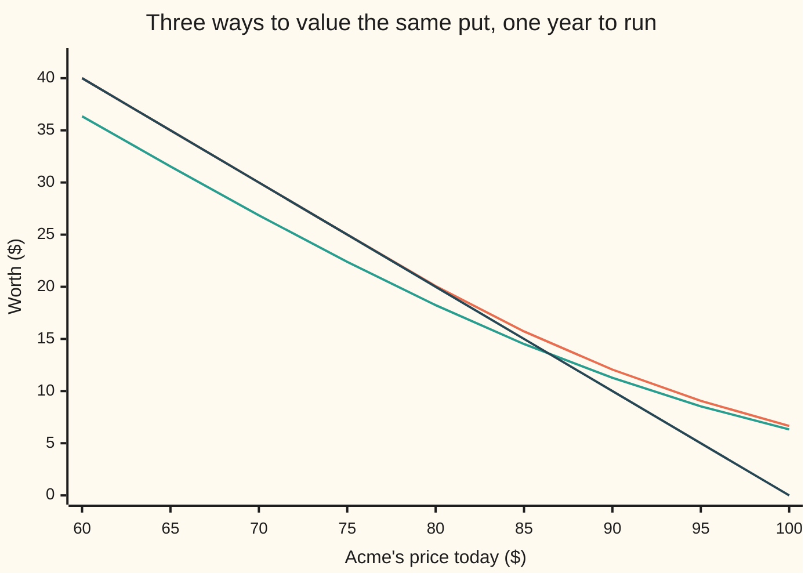
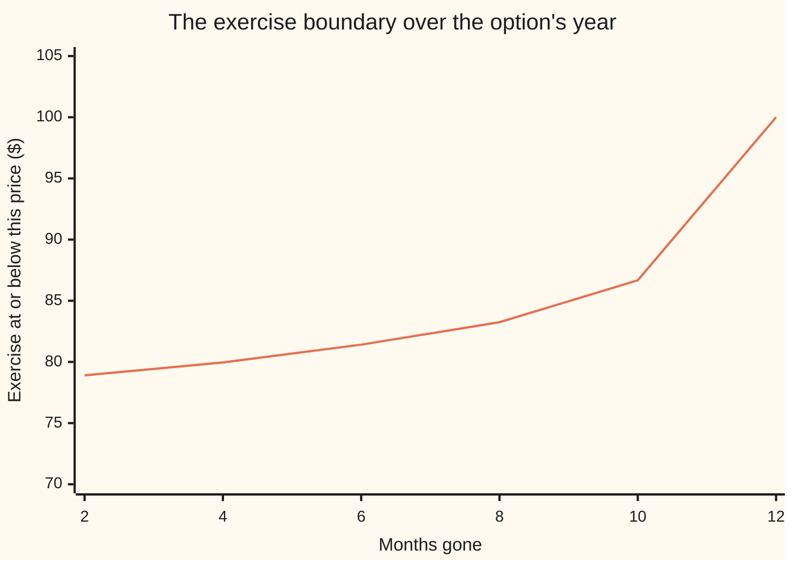

# Early exercise: compare holding with exercising at every node

[Syllabus](../../../SYLLABUS.md) → [Financial mathematics](../README.md) → [Binomial Trees](../README.md#s04) → Early exercise

---

## General Overview

Acme trades at $100.00. A put on Acme is the right, and not the duty, to sell one share for $100.00 — the **strike**. The European version fixes the day: one year from today, and no other. The American version lets its holder sell at $100.00 on any trading day of that year. Same share, same strike, same year; the only difference is who picks the date. The European put is worth $6.33, the closed-form price on [Black-Scholes put](../08-The%20Black-Scholes%20call%20and%20put/02-black-scholes-put.md). The American put is worth **$6.6602**, and the extra 33 cents buys nothing but the choice of day.

That choice pays for one reason. Exercising a put hands over a share and takes in $100.00 of cash, and cash earns the riskless rate, 5 percent a year. Exercise three months in and that $100.00 earns interest for the nine months left. A European holder collects nothing on it until the final day. So the freedom cannot be worth more than a year's interest on the strike, $K(1 - e^{-rT})$ in symbols, which is $4.88 here. The American put collects just 33 cents of that $4.88, because the right pays only in the futures where Acme falls far enough to make selling worthwhile.

No formula returns $6.6602. What there is instead is one comparison, made at every node of a tree ([Many steps](03-multi-step-trees-and-backward-induction.md)). At a node the holder can do exactly two things: take the payoff now, or carry the option one step further. Both are numbers. Keep the bigger one and walk back.

**At every node the option is worth the larger of two numbers: what exercising pays right now, and what holding is worth.**

**What kind of fact this is:** a method — backward induction with one comparison added at each node — carrying a theorem inside it: on a share that pays no dividend, an American call is worth exactly its European twin, proved on this card in Why it works.

### The picture: what the choice is worth, price by price



Three lines. The top one is the American put; the one running down to zero at $100 is what exercising pays today. The third is the European put, and where it sits matters: at $85 it is worth 14.51 against a payoff of 15.00. It sits *below* what exercising would pay, because its holder may not exercise. The American put never sits below its payoff, because its holder may. Between $75 and $80 the American line settles onto the exercise line: 25.00 at $75, exactly the payoff, then 20.07 at $80 against a payoff of 20.00. Below that meeting point exercising wins; above it, holding does.

---

## The formula

Notation first, in words. A node is fixed by two counts: how many steps have passed, written under the letter, and how many of those steps were up moves, written in brackets after it ([Many steps](03-multi-step-trees-and-backward-induction.md)). Write $g$ for the **payoff function**: what exercising pays at a given share price. For a put, $g(S) = \max(K - S,\,0)$ — the strike minus the share price where the share is below the strike, and zero elsewhere. For a call it is $\max(S - K,\,0)$.

$$V_N(j) = g\big(S_N(j)\big)$$

$$V_n(j) = \max\Big(\;g\big(S_n(j)\big)\;,\;\; e^{-r\Delta t}\big[\,p\,V_{n+1}(j+1) + (1-p)\,V_{n+1}(j)\,\big]\;\Big)$$

**Read it aloud:** the last column is the payoff; every earlier node is worth the better of taking the payoff there and carrying the option one step further.

Delete the $\max$ and what is left is the European rule from [Many steps](03-multi-step-trees-and-backward-induction.md). The branch factors, the weight and the discount are untouched; the American price is that same walk plus one comparison per node.

| Symbol | Plain meaning | In our example | Push it up and the answer… |
| --- | --- | --- | --- |
| $S$ | Acme's price today; $S_n(j)$ is its price at a node | $100.00 | a put is worth less: less shortfall to sell into |
| $K$ | the strike, the price the put may sell at | $100.00 | worth more: the sale is at a better price |
| $T$, $N$, $n$, $j$ | the life in years; the number of steps; a step count; a count of up moves | 1 year, 4 or 2,000 steps | more steps: a finer picture, a truer price |
| $\Delta t$ | one step's length, $T$ divided by $N$, in years | 0.25, then 0.0005 | coarser tree, bigger error |
| $u$, $d$ | what Acme multiplies by on an up step and on a down step | 1.105171 and 0.904837 per quarter | wider branches, a dearer option |
| $p$ | the weight on the up branch: a price, not a forecast | 0.512599 per quarter | up branches count for more |
| $r$ | the riskless rate, continuously compounded | 5% | the premium for exercising early grows |
| $q$ | the dividend yield the share pays out | 2% | the put is dearer, the early-exercise case weaker |
| $\sigma$ | volatility, how jumpy Acme is. Say "sigma". | 20% | dearer option; deep in the money, waiting looks better |
| $\tau$ | the time still to run at a node, in years. Say "tau". | 0.25 nine months in | more time left: holding looks better |
| $V$, $g$ | the option's worth at a node; what exercising there pays | 6.660226 at the root; 25.918178 at one node | — |
| $S^*$ | the exercise boundary: exercise at or below it, hold above | 78.90 two months in | — |

Three helpers come from earlier cards and are used unchanged: $\Delta t = T/N$, the branch factors $u = e^{\sigma\sqrt{\Delta t}}$ and $d = 1/u$, and the weight $p = (e^{(r-q)\Delta t} - d)/(u - d)$. Why those, and how fast the price settles as $N$ grows, is [Cox-Ross-Rubinstein](04-crr-tree-and-convergence.md).

### When it holds

- **Exercise only on the tree's own dates.** An $N$-step tree prices a contract exercisable on $N + 1$ dates, today included, not on any day. The American price is the limit as those dates crowd together: 6.6602 at 2,000 steps, and still creeping up in the fourth decimal.
- **A payoff read off today's price, not the path.** Two histories meeting at a node must be worth the same from there on, or the comparison is made against the wrong number. A payoff that remembers where the share has been needs more than a node to decide by.
- **A holder who never errs.** The price assumes the larger of the two numbers is taken every time, which is what the seller must be funded for. A holder who follows a worse rule collects less, and the code prices how much less.
- **One fixed rate above zero, one fixed yield and volatility**, as on [Cox-Ross-Rubinstein](04-crr-tree-and-convergence.md). Let volatility move and the tree prices a share that does not exist. Let the rate go negative and Step 5's call argument breaks with it.
- **Exercise settles in cash or shares at once**, with no fee and no delay. A fee subtracts from the payoff side of the comparison and shrinks the exercise region.

---

## Why it works

### Step 0: at a node there are two choices, and the value is the better one

At any node the holder can do one of two things and nothing else. Exercise, which pays a number read straight off that node's share price. Or wait one step, which leads to two nodes whose values are already written down, because the walk runs backwards from the end. So the node's worth is the larger of two known numbers.

That the larger of the two, taken node by node, is the best any exercise rule can do — and not merely a sensible rule — is the content of [Optimal stopping](../../11-Stochastic%20processes%20and%20calculus/08-Generators%2C%20Densities%20and%20Simulation/07-optimal-stopping-and-snell-envelope.md). The price is a maximum over every rule for picking the day, and the backward walk computes that maximum without listing the rules.

### Step 1: the last column settles itself

On the last date there is nothing left to wait for, so the option is worth what it pays. In a tree of four quarterly steps, the two end nodes reached from the three-down node pay 18.126925 and 32.967995. No judgement is involved: those are the payoffs.

### Step 2: holding is worth one step of the ordinary walk

The right-hand half of the formula is the European rule. Weight the two nodes ahead by $p$ and $1-p$, discount one step at the riskless rate. It answers one question only: what is this option worth if nobody may touch it before the next node?

### Step 3: the comparison, on one real node

Take the three-down node of that four-step tree, nine months in. Acme stands at 74.081822. Exercising pays 25.918178. Holding, from the two payoffs above, is worth 25.045443. Exercising wins, so the node's value is 25.918178 and the option is dead there.

Notice what the tree does with that. It writes 25.918178 into the node and carries on. Nodes further back then see a fatter number ahead of them, which is how an exercise decision nine months out raises the price today.

### Step 4: why a put wants the cash early

Push Acme down toward zero. The put becomes a certainty: it will pay the strike. A European put on a near-worthless share is a promise of the strike one year out, and today that promise is worth the strike shrunk by a year of discounting — strictly less than the strike. Exercising pays the strike now. Now beats later whenever the rate is above zero.

So there is a region where exercising strictly wins, and because values move smoothly with the share price it is a region, not a single point. What is given up by exercising is the chance Acme climbs back above the strike; deep down, that chance is small, and the interest on the strike is not.

That also names the dial: at a zero rate there is no interest to collect, waiting costs nothing, and the premium is exactly zero. Force one below prints the whole sweep.

### Step 5: why a call on a share that pays nothing never wants it

Hold a call instead of exercising it and two good things happen. The strike stays in the bank, earning interest until it is needed. And the floor stays: if Acme collapses the call is left unexercised, while a share bought early falls with the market. Exercising early buys neither. Two costs, no benefit.

Written as a bound: a European call is worth at least $S e^{-q\tau} - K e^{-r\tau}$, where $\tau$ is the time left. With no dividend, $q = 0$, that is $S - K e^{-r\tau}$, and a positive rate makes it strictly larger than $S - K$, which is what exercising pays. Holding beats exercising at every node, the $\max$ never picks the payoff, and the American call equals its European twin.

The run confirms it with no theory: with no dividend the tree's American call comes out at 10.449584 against a closed-form European 10.450584. The gap is the tree's own step error — the same tenth of a cent by which the tree's European put, 6.329109, misses the closed form 6.330081.

A dividend breaks the argument, because the share sheds $q$ a year and a call holder does not collect it. On the house market that leak is small beside the interest on the strike: the American call prints 9.226034 and the European call on the same tree prints 9.226034, differing by 0.000000034. Real, and far below the tree's own accuracy. A call's exercise region lives where the yield a share sheds outruns the interest on the strike, which for Acme means prices far above today's.

<details>
<summary>Detailed proof: the two bounds, and what each one settles</summary>

Both bounds come from put–call parity, $C - P = S e^{-q\tau} - K e^{-r\tau}$, and from the fact that neither European option can be worth less than nothing.

**The call.** Parity with $P \ge 0$ gives $C \ge S e^{-q\tau} - K e^{-r\tau}$. Set $q = 0$: $C \ge S - K e^{-r\tau}$. For $r > 0$, $K > 0$ and $\tau > 0$, $K e^{-r\tau} < K$, so $C > S - K = g(S)$ at every node before the last, and strictly. The comparison therefore always keeps the holding value, and by backward induction the American and European values agree at every node, root included; strictness leaves no tie to break. With $q > 0$ the bound weakens to $C \ge S e^{-q\tau} - K e^{-r\tau}$, which for large $S$ drops below $S - K$: the protection stops, and an exercise region appears far above the strike.

**The put.** Parity with $C \ge 0$ gives $P \ge K e^{-r\tau} - S e^{-q\tau}$, which is weaker than the payoff $K - S$ when $S$ is small, so the bound settles nothing on its own. Take the limit instead. As $S \to 0$ the share is worth nothing at every later node, so the European put is worth exactly $K e^{-r\tau}$, while exercising pays $K$. For $r > 0$, $K e^{-r\tau} < K$: exercising strictly wins. Values on the tree are continuous in $S$, so exercising still wins for small positive $S$. The exercise region is non-empty, which is all that is claimed here; where it starts is Step 6 and has no closed form.

</details>

### Step 6: the two choices tie along a line that moves

Fix a date. High up, holding wins; far down, exercising wins. Between them the two numbers cross exactly once. That crossing price is the **exercise boundary**, written $S^*$, and it depends on how much time is left.

Nobody supplies $S^*$. It falls out of the same backward walk — that is what makes this a *free-boundary* problem: the line separating the two regions is part of the answer, not part of the question. The tree reports it for nothing, as the highest node price at which the comparison chose exercise, and the next section reads it off.

The same problem in continuous time is that free boundary written as an equation: the Black–Scholes equation holds where the holder waits, the value equals the payoff where the holder exercises, and the two pieces meet without a kink — the *smooth pasting* condition. Road three in the code solves that version on a grid of prices and returns 6.659428, within a tenth of a cent of the tree. What the grid is, and why it is a trinomial tree in disguise, is [Trinomial trees](06-trinomial-trees-and-the-grid-connection.md).

---

## Worked numbers, by hand

Four quarterly steps on the house market: Acme at $100.00, strike $100.00, one year, 5 percent riskless, 2 percent dividend yield, 20 percent volatility. Follow the path that goes down three quarters in a row.

| Step | Arithmetic | Value |
| --- | --- | --- |
| up factor, $u = e^{\sigma\sqrt{\Delta t}}$ | $e^{0.20 \times 0.5}$ | 1.105171 |
| down factor, $d = 1/u$ | $1 / 1.105171$ | 0.904837 |
| up weight, $p$ | $(e^{0.03 \times 0.25} - 0.904837)/(1.105171 - 0.904837)$ | 0.512599 |
| three down moves, nine months in | $100 \times 0.904837^3$ | 74.081822 |
| what the two nodes ahead pay | the strike minus each of the two prices a quarter later | 18.126925 and 32.967995 |
| hold | $e^{-0.05 \times 0.25}\,[\,0.512599 \times 18.126925 + (1 - 0.512599) \times 32.967995\,]$ | 25.045443 |
| exercise now | $100 - 74.081822$ | 25.918178 |
| the node's value, the larger of the two | exercise | **25.918178** |
| the root of that four-step tree | walk the same comparison back | **6.432246** |
| the same tree with the $\max$ deleted | the European put | 5.863402 |
| the answer, 2,000 steps | the same walk, finer | **6.660226** |

Four quarters already show the effect: 6.432246 against 5.863402. But four steps a year is a thin picture of a right exercisable any day, and the coarse tree undercounts the chances to use it. Crowd the dates and the price settles: 6.6602.

### What breaks if you drop a piece

| Mistake | Comes out at | What went wrong |
| --- | --- | --- |
| Delete the comparison | 6.329109 | That is the European put on the same tree. The whole 33 cents is the one $\max$. |
| Exercise on a fixed line at $95 | 4.0379 | Sold for a few dollars of payoff, over and over, throwing away an option worth more. |
| The best fixed line tried, $82 | 6.6129 | Closer, and still short of 6.660226: the right line is not a line, it moves. |
| Ten steps instead of two thousand | 6.5603 | Too few dates to exercise on. At 25 steps it overshoots instead, 6.7284: the error lands on either side. |

---

## The exercise line moves as the clock runs

Here is the part that catches people. Whether to exercise is not a fact about Acme's price alone. At $85 with a year to run, holding wins. At $85 with two months to run, exercising wins. The share did not move. The clock did it.

The reason is that exercising kills an option with time value in it. With a year left, the chance Acme climbs back over $100.00 is worth a lot, and it is thrown away for a few months of interest. With a week left that chance is worth almost nothing, so the interest wins. As time runs out the boundary rises to meet the strike.

| Months gone | Highest price still worth exercising | What has changed |
| --- | --- | --- |
| 2 | 78.90 | Acme must be more than a fifth below the strike |
| 4 | 79.96 | barely moved: eight months is still a lot of time |
| 6 | 81.41 | the climb begins |
| 8 | 83.25 | the option's remaining chance is thinner |
| 10 | 86.67 | two months left; take the money sooner |
| 12 | 100.00 | expiry: anything in the money is exercised |



One line: the boundary $S^*$, flat for most of the year, then bending up hard into the strike in the last weeks. Under it is the exercise region; over it the option stays alive.

Two forces set how much the whole right is worth. Here they are one at a time.

### Force one: the riskless rate

```
premium, at the money, per $100 of strike
  r = 0%    |                                    $0.0000
  r = 2%    |█                                   $0.0295
  r = 5%    |█████████████                       $0.3316
  r = 10%   |████████████████████████████████████$0.8966
```

The premium is interest on the strike, collected only where the holder would actually exercise. Take the interest away and it vanishes exactly: at a zero rate the American put and the European put are the same contract at the same price. Double the rate from 5 to 10 percent and the premium nearly triples.

### Force two: volatility, deep in the money

```
premium on a $75 share, per $100 of strike
  sigma = 10%  |████████████████████████████████ $3.3789
  sigma = 20%  |█████████████████████████        $2.6145
  sigma = 30%  |██████████████                   $1.4698
  sigma = 40%  |██████████                       $1.0978
```

Down at $75 the put is deep in the money and the question is whether to hold out for more. A calm share is not coming back, so the cash is taken early and the right is worth a lot. A jumpy share might rebound, so exercise is put off and the early right matters less.

At the money that ranking reverses, gently: the same sweep at $100.00 gives 0.3216, 0.3316, 0.3492 and 0.3720 as volatility climbs. A jumpier share is more likely to fall far enough for the right to be used at all. So "volatility kills the early-exercise premium" is a deep-in-the-money statement, not a law.

---

## Code, from first principles, and it actually runs

Nothing below imports a function that already knows the answer; the bell-curve area is built from scratch in both languages. The American put is reached **three independent ways**: a Cox–Ross–Rubinstein tree with the comparison at every node, a Jarrow–Rudd tree whose branches and weights are built differently, and a grid of prices marched back through time by the Black–Scholes equation with no tree at all. The same tree with the comparison deleted has to reproduce the closed-form European put, the no-dividend American call has to reproduce the closed-form European call, and every number quoted on this card is printed.

### Python

```python
# American exercise on a tree -- the check behind the card.  Standard library only.
# Nothing is imported that already knows the answer: the bell-curve area comes from
# math.erf, and every tree and grid below is a loop written out here.
from math import log, sqrt, exp, erf
def N(x): return 0.5 * (1.0 + erf(x / sqrt(2.0)))    # bell-curve area left of x
def bs(S, K, r, q, sigma, T, put):            # the closed form, used as an anchor
    vt = sigma * sqrt(T)
    d1 = (log(S / K) + (r - q + 0.5 * sigma * sigma) * T) / vt
    d2 = d1 - vt
    if put:
        return K * exp(-r * T) * N(-d2) - S * exp(-q * T) * N(-d1)
    return S * exp(-q * T) * N(d1) - K * exp(-r * T) * N(d2)
def moves(r, q, sigma, dt, kind):             # up factor, down factor, up chance
    if kind == "crr":                         # Cox-Ross-Rubinstein: mirror moves
        u = exp(sigma * sqrt(dt))
        return u, 1.0 / u, (exp((r - q) * dt) - 1.0 / u) / (u - 1.0 / u)
    nu = (r - q - 0.5 * sigma * sigma) * dt   # Jarrow-Rudd: even odds, tilted moves
    return exp(nu + sigma * sqrt(dt)), exp(nu - sigma * sqrt(dt)), 0.5
def tree(S, K, r, q, sigma, T, steps, rule, put=True, kind="crr", bar=0.0):
    # Backward induction.  rule "hold" never exercises early (the European price),
    # "max" takes the larger of holding and exercising (the American price), "bar"
    # follows a fixed line: exercise at or below bar, hold above it.  Returns the
    # price and the highest stock price exercised at each step.
    dt = T / steps
    u, d, p = moves(r, q, sigma, dt, kind)
    disc = exp(-r * dt)
    pay = (lambda s: max(K - s, 0.0)) if put else (lambda s: max(s - K, 0.0))
    spot = [S * u ** j * d ** (steps - j) for j in range(steps + 1)]
    v = [pay(s) for s in spot]
    edge = [0.0] * (steps + 1)
    for i in range(steps - 1, -1, -1):
        spot = [s / d for s in spot[:i + 1]]                  # this step's prices
        v = [disc * (p * v[j + 1] + (1.0 - p) * v[j]) for j in range(i + 1)]
        if rule != "hold":
            for j in range(i + 1):
                x = pay(spot[j])
                take = (x > v[j]) if rule == "max" else (spot[j] <= bar)
                if take:
                    v[j] = x
                    edge[i] = max(edge[i], spot[j])
    return v[0], edge
def grid(S, K, r, q, sigma, T, nx=301, half=1.5):
    # Road three: no tree at all.  A row of log-spaced prices marched back through
    # time by the rule the Black-Scholes equation gives, taking the larger of
    # holding and exercising at every price after every step.
    dx = 2.0 * half / (nx - 1)
    nt = int(T * sigma * sigma / (0.4 * dx * dx)) + 1     # small steps stay stable
    dt, sp = T / nt, [S * exp(-half + i * dx) for i in range(nx)]
    a, b = 0.5 * sigma * sigma * dt / (dx * dx), (r - q - 0.5 * sigma * sigma) * dt / (2.0 * dx)
    v = [max(K - s, 0.0) for s in sp]
    for _ in range(nt):
        w = [v[i] for i in range(nx)]
        for i in range(1, nx - 1):
            w[i] = (v[i] + a * (v[i+1] - 2.0 * v[i] + v[i-1]) + b * (v[i+1] - v[i-1])) / (1.0 + r * dt)
        w[0], w[nx - 1] = K - sp[0], 0.0
        v = [max(w[i], K - sp[i], 0.0) for i in range(nx)]
    return v[(nx - 1) // 2]

S, K, r, q, sigma, T = 100.0, 100.0, 0.05, 0.02, 0.20, 1.0    # the house market
u, d, p = moves(r, q, sigma, T / 4, "crr")
low = S * d ** 3                                       # three down moves in a row
kids = (max(K - low * u, 0.0), max(K - low * d, 0.0))
hold = exp(-r * T / 4) * (p * kids[0] + (1.0 - p) * kids[1])
am4, eu4 = tree(S, K, r, q, sigma, T, 4, "max")[0], tree(S, K, r, q, sigma, T, 4, "hold")[0]
eu_tree, eu_bs = tree(S, K, r, q, sigma, T, 2000, "hold")[0], bs(S, K, r, q, sigma, T, True)
am, edge = tree(S, K, r, q, sigma, T, 2000, "max")
am_jr = tree(S, K, r, q, sigma, T, 2000, "max", kind="jr")[0]
am_grid = grid(S, K, r, q, sigma, T)
for name, val in [
        ("up move u, one quarter", u), ("down move d, one quarter", d), ("chance of an up move p", p),
        ("three downs: the price at 9 months", low), ("hold: discounted average of the two", hold),
        ("exercise now: K - S", K - low), ("the larger of the two: exercise", max(hold, K - low)),
        ("4-step tree, American put", am4), ("4-step tree, European put", eu4),
        ("2000-step tree, European put", eu_tree), ("Black-Scholes European put", eu_bs),
        ("2000-step tree, American put", am), ("Jarrow-Rudd tree, American put", am_jr),
        ("grid, no tree, American put", am_grid), ("early-exercise premium", am - eu_tree),
        ("the most it could be, K(1 - e^-rT)", K * (1.0 - exp(-r * T)))]:
    print(f"{name:<38}{val:>13.6f}")
print(f"{'  the two payoffs at expiry, up then down':<38}{kids[0]:>13.6f}{kids[1]:>13.6f}")
print()
counts = (10, 25, 50, 100, 250, 500, 1000, 2000)
print("steps       " + "".join(f"{n:>9d}" for n in counts))
print("American put" + "".join(f"{tree(S, K, r, q, sigma, T, n, 'max')[0]:>9.4f}" for n in counts))
print()
bars = (95.0, 90.0, 85.0, 82.0, 75.0)
fixed = [tree(S, K, r, q, sigma, T, 2000, "bar", bar=b)[0] for b in bars]
print("a fixed exercise line at " + "".join(f"{b:>9.0f}" for b in bars))
print("is worth                " + "".join(f"{val:>9.4f}" for val in fixed))
print()
print("exercise boundary: the highest price still worth exercising, 2000 steps")
months = (2, 4, 6, 8, 10, 12)
print("months gone " + "".join(f"{m:>9d}" for m in months))
print("price       " + "".join(f"{(edge[m * 2000 // 12] if m < 12 else K):>9.2f}" for m in months))
print()
c_am0, c_bs0 = tree(S, K, r, 0.0, sigma, T, 2000, "max", put=False)[0], bs(S, K, r, 0.0, sigma, T, False)
c_am = tree(S, K, r, q, sigma, T, 2000, "max", put=False)[0]
c_eu = tree(S, K, r, q, sigma, T, 2000, "hold", put=False)[0]
for name, val in [("American call, no dividend, tree", c_am0),
                  ("Black-Scholes call, no dividend", c_bs0),
                  ("American call, 2% dividend, tree", c_am), ("European call, the same tree", c_eu)]:
    print(f"{name:<38}{val:>13.6f}")
print(f"{'American minus European call, 2% dividend':<38}{c_am - c_eu:>13.9f}")
print()
print("premium against the rate, at the money, per $100 of strike")
prem_r = []
for rate in (0.00, 0.02, 0.05, 0.10):
    a1, e1 = tree(S, K, rate, q, sigma, T, 1000, "max")[0], tree(S, K, rate, q, sigma, T, 1000, "hold")[0]
    prem_r.append(a1 - e1)
    print(f"  r = {rate:.2f}    premium {a1 - e1:8.4f}")
print("premium against volatility: at the money at $100, then deep in at $75")
prem_atm, prem_itm = [], []
for sg in (0.10, 0.20, 0.30, 0.40):
    a1, e1 = tree(S, K, r, q, sg, T, 1000, "max")[0], tree(S, K, r, q, sg, T, 1000, "hold")[0]
    a2, e2 = tree(75.0, K, r, q, sg, T, 1000, "max")[0], tree(75.0, K, r, q, sg, T, 1000, "hold")[0]
    prem_atm.append(a1 - e1)
    prem_itm.append(a2 - e2)
    print(f"  sigma = {sg:.2f} premium {a1 - e1:8.4f} at $100,{a2 - e2:8.4f} at $75")
print()
spots = [60.0 + 5.0 * i for i in range(9)]
am_curve = [tree(s, K, r, q, sigma, T, 1000, "max")[0] for s in spots]
eu_curve = [tree(s, K, r, q, sigma, T, 1000, "hold")[0] for s in spots]
print("chart, Acme price     " + "".join(f"{s:>8.0f}" for s in spots))
print("chart, American put   " + "".join(f"{v:>8.2f}" for v in am_curve))
print("chart, European put   " + "".join(f"{v:>8.2f}" for v in eu_curve))
print("chart, exercise now   " + "".join(f"{max(K - s, 0.0):>8.2f}" for s in spots))
assert abs(eu_bs - 6.330080627550) < 1e-9, "the closed form vs the house put price"
assert abs(eu_tree - eu_bs) < 0.005, "the tree without the max vs the closed form"
assert abs(am - am_jr) < 0.01, "two lattices, one American price"
assert abs(am - am_grid) < 0.02, "lattice against grid"
assert abs(c_am0 - c_bs0) < 0.005, "no dividend: the American call equals the European"
assert am - eu_tree > 0.3, "the right to exercise early is worth real money"
assert max(fixed) < am - 0.01, "every fixed line is beaten by the moving one"
assert all(am_curve[i] >= max(K - spots[i], 0.0) - 1e-9 for i in range(9)), "never below intrinsic"
assert all(edge[m * 2000 // 12] < edge[(m + 2) * 2000 // 12] for m in (2, 4, 6, 8)), "the boundary climbs"
assert prem_r[0] < 1e-9 < prem_r[3], "no premium at a zero rate, a large one at 10%"
assert prem_itm[0] > prem_itm[3], "deep in the money, volatility cuts the premium"
assert prem_atm[0] < prem_atm[3], "at the money, volatility lifts it"
print("ALL CHECKS PASS")
```

**Ran 2026-09-14 on macOS, Python 3.14.6, standard library only. All checks passed. Output, pasted from the run:**

```
up move u, one quarter                     1.105171
down move d, one quarter                   0.904837
chance of an up move p                     0.512599
three downs: the price at 9 months        74.081822
hold: discounted average of the two       25.045443
exercise now: K - S                       25.918178
the larger of the two: exercise           25.918178
4-step tree, American put                  6.432246
4-step tree, European put                  5.863402
2000-step tree, European put               6.329109
Black-Scholes European put                 6.330081
2000-step tree, American put               6.660226
Jarrow-Rudd tree, American put             6.660717
grid, no tree, American put                6.659428
early-exercise premium                     0.331117
the most it could be, K(1 - e^-rT)         4.877058
  the two payoffs at expiry, up then down    18.126925    32.967995

steps              10       25       50      100      250      500     1000     2000
American put   6.5603   6.7284   6.6415   6.6510   6.6569   6.6588   6.6598   6.6602

a fixed exercise line at        95       90       85       82       75
is worth                   4.0379   5.9275   6.5606   6.6129   6.4789

exercise boundary: the highest price still worth exercising, 2000 steps
months gone         2        4        6        8       10       12
price           78.90    79.96    81.41    83.25    86.67   100.00

American call, no dividend, tree          10.449584
Black-Scholes call, no dividend           10.450584
American call, 2% dividend, tree           9.226034
European call, the same tree               9.226034
American minus European call, 2% dividend  0.000000034

premium against the rate, at the money, per $100 of strike
  r = 0.00    premium   0.0000
  r = 0.02    premium   0.0295
  r = 0.05    premium   0.3316
  r = 0.10    premium   0.8966
premium against volatility: at the money at $100, then deep in at $75
  sigma = 0.10 premium   0.3216 at $100,  3.3789 at $75
  sigma = 0.20 premium   0.3316 at $100,  2.6145 at $75
  sigma = 0.30 premium   0.3492 at $100,  1.4698 at $75
  sigma = 0.40 premium   0.3720 at $100,  1.0978 at $75

chart, Acme price           60      65      70      75      80      85      90      95     100
chart, American put      40.00   35.00   30.00   25.00   20.07   15.72   12.06    9.06    6.66
chart, European put      36.35   31.54   26.85   22.39   18.24   14.51   11.27    8.54    6.33
chart, exercise now      40.00   35.00   30.00   25.00   20.00   15.00   10.00    5.00    0.00
ALL CHECKS PASS
```

Three roads, one price: 6.660226 from the tree, 6.660717 from the second lattice, 6.659428 from the grid. They agree to within a tenth of a cent, which is about the accuracy each has at these settings. None is exact — the convergence row shows the tree still climbing at 2,000 steps — and they are wrong in different directions, which is the point of running all three.

### Rust

Same inputs, same labels, no crates. Rust has no `erf`, so the bell-curve area is built by adding up thin slices under the curve.

```rust
// American exercise on a tree -- the same check as the Python, in Rust.  No crates.
// Rust has no erf, so the bell-curve area N(x) is built the honest way: thin
// slices added up under the curve (Simpson's rule).
use std::f64::consts::PI;
fn phi(x: f64) -> f64 { (-0.5 * x * x).exp() / (2.0 * PI).sqrt() }
fn simpson<F: Fn(f64) -> f64>(f: F, a: f64, b: f64, n: usize) -> f64 {
    let h = (b - a) / n as f64;
    let mut s = f(a) + f(b);
    for i in 1..n { s += if i % 2 == 1 { 4.0 } else { 2.0 } * f(a + i as f64 * h); }
    s * h / 3.0
}
fn n_cdf(x: f64) -> f64 {                     // bell-curve area left of x
    if x < -12.0 { return 0.0; } else if x > 12.0 { return 1.0; }
    0.5 + simpson(phi, 0.0, x, 4000)
}
fn bs(s: f64, k: f64, r: f64, q: f64, sigma: f64, t: f64, put: bool) -> f64 {
    let vt = sigma * t.sqrt();
    let d1 = ((s / k).ln() + (r - q + 0.5 * sigma * sigma) * t) / vt;
    let d2 = d1 - vt;
    if put { k * (-r * t).exp() * n_cdf(-d2) - s * (-q * t).exp() * n_cdf(-d1) }
    else { s * (-q * t).exp() * n_cdf(d1) - k * (-r * t).exp() * n_cdf(d2) }
}
fn moves(r: f64, q: f64, sigma: f64, dt: f64, kind: &str) -> (f64, f64, f64) {
    if kind == "crr" {                        // Cox-Ross-Rubinstein: mirror moves
        let u = (sigma * dt.sqrt()).exp();
        return (u, 1.0 / u, (((r - q) * dt).exp() - 1.0 / u) / (u - 1.0 / u));
    }
    let nu = (r - q - 0.5 * sigma * sigma) * dt;   // Jarrow-Rudd: even odds
    ((nu + sigma * dt.sqrt()).exp(), (nu - sigma * dt.sqrt()).exp(), 0.5)
}
// Backward induction.  rule "hold" never exercises early (the European price),
// "max" takes the larger of holding and exercising (the American price), "bar"
// follows a fixed line: exercise at or below bar, hold above it.
fn tree(s0: f64, k: f64, r: f64, q: f64, sigma: f64, t: f64, steps: usize,
        rule: &str, put: bool, kind: &str, bar: f64) -> (f64, Vec<f64>) {
    let dt = t / steps as f64;
    let (u, d, p) = moves(r, q, sigma, dt, kind);
    let disc = (-r * dt).exp();
    let pay = |s: f64| if put { (k - s).max(0.0) } else { (s - k).max(0.0) };
    let mut spot: Vec<f64> = (0..=steps)
        .map(|j| s0 * u.powf(j as f64) * d.powf((steps - j) as f64)).collect();
    let mut v: Vec<f64> = spot.iter().map(|&s| pay(s)).collect();
    let mut edge = vec![0.0f64; steps + 1];
    for i in (0..steps).rev() {
        spot.truncate(i + 1);                            // this step's prices
        for s in spot.iter_mut() { *s /= d; }
        v = (0..=i).map(|j| disc * (p * v[j + 1] + (1.0 - p) * v[j])).collect();
        if rule != "hold" {
            for j in 0..=i {
                let x = pay(spot[j]);
                let take = if rule == "max" { x > v[j] } else { spot[j] <= bar };
                if take { v[j] = x;  edge[i] = edge[i].max(spot[j]); }
            }
        }
    }
    (v[0], edge)
}
// Road three: no tree at all.  A row of log-spaced prices marched back through
// time by the rule the Black-Scholes equation gives, taking the larger of
// holding and exercising at every price after every step.
fn grid(s0: f64, k: f64, r: f64, q: f64, sigma: f64, t: f64) -> f64 {
    let (nx, half) = (301usize, 1.5f64);
    let dx = 2.0 * half / (nx - 1) as f64;
    let nt = (t * sigma * sigma / (0.4 * dx * dx)) as usize + 1;  // small steps stay stable
    let dt = t / nt as f64;
    let (a, b) = (0.5 * sigma * sigma * dt / (dx * dx), (r - q - 0.5 * sigma * sigma) * dt / (2.0 * dx));
    let sp: Vec<f64> = (0..nx).map(|i| s0 * (-half + i as f64 * dx).exp()).collect();
    let mut v: Vec<f64> = sp.iter().map(|&s| (k - s).max(0.0)).collect();
    for _ in 0..nt {
        let mut w = v.clone();
        for i in 1..nx - 1 {
            w[i] = (v[i] + a * (v[i+1] - 2.0 * v[i] + v[i-1]) + b * (v[i+1] - v[i-1])) / (1.0 + r * dt);
        }
        w[0] = k - sp[0];  w[nx - 1] = 0.0;
        v = (0..nx).map(|i| w[i].max((k - sp[i]).max(0.0))).collect();
    }
    v[(nx - 1) / 2]
}
fn main() {
    let (s, k, r, q, sigma, t) = (100.0_f64, 100.0_f64, 0.05_f64, 0.02_f64, 0.20_f64, 1.0_f64);
    let (u, d, p) = moves(r, q, sigma, t / 4.0, "crr");
    let low = s * d * d * d;                       // three down moves in a row
    let kids = ((k - low * u).max(0.0), (k - low * d).max(0.0));
    let hold = (-r * t / 4.0).exp() * (p * kids.0 + (1.0 - p) * kids.1);
    let (am4, eu4) = (tree(s, k, r, q, sigma, t, 4, "max", true, "crr", 0.0).0, tree(s, k, r, q, sigma, t, 4, "hold", true, "crr", 0.0).0);
    let (eu_tree, eu_bs) = (tree(s, k, r, q, sigma, t, 2000, "hold", true, "crr", 0.0).0,
                            bs(s, k, r, q, sigma, t, true));
    let (am, edge) = tree(s, k, r, q, sigma, t, 2000, "max", true, "crr", 0.0);
    let (am_jr, am_grid) = (tree(s, k, r, q, sigma, t, 2000, "max", true, "jr", 0.0).0, grid(s, k, r, q, sigma, t));
    let rows: Vec<(&str, f64)> = vec![
        ("up move u, one quarter", u), ("down move d, one quarter", d), ("chance of an up move p", p),
        ("three downs: the price at 9 months", low), ("hold: discounted average of the two", hold),
        ("exercise now: K - S", k - low), ("the larger of the two: exercise", hold.max(k - low)),
        ("4-step tree, American put", am4), ("4-step tree, European put", eu4),
        ("2000-step tree, European put", eu_tree), ("Black-Scholes European put", eu_bs),
        ("2000-step tree, American put", am), ("Jarrow-Rudd tree, American put", am_jr),
        ("grid, no tree, American put", am_grid), ("early-exercise premium", am - eu_tree),
        ("the most it could be, K(1 - e^-rT)", k * (1.0 - (-r * t).exp()))];
    for (name, val) in &rows { println!("{:<38}{:>13.6}", name, val); }
    println!("{:<38}{:>13.6}{:>13.6}", "  the two payoffs at expiry, up then down", kids.0, kids.1);
    println!();
    let counts = [10usize, 25, 50, 100, 250, 500, 1000, 2000];
    println!("steps       {}", counts.iter().map(|n| format!("{:>9}", n)).collect::<Vec<_>>().join(""));
    println!("American put{}", counts.iter().map(|&n| format!("{:>9.4}", tree(s, k, r, q, sigma, t, n, "max", true, "crr", 0.0).0)).collect::<Vec<_>>().join(""));
    println!();
    let bars = [95.0_f64, 90.0, 85.0, 82.0, 75.0];
    let fixed: Vec<f64> = bars.iter()
        .map(|&b| tree(s, k, r, q, sigma, t, 2000, "bar", true, "crr", b).0).collect();
    println!("a fixed exercise line at {}", bars.iter().map(|b| format!("{:>9.0}", b)).collect::<Vec<_>>().join(""));
    println!("is worth                {}", fixed.iter().map(|v| format!("{:>9.4}", v)).collect::<Vec<_>>().join(""));
    println!();
    println!("exercise boundary: the highest price still worth exercising, 2000 steps");
    let months = [2usize, 4, 6, 8, 10, 12];
    println!("months gone {}", months.iter().map(|m| format!("{:>9}", m)).collect::<Vec<_>>().join(""));
    println!("price       {}", months.iter().map(|&m| format!("{:>9.2}", if m < 12 { edge[m * 2000 / 12] } else { k })).collect::<Vec<_>>().join(""));
    println!();
    let (c_am0, c_bs0) = (tree(s, k, r, 0.0, sigma, t, 2000, "max", false, "crr", 0.0).0,
                          bs(s, k, r, 0.0, sigma, t, false));
    let (c_am, c_eu) = (tree(s, k, r, q, sigma, t, 2000, "max", false, "crr", 0.0).0,
                        tree(s, k, r, q, sigma, t, 2000, "hold", false, "crr", 0.0).0);
    for (name, val) in [("American call, no dividend, tree", c_am0),
                        ("Black-Scholes call, no dividend", c_bs0),
                        ("American call, 2% dividend, tree", c_am),
                        ("European call, the same tree", c_eu)] {
        println!("{:<38}{:>13.6}", name, val);
    }
    println!("{:<38}{:>13.9}", "American minus European call, 2% dividend", c_am - c_eu);
    println!();
    println!("premium against the rate, at the money, per $100 of strike");
    let mut prem_r: Vec<f64> = Vec::new();
    for rate in [0.00_f64, 0.02, 0.05, 0.10] {
        let a1 = tree(s, k, rate, q, sigma, t, 1000, "max", true, "crr", 0.0).0;
        let e1 = tree(s, k, rate, q, sigma, t, 1000, "hold", true, "crr", 0.0).0;
        prem_r.push(a1 - e1);
        println!("  r = {:.2}    premium {:8.4}", rate, a1 - e1);
    }
    println!("premium against volatility: at the money at $100, then deep in at $75");
    let (mut prem_atm, mut prem_itm): (Vec<f64>, Vec<f64>) = (Vec::new(), Vec::new());
    for sg in [0.10_f64, 0.20, 0.30, 0.40] {
        let a1 = tree(s, k, r, q, sg, t, 1000, "max", true, "crr", 0.0).0;
        let e1 = tree(s, k, r, q, sg, t, 1000, "hold", true, "crr", 0.0).0;
        let a2 = tree(75.0, k, r, q, sg, t, 1000, "max", true, "crr", 0.0).0;
        let e2 = tree(75.0, k, r, q, sg, t, 1000, "hold", true, "crr", 0.0).0;
        prem_atm.push(a1 - e1);
        prem_itm.push(a2 - e2);
        println!("  sigma = {:.2} premium {:8.4} at $100,{:8.4} at $75", sg, a1 - e1, a2 - e2);
    }
    println!();
    let spots: Vec<f64> = (0..9).map(|i| 60.0 + 5.0 * i as f64).collect();
    let am_curve: Vec<f64> = spots.iter().map(|&x| tree(x, k, r, q, sigma, t, 1000, "max", true, "crr", 0.0).0).collect();
    let eu_curve: Vec<f64> = spots.iter().map(|&x| tree(x, k, r, q, sigma, t, 1000, "hold", true, "crr", 0.0).0).collect();
    println!("chart, Acme price     {}", spots.iter().map(|x| format!("{:>8.0}", x)).collect::<Vec<_>>().join(""));
    println!("chart, American put   {}", am_curve.iter().map(|x| format!("{:>8.2}", x)).collect::<Vec<_>>().join(""));
    println!("chart, European put   {}", eu_curve.iter().map(|x| format!("{:>8.2}", x)).collect::<Vec<_>>().join(""));
    println!("chart, exercise now   {}", spots.iter().map(|x| format!("{:>8.2}", (k - x).max(0.0))).collect::<Vec<_>>().join(""));
    assert!((eu_bs - 6.330080627550).abs() < 1e-9, "the closed form vs the house put price");
    assert!((eu_tree - eu_bs).abs() < 0.005, "the tree without the max vs the closed form");
    assert!((am - am_jr).abs() < 0.01, "two lattices, one American price");
    assert!((am - am_grid).abs() < 0.02, "lattice against grid");
    assert!((c_am0 - c_bs0).abs() < 0.005, "no dividend: the American call equals the European");
    assert!(am - eu_tree > 0.3, "the right to exercise early is worth real money");
    assert!(fixed.iter().all(|&x| x < am - 0.01), "every fixed line is beaten by the moving one");
    assert!((0..9).all(|i| am_curve[i] >= (k - spots[i]).max(0.0) - 1e-9), "never below intrinsic");
    assert!([2usize, 4, 6, 8].iter().all(|&m| edge[m * 2000 / 12] < edge[(m + 2) * 2000 / 12]), "the boundary climbs");
    assert!(prem_r[0] < 1e-9 && 1e-9 < prem_r[3], "no premium at a zero rate, a large one at 10%");
    assert!(prem_itm[0] > prem_itm[3], "deep in the money, volatility cuts the premium");
    assert!(prem_atm[0] < prem_atm[3], "at the money, volatility lifts it");
    println!("ALL CHECKS PASS");
}
```

**Ran 2026-09-14 on macOS, rustc 1.98.1, no crates. All checks passed. Output, pasted from the run:**

```
up move u, one quarter                     1.105171
down move d, one quarter                   0.904837
chance of an up move p                     0.512599
three downs: the price at 9 months        74.081822
hold: discounted average of the two       25.045443
exercise now: K - S                       25.918178
the larger of the two: exercise           25.918178
4-step tree, American put                  6.432246
4-step tree, European put                  5.863402
2000-step tree, European put               6.329109
Black-Scholes European put                 6.330081
2000-step tree, American put               6.660226
Jarrow-Rudd tree, American put             6.660717
grid, no tree, American put                6.659428
early-exercise premium                     0.331117
the most it could be, K(1 - e^-rT)         4.877058
  the two payoffs at expiry, up then down    18.126925    32.967995

steps              10       25       50      100      250      500     1000     2000
American put   6.5603   6.7284   6.6415   6.6510   6.6569   6.6588   6.6598   6.6602

a fixed exercise line at        95       90       85       82       75
is worth                   4.0379   5.9275   6.5606   6.6129   6.4789

exercise boundary: the highest price still worth exercising, 2000 steps
months gone         2        4        6        8       10       12
price           78.90    79.96    81.41    83.25    86.67   100.00

American call, no dividend, tree          10.449584
Black-Scholes call, no dividend           10.450584
American call, 2% dividend, tree           9.226034
European call, the same tree               9.226034
American minus European call, 2% dividend  0.000000034

premium against the rate, at the money, per $100 of strike
  r = 0.00    premium   0.0000
  r = 0.02    premium   0.0295
  r = 0.05    premium   0.3316
  r = 0.10    premium   0.8966
premium against volatility: at the money at $100, then deep in at $75
  sigma = 0.10 premium   0.3216 at $100,  3.3789 at $75
  sigma = 0.20 premium   0.3316 at $100,  2.6145 at $75
  sigma = 0.30 premium   0.3492 at $100,  1.4698 at $75
  sigma = 0.40 premium   0.3720 at $100,  1.0978 at $75

chart, Acme price           60      65      70      75      80      85      90      95     100
chart, American put      40.00   35.00   30.00   25.00   20.07   15.72   12.06    9.06    6.66
chart, European put      36.35   31.54   26.85   22.39   18.24   14.51   11.27    8.54    6.33
chart, exercise now      40.00   35.00   30.00   25.00   20.00   15.00   10.00    5.00    0.00
ALL CHECKS PASS
```

The two outputs match line for line, from different code taking a different route to the bell-curve area.

> [!TIP]
> **Try changing**
> Guess the direction first, then run it. The asserts are pinned to the house market, so expect one of them to stop the program.
> - **Turn the comparison off.** In the headline line, change `"max"` to `"hold"`. The price drops to 6.329109, the European put, and the two-lattice assert stops the run. The whole 33 cents is that one word.
> - **Coarsen the grid.** Set `nx=61` in `grid`. It returns 6.626306, three cents light, and the lattice-against-grid assert stops it. A free boundary needs a fine mesh near the strike.
> - **Starve the second lattice.** Set the Jarrow–Rudd tree to 10 steps. It returns 6.588642 and the two-lattice assert stops it. Ten steps a year is not an American option.
> - **Raise the rate.** Set `r` to 0.10 in the house line. The premium grows to about 0.8966 from the sweep — and the first assert stops the run, because the house put price is quoted at 5 percent.

---

## The usual mistake

> [!warning]
> **"Exercise as soon as it is in the money."** It is the most expensive rule on this card. A fixed line at $95 is worth 4.0379 against 6.660226: every time Acme dips a few dollars under the strike, the rule sells an option worth more than the payoff it collects. A line at $90 is worth 5.9275. Being in the money is a reason to *check* the comparison, never a reason to exercise.
>
> - **"American is always worth more than European."** Not for a call on a share that pays no dividend, where they are equal: 10.449584 on the tree against a closed-form 10.450584. And a put's premium is zero at a zero rate.
> - **"Volatility shrinks the early-exercise premium."** True deep in the money, false at the money, where the same sweep climbs from 0.3216 to 0.3720.
> - **Trusting one step count.** The tree's error lands on either side: 6.5603 at ten steps, 6.7284 at twenty-five, 6.6415 at fifty. A single tree can flatter or damn a model. Read the row, not the entry.
> - **Reading the boundary as exact.** The printed line, 78.90 to 86.67, is sampled at the node prices a particular tree happens to have. A finer tree moves those numbers in the second decimal.

---

## Where you meet it in real life

- **Listed single-name options.** Options on individual US shares are American: the exercise decision is the holder's on any day. Index options such as SPX are European, which is why one desk prices some contracts with a closed form and some with a tree. Conventions verified 14 Sep 2026.
- **Dividend season.** Calls on dividend-paying shares get exercised the day before a big payment: the $q > 0$ case of Step 5, with a year's yield arriving in one lump, so that for one day the leak outruns the interest on the strike.
- **Convertible bonds and callable bonds.** A bond the issuer may buy back, or the holder may turn into shares, is a bundle of early-exercise decisions on a tree of the same shape.
- **Mortgage prepayment.** A borrower who may repay early holds an American option on their own loan. The lender is short it, and prices it with the same comparison against a refinancing payoff.
- **Employee share schemes.** Grants are typically exercisable over a window, so their accounting value is an early-exercise calculation, not a Black–Scholes number.
- **Where the tree runs out.** One share fits on a tree; five do not, because the nodes multiply. That is [Longstaff-Schwartz](../06-Numerical%20Methods%20for%20Pricing/06-longstaff-schwartz-least-squares-monte-carlo.md).

> **Say it back**
> An American option may be exercised on any day, so at every node of the tree its holder has two choices: take the payoff now, or carry the option one step further. The option is worth the larger of the two, and that one comparison, repeated at every node, is the whole method. For a put the early choice is worth money because exercising turns the strike into cash that earns interest: $6.6602 against $6.33 for the European twin, with the gap vanishing at a zero rate. For a call on a share paying no dividend it is worth nothing, because holding keeps both the interest and the floor. The prices where the two choices tie form a boundary that nobody supplies; it comes out of the same walk, and it climbs to the strike as expiry nears.

---

## What this builds on

- [Cox-Ross-Rubinstein](04-crr-tree-and-convergence.md): the branch factors, the up weight, and how fast a tree price settles as the steps multiply. This card adds one comparison to that walk and changes nothing else.
- [Optimal stopping](../../11-Stochastic%20processes%20and%20calculus/08-Generators%2C%20Densities%20and%20Simulation/07-optimal-stopping-and-snell-envelope.md): why taking the larger of the two at every node is the best of all rules, and not merely a good one.

## Where this goes next

- [Longstaff-Schwartz](../06-Numerical%20Methods%20for%20Pricing/06-longstaff-schwartz-least-squares-monte-carlo.md): the same comparison when there is no tree to walk, with the holding value estimated by fitting a curve through simulated paths.

The comparison needs the holding value at every node, and a tree hands it over for one share. Put five shares in the payoff and the nodes multiply beyond counting — where that continuation value comes from instead is a later card.

---

## Sources

Verified 14 Sep 2026: every link below resolves to the publisher's page.

- Cox, John C., Stephen A. Ross, and Mark Rubinstein. "Option Pricing: A Simplified Approach." *Journal of Financial Economics* 7, no. 3 (1979): 229–263. [doi:10.1016/0304-405X(79)90015-1](https://doi.org/10.1016/0304-405X(79)90015-1). The tree, and the node-by-node comparison used for American exercise.
- Merton, Robert C. "Theory of Rational Option Pricing." *Bell Journal of Economics and Management Science* 4, no. 1 (1973): 141–183. [doi:10.2307/3003143](https://doi.org/10.2307/3003143). Proves that an American call on a share paying no dividend is never exercised early: Step 5.
- Brennan, Michael J., and Eduardo S. Schwartz. "The Valuation of American Put Options." *Journal of Finance* 32, no. 2 (1977): 449–462. [doi:10.2307/2326779](https://doi.org/10.2307/2326779). The put as a free-boundary problem solved numerically; the ancestor of road three.
- Carr, Peter, Robert Jarrow, and Ravi Myneni. "Alternative Characterizations of American Put Options." *Mathematical Finance* 2, no. 2 (1992): 87–106. [doi:10.1111/j.1467-9965.1992.tb00040.x](https://doi.org/10.1111/j.1467-9965.1992.tb00040.x). Splits the American put into its European twin plus interest on the strike collected inside the exercise region.
- Longstaff, Francis A., and Eduardo S. Schwartz. "Valuing American Options by Simulation: A Simple Least-Squares Approach." *Review of Financial Studies* 14, no. 1 (2001): 113–147. [doi:10.1093/rfs/14.1.113](https://doi.org/10.1093/rfs/14.1.113). What to do when the tree will not fit: [Longstaff-Schwartz](../06-Numerical%20Methods%20for%20Pricing/06-longstaff-schwartz-least-squares-monte-carlo.md).
