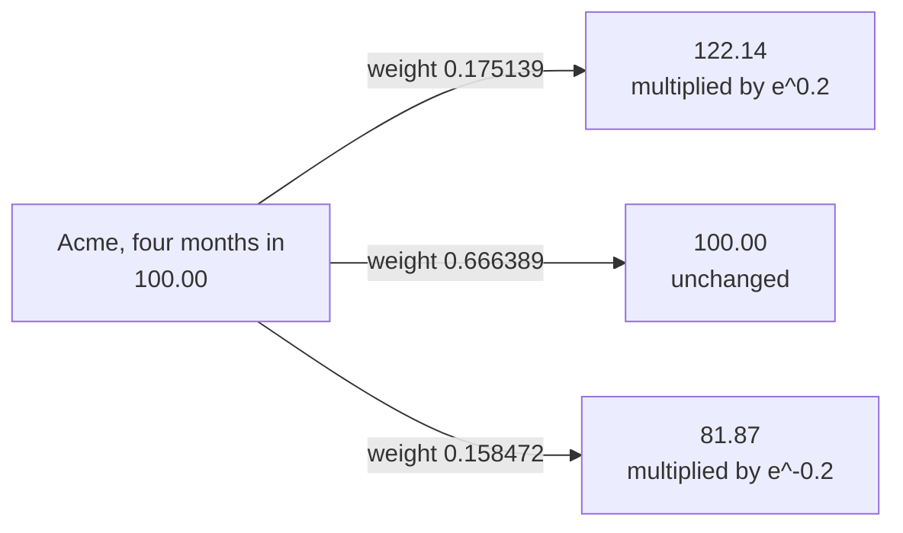
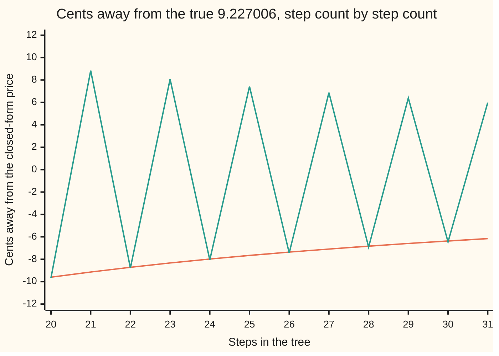

# Trinomial trees: three branches, a free parameter, and the finite-difference grid in disguise

Financial mathematics → Binomial Trees → The third branch → Trinomial trees

---

## General Overview

Acme trades at $100.00 today. A call option on it — the right, one year from now, to buy one share for $100.00 — is worth $9.23. A tree reaches that number by chopping the year into steps, listing the prices Acme could reach, and walking the option's value back from expiry to today.

A two-branch tree lets Acme go up or down each step. A trinomial tree adds a third branch: up, down, or unchanged. The construction is Phelim Boyle's, first published in 1986 and set out again in the 1988 paper cited below; trinomial tree is the term from here on.

The third branch changes what is fixed and what is free. With two branches, matching a step's average move and its jumpiness, with the rungs kept even, uses everything up: the jump size comes out forced, near one standard deviation of the step. With three branches the middle weight is a shock absorber: widen the gap between the up and down nodes and the middle branch takes more of the weight. So the **node spacing becomes a free choice** — the one thing a two-branch tree cannot give. Spend it on putting a row of nodes exactly on a strike, a barrier, or the level a short rate is pulled towards. Spend it badly and the weights go negative and the answer explodes.

There is a second payoff, and it is why this card closes the shelf. Write the Black-Scholes differential equation down, replace its derivatives by the crudest differences of neighbouring values, and rearrange: out comes this tree's recursion, the three branch weights sitting where the grid's three coefficients go.

**Three branches give three weights for three jobs, which leaves the node spacing free; and the recursion that walks the tree back is the explicit finite-difference scheme for the Black-Scholes equation, coefficient for coefficient, bar one term that shrinks with the step.**

**What kind of fact this is:** a method — a recipe for computing a price, with its accuracy stated rather than assumed. That it is the explicit grid's recursion, coefficients equal bar that vanishing term, is a theorem, proved on this card in Why it works.

### The picture: one node, three branches



Those are the real weights for the three-step tree worked below, and they are not forecasts: they are the numbers that get Acme's average log-move and its spread right over one step, the shelf's risk-neutral weights ([risk-neutral-probability](02-risk-neutral-probability.md)). Every node branches alike, and an up followed by a down lands back on the middle node, so the branches rejoin and the tree stays a narrow ladder rather than a fan.

---

## The formula

Notation first, in words. The card works in **log-price**: the natural logarithm of Acme's price, so that "multiply by 1.22" becomes "add 0.2" and the branches become add, do nothing, subtract. The step length in years is $\Delta t$ and the rung spacing in log-price is $\Delta x$; each is one symbol, not a product of two. The stretch $\lambda$, say "lambda", says how many standard deviations of one step the spacing is worth, and $\nu$, say "new", is the log-price's drift per year under the risk-neutral weights. The three branch weights are $p_u$ up, $p_m$ middle and $p_d$ down.

The ladder of prices is the same ladder at every step:

$$\Delta t = \frac{T}{n},\qquad \Delta x = \lambda\,\sigma\sqrt{\Delta t},\qquad \nu = r - q - \tfrac12\sigma^2,\qquad S_j = S\,e^{\,j\,\Delta x}$$

**Read it aloud:** cut the year into equal steps, pick a rung spacing worth so many standard deviations of one step, and lay the prices up and down from today's. The rung number j runs from minus the step count to plus it; rung zero is today's price.

$$p_u = \frac12\!\left(\frac{\sigma^2\Delta t + \nu^2\Delta t^2}{\Delta x^2} + \frac{\nu\,\Delta t}{\Delta x}\right),\qquad
p_m = 1 - \frac{\sigma^2\Delta t + \nu^2\Delta t^2}{\Delta x^2},\qquad
p_d = \frac12\!\left(\frac{\sigma^2\Delta t + \nu^2\Delta t^2}{\Delta x^2} - \frac{\nu\,\Delta t}{\Delta x}\right)$$

**Read it aloud:** the outer two weights split the step's jumpiness, the drift tips that split towards the up branch, and the middle weight is whatever is left.

$$V_{i,j} = e^{-r\Delta t}\left(p_u\,V_{i+1,\,j+1} + p_m\,V_{i+1,\,j} + p_d\,V_{i+1,\,j-1}\right)$$

**Read it aloud:** a node is worth the weighted average of the three nodes it can reach, carried back one step of interest. Start at expiry with the payoff $\max(S_j - K, 0)$ on every rung, apply that line $n$ times, and the middle rung is today's price.

| Symbol | Plain meaning | In our example | Push it up and the answer… |
| --- | --- | --- | --- |
| $S$ | Acme's price today | 100.00 | dearer call |
| $K$ | the strike, the price the option may buy at | 100.00 | cheaper call |
| $r$, $q$ | riskless rate; dividend yield, both continuously compounded | 5 percent; 2 percent | $r$ up lifts the call, $q$ up lowers it |
| $\sigma$ | volatility, how jumpy Acme is, per square root of a year | 20 percent | dearer call, wider rungs |
| $T$, $n$ | years to expiry; steps in the tree | 1 year; 3 by hand, 200 and 2000 in code | less error, more arithmetic |
| $\Delta t$ | one step's length in years, $T$ divided by $n$ | 0.333333 by hand | a coarser tree |
| $\Delta x$ | the rung spacing, in log-price | 0.200000 by hand | fatter middle weight |
| $\lambda$ | the stretch: step-standard-deviations per rung | 1.732051, the square root of 3 | as for $\Delta x$; at or below 1 the middle weight goes negative |
| $\nu$ | the log-price's drift per year under those weights | 0.010000 | the split tilts up |
| $u$, $d$ | the up and down multipliers, $e^{\Delta x}$ and $e^{-\Delta x}$ | 1.221403 and 0.818731 | a longer ladder |
| $p_u$, $p_m$, $p_d$, called $a_u$, $a_m$, $a_d$ on the grid side | weights on the up, middle and down branches | 0.175139, 0.666389, 0.158472 | more weight up, dearer call |
| $V$ | the option's value at a node, step i and rung j | 8.510012 at the root | — |

### When it holds

- **Geometric Brownian motion, with $r$, $q$ and $\sigma$ steady across a step.** The weights match one step's average log-move and its spread, nothing more. A volatility one point wrong moves the price by the option's volatility sensitivity times that point.
- **Spacing wide enough:** $\Delta x^2 \ge \sigma^2\Delta t + \nu^2\Delta t^2$, meaning $\lambda$ at or above 1.000417 at three steps, and closer to 1 as the steps shrink. Below that the middle weight is negative, and negative weight magnifies each step's error rather than smoothing it, as Step 5 traces. The other end binds only in quiet markets: the down weight stays positive while $\Delta x \le (\sigma^2 + \nu^2\Delta t)/\nu$, far above any spacing a share would use, but not above an interest rate's.
- **European exercise.** The recursion takes the discounted average and nothing else; cashing in early needs a comparison at every node, which is [american-exercise-on-a-tree](05-american-exercise-on-a-tree.md).
- **A grid of fixed width needs edges; a tree grows its own.** Chop the rungs to 20 either side, call the option worthless outside, and the 200-step grid price comes out at 8.239460 instead of 9.217514.

---

## Why it works

### Step 0: three branches, three jobs, one choice left over

Over one step the log-price must drift by the right amount on average and wiggle by the right amount around that drift. Two targets; the weights adding to one is not a third, it only means one weight is whatever is left.

A two-branch step has three dials: an up size, a down size and one weight. Two go on the targets, and the third has to go on keeping the rungs even — the down size the up size's reciprocal — or each layer sits offset from the one before and there is no fixed ladder. Nothing is spare, and the spacing comes out pinned at $\Delta x^2 = \sigma^2\Delta t + \nu^2\Delta t^2$: a stretch of 1.000417 at three steps, a whisker over one standard deviation of the step.

A three-branch step adds a dial, the third weight, and no new size to choose: the middle branch stays put. Two targets for two weights, so the spacing is nobody's job. It is free, subject only to a non-negative middle weight, and everything else follows from that.

### Step 1: what one step has to match

Under the risk-neutral weights Acme's log-price drifts by $\nu\Delta t$ over a step and spreads by $\sigma^2\Delta t$ around that drift ([geometric-brownian-motion](../../11-Stochastic%20processes%20and%20calculus/05-Brownian%20Motion/07-geometric-brownian-motion.md)); the $-\tfrac12\sigma^2$ inside $\nu$ is the usual charge for working in logs. Matching the average and the spread is the same as matching the average and the average square, which is tidier: the square of a move is $\Delta x^2$ whichever way it went.

$$(p_u - p_d)\,\Delta x = \nu\,\Delta t, \qquad (p_u + p_d)\,\Delta x^2 = \sigma^2\Delta t + \nu^2\Delta t^2$$

That right-hand side is the spread plus the square of the average, which is what an average square comes to.

### Step 2: three equations, three weights

<details>
<summary>The algebra behind this, if you want it</summary>

Both matching lines are built from two quantities: call $(\sigma^2\Delta t + \nu^2\Delta t^2)/\Delta x^2$ the **spread term** and $\nu\Delta t/\Delta x$ the **tilt term**. The second line says the up and down weights add to the spread term; the first says they differ by the tilt term. Add those: twice the up weight is spread plus tilt. Subtract: twice the down weight is spread minus tilt. Adding to one leaves the middle weight as one minus the spread term. That is the display formula.

Nothing needed the spacing to take a particular value. Every spacing gives a set of weights, shifting between the outside and the middle as it changes. That is the free parameter, seen in the algebra.

</details>

Writing the spacing as $\lambda\sigma\sqrt{\Delta t}$ makes the spare choice visible: the spread term is then one over $\lambda$ squared plus a term of size $\Delta t$, so the middle weight sits near one minus that. It vanishes at $\lambda = 1.000417$ for a three-step tree, the spacing a two-branch tree is forced to, and there the trinomial quietly is one. At the square root of 3 it is two thirds — the common desk choice, with all three weights comfortably positive.

### Step 3: stacking the step

One step is already priced on this shelf: a copy of the payoff built from shares and cash costs the discounted weighted average under the risk-neutral weights ([one-step-binomial-replication](01-one-step-binomial-replication.md)), and stacking steps backwards from expiry is [multi-step-trees-and-backward-induction](03-multi-step-trees-and-backward-induction.md). The backward stacking never counted branches. The copy does: shares and cash have two dials, so three outcomes cannot be hedged exactly, and the third weight is a choice. Matching the log-move's average and spread picks it, which leaves Acme's own average price a shade out, as the worked numbers show.

One consequence is the hinge of the rest of the card. **The rungs never move.** A two-branch tree's reachable prices alternate between two interleaved sets as the steps tick by; here every layer sits on the same ladder, and a tree whose nodes never move is a grid — rungs across, steps down.

### Step 4: the same three numbers fall out of the Black-Scholes equation

Written in log-price, the Black-Scholes equation ([black-scholes-equation](../08-The%20Black-Scholes%20call%20and%20put/07-black-scholes-equation.md)) loses every trace of the price level and becomes an equation with constant coefficients:

$$\frac{\partial V}{\partial t} + \nu\,\frac{\partial V}{\partial x} + \tfrac12\sigma^2\,\frac{\partial^2 V}{\partial x^2} - r\,V = 0$$

Solve it the crudest way there is. Put the values on the grid, replace the time derivative by the change over one step, the first space derivative by the difference between the rungs either side over twice the spacing, and the second by the three-point second difference. Solve for the earlier value:

$$V_{i,j} = \frac{1}{1 + r\Delta t}\Big(a_d\,V_{i+1,\,j-1} + a_m\,V_{i+1,\,j} + a_u\,V_{i+1,\,j+1}\Big)$$

$$a_u = \Delta t\left(\frac{\sigma^2}{2\,\Delta x^2} + \frac{\nu}{2\,\Delta x}\right),\qquad a_m = 1 - \frac{\sigma^2\Delta t}{\Delta x^2},\qquad a_d = \Delta t\left(\frac{\sigma^2}{2\,\Delta x^2} - \frac{\nu}{2\,\Delta x}\right)$$

Those three add to exactly one, and they are the branch weights with the $\nu^2\Delta t^2$ term missing. The gap on each outer weight is that term over twice the spacing squared: at 200 steps the code prints the difference between $p_u$ and $a_u$ as 0.000002083 and the predicted term as 0.000002083. The discounts differ too, 0.999750031 against 0.999750062. The weight gap shrinks with the step and the discount gap with its square, so both vanish as the steps shrink, and at 200 steps the two roads price the call at 9.217519 and 9.217514.

<details>
<summary>Detailed proof: the change of variable and the three difference quotients</summary>

**The change of variable.** In the price variable the equation reads
$$\frac{\partial V}{\partial t} + (r-q)\,S\,\frac{\partial V}{\partial S} + \tfrac12\sigma^2 S^2\,\frac{\partial^2 V}{\partial S^2} - rV = 0.$$
Take the log-price as the new variable. By the chain rule the first derivative in price, times the price, is the first derivative in log-price; differentiating again, the second derivative in price, times the price squared, is the second derivative in log-price minus the first. Substituting both and collecting the first-derivative terms leaves the drift bracket $r - q - \tfrac12\sigma^2$, which is $\nu$. Every coefficient is now constant, which is what lets the grid be evenly spaced.

**The difference quotients.** Writing the value at step i, rung j as $V_{i,j}$, replace
$$\frac{\partial V}{\partial t}\approx\frac{V_{i+1,j}-V_{i,j}}{\Delta t},\quad
\frac{\partial V}{\partial x}\approx\frac{V_{i+1,j+1}-V_{i+1,j-1}}{2\,\Delta x},\quad
\frac{\partial^2 V}{\partial x^2}\approx\frac{V_{i+1,j+1}-2V_{i+1,j}+V_{i+1,j-1}}{\Delta x^2},$$
taking the space derivatives at the later step, which is what makes the scheme **explicit**: the unknown earlier value stands alone, no system to solve. Take the rate-times-value term at the earlier step; multiplying through by $\Delta t$ then leaves that value times $1 + r\Delta t$ on the left and the three coefficients on the right, and dividing gives the scheme above. Added up, their drift terms cancel and their jumpiness terms cancel, leaving 1.

**The comparison.** Subtract the grid's up coefficient from the tree's up weight and the tilt terms cancel, leaving $\nu^2\Delta t^2/(2\Delta x^2)$; the down pair differ by the same amount, the middle pair by twice it with the opposite sign. Since the spacing squared is proportional to $\Delta t$, each gap is proportional to $\Delta t$ and vanishes in the limit. Taking the rate-times-value term at the later step instead gives a factor of one minus $r\Delta t$; all three choices agree with $e^{-r\Delta t}$ to first order.

</details>

### Step 5: positive weights are the stability condition

An explicit scheme is stable only while the time step is small enough for the spacing, $\Delta t \le \Delta x^2/\sigma^2$. Cross that line and rounding error is multiplied rather than damped at every step, and the answer runs away.

Read the same condition through the tree and it says the spacing squared must be at least $\sigma^2\Delta t$ — the requirement that the middle weight not go negative, bar the same $\nu^2\Delta t^2$ term. The two warnings are one warning, and a rare case of a numerical condition meaning something in the world: the scheme is safe exactly when it describes something that could happen. At $\lambda = 0.80$, middle weight −0.563802, the price at 5, 10, 15 and 20 steps runs 25.000112, then −328.100480, then 9719.182406, then −314933.652887.

<details>
<summary>Boyle's own version, and the rest of the family</summary>

Boyle wrote the jumps multiplicatively — up by $e^{\lambda\sigma\sqrt{\Delta t}}$, middle multiplier 1, down by its reciprocal — and matched the average and spread of the **price** rather than of the log-price. Kamrad and Ritchken tidied the family into the stretch used here; their weights drop the $\nu^2\Delta t^2$ term, which makes their middle weight exactly $1 - 1/\lambda^2$, vanishing at a stretch of 1. Those versions differ by terms of size $\Delta t$, the same size as the gap to the grid, so all converge to the same number at the same rate; matching the log-price rather than the price is what lets the weights line up with the grid coefficients at all.

A second route arrives from the two-branch side: glue each pair of steps of a binomial tree of half the step length together, and the pair ends one full jump up, one full jump down, or back where it started — a trinomial step with a stretch of the square root of 2.

</details>

---

## Worked numbers, by hand

Three steps of four months each, at the desk's stretch. That lands the arithmetic on the shelf's house tree exactly: the rung spacing works out at 0.200000 in log-price, so the multipliers are 1.221403 up and 0.818731 down — the same 1.2214 and 0.8187 the shelf uses for a one-year step.

| Step | Arithmetic | Value |
| --- | --- | --- |
| one step | 1 year ÷ 3 | 0.333333 |
| rung spacing | 1.732051 × 0.20 × √0.333333 | 0.200000 |
| up and down multipliers | e^0.2 and e^−0.2 | 1.221403 and 0.818731 |
| log drift per year | 0.05 − 0.02 − ½ × 0.04 | 0.010000 |
| spread term | (0.04 × 0.333333 + 0.0001 × 0.111111) ÷ 0.04 | 0.333611 |
| tilt term | 0.01 × 0.333333 ÷ 0.2 | 0.016667 |
| up weight | half of (0.333611 + 0.016667) | **0.175139** |
| middle weight | 1 − 0.333611 | **0.666389** |
| down weight | half of (0.333611 − 0.016667) | **0.158472** |
| the option's price | e^−0.05 × (0.247907 × 22.140276 + 0.061322 × 49.182470 + 0.005372 × 82.211880), weights unrounded | **8.510012** |

The last line needs the tree's ending rungs. Only three of the seven finish above the $100.00 strike, and those three carry the whole price.

| Ending rung | Acme's price | Weight | Payoff |
| --- | --- | --- | --- |
| +3 | 182.211880 | 0.005372 | 82.211880 |
| +2 | 149.182470 | 0.061322 | 49.182470 |
| +1 | 122.140276 | 0.247907 | 22.140276 |

```
where the three-step tree lands: weight on each ending price, one block = 0.008

  182.21  █                                                   0.005372
  149.18  ████████                                            0.061322
  122.14  ███████████████████████████████                     0.247907
  100.00  ███████████████████████████████████████████████████  0.406898
   81.87  ████████████████████████████                        0.224315
   67.03  ██████                                              0.050206
   54.88  █                                                   0.003980
```

A bell curve, three steps in, leaning slightly right. Weight each ending price by its weight and add: 103.045431, against the 103.045453 that Acme's own growth demands. The remainder is what the tree pays for matching the average of the **logarithm** rather than of the price itself.

Walking the same tree backwards node by node gives 8.510012 too, to twelve digits. So a three-step tree prices this call at **$8.51** against a true $9.23 — coarse, and honestly so, with only seven endings. Run 200 steps and the price is $9.217519; run 2000 and it is $9.226058, against the closed-form 9.227006 from [black-scholes-call](../08-The%20Black-Scholes%20call%20and%20put/01-black-scholes-call.md). Ten times the steps, one tenth the error.

### What breaks if you drop a piece

| Mistake | Comes out at | What went wrong |
| --- | --- | --- |
| Stretch set to 1.00, the two-branch spacing | 9.857399, middle weight −0.000833 | Nothing left for the middle branch to carry |
| Stretch set to 0.80 | 15.179215 at three steps, −314933.652887 at twenty | Middle weight −0.563802, and every step magnifies the last one's error |
| Drift tilt dropped, up and down weighted alike | 8.643091 | Acme no longer drifts at $r - q$ under the weights, so the copy is not a copy |
| Discount forgotten on each step | 9.690111 | A year of interest never taken off a payment that arrives in a year |
| Grid chopped to 20 rungs either side | 8.239460 | The top rows were told the option is worthless, and that verdict walked inwards |

---

## How the answer moves as the steps get finer

Both trees on this shelf converge at the same rate, roughly one over the step count, but they do not get there the same way.



The smooth line climbing towards zero is the trinomial tree; the line flipping from side to side is the two-branch tree at the same step counts. The reason is the strike. The payoff has a corner at $100.00, and a lattice sees that corner only through whichever ending prices sit near it. The trinomial ladder has a rung at today's price for every step count, so the corner is always seen the same way and the error shrinks steadily. The two-branch tree has a node there only on even counts; on odd counts the strike falls between two nodes and the price jumps to the other side of the truth. Twenty steps gives 9.130450, twenty-one gives 9.315376.

That is the practical case for the third branch: not speed, since the extra branch costs arithmetic at every node, but **predictability**. An error that shrinks smoothly can be extrapolated; one that flips sign cannot be trusted at any single step count, which is why two-branch prices are usually averaged over consecutive counts before being quoted.

The freedom itself this example cannot show: the strike sits on today's price. Move it off and no step count gives a two-branch tree a node there, while a trinomial tree gets one by choosing the stretch so the spacing divides the log-distance to the strike a whole number of times.

---

## Code, from first principles, and it actually runs

Nothing is imported that already knows an answer: the bell-curve area is built by adding thin slices, and every price is a loop. Four roads reach the call. **Road A** walks the trinomial tree backwards. **Road B** builds the same tree's ending spread of prices step by step, then takes one discounted average, never discounting inside. **Road C** is the closed form, for comparison. **Road D** builds a rectangular grid whose coefficients are read off the differential equation, with the discount the equation itself produces, and never mentions a probability. The two-branch tree runs alongside for the convergence picture, and every wrong answer quoted above is reproduced.

### Python

```python
# Trinomial trees and the grid connection -- the check behind the card.
# Standard library only, and nothing imported that already knows an answer:
# the bell-curve area is built by adding thin slices (Simpson's rule), and
# every price below is a loop written out here.  Acme: S = 100, K = 100,
# r = 5 percent, q = 2 percent, sigma = 20 percent, T = 1 year.
from math import log, sqrt, exp, pi

S, K, R, Q, SIG, T = 100.0, 100.0, 0.05, 0.02, 0.20, 1.0
LAM = sqrt(3.0)                              # the stretch: dx = LAM * sigma * sqrt(dt)

def bell(x): return exp(-0.5 * x * x) / sqrt(2.0 * pi)             # bell-curve height at x

def ncdf(x):                                 # area to the left of x, by Simpson's rule
    if x < 0.0:
        return 1.0 - ncdf(-x)
    n, total = 4000, bell(0.0) + bell(x)
    h = x / n
    for i in range(1, n):
        total += (4.0 if i % 2 else 2.0) * bell(i * h)
    return 0.5 + total * h / 3.0

def black_scholes_call():                    # road C: the closed form, for comparison only
    vt = SIG * sqrt(T)
    d1 = (log(S / K) + (R - Q + 0.5 * SIG * SIG) * T) / vt
    return S * exp(-Q * T) * ncdf(d1) - K * exp(-R * T) * ncdf(d1 - vt)

def weights(n, lam=LAM, tilt_on=True):       # three branch weights: mean and variance matched
    dt = T / n
    dx = lam * SIG * sqrt(dt)
    nu = R - Q - 0.5 * SIG * SIG
    spread = (SIG * SIG * dt + nu * nu * dt * dt) / (dx * dx)      # p_u + p_d
    tilt = nu * dt / dx if tilt_on else 0.0                        # p_u - p_d
    return dt, dx, nu, 0.5 * (spread + tilt), 1.0 - spread, 0.5 * (spread - tilt)

def tree_backward(n, lam=LAM, tilt_on=True, disc=None):            # road A
    dt, dx, _, pu, pm, pd = weights(n, lam, tilt_on)
    step = exp(-R * dt) if disc is None else disc
    v = [max(S * exp(dx * k) - K, 0.0) for k in range(-n, n + 1)]
    for _ in range(n):
        v = [step * (pd * v[j] + pm * v[j + 1] + pu * v[j + 2]) for j in range(len(v) - 2)]
    return v[0]

def tree_forward(n, lam=LAM):                # road B: the tree's own ending spread of prices
    dt, dx, _, pu, pm, pd = weights(n, lam)
    dist = [1.0]
    for _ in range(n):
        nxt = [0.0] * (len(dist) + 2)
        for j, w in enumerate(dist):
            nxt[j] += w * pd
            nxt[j + 1] += w * pm
            nxt[j + 2] += w * pu
        dist = nxt
    ends = [S * exp(dx * (j - n)) for j in range(len(dist))]
    price = exp(-R * T) * sum(w * max(e - K, 0.0) for w, e in zip(dist, ends))
    return price, dist, ends, sum(w * e for w, e in zip(dist, ends))

def grid_explicit(n, half=None):             # road D: coefficients read off the equation itself
    half = n if half is None else half
    dt = T / n
    dx = LAM * SIG * sqrt(dt)
    nu = R - Q - 0.5 * SIG * SIG
    a_u = dt * (0.5 * SIG * SIG / (dx * dx) + nu / (2.0 * dx))
    a_m = 1.0 - dt * SIG * SIG / (dx * dx)
    a_d = dt * (0.5 * SIG * SIG / (dx * dx) - nu / (2.0 * dx))
    df = 1.0 / (1.0 + R * dt)                                      # not e^-r dt: the equation's own
    v = [max(S * exp(dx * k) - K, 0.0) for k in range(-half, half + 1)]
    for _ in range(n):
        nv = [0.0] * len(v)                                        # edges held at zero
        for j in range(1, len(v) - 1):
            nv[j] = df * (a_d * v[j - 1] + a_m * v[j] + a_u * v[j + 1])
        v = nv
    return v[half], a_u, a_m, a_d, df

def crr_binomial(n):                         # two branches, for the convergence picture
    dt = T / n
    u = exp(SIG * sqrt(dt))
    d = 1.0 / u
    p = (exp((R - Q) * dt) - d) / (u - d)
    disc = exp(-R * dt)
    v = [max(S * u ** j * d ** (n - j) - K, 0.0) for j in range(n + 1)]
    for step in range(n, 0, -1):
        v = [disc * (p * v[j + 1] + (1.0 - p) * v[j]) for j in range(step)]
    return v[0]

bs = black_scholes_call()
dt3, dx3, nu3, pu3, pm3, pd3 = weights(3)
back3 = tree_backward(3)
fwd3, dist3, ends3, mean3 = tree_forward(3)
back200, (fd200, a_u, a_m, a_d, df200) = tree_backward(200), grid_explicit(200)
dt200, dx200, nu200, pu200, pm200, pd200 = weights(200)

print(f"Acme call: S {S:.0f}, K {K:.0f}, r {R:.2f}, q {Q:.2f}, sigma {SIG:.2f}, T {T:.0f} year")
print(f"road C, Black-Scholes closed form              {bs:12.6f}")
print(f"three steps: lambda {LAM:.6f}  dt {dt3:.6f}  dx {dx3:.6f}  nu {nu3:.6f}  "
      f"u {exp(dx3):.6f}  d {exp(-dx3):.6f}")
print(f"three-step weights: p_u {pu3:.6f}  p_m {pm3:.6f}  p_d {pd3:.6f}  sum {pu3+pm3+pd3:.6f}")
print(f"three-step split: p_u + p_d {pu3+pd3:.6f}  p_u - p_d {pu3-pd3:.6f}")
print("ending nodes of the three-step tree: node, Acme price, weight, payoff")
for j, (w, e) in enumerate(zip(dist3, ends3)):
    print(f"   k {j-3:+d}   {e:10.6f}   {w:.6f}   {max(e-K,0.0):10.6f}")
print(f"road A, three-step tree, backward induction    {back3:12.6f}")
print(f"road B, three-step tree, ending sum            {fwd3:12.6f}")
print(f"three-step tree's own average ending price {mean3:11.6f}   exact S e^(r-q)T {S*exp((R-Q)*T):11.6f}")
print(f"road A, 200-step tree, backward induction      {back200:12.6f}")
print(f"road D, 200-step explicit grid                 {fd200:12.6f}")
print(f"road A, 2000-step tree                         {tree_backward(2000):12.6f}")
print(f"road D, 2000-step explicit grid                {grid_explicit(2000)[0]:12.6f}")
print(f"200 steps, tree weights: p_u {pu200:.9f}  p_m {pm200:.9f}  p_d {pd200:.9f}")
print(f"200 steps, grid weights: a_u {a_u:.9f}  a_m {a_m:.9f}  a_d {a_d:.9f}")
print(f"  p_u - a_u {pu200-a_u:.9f}   predicted (nu dt)^2 / (2 dx^2) "
      f"{0.5*nu200*nu200*dt200*dt200/(dx200*dx200):.9f}")
print(f"  one step: e^-r dt {exp(-R*dt200):.9f}   1 / (1 + r dt) {df200:.9f}")
print()
print("convergence, cents away from 9.227006: the trinomial marches, the binomial flips")
print(f"{'steps':>6}{'trinomial':>12}{'cents':>9}{'binomial':>12}{'cents':>9}")
tri_cents, bin_cents = [], []
for n in range(20, 32):
    tri, bino = tree_backward(n), crr_binomial(n)
    tri_cents.append((tri - bs) * 100.0)
    bin_cents.append((bino - bs) * 100.0)
    print(f"{n:>6}{tri:>12.6f}{tri_cents[-1]:>9.2f}{bino:>12.6f}{bin_cents[-1]:>9.2f}")
print()
print("what breaks if a piece is dropped")
pm_l1, pm_l08, lam_min = weights(3, lam=1.0)[4], weights(3, lam=0.8)[4], sqrt(1.0 + nu3 * nu3 * dt3 / (SIG * SIG))
print(f"  the middle weight vanishes at lambda {lam_min:.6f}, not at 1.000000")
print(f"  lambda 1.00, three steps: p_m {pm_l1:.6f}, price {tree_backward(3, lam=1.0):12.6f}")
print(f"  lambda 0.80, three steps: p_m {pm_l08:.6f}, price {tree_backward(3, lam=0.8):12.6f}")
for n in (5, 10, 15, 20):
    print(f"  lambda 0.80, {n:>2} steps:     price {tree_backward(n, lam=0.8):18.6f}")
print(f"  drift tilt dropped, 200 steps:    price {tree_backward(200, tilt_on=False):12.6f}")
print(f"  discount forgotten, 200 steps:    price {tree_backward(200, disc=1.0):12.6f}")
print(f"  grid chopped to 20 nodes either side, 200 steps: price {grid_explicit(200, 20)[0]:12.6f}")
assert abs(back3 - fwd3) < 1e-12, "backward induction must match the tree's own ending sum"
assert abs(back200 - bs) < 0.01, "200-step tree lands within a cent of the closed form"
assert abs(fd200 - back200) < 0.00001, "the explicit grid is the tree"
assert abs((pu200 - a_u) - 0.5 * nu200 * nu200 * dt200 * dt200 / (dx200 * dx200)) < 1e-15, "the gap is (nu dt)^2 / (2 dx^2)"
assert abs(weights(3, lam=lam_min)[4]) < 1e-15 and pm_l1 < 0.0 < pm3, "the middle weight vanishes at lam_min, is negative at stretch 1, positive at sqrt(3)"
assert max(tri_cents) < 0.0 < max(bin_cents), "the trinomial stays one side, the binomial crosses"
print("ALL CHECKS PASS")
```

**Ran 2026-09-19 on macOS, Python 3.14.6, standard library only. All checks passed. Output, pasted from the run:**

```
Acme call: S 100, K 100, r 0.05, q 0.02, sigma 0.20, T 1 year
road C, Black-Scholes closed form                  9.227006
three steps: lambda 1.732051  dt 0.333333  dx 0.200000  nu 0.010000  u 1.221403  d 0.818731
three-step weights: p_u 0.175139  p_m 0.666389  p_d 0.158472  sum 1.000000
three-step split: p_u + p_d 0.333611  p_u - p_d 0.016667
ending nodes of the three-step tree: node, Acme price, weight, payoff
   k -3    54.881164   0.003980     0.000000
   k -2    67.032005   0.050206     0.000000
   k -1    81.873075   0.224315     0.000000
   k +0   100.000000   0.406898     0.000000
   k +1   122.140276   0.247907    22.140276
   k +2   149.182470   0.061322    49.182470
   k +3   182.211880   0.005372    82.211880
road A, three-step tree, backward induction        8.510012
road B, three-step tree, ending sum                8.510012
three-step tree's own average ending price  103.045431   exact S e^(r-q)T  103.045453
road A, 200-step tree, backward induction          9.217519
road D, 200-step explicit grid                     9.217514
road A, 2000-step tree                             9.226058
road D, 2000-step explicit grid                    9.226057
200 steps, tree weights: p_u 0.167689371  p_m 0.666662500  p_d 0.165648129
200 steps, grid weights: a_u 0.167687287  a_m 0.666666667  a_d 0.165646046
  p_u - a_u 0.000002083   predicted (nu dt)^2 / (2 dx^2) 0.000002083
  one step: e^-r dt 0.999750031   1 / (1 + r dt) 0.999750062

convergence, cents away from 9.227006: the trinomial marches, the binomial flips
 steps   trinomial    cents    binomial    cents
    20    9.131016    -9.60    9.130450    -9.66
    21    9.135647    -9.14    9.315376     8.84
    22    9.139851    -8.72    9.139171    -8.78
    23    9.143685    -8.33    9.307658     8.07
    24    9.147196    -7.98    9.146448    -8.06
    25    9.150423    -7.66    9.301179     7.42
    26    9.153399    -7.36    9.152612    -7.44
    27    9.156152    -7.09    9.295663     6.87
    28    9.158707    -6.83    9.157900    -6.91
    29    9.161084    -6.59    9.290911     6.39
    30    9.163300    -6.37    9.162486    -6.45
    31    9.165373    -6.16    9.286774     5.98

what breaks if a piece is dropped
  the middle weight vanishes at lambda 1.000417, not at 1.000000
  lambda 1.00, three steps: p_m -0.000833, price     9.857399
  lambda 0.80, three steps: p_m -0.563802, price    15.179215
  lambda 0.80,  5 steps:     price          25.000112
  lambda 0.80, 10 steps:     price        -328.100480
  lambda 0.80, 15 steps:     price        9719.182406
  lambda 0.80, 20 steps:     price     -314933.652887
  drift tilt dropped, 200 steps:    price     8.643091
  discount forgotten, 200 steps:    price     9.690111
  grid chopped to 20 nodes either side, 200 steps: price     8.239460
ALL CHECKS PASS
```

Four roads, one price. The tree walked backwards and the tree's own ending spread agree to twelve digits, so the recursion is doing the averaging it claims. The grid built from the differential equation lands within five parts in ten million of the tree at 200 steps, and the two gaps predicted in Step 4 account for all of it.

### Rust

The same four roads, the same labels, no crates. Built with `rustc --edition 2021 -O`.

```rust
// Trinomial trees and the grid connection -- the same check as the Python, in
// Rust.  No crates.  Nothing here already knows an answer: the bell-curve area
// is built by adding thin slices (Simpson's rule), and every price is a loop.
// Acme: S = 100, K = 100, r = 5 percent, q = 2 percent, sigma = 20 percent,
// T = 1 year.  Compile: rustc --edition 2021 -O trinomial_trees_and_the_grid_connection_check.rs
use std::f64::consts::PI;

const S: f64 = 100.0; const K: f64 = 100.0; const R: f64 = 0.05;
const Q: f64 = 0.02; const SIG: f64 = 0.20; const T: f64 = 1.0;

fn lam() -> f64 { 3.0_f64.sqrt() }           // the stretch: dx = lam * sigma * sqrt(dt)

fn bell(x: f64) -> f64 { (-0.5 * x * x).exp() / (2.0 * PI).sqrt() }   // bell-curve height at x

fn ncdf(x: f64) -> f64 {                     // area to the left of x, by Simpson's rule
    if x < 0.0 { return 1.0 - ncdf(-x); }
    let (n, h) = (4000, x / 4000.0);
    let mut total = bell(0.0) + bell(x);
    for i in 1..n { total += (if i % 2 == 1 { 4.0 } else { 2.0 }) * bell(i as f64 * h); }
    0.5 + total * h / 3.0
}

fn black_scholes_call() -> f64 {             // road C: the closed form, for comparison only
    let vt = SIG * T.sqrt();
    let d1 = ((S / K).ln() + (R - Q + 0.5 * SIG * SIG) * T) / vt;
    S * (-Q * T).exp() * ncdf(d1) - K * (-R * T).exp() * ncdf(d1 - vt)
}

// three branch weights: mean and variance matched.  Returns dt, dx, nu, p_u, p_m, p_d.
fn weights(n: usize, lam: f64, tilt_on: bool) -> (f64, f64, f64, f64, f64, f64) {
    let dt = T / n as f64;
    let dx = lam * SIG * dt.sqrt();
    let nu = R - Q - 0.5 * SIG * SIG;
    let spread = (SIG * SIG * dt + nu * nu * dt * dt) / (dx * dx);      // p_u + p_d
    let tilt = if tilt_on { nu * dt / dx } else { 0.0 };                // p_u - p_d
    (dt, dx, nu, 0.5 * (spread + tilt), 1.0 - spread, 0.5 * (spread - tilt))
}

fn payoffs(n: usize, dx: f64) -> Vec<f64> {  // the payoff at every ending node, low to high
    (0..2 * n + 1).map(|k| (S * (dx * (k as f64 - n as f64)).exp() - K).max(0.0)).collect()
}

fn tree_backward(n: usize, lam: f64, tilt_on: bool, disc: Option<f64>) -> f64 {   // road A
    let (dt, dx, _, pu, pm, pd) = weights(n, lam, tilt_on);
    let step = match disc { Some(x) => x, None => (-R * dt).exp() };
    let mut v = payoffs(n, dx);
    for _ in 0..n {
        v = (0..v.len() - 2).map(|j| step * (pd * v[j] + pm * v[j + 1] + pu * v[j + 2])).collect();
    }
    v[0]
}

// road B: the tree's own ending spread of prices.  Returns price, weights, ends, average end.
fn tree_forward(n: usize, lam: f64) -> (f64, Vec<f64>, Vec<f64>, f64) {
    let (_, dx, _, pu, pm, pd) = weights(n, lam, true);
    let mut dist: Vec<f64> = vec![1.0];
    for _ in 0..n {
        let mut nxt = vec![0.0; dist.len() + 2];
        for (j, w) in dist.iter().enumerate() {
            nxt[j] += w * pd; nxt[j + 1] += w * pm; nxt[j + 2] += w * pu;
        }
        dist = nxt;
    }
    let ends: Vec<f64> = (0..dist.len()).map(|j| S * (dx * (j as f64 - n as f64)).exp()).collect();
    let pv: f64 = dist.iter().zip(ends.iter()).map(|(w, e)| w * (e - K).max(0.0)).sum();
    let mean: f64 = dist.iter().zip(ends.iter()).map(|(w, e)| w * e).sum();
    ((-R * T).exp() * pv, dist, ends, mean)
}

// road D: coefficients read off the equation itself.  Returns price, a_u, a_m, a_d, df.
fn grid_explicit(n: usize, half: usize) -> (f64, f64, f64, f64, f64) {
    let (dt, dx, nu, _, _, _) = weights(n, lam(), true);
    let a_u = dt * (0.5 * SIG * SIG / (dx * dx) + nu / (2.0 * dx));
    let a_m = 1.0 - dt * SIG * SIG / (dx * dx);
    let a_d = dt * (0.5 * SIG * SIG / (dx * dx) - nu / (2.0 * dx));
    let df = 1.0 / (1.0 + R * dt);                                     // not e^-r dt: the equation's own
    let mut v = payoffs(half, dx);
    for _ in 0..n {
        let mut nv = vec![0.0; v.len()];                               // edges held at zero
        for j in 1..v.len() - 1 { nv[j] = df * (a_d * v[j - 1] + a_m * v[j] + a_u * v[j + 1]); }
        v = nv;
    }
    (v[half], a_u, a_m, a_d, df)
}

fn crr_binomial(n: usize) -> f64 {           // two branches, for the convergence picture
    let dt = T / n as f64;
    let (u, disc) = ((SIG * dt.sqrt()).exp(), (-R * dt).exp());
    let d = 1.0 / u;
    let p = (((R - Q) * dt).exp() - d) / (u - d);
    let mut v: Vec<f64> = (0..n + 1)
        .map(|j| (S * u.powi(j as i32) * d.powi((n - j) as i32) - K).max(0.0)).collect();
    for step in (1..=n).rev() {
        v = (0..step).map(|j| disc * (p * v[j + 1] + (1.0 - p) * v[j])).collect();
    }
    v[0]
}

fn main() {
    let bs = black_scholes_call();
    let (dt3, dx3, nu3, pu3, pm3, pd3) = weights(3, lam(), true);
    let back3 = tree_backward(3, lam(), true, None);
    let (fwd3, dist3, ends3, mean3) = tree_forward(3, lam());
    let back200 = tree_backward(200, lam(), true, None);
    let (fd200, a_u, a_m, a_d, df200) = grid_explicit(200, 200);
    let (dt200, dx200, nu200, pu200, pm200, pd200) = weights(200, lam(), true);
    println!("Acme call: S {:.0}, K {:.0}, r {:.2}, q {:.2}, sigma {:.2}, T {:.0} year", S, K, R, Q, SIG, T);
    println!("road C, Black-Scholes closed form              {:12.6}", bs);
    println!("three steps: lambda {:.6}  dt {:.6}  dx {:.6}  nu {:.6}  u {:.6}  d {:.6}",
             lam(), dt3, dx3, nu3, dx3.exp(), (-dx3).exp());
    println!("three-step weights: p_u {:.6}  p_m {:.6}  p_d {:.6}  sum {:.6}", pu3, pm3, pd3, pu3 + pm3 + pd3);
    println!("three-step split: p_u + p_d {:.6}  p_u - p_d {:.6}", pu3 + pd3, pu3 - pd3);
    println!("ending nodes of the three-step tree: node, Acme price, weight, payoff");
    for j in 0..dist3.len() {
        println!("   k {:+}   {:10.6}   {:.6}   {:10.6}",
                 j as i32 - 3, ends3[j], dist3[j], (ends3[j] - K).max(0.0));
    }
    println!("road A, three-step tree, backward induction    {:12.6}", back3);
    println!("road B, three-step tree, ending sum            {:12.6}", fwd3);
    println!("three-step tree's own average ending price {:11.6}   exact S e^(r-q)T {:11.6}",
             mean3, S * ((R - Q) * T).exp());
    println!("road A, 200-step tree, backward induction      {:12.6}", back200);
    println!("road D, 200-step explicit grid                 {:12.6}", fd200);
    println!("road A, 2000-step tree                         {:12.6}", tree_backward(2000, lam(), true, None));
    println!("road D, 2000-step explicit grid                {:12.6}", grid_explicit(2000, 2000).0);
    println!("200 steps, tree weights: p_u {:.9}  p_m {:.9}  p_d {:.9}", pu200, pm200, pd200);
    println!("200 steps, grid weights: a_u {:.9}  a_m {:.9}  a_d {:.9}", a_u, a_m, a_d);
    println!("  p_u - a_u {:.9}   predicted (nu dt)^2 / (2 dx^2) {:.9}",
             pu200 - a_u, 0.5 * nu200 * nu200 * dt200 * dt200 / (dx200 * dx200));
    println!("  one step: e^-r dt {:.9}   1 / (1 + r dt) {:.9}", (-R * dt200).exp(), df200);
    println!();
    println!("convergence, cents away from 9.227006: the trinomial marches, the binomial flips");
    println!("{:>6}{:>12}{:>9}{:>12}{:>9}", "steps", "trinomial", "cents", "binomial", "cents");
    let (mut tri_cents, mut bin_cents): (Vec<f64>, Vec<f64>) = (Vec::new(), Vec::new());
    for n in 20..32 {
        let (tri, bino) = (tree_backward(n, lam(), true, None), crr_binomial(n));
        let (ct, cb) = ((tri - bs) * 100.0, (bino - bs) * 100.0);
        tri_cents.push(ct); bin_cents.push(cb);
        println!("{:>6}{:>12.6}{:>9.2}{:>12.6}{:>9.2}", n, tri, ct, bino, cb);
    }
    println!();
    println!("what breaks if a piece is dropped");
    let (pm_l1, pm_l08) = (weights(3, 1.0, true).4, weights(3, 0.8, true).4);
    let lam_min = (1.0 + nu3 * nu3 * dt3 / (SIG * SIG)).sqrt();     // where the middle weight vanishes
    println!("  the middle weight vanishes at lambda {:.6}, not at 1.000000", lam_min);
    println!("  lambda 1.00, three steps: p_m {:.6}, price {:12.6}", pm_l1, tree_backward(3, 1.0, true, None));
    println!("  lambda 0.80, three steps: p_m {:.6}, price {:12.6}", pm_l08, tree_backward(3, 0.8, true, None));
    for n in [5usize, 10, 15, 20] {
        println!("  lambda 0.80, {:>2} steps:     price {:18.6}", n, tree_backward(n, 0.8, true, None));
    }
    println!("  drift tilt dropped, 200 steps:    price {:12.6}", tree_backward(200, lam(), false, None));
    println!("  discount forgotten, 200 steps:    price {:12.6}", tree_backward(200, lam(), true, Some(1.0)));
    println!("  grid chopped to 20 nodes either side, 200 steps: price {:12.6}", grid_explicit(200, 20).0);
    assert!((back3 - fwd3).abs() < 1e-12, "backward induction must match the tree's own ending sum");
    assert!((back200 - bs).abs() < 0.01, "200-step tree lands within a cent of the closed form");
    assert!((fd200 - back200).abs() < 0.00001, "the explicit grid is the tree");
    assert!(((pu200 - a_u) - 0.5 * nu200 * nu200 * dt200 * dt200 / (dx200 * dx200)).abs() < 1e-15,
            "the gap is (nu dt)^2 / (2 dx^2)");
    assert!(weights(3, lam_min, true).4.abs() < 1e-15 && pm_l1 < 0.0 && 0.0 < pm3,
            "the middle weight vanishes at lam_min, is negative at stretch 1, positive at sqrt(3)");
    let tri_max = tri_cents.iter().cloned().fold(f64::MIN, f64::max);
    let bin_max = bin_cents.iter().cloned().fold(f64::MIN, f64::max);
    assert!(tri_max < 0.0 && 0.0 < bin_max, "the trinomial stays one side, the binomial crosses");
    println!("ALL CHECKS PASS");
}
```

**Ran 2026-09-19 on macOS, rustc 1.98.1, no crates. All checks passed. Output, pasted from the run:**

```
Acme call: S 100, K 100, r 0.05, q 0.02, sigma 0.20, T 1 year
road C, Black-Scholes closed form                  9.227006
three steps: lambda 1.732051  dt 0.333333  dx 0.200000  nu 0.010000  u 1.221403  d 0.818731
three-step weights: p_u 0.175139  p_m 0.666389  p_d 0.158472  sum 1.000000
three-step split: p_u + p_d 0.333611  p_u - p_d 0.016667
ending nodes of the three-step tree: node, Acme price, weight, payoff
   k -3    54.881164   0.003980     0.000000
   k -2    67.032005   0.050206     0.000000
   k -1    81.873075   0.224315     0.000000
   k +0   100.000000   0.406898     0.000000
   k +1   122.140276   0.247907    22.140276
   k +2   149.182470   0.061322    49.182470
   k +3   182.211880   0.005372    82.211880
road A, three-step tree, backward induction        8.510012
road B, three-step tree, ending sum                8.510012
three-step tree's own average ending price  103.045431   exact S e^(r-q)T  103.045453
road A, 200-step tree, backward induction          9.217519
road D, 200-step explicit grid                     9.217514
road A, 2000-step tree                             9.226058
road D, 2000-step explicit grid                    9.226057
200 steps, tree weights: p_u 0.167689371  p_m 0.666662500  p_d 0.165648129
200 steps, grid weights: a_u 0.167687287  a_m 0.666666667  a_d 0.165646046
  p_u - a_u 0.000002083   predicted (nu dt)^2 / (2 dx^2) 0.000002083
  one step: e^-r dt 0.999750031   1 / (1 + r dt) 0.999750062

convergence, cents away from 9.227006: the trinomial marches, the binomial flips
 steps   trinomial    cents    binomial    cents
    20    9.131016    -9.60    9.130450    -9.66
    21    9.135647    -9.14    9.315376     8.84
    22    9.139851    -8.72    9.139171    -8.78
    23    9.143685    -8.33    9.307658     8.07
    24    9.147196    -7.98    9.146448    -8.06
    25    9.150423    -7.66    9.301179     7.42
    26    9.153399    -7.36    9.152612    -7.44
    27    9.156152    -7.09    9.295663     6.87
    28    9.158707    -6.83    9.157900    -6.91
    29    9.161084    -6.59    9.290911     6.39
    30    9.163300    -6.37    9.162486    -6.45
    31    9.165373    -6.16    9.286774     5.98

what breaks if a piece is dropped
  the middle weight vanishes at lambda 1.000417, not at 1.000000
  lambda 1.00, three steps: p_m -0.000833, price     9.857399
  lambda 0.80, three steps: p_m -0.563802, price    15.179215
  lambda 0.80,  5 steps:     price          25.000112
  lambda 0.80, 10 steps:     price        -328.100480
  lambda 0.80, 15 steps:     price        9719.182406
  lambda 0.80, 20 steps:     price     -314933.652887
  drift tilt dropped, 200 steps:    price     8.643091
  discount forgotten, 200 steps:    price     9.690111
  grid chopped to 20 nodes either side, 200 steps: price     8.239460
ALL CHECKS PASS
```

The two outputs match line for line.

> [!TIP]
> **Try changing**
> Guess first, then run it. Each of these trips an assert, which is what the asserts are for.
> - **Set the stretch to 1.00.** Change `LAM` to `1.0`. The middle weight becomes −0.000833 and the three-step price rises to 9.857399: a two-branch tree with a sliver of negative weight.
> - **Switch off the drift tilt.** Pass `tilt_on=False` to the 200-step run: 8.643091, because Acme no longer drifts at $r - q$ under the weights.
> - **Starve the grid.** Call `grid_explicit(200, 20)` instead of the full width: 8.239460, as the worthless top rows walk inwards.

---

## The usual mistake

> [!warning]
> **Believing the third branch makes the tree a better description of the world.** It does not. Acme is no likelier to end a step exactly unchanged than a two-branch tree implies, and the middle weight of 0.666389 is nobody's estimate of anything. Every stretch matches the same two facts about one step, and each gives different weights. The third branch buys where the nodes sit, not how true they are.
>
> - **Choosing the spacing without checking the weights.** A stretch of 1 or below gives a negative middle weight, which amplifies rather than averages.
> - **Dropping the tilt because it looks small.** The $\nu\Delta t/\Delta x$ term is the smallest thing in the formula and the only thing making Acme grow at the right rate. Without it the 200-step price is 8.643091, nearly sixty cents light.
> - **Forgetting that a grid has edges and a tree does not.** A tree grows exactly wide enough that nothing outside it is consulted. A grid of fixed width must be told what the option is worth at its top and bottom rows, and a bad answer there walks inwards one rung per step: 8.239460 against 9.217514.

---

## Where you meet it in real life

- **Interest-rate models.** A short rate pulled back towards a long-run level cannot sit on a two-branch tree without the branches tilting; the trinomial's spare weight absorbs the pull, and at the extreme rungs the branching pattern is switched rather than the spacing. That is the construction on [hull-white-trinomial-tree](../30-Short-Rate%20Models/06-hull-white-trinomial-tree.md), and the main reason the method is on every rates desk.
- **Barrier options.** A contract that dies if the share touches a level needs nodes on that level, or the tree reports the crossing a step late. The stretch is chosen so the spacing divides the log-distance to the barrier a whole number of times.
- **Finite-difference pricing.** Once the tree is recognised as the explicit scheme, the rest of the numerical shelf opens ([finite-differences-for-the-black-scholes-equation](../06-Numerical%20Methods%20for%20Pricing/07-finite-differences-for-the-black-scholes-equation.md)): the implicit and Crank-Nicolson schemes solve a small system at each step in exchange for dropping the stability condition.
- **Early exercise.** The comparison at every node an American option needs is unchanged by the third branch, and the extra rung on the strike helps the exercise boundary settle: [american-exercise-on-a-tree](05-american-exercise-on-a-tree.md).

> **Say it back**
> A trinomial tree lets the share go up, stay put, or go down at each step. The three weights have three jobs: add to one, get the average log-move right, get the spread right. That leaves the rung spacing free, which a two-branch tree cannot offer, and the freedom is spent putting nodes where they are needed — a strike, a barrier, a rate level. The spacing must stay at or above one step-standard-deviation, or the middle weight goes negative and the answer runs away. Write the Black-Scholes equation in log-price, replace its derivatives by the crudest differences, and the three grid coefficients come out as the three branch weights, bar one term that shrinks with the step. The tree and the grid are the same arithmetic.

---

## What this builds on

- [crr-tree-and-convergence](04-crr-tree-and-convergence.md): the two-branch tree with its spacing pinned at one step-standard-deviation, and the error that flips sign as steps are added — the thing this card frees, and the thing it smooths.

## Where this goes next

- [hull-white-trinomial-tree](../30-Short-Rate%20Models/06-hull-white-trinomial-tree.md): the same three branches carrying an interest rate pulled back towards a level, with the branching switched at the top and bottom rungs to keep every weight positive.

The spacing here is free but chosen once and held for the whole tree; what to do when the thing being modelled drags the nodes around is the question the short-rate shelf opens with.

---

## Sources

Verified 14 Sep 2026: every link below resolves to the publisher's page.

- Boyle, Phelim P. "A Lattice Framework for Option Pricing with Two State Variables." *The Journal of Financial and Quantitative Analysis* 23, no. 1 (1988): 1–12. [doi:10.2307/2331019](https://doi.org/10.2307/2331019). Section II's three-jump lattice, spacing chosen rather than derived.
- Kamrad, Bardia, and Peter Ritchken. "Multinomial Approximating Models for Options with k State Variables." *Management Science* 37, no. 12 (1991): 1640–1652. [doi:10.1287/mnsc.37.12.1640](https://doi.org/10.1287/mnsc.37.12.1640). The stretch parameter, and the collapse to two branches at a stretch of 1.
- Hull, John, and Alan White. "Valuing Derivative Securities Using the Explicit Finite Difference Method." *The Journal of Financial and Quantitative Analysis* 25, no. 1 (1990): 87–100. [doi:10.2307/2330889](https://doi.org/10.2307/2330889). The equivalence in Step 4, and the stability condition read as positive weights.
- Brennan, Michael J., and Eduardo S. Schwartz. "Finite Difference Methods and Jump Processes Arising in the Pricing of Contingent Claims: A Synthesis." *The Journal of Financial and Quantitative Analysis* 13, no. 3 (1978): 461–474. [doi:10.2307/2330152](https://doi.org/10.2307/2330152). The earlier synthesis: an explicit scheme is a jump process.
- Clewlow, Les, and Chris Strickland. *Implementing Derivative Models*. Wiley, 1998. [Publisher page](https://www.wiley.com/en-us/Implementing+Derivative+Models-p-9780471966517). The log-price trinomial in the exact form used here, written out for code.
