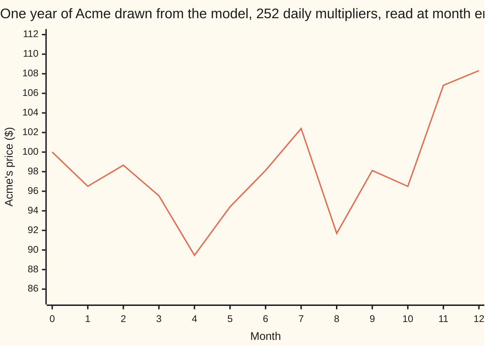
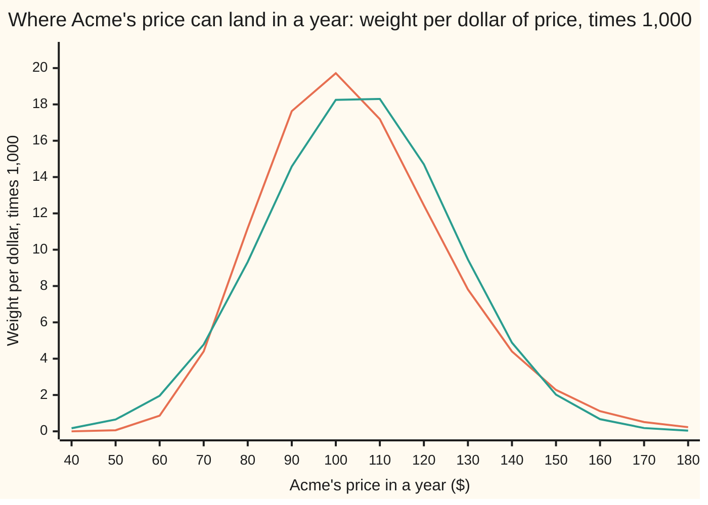
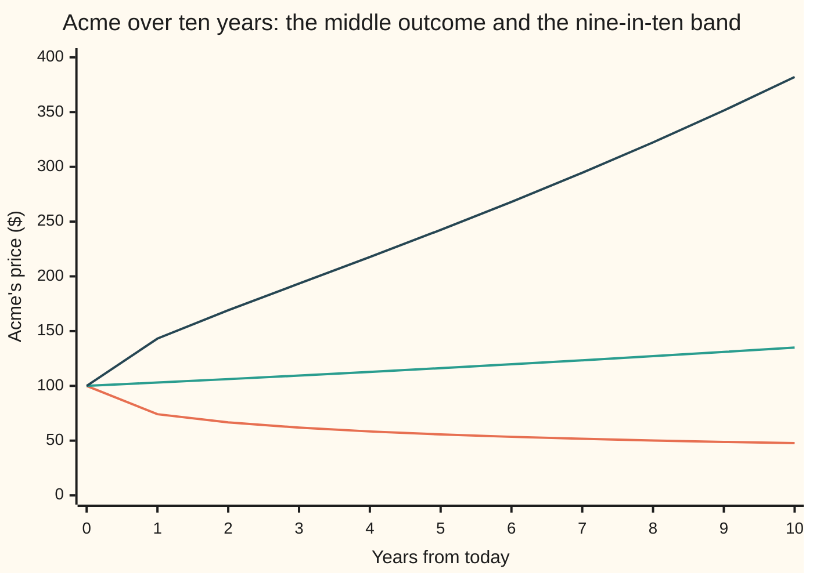

# Prices as geometric Brownian motion: the model behind Black-Scholes

[Syllabus](../../../SYLLABUS.md) → [Financial mathematics](../README.md) → [Black-Scholes from the Ground Up](../README.md#s05) → Prices as geometric Brownian motion

---

## General Overview

Acme shares trade at $100.00 today. Every pricing formula on this shelf needs to know what they might be worth in a year — not one number, but every price the year could end at, each with a weight. Supplying that list is the whole job of a price model.

A share moves in percentages, not dollars. A one-dollar move is a day's news for a ten-dollar share and a rounding error for a thousand-dollar one. So a year is not a sum of dollar moves but a product of multipliers: up 0.7% today, down 1.2% tomorrow, two hundred and fifty more of them.

Geometric Brownian motion is that product, with the multipliers made very many and very small. Two dials set it: the **drift**, the steady part of the growth, 5% a year for Acme, and the **volatility**, the size of the random part, 20% a year. Both are supplied to the model, not produced by it.

The weights hold a surprise. A year out the middle outcome — half the years end above it, half below — is **$103.05**. The average outcome is **$105.13**. Every formula that prices anything has to know which of the two it is using.

**A price under this model is today's price times a random multiplier, and the logarithm of that multiplier is a bell curve: steady growth, less half the variance, plus the noise piled up so far.**

**What kind of fact this is:** a model — an assumption chosen because it fits markets well enough to price with and because it can be solved exactly. The solved formula below is a theorem *about* the model, proved on this card in Why it works.

### The picture: one simulated year of Acme



One draw, not a forecast. This year dipped to $89.46 by month four and finished at $108.32, above both the middle outcome and the average. The model says nothing about which year arrives, only how the weight is spread across all of them.

---

## The formula

Notation first, in words. A letter with a small $d$ in front means the tiny change in that quantity over the next instant, and a subscript is the date. The noise is standard Brownian motion, written $W_t$: it starts at zero, and its change over a stretch of time is a bell-curve draw centred on zero whose spread is the square root of the stretch's length. That change over the next instant is $dW_t$, and the square root is why a volatility is quoted per square root of a year.

The model is one line:

$$\frac{dS_t}{S_t} \;=\; \mu\,dt \;+\; \sigma\,dW_t$$

**Read it aloud:** over the next instant the price's percentage change is a steady piece plus a random kick, and both are percentages of the price standing now.

A price near zero therefore gets tiny kicks in dollars and never crosses into negative numbers.

Solved — the solving is the next section — the same line says where the price can be at any date:

$$S_T \;=\; S_0\,\exp\!\Big(\big(\mu - \tfrac12\sigma^2\big)T \;+\; \sigma\sqrt{T}\,Z\Big)$$

**Read it aloud:** today's price, multiplied by the exponential of a bell-curve draw whose centre is the growth rate less half the variance and whose width is the volatility times the square root of the horizon.

Said about logarithms, which is the form every later card uses:

$$\ln\!\frac{S_T}{S_0} \;\sim\; \text{Normal}\Big(\big(\mu - \tfrac12\sigma^2\big)T,\;\; \sigma^2 T\Big)$$

In words: the logarithm of the year's growth is a bell curve centred on the log drift, with variance $\sigma^2T$ — the second number in a Normal is the variance, the square of the spread. A quantity whose logarithm is a bell curve is **lognormal** ([Lognormal](../../09-Probability%20and%20statistics/04-Continuous%20Distributions/06-lognormal-distribution.md)), and that word carries the rest of the shelf.

| Symbol | Plain meaning | In our example | Push it up and the answer… |
| --- | --- | --- | --- |
| $S_0$ | Acme's price today | $100.00 | every later price scales with it |
| $S_T$ | the price at the horizon: the unknown | middle $103.05, average $105.13 | — |
| $\mu$ | the **drift**: the growth rate of the *average* price, per year. Say "mew". Later cards replace it with the bank rate less the dividend yield. | 5% | every summary of the year rises |
| $\sigma$ | the **volatility**: the size of the random kick, per square root of a year. Say "sigma". | 20% | the spread widens and the middle falls, while the average holds still |
| $T$ | the horizon, in years | 1 | the log spread grows like its square root |
| $W_t$ | the noise piled up so far: a bell-curve draw centred on zero, variance the time elapsed | — | — |
| $dW_t$ | the noise's change over the next instant | — | — |
| $Z$ | one draw from the standard bell curve: centre zero, spread one | — | — |
| $\mu - \tfrac12\sigma^2$ | the **log drift**: the growth rate of the *middle* outcome | 3% a year | the middle climbs |
| $\sigma\sqrt{T}$ | the **log spread**: the width of the logarithm's bell curve | 0.20 | the fan opens |
| $N(x)$ | the bell curve's area to the left of $x$ | — | — |
| $K$ | a price level the year may end above or below | $100.00 | the chance of ending below rises |

Four readings come off it: the middle outcome, the average, the spread, and the chance of ending under a level $K$.

$$\text{middle}(S_T) = S_0\,e^{(\mu - \frac12\sigma^2)T}, \qquad \text{average}(S_T) = S_0\,e^{\mu T}, \qquad \text{spread}(S_T) = S_0\,e^{\mu T}\sqrt{e^{\sigma^2T} - 1}$$

$$\text{chance}\,(S_T < K) \;=\; N\!\left(\frac{\ln(K/S_0) - (\mu - \frac12\sigma^2)T}{\sigma\sqrt{T}}\right)$$

The middle outcome is the **median**, the price with half the weight below it. It is not the average, and why is the next section.

### When it holds

- **Moves are percentages of the price standing now.** That keeps the price positive, and it is why the model fits shares. A quantity that can cross zero — a profit, the gap between two rates — needs [Bachelier](07-bachelier-model.md) instead.
- **The drift and the volatility hold still.** Real volatility clusters. Let it move and the year's law is no longer lognormal, so one volatility stops fitting every strike — the mismatch handled in [Shifted lognormal and volatility conversion](08-shifted-lognormal-and-volatility-conversion.md).
- **The kicks are independent and the path never jumps.** With no overnight gap the tails come out too thin: a one-day fall of a fifth is a move the model prices at essentially never, and days like that have happened.
- **The start is positive and the horizon is finite.** From $100.00 the price can crawl arbitrarily close to zero without touching it; a company that goes to nothing is outside the model.
- **The drift is an opinion.** A volatility can be pinned down from a few months of daily moves. A drift cannot: its error shrinks only with the square root of the *span* of the data, so ten years of Acme's history leaves a range wider than the 5% itself. Pricing cards never use $\mu$.

**Conventions verified 19 Sep 2026:** rates here are continuously compounded, so a 5% drift multiplies the average by $e^{0.05}$ — $\$105.13$ from $\$100.00$, a shade more than five dollars. Volatility is quoted per square root of a year, with $T$ in calendar years.

---

## Why it works

### Step 0: a price move is a percentage, so add up logarithms

Percentage moves multiply rather than add: a 20% rise then a 20% fall on $100.00 leaves $96.00, because the fall is taken on the larger balance.

Logarithms turn multiplying into adding ([Logarithms](../../01-Foundations/03-Powers%2C%20Roots%20and%20Logarithms/05-logarithms.md)). So the quantity that behaves well over a year is the logarithm of the growth: the year's log-growth is the sum of the day-by-day log-moves. The rest of the card works inside that sum and exponentiates at the end.

### Step 1: many small independent kicks pile up into a bell curve

Each instant's kick is assumed to be a bell-curve draw, which is not a strong assumption: adding up very many small independent moves of almost any shape gives a bell curve anyway.

Two consequences carry through the shelf. A sum of independent bell curves is a bell curve, so the log-growth over any horizon is one. And variances add, not spreads: $\sigma^2$ per year gives $\sigma^2T$ over $T$ years, so the spread is $\sigma\sqrt{T}$. Four years of Acme has twice the spread of one year, not four times.

### Step 2: the wiggling costs the logarithm half the variance a year

The log-growth does not drift at $\mu$. It drifts at $\mu - \tfrac12\sigma^2$, and two routes reach the same subtraction.

**By arithmetic.** For any $x$, $(1+x)(1-x) = 1 - x^2$: a rise of 20% and a fall of 20% leave $96.00, the pair losing the square of the move. Spread over the two steps that is $\tfrac12\ln(0.96) = -0.020411$ of log-growth per step, against $-\tfrac12\sigma^2 = -0.020000$. Half the variance is the size of the loss.

**By Itô's lemma.** Over an instant $d\ln S$ is not $dS/S$: the logarithm bends, so a second term survives, $d\ln S = dS/S - \tfrac12 (dS/S)^2$. A kick of typical size $\sigma\sqrt{dt}$ squares to $\sigma^2dt$, the same order as the drift term rather than smaller, so it does not vanish — proved in [Geometric Brownian motion](../../11-Stochastic%20processes%20and%20calculus/05-Brownian%20Motion/07-geometric-brownian-motion.md). The log therefore picks up $-\tfrac12\sigma^2\,dt$ every instant.

Integrate over the horizon — the coefficients are constants, so this is exact — and the log-growth is a bell curve centred on $(\mu - \tfrac12\sigma^2)T$ with spread $\sigma\sqrt{T}$.

### Step 3: undo the logarithm and the middle falls out

Exponentiating keeps the order of outcomes, so the price with half the weight below it is the exponential of the log's centre — and a bell curve's centre is its middle:

$$\text{middle}(S_T) = S_0\,e^{(\mu - \frac12\sigma^2)T} = 100 \times e^{0.03} = \$103.05 .$$

The middle outcome of Acme's year grows at 3% a year, not 5%.

### Step 4: the average is not the middle

The average needs one piece of algebra: exponentiating a symmetric bell curve is lopsided. Up-draws stretch further than down-draws squash, so the average of $e^{\sigma\sqrt{T}Z}$ is not 1 but $e^{\sigma^2T/2}$ — a lift of 1.0202 for Acme's year.

That lift exactly cancels the $-\tfrac12\sigma^2T$ sitting in the centre:

$$\text{average}(S_T) = S_0\,e^{(\mu - \frac12\sigma^2)T}\,e^{\sigma^2T/2} = S_0\,e^{\mu T} = 100 \times e^{0.05} = \$105.13 .$$

So the drift is the growth rate of the average and nothing else. The average sits above the middle by that same lift factor $e^{\sigma^2T/2}$: a few runaway years pull it up while most years sit lower. A third summary, the peak of the density, sits lower still at $99.00, below today's price.

<details>
<summary>Detailed proof: the solved formula, the lift, and both summaries</summary>

**The formula solves the model.** Rather than assume a positive solution and take its logarithm, verify the answer. Put $f(t,w) = S_0\exp\big((\mu - \tfrac12\sigma^2)t + \sigma w\big)$, whose slopes are $\partial f/\partial t = (\mu - \tfrac12\sigma^2)f$, $\partial f/\partial w = \sigma f$ and $\partial^2 f/\partial w^2 = \sigma^2 f$. Itô's lemma for a function of time and the noise says
$$df = \Big(\frac{\partial f}{\partial t} + \tfrac12\frac{\partial^2 f}{\partial w^2}\Big)dt + \frac{\partial f}{\partial w}\,dW_t = \big(\mu - \tfrac12\sigma^2\big)f\,dt + \tfrac12\sigma^2 f\,dt + \sigma f\,dW_t = \mu f\,dt + \sigma f\,dW_t .$$
The two half-variance terms cancel and the model is what is left, with the candidate standing in for the price. So $S_T = f(T, W_T)$ satisfies the model, is positive by construction, and starts at $S_0$.

**The lift.** For a constant $u$, the average of $e^{uZ}$ over the standard bell curve is $\int e^{uz}e^{-z^2/2}\,dz/\sqrt{2\pi}$. Complete the square: $uz - \tfrac12 z^2 = -\tfrac12(z-u)^2 + \tfrac12u^2$. What is left is the whole area under a bell curve centred at $u$, which is 1, so the average is $e^{u^2/2}$. With $u = \sigma\sqrt{T}$ that is $e^{\sigma^2T/2}$, and multiplying it into $S_0e^{(\mu - \sigma^2/2)T}$ gives $S_0e^{\mu T}$.

**The spread and the middle.** Take $u = 2\sigma\sqrt{T}$ and the average of the *square* is $S_0^2e^{(2\mu + \sigma^2)T}$; subtract the square of the average and the variance is $S_0^2e^{2\mu T}(e^{\sigma^2T}-1)$, whose square root is 21.24 dollars for Acme's year. The middle needs no lift: exponentiating preserves order, and a bell curve's middle is its centre, so the middle of $S_T$ is $S_0e^{(\mu - \sigma^2/2)T}$. The peak of the density is a third quantity, $S_0e^{(\mu - 3\sigma^2/2)T}$.

</details>

### The picture: the model's law, against a bell curve on the price itself



The lopsided line is the model's law: a short left side that cannot reach zero, a long right tail that carries the average above the middle. The symmetric line is a bell curve laid on the price itself, same average and same spread — the tempting shortcut. It is too fat on the left, too thin on the right, and it spills off the end, putting weight 0.000000371 on prices below zero.

A second route needs no calculus. Chop the year into 400 steps and let each one multiply the price by $e^{\sigma\sqrt{T/400}}$ or by its reciprocal, the odds tilted just enough to give the log drift. That lattice's average is 105.126851 against the formula's 105.127110, and its log spread 0.199994 against 0.200000. Pricing on the lattice is the business of [Cox-Ross-Rubinstein](../04-Binomial%20Trees/04-crr-tree-and-convergence.md).

---

## Worked numbers, by hand

Acme: $S_0 = \$100.00$, drift 5% a year, volatility 20% a year, horizon one year.

| Step | Arithmetic | Value |
| --- | --- | --- |
| half the variance, $\tfrac12\sigma^2$ | $\tfrac12 \times 0.20 \times 0.20$ | $0.02$ a year |
| the log drift, $\mu - \tfrac12\sigma^2$ | $0.05 - 0.02$ | $0.03$ a year |
| the log spread, $\sigma\sqrt{T}$ | $0.20 \times \sqrt{1}$ | $0.20$ |
| the middle outcome | $100 \times e^{0.03}$ | **$\$103.05$** |
| the average outcome | $100 \times e^{0.05}$ | **$\$105.13$** |
| average divided by middle | $e^{0.02}$ | $1.0202$ |
| the spread of the price | $105.127110 \times \sqrt{e^{0.04}-1}$ | $\$21.24$ |
| the peak of the density | $100 \times e^{0.05 - 0.06}$ | $\$99.00$ |
| chance the year ends under $100 | $N(-0.03/0.20) = N(-0.15)$ | $0.4404$ |
| the 5th and 95th percentiles: the band nine years in ten land inside | $100 \times e^{0.03 \,\pm\, 0.20 \times 1.6449}$ | $\$74.16$ and $\$143.19$ |

A positive 5% drift, and still 44% of years end below where they started: the drift moves the average, and the average is held up by the long right tail.

**Cross-check against the shelf's market.** The shelf prices Acme at $100.00 with a $100.00 strike, a 5% bank rate, a 2% dividend yield, 20% volatility and one year; its call is worth 9.227005508154. Those cards use this law with one change: the drift becomes the bank rate less the dividend yield, 3% a year. Integrating the call's payoff against the law with that drift, discounted at 5%, gives 9.227006 — the shelf's number, out of this card's law. Under that drift the average price is 103.045453, the forward price, which is the same figure as this card's middle outcome: half of Acme's variance happens to equal its dividend yield. Two different quantities, one number, in this market only.

### What breaks if you drop a piece

| Mistake | Comes out at | What went wrong |
| --- | --- | --- |
| Reading the drift as the typical year | $105.13 as "the middle" | that is the average; the middle is $103.05, and 44% of years finish under $100.00 |
| Treating a rise and fall of 20% as a wash | $96.00 | percentages multiply: the pair costs the variance, and the log drag per step is $-0.020411$ against $-0.020000$ |
| Scaling the spread as $\sigma T$, four-year horizon | 95th percentile $420.34 (right: $217.70) | variances add, spreads do not: the square root of the horizon, not the horizon |
| Putting the bell curve on the price, not its log | weight $0.000000371$ below zero | a share cannot trade below nothing, and the whole shape is wrong besides |

Every number in that table is printed by the code below.

---

## How the fan opens with the horizon

The middle outcome creeps up at 3% a year. The range does not creep: it opens like a fan, because the spread grows with the square root of the horizon while the middle grows steadily.

| Horizon | Middle | Average | 5th percentile | 95th percentile | Chance under $100 |
| --- | --- | --- | --- | --- | --- |
| 1 month | $100.25 | $100.42 | $91.17 | $110.24 | 48.27% |
| 1 year | $103.05 | $105.13 | $74.16 | $143.19 | 44.04% |
| 5 years | $116.18 | $128.40 | $55.68 | $242.44 | 36.87% |
| 10 years | $134.99 | $164.87 | $47.70 | $382.02 | 31.76% |

Ten years out the middle outcome is $134.99, while the nine-in-ten band runs from $47.70 to $382.02: the middle has moved a third, and the top of the band is eight times the bottom. A ten-year price target from a model like this one is the middle of a fan that wide.

### One force at a time: what volatility alone does

Hold the drift at 5% and the horizon at one year, and turn the volatility dial. The average does not move; the middle falls, and the gap between them is the drag.

```
volatility        the gap between average and middle, one block = $0.20
                  (the average is $105.13 in every row)
      10%   ███                                       $0.52   middle $104.60
      20%   ██████████                                $2.08   middle $103.05
      30%   ███████████████████████                   $4.63   middle $100.50
      40%   ████████████████████████████████████████  $8.08   middle  $97.04
```

Doubling the volatility from 20% to 40% takes the drag from $2.08 to $8.08, almost four times: the drag follows the *variance*, which quadruples. At 40% the middle year of a share with a positive 5% drift ends below where it started.

### Both together



Bottom line: the 5th percentile, the price one year in twenty ends below. Middle: the middle outcome, climbing at 3% a year. Top: the 95th percentile. The band stretches much further up than down — the lognormal shape seen from the side.

---

## Code, from first principles, and it actually runs

Four independent roads reach the law. Road one is the formulas above. Road two never touches them: it adds thin slices of the density in price space for the average, and hunts the price with half the area below it for the middle. Road three multiplies 400 up-or-down steps together, no calculus anywhere. Road four simulates 20,000 years. Then the same law, with the drift swapped for the pricing drift, is integrated against a call payoff and lands on the shelf's pinned call price.

Nothing is imported that already holds an answer: the bell curve's area is Simpson's rule written out, the percentiles come from a bisection search, and the draws come from a 64-bit multiply-and-add generator and Marsaglia's polar method.

### Python

```python
# Prices as geometric Brownian motion -- the check behind the card.  Standard library only,
# and nothing imported that already holds an answer: the bell curve's area, the percentiles,
# the random draws and the option price are built here.  Acme: 100 dollars, drift 5% a year,
# volatility 20% a year, one year ahead.
from math import exp, log, sqrt
S0, MU, SIG, T = 100.0, 0.05, 0.20, 1.0
K, R, Q = 100.0, 0.05, 0.02                       # the shelf's market, for the cross-check
TWO_PI, PATHS, STEPS, NLAT = 6.283185307179586, 20000, 52, 400
def phi(z): return exp(-0.5 * z * z) / sqrt(TWO_PI)        # bell-curve height at z
def simpson(f, a, b, n):                          # area under f from a to b, n panels
    h = (b - a) / n
    s = f(a) + f(b)
    for i in range(1, n):
        s += (4.0 if i % 2 else 2.0) * f(a + i * h)
    return s * h / 3.0
def ncdf(x):                                      # bell-curve area to the left of x
    if x < -12.0: return 0.0
    if x > 12.0: return 1.0
    return 0.5 + simpson(phi, 0.0, x, 4000)
def bisect(f, lo, hi):                            # the crossing point of a rising f
    flo = f(lo)
    for _ in range(80):
        mid = 0.5 * (lo + hi)
        fmid = f(mid)
        if flo * fmid <= 0.0: hi = mid
        else: lo, flo = mid, fmid
    return 0.5 * (lo + hi)
def logdrift(mu, sig): return mu - 0.5 * sig * sig         # the log's own growth rate
def median_of(mu, sig, t): return S0 * exp(logdrift(mu, sig) * t)
def mean_of(mu, t): return S0 * exp(mu * t)
def quantile(sig, t, z): return S0 * exp(logdrift(MU, sig) * t + sig * sqrt(t) * z)
def below(t, level): return ncdf((log(level / S0) - logdrift(MU, SIG) * t) / (SIG * sqrt(t)))
def dens(x): return phi((log(x / S0) - m) / s) / (x * s)   # lognormal height at the price x
class Rng:                                        # a 64-bit multiply-and-add generator
    def __init__(self, seed): self.s = seed & 0xFFFFFFFFFFFFFFFF
    def uniform(self):
        self.s = (self.s * 6364136223846793005 + 1442695040888963407) & 0xFFFFFFFFFFFFFFFF
        return (self.s >> 11) * (1.0 / 9007199254740992.0)
    def normal(self):                             # Marsaglia's polar method, no trig
        while True:
            u = 2.0 * self.uniform() - 1.0
            v = 2.0 * self.uniform() - 1.0
            q = u * u + v * v
            if 0.0 < q < 1.0: return u * sqrt(-2.0 * log(q) / q)
def walk(rng, steps, keep):                       # one exact path, every keep'th price kept
    a, b = logdrift(MU, SIG) * T / steps, SIG * sqrt(T / steps)
    s, low, out = S0, S0, [S0]
    for i in range(steps):
        s *= exp(a + b * rng.normal())
        if s < low: low = s
        if (i + 1) % keep == 0: out.append(s)
    return out, low
def row(name, a): print(f"{name:<44}{a:>14.6f}")
def two(name, a, b): print(f"{name:<44}{a:>14.6f}{b:>14.6f}")
def grid(name, vals): print(f"{name:<20}" + "".join(f"{v:>7.2f}" for v in vals))
m, s = logdrift(MU, SIG) * T, SIG * sqrt(T)       # road 1: the formulas
med, mean = median_of(MU, SIG, T), mean_of(MU, T)
sd = sqrt(S0 * S0 * exp(2.0 * MU * T) * (exp(SIG * SIG * T) - 1.0))
z05, z95 = bisect(lambda z: ncdf(z) - 0.05, -12.0, 12.0), bisect(lambda z: ncdf(z) - 0.95, -12.0, 12.0)
LO, HI = 1e-9, 1000.0                             # road 2: the density, in price space
mean_i = simpson(lambda x: x * dens(x), LO, HI, 4000)
med_i = bisect(lambda x: simpson(dens, LO, x, 2000) - 0.5, LO, HI)
below_i = simpson(dens, LO, K, 2000)
x, dt = SIG * sqrt(T / NLAT), T / NLAT            # road 3: small up-or-down multiplications
p = 0.5 * (1.0 + logdrift(MU, SIG) * dt / x)
lat_mean = S0 * (p * exp(x) + (1.0 - p) * exp(-x)) ** NLAT
lat_spread = 2.0 * sqrt(NLAT * p * (1.0 - p)) * x
rng, ends, low = Rng(20260919), [], S0            # road 4: simulate the years
for _ in range(PATHS):
    path, plow = walk(rng, STEPS, STEPS)
    ends.append(path[-1]); low = min(low, plow)
mc_mean = sum(ends) / PATHS
mc_sd = sqrt(sum((e - mc_mean) ** 2 for e in ends) / (PATHS - 1))
mc_med = 0.5 * sum(sorted(ends)[PATHS // 2 - 1:PATHS // 2 + 1])
logs = [log(e / S0) for e in ends]
mc_logmean = sum(logs) / PATHS
mc_logsd = sqrt(sum((v - mc_logmean) ** 2 for v in logs) / (PATHS - 1))
mc_below = sum(1 for e in ends if e < K) / PATHS
se_mean, se_med = mc_sd / sqrt(PATHS), mc_med * s * sqrt(TWO_PI) / (2.0 * sqrt(PATHS))
fwd = S0 * exp((R - Q) * T)                       # the same law with the pricing drift
call = exp(-R * T) * simpson(lambda z: max(S0 * exp((R - Q - 0.5 * SIG * SIG) * T + SIG * sqrt(T) * z) - K, 0.0) * phi(z), -10.0, 10.0, 40000)
print(f"Acme: {S0:.2f} dollars today, drift 5% a year, volatility 20% a year, horizon 1 year")
print("road 1, the formulas")
print(f"{'half variance, log drift, log spread':<38}{0.5 * SIG * SIG * T:>14.6f}{m:>14.6f}{s:>14.6f}")
row("median  S0 e^((mu - sigma^2/2) T)", med)
row("mean    S0 e^(mu T)", mean)
two("mean / median, then e^(sigma^2 T / 2)", mean / med, exp(0.5 * SIG * SIG * T))
row("standard deviation of S_T", sd)
row("mode, the peak of the density", S0 * exp((MU - 1.5 * SIG * SIG) * T))
row("chance S_T lands below 100", below(T, K))
two("5th and 95th percentile of S_T", quantile(SIG, T, z05), quantile(SIG, T, z95))
two("the bell curve's own 5% and 95% points", z05, z95)
print("road 2, slices of the density added up in price space")
row("mean", mean_i)
row("median, the price with half the area below", med_i)
row("chance S_T lands below 100", below_i)
print(f"road 3, {NLAT} multiplicative up-or-down steps")
row("mean", lat_mean)
two("spread of the log return, then sigma sqrt(T)", lat_spread, s)
print(f"road 4, {PATHS} simulated years, {STEPS} steps each")
two("mean, then three standard errors", mc_mean, 3.0 * se_mean)
two("median, then three standard errors", mc_med, 3.0 * se_med)
two("spread of the log return, then sigma sqrt(T)", mc_logsd, s)
row("share of years landing below 100", mc_below)
two("lowest tick, then years ending at or below 0", low, 0.0)
print("the shelf's market: the drift swapped for r - q = 3% a year")
row("forward price, the mean of S_T", fwd)
two("call by this law, then the shelf's price", call, 9.227005508154)
print(f"volatility drag at one year, mean {mean:.6f} in every row")
for sg in (0.10, 0.20, 0.30, 0.40): row(f"sigma {sg * 100:.0f}%   median", median_of(MU, sg, T))
grid("drag, mean - median", [mean - median_of(MU, sg, T) for sg in (0.10, 0.20, 0.30, 0.40)])
print(f"{'horizon':<20}{'median':>7}{'mean':>7}{'5th':>7}{'95th':>7}{'under%':>7}")
for t, name in ((1.0 / 12.0, "1 month"), (1.0, "1 year"), (5.0, "5 years"), (10.0, "10 years")):
    grid(name, [median_of(MU, SIG, t), mean_of(MU, t), quantile(SIG, t, z05), quantile(SIG, t, z95), 100.0 * below(t, K)])
one, _ = walk(Rng(7), 252, 21)
print("chart 1, one simulated year of Acme, month 0 to month 12")
grid("chart 1, price", one)
print("chart 2, density x 1000, at prices 40 to 180 in tens")
prices = [40.0 + 10.0 * i for i in range(15)]
grid("chart 2, lognormal", [1000.0 * dens(v) for v in prices])
grid("chart 2, bell curve", [1000.0 * phi((v - mean) / sd) / sd for v in prices])
print("chart 3, the fan, year 0 to year 10")
for name, z in (("chart 3, 5th", z05), ("chart 3, median", 0.0), ("chart 3, 95th", z95)):
    grid(name, [quantile(SIG, float(y), z) for y in range(11)])
print("what breaks if you drop a piece")
two("drift as the middle, then the real middle", mean, med)
two("+20% then -20% on 100, then its log drag", S0 * 1.20 * 0.80, 0.5 * log(0.96))
two("95th at four years with sigma T, then right", S0 * exp(m * 4.0 + SIG * 4.0 * z95), quantile(SIG, 4.0, z95))
print(f"{'a bell curve on the price, chance below zero':<44}{ncdf(-mean / sd):>14.9f}")
assert abs(mean_i - mean) < 1e-6, "the density's own mean must land on S0 e^(mu T)"
assert abs(med_i - med) < 1e-6, "half the area below must land on S0 e^((mu - sigma^2/2) T)"
assert abs(below_i - below(T, K)) < 1e-6, "two roads to the chance of ending below 100"
assert abs(lat_mean - mean) < 0.02, "400 up-or-down steps must reach the same mean"
assert abs(lat_spread - s) < 1e-3, "the lattice's log spread must be sigma sqrt(T)"
assert abs(mc_mean - mean) < 3.0 * se_mean, "the simulated mean, inside three standard errors"
assert abs(mc_med - med) < 3.0 * se_med, "the simulated median, inside three standard errors"
assert abs(call - 9.227005508154) < 1e-6, "this law prices the shelf's call"
assert low > 0.0 and min(ends) > 0.0, "no simulated price ever reaches zero"
assert mean - med > 2.0, "the mean must sit clearly above the median"
print("ALL CHECKS PASS")
```

**Ran 2026-09-19 on macOS, Python 3.14.6, standard library only. All checks passed. Output, pasted from the run:**

```
Acme: 100.00 dollars today, drift 5% a year, volatility 20% a year, horizon 1 year
road 1, the formulas
half variance, log drift, log spread        0.020000      0.030000      0.200000
median  S0 e^((mu - sigma^2/2) T)               103.045453
mean    S0 e^(mu T)                             105.127110
mean / median, then e^(sigma^2 T / 2)             1.020201      1.020201
standard deviation of S_T                        21.237439
mode, the peak of the density                    99.004983
chance S_T lands below 100                        0.440382
5th and 95th percentile of S_T                   74.158112    143.185488
the bell curve's own 5% and 95% points           -1.644854      1.644854
road 2, slices of the density added up in price space
mean                                            105.127110
median, the price with half the area below      103.045453
chance S_T lands below 100                        0.440382
road 3, 400 multiplicative up-or-down steps
mean                                            105.126851
spread of the log return, then sigma sqrt(T)      0.199994      0.200000
road 4, 20000 simulated years, 52 steps each
mean, then three standard errors                105.156019      0.450660
median, then three standard errors              103.052289      0.547966
spread of the log return, then sigma sqrt(T)      0.199775      0.200000
share of years landing below 100                  0.441600
lowest tick, then years ending at or below 0     47.210321      0.000000
the shelf's market: the drift swapped for r - q = 3% a year
forward price, the mean of S_T                  103.045453
call by this law, then the shelf's price          9.227006      9.227006
volatility drag at one year, mean 105.127110 in every row
sigma 10%   median                              104.602786
sigma 20%   median                              103.045453
sigma 30%   median                              100.501252
sigma 40%   median                               97.044553
drag, mean - median    0.52   2.08   4.63   8.08
horizon              median   mean    5th   95th under%
1 month              100.25 100.42  91.17 110.24  48.27
1 year               103.05 105.13  74.16 143.19  44.04
5 years              116.18 128.40  55.68 242.44  36.87
10 years             134.99 164.87  47.70 382.02  31.76
chart 1, one simulated year of Acme, month 0 to month 12
chart 1, price       100.00  96.51  98.66  95.54  89.46  94.41  98.13 102.41  91.69  98.12  96.50 106.82 108.32
chart 2, density x 1000, at prices 40 to 180 in tens
chart 2, lognormal     0.00   0.06   0.86   4.40  11.19  17.63  19.72  17.19  12.44   7.81   4.40   2.28   1.11   0.51   0.23
chart 2, bell curve    0.17   0.65   1.96   4.78   9.33  14.58  18.25  18.30  14.70   9.46   4.88   2.02   0.67   0.18   0.04
chart 3, the fan, year 0 to year 10
chart 3, 5th         100.00  74.16  66.68  61.89  58.39  55.68  53.48  51.67  50.13  48.83  47.70
chart 3, median      100.00 103.05 106.18 109.42 112.75 116.18 119.72 123.37 127.12 131.00 134.99
chart 3, 95th        100.00 143.19 169.09 193.44 217.70 242.44 268.00 294.58 322.35 351.46 382.02
what breaks if you drop a piece
drift as the middle, then the real middle       105.127110    103.045453
+20% then -20% on 100, then its log drag         96.000000     -0.020411
95th at four years with sigma T, then right     420.335452    217.698622
a bell curve on the price, chance below zero   0.000000371
ALL CHECKS PASS
```

### Rust

Same roads, same labels, same numbers, built with `rustc --edition 2021 -O`. No crates.

```rust
// Prices as geometric Brownian motion -- the same check as the Python, in Rust.  No crates,
// and nothing borrowed that already holds an answer: the bell curve's area, the percentiles,
// the random draws and the option price are built here.  Acme: 100 dollars, drift 5% a year,
// volatility 20% a year, one year ahead.
const S0: f64 = 100.0; const MU: f64 = 0.05; const SIG: f64 = 0.20; const T: f64 = 1.0;
const K: f64 = 100.0; const R: f64 = 0.05; const Q: f64 = 0.02;   // the shelf's market
const TWO_PI: f64 = 6.283185307179586;
const PATHS: usize = 20000; const STEPS: usize = 52; const NLAT: usize = 400;
fn phi(z: f64) -> f64 { (-0.5 * z * z).exp() / TWO_PI.sqrt() }      // bell-curve height at z
fn simpson<F: Fn(f64) -> f64>(f: F, a: f64, b: f64, n: usize) -> f64 {
    let h = (b - a) / n as f64;                    // area under f from a to b, n panels
    let mut s = f(a) + f(b);
    for i in 1..n { s += (if i % 2 == 1 { 4.0 } else { 2.0 }) * f(a + i as f64 * h); }
    s * h / 3.0
}
fn ncdf(x: f64) -> f64 {                           // bell-curve area to the left of x
    if x < -12.0 { return 0.0 }
    if x > 12.0 { return 1.0 }
    0.5 + simpson(phi, 0.0, x, 4000)
}
fn bisect<F: Fn(f64) -> f64>(f: F, lo0: f64, hi0: f64) -> f64 {     // crossing point of a rising f
    let (mut lo, mut hi) = (lo0, hi0);
    let mut flo = f(lo);
    for _ in 0..80 {
        let mid = 0.5 * (lo + hi);
        let fmid = f(mid);
        if flo * fmid <= 0.0 { hi = mid } else { lo = mid; flo = fmid }
    }
    0.5 * (lo + hi)
}
fn logdrift(mu: f64, sig: f64) -> f64 { mu - 0.5 * sig * sig }      // the log's own growth rate
fn mlog() -> f64 { logdrift(MU, SIG) * T }
fn slog() -> f64 { SIG * T.sqrt() }
fn median_of(mu: f64, sig: f64, t: f64) -> f64 { S0 * (logdrift(mu, sig) * t).exp() }
fn mean_of(mu: f64, t: f64) -> f64 { S0 * (mu * t).exp() }
fn quantile(sig: f64, t: f64, z: f64) -> f64 { S0 * (logdrift(MU, sig) * t + sig * t.sqrt() * z).exp() }
fn below(t: f64, level: f64) -> f64 { ncdf(((level / S0).ln() - logdrift(MU, SIG) * t) / (SIG * t.sqrt())) }
fn dens(x: f64) -> f64 { phi(((x / S0).ln() - mlog()) / slog()) / (x * slog()) }
struct Rng { s: u64 }                              // a 64-bit multiply-and-add generator
impl Rng {
    fn new(seed: u64) -> Rng { Rng { s: seed } }
    fn uniform(&mut self) -> f64 {
        self.s = self.s.wrapping_mul(6364136223846793005).wrapping_add(1442695040888963407);
        (self.s >> 11) as f64 * (1.0 / 9007199254740992.0)
    }
    fn normal(&mut self) -> f64 {                  // Marsaglia's polar method, no trig
        loop {
            let u = 2.0 * self.uniform() - 1.0;
            let v = 2.0 * self.uniform() - 1.0;
            let q = u * u + v * v;
            if q > 0.0 && q < 1.0 { return u * (-2.0 * q.ln() / q).sqrt() }
        }
    }
}
fn walk(rng: &mut Rng, steps: usize, keep: usize) -> (Vec<f64>, f64) {
    let (a, b) = (logdrift(MU, SIG) * T / steps as f64, SIG * (T / steps as f64).sqrt());
    let (mut s, mut low, mut out) = (S0, S0, vec![S0]);      // one exact path, every keep'th price
    for i in 0..steps {
        s *= (a + b * rng.normal()).exp();
        if s < low { low = s }
        if (i + 1) % keep == 0 { out.push(s) }
    }
    (out, low)
}
fn row(name: &str, a: f64) { println!("{:<44}{:>14.6}", name, a); }
fn two(name: &str, a: f64, b: f64) { println!("{:<44}{:>14.6}{:>14.6}", name, a, b); }
fn grid(name: &str, vals: &[f64]) {
    let mut line = format!("{:<20}", name);
    for v in vals { line.push_str(&format!("{:>7.2}", v)); }
    println!("{}", line);
}
fn main() {
    let (m, s) = (logdrift(MU, SIG) * T, SIG * T.sqrt());        // road 1: the formulas
    let (med, mean) = (median_of(MU, SIG, T), mean_of(MU, T));
    let sd = (S0 * S0 * (2.0 * MU * T).exp() * ((SIG * SIG * T).exp() - 1.0)).sqrt();
    let z05 = bisect(|z| ncdf(z) - 0.05, -12.0, 12.0);
    let z95 = bisect(|z| ncdf(z) - 0.95, -12.0, 12.0);
    let (lo, hi) = (1e-9, 1000.0);                                // road 2: the density, in price space
    let mean_i = simpson(|x| x * dens(x), lo, hi, 4000);
    let med_i = bisect(|x| simpson(dens, lo, x, 2000) - 0.5, lo, hi);
    let below_i = simpson(dens, lo, K, 2000);
    let (x, dt) = (SIG * (T / NLAT as f64).sqrt(), T / NLAT as f64);  // road 3: up-or-down steps
    let p = 0.5 * (1.0 + logdrift(MU, SIG) * dt / x);
    let lat_mean = S0 * (p * x.exp() + (1.0 - p) * (-x).exp()).powf(NLAT as f64);
    let lat_spread = 2.0 * (NLAT as f64 * p * (1.0 - p)).sqrt() * x;
    let mut rng = Rng::new(20260919);                            // road 4: simulate the years
    let (mut ends, mut low): (Vec<f64>, f64) = (Vec::new(), S0);
    for _ in 0..PATHS {
        let (path, plow) = walk(&mut rng, STEPS, STEPS);
        ends.push(path[path.len() - 1]);
        low = low.min(plow);
    }
    let n = PATHS as f64;
    let mc_mean = ends.iter().sum::<f64>() / n;
    let mc_sd = (ends.iter().map(|e| (e - mc_mean) * (e - mc_mean)).sum::<f64>() / (n - 1.0)).sqrt();
    let mut order = ends.clone();
    order.sort_by(|a, b| a.total_cmp(b));
    let mc_med = 0.5 * (order[PATHS / 2 - 1] + order[PATHS / 2]);
    let logs: Vec<f64> = ends.iter().map(|e| (e / S0).ln()).collect();
    let mc_logmean = logs.iter().sum::<f64>() / n;
    let mc_logsd = (logs.iter().map(|v| (v - mc_logmean) * (v - mc_logmean)).sum::<f64>() / (n - 1.0)).sqrt();
    let mc_below = ends.iter().filter(|&&e| e < K).count() as f64 / n;
    let (se_mean, se_med) = (mc_sd / n.sqrt(), mc_med * s * TWO_PI.sqrt() / (2.0 * n.sqrt()));
    let fwd = S0 * ((R - Q) * T).exp();                          // the same law with the pricing drift
    let call = (-R * T).exp() * simpson(|z| (S0 * ((R - Q - 0.5 * SIG * SIG) * T + SIG * T.sqrt() * z).exp() - K).max(0.0) * phi(z), -10.0, 10.0, 40000);
    println!("Acme: {:.2} dollars today, drift 5% a year, volatility 20% a year, horizon 1 year", S0);
    println!("road 1, the formulas");
    println!("{:<38}{:>14.6}{:>14.6}{:>14.6}", "half variance, log drift, log spread", 0.5 * SIG * SIG * T, m, s);
    row("median  S0 e^((mu - sigma^2/2) T)", med);
    row("mean    S0 e^(mu T)", mean);
    two("mean / median, then e^(sigma^2 T / 2)", mean / med, (0.5 * SIG * SIG * T).exp());
    row("standard deviation of S_T", sd);
    row("mode, the peak of the density", S0 * ((MU - 1.5 * SIG * SIG) * T).exp());
    row("chance S_T lands below 100", below(T, K));
    two("5th and 95th percentile of S_T", quantile(SIG, T, z05), quantile(SIG, T, z95));
    two("the bell curve's own 5% and 95% points", z05, z95);
    println!("road 2, slices of the density added up in price space");
    row("mean", mean_i);
    row("median, the price with half the area below", med_i);
    row("chance S_T lands below 100", below_i);
    println!("road 3, {} multiplicative up-or-down steps", NLAT);
    row("mean", lat_mean);
    two("spread of the log return, then sigma sqrt(T)", lat_spread, s);
    println!("road 4, {} simulated years, {} steps each", PATHS, STEPS);
    two("mean, then three standard errors", mc_mean, 3.0 * se_mean);
    two("median, then three standard errors", mc_med, 3.0 * se_med);
    two("spread of the log return, then sigma sqrt(T)", mc_logsd, s);
    row("share of years landing below 100", mc_below);
    two("lowest tick, then years ending at or below 0", low, 0.0);
    println!("the shelf's market: the drift swapped for r - q = 3% a year");
    row("forward price, the mean of S_T", fwd);
    two("call by this law, then the shelf's price", call, 9.227005508154);
    println!("volatility drag at one year, mean {:.6} in every row", mean);
    for sg in [0.10, 0.20, 0.30, 0.40] {
        row(&format!("sigma {:.0}%   median", sg * 100.0), median_of(MU, sg, T));
    }
    grid("drag, mean - median", &[0.10, 0.20, 0.30, 0.40].map(|sg| mean - median_of(MU, sg, T)));
    println!("{:<20}{:>7}{:>7}{:>7}{:>7}{:>7}", "horizon", "median", "mean", "5th", "95th", "under%");
    for (t, name) in [(1.0 / 12.0, "1 month"), (1.0, "1 year"), (5.0, "5 years"), (10.0, "10 years")] {
        grid(name, &[median_of(MU, SIG, t), mean_of(MU, t), quantile(SIG, t, z05), quantile(SIG, t, z95), 100.0 * below(t, K)]);
    }
    let (one, _) = walk(&mut Rng::new(7), 252, 21);
    println!("chart 1, one simulated year of Acme, month 0 to month 12");
    grid("chart 1, price", &one);
    println!("chart 2, density x 1000, at prices 40 to 180 in tens");
    let prices: Vec<f64> = (0..15).map(|i| 40.0 + 10.0 * i as f64).collect();
    grid("chart 2, lognormal", &prices.iter().map(|&v| 1000.0 * dens(v)).collect::<Vec<f64>>());
    grid("chart 2, bell curve", &prices.iter().map(|&v| 1000.0 * phi((v - mean) / sd) / sd).collect::<Vec<f64>>());
    println!("chart 3, the fan, year 0 to year 10");
    for (name, z) in [("chart 3, 5th", z05), ("chart 3, median", 0.0), ("chart 3, 95th", z95)] {
        grid(name, &(0..11).map(|y| quantile(SIG, y as f64, z)).collect::<Vec<f64>>());
    }
    println!("what breaks if you drop a piece");
    two("drift as the middle, then the real middle", mean, med);
    two("+20% then -20% on 100, then its log drag", S0 * 1.20 * 0.80, 0.5 * (0.96_f64).ln());
    two("95th at four years with sigma T, then right", S0 * (m * 4.0 + SIG * 4.0 * z95).exp(), quantile(SIG, 4.0, z95));
    println!("{:<44}{:>14.9}", "a bell curve on the price, chance below zero", ncdf(-mean / sd));
    assert!((mean_i - mean).abs() < 1e-6, "the density's own mean must land on S0 e^(mu T)");
    assert!((med_i - med).abs() < 1e-6, "half the area below must land on S0 e^((mu - sigma^2/2) T)");
    assert!((below_i - below(T, K)).abs() < 1e-6, "two roads to the chance of ending below 100");
    assert!((lat_mean - mean).abs() < 0.02, "400 up-or-down steps must reach the same mean");
    assert!((lat_spread - s).abs() < 1e-3, "the lattice's log spread must be sigma sqrt(T)");
    assert!((mc_mean - mean).abs() < 3.0 * se_mean, "the simulated mean, inside three standard errors");
    assert!((mc_med - med).abs() < 3.0 * se_med, "the simulated median, inside three standard errors");
    assert!((call - 9.227005508154).abs() < 1e-6, "this law prices the shelf's call");
    assert!(low > 0.0 && order[0] > 0.0, "no simulated price ever reaches zero");
    assert!(mean - med > 2.0, "the mean must sit clearly above the median");
    println!("ALL CHECKS PASS");
}
```

**Ran 2026-09-19 on macOS, rustc 1.98.1, no crates. All checks passed. Output, pasted from the run:**

```
Acme: 100.00 dollars today, drift 5% a year, volatility 20% a year, horizon 1 year
road 1, the formulas
half variance, log drift, log spread        0.020000      0.030000      0.200000
median  S0 e^((mu - sigma^2/2) T)               103.045453
mean    S0 e^(mu T)                             105.127110
mean / median, then e^(sigma^2 T / 2)             1.020201      1.020201
standard deviation of S_T                        21.237439
mode, the peak of the density                    99.004983
chance S_T lands below 100                        0.440382
5th and 95th percentile of S_T                   74.158112    143.185488
the bell curve's own 5% and 95% points           -1.644854      1.644854
road 2, slices of the density added up in price space
mean                                            105.127110
median, the price with half the area below      103.045453
chance S_T lands below 100                        0.440382
road 3, 400 multiplicative up-or-down steps
mean                                            105.126851
spread of the log return, then sigma sqrt(T)      0.199994      0.200000
road 4, 20000 simulated years, 52 steps each
mean, then three standard errors                105.156019      0.450660
median, then three standard errors              103.052289      0.547966
spread of the log return, then sigma sqrt(T)      0.199775      0.200000
share of years landing below 100                  0.441600
lowest tick, then years ending at or below 0     47.210321      0.000000
the shelf's market: the drift swapped for r - q = 3% a year
forward price, the mean of S_T                  103.045453
call by this law, then the shelf's price          9.227006      9.227006
volatility drag at one year, mean 105.127110 in every row
sigma 10%   median                              104.602786
sigma 20%   median                              103.045453
sigma 30%   median                              100.501252
sigma 40%   median                               97.044553
drag, mean - median    0.52   2.08   4.63   8.08
horizon              median   mean    5th   95th under%
1 month              100.25 100.42  91.17 110.24  48.27
1 year               103.05 105.13  74.16 143.19  44.04
5 years              116.18 128.40  55.68 242.44  36.87
10 years             134.99 164.87  47.70 382.02  31.76
chart 1, one simulated year of Acme, month 0 to month 12
chart 1, price       100.00  96.51  98.66  95.54  89.46  94.41  98.13 102.41  91.69  98.12  96.50 106.82 108.32
chart 2, density x 1000, at prices 40 to 180 in tens
chart 2, lognormal     0.00   0.06   0.86   4.40  11.19  17.63  19.72  17.19  12.44   7.81   4.40   2.28   1.11   0.51   0.23
chart 2, bell curve    0.17   0.65   1.96   4.78   9.33  14.58  18.25  18.30  14.70   9.46   4.88   2.02   0.67   0.18   0.04
chart 3, the fan, year 0 to year 10
chart 3, 5th         100.00  74.16  66.68  61.89  58.39  55.68  53.48  51.67  50.13  48.83  47.70
chart 3, median      100.00 103.05 106.18 109.42 112.75 116.18 119.72 123.37 127.12 131.00 134.99
chart 3, 95th        100.00 143.19 169.09 193.44 217.70 242.44 268.00 294.58 322.35 351.46 382.02
what breaks if you drop a piece
drift as the middle, then the real middle       105.127110    103.045453
+20% then -20% on 100, then its log drag         96.000000     -0.020411
95th at four years with sigma T, then right     420.335452    217.698622
a bell curve on the price, chance below zero   0.000000371
ALL CHECKS PASS
```

The two outputs match line for line, simulated years included, because the generator is the same arithmetic in both languages.

> [!TIP]
> **Try changing**
> Guess the direction first, then run it. The asserts are pinned to Acme's numbers, so expect one to stop the program.
> - **Double the volatility.** Set `SIG` to `0.40`. The average stays at $105.13, the middle falls to $97.04, below the starting price.
> - **Set the drift to half the variance.** Set `MU` to `0.02`. The log drift becomes zero, so the middle sits on today's price while the average still climbs: a positive average return, with even odds of finishing lower.
> - **Take one step instead of 52.** Set `STEPS` to `1`. Nothing breaks: the log-stepping is exact at any step size.
> - **Starve the lattice.** Set `NLAT` to `4`. Four coarse multiplications land a few cents below $105.13 and the lattice assert stops the run.

---

## The usual mistake

> [!warning]
> **Reading the drift as what typically happens.** A 5% drift means the *average* outcome grows at 5%, held up by a handful of runaway years. The middle year grows at 3%, the gap at one year is $2.08, and 44% of years end below the starting price. "This share returns 5% a year" is ambiguous between two numbers that even a model this simple separates.
>
> - **A bell curve on the price instead of on its logarithm.** It puts weight 0.000000371 below zero and gets both tails wrong: at $180 it gives 0.04 per thousand where the model gives 0.23.
> - **Scaling the spread with the horizon instead of its square root.** At four years the 95th percentile comes out at $420.34 instead of $217.70. Variances add across time; spreads do not.
> - **Mistaking the middle for the peak.** Three summaries of Acme's year: peak $99.00, middle $103.05, average $105.13. "The most likely price" is the first, and almost never what the speaker means.
> - **Pricing with the drift.** No option price on this shelf contains $\mu$: the pricing drift is the bank rate less the dividend yield, 3% a year here, and that swap is the next card's subject. A price built on a personal drift is one nobody else will trade at.
> - **Trusting a fitted drift.** The volatility can be measured; the drift is an opinion with an error bar wider than itself at any realistic span of data.

---

## Where you meet it in real life

- **Every card here.** This law is the input to [Black-Scholes by hedging](03-black-scholes-by-delta-hedging.md) and [Black-Scholes by expectation](04-black-scholes-by-risk-neutral-expectation.md); the distances called d1 and d2 in the Black-Scholes formula are measured inside this bell curve.
- **Monte Carlo pricing.** Road four is a pricing engine with the payoff left out: simulate the law, average the payoff, discount — [Monte Carlo pricing](../06-Numerical%20Methods%20for%20Pricing/01-monte-carlo-pricing.md), where exact log-stepping is why no small time step is needed.
- **Risk numbers.** A value-at-risk figure is a percentile of a horizon's law: one year of Acme has a 5th percentile of $74.16.
- **Long-run growth and leverage.** Wealth compounds at the log drift. Gearing up multiplies both dials, raising the average outcome while lowering the middle one — which is why an optimal bet size exists.
- **Where it does not belong.** Interest rates, credit spreads and volatility itself pull back towards a level, which this model cannot do. Changing the unit of account instead of the model is [Changing the unit of account](05-change-of-numeraire-in-pricing.md); the same law written on a forward level is [Black-76](06-black-76-and-forward-level-pricing.md).

> **Say it back**
> A share moves in percentages, so a year is a product of multipliers, not a sum of dollar moves. Take logarithms and the product becomes a sum, which piles up into a bell curve centred on the drift less half the variance, with spread the volatility times the square root of the horizon. Exponentiate and the price is lognormal: always positive, skewed right. The middle outcome grows at the log drift, 3% a year for Acme, the average at the drift itself, 5%, because exponentiating stretches the good draws more than it squashes the bad. Three honest summaries of one year: $99.00 at the peak, $103.05 in the middle, $105.13 on average.

---

## What this builds on

- [Cox-Ross-Rubinstein](../04-Binomial%20Trees/04-crr-tree-and-convergence.md): the up-or-down lattice whose limit is this model, and the calibration that matches its steps to a volatility.
- [Geometric Brownian motion](../../11-Stochastic%20processes%20and%20calculus/05-Brownian%20Motion/07-geometric-brownian-motion.md): the process itself, and Itô's lemma, which supplies the half-variance term of Step 2.
- [Lognormal](../../09-Probability%20and%20statistics/04-Continuous%20Distributions/06-lognormal-distribution.md): the density, the mean, the variance and the peak of a quantity whose logarithm is a bell curve.

## Where this goes next

- [The fundamental theorems](02-risk-neutral-measure-and-the-fundamental-theorems.md): why the drift can be replaced by the bank rate less the dividend yield without changing any price, and what "no free money" has to do with it.
- [Monte Carlo pricing](../06-Numerical%20Methods%20for%20Pricing/01-monte-carlo-pricing.md): road four turned into a pricing machine, with error bars that shrink like the square root of the years simulated.

The drift on this card is an opinion, and no two traders hold the same one — yet they trade options with each other at a single price. The next card shows how the opinion drops out.

---

## Sources

Verified 19 Sep 2026: every link below resolves to the publisher's page.

- Osborne, M. F. M. "Brownian Motion in the Stock Market." *Operations Research* 7, no. 2 (1959): 145–173. [doi:10.1287/opre.7.2.145](https://doi.org/10.1287/opre.7.2.145). The logarithm of the price as the thing that wanders.
- Black, Fischer, and Myron Scholes. "The Pricing of Options and Corporate Liabilities." *Journal of Political Economy* 81, no. 3 (1973): 637–654. [doi:10.1086/260062](https://doi.org/10.1086/260062). The paper that takes this model as its assumption.
- Shreve, Steven E. *Stochastic Calculus for Finance II: Continuous-Time Models*. Springer, 2004. [Publisher page](https://link.springer.com/book/9780387401010). Chapter 4 solves the model and derives the lognormal law.
- Higham, Desmond J. "An Algorithmic Introduction to Numerical Simulation of Stochastic Differential Equations." *SIAM Review* 43, no. 3 (2001): 525–546. [doi:10.1137/S0036144500378302](https://doi.org/10.1137/S0036144500378302). How to simulate it, and what a coarse step costs.
- Merton, Robert C. "On Estimating the Expected Return on the Market: An Exploratory Investigation." *Journal of Financial Economics* 8, no. 4 (1980): 323–361. [doi:10.1016/0304-405X(80)90007-0](https://doi.org/10.1016/0304-405X(80)90007-0). Why the drift resists measurement and the volatility does not.
