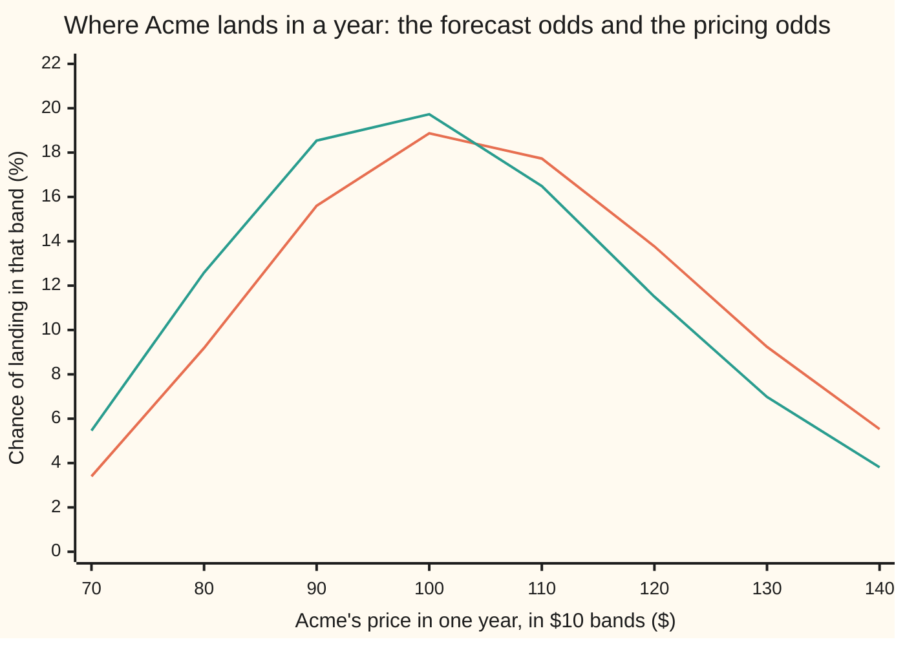

# The fundamental theorems: no arbitrage means a pricing measure exists, and completeness means it is unique

[Syllabus](../../../SYLLABUS.md) → [Financial mathematics](../../../SYLLABUS.md#w12) → [Black-Scholes from the Ground Up](../../../SYLLABUS.md#w12-s05) → The fundamental theorems

---

## General Overview

Acme's shares trade at $100. The research desk expects them to be worth about $108 in a year: a price rise of 8 percent, with another 2 percent arriving separately as dividends.

The options desk, pricing a one-year contract on those same shares, uses a price rise of 3 percent. Nobody there believes 3 percent; asked where Acme is heading they would all say 8. They still price with 3, and they are right to.

Two theorems say why. The first: a market in which no trade is guaranteed free money carries a hidden set of weights on the possible futures, each above zero and all adding to one. Under them, every traded price today is its own average future value, pulled back at the bank rate. The weights obey the arithmetic of probability, so they get used like odds and are called a **pricing measure**; textbooks call it the risk-neutral measure. Under Acme's weights the shares rise at 3 percent: the 5 percent bank rate less the 2 percent leaking out as dividends. The 8 percent is a forecast. The 3 percent is a price.

The second says when those weights are the only ones: exactly when every contract that can be written down can be built out of things that already trade. Build everything and every contract has one forced price. Leave one payoff unbuildable and the weights arrive as a family, so that payoff gets a range of prices rather than a number.

**No free money means at least one pricing measure exists; being able to copy every payoff means there is exactly one, and then every price is a discounted average under it.**

**What kind of fact this is:** two theorems, both proved on this card for a market with finitely many futures, with the continuous-time version stated and cited rather than proved.

### The picture: the same shares, two sets of odds



The first line is the research desk's odds, Acme drifting up at 8 percent. The second is the pricing odds, drifting up at 3 percent: more weight on the cheap endings, less on the dear ones. Reweighting slides the curve in logs and does not reshape it: the spread of the logarithm, $\sigma\sqrt{T}$, is the same under both. The drift can be reweighted away and the jumpiness cannot, which is the crux of the shelf.

---

## The formula

Notation first. A **measure** is a list of weights on the possible futures, one each, adding to one — the arithmetic of probability, with no claim that anyone believes the numbers. Two appear here: the real-world measure $P$, holding what people expect, and the pricing measure $Q$, which the theorems produce with every weight strictly above zero. The weight $Q$ puts on a future is written $\pi_j$, said "pi sub j"; $q$ is already the dividend yield.

The first theorem, for a market with a bank account and finitely many futures, is an "exactly when":

$$\text{no free money}\quad\Longleftrightarrow\quad\text{some } Q \text{ prices every traded asset by}\quad \text{price today} = e^{-rT}\sum_j \pi_j \times (\text{payoff in future } j)$$

**Read it aloud:** today's price of anything is its payoff averaged over the pricing weights, then pulled back to today at the bank rate.

Apply it to Acme itself, dividends reinvested into more shares, and it pins down one number:

$$\sum_j \pi_j\,S_T(j) \;=\; S\,e^{(r-q)T} \;=\; F$$

**Under the pricing measure Acme's average end price is the forward price, $103.05 — not the $108.33 the research desk expects.** The rest of the shelf follows from it.

The second theorem, assuming the first has already supplied at least one $Q$:

$$\text{every payoff can be copied by trading}\quad\Longleftrightarrow\quad\text{exactly one such } Q$$

A market where every payoff can be copied is called **complete**. There the copy's cost and the discounted average agree, and that shared number is the price.

In continuous time Acme follows geometric Brownian motion ([Prices as geometric Brownian motion](01-geometric-brownian-motion-for-prices.md)): a steady drift plus random kicks, with $W$ the running total of the kicks. That card calls the drift $\mu$; here it is $m$, the desk's forecast. Infinitely many futures means no finite list of weights, so Girsanov's theorem ([Girsanov](../../11-Stochastic%20processes%20and%20calculus/07-Changing%20Measure/02-girsanov-theorem.md)) builds $Q$ by shifting the kicks instead:

$$\frac{dS}{S} = m\,dt + \sigma\,dW \;\;\text{under } P \qquad\longrightarrow\qquad \frac{dS}{S} = (r-q)\,dt + \sigma\,dW^Q \;\;\text{under } Q$$

The kicks are re-centred, not resized: $dW^Q = dW + \theta\,dt$. The shift required, and the factor it puts on a path, are

$$\theta = \frac{m + q - r}{\sigma}, \qquad \frac{dQ}{dP} = e^{-\theta W_T - \frac{1}{2}\theta^2 T}$$

So $\theta$ is Acme's reward for risk: total return above the bank rate, divided by jumpiness. The second line is what each future gets multiplied by on the way to the pricing odds.

| Symbol | Plain meaning | In our example | Push it up and the answer… |
| --- | --- | --- | --- |
| $S$, $S_T$ | Acme's price today, and its unknown price at the end | $100 today; 80, 100 or 125 in the small market | rises: everything built on the shares is worth more |
| $K$ | the **strike**, the price a call may buy at | $100 | falls: the call has further to climb |
| $r$ | the bank rate, continuously compounded | 5% | rises: the forward rises and cash due later is worth less |
| $q$ | the **dividend yield**, cash paid to shareholders each year | 2% | falls: dividends leak out of the price the measure drifts toward |
| $\sigma$ | **volatility**, how jumpy the shares are. Say "sigma". | 20% | rises: no reweighting can undo it, so option prices rise |
| $T$ | time to the end, in years | 1 | rises: more room for the drift and the kicks |
| $e^{-rT}$ | the **discount factor**: what a dollar paid at the end is worth today | $e^{-0.05}$ | falls: money due later is worth less |
| $F$ | the **forward**, $S e^{(r-q)T}$: the average end price under $Q$ | $103.05 | rises: claims paying more when Acme is high get dearer |
| $m$, and $\mu$ on the previous card | Acme's real-world price drift: the forecast | 8% | rises: the forecast changes and no price does |
| $\theta$ | the **price of risk**: reward above the bank rate per unit of jumpiness | 0.25 | rises: the two sets of odds pull further apart |
| $\pi_j$ | the pricing weight on one future, all above zero, adding to one | 0.5121 and 0.4879 in the two-future market | rises: everything paying in that future gets dearer |
| $Q$, $P$ | the pricing measure, and the real-world measure | drift 3% and drift 8% | — |
| $W$ | the running total of the random kicks, in wiggle units. Under $Q$ it is written $W^Q$ | the two differ by 0.25 a year | — |

### When it holds

- **Finitely many futures, or continuous time with a stronger condition.** The proofs below are finite. In continuous time "no free money" is too weak: the working condition, from Delbaen and Schachermayer, is no free lunch with vanishing risk — no run of trades whose worst loss shrinks to nothing may creep up on a sure profit.
- **Every weight strictly above zero.** A weight of zero prices a ticket on a possible future at nothing, and a free ticket that sometimes pays is itself free money. The code prices such a claim at $0.00 beside a $10 payout.
- **Trading with no friction.** No fees, no spread, no limit on borrowing or short selling, one price to buy and to sell. Real costs turn the single price into a range as wide as the costs.
- **For Girsanov, a known volatility.** The shift moves drifts only. If $\sigma$ is itself uncertain the market is incomplete and uniqueness goes, as Step 5 shows.

---

## Why it works

### Step 0: the only assumption is that free money does not last

An **arbitrage** is free money: a trade put on today for nothing, or for a credit, that can never lose a penny in any future and pays something in at least one. Two desks quoting the same payoff at different prices offer exactly that — buy the cheap one, sell the dear one, keep the difference, and at the end the two positions cancel.

Nothing below assumes markets are efficient, or anyone rational, or the forecast right. The assumption is that a guaranteed profit gets taken until it is gone.

### Step 1: positive weights forbid free money

This is the half used every working day.

Suppose a measure with every weight above zero prices every traded asset by the rule above. A portfolio is some number of units of each asset, so its cost today is the same weighted average of what the portfolio pays: averaging is additive, and so is adding up a bill.

Now take a candidate arbitrage. It pays nothing negative in any future and something positive in at least one. Every term of the weighted average is zero or more, and the term for that future is a positive weight times a positive payoff, so the total is strictly positive: the trade costs real money and was never free. A weight of zero would break the argument there, since that term would vanish and the trade could cost nothing and still pay out.

### Step 2: no free money forces the weights into existence

For a single period this direction is done by hand on [State prices](../03-Contracts%20and%20No-Arbitrage/07-state-prices-and-risk-neutral-pricing-in-one-period.md): the weights are the prices of tickets paying $1.00 in one future and nothing elsewhere, rescaled to add to one.

The general finite argument is geometric. Put each future on its own axis, so a payoff is a point in as many dimensions as there are futures, and the payoffs reachable for zero cost form a flat sheet through the origin. Free money is a payoff with nothing negative and something positive: a point in the positive corner of that space. No free money says the sheet misses that corner, touching it only at the origin — and such a sheet has a direction at right angles to it pointing into the corner, every entry positive. At right angles to the sheet means valuing every zero-cost trade at nothing, which is the pricing rule rearranged. Rescale that direction to add to one and it is the pricing measure.

<details>
<summary>Detailed proof: why a positive direction exists</summary>

Write the zero-cost payoffs as a linear space $\mathcal{Z}$, and let the **weight set** be the lists with entries zero or more adding to one. No arbitrage says no member of the weight set lies in $\mathcal{Z}$.

Take an orthogonal basis of $\mathcal{Z}$ by Gram–Schmidt, call a list's part along it that list's **shadow**, and minimise the squared length of list minus shadow over the weight set. A minimum is reached: the quantity is a continuous polynomial and every coordinate lies between 0 and 1, so convergent subsequences can be taken one coordinate at a time. Call the minimising list the **base** and its leftover the **normal**.

The normal is not zero, or the base would sit inside $\mathcal{Z}$ — an arbitrage. Mixing the base with a list putting all its weight on one future stays in the weight set, so minimality makes the normal value that one-future list at least as high as it values the base; and being at right angles to $\mathcal{Z}$, it values the base at its own squared length, which is positive. Every entry of the normal is therefore strictly positive. Divide by their sum for the pricing measure, which values every zero-cost payoff at nothing. That is the separating-plane argument, also reachable through Stiemke's lemma.

</details>

### Step 3: unique weights exactly when every payoff can be copied

A small market makes the second theorem visible. Acme is at $100 and can end at $80, $100 or $125, with only the shares and the bank account to trade.

Two conditions constrain three weights: they add to one, and they must average Acme's end price to the forward $103.05. Two equations, three unknowns, so the solutions form a one-parameter family. Fix the middle weight at 0.20 and the others are forced to 0.3768 and 0.4232; fix it at 0.50 and they are 0.2101 and 0.2899. Each member reprices the shares and the bank exactly.

The freedom has a direction. Look for a nudge to all three weights at once that changes neither their sum nor the average end price. One works, in the proportions 5, −9 and 4: the sum is untouched, since 5 − 9 + 4 is zero, and so is the average end price, since 5 × 80 − 9 × 100 + 4 × 125 is zero. Every member of the family is the first plus some amount of that nudge.

So a payoff is priced the same by every member exactly when the nudge does not move its average. "One share delivered at the end" scores 0.000000 against the nudge, and prices at $98.02 under every member — as it must, being copyable by buying a fraction of a share and reinvesting the dividends. A claim paying $10 only if Acme ends at $100 scores −90.000000, so its price slides as the family slides: nothing copies it, and no modelling pins it down. That is the theorem, both ways round.

<details>
<summary>Detailed proof: one nudge direction, two measures</summary>

Write the payoffs as a matrix, one row per traded asset, one column per future. Copying a payoff means solving for holdings that reproduce it, so every payoff is copyable exactly when the rows span the whole payoff space: the matrix has full rank.

The pricing measures solve one linear equation per traded asset. Given one solution, the whole solution set is that solution plus the matrix's kernel — the nudges the matrix sends to zero. Rank plus nullity says the rank is full exactly when the kernel holds nothing but zero, so there is one measure exactly when the kernel is trivial exactly when every payoff can be copied.

And if the kernel holds a nonzero nudge while some measure is strictly positive, that measure plus a small enough multiple of the nudge, and the same measure minus it, are both still positive and both still price every asset: the alternative to one measure is never two, it is infinitely many. Here the kernel is spanned by $(5, -9, 4)$.

</details>

### Step 4: Girsanov moves the drift and leaves the jumpiness alone

Acme's price does not really have three endings. It has a continuum, and the weights form a curve rather than a list. Girsanov's theorem does the same job there: it shifts the running total of the kicks by a steady $\theta$ a year, which moves every drift and leaves every volatility untouched.

Choose the shift that lands the drift where the pricing rule demands. Acme's total return under the forecast is the 8 percent price rise plus the 2 percent dividend; the bank pays 5 percent; the excess is 5 percent for 20 percent of jumpiness, so

$$\theta = \frac{m + q - r}{\sigma} = \frac{0.08 + 0.02 - 0.05}{0.20} = 0.25.$$

Every drift falls by $\sigma\theta$, which is 5 percent here, so Acme's becomes 8 − 5 = 3 percent, which is $r - q$, and the average end price becomes the forward. The checks find the same 0.25 a second way, solving numerically for the shift that lands the average end price on $103.05 without using the formula.

The shift is chosen to cancel $m$, so whatever the research desk believes goes in and comes straight back out. It never touches $\sigma$: relabelling which paths are likely cannot change how far apart they are, which is why volatility is the one input a desk must estimate rather than look up.

The reweighting factor is 0.7548 one wiggle up and 1.2445 one wiggle down: good endings marked down by a quarter, bad ones up. Averaging the call's payoff under the forecast odds with that factor gives $9.23 — the same as averaging under the pricing odds with no factor at all.

Why this prices a claim rather than merely averaging it is the martingale representation theorem ([Martingale representation](../../11-Stochastic%20processes%20and%20calculus/07-Changing%20Measure/04-martingale-representation-theorem.md)): where one source of kicks drives everything, any martingale under the pricing measure — any quantity whose average next value is its value now — is the running gain on some holding of shares. That is completeness in continuous form, and what makes this measure the only one.

### Step 5: what an unbuildable claim costs

Back to the three-ending market and the claim paying $10 only if Acme ends at $100. Its price is the middle weight times $10, discounted. That weight runs from just above zero up to 0.878182, where the first weight hits zero and the list stops being a pricing measure. So the claim's arbitrage-free price runs from just above $0.00 to just below $8.35, and no-arbitrage says nothing sharper.

```
price of a claim paying $10 if Acme ends at $100, one block = $0.30

middle weight
    0.20      ██████                          $1.90
    0.50      ████████████████                $4.76
    0.80      █████████████████████████       $7.61
    0.878182  ████████████████████████████    $8.35
```

Both ends are real portfolios. The cheapest holding of shares and cash that pays at least as much as the claim in every ending costs $8.35 — the top of the band, found again in the checks by searching share holdings on a fine grid. It is short the shares against cash, and quoting the claim above $8.35 leaves the buyer beaten by that portfolio. The dearest holding that never pays more is holding nothing, costing $0.00: the bottom.

Incompleteness is not only a paper curiosity. Acme's volatility is not itself traded: if it could be 15 percent or 25 percent the one-year call is worth $7.34 or $11.12 — a band from one unhedgeable quantity, in an otherwise ordinary market.

A second road to the same measure never mentions weights: hold enough shares against the contract that the combined position cannot move, then demand that such a position earns the bank rate. The drift cancels itself. That road is [Black-Scholes by hedging](03-black-scholes-by-delta-hedging.md), and it lands on the same $9.23.

---

## Worked numbers, by hand

Acme: $S = 100$, $K = 100$, $r = 5\%$, $q = 2\%$, $\sigma = 20\%$, $T = 1$ year, forecast price drift $m = 8\%$.

| Step | Arithmetic | Value |
| --- | --- | --- |
| the forecast price drift, $m$ | from the research desk | $8\%$ |
| the pricing drift, $r - q$ | $0.05 - 0.02$ | $3\%$ |
| the price of risk, $\theta$ | $(0.08 + 0.02 - 0.05)/0.20$ | $0.25$ |
| the forward, $F$ | $100 \times e^{0.03}$ | $\$103.05$ |
| average end price under $P$, then under $Q$ | $100 \times e^{0.08}$, then $100 \times e^{0.03}$ | $\$108.33$, $\$103.05$ |
| reweighting factor, one wiggle up and down | $e^{-0.25-0.03125}$ and $e^{+0.25-0.03125}$ | $0.7548$, $1.2445$ |
| the call, averaged under $Q$ | discounted at $5\%$ | $\$9.23$ |
| the call, averaged under $P$ with the factor | discounted at $5\%$ | **$\$9.23$** |
| the same call on a 2,000-step tree | pricing odds, and forecast odds reweighted | $\$9.2260$ |

Both roads land on the shelf's one-year call price, $9.227006, pinned by the asserts to within a billionth of it: the pricing measure is not a shortcut to a different answer, it is the reason the answer exists. The tree is a tenth of a cent away because 2,000 coin flips are not quite a bell curve.

### What breaks if you drop a piece

| Mistake | Comes out at | What went wrong |
| --- | --- | --- |
| Average under the forecast's 8% drift, discount at the bank rate | $12.47 | A forecast used as a price: $12.47 against the $9.23 a copy costs. |
| Average under the pricing drift, discount at Acme's 10% total return | $8.78 | Only the bank rate discounts a pricing average; the shift already removed the share's reward. |
| Use the bank rate as the pricing drift, forgetting the dividend | $10.45 | Dividends leak out, so the drift is $r - q$. The same $10.45 is the forgotten-dividend row on the Black-Scholes card. |
| Let a possible ending carry weight zero | claim at $0.00, pays $10 | A free ticket that sometimes pays is free money. Weights must be strictly positive, not merely non-negative. |

Every number in that table is printed by the code below.

---

## Code, from first principles, and it actually runs

Nothing imported knows an answer: the bell curve, the integrator, the root finder, both trees and both one-period markets are written out. The call is priced **four ways on two engines** — the bell curve integrated under the pricing measure, and under the forecast measure with the reweighting factor applied; then a 2,000-step tree with the pricing branch odds, and the same tree with the forecast odds kept and every path reweighted. The price of risk is then found again by solving for the shift that lands the average end price on the forward, and the band's edges by searching over share holdings.

### Python

```python
# The fundamental theorems of asset pricing -- the check behind the card.
# Standard library only, and nothing imported that already knows an answer: the
# bell curve, the integrator, the root finder, the trees and the one-period
# markets are written out here.  House market: Acme at S = 100, strike K = 100,
# r = 5%, dividend yield q = 2%, sigma = 20%, T = 1 year, real drift m = 8%.
from math import exp, log, sqrt, pi

S, K, r, q, sig, T, m = 100.0, 100.0, 0.05, 0.02, 0.20, 1.0, 0.08
DISC, F = exp(-r * T), S * exp((r - q) * T)      # discount factor, forward price
LO, MID, HI = 80.0, 100.0, 125.0                 # the small market's three ends
CLAIM = (0.0, 10.0, 0.0)                         # pays 10 only if Acme ends at 100

def bell(z): return exp(-0.5 * z * z) / sqrt(2.0 * pi)      # bell-curve height

def simpson(f, a, b, n):                         # area under f, by thin slices
    h = (b - a) / n
    s = f(a) + f(b)
    for i in range(1, n):
        s += (4.0 if i % 2 else 2.0) * f(a + i * h)
    return s * h / 3.0

def ratio(th, z): return exp(-th * sqrt(T) * z - 0.5 * th * th * T)   # dQ/dP

def average(drift, payoff, th=None, vol=sig, n=20000):
    def g(z):                                    # payoff x weight x bell curve
        price = S * exp((drift - 0.5 * vol * vol) * T + vol * sqrt(T) * z)
        return payoff(price) * (1.0 if th is None else ratio(th, z)) * bell(z)
    return simpson(g, -10.0, 10.0, n)

def bisect(f, lo, hi, steps=80):                 # the root, by halving the bracket
    flo = f(lo)
    for _ in range(steps):
        mid = 0.5 * (lo + hi)
        if flo * f(mid) <= 0.0: hi = mid
        else: lo, flo = mid, f(mid)
    return 0.5 * (lo + hi)

def tree_pricing(n, drift):                      # road 3: backward, pricing chances
    dt = T / n
    u = exp(sig * sqrt(dt)); d = 1.0 / u
    p, disc = (exp(drift * dt) - d) / (u - d), exp(-r * dt)
    v = [max(S * u ** j * d ** (n - j) - K, 0.0) for j in range(n + 1)]
    for step in range(n, 0, -1):
        v = [disc * (p * v[j + 1] + (1.0 - p) * v[j]) for j in range(step)]
    return v[0]

def tree_reweighted(n, real, pricing):           # road 4: real paths, reweighted
    dt = T / n
    u = exp(sig * sqrt(dt)); d = 1.0 / u
    p = (exp(real * dt) - d) / (u - d)           # the real-world up chance
    pq = (exp(pricing * dt) - d) / (u - d)       # the pricing up chance
    logc, total = n * log(1.0 - p), 0.0          # log chance of n downs, under P
    for j in range(n + 1):
        if j:                                    # step the path count along
            logc += log((n - j + 1) / float(j) * p / (1.0 - p))
        loglr = j * log(pq / p) + (n - j) * log((1.0 - pq) / (1.0 - p))
        total += exp(logc + loglr) * max(S * u ** j * d ** (n - j) - K, 0.0)
    return exp(-r * T) * total

def weights(p2):                                 # three-state weights, middle p2
    p3 = (F - LO - (MID - LO) * p2) / (HI - LO)
    return [1.0 - p2 - p3, p2, p3]

def worth(w, c): return DISC * sum(wi * ci for wi, ci in zip(w, c))  # its price

def cost(a, b): return a * S * exp(-q * T) + b * DISC   # a shares, b cash, at T

def edge(claim, sign):                           # sign +1: cheapest copy above the
    best = None                                  # claim; -1: dearest copy below it
    for i in range(-400, 401):                   # search the share holding directly
        a = i / 100.0
        b = max(sign * (c - a * x) for c, x in zip(claim, (LO, MID, HI)))
        v = sign * cost(a, sign * b)
        if best is None or v < best: best = v
    return sign * best

payoff_call, spot_at_T = lambda x: max(x - K, 0.0), lambda x: x
theta = (m + q - r) / sig                        # the price of risk
shift = bisect(lambda th: average(m, spot_at_T, th, sig, 2000) - F, 0.0, 1.0)
C_q, C_p = DISC * average(r - q, payoff_call), DISC * average(m, payoff_call, theta)
tree_q, tree_p = tree_pricing(2000, r - q), tree_reweighted(2000, m, r - q)
wrong_real = DISC * average(m, payoff_call)                      # real odds, bank rate
wrong_disc = exp(-(m + q) * T) * average(r - q, payoff_call)     # discounted at 10%
wrong_noq = DISC * average(r, payoff_call)                       # dividend forgotten
vol15, vol25 = (DISC * average(r - q, payoff_call, None, v) for v in (0.15, 0.25))
pi_up = (F - LO) / (HI - LO)                     # two states, 80 or 125: unique
tick_w, a2 = DISC * 10.0 * pi_up, 10.0 / (HI - LO)
tick_c = cost(a2, -a2 * LO)                      # the same claim, built from shares
p2max = (HI - F) / (HI - MID)                    # three states: the family's edge
band = [worth(weights(p), CLAIM) for p in (0.2, 0.5, 0.8, p2max)]
hi_edge, lo_edge = edge(CLAIM, 1), edge(CLAIM, -1)
zero = weights(0.0)                              # the middle state weighted nothing
rows = [("real-world price drift m", m), ("pricing drift r - q", r - q),
        ("price of risk theta = (m + q - r)/sigma", theta),
        ("  theta again, by solving for the shift", shift), ("forward F = S e^(r-q)T", F),
        ("E^P[S_T], the real drift", average(m, spot_at_T)),
        ("E^Q[S_T], the pricing drift", average(r - q, spot_at_T)),
        ("  E^P[S_T x dQ/dP], reweighted", average(m, spot_at_T, theta)),
        ("dQ/dP at z = +1 and z = -1", ratio(theta, 1.0), ratio(theta, -1.0)),
        ("1 call by Q-average", C_q), ("2 call by P-average x dQ/dP", C_p),
        ("3 call by tree, 2000 steps, Q-chances", tree_q),
        ("4 call by tree, P-paths reweighted", tree_p),
        ("wrong: real odds, bank discount", wrong_real),
        ("wrong: Q-average discounted at m + q", wrong_disc),
        ("wrong: pricing drift r, dividend gone", wrong_noq),
        ("call if sigma were 0.15 or 0.25", vol15, vol25), (),
        ("two states 80/125: weights", 1.0 - pi_up, pi_up),
        ("  claim pays 10 at 125: weights, copy", tick_w, tick_c),
        ("  that copy: shares at T, cash at T", a2, -a2 * LO), (),
        ("three states: weights at middle 0.20", *weights(0.2)),
        ("  at middle 0.50", *weights(0.5)), ("  at middle 0.80", *weights(0.8)),
        ("  at the family's edge", *weights(p2max)),
        ("nudge (5,-9,4) on the share and the claim", *[sum(x * y for x, y in zip((5.0, -9.0, 4.0), v)) for v in ((LO, MID, HI), CLAIM)]),
        ("claim (0,10,0) at middle 0.20/0.50/0.80", *band[:3]),
        ("  at the edge, and cheapest copy above", band[3], hi_edge),
        ("  dearest copy below: hold nothing", lo_edge),
        ("one share at T, under those three",
         *[worth(weights(p), (LO, MID, HI)) for p in (0.2, 0.5, 0.8)]),
        ("zero on the middle state: weights", *zero),
        ("  that claim's price, and its payout", worth(zero, CLAIM), max(CLAIM)), ()]
for line in rows:
    print("" if not line else f"{line[0]:<40}" + "".join(f"{v:>14.6f}" for v in line[1:]))
mids = [70.0 + 10.0 * i for i in range(8)]
def pct(drift, c):                               # chance of landing in a $10 band
    zs = [(log(x / S) - (drift - 0.5 * sig * sig) * T) / (sig * sqrt(T)) for x in (c - 5.0, c + 5.0)]
    return 100.0 * simpson(bell, zs[0], zs[1], 400)
print(f"{'bars, claim price ($)':<34}" + "".join(f"{v:>8.2f}" for v in band))
print(f"{'chart, band centre ($)':<34}" + "".join(f"{c:>8.0f}" for c in mids))
for lab, dr in (("chart, chance under P (%)", m), ("chart, chance under Q (%)", r - q)):
    print(f"{lab:<34}" + "".join(f"{pct(dr, c):>8.2f}" for c in mids))
assert abs(C_q - 9.227005508154) < 1e-9, "Q-average must land on the shelf's call price"
assert abs(C_p - C_q) < 1e-7, "reweighted real-world average must give the same price"
assert abs(shift - theta) < 1e-6, "the solved drift shift must be the price of risk"
assert abs(tree_q - C_q) < 0.005 and abs(tree_p - tree_q) < 1e-8, "both tree roads"
assert abs(tick_w - tick_c) < 1e-9, "unique weights: average equals the copy's cost"
assert abs(hi_edge - band[3]) < 1e-9 and abs(lo_edge) < 1e-12, "the band's two edges"
assert wrong_real > C_q > wrong_disc, "real odds too dear, over-discounting too cheap"
assert min(zero) == 0.0 and min(weights(0.2)) > 0.0, "the edge is not a pricing measure"
assert all(min(weights(p)) > 0 and abs(worth(weights(p), (LO, MID, HI)) - S * exp(-q * T)) < 1e-12 for p in (0.05, 0.2, 0.5, 0.8, 0.87)), "every family member reprices the share"
print("ALL CHECKS PASS")
```

**Ran 2026-09-19 on macOS, Python 3.14.6, standard library only. All checks passed. Output, pasted from the run:**

```
real-world price drift m                      0.080000
pricing drift r - q                           0.030000
price of risk theta = (m + q - r)/sigma       0.250000
  theta again, by solving for the shift       0.250000
forward F = S e^(r-q)T                      103.045453
E^P[S_T], the real drift                    108.328707
E^Q[S_T], the pricing drift                 103.045453
  E^P[S_T x dQ/dP], reweighted              103.045453
dQ/dP at z = +1 and z = -1                    0.754840      1.244520
1 call by Q-average                           9.227006
2 call by P-average x dQ/dP                   9.227006
3 call by tree, 2000 steps, Q-chances         9.226034
4 call by tree, P-paths reweighted            9.226034
wrong: real odds, bank discount              12.474510
wrong: Q-average discounted at m + q          8.776999
wrong: pricing drift r, dividend gone        10.450584
call if sigma were 0.15 or 0.25               7.336872     11.123760

two states 80/125: weights                    0.487879      0.512121
  claim pays 10 at 125: weights, copy         4.871447      4.871447
  that copy: shares at T, cash at T           0.222222    -17.777778

three states: weights at middle 0.20          0.376768      0.200000      0.423232
  at middle 0.50                              0.210101      0.500000      0.289899
  at middle 0.80                              0.043434      0.800000      0.156566
  at the family's edge                        0.000000      0.878182      0.121818
nudge (5,-9,4) on the share and the claim      0.000000    -90.000000
claim (0,10,0) at middle 0.20/0.50/0.80       1.902459      4.756147      7.609835
  at the edge, and cheapest copy above        8.353524      8.353524
  dearest copy below: hold nothing            0.000000
one share at T, under those three            98.019867     98.019867     98.019867
zero on the middle state: weights             0.487879      0.000000      0.512121
  that claim's price, and its payout          0.000000     10.000000

bars, claim price ($)                 1.90    4.76    7.61    8.35
chart, band centre ($)                  70      80      90     100     110     120     130     140
chart, chance under P (%)             3.40    9.19   15.60   18.87   17.73   13.77    9.24    5.53
chart, chance under Q (%)             5.46   12.59   18.54   19.73   16.49   11.50    6.98    3.81
ALL CHECKS PASS
```

### Rust

Same inputs, same labels, no crates.

```rust
// The fundamental theorems of asset pricing -- the same check as the Python, in
// Rust.  Standard library only, no crates, and nothing borrowed that already
// knows an answer: the bell curve, the integrator, the root finder, the trees
// and the one-period markets are written out here.  House market: Acme at
// S = 100, K = 100, r = 5%, dividend yield q = 2%, sigma = 20%, T = 1 year, and
// a real-world price drift m = 8%.  Compile: rustc --edition 2021 -O
use std::f64::consts::PI;

const S: f64 = 100.0; const K: f64 = 100.0; const R: f64 = 0.05;
const QD: f64 = 0.02; const SIG: f64 = 0.20; const T: f64 = 1.0; const M: f64 = 0.08;
const LO: f64 = 80.0; const MID: f64 = 100.0; const HI: f64 = 125.0;
const CLAIM: [f64; 3] = [0.0, 10.0, 0.0];        // pays 10 only if Acme ends at 100
const ENDS: [f64; 3] = [LO, MID, HI];            // the small market's three ends

fn disc() -> f64 { (-R * T).exp() }              // the discount factor e^-rT
fn fwd() -> f64 { S * ((R - QD) * T).exp() }     // the forward price
fn bell(z: f64) -> f64 { (-0.5 * z * z).exp() / (2.0 * PI).sqrt() }   // bell curve
fn biggest(v: &[f64]) -> f64 { v.iter().fold(f64::NEG_INFINITY, |a, &b| a.max(b)) }
fn smallest(v: &[f64]) -> f64 { v.iter().fold(f64::INFINITY, |a, &b| a.min(b)) }

fn simpson<F: Fn(f64) -> f64>(f: F, a: f64, b: f64, n: usize) -> f64 {
    let h = (b - a) / n as f64;                  // area under f, by thin slices
    let mut s = f(a) + f(b);
    for i in 1..n { s += if i % 2 == 1 { 4.0 } else { 2.0 } * f(a + i as f64 * h); }
    s * h / 3.0
}

fn ratio(th: f64, z: f64) -> f64 { (-th * T.sqrt() * z - 0.5 * th * th * T).exp() }   // dQ/dP

fn average<F: Fn(f64) -> f64>(drift: f64, pay: F, th: Option<f64>, vol: f64, n: usize) -> f64 {
    simpson(|z| {                                // payoff x weight x bell curve
        let price = S * ((drift - 0.5 * vol * vol) * T + vol * T.sqrt() * z).exp();
        pay(price) * (match th { None => 1.0, Some(t) => ratio(t, z) }) * bell(z)
    }, -10.0, 10.0, n)
}

fn bisect<F: Fn(f64) -> f64>(f: F, mut lo: f64, mut hi: f64, steps: usize) -> f64 {
    let mut flo = f(lo);                         // the root, by halving the bracket
    for _ in 0..steps {
        let mid = 0.5 * (lo + hi);
        if flo * f(mid) <= 0.0 { hi = mid } else { lo = mid; flo = f(mid) }
    }
    0.5 * (lo + hi)
}

fn tree_pricing(n: usize, drift: f64) -> f64 {   // road 3: backward, pricing chances
    let dt = T / n as f64; let u = (SIG * dt.sqrt()).exp(); let d = 1.0 / u;
    let p = ((drift * dt).exp() - d) / (u - d); let dis = (-R * dt).exp();
    let mut v: Vec<f64> = (0..=n)
        .map(|j| (S * u.powi(j as i32) * d.powi((n - j) as i32) - K).max(0.0)).collect();
    for s in (1..=n).rev() { v = (0..s).map(|j| dis * (p * v[j + 1] + (1.0 - p) * v[j])).collect(); }
    v[0]
}

fn tree_reweighted(n: usize, real: f64, pricing: f64) -> f64 {
    let dt = T / n as f64;                       // road 4: real paths, reweighted
    let u = (SIG * dt.sqrt()).exp(); let d = 1.0 / u;
    let p = ((real * dt).exp() - d) / (u - d);       // the real-world up chance
    let pq = ((pricing * dt).exp() - d) / (u - d);   // the pricing up chance
    let mut logc = n as f64 * (1.0 - p).ln();    // log chance of n downs, under P
    let mut total = 0.0;
    for j in 0..=n {                             // step the path count along, then reweight
        if j > 0 { logc += (((n - j + 1) as f64) / j as f64 * p / (1.0 - p)).ln(); }
        let loglr = j as f64 * (pq / p).ln() + (n - j) as f64 * ((1.0 - pq) / (1.0 - p)).ln();
        total += (logc + loglr).exp() * (S * u.powi(j as i32) * d.powi((n - j) as i32) - K).max(0.0);
    }
    (-R * T).exp() * total
}

fn weights(p2: f64) -> [f64; 3] {                // three-state weights, middle p2
    let p3 = (fwd() - LO - (MID - LO) * p2) / (HI - LO);
    [1.0 - p2 - p3, p2, p3]
}

fn worth(w: &[f64; 3], c: &[f64; 3]) -> f64 {    // a claim's price under weights w
    disc() * (0..3).map(|j| w[j] * c[j]).sum::<f64>()
}

fn cost(a: f64, b: f64) -> f64 { a * S * (-QD * T).exp() + b * disc() }   // a, b at T

fn edge(claim: &[f64; 3], sg: f64) -> f64 {      // +1: cheapest copy above the
    let mut best: Option<f64> = None;            // claim; -1: dearest copy below it
    for i in -400..=400 {                        // search the share holding directly
        let a = i as f64 / 100.0;
        let b = biggest(&(0..3).map(|j| sg * (claim[j] - a * ENDS[j])).collect::<Vec<f64>>());
        let v = sg * cost(a, sg * b);
        if best.is_none() || v < best.unwrap() { best = Some(v) }
    }
    sg * best.unwrap()
}

fn row(name: &str, vals: &[f64]) {
    let mut line = format!("{:<40}", name);
    for v in vals { line.push_str(&format!("{:>14.6}", v)); }
    println!("{}", line);
}

fn pct(drift: f64, c: f64) -> f64 {              // chance of landing in a $10 band
    let z = |x: f64| ((x / S).ln() - (drift - 0.5 * SIG * SIG) * T) / (SIG * T.sqrt());
    100.0 * simpson(bell, z(c - 5.0), z(c + 5.0), 400)
}

fn main() {
    let call = |x: f64| (x - K).max(0.0); let spot = |x: f64| x;
    let theta = (M + QD - R) / SIG;              // the price of risk
    let shift = bisect(|th| average(M, spot, Some(th), SIG, 2000) - fwd(), 0.0, 1.0, 80);
    let c_q = disc() * average(R - QD, call, None, SIG, 20000);
    let c_p = disc() * average(M, call, Some(theta), SIG, 20000);
    let tree_q = tree_pricing(2000, R - QD); let tree_p = tree_reweighted(2000, M, R - QD);
    let wrong_real = disc() * average(M, call, None, SIG, 20000);
    let wrong_disc = (-(M + QD) * T).exp() * average(R - QD, call, None, SIG, 20000);
    let wrong_noq = disc() * average(R, call, None, SIG, 20000);
    let vol15 = disc() * average(R - QD, call, None, 0.15, 20000);
    let vol25 = disc() * average(R - QD, call, None, 0.25, 20000);
    let pi_up = (fwd() - LO) / (HI - LO);        // two states, 80 or 125: unique
    let tick_w = disc() * 10.0 * pi_up; let a2 = 10.0 / (HI - LO);
    let tick_c = cost(a2, -a2 * LO);             // the same claim, built from shares
    let p2max = (HI - fwd()) / (HI - MID);       // three states: the family's edge
    let band: Vec<f64> = [0.2, 0.5, 0.8, p2max].iter().map(|&p| worth(&weights(p), &CLAIM)).collect();
    let (hi_edge, lo_edge) = (edge(&CLAIM, 1.0), edge(&CLAIM, -1.0));
    let zero = weights(0.0);                     // the middle state weighted nothing
    let shares: Vec<f64> = [0.2, 0.5, 0.8].iter().map(|&p| worth(&weights(p), &ENDS)).collect();
    row("real-world price drift m", &[M]); row("pricing drift r - q", &[R - QD]);
    row("price of risk theta = (m + q - r)/sigma", &[theta]);
    row("  theta again, by solving for the shift", &[shift]); row("forward F = S e^(r-q)T", &[fwd()]);
    row("E^P[S_T], the real drift", &[average(M, spot, None, SIG, 20000)]);
    row("E^Q[S_T], the pricing drift", &[average(R - QD, spot, None, SIG, 20000)]);
    row("  E^P[S_T x dQ/dP], reweighted", &[average(M, spot, Some(theta), SIG, 20000)]);
    row("dQ/dP at z = +1 and z = -1", &[ratio(theta, 1.0), ratio(theta, -1.0)]);
    row("1 call by Q-average", &[c_q]); row("2 call by P-average x dQ/dP", &[c_p]);
    row("3 call by tree, 2000 steps, Q-chances", &[tree_q]);
    row("4 call by tree, P-paths reweighted", &[tree_p]);
    row("wrong: real odds, bank discount", &[wrong_real]);
    row("wrong: Q-average discounted at m + q", &[wrong_disc]);
    row("wrong: pricing drift r, dividend gone", &[wrong_noq]);
    row("call if sigma were 0.15 or 0.25", &[vol15, vol25]); println!();
    row("two states 80/125: weights", &[1.0 - pi_up, pi_up]);
    row("  claim pays 10 at 125: weights, copy", &[tick_w, tick_c]);
    row("  that copy: shares at T, cash at T", &[a2, -a2 * LO]); println!();
    row("three states: weights at middle 0.20", &weights(0.2));
    row("  at middle 0.50", &weights(0.5)); row("  at middle 0.80", &weights(0.8));
    row("  at the family's edge", &weights(p2max));
    row("nudge (5,-9,4) on the share and the claim", &[(0..3).map(|j| [5.0, -9.0, 4.0][j] * ENDS[j]).sum::<f64>(), (0..3).map(|j| [5.0, -9.0, 4.0][j] * CLAIM[j]).sum::<f64>()]);
    row("claim (0,10,0) at middle 0.20/0.50/0.80", &band[..3]);
    row("  at the edge, and cheapest copy above", &[band[3], hi_edge]); row("  dearest copy below: hold nothing", &[lo_edge]);
    row("one share at T, under those three", &shares);
    row("zero on the middle state: weights", &zero);
    row("  that claim's price, and its payout", &[worth(&zero, &CLAIM), biggest(&CLAIM)]); println!();
    let mids: Vec<f64> = (0..8).map(|i| 70.0 + 10.0 * i as f64).collect();
    let mut bars = format!("{:<34}", "bars, claim price ($)");
    for v in &band { bars.push_str(&format!("{:>8.2}", v)); } println!("{}", bars);
    let mut head = format!("{:<34}", "chart, band centre ($)");
    for c in &mids { head.push_str(&format!("{:>8.0}", c)); }
    println!("{}", head);
    for (lab, dr) in [("chart, chance under P (%)", M), ("chart, chance under Q (%)", R - QD)] {
        let mut line = format!("{:<34}", lab);
        for c in &mids { line.push_str(&format!("{:>8.2}", pct(dr, *c))); }
        println!("{}", line);
    }
    assert!((c_q - 9.227005508154).abs() < 1e-9, "Q-average vs the shelf's call price");
    assert!((c_p - c_q).abs() < 1e-7, "reweighted real-world average, same price");
    assert!((shift - theta).abs() < 1e-6, "the solved drift shift is the price of risk");
    assert!((tree_q - c_q).abs() < 0.005 && (tree_p - tree_q).abs() < 1e-8, "both trees");
    assert!((tick_w - tick_c).abs() < 1e-9, "unique weights: average equals the copy");
    assert!((hi_edge - band[3]).abs() < 1e-9 && lo_edge.abs() < 1e-12, "the two edges");
    assert!(wrong_real > c_q && c_q > wrong_disc, "real odds dear, over-discounting cheap");
    assert!(smallest(&zero) == 0.0 && smallest(&weights(0.2)) > 0.0, "the edge is no measure");
    assert!([0.05, 0.2, 0.5, 0.8, 0.87].iter().all(|&p| smallest(&weights(p)) > 0.0 && (worth(&weights(p), &ENDS) - S * (-QD * T).exp()).abs() < 1e-12), "every family member reprices the share");
    println!("ALL CHECKS PASS");
}
```

**Ran 2026-09-19 on macOS, rustc 1.98.1, no crates. All checks passed. Output, pasted from the run:**

```
real-world price drift m                      0.080000
pricing drift r - q                           0.030000
price of risk theta = (m + q - r)/sigma       0.250000
  theta again, by solving for the shift       0.250000
forward F = S e^(r-q)T                      103.045453
E^P[S_T], the real drift                    108.328707
E^Q[S_T], the pricing drift                 103.045453
  E^P[S_T x dQ/dP], reweighted              103.045453
dQ/dP at z = +1 and z = -1                    0.754840      1.244520
1 call by Q-average                           9.227006
2 call by P-average x dQ/dP                   9.227006
3 call by tree, 2000 steps, Q-chances         9.226034
4 call by tree, P-paths reweighted            9.226034
wrong: real odds, bank discount              12.474510
wrong: Q-average discounted at m + q          8.776999
wrong: pricing drift r, dividend gone        10.450584
call if sigma were 0.15 or 0.25               7.336872     11.123760

two states 80/125: weights                    0.487879      0.512121
  claim pays 10 at 125: weights, copy         4.871447      4.871447
  that copy: shares at T, cash at T           0.222222    -17.777778

three states: weights at middle 0.20          0.376768      0.200000      0.423232
  at middle 0.50                              0.210101      0.500000      0.289899
  at middle 0.80                              0.043434      0.800000      0.156566
  at the family's edge                        0.000000      0.878182      0.121818
nudge (5,-9,4) on the share and the claim      0.000000    -90.000000
claim (0,10,0) at middle 0.20/0.50/0.80       1.902459      4.756147      7.609835
  at the edge, and cheapest copy above        8.353524      8.353524
  dearest copy below: hold nothing            0.000000
one share at T, under those three            98.019867     98.019867     98.019867
zero on the middle state: weights             0.487879      0.000000      0.512121
  that claim's price, and its payout          0.000000     10.000000

bars, claim price ($)                 1.90    4.76    7.61    8.35
chart, band centre ($)                  70      80      90     100     110     120     130     140
chart, chance under P (%)             3.40    9.19   15.60   18.87   17.73   13.77    9.24    5.53
chart, chance under Q (%)             5.46   12.59   18.54   19.73   16.49   11.50    6.98    3.81
ALL CHECKS PASS
```

The two outputs agree line for line at six decimals, from code sharing no arithmetic.

> [!TIP]
> **Try changing**
> Guess the direction first, then run it. The asserts are pinned to the house market, so expect one to stop the program.
> - **Change the forecast.** Set `m = 0.20`. The price of risk jumps, the reweighting factors move, and both call prices stay at 9.227006. A forecast cannot move a price.
> - **Take the dividend away.** Set `q = 0.0`. The pricing drift becomes 5 percent and the call rises to 10.450584, the what-breaks row. The first assert stops the program.
> - **Move the middle ending.** Set `MID = 110.0`. That ending now sits nearer the top one, so the claim is nearer to copyable and the cheapest copy above it costs less. The printed family edge overshoots, since past a point the third weight turns negative, and the edge assert stops the program.

---

## The usual mistake

> [!warning]
> **Reading the pricing measure as a forecast.** Acme is not expected to rise 3 percent. It is expected to rise 8 percent and the options desk agrees. The 3 percent is what survives once the share's reward for risk is hedged away, and it is the only drift under which today's prices are consistent with each other. Under the forecast odds the call comes out at $12.47, and nobody pays that when a copy costs $9.23.
>
> Four smaller traps:
> - **Believing the change of measure changes the jumpiness.** It moves drifts by $\sigma\theta$ and leaves $\sigma$ alone, which is why the two curves in the first picture have the same log spread. Adjusting volatility to fix a drift problem fixes the wrong number.
> - **Expecting one price from an incomplete market.** Where a payoff cannot be copied the theorems answer a band: $0.00 to $8.35 for the middle-ending claim. Every published price for such a payoff chooses one measure from a family.
> - **Treating a weight of zero as positive enough.** At the top of the band the middle weight is exactly zero: the list still adds to one and still reprices the shares and the bank, and free money is still available. A traded price must sit strictly inside its band.
> - **Carrying the finite theorem into continuous time unchanged.** With infinitely many futures, no arbitrage alone is too weak.

---

## Where you meet it in real life

- **Every model price on a derivatives desk.** A model price is a discounted average under some pricing measure. Which measure, and whether it was forced or chosen, is what a risk officer asks first.
- **Binomial trees.** A tree's up-chance forecasts nothing: it is the pricing weight for that branch, which is why the tree in the code reaches the same $9.23.
- **Monte Carlo.** Paths are drawn with the pricing drift, $r - q$, never the forecast drift; drawing them with the forecast gives the $12.47 above.
- **Implied volatility and the smile.** Quoted volatility differing by strike is the market saying the weights it really uses are not the model's.
- **Insurance, credit and anything that jumps.** Incomplete markets in the sense of Step 5: prices live inside a band, and choosing a point in it is judgement, charged as a margin.
- **Counting in something other than dollars.** Swap the bank account for the shares as the unit of account and a different, equally valid measure appears: [Changing the unit of account](05-change-of-numeraire-in-pricing.md).

> **Say it back**
> A pricing measure is a list of positive weights on the possible futures, adding to one, under which every traded price is its own discounted average payoff. Such weights exist exactly when no trade is guaranteed free money, and they are unique exactly when every payoff can be copied out of what already trades. They are prices, not beliefs: Acme is forecast to rise 8 percent and priced as though it rises 3 percent, the bank rate less the dividend. Girsanov's theorem performs the switch by shifting the random kicks, moving every drift and leaving every volatility alone. Where a payoff cannot be copied, the single price becomes a band.

---

## What this builds on

- [Prices as geometric Brownian motion](01-geometric-brownian-motion-for-prices.md): the model of Acme this card reweights, a drift plus random kicks in logs.
- [State prices](../03-Contracts%20and%20No-Arbitrage/07-state-prices-and-risk-neutral-pricing-in-one-period.md): the weights built by hand for one period, as ticket prices rescaled to add to one.
- [Girsanov](../../11-Stochastic%20processes%20and%20calculus/07-Changing%20Measure/02-girsanov-theorem.md): the shift itself, and the proof that the reweighting factor averages one.
- [Martingale representation](../../11-Stochastic%20processes%20and%20calculus/07-Changing%20Measure/04-martingale-representation-theorem.md): why one source of kicks makes every claim copyable.

## Where this goes next

- [Black-Scholes by hedging](03-black-scholes-by-delta-hedging.md): the same price reached with no measure at all, by holding shares against the contract until the position cannot move.

This card says the call is worth a discounted average under $Q$ and never says how many shares to hold to make that true; the next card builds the copy, day after day, and reaches $9.23 from the other side.

---

## Sources

Verified 19 Sep 2026: every link below resolves to the publisher's page.

- Harrison, J. Michael, and David M. Kreps. "Martingales and Arbitrage in Multiperiod Securities Markets." *Journal of Economic Theory* 20, no. 3 (1979): 381–408. [doi:10.1016/0022-0531(79)90043-7](https://doi.org/10.1016/0022-0531(79)90043-7). Both theorems in this form.
- Harrison, J. Michael, and Stanley R. Pliska. "Martingales and Stochastic Integrals in the Theory of Continuous Trading." *Stochastic Processes and their Applications* 11, no. 3 (1981): 215–260. [doi:10.1016/0304-4149(81)90026-0](https://doi.org/10.1016/0304-4149(81)90026-0). Completeness as uniqueness.
- Girsanov, I. V. "On Transforming a Certain Class of Stochastic Processes by Absolutely Continuous Substitution of Measures." *Theory of Probability and Its Applications* 5, no. 3 (1960): 285–301. [doi:10.1137/1105027](https://doi.org/10.1137/1105027). The original drift shift.
- Delbaen, Freddy, and Walter Schachermayer. "A General Version of the Fundamental Theorem of Asset Pricing." *Mathematische Annalen* 300 (1994): 463–520. [doi:10.1007/BF01450498](https://doi.org/10.1007/BF01450498). Why continuous time needs the stronger condition.
- Duffie, Darrell. *Dynamic Asset Pricing Theory*, 3rd ed. Princeton University Press, 2001. [Publisher page](https://press.princeton.edu/books/hardcover/9780691090221/dynamic-asset-pricing-theory). Chapter 1 derives the finite case from Stiemke's lemma.
