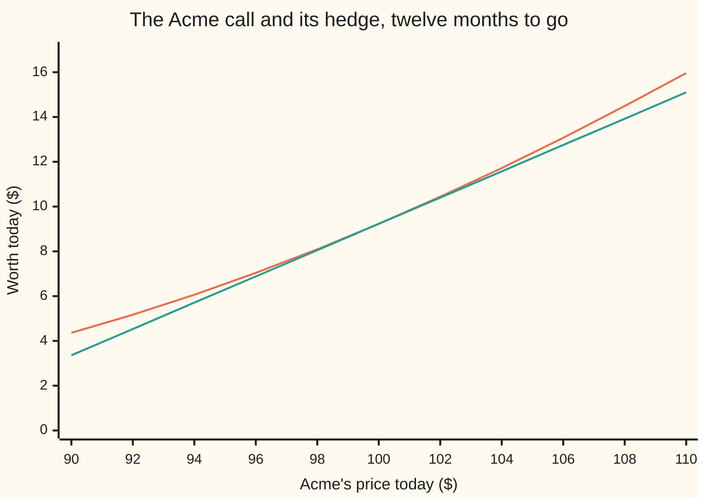
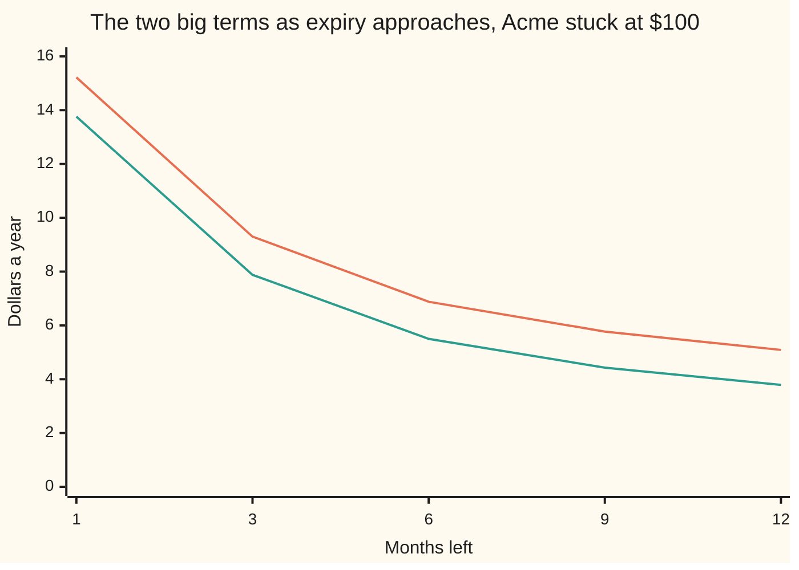

# Black-Scholes by hedging: the equation a hedged portfolio must obey

Financial mathematics → Black-Scholes from the Ground Up → The hedged book → Black-Scholes by hedging

---

## General Overview

A dealer buys one Acme call this morning and pays $9.23 for it. Acme trades at $100. The contract lets the dealer, one year from today, hand over $100 and take one share — and the dealer has no view at all on where Acme is heading.

So the dealer sells shares short against the option: borrows them and sells them. Not one share: 0.586851 of one. That fraction is picked so that when Acme ticks up a penny, the extra the option gains and the extra the borrowed shares cost match to the penny. The book stops caring which way Acme moves.

What is left over is not nothing. Three things still move the book, and none of them is a view on where Acme is going. The clock runs, and a promise nobody has used yet is worth less tomorrow than today: that costs $5.09 a year. The short sale raised cash, which earns interest, less the dividends owed on borrowed stock: that brings in $1.76 a year. And Acme does move, both ways, while the option's value curves and a share position is a straight line, so each re-adjustment quietly buys low and sells high: that pays $3.79 a year. Add the three and the answer is $0.46 a year — exactly the interest on the $9.23 the option cost.

The hedged option pays for its own funding and not a cent more. That is the whole card. Do better and somebody would borrow at the bank rate and run the book for free money; do worse and they would run it backwards. Write that requirement down in symbols and one equation falls out: Fischer Black and Myron Scholes, 1973, extended the same year by Robert Merton.

**The leftovers of a hedged book — what the clock takes, what the shares carry, and what the bend pays — must add up to interest on the contract's own value, and that single requirement pins the price.**

**What kind of fact this is:** a theorem, proved on this card in Why it works. It is a theorem about a model, so it is exactly as good as that model's assumptions, which are listed under When it holds.

### The picture: the hedge is a straight line, the option is a curve



The bending line is the option. The straight line is the hedge: 0.586851 shares, which is the option's slope at $100. The two touch at $100 and agree on the first penny of any move — that is what a hedge is for. Move further either way and the curve sits above the line: at $110 the option is worth $15.96 while the hedge reaches only $15.10. That gap is small, always positive, and it is the money that pays for the clock.

---

## The formula

Notation first, in words. The option's worth depends on two things at once: where Acme is and what the date is. A slope taken while the other thing is held still is written as a subscript. The **clock slope** $V_t$ is how the worth changes as the calendar advances with Acme's price nailed down; the **price slope** $V_S$ is how it changes as Acme moves with the calendar nailed down; and $V_{SS}$, the **bend**, is the slope of that slope. A relation among slopes like these is a *partial differential equation*, or PDE — partial because each slope holds the other variable still ([what-a-pde-says](../../08-Differential%20equations%20and%20dynamics/10-The%20Classical%20PDEs/01-what-a-pde-says.md)).

$$V_t \;+\; (r-q)\,S\,V_S \;+\; \tfrac12\,\sigma^2 S^2\,V_{SS} \;=\; r\,V$$

**Read it aloud:** what the clock takes, plus what the hedge's shares carry, plus what the bend pays, comes to exactly the interest on the contract's own value.

Every term is dollars per year, the quickest way to spot a dropped $S$. Traders give the three slopes letters — $\Theta$ for the clock slope, $\Delta$ for the price slope, $\Gamma$ for the bend — and the same line reads

$$\Theta \;+\; (r-q)\,S\,\Delta \;+\; \tfrac12\,\sigma^2 S^2\,\Gamma \;=\; r\,V.$$

| Symbol | Plain meaning | In our example | Push it up and the balance… |
| --- | --- | --- | --- |
| $V$, $C$, $P$ | the worth of a contract; the Acme call; the matching put | $9.23 and $6.33 | — |
| $S$, $K$ | Acme's price today; the **strike**, the price the option may buy at | $100 and $100 | — |
| $t$, $T$, $\tau$ | today's date, expiry, and the time left $T-t$, in years | 0, 1, 1 | — |
| $r$ | the **riskless rate**: what cash earns in the bank, continuously compounded | 5% | more interest owed on the right-hand side |
| $q$ | the **dividend yield**: cash the company pays out each year | 2% | the shares in the hedge carry less |
| $\sigma$ | **volatility**, how jumpy Acme is. Say "sigma". | 20% | the bend pays far more |
| $\mu$ | Acme's **real expected return** — absent from the equation | never used | nothing happens: that is the point |
| $V_t$, $\Theta$ | the clock slope, in dollars a year. Say "theta". | −$5.09 a year | — |
| $V_S$, $\Delta$ | the price slope: shares of Acme to hold per option. Say "delta". | 0.586851 | — |
| $V_{SS}$, $\Gamma$ | the bend: how fast the price slope itself moves. Say "gamma". | 0.018951 | the bend's income rises |
| $\Pi$ | the hedged book: one option, minus $\Delta$ shares | −$49.46 | — |
| $N$ | the area under the bell curve to the left of a point | $N(d_1)=0.5987$, $N(d_2)=0.5199$ | — |
| $d_1$, $d_2$ | the two points the call formula weighs the share and the strike at | 0.25 and 0.05 | — |

The two points come from the call formula on [black-scholes-call](../08-The%20Black-Scholes%20call%20and%20put/01-black-scholes-call.md):

$$d_1=\frac{\ln(S/K)+\left(r-q+\tfrac12\sigma^2\right)\tau}{\sigma\sqrt{\tau}},\qquad d_2=d_1-\sigma\sqrt{\tau}.$$

Each measures how far Acme sits above the strike, drift included, in units of one year's wiggle; they differ by exactly one such wiggle.

The equation on its own does not know which contract it describes. Cash in the bank satisfies it. So does the **prepaid forward** — one funded share minus the funded strike — worth $2.90 here, with no bend at all. So does the put, at $6.33. What singles out the call is the wall at the end and the two edges:

$$V(S,T)=\max(S-K,\,0),\qquad V(0,t)=0,\qquad V(S,t)\to S e^{-q(T-t)}-K e^{-r(T-t)}\ \text{for large } S.$$

The payoff at expiry is given and the equation runs it *backwards* to today. That direction is why every numerical scheme on later cards marches in time left, $\tau$, not in the calendar.

### When it holds

- **Volatility is one fixed number, 20% a year.** Nothing here lets it move. When the market's view of Acme's jumpiness changes the option reprices, and this equation has nothing to say about the gap.
- **The hedge can be adjusted at every instant, free of charge.** The bend's $3.79 a year is an average that only continuous adjustment collects. Re-hedge daily and it arrives in random lumps; pay a spread each time and the average falls short, so the book loses money while the model is exactly right.
- **Acme's price moves in small continuous steps.** A gap — an overnight takeover bid, a profit warning — jumps straight past the hedge, which was only ever riskless against small moves.
- **One rate, 5% a year, for borrowing and lending alike, and a dividend arriving as a steady 2% a year.** If borrowing costs more than lending pays there is no single funding rate, and the price becomes a band rather than a number.
- **European exercise: the option may only be used on the last day.** If it may be used early the worth can never fall below the payoff, and the equal sign becomes an inequality with a boundary that is part of the answer.

---

## Why it works

### Step 0: the hedge deletes the disagreement

A bull and a bear will never agree on where Acme is going. They do not have to. Hold one option and sell short the right number of shares, and for the next instant the two legs move by equal and opposite amounts whatever Acme does. Whatever the two disagree about has been hedged away; only Acme's jumpiness survives, and a position with nothing riding on Acme must earn the bank rate. That is the entire input. Everything below is bookkeeping.

### Step 1: write the worth as a surface

Suppose the option's worth is a smooth function of Acme's price and the date, $V(S,t)$: pick a price, pick a date, read off a number. Acme itself is modelled as geometric Brownian motion — a steady drift plus random kicks, both in proportion to the price ([geometric-brownian-motion-for-prices](01-geometric-brownian-motion-for-prices.md)):

$$dS = \mu S\,dt + \sigma S\,dW.$$

Read that as: over a tiny slice of time, Acme drifts by $\mu S$ times the length of the slice and gets a random kick of typical size $\sigma S$ times the square root of it. The letter $\mu$ is the real expected return, whatever anyone thinks it is. Watch it disappear.

### Step 2: Itô adds one term that ordinary calculus throws away

Ordinary calculus would say the option's worth changes by its clock slope times the time step plus its price slope times the price step. That is wrong here, and by a term that matters. Acme's kicks over a slice of time are the square root of that slice in size, so *squared* they are the size of the slice itself — as big as the terms being kept. Itô's lemma keeps them ([itos-lemma](../../11-Stochastic%20processes%20and%20calculus/06-Ito%20Calculus/02-itos-lemma.md)):

$$dV = \Big(V_t + \mu S\,V_S + \tfrac12\sigma^2S^2\,V_{SS}\Big)dt \;+\; \sigma S\,V_S\,dW.$$

The $\tfrac12\sigma^2S^2V_{SS}$ is that extra term. It is not a trader's fudge: it is half the bend times the kick's average squared size, the second-order piece of an ordinary Taylor expansion, and it survives only because the kick squared is as big as the time step. Drop it and the balance below fails by $3.79 a year.

### Step 3: pick the share count that kills the shock — and the drift leaves with it

Build the hedged book: one option, short $\Delta$ shares, worth $\Pi = V - \Delta S$. The random piece of the option's change is $\sigma S\,V_S\,dW$; the random piece of the short shares is $-\Delta\,\sigma S\,dW$. They cancel exactly when

$$\Delta = V_S.$$

Hold the option's own price slope in shares and the shock is gone. Now look at what leaves with it. The drift piece of the option was $\mu S\,V_S\,dt$; the drift piece of the short shares is $-\mu S\,V_S\,dt$. The same choice of $\Delta$ that killed the randomness killed $\mu$ too. That is the most important line on the card: the hedge does not care what anybody expects Acme to do.

One more cash item. The shares are borrowed and sold, so their dividends are owed to whoever lent them: that costs $q S \Delta\,dt$. What remains is certain:

$$d\Pi = \Big(V_t + \tfrac12\sigma^2S^2\,V_{SS} - qSV_S\Big)dt.$$

### Step 4: certain means the bank rate

A traded position with no randomness in it must earn exactly $r$, or it is a money machine. So $d\Pi = r\Pi\,dt = r(V - S\,V_S)\,dt$. Set the two expressions for the change in $\Pi$ equal, cancel the time step, and move the $r\,S\,V_S$ term across:

$$V_t + (r-q)\,S\,V_S + \tfrac12\sigma^2S^2\,V_{SS} = rV. \qquad \blacksquare$$

For the Acme call, $\Pi = C - \Delta S$, which is −$49.46: the borrowed shares are worth more than the option held, so the position comes with cash beside it. The requirement is that this value grows at 5% a year like any riskless holding — negative value and all.

<details>
<summary>The algebra of Step 4, written out</summary>

Set $d\Pi = r\Pi\,dt$ with $\Delta$ replaced by $V_S$ everywhere, and cancel the time step:
$$V_t + \tfrac12\sigma^2S^2V_{SS} - qSV_S = rV - rSV_S.$$
Add $r\,S\,V_S$ to both sides; the two share-slope terms collect as $-q\,S\,V_S + r\,S\,V_S = (r-q)\,S\,V_S$. With $q=0$ this is the 1973 Black–Scholes line; the $q$ is Merton's, from the same year.

</details>

<details>
<summary>Detailed proof: what a careful version adds</summary>

Three steps above are honest sketches.

**The frozen hedge.** Step 3 holds $\Delta$ fixed "over the instant" while $\Delta$ itself depends on $S$. A careful version freezes nothing: it defines a trading strategy — a share holding and a bank balance at every date — and requires it to be *self-financing*, so that every change in the position's value comes from the shares' gains, the dividends and the interest, with nothing added or removed. The value change then carries no term in the change of $\Delta$.

**Itô needs a domain.** Itô's lemma is stated for a worth with a continuous clock slope and two continuous price slopes. The call has those at every date before expiry, but not at expiry itself, where the payoff has a kink. The repair: prove the statement on each stretch of time ending strictly before expiry, then push that end up to expiry along a sequence. Each stretch fails only on paths of total probability zero, and countably many such sets still total zero.

**Reaching the payoff is a separate requirement.** Obeying the equation before expiry does not by itself say the hedge delivers the promised payment. Three further conditions do: the ordinary cash flows stay finite, the discounted random gains have finite expected energy — their squared size, integrated, has a finite average — and the candidate worth closes on the payoff in mean square, meaning the average squared miss falls to zero as the date runs up to expiry. Cash and the prepaid forward pass all three easily, which is why they are the natural test cases.

**The converse is not proved here.** What is shown is sufficiency: a smooth worth obeying the equation, with those terminal conditions, is funded by the hedge. Reading the equation back off an observed price record is a different and much weaker claim.

</details>

A second door reaches the same equation with no hedging at all. Price the option as an average payoff in a world where every asset is made to drift at the bank rate, then discount: the Feynman–Kac theorem says that average obeys exactly this equation. Two doors, one room. The average is done properly on [black-scholes-by-risk-neutral-expectation](04-black-scholes-by-risk-neutral-expectation.md).

---

## Worked numbers, by hand

Acme: $S = K = 100$, $r = 5\%$, $q = 2\%$, $\sigma = 20\%$, one year to go. The price and each of the three slopes come from their own separate formulas, built on [black-scholes-call](../08-The%20Black-Scholes%20call%20and%20put/01-black-scholes-call.md).

| Step | Arithmetic | Value |
| --- | --- | --- |
| one year's worth of wiggle, $\sigma\sqrt{T}$ | $0.20 \times 1$ | $0.20$ |
| $d_1$ | $(0 + (0.05 - 0.02 + 0.02)\times 1)/0.20$, the last $0.02$ being $\tfrac12\sigma^2$ | $0.25$ |
| $d_2$ | $0.25 - 0.20$ | $0.05$ |
| the call, $C$ | $100e^{-0.02}(0.5987) - 100e^{-0.05}(0.5199)$ | $\$9.227006$ |
| shares to hold, $\Delta$ | $e^{-0.02} \times 0.5987$ | $0.586851$ |
| the bend, $\Gamma$ | bell-curve height at $d_1$, scaled | $0.018951$ |
| the clock, $\Theta$ | from the clock-slope formula | $-\$5.089319$ a year |
| what the shares carry, $(r-q)S\Delta$ | $0.03 \times 100 \times 0.586851$ | $+\$1.760553$ a year |
| what the bend pays, $\tfrac12\sigma^2S^2\Gamma$ | $200 \times 0.018951$ | $+\$3.790116$ a year |
| the three added up | $-5.089319 + 1.760553 + 3.790116$ | $\mathbf{\$0.461350}$ a year |
| interest on the option, $r\,C$ | $0.05 \times 9.227006$ | $\mathbf{\$0.461350}$ a year |

The last two rows agree to every digit shown, and in the code below to better than a ten-billionth of a dollar a year. In the world: the dealer bleeds $5.09 a year to the clock and gets back $3.79 from re-hedging and $1.76 of carry — exactly the 5% funding cost of a $9.23 contract.

### What breaks if you drop a piece

Each row changes one thing in the equation and leaves the price alone, so the two sides stop matching. The leftover is in dollars a year, against a contract worth $9.23.

| Mistake | Leftover | What went wrong |
| --- | --- | --- |
| Clock read backwards: time left where the calendar belongs | $10.18 | Twice what the clock costs, since the balance itself is zero |
| Itô's one half thrown away: $\sigma^2S^2\Gamma$ instead of half of it | $3.79 | The leftover is exactly the bend's income: one factor of two, a quarter of the option's price a year |
| A 10% opinion about Acme in place of $r-q$ | $4.11 | The hedge cancelled $\mu$. Putting it back cancels the cancellation |
| The 2% dividend dropped from the equation but not from the price | $1.17 | Short shares owe their dividends, and $qS\Delta$ is that bill |

Every number in that table is printed by the code below.

---

## The seesaw, and how it leans

At $100 with a year to run, the clock takes $5.09 a year and the bend pays $3.79. One month before expiry, with Acme still at $100, the clock takes $15.22 a year and the bend pays $13.76. The clock tripled; the bend grew faster still, and nothing about Acme changed.

| Months left | Clock takes | Shares carry | Bend pays | Interest owed, $r\,C$ |
| --- | --- | --- | --- | --- |
| 12 | $5.09 | $1.76 | $3.79 | $0.46 |
| 9 | $5.77 | $1.73 | $4.43 | $0.39 |
| 6 | $6.88 | $1.69 | $5.50 | $0.32 |
| 3 | $9.30 | $1.64 | $7.88 | $0.22 |
| 1 | $15.22 | $1.58 | $13.76 | $0.12 |

The clock column and the bend column chase each other upward. The last one *falls*: an option with a month left is worth less, so 5% of it is less. The carry barely moves. Now one force at a time, across Acme's price, with a year still to run.

```
Acme's price, twelve months to go, in dollars a year. One bar is about fifteen cents.

what the bend pays the hedger
     $80   ██████████████             $2.15
     $90   ███████████████████████    $3.39
    $100   █████████████████████████  $3.79
    $110   ██████████████████████     $3.30
    $120   ████████████████           $2.39

what the clock takes from the hedger
     $80   █████████████████                   $2.53
     $90   ████████████████████████████        $4.20
    $100   ██████████████████████████████████  $5.09
    $110   █████████████████████████████████   $4.98
    $120   █████████████████████████████       $4.28
```

The bend's income peaks near the strike and dies away either side: far below $100 the option is nearly worthless and nearly flat, far above it is nearly a share and nearly straight. The clock's bill has the same shape, a little larger and a little wider.

### Both forces against the clock



Upper line: what the clock takes. Lower line: what the bend pays. Both run away to the left as the last days arrive, while their difference stays at the carry minus the interest owed.

---

## Code, from first principles, and it actually runs

Nothing below imports anything that already knows the answer; the bell-curve area is built from its own series. Three independent roads test the equation. **One:** the call's three slopes, each from its own separate formula, added up and compared with the interest — the balance holds to better than a ten-billionth of a dollar a year, and holds for the put and the prepaid forward too. **Two:** the same three slopes from *prices alone*, by nudging Acme's price and the date and watching the price move, with no slope formula anywhere; two step sizes combined reproduce all three to nine decimals, and the balance still holds. **Three:** the equation solved from scratch — start at the payoff, march backwards on a grid of Acme prices, never look at the closed formula — landing on $9.23. Last, four ways of getting it wrong, each costing dollars a year.

### Python

```python
# Black-Scholes by hedging -- the check behind the card.  Standard library only.
# Nothing is imported that already knows the answer: the bell-curve area N(x) is
# built from its own series, the slope and the bend are taken from prices alone,
# and the grid road reaches the price from the equation and the payoff, never
# from the closed formula.  Acme is the house market: S = K = 100, r = 5%,
# q = 2%, sigma = 20%, one year.
from math import log, sqrt, exp, pi
S0, K, R, Q, SIG, T = 100.0, 100.0, 0.05, 0.02, 0.20, 1.0
H, KT = 0.20, 0.001                      # price step and time step for the differences

def erf_series(x):                       # the error function as its own series
    term, total, n = x, 0.0, 0
    while abs(term) > 1e-19 * (abs(total) + 1.0) and n < 300:
        total += term / (2 * n + 1)
        n += 1
        term *= -x * x / n
    return 2.0 / sqrt(pi) * total
def N(x):    return 0.5 * (1.0 + erf_series(x / sqrt(2.0)))   # bell-curve area left of x
def phi(x):  return exp(-0.5 * x * x) / sqrt(2.0 * pi)        # bell-curve height at x
def d12(S, tau):
    v = SIG * sqrt(tau)
    return (log(S / K) + (R - Q + 0.5 * SIG * SIG) * tau) / v, v
def call(S, tau):
    d1, v = d12(S, tau)
    return S * exp(-Q * tau) * N(d1) - K * exp(-R * tau) * N(d1 - v)
def put(S, tau):
    d1, v = d12(S, tau)
    return K * exp(-R * tau) * N(v - d1) - S * exp(-Q * tau) * N(-d1)
def forward(S, tau):                     # one funded share minus the funded strike
    return S * exp(-Q * tau) - K * exp(-R * tau)
def call_greeks(S, tau):                 # clock, slope, bend, each from its own formula
    d1, v = d12(S, tau)
    dq, dr = exp(-Q * tau), exp(-R * tau)
    theta = -S*dq*phi(d1)*SIG/(2.0*sqrt(tau)) + Q*S*dq*N(d1) - R*K*dr*N(d1 - v)
    return theta, dq * N(d1), dq * phi(d1) / (S * SIG * sqrt(tau))
def put_greeks(S, tau):
    d1, v = d12(S, tau)
    dq, dr = exp(-Q * tau), exp(-R * tau)
    theta = -S*dq*phi(d1)*SIG/(2.0*sqrt(tau)) - Q*S*dq*N(-d1) + R*K*dr*N(v - d1)
    return theta, dq * (N(d1) - 1.0), dq * phi(d1) / (S * SIG * sqrt(tau))
def forward_greeks(S, tau):              # no bend at all: the value is a straight line
    return Q * S * exp(-Q * tau) - R * K * exp(-R * tau), exp(-Q * tau), 0.0
def left(S, g):                          # clock + carry + bend
    return g[0] + (R - Q) * S * g[1] + 0.5 * SIG * SIG * S * S * g[2]
def stencil(f, S, tau, h, k):            # value, clock, slope, bend, from prices alone
    v = f(S, tau)
    return (v, (f(S, tau - k) - f(S, tau + k)) / (2.0 * k),
            (f(S + h, tau) - f(S - h, tau)) / (2.0 * h),
            (f(S + h, tau) - 2.0 * v + f(S - h, tau)) / (h * h))
def refined(f, S, tau, h, k):            # two step sizes, leading step error cancelled
    _, t1, s1, b1 = stencil(f, S, tau, h, k)
    _, t2, s2, b2 = stencil(f, S, tau, 2.0 * h, 2.0 * k)
    return (4.0*t1 - t2)/3.0, (4.0*s1 - s2)/3.0, (4.0*b1 - b2)/3.0
def grid(M, Smax, steps):                # march the equation back from the payoff
    ds, dt = Smax / M, T / steps
    v = [max(i * ds - K, 0.0) for i in range(M + 1)]
    for n in range(1, steps + 1):
        new = [0.0] * (M + 1)
        for i in range(1, M):
            s = i * ds
            new[i] = v[i] + dt * (0.5*SIG*SIG*s*s*(v[i-1] - 2.0*v[i] + v[i+1])/(ds*ds)
                                  + (R - Q)*s*(v[i+1] - v[i-1])/(2.0*ds) - R*v[i])
        new[M] = forward(Smax, n * dt)
        v = new
    return v[int(round(S0 / ds))]
def yn(claim):  return "yes" if claim else "no"

d1, v1 = d12(S0, T)
C, P, F = call(S0, T), put(S0, T), forward(S0, T)
theta, delta, gamma = call_greeks(S0, T)
carry, bend = (R - Q) * S0 * delta, 0.5 * SIG * SIG * S0 * S0 * gamma
res_c = left(S0, call_greeks(S0, T)) - R * C
res_p = left(S0, put_greeks(S0, T)) - R * P
res_f = left(S0, forward_greeks(S0, T)) - R * F
_, pt, ps, pb = stencil(call, S0, T, H, KT)
vt, vs, vb = refined(call, S0, T, H, KT)
res_plain = pt + (R - Q)*S0*ps + 0.5*SIG*SIG*S0*S0*pb - R*C
res_fine = vt + (R - Q)*S0*vs + 0.5*SIG*SIG*S0*S0*vb - R*C
g1, g2 = grid(300, 300.0, 3601), grid(600, 300.0, 14401)
wrong_clock = -theta + carry + bend - R*C            # calendar clock read backwards
drop_half = theta + carry + 2.0*bend - R*C           # Ito's one half thrown away
real_drift = theta + 0.10*S0*delta + bend - R*C      # a 10% opinion where r - q belongs
no_q = theta + R*S0*delta + bend - R*C               # dividend dropped from the equation

rows = [("d1", d1), ("d2", d1 - v1), ("N(d1)", N(d1)), ("N(d2)", N(d1 - v1)),
        ("call C", C), ("put P", P), ("prepaid forward", F),
        ("Delta, shares of Acme per option", delta), ("Gamma, bend of the price", gamma),
        ("clock  Theta", theta), ("cash in the hedge, C - S Delta", C - delta * S0),
        ("carry  (r - q) S Delta", carry), ("bend   1/2 sig^2 S^2 Gamma", bend),
        ("clock + carry + bend", left(S0, (theta, delta, gamma))), ("r C", R * C),
        ("wrong: clock read backwards", wrong_clock),
        ("wrong: Ito's one half dropped", drop_half),
        ("wrong: real drift 0.10 for r - q", real_drift),
        ("wrong: dividend dropped", no_q)]
for name, v in rows:
    print(f"{name:<42}{v:>18.12f}")
print(f"{'price from the equation on a grid':<42}{g1:>18.6f}{g2:>12.6f}")
print(f"{'  gap to the closed call':<42}{g1 - C:>18.6f}{g2 - C:>12.6f}")
print(f"residual under 1e-10 with the closed Greeks: call {yn(abs(res_c) < 1e-10)}, "
      f"put {yn(abs(res_p) < 1e-10)}, prepaid forward {yn(abs(res_f) < 1e-10)}")
print(f"{'clock, slope, bend from prices alone':<42}{vt:>18.9f}{vs:>14.9f}{vb:>14.9f}")
print(f"residual from prices alone under 1e-4: {yn(abs(res_plain) < 1e-4)}; "
      f"two step sizes combined, under 1e-8: {yn(abs(res_fine) < 1e-8)}")
print()
spots = [90.0 + 2.0 * i for i in range(11)]
print(f"{'hedge picture, Acme price':<30}" + "".join(f"{s:>7.2f}" for s in spots))
print(f"{'hedge picture, the call C':<30}" + "".join(f"{call(s, T):>7.2f}" for s in spots))
print(f"{'hedge picture, the hedge line':<30}"
      + "".join(f"{C + delta * (s - S0):>7.2f}" for s in spots))
print()
print("across Acme's price, 12 months to go, dollars per year")
print(f"{'Acme':>11}{'clock':>10}{'carry':>10}{'bend':>10}{'r C':>10}")
for s in (80.0, 90.0, 100.0, 110.0, 120.0):
    th, de, ga = call_greeks(s, T)
    print(f"{s:>11.2f}{th:>10.2f}{(R - Q) * s * de:>10.2f}"
          f"{0.5 * SIG * SIG * s * s * ga:>10.2f}{R * call(s, T):>10.2f}")
print()
print("as the clock runs down, Acme at 100, dollars per year")
print(f"{'months left':>11}{'clock':>10}{'carry':>10}{'bend':>10}{'r C':>10}")
for m in (12, 9, 6, 3, 1):
    th, de, ga = call_greeks(S0, m / 12.0)
    print(f"{m:>11d}{th:>10.2f}{(R - Q) * S0 * de:>10.2f}"
          f"{0.5 * SIG * SIG * S0 * S0 * ga:>10.2f}{R * call(S0, m / 12.0):>10.2f}")

assert abs(res_c) < 1e-10 and abs(res_p) < 1e-10, "closed call and put: left side must equal r V"
assert abs(res_f) < 1e-10, "the prepaid forward obeys it with no bend at all"
assert abs(vt - theta) < 1e-9 and abs(vs - delta) < 1e-8, "prices alone reproduce clock and slope"
assert abs(vb - gamma) < 1e-10, "prices alone reproduce the bend"
assert abs(res_fine) < 1e-8, "prices alone satisfy the equation"
assert abs(g2 - C) < 0.001 and abs(g1 - C) < 0.005, "the grid road lands on the formula"
assert abs(g1 - C) > 3.5 * abs(g2 - C), "halving the price step quarters the gap"
assert wrong_clock > 10.0 and drop_half > 3.0, "a backwards clock and a lost half cost dollars"
assert real_drift > 4.0 and no_q > 1.0, "an opinion and a missing dividend cost dollars"
print("ALL CHECKS PASS")
```

**Ran 2026-09-19 on macOS, Python 3.14.6, standard library only. All checks passed. Output, pasted from the run:**

```
d1                                            0.250000000000
d2                                            0.050000000000
N(d1)                                         0.598706325683
N(d2)                                         0.519938805838
call C                                        9.227005508154
put P                                         6.330080627550
prepaid forward                               2.896924880604
Delta, shares of Acme per option              0.586851146135
Gamma, bend of the price                      0.018950578755
clock  Theta                                 -5.089318913998
cash in the hedge, C - S Delta              -49.458109105322
carry  (r - q) S Delta                        1.760553438404
bend   1/2 sig^2 S^2 Gamma                    3.790115751002
clock + carry + bend                          0.461350275408
r C                                           0.461350275408
wrong: clock read backwards                  10.178637827997
wrong: Ito's one half dropped                 3.790115751002
wrong: real drift 0.10 for r - q              4.107958022943
wrong: dividend dropped                       1.173702292270
price from the equation on a grid                   9.224916    9.226483
  gap to the closed call                           -0.002089   -0.000522
residual under 1e-10 with the closed Greeks: call yes, put yes, prepaid forward yes
clock, slope, bend from prices alone            -5.089318914   0.586851146   0.018950579
residual from prices alone under 1e-4: yes; two step sizes combined, under 1e-8: yes

hedge picture, Acme price       90.00  92.00  94.00  96.00  98.00 100.00 102.00 104.00 106.00 108.00 110.00
hedge picture, the call C        4.36   5.17   6.06   7.04   8.09   9.23  10.44  11.72  13.07  14.49  15.96
hedge picture, the hedge line    3.36   4.53   5.71   6.88   8.05   9.23  10.40  11.57  12.75  13.92  15.10

across Acme's price, 12 months to go, dollars per year
       Acme     clock     carry      bend       r C
      80.00     -2.53      0.45      2.15      0.08
      90.00     -4.20      1.03      3.39      0.22
     100.00     -5.09      1.76      3.79      0.46
     110.00     -4.98      2.48      3.30      0.80
     120.00     -4.28      3.10      2.39      1.20

as the clock runs down, Acme at 100, dollars per year
months left     clock     carry      bend       r C
         12     -5.09      1.76      3.79      0.46
          9     -5.77      1.73      4.43      0.39
          6     -6.88      1.69      5.50      0.32
          3     -9.30      1.64      7.88      0.22
          1    -15.22      1.58     13.76      0.12
ALL CHECKS PASS
```

The grid road is the one worth staring at: it knows the payoff and the equation, nothing else. With 300 price nodes it reaches $9.224916, two-tenths of a cent under the formula; with 600 nodes, $9.226483, a twentieth of a cent under. Halving the price step quartered the gap, as a squared step error should; stability forced the time step down fourfold too. The formula and the equation are the same fact.

### Rust

Same inputs, same labels, no crates.

```rust
// Black-Scholes by hedging -- the same check as the Python, in Rust.  No crates,
// std only.  Nothing here already knows the answer: the bell-curve area N(x) is
// built from its own series, the slope and the bend are taken from prices alone,
// and the grid road reaches the price from the equation and the payoff, never
// from the closed formula.  Acme is the house market: S = K = 100, r = 5%,
// q = 2%, sigma = 20%, one year.
// Compile: rustc --edition 2021 -O black_scholes_by_delta_hedging_check.rs
use std::f64::consts::PI;
const S0: f64 = 100.0;
const K: f64 = 100.0;
const R: f64 = 0.05;
const Q: f64 = 0.02;
const SIG: f64 = 0.20;
const T: f64 = 1.0;
const H: f64 = 0.20; const KT: f64 = 0.001;   // price step, time step, for differences

fn erf_series(x: f64) -> f64 {           // the error function as its own series
    let (mut term, mut total, mut n) = (x, 0.0_f64, 0.0_f64);
    while term.abs() > 1e-19 * (total.abs() + 1.0) && n < 300.0 {
        total += term / (2.0 * n + 1.0);
        n += 1.0;
        term *= -x * x / n;
    }
    2.0 / PI.sqrt() * total
}
fn nn(x: f64) -> f64 { 0.5 * (1.0 + erf_series(x / 2.0_f64.sqrt())) }  // area left of x
fn phi(x: f64) -> f64 { (-0.5 * x * x).exp() / (2.0 * PI).sqrt() }     // height at x
fn d12(s: f64, tau: f64) -> (f64, f64) {
    let v = SIG * tau.sqrt();
    (((s / K).ln() + (R - Q + 0.5 * SIG * SIG) * tau) / v, v)
}
fn call(s: f64, tau: f64) -> f64 {
    let (d1, v) = d12(s, tau);
    s * (-Q * tau).exp() * nn(d1) - K * (-R * tau).exp() * nn(d1 - v)
}
fn put(s: f64, tau: f64) -> f64 {
    let (d1, v) = d12(s, tau);
    K * (-R * tau).exp() * nn(v - d1) - s * (-Q * tau).exp() * nn(-d1)
}
fn forward(s: f64, tau: f64) -> f64 {    // one funded share minus the funded strike
    s * (-Q * tau).exp() - K * (-R * tau).exp()
}
fn call_greeks(s: f64, tau: f64) -> (f64, f64, f64) {   // each from its own formula
    let (d1, v) = d12(s, tau);
    let (dq, dr) = ((-Q * tau).exp(), (-R * tau).exp());
    let theta = -s*dq*phi(d1)*SIG/(2.0*tau.sqrt()) + Q*s*dq*nn(d1) - R*K*dr*nn(d1 - v);
    (theta, dq * nn(d1), dq * phi(d1) / (s * SIG * tau.sqrt()))
}
fn put_greeks(s: f64, tau: f64) -> (f64, f64, f64) {
    let (d1, v) = d12(s, tau);
    let (dq, dr) = ((-Q * tau).exp(), (-R * tau).exp());
    let theta = -s*dq*phi(d1)*SIG/(2.0*tau.sqrt()) - Q*s*dq*nn(-d1) + R*K*dr*nn(v - d1);
    (theta, dq * (nn(d1) - 1.0), dq * phi(d1) / (s * SIG * tau.sqrt()))
}
fn forward_greeks(s: f64, tau: f64) -> (f64, f64, f64) {   // no bend: a straight line
    (Q * s * (-Q * tau).exp() - R * K * (-R * tau).exp(), (-Q * tau).exp(), 0.0)
}
fn left(s: f64, g: (f64, f64, f64)) -> f64 {               // clock + carry + bend
    g.0 + (R - Q) * s * g.1 + 0.5 * SIG * SIG * s * s * g.2
}
fn stencil<F: Fn(f64, f64) -> f64>(f: &F, s: f64, tau: f64, h: f64, k: f64)
        -> (f64, f64, f64, f64) {        // value, clock, slope, bend, from prices alone
    let v = f(s, tau);
    (v, (f(s, tau - k) - f(s, tau + k)) / (2.0 * k),
     (f(s + h, tau) - f(s - h, tau)) / (2.0 * h),
     (f(s + h, tau) - 2.0 * v + f(s - h, tau)) / (h * h))
}
fn refined<F: Fn(f64, f64) -> f64>(f: &F, s: f64, tau: f64, h: f64, k: f64)
        -> (f64, f64, f64) {             // two step sizes, leading step error cancelled
    let (_, t1, s1, b1) = stencil(f, s, tau, h, k);
    let (_, t2, s2, b2) = stencil(f, s, tau, 2.0 * h, 2.0 * k);
    ((4.0*t1 - t2)/3.0, (4.0*s1 - s2)/3.0, (4.0*b1 - b2)/3.0)
}
fn grid(m: usize, smax: f64, steps: usize) -> f64 {   // march the equation back
    let (ds, dt) = (smax / m as f64, T / steps as f64);
    let mut v: Vec<f64> = (0..=m).map(|i| (i as f64 * ds - K).max(0.0)).collect();
    for n in 1..=steps {
        let mut new = vec![0.0_f64; m + 1];
        for i in 1..m {
            let s = i as f64 * ds;
            new[i] = v[i] + dt * (0.5*SIG*SIG*s*s*(v[i-1] - 2.0*v[i] + v[i+1])/(ds*ds)
                                  + (R - Q)*s*(v[i+1] - v[i-1])/(2.0*ds) - R*v[i]);
        }
        new[m] = forward(smax, n as f64 * dt);
        v = new;
    }
    v[(S0 / ds).round() as usize]
}
fn yn(claim: bool) -> &'static str { if claim { "yes" } else { "no" } }

fn main() {
    let (d1, v1) = d12(S0, T);
    let (c, p, f) = (call(S0, T), put(S0, T), forward(S0, T));
    let (theta, delta, gamma) = call_greeks(S0, T);
    let (carry, bend) = ((R - Q) * S0 * delta, 0.5 * SIG * SIG * S0 * S0 * gamma);
    let res_c = left(S0, call_greeks(S0, T)) - R * c;
    let res_p = left(S0, put_greeks(S0, T)) - R * p;
    let res_f = left(S0, forward_greeks(S0, T)) - R * f;
    let cf = call;
    let (_, pt, ps, pb) = stencil(&cf, S0, T, H, KT);
    let (vt, vs, vb) = refined(&cf, S0, T, H, KT);
    let res_plain = pt + (R - Q)*S0*ps + 0.5*SIG*SIG*S0*S0*pb - R*c;
    let res_fine = vt + (R - Q)*S0*vs + 0.5*SIG*SIG*S0*S0*vb - R*c;
    let (g1, g2) = (grid(300, 300.0, 3601), grid(600, 300.0, 14401));
    let wrong_clock = -theta + carry + bend - R*c;        // clock read backwards
    let drop_half = theta + carry + 2.0*bend - R*c;       // Ito's one half thrown away
    let real_drift = theta + 0.10*S0*delta + bend - R*c;  // a 10% opinion for r - q
    let no_q = theta + R*S0*delta + bend - R*c;           // dividend dropped

    let rows: Vec<(&str, f64)> = vec![
        ("d1", d1), ("d2", d1 - v1), ("N(d1)", nn(d1)), ("N(d2)", nn(d1 - v1)),
        ("call C", c), ("put P", p), ("prepaid forward", f),
        ("Delta, shares of Acme per option", delta), ("Gamma, bend of the price", gamma),
        ("clock  Theta", theta), ("cash in the hedge, C - S Delta", c - delta * S0),
        ("carry  (r - q) S Delta", carry), ("bend   1/2 sig^2 S^2 Gamma", bend),
        ("clock + carry + bend", left(S0, (theta, delta, gamma))), ("r C", R * c),
        ("wrong: clock read backwards", wrong_clock),
        ("wrong: Ito's one half dropped", drop_half),
        ("wrong: real drift 0.10 for r - q", real_drift),
        ("wrong: dividend dropped", no_q)];
    for (name, v) in &rows { println!("{:<42}{:>18.12}", name, v); }
    println!("{:<42}{:>18.6}{:>12.6}", "price from the equation on a grid", g1, g2);
    println!("{:<42}{:>18.6}{:>12.6}", "  gap to the closed call", g1 - c, g2 - c);
    println!("residual under 1e-10 with the closed Greeks: call {}, put {}, prepaid forward {}",
             yn(res_c.abs() < 1e-10), yn(res_p.abs() < 1e-10), yn(res_f.abs() < 1e-10));
    println!("{:<42}{:>18.9}{:>14.9}{:>14.9}",
             "clock, slope, bend from prices alone", vt, vs, vb);
    println!("residual from prices alone under 1e-4: {}; two step sizes combined, under 1e-8: {}",
             yn(res_plain.abs() < 1e-4), yn(res_fine.abs() < 1e-8));
    println!();
    let spots: Vec<f64> = (0..11).map(|i| 90.0 + 2.0 * i as f64).collect();
    let mut a = format!("{:<30}", "hedge picture, Acme price");
    let mut b = format!("{:<30}", "hedge picture, the call C");
    let mut d = format!("{:<30}", "hedge picture, the hedge line");
    for s in &spots {
        a.push_str(&format!("{:>7.2}", s));
        b.push_str(&format!("{:>7.2}", call(*s, T)));
        d.push_str(&format!("{:>7.2}", c + delta * (s - S0)));
    }
    println!("{}\n{}\n{}", a, b, d);
    println!();
    println!("across Acme's price, 12 months to go, dollars per year");
    println!("{:>11}{:>10}{:>10}{:>10}{:>10}", "Acme", "clock", "carry", "bend", "r C");
    for s in [80.0_f64, 90.0, 100.0, 110.0, 120.0] {
        let (th, de, ga) = call_greeks(s, T);
        println!("{:>11.2}{:>10.2}{:>10.2}{:>10.2}{:>10.2}", s, th, (R - Q) * s * de,
                 0.5 * SIG * SIG * s * s * ga, R * call(s, T));
    }
    println!();
    println!("as the clock runs down, Acme at 100, dollars per year");
    println!("{:>11}{:>10}{:>10}{:>10}{:>10}", "months left", "clock", "carry", "bend", "r C");
    for m in [12_i32, 9, 6, 3, 1] {
        let tau = m as f64 / 12.0;
        let (th, de, ga) = call_greeks(S0, tau);
        println!("{:>11}{:>10.2}{:>10.2}{:>10.2}{:>10.2}", m, th, (R - Q) * S0 * de,
                 0.5 * SIG * SIG * S0 * S0 * ga, R * call(S0, tau));
    }

    assert!(res_c.abs() < 1e-10 && res_p.abs() < 1e-10, "closed call and put: left side must equal r V");
    assert!(res_f.abs() < 1e-10, "the prepaid forward obeys it with no bend at all");
    assert!((vt - theta).abs() < 1e-9 && (vs - delta).abs() < 1e-8, "prices alone reproduce clock and slope");
    assert!((vb - gamma).abs() < 1e-10, "prices alone reproduce the bend");
    assert!(res_fine.abs() < 1e-8, "prices alone satisfy the equation");
    assert!((g2 - c).abs() < 0.001 && (g1 - c).abs() < 0.005, "the grid road lands on the formula");
    assert!((g1 - c).abs() > 3.5 * (g2 - c).abs(), "halving the price step quarters the gap");
    assert!(wrong_clock > 10.0 && drop_half > 3.0, "a backwards clock and a lost half cost dollars");
    assert!(real_drift > 4.0 && no_q > 1.0, "an opinion and a missing dividend cost dollars");
    println!("ALL CHECKS PASS");
}
```

**Ran 2026-09-19 on macOS, rustc 1.98.1, no crates. All checks passed. Output, pasted from the run:**

```
d1                                            0.250000000000
d2                                            0.050000000000
N(d1)                                         0.598706325683
N(d2)                                         0.519938805838
call C                                        9.227005508154
put P                                         6.330080627550
prepaid forward                               2.896924880604
Delta, shares of Acme per option              0.586851146135
Gamma, bend of the price                      0.018950578755
clock  Theta                                 -5.089318913998
cash in the hedge, C - S Delta              -49.458109105322
carry  (r - q) S Delta                        1.760553438404
bend   1/2 sig^2 S^2 Gamma                    3.790115751002
clock + carry + bend                          0.461350275408
r C                                           0.461350275408
wrong: clock read backwards                  10.178637827997
wrong: Ito's one half dropped                 3.790115751002
wrong: real drift 0.10 for r - q              4.107958022943
wrong: dividend dropped                       1.173702292270
price from the equation on a grid                   9.224916    9.226483
  gap to the closed call                           -0.002089   -0.000522
residual under 1e-10 with the closed Greeks: call yes, put yes, prepaid forward yes
clock, slope, bend from prices alone            -5.089318914   0.586851146   0.018950579
residual from prices alone under 1e-4: yes; two step sizes combined, under 1e-8: yes

hedge picture, Acme price       90.00  92.00  94.00  96.00  98.00 100.00 102.00 104.00 106.00 108.00 110.00
hedge picture, the call C        4.36   5.17   6.06   7.04   8.09   9.23  10.44  11.72  13.07  14.49  15.96
hedge picture, the hedge line    3.36   4.53   5.71   6.88   8.05   9.23  10.40  11.57  12.75  13.92  15.10

across Acme's price, 12 months to go, dollars per year
       Acme     clock     carry      bend       r C
      80.00     -2.53      0.45      2.15      0.08
      90.00     -4.20      1.03      3.39      0.22
     100.00     -5.09      1.76      3.79      0.46
     110.00     -4.98      2.48      3.30      0.80
     120.00     -4.28      3.10      2.39      1.20

as the clock runs down, Acme at 100, dollars per year
months left     clock     carry      bend       r C
         12     -5.09      1.76      3.79      0.46
          9     -5.77      1.73      4.43      0.39
          6     -6.88      1.69      5.50      0.32
          3     -9.30      1.64      7.88      0.22
          1    -15.22      1.58     13.76      0.12
ALL CHECKS PASS
```

The two outputs match line for line.

> [!TIP]
> **Try changing**
> - **Throw away Itô's one half.** Guess whether the leftover is pennies or dollars. Counting the bend once instead of half of it leaves **$3.79 a year** — a quarter of the option's whole price, from one factor of two.
> - **Put an opinion back in.** Guess whether a 10% view of Acme's return breaks the balance. Replacing $r-q$ by `0.10` leaves **$4.11 a year**. The hedge deleted the opinion; smuggling it back in deletes the equation.
> - **Coarsen the difference steps.** Set `H = 2.0` and `KT = 0.02`. Guess which of the two flags survives. Neither: both read `no`, and an assert stops the run. The equation did not change; the arithmetic got cruder.
> - **Starve the grid.** Change the second grid call to `grid(150, 300.0, 901)`. Guess whether the gap doubles or quadruples. It roughly quadruples, and the assert pinned at a thousandth of a dollar stops the run.

---

## The usual mistake

> [!warning]
> **Believing the equation prices the option.** It does not. Cash in the bank satisfies it. So does the prepaid forward, at $2.90. So does the put, at $6.33. So does the call, at $9.23, and so does any combination of them. The equation is a condition every hedgeable contract obeys; what picks out one contract is the payoff at expiry and the two edges. A solver handed the equation with no wall has nothing to return.
>
> Four smaller traps, each with a price:
> - **Reading the clock backwards.** The formulas are written in time left; the equation above is written in the calendar, and one is minus the other. Mixing them leaves **$10.18 a year** — the biggest error on the card, and it is only a sign.
> - **Dropping Itô's one half.** **$3.79 a year**. That term is half the bend times the kick's average squared size, not a correction someone added by hand.
> - **Putting the real expected return in.** **$4.11 a year**. Two people who disagree about everything except Acme's jumpiness must still agree on this equation.
> - **Thinking the hedged book is actually riskless.** It is riskless against the next vanishingly small move only, and only while the hedge is adjusted continuously at no cost. Over a whole day, or across an overnight gap, it is not. The bend's **$3.79 a year** is then an average, not a receipt.

---

## Where you meet it in real life

- **A trading desk's overnight risk report.** The lines labelled theta and gamma are the two big terms of this equation, quoted per day rather than per year — divided by 252 trading days or by 365 calendar days, a desk convention that has to be stated (verified 19 Sep 2026). A desk long options pays theta and owns gamma; a desk short options collects theta and is short gamma, which is the position that blows up.
- **Every pricing library, whenever there is no formula.** Most contracts have no closed price, and the grid road above is the production method: chop the equation into steps and march back from the payoff. That is [finite-differences-for-the-black-scholes-equation](../06-Numerical%20Methods%20for%20Pricing/07-finite-differences-for-the-black-scholes-equation.md).
- **The heat equation.** Change to the logarithm of Acme's price, run the clock backwards from expiry, pull out an exponential factor, and what remains is heat spreading along a line. Physics has had that equation since 1822, which is why option pricing arrived with a century of numerical methods already built. See black-scholes-to-the-heat-equation.
- **Futures, currencies, and other models.** Reinterpreting $q$ covers an option on a futures price, where it becomes $r$ ([black-76-and-forward-level-pricing](06-black-76-and-forward-level-pricing.md)), and a currency option, where it becomes the foreign interest rate. Change the model instead — let Acme move in dollars rather than percentages — and the same hedging argument returns a different bend term, on [bachelier-model](07-bachelier-model.md). The argument is general; the equation is only as specific as the model fed to it.

> **Say it back**
> Hold an option and short its own price slope in shares, and the position stops caring which way the stock goes. What is left is certain, so it must earn the bank rate — and writing that down gives one equation the worth must obey: the clock slope, plus the carry on the shares, plus the bend's income, equals interest on the worth. The stock's real expected return cancels in the same stroke that cancels the risk. The equation is a condition, not a price: cash, the forward, the put and the call all obey it, and only the payoff at expiry says which one is meant.

---

## What this builds on

- [risk-neutral-measure-and-the-fundamental-theorems](02-risk-neutral-measure-and-the-fundamental-theorems.md): why "no free money" and "there is a pricing rule" are the same statement, which is what Step 4 leans on.
- [itos-lemma](../../11-Stochastic%20processes%20and%20calculus/06-Ito%20Calculus/02-itos-lemma.md): the extra second-slope term that ordinary calculus throws away, and the reason it survives.
- [what-a-pde-says](../../08-Differential%20equations%20and%20dynamics/10-The%20Classical%20PDEs/01-what-a-pde-says.md): what it means for an unknown function of two variables to obey a relation among its slopes, and why a wall at one end is part of the problem.

## Where this goes next

- [black-scholes-by-risk-neutral-expectation](04-black-scholes-by-risk-neutral-expectation.md): the other door — the same price as an average payoff, discounted, with no hedge written down at all.
- [finite-differences-for-the-black-scholes-equation](../06-Numerical%20Methods%20for%20Pricing/07-finite-differences-for-the-black-scholes-equation.md): the grid road done properly, with schemes that stay stable on steps this card's explicit march could not take.
- black-scholes-to-the-heat-equation: three changes of variable that turn this equation into heat spreading along a line.

This card produced an equation and checked that the call formula obeys it, but it never derived that formula: the wall at expiry was handed over from a neighbour. Solving the equation from the payoff alone, so that $N(d_1)$ and $N(d_2)$ come out rather than in, is the next card's job.

---

## Sources

Verified 19 Sep 2026: every link below resolves to the publisher's page.

- Black, Fischer, and Myron Scholes. "The Pricing of Options and Corporate Liabilities." *Journal of Political Economy* 81, no. 3 (1973): 637–654. [doi:10.1086/260062](https://doi.org/10.1086/260062). The hedge argument and the equation, with no dividend.
- Merton, Robert C. "Theory of Rational Option Pricing." *Bell Journal of Economics and Management Science* 4, no. 1 (1973): 141–183. [doi:10.2307/3003143](https://doi.org/10.2307/3003143). Adds the continuous dividend yield $q$; the version on this card.
- Hull, John C. *Options, Futures, and Other Derivatives*, 11th ed. Pearson. [Publisher page](https://www.pearson.com/en-us/subject-catalog/p/options-futures-and-other-derivatives/P200000005938). The standard textbook route through the hedged portfolio.
- Wilmott, Paul, Sam Howison, and Jeff Dewynne. *The Mathematics of Financial Derivatives: A Student Introduction*. Cambridge University Press, 1995. [doi:10.1017/CBO9780511812545](https://doi.org/10.1017/CBO9780511812545). The change of variables to the heat equation, and the grid methods.
- Shreve, Steven E. *Stochastic Calculus for Finance II: Continuous-Time Models*. Springer, 2004. [Publisher page](https://link.springer.com/book/9780387401010). The self-financing strategy that replaces the frozen hedge, and the terminal conditions.
