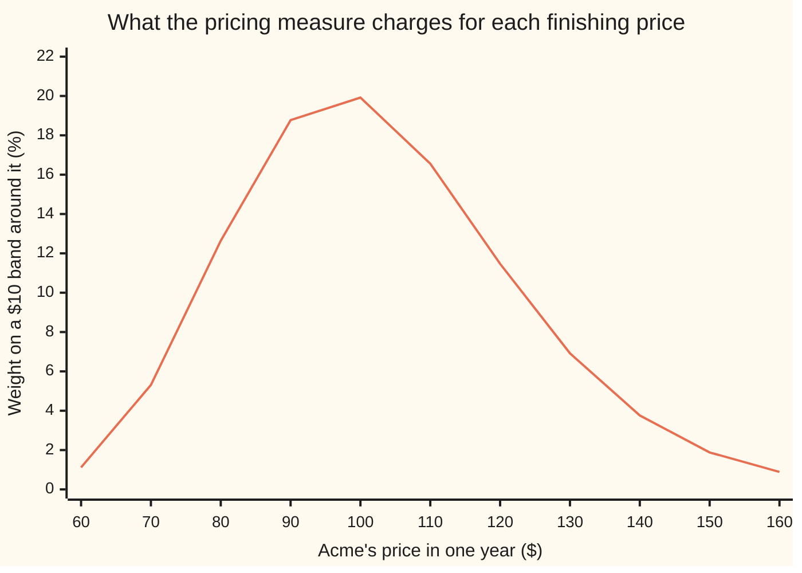
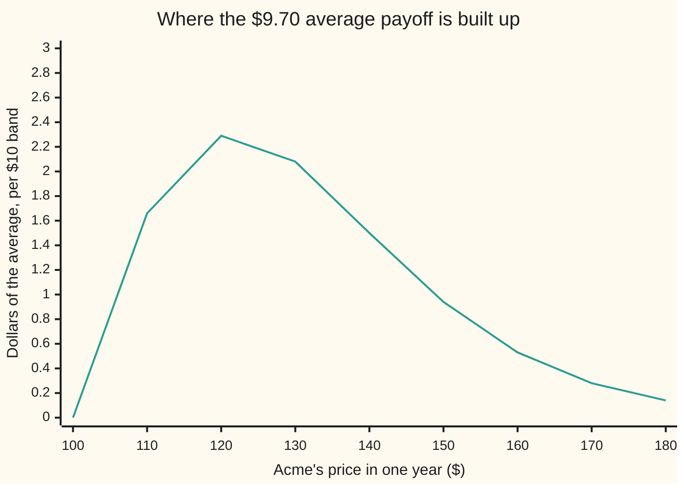

# Black-Scholes by expectation: the discounted average payoff under the pricing measure

Financial mathematics → Black-Scholes from the Ground Up → Averaging the payoff → Black-Scholes by expectation

---

## General Overview

Acme shares trade at $100 today. A one-year **European** call on Acme — European meaning usable on one day only, the expiry day — is the right, but not the duty, to buy one share for $100 twelve months from now, and in this market that right costs $9.23. The card before this one reached the figure by hedging: build a copy of the option out of Acme shares and a bank balance, adjust the copy as Acme moves, and what the copy costs to run is what the option is worth.

A second road reaches the same $9.23 and looks nothing like the first. List every price Acme could finish at. Give each finishing price a weight. Work out what the option pays at each one, average the payoffs with those weights, and shrink the average back to today's money at the bank rate.

The weights are the interesting part. They are not a forecast of where Acme is heading. They are what the market charges for a bet on where Acme lands, and the hedging card is what fixes them: in a market with no free money, where every payoff can be copied by trading, exactly one set of weights is consistent with the prices already quoted. That set is the **pricing measure**, written $Q$ from here on.

The average then splits in two, and the split is the whole formula. One piece is the share that changes hands when the option is used, worth $58.69 today. The other is the $100 of cash handed over in those same outcomes, worth $49.46 today. Subtract, and $9.23 is left.

**A call is worth the average of what it pays across every finishing price, weighted by the pricing measure and shrunk back to today's money — and that average has a closed form: the share leg minus the cash leg.**

**What kind of fact this is:** a theorem, proved on this card in Why it works. It stands on a model — Acme's price as geometric Brownian motion, with volatility held fixed — and the model's assumptions are listed under When it holds.

### The picture: the weights the average runs over



The single line is the weight the pricing measure puts on each $10 band of finishing prices, as a percentage. A $10 grid is too coarse to show the top: the peak sits at $97.04, below today's price, while the average finish is $103.05. Prices multiply rather than add, so the curve leans right — a 20 percent gain and a 20 percent loss are not mirror images in dollars — and that lean drags the average above the peak. The average draws only on the bands right of $100, where a call pays something; the bands to the left contribute zero, and zero is not a loss.

---

## The formula

Notation first, in words. A capital letter with the expiry date as a subscript, $S_T$, is Acme's price on expiry day — a number nobody knows today. The call's payoff is written $\max(S_T-K,0)$: whatever the share is worth above the strike, or nothing at all. An averaging sign carrying $Q$ above it means the average is taken with the pricing measure's weights.

$$C \;=\; e^{-rT}\;\mathbb{E}^{Q}\!\left[\max(S_T-K,\,0)\right]$$

**Read it aloud:** the call's price today is its average payoff under the pricing measure, pulled back to today by the bank's discount factor.

That much is handed over by the hedging card. Doing the average is the work of this card, and it turns the line above into arithmetic:

$$C \;=\; S\,e^{-qT}\,N(d_1)\;-\;K\,e^{-rT}\,N(d_2)$$

**Read it aloud:** the share that might change hands, minus the cash that might change hands, each shrunk to today's money and each carrying its own chance of the option being used.

| Symbol | Plain meaning | In our example | Push it up and the price… |
| --- | --- | --- | --- |
| $C$ | the call's price today, the answer | $9.23 | — |
| $S$ | Acme's price today | $100 | rises: more share to receive |
| $S_T$ | Acme's price on expiry day, unknown today | averages $103.05 by expiry | — |
| $K$ | the **strike**, the price the holder may buy at | $100 | falls: further to climb, more cash to hand over |
| $T$ | time to expiry, in **years** | 1 | rises: more room for a large move |
| $r$ | the riskless rate, what cash earns in the bank, compounded continuously | 5% | rises: the $100 due later costs less today |
| $q$ | the **dividend yield**, cash the company pays out each year | 2% | falls: dividends leave the share price and the option holds no share yet |
| $\sigma$ | **volatility**, how jumpy Acme is, per square root of a year. Say "sigma". | 20% | rises: the largest single effect, because the downside is already capped |
| $Q$ | the **pricing measure**: the weights the average runs over | peak $97.04, average $103.05 | — |
| $N$ | $N(x)$ is the bell-curve area to the left of $x$, a number between 0 and 1 | $N(d_1)=0.5987$, $N(d_2)=0.5199$ | — |
| $Z$ | one draw from the bell curve, centre 0 and spread 1 | above $-d_2$ the option pays | rises: Acme finishes higher |
| $d_2$ | how many wiggle units of room Acme has above the strike | 0.05 | — |
| $d_1$ | the same distance plus one wiggle unit | 0.25 | — |

The two distances, and the wiggle unit they are measured in:

$$d_2\;=\;\frac{\ln(S/K)+\left(r-q-\tfrac{1}{2}\sigma^{2}\right)T}{\sigma\sqrt{T}},\qquad d_1\;=\;d_2+\sigma\sqrt{T}$$

One **wiggle unit** is $\sigma\sqrt{T}$, the spread of Acme's log price over the option's whole life: 0.20 here. The top of $d_2$ is how far Acme's log price is expected to travel past the strike under $Q$. Divided by the wiggle unit, $d_2$ counts how many wiggle units of room there are. Then $d_1$ is one wiggle unit more, and Step 4 says where that extra unit comes from. The discount factor $e^{-rT}$ is 0.951229, and $e^{-qT}$, the fraction of a share that has to be bought today to hold one whole share at expiry with dividends reinvested, is 0.980199.

### When it holds

- **One set of weights, and only one.** No free money on the table, and every payoff copyable by trading. Where the second part fails — a market missing the instruments to build the copy — many weight sets fit the quoted prices, the average is no longer a single number, and the honest answer is a range of prices ([risk-neutral-measure-and-the-fundamental-theorems](02-risk-neutral-measure-and-the-fundamental-theorems.md)).
- **Geometric Brownian motion, with $\sigma$, $r$ and $q$ fixed.** The weights in the picture come from that model and nothing else ([geometric-brownian-motion-for-prices](01-geometric-brownian-motion-for-prices.md)). Quoted prices imply fatter far-out bands than the line drawn above, which is why one $\sigma$ cannot fit a whole row of strikes at once.
- **Exercise on expiry day only.** The average runs over finishing prices, so nothing in between can matter. Add a right to exercise early and this average becomes a floor, not the price. A payoff that reads the path — the average price over the year, a barrier touched on the way — cannot be reached from finishing prices at all, in either direction.
- **One rate for lending, borrowing and discounting.** The growth inside the weights and the shrinking outside them are both $r$. Split them — a higher borrowing rate, a haircut on collateral — and the average stops being a price anyone can hedge to.
- **Trading in any size, at any moment, with no cost.** The hedging card needs this to pin the weights down; without it the average is a model number, not a price.

**Conventions verified 19 Sep 2026:** $r$ and $q$ are continuously compounded and $T$ counts calendar years. Real quotes carry day-count and compounding conventions that differ by market and do get changed; convert before substituting.

---

## Why it works

### Step 0: a price is an average, because the hedge makes it one

The hedging card built a portfolio of shares and cash whose value tracks the option all the way to expiry. Two things that pay the same on the same day must cost the same today. That argument delivers one further fact, which is this card's starting line: under the weights $Q$, any traded position with its income reinvested, divided by the growing bank balance, is a **fair game** — its average next value is its value now, with no tilt either way. Finance calls such a quantity a martingale. The option pays no income, so its own price divided by the bank balance is such a fair game.

Run that fact from today to expiry for the option itself, and it says the option's price today is the average of its expiry payoff, discounted. So the whole job is to do one average.

Notice which quantity has vanished: Acme's real expected return. It does not appear in $Q$, and it cannot, because it cancelled in the hedge. A bull and a bear who agree about how jumpy Acme is must agree on this price.

### Step 1: what the pricing measure says about the finishing price

Under $Q$, Acme's price grows at the bank rate less what leaks out as dividends, $r-q$, and wiggles with volatility $\sigma$. The log of the finishing price is bell-curved:

$$S_T \;=\; S\,\exp\!\left(\left(r-q-\tfrac{1}{2}\sigma^{2}\right)T \;+\; \sigma\sqrt{T}\,Z\right)$$

where $Z$ is a standard bell-curve draw, centred at 0 with spread 1. Everything in the picture above is this line, redrawn as weights.

The $-\tfrac{1}{2}\sigma^{2}$ is not a fudge. Wiggling drags a compounding price down: up 20 percent then down 20 percent leaves 96 percent, not 100. Subtracting half the variance from the log growth pays for that drag exactly, so that the average finishing price comes out at $S\,e^{(r-q)T}$, which is $103.05 — the **forward price**, what the market charges today for delivery in a year. The checks compute that average by brute force and land on it to eight decimals. Discounted, it is $98.02, the cost today of having one share at expiry. A fair game, as promised.

### Step 2: the payoff is two bets glued together

At expiry the option pays $\max(S_T-K,0)$. Split that into the two things that actually change hands:

```
  max(S_T − K, 0)   =   S_T · [Acme above $100]   −   $100 · [Acme above $100]
                        └── one share received ──┘     └─── cash handed over ──┘
```

The bracket is a light switch: 1 if Acme finishes above the strike, 0 if not. Check it at two prices. Acme at $120: switch on, a share worth $120 arrives, $100 leaves, net $20, the same as the payoff. Acme at $80: switch off, nothing happens, net $0, again the same.

Averages add, so each half can be averaged on its own and the results subtracted. And each half needs its **own** weighting, which is the step where most of the trouble happens.

### Step 3: the cash leg is the strike times the chance of being used

The $100 leaves the holder's hands only when Acme finishes above $100. So that leg's average is $100 times the chance of finishing above the strike, discounted:

$$\text{cash leg} \;=\; K\,e^{-rT}\,Q(S_T>K).$$

From Step 1, $S_T>K$ happens exactly when the draw $Z$ lands above $-d_2$. The bell curve is symmetric, so that chance is the area to the left of $d_2$, namely $N(d_2)=0.5199$: a shade better than a coin flip. The cash leg is $100 \times 0.951229 \times 0.5199 = \$49.46$.

**$N(d_2)$ is the chance the option gets used, counted in dollars** — and only under $Q$, which is a weighting, not a forecast.

### Step 4: the share leg gets its own weight

The other leg hands over a share, again only above the strike. A share is not a fixed dollar amount, and that changes everything. The share is worth most in exactly the outcomes where it is received, because those are the outcomes where Acme rose. Averaging "one share, if above the strike" therefore counts the good outcomes twice over: once for how likely they are, once for how valuable the share is there.

Written out, the average carries the extra factor $e^{\sigma\sqrt{T}\,Z}$ from the share's own value. Multiply that by the bell curve and the product is the same bell curve shifted right by exactly one wiggle unit, times a constant the algebra cancels later. Same event, shifted weights, so the area that was $N(d_2)$ becomes $N(d_2+\sigma\sqrt{T})=N(d_1)=0.5987$. That shift is the whole reason two different letters appear in one formula.

$$\text{share leg} \;=\; S\,e^{-qT}\,N(d_1) \;=\; 100 \times 0.980199 \times 0.5987 \;=\; \$58.69.$$

**$N(d_1)$ is the chance the option gets used, counted in shares.** It is always the larger of the two, 0.5987 against 0.5199 here, because counting in shares tilts the weights toward the outcomes where Acme is high. The checks confirm the tilt has nothing to do with the algebra: both legs come out identical when computed by brute-force integration that never mentions $d_1$ or $d_2$.

<details>
<summary>Detailed proof: both legs, done as integrals</summary>

Write the wiggle unit as $\sigma\sqrt{T}$ and the log growth as $(r-q-\tfrac12\sigma^2)T$. Under $Q$ the finishing price is $S_T=S\exp\!\big((r-q-\tfrac12\sigma^2)T+\sigma\sqrt{T}Z\big)$, with $Z$ standard bell-curved: density $\varphi(z)=e^{-z^{2}/2}/\sqrt{2\pi}$, total area 1 (that total is the Gaussian integral, proved on [gaussian-integral](../../06-Calculus%20and%20analysis/08-Multiple%20Integrals/04-gaussian-integral.md)).

**When the option is used.** $S_T>K$ rearranges, taking logs of both sides, to $\sigma\sqrt{T}\,z > \ln(K/S)-(r-q-\tfrac12\sigma^2)T$, that is $z>-d_2$. No probability has been used yet: this is algebra on one inequality.

**The cash leg.** Its average is $K\,e^{-rT}\int_{-d_2}^{\infty}\varphi(z)\,dz$. Because $\varphi(-z)=\varphi(z)$, the area to the right of $-d_2$ equals the area to the left of $d_2$, which is $N(d_2)$.

**The share leg.** Its average is
$$e^{-rT}S\,e^{(r-q-\frac12\sigma^2)T}\int_{-d_2}^{\infty}e^{\sigma\sqrt{T}z}\,\varphi(z)\,dz.$$
Complete the square in the exponent: $-\tfrac12z^{2}+\sigma\sqrt{T}z = -\tfrac12\big(z-\sigma\sqrt{T}\big)^{2}+\tfrac12\sigma^{2}T$, so
$$e^{\sigma\sqrt{T}z}\varphi(z) \;=\; e^{\frac12\sigma^{2}T}\,\varphi\!\left(z-\sigma\sqrt{T}\right).$$
The right-hand side is the same bell curve moved one wiggle unit to the right. Substituting $u=z-\sigma\sqrt{T}$ turns the lower limit $-d_2$ into $-d_2-\sigma\sqrt{T}=-d_1$, and the integral becomes $e^{\frac12\sigma^{2}T}N(d_1)$.

**Collecting the constants.** The stray $e^{\frac12\sigma^{2}T}$ cancels the $-\tfrac12\sigma^{2}T$ sitting in the growth, and $e^{-rT}e^{(r-q)T}=e^{-qT}$. What is left in front of $N(d_1)$ is $S\,e^{-qT}$. Subtracting the cash leg gives the formula. Both averages are finite: the first is bounded by 1, the second by the average of $S_T$, which is the forward price.

</details>

### Step 5: subtract, and read the result

$$C \;=\; S\,e^{-qT}\,N(d_1)\;-\;K\,e^{-rT}\,N(d_2)\;=\;58.685115-49.458109\;=\;9.227006.$$

The same $9.23 the hedging card produced, from an argument that never mentions a hedge. Two doors, one room — and this door is the one that opens onto every other payoff, since an average can be taken of anything, while a hedge argument in closed form needs a payoff as tidy as this one.

Where does the average come from? Not from a narrow strip above the strike. The band around $120 contributes the most of any single band, $2.29, but everything above $120 carries two thirds of the price: each far band holds little weight and pays a lot, and there are many of them.



The single line is each $10 band's contribution to the average payoff at expiry, in dollars. The nine bands drawn add to $9.42, a rough tally of the exact $9.70; the smooth version of this sum, taken over every price, is what the formula computes. Discounting that $9.70 by 0.951229 gives $9.23.

---

## Worked numbers, by hand

Acme: $S=100$, $K=100$, $r=5\%$, $q=2\%$, $\sigma=20\%$, $T=1$ year.

| Step | Arithmetic | Value |
| --- | --- | --- |
| $\ln(S/K)$ | $\ln(100/100)$ | 0 |
| growth under $Q$, $r-q-\tfrac12\sigma^2$ | $0.05-0.02-0.02$ | 0.01 |
| one wiggle unit, $\sigma\sqrt{T}$ | $0.20\times 1$ | 0.20 |
| $d_2$ | $(0+0.01)/0.20$ | 0.05 |
| $d_1$ | $0.05+0.20$ | 0.25 |
| $N(d_2)$, the chance counted in dollars | bell-curve area left of 0.05 | 0.519939 |
| $N(d_1)$, the chance counted in shares | bell-curve area left of 0.25 | 0.598706 |
| cash leg, $K\,e^{-rT}N(d_2)$ | $100\times 0.951229\times 0.519939$ | $49.46 |
| share leg, $S\,e^{-qT}N(d_1)$ | $100\times 0.980199\times 0.598706$ | $58.69 |
| **the call** | $58.685115-49.458109$ | **$9.23** |
| the average payoff, before discounting | $9.227006/0.951229$ | $9.70 |

```
the two legs and their difference, each █ worth two dollars of today's money
share received, S e^-qT N(d1)   █████████████████████████████  $58.69
cash handed over, K e^-rT N(d2) █████████████████████████      $49.46
the call, the difference        █████                          $9.23
```

Two large numbers nearly cancel, leaving a small one: each leg is worth about half the share price, the option 9 percent of it. Rounding the legs before subtracting therefore throws away two digits of the answer.

### What breaks if you drop a piece

| Mistake | Comes out at | What went wrong |
| --- | --- | --- |
| Average under a real-world 8 percent total return (a 6 percent price rise plus the 2 percent dividend), not $Q$ | $11.10 | 20 percent too dear. The weights are prices of bets, not a forecast; the forecast cancelled in the hedge. |
| Never shrink the average back to today | $9.70 | That is the average payoff on expiry day, not money in hand now. |
| Take the payoff of the average price instead of the average of the payoff | $2.90 | The payoff is bent at the strike, so averaging first flattens it. $2.90 is the value of a forward contract, which is a different deal. |
| Swap the two weights: $N(d_2)$ on the share, $N(d_1)$ on the cash | $-5.99 | A negative price for a contract that never pays less than nothing. Counting the share in dollars and the cash in shares gets both legs wrong at once. |

Every number in that table is printed by the code below.

---

## Code, from first principles, and it actually runs

Three independent roads reach the same price. Road 1 is the closed form. Road 2 never mentions $d_1$ or $d_2$: it lays the lognormal weights out over prices from $100 to $600 and adds up payoff times weight by Simpson's rule, written out. Road 3 draws 200,000 finishing prices from a generator written in the file and averages what the option pays, with its own error bar. Road 2 then recomputes each leg separately, prices the put on its own for a parity check, and averages the finishing price to confirm it lands on the forward. Nothing imported already knows the answer: the bell-curve area comes from `math.erf` in Python and from thin slices under the curve in Rust, and the random numbers from a multiplier-and-add generator with a Box-Muller pair.

### Python

```python
# Black-Scholes by expectation -- the check behind the card.  Standard library
# only, and nothing imported that already knows the answer: the bell-curve area
# is built from math.erf, the average over finishing prices is Simpson's rule
# written out in price space, and the random draws are a generator plus a
# Box-Muller pair written here.  Every number quoted on the card is printed.
from math import log, sqrt, exp, erf, pi, cos, sin

S, K, R, Q, SIG, T = 100.0, 100.0, 0.05, 0.02, 0.20, 1.0
D = exp(-R * T)                    # discount factor, e^-rT
A = S * exp(-Q * T)                # prepaid share: one share at T, paid for today
MU_Q = R - Q                       # price growth under the pricing measure
MU_P = 0.06                        # an 8% real-world return, less the 2% dividend
TOP = 600.0                        # far above any finishing price that matters

def bell_area(x):                  # N(x): bell-curve area to the left of x
    return 0.5 * (1.0 + erf(x / sqrt(2.0)))

def d_pair(s, k, r, q, sig, t):    # the two distances, in wiggle units
    vt = sig * sqrt(t)
    d1 = (log(s / k) + (r - q + 0.5 * sig * sig) * t) / vt
    return d1, d1 - vt

def closed_form(s, k, r, q, sig, t):                      # road 1
    d1, d2 = d_pair(s, k, r, q, sig, t)
    return s * exp(-q * t) * bell_area(d1) - k * exp(-r * t) * bell_area(d2)

def density(x, mu=MU_Q):           # chance per dollar of finishing at price x
    centre = log(S) + (mu - 0.5 * SIG * SIG) * T
    spread = SIG * sqrt(T)
    return exp(-0.5 * ((log(x) - centre) / spread) ** 2) / (x * spread * sqrt(2.0 * pi))

def simpson(f, lo, hi, n):         # Simpson's rule, written out
    h = (hi - lo) / n
    total = f(lo) + f(hi)
    for i in range(1, n):
        total += (4 if i % 2 else 2) * f(lo + i * h)
    return total * h / 3.0

def average(payoff, lo, hi, mu=MU_Q, n=20000):            # road 2: average over prices
    return D * simpson(lambda x: payoff(x) * density(x, mu), lo, hi, n)

def draws(n, seed=20260919):       # road 3's random numbers, written here
    state, out = seed, []
    while len(out) < n:
        two = []
        for _ in range(2):
            state = (state * 6364136223846793005 + 1442695040888963407) % (1 << 64)
            two.append(((state >> 11) + 0.5) / float(1 << 53))
        radius = sqrt(-2.0 * log(two[0]))
        out.append(radius * cos(2.0 * pi * two[1]))
        out.append(radius * sin(2.0 * pi * two[1]))
    return out[:n]

def monte_carlo(n):                # road 3: draw finishing prices, average the payoff
    total = total_sq = total_end = 0.0
    for z in draws(n):
        end = S * exp((MU_Q - 0.5 * SIG * SIG) * T + SIG * sqrt(T) * z)
        paid = D * max(end - K, 0.0)
        total += paid
        total_sq += paid * paid
        total_end += D * end
    mean = total / n
    return mean, sqrt(max(total_sq / n - mean * mean, 0.0) / n), total_end / n

d1, d2 = d_pair(S, K, R, Q, SIG, T)
mode = S * exp((MU_Q - 1.5 * SIG * SIG) * T)              # where the weights peak
call = closed_form(S, K, R, Q, SIG, T)
share_term, cash_term = A * bell_area(d1), K * D * bell_area(d2)
call_int = average(lambda x: max(x - K, 0.0), K, TOP)     # the same average, road 2
share_int = average(lambda x: x, K, TOP)                  # share leg, without d1
cash_int = average(lambda x: K, K, TOP)                   # cash leg, without d2
mean_end = average(lambda x: x, 0.01, TOP)                # discounted average finish
put_int = average(lambda x: max(K - x, 0.0), 0.01, K)     # the put, priced on its own
mc, mc_err, mc_end = monte_carlo(200000)
wrong_real = average(lambda x: max(x - K, 0.0), K, TOP, mu=MU_P)
wrong_jensen = D * max(mean_end / D - K, 0.0)             # payoff of the average price
wrong_swap = A * bell_area(d2) - K * D * bell_area(d1)    # the two weights swapped
cut_at_120 = average(lambda x: max(x - K, 0.0), K, 120.0)
mc_small, mc_small_err, _ = monte_carlo(2000)
vol_40 = closed_form(S, K, R, Q, 0.40, T)

rows = [
    ("d1", d1), ("d2", d2),
    ("N(d1)  share-counted chance", bell_area(d1)),
    ("N(d2)  cash-counted chance", bell_area(d2)),
    ("e^-rT  discount factor", D),
    ("e^-qT  dividend drag", exp(-Q * T)),
    ("share leg  S e^-qT N(d1)", share_term),
    ("cash leg   K e^-rT N(d2)", cash_term),
    ("road 1  closed form", call),
    ("road 2  average over prices", call_int),
    ("road 3  200,000 drawn finishes", mc),
    ("        its standard error", mc_err),
    ("share leg by road 2", share_int),
    ("cash leg by road 2", cash_int),
    ("average payoff, not discounted", call / D),
    ("average finish, road 2", mean_end / D),
    ("  forward S e^(r-q)T", S * exp((R - Q) * T)),
    ("  peak of the weights", mode),
    ("  discounted average finish", mean_end), ("  S e^-qT", A),
    ("  discounted finish, road 3", mc_end),
    ("put by road 2", put_int), ("  call minus put", call - put_int),
    ("  S e^-qT - K e^-rT", A - K * D),
    ("wrong: average under 8% drift", wrong_real),
    ("wrong: payoff of the average", wrong_jensen),
    ("wrong: the two weights swapped", wrong_swap),
    ("try: prices cut off at 120", cut_at_120),
    ("try: 2,000 draws", mc_small), ("     its standard error", mc_small_err),
    ("try: sigma = 0.40", vol_40),
]
for name, value in rows:
    print(f"{name:<32} {value:>14.6f}")

bands = [60.0 + 10.0 * i for i in range(11)]
gains = [100.0 + 10.0 * i for i in range(9)]
print()
print("chart, finishing price ($)     " + " ".join(f"{x:6.0f}" for x in bands))
print("chart, chance of a $10 band (%)" + " ".join(f"{1000.0 * density(x):6.2f}" for x in bands))
print("chart, finishing price ($)     " + " ".join(f"{x:6.0f}" for x in gains))
print("chart, $ of the average payoff " + " ".join(f"{10.0 * max(x - K, 0.0) * density(x):6.2f}" for x in gains))
print(f"those nine bands add to        {sum(10.0 * max(x - K, 0.0) * density(x) for x in gains):>14.6f}")
print(f"bars, share leg {share_term:.2f}, cash leg {cash_term:.2f}, call {call:.2f}")

assert abs(call - 9.227005508154) < 1e-9, "closed form vs the shelf's house number"
assert abs(call_int - call) < 1e-8, "average over prices vs the closed form"
assert abs(mc - call) < 3.0 * mc_err, "drawn average within three standard errors"
assert abs(share_int - share_term) < 1e-8, "share leg: no d1 used on the left side"
assert abs(cash_int - cash_term) < 1e-8, "cash leg: no d2 used on the left side"
assert abs(mean_end / D - S * exp((R - Q) * T)) < 1e-8, "average finish is the forward"
assert abs(mean_end - A) < 1e-8, "discounted average finish must be the prepaid share"
assert density(mode) > density(100.0) > density(90.0), "the weights peak below the strike"
assert abs((call - put_int) - (A - K * D)) < 1e-8, "parity, with a separately priced put"
assert bell_area(d1) > bell_area(d2), "the share weight must exceed the cash weight"
print("ALL CHECKS PASS")
```

**Ran 2026-09-19 on macOS, Python 3.14.6, standard library only. All checks passed. Output, pasted from the run:**

```
d1                                     0.250000
d2                                     0.050000
N(d1)  share-counted chance            0.598706
N(d2)  cash-counted chance             0.519939
e^-rT  discount factor                 0.951229
e^-qT  dividend drag                   0.980199
share leg  S e^-qT N(d1)              58.685115
cash leg   K e^-rT N(d2)              49.458109
road 1  closed form                    9.227006
road 2  average over prices            9.227006
road 3  200,000 drawn finishes         9.220697
        its standard error             0.030945
share leg by road 2                   58.685115
cash leg by road 2                    49.458109
average payoff, not discounted         9.700084
average finish, road 2               103.045453
  forward S e^(r-q)T                 103.045453
  peak of the weights                 97.044553
  discounted average finish           98.019867
  S e^-qT                             98.019867
  discounted finish, road 3           98.020694
put by road 2                          6.330081
  call minus put                       2.896925
  S e^-qT - K e^-rT                    2.896925
wrong: average under 8% drift         11.099996
wrong: payoff of the average           2.896925
wrong: the two weights swapped        -5.986375
try: prices cut off at 120             2.815866
try: 2,000 draws                       9.539056
     its standard error                0.327199
try: sigma = 0.40                     16.799366

chart, finishing price ($)         60     70     80     90    100    110    120    130    140    150    160
chart, chance of a $10 band (%)  1.12   5.31  12.64  18.77  19.92  16.56  11.47   6.92   3.76   1.88   0.89
chart, finishing price ($)        100    110    120    130    140    150    160    170    180
chart, $ of the average payoff   0.00   1.66   2.29   2.08   1.50   0.94   0.53   0.28   0.14
those nine bands add to              9.416020
bars, share leg 58.69, cash leg 49.46, call 9.23
ALL CHECKS PASS
```

The closed form and the brute-force average over prices agree to six decimals, and so do both legs taken separately — the card's central claim, checked without the algebra that produced it. The 200,000 draws come in at $9.220697, low by a fifth of their own standard error of $0.030945.

### Rust

Same inputs, same labels, no crates. Rust has no `erf`, so the bell-curve area is built by adding up thin slices under the curve — a different route to the same number.

```rust
// Black-Scholes by expectation -- the same check as the Python, in Rust.  Std
// only, no crates.  Rust has no erf, so the bell-curve area N(x) is built the
// honest way: thin slices under the curve.  Same three roads, same labels.
// Compile: rustc --edition 2021 -O black_scholes_by_risk_neutral_expectation_check.rs
use std::f64::consts::PI;

const S: f64 = 100.0;
const K: f64 = 100.0;
const R: f64 = 0.05;
const Q: f64 = 0.02;
const SIG: f64 = 0.20;
const T: f64 = 1.0;
const MU_Q: f64 = R - Q;              // price growth under the pricing measure
const MU_P: f64 = 0.06;               // an 8% real-world return, less the 2% dividend
const TOP: f64 = 600.0;               // far above any finishing price that matters

fn disc() -> f64 { (-R * T).exp() }                 // discount factor, e^-rT
fn prepaid() -> f64 { S * (-Q * T).exp() }          // one share at T, paid for today

fn phi(x: f64) -> f64 { (-0.5 * x * x).exp() / (2.0 * PI).sqrt() }

fn simpson<F: Fn(f64) -> f64>(f: F, lo: f64, hi: f64, n: usize) -> f64 {
    let h = (hi - lo) / n as f64;
    let mut total = f(lo) + f(hi);
    for i in 1..n { total += (if i % 2 == 1 { 4.0 } else { 2.0 }) * f(lo + i as f64 * h); }
    total * h / 3.0
}

fn bell_area(x: f64) -> f64 {          // N(x): bell-curve area to the left of x
    if x < -12.0 { return 0.0; }
    if x > 12.0 { return 1.0; }
    0.5 + simpson(phi, 0.0, x, 4000)
}

fn d_pair(s: f64, k: f64, r: f64, q: f64, sig: f64, t: f64) -> (f64, f64) {
    let vt = sig * t.sqrt();
    let d1 = ((s / k).ln() + (r - q + 0.5 * sig * sig) * t) / vt;
    (d1, d1 - vt)
}

fn closed_form(s: f64, k: f64, r: f64, q: f64, sig: f64, t: f64) -> f64 {   // road 1
    let (d1, d2) = d_pair(s, k, r, q, sig, t);
    s * (-q * t).exp() * bell_area(d1) - k * (-r * t).exp() * bell_area(d2)
}

fn density(x: f64, mu: f64) -> f64 {   // chance per dollar of finishing at price x
    let centre = S.ln() + (mu - 0.5 * SIG * SIG) * T;
    let spread = SIG * T.sqrt();
    (-0.5 * ((x.ln() - centre) / spread).powi(2)).exp() / (x * spread * (2.0 * PI).sqrt())
}

fn average<F: Fn(f64) -> f64>(payoff: F, lo: f64, hi: f64, mu: f64) -> f64 {
    disc() * simpson(|x| payoff(x) * density(x, mu), lo, hi, 20000)   // road 2
}

fn draws(n: usize) -> Vec<f64> {       // road 3's random numbers, written here
    let mut state: u64 = 20260919;
    let mut out: Vec<f64> = Vec::new();
    while out.len() < n {
        let mut two = [0.0f64; 2];
        for slot in two.iter_mut() {
            state = state.wrapping_mul(6364136223846793005).wrapping_add(1442695040888963407);
            *slot = ((state >> 11) as f64 + 0.5) / 9007199254740992.0;
        }
        let radius = (-2.0 * two[0].ln()).sqrt();
        out.push(radius * (2.0 * PI * two[1]).cos());
        out.push(radius * (2.0 * PI * two[1]).sin());
    }
    out.truncate(n);
    out
}

fn monte_carlo(n: usize) -> (f64, f64, f64) {       // road 3: draw, then average
    let (mut total, mut total_sq, mut total_end) = (0.0, 0.0, 0.0);
    for z in draws(n) {
        let end = S * ((MU_Q - 0.5 * SIG * SIG) * T + SIG * T.sqrt() * z).exp();
        let paid = disc() * (end - K).max(0.0);
        total += paid;
        total_sq += paid * paid;
        total_end += disc() * end;
    }
    let mean = total / n as f64;
    (mean, ((total_sq / n as f64 - mean * mean).max(0.0) / n as f64).sqrt(), total_end / n as f64)
}

fn main() {
    let (d, a) = (disc(), prepaid());
    let (d1, d2) = d_pair(S, K, R, Q, SIG, T);
    let mode = S * ((MU_Q - 1.5 * SIG * SIG) * T).exp();          // where the weights peak
    let call = closed_form(S, K, R, Q, SIG, T);
    let (share_term, cash_term) = (a * bell_area(d1), K * d * bell_area(d2));
    let call_int = average(|x| (x - K).max(0.0), K, TOP, MU_Q);   // the same average, road 2
    let share_int = average(|x| x, K, TOP, MU_Q);                 // share leg, without d1
    let cash_int = average(|_x| K, K, TOP, MU_Q);                 // cash leg, without d2
    let mean_end = average(|x| x, 0.01, TOP, MU_Q);               // discounted average finish
    let put_int = average(|x| (K - x).max(0.0), 0.01, K, MU_Q);   // the put, priced on its own
    let (mc, mc_err, mc_end) = monte_carlo(200000);
    let wrong_real = average(|x| (x - K).max(0.0), K, TOP, MU_P);
    let wrong_jensen = d * (mean_end / d - K).max(0.0);           // payoff of the average price
    let wrong_swap = a * bell_area(d2) - K * d * bell_area(d1);   // the two weights swapped
    let cut_at_120 = average(|x| (x - K).max(0.0), K, 120.0, MU_Q);
    let (mc_small, mc_small_err, _) = monte_carlo(2000);
    let vol_40 = closed_form(S, K, R, Q, 0.40, T);

    let rows: Vec<(&str, f64)> = vec![
        ("d1", d1), ("d2", d2),
        ("N(d1)  share-counted chance", bell_area(d1)),
        ("N(d2)  cash-counted chance", bell_area(d2)),
        ("e^-rT  discount factor", d),
        ("e^-qT  dividend drag", (-Q * T).exp()),
        ("share leg  S e^-qT N(d1)", share_term),
        ("cash leg   K e^-rT N(d2)", cash_term),
        ("road 1  closed form", call),
        ("road 2  average over prices", call_int),
        ("road 3  200,000 drawn finishes", mc),
        ("        its standard error", mc_err),
        ("share leg by road 2", share_int),
        ("cash leg by road 2", cash_int),
        ("average payoff, not discounted", call / d),
        ("average finish, road 2", mean_end / d),
        ("  forward S e^(r-q)T", S * ((R - Q) * T).exp()),
        ("  peak of the weights", mode),
        ("  discounted average finish", mean_end), ("  S e^-qT", a),
        ("  discounted finish, road 3", mc_end),
        ("put by road 2", put_int), ("  call minus put", call - put_int),
        ("  S e^-qT - K e^-rT", a - K * d),
        ("wrong: average under 8% drift", wrong_real),
        ("wrong: payoff of the average", wrong_jensen),
        ("wrong: the two weights swapped", wrong_swap),
        ("try: prices cut off at 120", cut_at_120),
        ("try: 2,000 draws", mc_small), ("     its standard error", mc_small_err),
        ("try: sigma = 0.40", vol_40),
    ];
    for (name, value) in &rows { println!("{:<32} {:>14.6}", name, value); }

    let bands: Vec<f64> = (0..11).map(|i| 60.0 + 10.0 * i as f64).collect();
    let gains: Vec<f64> = (0..9).map(|i| 100.0 + 10.0 * i as f64).collect();
    let band_row = |v: &Vec<f64>, f: &dyn Fn(f64) -> String| {
        v.iter().map(|x| f(*x)).collect::<Vec<String>>().join(" ")
    };
    println!();
    println!("chart, finishing price ($)     {}", band_row(&bands, &|x| format!("{:6.0}", x)));
    println!("chart, chance of a $10 band (%){}",
             band_row(&bands, &|x| format!("{:6.2}", 1000.0 * density(x, MU_Q))));
    println!("chart, finishing price ($)     {}", band_row(&gains, &|x| format!("{:6.0}", x)));
    println!("chart, $ of the average payoff {}",
             band_row(&gains, &|x| format!("{:6.2}", 10.0 * (x - K).max(0.0) * density(x, MU_Q))));
    let tally: f64 = gains.iter().map(|x| 10.0 * (x - K).max(0.0) * density(*x, MU_Q)).sum();
    println!("those nine bands add to        {:>14.6}", tally);
    println!("bars, share leg {:.2}, cash leg {:.2}, call {:.2}", share_term, cash_term, call);

    assert!((call - 9.227005508154).abs() < 1e-9, "closed form vs the shelf's house number");
    assert!((call_int - call).abs() < 1e-8, "average over prices vs the closed form");
    assert!((mc - call).abs() < 3.0 * mc_err, "drawn average within three standard errors");
    assert!((share_int - share_term).abs() < 1e-8, "share leg: no d1 used on the left side");
    assert!((cash_int - cash_term).abs() < 1e-8, "cash leg: no d2 used on the left side");
    assert!((mean_end / d - S * ((R - Q) * T).exp()).abs() < 1e-8, "average finish is the forward");
    assert!((mean_end - a).abs() < 1e-8, "discounted average finish must be the prepaid share");
    assert!(density(mode, MU_Q) > density(100.0, MU_Q) && density(100.0, MU_Q) > density(90.0, MU_Q),
            "the weights peak below the strike");
    assert!(((call - put_int) - (a - K * d)).abs() < 1e-8, "parity, with a separately priced put");
    assert!(bell_area(d1) > bell_area(d2), "the share weight must exceed the cash weight");
    println!("ALL CHECKS PASS");
}
```

**Ran 2026-09-19 on macOS, rustc 1.98.1, no crates. All checks passed. Output, pasted from the run:**

```
d1                                     0.250000
d2                                     0.050000
N(d1)  share-counted chance            0.598706
N(d2)  cash-counted chance             0.519939
e^-rT  discount factor                 0.951229
e^-qT  dividend drag                   0.980199
share leg  S e^-qT N(d1)              58.685115
cash leg   K e^-rT N(d2)              49.458109
road 1  closed form                    9.227006
road 2  average over prices            9.227006
road 3  200,000 drawn finishes         9.220697
        its standard error             0.030945
share leg by road 2                   58.685115
cash leg by road 2                    49.458109
average payoff, not discounted         9.700084
average finish, road 2               103.045453
  forward S e^(r-q)T                 103.045453
  peak of the weights                 97.044553
  discounted average finish           98.019867
  S e^-qT                             98.019867
  discounted finish, road 3           98.020694
put by road 2                          6.330081
  call minus put                       2.896925
  S e^-qT - K e^-rT                    2.896925
wrong: average under 8% drift         11.099996
wrong: payoff of the average           2.896925
wrong: the two weights swapped        -5.986375
try: prices cut off at 120             2.815866
try: 2,000 draws                       9.539056
     its standard error                0.327199
try: sigma = 0.40                     16.799366

chart, finishing price ($)         60     70     80     90    100    110    120    130    140    150    160
chart, chance of a $10 band (%)  1.12   5.31  12.64  18.77  19.92  16.56  11.47   6.92   3.76   1.88   0.89
chart, finishing price ($)        100    110    120    130    140    150    160    170    180
chart, $ of the average payoff   0.00   1.66   2.29   2.08   1.50   0.94   0.53   0.28   0.14
those nine bands add to              9.416020
bars, share leg 58.69, cash leg 49.46, call 9.23
ALL CHECKS PASS
```

The two outputs match line for line at six decimals, including the drawn average, because both files run the same generator arithmetic on 64-bit integers.

> [!TIP]
> **Try changing**
> Guess the direction first, then run it.
> - **Cut the price range off at $120.** Change road 2's upper limit from `TOP` to `120.0` and the price falls to **$2.82**. Two thirds of the option's worth lives above $120, in bands that each carry little weight but pay a lot.
> - **Ask for 2,000 draws instead of 200,000.** The average comes out at **$9.54**, standard error **$0.33** rather than $0.031: a hundred times fewer draws, ten times the error. Monte Carlo pays for accuracy with the square root of effort.
> - **Double the jumpiness.** Set `SIG` to `0.40` and the price rises to **$16.80**. The weights spread out, and extra weight in the far-right bands is worth more than extra weight on the left, which pays nothing.
> - **Average under the real world.** Pass `mu=MU_P` to road 2, an 8 percent expected total return, dividend included, instead of the bank's 5 percent, and the answer becomes **$11.10** — the costliest mistake on this card, and the one that looks most like common sense.

---

## The usual mistake

> [!warning]
> **Reading $Q$ as a forecast of Acme.** The weights in the picture are not anyone's view of where the share is going; they are the prices of bets on where it lands, and they are what they are because the hedge cancels the view. Averaging the payoff under a real-world 8 percent expected return gives $11.10 instead of $9.23. Nothing about that number is a price: no trade can be arranged around it.
>
> - **Averaging the price and then applying the payoff.** That gives $2.90, the worth of a forward contract. The order matters because the payoff has a kink: the average of a bent function is not the bent function of the average.
> - **Calling $N(d_1)$ the chance of the option being used.** That chance, under $Q$, is $N(d_2)=0.5199$. The larger number $N(d_1)=0.5987$ is the same event counted in shares rather than dollars. Which unit of account turns it into a genuine probability is the next card's subject.
> - **Trusting a truncated average.** Lopping the tail off at $120 leaves $2.82 of the $9.23. A numerical average needs its far bands, and a check that the cut-off costs nothing.
> - **Reading an error bar as a decimal place.** An average of $9.54 from 2,000 draws is not a price to four figures: its own standard error is $0.33. Quoting more digits than the standard error supports is the standard misuse of the easiest road.

---

## Where you meet it in real life

- **Every payoff that has no formula.** An average can be taken of anything: a payoff depending on the whole path, on several shares, on the highest price reached. Desks simulate, average, discount — this card's recipe with a computer instead of an integral ([carr-madan-fft-and-cos-methods](../06-Numerical%20Methods%20for%20Pricing/09-carr-madan-fft-and-cos-methods.md) does it with transforms).
- **The two legs sold separately.** A bet paying $100 if Acme finishes above $100 is the cash leg on its own, and it costs $49.46. A contract delivering one share on the same condition is the share leg, $58.69. Both trade.
- **Quoted volatility.** The average runs forwards from $\sigma$ to a price; desks run it backwards, from a screen price to the $\sigma$ that reproduces it. That number is what the market argues about, and the fact that it differs strike by strike is the model's honest limit.
- **Anything quoted as a forward rather than a share.** The same average, centred on the forward price, prices options on futures, on interest rates and on swaps ([black-76-and-forward-level-pricing](06-black-76-and-forward-level-pricing.md)), and it changes shape when the underlying quantity can go negative ([bachelier-model](07-bachelier-model.md), [shifted-lognormal-and-volatility-conversion](08-shifted-lognormal-and-volatility-conversion.md)).

> **Say it back**
> The hedge argument says a traded price is the discounted average of its future payoff, taken with one particular set of weights, the pricing measure. Under those weights Acme's finishing price is lognormal, growing at the bank rate less its dividend yield. The call's payoff splits into a share received above the strike and cash handed over above the strike, so the average splits too. The cash leg weighs the strike by the chance of being used, $N(d_2)$. The share leg weighs the share by the same event counted in shares, which shifts the bell curve one wiggle unit and gives $N(d_1)$. Subtract: $58.69-49.46=\$9.23$, the same figure the hedge produced.

---

## What this builds on

- [black-scholes-by-delta-hedging](03-black-scholes-by-delta-hedging.md): the reason an average may be called a price. It builds the copying portfolio and shows that discounted traded values, income reinvested, are fair games under $Q$.
- [gaussian-integral](../../06-Calculus%20and%20analysis/08-Multiple%20Integrals/04-gaussian-integral.md): the area under a bell curve, and the completing-the-square move that Step 4 leans on entirely.

## Where this goes next

- [change-of-numeraire-in-pricing](05-change-of-numeraire-in-pricing.md): measuring wealth in shares, or in a bond, instead of in bank cash — which is what makes $N(d_1)$ a probability in its own right.
- [black-76-and-forward-level-pricing](06-black-76-and-forward-level-pricing.md): the same average with the forward price at its centre, which covers futures, caps and swaptions.
- [carr-madan-fft-and-cos-methods](../06-Numerical%20Methods%20for%20Pricing/09-carr-madan-fft-and-cos-methods.md): the same average done through a transform, for models whose weights have no tidy closed form.

This card weighted every outcome in one unit of account, dollars sitting in the bank, and that choice is what left $N(d_1)$ looking like a probability without being one; the next card changes the unit of account and turns it into one.

---

## Sources

Verified 19 Sep 2026: every link below resolves to the publisher's page.

- Black, Fischer, and Myron Scholes. "The Pricing of Options and Corporate Liabilities." *Journal of Political Economy* 81, no. 3 (1973): 637–654. [doi:10.1086/260062](https://doi.org/10.1086/260062). The original formula, reached by the hedge rather than the average.
- Merton, Robert C. "Theory of Rational Option Pricing." *Bell Journal of Economics and Management Science* 4, no. 1 (1973): 141–183. [doi:10.2307/3003143](https://doi.org/10.2307/3003143). Adds the dividend yield $q$, the version on this card.
- Cox, John C., and Stephen A. Ross. "The Valuation of Options for Alternative Stochastic Processes." *Journal of Financial Economics* 3, no. 1–2 (1976): 145–166. [doi:10.1016/0304-405X(76)90023-4](https://doi.org/10.1016/0304-405X(76)90023-4). Where pricing as a discounted average under adjusted weights is set out.
- Harrison, J. Michael, and Stanley R. Pliska. "Martingales and Stochastic Integrals in the Theory of Continuous Trading." *Stochastic Processes and their Applications* 11, no. 3 (1981): 215–260. [doi:10.1016/0304-4149(81)90026-0](https://doi.org/10.1016/0304-4149(81)90026-0). Proves the fair-game statement this card starts from, and ties it to the copying argument.
- Shreve, Steven E. *Stochastic Calculus for Finance II: Continuous-Time Models*. Springer, 2004. [Publisher page](https://link.springer.com/book/9780387401010). Prices the call as a discounted average under the risk-neutral measure, with both integrals of Step 3 and Step 4 done in full.
