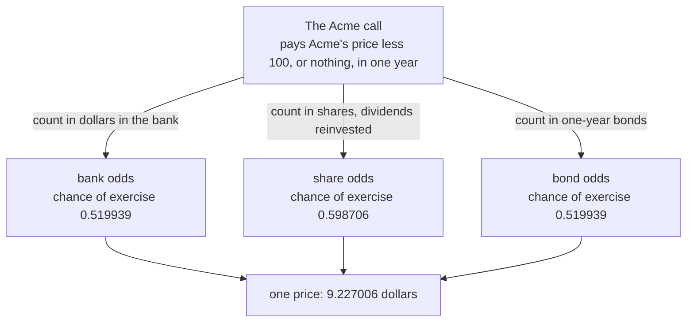
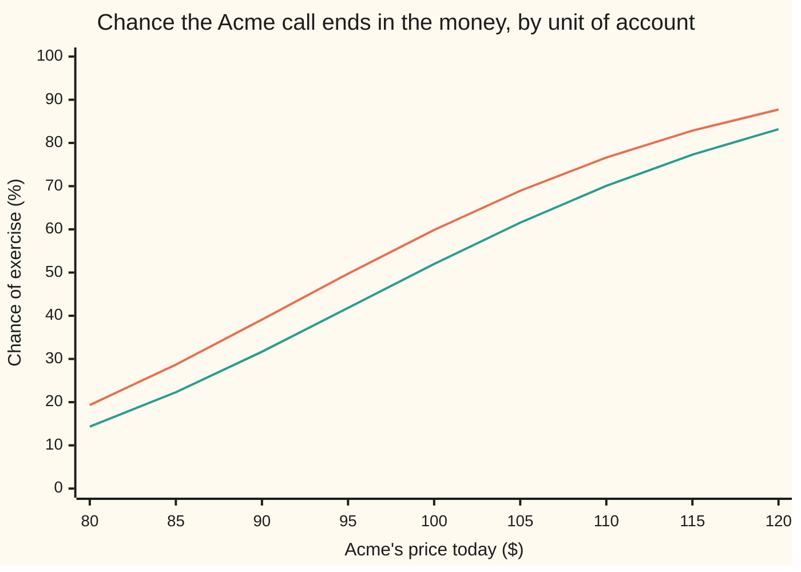

# Changing the unit of account: pricing in shares, bonds or annuities

[Syllabus](../../../SYLLABUS.md) → [Financial mathematics](../README.md) → [Black-Scholes from the Ground Up](../README.md#s05) → Changing the unit of account

---

## General Overview

Acme trades at $100. A one-year call on Acme, struck at $100, is worth $9.23. The shelf reaches that number by averaging the payoff over every way the year can end and pulling the average back to today's money ([Black-Scholes by expectation](04-black-scholes-by-risk-neutral-expectation.md)).

That price is quoted in dollars. Dollars feel like the natural thing to quote it in. They are a choice. The same option costs 0.0923 of an Acme share, or 9.70 of the bonds that pay a dollar in a year. One contract, three price tags, three **units of account**.

Choosing the unit is not bookkeeping. The average that produces the price runs over every ending, and each ending carries a weight. Change the unit and those weights have to change too. Keep the old ones and the answer is wrong: the two-outcome example below then comes out at 4.500000 when the true bill is 6.000000. Choose the unit well and a hard average turns into an easy one — which is where the second probability in Black–Scholes comes from, and where the interest-rate options market gets its formulas.

**A contract's price counted in units of any positive traded asset equals the average of its payoff counted in the same units, once every ending's weight has been multiplied by how much that asset outgrew the bank.**

**What kind of fact this is:** a theorem, proved on this card in Why it works; the tilt it multiplies by is a definition.

### The picture: three units, three sets of odds, one price



Exercise happens on exactly the same endings whichever route is taken. Only the weights differ, and only the middle route differs from the other two: the bond's odds match the bank's here because this market's interest rate never moves. Step 5 shows what happens when it does.

---

## The formula

Write $U_0$ for the price today of one unit of account and $U_T$ for its price on the payment date: one dollar in the bank, one share, one bond, whatever has been chosen. Textbooks call that asset the **numeraire**, French for unit of account, and give it the letter N; this card writes $U_t$, because $N$ already means the bell-curve area here. Write $E^{U}[\,\cdot\,]$ for an average taken with the unit's own weights, and $V_0$, $V_T$ for the contract's dollar price today and its dollar payoff at the end.

$$\frac{V_0}{U_0} \;=\; E^{U}\!\left[\frac{V_T}{U_T}\right]$$

**Read it aloud:** the contract's price counted in units today is the average of its payoff counted in units at the end, weighted the unit's way.

Weighted the unit's way means this. Take the bank's weight on an ending and multiply it by

$$L \;=\; \frac{U_T/U_0}{B_T/B_0},$$

the factor by which the unit outgrew the bank account on that ending. Call $L$ the **tilt**. Endings where the unit did well count for more; endings where it did badly count for less. Nothing else changes.

| Symbol | Plain meaning | In our example | Push it up and the answer… |
| --- | --- | --- | --- |
| $S$, $S_t$, $S_T$ | Acme's price: today, at any date, and at the end | 100.00 today | rises: more to receive, so the call costs more |
| $K$ | the **strike**, the price the call may buy at | 100.00 | rises: the call costs less, and both exercise chances fall |
| $T$ | time to the payment date, in **years** | 1 | rises: the two sets of odds pull further apart |
| $r$ | the **bank rate**, continuously compounded | 5% | rises: the bank unit grows faster, so the share's tilt shrinks |
| $q$ | the **dividend yield** Acme pays out each year | 2% | rises: more shares must be bought to keep the share unit funded |
| $\sigma$ | **volatility**, how jumpy Acme is. Say "sigma". | 20% | rises: the gap between 0.519939 and 0.598706 widens |
| $N(x)$ | the **bell-curve area** to the left of x: a chance between 0 and 1 | $N(0.050000)$ is 0.519939 | rises with x |
| $d_1$ and $d_2$ | how far Acme sits from the strike in wiggle units, counted the share's way and the bank's way | 0.250000 and 0.050000 | both rise: exercise looks likelier under either set of odds |
| $P(t,T)$, $A(t)$ | the bond paying one dollar at the date $T$; the annuity, one such bond per coupon date | $P(0,1)$ is 0.951229, $A(0)$ is 1.765545 | — |
| $U_t$, $U_0$, $U_T$, $B_t$, $B_T$ | the chosen unit's price, today and at the end; the bank account is one such unit | one share: 100.00 today | — |
| $V_t$, $V_0$, $V_T$ | the contract's price in dollars, today and at the end | 9.227006 today | — |
| $L$ | the **tilt**: how much the unit outgrew the bank on an ending, and so the multiplier on that ending's weight | 0.582267 where Acme ends at 60 | rises: that ending counts for more |
| $F$ | the **forward price**: what Acme can be locked in at for delivery at the end | 103.045453 | the tilt equals 1.000000 exactly at $F$ |

Three units carry this card. Each is written out as a price:

$$U_t = e^{qt}S_t, \qquad U_t = P(t,T), \qquad U_t = P(t,T_1) + \dots + P(t,T_n).$$

The first is one Acme share with its dividends reinvested: hold $e^{qt}$ shares and the payout exactly funds the extra shares, so nothing leaks out. The second is the bond that pays one dollar at the date $T$, written $P(t,T)$; on that date it is worth exactly 1, which makes the division at the end disappear. The third is a **swap annuity**: one bond per coupon date of a swap's fixed leg, here one coupon a year, so the bundle is worth $A(t)$ and pays a dollar on each of those dates.

The two distances, unchanged from [Black-Scholes by expectation](04-black-scholes-by-risk-neutral-expectation.md):

$$d_2 = \frac{\ln(S/K) + (r - q - \tfrac12\sigma^2)T}{\sigma\sqrt{T}}, \qquad d_1 = d_2 + \sigma\sqrt{T}$$

One **wiggle unit** is $\sigma\sqrt{T}$, how far Acme's price typically travels over the whole wait: 20% here. So $d_2$ counts how many wiggle units of room Acme has above the strike, reckoned in the bank's world, and $d_1$ is one wiggle unit more. Step 4 explains where that extra unit comes from.

### When it holds

- **The unit's price stays strictly positive on every ending, up to the payment date.** The formula divides by $U_T$. A bond is worth nothing the day after it redeems, so it can only be the unit for money paid on or before its own maturity.
- **The unit is traded and funded: nothing leaks out of it.** A share paying a 2% dividend leaks. Reinvest the dividends and it stops leaking; skip that and the weights add to 0.980199 instead of 1.000000, so they are not odds at all.
- **The unit's price divided by the bank account is a genuine fair bet under the bank's odds**, not merely free of drift. The tilt has to average exactly one. Positive quantities exist that drift nowhere and still average less than they started at, and those cannot be units.
- **There are bank odds to begin with**, which is what the no-arbitrage argument buys ([The fundamental theorems](02-risk-neutral-measure-and-the-fundamental-theorems.md)). Changing units rearranges an average; it cannot conjure a price where none exists.
- **No hedge falls out of this.** The identity moves arithmetic between the payoff and the weights. What to hold, and when, is a separate claim ([Black-Scholes by hedging](03-black-scholes-by-delta-hedging.md)).

**Conventions verified 19 Sep 2026:** $r$ and $q$ are continuously compounded, $T$ counts calendar years, and the swap in Step 6 pays one fixed coupon a year. Real quotes carry day-count and compounding conventions that differ by market and do get changed; convert before substituting.

---

## Why it works

### Step 0: a price is a ratio, so dollars are a choice

Two endings. A bank unit costs 2 now and still pays 2 at the end, so money earns nothing in this market. An asset costs 3 now and pays 2 on the first ending or 4 on the second. Under the bank's odds each ending carries weight 0.500000. A contract pays 0 on the first ending and 12 on the second.

In dollars: the payoff is 0 or 12, which is 0 or 6 bank units, so the average is 3 bank units, and at 2 dollars a unit the bill is 6.000000. The hedge agrees. Buy 6 asset units, borrow 6 bank units: that costs 6.000000 today and pays 0 or 12 at the end, which is the contract exactly.

Now count in asset units. The contract pays 0 or 3 asset units. Keep the old weights and the average is 1.5 units, worth 4.500000. Nothing about the contract changed, so something about the weights is wrong.

Here is what. A set of weights belongs to a unit. The bank's weights make every traded price, divided by the bank account, a fair bet: the asset pays 2 or 4 against its price of 3. Divide by the asset instead and those are different ratios, which the old weights were never asked to make fair.

The tilt makes them. On the first ending the asset went from 3 to 2 while the bank went from 2 to 2, so the tilt is (2/3)/(2/2), which is 0.666667. On the second it is (4/3)/(2/2), which is 1.333333. Multiply the old weights by those and the new weights are 0.333333 and 0.666667, still adding to one. The contract's average payoff is now 2 asset units, and 2 units at 3 dollars each is 6.000000. Right again.

### Step 1: what counts as a unit

Any asset whose price is strictly positive, which can actually be bought, and out of which nothing leaks before the payment date. The bank account qualifies. A share qualifies once its dividends are reinvested, which is why the share unit is $e^{qt}S_t$ and not $S_t$. A bond qualifies up to its own maturity. A fixed bundle of bonds qualifies, which is how an annuity sneaks in.

### Step 2: the tilt, and why it averages one

Under the bank's odds, every traded asset divided by the bank account is a fair bet: that is what those odds were built to do ([The fundamental theorems](02-risk-neutral-measure-and-the-fundamental-theorems.md)). Apply it to the unit itself. The average of $U_T/B_T$ is $U_0/B_0$, so the average of the tilt

$$L = \frac{U_T/U_0}{B_T/B_0}$$

is exactly one. That single fact is what lets the tilted weights be odds at all: they are non-negative, and they add to one. The code checks it directly — the tilt for the share unit averages 1.000000 over the whole bell curve.

### Step 3: the theorem, in one line of algebra

The bank-unit rule says the price today is the payoff divided by the bank account, averaged with the bank's odds, times the bank's price today: $V_0 = B_0\,E[V_T/B_T]$. Now put the tilt into the unit-flavoured average and cancel:

$$U_0\,E^{U}\!\left[\frac{V_T}{U_T}\right] = U_0\,E\!\left[L\,\frac{V_T}{U_T}\right] = U_0\,E\!\left[\frac{U_T B_0}{U_0 B_T}\cdot\frac{V_T}{U_T}\right] = B_0\,E\!\left[\frac{V_T}{B_T}\right] = V_0 .$$

The unit's price at the end cancels against itself. Every step is a rearrangement; no new assumption enters. That is the whole theorem.

<details>
<summary>Detailed proof: the tilt as a change of odds, and the version at a later date</summary>

**The tilted weights are a probability.** The tilt is non-negative because both prices are positive, and Step 2 gives average one. So assigning each ending its old weight times its tilt defines odds that sum to one. They are also *equivalent* to the bank's: because the tilt is strictly positive, an ending impossible under one set is impossible under the other, and no ending is quietly deleted. That is what keeps the two descriptions about the same market.

**Averages transfer.** For any quantity X known at the end, $E^{U}[X] = E[L\,X]$. On a finite list of endings that is the definition rearranged; in general it holds for events first, then for non-negative X by increasing limits, then for signed X by splitting it in two. The last step needs $E[L\,|X|]$ finite, which for a call is just: the discounted payoff has a finite average.

**At a later date.** Nothing above used the starting date. At a date before the end, the tilt's average given what is known by then is $Z = (U_t/U_0)/(B_t/B_0)$, and the conditional version of the identity divides by it:
$$E^{U}\!\left[\frac{V_T}{U_T}\,\middle|\,\text{what is known}\right] = \frac{E\left[L\,V_T/U_T \mid \text{what is known}\right]}{Z} = \frac{V_t}{U_t} .$$
The denominator is what makes the tilted odds consistent through time rather than only at the start. Its positivity is why the unit must stay positive on every ending, not just on average.

</details>

### Step 4: the share unit, and where N(d1) comes from

Take one Acme share with dividends reinvested as the unit. Its tilt works out to Acme's final price divided by the forward price:

$$L = e^{-(r-q)T}\,\frac{S_T}{S} = \frac{S_T}{F} .$$

Here is that multiplier, ending by ending. One block is 0.04; 1.00 means the weight does not move.

```
Acme ends at   weight multiplier under share odds
        60   ███████████████                       0.582267
        80   ███████████████████                   0.776356
       100   ████████████████████████              0.970446
       120   █████████████████████████████         1.164535
       140   ██████████████████████████████████    1.358624
```

The crossover is the forward price, 103.045453, not today's 100. Above it endings gain weight, below it they lose. That is the whole mechanism: a share is not a fixed number of dollars, and it is worth most in exactly the futures where the call pays off.

Now count the exercise chance. Under the bank's odds Acme finishes above 100 with chance 0.519939, and that is $N(d_2)$. Multiply each ending's weight by the tilt above, add over the same endings, and the chance is 0.598706, which is $N(d_1)$. Same event, two sets of odds, and the second is bigger because the tilt favours exactly the endings where the event happens. An 801-step tree, which contains no bell curve at all, gets 0.519946 and 0.598737 — the same two numbers, coarsely.

Slide Acme's price today and both chances move, never crossing.



Upper line: share odds, which is $N(d_1)$. Lower line: bank odds, which is $N(d_2)$. The gap is widest near the strike and closes at both ends, because a call that is nearly certain to pay, or nearly certain not to, leaves the tilt nothing to move.

So the Black–Scholes call is one price written half in one unit and half in another. The cash half is the strike, 100 dollars, times the bank-odds chance, discounted by 0.951229. The share half is one share delivered at the end — which costs 0.980199 of a share today, the year's dividends being given up — times the share-odds chance. The picture of the bell curve sliding one wiggle unit to the right is this same tilt, seen as a shift of the curve instead of a reweighting of its endings ([Prices as geometric Brownian motion](01-geometric-brownian-motion-for-prices.md) carries the curve itself).

The whole option can also be priced in share units in one go: 0.092270 of a share, which at 100 dollars a share is 9.227006. The code does it by brute force, with no $d_1$ and no $d_2$ anywhere in that road.

### Step 5: the bond unit, and why it only matters when rates move

Use the bond that pays one dollar at the end. It is worth exactly 1 then, so the payoff needs no division:

$$V_0 = P(0,T)\,E^{T}[V_T].$$

Under the bond's own odds, written $E^{T}$ and called the **forward odds**, Acme's average final price is not 100 and not 100 grown at the bank rate. It is the forward price, 103.045453, which the code confirms by integration. The call therefore reads

$$V_0 = P(0,T)\bigl[F\,N(d_1) - K\,N(d_2)\bigr],$$

and it comes out at 9.227006 again. That is the shape the market actually quotes in, and the sibling card takes it up ([Black-76](06-black-76-and-forward-level-pricing.md)).

Why bother? In this market the bond's odds *are* the bank's odds. The tilt compares the bond's growth, from 0.951229 to 1, against the bank's growth over the same year, and with a fixed 5% rate those are the same number, so the tilt is 1 and nothing was gained.

Rates move, and then everything changes. Put a second date in: bonds today at a flat 5%, and a year from now a curve that has either risen or fallen, each with bank-odds weight 0.500000. The three-year bond's own odds put 0.477897 on the rates-up ending and the annuity's odds put 0.483837, while the bank's still say 0.500000. Once the discount factor is itself random it cannot be lifted out of the average, and moving it into the weights is the only clean way through.

### Step 6: the annuity unit, in outline

A swap swaps a floating stream for a fixed one. With a flat 5% curve, a two-year swap starting in a year on a notional of 100 has a floating leg worth 9.052145, reached two ways in the code: as the difference of two bonds, and coupon by coupon from the forward rates. The fixed leg is the rate times the annuity times the notional, and the annuity here is 1.765545. The rate that makes the two legs match is the **forward swap rate**, 0.051271, which for a flat curve is exactly one year's growth at 5% minus one.

Use the annuity as the unit. The fixed leg becomes just the rate, with no discounting attached, and the swap is worth the annuity times the gap between the forward swap rate and the rate in the contract. Under the annuity's odds the forward swap rate is a fair bet: on the two-date curve above, weighting next year's two possible rates by 0.483837 and its partner returns 0.051271, the rate today. A swaption pays the annuity times a call on that rate, so in annuity units it is a plain call on something that drifts nowhere, and the Black formula prices it. The details, and the caplet that is the same trick on one date, belong to [Caplets and floorlets](../29-Caps%2C%20Floors%20and%20Swaptions/01-caplets-and-floorlets.md).

---

## Worked numbers, by hand

Acme: $S = 100$, $K = 100$, $r = 5\%$, $q = 2\%$, $\sigma = 20\%$, $T = 1$ year. The unit is one share with dividends reinvested.

| Step | Arithmetic | Value |
| --- | --- | --- |
| the unit today | one Acme share | 100.00 |
| the unit at the end | $e^{qT}$ shares, dividends reinvested | 1.020201 shares |
| the forward price | $100 \times e^{0.05 - 0.02}$ | 103.045453 |
| the tilt on an ending | Acme's final price ÷ 103.045453 | 0.582267 at 60, 1.358624 at 140 |
| the tilt's average | over the whole bell curve | 1.000000 |
| exercise chance, bank odds | area right of $-d_2$ | 0.519939 |
| exercise chance, share odds | the same area, tilted | 0.598706 |
| $N(d_1)$ for comparison | bell-curve table at 0.250000 | 0.598706 |
| the option, counted in share units | tilted average of the payoff in units | 0.092270 |
| **back to dollars** | $0.092270 \times 100$ | **9.227006** |
| the same option in bonds | $9.227006 \div 0.951229$ | 9.700084 |

The call is worth 0.0923 of a share, 9.70 bonds, or 9.227006 dollars: one contract, three rulers, and a buyer indifferent between paying in any of them.

### What breaks if you drop a piece

| Mistake | Comes out at | What went wrong |
| --- | --- | --- |
| Count in share units, keep the bank's odds | 7.364290 | The endings where the share is expensive are exactly the endings that matter, and they were left underweighted |
| Read $N(d_1)$ as the chance of exercise in dollars, and use it for both halves | 1.734407 | 0.598706 is the share-odds chance. The dollar-odds chance is 0.519939 |
| Leave the tilt unnormalised: divide by today's price instead of the forward | 9.508010 | The weights no longer add to 1.000000, so they are not odds |
| Discount the share-unit answer a second time | 8.776999 | The unit's price today already is a present value. Nothing is left to discount |

Every number in that table is printed by the code below.

---

## Code, from first principles, and it actually runs

Nothing imported already knows the answer: the bell-curve area comes from `math.erf` in Python and from adding thin slices under the curve in Rust, and every average is Simpson's rule written out. The Acme call is reached **five independent ways** — the formula, a brute-force average in bank units, a brute-force average in share units, and an 801-step tree priced twice, once with bank weights and once with share weights. The forward-odds form is that first formula rearranged, and it is checked alongside. The exercise chance is reached three ways. Then the toy exactly, the flat-curve swap two ways, the annuity-odds average of next year's swap rate, and every "what breaks" number.

### Python

```python
# Change of numeraire -- the check behind the card.  Standard library only, and
# nothing imported that already knows the answer: the bell-curve area N(x) comes
# from math.erf and every average is Simpson's rule, written out below.  One Acme
# call is priced five independent ways in three units of account, the chance three
# ways, and a two-outcome toy plus a two-state rate curve carry the bond unit and
# the annuity unit.
from math import log, sqrt, exp, erf, pi
def N(x):   return 0.5 * (1.0 + erf(x / sqrt(2.0)))        # bell-curve area left of x
def phi(x): return exp(-0.5 * x * x) / sqrt(2.0 * pi)      # bell-curve height at x
def simpson(f, a, b, n):                                   # the only integrator used here
    h, s = (b - a) / n, f(a) + f(b)
    for i in range(1, n): s += (4.0 if i % 2 else 2.0) * f(a + i * h)
    return s * h / 3.0
S, K, r, q, sig, T = 100.0, 100.0, 0.05, 0.02, 0.20, 1.0   # the house market
vt = sig * sqrt(T)                                         # one wiggle unit, sigma root T
d1 = (log(S / K) + (r - q + 0.5 * sig * sig) * T) / vt
d2 = d1 - vt
call = S * exp(-q * T) * N(d1) - K * exp(-r * T) * N(d2)
F = S * exp((r - q) * T)                                   # the forward price
def acme(z, odds): return S * exp((r - q + odds * 0.5 * sig * sig) * T + vt * z)   # +1 share, -1 bank
def payoff(x): return max(x - K, 0.0)
def tilt(x):   return exp(-(r - q) * T) * x / S            # share unit measured against the bank

# unit 1, a dollar in the bank; unit 2, one share with its dividends reinvested; unit 3, the bond
c_bank = exp(-r * T) * simpson(lambda z: payoff(acme(z, -1)) * phi(z), -10.0, 10.0, 40000)
c_share = S * simpson(lambda z: payoff(acme(z, 1)) / (exp(q * T) * acme(z, 1)) * phi(z),
                      -10.0, 10.0, 40000)
c_bond = exp(-r * T) * (F * N(d1) - K * N(d2))
mean_fwd = simpson(lambda z: acme(z, -1) * phi(z), -10.0, 10.0, 40000)
# the tilt averages one, and reweighting the exercise region gives the share-odds chance
tilt_mean = simpson(lambda z: tilt(acme(z, -1)) * phi(z), -10.0, 10.0, 40000)
zb = (log(K / S) - (r - q - 0.5 * sig * sig) * T) / vt     # the draw that lands Acme on the strike
p_bank = simpson(phi, zb, 10.0, 4000)
p_share = simpson(lambda z: tilt(acme(z, -1)) * phi(z), zb, 10.0, 4000)

def terminal(p, steps):                                    # weights on the steps+1 end nodes
    w = [1.0]
    for _ in range(steps):
        nxt = [0.0] * (len(w) + 1)
        for j, x in enumerate(w):
            nxt[j] += x * (1.0 - p); nxt[j + 1] += x * p
        w = nxt
    return w
STEPS = 801                                                # odd, so no node lands on the strike
dt = T / STEPS
up = exp(sig * sqrt(dt)); dw = 1.0 / up
p_up = (exp((r - q) * dt) - dw) / (up - dw)                # bank odds on one step
p_share_step = p_up * up * exp(-(r - q) * dt)              # the same step, tilted by the share
ends = [S * up ** j * dw ** (STEPS - j) for j in range(STEPS + 1)]
wb, ws = terminal(p_up, STEPS), terminal(p_share_step, STEPS)
t_bank = exp(-r * T) * sum(w * payoff(x) for w, x in zip(wb, ends))
t_share = S * sum(w * payoff(x) / (exp(q * T) * x) for w, x in zip(ws, ends))
t_pb = sum(w for w, x in zip(wb, ends) if x > K); t_ps = sum(w for w, x in zip(ws, ends) if x > K)

# a two-outcome toy: bank unit 2 -> 2, asset unit 3 -> 2 or 4, contract pays 0 or 12
bq, nT, pay = (0.5, 0.5), (2.0, 4.0), (0.0, 12.0)
lt = tuple((n / 3.0) / (2.0 / 2.0) for n in nT)            # how the asset beat the bank
aq = tuple(w * l for w, l in zip(bq, lt))                  # the asset unit's own odds
def bill(u0, odds, uT): return u0 * sum(a * x / n for a, x, n in zip(odds, pay, uT))
toy_bank, toy_asset = bill(2.0, bq, (2.0, 2.0)), bill(3.0, aq, nT)
toy_wrong, toy_hedge = bill(3.0, bq, nT), 6.0 * 3.0 - 6.0 * 2.0

def P(t): return exp(-r * t)                               # a flat 5 percent curve
A0 = P(2.0) + P(3.0)
fl_two = 100.0 * (P(1.0) - P(3.0))
fl_each = 100.0 * sum((P(a) / P(b) - 1.0) * P(b) for a, b in ((1.0, 2.0), (2.0, 3.0)))
swap = (P(1.0) - P(3.0)) / A0
hi = (P(2.0) * exp(r) - 0.02, P(3.0) * exp(r) - 0.04)      # year-1 bonds, rates-up state
lo = (P(2.0) * exp(r) + 0.02, P(3.0) * exp(r) + 0.04)      # year-1 bonds, rates-down state
A1, wT = (hi[0] + hi[1], lo[0] + lo[1]), tuple(0.5 * b / (P(3.0) * exp(r)) for b in (hi[1], lo[1]))
s1 = ((1.0 - hi[1]) / A1[0], (1.0 - lo[1]) / A1[1])        # next year's forward swap rate
wA = tuple(0.5 * a / (A0 * exp(r)) for a in A1)            # annuity odds
mart = wA[0] * s1[0] + wA[1] * s1[1]
w_keep = S * simpson(lambda z: payoff(acme(z, -1)) / (exp(q * T) * acme(z, -1)) * phi(z),
                     -10.0, 10.0, 40000)                   # the new unit, the old odds
w_nd1 = S * exp(-q * T) * N(d1) - K * exp(-r * T) * N(d1)  # N(d1) read as the dollar chance
w_loose = c_share * exp((r - q) * T)                       # weights left adding to e^{(r-q)T}
w_twice = c_share * exp(-r * T)                            # the unit already carries the discount

rows = ["Acme: S = K = 100, r = 5%, q = 2%, sigma = 20%, T = 1 year", "one call, three units of account",
    ("  formula  S e^-qT N(d1) - K e^-rT N(d2)", call), ("  unit a dollar in the bank", c_bank),
    ("  unit one share, dividends reinvested", c_share),
    ("  unit the 1-year bond, e^-rT (F N1 - K N2)", c_bond),
    ("  an 801-step tree, bank weights", t_bank), ("  the same tree, share weights", t_share),
    ("  the call counted in share units", call / S),
    ("  the call counted in one-year bonds", call / exp(-r * T)), "chance Acme finishes above the strike",
    ("  bank odds, integrated from the strike draw", p_bank), ("  N(d2)", N(d2)),
    ("  share odds, every outcome reweighted", p_share), ("  N(d1)", N(d1)),
    ("  bank odds on the 801-step tree", t_pb), ("  share odds on the same tree", t_ps),
    "the pieces", ("  d1 and d2", (d1, d2)),
    ("  e^-rT, e^-qT and e^qT", (exp(-r * T), exp(-q * T), exp(q * T))),
    ("  forward F, then Acme's average under bond odds", (F, mean_fwd)),
    ("  average tilt, must be 1", tilt_mean),
    "the tilt outcome by outcome: the share unit's weight multiplier",
] + [(f"  Acme at {x:.0f}", tilt(x)) for x in (60.0, 80.0, 100.0, 120.0, 140.0)] + [
    "two outcomes: bank unit 2 -> 2, asset unit 3 -> 2 or 4, contract pays 0 or 12",
    ("  bank odds, the bill and the hedge's cost", (toy_bank, toy_hedge)),
    ("  the two tilts, 2/3 and 4/3", (lt[0], lt[1])),
    (f"  asset odds {aq[0]:.6f} and {aq[1]:.6f}, bill", toy_asset),
    ("  asset units with the old odds kept", toy_wrong),
    "flat 5% curve, two-year swap starting in one year, notional 100",
    ("  annuity A(0) = P(0,2) + P(0,3)", A0), ("  floating leg from two bonds", fl_two),
    ("  floating leg from its forward rates", fl_each),
    ("  forward swap rate from the bond ratio", swap), ("  e^r - 1", exp(r) - 1.0),
    "a two-state curve at year 1: the three sets of odds stop agreeing",
    ("  bank odds on the rates-up state", 0.5), ("  three-year bond odds on that state", wT[0]),
    ("  annuity odds on that state", wA[0]), ("  forward swap rate now", swap),
    ("  annuity-odds average of next year's rate", mart), "what breaks",
    ("  unit changed, old odds kept", w_keep), ("  N(d1) used for both halves", w_nd1),
    ("  tilt left unnormalised", w_loose),
    ("  share-unit answer discounted a second time", w_twice)]
for item in rows:
    if isinstance(item, str): print(item); continue
    name, v = item
    print(f"{name:<44}" + "".join(f"{x:>14.6f}" for x in (v if isinstance(v, tuple) else (v,))))
spots = [80.0 + 5.0 * i for i in range(9)]
print(f"{'chart, Acme now':<36}" + "".join(f"{s:>7.2f}" for s in spots))
for lab, o in (("chart, exercise chance, bank odds %", -1), ("chart, exercise chance, share odds %", 1)):
    vals = [100.0 * N((log(s / K) + (r - q + o * 0.5 * sig * sig) * T) / vt) for s in spots]
    print(f"{lab:<36}" + "".join(f"{v:>7.2f}" for v in vals))

assert abs(call - 9.227005508154) < 1e-9,  "formula vs the number the shelf quotes"
assert abs(c_bank - call) < 1e-7,          "bank unit, brute force, vs the formula"
assert abs(c_share - call) < 1e-7,         "share unit, brute force, vs the formula"
assert abs(c_bond - call) < 1e-9,          "bond unit, forward form, vs the formula"
assert abs(mean_fwd - F) < 1e-7,           "bond odds average Acme to the forward"
assert abs(tilt_mean - 1.0) < 1e-9,        "the tilt must average one"
assert abs(p_bank - N(d2)) < 1e-9 and abs(p_share - N(d1)) < 1e-9, "the two chances, by integral"
assert abs(t_pb - N(d2)) < 0.001 and abs(t_ps - N(d1)) < 0.001, "the two chances, on the tree"
assert abs(t_share - t_bank) < 1e-9,       "one tree, two units, one price"
assert abs(t_bank - call) < 0.005,         "the tree road lands near the formula"
assert N(d1) > N(d2),                      "the share unit tilts the odds upward"
assert abs(toy_asset - toy_bank) < 1e-12 and abs(toy_hedge - toy_bank) < 1e-12, "the toy's one bill"
assert abs(toy_wrong - 4.5) < 1e-12,       "keeping the old odds misprices the toy"
assert abs(fl_each - fl_two) < 1e-12,      "forward rates paid and discounted vs two bonds"
assert abs(swap - (exp(r) - 1.0)) < 1e-12, "flat curve: the par rate is e^r - 1"
assert abs(mart - swap) < 1e-12,           "annuity odds make the par rate a fair bet"
assert abs(wA[0] + wA[1] - 1.0) < 1e-12,   "the annuity odds are a probability"
assert abs(wT[0] - 0.5) > 0.02,            "with moving rates the bond odds are not the bank's"
print("ALL CHECKS PASS")
```

**Ran 2026-09-19 on macOS, Python 3.14.6, standard library only. All checks passed. Output, pasted from the run:**

```
Acme: S = K = 100, r = 5%, q = 2%, sigma = 20%, T = 1 year
one call, three units of account
  formula  S e^-qT N(d1) - K e^-rT N(d2)          9.227006
  unit a dollar in the bank                       9.227006
  unit one share, dividends reinvested            9.227006
  unit the 1-year bond, e^-rT (F N1 - K N2)       9.227006
  an 801-step tree, bank weights                  9.229311
  the same tree, share weights                    9.229311
  the call counted in share units                 0.092270
  the call counted in one-year bonds              9.700084
chance Acme finishes above the strike
  bank odds, integrated from the strike draw      0.519939
  N(d2)                                           0.519939
  share odds, every outcome reweighted            0.598706
  N(d1)                                           0.598706
  bank odds on the 801-step tree                  0.519946
  share odds on the same tree                     0.598737
the pieces
  d1 and d2                                       0.250000      0.050000
  e^-rT, e^-qT and e^qT                           0.951229      0.980199      1.020201
  forward F, then Acme's average under bond odds    103.045453    103.045453
  average tilt, must be 1                         1.000000
the tilt outcome by outcome: the share unit's weight multiplier
  Acme at 60                                      0.582267
  Acme at 80                                      0.776356
  Acme at 100                                     0.970446
  Acme at 120                                     1.164535
  Acme at 140                                     1.358624
two outcomes: bank unit 2 -> 2, asset unit 3 -> 2 or 4, contract pays 0 or 12
  bank odds, the bill and the hedge's cost        6.000000      6.000000
  the two tilts, 2/3 and 4/3                      0.666667      1.333333
  asset odds 0.333333 and 0.666667, bill          6.000000
  asset units with the old odds kept              4.500000
flat 5% curve, two-year swap starting in one year, notional 100
  annuity A(0) = P(0,2) + P(0,3)                  1.765545
  floating leg from two bonds                     9.052145
  floating leg from its forward rates             9.052145
  forward swap rate from the bond ratio           0.051271
  e^r - 1                                         0.051271
a two-state curve at year 1: the three sets of odds stop agreeing
  bank odds on the rates-up state                 0.500000
  three-year bond odds on that state              0.477897
  annuity odds on that state                      0.483837
  forward swap rate now                           0.051271
  annuity-odds average of next year's rate        0.051271
what breaks
  unit changed, old odds kept                     7.364290
  N(d1) used for both halves                      1.734407
  tilt left unnormalised                          9.508010
  share-unit answer discounted a second time      8.776999
chart, Acme now                       80.00  85.00  90.00  95.00 100.00 105.00 110.00 115.00 120.00
chart, exercise chance, bank odds %   14.33  22.29  31.68  41.82  51.99  61.56  70.07  77.30  83.19
chart, exercise chance, share odds %  19.33  28.69  39.10  49.74  59.87  68.93  76.62  82.86  87.73
ALL CHECKS PASS
```

Four roads land on 9.227006 to six decimals. The fifth, the tree, is two tenths of a cent high and closes with more steps — yet its two weightings agree with *each other* far more tightly than either agrees with the formula. That is the point: the identity is exact on any model, and only the model is approximate.

### Rust

Same numbers, same labels, built with `rustc --edition 2021 -O`.

```rust
// Change of numeraire -- the same check as the Python, in Rust.  No crates.  Rust
// has no erf, so the bell-curve area N(x) is built the honest way: add up thin
// slices under the curve.  One Acme call is priced five ways in three units, the
// exercise chance is reached three ways, and a two-outcome toy plus a two-state
// rate curve carry the bond unit and the annuity unit.
// Compile: rustc --edition 2021 -O change_of_numeraire_in_pricing_check.rs -o /tmp/chk
use std::f64::consts::PI;
const S: f64 = 100.0; const K: f64 = 100.0;                // the house market
const R: f64 = 0.05; const QY: f64 = 0.02; const SIG: f64 = 0.20; const T: f64 = 1.0;
const STEPS: usize = 801;                                  // odd, so no node lands on the strike
fn phi(x: f64) -> f64 { (-0.5 * x * x).exp() / (2.0 * PI).sqrt() }     // bell-curve height at x
fn simpson<F: Fn(f64) -> f64>(f: F, a: f64, b: f64, n: usize) -> f64 { // the only integrator here
    let h = (b - a) / n as f64;
    let mut s = f(a) + f(b);
    for i in 1..n { s += if i % 2 == 1 { 4.0 } else { 2.0 } * f(a + i as f64 * h); }
    s * h / 3.0
}
fn n_cdf(x: f64) -> f64 {                                  // bell-curve area left of x
    if x < -12.0 { return 0.0; }
    if x > 12.0 { return 1.0; }
    0.5 + simpson(phi, 0.0, x, 4000)
}
fn vt() -> f64 { SIG * T.sqrt() }                          // one wiggle unit, sigma root T
fn acme(z: f64, odds: f64) -> f64 { S * ((R - QY + odds * 0.5 * SIG * SIG) * T + vt() * z).exp() }
fn payoff(x: f64) -> f64 { (x - K).max(0.0) }
fn tilt(x: f64) -> f64 { (-(R - QY) * T).exp() * x / S }    // share unit measured against the bank
fn bond(t: f64) -> f64 { (-R * t).exp() }                  // a flat 5 percent curve
fn terminal(p: f64, steps: usize) -> Vec<f64> {            // weights on the steps+1 end nodes
    let mut w = vec![1.0];
    for _ in 0..steps {
        let mut nxt = vec![0.0; w.len() + 1];
        for (j, x) in w.iter().enumerate() { nxt[j] += x * (1.0 - p); nxt[j + 1] += x * p; }
        w = nxt;
    }
    w
}
fn bill(u0: f64, odds: &[f64], pay: &[f64], ut: &[f64]) -> f64 {
    u0 * (0..odds.len()).map(|i| odds[i] * pay[i] / ut[i]).sum::<f64>()
}
fn h(s: &str) -> (String, Vec<f64>) { (s.to_string(), vec![]) }
fn d<A: Into<String>>(s: A, v: f64) -> (String, Vec<f64>) { (s.into(), vec![v]) }
fn dm<A: Into<String>>(s: A, v: Vec<f64>) -> (String, Vec<f64>) { (s.into(), v) }
fn main() {
    let d1 = ((S / K).ln() + (R - QY + 0.5 * SIG * SIG) * T) / vt();
    let d2 = d1 - vt();
    let call = S * (-QY * T).exp() * n_cdf(d1) - K * (-R * T).exp() * n_cdf(d2);
    let f_fwd = S * ((R - QY) * T).exp();                  // the forward price
    // unit 1, a dollar in the bank; unit 2, one share with dividends reinvested; unit 3, the bond
    let c_bank = (-R * T).exp() * simpson(|z| payoff(acme(z, -1.0)) * phi(z), -10.0, 10.0, 40000);
    let c_share = S * simpson(|z| payoff(acme(z, 1.0)) / ((QY * T).exp() * acme(z, 1.0)) * phi(z),
                              -10.0, 10.0, 40000);
    let c_bond = (-R * T).exp() * (f_fwd * n_cdf(d1) - K * n_cdf(d2));
    let mean_fwd = simpson(|z| acme(z, -1.0) * phi(z), -10.0, 10.0, 40000);
    // the tilt averages one, and reweighting the exercise region gives the share-odds chance
    let tilt_mean = simpson(|z| tilt(acme(z, -1.0)) * phi(z), -10.0, 10.0, 40000);
    let zb = ((K / S).ln() - (R - QY - 0.5 * SIG * SIG) * T) / vt();   // Acme lands on the strike
    let p_bank = simpson(phi, zb, 10.0, 4000);
    let p_share = simpson(|z| tilt(acme(z, -1.0)) * phi(z), zb, 10.0, 4000);
    let dt = T / STEPS as f64; let up = (SIG * dt.sqrt()).exp(); let dw = 1.0 / up;
    let p_up = (((R - QY) * dt).exp() - dw) / (up - dw);              // bank odds on one step
    let p_share_step = p_up * up * (-(R - QY) * dt).exp();            // the same step, tilted
    let ends: Vec<f64> = (0..=STEPS)
        .map(|j| S * up.powi(j as i32) * dw.powi((STEPS - j) as i32)).collect();
    let (wb, ws) = (terminal(p_up, STEPS), terminal(p_share_step, STEPS));
    let t_bank = (-R * T).exp() * (0..=STEPS).map(|j| wb[j] * payoff(ends[j])).sum::<f64>();
    let t_share = S * (0..=STEPS).map(|j| ws[j] * payoff(ends[j]) / ((QY * T).exp() * ends[j]))
        .sum::<f64>();
    let t_pb: f64 = (0..=STEPS).filter(|&j| ends[j] > K).map(|j| wb[j]).sum();
    let t_ps: f64 = (0..=STEPS).filter(|&j| ends[j] > K).map(|j| ws[j]).sum();
    // a two-outcome toy: bank unit 2 -> 2, asset unit 3 -> 2 or 4, contract pays 0 or 12
    let (bq, n_t, pay) = ([0.5, 0.5], [2.0, 4.0], [0.0, 12.0]);
    let lt: Vec<f64> = n_t.iter().map(|n| (n / 3.0) / (2.0 / 2.0)).collect();  // asset beat the bank
    let aq: Vec<f64> = bq.iter().zip(&lt).map(|(w, l)| w * l).collect();       // the asset's odds
    let (toy_bank, toy_asset) = (bill(2.0, &bq, &pay, &[2.0, 2.0]), bill(3.0, &aq, &pay, &n_t));
    let (toy_wrong, toy_hedge) = (bill(3.0, &bq, &pay, &n_t), 6.0 * 3.0 - 6.0 * 2.0);
    let (a0, fl_two) = (bond(2.0) + bond(3.0), 100.0 * (bond(1.0) - bond(3.0)));
    let fl_each = 100.0 * [(1.0_f64, 2.0_f64), (2.0, 3.0)].iter().map(|&(a, b)| (bond(a) / bond(b) - 1.0) * bond(b)).sum::<f64>();
    let swap = (bond(1.0) - bond(3.0)) / a0;
    let hi = [bond(2.0) * R.exp() - 0.02, bond(3.0) * R.exp() - 0.04];    // year-1 bonds, rates up
    let lo = [bond(2.0) * R.exp() + 0.02, bond(3.0) * R.exp() + 0.04];    // year-1 bonds, rates down
    let a1 = [hi[0] + hi[1], lo[0] + lo[1]];
    let w_t: Vec<f64> = [hi[1], lo[1]].iter().map(|b| 0.5 * b / (bond(3.0) * R.exp())).collect();
    let s1 = [(1.0 - hi[1]) / a1[0], (1.0 - lo[1]) / a1[1]];   // next year's forward swap rate
    let w_a: Vec<f64> = a1.iter().map(|a| 0.5 * a / (a0 * R.exp())).collect();    // annuity odds
    let mart = w_a[0] * s1[0] + w_a[1] * s1[1];                // the annuity-odds average
    let w_keep = S * simpson(|z| payoff(acme(z, -1.0)) / ((QY * T).exp() * acme(z, -1.0)) * phi(z),
                             -10.0, 10.0, 40000);           // the new unit, the old odds
    let w_nd1 = S * (-QY * T).exp() * n_cdf(d1) - K * (-R * T).exp() * n_cdf(d1);
    let w_loose = c_share * ((R - QY) * T).exp();           // weights left adding to e^{(r-q)T}
    let w_twice = c_share * (-R * T).exp();                 // the unit already carries the discount
    let mut rows: Vec<(String, Vec<f64>)> = vec![
        h("Acme: S = K = 100, r = 5%, q = 2%, sigma = 20%, T = 1 year"),
        h("one call, three units of account"),
        d("  formula  S e^-qT N(d1) - K e^-rT N(d2)", call), d("  unit a dollar in the bank", c_bank),
        d("  unit one share, dividends reinvested", c_share),
        d("  unit the 1-year bond, e^-rT (F N1 - K N2)", c_bond),
        d("  an 801-step tree, bank weights", t_bank), d("  the same tree, share weights", t_share),
        d("  the call counted in share units", call / S),
        d("  the call counted in one-year bonds", call / (-R * T).exp()),
        h("chance Acme finishes above the strike"),
        d("  bank odds, integrated from the strike draw", p_bank), d("  N(d2)", n_cdf(d2)),
        d("  share odds, every outcome reweighted", p_share), d("  N(d1)", n_cdf(d1)),
        d("  bank odds on the 801-step tree", t_pb), d("  share odds on the same tree", t_ps),
        h("the pieces"), dm("  d1 and d2", vec![d1, d2]),
        dm("  e^-rT, e^-qT and e^qT", vec![(-R * T).exp(), (-QY * T).exp(), (QY * T).exp()]),
        dm("  forward F, then Acme's average under bond odds", vec![f_fwd, mean_fwd]),
        d("  average tilt, must be 1", tilt_mean),
        h("the tilt outcome by outcome: the share unit's weight multiplier"),
    ];
    for x in [60.0_f64, 80.0, 100.0, 120.0, 140.0] {
        rows.push(d(format!("  Acme at {:.0}", x), tilt(x)));
    }
    rows.extend(vec![
        h("two outcomes: bank unit 2 -> 2, asset unit 3 -> 2 or 4, contract pays 0 or 12"),
        dm("  bank odds, the bill and the hedge's cost", vec![toy_bank, toy_hedge]),
        dm("  the two tilts, 2/3 and 4/3", vec![lt[0], lt[1]]),
        d(format!("  asset odds {:.6} and {:.6}, bill", aq[0], aq[1]), toy_asset),
        d("  asset units with the old odds kept", toy_wrong),
        h("flat 5% curve, two-year swap starting in one year, notional 100"),
        d("  annuity A(0) = P(0,2) + P(0,3)", a0), d("  floating leg from two bonds", fl_two),
        d("  floating leg from its forward rates", fl_each),
        d("  forward swap rate from the bond ratio", swap), d("  e^r - 1", R.exp() - 1.0),
        h("a two-state curve at year 1: the three sets of odds stop agreeing"),
        d("  bank odds on the rates-up state", 0.5), d("  three-year bond odds on that state", w_t[0]),
        d("  annuity odds on that state", w_a[0]), d("  forward swap rate now", swap),
        d("  annuity-odds average of next year's rate", mart), h("what breaks"),
        d("  unit changed, old odds kept", w_keep), d("  N(d1) used for both halves", w_nd1),
        d("  tilt left unnormalised", w_loose),
        d("  share-unit answer discounted a second time", w_twice)]);
    for (name, vals) in &rows {
        if vals.is_empty() { println!("{}", name); continue; }
        let mut line = format!("{:<44}", name);
        for v in vals { line.push_str(&format!("{:>14.6}", v)); }
        println!("{}", line);
    }
    let spots: Vec<f64> = (0..9).map(|i| 80.0 + 5.0 * i as f64).collect();
    let mut line = format!("{:<36}", "chart, Acme now");
    for s in &spots { line.push_str(&format!("{:>7.2}", s)); }
    println!("{}", line);
    for (lab, o) in [("chart, exercise chance, bank odds %", -1.0_f64),
                     ("chart, exercise chance, share odds %", 1.0)] {
        let mut line = format!("{:<36}", lab);
        for s in &spots {
            let v = 100.0 * n_cdf(((s / K).ln() + (R - QY + o * 0.5 * SIG * SIG) * T) / vt());
            line.push_str(&format!("{:>7.2}", v));
        }
        println!("{}", line);
    }

    assert!((call - 9.227005508154).abs() < 1e-9, "formula vs the number the shelf quotes");
    assert!((c_bank - call).abs() < 1e-7, "bank unit, brute force, vs the formula");
    assert!((c_share - call).abs() < 1e-7, "share unit, brute force, vs the formula");
    assert!((c_bond - call).abs() < 1e-9, "bond unit, forward form, vs the formula");
    assert!((mean_fwd - f_fwd).abs() < 1e-7, "bond odds average Acme to the forward");
    assert!((tilt_mean - 1.0).abs() < 1e-9, "the tilt must average one");
    assert!((p_bank - n_cdf(d2)).abs() < 1e-9 && (p_share - n_cdf(d1)).abs() < 1e-9, "by integral");
    assert!((t_pb - n_cdf(d2)).abs() < 0.001 && (t_ps - n_cdf(d1)).abs() < 0.001, "on the tree");
    assert!((t_share - t_bank).abs() < 1e-9, "one tree, two units, one price");
    assert!((t_bank - call).abs() < 0.005, "the tree road lands near the formula");
    assert!(n_cdf(d1) > n_cdf(d2), "the share unit tilts the odds upward");
    assert!((toy_asset - toy_bank).abs() < 1e-12 && (toy_hedge - toy_bank).abs() < 1e-12, "one bill");
    assert!((toy_wrong - 4.5).abs() < 1e-12, "keeping the old odds misprices the toy");
    assert!((fl_each - fl_two).abs() < 1e-12, "forward rates paid and discounted vs two bonds");
    assert!((swap - (R.exp() - 1.0)).abs() < 1e-12, "flat curve: the par rate is e^r - 1");
    assert!((mart - swap).abs() < 1e-12, "annuity odds make the par rate a fair bet");
    assert!((w_a[0] + w_a[1] - 1.0).abs() < 1e-12, "the annuity odds are a probability");
    assert!((w_t[0] - 0.5).abs() > 0.02, "with moving rates the bond odds are not the bank's");
    println!("ALL CHECKS PASS");
}
```

**Ran 2026-09-19 on macOS, rustc 1.98.1, no crates. All checks passed. Output, pasted from the run:**

```
Acme: S = K = 100, r = 5%, q = 2%, sigma = 20%, T = 1 year
one call, three units of account
  formula  S e^-qT N(d1) - K e^-rT N(d2)          9.227006
  unit a dollar in the bank                       9.227006
  unit one share, dividends reinvested            9.227006
  unit the 1-year bond, e^-rT (F N1 - K N2)       9.227006
  an 801-step tree, bank weights                  9.229311
  the same tree, share weights                    9.229311
  the call counted in share units                 0.092270
  the call counted in one-year bonds              9.700084
chance Acme finishes above the strike
  bank odds, integrated from the strike draw      0.519939
  N(d2)                                           0.519939
  share odds, every outcome reweighted            0.598706
  N(d1)                                           0.598706
  bank odds on the 801-step tree                  0.519946
  share odds on the same tree                     0.598737
the pieces
  d1 and d2                                       0.250000      0.050000
  e^-rT, e^-qT and e^qT                           0.951229      0.980199      1.020201
  forward F, then Acme's average under bond odds    103.045453    103.045453
  average tilt, must be 1                         1.000000
the tilt outcome by outcome: the share unit's weight multiplier
  Acme at 60                                      0.582267
  Acme at 80                                      0.776356
  Acme at 100                                     0.970446
  Acme at 120                                     1.164535
  Acme at 140                                     1.358624
two outcomes: bank unit 2 -> 2, asset unit 3 -> 2 or 4, contract pays 0 or 12
  bank odds, the bill and the hedge's cost        6.000000      6.000000
  the two tilts, 2/3 and 4/3                      0.666667      1.333333
  asset odds 0.333333 and 0.666667, bill          6.000000
  asset units with the old odds kept              4.500000
flat 5% curve, two-year swap starting in one year, notional 100
  annuity A(0) = P(0,2) + P(0,3)                  1.765545
  floating leg from two bonds                     9.052145
  floating leg from its forward rates             9.052145
  forward swap rate from the bond ratio           0.051271
  e^r - 1                                         0.051271
a two-state curve at year 1: the three sets of odds stop agreeing
  bank odds on the rates-up state                 0.500000
  three-year bond odds on that state              0.477897
  annuity odds on that state                      0.483837
  forward swap rate now                           0.051271
  annuity-odds average of next year's rate        0.051271
what breaks
  unit changed, old odds kept                     7.364290
  N(d1) used for both halves                      1.734407
  tilt left unnormalised                          9.508010
  share-unit answer discounted a second time      8.776999
chart, Acme now                       80.00  85.00  90.00  95.00 100.00 105.00 110.00 115.00 120.00
chart, exercise chance, bank odds %   14.33  22.29  31.68  41.82  51.99  61.56  70.07  77.30  83.19
chart, exercise chance, share odds %  19.33  28.69  39.10  49.74  59.87  68.93  76.62  82.86  87.73
ALL CHECKS PASS
```

The two outputs match line for line, although one reaches the bell-curve area through `erf` and the other by adding slices.

> [!TIP]
> **Try changing**
> Guess the direction first, then run it.
> - **Kill the dividend.** Set `q` to `0.0`. The share unit becomes the bare share and the call rises to 10.450584. The asserts are pinned to the house market, so one stops the program.
> - **Break the reinvestment.** In `c_share`, delete the `exp(q * T)` from the divisor. The unit now leaks dividends, so the share road comes out 2% high while the bank road does not move.
> - **Starve the tree.** Set `STEPS` to `9`. The two weightings still agree with each other to the last digit, and both are cents from the formula: the identity does not care how crude the model is.
> - **Move the curve.** Widen the `0.02` and `0.04` spreads in `hi` and `lo`. The bank's odds stay at 0.500000, the bond's and the annuity's move further away, and the swap rate is still a fair bet under the annuity's odds.

---

## The usual mistake

> [!warning]
> **Changing the unit and keeping the odds.** This is the whole trap, and it is silent: the arithmetic still runs, the answer still looks like a price. Counting the Acme call in share units with the bank's weights gives 7.364290 instead of 9.227006. The unit and the odds are a matched pair. Swap one, swap both.
>
> - **Reading $N(d_1)$ as the chance the option finishes in the money.** It is 0.598706, the chance under *share* odds. The dollar-odds chance is 0.519939, and even that is a chance in a pricing world, not a forecast.
> - **Discounting twice.** In bond units the price is the bond's price today times an undiscounted average. Multiply by a discount factor as well and the Acme call drops to 8.776999.
> - **Calling the new odds a forecast.** Neither set describes what Acme will do. They are weights that make traded prices come out right, one set per unit.
> - **Using a unit that pays money out.** The ex-dividend share fails quietly, by the 0.980199 that looks too small to matter. A bond past its maturity, or an annuity past its last coupon, is worth nothing at all, and nothing cannot be a unit.
> - **Thinking it buys a hedge.** It buys an easier average. The replicating portfolio is a different argument ([Black-Scholes by hedging](03-black-scholes-by-delta-hedging.md)).

---

## Where you meet it in real life

- **Every screen quoting an option by its forward.** Options on futures, on swaps, on bond yields: the market convention is the forward-odds form, because the spot's financing then never appears. Its own card is [Black-76](06-black-76-and-forward-level-pricing.md).
- **Caps and swaptions.** A caplet is priced under the odds belonging to the bond that pays on the caplet's date; a swaption under the annuity's. Both make the underlying rate a fair bet, which is what lets one plain formula cover them: [Caplets and floorlets](../29-Caps%2C%20Floors%20and%20Swaptions/01-caplets-and-floorlets.md).
- **The two halves of Black–Scholes.** The cash half and the share half of the call are the same contract counted in two units. The share half is sold on its own as an asset-or-nothing digital: 0.980199 of a share today, times 0.598706.
- **Currency options.** A dollar investor and a euro investor use different units and get different odds for the same exchange-rate event. Every quanto — a payoff settled in one currency on an asset priced in another — is this card.
- **Exchange options.** To value the right to swap one share for another, use one of the two shares as the unit: a two-asset option becomes a one-asset option on the ratio.
- **Model families.** Whether the fair-bet quantity is then modelled as lognormal, normal or shifted is a later choice ([Bachelier](07-bachelier-model.md), [Shifted lognormal and volatility conversion](08-shifted-lognormal-and-volatility-conversion.md)).

> **Say it back**
> A price is a ratio, so the dollar is only one possible unit of account: any strictly positive traded asset that leaks nothing can be the unit. Divide the payoff by the unit's price at the end, average, multiply by the unit's price today — but the average must use that unit's own weights, which are the bank's weights times how much the unit outgrew the bank. They add to one precisely because the unit, measured against the bank, is a fair bet. With one share as the unit the exercise chance is 0.598706, not 0.519939, and that is $N(d_1)$; with the one-year bond Acme's average final price becomes the forward, 103.045453; with an annuity a swap rate becomes a fair bet. The contract never changed; only the ruler did.

---

## What this builds on

- [Black-Scholes by expectation](04-black-scholes-by-risk-neutral-expectation.md): the bank-account version of pricing, which Step 3 rearranges. Every road on this card starts from its rule.
- [Change of numeraire](../../11-Stochastic%20processes%20and%20calculus/07-Changing%20Measure/05-change-of-numeraire.md): the machinery of reweighting outcomes, and the condition that the weights average one. This card is that theorem with prices in it.

## Where this goes next

- [Caplets and floorlets](../29-Caps%2C%20Floors%20and%20Swaptions/01-caplets-and-floorlets.md): the annuity and bond units used in earnest, where rates move and the choice of unit is no longer optional.

Each formula here priced a call on something that is a fair bet under the matching odds — but nothing said how that quantity is allowed to wander, and lognormal is only one answer. That is the next question on the shelf.

---

## Sources

Verified 19 Sep 2026: every link below resolves to the publisher's page.

- Geman, Hélyette, Nicole El Karoui, and Jean-Charles Rochet. "Changes of Numéraire, Changes of Probability Measure and Option Pricing." *Journal of Applied Probability* 32, no. 2 (1995): 443–458. [doi:10.2307/3215299](https://doi.org/10.2307/3215299). The theorem on this card, proved in general, with the share, bond and annuity units as its examples.
- Harrison, J. Michael, and Stanley R. Pliska. "Martingales and Stochastic Integrals in the Theory of Continuous Trading." *Stochastic Processes and their Applications* 11, no. 3 (1981): 215–260. [doi:10.1016/0304-4149(81)90026-0](https://doi.org/10.1016/0304-4149(81)90026-0). The bank-unit rule this card rearranges, and why a fair bet is the right requirement.
- Jamshidian, Farshid. "LIBOR and Swap Market Models and Measures." *Finance and Stochastics* 1, no. 4 (1997): 293–330. [doi:10.1007/s007800050026](https://doi.org/10.1007/s007800050026). The annuity unit done properly: the forward swap rate as a fair bet, and the swaption formula that follows.
- Brigo, Damiano, and Fabio Mercurio. *Interest Rate Models — Theory and Practice*, 2nd ed. Springer, 2006. [Publisher page](https://link.springer.com/book/10.1007/978-3-540-34604-3). Chapter 2 is the practitioner's version of this card, bond and annuity units side by side.
- Shreve, Steven E. *Stochastic Calculus for Finance II: Continuous-Time Models*. Springer, 2004. [Publisher page](https://link.springer.com/book/9780387401010). Chapter 9 derives the share and forward units with the integrability conditions the folded proof only names.
