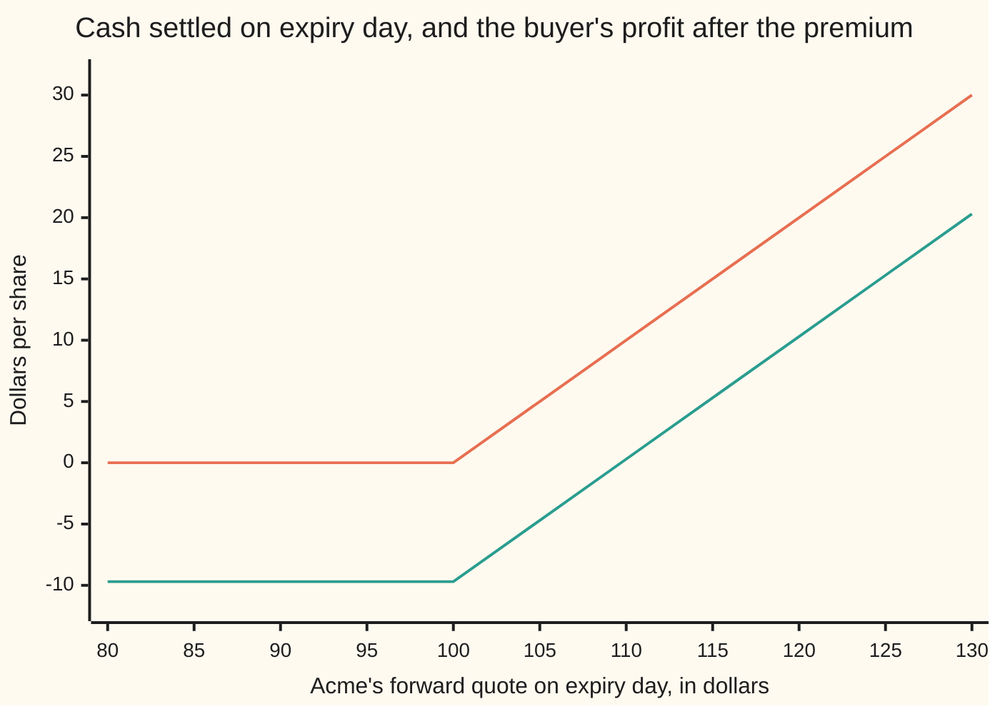
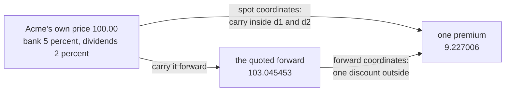

# Black-76: Black-Scholes for anything quoted as a forward

[Syllabus](../../../SYLLABUS.md) → [Financial mathematics](../README.md) → [Black-Scholes from the Ground Up](../README.md#s05) → Black-76

---

## General Overview

Acme shares trade at 100.00 dollars this morning. Two firms have already signed a forward contract on them: in a year, one hands over a share and the other hands over 103.05 in cash. Nothing changed hands at signing, and 103.05 is not a forecast. It is what carrying the share for a year costs — a year of borrowing at 5 percent, less a year of the share's 2 percent dividends ([Forward price](../03-Contracts%20and%20No-Arbitrage/03-forward-price-by-cash-and-carry.md)).

Now a third contract, settling on that same day. It pays its holder, in cash, whatever the delivery figure exceeds 100.00 by, and nothing if the figure falls short. That is a **call option** struck at 100.00. What should it cost this morning?

Two answers, differing only in which figure they start from. One starts from Acme's own price and carries interest and dividends through the formula from inside ([Black-Scholes by expectation](04-black-scholes-by-risk-neutral-expectation.md)). The other ignores that price and works off the figure the market already quotes, 103.05. Fischer Black published the second in 1976: nothing about interest goes inside, and the whole thing is shrunk once at the end. The premium is **9.23** either way, agreeing to twelve digits, because it is the same contract.

Why bother: most option markets quote nothing but forwards. An option on December crude is written on the December futures figure, and a caplet, one period of cover against a rising interest rate, on a forward interest rate. There is no price today to carry, so the first route does not exist at all.

**Once the figure being bet on is a forward, every cost of carrying the asset already sits inside it, so the option's premium is the plain average of its payoff over a forward that drifts nowhere, shrunk once to today's money.**

**What kind of fact this is:** a model — the forward is *taken* to wander in a particular way, an assumption markets adopted as a shared quoting language rather than a law — and, inside it, a theorem: the premium below is proved on this card in Why it works.

### The picture: what the ticket settles for



The kinked upper line is what the ticket settles for: nothing at or below the strike of 100.00, then a dollar for every dollar above it. The lower line is the buyer's profit after the 9.23 premium, financed to expiry day at 5 percent, which is 9.70. Below the strike the loss is flat at that 9.70; the lines cross at 109.70.

---

## The formula

Eight letters and one function, each named before it is used. $F$ is the **forward price**: the cash figure quoted today for delivery at the option's expiry. $K$ is the **strike**, the figure the payoff is measured against. $T$ is the wait to expiry, in years. $r$ is the **bank rate** a safe loan costs, continuously compounded: added at every instant. $\sigma$ (say "sigma") is the forward's **volatility**: how jumpy the quote is, as a yearly fraction of itself. $D$ is the **discount factor** $e^{-rT}$: what a dollar due on expiry day costs today. $N(x)$ is the **bell-curve area** to the left of $x$, a chance between 0 and 1. And $C$ and $P$ are the two premiums, paid today: the call's and the put's.

$$C = D\,\bigl[\,F\,N(d_1) \;-\; K\,N(d_2)\,\bigr], \qquad P = D\,\bigl[\,K\,N(-d_2) \;-\; F\,N(-d_1)\,\bigr]$$

**Read it aloud:** the delivery figure the holder might collect, minus the strike the holder might pay, each weighted by its own chance of happening, and the pair shrunk once to today's money.

$$d_1 = \frac{\ln(F/K) + \tfrac12\sigma^2 T}{\sigma\sqrt{T}}, \qquad d_2 = d_1 - \sigma\sqrt{T}$$

The top of $d_1$ is how far the forward already sits above the strike, measured in logarithms, plus half the variance the wait brings. The bottom, $\sigma\sqrt{T}$, is one **wiggle unit** — the standard deviation of the quote's logarithm over the whole wait, which is how far the quote typically travels. So $d_1$ counts wiggle units of room and $d_2$ is one wiggle unit less.

Now read what is *absent*. No $r$ inside $d_1$ or $d_2$. No dividend yield anywhere on the card. The rate does one job, the factor $D$ out front. Everything the other route spends its exponents on, the market spent when it quoted 103.05.

Two facts come free. Subtract the put from the call: every bell-curve term pairs off, since the areas left of a point and of its mirror add to 1.

$$C - P = D\,(F - K)$$

A call minus a put is the forward itself, discounted — 2.896925 for Acme, with volatility nowhere in it.

The premium also has a floor and a ceiling: above $D\,(F-K)$, 2.896925, and below $D\,F$, 98.019867, since the most a positive forward can deliver is everything it has. It climbs strictly with volatility across that span, so any quote strictly inside the band comes from exactly one volatility — which is what lets a desk quote this option in volatility rather than dollars. The check runs Acme's premium backwards and recovers 20 percent.

| Symbol | Plain meaning | In our example | Push it up and the premium… |
| --- | --- | --- | --- |
| $F$ | the forward price quoted today for delivery at expiry | 103.045453 | rises: more to collect |
| $F_T$ | that same quote on expiry day, unknown today | — | — |
| $K$ | the strike, the figure the payoff is measured against | 100.00 | falls: further to climb |
| $T$ | the wait to expiry, in years | 1 | rises: more room to move |
| $r$ | the bank rate, continuously compounded | 5 percent | falls: discounted harder |
| $\sigma$ | the forward's volatility, how jumpy the quote is | 20 percent | rises, and it matters most |
| $D$ | the discount factor $e^{-rT}$ | 0.951229 | — |
| $N(x)$ | the bell-curve area to the left of $x$ | — | — |
| $\phi(x)$ | the bell curve's height at $x$, not its area | $\phi(d_1) = 0.386668$ | — |
| $d_1$ | the lead over the strike in wiggle units, plus half a unit | 0.250000 | — |
| $d_2$ | the same lead, minus half a unit | 0.050000 | — |
| $C$ | the call premium, paid today | 9.227006 | — |
| $P$ | the put premium, paid today | 6.330081 | — |

### When it holds

- **The quote wanders lognormally, with one constant volatility — the forward's own, not the asset's.** That is the model, not a fact. If volatility moves, the premium is off by roughly vega, the premium's slope against volatility, times the move; vega here is 37.901158 per whole unit. In most markets that use this formula the forward is the calmer of the two: twelve-month gas moves far less than gas for next month.
- **The forward and the strike are both above zero.** A logarithm of a negative number is no answer at all. Euro and Swiss rates traded below zero from 2014 and this formula stopped returning anything, which is why the shelf carries [Bachelier](07-bachelier-model.md) and [Shifted lognormal and volatility conversion](08-shifted-lognormal-and-volatility-conversion.md).
- **Exercise on expiry day only.** The average runs over the quote on that one day, so nothing earlier can count. Most options on exchange-traded futures may in fact be exercised early; that extra right is worth more than this formula prices, and valuing it needs a tree rather than a formula.
- **Volatility runs to expiry, the discount to the day the cash arrives.** Here they are the same day, so $D$ is $e^{-rT}$. A caplet fixes its rate on one date and pays months later; using one date for both is the standard way to get a caplet wrong.
- **The bank rate is known in advance.** Then a daily-settled exchange contract and a private forward carry the same quote. Once the rate moves unpredictably they part company, and the honest discount is the market's own zero-coupon bond price — the change of yardstick in [Changing the unit of account](05-change-of-numeraire-in-pricing.md).

**Conventions verified 19 Sep 2026:** $r$ is continuously compounded and $T$ counts calendar years. Real quotes carry day-count and compounding conventions that differ by market and do get changed; convert before substituting.

---

## Why it works

### Step 0: a contract that costs nothing to sign cannot drift

Signing a forward takes no money. Whatever pricing rule the market obeys must give a position that cost nothing an average gain of nothing, or anyone would sign a billion of them and stand back ([The fundamental theorems](02-risk-neutral-measure-and-the-fundamental-theorems.md)). The gain on a forward held to delivery is the final quote minus today's. Set its average to zero:

$$\text{average of } F_T \;=\; F$$

A forward is a fair bet on its own number. Compare a share, which must grow at the carry rate to be worth holding. The carry did not vanish from the problem; it moved out of the formula and into $F$. The rest of this card works that one sentence out.

### Step 1: on expiry day the forward quote is just the price

The option and the forward end on the same day, and on that morning there is nothing left to carry: delivery is today, so the quoted delivery figure and Acme's own price are one number. The payoff is

$$(F_T - K)^+ \;=\; \max(F_T - K,\ 0)$$

where $F_T$ is the quote on expiry day and $(\cdot)^+$ means "that, or zero, whichever is larger". At a quote of 120 the ticket settles for 20.00; at 80, for nothing.

That is why this card and the spot cards agree to the last digit: one contract, two coordinate systems. Where the option expires *before* delivery — the ordinary case on a commodity future, whose option dies weeks before the barrels move — they are no longer the same contract, $F_T$ is a quote in its own right, and the formula is unchanged.

### Step 2: a forward that drifts nowhere, written out

Step 0 fixed the average; the model fixes the shape. Take the quote's logarithm to wander as a bell curve, the engine the shelf opens with ([Prices as geometric Brownian motion](01-geometric-brownian-motion-for-prices.md)), with the drift set to nothing:

$$F_T = F\,\exp\!\left(-\tfrac12\sigma^2 T + \sigma\sqrt{T}\,Z\right), \qquad Z \ \text{a standard bell-curve draw}$$

The $-\tfrac12\sigma^2 T$ is not a fudge. Wiggling drags on a quantity that multiplies: up 50 percent then down 50 percent ends 25 percent below the start, though the average move was nothing. That term is exactly the drag that keeps the average of $F_T$ equal to $F$, which is what Step 0 demanded.

### Step 3: average the payoff, and the two halves appear

The payoff is cash on one future date, so today's value is the discount factor times the average payoff. Split the payoff first:

$$(F_T - K)^+ \;=\; F_T \cdot [\text{quote above } K] \;-\; K \cdot [\text{quote above } K]$$

The bracket is a light switch: 1 if the quote finishes above the strike, 0 if not. Check it at 120 — switch on, collect 120, pay 100, net 20. At 80, switch off, nothing happens.

The **strike half** is easy. The holder pays $K$, but only with the switch on, so it is worth $K$ times that chance times the discount. In Step 2's model the quote clears the strike exactly when the bell-curve draw lands above $-d_2$, and by symmetry that chance is $N(d_2)$, or 0.519939: a little better than a coin flip. The half is $D\,K\,N(d_2)$, which is 49.458109.

The **forward half** carries the subtlety, the same one the spot card meets. What is collected is not a fixed number of dollars but the quote itself, and the quote is larger in exactly those futures where it is collected. Averaging "the quote, if above the strike" therefore weights the good futures extra, and weighting the bell curve that way slides the whole curve right by one wiggle unit. Same event, shifted curve: the chance becomes $N(d_2 + \sigma\sqrt{T})$, which is $N(d_1)$, or 0.598706. The half is $D\,F\,N(d_1)$, which is 58.685115.

Subtract: 58.685115 − 49.458109 = 9.227006. Two probability-weighted bets, one discount, and no opinion anywhere about where Acme is going.

<details>
<summary>Detailed proof: the two integrals, and why the curve slides</summary>

Average the payoff over the bell-curve draw, whose height is $\phi(z) = e^{-z^2/2}/\sqrt{2\pi}$. By Step 2 the quote clears the strike exactly when
$$F\exp\!\left(-\tfrac12\sigma^2T + \sigma\sqrt{T}\,z\right) > K \iff z > \frac{\ln(K/F) + \tfrac12\sigma^2T}{\sigma\sqrt{T}} = -d_2 ,$$
so the strike half is $K$ times the area above $-d_2$, which by symmetry is $N(d_2)$. The forward half carries the quote inside the integral, and completing the square in its exponent gives
$$e^{-\frac12\sigma^2T + \sigma\sqrt{T}z}\,\frac{e^{-z^2/2}}{\sqrt{2\pi}} \;=\; \frac{1}{\sqrt{2\pi}}\exp\!\left(-\tfrac12\bigl(z - \sigma\sqrt{T}\bigr)^2\right) \;=\; \phi\!\left(z - \sigma\sqrt{T}\right).$$
The stray factors cancel exactly, and that cancellation *is* the $-\tfrac12\sigma^2T$ earning its place. What remains is a bell curve centred one wiggle unit right, so substituting $u = z - \sigma\sqrt{T}$ turns the limit $-d_2$ into $-d_1$ and the integral into $F\,N(d_1)$. Multiply both halves by $D$ and subtract; the same substitution below the boundary gives the put. Positive volatility spreads the quote smoothly, so finishing exactly at the strike has chance zero and needs no separate case.

</details>

### Step 4: the other road — relabel the spot formula, and watch the carry collapse

The shelf's spot formula is $C = S\,e^{-qT}N(d_1) - K\,e^{-rT}N(d_2)$, with the price today and the dividend yield inside the distances, and the forward is $F = S\,e^{(r-q)T}$. Substitute, and two collapses happen at once. First the top of each distance:

$$\ln\frac{S}{K} + \left(r - q \pm \tfrac12\sigma^2\right)T \;=\; \ln\frac{S\,e^{(r-q)T}}{K} \pm \tfrac12\sigma^2 T \;=\; \ln\frac{F}{K} \pm \tfrac12\sigma^2 T$$

The carry has been eaten by the logarithm. Then the coefficient in front:

$$S\,e^{-qT} \;=\; \left(F\,e^{-(r-q)T}\right)e^{-qT} \;=\; F\,e^{-rT} \;=\; D\,F$$

The dividend yield cancels itself, and the two separate discount factors merge into one. So this is not a second theory: one object in two coordinate systems.



Two doors, one room: Acme's price today on the left, the quoted forward in the middle, one premium at the end of both arrows.

### Step 5: the slopes change when the coordinates change

A slope means nothing until the thing held still is named, and the two coordinate systems hold different things still.

Differentiate the call in $F$. The two bell-curve-*height* terms cancel, because $F\,\phi(d_1) = K\,\phi(d_2)$ for these two distances, leaving

$$\Delta \;=\; \frac{\partial C}{\partial F} \;=\; D\,N(d_1) \;=\; 0.569507 .$$

The premium moves about 57 cents per dollar on the quote. The spot card's delta is 0.586851 — about 59 cents per dollar on *Acme itself*. Both are right; they answer different questions. The chain rule joins them, since a dollar on Acme is $e^{(r-q)T}$ dollars on the forward; the check reaches that 0.586851 a third way, by nudging Acme's price in the spot formula.

Rho, the slope against the rate, is sharper. Hold the quote still and raise the rate: nothing in the brackets moves, only $D$, so

$$\rho\Big|_{F} \;=\; -T\,C \;=\; -9.227006 .$$

The premium *falls* — the same payoff, discounted harder. Now hold Acme's price still instead. The forward rises too, by $T\,F$ per unit of rate, so a second term appears; and since $D\,F\,N(d_1) - C$ is exactly $D\,K\,N(d_2)$, the two combine into something positive:

$$-T\,C \;+\; D\,N(d_1)\cdot T\,F \;=\; T\,K\,D\,N(d_2) \;=\; 49.458109 .$$

One option, one afternoon, two rate sensitivities of opposite sign, and neither is wrong.

A third road belongs to another card: write the hedge rather than the average. A futures position ties up no cash, so the equation the premium must obey loses its carry term, leaving $\partial V/\partial t + \tfrac12\sigma^2 F^2\,\partial^2 V/\partial F^2 = r\,V$ — the premium's slide with the clock, plus its bend against the quote, must earn the bank rate. It returns the same formula, and the hedging route is done properly on [Black-Scholes by hedging](03-black-scholes-by-delta-hedging.md).

---

## Worked numbers, by hand

Acme's forward at 103.045453, strike 100.00, bank rate 5 percent, the forward's volatility 20 percent, one year to expiry.

| Step | Arithmetic | Value |
| --- | --- | --- |
| the forward, carried from Acme's price | $100.00 \times e^{(0.05 - 0.02) \times 1}$ | 103.045453 |
| the forward's lead over the strike, in logs | $\ln(103.045453/100.00)$ | 0.030000 |
| one wiggle unit, $\sigma\sqrt{T}$ | $0.20 \times \sqrt{1}$ | 0.200000 |
| $d_1$ | $(0.030000 + \tfrac12 \times 0.200000^2)\,/\,0.200000$ | 0.250000 |
| $d_2$ | $0.250000 - 0.200000$ | 0.050000 |
| $N(d_1)$, the chance counted in forwards | bell-curve area | 0.598706 |
| $N(d_2)$, the chance counted in cash | bell-curve area | 0.519939 |
| the discount $D$ | $e^{-0.05}$ | 0.951229 |
| forward half, $D\,F\,N(d_1)$ | $0.951229 \times 103.045453 \times 0.598706$ | 58.685115 |
| strike half, $D\,K\,N(d_2)$ | $0.951229 \times 100.00 \times 0.519939$ | 49.458109 |
| **the call premium** | $58.685115 - 49.458109$ | **9.227006** |
| the put, from its own formula | $D\,[K\,N(-d_2) - F\,N(-d_1)]$ | 6.330081 |
| parity, both sides computed apart | $C-P$ and $D(F-K)$ | 2.896925 |
| the premium financed to expiry | $9.227006\,/\,0.951229$ | 9.700084 |
| break-even quote at expiry | $100.00 + 9.700084$ | 109.700084 |

The ticket costs 9.23 this morning. A buyer who borrows that premium needs the quote above 109.70 on expiry day to come out ahead; a buyer who sells the ticket earlier needs no such thing. Starting from 100.00 instead, [Black-Scholes by expectation](04-black-scholes-by-risk-neutral-expectation.md) reaches the same 9.227006.

### The Greeks at these numbers

Each row is the premium's slope against one input with everything else held still. $\phi(d_1)$ is the bell curve's *height* at $d_1$, not its area: 0.386668 here.

| Sensitivity | What it answers | Formula | Value |
| --- | --- | --- | --- |
| $\Delta$ | premium change per dollar on the quote | $D\,N(d_1)$ | 0.569507 |
| $\Gamma$ | delta change per dollar on the quote | $D\,\phi(d_1)\,/\,(F\sigma\sqrt{T})$ | 0.017847 |
| vega | premium change per unit of volatility | $D\,F\,\phi(d_1)\sqrt{T}$ | 37.901158 |
| $\Theta$ | premium change per year of waiting, at today's numbers | $r\,C - D\,F\,\phi(d_1)\,\sigma/(2\sqrt{T})$ | -3.328765 |
| $\rho$ | premium change per unit of rate, quote held still | $-T\,C$ | -9.227006 |

Three need a word. Vega is per *whole* unit of volatility, so desks divide it by a hundred for the change per percentage point. $\Theta$ is negative here but need not be: the first of its two terms carries the rate and can win. And $\rho$ here holds the quote still; Step 5's other convention gives 49.458109.

### What breaks if you drop a piece

The correct premium is 9.227006, and both checks compute each mistake below.

| Mistake | Comes out at | What went wrong |
| --- | --- | --- |
| The rate put back inside $d_1$ and $d_2$ | 8.999506 | Carry counted twice: in the quoted 103.045453, then again in the exponents |
| The discount $D$ dropped | 9.700084 | That is the premium as if handed over on expiry day, not today |
| Acme's price 100.00 used where the forward belongs | 7.577082 | Priced an option on a figure the payoff never reads |
| $N(d_2)$ used for both halves | 1.506224 | Counted the forward in dollars; it is worth more where it is collected |

---

## Code, from first principles, and it actually runs

Nothing imported holds the answer: the integrator, the tree and the root finder are written out in the file. The premium is reached **four independent ways** — the formula; a brute-force average of the payoff over the driftless forward, which never mentions $d_1$ or $d_2$; a coin-flip tree on the forward, where the up-chance follows from the average staying put and one discount lands at the end; and the spot formula run on Acme's 100.00. The put is built on its own and checked against parity, every Greek against a nudged price, the stock delta against a nudge of Acme's own price, and the premium is run backwards to recover 20 percent. Python reaches the bell-curve area through `math.erf`; Rust has none, so it adds up thin slices under the curve.

### Python

```python
# Black-76 -- the check behind the card.  Standard library only, and nothing
# imported that already holds the answer: the integrator, the tree and the root
# finder are written out here.  Acme's one-year forward stands at 103.045453,
# the strike at 100.00, the bank rate at 5 percent, the forward's volatility at
# 20 percent.  Four roads reach one premium; every Greek meets a bumped price.
from math import erf, exp, log, pi, sqrt

S, Q = 100.0, 0.02                 # spot and dividend yield: for the cross-check only
K, R, SIGMA, T = 100.0, 0.05, 0.20, 1.0
F, D = S * exp((R - Q) * T), exp(-R * T)   # the forward by cash and carry, one discount
H, HG = 1e-4, 1e-2                 # bump sizes for slopes, and for curvature

def cdf(x):   return 0.5 * (1.0 + erf(x / sqrt(2.0)))     # bell-curve area left of x
def pdf(x):   return exp(-0.5 * x * x) / sqrt(2.0 * pi)   # bell-curve height at x

def distances(f, k, sigma, t):     # the two distances from forward to strike
    a = sigma * sqrt(t); d1 = (log(f / k) + 0.5 * sigma * sigma * t) / a
    return d1, d1 - a

def black76(f, k, r, sigma, t, call=True):                # road 1: the formula
    d1, d2 = distances(f, k, sigma, t)
    disc = exp(-r * t)
    if call: return disc * (f * cdf(d1) - k * cdf(d2))
    return disc * (k * cdf(-d2) - f * cdf(-d1))

def simpson(g, a, b, n):           # the integrator, written out
    h = (b - a) / n; total = g(a) + g(b)
    for i in range(1, n): total += (4.0 if i % 2 else 2.0) * g(a + i * h)
    return total * h / 3.0

def by_integral(f, k, r, sigma, t, call=True, n=40000):
    # Road 2: average the payoff over the driftless forward by brute force.
    # No d1, no d2 -- nothing borrowed from the formula.
    def g(z):
        ft = f * exp(-0.5 * sigma * sigma * t + sigma * sqrt(t) * z)
        return (max(ft - k, 0.0) if call else max(k - ft, 0.0)) * pdf(z)
    return exp(-r * t) * simpson(g, -10.0, 10.0, n)

def by_tree(f, k, r, sigma, t, steps=2000):
    # Road 3: a coin-flip tree on the forward itself.  A forward drifts nowhere,
    # so the up-chance is fixed by the average staying put, and one discount lands
    # at the end rather than one at every step.
    dt = t / steps
    up = exp(sigma * sqrt(dt)); down = 1.0 / up; p = (1.0 - down) / (up - down)
    v = [max(f * up ** j * down ** (steps - j) - k, 0.0) for j in range(steps + 1)]
    for step in range(steps, 0, -1):
        v = [p * v[j + 1] + (1.0 - p) * v[j] for j in range(step)]
    return exp(-r * t) * v[0]

def black_scholes(s, k, r, q, sigma, t):                  # road 4: the spot formula
    a = sigma * sqrt(t); d1 = (log(s / k) + (r - q + 0.5 * sigma * sigma) * t) / a
    return s * exp(-q * t) * cdf(d1) - k * exp(-r * t) * cdf(d1 - a)

def implied_vol(price, f, k, r, t):                       # the root finder, written out
    lo, hi = 1e-6, 5.0
    for _ in range(80):
        mid = 0.5 * (lo + hi)
        lo, hi = (mid, hi) if black76(f, k, r, mid, t) < price else (lo, mid)
    return 0.5 * (lo + hi)

def bumped(f, r, sg, t): return black76(f, K, r, sg, t)   # the call, one input moved
def spot(s): return black_scholes(s, K, R, Q, SIGMA, T)   # the spot call, Acme's price moved

d1, d2 = distances(F, K, SIGMA, T)
C, P = black76(F, K, R, SIGMA, T), black76(F, K, R, SIGMA, T, False)
C_int, P_int = by_integral(F, K, R, SIGMA, T), by_integral(F, K, R, SIGMA, T, False)
C_tree, C_bs = by_tree(F, K, R, SIGMA, T), black_scholes(S, K, R, Q, SIGMA, T)
delta_f, delta_s = D * cdf(d1), exp(-Q * T) * cdf(d1)     # per forward dollar, per spot dollar
chain = delta_f * exp((R - Q) * T)                        # the two joined by dF/dS
gamma, vega = D * pdf(d1) / (F * SIGMA * sqrt(T)), D * F * pdf(d1) * sqrt(T)
theta = R * C - D * F * pdf(d1) * SIGMA / (2.0 * sqrt(T))
rho_f, rho_s = -T * C, T * K * D * cdf(d2)                # rate moved with F held, with S held
b_delta = (bumped(F + H, R, SIGMA, T) - bumped(F - H, R, SIGMA, T)) / (2.0 * H)
b_delta_s = (spot(S + H) - spot(S - H)) / (2.0 * H)       # the spot slope, its own road
b_gamma = (bumped(F + HG, R, SIGMA, T) - 2.0 * C + bumped(F - HG, R, SIGMA, T)) / (HG * HG)
b_vega = (bumped(F, R, SIGMA + H, T) - bumped(F, R, SIGMA - H, T)) / (2.0 * H)
b_theta = -(bumped(F, R, SIGMA, T + H) - bumped(F, R, SIGMA, T - H)) / (2.0 * H)
b_rho_f = (bumped(F, R + H, SIGMA, T) - bumped(F, R - H, SIGMA, T)) / (2.0 * H)
b_rho_s = (bumped(S * exp((R + H - Q) * T), R + H, SIGMA, T)
           - bumped(S * exp((R - H - Q) * T), R - H, SIGMA, T)) / (2.0 * H)
iv, a_w = implied_vol(C, F, K, R, T), SIGMA * sqrt(T)
d1_w = (log(F / K) + (R + 0.5 * SIGMA * SIGMA) * T) / a_w  # the carry counted twice over
wrong_d = D * (F * cdf(d1_w) - K * cdf(d1_w - a_w))
financed = C / D                                          # the same premium, paid at expiry
spot_used, both_d2 = black76(S, K, R, SIGMA, T), D * (F - K) * cdf(d2)
grid = [80.0 + 5.0 * i for i in range(11)]
settle = [max(g - K, 0.0) for g in grid]
profit = [s - financed for s in settle]

rows = [
    ("log(F / K), the forward's lead over the strike", log(F / K)),
    ("one wiggle unit  sigma root T", SIGMA * sqrt(T)),
    ("d1", d1), ("d2", d2), ("N(d1)", cdf(d1)), ("N(d2)", cdf(d2)), ("phi(d1)", pdf(d1)),
    ("discount  D = e^-rT", D), ("forward half  D F N(d1)", D * F * cdf(d1)),
    ("strike half   D K N(d2)", D * K * cdf(d2)), ("1 Black-76 formula, call", C),
    ("2 payoff integral over the forward", C_int),
    ("3 driftless tree on the forward, 2000 steps", C_tree),
    ("4 Black-Scholes off the spot, yield 2 percent", C_bs),
    ("put, Black-76 formula", P), ("put, payoff integral", P_int),
    ("parity  C - P", C - P), ("parity  D (F - K), also the premium floor", D * (F - K)),
    ("premium ceiling  D F", D * F), ("the same premium paid at expiry  C / D", financed),
    ("implied volatility from the premium, by bisection", iv),
    ("break-even forward at expiry  K + C / D", K + financed),
    ("delta  D N(d1), per dollar of forward", delta_f),
    ("  same, by bumping the forward", b_delta),
    ("stock delta  e^-qT N(d1), per dollar of spot", delta_s),
    ("  same, forward delta times e^(r-q)T", chain), ("  same, by bumping the spot", b_delta_s),
    ("gamma  D phi(d1) / (F sigma root T)", gamma), ("  same, by bumping twice", b_gamma),
    ("vega  D F phi(d1) root T", vega), ("  same, by bumping sigma", b_vega),
    ("theta  r C - D F phi(d1) sigma / (2 root T)", theta),
    ("  same, by shortening the wait", b_theta),
    ("rho, forward held fixed  -T C", rho_f),
    ("  same, by bumping r with F held", b_rho_f),
    ("rho, spot held fixed  T K D N(d2)", rho_s),
    ("  same, by bumping r and letting F move", b_rho_s),
    ("wrong: r put back inside d1 and d2", wrong_d),
    ("wrong: the discount D dropped", financed),
    ("wrong: spot 100.00 used as the forward", spot_used),
    ("wrong: N(d2) on both halves", both_d2),
]
print(f"Acme: spot {S:.2f}, yield {Q:.0%}, bank {R:.0%}, sigma {SIGMA:.0%}, {T:.0f} year;"
      f" forward {F:.6f}, strike {K:.2f}")
for name, value in rows:
    print(f"{name:<50}{value:>14.6f}")
print()
print(f"{'chart, forward on expiry day':<32}" + "".join(f"{g:>7.0f}" for g in grid))
print(f"{'chart, cash settlement':<32}" + "".join(f"{s:>7.2f}" for s in settle))
print(f"{'chart, profit after the premium':<32}" + "".join(f"{p:>7.2f}" for p in profit))

assert abs(C - 9.227005508154) < 1e-9 and abs(P - 6.330080627550) < 1e-9, "the shelf's pair"
assert abs(C_int - C) < 1e-7 and abs(P_int - P) < 1e-7, "brute-force averages vs the formulas"
assert abs(C_tree - C) < 0.01 and abs(C_bs - C) < 1e-12, "the tree, and the spot coordinates"
assert abs((C - P) - D * (F - K)) < 1e-12, "forward-form parity, put built on its own"
assert abs(b_delta - delta_f) < 1e-7 and abs(b_gamma - gamma) < 1e-7, "bumped slope, bumped bend"
assert abs(b_vega - vega) < 1e-5 and abs(b_theta - theta) < 1e-6, "bumped vega, bumped theta"
assert abs(b_rho_f - rho_f) < 1e-7 and abs(b_rho_s - rho_s) < 1e-5, "both rhos, bumped"
assert abs(chain - b_delta_s) < 1e-7 and abs(delta_s - b_delta_s) < 1e-7, "spot delta, bumped"
assert abs((b_rho_s - b_rho_f) - delta_f * T * F) < 1e-4, "the rhos differ by delta times T F"
assert abs(iv - SIGMA) < 1e-9 and D * (F - K) < C < D * F, "the inverse, and the premium band"
print("ALL CHECKS PASS")
```

**Ran 2026-09-19 on macOS, Python 3.14.6, standard library only. All checks passed. Output, pasted from the run:**

```
Acme: spot 100.00, yield 2%, bank 5%, sigma 20%, 1 year; forward 103.045453, strike 100.00
log(F / K), the forward's lead over the strike          0.030000
one wiggle unit  sigma root T                           0.200000
d1                                                      0.250000
d2                                                      0.050000
N(d1)                                                   0.598706
N(d2)                                                   0.519939
phi(d1)                                                 0.386668
discount  D = e^-rT                                     0.951229
forward half  D F N(d1)                                58.685115
strike half   D K N(d2)                                49.458109
1 Black-76 formula, call                                9.227006
2 payoff integral over the forward                      9.227006
3 driftless tree on the forward, 2000 steps             9.227780
4 Black-Scholes off the spot, yield 2 percent           9.227006
put, Black-76 formula                                   6.330081
put, payoff integral                                    6.330081
parity  C - P                                           2.896925
parity  D (F - K), also the premium floor               2.896925
premium ceiling  D F                                   98.019867
the same premium paid at expiry  C / D                  9.700084
implied volatility from the premium, by bisection       0.200000
break-even forward at expiry  K + C / D               109.700084
delta  D N(d1), per dollar of forward                   0.569507
  same, by bumping the forward                          0.569507
stock delta  e^-qT N(d1), per dollar of spot            0.586851
  same, forward delta times e^(r-q)T                    0.586851
  same, by bumping the spot                             0.586851
gamma  D phi(d1) / (F sigma root T)                     0.017847
  same, by bumping twice                                0.017847
vega  D F phi(d1) root T                               37.901158
  same, by bumping sigma                               37.901157
theta  r C - D F phi(d1) sigma / (2 root T)            -3.328765
  same, by shortening the wait                         -3.328765
rho, forward held fixed  -T C                          -9.227006
  same, by bumping r with F held                       -9.227006
rho, spot held fixed  T K D N(d2)                      49.458109
  same, by bumping r and letting F move                49.458108
wrong: r put back inside d1 and d2                      8.999506
wrong: the discount D dropped                           9.700084
wrong: spot 100.00 used as the forward                  7.577082
wrong: N(d2) on both halves                             1.506224

chart, forward on expiry day         80     85     90     95    100    105    110    115    120    125    130
chart, cash settlement             0.00   0.00   0.00   0.00   0.00   5.00  10.00  15.00  20.00  25.00  30.00
chart, profit after the premium   -9.70  -9.70  -9.70  -9.70  -9.70  -4.70   0.30   5.30  10.30  15.30  20.30
ALL CHECKS PASS
```

Four roads, one premium. The brute-force average lands on the formula to six decimals; the tree is within a tenth of a cent and closes in as steps are added; the spot formula, sharing no line of code with the Black-76 one, agrees to twelve digits. Every slope matches its nudged twin.

### Rust

Same numbers and labels, built with `rustc --edition 2021 -O`.

```rust
// Black-76 -- the same check as black_76_and_forward_level_pricing_check.py, in
// Rust.  Standard library only, no crates.  Rust has no erf, so the bell-curve
// area is built the honest way: add up thin slices under the curve.  Acme's
// one-year forward stands at 103.045453, the strike at 100.00, the bank rate at
// 5 percent, the forward's volatility 20 percent.  Four roads, one premium.
use std::f64::consts::PI;

const S: f64 = 100.0; const Q: f64 = 0.02;        // spot and yield: the cross-check only
const K: f64 = 100.0; const R: f64 = 0.05;
const SIGMA: f64 = 0.20; const T: f64 = 1.0;
const H: f64 = 1e-4; const HG: f64 = 1e-2;        // bumps for slopes, and for curvature

fn pdf(x: f64) -> f64 { (-0.5 * x * x).exp() / (2.0 * PI).sqrt() }   // bell-curve height at x

fn simpson<F: Fn(f64) -> f64>(g: F, a: f64, b: f64, n: usize) -> f64 {   // the integrator
    let h = (b - a) / n as f64;
    let mut total = g(a) + g(b);
    for i in 1..n { total += (if i % 2 == 1 { 4.0 } else { 2.0 }) * g(a + i as f64 * h) }
    total * h / 3.0
}

fn cdf(x: f64) -> f64 {            // bell-curve area left of x: half, plus the slice from 0
    if x < -12.0 { return 0.0 }
    if x > 12.0 { return 1.0 }
    0.5 + simpson(pdf, 0.0, x, 4000)
}

fn distances(f: f64, k: f64, sigma: f64, t: f64) -> (f64, f64) {   // forward to strike
    let a = sigma * t.sqrt();
    let d1 = ((f / k).ln() + 0.5 * sigma * sigma * t) / a;
    (d1, d1 - a)
}

fn black76(f: f64, k: f64, r: f64, sigma: f64, t: f64, call: bool) -> f64 {   // road 1
    let (d1, d2) = distances(f, k, sigma, t);
    let disc = (-r * t).exp();
    if call { disc * (f * cdf(d1) - k * cdf(d2)) } else { disc * (k * cdf(-d2) - f * cdf(-d1)) }
}

/// Road 2: average the payoff over the driftless forward by brute force.
/// No d1, no d2 -- nothing borrowed from the formula.
fn by_integral(f: f64, k: f64, r: f64, sigma: f64, t: f64, call: bool) -> f64 {
    let g = |z: f64| {
        let ft = f * (-0.5 * sigma * sigma * t + sigma * t.sqrt() * z).exp();
        (if call { (ft - k).max(0.0) } else { (k - ft).max(0.0) }) * pdf(z)
    };
    (-r * t).exp() * simpson(g, -10.0, 10.0, 40000)
}

/// Road 3: a coin-flip tree on the forward itself.  A forward drifts nowhere,
/// so the up-chance is fixed by the average staying put, and one discount lands
/// at the end rather than one at every step.
fn by_tree(f: f64, k: f64, r: f64, sigma: f64, t: f64, steps: usize) -> f64 {
    let dt = t / steps as f64;
    let up = (sigma * dt.sqrt()).exp(); let down = 1.0 / up;
    let p = (1.0 - down) / (up - down);
    let mut v: Vec<f64> = (0..=steps)
        .map(|j| (f * up.powi(j as i32) * down.powi((steps - j) as i32) - k).max(0.0))
        .collect();
    for step in (1..=steps).rev() {
        v = (0..step).map(|j| p * v[j + 1] + (1.0 - p) * v[j]).collect();
    }
    (-r * t).exp() * v[0]
}

fn black_scholes(s: f64, k: f64, r: f64, q: f64, sigma: f64, t: f64) -> f64 {   // road 4
    let a = sigma * t.sqrt();
    let d1 = ((s / k).ln() + (r - q + 0.5 * sigma * sigma) * t) / a;
    s * (-q * t).exp() * cdf(d1) - k * (-r * t).exp() * cdf(d1 - a)
}

fn implied_vol(price: f64, f: f64, k: f64, r: f64, t: f64) -> f64 {   // the root finder
    let (mut lo, mut hi) = (1e-6, 5.0);
    for _ in 0..80 {
        let mid = 0.5 * (lo + hi);
        if black76(f, k, r, mid, t, true) < price { lo = mid } else { hi = mid }
    }
    0.5 * (lo + hi)
}

fn bumped(f: f64, r: f64, sg: f64, t: f64) -> f64 { black76(f, K, r, sg, t, true) }
fn spot(s: f64) -> f64 { black_scholes(s, K, R, Q, SIGMA, T) }   // the spot call, price moved

fn main() {
    let (f, d) = (S * ((R - Q) * T).exp(), (-R * T).exp());   // by cash and carry, one discount
    let (d1, d2) = distances(f, K, SIGMA, T);
    let (c, p) = (black76(f, K, R, SIGMA, T, true), black76(f, K, R, SIGMA, T, false));
    let c_int = by_integral(f, K, R, SIGMA, T, true);
    let p_int = by_integral(f, K, R, SIGMA, T, false);
    let c_tree = by_tree(f, K, R, SIGMA, T, 2000);
    let c_bs = black_scholes(S, K, R, Q, SIGMA, T);
    let delta_f = d * cdf(d1);                             // per dollar of forward
    let delta_s = (-Q * T).exp() * cdf(d1);                // per dollar of spot
    let chain = delta_f * ((R - Q) * T).exp();             // the two joined by dF/dS
    let gamma = d * pdf(d1) / (f * SIGMA * T.sqrt());
    let vega = d * f * pdf(d1) * T.sqrt();
    let theta = R * c - d * f * pdf(d1) * SIGMA / (2.0 * T.sqrt());
    let (rho_f, rho_s) = (-T * c, T * K * d * cdf(d2));    // F held fixed, S held fixed
    let b_delta = (bumped(f + H, R, SIGMA, T) - bumped(f - H, R, SIGMA, T)) / (2.0 * H);
    let b_delta_s = (spot(S + H) - spot(S - H)) / (2.0 * H);   // the spot slope, its own road
    let b_gamma = (bumped(f + HG, R, SIGMA, T) - 2.0 * c + bumped(f - HG, R, SIGMA, T)) / (HG * HG);
    let b_vega = (bumped(f, R, SIGMA + H, T) - bumped(f, R, SIGMA - H, T)) / (2.0 * H);
    let b_theta = -(bumped(f, R, SIGMA, T + H) - bumped(f, R, SIGMA, T - H)) / (2.0 * H);
    let b_rho_f = (bumped(f, R + H, SIGMA, T) - bumped(f, R - H, SIGMA, T)) / (2.0 * H);
    let b_rho_s = (bumped(S * ((R + H - Q) * T).exp(), R + H, SIGMA, T)
        - bumped(S * ((R - H - Q) * T).exp(), R - H, SIGMA, T)) / (2.0 * H);
    let (iv, a_w) = (implied_vol(c, f, K, R, T), SIGMA * T.sqrt());
    let d1_w = ((f / K).ln() + (R + 0.5 * SIGMA * SIGMA) * T) / a_w;   // carry counted twice
    let wrong_d = d * (f * cdf(d1_w) - K * cdf(d1_w - a_w));
    let financed = c / d;                                  // the same premium, paid at expiry
    let spot_used = black76(S, K, R, SIGMA, T, true);
    let both_d2 = d * (f - K) * cdf(d2);
    let grid: Vec<f64> = (0..11).map(|i| 80.0 + 5.0 * i as f64).collect();
    let settle: Vec<f64> = grid.iter().map(|g| (g - K).max(0.0)).collect();
    let profit: Vec<f64> = settle.iter().map(|s| s - financed).collect();

    let rows: Vec<(&str, f64)> = vec![
        ("log(F / K), the forward's lead over the strike", (f / K).ln()),
        ("one wiggle unit  sigma root T", SIGMA * T.sqrt()),
        ("d1", d1), ("d2", d2), ("N(d1)", cdf(d1)), ("N(d2)", cdf(d2)), ("phi(d1)", pdf(d1)),
        ("discount  D = e^-rT", d), ("forward half  D F N(d1)", d * f * cdf(d1)),
        ("strike half   D K N(d2)", d * K * cdf(d2)), ("1 Black-76 formula, call", c),
        ("2 payoff integral over the forward", c_int),
        ("3 driftless tree on the forward, 2000 steps", c_tree),
        ("4 Black-Scholes off the spot, yield 2 percent", c_bs),
        ("put, Black-76 formula", p), ("put, payoff integral", p_int),
        ("parity  C - P", c - p), ("parity  D (F - K), also the premium floor", d * (f - K)),
        ("premium ceiling  D F", d * f), ("the same premium paid at expiry  C / D", financed),
        ("implied volatility from the premium, by bisection", iv),
        ("break-even forward at expiry  K + C / D", K + financed),
        ("delta  D N(d1), per dollar of forward", delta_f),
        ("  same, by bumping the forward", b_delta),
        ("stock delta  e^-qT N(d1), per dollar of spot", delta_s),
        ("  same, forward delta times e^(r-q)T", chain), ("  same, by bumping the spot", b_delta_s),
        ("gamma  D phi(d1) / (F sigma root T)", gamma), ("  same, by bumping twice", b_gamma),
        ("vega  D F phi(d1) root T", vega), ("  same, by bumping sigma", b_vega),
        ("theta  r C - D F phi(d1) sigma / (2 root T)", theta),
        ("  same, by shortening the wait", b_theta),
        ("rho, forward held fixed  -T C", rho_f),
        ("  same, by bumping r with F held", b_rho_f),
        ("rho, spot held fixed  T K D N(d2)", rho_s),
        ("  same, by bumping r and letting F move", b_rho_s),
        ("wrong: r put back inside d1 and d2", wrong_d),
        ("wrong: the discount D dropped", financed),
        ("wrong: spot 100.00 used as the forward", spot_used),
        ("wrong: N(d2) on both halves", both_d2),
    ];
    println!("Acme: spot {:.2}, yield {:.0}%, bank {:.0}%, sigma {:.0}%, {:.0} year; forward {:.6}, strike {:.2}",
             S, Q * 100.0, R * 100.0, SIGMA * 100.0, T, f, K);
    for (name, value) in &rows { println!("{:<50}{:>14.6}", name, value) }
    println!();
    let cells = |v: &Vec<f64>, dp: usize| v.iter().map(|x| format!("{:>7.*}", dp, x)).collect::<String>();
    println!("{:<32}{}", "chart, forward on expiry day", cells(&grid, 0));
    println!("{:<32}{}", "chart, cash settlement", cells(&settle, 2));
    println!("{:<32}{}", "chart, profit after the premium", cells(&profit, 2));

    assert!((c - 9.227005508154).abs() < 1e-9 && (p - 6.330080627550).abs() < 1e-9, "the pair");
    assert!((c_int - c).abs() < 1e-7 && (p_int - p).abs() < 1e-7, "brute force vs the formulas");
    assert!((c_tree - c).abs() < 0.01 && (c_bs - c).abs() < 1e-12, "tree, and spot coordinates");
    assert!(((c - p) - d * (f - K)).abs() < 1e-12, "forward-form parity, put built on its own");
    assert!((b_delta - delta_f).abs() < 1e-7 && (b_gamma - gamma).abs() < 1e-7, "slope and bend");
    assert!((b_vega - vega).abs() < 1e-5 && (b_theta - theta).abs() < 1e-6, "vega and theta");
    assert!((b_rho_f - rho_f).abs() < 1e-7 && (b_rho_s - rho_s).abs() < 1e-5, "both rhos, bumped");
    assert!((chain - b_delta_s).abs() < 1e-7 && (delta_s - b_delta_s).abs() < 1e-7, "spot delta");
    assert!(((b_rho_s - b_rho_f) - delta_f * T * f).abs() < 1e-4, "rhos differ by delta times T F");
    assert!((iv - SIGMA).abs() < 1e-9 && d * (f - K) < c && c < d * f, "inverse, and the band");
    println!("ALL CHECKS PASS");
}
```

**Ran 2026-09-19 on macOS, rustc 1.98.1, no crates. All checks passed. Output, pasted from the run:**

```
Acme: spot 100.00, yield 2%, bank 5%, sigma 20%, 1 year; forward 103.045453, strike 100.00
log(F / K), the forward's lead over the strike          0.030000
one wiggle unit  sigma root T                           0.200000
d1                                                      0.250000
d2                                                      0.050000
N(d1)                                                   0.598706
N(d2)                                                   0.519939
phi(d1)                                                 0.386668
discount  D = e^-rT                                     0.951229
forward half  D F N(d1)                                58.685115
strike half   D K N(d2)                                49.458109
1 Black-76 formula, call                                9.227006
2 payoff integral over the forward                      9.227006
3 driftless tree on the forward, 2000 steps             9.227780
4 Black-Scholes off the spot, yield 2 percent           9.227006
put, Black-76 formula                                   6.330081
put, payoff integral                                    6.330081
parity  C - P                                           2.896925
parity  D (F - K), also the premium floor               2.896925
premium ceiling  D F                                   98.019867
the same premium paid at expiry  C / D                  9.700084
implied volatility from the premium, by bisection       0.200000
break-even forward at expiry  K + C / D               109.700084
delta  D N(d1), per dollar of forward                   0.569507
  same, by bumping the forward                          0.569507
stock delta  e^-qT N(d1), per dollar of spot            0.586851
  same, forward delta times e^(r-q)T                    0.586851
  same, by bumping the spot                             0.586851
gamma  D phi(d1) / (F sigma root T)                     0.017847
  same, by bumping twice                                0.017847
vega  D F phi(d1) root T                               37.901158
  same, by bumping sigma                               37.901157
theta  r C - D F phi(d1) sigma / (2 root T)            -3.328765
  same, by shortening the wait                         -3.328765
rho, forward held fixed  -T C                          -9.227006
  same, by bumping r with F held                       -9.227006
rho, spot held fixed  T K D N(d2)                      49.458109
  same, by bumping r and letting F move                49.458108
wrong: r put back inside d1 and d2                      8.999506
wrong: the discount D dropped                           9.700084
wrong: spot 100.00 used as the forward                  7.577082
wrong: N(d2) on both halves                             1.506224

chart, forward on expiry day         80     85     90     95    100    105    110    115    120    125    130
chart, cash settlement             0.00   0.00   0.00   0.00   0.00   5.00  10.00  15.00  20.00  25.00  30.00
chart, profit after the premium   -9.70  -9.70  -9.70  -9.70  -9.70  -4.70   0.30   5.30  10.30  15.30  20.30
ALL CHECKS PASS
```

The two outputs match line for line, though the bell-curve area behind them was built two different ways.

> [!TIP]
> **Try changing**
> Guess first, then run it. The asserts are pinned to Acme's numbers, so expect one to stop the program.
> - **Count the carry twice.** In `distances`, add `r * t` to the top of `d1`, as though the forward were a price today. The premium drops to **8.999506**, and the first assert, pinned to the shelf's 9.227005508154, stops the run.
> - **Feed in the price instead of the quote.** Set `F = S`. The premium falls to **7.577082**: the wrong figure under the payoff.
> - **Drop the discount.** Set `disc = 1.0` in `black76`. The answer becomes **9.700084**: this premium priced as though paid on expiry day.
> - **Starve the tree.** Set `steps=10` in `by_tree`. Ten coin flips cannot fake a smooth bell curve, and the tree assert stops it.

---

## The usual mistake

> [!warning]
> **Treating Black-76 as a second theory.** It is the same model written in the coordinates the market happens to quote. Step 4 substitutes in two lines, and the check pins the two premiums together to a millionth of a millionth. What changes is where the carry is written down, not what is priced — which is why a "Black volatility" and a "Black-Scholes volatility" on one option are one number.
>
> Four traps, each with a wrong number attached:
> - **Putting the rate back inside $d_1$ and $d_2$.** The carry is in the quote already; counting it again prices the Acme ticket at 8.999506 instead of 9.227006. This is the commonest error on this formula.
> - **Dropping the discount because "futures settle daily".** Some exchange contracts do margin the *premium* itself; those are a different contract with nothing to discount. This card's payoff is cash on one date, so drop $D$ and the answer becomes 9.700084. Read the contract first.
> - **Reading $N(d_1)$ as the chance of exercise.** That chance is $N(d_2)$, 0.519939, and only inside the pricing model's world. $N(d_1)$, 0.598706, is the same chance counted in forwards rather than cash. Use $N(d_2)$ on both halves and the ticket comes out at 1.506224.
> - **Mixing the two rate sensitivities.** −9.227006 holds the quote still; 49.458109 holds Acme's price still. Both belong on a risk report; netting one against the other reports an exposure nobody has.

---

## Where you meet it in real life

- **Commodity futures options.** Black's 1976 paper was about commodity contracts, and options on crude, gas, gold and grain futures are still quoted through this formula: [Options on a futures price](../26-Options%20on%20commodity%20futures%20and%20spreads/01-options-on-commodity-futures.md).
- **Caps and floors.** A caplet is this call with a forward interest rate where $F$ sits, times the loan's face amount and the length of the interest period, because a rate is not a payment: four percent of a million for a year is. See [Caplets and floorlets](../29-Caps%2C%20Floors%20and%20Swaptions/01-caplets-and-floorlets.md).
- **Options on bonds and swaps.** The same skeleton with a forward swap rate or forward bond price, and a different multiplier in front: [Bond options](../30-Short-Rate%20Models/05-bond-options-and-jamshidians-trick.md).
- **Currencies.** An option on an exchange rate is this formula on the currency forward, both countries' rates already folded into the quote: [Garman-Kohlhagen](../21-FX%20vanilla%20options%20-%20Garman-Kohlhagen%20and%20the%20desk%20conventions/01-garman-kohlhagen.md).
- **Credit.** An option on a credit spread is written on a forward spread and quoted in the volatility this formula implies: [Options on a CDS](../44-Reduced-Form%20Models%20-%20Risky%20Bonds%2C%20Spreads%20and%20Random%20Hazards/05-cds-option-and-implied-spread-volatility.md).
- **As a language, not a model.** Desks pricing with something richer still *quote* in Black volatility, because the band from 2.896925 to 98.019867 maps one premium to one volatility. Behind the quote often sits [SABR and Hagan's formula](../14-Stochastic%20volatility%20-%20Heston%2C%20SABR%20and%20their%20mix/04-sabr-model-and-hagan-formula.md).

> **Say it back**
> A forward costs nothing to sign, so its quote drifts nowhere under the pricing rule and every carrying cost already sits inside it. Put the quoted forward where the asset's price used to be, delete the carry from the two distances, and discount once to the day the cash arrives. For Acme's forward of 103.045453 struck at 100.00 that is 9.23, the number the price-today route also gives. The formula needs the forward positive, so rates below zero broke it; and its slopes must name what is held still, since holding the quote still and holding the price still give rate sensitivities of opposite sign.

---

## What this builds on

- [Black-Scholes by expectation](04-black-scholes-by-risk-neutral-expectation.md): the average-the-payoff machinery, and why the forward half gets its own probability. This card reuses both and changes only the coordinates.
- [Forward price](../03-Contracts%20and%20No-Arbitrage/03-forward-price-by-cash-and-carry.md): where 103.045453 comes from, and why it is a bill rather than a forecast.

## Where this goes next

- [Bachelier](07-bachelier-model.md): the same forward moved by absolute amounts rather than proportional ones, which survives a quote at or below zero.
- [Shifted lognormal and volatility conversion](08-shifted-lognormal-and-volatility-conversion.md): this formula with the zero boundary pushed down, and how to translate one market's volatility into another's.
- [SABR and Hagan's formula](../14-Stochastic%20volatility%20-%20Heston%2C%20SABR%20and%20their%20mix/04-sabr-model-and-hagan-formula.md): what fills the gap when one volatility will not fit every strike.
- [Garman-Kohlhagen](../21-FX%20vanilla%20options%20-%20Garman-Kohlhagen%20and%20the%20desk%20conventions/01-garman-kohlhagen.md): this formula on a currency forward, with the desk conventions that come with it.
- [Options on a futures price](../26-Options%20on%20commodity%20futures%20and%20spreads/01-options-on-commodity-futures.md): the case Black wrote the paper for, options included that expire well before delivery.
- [Caplets and floorlets](../29-Caps%2C%20Floors%20and%20Swaptions/01-caplets-and-floorlets.md): the interest-rate version, where the discount and the volatility finally run to different dates.
- [Bond options](../30-Short-Rate%20Models/05-bond-options-and-jamshidians-trick.md): forward bond prices, and a trick turning one awkward option into a bundle of these.
- [Options on a CDS](../44-Reduced-Form%20Models%20-%20Risky%20Bonds%2C%20Spreads%20and%20Random%20Hazards/05-cds-option-and-implied-spread-volatility.md): the same engine pointed at a forward credit spread.

This card held the bank rate fixed and known, so one discount factor sufficed; what to do when the rate itself is the random thing the option is written on is the caplet and swaption cards' question.

---

## Sources

Verified 19 Sep 2026: every link below resolves to the publisher's page.

- Black, Fischer. "The Pricing of Commodity Contracts." *Journal of Financial Economics* 3, no. 1–2 (1976): 167–179. [doi:10.1016/0304-405X(76)90024-6](https://doi.org/10.1016/0304-405X(76)90024-6). The original: options priced off a futures figure rather than a spot one.
- Black, Fischer, and Myron Scholes. "The Pricing of Options and Corporate Liabilities." *Journal of Political Economy* 81, no. 3 (1973): 637–654. [doi:10.1086/260062](https://doi.org/10.1086/260062). The parent formula Step 4 relabels.
- Cox, John C., Jonathan E. Ingersoll, and Stephen A. Ross. "The Relation between Forward Prices and Futures Prices." *Journal of Financial Economics* 9, no. 4 (1981): 321–346. [doi:10.1016/0304-405X(81)90002-7](https://doi.org/10.1016/0304-405X(81)90002-7). Why a known, fixed rate lets a daily-settled futures figure and a private forward share one $F$.
- Geman, Hélyette, Nicole El Karoui, and Jean-Charles Rochet. "Changes of Numéraire, Changes of Probability Measure and Option Pricing." *Journal of Applied Probability* 32, no. 2 (1995): 443–458. [doi:10.2307/3215299](https://doi.org/10.2307/3215299). The careful version of Step 0, and what replaces $D$ when the rate moves.
- Hull, John C. *Options, Futures, and Other Derivatives*, 11th ed. Pearson. [Publisher page](https://www.pearson.com/en-us/subject-catalog/p/options-futures-and-other-derivatives/P200000005938). The textbook treatment, in the chapter on futures options and Black's model.
