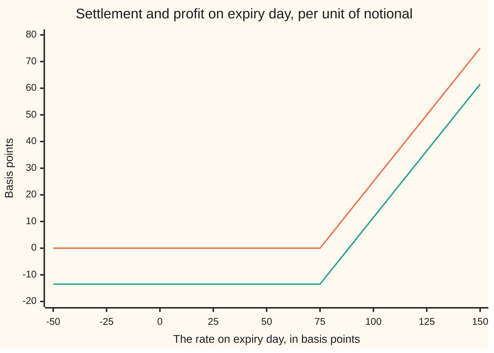
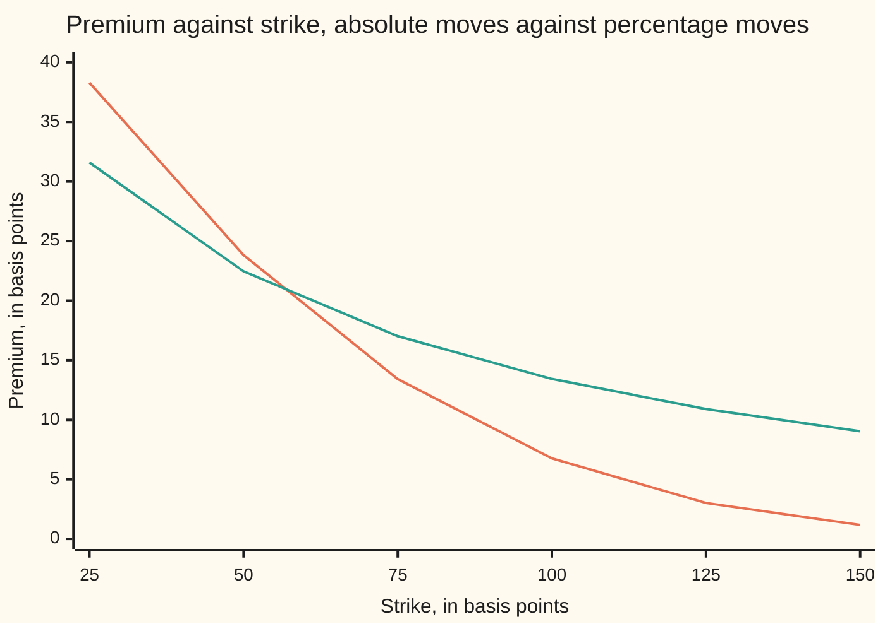

# Bachelier: the normal model for a level that can go negative

[Syllabus](../../../SYLLABUS.md) → [Financial mathematics](../../../SYLLABUS.md#w12) → [Black-Scholes from the Ground Up](../../../SYLLABUS.md#w12-s05) → Bachelier

---

## General Overview

A bank quotes an interest rate this morning for a year-long stretch starting a year from now: **0.50 percent a year**. That figure is a forward rate, agreed today and settled later.

A contract written on it pays, on expiry day one year from today, whatever the rate exceeds **0.75 percent** by, and nothing if it falls short: at 1.00 percent on the day it pays 25 basis points, a basis point being one hundredth of one percent. Rates desks call it a caplet. Every figure below is for one unit of notional and one year of accrual; a real contract scales by both. A safe deposit earns 0.50 percent a year, the rate is expected to wander by about **60 basis points** over the year, and the contract is worth **13.42 basis points** today.

Everything difficult about that number sits in the word "wander". The Black-Scholes family measures wander as a percentage of the level ([Black-76](06-black-76-and-forward-level-pricing.md)): 20 percent volatility moves a level of 0.50 percent by ten basis points a year, and a level of 5 percent by a hundred. A level that only ever gets multiplied can approach zero but never reach or cross it, and the machinery makes that literal: it runs on the logarithm of the level divided by the strike, which has no value at zero or below.

Rates crossed zero anyway. The European Central Bank's deposit rate went below zero in June 2014, Swiss rates followed, and a barrel of oil for May delivery settled below zero on 20 April 2020. On those days the percentage models did not return a bad price; they returned no price.

Louis Bachelier had made the other choice already, in a thesis from 1900 — five years before Einstein on Brownian motion, seventy-three before Black and Scholes. His level moves by absolute amounts: so many basis points a year, wherever it sits. Zero is not a wall there, just a number the level passes through. The size of the wander is called **normal volatility**, measured in the level's own units: 60 basis points, not 60 percent of anything.

**The premium is how far ahead the holder already is, weighted by the chance of still being ahead on expiry day, plus a payment for the wander that could yet put them ahead, both shrunk to today's money.**

**What kind of fact this is:** a model — the level is *assumed* to wander by a fixed absolute size, which markets adopt when the alternative is no price at all — and, inside that assumption, a theorem proved on this card in Why it works.

### The picture: what the contract settles for, and what the buyer keeps



The upper kinked line is the settlement: nothing up to the strike of 75 basis points, then a basis point for every basis point above it. The lower line is the buyer's profit once the premium is paid and carried to expiry day, which turns 13.42 basis points into 13.48. The two sit 13.48 apart everywhere, and the lower crosses zero at 88.48 basis points, the breakeven rate. The axis runs to the left of zero, where the contract still makes sense.

---

## The formula

Four helper quantities, each named before it is used. The **head start** $m = F - K$ is how far the level sits above the strike, negative here. One **standard deviation** of the ending level is $s = \sigma_N\sqrt{T}$, the volatility stretched over the wait: 60 basis points for one year. The **standardised head start** is $d = m/s$. The **discount factor** $D = e^{-rT}$ moves expiry-day money to today at the bank rate $r$. Two readings of the bell curve appear: $N(x)$, the area to the left of $x$, a chance between 0 and 1, and $\varphi(x)$ (say "phi"), the height at $x$.

$$\text{call} = D\bigl[\,m\,N(d) + s\,\varphi(d)\,\bigr], \qquad \text{put} = D\bigl[\,-m\,N(-d) + s\,\varphi(d)\,\bigr]$$

**Read it aloud:** the head start, weighted by the chance of still being ahead, plus a payment for the wander, shrunk to today's money.

The model behind it is one line: with $Z$ a draw from the standard bell curve, the level on expiry day is

$$F_T = F + \sigma_N\sqrt{T}\,Z$$

No multiplication by the level, no logarithm, no floor. That line is the whole departure from the rest of the shelf.

| Symbol | Plain meaning | In our example | Push it up and the premium… |
| --- | --- | --- | --- |
| $F$ | the forward level quoted today for expiry day | 50 basis points | rises: more head start |
| $F_T$ | that level on expiry day, unknown today | — | — |
| $K$ | the strike the payment is measured against | 75 basis points | falls: further to climb |
| $T$ | the wait to expiry, in years | 1 | rises: more room to wander |
| $r$ | the bank rate, continuously compounded | 0.50 percent | falls, slightly: harder discounting |
| $\sigma_N$ | normal volatility: the wander in a year, in the level's own units | 60 basis points per root year | rises, always: more spread adds upside, while the payment stops at nothing |
| $\sigma$ | percentage volatility, for contrast | 120 percent a year | — |
| $D$ | the discount factor, $e^{-rT}$ | 0.995012 | — |
| $m$ | the head start, $F - K$ | −25 basis points | rises: dearer |
| $s$ | one standard deviation of the ending level | 60 basis points | rises: dearer |
| $d$ | the head start counted in standard deviations | −0.416667 | — |
| $N(x)$ | the bell curve's area to the left of $x$ | $N(d) = 0.338461$ | — |
| $\varphi(x)$ | the bell curve's height at $x$ | $\varphi(d) = 0.365772$ | — |

Two facts come free. Subtract the put from the call: the area terms add to one, the wander terms cancel, leaving

$$\text{call} - \text{put} = D\,(F - K)$$

Here that is −24.875312 basis points, with no volatility in it anywhere. And the put formula is the call formula with $F$ and $K$ exchanged: a put on 0.50 percent struck at 0.75 is worth what a call on 0.75 struck at 0.50 is worth, 38.292870 basis points. The bell curve is symmetric, so the two problems are one. The percentage model swaps the same way, but only while the level and the strike stay above zero, where its logarithm exists; here the swap holds wherever they sit.

### When it holds

- **The wander is the same absolute size wherever the level sits, and constant for the whole life.** Real rates wander a little less when very low; the repair is a floor put somewhere other than zero: [Shifted lognormal and volatility conversion](08-shifted-lognormal-and-volatility-conversion.md).
- **A bell curve has no floor, so the model gives real weight to negative levels.** Here 20.2 percent of its weight sits below zero: honest for a rate at 0.50 percent, not for a share price.
- **One volatility for one strike.** Matched on today's level, this model prices the 75 basis point strike at 13.42 where the percentage model says 17.02. Neither is wrong.
- **One known bank rate, and one date.** Volatility runs to expiry, the discount to the day the cash arrives; here they are the same day, but a caplet usually fixes its rate months before it pays. The underlying of a rate option is itself a rate, so discounting and payment move together: the honest discount is the market's own zero-coupon bond price, a change of yardstick handled in [Changing the unit of account](05-change-of-numeraire-in-pricing.md).

**Conventions verified 19 Sep 2026:** normal volatility is quoted in basis points per square root of a year, and the rate here is continuously compounded with $T$ in calendar years. Live quotes carry day-count and compounding conventions that differ by market and do get changed; convert before substituting.

---

## Why it works

### Step 0: a forward that costs nothing to sign cannot drift

Signing a forward takes no money today, so any pricing rule the market obeys must give a position that cost nothing an average gain of nothing, or anyone could sign a billion and stand back ([The fundamental theorems](02-risk-neutral-measure-and-the-fundamental-theorems.md)). In the world used for pricing, then, the average of the level on expiry day is the level quoted today. The forward goes nowhere on average; it only spreads.

The model then makes one further assumption: that spread is a plain bell curve of width $s = \sigma_N\sqrt{T}$, centred on today's quote. Nothing multiplies the level, which is what keeps zero from being special.

The premium is the average payment in that world, shrunk to today's money. The whole card is one averaging problem.

### Step 1: average a straight line with a floor under it

The payment on expiry day is the ending head start $m + sZ$ when that is positive, and nothing otherwise. Averaging it needs one fact about the bell curve, and no more:

$$\mathbb{E}\bigl[\max(m + sZ,\, 0)\bigr] = m\,N(d) + s\,\varphi(d), \qquad d = \frac{m}{s}$$

In words: the payment is positive exactly when the draw lands above $-d$, so the average splits in two over that stretch. The first piece is the head start times the chance of landing there, which by symmetry is $N(d)$. The second adds up the draw itself across the same stretch, weighted by the curve's height. Here the bell curve helps: its slope at any point is minus that point times its height, so adding up the draw across the tail returns the curve's *height* at the edge, $\varphi(d)$. An area for one piece, a height for the other: that is why the two terms look so unlike.

<details>
<summary>Detailed proof: the one lemma, both integrals</summary>

Let $Z$ be a standard bell-curve draw, of height $\varphi(z) = e^{-z^2/2}/\sqrt{2\pi}$ at $z$. Take any real $m$, any $s > 0$, and $d = m/s$. Then $m + sz > 0$ exactly when $z > -d$, so
$$\mathbb{E}\bigl[\max(m+sZ,0)\bigr] = \int_{-d}^{\infty}(m + sz)\,\varphi(z)\,dz = m\int_{-d}^{\infty}\varphi(z)\,dz + s\int_{-d}^{\infty} z\,\varphi(z)\,dz$$
Both integrals are finite, since the height falls off faster than any power.

**First integral.** It is the chance that a draw exceeds $-d$. The curve is symmetric about zero, so that equals the chance of landing below $d$: $N(d)$.

**Second integral.** Differentiate the height: $\varphi'(z) = -z\,\varphi(z)$. So $z\,\varphi(z)$ is the derivative of $-\varphi(z)$, and the integral is $\bigl[-\varphi(z)\bigr]_{-d}^{\infty} = 0 + \varphi(-d) = \varphi(d)$, by symmetry again.

Add the pieces and multiply by the discount factor. Under the model the ending head start is $F_T - K = m + sZ$, with $m = F - K$ and $s = \sigma_N\sqrt{T}$: that is the call. For the put the payment is positive when $z < -d$, and the same two integrals over that stretch give $-m\,N(-d) + s\,\varphi(d)$, the second flipping sign while the edge height stays. Nothing needed $F$ or $K$ positive, and nothing needed a logarithm. And since a bell curve of positive width puts weight on both sides of any strike, both premiums strictly exceed their floors at any positive volatility — at negative levels too. $\blacksquare$

</details>

### Step 2: the two terms, read as money

Put numbers in. The head start term is $-25 \times 0.338461 = -8.461528$ basis points; the wander term is $60 \times 0.365772 = 21.946342$. The first is **negative**, so every basis point of the 13.42 comes out of the second. The buyer is paying for movement, not for a position.

At the money the head start is zero, so the first term vanishes whatever the chance of exercise is. Since the bell curve's height at zero is $1/\sqrt{2\pi} \approx 0.3989$:

$$\text{call} = \text{put} = D\,\sigma_N\sqrt{\frac{T}{2\pi}} \approx 0.4 \times \sigma_N\sqrt{T} \times D$$

Sixty basis points, one year, discount 0.995012: **23.817153 basis points**. Nothing else in option pricing is that simple; it checks a normal-volatility quote in the head.

### Step 3: the sensitivities, and one exact cancellation

Differentiate the call formula with respect to the level. Three terms appear: the chance of exercise, the head start times the curve's height divided by $s$, and $s$ times the curve's slope divided by $s$. The middle is $d\,\varphi(d)$, because $m/s$ *is* $d$; the last is $-d\,\varphi(d)$, because the slope is minus the point times the height. They cancel exactly:

$$\frac{\partial\,\text{call}}{\partial F} = D\,N(d)$$

That slope is the hedge in futures settled every day: 0.336773 contracts per option. A forward's mark moves by the discount factor, not by one, so a forward hedge takes $N(d) = 0.338461$ instead. The same cancellation tidies the other sensitivities too.

| Sensitivity | What it answers | Call | Put | In this example |
| --- | --- | --- | --- | --- |
| Delta | how much the premium moves per unit of level | $D\,N(d)$ | $-D\,N(-d)$ | 0.336773 and −0.658239 |
| Gamma | how much delta moves per unit of level | $D\,\varphi(d)/s$ | the same | 0.006066 per basis point of level; the formula is in decimals |
| Vega | per unit of normal volatility | $D\sqrt{T}\,\varphi(d)$ | the same | 0.363948: a basis point of volatility is worth 0.36 of a basis point of premium |
| Theta | per year of waiting, so divide by 365 for a day | $r\times\text{premium} - D\,\sigma_N\,\varphi(d)/(2\sqrt{T})$ | the same shape | −0.029730 and −0.029389 basis points a day |
| Rho | per unit of the bank rate | $-T\times\text{premium}$ | the same shape | minus the premium at one year: 13.417558 basis points down per unit of rate |

Gamma and vega are strictly positive, the curve's height never being zero, and a call's delta runs between 0 and the discount factor, never above. Theta has no guaranteed sign: it is the wander melting away against the discount unwinding, and at the money with a high enough bank rate the second wins.

### Step 4: running it backwards, and when that has an answer

Desks quote this contract in normal volatility, not in basis points of premium, so the formula is run backwards: premium in, volatility out. Three questions come first.

**Does an answer exist?** As volatility falls to nothing the level stops moving, and the premium falls to the discounted payment already guaranteed: $D\max(m,0)$ for the call, zero here, and $D\max(-m,0)$ for the put, 24.875312 basis points. As volatility grows the premium grows without limit, unlike the percentage model, where a call can never beat the discounted forward. The premiums reachable at positive volatility are everything strictly above the floor.

**Is it unique?** Yes: vega is strictly positive, so the premium climbs strictly as volatility climbs. One price, one volatility.

**What about the edges?** A quote exactly at the floor is answered by zero volatility and nothing else. A quote below it has no answer at any volatility: a basis point under the put's floor of 24.875312, the search reports none. At expiry there is nothing to solve, the payment being known.

Only then is it worth solving. The check doubles a trial volatility from one basis point until the price passes the quote — six doublings here — then halves the bracket 80 times. Fed 13.417558 basis points it returns **60.000000**, the volatility it was given.

### Step 5: translating a percentage volatility into an absolute one

A desk raised on the percentage models thinks in a volatility of 20 percent, not 20 basis points of wander. At the money the translation is as simple as possible:

$$\sigma_N \approx \sigma \, F$$

where $\sigma$ is the percentage volatility. A percentage move applied to a level is an absolute move of that size times the level, the only quantity either formula measures at the money. Matched that way, the normal price sits above the percentage one by a *fraction* — not an amount of money — of about the percentage volatility squared times the years, divided by 24. The next section measures it; the next card converts properly, in both directions and away from the money: [Shifted lognormal and volatility conversion](08-shifted-lognormal-and-volatility-conversion.md).

### The other door: the hedge, written as an equation

The other route is the one Black and Scholes took: hold the contract, sell enough forwards that a small move cancels, and demand that the riskless position left over earn the bank rate ([Black-Scholes by hedging](03-black-scholes-by-delta-hedging.md)). Out comes an equation the premium must obey:

$$\frac{\partial V}{\partial t} + \tfrac12\sigma_N^2\,\frac{\partial^2 V}{\partial F^2} - rV = 0$$

where the premium is written V and t is today's clock time. The lognormal version carries the level squared in front of the second derivative, which is what makes moves proportional to the level; here it is absent. Write the premium as the discount factor times something else and the discounting drops out, leaving the heat equation. Black and Scholes had to transform theirs to reach it; Bachelier's was already there in 1900, which is why he could solve it with the mathematics of his day.

---

## Worked numbers, by hand

Rate 50 basis points, strike 75, normal volatility 60, one year, bank rate 0.50 percent.

| Step | Arithmetic | Value |
| --- | --- | --- |
| head start, $m = F - K$ | $50 - 75$ | −25 basis points |
| one standard deviation, $s = \sigma_N\sqrt{T}$ | $60 \times 1$ | 60 basis points |
| standardised head start, $d = m/s$ | $-25 / 60$ | −0.416667 |
| chance of exercise, $N(d)$ | bell-curve area | 0.338461 |
| curve height there, $\varphi(d)$ | bell-curve height | 0.365772 |
| head start term, $m\,N(d)$ | $-25 \times 0.338461$ | −8.461528 basis points |
| wander term, $s\,\varphi(d)$ | $60 \times 0.365772$ | 21.946342 basis points |
| sum inside the brackets | $-8.461528 + 21.946342$ | 13.484814 basis points |
| discount factor, $D$ | $e^{-0.005}$ | 0.995012 |
| **premium** | $0.995012 \times 13.484814$ | **13.417558 basis points** |
| breakeven rate on expiry day | $75 + 13.484814$ | 88.484814 basis points |

So the right costs 13.42 basis points of the notional today, a little over half the 25 basis points the rate must climb before it pays at all. The put on the same rate and strike is worth 38.292870, and call minus put is −24.875312, the discounted head start, as parity demands.

### The picture: the same premium under both models



The steeper line is this card's model at 60 basis points of normal volatility. The flatter one is the percentage model at the volatility that matches it on today's level, 120 percent a year for a 50 basis point rate. They cross near the money and part company on both sides: matching one number cannot match two shapes.

### Crossing the shelf's house market

The shelf prices one market throughout: Acme shares at 100.00 dollars, a 5 percent bank rate, a 2 percent dividend yield, 20 percent volatility, one year, a call struck at 100.00 worth 9.227005508154 dollars. That is a forward of 103.045453 dollars, on which the percentage model returns **9.227006** — the shelf's number.

Feed this card's model the matched normal volatility, 20 percent of 103.045453, or 20.609091 dollars per root year. It returns 9.354552, dearer by 1.4 percent: the option is in the money, where the two are entitled to disagree. Move the strike to the forward and the rule does its job — 7.820854 against 7.807839, a gap of 0.1667 percent, matching what volatility-squared-over-24 predicts. Run the model backwards on the house call and the normal implied volatility is 20.269235, 1.6 percent under 20 percent of the forward.

### The picture: a floor at zero percent, as the rate crosses it

```
forward rate   what a floor struck at 0 percent is worth, in basis points
  -50 bp   ████████████████████████████████████  56.52
  -25 bp   ████████████████████████              38.29
    0 bp   ███████████████                       23.82
   25 bp   █████████                             13.42
   50 bp   ████                                   6.76
   75 bp   ██                                     3.02
  100 bp   █                                      1.18
```

A floor struck at 0 percent pays whatever the rate finishes below zero by. The percentage model prices it at exactly nothing while the rate is above zero, and refuses the question once it is not. This one prices straight through: 23.82 basis points with the rate on zero, 38.29 once the rate is 25 basis points below — this card's put again, only the gap doing any work.

### What breaks if you drop a piece

The wrong answers come from the run.

| Mistake | Comes out at | What went wrong |
| --- | --- | --- |
| Drop the wander term | −8.419326 bp | A negative premium, which no right can have: out of the money the wander pays for everything. |
| Put the area $N(d)$ where the height belongs | 11.787056 bp | The second term measures how much chance is piled up at the strike: a height, not an area. |
| Treat exercise as certain, $N(d) = 1$ | −3.038428 bp | Charges the holder for the outcomes where the rate finishes below the strike, as though they had to be taken. |
| Use $\sigma_N T$ where $\sigma_N\sqrt{T}$ belongs, four years | 82.106473 bp, against 35.687313 | Wander adds up in variance, so sizes add up in the square root of time. Too dear when long, too cheap when short. |

---

## Code, from first principles, and it actually runs

Nothing below imports a function that already knows the answer: the bell curve's area, the integrator, the root finder and the coin-flip model are written out. The premium is reached **three independent ways** — the formula, a brute-force average of the payment over the bell curve, and a 2,000-step walk that moves the rate up or down by the same absolute amount on a coin flip. The put is then priced on its own and parity checked, the swap symmetry checked, delta checked by nudging the level, the volatility recovered, the house market crossed, and every wrong number above reproduced.

### Python

```python
# Bachelier -- the check behind the card.  Standard library only.  A one-year
# option on a forward interest rate quoted at 0.50 percent, struck at 0.75
# percent, with 60 basis points of normal volatility.  Rates are held in decimals
# and printed in basis points; one basis point is 0.0001.  Nothing imported knows
# the answer: the bell curve's area, the integrator, the coin-flip walk and the
# root finder are written out below.
from math import exp, log, sqrt, pi
BP = 10000.0                                      # decimals to basis points
def phi(z):    return exp(-0.5 * z * z) / sqrt(2.0 * pi)    # bell-curve height at z

def simpson(f, a, b, n):                          # the integrator, written out
    h = (b - a) / n
    total = f(a) + f(b)
    for i in range(1, n):
        total += (4.0 if i % 2 else 2.0) * f(a + i * h)
    return total * h / 3.0

def N(x):                                         # the bell-curve area left of x
    if x < -12.0: return 0.0
    if x > 12.0: return 1.0
    return 0.5 + simpson(phi, 0.0, x, 4000)

def bach(F, K, r, sN, T, put=False):              # the formula on the card
    s, D = sN * sqrt(T), exp(-r * T)
    d = (F - K) / s
    return D * ((K - F) * N(-d) + s * phi(d)) if put else D * ((F - K) * N(d) + s * phi(d))

def by_integral(F, K, r, sN, T, put=False):       # road two: average the payoff
    s, D = sN * sqrt(T), exp(-r * T)
    d = (F - K) / s                               # the kink sits at an endpoint
    if put: return D * simpson(lambda z: max(K - F - s * z, 0.0) * phi(z), -8.0, -d, 4096)
    return D * simpson(lambda z: max(F - K + s * z, 0.0) * phi(z), -d, 8.0, 4096)

def by_walk(F, K, r, sN, T, steps):               # road three: coin flips only
    step = sN * sqrt(T / steps)                   # the same absolute move every time
    v = [max(F + step * (2 * j - steps) - K, 0.0) for j in range(steps + 1)]
    for level in range(steps, 0, -1):
        v = [0.5 * (v[j] + v[j + 1]) for j in range(level)]
    return exp(-r * T) * v[0]

def b76(F, K, r, sLN, T):                         # the lognormal cousin, for contrast
    v = sLN * sqrt(T)                             # a logarithm needs F and K above zero
    d1 = (log(F / K) + 0.5 * v * v) / v
    return exp(-r * T) * (F * N(d1) - K * N(d1 - v))

def implied_vol(price, F, K, r, T, put=False):    # bracket by doubling, then halve
    if price < exp(-r * T) * max(K - F if put else F - K, 0.0): return -1.0, 0
    lo, hi, doubles = 1.0e-12, 1.0e-4, 0
    while bach(F, K, r, hi, T, put) < price and doubles < 40: hi, doubles = hi * 2.0, doubles + 1
    for _ in range(80):
        mid = 0.5 * (lo + hi)
        if bach(F, K, r, mid, T, put) < price: lo = mid
        else: hi = mid
    return 0.5 * (lo + hi), doubles

def show(rows):
    for label, value in rows: print(f"{label:<44}{value:>13.6f}")
def grid(label, values, places): print(f"{label:<36}" + "".join(f"{v:>8.{places}f}" for v in values))

F, K, r, sN, T = 0.0050, 0.0075, 0.0050, 0.0060, 1.0
D, s, m = exp(-r * T), sN * sqrt(T), F - K
d, bump = m / s, 1.0e-8
call, put = bach(F, K, r, sN, T), bach(F, K, r, sN, T, True)
call_int, put_int = by_integral(F, K, r, sN, T), by_integral(F, K, r, sN, T, True)
call_walk, swapped = by_walk(F, K, r, sN, T, 2000), bach(K, F, r, sN, T)
delta_c, delta_p = D * N(d), -D * N(-d)
delta_cb = (bach(F + bump, K, r, sN, T) - bach(F - bump, K, r, sN, T)) / (2.0 * bump)
delta_pb = (bach(F + bump, K, r, sN, T, True) - bach(F - bump, K, r, sN, T, True)) / (2.0 * bump)
gamma, vega = D * phi(d) / s, D * sqrt(T) * phi(d)
theta_c, theta_p = r * call - D * sN * phi(d) / (2.0 * sqrt(T)), r * put - D * sN * phi(d) / (2.0 * sqrt(T))
iv, doubles, put_floor = *implied_vol(call, F, K, r, T), D * (K - F)
under = implied_vol(put_floor - 0.0001, F, K, r, T, True)[0]
atm, atm_int = bach(F, F, r, sN, T), by_integral(F, F, r, sN, T)
zero_floor, zero_int = bach(-0.0025, 0.0, r, sN, T, True), by_integral(-0.0025, 0.0, r, sN, T, True)
show([("forward rate F, basis points", F * BP), ("strike K, basis points", K * BP),
      ("normal volatility, bp per root year", sN * BP), ("discount factor D = e^-rT", D),
      ("head start m = F - K, basis points", m * BP), ("one standard deviation s, bp", s * BP),
      ("d = m / s", d), ("N(d), the chance of exercise", N(d)),
      ("phi(d), the bell curve's height at d", phi(d)), ("head start term m N(d), bp", m * N(d) * BP),
      ("wander term s phi(d), basis points", s * phi(d) * BP),
      ("sum inside the brackets, basis points", (m * N(d) + s * phi(d)) * BP),
      ("1 call by the formula, basis points", call * BP), ("2 call by the Simpson integral, bp", call_int * BP),
      ("3 call by a 2000-step coin-flip walk, bp", call_walk * BP),
      ("4 put by the Simpson integral, bp", put_int * BP)])
print(f"  call minus put {(call - put_int) * BP:.6f} bp, D (F - K) {D * m * BP:.6f} bp")
print(f"5 call with F and K swapped {swapped * BP:.6f} bp, breakeven rate {(K + call / D) * BP:.6f} bp")
print(f"6 greeks: gamma per bp {gamma / BP:.6f}, vega per bp of vol {vega:.6f}, both shared")
print(f"  call: delta {delta_c:.6f}, bumped {delta_cb:.6f}, theta per day {theta_c * BP / 365.0:.6f} bp")
print(f"  put:  delta {delta_p:.6f}, bumped {delta_pb:.6f}, theta per day {theta_p * BP / 365.0:.6f} bp")
print(f"7 implied normal vol of the call {iv * BP:.6f} bp, {doubles} doublings then 80 halvings")
print(f"  the put's floor {put_floor * BP:.6f} bp; a quote a basis point under it has no answer")
show([("8 at-the-money call, basis points", atm * BP), ("  the same by the Simpson integral, bp", atm_int * BP),
      ("  chance the rate ends below zero", N(-F / s))])
print(f"9 zero floor on a rate at -25 bp {zero_floor * BP:.6f} bp, by integral {zero_int * BP:.6f} bp")
S0, Kh, rh, q, sig, Th = 100.0, 100.0, 0.05, 0.02, 0.20, 1.0
Fh = S0 * exp((rh - q) * Th)                      # the shelf's house market, as a forward
house_b76, sN_match = b76(Fh, Kh, rh, sig, Th), sig * Fh
house_bach, house_iv = bach(Fh, Kh, rh, sN_match, Th), implied_vol(house_b76, Fh, Kh, rh, Th)[0]
atm_b76, atm_bach = b76(Fh, Fh, rh, sig, Th), bach(Fh, Fh, rh, sN_match, Th)
gap, theory = 100.0 * (atm_bach - atm_b76) / atm_b76, 100.0 * sig * sig * Th / 24.0
print(f"10 house market: forward {Fh:.6f}, Black-76 call {house_b76:.6f} dollars")
print(f"   normal vol 20 percent x forward {sN_match:.6f} gives Bachelier {house_bach:.6f}")
print(f"   normal implied vol of the house call {house_iv:.6f} dollars per root year")
print(f"   at the money: Bachelier {atm_bach:.6f}, Black-76 {atm_b76:.6f}, gap {gap:.4f} percent, theory {theory:.4f}")
show([("   ten years: the chance of a negative share", N(-Fh / (sN_match * sqrt(10.0))))])
rates = [-50.0, -25.0, 0.0, 25.0, 50.0, 75.0, 100.0, 125.0, 150.0]
payoff, strikes = [max(x - K * BP, 0.0) for x in rates], [25.0, 50.0, 75.0, 100.0, 125.0, 150.0]
fwds = [-50.0, -25.0, 0.0, 25.0, 50.0, 75.0, 100.0]
grid("chart, rate at expiry in bp", rates, 0)
grid("chart, caplet payoff in bp", payoff, 2)
grid("chart, profit after the premium in bp", [p - call / D * BP for p in payoff], 2)
grid("chart, strike in bp", strikes, 0)
grid("chart, Bachelier call in bp", [bach(F, k / BP, r, sN, T) * BP for k in strikes], 2)
grid("chart, Black-76 at 120 percent in bp", [b76(F, k / BP, r, sN / F, T) * BP for k in strikes], 2)
grid("bars, forward rate in bp", fwds, 0)
grid("bars, zero floor worth in bp", [bach(f / BP, 0.0, r, sN, T, True) * BP for f in fwds], 2)
no_wander, certain, s4 = D * m * N(d), D * (m + s * phi(d)), sN * 4.0
area_in_slot, wrong4 = D * (m * N(d) + s * N(d)), exp(-r * 4.0) * (m * N(m / s4) + s4 * phi(m / s4))
right4, right4_int = bach(F, K, r, sN, 4.0), by_integral(F, K, r, sN, 4.0)
show([("wrong: the wander term dropped, bp", no_wander * BP), ("wrong: N(d) in the wander's slot, bp", area_in_slot * BP),
      ("wrong: exercise treated as certain, bp", certain * BP), ("wrong: sigma_N T, four-year option, bp", wrong4 * BP),
      ("  right, four-year option, bp", right4 * BP),
      ("wrong: 60 bp read as lognormal vol, bp", b76(F, K, r, sN, T) * BP),
      ("try: normal vol 120 bp, basis points", bach(F, K, r, 0.0120, T) * BP),
      ("try: normal vol 30 bp, basis points", bach(F, K, r, 0.0030, T) * BP),
      ("try: strike at 25 bp, basis points", bach(F, 0.0025, r, sN, T) * BP),
      ("try: the walk with 10 steps, bp", by_walk(F, K, r, sN, T, 10) * BP)])
assert abs(call - call_int) < 1e-12, "formula against the brute-force average"
assert abs(call_walk - call) < 5e-7, "coin-flip walk against the formula"
assert abs((call - put_int) - D * m) < 1e-12, "parity, with the put priced on its own"
assert abs(swapped - put_int) < 1e-12, "swapping F and K turns the call into the put"
assert abs(delta_cb - delta_c) < 1e-9 and abs(delta_pb - delta_p) < 1e-9, "bumped deltas against the formulas"
assert abs(right4 - right4_int) < 1e-12, "the four-year price by formula and by integral"
assert abs(iv - sN) < 1e-12, "the root finder recovers the volatility it was given"
assert under < 0.0 and no_wander < 0.0 and put_int > put_floor, "no answer below the floor; no wander term, no premium; a live option beats its floor"
assert abs(atm - atm_int) < 1e-12, "the at-the-money shortcut against the integral"
assert abs(zero_floor - put_int) < 1e-12, "only the gap F - K matters, not the level"
assert abs(house_b76 - 9.227005508154) < 1e-8, "the shelf's house call, in forward form"
assert abs(gap - theory) < 0.02, "the at-the-money gap against sigma^2 T / 24"
print("ALL CHECKS PASS")
```

**Ran 2026-09-19 on macOS, Python 3.14.6, standard library only. All checks passed. Output, pasted from the run:**

```
forward rate F, basis points                    50.000000
strike K, basis points                          75.000000
normal volatility, bp per root year             60.000000
discount factor D = e^-rT                        0.995012
head start m = F - K, basis points             -25.000000
one standard deviation s, bp                    60.000000
d = m / s                                       -0.416667
N(d), the chance of exercise                     0.338461
phi(d), the bell curve's height at d             0.365772
head start term m N(d), bp                      -8.461528
wander term s phi(d), basis points              21.946342
sum inside the brackets, basis points           13.484814
1 call by the formula, basis points             13.417558
2 call by the Simpson integral, bp              13.417558
3 call by a 2000-step coin-flip walk, bp        13.419388
4 put by the Simpson integral, bp               38.292870
  call minus put -24.875312 bp, D (F - K) -24.875312 bp
5 call with F and K swapped 38.292870 bp, breakeven rate 88.484814 bp
6 greeks: gamma per bp 0.006066, vega per bp of vol 0.363948, both shared
  call: delta 0.336773, bumped 0.336773, theta per day -0.029730 bp
  put:  delta -0.658239, bumped -0.658239, theta per day -0.029389 bp
7 implied normal vol of the call 60.000000 bp, 6 doublings then 80 halvings
  the put's floor 24.875312 bp; a quote a basis point under it has no answer
8 at-the-money call, basis points               23.817153
  the same by the Simpson integral, bp          23.817153
  chance the rate ends below zero                0.202328
9 zero floor on a rate at -25 bp 38.292870 bp, by integral 38.292870 bp
10 house market: forward 103.045453, Black-76 call 9.227006 dollars
   normal vol 20 percent x forward 20.609091 gives Bachelier 9.354552
   normal implied vol of the house call 20.269235 dollars per root year
   at the money: Bachelier 7.820854, Black-76 7.807839, gap 0.1667 percent, theory 0.1667
   ten years: the chance of a negative share     0.056923
chart, rate at expiry in bp              -50     -25       0      25      50      75     100     125     150
chart, caplet payoff in bp              0.00    0.00    0.00    0.00    0.00    0.00   25.00   50.00   75.00
chart, profit after the premium in bp  -13.48  -13.48  -13.48  -13.48  -13.48  -13.48   11.52   36.52   61.52
chart, strike in bp                       25      50      75     100     125     150
chart, Bachelier call in bp            38.29   23.82   13.42    6.76    3.02    1.18
chart, Black-76 at 120 percent in bp   31.59   22.46   17.02   13.43   10.90    9.04
bars, forward rate in bp                 -50     -25       0      25      50      75     100
bars, zero floor worth in bp           56.52   38.29   23.82   13.42    6.76    3.02    1.18
wrong: the wander term dropped, bp              -8.419326
wrong: N(d) in the wander's slot, bp            11.787056
wrong: exercise treated as certain, bp          -3.038428
wrong: sigma_N T, four-year option, bp          82.106473
  right, four-year option, bp                   35.687313
wrong: 60 bp read as lognormal vol, bp           0.000000
try: normal vol 120 bp, basis points            36.226658
try: normal vol 30 bp, basis points              3.382193
try: strike at 25 bp, basis points              38.292870
try: the walk with 10 steps, bp                 13.853235
ALL CHECKS PASS
```

Three roads, one premium. The brute-force average lands on the formula to every digit printed, and the coin-flip walk, which knows nothing about bell curves, is two thousandths of a basis point away. The put, priced by its own integral, satisfies parity exactly.

### Rust

Same inputs, same labels, no crates. The bell curve's area is built the same way in both languages, so the runs agree digit for digit.

```rust
// Bachelier -- the same check as bachelier_model_check.py, in Rust.  No crates.
// A one-year option on a forward interest rate quoted at 0.50 percent, struck at
// 0.75 percent, with 60 basis points of normal volatility.  Rates are held in
// decimals and printed in basis points; one basis point is 0.0001.  Nothing
// imported knows the answer: the bell curve's area, the integrator, the
// coin-flip walk and the root finder are written out below.
// Compile: rustc --edition 2021 -O bachelier_model_check.rs -o /tmp/bach_check
use std::f64::consts::PI;
const BP: f64 = 10000.0;                          // decimals to basis points
fn phi(z: f64) -> f64 { (-0.5 * z * z).exp() / (2.0 * PI).sqrt() }   // height at z

fn simpson<G: Fn(f64) -> f64>(f: G, a: f64, b: f64, n: usize) -> f64 {
    let h = (b - a) / n as f64;                   // the integrator, written out
    let mut total = f(a) + f(b);
    for i in 1..n { total += (if i % 2 == 1 { 4.0 } else { 2.0 }) * f(a + i as f64 * h); }
    total * h / 3.0
}

fn n_cdf(x: f64) -> f64 {                         // the bell-curve area left of x
    if x < -12.0 { return 0.0; }
    if x > 12.0 { return 1.0; }
    0.5 + simpson(phi, 0.0, x, 4000)
}

fn bach(fw: f64, k: f64, r: f64, sn: f64, t: f64, put: bool) -> f64 {   // the formula
    let (s, disc) = (sn * t.sqrt(), (-r * t).exp());
    let d = (fw - k) / s;
    if put { disc * ((k - fw) * n_cdf(-d) + s * phi(d)) } else { disc * ((fw - k) * n_cdf(d) + s * phi(d)) }
}

fn by_integral(fw: f64, k: f64, r: f64, sn: f64, t: f64, put: bool) -> f64 {
    let (s, disc) = (sn * t.sqrt(), (-r * t).exp());   // road two: average the payoff
    let d = (fw - k) / s;                              // the kink sits at an endpoint
    if put { return disc * simpson(|z| (k - fw - s * z).max(0.0) * phi(z), -8.0, -d, 4096); }
    disc * simpson(|z| (fw - k + s * z).max(0.0) * phi(z), -d, 8.0, 4096)
}

fn by_walk(fw: f64, k: f64, r: f64, sn: f64, t: f64, steps: usize) -> f64 {
    let step = sn * (t / steps as f64).sqrt();    // road three: coin flips only
    let mut v: Vec<f64> = (0..=steps)             // the same absolute move every time
        .map(|j| (fw + step * (2.0 * j as f64 - steps as f64) - k).max(0.0)).collect();
    for level in (1..=steps).rev() {
        v = (0..level).map(|j| 0.5 * (v[j] + v[j + 1])).collect();
    }
    (-r * t).exp() * v[0]
}

fn b76(fw: f64, k: f64, r: f64, sln: f64, t: f64) -> f64 {   // the lognormal cousin
    let v = sln * t.sqrt();                       // a logarithm needs fw and k above zero
    let d1 = ((fw / k).ln() + 0.5 * v * v) / v;
    (-r * t).exp() * (fw * n_cdf(d1) - k * n_cdf(d1 - v))
}

fn implied_vol(price: f64, fw: f64, k: f64, r: f64, t: f64, put: bool) -> (f64, usize) {
    if price < (-r * t).exp() * (if put { k - fw } else { fw - k }).max(0.0) { return (-1.0, 0); }
    let (mut lo, mut hi, mut doubles) = (1.0e-12, 1.0e-4, 0usize);
    while bach(fw, k, r, hi, t, put) < price && doubles < 40 { hi *= 2.0; doubles += 1; }
    for _ in 0..80 {
        let mid = 0.5 * (lo + hi);
        if bach(fw, k, r, mid, t, put) < price { lo = mid } else { hi = mid }
    }
    (0.5 * (lo + hi), doubles)
}

fn show(rows: &[(&str, f64)]) { for (l, v) in rows { println!("{:<44}{:>13.6}", l, v) } }
fn grid(label: &str, values: &[f64], places: usize) {
    let mut line = format!("{:<36}", label);
    for v in values { line.push_str(&format!("{:>8.prec$}", v, prec = places)); }
    println!("{}", line);
}

fn main() {
    let (fw, k, r, sn, t) = (0.0050_f64, 0.0075_f64, 0.0050_f64, 0.0060_f64, 1.0_f64);
    let (disc, s, m) = ((-r * t).exp(), sn * t.sqrt(), fw - k);
    let (d, bump) = (m / s, 1.0e-8);
    let (call, put) = (bach(fw, k, r, sn, t, false), bach(fw, k, r, sn, t, true));
    let (call_int, put_int) = (by_integral(fw, k, r, sn, t, false), by_integral(fw, k, r, sn, t, true));
    let (call_walk, swapped) = (by_walk(fw, k, r, sn, t, 2000), bach(k, fw, r, sn, t, false));
    let (delta_c, delta_p) = (disc * n_cdf(d), -disc * n_cdf(-d));
    let delta_cb = (bach(fw + bump, k, r, sn, t, false) - bach(fw - bump, k, r, sn, t, false)) / (2.0 * bump);
    let delta_pb = (bach(fw + bump, k, r, sn, t, true) - bach(fw - bump, k, r, sn, t, true)) / (2.0 * bump);
    let (gamma, vega) = (disc * phi(d) / s, disc * t.sqrt() * phi(d));
    let (theta_c, theta_p) = (r * call - disc * sn * phi(d) / (2.0 * t.sqrt()), r * put - disc * sn * phi(d) / (2.0 * t.sqrt()));
    let ((iv, doubles), put_floor) = (implied_vol(call, fw, k, r, t, false), disc * (k - fw));
    let under = implied_vol(put_floor - 0.0001, fw, k, r, t, true).0;
    let (atm, atm_int) = (bach(fw, fw, r, sn, t, false), by_integral(fw, fw, r, sn, t, false));
    let (zero_floor, zero_int) = (bach(-0.0025, 0.0, r, sn, t, true), by_integral(-0.0025, 0.0, r, sn, t, true));
    show(&[("forward rate F, basis points", fw * BP), ("strike K, basis points", k * BP),
           ("normal volatility, bp per root year", sn * BP), ("discount factor D = e^-rT", disc),
           ("head start m = F - K, basis points", m * BP), ("one standard deviation s, bp", s * BP),
           ("d = m / s", d), ("N(d), the chance of exercise", n_cdf(d)),
           ("phi(d), the bell curve's height at d", phi(d)), ("head start term m N(d), bp", m * n_cdf(d) * BP),
           ("wander term s phi(d), basis points", s * phi(d) * BP),
           ("sum inside the brackets, basis points", (m * n_cdf(d) + s * phi(d)) * BP),
           ("1 call by the formula, basis points", call * BP), ("2 call by the Simpson integral, bp", call_int * BP),
           ("3 call by a 2000-step coin-flip walk, bp", call_walk * BP),
           ("4 put by the Simpson integral, bp", put_int * BP)]);
    println!("  call minus put {:.6} bp, D (F - K) {:.6} bp", (call - put_int) * BP, disc * m * BP);
    println!("5 call with F and K swapped {:.6} bp, breakeven rate {:.6} bp", swapped * BP, (k + call / disc) * BP);
    println!("6 greeks: gamma per bp {:.6}, vega per bp of vol {:.6}, both shared", gamma / BP, vega);
    println!("  call: delta {:.6}, bumped {:.6}, theta per day {:.6} bp", delta_c, delta_cb, theta_c * BP / 365.0);
    println!("  put:  delta {:.6}, bumped {:.6}, theta per day {:.6} bp", delta_p, delta_pb, theta_p * BP / 365.0);
    println!("7 implied normal vol of the call {:.6} bp, {} doublings then 80 halvings", iv * BP, doubles);
    println!("  the put's floor {:.6} bp; a quote a basis point under it has no answer", put_floor * BP);
    show(&[("8 at-the-money call, basis points", atm * BP), ("  the same by the Simpson integral, bp", atm_int * BP),
           ("  chance the rate ends below zero", n_cdf(-fw / s))]);
    println!("9 zero floor on a rate at -25 bp {:.6} bp, by integral {:.6} bp", zero_floor * BP, zero_int * BP);
    let (s0, kh, rh, q, sig, th) = (100.0_f64, 100.0_f64, 0.05_f64, 0.02_f64, 0.20_f64, 1.0_f64);
    let fh = s0 * ((rh - q) * th).exp();          // the shelf's house market, as a forward
    let (house_b76, sn_match) = (b76(fh, kh, rh, sig, th), sig * fh);
    let (house_bach, house_iv) = (bach(fh, kh, rh, sn_match, th, false), implied_vol(b76(fh, kh, rh, sig, th), fh, kh, rh, th, false).0);
    let (atm_b76, atm_bach) = (b76(fh, fh, rh, sig, th), bach(fh, fh, rh, sn_match, th, false));
    let (gap, theory) = (100.0 * (atm_bach - atm_b76) / atm_b76, 100.0 * sig * sig * th / 24.0);
    println!("10 house market: forward {:.6}, Black-76 call {:.6} dollars", fh, house_b76);
    println!("   normal vol 20 percent x forward {:.6} gives Bachelier {:.6}", sn_match, house_bach);
    println!("   normal implied vol of the house call {:.6} dollars per root year", house_iv);
    println!("   at the money: Bachelier {:.6}, Black-76 {:.6}, gap {:.4} percent, theory {:.4}", atm_bach, atm_b76, gap, theory);
    show(&[("   ten years: the chance of a negative share", n_cdf(-fh / (sn_match * 10.0_f64.sqrt())))]);
    let rates = [-50.0_f64, -25.0, 0.0, 25.0, 50.0, 75.0, 100.0, 125.0, 150.0];
    let payoff: Vec<f64> = rates.iter().map(|x| (x - k * BP).max(0.0)).collect();
    let strikes = [25.0_f64, 50.0, 75.0, 100.0, 125.0, 150.0];
    let fwds = [-50.0_f64, -25.0, 0.0, 25.0, 50.0, 75.0, 100.0];
    grid("chart, rate at expiry in bp", &rates, 0);
    grid("chart, caplet payoff in bp", &payoff, 2);
    grid("chart, profit after the premium in bp", &payoff.iter().map(|p| p - call / disc * BP).collect::<Vec<f64>>(), 2);
    grid("chart, strike in bp", &strikes, 0);
    grid("chart, Bachelier call in bp", &strikes.iter().map(|x| bach(fw, x / BP, r, sn, t, false) * BP).collect::<Vec<f64>>(), 2);
    grid("chart, Black-76 at 120 percent in bp", &strikes.iter().map(|x| b76(fw, x / BP, r, sn / fw, t) * BP).collect::<Vec<f64>>(), 2);
    grid("bars, forward rate in bp", &fwds, 0);
    grid("bars, zero floor worth in bp", &fwds.iter().map(|x| bach(x / BP, 0.0, r, sn, t, true) * BP).collect::<Vec<f64>>(), 2);
    let (no_wander, certain, s4) = (disc * m * n_cdf(d), disc * (m + s * phi(d)), sn * 4.0);
    let (area_in_slot, wrong4) = (disc * (m * n_cdf(d) + s * n_cdf(d)), (-r * 4.0).exp() * (m * n_cdf(m / s4) + s4 * phi(m / s4)));
    let (right4, right4_int) = (bach(fw, k, r, sn, 4.0, false), by_integral(fw, k, r, sn, 4.0, false));
    show(&[("wrong: the wander term dropped, bp", no_wander * BP), ("wrong: N(d) in the wander's slot, bp", area_in_slot * BP),
           ("wrong: exercise treated as certain, bp", certain * BP), ("wrong: sigma_N T, four-year option, bp", wrong4 * BP),
           ("  right, four-year option, bp", right4 * BP),
           ("wrong: 60 bp read as lognormal vol, bp", b76(fw, k, r, sn, t) * BP),
           ("try: normal vol 120 bp, basis points", bach(fw, k, r, 0.0120, t, false) * BP),
           ("try: normal vol 30 bp, basis points", bach(fw, k, r, 0.0030, t, false) * BP),
           ("try: strike at 25 bp, basis points", bach(fw, 0.0025, r, sn, t, false) * BP),
           ("try: the walk with 10 steps, bp", by_walk(fw, k, r, sn, t, 10) * BP)]);
    assert!((call - call_int).abs() < 1e-12, "formula against the brute-force average");
    assert!((call_walk - call).abs() < 5e-7, "coin-flip walk against the formula");
    assert!(((call - put_int) - disc * m).abs() < 1e-12, "parity, with the put priced on its own");
    assert!((swapped - put_int).abs() < 1e-12, "swapping F and K turns the call into the put");
    assert!((delta_cb - delta_c).abs() < 1e-9 && (delta_pb - delta_p).abs() < 1e-9, "bumped deltas against the formulas");
    assert!((right4 - right4_int).abs() < 1e-12, "the four-year price by formula and by integral");
    assert!((iv - sn).abs() < 1e-12, "the root finder recovers the volatility it was given");
    assert!(under < 0.0 && no_wander < 0.0 && put_int > put_floor, "no answer below the floor; no wander term, no premium; a live option beats its floor");
    assert!((atm - atm_int).abs() < 1e-12, "the at-the-money shortcut against the integral");
    assert!((zero_floor - put_int).abs() < 1e-12, "only the gap F - K matters, not the level");
    assert!((house_b76 - 9.227005508154).abs() < 1e-8, "the shelf's house call, in forward form");
    assert!((gap - theory).abs() < 0.02, "the at-the-money gap against sigma^2 T / 24");
    println!("ALL CHECKS PASS");
}
```

**Ran 2026-09-19 on macOS, rustc 1.98.1, no crates. All checks passed. Output, pasted from the run:**

```
forward rate F, basis points                    50.000000
strike K, basis points                          75.000000
normal volatility, bp per root year             60.000000
discount factor D = e^-rT                        0.995012
head start m = F - K, basis points             -25.000000
one standard deviation s, bp                    60.000000
d = m / s                                       -0.416667
N(d), the chance of exercise                     0.338461
phi(d), the bell curve's height at d             0.365772
head start term m N(d), bp                      -8.461528
wander term s phi(d), basis points              21.946342
sum inside the brackets, basis points           13.484814
1 call by the formula, basis points             13.417558
2 call by the Simpson integral, bp              13.417558
3 call by a 2000-step coin-flip walk, bp        13.419388
4 put by the Simpson integral, bp               38.292870
  call minus put -24.875312 bp, D (F - K) -24.875312 bp
5 call with F and K swapped 38.292870 bp, breakeven rate 88.484814 bp
6 greeks: gamma per bp 0.006066, vega per bp of vol 0.363948, both shared
  call: delta 0.336773, bumped 0.336773, theta per day -0.029730 bp
  put:  delta -0.658239, bumped -0.658239, theta per day -0.029389 bp
7 implied normal vol of the call 60.000000 bp, 6 doublings then 80 halvings
  the put's floor 24.875312 bp; a quote a basis point under it has no answer
8 at-the-money call, basis points               23.817153
  the same by the Simpson integral, bp          23.817153
  chance the rate ends below zero                0.202328
9 zero floor on a rate at -25 bp 38.292870 bp, by integral 38.292870 bp
10 house market: forward 103.045453, Black-76 call 9.227006 dollars
   normal vol 20 percent x forward 20.609091 gives Bachelier 9.354552
   normal implied vol of the house call 20.269235 dollars per root year
   at the money: Bachelier 7.820854, Black-76 7.807839, gap 0.1667 percent, theory 0.1667
   ten years: the chance of a negative share     0.056923
chart, rate at expiry in bp              -50     -25       0      25      50      75     100     125     150
chart, caplet payoff in bp              0.00    0.00    0.00    0.00    0.00    0.00   25.00   50.00   75.00
chart, profit after the premium in bp  -13.48  -13.48  -13.48  -13.48  -13.48  -13.48   11.52   36.52   61.52
chart, strike in bp                       25      50      75     100     125     150
chart, Bachelier call in bp            38.29   23.82   13.42    6.76    3.02    1.18
chart, Black-76 at 120 percent in bp   31.59   22.46   17.02   13.43   10.90    9.04
bars, forward rate in bp                 -50     -25       0      25      50      75     100
bars, zero floor worth in bp           56.52   38.29   23.82   13.42    6.76    3.02    1.18
wrong: the wander term dropped, bp              -8.419326
wrong: N(d) in the wander's slot, bp            11.787056
wrong: exercise treated as certain, bp          -3.038428
wrong: sigma_N T, four-year option, bp          82.106473
  right, four-year option, bp                   35.687313
wrong: 60 bp read as lognormal vol, bp           0.000000
try: normal vol 120 bp, basis points            36.226658
try: normal vol 30 bp, basis points              3.382193
try: strike at 25 bp, basis points              38.292870
try: the walk with 10 steps, bp                 13.853235
ALL CHECKS PASS
```

The two outputs match line for line.

> [!TIP]
> **Try changing**
> Guess the direction first. The asserts are pinned to this contract's numbers, so expect one to stop the program.
> - **Double the wander.** Set `sN = 0.0120`: **36.226658** basis points, nearly triple for double the volatility. Halve it to `0.0030` and it falls to **3.382193**. Out of the money the premium is nearly all movement value, so it answers to volatility more than one for one.
> - **Move the strike to the money.** Set `K = 0.0050`: **23.817153** basis points, the wander term alone, 0.3989 times 60 times the discount factor.
> - **Push the level below zero.** `bach(-0.0025, 0.0, r, sN, T, True)` prices a floor struck at 0 percent on a rate of minus 25 basis points: **38.292870**, this card's put again, because only the gap matters.

---

## The usual mistake

> [!warning]
> **Quoting a volatility without its unit.** Sixty basis points normal and 120 percent lognormal describe the same wander on this rate, but one is written 0.0060 and the other 1.20, and the formulas are not interchangeable. Feed the 60 basis points to the percentage model as its volatility and this contract prices at **0.000000**: read as 0.60 percent a year, a 50 basis point rate almost never reaches a strike 25 basis points above. Rates desks never write a volatility without its unit: "60 basis points normal", never "60".
>
> - **Reading the left tail as a forecast.** The model gives this rate a 20.2 percent chance of finishing below zero, which at 0.50 percent it is right to carry. On the shelf's share over ten years it puts 5.7 percent of its weight on a negative share price, which is no possibility at all.
> - **Taking the volatility conversion as general.** Twenty percent of the forward reproduces the house call to within 0.1667 percent at the money, and is 1.4 percent out three dollars below it. A whole set of strikes needs the next card, not a multiplication.
> - **Mixing percent and decimal.** Normal volatility carries the units of the level, so a rate model runs on decimals: 0.0050 for the level, 0.0060 for the volatility, basis points at the end. Put in 0.50 where 0.0050 belongs and the output is still shaped like a price.

---

## Where you meet it in real life

- **Caps, floors and swaptions.** When euro and Swiss rates fell through zero from 2014, percentage volatility stopped being quotable: there is no percentage volatility of a negative number. The interbank market moved to normal volatility and has quoted rate options that way since. Every floor struck at zero is a Bachelier put, and two desks agreeing on 60 basis points have agreed the price.
- **Negative oil.** On 20 April 2020 the expiring West Texas Intermediate contract settled below zero. Exchanges switched the affected energy options to this model within days: nothing else standard would return a number.
- **Spread options.** A difference between two prices — a refinery margin, a location basis, a calendar spread — is often negative, so a normal model is the honest default: [Options on a futures price](../26-Options%20on%20commodity%20futures%20and%20spreads/01-options-on-commodity-futures.md).
- **The middle ground.** A share needs a floor and a rate does not, so most desks keep a floor but move it below zero by a chosen amount: [Shifted lognormal and volatility conversion](08-shifted-lognormal-and-volatility-conversion.md).

> **Say it back**
> Bachelier's level moves by absolute amounts rather than percentages, so it can sit at zero, cross it, and keep going. The premium is the head start times the chance of still being ahead, plus a payment for the wander, discounted once. Out of the money the head start is negative and the wander pays for everything: 13.42 basis points here, 21.95 wander and −8.46 head start. At the money the premium is about 0.4 times the volatility times the square root of the wait. The volatility carries the level's own units, and that unit is the most dangerous thing on the card.

---

## What this builds on

- [Black-76](06-black-76-and-forward-level-pricing.md): the forward as the thing bet on, the discount factor outside the brackets, and the two-probability shape replaced here by a head start and a wander.
- [The fundamental theorems](02-risk-neutral-measure-and-the-fundamental-theorems.md): why a contract that costs nothing to sign has an average gain of nothing, leaving the forward drifting nowhere in Step 0.
- [Prices as geometric Brownian motion](01-geometric-brownian-motion-for-prices.md): the percentage-moves engine and its floor at zero, swapped here for one line of addition.

## Where this goes next

- [Shifted lognormal and volatility conversion](08-shifted-lognormal-and-volatility-conversion.md): a floor put somewhere other than zero, and the conversion done properly in both directions.
- [Options on a futures price](../26-Options%20on%20commodity%20futures%20and%20spreads/01-options-on-commodity-futures.md): this model on barrels and spreads, where the level went negative in public.

This card removed the floor at zero altogether, right for a rate and wrong for a share: the next asks where the floor should sit, and prices what it costs to put it there.

---

## Sources

Verified 19 Sep 2026: every link below resolves to the publisher's page.

- Bachelier, Louis. "Théorie de la spéculation." *Annales scientifiques de l'École Normale Supérieure*, 3rd series, 17 (1900): 21–86. [doi:10.24033/asens.476](https://doi.org/10.24033/asens.476). The original, free in full: model, heat equation and option prices, in 1900.
- Black, Fischer. "The Pricing of Commodity Contracts." *Journal of Financial Economics* 3, no. 1–2 (1976): 167–179. [doi:10.1016/0304-405X(76)90024-6](https://doi.org/10.1016/0304-405X(76)90024-6). The percentage-moves forward model this card is measured against.
- Schachermayer, Walter, and Josef Teichmann. "How Close Are the Option Pricing Formulas of Bachelier and Black–Merton–Scholes?" *Mathematical Finance* 18, no. 1 (2008): 155–170. [doi:10.1111/j.1467-9965.2007.00326.x](https://doi.org/10.1111/j.1467-9965.2007.00326.x). The at-the-money agreement and the gap, proved.
- Choi, Jaehyuk, Minsuk Kwak, Chyng Wen Tee, and Yumeng Wang. "A Black–Scholes User's Guide to the Bachelier Model." *Journal of Futures Markets* 42, no. 5 (2022): 959–980. [doi:10.1002/fut.22315](https://doi.org/10.1002/fut.22315). The Greeks, implied normal volatility, and the 2020 energy switch.
- Brigo, Damiano, and Fabio Mercurio. *Interest Rate Models — Theory and Practice*, 2nd ed. Springer, 2006. [Publisher page](https://link.springer.com/book/10.1007/978-3-540-34604-3). Caps, floors and swaptions, and the shifted alternative.
