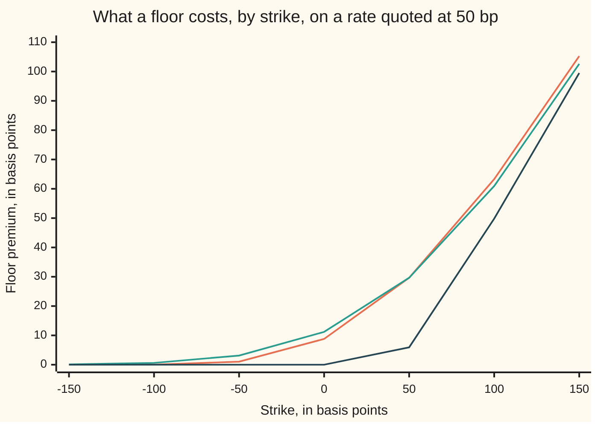

# Shifted lognormal and volatility conversion: a floor moved below zero, and comparing normal with lognormal volatility

Financial mathematics → Black-Scholes from the Ground Up → Rates below zero → Shifted lognormal and volatility conversion

---

## General Overview

One interest rate, quoted this morning at 0.50 percent for a period starting in a year. Rates are counted in **basis points**, hundredths of one percent, because the moves are small and the amounts are large. So the quote is fifty basis points, written 50 bp.

A pension fund wants insurance against that rate going below zero. The contract is one period of a **floor**, a floorlet: on ten million dollars, for a half-year interest period, every basis point the rate fixes below 0.00 percent pays five hundred dollars. Floors struck at zero traded in size after euro and Swiss franc rates went below zero in 2014 and stayed there for years.

Hand that contract to Black-76 and the answer is exactly nothing ([black-76-and-forward-level-pricing](06-black-76-and-forward-level-pricing.md)). Black's rate moves in percentage steps, and multiplying a positive number by positive numbers keeps it positive, so the rate can creep towards zero for ever and never arrive. Insurance against arriving is then worthless. Desks were paying real money for it.

The repair is a slide. Pick an amount: 2 percent, 200 bp, here. Add it to the rate and add it to the strike. The contract pays only the gap between the two, and adding the same amount to both leaves every gap alone, so the contract is untouched. Both numbers are now positive, and Black's machinery runs. The floor at zero comes out at **8.79 bp, or 4,395.95 dollars**.

The bill arrives with the quote. Where the floor sits is a choice, so the volatility quoted afterwards is a translation through it: one premium reads 50.34 percent at a 100 bp slide and 7.12 percent at a 1000 bp slide. The market also runs two quoting languages at once, one absolute in basis points, one proportional in percent.

**Slide the rate and the strike up by the same chosen amount and the contract is untouched, while the model gains a hard floor at minus that amount; the volatility quoted afterwards means nothing without its slide, and what survives every slide is the rate's absolute wobble.**

**What kind of fact this is:** a model — where the floor sits is a desk's choice, not a law — carrying a theorem, the premium, and an exact conversion, both proved on this card in Why it works, plus one approximation to that conversion with its error bounded.

### The picture: what a floor costs, by strike



Three models, one rate. Highest on the right is this card's shifted model, 30 percent volatility with the floor at −200 bp. Highest on the left is the **normal** model, where the rate itself is bell-curved and negative rates are ordinary ([bachelier-model](07-bachelier-model.md)). The two are matched at the money, where both read 29.66 bp, and part company elsewhere: at the zero strike the normal model charges 11.19 bp, the shifted model 8.79 bp. The flat line is Black-76 with no slide, nothing for every strike at or below zero.

---

## The formula

Notation first, in words. The **fixing** is the rate read off on the appointed day, unknown today. $F$ is the rate quoted today for that day, $K$ is the **strike** the payoff is measured against, and $a$ is the **shift**, the amount everything is slid up by. The slid pair get their own letters: $G = F + a$ and $L = K + a$. $T$ is the wait in years, $D$ the **discount factor**, what a dollar due on the payment day costs today, and $C$ and $P$ the premiums of a call on the rate and of a put on it, the floor. $\sigma$, say "sigma", is the **volatility** of the slid rate, a yearly fraction of itself, and $w = \sigma\sqrt{T}$ is one **wiggle unit**, how far the slid rate typically travels over the whole wait. $N(x)$ is the **bell-curve area** left of $x$, a chance between 0 and 1.

$$C = D\,\bigl[\,G\,N(d_1) - L\,N(d_2)\,\bigr], \qquad P = D\,\bigl[\,L\,N(-d_2) - G\,N(-d_1)\,\bigr]$$

**Read it aloud:** Black-76, with the slid rate in place of the rate and the slid strike in place of the strike, and nothing else touched.

$$d_1 = \frac{\ln(G/L) + \tfrac12 w^2}{w}, \qquad d_2 = d_1 - w$$

$d_1$ counts how many wiggle units of room the slid rate has above the slid strike, plus half a unit; $d_2$ is one unit less. Put $a = 0$ and every symbol is Black-76 unchanged: the check prices the shelf's house call that way and gets 9.227006, the number the rest of the shelf carries.

The card's second half is a conversion, because the market quotes this option in two languages. The proportional one is $\sigma$ above. The absolute one is $\sigma_N$, the **normal volatility**: how many basis points the rate itself wobbles in a year, no percentage anywhere. At the money, where $F = K$ and so $G = L$, the two are tied exactly:

$$\sigma_N = G\,\sqrt{\frac{2\pi}{T}}\,\bigl[\,2N(w/2) - 1\,\bigr] \;=\; G\,\sigma\,R(w), \qquad R(w) = \int_0^1 e^{-w^2u^2/8}\,\mathrm{d}u$$

**Read it aloud:** the absolute wobble is the slid rate times its percentage wobble, shrunk by a factor a little under one.

That shrink factor is where the desk rule of thumb comes from, and how far it can be trusted:

$$R(w) = 1 - \frac{w^2}{24} + \epsilon, \qquad 0 \le \epsilon \le \frac{w^4}{640}$$

So multiplying is right to within a whisker: $G\sigma$ is 75.00 bp here against the exact 74.719697 bp. Backwards needs no new formula, only the bell curve in reverse: the matching $\sigma$ is the one whose bracket $2N(w/2) - 1$ equals $\sigma_N\sqrt{T}/(G\sqrt{2\pi})$. That bracket climbs strictly from 0 towards 1 and never arrives, which settles existence, uniqueness and the boundary together: exactly one match exists when $0 < \sigma_N < G\sqrt{2\pi/T}$, below 626.657069 bp at this shift. Above that ceiling no lognormal volatility, however large, prices the option so dearly, since a positive slid rate cannot pay out more than everything it has.

| Symbol | Plain meaning | In our example | Push it up and the premium… |
| --- | --- | --- | --- |
| $C$, $P$ | the premium of the call and of the put, the floor | 29.660174 bp; 8.791906 bp | — |
| $F$, $F_T$ | the rate quoted today for the fixing day, and the fixing itself | 50 bp; unknown today | rises: a call on the rate is dearer, a floor cheaper |
| $K$ | the strike the payoff is measured against | 50 bp; 0 bp for the floor | rises: the call cheaper, the floor dearer |
| $a$ | the shift, slid onto rate and strike alike. The model's floor sits at $-a$ | 200 bp | rises with $\sigma$ left alone: dearer, 65.252383 bp at a 500 bp shift |
| $G$, $L$ | the slid rate $F + a$ and the slid strike $K + a$, both above zero | 250 bp and 250 bp | — |
| $\sigma$ | the volatility of the slid rate, as a fraction of itself per year | 30 percent | rises: dearer, 39.432200 bp at 40 percent |
| $\sigma_N$ | the normal volatility: the rate's own wobble, in bp per year | 74.719697 bp | rises: dearer, and it is the quantity the quotes agree on |
| $w$ | one wiggle unit, $\sigma\sqrt{T}$ | 0.300000 | — |
| $T$ | the wait to the fixing, in years | 1 | rises: more room to move |
| $D$ | the discount factor, $e^{-rT}$ on a flat 0.50 percent curve | 0.995012 | rises: the premium scales with it, one for one |
| $N(x)$, $\phi(x)$ | the bell-curve area to the left of $x$, and the curve's height at $x$ | $N(d_1) = 0.559618$ | — |
| $d_1$, $d_2$ | the two cut-offs, in wiggle units | 0.150000 and −0.150000 | — |
| $R$, $\epsilon$ | the shrink factor in the conversion, and its leftover | 0.996263 | — |

### When it holds

- **The slid rate wanders lognormally, with one constant volatility.** An assumption, not a fact. Ten points off the quote takes the premium from 29.660174 to 39.432200 bp, a third of the ticket.
- **The floor is chosen, not fitted.** The fixing cannot fall below $-a$, ever, so a 200 bp shift asserts that −2 percent is impossible. If rates can reach −2.5 percent, that shift is not cautious but wrong, and it misprices the low strikes worst.
- **Both slid numbers must be above zero.** With the strike at or below the floor, so $L \le 0$, nothing is left to solve: the call is worth $D(F - K)$ and the floor nothing, at any volatility, since the fixing cannot reach that strike. The check prices that branch too.
- **The conversion is exact only at the money.** Away from it, price in one model and invert in the other, one strike at a time. The shifted model's left-hand wall stops it matching the normal model at every strike at once.
- **Volatility runs to the fixing; the discount runs to the day the cash arrives.** One day here, so $D = e^{-rT}$. A real caplet fixes on one date and pays months later, and using one date for both is the standard way to get one wrong.

**Conventions verified 19 Sep 2026:** market shifts are a quoting convention and have changed, from 1 percent towards 3 percent as euro rates fell; rates here are continuously compounded and $T$ counts calendar years. Convert before substituting.

---

## Why it works

### Step 0: the contract only ever looks at a difference

Suppose the fixing lands at −0.30 percent against a strike of 0.00 percent. The floor pays 0.30 percent. Now slide both up by 2 percent: 1.70 percent against 2.00 percent, and the floor pays 0.30 percent. Identical, at every outcome, not on average.

That is an exact relabelling, not an approximation: the rate measured from $-a$ instead of from zero is the same rate, the way an afternoon is the same afternoon in Celsius or Fahrenheit. Since $F_T - K = (F_T + a) - L$ at every outcome, a floor on the rate is a plain put on the slid rate.

### Step 1: what the slide does change

The relabelling is free; the modelling is not, because the assumption is about the slid quantity. Black's rule is that a move's size is proportional to the rate. The shifted rule makes it proportional to the rate's distance above the floor:

$$\mathrm{d}F_t = \sigma\,(F_t + a)\,\mathrm{d}W_t$$

Read that as: over a short instant the rate gets a random nudge, whose typical size is $\sigma$ times the distance above the floor, and $\mathrm{d}W_t$ is the random kick of the wandering engine this shelf opens with ([geometric-brownian-motion-for-prices](01-geometric-brownian-motion-for-prices.md)). Three things fall out.

- At $F_t = -a$ the nudge is zero, so the rate stops moving: $-a$ is a wall the model cannot cross.
- At $F_t = 0$ nothing special happens: the nudge is $\sigma a$, an ordinary number. Zero has stopped being a boundary, which was the point.
- The shift is a dial. At $a = 0$ the rule is Black's; as $a$ grows with $\sigma(F+a)$ held fixed, the nudge stops depending on the rate, which is the normal model.

The rule has no drift, and the Black-76 card says why: a contract that costs nothing to sign cannot be expected to make money, so the quoted rate is a fair bet on its own fixing ([risk-neutral-measure-and-the-fundamental-theorems](02-risk-neutral-measure-and-the-fundamental-theorems.md)). Sliding by a constant leaves that alone: if the rate averages out at $F$, the slid rate averages out at $G$.

### Step 2: the slid pair goes into Black-76 unchanged

A drift-free lognormal quantity with average $G$ ends up at

$$F_T + a \;=\; G\,\exp\!\left(-\tfrac12 w^2 + w Z\right), \qquad Z \ \text{a standard bell-curve draw}$$

and the $-\tfrac12 w^2$ is the drag that keeps the average at $G$: wiggling costs a quantity that multiplies, since up 50 percent then down 50 percent leaves the total down 25 percent. Average the payoff $\max(F_T - K, 0) = \max(G\,e^{-w^2/2 + wZ} - L, 0)$ over the bell curve, discount once, and out comes the formula ([black-scholes-by-risk-neutral-expectation](04-black-scholes-by-risk-neutral-expectation.md) does that average in full on the unslid version). The premium is 29.660174 bp, and the code reaches it by averaging the payoff with no $d_1$ and no $d_2$ in that road.

<details>
<summary>Detailed proof: the two integrals, and what the shift cannot move</summary>

The payoff lives where $G e^{-w^2/2 + wz} > L$, that is where $z > \left[\ln(L/G) + \tfrac12 w^2\right]/w = -d_2$. So
$$C = D\int_{-d_2}^{\infty}\left(G\,e^{-w^2/2 + wz} - L\right)\phi(z)\,\mathrm{d}z .$$
The strike piece is $L$ times the curve's area above $-d_2$, which is $L\,N(d_2)$ by symmetry. The rate piece needs one identity: multiply the curve's height by the growth factor and complete the square.
$$e^{-w^2/2}e^{wz}\,\phi(z) \;=\; \frac{1}{\sqrt{2\pi}}\,e^{-\frac12\left(z^2 - 2wz + w^2\right)} \;=\; \phi(z - w).$$
The same curve, slid right by one wiggle unit. Substituting $u = z - w$ moves the lower limit from $-d_2$ to $-d_1$, so the rate piece is $G\,N(d_1)$. Subtract, and $C = D[G N(d_1) - L N(d_2)]$; the put follows by integrating below $-d_2$ instead.

Two consequences, both checked. Subtracting the put from the call pays $F_T - K$ whichever way the rate goes, so
$$C - P = D\,(G - L) = D\,(F - K),$$
with no volatility and no shift in it: 49.750624 bp at the zero strike, against a put priced by its own separate integral. And since the payoff is below $G\,e^{-w^2/2+wZ}$, whose average is $G$, the premium stays under $D\,G$. That ceiling limits how small a shift can be: the nearer the floor, the less any volatility can buy.

</details>

### Step 3: one quote cannot separate the shift from the volatility

Take the premium as given, 29.660174 bp, and ask the model for the volatility. The answer depends on where the floor was put, and every answer fits the quote exactly: the check re-solves the volatility at five shifts by bisection, and all five reproduce the premium to twelve digits.

```
one premium of 29.660174 bp, five shifts: the volatility number, one bar = 1 percentage point
shift  100 bp   ██████████████████████████████████████████████████   50.34 pct
shift  200 bp   ██████████████████████████████                       30.00 pct
shift  300 bp   █████████████████████                                21.39 pct
shift  500 bp   ██████████████                                       13.60 pct
shift 1000 bp   ███████                                               7.12 pct
```

Sevenfold, across quotes that price one ticket identically. The same five as absolute wobble, $\sigma$ times the slid rate:

```
the same five quotes as absolute wobble, sigma times the slid rate, one bar = 1.5 bp
shift  100 bp   ██████████████████████████████████████████████████   75.51 bp
shift  200 bp   ██████████████████████████████████████████████████   75.00 bp
shift  300 bp   ██████████████████████████████████████████████████   74.86 bp
shift  500 bp   ██████████████████████████████████████████████████   74.78 bp
shift 1000 bp   ██████████████████████████████████████████████████   74.74 bp
```

The left column was a convention. The right column is the market, and it moves by one part in a hundred while the quoted volatility moves sevenfold. One price identifies the wobble, not the pair.

What pins the shift is a second strike. Those five settings agree at the money and disagree away from it, because a floor nearer the wall is worth less: priced at the zero strike they run 7.17, 8.79, 9.48, 10.11 and 10.62 bp. So the shift is read off a row of strikes, and treating it as a second unknown to fit one price throws away the uniqueness a fixed shift buys.

### Step 4: at the money the two languages convert exactly

At the money $G = L$, so $\ln(G/L) = 0$, $d_1 = w/2$ and $d_2 = -w/2$. The formula collapses:

$$C = D\,G\,\bigl[\,N(w/2) - N(-w/2)\,\bigr] = D\,G\,\bigl[\,2N(w/2) - 1\,\bigr].$$

The normal model at the money is one term, from its own card: $C = D\,\sigma_N\sqrt{T}\,\phi(0)$, with $\phi(0) = 1/\sqrt{2\pi}$ the bell curve's height at its middle. Set the two premiums equal, cancel the discount factor — the same cash on the same day in both — and rearrange:

$$\sigma_N = G\,\sqrt{\frac{2\pi}{T}}\,\bigl[\,2N(w/2) - 1\,\bigr].$$

That is the whole conversion: 250 bp times a bracket, giving 74.719697 bp for a 30 percent quote at a 200 bp shift. The proof below turns the bracket into an integral whose leftover is bounded.

<details>
<summary>Detailed proof: the shrink factor and its remainder</summary>

Write the bracket as twice the area from 0 to $w/2$, then substitute $x = wu/2$:
$$2N(w/2) - 1 = 2\int_0^{w/2}\phi(x)\,\mathrm{d}x = \frac{w}{\sqrt{2\pi}}\int_0^1 e^{-w^2u^2/8}\,\mathrm{d}u = \frac{w}{\sqrt{2\pi}}\,R(w).$$
Feeding that into the conversion and using $w = \sigma\sqrt{T}$ gives $\sigma_N = G\sigma R(w)$ exactly. The integrand is positive and, for $w > 0$, below 1 except at $u = 0$, so the shrink factor sits strictly between 0 and 1: multiplying always overstates the absolute wobble.

For the size of the overstatement, apply Taylor's theorem with remainder to the exponential at 0. For $u$ between 0 and 1,
$$0 \le e^{-w^2u^2/8} - \left(1 - \frac{w^2u^2}{8}\right) \le \frac12\left(\frac{w^2u^2}{8}\right)^{2},$$
since the remainder is half that square times the exponential somewhere between, which is at most 1. Integrate over $u$ from 0 to 1: $\int_0^1 w^2u^2/8\,\mathrm{d}u = w^2/24$, and the squared term integrates to $w^4/640$. That is the series and its one-sided bound. At $w = 0.3$ the bound is 0.000949 bp of volatility, and the exact 74.719697 bp sits just under the corrected 74.718750 bp plus that bound.

Read backwards, the same bracket gives the lognormal volatility from a normal quote; its strict climb is what made that answer exist and be unique. The check finds 24.057892 percent for the 60 bp quote twice: through the bell curve's inverse, and by bisection on the premium itself.

</details>

The check also walks to the far end of the dial: with the absolute wobble held at 74.719697 bp, a 10000 bp shift misses the normal premium by 0.000068 bp and a 100000 bp shift by 0.000001 bp. One dial, Black at one end, Bachelier at the other ([bachelier-model](07-bachelier-model.md)).

---

## Worked numbers, by hand

The rate quoted at 50 bp, struck at 50 bp, one year to the fixing, a 200 bp shift, 30 percent volatility quoted at that shift, discounting off a flat 0.50 percent curve.

| Step | Arithmetic | Value |
| --- | --- | --- |
| slid rate, $G = F + a$ | $50 + 200$ | 250.000000 bp |
| slid strike, $L = K + a$ | $50 + 200$ | 250.000000 bp |
| one wiggle unit, $w = \sigma\sqrt{T}$ | $0.30 \times \sqrt{1}$ | 0.300000 |
| $d_1$ | $(0 + 0.045)/0.30$ | 0.150000 |
| $d_2$ | $0.150000 - 0.300000$ | −0.150000 |
| $N(d_1)$ | bell-curve area left of $d_1$ | 0.559618 |
| $N(d_2)$ | bell-curve area left of $d_2$ | 0.440382 |
| **premium** | $0.995012 \times 250 \times (0.559618 - 0.440382)$ | **29.660174 bp** |
| the same, in money | 29.660174 bp of ten million for half a year | **14,830.09 dollars** |
| the floor struck at 0 bp | the put, same inputs, $L = 200$ bp | **8.791906 bp** |
| the normal volatility it converts to | $250 \times 0.30 \times 0.996263$ | **74.719697 bp** |

Insuring ten million dollars against that rate rising above 0.50 percent costs about fifteen thousand dollars; against its falling below zero, about four and a half thousand — the number Black-76 reported as nothing.

### What breaks if you drop a piece

Same trade, correct answers 29.660174 bp at the money and 8.791906 bp for the floor at zero.

| Mistake | Comes out at | What went wrong |
| --- | --- | --- |
| Slide the rate, leave the strike | 199.002496 bp | The payoff was changed, not relabelled: the ticket now pays whatever happens, so it is a forward, not insurance, and nearly seven times too dear |
| A 30 percent quote used at a 100 bp shift | 17.796104 bp | Six tenths of the premium. The number was a translation through a 200 bp shift and means nothing at any other |
| A 30 percent quote used with no shift at all | 5.932035 bp | A fifth of the premium, and priceable only because this strike is above zero; at the zero strike the same mistake returns nothing |
| Drop the $-\tfrac12 w^2$ drag | 36.405657 bp | The model's average fixing becomes 61.506965 bp against the 50 bp quoted, so it disagrees with a rate anyone can lock in today |
| Read 30 percent against a 60 bp quote as one market | 74.719697 bp against 60 | Two languages, not two numbers: converted, the quotes are a quarter apart, 29.660174 bp against 23.817153 bp, a gap of 2,921.51 dollars |

Every number in that table is printed by the code below.

---

## Code, from first principles, and it actually runs

Nothing imported already knows the answer. In Python the bell-curve area comes from `math.erf`; in Rust, which has no `erf`, it is built by adding up thin slices under the curve. The premium is reached by **three independent roads**: the shifted formula, a brute-force average of the payoff over the bell curve with the kink located by bisection and no $d_1$ or $d_2$ in sight, and a 2,000-step coin-flip tree on the slid rate. Then the conversion runs twice in each direction, the series bound is tested on both sides, parity is checked against a put priced by its own integral, the five shift-and-volatility pairs are re-solved, and the shelf's house call comes back at $a = 0$.

### Python

```python
# Shifted lognormal and volatility conversion -- the check behind the card.  Standard
# library only.  Nothing imported already knows the answer: the bell-curve area is built
# from math.erf, the payoff average is Simpson's rule, the tree is a loop, inverses are
# bisection.  Rates in basis points, one bp = 0.01 percent; premiums also in dollars.
from math import log, sqrt, exp, erf, pi

BP = 1e4                                   # rates are quoted in basis points
NOTIONAL, ACCRUAL = 10_000_000.0, 0.5      # $10m of rate for half a year

def N(x):    return 0.5 * (1.0 + erf(x / sqrt(2.0)))     # bell-curve area left of x
def phi(x):  return exp(-0.5 * x * x) / sqrt(2.0 * pi)   # bell-curve height at x

def simpson(f, lo, hi, n):                 # Simpson's rule, written out here
    h = (hi - lo) / n
    tot = f(lo) + f(hi)
    for i in range(1, n):
        tot += (4 if i % 2 else 2) * f(lo + i * h)
    return tot * h / 3.0

def solve(f, target, lo, hi, iters=200):   # bisection on an increasing function
    for _ in range(iters):
        mid = 0.5 * (lo + hi)
        if f(mid) < target: lo = mid
        else: hi = mid
    return 0.5 * (lo + hi)

def shifted(F, K, a, sigma, T, D, cp=1):
    # Road 1: slide rate and strike up by a, price with Black-76, discount.
    G, L = F + a, K + a
    if G <= 0.0: raise ValueError("the shift must lift the rate above the floor")
    if L <= 0.0: return D * (F - K) if cp > 0 else 0.0   # strike at or below the floor
    w = sigma * sqrt(T)
    d1 = (log(G / L) + 0.5 * w * w) / w
    d2 = d1 - w
    if cp > 0: return D * (G * N(d1) - L * N(d2))
    return D * (L * N(-d2) - G * N(-d1))

def bachelier(F, K, sn, T, D, cp=1):
    # The normal model: the fixing itself is bell-curved, so it may go negative.
    v = sn * sqrt(T)
    d = cp * (F - K) / v
    return D * (cp * (F - K) * N(d) + v * phi(d))

def by_integral(F, K, a, sigma, T, D, cp=1, n=20000):
    # Road 2: average the payoff over the bell curve, the kink found by bisection and used
    # as an endpoint.  No d1, no d2, nothing borrowed from road 1.
    G, w = F + a, sigma * sqrt(T)
    def fixing(z): return G * exp(-0.5 * w * w + w * z) - a
    def f(z): return max(cp * (fixing(z) - K), 0.0) * phi(z)
    z0 = solve(fixing, K, -12.0, 12.0)                   # where the fixing equals K
    lo, hi = (z0, 10.0) if cp > 0 else (-10.0, z0)
    return D * simpson(f, lo, hi, n)

def by_tree(F, K, a, sigma, T, D, steps=2000):
    # Road 3: a coin-flip tree on the distance above the floor.
    G, dt = F + a, T / steps
    u = exp(sigma * sqrt(dt)); d = 1.0 / u
    p = (1.0 - d) / (u - d)                # the slid rate is a fair bet on itself
    v = [max(G * u ** j * d ** (steps - j) - a - K, 0.0) for j in range(steps + 1)]
    for step in range(steps, 0, -1):
        v = [p * v[j + 1] + (1.0 - p) * v[j] for j in range(step)]
    return D * v[0]

# ---- the trade: a one-year rate quoted at 50 bp, floor at -200 bp, 30 pct vol ----
F, K, K0, a, sigma, T, r = 0.005, 0.005, 0.0, 0.02, 0.30, 1.0, 0.005
D, G, L, w = exp(-r * T), F + a, K + a, sigma * sqrt(T)
d1 = (log(G / L) + 0.5 * w * w) / w; d2 = d1 - w
C, C_int, C_tree = shifted(F, K, a, sigma, T, D), by_integral(F, K, a, sigma, T, D), by_tree(F, K, a, sigma, T, D)
# ---- the floor struck at zero: the contract Black-76 prices at nothing ----
P0, P0_int = shifted(F, K0, a, sigma, T, D, -1), by_integral(F, K0, a, sigma, T, D, -1)
C0, P0_black = shifted(F, K0, a, sigma, T, D), shifted(F, K0, 0.0, sigma, T, D, -1)
# ---- the conversion at the money, its series, and the reverse direction ----
sn = G * sqrt(2.0 * pi / T) * (2.0 * N(w / 2.0) - 1.0)
sn_solved = solve(lambda x: bachelier(F, K, x, T, D), C, 1e-9, 1.0)
napkin, corrected, bound = G * sigma, G * sigma * (1.0 - w * w / 24.0), G * sigma * w ** 4 / 640.0
R_int, R_exact = simpson(lambda u: exp(-w * w * u * u / 8.0), 0.0, 1.0, 2000), sn / (G * sigma)
sn_quote = 0.0060
eta = sn_quote * sqrt(T) / (G * sqrt(2.0 * pi))
sig_inv = 2.0 / sqrt(T) * solve(N, 0.5 * (1.0 + eta), -10.0, 10.0)
prem_norm = bachelier(F, K, sn_quote, T, D)
sig_solved = solve(lambda x: shifted(F, K, a, x, T, D), prem_norm, 1e-9, 5.0)
prem_at_sig, ceiling = shifted(F, K, a, sig_inv, T, D), G * sqrt(2.0 * pi / T)
gaps = [shifted(F, K, big, sn / (F + big), T, D) - bachelier(F, K, sn, T, D) for big in (1.0, 10.0)]
# ---- what breaks, two things to try, and the shelf's house market at a = 0 ----
w_noslide, w_shift100 = D * (F + a - K), shifted(F, K, 0.01, sigma, T, D)
w_noshift, mean_nodrag = shifted(F, K, 0.0, sigma, T, D), G * exp(0.5 * w * w) - a
w_nodrag, t_vol40 = shifted(mean_nodrag, K, a, sigma, T, D), shifted(F, K, a, 0.40, T, D)
t_shift500 = shifted(F, K, 0.05, sigma, T, D)
C_house = shifted(100.0 * exp(0.03), 100.0, 0.0, 0.20, 1.0, exp(-0.05))
print(f"the rate F {F * BP:.6f} bp, the strike K {K * BP:.6f} bp, the shift a {a * BP:.6f} bp")
print(f"slid rate G {G * BP:.6f} bp, slid strike L {L * BP:.6f} bp, w {w:.6f}, D {D:.6f}")
print(f"d1 {d1:.6f}, d2 {d2:.6f}, N(d1) {N(d1):.6f}, N(d2) {N(d2):.6f}")
rows = [
    ("1 formula, at-the-money premium, bp", C * BP), ("2 payoff averaged over the bell curve, bp", C_int * BP),
    ("3 tree on the slid rate, 2000 steps, bp", C_tree * BP), ("  the premium in dollars", C * NOTIONAL * ACCRUAL),
    ("4 floor struck at 0 bp, shifted put, bp", P0 * BP), ("  the same put by the payoff average, bp", P0_int * BP),
    ("  in dollars", P0 * NOTIONAL * ACCRUAL), ("  call minus put at 0 bp, bp", (C0 - P0_int) * BP),
    ("  D times (F - K) at K = 0, bp", D * (F - K0) * BP), ("5 Black-76, no shift, floor at 0 bp, bp", P0_black * BP),
    ("6 normal vol matching 30 pct at 200 bp, bp", sn * BP), ("  the same by bisection on the normal price", sn_solved * BP),
    ("  napkin rule, G times sigma, bp", napkin * BP), ("  corrected, G sigma (1 - w^2/24), bp", corrected * BP),
    ("  error bound, G sigma w^4/640, bp", bound * BP), ("  R(w) by integrating exp(-w^2u^2/8)", R_int),
    ("  R(w) from the exact conversion", R_exact), ("7 lognormal vol matching 60 bp, pct", sig_inv * 100.0),
    ("  the same by bisection on the price, pct", sig_solved * 100.0), ("  shifted premium at that vol, bp", prem_at_sig * BP),
    ("  normal premium at 60 bp, bp", prem_norm * BP), ("  highest normal vol a 200 bp shift meets, bp", ceiling * BP),
    ("8 the 30 pct quote, as normal vol, bp", sn * BP), ("  the gap between the two quotes, dollars", (C - prem_norm) * NOTIONAL * ACCRUAL),
    ("9 Bachelier limit, shift 10000 bp, gap in bp", gaps[0] * BP), ("  Bachelier limit, shift 100000 bp, gap in bp", gaps[1] * BP),
    ("wrong: the strike not slid with the rate, bp", w_noslide * BP), ("wrong: the 30 pct vol at a 100 bp shift, bp", w_shift100 * BP),
    ("wrong: the 30 pct vol at no shift at all, bp", w_noshift * BP), ("wrong: no drag, mean fixing, bp", mean_nodrag * BP),
    ("wrong: no drag, premium, bp", w_nodrag * BP), ("try: sigma = 40 pct, bp", t_vol40 * BP),
    ("try: shift 500 bp, vol left at 30 pct, bp", t_shift500 * BP), ("house market at a = 0, the Acme call", C_house)]
for name, v in rows: print(f"{name:<46}{v:>14.6f}")
pairs = []
for sh in (0.01, 0.02, 0.03, 0.05, 0.10):
    v = solve(lambda x: shifted(F, K, sh, x, T, D), C, 1e-9, 5.0)
    pairs.append((sh, v, (F + sh) * v, shifted(F, K, sh, v, T, D), shifted(F, K0, sh, v, T, D, -1)))
print(f"\none premium of {C * BP:.6f} bp, five shifts, each vol re-solved:")
for sh, v, wob, atm, fl in pairs:
    print(f"  shift {sh * BP:>5.0f} bp  vol {v * 100:>5.2f} pct  wobble {wob * BP:>5.2f} bp  at the money {atm * BP:.6f} bp  floor at 0 bp {fl * BP:>5.2f} bp")
strikes = [-0.015, -0.010, -0.005, 0.0, 0.005, 0.010, 0.015]
print("\nfloor premiums by strike, in bp of notional")
print(f"{'strike, bp':<36}" + "".join(f"{k * BP:>8.0f}" for k in strikes))
for label, fn in (("shifted, 30 pct at a 200 bp shift", lambda k: shifted(F, k, a, sigma, T, D, -1)),
                  ("Bachelier, at the matched normal vol", lambda k: bachelier(F, k, sn, T, D, -1)),
                  ("Black-76, no shift", lambda k: shifted(F, k, 0.0, sigma, T, D, -1))):
    print(f"{label:<36}" + "".join(f"{fn(k) * BP:>8.2f}" for k in strikes))
assert abs(C_int - C) < 1e-13,                    "the payoff average must land on the formula"
assert abs(C_tree - C) < 1e-6,                    "the tree must land within a bp's hundredth"
assert abs(C0 - P0_int - D * (F - K0)) < 1e-15,   "parity, with the put priced on its own"
assert P0_black == 0.0 and P0 > 8e-4,             "Black-76 gives a floor at zero nothing"
assert abs(sn - sn_solved) < 1e-12,               "exact conversion against bisection"
assert corrected <= sn <= corrected + bound,      "the series bound, on both sides"
assert abs(R_int - R_exact) < 1e-12,              "the integral form of R(w)"
assert abs(prem_at_sig - prem_norm) < 1e-12,      "the inverted vol reprices the quote"
assert abs(sig_inv - sig_solved) < 1e-9,          "two roads to the inverse vol"
assert abs(C_house - 9.227005508154) < 1e-9,      "the shelf's house call, at a = 0"
assert abs(gaps[1]) < 0.15 * abs(gaps[0]),        "the shift dial reaches Bachelier"
assert all(abs(p[3] - C) < 1e-12 for p in pairs), "every pair reproduces the one quote"
assert all(pairs[i][1] > pairs[i + 1][1] for i in range(4)), "a smaller shift needs a bigger vol"
assert max(p[4] for p in pairs) > 1.4 * min(p[4] for p in pairs), "a second strike separates them"
print("ALL CHECKS PASS")
```

**Ran 2026-09-19 on macOS, Python 3.14.6, standard library only. All checks passed. Output, pasted from the run:**

```
the rate F 50.000000 bp, the strike K 50.000000 bp, the shift a 200.000000 bp
slid rate G 250.000000 bp, slid strike L 250.000000 bp, w 0.300000, D 0.995012
d1 0.150000, d2 -0.150000, N(d1) 0.559618, N(d2) 0.440382
1 formula, at-the-money premium, bp                29.660174
2 payoff averaged over the bell curve, bp          29.660174
3 tree on the slid rate, 2000 steps, bp            29.656467
  the premium in dollars                        14830.086972
4 floor struck at 0 bp, shifted put, bp             8.791906
  the same put by the payoff average, bp            8.791906
  in dollars                                     4395.952824
  call minus put at 0 bp, bp                       49.750624
  D times (F - K) at K = 0, bp                     49.750624
5 Black-76, no shift, floor at 0 bp, bp             0.000000
6 normal vol matching 30 pct at 200 bp, bp         74.719697
  the same by bisection on the normal price        74.719697
  napkin rule, G times sigma, bp                   75.000000
  corrected, G sigma (1 - w^2/24), bp              74.718750
  error bound, G sigma w^4/640, bp                  0.000949
  R(w) by integrating exp(-w^2u^2/8)                0.996263
  R(w) from the exact conversion                    0.996263
7 lognormal vol matching 60 bp, pct                24.057892
  the same by bisection on the price, pct          24.057892
  shifted premium at that vol, bp                  23.817153
  normal premium at 60 bp, bp                      23.817153
  highest normal vol a 200 bp shift meets, bp     626.657069
8 the 30 pct quote, as normal vol, bp              74.719697
  the gap between the two quotes, dollars        2921.510548
9 Bachelier limit, shift 10000 bp, gap in bp       -0.000068
  Bachelier limit, shift 100000 bp, gap in bp      -0.000001
wrong: the strike not slid with the rate, bp      199.002496
wrong: the 30 pct vol at a 100 bp shift, bp        17.796104
wrong: the 30 pct vol at no shift at all, bp        5.932035
wrong: no drag, mean fixing, bp                    61.506965
wrong: no drag, premium, bp                        36.405657
try: sigma = 40 pct, bp                            39.432200
try: shift 500 bp, vol left at 30 pct, bp          65.252383
house market at a = 0, the Acme call                9.227006

one premium of 29.660174 bp, five shifts, each vol re-solved:
  shift   100 bp  vol 50.34 pct  wobble 75.51 bp  at the money 29.660174 bp  floor at 0 bp  7.17 bp
  shift   200 bp  vol 30.00 pct  wobble 75.00 bp  at the money 29.660174 bp  floor at 0 bp  8.79 bp
  shift   300 bp  vol 21.39 pct  wobble 74.86 bp  at the money 29.660174 bp  floor at 0 bp  9.48 bp
  shift   500 bp  vol 13.60 pct  wobble 74.78 bp  at the money 29.660174 bp  floor at 0 bp 10.11 bp
  shift  1000 bp  vol  7.12 pct  wobble 74.74 bp  at the money 29.660174 bp  floor at 0 bp 10.62 bp

floor premiums by strike, in bp of notional
strike, bp                              -150    -100     -50       0      50     100     150
shifted, 30 pct at a 200 bp shift       0.00    0.01    1.04    8.79   29.66   63.28  105.26
Bachelier, at the matched normal vol    0.09    0.62    3.12   11.19   29.66   60.94  102.62
Black-76, no shift                      0.00    0.00    0.00    0.00    5.93   49.82   99.50
ALL CHECKS PASS
```

Three roads, one premium: the payoff average lands on the formula at every printed digit, and the tree is four thousandths of a basis point short, closing as steps are added. The conversion agrees both from the bracket and by bisection on the other model's price, in both directions.

### Rust

Same inputs, same labels, no crates.

```rust
// Shifted lognormal and volatility conversion -- the same check as the Python, in Rust.  No
// crates.  Rust has no erf, so the bell-curve area is built the honest way: add up thin slices
// under the curve (Simpson); the payoff average, the tree and the inverses are written out too.
use std::f64::consts::PI;

const BP: f64 = 1e4;                       // rates are quoted in basis points
const NOTIONAL: f64 = 10_000_000.0; const ACCRUAL: f64 = 0.5;   // $10m of rate for half a year

fn phi(x: f64) -> f64 { (-0.5 * x * x).exp() / (2.0 * PI).sqrt() }   // bell-curve height at x

fn simpson<F: Fn(f64) -> f64>(f: F, lo: f64, hi: f64, n: usize) -> f64 {
    let h = (hi - lo) / n as f64;
    let mut tot = f(lo) + f(hi);
    for i in 1..n { tot += (if i % 2 == 1 { 4.0 } else { 2.0 }) * f(lo + i as f64 * h); }
    tot * h / 3.0
}

fn n_cdf(x: f64) -> f64 {                  // bell-curve area left of x, by thin slices
    if x < -12.0 { return 0.0 }
    if x > 12.0 { return 1.0 }
    0.5 + simpson(phi, 0.0, x, 2000)
}

fn solve<F: Fn(f64) -> f64>(f: F, target: f64, lo: f64, hi: f64) -> f64 {
    let (mut lo, mut hi) = (lo, hi);        // bisection on an increasing function
    for _ in 0..200 {
        let mid = 0.5 * (lo + hi);
        if f(mid) < target { lo = mid } else { hi = mid }
    }
    0.5 * (lo + hi)
}

fn shifted(f: f64, k: f64, a: f64, sigma: f64, t: f64, dd: f64, cp: f64) -> f64 {
    // Road 1: slide rate and strike up by a, price with Black-76, discount.
    let (g, l) = (f + a, k + a);
    if g <= 0.0 { panic!("the shift must lift the rate above the floor") }
    if l <= 0.0 { return if cp > 0.0 { dd * (f - k) } else { 0.0 } }   // strike at or below the floor
    let w = sigma * t.sqrt();
    let d1 = ((g / l).ln() + 0.5 * w * w) / w;
    let d2 = d1 - w;
    if cp > 0.0 { dd * (g * n_cdf(d1) - l * n_cdf(d2)) } else { dd * (l * n_cdf(-d2) - g * n_cdf(-d1)) }
}

fn bachelier(f: f64, k: f64, sn: f64, t: f64, dd: f64, cp: f64) -> f64 {
    // The normal model: the fixing itself is bell-curved, so it may go negative.
    let v = sn * t.sqrt();
    let d = cp * (f - k) / v;
    dd * (cp * (f - k) * n_cdf(d) + v * phi(d))
}

fn by_integral(f: f64, k: f64, a: f64, sigma: f64, t: f64, dd: f64, cp: f64) -> f64 {
    // Road 2: average the payoff over the bell curve, the kink found by bisection and used
    // as an endpoint.  No d1, no d2, nothing borrowed from road 1.
    let (g, w) = (f + a, sigma * t.sqrt());
    let fixing = |z: f64| g * (-0.5 * w * w + w * z).exp() - a;
    let pay = |z: f64| (cp * (fixing(z) - k)).max(0.0) * phi(z);
    let z0 = solve(&fixing, k, -12.0, 12.0);             // where the fixing equals K
    let (lo, hi) = if cp > 0.0 { (z0, 10.0) } else { (-10.0, z0) };
    dd * simpson(pay, lo, hi, 20000)
}

fn by_tree(f: f64, k: f64, a: f64, sigma: f64, t: f64, dd: f64, steps: usize) -> f64 {
    // Road 3: a coin-flip tree on the distance above the floor.
    let (g, dt) = (f + a, t / steps as f64);
    let u = (sigma * dt.sqrt()).exp();
    let d = 1.0 / u;
    let p = (1.0 - d) / (u - d);            // the slid rate is a fair bet on itself
    let mut v: Vec<f64> = (0..=steps).map(|j| (g * u.powi(j as i32) * d.powi((steps - j) as i32) - a - k).max(0.0)).collect();
    for step in (1..=steps).rev() {
        v = (0..step).map(|j| p * v[j + 1] + (1.0 - p) * v[j]).collect();
    }
    dd * v[0]
}

fn main() {
    // ---- the trade: a one-year rate quoted at 50 bp, floor at -200 bp, 30 pct vol ----
    let (f, k, k0, a, sigma, t, r) = (0.005_f64, 0.005_f64, 0.0_f64, 0.02_f64, 0.30_f64, 1.0_f64, 0.005_f64);
    let dd = (-r * t).exp();
    let (g, l, w) = (f + a, k + a, sigma * t.sqrt());
    let d1 = ((g / l).ln() + 0.5 * w * w) / w;
    let d2 = d1 - w;
    let (c, c_int) = (shifted(f, k, a, sigma, t, dd, 1.0), by_integral(f, k, a, sigma, t, dd, 1.0));
    let c_tree = by_tree(f, k, a, sigma, t, dd, 2000);
    // ---- the floor struck at zero: the contract Black-76 prices at nothing ----
    let (p0, p0_int) = (shifted(f, k0, a, sigma, t, dd, -1.0), by_integral(f, k0, a, sigma, t, dd, -1.0));
    let (c0, p0_black) = (shifted(f, k0, a, sigma, t, dd, 1.0), shifted(f, k0, 0.0, sigma, t, dd, -1.0));
    // ---- the conversion at the money, its series, and the reverse direction ----
    let sn = g * (2.0 * PI / t).sqrt() * (2.0 * n_cdf(w / 2.0) - 1.0);
    let sn_solved = solve(|x| bachelier(f, k, x, t, dd, 1.0), c, 1e-9, 1.0);
    let (napkin, corrected) = (g * sigma, g * sigma * (1.0 - w * w / 24.0));
    let bound = g * sigma * w.powi(4) / 640.0;
    let r_int = simpson(|u| (-w * w * u * u / 8.0).exp(), 0.0, 1.0, 2000);
    let r_exact = sn / (g * sigma);
    let sn_quote = 0.0060;
    let eta = sn_quote * t.sqrt() / (g * (2.0 * PI).sqrt());
    let sig_inv = 2.0 / t.sqrt() * solve(n_cdf, 0.5 * (1.0 + eta), -10.0, 10.0);
    let prem_norm = bachelier(f, k, sn_quote, t, dd, 1.0);
    let sig_solved = solve(|x| shifted(f, k, a, x, t, dd, 1.0), prem_norm, 1e-9, 5.0);
    let (prem_at_sig, ceiling) = (shifted(f, k, a, sig_inv, t, dd, 1.0), g * (2.0 * PI / t).sqrt());
    let gaps: Vec<f64> = [1.0_f64, 10.0].iter().map(|&big| shifted(f, k, big, sn / (f + big), t, dd, 1.0) - bachelier(f, k, sn, t, dd, 1.0)).collect();
    // ---- what breaks, two things to try, and the shelf's house market at a = 0 ----
    let (w_noslide, w_shift100) = (dd * (f + a - k), shifted(f, k, 0.01, sigma, t, dd, 1.0));
    let (w_noshift, mean_nodrag) = (shifted(f, k, 0.0, sigma, t, dd, 1.0), g * (0.5 * w * w).exp() - a);
    let (w_nodrag, t_vol40) = (shifted(mean_nodrag, k, a, sigma, t, dd, 1.0), shifted(f, k, a, 0.40, t, dd, 1.0));
    let t_shift500 = shifted(f, k, 0.05, sigma, t, dd, 1.0);
    let c_house = shifted(100.0 * (0.03_f64).exp(), 100.0, 0.0, 0.20, 1.0, (-0.05_f64).exp(), 1.0);
    println!("the rate F {:.6} bp, the strike K {:.6} bp, the shift a {:.6} bp", f * BP, k * BP, a * BP);
    println!("slid rate G {:.6} bp, slid strike L {:.6} bp, w {:.6}, D {:.6}", g * BP, l * BP, w, dd);
    println!("d1 {:.6}, d2 {:.6}, N(d1) {:.6}, N(d2) {:.6}", d1, d2, n_cdf(d1), n_cdf(d2));
    let rows: Vec<(&str, f64)> = vec![
        ("1 formula, at-the-money premium, bp", c * BP), ("2 payoff averaged over the bell curve, bp", c_int * BP),
        ("3 tree on the slid rate, 2000 steps, bp", c_tree * BP), ("  the premium in dollars", c * NOTIONAL * ACCRUAL),
        ("4 floor struck at 0 bp, shifted put, bp", p0 * BP), ("  the same put by the payoff average, bp", p0_int * BP),
        ("  in dollars", p0 * NOTIONAL * ACCRUAL), ("  call minus put at 0 bp, bp", (c0 - p0_int) * BP),
        ("  D times (F - K) at K = 0, bp", dd * (f - k0) * BP), ("5 Black-76, no shift, floor at 0 bp, bp", p0_black * BP),
        ("6 normal vol matching 30 pct at 200 bp, bp", sn * BP), ("  the same by bisection on the normal price", sn_solved * BP),
        ("  napkin rule, G times sigma, bp", napkin * BP), ("  corrected, G sigma (1 - w^2/24), bp", corrected * BP),
        ("  error bound, G sigma w^4/640, bp", bound * BP), ("  R(w) by integrating exp(-w^2u^2/8)", r_int),
        ("  R(w) from the exact conversion", r_exact), ("7 lognormal vol matching 60 bp, pct", sig_inv * 100.0),
        ("  the same by bisection on the price, pct", sig_solved * 100.0), ("  shifted premium at that vol, bp", prem_at_sig * BP),
        ("  normal premium at 60 bp, bp", prem_norm * BP), ("  highest normal vol a 200 bp shift meets, bp", ceiling * BP),
        ("8 the 30 pct quote, as normal vol, bp", sn * BP), ("  the gap between the two quotes, dollars", (c - prem_norm) * NOTIONAL * ACCRUAL),
        ("9 Bachelier limit, shift 10000 bp, gap in bp", gaps[0] * BP), ("  Bachelier limit, shift 100000 bp, gap in bp", gaps[1] * BP),
        ("wrong: the strike not slid with the rate, bp", w_noslide * BP), ("wrong: the 30 pct vol at a 100 bp shift, bp", w_shift100 * BP),
        ("wrong: the 30 pct vol at no shift at all, bp", w_noshift * BP), ("wrong: no drag, mean fixing, bp", mean_nodrag * BP),
        ("wrong: no drag, premium, bp", w_nodrag * BP), ("try: sigma = 40 pct, bp", t_vol40 * BP),
        ("try: shift 500 bp, vol left at 30 pct, bp", t_shift500 * BP), ("house market at a = 0, the Acme call", c_house)];
    for (name, v) in &rows { println!("{:<46}{:>14.6}", name, v) }
    let mut pairs: Vec<(f64, f64, f64, f64, f64)> = Vec::new();
    for sh in [0.01_f64, 0.02, 0.03, 0.05, 0.10] {
        let v = solve(|x| shifted(f, k, sh, x, t, dd, 1.0), c, 1e-9, 5.0);
        pairs.push((sh, v, (f + sh) * v, shifted(f, k, sh, v, t, dd, 1.0), shifted(f, k0, sh, v, t, dd, -1.0)));
    }
    println!("\none premium of {:.6} bp, five shifts, each vol re-solved:", c * BP);
    for (sh, v, wob, atm, fl) in &pairs {
        println!("  shift {:>5.0} bp  vol {:>5.2} pct  wobble {:>5.2} bp  at the money {:.6} bp  floor at 0 bp {:>5.2} bp", sh * BP, v * 100.0, wob * BP, atm * BP, fl * BP);
    }
    let strikes = [-0.015_f64, -0.010, -0.005, 0.0, 0.005, 0.010, 0.015];
    println!("\nfloor premiums by strike, in bp of notional");
    let mut head = format!("{:<36}", "strike, bp");
    for kk in &strikes { head.push_str(&format!("{:>8.0}", kk * BP)) }
    println!("{}", head);
    for (label, which) in [("shifted, 30 pct at a 200 bp shift", 0), ("Bachelier, at the matched normal vol", 1),
                           ("Black-76, no shift", 2)] {
        let mut line = format!("{:<36}", label);
        for &kk in &strikes {
            let v = match which { 0 => shifted(f, kk, a, sigma, t, dd, -1.0), 1 => bachelier(f, kk, sn, t, dd, -1.0),
                                  _ => shifted(f, kk, 0.0, sigma, t, dd, -1.0) };
            line.push_str(&format!("{:>8.2}", v * BP));
        }
        println!("{}", line);
    }
    assert!((c_int - c).abs() < 1e-13, "the payoff average must land on the formula");
    assert!((c_tree - c).abs() < 1e-6, "the tree must land within a bp's hundredth");
    assert!((c0 - p0_int - dd * (f - k0)).abs() < 1e-15, "parity, with the put priced on its own");
    assert!(p0_black == 0.0 && p0 > 8e-4, "Black-76 gives a floor at zero nothing");
    assert!((sn - sn_solved).abs() < 1e-12, "exact conversion against bisection");
    assert!(corrected <= sn && sn <= corrected + bound, "the series bound, on both sides");
    assert!((r_int - r_exact).abs() < 1e-12, "the integral form of R(w)");
    assert!((prem_at_sig - prem_norm).abs() < 1e-12, "the inverted vol reprices the quote");
    assert!((sig_inv - sig_solved).abs() < 1e-9, "two roads to the inverse vol");
    assert!((c_house - 9.227005508154).abs() < 1e-9, "the shelf's house call, at a = 0");
    assert!(gaps[1].abs() < 0.15 * gaps[0].abs(), "the shift dial reaches Bachelier");
    assert!(pairs.iter().all(|p| (p.3 - c).abs() < 1e-12), "every pair reproduces the one quote");
    assert!((0..4).all(|i| pairs[i].1 > pairs[i + 1].1), "a smaller shift needs a bigger vol");
    let (hi, lo) = (pairs.iter().map(|p| p.4).fold(f64::MIN, f64::max), pairs.iter().map(|p| p.4).fold(f64::MAX, f64::min));
    assert!(hi > 1.4 * lo, "a second strike separates them");
    println!("ALL CHECKS PASS");
}
```

**Ran 2026-09-19 on macOS, rustc 1.98.1, no crates. All checks passed. Output, pasted from the run:**

```
the rate F 50.000000 bp, the strike K 50.000000 bp, the shift a 200.000000 bp
slid rate G 250.000000 bp, slid strike L 250.000000 bp, w 0.300000, D 0.995012
d1 0.150000, d2 -0.150000, N(d1) 0.559618, N(d2) 0.440382
1 formula, at-the-money premium, bp                29.660174
2 payoff averaged over the bell curve, bp          29.660174
3 tree on the slid rate, 2000 steps, bp            29.656467
  the premium in dollars                        14830.086972
4 floor struck at 0 bp, shifted put, bp             8.791906
  the same put by the payoff average, bp            8.791906
  in dollars                                     4395.952824
  call minus put at 0 bp, bp                       49.750624
  D times (F - K) at K = 0, bp                     49.750624
5 Black-76, no shift, floor at 0 bp, bp             0.000000
6 normal vol matching 30 pct at 200 bp, bp         74.719697
  the same by bisection on the normal price        74.719697
  napkin rule, G times sigma, bp                   75.000000
  corrected, G sigma (1 - w^2/24), bp              74.718750
  error bound, G sigma w^4/640, bp                  0.000949
  R(w) by integrating exp(-w^2u^2/8)                0.996263
  R(w) from the exact conversion                    0.996263
7 lognormal vol matching 60 bp, pct                24.057892
  the same by bisection on the price, pct          24.057892
  shifted premium at that vol, bp                  23.817153
  normal premium at 60 bp, bp                      23.817153
  highest normal vol a 200 bp shift meets, bp     626.657069
8 the 30 pct quote, as normal vol, bp              74.719697
  the gap between the two quotes, dollars        2921.510548
9 Bachelier limit, shift 10000 bp, gap in bp       -0.000068
  Bachelier limit, shift 100000 bp, gap in bp      -0.000001
wrong: the strike not slid with the rate, bp      199.002496
wrong: the 30 pct vol at a 100 bp shift, bp        17.796104
wrong: the 30 pct vol at no shift at all, bp        5.932035
wrong: no drag, mean fixing, bp                    61.506965
wrong: no drag, premium, bp                        36.405657
try: sigma = 40 pct, bp                            39.432200
try: shift 500 bp, vol left at 30 pct, bp          65.252383
house market at a = 0, the Acme call                9.227006

one premium of 29.660174 bp, five shifts, each vol re-solved:
  shift   100 bp  vol 50.34 pct  wobble 75.51 bp  at the money 29.660174 bp  floor at 0 bp  7.17 bp
  shift   200 bp  vol 30.00 pct  wobble 75.00 bp  at the money 29.660174 bp  floor at 0 bp  8.79 bp
  shift   300 bp  vol 21.39 pct  wobble 74.86 bp  at the money 29.660174 bp  floor at 0 bp  9.48 bp
  shift   500 bp  vol 13.60 pct  wobble 74.78 bp  at the money 29.660174 bp  floor at 0 bp 10.11 bp
  shift  1000 bp  vol  7.12 pct  wobble 74.74 bp  at the money 29.660174 bp  floor at 0 bp 10.62 bp

floor premiums by strike, in bp of notional
strike, bp                              -150    -100     -50       0      50     100     150
shifted, 30 pct at a 200 bp shift       0.00    0.01    1.04    8.79   29.66   63.28  105.26
Bachelier, at the matched normal vol    0.09    0.62    3.12   11.19   29.66   60.94  102.62
Black-76, no shift                      0.00    0.00    0.00    0.00    5.93   49.82   99.50
ALL CHECKS PASS
```

The two outputs match line for line, from different code taking different routes to the bell-curve area.

> [!TIP]
> **Try changing**
> Guess the direction first, then run it. The asserts are pinned to this trade, so expect one to stop the program.
> - **Raise the volatility.** Set `sigma = 0.40`. The premium goes from 29.660174 to **39.432200 bp**: a third more volatility buys a shade under a third more premium, because the shrink factor $R(w)$ bends down as $w$ grows.
> - **Move the floor and leave the quote alone.** Set `a = 0.05`, a 500 bp shift, with `sigma` still 0.30. The premium jumps to **65.252383 bp**, more than double, and nothing about the market changed. Re-solve the volatility at that shift and it comes back to 29.660174 bp at 13.60 percent.
> - **Take the shift away.** Set `a` to `0.0`. This at-the-money option still prices, at **5.932035 bp**, because its own strike is above zero — but the floor struck at zero collapses to nothing, which is where the card started, and the fourth assert stops the program.

---

## The usual mistake

> [!warning]
> **Quoting a shifted volatility without its shift.** It is not a property of the market. It is a translation of a price through a convention somebody chose. One premium on this card reads as 50.34 percent at a 100 bp shift and 7.12 percent at a 1000 bp shift. Take a 30 percent number quoted at a 200 bp shift, drop it into a pricer configured for 100 bp, and the ticket values at 17.796104 bp instead of 29.660174: six tenths of the truth, and every trade at that price looks like a gift.
>
> - **Comparing volatilities across the two quoting languages.** "Our 30 looks cheap against their 60" is not a sentence. Converted at this shift, 30 percent is 74.719697 bp, a quarter above the 60 bp quote: 2,921.51 dollars on this ticket.
> - **Treating the shift as a forecast.** The floor at $-a$ is a wall the model cannot cross, not a view on how low rates go. A desk that thinks −2.5 percent is possible and quotes a 200 bp shift has not been cautious; it has ruled out the outcome it is worried about.
> - **Fitting the shift and the volatility to one price.** They are not both identifiable: five shifts here reproduce one quote exactly. The shift comes from a row of strikes: at the zero strike those five settings run from 7.17 to 10.62 bp.
> - **Re-using yesterday's shift in silence.** A desk moving from a 100 bp to a 200 bp shift has rebased its whole volatility surface, and a time series straddling the change compares two different things.

---

## Where you meet it in real life

- **Caps, floors and swaptions in the negative-rate years.** From the middle of the 2010s the euro, Swiss franc, Swedish krona and Danish krone markets quoted these with shifts that differed by provider and by year: [normal-and-shifted-volatilities-for-rates](../29-Caps%2C%20Floors%20and%20Swaptions/06-normal-and-shifted-volatilities-for-rates.md) takes the quoting apart. A swaption takes the same slide, with the forward swap rate for the rate and the annuity for the discount factor ([change-of-numeraire-in-pricing](05-change-of-numeraire-in-pricing.md)).
- **The market's standard smile model, shifted.** SABR has a lognormal core, and those years produced a shifted SABR by exactly this slide, carrying the same warning on its volatility parameter.
- **Equity skew, under an older name.** Mark Rubinstein published the same construction in 1983 as **displaced diffusion**, where the shift bends the smile rather than allowing negatives: a positive shift makes volatility fall as the strike rises.
- **Risk numbers.** Delta and vega are computed on the slid quantities, so a vega reported at a 100 bp shift is not the same measurement as one reported at 200 bp for the identical trade. Compare hedges in money, not in volatility points.
- **Inflation and real rates**, where the underlying number goes negative often enough that the same choice arrives: [inflation-options-in-outline](../34-Inflation%20and%20Real%20Rates/05-inflation-options-in-outline.md).

> **Say it back**
> Rates went below zero and Black-76 could not take the logarithm, so it priced a floor struck at zero at nothing while desks were paying for one. Slide the rate and the strike up by the same chosen amount and price with Black-76 on the slid pair: the contract is untouched, because it only ever pays the gap between the two. The model now has a hard floor at minus the shift, and zero stops being special. The volatility quoted afterwards is a translation through that shift, while the absolute wobble it stands for stays near 75 bp whatever shift is chosen. At the money the two quoting languages convert exactly, and multiplying the slid rate by the percentage volatility is right to within a known whisker.

---

## What this builds on

- [bachelier-model](07-bachelier-model.md): the normal model, its at-the-money premium of one term, and normal volatility measured in basis points — the far end of this card's dial and the other half of the conversion.

## Where this goes next

- [normal-and-shifted-volatilities-for-rates](../29-Caps%2C%20Floors%20and%20Swaptions/06-normal-and-shifted-volatilities-for-rates.md): the quoting conventions themselves, strike by strike and market by market.
- [negative-rates-and-floors](../33-Curves%20in%20Depth/06-negative-rates-and-floors.md): where negative rates come from in a curve, and what a floor does to the curve it sits on.
- [inflation-options-in-outline](../34-Inflation%20and%20Real%20Rates/05-inflation-options-in-outline.md): the same choice on a number that goes negative by nature.

One quote leaves the shift undetermined and a row of strikes settles it; how a whole row is read as one shape, and what shape the shifted model can and cannot make, is the smile.

---

## Sources

Verified 19 Sep 2026: every link below resolves to the publisher's page.

- Black, Fischer. "The Pricing of Commodity Contracts." *Journal of Financial Economics* 3, no. 1–2 (1976): 167–179. [doi:10.1016/0304-405X(76)90024-6](https://doi.org/10.1016/0304-405X(76)90024-6). The model being slid, and the formula the slid pair is handed to.
- Rubinstein, Mark. "Displaced Diffusion Option Pricing." *The Journal of Finance* 38, no. 1 (1983): 213–217. [doi:10.1111/j.1540-6261.1983.tb03636.x](https://doi.org/10.1111/j.1540-6261.1983.tb03636.x). The same construction three decades early, used to bend the equity smile rather than to allow negative rates.
- Bachelier, Louis. "Théorie de la spéculation." *Annales scientifiques de l'École Normale Supérieure* 17 (1900): 21–86. [doi:10.24033/asens.476](https://doi.org/10.24033/asens.476). The normal model at the far end of the dial, and the origin of normal volatility.
- Choi, Jaehyuk, Kwangmoon Kim, and Minsuk Kwak. "Numerical Approximation of the Implied Volatility Under Arithmetic Brownian Motion." *Applied Mathematical Finance* 16, no. 3 (2009): 261–268. [doi:10.1080/13504860802583436](https://doi.org/10.1080/13504860802583436). Inverting the normal premium for its volatility, the operation this card's conversion runs backwards.
- Brigo, Damiano, and Fabio Mercurio. *Interest Rate Models — Theory and Practice: With Smile, Inflation and Credit*, 2nd ed. Springer, 2006. [Publisher page](https://link.springer.com/book/10.1007/978-3-540-34604-3). Shifted and displaced-diffusion dynamics inside a rates model, and the constraints on choosing the shift.
