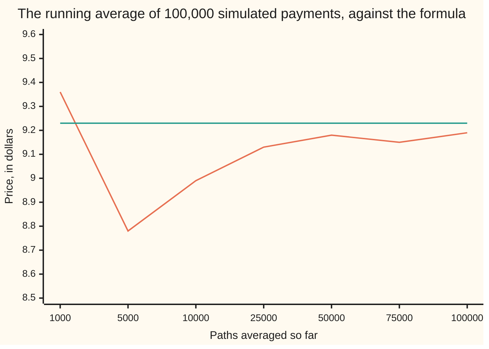
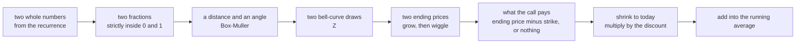

# Monte Carlo pricing: simulate the end, average the payoff, discount

Financial mathematics → Numerical Methods for Pricing → Pricing by sampling → Monte Carlo pricing

---

## General Overview

Acme shares trade at $100.00 today. A call option on one share, struck at $100.00 and expiring in a year, is the right to buy that share for $100.00 on expiry day. If Acme ends above the strike the right is worth the difference; if it ends below, the right is thrown away and pays nothing. Black and Scholes have a formula for what that right should cost, and it answers $9.23.

This card prices the same contract with no formula at all. Invent 100,000 futures for Acme, each ending at a price the model finds plausible. In each, read off what the call pays: the ending price minus the strike, or nothing. Shrink each payment back to today's dollars. Average the 100,000 numbers.

The run below answers $9.19, and does something a formula never does: it states how sure it is. One standard error — the typical distance between an average like this and the number it estimates — is $0.04. Two standard errors either side runs from $9.10 to $9.27, and the formula's $9.23 sits inside that band.

Why simulate, when a formula is available and exact? Because it is available for this contract and almost no other. Change the payoff to the average price over the year, or to nothing-if-it-ever-touched-a-lower-barrier, or to the best of four shares, and the calculus behind the formula stops working. Simulation never needed it: it plays each future out and reads the payment off whatever contract is written. The plain call is here only because its true price is known, which makes it a ruler for the method.

**Average what the contract pays across many invented futures, discount the average to today, and report the spread of that average alongside it.**

**What kind of fact this is:** a method — a way of computing a price that some other card defines, carrying a sampling error that is estimated, never removed.

### The picture: the estimate settling as the paths pile up



The wandering line is the running average of the discounted payments; the flat line is the formula's $9.23. At 1,000 paths the average is worth little: it says $9.36, and by 5,000 paths it has slid to $8.78. And it never quite lands on the flat line — at 100,000 paths it is still four cents below. The seven marks are the path counts the code prints, not an even scale: the first gap is 4,000 paths, the last is 25,000.

---

## The formula

Notation first, in words. A hat over a letter means the number was worked out from a sample rather than known exactly. A subscript says how big the sample was, so $\widehat{C}_n$ is the estimated price after $n$ futures. A superscript in brackets labels which future, so the ending price in the first future is written $S_T^{(1)}$.

$$\widehat{C}_n \;=\; \frac{1}{n}\sum_{i=1}^{n} e^{-rT}\max\!\left(S_T^{(i)} - K,\; 0\right)$$

**Read it aloud:** in each of $n$ invented futures, pay the option what it owes at expiry, shrink that payment back to today's money, and average the payments.

The invented ending price in one future is the geometric Brownian motion model evaluated once, at expiry, with one bell-curve draw ([geometric-brownian-motion-for-prices](../05-Black-Scholes%20from%20the%20Ground%20Up/01-geometric-brownian-motion-for-prices.md)):

$$S_T^{(i)} \;=\; S\,\exp\!\left(\left(r - q - \tfrac12\sigma^2\right)T + \sigma\sqrt{T}\,Z_i\right)$$

In words: today's price, grown at the pricing world's rate for a year, then shoved sideways by one draw's worth of wiggle.

| Symbol | Plain meaning | In our example | Push it up and the answer… |
| --- | --- | --- | --- |
| $S$ | Acme's price today | 100.00 | rises: every future ends higher |
| $K$ | the strike, the price the option may buy at | 100.00 | falls: fewer futures pay anything |
| $T$ | years until expiry | 1 | rises: more room to wander |
| $r$ | the riskless rate, continuously compounded | 5% | rises: the growth gains more than the heavier discount takes |
| $q$ | the dividend yield paid out to shareholders | 2% | falls: dividends leak out of the ending price |
| $e^{-rT}$ | the discount factor: what a dollar at expiry is worth today | 0.951229 | rises: every payment counts for more |
| $\sigma$ | volatility, how jumpy Acme is. Say "sigma". | 20% | rises: the big endings get bigger, and the small ones still pay nothing |
| $Z_i$ | one bell-curve draw per future, average 0, spread 1 | −1.314844 first | that future ends higher |
| $S_T$ | an invented ending price, one per future | 77.649216 first | — |
| $X_i$ | one future's payment, shrunk to today by $e^{-rT}$ | 0.000000 first | the average rises with it |
| $n$ | how many futures are drawn | 100000 | the estimate tightens; on average it does not move |
| $\widehat{C}_n$ | the estimate: the average of the $n$ payments | 9.187610 | — |
| $s_n$ | the spread of the payments across futures | 13.763943 | more paths are needed for the same tightness |
| $\widehat{\text{SE}}$ | the standard error: the typical gap between estimate and price | 0.043525 | the band widens |

Two helper formulas measure the error out of the same sample: the payments' spread, and the spread of their average.

$$s_n^2 = \frac{1}{n-1}\sum_{i=1}^{n}\left(X_i - \widehat{C}_n\right)^2, \qquad \widehat{\text{SE}} = \frac{s_n}{\sqrt{n}}$$

In words: see how far the payments scatter, then divide that scatter by the square root of how many were averaged. The second number, the **standard error**, is the typical gap between the estimate and the price it chases: 13.763943 over the root of 100000, which is 0.043525.

### When it holds

- **The draws come from the pricing world, not the real one.** The growth inside the exponent is $r - q$ less the volatility drag, never anybody's forecast. Feed the same code a 10% expected return and it answers 12.433725 for a contract worth 9.227006.
- **The draws are independent of each other.** Each future is drawn fresh. If the number generator repeats or leans, the average may still look fine while the error bar becomes fiction.
- **The payments have a finite spread.** The model guarantees one, and this sample measures it at 13.763943 dollars; the standard error formula needs that number to exist. Some heavy-tailed models produce payoffs with no finite spread, and then no honest error bar can be built this way.
- **The error bar covers sampling only.** It answers "how much would this number move if the futures were drawn again", and nothing else. A wrong volatility shifts the price by more than any number of paths can recover.
- **Enough draws for the band to mean anything.** The payments are a heap of zeros with a long right tail, so at 1,000 paths the band is wide and lopsided; by 100,000 the bell-curve band is dependable.

---

## Why it works

### Step 0: a price is an average, so it can be sampled

In this model the price is not a matter of opinion. It is a definite quantity: the average of the option's payoff across all possible endings, taken in the pretend world where every asset earns the bank rate in total, dividends included, then discounted to today. That is the pricing rule the whole wing rests on, and the Black–Scholes formula is what happens when a person does that average with calculus.

Anything that is an average can be estimated by drawing samples and averaging them. That is the whole idea here. Formula and simulation evaluate the same expression: one exact and available for one contract, one approximate and available for every contract.

### Step 1: one future needs one draw, not a whole path

The payoff looks at a single number, the price on expiry day. Nothing in between matters, so there is no need to walk the year day by day: the model jumps straight to expiry in one step, exactly and cheaply.

For Acme the exponent has two pieces. The predictable piece is 0.010000: the rate 5% minus the dividend yield 2% minus half the squared volatility, that last piece being the drag that wiggling costs. The random piece is 0.200000 times the draw — one wiggle unit, $\sigma\sqrt{T}$, per unit of draw. A draw of −1.314844 therefore ends Acme at 77.649216, where the option pays nothing.

### Step 2: whole numbers in, bell curve out

The draws have to come from somewhere, and nothing may be imported that already knows the answer. Two steps build them out of integer arithmetic. First, a recurrence grinds out whole numbers, each from the last:

$$a_{j+1} = \left(1664525\,a_j + 1013904223\right) \bmod 2^{32}, \qquad u_j = \frac{a_j + \tfrac12}{2^{32}}$$

Every number in that chain sits below $2^{32}$, and dividing by $2^{32}$ after nudging by a half turns it into a fraction strictly between 0 and 1 — strictly, because the next step takes a logarithm, and the logarithm of zero would stop the program. These fractions are spread evenly. Evenness is not the whole requirement: the next step treats two of them as unrelated, and a recurrence this short only imitates that. Two hundred thousand draws sit well inside where the imitation holds; a desk uses a longer-period generator.

Second, the Box–Muller transform bends two even fractions into two bell-curve draws. Read the first fraction as a distance from the centre, $\sqrt{-2\ln u}$, and the second as an angle, $2\pi v$. Step that far out in that direction: the two coordinates landed on are two independent bell-curve draws. It works because a pair of independent bell curves, seen in the plane, has a density depending only on distance from the origin, and that distance's law is exactly what the logarithm produces.



One pass handles two futures, which is why the code counts in pairs.

### Step 3: the average is right on average, and its error shrinks like the square root

Two facts do all the work, and both belong to averages in general rather than to finance ([monte-carlo-estimates-and-error](../../09-Probability%20and%20statistics/11-Simulation/04-monte-carlo-estimates-and-error.md)).

The first: each payment is a fair draw from the very quantity being averaged, so the average of $n$ of them leans neither high nor low. Extra paths do not correct a bias, because there is none to correct.

The second: averaging independent numbers shrinks their scatter. Add $n$ independent draws and the squared spread adds; divide by $n$ and the squared spread divides by $n^2$. Net effect, the average's spread is one payment's spread over the square root of $n$. Four times the paths, half the error; a hundred times the paths, a tenth.

That is the method's blessing and its curse, and the measured numbers obey it. The standard error falls from 0.435284 at 1,000 paths to 0.043525 at 100,000, a ratio of 10.001 where the law predicts exactly 10. From 25,000 to 100,000 the ratio is 1.994 against a predicted 2.

<details>
<summary>Detailed proof: no lean, and the square-root law</summary>

Each payment $X_i$ is a draw from one fixed law, whose average value is the true price by Step 0. Assume one payment's squared spread is finite.

**No lean.** The average value of a sum is the sum of the average values. Every payment has the true price as its average value, so the estimate — the payments added and divided by $n$ — has the true price as its average value too. This needs the draws to come from the right law; it does not need them to be independent.

**The square-root law.** For independent draws the squared spread of a sum is the sum of the squared spreads, so $n$ payments added have $n$ times one payment's squared spread. Dividing a quantity by $n$ divides its squared spread by $n$ twice over, leaving one payment's squared spread over $n$. Take square roots: the estimate's spread is one payment's spread divided by the root of $n$. Independence is essential in this step, and it is exactly what the number generator is asked to imitate.

**Measuring that spread from the same sample.** The sample spread $s_n^2$ divides by $n-1$ rather than $n$ because the payments are measured against their own average rather than against the unknown true price, and that shrinks their apparent scatter by exactly one draw's worth. With the correction, $s_n^2$ has one payment's true squared spread as its average value.

**Why a band at all.** A sum of many independent draws with finite spread follows a bell curve ever more closely as the count grows, whatever shape one draw has. So for large $n$ the estimate lands within two standard errors of the true price about 95 times in 100. That is a claim about the procedure repeated, not a guarantee about one run: the band printed below either holds 9.227006 or it does not, and this one does.

</details>

### Step 4: the same sample measures its own error

Nothing outside the run is needed to size the error. The payments scatter with spread 13.763943; divide by the root of the count for a standard error of 0.043525; two of those either side of 9.187610 gives the band 9.100559 to 9.274661. The formula's 9.227006 lies inside it, less than one standard error from the estimate.

That self-measuring habit is why a simulated price is quoted as a band. A formula off by four cents is broken. A simulation off by four cents with a four-cent standard error is working as advertised.

### The other doors

The same average can be reached without sampling. Slicing the bell curve finely and adding up payment times height — Simpson's rule, road 3 in the code — gives 9.227006, matching the formula to six decimals. That trick dies as soon as the payoff depends on more than one or two random inputs, which is where simulation takes over.

Two further doors get their own cards on this shelf: stepping the pricing equation across a grid of prices and dates ([finite-differences-for-the-black-scholes-equation](07-finite-differences-for-the-black-scholes-equation.md)) and inverting a transform ([carr-madan-fft-and-cos-methods](09-carr-madan-fft-and-cos-methods.md)). The grid and the transform reach 9.227 too, as the slices do; simulation only brackets it, inside its band. Four roads to one price is how the shelf keeps itself honest.

---

## Worked numbers, by hand

The first two futures, arithmetic and all, then the answer from 100,000.

| Step | Arithmetic | Value |
| --- | --- | --- |
| the pricing world's growth | $0.05 - 0.02 - \tfrac12 \times 0.20^2$ | 0.010000 |
| one wiggle unit | $0.20 \times \sqrt{1}$ | 0.200000 |
| first draw, out of the recurrence | Box–Muller on two fractions | −1.314844 |
| first ending price | $100 \times e^{0.010000 + 0.200000 \times (-1.314844)}$ | 77.649216 |
| what the call pays there | $\max(77.649216 - 100,\ 0)$ | 0.000000 |
| second draw, same pair | the sine instead of the cosine | 0.302461 |
| second ending price | $100 \times e^{0.010000 + 0.200000 \times 0.302461}$ | 107.303627 |
| what the call pays there | $\max(107.303627 - 100,\ 0)$ | 7.303627 |
| that payment, shrunk to today | $0.951229 \times 7.303627$ | 6.947425 |
| average of the first four payments | $(0 + 6.947425 + 34.783815 + 16.694662) / 4$ | 14.606476 |
| average of all 100,000 payments | the same arithmetic, 100,000 times | **9.187610** |
| its standard error | $13.763943 / \sqrt{100000}$ | **0.043525** |

Four futures average more than $14, which is nonsense as a price: one lucky ending above $136 is carrying it. A hundred thousand futures average $9.19, give or take four cents, and that is a price.

### The error bar, one path count at a time

```
one █ = $0.01 of standard error
  1,000 paths  ████████████████████████████████████████████  $0.44
 10,000 paths  █████████████                                 $0.13
 25,000 paths  █████████                                     $0.09
100,000 paths  ████                                          $0.04
```

A hundredfold in paths, from 1,000 to 100,000, shrank the error by 10.001. Four times the paths, from 25,000 to 100,000, shrank it by 1.994. Read the bars as the price of accuracy: the second bar to the fourth cost ninety thousand extra futures.

### What breaks if you drop a piece

Same Acme call, right answer 9.227006. The first three mistakes run through the same 100,000 draws; the last needs no draws, because averaging the endings first replaces them with the forward.

| Mistake | Comes out at | What went wrong |
| --- | --- | --- |
| Simulating a 10% real-world return instead of $r - q$ | 12.433725 | A price is an average in the pricing world. Simulating a forecast prices the forecast. |
| Dropping the $-\tfrac12\sigma^2$ drag from the growth | 10.410803 | Wiggling costs money; without the drag the average ending price overshoots the forward. |
| Forgetting the discount $e^{-rT}$ | 9.658669 | Payments arrive in a year and were counted as today's dollars. |
| Averaging the futures first, then paying once | 2.896925 | That prices a forward's intrinsic value, not an option. The option's upside lives in the spread that averaging destroyed. |

The last row is the deepest.

---

## Code, from first principles, and it actually runs

Nothing is imported that already knows the answer. The even fractions come from the recurrence above, the draws from Box–Muller, and the bell-curve area and the reference integral from Simpson's rule written out in the file. The price is reached **three independent ways**: 100,000 simulated futures, the closed formula over the hand-built bell-curve area, and the same average by fine slices. A fourth check points the sampler at a quantity the market already prices — the average discounted ending price must land near $S e^{-qT}$, which is 98.019867 — and the square-root law is measured on prefixes of the same draws.

### Python

```python
# Monte Carlo pricing -- the check behind the card.  Standard library only.
# Nothing is imported that already knows the answer: the uniform numbers come
# from the recurrence printed on the card, the normals from Box-Muller, and the
# bell-curve area and the reference integral from Simpson's rule written out.
from math import cos, exp, log, pi, sin, sqrt

S, K, R, Q, SIG, T = 100.0, 100.0, 0.05, 0.02, 0.20, 1.0   # the house market
SEED, PATHS = 20260914, 100000
MARKS = (1000, 5000, 10000, 25000, 50000, 75000, 100000)   # where the chart reads
PREFIX = (1000, 10000, 25000, 100000)                      # where the table reads
EXACT = 9.227005508154                 # the formula's price, from the call card
MOD = 1 << 32

def uniform(state):                    # one step of the recurrence, whole numbers
    state = (1664525 * state + 1013904223) % MOD
    return state, (state + 0.5) / MOD                   # lands strictly inside 0, 1

def normal_pair(state):                # Box-Muller: two uniforms -> two normals
    state, u = uniform(state)
    state, v = uniform(state)
    radius, angle = sqrt(-2.0 * log(u)), 2.0 * pi * v
    return state, radius * cos(angle), radius * sin(angle)

def simpson(f, a, b, n):               # the integrator, written out here
    h = (b - a) / n
    total = f(a) + f(b)
    for i in range(1, n):
        total += (4.0 if i % 2 else 2.0) * f(a + i * h)
    return total * h / 3.0

def phi(x):                            # bell-curve height at x
    return exp(-0.5 * x * x) / sqrt(2.0 * pi)

def n_cdf(x):                          # bell-curve area to the left of x
    if x < -12.0:
        return 0.0
    if x > 12.0:
        return 1.0
    return 0.5 + simpson(phi, 0.0, x, 4000)

def call_formula(s, k, r, q, sig, t):  # road 2: the closed form, own CDF
    vt = sig * sqrt(t)
    d1 = (log(s / k) + (r - q + 0.5 * sig * sig) * t) / vt
    return s * exp(-q * t) * n_cdf(d1) - k * exp(-r * t) * n_cdf(d1 - vt)

def payoff_integral(s, k, r, q, sig, t):   # road 3: the same average, by slices
    drift = (r - q - 0.5 * sig * sig) * t
    def f(z):
        return max(s * exp(drift + sig * sqrt(t) * z) - k, 0.0) * phi(z)
    return exp(-r * t) * simpson(f, -10.0, 10.0, 40000)

def run(drift, disc, paths, marks=()):     # road 1: the simulation
    state, n, mean, m2, stock = SEED, 0, 0.0, 0.0, 0.0
    marked = []
    while n < paths:
        state, z1, z2 = normal_pair(state)
        for z in (z1, z2):
            st = S * exp(drift + SIG * sqrt(T) * z)     # one simulated ending price
            pay = disc * max(st - K, 0.0)               # its discounted payoff
            stock += disc * st
            n += 1
            delta = pay - mean                          # running mean and spread
            mean += delta / n
            m2 += delta * (pay - mean)
            if n in marks:
                sd = sqrt(m2 / (n - 1))
                marked.append((n, mean, sd, sd / sqrt(n)))
    return mean, stock / n, marked

disc = exp(-R * T)
drift = (R - Q - 0.5 * SIG * SIG) * T
mc, stock_mean, marked = run(drift, disc, PATHS, MARKS)
table = {n: (m, sd, se) for n, m, sd, se in marked}
se_end = table[PATHS][2]
formula = call_formula(S, K, R, Q, SIG, T)
integral = payoff_integral(S, K, R, Q, SIG, T)
wrong_real = run((0.10 - Q - 0.5 * SIG * SIG) * T, disc, PATHS)[0]
wrong_drag = run((R - Q) * T, disc, PATHS)[0]
wrong_disc = run(drift, 1.0, PATHS)[0]
wrong_one = disc * max(S * exp((R - Q) * T) - K, 0.0)

print(f"Acme: S = {S:.2f}  K = {K:.2f}  r = {R * 100:.0f}%  q = {Q * 100:.0f}%  "
      f"sigma = {SIG * 100:.0f}%  T = {T:.0f} year")
print(f"{PATHS} draws from seed {SEED}, in Box-Muller pairs from the printed recurrence")
print()
state, shown, first_mean = SEED, [], 0.0         # the first four draws, one by one
while len(shown) < 4:
    state, za, zb = normal_pair(state)
    for z in (za, zb):
        st = S * exp(drift + SIG * sqrt(T) * z)
        pay = disc * max(st - K, 0.0)
        first_mean += (pay - first_mean) / (len(shown) + 1)
        shown.append((z, st, max(st - K, 0.0), pay, first_mean))
print("  draw           z   ending price       payoff    discounted   running mean")
for i, (z, st, raw, pay, avg) in enumerate(shown):
    print(f"{i + 1:>6}  {z:>10.6f}  {st:>13.6f}  {raw:>11.6f}  {pay:>12.6f}  {avg:>12.6f}")
print(f"one year's discount factor e^-rT                    {disc:>12.6f}")
print(f"pretend-world drift (r - q - sigma^2/2)T            {drift:>12.6f}")
print(f"one wiggle unit sigma sqrt(T)                       {SIG * sqrt(T):>12.6f}")
print()
print(f"road 1  simulation, {PATHS} paths                  {mc:>12.6f}")
print(f"road 2  closed form, own bell-curve area          {formula:>12.6f}")
print(f"road 3  the same average by Simpson slices        {integral:>12.6f}")
print(f"sampler check  average of e^-rT S_T              {stock_mean:>13.6f}")
print(f"               the market's S e^-qT              {S * exp(-Q * T):>13.6f}")
print()
print("  paths     estimate    payoff sd    std error   two-SE low  two-SE high   gap to road 2")
for n in PREFIX:
    m, sd, se = table[n]
    print(f"{n:>7}  {m:>11.6f}  {sd:>11.6f}  {se:>11.6f}  {m - 2 * se:>11.6f}  "
          f"{m + 2 * se:>11.6f}  {m - formula:>13.6f}")
print()
print(f"root-n law, same draws:  SE(1000) / SE(100000) = {table[1000][2] / se_end:>6.3f}   (theory 10.000)")
print(f"                        SE(25000) / SE(100000) = {table[25000][2] / se_end:>6.3f}   (theory  2.000)")
print()
print("what breaks")
print(f"  a 10% real-world drift in place of r - q                   {wrong_real:>12.6f}")
print(f"  drift without the -sigma^2/2 drag                         {wrong_drag:>12.6f}")
print(f"  no discount factor e^-rT                                  {wrong_disc:>12.6f}")
print(f"  payoff of the average ending, not average of payoffs      {wrong_one:>12.6f}")
print()
print("bar, standard error in dollars at " + ", ".join(str(n) for n in PREFIX)
      + " paths: " + "  ".join(f"{table[n][2]:.2f}" for n in PREFIX))
print("chart, paths             " + " ".join(f"{n:>7}" for n in MARKS))
print("chart, running estimate  " + " ".join(f"{table[n][0]:>7.2f}" for n in MARKS))
print("chart, road 2 price      " + " ".join(f"{formula:>7.2f}" for _ in MARKS))

assert abs(formula - EXACT) < 1e-9, "closed form vs the call card's price"
assert abs(integral - EXACT) < 1e-7, "Simpson average vs the call card's price"
assert abs(mc - formula) < 3.0 * se_end, "simulation within three standard errors"
assert abs(stock_mean - S * exp(-Q * T)) < 0.5, "the sampler drifts as the pretend world does"
assert 1.7 < table[25000][2] / se_end < 2.3, "four times the paths, half the error"
assert abs(wrong_one - 2.896925) < 1e-6, "one average future prices the forward, not the option"
assert wrong_real > wrong_drag > mc, "each broken drift lifts the estimate"
print("ALL CHECKS PASS")
```

**Ran 2026-09-19 on macOS, Python 3.14.6, standard library only. All checks passed. Output, pasted from the run:**

```
Acme: S = 100.00  K = 100.00  r = 5%  q = 2%  sigma = 20%  T = 1 year
100000 draws from seed 20260914, in Box-Muller pairs from the printed recurrence

  draw           z   ending price       payoff    discounted   running mean
     1   -1.314844      77.649216     0.000000      0.000000      0.000000
     2    0.302461     107.303627     7.303627      6.947425      3.473713
     3    1.508234     136.567219    36.567219     34.783815     13.910413
     4    0.758494     117.550616    17.550616     16.694662     14.606476
one year's discount factor e^-rT                        0.951229
pretend-world drift (r - q - sigma^2/2)T                0.010000
one wiggle unit sigma sqrt(T)                           0.200000

road 1  simulation, 100000 paths                      9.187610
road 2  closed form, own bell-curve area              9.227006
road 3  the same average by Simpson slices            9.227006
sampler check  average of e^-rT S_T                  97.974622
               the market's S e^-qT                  98.019867

  paths     estimate    payoff sd    std error   two-SE low  two-SE high   gap to road 2
   1000     9.362522    13.764891     0.435284     8.491954    10.233090       0.135517
  10000     8.988548    13.481879     0.134819     8.718911     9.258186      -0.238457
  25000     9.132535    13.723071     0.086792     8.958951     9.306120      -0.094470
 100000     9.187610    13.763943     0.043525     9.100559     9.274661      -0.039395

root-n law, same draws:  SE(1000) / SE(100000) = 10.001   (theory 10.000)
                        SE(25000) / SE(100000) =  1.994   (theory  2.000)

what breaks
  a 10% real-world drift in place of r - q                      12.433725
  drift without the -sigma^2/2 drag                            10.410803
  no discount factor e^-rT                                      9.658669
  payoff of the average ending, not average of payoffs          2.896925

bar, standard error in dollars at 1000, 10000, 25000, 100000 paths: 0.44  0.13  0.09  0.04
chart, paths                1000    5000   10000   25000   50000   75000  100000
chart, running estimate     9.36    8.78    8.99    9.13    9.18    9.15    9.19
chart, road 2 price         9.23    9.23    9.23    9.23    9.23    9.23    9.23
ALL CHECKS PASS
```

### Rust

Same recurrence, same draws, same labels, built with `rustc --edition 2021 -O`. Both programs build the bell-curve area the same way, by Simpson's rule, so nothing is borrowed from a library in either language.

```rust
// Monte Carlo pricing -- the same check as the Python, in Rust.  No crates.
// The uniform numbers come from the recurrence printed on the card, the normals
// from Box-Muller, and the bell-curve area and the reference integral from
// Simpson's rule written out here.  Nothing already knows the answer.
use std::f64::consts::PI;

const S: f64 = 100.0;                                      // the house market
const K: f64 = 100.0;
const R: f64 = 0.05;
const Q: f64 = 0.02;
const SIG: f64 = 0.20;
const T: f64 = 1.0;
const SEED: u64 = 20260914;
const PATHS: usize = 100000;
const MARKS: [usize; 7] = [1000, 5000, 10000, 25000, 50000, 75000, 100000];
const PREFIX: [usize; 4] = [1000, 10000, 25000, 100000];
const EXACT: f64 = 9.227005508154;     // the formula's price, from the call card
const MOD: u64 = 1 << 32;

fn uniform(state: &mut u64) -> f64 {   // one step of the recurrence, whole numbers
    *state = (1664525 * *state + 1013904223) % MOD;
    (*state as f64 + 0.5) / MOD as f64                  // lands strictly inside 0, 1
}

fn normal_pair(state: &mut u64) -> (f64, f64) {   // two uniforms -> two normals
    let u = uniform(state);
    let v = uniform(state);
    let (radius, angle) = ((-2.0 * u.ln()).sqrt(), 2.0 * PI * v);
    (radius * angle.cos(), radius * angle.sin())
}

fn simpson<F: Fn(f64) -> f64>(f: F, a: f64, b: f64, n: usize) -> f64 {
    let h = (b - a) / n as f64;                   // the integrator, written out here
    let mut total = f(a) + f(b);
    for i in 1..n {
        total += (if i % 2 == 1 { 4.0 } else { 2.0 }) * f(a + i as f64 * h);
    }
    total * h / 3.0
}

fn phi(x: f64) -> f64 {                // bell-curve height at x
    (-0.5 * x * x).exp() / (2.0 * PI).sqrt()
}

fn n_cdf(x: f64) -> f64 {              // bell-curve area to the left of x
    if x < -12.0 { 0.0 } else if x > 12.0 { 1.0 } else { 0.5 + simpson(phi, 0.0, x, 4000) }
}

fn call_formula(s: f64, k: f64, r: f64, q: f64, sig: f64, t: f64) -> f64 {
    let vt = sig * t.sqrt();                      // road 2: the closed form, own CDF
    let d1 = ((s / k).ln() + (r - q + 0.5 * sig * sig) * t) / vt;
    s * (-q * t).exp() * n_cdf(d1) - k * (-r * t).exp() * n_cdf(d1 - vt)
}

fn payoff_integral(s: f64, k: f64, r: f64, q: f64, sig: f64, t: f64) -> f64 {
    let drift = (r - q - 0.5 * sig * sig) * t;    // road 3: the same average, by slices
    let f = |z: f64| (s * (drift + sig * t.sqrt() * z).exp() - k).max(0.0) * phi(z);
    (-r * t).exp() * simpson(f, -10.0, 10.0, 40000)
}

type Marked = Vec<(usize, f64, f64, f64)>;

fn run(drift: f64, disc: f64, paths: usize, marks: &[usize]) -> (f64, f64, Marked) {
    let (mut state, mut n, mut mean, mut m2, mut stock) = (SEED, 0usize, 0.0, 0.0, 0.0);
    let mut marked: Marked = Vec::new();          // road 1: the simulation
    while n < paths {
        let (z1, z2) = normal_pair(&mut state);
        for z in [z1, z2] {
            let st = S * (drift + SIG * T.sqrt() * z).exp();   // one simulated ending
            let pay = disc * (st - K).max(0.0);                // its discounted payoff
            stock += disc * st;
            n += 1;
            let delta = pay - mean;                            // running mean and spread
            mean += delta / n as f64;
            m2 += delta * (pay - mean);
            if marks.contains(&n) {
                let sd = (m2 / (n - 1) as f64).sqrt();
                marked.push((n, mean, sd, sd / (n as f64).sqrt()));
            }
        }
    }
    (mean, stock / n as f64, marked)
}

fn main() {
    let disc = (-R * T).exp();
    let drift = (R - Q - 0.5 * SIG * SIG) * T;
    let (mc, stock_mean, marked) = run(drift, disc, PATHS, &MARKS);
    let at = |want: usize| -> (f64, f64, f64) {
        let row = marked.iter().find(|r| r.0 == want).unwrap();
        (row.1, row.2, row.3)
    };
    let se_end = at(PATHS).2;
    let formula = call_formula(S, K, R, Q, SIG, T);
    let integral = payoff_integral(S, K, R, Q, SIG, T);
    let wrong_real = run((0.10 - Q - 0.5 * SIG * SIG) * T, disc, PATHS, &[]).0;
    let wrong_drag = run((R - Q) * T, disc, PATHS, &[]).0;
    let wrong_disc = run(drift, 1.0, PATHS, &[]).0;
    let wrong_one = disc * (S * ((R - Q) * T).exp() - K).max(0.0);

    println!("Acme: S = {:.2}  K = {:.2}  r = {:.0}%  q = {:.0}%  sigma = {:.0}%  T = {:.0} year",
             S, K, R * 100.0, Q * 100.0, SIG * 100.0, T);
    println!("{} draws from seed {}, in Box-Muller pairs from the printed recurrence", PATHS, SEED);
    println!();
    let (mut state, mut shown, mut first_mean) = (SEED, Vec::new(), 0.0);
    while shown.len() < 4 {                      // the first four draws, one by one
        let (za, zb) = normal_pair(&mut state);
        for z in [za, zb] {
            let st = S * (drift + SIG * T.sqrt() * z).exp();
            let pay = disc * (st - K).max(0.0);
            first_mean += (pay - first_mean) / (shown.len() + 1) as f64;
            shown.push((z, st, (st - K).max(0.0), pay, first_mean));
        }
    }
    println!("  draw           z   ending price       payoff    discounted   running mean");
    for (i, (z, st, raw, pay, avg)) in shown.iter().enumerate() {
        println!("{:>6}  {:>10.6}  {:>13.6}  {:>11.6}  {:>12.6}  {:>12.6}", i + 1, z, st, raw, pay, avg);
    }
    println!("one year's discount factor e^-rT                    {:>12.6}", disc);
    println!("pretend-world drift (r - q - sigma^2/2)T            {:>12.6}", drift);
    println!("one wiggle unit sigma sqrt(T)                       {:>12.6}", SIG * T.sqrt());
    println!();
    println!("road 1  simulation, {} paths                  {:>12.6}", PATHS, mc);
    println!("road 2  closed form, own bell-curve area          {:>12.6}", formula);
    println!("road 3  the same average by Simpson slices        {:>12.6}", integral);
    println!("sampler check  average of e^-rT S_T              {:>13.6}", stock_mean);
    println!("               the market's S e^-qT              {:>13.6}", S * (-Q * T).exp());
    println!();
    println!("  paths     estimate    payoff sd    std error   two-SE low  two-SE high   gap to road 2");
    for n in PREFIX {
        let (m, sd, se) = at(n);
        println!("{:>7}  {:>11.6}  {:>11.6}  {:>11.6}  {:>11.6}  {:>11.6}  {:>13.6}",
                 n, m, sd, se, m - 2.0 * se, m + 2.0 * se, m - formula);
    }
    println!();
    println!("root-n law, same draws:  SE(1000) / SE(100000) = {:>6.3}   (theory 10.000)", at(1000).2 / se_end);
    println!("                        SE(25000) / SE(100000) = {:>6.3}   (theory  2.000)", at(25000).2 / se_end);
    println!();
    println!("what breaks");
    println!("  a 10% real-world drift in place of r - q                   {:>12.6}", wrong_real);
    println!("  drift without the -sigma^2/2 drag                         {:>12.6}", wrong_drag);
    println!("  no discount factor e^-rT                                  {:>12.6}", wrong_disc);
    println!("  payoff of the average ending, not average of payoffs      {:>12.6}", wrong_one);
    println!();
    let counts: Vec<String> = PREFIX.iter().map(|n| n.to_string()).collect();
    let bars: Vec<String> = PREFIX.iter().map(|&n| format!("{:.2}", at(n).2)).collect();
    println!("bar, standard error in dollars at {} paths: {}", counts.join(", "), bars.join("  "));
    let paths_row: Vec<String> = MARKS.iter().map(|n| format!("{:>7}", n)).collect();
    let est_row: Vec<String> = MARKS.iter().map(|&n| format!("{:>7.2}", at(n).0)).collect();
    let ref_row: Vec<String> = MARKS.iter().map(|_| format!("{:>7.2}", formula)).collect();
    println!("chart, paths             {}", paths_row.join(" "));
    println!("chart, running estimate  {}", est_row.join(" "));
    println!("chart, road 2 price      {}", ref_row.join(" "));

    assert!((formula - EXACT).abs() < 1e-9, "closed form vs the call card's price");
    assert!((integral - EXACT).abs() < 1e-7, "Simpson average vs the call card's price");
    assert!((mc - formula).abs() < 3.0 * se_end, "simulation within three standard errors");
    assert!((stock_mean - S * (-Q * T).exp()).abs() < 0.5, "the sampler drifts as the pretend world does");
    assert!(at(25000).2 / se_end > 1.7 && at(25000).2 / se_end < 2.3, "four times the paths, half the error");
    assert!((wrong_one - 2.896925).abs() < 1e-6, "one average future prices the forward, not the option");
    assert!(wrong_real > wrong_drag && wrong_drag > mc, "each broken drift lifts the estimate");
    println!("ALL CHECKS PASS");
}
```

**Ran 2026-09-19 on macOS, rustc 1.98.1, no crates. All checks passed. Output, pasted from the run:**

```
Acme: S = 100.00  K = 100.00  r = 5%  q = 2%  sigma = 20%  T = 1 year
100000 draws from seed 20260914, in Box-Muller pairs from the printed recurrence

  draw           z   ending price       payoff    discounted   running mean
     1   -1.314844      77.649216     0.000000      0.000000      0.000000
     2    0.302461     107.303627     7.303627      6.947425      3.473713
     3    1.508234     136.567219    36.567219     34.783815     13.910413
     4    0.758494     117.550616    17.550616     16.694662     14.606476
one year's discount factor e^-rT                        0.951229
pretend-world drift (r - q - sigma^2/2)T                0.010000
one wiggle unit sigma sqrt(T)                           0.200000

road 1  simulation, 100000 paths                      9.187610
road 2  closed form, own bell-curve area              9.227006
road 3  the same average by Simpson slices            9.227006
sampler check  average of e^-rT S_T                  97.974622
               the market's S e^-qT                  98.019867

  paths     estimate    payoff sd    std error   two-SE low  two-SE high   gap to road 2
   1000     9.362522    13.764891     0.435284     8.491954    10.233090       0.135517
  10000     8.988548    13.481879     0.134819     8.718911     9.258186      -0.238457
  25000     9.132535    13.723071     0.086792     8.958951     9.306120      -0.094470
 100000     9.187610    13.763943     0.043525     9.100559     9.274661      -0.039395

root-n law, same draws:  SE(1000) / SE(100000) = 10.001   (theory 10.000)
                        SE(25000) / SE(100000) =  1.994   (theory  2.000)

what breaks
  a 10% real-world drift in place of r - q                      12.433725
  drift without the -sigma^2/2 drag                            10.410803
  no discount factor e^-rT                                      9.658669
  payoff of the average ending, not average of payoffs          2.896925

bar, standard error in dollars at 1000, 10000, 25000, 100000 paths: 0.44  0.13  0.09  0.04
chart, paths                1000    5000   10000   25000   50000   75000  100000
chart, running estimate     9.36    8.78    8.99    9.13    9.18    9.15    9.19
chart, road 2 price         9.23    9.23    9.23    9.23    9.23    9.23    9.23
ALL CHECKS PASS
```

The two outputs agree line for line, to every printed digit. They have to: the draws come from integer arithmetic both languages do exactly. A simulation that cannot be reproduced digit for digit cannot be audited, which is why the seed and the recurrence are printed rather than hidden.

> [!TIP]
> **Try changing**
> Guess the direction first, then run it. The asserts are pinned to this run's numbers, so expect some of these to stop the program.
> - **Change the seed.** Set `SEED` to another whole number. The estimate moves a few cents either way and the standard error barely budges: the error bar belongs to the payoff and the path count, not to the particular draws.
> - **Four times the paths.** Set `PATHS` to `400000` and add `400000` to `MARKS` and `PREFIX`. The standard error halves: four times the work for twice the accuracy, the whole bargain. The fifth assert then stops the run, since it is pinned to the gap between 25,000 paths and the end.
> - **Break the drift.** Replace `drift` with `(R - Q) * T`, dropping the volatility drag. The estimate climbs to **10.410803**, more than a dollar above the formula, and the third assert stops the run: no error bar that size can explain a gap that big.
> - **Starve the reference.** Change `40000` to `40` in `payoff_integral`. Road 3 drifts off in the second decimal and the second assert stops the run: forty slices cannot describe a kinked payoff.

---

## The usual mistake

> [!warning]
> **Reading the simulated number as the price.** It estimates the price, and it arrives with a measured error. This run says 9.187610 with a standard error of 0.043525; the true answer is 9.227006. Quote it without its band and the four-cent gap looks like a bug rather than the ordinary noise of a hundred thousand draws.
>
> - **Simulating the real world.** The drift must be the pricing world's $r - q$ less the drag, never a return forecast. A 10% drift turns 9.227006 into 12.433725, and the number still looks like a price.
> - **More paths to fix a bias.** Paths cure noise, not error. If the drift, the discount or the payoff is wrong, a billion paths converge beautifully on the wrong answer. The first three "what breaks" numbers are averages of 100,000 clean draws.
> - **Averaging the futures instead of the payoffs.** Collapse the endings to their average first and the option's whole value disappears: 2.896925 instead of 9.227006. The upside lives in the spread, and averaging kills the spread.
> - **Trusting a band built on too few paths.** At 1,000 paths this code reported 9.362522 with a band from 8.491954 to 10.233090: wide, lopsided and honest. Narrow bands come from paths, or from the next card's tricks, never from wishing.

---

## Where you meet it in real life

- **Exotic desks.** Any payoff that watches a path, or several shares at once, is priced this way: averages ([arithmetic-asian-option](../27-Averages%20-%20commodity%20swaps%20and%20Asian%20options/03-arithmetic-asian-option.md)), barriers ([knock-out-and-knock-in-options](../16-Barriers%2C%20touches%20and%20lookbacks/01-knock-out-and-knock-in-options.md)), baskets.
- **Risk reporting.** The same machinery under real-world growth gives value-at-risk numbers; kept in the pricing world it gives the exposure profiles a bank owes its regulator ([expected-exposure-profiles](../46-Counterparty%20Risk%20and%20CVA/02-expected-exposure-profiles.md)).
- **Model validation.** A new closed-form price is checked by simulating the same contract and seeing whether the formula lands inside the band. When it does not, one of the two is wrong.
- **Anything with many dimensions.** The square-root law ignores whether a problem has one random input or five hundred, which is why simulation wins where slicing and grids collapse (monte-carlo-integration-in-many-dimensions).
- **Overnight batches.** A desk's whole book of exotics is repriced while nobody watches, because this method's cost is processor hours, and those are cheapest at 3am.

> **Say it back**
> In this model a price is an average of discounted payoffs across all possible endings. Monte Carlo estimates that average by inventing endings: draw a bell-curve number, grow today's price at the pricing world's rate, wiggle it, read off what the contract pays, discount, average. The average leans neither high nor low, and the payments' scatter divided by the root of the count says how far off it is likely to be. For the Acme call, 100,000 futures give 9.187610 with a standard error of 0.043525, and the formula's 9.227006 sits inside the band. Four times the paths halve the error: that is why the method is slow, and why it is used anyway when no formula exists.

---

## What this builds on

- [geometric-brownian-motion-for-prices](../05-Black-Scholes%20from%20the%20Ground%20Up/01-geometric-brownian-motion-for-prices.md): the model of a wiggling share price, and the one-step formula for its ending value that every future on this card is drawn from.
- [monte-carlo-estimates-and-error](../../09-Probability%20and%20statistics/11-Simulation/04-monte-carlo-estimates-and-error.md): why a sample average leans neither way, and where the standard error and the square-root law come from.

## Where this goes next

- [variance-reduction-for-pricing](02-variance-reduction-for-pricing.md): the same accuracy from far fewer paths.
- [correlated-paths-and-cholesky](04-correlated-paths-and-cholesky.md): several shares drawn at once, correlated as the model demands.
- [discretisation-schemes-for-sdes](05-discretisation-schemes-for-sdes.md): when the whole path is needed and the single jump is unavailable.
- [bump-and-revalue-and-common-random-numbers](../07-Greeks%20by%20Numbers%20and%20Calibration/01-bump-and-revalue-and-common-random-numbers.md): sensitivities by simulation, where reusing draws makes small differences readable.
- [cash-or-nothing-digital](../10-Digitals%20and%20the%20implied%20density/01-cash-or-nothing-digital.md): an all-or-nothing payoff, and what it does to the spread.
- [pricing-under-local-volatility-and-the-forward-smile](../13-Local%20volatility%20and%20jumps/03-pricing-under-local-volatility-and-the-forward-smile.md): jumpiness that depends on the price and the date.
- [merton-jump-diffusion](../13-Local%20volatility%20and%20jumps/04-merton-jump-diffusion.md): endings that jump as well as wiggle.
- [heston-model](../14-Stochastic%20volatility%20-%20Heston%2C%20SABR%20and%20their%20mix/01-heston-model.md): volatility with a life of its own, two draws a step.
- [stochastic-local-volatility](../14-Stochastic%20volatility%20-%20Heston%2C%20SABR%20and%20their%20mix/06-stochastic-local-volatility.md): both at once, priced by paths because nothing else copes.
- [knock-out-and-knock-in-options](../16-Barriers%2C%20touches%20and%20lookbacks/01-knock-out-and-knock-in-options.md): payoffs that watch for a level, so the path must be walked.
- [discrete-monitoring-correction](../16-Barriers%2C%20touches%20and%20lookbacks/03-discrete-monitoring-correction.md): what changes when the level is checked only at the close.
- [lookback-options](../16-Barriers%2C%20touches%20and%20lookbacks/06-lookback-options.md): payoffs on the best price a path reached.
- [geometric-asian-kemna-vorst](../17-Averages%2C%20choosers%2C%20compounds%20and%20forward-starts/01-geometric-asian-kemna-vorst.md): the average-price option that does have a formula, so a ruler.
- [chooser-options](../17-Averages%2C%20choosers%2C%20compounds%20and%20forward-starts/04-chooser-options.md): one decision taken partway through, on the same draws.
- [cliquets-and-ratchets](../17-Averages%2C%20choosers%2C%20compounds%20and%20forward-starts/07-cliquets-and-ratchets.md): payoffs stacked period by period along one path.
- [barrier-options-by-reflection](../23-FX%20exotics%20as%20desks%20use%20them%20-%20digitals%2C%20touches%20and%20barriers/02-barrier-options-by-reflection.md): closed forms to measure a simulated barrier price against.
- [margrabe-and-kirk-spread-options](../26-Options%20on%20commodity%20futures%20and%20spreads/04-margrabe-and-kirk-spread-options.md): two assets and the difference between them.
- [arithmetic-asian-option](../27-Averages%20-%20commodity%20swaps%20and%20Asian%20options/03-arithmetic-asian-option.md): the average with no formula at all, simulation's own case.
- [simulating-a-default-time](../41-Default%2C%20Survival%20and%20the%20Hazard%20Rate/05-simulating-a-default-time.md): the same machinery pointed at when a borrower fails.
- [black-cox-first-passage-default](../43-Structural%20Models%20-%20Default%20from%20the%20Balance%20Sheet/05-black-cox-first-passage-default.md): default as a barrier touched by a simulated path.
- [expected-exposure-profiles](../46-Counterparty%20Risk%20and%20CVA/02-expected-exposure-profiles.md): what a counterparty might owe, path by path and date by date.
- monte-carlo-integration-in-many-dimensions: why the square-root law ignores the count of dimensions.
- reproducible-simulation-and-seeds: keeping a run repeatable, and what a seed does not prove.

A four-cent error bar cost a hundred thousand futures, and the square-root law prices a one-cent bar at sixteen times as many; the next card shrinks the bar without paying that bill, by making each draw carry more information ([variance-reduction-for-pricing](02-variance-reduction-for-pricing.md)).

---

## Sources

Verified 19 Sep 2026: every link below resolves to the publisher's page.

- Boyle, Phelim P. "Options: A Monte Carlo Approach." *Journal of Financial Economics* 4, no. 3 (1977): 323–338. [doi:10.1016/0304-405X(77)90005-8](https://doi.org/10.1016/0304-405X(77)90005-8). The paper that first priced options by simulation, including the standard-error argument used here.
- Glasserman, Paul. *Monte Carlo Methods in Financial Engineering*. Springer, 2003. [Publisher page](https://link.springer.com/book/10.1007/978-0-387-21617-1). Chapter 1 sets out the estimator and its error; Section 2.1 covers recurrences like the one on this card, and Section 3.2 the single jump to expiry.
- Box, G. E. P., and Mervin E. Muller. "A Note on the Generation of Random Normal Deviates." *Annals of Mathematical Statistics* 29, no. 2 (1958): 610–611. [doi:10.1214/aoms/1177706645](https://doi.org/10.1214/aoms/1177706645). Two even fractions into two bell-curve draws, in two pages.
- Hull, John C. *Options, Futures, and Other Derivatives*, 11th ed. Pearson. [Publisher page](https://www.pearson.com/en-us/subject-catalog/p/options-futures-and-other-derivatives/P200000005938). The standard textbook treatment, in the chapter on numerical procedures.
