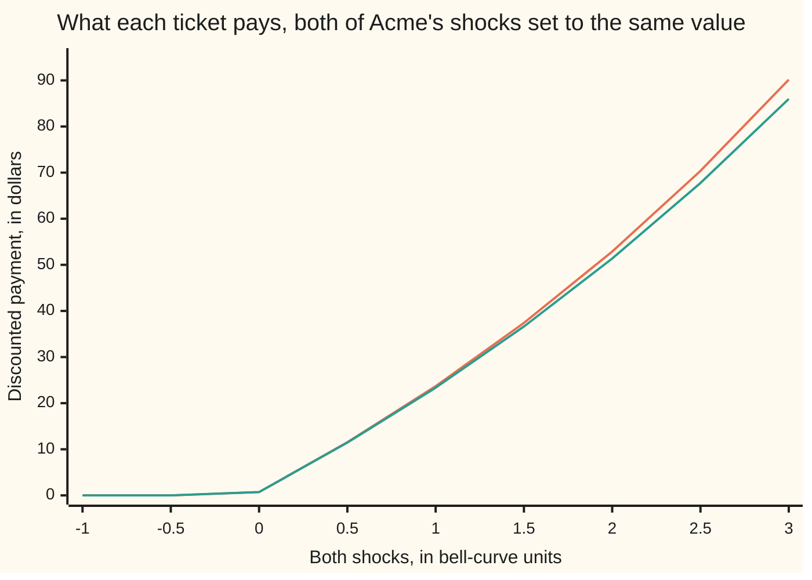

# Cheaper Monte Carlo: antithetic paths, control variates and stratification

[Syllabus](../../../SYLLABUS.md) → [Financial mathematics](../README.md) → [Numerical Methods for Pricing](../README.md#s06) → Cheaper Monte Carlo

---

## General Overview

Acme shares trade at $100.00. A contract on the desk pays the average of Acme's price on two dates — six months from today and twelve — less a $100.00 strike, or nothing if that average falls short. The average is the ordinary one: add the two prices, halve them. Call it the arithmetic ticket.

No formula prices it. The desk simulates: invent futures for Acme — each one a **path**, a price for every date the contract reads — then read off what the ticket pays on each path, discount to today, average. Sixteen thousand paths answer $7.22, with an error bar of 8.33 cents.

That bar is the whole problem. It shrinks like one over the square root of the number of paths, so a bar ten times tighter costs a hundred times the machine time ([Monte Carlo pricing](01-monte-carlo-pricing.md)) — across a book of thousands of contracts, overnight, a real bill.

There is a second lever, and it is free. The bar depends on how widely the numbers being averaged scatter, and those numbers are a choice. Three long-standing choices shrink the scatter without buying one extra path: use each random shock twice, once with its sign flipped; subtract a companion contract's own sampling error, its price being known exactly; and spread the draws evenly across the bell curve rather than letting chance clump them.

The middle one is the star here. Swap the ordinary average for the **geometric** average — multiply the two prices, take the square root — and the contract does have a formula. The two are nearly the same contract. So price both on the same paths, see how far the geometric one's simulated price missed its known answer, and correct the arithmetic one by that miss.

**Each path's payoff can be repackaged before it is averaged: keep what the sampler is aiming at, and shrink how far it scatters.**

**What kind of fact this is:** a method — three ways of rebuilding a sampler, each leaving the price it estimates where it was and narrowing only the error bar; how much each one buys is a theorem, proved on this card in Why it works.

### The picture: two contracts that move together



The upper line is the arithmetic ticket, the lower the geometric. Below the strike both die together; above it they part slowly — 0.72 against 0.72 at a shock of zero, 52.88 against 51.36 at two, 90.17 against 85.98 at three. A sampler that knows the lower line's true average exactly has very little left to guess about the upper one.

---

## The formula

Notation first, in words. A bar over a letter is the average of that quantity across the paths drawn, so $\bar X$ is the average payoff. A capital E with square brackets holds a quantity's *true* average, so $E[Y]$ is what the companion is really worth, known before a path is drawn. Two words carried over from probability: $\operatorname{var}$ is how widely a quantity scatters about its own average, $\operatorname{cov}$ how two of them scatter together ([Variance reduction](../../09-Probability%20and%20statistics/11-Simulation/05-variance-reduction.md)). The house writes $N(x)$ for the bell-curve area to the left of $x$; $N^{-1}(u)$ runs it backwards, returning the point with area $u$ to its left. That area climbs strictly from 0 to 1, so each $u$ between them has exactly one such point and the two ends have none — which is why the code's draws never reach them.

**Mirrors.** One bell-curve shock $Z$, used twice:

$$\tfrac{1}{2}\Bigl[\,X(Z) + X(-Z)\,\Bigr] \;\; \text{counts as one observation}$$

**Read it aloud:** price the path, price it again with every shock's sign flipped, average the two, and treat that average as one draw.

**A control variate.** Alongside each path's payoff $X$, compute a companion payoff $Y$ on the very same path:

$$\text{estimate} \;=\; \bar X \;-\; \beta\left(\bar Y - E[Y]\right), \qquad \beta \;=\; \frac{\operatorname{cov}(X,\,Y)}{\operatorname{var}(Y)}$$

**Read it aloud:** the plain average, minus a slope times however far the companion's own average slipped from its known value.

And what the slope buys, where $\rho$ is the correlation between payoff and companion:

$$\operatorname{var}\left(X - \beta\,Y\right) \;=\; \left(1 - \rho^{2}\right)\operatorname{var}(X)$$

**Stratification.** Cut the bell curve into $m$ slices of equal chance and draw inside each one:

$$Z_j \;=\; N^{-1}\!\left(\frac{\,j - 1 + U_j\,}{m}\right), \qquad j = 1, 2, \ldots, m$$

**Read it aloud:** give every slice of the bell curve its own draw, instead of letting chance decide how many land where. Each $U_j$ is an even draw between 0 and 1, sliding that slice's shock across it.

| Symbol | Plain meaning | In our example | Push it up and the answer… |
| --- | --- | --- | --- |
| $X$ | one path's discounted payment on the contract priced | 7.5661 on path one | the estimate rises with its average |
| $Y$ | the companion's payment on that same path | 7.0477 on path one | — |
| $E[Y]$ | the companion's true value, known in closed form | 7.063568 | the correction pulls the answer down |
| $\beta$ | the slope: how much of the companion's slip to subtract | 1.015133 | past the best slope the bar widens again |
| $\rho$ | how tightly payoff and companion move together | 0.999597 | the bar shrinks toward nothing |
| $n$ | payoff evaluations the sampler is allowed | 16000 | every bar shrinks like one over its root |
| $m$ | equal-chance slices the bell curve is cut into | 8000 | the sliced bar beats that law |
| $Z$ | one bell-curve shock: average 0, spread 1 | −0.241969 on path one | that leg ends higher |
| $U_j$ | an evenly spread fraction drawn inside one slice | — | the draw slides up its slice |
| $G$ | the geometric average of the two observed prices | 107.4091 on path one | the companion pays more |
| $\sigma$ | volatility, how jumpy Acme is. Say "sigma". | 20% | every bar widens |
| $N^{-1}(u)$ | the shock with $u$ of the bell curve below it | — | — |

The companion's closed form is the one piece this card borrows rather than derives: a geometric average of a wiggling price is itself lognormal, which is what makes it tractable.

<details>
<summary>The companion's own formula, in full</summary>

The logarithm of a geometric average is the average of the logarithms, so it is a bell-curve quantity: log spread 0.158114, smaller than one price's because the first leg's wiggle is shared by both. The price is then the usual two-term subtraction, with the geometric average's own average standing in for the share price:
$$e^{-rT}\Bigl(102.020134 \times 0.581428 \;-\; 100 \times 0.518916\Bigr) \;=\; 7.063568$$
The grid road in the code reaches 7.063562 using none of this, which is how the card knows the formula is right.

</details>

### When it holds

- **Mirrors need a payoff that moves one way.** The ticket pays more whenever a shock is larger, so a path and its mirror err in opposite directions and the pair is at most half as noisy as one path: measured pairing −0.464432 on the ticket, −0.440678 on a plain call. A payoff that rises at *both* ends fails the test, and the trick then costs accuracy.
- **A control's value must be known exactly; correlation is all it otherwise needs.** An error there biases the answer by slope times error. The bar falls by the factor $1 - \rho^{2}$ and nothing else about the companion matters, so a badly fitted slope wastes the gain without bending the answer.
- **Slicing pays only in the direction it is done.** Slices in several directions multiply, so one direction is affordable and twelve are not — Step 4 measures the collapse from one shock to two.
- **None of the three moves the target.** Each changes only the spread of what is averaged, and the run measures all four against prices computed with no sampling at all.

---

## Why it works

### Step 0: many samplers, one target

A price in this model is an average: the contract's payment across every future Acme could have, taken in the pricing world and discounted to today. *Any* procedure whose numbers have that average estimates the price — they need not be independent of each other, identically scattered, or even random.

That freedom is the whole subject: hold the target, attack the scatter. The three methods below compose, and a desk usually runs all three at once.

### Step 1: a mirror cancels the one-way half of the noise

Split a payoff's noise into the part that flips sign when the shock flips and the part that does not. Averaging a path with its mirror keeps the second and deletes the first:

$$\operatorname{var}\!\left(\tfrac{1}{2}\left[X(Z) + X(-Z)\right]\right) \;=\; \tfrac{1}{2}\operatorname{var}(X) \;+\; \tfrac{1}{2}\operatorname{cov}\!\left(X(Z),\, X(-Z)\right)$$

If the payoff never falls as the shock rises, a path and its mirror move in opposite directions, so that covariance cannot be positive: one pair is at most half as noisy as one path. Since a pair costs two payoff evaluations, the worst case is breaking even.

The measured pairing is −0.464432 on the ticket: the bar goes from 8.33 cents to 6.16, worth 0.029 million plain paths against 0.016. The call behaves the same way at −0.440678, 8.28 cents against 10.97. Modest, because below the strike a path and its mirror can both pay nothing, and two zeros are perfectly *positively* related, which drags the pairing back toward zero.

### Step 2: a control deletes the noise it can predict

Now the strong one. Suppose a second contract, priced on the same paths, has a known true value. Its simulated average will have slipped from that value, and the slip is pure sampling error. If the two contracts move together, the paths that pushed the companion high pushed the other one high too.

So subtract the slip, scaled. Choosing the scale is one line of calculus: the spread of $X - \beta Y$ is an upward parabola in $\beta$, smallest where its derivative vanishes, which lands on the regression slope of payoff on companion. Substituting back gives the shrinkage $1 - \rho^{2}$.

Two things make it safe. The quantity subtracted has true average zero, so the corrected estimate aims at the same price *whatever* slope is used. And the shrinkage depends on nothing but the correlation, so choosing a control is purely a hunt for something correlated whose answer is known.

### Step 3: the geometric average is the arithmetic one's twin

Here the hunt is easy: the companion is the same contract with one word changed. The arithmetic average of two prices is never below their geometric average, so the ticket is worth at least the companion on every path — the run confirms it on all 16,000, smallest gap 0.000000.

And the gap is small. Across 16,000 paths it averages 0.150983 and never exceeds 4.722786. Path two shows why: prices 106.7046 and 97.8809, ordinary average 102.2927, geometric average 102.1975, payments 2.1809 and 2.0904 — nine cents apart. The two exact prices differ by 7.212942 − 7.063568 = 0.149374, and **that difference is all the sampler has left to estimate.**

Correlation 0.999597, fitted slope 1.015133: each dollar the companion's average runs above 7.063568 drags $1.0151 of ticket with it. The bar falls from 8.33 cents to 0.24 — worth 19.874 million plain paths, bought with sixteen thousand.

On the plain call the idea is weaker, the natural companion being not a near-copy but the discounted share, worth 98.019867 without simulation: correlation 0.911979, slope 0.636420, bar 10.97 cents down to 4.50, worth 0.095 million. A good control is a near-copy; a merely related one is worth far less.

### Step 4: slicing puts the draws where chance would not

The third method leaves the payoff alone and rebuilds the draws. Cut the bell curve into equal-chance pieces and insist each piece receive its own draws. Chance no longer decides how many land where, and the scatter that came from that is gone. Only the wobble *within* a slice survives, and slices are narrow.

Formally, any spread splits into the spread of the slice averages plus the average of the within-slice spreads; fixing the draws per slice deletes the first. That is why the fall beats the square-root law. Two draws per slice rather than one let their difference measure the surviving wobble, which is where the sliced error bar comes from.

On the call, one shock and 8,000 slices give 0.13 cents, worth 114.603 million plain paths. On the ticket, whose payoff reads two shocks, the same budget gives 2.96 cents, worth 0.127 million. Slicing one direction of two recovers a fraction of what slicing the only direction does, and that fraction collapses as directions multiply.

Which direction, then? The code slices where the path *ends*, leaving how it got there to chance; slicing the first leg instead gives 4.38 cents against 2.96, worse from the same work. Choosing the direction properly is the Brownian bridge, the business of [Quasi-Monte Carlo](03-quasi-monte-carlo-and-brownian-bridge.md).

<details>
<summary>Detailed proof: the two variance results</summary>

**Mirrors.** Since $-Z$ has the same bell-curve law as $Z$, the two halves of a pair have equal spreads, and $\operatorname{var}(A+B) = \operatorname{var}(A) + \operatorname{var}(B) + 2\operatorname{cov}(A,B)$ divided by two squared gives the identity in the body.

For the sign of that covariance, suppose the payoff never decreases as the shock increases, and compare $X(Z_1) - X(Z_2)$ with $X(-Z_1) - X(-Z_2)$ for two independent shocks: when the first is positive the second cannot be, because flipping the signs reverses the shocks' order. The product is therefore never positive, and averaging it gives exactly $2\operatorname{cov}(X(Z), X(-Z)) \le 0$ — equality only when the payoff ignores the shock's sign. With several shocks, like the ticket's two, the comparison runs one shock at a time with the others averaged out, and each step keeps the sign.

**The control.** Write $f(\beta) = \operatorname{var}(X - \beta Y) = \operatorname{var}(X) - 2\beta\operatorname{cov}(X,Y) + \beta^{2}\operatorname{var}(Y)$, an upward parabola whose derivative vanishes at $\beta = \operatorname{cov}(X,Y)/\operatorname{var}(Y)$. Substituting back,
$$f(\beta) = \operatorname{var}(X) - \frac{\operatorname{cov}(X,Y)^{2}}{\operatorname{var}(Y)} = \left(1 - \rho^{2}\right)\operatorname{var}(X).$$
No lean appears at any slope, since the average of $\bar Y - E[Y]$ is zero, so the corrected estimate's average is the price. Slicing's free directions scatter exactly as before, which is why its gain stays in the direction sliced.

</details>

### The other door

All three repackage random draws. The alternative is to abandon randomness and choose points deliberately, too evenly spread to be random, which changes the convergence law rather than the constant in front of it. Grids and transforms skip sampling altogether: [Pricing on a grid](07-finite-differences-for-the-black-scholes-equation.md) and [Transform pricing](09-carr-madan-fft-and-cos-methods.md) both recover 9.227 on the plain call, as the two-shock grid in this card's code does for the ticket.

---

## Worked numbers, by hand

Acme at $100.00, strike $100.00, riskless rate 5%, dividend yield 2%, volatility 20%, one year, the average taken at 0.50 and at 1.00 years.

| Step | Arithmetic | Value |
| --- | --- | --- |
| the plain call, as a ruler | the formula, over this card's own bell-curve area | 9.227006 |
| the companion, in closed form | spread 0.158114, geometric mean's average 102.020134, areas 0.581428 and 0.518916 | 7.063568 |
| the same, by a grid over both shocks | 801 points along each shock, no formula used | 7.063562 |
| the ticket, by that same grid | the only road it has | 7.212942 |
| what the control leaves to sample | 7.212942 − 7.063568 | **0.149374** |
| path one's two prices, then its two averages | at six months and twelve; sum halved, then $\sqrt{97.1203 \times 118.7878}$ | 97.1203, 118.7878; 107.9540, 107.4091 |
| the two discounted payments, ticket then companion | 0.5184 apart | 7.5661 and 7.0477 |
| the gap across 16,000 paths | average, largest, smallest | 0.150983, 4.722786, 0.000000 |
| slope and correlation on those paths | how much companion to subtract, how tightly they track | 1.015133 and 0.999597 |
| plain estimate, then the same paths controlled | the same 16,000 paths either way | 7.216484 at 8.33 cents; **7.214522 at 0.24** |

The controlled answer sits 0.16 cents from the grid's 7.212942, inside its own quarter-cent bar; the plain answer sits 0.35 cents away inside a bar thirty times wider. Both honest. One useful.

### The four error bars, same budget

```
one █ = a quarter of a cent of error bar; all four samplers get 16,000 payoff evaluations
  plain              █████████████████████████████████  8.33 cents
  antithetic pairs   █████████████████████████          6.16 cents
  stratified slices  ████████████                       2.96 cents
  control variate    █                                  0.24 cents
```

Read the bars as machine time: matching the bottom bar by brute force takes 19.874 million plain paths.

### What breaks if you drop a piece

| Mistake | Comes out at | What went wrong |
| --- | --- | --- |
| Pooling the call's 8,000 mirrored pairs as 16,000 lone paths | a bar of 11.07 cents, honest 8.28 | A pair is one observation, not two, so the ordinary formula throws the saving away. |
| Reading the control's known value as 100.00, not 98.019867 | 10.5298 on the call, off by +1.2602 | The slip is measured from the wrong benchmark; the bias is that error times 0.636420. |
| Slicing the ticket's first leg instead of where the path ends | 7.2602, bar 4.38 cents against 2.96 | Slicing pays in its own direction, and the payoff mostly reads where the path ended. |

The code prints all three.

---

## Code, from first principles, and it actually runs

Nothing is imported that already knows an answer. The fractions come from the recurrence the Monte Carlo pricing card prints; the bell-curve area and every reference price from Simpson's rule written out in the file, in one dimension and in two; the area's inverse, needed to place a draw inside a slice, is a rational fit the run checks against the area itself — worst slip 0.437 in a billion over nineteen points.

Prices arrive by roads that share no pricing formula. The plain call comes out of the formula and out of a one-shock integral, both 9.227006; the companion out of its closed form and out of a grid over the two shocks, 7.063568 against 7.063562. Because that grid reproduces the one ticket price that has a formula, its answer for the arithmetic ticket, 7.212942, is the reference the four samplers are measured against.

### Python

```python
# Cheaper Monte Carlo -- the check behind the card.  Standard library only.  Nothing imported
# knows an answer: the fractions come from the recurrence the Monte Carlo pricing card prints,
# the bell-curve area and both reference prices from Simpson's rule written out here in one
# dimension and in two, and the area's inverse is a rational fit the run checks against it.
from math import exp, log, pi, sqrt
S, K, R, Q, SIG, T = 100.0, 100.0, 0.05, 0.02, 0.20, 1.0     # the house market
T1, T2 = 0.5, 1.0                        # the average ticket's two observation dates
SEED, N, MOD = 20260919, 16000, 1 << 32  # the seed; payoff evaluations per sampler
DISC, MU, EQ = exp(-R * T), R - Q - 0.5 * SIG * SIG, S * exp(-Q * T)   # discount; log drift; S e^-qT
VT, ROT = SIG * sqrt(T), sqrt(0.5)       # a year's wiggle unit; end point back to shocks
A1, A2 = SIG * sqrt(T1), SIG * sqrt(T2 - T1)          # a wiggle unit for each leg
AA = (2.50662823884, -18.61500062529, 41.39119773534, -25.44106049637)
BB = (-8.47351093090, 23.08336743743, -21.06224101826, 3.13082909833)
CC = (0.3374754822726147, 0.9761690190917186, 0.1607979714918209, 0.0276438810333863, 0.0038405729373609,
      0.0003951896511919, 0.0000321767881768, 0.0000002888167364, 0.0000003960315187)
def phi(x): return exp(-0.5 * x * x) / sqrt(2.0 * pi)          # bell-curve height at x
def simpson(f, a, b, n):                 # the area under f from a to b, in n slices
    h, total = (b - a) / n, f(a) + f(b)
    for i in range(1, n): total += (4.0 if i % 2 else 2.0) * f(a + i * h)
    return total * h / 3.0
def ncdf(x):                             # area to the left of x, by that same rule
    return 0.0 if x < -9.0 else 1.0 if x > 9.0 else 0.5 + simpson(phi, 0.0, x, 4000)
def ninv(u):                             # the shock with u of the bell curve below it
    y, x = u - 0.5, CC[8]
    if abs(y) < 0.42:                    # the middle: one polynomial in y*y over another
        w = y * y
        top = ((AA[3] * w + AA[2]) * w + AA[1]) * w + AA[0]
        return y * top / ((((BB[3] * w + BB[2]) * w + BB[1]) * w + BB[0]) * w + 1.0)
    w = log(-log(u if y < 0.0 else 1.0 - u))              # the tails: a polynomial in that
    for i in range(7, -1, -1): x = x * w + CC[i]
    return x if y > 0.0 else -x
def nxt(g):   # one step of the recurrence, then a fraction landing strictly inside 0 and 1
    g[0] = (1664525 * g[0] + 1013904223) % MOD; return (g[0] + 0.5) / MOD
def stats(vs):                           # the average, and the error bar on that average
    m, n = sum(vs) / len(vs), len(vs)
    return m, sqrt(sum((v - m) * (v - m) for v in vs) / (n - 1) / n)
def control(xs, ys, known):              # subtract the control's own sampling slip
    n, mx, my = len(xs), sum(xs) / len(xs), sum(ys) / len(ys)
    cov = sum((xs[i] - mx) * (ys[i] - my) for i in range(n)) / (n - 1)
    vx, vy = (sum((x - mx) * (x - mx) for x in xs) / (n - 1), sum((y - my) * (y - my) for y in ys) / (n - 1))
    beta = cov / vy                      # the slope that deletes as much noise as it can
    return (beta, cov / sqrt(vx * vy)) + stats([x - beta * (y - known) for x, y in zip(xs, ys)])

def call(zs):                            # the one-year call, and the share as its control
    end = S * exp(MU * T + VT * zs[0])
    return DISC * max(end - K, 0.0), DISC * end
def asian(zs):                           # one path: the arithmetic ticket, then the geometric
    mid = S * exp(MU * T1 + A1 * zs[0])
    end = mid * exp(MU * (T2 - T1) + A2 * zs[1])
    return DISC * max(0.5 * (mid + end) - K, 0.0), DISC * max(sqrt(mid * end) - K, 0.0), mid, end
def grid2(which, n):                     # either ticket with no pricing formula at all
    return simpson(lambda x: simpson(lambda y: phi(x) * phi(y) * asian((x, y))[which], -8.0, 8.0, n), -8.0, 8.0, n)
def stream(pay, dim, seed):              # N paths: the shocks, the payoff, its control
    g = [seed]
    shocks = [tuple(ninv(nxt(g)) for _ in range(dim)) for _ in range(N)]
    return shocks, [pay(zs)[0] for zs in shocks], [pay(zs)[1] for zs in shocks]
def stratified(pay, seed, mode):         # two draws inside each equal-chance slice
    # mode 0: the only shock.  1: the end point sliced, middle free.  2: leg one sliced, wrong way.
    g, slices, total, spread = [seed], N // 2, 0.0, 0.0
    for j in range(slices):
        vals = []
        for _ in range(2):
            v, w = ninv((j + nxt(g)) / slices), (ninv(nxt(g)) if mode else 0.0)
            vals.append(pay((v,) if mode == 0 else (((v + w) * ROT, (v - w) * ROT) if mode == 1 else (v, w)))[0])
        total += 0.5 * (vals[0] + vals[1])
        spread += 0.25 * (vals[0] - vals[1]) * (vals[0] - vals[1])
    return total / slices, sqrt(spread) / slices
def report(title, pay, shocks, xs, ys, known, exact, mode):
    lows = xs[:N // 2]                   # the same paths, and the same paths flipped
    highs = [pay(tuple(-z for z in zs))[0] for zs in shocks[:N // 2]]
    beta, rho, cv, se_cv = control(xs, ys, known)
    rows = [("plain", stats(xs)), ("antithetic pairs", stats([0.5 * (a + b) for a, b in zip(lows, highs)])),
            ("stratified slices", stratified(pay, SEED, mode)), ("control variate", (cv, se_cv))]
    print(title)
    print("  sampler               estimate    se, c   off by, c   paths worth, millions")
    for name, (mean, se) in rows:
        print(f"  {name:<19}{mean:11.6f} {100.0 * se:8.2f} {100.0 * (mean - exact):11.2f}"
              f"{N * (rows[0][1][1] / se) * (rows[0][1][1] / se) / 1e6:23.3f}")
    mrho = control(lows, highs, 0.0)[1]  # how a path and its mirror move together
    print(f"  mirror correlation {mrho:+.6f}, control slope {beta:.6f}, control correlation {rho:.6f}")
    return rows, stats(lows + highs)[1], mrho, rho

D1 = (log(S / K) + (R - Q + 0.5 * SIG * SIG) * T) / VT
CALL_F = EQ * ncdf(D1) - K * DISC * ncdf(D1 - VT)                # the pilot card's formula
CALL_G = simpson(lambda z: phi(z) * call((z,))[0], (log(K / S) - MU * T) / VT, 9.0, 2000)
VG, TBAR = SIG * SIG * (3.0 * T1 + T2) / 4.0, 0.5 * (T1 + T2)   # the geometric average's log spread
SG, EG = sqrt(VG), S * exp(MU * TBAR + 0.5 * VG)                # its spread; its own average
G2 = (log(S) + MU * TBAR - log(K)) / SG
GEO_F = DISC * (EG * ncdf(G2 + SG) - K * ncdf(G2))              # Kemna and Vorst, 1990
ARI_G, GEO_G = grid2(0, 800), grid2(1, 800)
slip = max(abs(ncdf(ninv(p / 20.0)) - p / 20.0) for p in range(1, 20))
(SHOCKS, XA, YA), (SHOCKS_C, XC, YC) = stream(asian, 2, SEED), stream(call, 1, SEED)
gaps = [XA[i] - YA[i] for i in range(N)]
print("Cheaper Monte Carlo: the Acme call, and an average-price ticket on two dates")
print(f"S = {S:.2f}  K = {K:.2f}  r = {R * 100:.0f}%  q = {Q * 100:.0f}%  sigma = {SIG * 100:.0f}%  "
      f"T = {T:.0f} year; the average takes the price at {T1:.2f} and at {T2:.2f}")
print(f"seed {SEED}; {N} payoff evaluations per sampler: {N // 2} mirror pairs, or {N // 2} slices"
      f" with two draws each; se and off-by in cents")
print()
print("exact prices")
print(f"  Acme call          formula      {CALL_F:11.6f}    one-shock slices  {CALL_G:11.6f}")
print(f"  geometric ticket   Kemna-Vorst  {GEO_F:11.6f}    two-shock grid    {GEO_G:11.6f}")
print(f"  arithmetic ticket  no formula                  two-shock grid    {ARI_G:11.6f}")
print(f"  the geometric average by hand: spread {SG:.6f}, average {EG:.6f}, N(g1) {ncdf(G2 + SG):.6f}, N(g2) {ncdf(G2):.6f}")
print(f"  what the control leaves to sample: {ARI_G:.6f} - {GEO_F:.6f} = {ARI_G - GEO_F:.6f}")
print(f"  the inverse against the area: worst slip over 19 points, in billionths {slip * 1e9:.3f}")
print()
print("the first three paths, and how close the two tickets run")
for i in range(3):
    x, y, mid, end = asian(SHOCKS[i])
    print(f"  path {i + 1}  shocks {SHOCKS[i][0]:9.6f} {SHOCKS[i][1]:9.6f}  prices {mid:9.4f} {end:9.4f}"
          f"  averages {0.5 * (mid + end):9.4f} {sqrt(mid * end):9.4f}  X {x:7.4f}  Y {y:7.4f}  X - Y {x - y:7.4f}")
print(f"  X - Y over {N} paths: average {sum(gaps) / N:.6f}, largest {max(gaps):.6f}, smallest {min(gaps):.6f}")
print()
rows_c, pool_c, mrho_c, _ = report(f"the Acme call, four samplers, exact price {CALL_F:.6f}", call, SHOCKS_C, XC, YC, EQ, CALL_F, 0)
print()
rows_a, _, mrho_a, rho_a = report(f"the arithmetic ticket, four samplers, exact price {ARI_G:.6f}", asian, SHOCKS, XA, YA, GEO_F, ARI_G, 1)
print()
bad, wrong_way = control(XC, YC, S)[2], stratified(asian, SEED, 2)
print("what breaks")
print(f"  mirrors pooled as {N} lone paths: se quoted {100.0 * pool_c:.2f} c, honest {100.0 * rows_c[1][1][1]:.2f} c")
print(f"  control average read as S {S:.2f}, not S e^-qT {EQ:.6f}: the call comes out at {bad:.4f},"
      f" off by {bad - rows_c[3][1][0]:+.4f}")
print(f"  leg one sliced, not the end point: {wrong_way[0]:.4f}, se {100.0 * wrong_way[1]:.2f} c against {100.0 * rows_a[2][1][1]:.2f} c")
print()
print("bar, se in cents on the arithmetic ticket: " + "  ".join(f"{n} {100.0 * r[1]:.2f}" for n, r in rows_a))
pv = [asian((-1.0 + 0.5 * i, -1.0 + 0.5 * i)) for i in range(9)]
for label, vals in (("chart, shock      ", [-1.0 + 0.5 * i for i in range(9)]),
                    ("chart, arithmetic ", [p[0] for p in pv]), ("chart, geometric  ", [p[1] for p in pv])):
    print("  " + label + " ".join(f"{v:8.2f}" for v in vals))
assert abs(CALL_F - 9.227005508154) < 1e-9, "own bell-curve area against the pilot card's price"
assert abs(CALL_G - CALL_F) < 1e-8, "the call by slices against the call by formula"
assert abs(GEO_G - GEO_F) < 1e-4, "the grid reproduces the one ticket price that has a formula"
assert min(gaps) >= 0.0, "a geometric average never beats an arithmetic one"
assert slip < 1e-8, "the inverse really inverts the area"
assert abs(rows_a[3][1][0] - ARI_G) < 2.0 * rows_a[3][1][1], "controlled ticket against the grid price"
assert abs(rows_c[2][1][0] - CALL_F) < 3.0 * rows_c[2][1][1], "sliced call against the formula price"
assert mrho_c < 0.0 and mrho_a < 0.0 and rows_a[1][1][1] < rows_a[0][1][1], "mirrors anti-correlate, so a pair is quieter"
assert abs((rows_a[3][1][1] / rows_a[0][1][1]) ** 2 - (1.0 - rho_a * rho_a)) < 1e-12 and rho_a > 0.999, "the bar falls by exactly 1 - rho^2"
print("ALL CHECKS PASS")
```

**Ran 2026-09-19 on macOS, Python 3.14.6, standard library only. All checks passed. Output, pasted from the run:**

```
Cheaper Monte Carlo: the Acme call, and an average-price ticket on two dates
S = 100.00  K = 100.00  r = 5%  q = 2%  sigma = 20%  T = 1 year; the average takes the price at 0.50 and at 1.00
seed 20260919; 16000 payoff evaluations per sampler: 8000 mirror pairs, or 8000 slices with two draws each; se and off-by in cents

exact prices
  Acme call          formula         9.227006    one-shock slices     9.227006
  geometric ticket   Kemna-Vorst     7.063568    two-shock grid       7.063562
  arithmetic ticket  no formula                  two-shock grid       7.212942
  the geometric average by hand: spread 0.158114, average 102.020134, N(g1) 0.581428, N(g2) 0.518916
  what the control leaves to sample: 7.212942 - 7.063568 = 0.149374
  the inverse against the area: worst slip over 19 points, in billionths 0.437

the first three paths, and how close the two tickets run
  path 1  shocks -0.241969  1.388670  prices   97.1203  118.7878  averages  107.9540  107.4091  X  7.5661  Y  7.0477  X - Y  0.5184
  path 2  shocks  0.423514 -0.645682  prices  106.7046   97.8809  averages  102.2927  102.1975  X  2.1809  Y  2.0904  X - Y  0.0905
  path 3  shocks -0.677820  1.516198  prices   91.3147  113.7195  averages  102.5171  101.9032  X  2.3943  Y  1.8104  X - Y  0.5840
  X - Y over 16000 paths: average 0.150983, largest 4.722786, smallest 0.000000

the Acme call, four samplers, exact price 9.227006
  sampler               estimate    se, c   off by, c   paths worth, millions
  plain                 9.287257    10.97        6.03                  0.016
  antithetic pairs      9.297482     8.28        7.05                  0.028
  stratified slices     9.227613     0.13        0.06                114.603
  control variate       9.269575     4.50        4.26                  0.095
  mirror correlation -0.440678, control slope 0.636420, control correlation 0.911979

the arithmetic ticket, four samplers, exact price 7.212942
  sampler               estimate    se, c   off by, c   paths worth, millions
  plain                 7.216484     8.33        0.35                  0.016
  antithetic pairs      7.252962     6.16        4.00                  0.029
  stratified slices     7.237479     2.96        2.45                  0.127
  control variate       7.214522     0.24        0.16                 19.874
  mirror correlation -0.464432, control slope 1.015133, control correlation 0.999597

what breaks
  mirrors pooled as 16000 lone paths: se quoted 11.07 c, honest 8.28 c
  control average read as S 100.00, not S e^-qT 98.019867: the call comes out at 10.5298, off by +1.2602
  leg one sliced, not the end point: 7.2602, se 4.38 c against 2.96 c

bar, se in cents on the arithmetic ticket: plain 8.33  antithetic pairs 6.16  stratified slices 2.96  control variate 0.24
  chart, shock         -1.00    -0.50     0.00     0.50     1.00     1.50     2.00     2.50     3.00
  chart, arithmetic     0.00     0.00     0.72    11.52    23.68    37.40    52.88    70.38    90.17
  chart, geometric      0.00     0.00     0.72    11.44    23.36    36.62    51.36    67.75    85.98
ALL CHECKS PASS
```

### Rust

Same recurrence, same draws, same labels, built with `rustc --edition 2021 -O`.

```rust
// Cheaper Monte Carlo -- the same check as the Python, in Rust.  No crates.  Nothing imported knows
// an answer: the fractions come from the recurrence the Monte Carlo pricing card prints, the
// bell-curve area and both reference prices from Simpson's rule written out here in one dimension
// and in two, and the area's inverse is a rational fit the run checks against the area itself.
const S: f64 = 100.0; const K: f64 = 100.0; const R: f64 = 0.05; const Q: f64 = 0.02;  // the house
const SIG: f64 = 0.20; const T: f64 = 1.0; const T1: f64 = 0.5; const T2: f64 = 1.0;  // market, and
const SEED: u64 = 20260919; const N: usize = 16000; const MOD: u64 = 1 << 32;  // the two dates
const AA: [f64; 4] = [2.50662823884, -18.61500062529, 41.39119773534, -25.44106049637];
const BB: [f64; 4] = [-8.47351093090, 23.08336743743, -21.06224101826, 3.13082909833];
const CC: [f64; 9] = [0.3374754822726147, 0.9761690190917186, 0.1607979714918209, 0.0276438810333863,
    0.0038405729373609, 0.0003951896511919, 0.0000321767881768, 0.0000002888167364, 0.0000003960315187];
const MU: f64 = R - Q - 0.5 * SIG * SIG;     // the pricing world's drift, in logs
const NAMES: [&str; 4] = ["plain", "antithetic pairs", "stratified slices", "control variate"];
fn disc() -> f64 { (-R * T).exp() }   fn eq() -> f64 { S * (-Q * T).exp() }   // discount; S e^-qT
fn vt() -> f64 { SIG * T.sqrt() }   fn rot() -> f64 { 0.5f64.sqrt() }   // a year's wiggle; the turn
fn a1() -> f64 { SIG * T1.sqrt() }   fn a2() -> f64 { SIG * (T2 - T1).sqrt() }   // each leg's wiggle
fn phi(x: f64) -> f64 { (-0.5 * x * x).exp() / (2.0 * std::f64::consts::PI).sqrt() }   // its height
fn simpson<F: Fn(f64) -> f64>(f: F, a: f64, b: f64, n: usize) -> f64 {
    let (h, mut total) = ((b - a) / n as f64, f(a) + f(b));  // the area under f from a to b
    for i in 1..n { total += (if i % 2 == 1 { 4.0 } else { 2.0 }) * f(a + i as f64 * h) }
    total * h / 3.0 }
// area to the left of x, by that same rule
fn ncdf(x: f64) -> f64 { if x < -9.0 { 0.0 } else if x > 9.0 { 1.0 } else { 0.5 + simpson(phi, 0.0, x, 4000) } }
fn ninv(u: f64) -> f64 {                     // the shock with u of the bell curve below it
    let (y, mut x) = (u - 0.5, CC[8]);
    if y.abs() < 0.42 {                      // the middle: one polynomial in y*y over another
        let w = y * y;
        return y * (((AA[3] * w + AA[2]) * w + AA[1]) * w + AA[0])
            / ((((BB[3] * w + BB[2]) * w + BB[1]) * w + BB[0]) * w + 1.0);
    }
    let w = (-(if y < 0.0 { u } else { 1.0 - u }).ln()).ln(); // the tails: a polynomial in that
    for i in (0..8).rev() { x = x * w + CC[i] }
    if y > 0.0 { x } else { -x }
}
// one step of the recurrence, then a fraction landing strictly inside 0 and 1
fn nxt(g: &mut u64) -> f64 { *g = (1664525 * *g + 1013904223) % MOD; (*g as f64 + 0.5) / MOD as f64 }
fn smallest(vs: &[f64]) -> f64 { vs.iter().cloned().fold(f64::INFINITY, f64::min) }
fn stats(vs: &[f64]) -> (f64, f64) {         // the average, and the error bar on that average
    let (m, n) = (vs.iter().sum::<f64>() / vs.len() as f64, vs.len());
    (m, (vs.iter().map(|v| (v - m) * (v - m)).sum::<f64>() / (n - 1) as f64 / n as f64).sqrt()) }
fn control(xs: &[f64], ys: &[f64], known: f64) -> (f64, f64, f64, f64) {
    let n = xs.len();                        // subtract the control's own sampling slip
    let (mx, my) = (xs.iter().sum::<f64>() / n as f64, ys.iter().sum::<f64>() / n as f64);
    let cov = (0..n).map(|i| (xs[i] - mx) * (ys[i] - my)).sum::<f64>() / (n - 1) as f64;
    let vx = xs.iter().map(|x| (x - mx) * (x - mx)).sum::<f64>() / (n - 1) as f64;
    let vy = ys.iter().map(|y| (y - my) * (y - my)).sum::<f64>() / (n - 1) as f64;
    let beta = cov / vy;                     // the slope that deletes as much noise as it can
    let adj: Vec<f64> = xs.iter().zip(ys).map(|(x, y)| x - beta * (y - known)).collect();
    let s = stats(&adj); (beta, cov / (vx * vy).sqrt(), s.0, s.1) }
fn call(zs: &[f64]) -> [f64; 4] {            // the one-year call, and the share as its control
    let end = S * (MU * T + vt() * zs[0]).exp();
    [disc() * (end - K).max(0.0), disc() * end, 0.0, 0.0] }
fn asian(zs: &[f64]) -> [f64; 4] {           // one path: the arithmetic ticket, then the geometric
    let mid = S * (MU * T1 + a1() * zs[0]).exp();
    let end = mid * (MU * (T2 - T1) + a2() * zs[1]).exp();
    [disc() * (0.5 * (mid + end) - K).max(0.0), disc() * ((mid * end).sqrt() - K).max(0.0), mid, end] }
fn grid2(which: usize, n: usize) -> f64 {    // either ticket with no pricing formula at all
    simpson(|x| simpson(|y| phi(x) * phi(y) * asian(&[x, y])[which], -8.0, 8.0, n), -8.0, 8.0, n) }
// N paths: the shocks, the payoff on each, and its control on each
fn stream<F: Fn(&[f64]) -> [f64; 4]>(pay: F, dim: usize, seed: u64) -> (Vec<Vec<f64>>, Vec<f64>, Vec<f64>) {
    let (mut g, mut shocks) = (seed, Vec::new());
    for _ in 0..N { let mut zs = Vec::new();
        for _ in 0..dim { zs.push(ninv(nxt(&mut g))) } shocks.push(zs) }
    let (mut xs, mut ys) = (Vec::new(), Vec::new());
    for zs in &shocks { let t = pay(zs); xs.push(t[0]); ys.push(t[1]) }
    (shocks, xs, ys) }
fn stratified<F: Fn(&[f64]) -> [f64; 4]>(pay: F, seed: u64, mode: u32) -> (f64, f64) {
    // mode 0: the only shock.  1: the end point sliced, middle free.  2: leg one sliced, wrong way.
    let (mut g, slices, mut total, mut spread) = (seed, N / 2, 0.0, 0.0);  // two draws per slice
    for j in 0..slices {
        let mut vals = [0.0f64; 2];
        for k in 0..2 {
            let v = ninv((j as f64 + nxt(&mut g)) / slices as f64);  // this slice's own share
            let w = if mode > 0 { ninv(nxt(&mut g)) } else { 0.0 };  // the direction left free
            let zs: Vec<f64> = if mode == 0 { vec![v] }
                else if mode == 1 { vec![(v + w) * rot(), (v - w) * rot()] } else { vec![v, w] };
            vals[k] = pay(&zs)[0];
        }
        total += 0.5 * (vals[0] + vals[1]);
        spread += 0.25 * (vals[0] - vals[1]) * (vals[0] - vals[1]);
    }
    (total / slices as f64, spread.sqrt() / slices as f64) }
fn report<F: Fn(&[f64]) -> [f64; 4]>(title: String, pay: F, shocks: &[Vec<f64>], xs: &[f64],
        ys: &[f64], known: f64, exact: f64, mode: u32) -> (Vec<(f64, f64)>, f64, f64, f64) {
    let lows = xs[..N / 2].to_vec();         // the same paths, and the same paths flipped
    let highs: Vec<f64> = shocks[..N / 2].iter().map(|zs| pay(&zs.iter().map(|z| -z).collect::<Vec<f64>>())[0]).collect();
    let (beta, rho, cv, se_cv) = control(xs, ys, known);
    let pairs: Vec<f64> = lows.iter().zip(&highs).map(|(a, b)| 0.5 * (a + b)).collect();
    let rows = vec![stats(xs), stats(&pairs), stratified(&pay, SEED, mode), (cv, se_cv)];
    println!("{}", title);
    println!("  sampler               estimate    se, c   off by, c   paths worth, millions");
    for (name, row) in NAMES.iter().zip(&rows) {
        println!("  {:<19}{:11.6} {:8.2} {:11.2}{:23.3}", name, row.0, 100.0 * row.1,
                 100.0 * (row.0 - exact), N as f64 * (rows[0].1 / row.1) * (rows[0].1 / row.1) / 1e6);
    }
    let mrho = control(&lows, &highs, 0.0).1;    // how a path and its mirror move together
    println!("  mirror correlation {:+.6}, control slope {:.6}, control correlation {:.6}", mrho, beta, rho);
    let mut pool = lows.clone(); pool.extend(&highs); (rows, stats(&pool).1, mrho, rho) }
fn main() {
    let d1 = ((S / K).ln() + (R - Q + 0.5 * SIG * SIG) * T) / vt();
    let call_f = eq() * ncdf(d1) - K * disc() * ncdf(d1 - vt());      // the pilot card's formula
    let call_g = simpson(|z| phi(z) * call(&[z])[0], ((K / S).ln() - MU * T) / vt(), 9.0, 2000);
    let (vg, tbar) = (SIG * SIG * (3.0 * T1 + T2) / 4.0, 0.5 * (T1 + T2));  // geometric log spread
    let (sg, egm) = (vg.sqrt(), S * (MU * tbar + 0.5 * vg).exp());    // its spread; its own average
    let g2 = (S.ln() + MU * tbar - K.ln()) / sg;
    let geo_f = disc() * (egm * ncdf(g2 + sg) - K * ncdf(g2));        // Kemna and Vorst, 1990
    let (ari_g, geo_g) = (grid2(0, 800), grid2(1, 800));
    let slip = (1..20).map(|p| (ncdf(ninv(p as f64 / 20.0)) - p as f64 / 20.0).abs()).fold(0.0, f64::max);
    let (shocks_a, xa, ya) = stream(asian, 2, SEED);
    let (shocks_c, xc, yc) = stream(call, 1, SEED);
    let gaps: Vec<f64> = (0..N).map(|i| xa[i] - ya[i]).collect();
    println!("Cheaper Monte Carlo: the Acme call, and an average-price ticket on two dates");
    println!("S = {:.2}  K = {:.2}  r = {:.0}%  q = {:.0}%  sigma = {:.0}%  T = {:.0} year; the \
average takes the price at {:.2} and at {:.2}", S, K, R * 100.0, Q * 100.0, SIG * 100.0, T, T1, T2);
    println!("seed {}; {} payoff evaluations per sampler: {} mirror pairs, or {} slices with two \
draws each; se and off-by in cents", SEED, N, N / 2, N / 2);
    println!();
    println!("exact prices");
    println!("  Acme call          formula      {:11.6}    one-shock slices  {:11.6}", call_f, call_g);
    println!("  geometric ticket   Kemna-Vorst  {:11.6}    two-shock grid    {:11.6}", geo_f, geo_g);
    println!("  arithmetic ticket  no formula                  two-shock grid    {:11.6}", ari_g);
    println!("  the geometric average by hand: spread {:.6}, average {:.6}, N(g1) {:.6}, N(g2) {:.6}",
             sg, egm, ncdf(g2 + sg), ncdf(g2));
    println!("  what the control leaves to sample: {:.6} - {:.6} = {:.6}", ari_g, geo_f, ari_g - geo_f);
    println!("  the inverse against the area: worst slip over 19 points, in billionths {:.3}", slip * 1e9);
    println!();
    println!("the first three paths, and how close the two tickets run");
    for i in 0..3 {
        let a = asian(&shocks_a[i]);
        println!("  path {}  shocks {:9.6} {:9.6}  prices {:9.4} {:9.4}  averages {:9.4} {:9.4}  \
X {:7.4}  Y {:7.4}  X - Y {:7.4}", i + 1, shocks_a[i][0], shocks_a[i][1], a[2], a[3], 0.5 * (a[2]
            + a[3]), (a[2] * a[3]).sqrt(), a[0], a[1], a[0] - a[1]);
    }
    println!("  X - Y over {} paths: average {:.6}, largest {:.6}, smallest {:.6}", N, gaps.iter().sum::<f64>()
             / N as f64, gaps.iter().cloned().fold(f64::NEG_INFINITY, f64::max), smallest(&gaps));
    println!();
    let (rows_c, pool_c, mrho_c, _) = report(format!("the Acme call, four samplers, exact price {:.6}", call_f),
                                  call, &shocks_c, &xc, &yc, eq(), call_f, 0);
    println!();
    let (rows_a, _, mrho_a, rho_a) = report(format!("the arithmetic ticket, four samplers, exact price {:.6}", ari_g),
                             asian, &shocks_a, &xa, &ya, geo_f, ari_g, 1);
    println!();
    let (bad, wrong_way) = (control(&xc, &yc, S).2, stratified(asian, SEED, 2));
    println!("what breaks");
    println!("  mirrors pooled as {} lone paths: se quoted {:.2} c, honest {:.2} c", N, 100.0 * pool_c, 100.0 * rows_c[1].1);
    println!("  control average read as S {:.2}, not S e^-qT {:.6}: the call comes out at {:.4}, \
off by {:+.4}", S, eq(), bad, bad - rows_c[3].0);
    println!("  leg one sliced, not the end point: {:.4}, se {:.2} c against {:.2} c",
             wrong_way.0, 100.0 * wrong_way.1, 100.0 * rows_a[2].1);
    println!();
    println!("bar, se in cents on the arithmetic ticket: {}", NAMES.iter().zip(&rows_a)
        .map(|(n, r)| format!("{} {:.2}", n, 100.0 * r.1)).collect::<Vec<String>>().join("  "));
    let shock: Vec<f64> = (0..9).map(|i| -1.0 + 0.5 * i as f64).collect();
    let pv: Vec<[f64; 4]> = shock.iter().map(|&z| asian(&[z, z])).collect();
    for (label, vals) in [("chart, shock      ", shock.clone()), ("chart, arithmetic ", pv.iter().map(|p| p[0]).collect()),
                          ("chart, geometric  ", pv.iter().map(|p| p[1]).collect())] {
        println!("  {}{}", label, vals.iter().map(|v| format!("{:8.2}", v)).collect::<Vec<String>>().join(" "));
    }
    assert!((call_f - 9.227005508154).abs() < 1e-9, "own bell-curve area against the pilot's price");
    assert!((call_g - call_f).abs() < 1e-8, "the call by slices against the call by formula");
    assert!((geo_g - geo_f).abs() < 1e-4, "the grid reproduces the one ticket price with a formula");
    assert!(smallest(&gaps) >= 0.0, "a geometric average never beats an arithmetic one");
    assert!(slip < 1e-8, "the inverse really inverts the area");
    assert!((rows_a[3].0 - ari_g).abs() < 2.0 * rows_a[3].1, "controlled ticket against the grid price");
    assert!((rows_c[2].0 - call_f).abs() < 3.0 * rows_c[2].1, "sliced call against the formula price");
    assert!(mrho_c < 0.0 && mrho_a < 0.0 && rows_a[1].1 < rows_a[0].1, "mirrors anti-correlate, so a pair is quieter");
    assert!(((rows_a[3].1 / rows_a[0].1).powi(2) - (1.0 - rho_a * rho_a)).abs() < 1e-12 && rho_a > 0.999,
            "the bar falls by exactly 1 - rho^2");
    println!("ALL CHECKS PASS");
}
```

**Ran 2026-09-19 on macOS, rustc 1.98.1, no crates. All checks passed. Output, pasted from the run:**

```
Cheaper Monte Carlo: the Acme call, and an average-price ticket on two dates
S = 100.00  K = 100.00  r = 5%  q = 2%  sigma = 20%  T = 1 year; the average takes the price at 0.50 and at 1.00
seed 20260919; 16000 payoff evaluations per sampler: 8000 mirror pairs, or 8000 slices with two draws each; se and off-by in cents

exact prices
  Acme call          formula         9.227006    one-shock slices     9.227006
  geometric ticket   Kemna-Vorst     7.063568    two-shock grid       7.063562
  arithmetic ticket  no formula                  two-shock grid       7.212942
  the geometric average by hand: spread 0.158114, average 102.020134, N(g1) 0.581428, N(g2) 0.518916
  what the control leaves to sample: 7.212942 - 7.063568 = 0.149374
  the inverse against the area: worst slip over 19 points, in billionths 0.437

the first three paths, and how close the two tickets run
  path 1  shocks -0.241969  1.388670  prices   97.1203  118.7878  averages  107.9540  107.4091  X  7.5661  Y  7.0477  X - Y  0.5184
  path 2  shocks  0.423514 -0.645682  prices  106.7046   97.8809  averages  102.2927  102.1975  X  2.1809  Y  2.0904  X - Y  0.0905
  path 3  shocks -0.677820  1.516198  prices   91.3147  113.7195  averages  102.5171  101.9032  X  2.3943  Y  1.8104  X - Y  0.5840
  X - Y over 16000 paths: average 0.150983, largest 4.722786, smallest 0.000000

the Acme call, four samplers, exact price 9.227006
  sampler               estimate    se, c   off by, c   paths worth, millions
  plain                 9.287257    10.97        6.03                  0.016
  antithetic pairs      9.297482     8.28        7.05                  0.028
  stratified slices     9.227613     0.13        0.06                114.603
  control variate       9.269575     4.50        4.26                  0.095
  mirror correlation -0.440678, control slope 0.636420, control correlation 0.911979

the arithmetic ticket, four samplers, exact price 7.212942
  sampler               estimate    se, c   off by, c   paths worth, millions
  plain                 7.216484     8.33        0.35                  0.016
  antithetic pairs      7.252962     6.16        4.00                  0.029
  stratified slices     7.237479     2.96        2.45                  0.127
  control variate       7.214522     0.24        0.16                 19.874
  mirror correlation -0.464432, control slope 1.015133, control correlation 0.999597

what breaks
  mirrors pooled as 16000 lone paths: se quoted 11.07 c, honest 8.28 c
  control average read as S 100.00, not S e^-qT 98.019867: the call comes out at 10.5298, off by +1.2602
  leg one sliced, not the end point: 7.2602, se 4.38 c against 2.96 c

bar, se in cents on the arithmetic ticket: plain 8.33  antithetic pairs 6.16  stratified slices 2.96  control variate 0.24
  chart, shock         -1.00    -0.50     0.00     0.50     1.00     1.50     2.00     2.50     3.00
  chart, arithmetic     0.00     0.00     0.72    11.52    23.68    37.40    52.88    70.38    90.17
  chart, geometric      0.00     0.00     0.72    11.44    23.36    36.62    51.36    67.75    85.98
ALL CHECKS PASS
```

The two outputs agree line for line, to every printed digit. They have to: the draws come out of integer arithmetic both languages do exactly, and every later step is the same arithmetic in the same order.

> [!TIP]
> **Try changing**
> Guess the direction first, then run it.
> - **Slice the wrong direction.** In the ticket's report, change the last argument from `1` to `2`: the first leg is sliced and the second freed. The bar goes from 2.96 cents to 4.38, both already in the run.
> - **Break the control's known value.** Pass `S` instead of `EQ` as the call's control value. The answer moves to 10.5298: the trick is only as good as the number it trusts.
> - **Take the mirror away.** In `report`, drop the minus sign so the flipped shocks are the shocks themselves. The mirror correlation prints `+1.000000`, the pair average stops averaging anything, and the mirror assert stops the run — the saving lives in that sign.
> - **Starve the grid.** Change `800` to `40` in both `grid2` calls. The grid stops reproducing 7.063568 and the third assert stops the run: forty slices cannot follow a kinked payoff.

---

## The usual mistake

> [!warning]
> **Quoting an error bar that belongs to a different sampler.** Each trick changes what one observation *is*, so the ordinary formula — the spread of the numbers over the root of how many there are — stops describing the estimate. Pool the mirrored pairs and it reports 11.07 cents where the honest figure is 8.28. A stratified sample is worse: its pooled spread is no error bar at all, which is why the code takes two draws per slice and measures the wobble between them.
>
> - **A control whose value is only a good estimate.** The bias is the slope times the error in that value, and more paths never shrink it.
> - **Forgetting that the slope was fitted.** It comes out of the same paths as the estimate, leaving the corrected average very slightly biased. At thousands of paths that sits far below the bar; at a few dozen it does not, and the cure is a separate batch for the slope.
> - **Expecting mirrors to help on any payoff.** Mirror something that pays at both extremes and the halves rise together, the covariance turns positive, and the pair is noisier than a lone path.
> - **Slicing more than one direction.** Slices in two directions multiply; in twelve they need the twelfth power, which is nobody's budget.
> - **Believing a tighter bar means a better model.** All three estimate the same model's price more cheaply; a wrong volatility is untouched by any of them.

---

## Where you meet it in real life

- **The Asian option desk.** Pricing an arithmetic average with its geometric twin as the control is the standard method, and it is why the geometric version — a contract almost nobody trades — sits in every library. The contracts: [Arithmetic Asian options](../17-Averages%2C%20choosers%2C%20compounds%20and%20forward-starts/02-arithmetic-asian-options.md) and, in commodity form, [The Asian option desks trade](../27-Averages%20-%20commodity%20swaps%20and%20Asian%20options/03-arithmetic-asian-option.md).
- **Any exotic with a vanilla cousin.** A barrier option controlled by the plain call it would be without the barrier; a basket controlled by an option on the basket's geometric average, which is lognormal and so has a formula. The pattern never changes: find the nearest thing with a formula.
- **Overnight risk batches, and early exercise.** The work is dominated by paths, so a hundredfold in path efficiency is a hundredfold more pricing inside the same overnight window — and least-squares Monte Carlo, which spends paths on a regression, is short of them by construction: [Longstaff-Schwartz](06-longstaff-schwartz-least-squares-monte-carlo.md).
- **Several shares, or a whole path.** More random inputs means more directions, where slicing fades and controls keep working: [Correlated paths](04-correlated-paths-and-cholesky.md) and [Stepping an SDE](05-discretisation-schemes-for-sdes.md).
- **The other answer entirely.** Where a contract's shape suits a grid, the grid answers with no error bar to shrink: [American options on a grid](08-american-options-by-psor-and-lcp.md). Outside finance, all three came from numerical integration and physics, and any simulation with a tractable approximation nearby can use them.

> **Say it back**
> A simulated price is an average, and its error bar depends on how widely the numbers being averaged scatter. That scatter is a choice. Mirroring each shock and averaging the pair deletes the one-way part of the noise: small, reliable, nearly free. Subtracting a companion contract's own sampling slip deletes whatever part of the noise the companion can predict, shrinking the bar by one minus the correlation squared. Forcing the draws into equal-chance slices deletes the part that came from chance clumping them, in the one direction sliced. On the two-date ticket the geometric twin correlates 0.999597, and 16,000 paths bought accuracy worth 19.874 million. None of the three changes the price being estimated; each changes only how loudly it is guessed.

---

## What this builds on

- [Monte Carlo pricing](01-monte-carlo-pricing.md): the sampler this card rebuilds, the square-root law it is escaping, and where the error bar comes from.
- [Variance reduction](../../09-Probability%20and%20statistics/11-Simulation/05-variance-reduction.md): the same three ideas as general statements about estimating any average, with the covariance algebra done once.

## Where this goes next

- [Quasi-Monte Carlo](03-quasi-monte-carlo-and-brownian-bridge.md): points chosen to be too even to be random, and the change of coordinates that decides which direction deserves the evenness.
- [Arithmetic Asian options](../17-Averages%2C%20choosers%2C%20compounds%20and%20forward-starts/02-arithmetic-asian-options.md): the contract itself, its real observation schedules, and the approximations that compete with simulating it.
- [The Asian option desks trade](../27-Averages%20-%20commodity%20swaps%20and%20Asian%20options/03-arithmetic-asian-option.md): the same average written as a commodity swap, where the average is the contract rather than a wrinkle in it.

Slicing paid 114.603 million plain paths' worth in one direction and 0.127 million in two, which leaves the question of which direction of a many-step path deserves the evenness — and that is what the next card answers.

---

## Sources

Verified 19 Sep 2026: every link below resolves to the publisher's page.

- Boyle, Phelim P. "Options: A Monte Carlo Approach." *Journal of Financial Economics* 4, no. 3 (1977): 323–338. [doi:10.1016/0304-405X(77)90005-8](https://doi.org/10.1016/0304-405X(77)90005-8). Brought antithetic variates and control variates to option pricing.
- Hammersley, J. M., and K. W. Morton. "A New Monte Carlo Technique: Antithetic Variates." *Mathematical Proceedings of the Cambridge Philosophical Society* 52, no. 3 (1956): 449–475. [doi:10.1017/S0305004100031455](https://doi.org/10.1017/S0305004100031455). The mirror trick's first appearance, and the covariance bound Step 1 proves.
- Kemna, A. G. Z., and A. C. F. Vorst. "A Pricing Method for Options Based on Average Asset Values." *Journal of Banking & Finance* 14, no. 1 (1990): 113–129. [doi:10.1016/0378-4266(90)90039-5](https://doi.org/10.1016/0378-4266(90)90039-5). The geometric average's closed form, and its use as the arithmetic one's control: this card's example.
- Glasserman, Paul. *Monte Carlo Methods in Financial Engineering*. Springer, 2003. [Publisher page](https://link.springer.com/book/10.1007/978-0-387-21617-1). Sections 4.1 to 4.3 take control variates, antithetic sampling and stratification in that order, with the optimal-slope algebra.
- Beasley, J. D., and S. G. Springer. "Algorithm AS 111: The Percentage Points of the Normal Distribution." *Journal of the Royal Statistical Society, Series C* 26, no. 1 (1977): 118–121. [doi:10.2307/2346889](https://doi.org/10.2307/2346889). The rational fit used to place a draw inside a slice; its middle branch is this paper's, and the tail polynomial is Moro's 1995 refinement, as printed in Glasserman's chapter 2.
