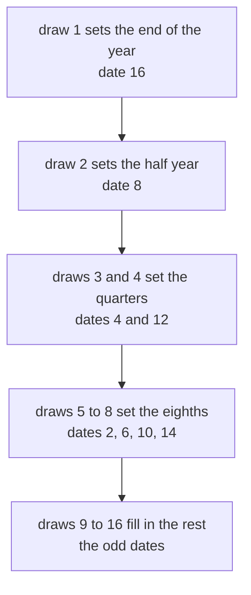
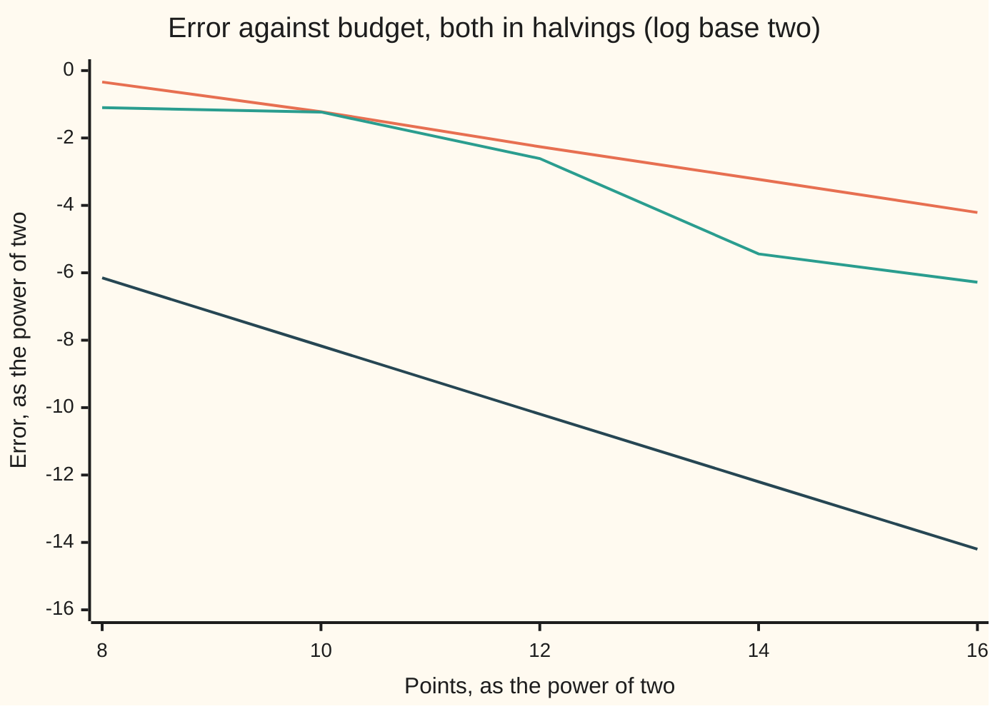

# Quasi-Monte Carlo: Sobol points and the Brownian bridge that makes them work

[Syllabus](../../../SYLLABUS.md) → [Financial mathematics](../../../SYLLABUS.md#w12) → [Numerical Methods for Pricing](../../../SYLLABUS.md#w12-s06) → Quasi-Monte Carlo

---

## General Overview

Acme shares trade at $100.00. A one-year call on them, struck at $100.00, is worth $9.23 in this market. Simulation reaches that price by throwing random paths and averaging what the option pays on each one ([Monte Carlo pricing](01-monte-carlo-pricing.md)).

The trouble is the exchange rate between work and accuracy. A random average improves like one over the square root of the number of paths. One more correct decimal therefore costs a hundred times the paths. Variance reduction buys a constant factor and leaves that square root alone ([Cheaper Monte Carlo](02-variance-reduction-for-pricing.md)).

Quasi-Monte Carlo changes what gets thrown. In place of 4,096 random paths it uses 4,096 points fixed in advance, chosen to cover the space of paths as evenly as points can. Think of points dropped one after another, each into the largest gap the ones before it left; the real name for such a set is a **low-discrepancy sequence**, and the workhorse is Ilya Sobol's, published in 1967. Nothing about it is random, so there is no luck to average out.

On this card the path runs in 16 equal steps, a little over three weeks each, since any payoff that watches the whole path needs them; the call itself looks only at the last date, which is what lets the answer be checked exactly. With 4,096 Sobol points and the path built by **Brownian bridge** — the end drawn first, then the middle, then the middles of the halves — the price comes out at 9.226149, which is 0.000856 from the truth. With 4,096 random paths the error bar alone is 0.209141.

Then comes the catch that this card exists for. The same 4,096 points, used to build the same 16-step path date by date instead, give 9.062881: an error of -0.164125, some 192 times further off. Even points are not enough. The order in which their coordinates are spent on the path decides everything.

**Even, unrandom points beat random ones when almost all of the payoff's variation sits in the first few coordinates, and the Brownian bridge is what puts it there.**

**What kind of fact this is:** a method, with its error measured on this card rather than bounded in advance.

### The picture: which draw sets which date



Date by date, draw 1 would set only the first step and draw 16 the last.

---

## The formula

Three formulas: the average, the points under it, and the rule that turns a point into a path. First the notation, in words. A **coordinate** is one of the 16 numbers a point carries, one per draw the path needs. A **kick** is one draw from the bell curve, of spread one. **XOR**, written $\oplus$, adds binary digits with no carrying, so 1 ⊕ 1 = 0; it is not addition. A **direction number** is one of the fixed fractions a coordinate is built from.

The estimate is an average, exactly as in plain simulation, but over fixed points:

$$\hat C \;=\; \frac{1}{N}\sum_{i=0}^{N-1} f(u_i), \qquad u_{i,j} \;=\; \frac{a_{i,j} + \tfrac12}{N}$$

**Read it aloud:** price 4,096 paths and take the average, where each path comes from one chosen point $u_i$ — its 16 coordinates $u_{i,1}$ to $u_{i,16}$ — rather than from a random number generator, and $f$ is what turns one point into one discounted payoff.

Each coordinate of a Sobol point is an XOR of direction numbers, picked out by the binary digits of the point's index:

$$a_{i,j} \;=\; \bigoplus_{k\,:\,\text{digit } k \text{ of } i \text{ is } 1} m_{k,j}\,2^{\,w-k}, \qquad v_{k,j} = \frac{m_{k,j}}{2^{\,k}}$$

**Read it aloud:** write the point's number in binary, and XOR together the direction numbers its 1s select. The code grows every ladder 30 rungs deep once and shifts it down to the budget.

The bridge fills a gap. Every gap it fills is split down the middle, so the straight line between the two known ends is their average:

$$W_{\text{mid}} \;=\; \frac{W_{\text{left}} + W_{\text{right}}}{2} \;+\; \frac{\sqrt{t_{\text{right}} - t_{\text{left}}}}{2}\;z$$

**Read it aloud:** put the new date halfway between the two dates around it, then step off that line by one fresh kick, scaled by the width of the gap.

The two ends can be any pair of dates with an unfilled date halfway between them; the halving is because the new date sits in that middle.

| Symbol | Plain meaning | In our example | Push it up and the answer… |
| --- | --- | --- | --- |
| $S$, $K$, $r$, $q$, $\sigma$, $T$ | Acme's price, the strike, the bank rate, the dividend yield, the volatility, the years | 100, 100, 5%, 2%, 20%, 1 | the market this shelf prices everything in |
| $C$ | what the call is really worth | 9.227006 | — |
| $\hat C$ | what a method says it is worth | 9.226149 | — |
| $N$ | how many points, always a power of two | 4,096 | the error falls, and for these points it falls fast |
| $u_i$, $f$ | point $i$, meaning its 16 coordinates together; the rule that prices one point | — | — |
| $i$, $j$, $k$ | which point, which coordinate of it (the code prints coordinates as dimensions), which rung of a coordinate's ladder | 0 to 4,095; 1 to 16; 1 to 12 | — |
| $a_{i,j}$ | coordinate $j$ of point $i$, counted in whole grid steps | a whole number, 0 to 4,095 | — |
| $u_{i,j}$ | that grid step nudged to the middle of its cell | 0.125 when $N$ is 4 | — |
| $z$ | the kick a coordinate becomes, through the inverse bell curve | -1.150349 at $u$ = 0.125 | — |
| $m_{k,j}$, $v_{k,j}$ | direction number $k$ of coordinate $j$, as a whole number and as a fraction | 1, 3, 5, 15, 17 over 2, 4, 8, 16, 32 | — |
| $W_i$, $t_i$ | the path's accumulated wiggle at date $i$, and that date in years | date 16 is one year | — |
| $w$ | how many halvings the budget is, so $N = 2^{\,w}$ | 12, since 4,096 = $2^{12}$ | — |
| $\oplus$ | XOR: add binary digits, never carry | 1 ⊕ 1 = 0 | — |

That helper $f$ runs each coordinate through the inverse bell curve to get a kick, hands the 16 kicks to a build rule to get a path, reads Acme's price at the last date, and discounts what the option pays.

### When it holds

- **The budget is a power of two.** At $N$ = 4,096 every coordinate visits all 4,096 cells of its own grid exactly once. Stop at 3,000 points instead and that even cover is gone, and nothing warns of it.
- **The payoff's variation concentrates in the early coordinates.** This is what the bridge arranges. When it fails — a payoff that leans on all 16 dates equally — the error drifts back towards the date-by-date column, -0.164125 at 4,096 points.
- **The payoff has no jumps.** Kinks are fine: the call's kink at the strike costs nothing measurable here. A digital's cliff is a different matter, and the even cover buys much less.
- **There is no error bar.** A deterministic rule has no sampling spread, so the usual scatter over root $N$ means nothing: it claims 0.216036 where the true error is 0.000856.
- **The dimension count stays modest, or hides.** 4,096 points cannot cover a 16-dimensional cube evenly in any strong sense. What saves the method is that the payoff does not really live in 16 dimensions.

---

## Why it works

### Step 0: the price is an integral, not a lottery

A simulated path is built from 16 kicks, and each kick comes from one number between 0 and 1. So one path is one point in a 16-dimensional cube, and the price is the average of the discounted payoff over that cube: an integral.

Random sampling is one way to do an integral, and for a well-behaved integrand a poor one. Once the price is an integral the points can be chosen: they no longer have to be unpredictable, only **even**.

### Step 1: what even means, and why it beats random

Evenness has a measure. Take any box in the cube with one corner at the origin. Compare the share of points inside it with the share of the cube's volume it occupies. The worst gap over all such boxes is the **discrepancy** of the point set.

Random points have a discrepancy of about one over the square root of the count: luck leaves clumps and gaps. Sobol's points are built so that theirs falls almost like one over the count. The Koksma-Hlawka inequality then bounds the error of the average by the discrepancy times a measure of how much the payoff wiggles. That bound is the reason to hope for an error like one over the count, and the rate measured here is a halving per doubling, -1.0064. It is no use as a guarantee: nobody can compute the wiggle measure for a real payoff, and for this one, which climbs without limit near the cube's edge, that measure is infinite, so the bound says nothing at all.

### Step 2: building the points from bit patterns

Each coordinate gets its own ladder of direction numbers: fractions $v_{k,j}$ whose $k$-th binary digit is 1 and whose later digits are anything. Coordinate 1 is the plainest ladder, a half, a quarter, an eighth. Every other coordinate takes its ladder from a **primitive polynomial** in the two-element arithmetic where 1 + 1 = 0: one whose root generates every nonzero element, which is what makes the ladder's digits fill up instead of repeating early. The code tests that rather than trusting it, by counting multiplications by $x$ before the answer returns to 1: for degree 5 the count must be 31, and all 15 polynomials pass.

The recurrence that grows a ladder from that polynomial shifts the earlier whole numbers and XORs them together. For coordinate 2, whose polynomial is $x + 1$, it reads $m_k = 2m_{k-1} \oplus m_{k-1}$, so the ladder is 1, 3, 5, 15, 17; coordinate 3 gives 1, 1, 7, 11, 13.

To get point $i$, write $i$ in binary and XOR the direction numbers its 1s pick out. The digit map from index to coordinate is then triangular with 1s down its diagonal, so it can be run backwards uniquely: every grid value is hit exactly once as $i$ runs over the budget. The code confirms it for all 16 coordinates at all five budgets.

### Step 3: the half-cell nudge

Point 0 has every coordinate 0, and the cube's corner is unusable: no number has zero bell-curve area to its left, so the inverse has nothing to return. Every coordinate is therefore nudged half a cell inward, from its cell's edge to its middle. On a budget of 4 that turns the four values 0, 2, 1, 3 quarters into 0.125, 0.625, 0.375, 0.875.

The nudge is not cosmetic. It makes the rule a midpoint rule, which is accurate, instead of a left-edge rule, which is not. It also depends on the budget, so the point set at 4,096 is not the first 4,096 of the set at 65,536.

### Step 4: from the cube to a path, two ways

A coordinate between 0 and 1 becomes a kick by the inverse bell curve: the number with that much area to its left. Area 0.975 sits at 1.959964, which the code checks against the known value, since it builds both the area and its inverse from scratch.

Sixteen kicks then become a path. Date by date is the obvious rule, each step adding one kick scaled by the root of the step length ([Stepping an SDE](05-discretisation-schemes-for-sdes.md)). The bridge is the other rule, the one the picture above shows: each new date lands on the straight line between its neighbours, plus one kick off it.

Both rules are linear in the kicks, so each is a table of numbers — a matrix — and both tables must describe the same process. The test is the covariance: the wiggle shared by any two dates must equal the earlier date's own time in years. Each build rule is run once per kick, with that kick set to 1 and the rest to 0, which reads off the table column by column. Both tables reproduce the earlier date to every printed decimal, worst gap 0.000000.

<details>
<summary>Detailed proof: the bridge draws the same process</summary>

The bridge uses two properties of Brownian motion and nothing else. Its value at any date is a bell-curve draw whose spread grows with the root of the time elapsed, and what it does inside a gap depends on the world outside that gap only through the gap's two end values.

Take a gap with the path known at both ends and an unfilled date exactly halfway. Conditioning one bell-curve draw on another is standard work, and it gives that middle value as a bell-curve draw whose mean is the average of the two ends and whose spread is half the root of the gap's width. Averaging the ends and adding one independent kick of that size is exactly that draw, which is the formula above.

Now induct on the halvings. Start with the end of the year, $W_{16} = \sqrt{T}\,z_1$: correct, since its spread is the root of a year. Each later step fills a gap whose ends are already correct, using a kick independent of everything drawn so far, so by the paragraph above that date gets its correct conditional law. After 15 such steps every date has been filled, so the whole collection has the joint law of the process sampled at those dates.

The mechanical version of the same claim is the covariance test. Write the build rule as a table of numbers, so that the path is that table applied to the kicks. Since the kicks are independent and each has unit spread, the wiggle shared by two dates is the dot product of their two rows of the table. That dot product must equal the earlier date's time in years, for all 256 pairs. Both build rules pass, which pins them to the same process without any appeal to the argument above.

</details>

### Step 5: why the order of the draws is everything

Both build rules draw the same process, so a *random* simulation cannot tell them apart: it prices the same, to within luck, either way. An even point set is not so indifferent, because its coordinates are not equally good. The early ones cover the cube far better in combination than the late ones, and a sum of 16 coordinates asks for exactly the joint evenness the set cannot deliver.

So the question is how much of the payoff's variation can be pushed into the first few coordinates. For the end of the path the bridge's answer is all of it: the code reads the year end's dependence on draw 1 as 1.000000 and on every later draw as 0.000000, where date by date all 16 draws carry it equally. Since the call looks only at the year end, the 16-dimensional integral collapses into a one-dimensional one in coordinate 1, where an even set is just 4,096 equally spaced cell middles. That is why the error is small and its rate clean.

For a payoff that watches the whole path, the collapse is partial rather than total, and the honest measure is how much of the path's total wiggle the first draws carry:

```
share of the path's whole wiggle carried by the first draws, one block = 2 per cent
bridge order
   draw 1        ██████████████████████████████████                68.75
   draws 1 to 2  ██████████████████████████████████████████        84.56
   draws 1 to 4  ██████████████████████████████████████████████    92.65
   draws 1 to 8  ████████████████████████████████████████████████  97.06
date-by-date order
   draw 1        ██████                                            11.76
   draws 1 to 2  ███████████                                       22.79
   draws 1 to 4  █████████████████████                             42.65
   draws 1 to 8  █████████████████████████████████████             73.53
```

Under the bridge the first two draws carry 84.56 per cent and the last eight under 3 per cent between them; date by date the load is almost flat. That gap is what **effective dimension** names. Russel Caflisch, William Morokoff and Art Owen identified it in 1997 as the reason quasi-Monte Carlo worked on mortgage securities with 360 monthly dates, where the theory said 360 dimensions was hopeless.

### Step 6: what it actually buys, measured

Three roads, five budgets, one true price. The error bar of the random road falls at -0.4837 halvings per doubling, which is the square root law. The even points in date-by-date order manage -0.6475, ragged, because their advantage is being eaten by dimensions. In bridge order they fall at -1.0064: one halving per doubling.



Top line: the random road's error bar. Middle: the same Sobol points in date-by-date order. Bottom: the same points in bridge order. Both axes count doublings, so a straight line is a power law and its slope the exponent. The top line drops one step for every two along, the bottom one for one.

One note on that bottom line. A midpoint rule on a smooth function of one variable does better than this: one over the count squared. This integrand is not that smooth, because the payoff climbs without limit as the coordinate approaches 1, and the end cell holds the error. One halving per doubling is what that cell allows.

A different route to the same gain gives the error bar back: shift every point by one random amount, wrap round the edges, repeat a handful of times and use the scatter of the answers. That is randomised quasi-Monte Carlo, the honest way to quote an uncertainty here (Quasi-Monte Carlo and sparse grids).

---

## Worked numbers, by hand

The whole machine on four points, which is small enough to check with a pencil. Acme: $S$ = 100, $K$ = 100, $r$ = 5%, $q$ = 2%, $\sigma$ = 20%, $T$ = 1 year, and the drift inside the exponent is $r - q - \tfrac12\sigma^2$ = 0.01.

| Step | Arithmetic | Value |
| --- | --- | --- |
| direction numbers, coordinate 1 | halve each time | 1/2, 1/4 |
| the four points, coordinate 1 | XOR the picked ones | 0, 2, 1, 3 quarters |
| nudge each to its cell middle | add half a quarter | 0.125, 0.625, 0.375, 0.875 |
| the kicks | inverse bell curve of each | -1.150349, 0.318639, -0.318639, 1.150349 |
| Acme at one year | 100 e^(0.01 + 0.20 z) | 80.246272, 107.651382, 94.768996, 127.133798 |
| what the call pays | Acme less 100, or nothing | 0, 7.651382, 0, 27.133798 |
| average the four | (7.651382 + 27.133798) / 4 | 8.696295 |
| discount one year | multiply by e^(-0.05) | **8.272172** |
| the same machine, 4,096 points | the code's bridge road | **9.226149** |
| the truth | the closed formula | 9.227006 |

Four points give 8.27: the error is -0.954834, because four cells cannot see the far tail where the option pays most. Four thousand points reach 9.226149, and the remaining 0.000856 is the end cell's stubbornness, not luck.

### What breaks if you drop a piece

| Mistake | Comes out at | What went wrong |
| --- | --- | --- |
| The same 4,096 points, path built date by date | 9.062881, error -0.164125 | the payoff's variation is spread over all 16 coordinates, where the even cover is weak: 192 times the bridge's error |
| Four times the budget, still date by date | 9.203952, error -0.023054 | 16,384 points in date order are still 27 times further off than 4,096 in bridge order |
| Quoting the payoff scatter over root $N$ as an error bar | 0.216036 | there is no sampling error to estimate; the true error was 0.000856, so the bar is not wrong by a little |
| Using 4,096 random paths instead | error bar 0.209141, this run -0.175625 | the square root law, working exactly as advertised |

Every number in that table is printed by the code below.

---

## Code, from first principles, and it actually runs

Nothing is imported that knows an answer. The bell-curve area is a series written out; its inverse is a coarse table of that series plus two Newton steps; the direction numbers are grown from polynomials the code tests for primitivity; the random stream is a recurrence written out. The price is reached by four roads — the closed formula, the Sobol points in bridge order, the same points in date order, and pseudorandom paths — behind which stand three exact structural checks: every polynomial's primitivity, every coordinate's grid cover, and both build tables against the covariance of the process they claim to draw.

### Python

```python
# Quasi-Monte Carlo and the Brownian bridge -- the check behind the card.  Standard library only,
# and nothing imported that already knows an answer: the bell-curve area is a series written out
# here, its inverse is Newton's method on that series, the Sobol directions are built and their
# polynomials tested, and the pseudorandom stream is written out.  Acme: S = 100, K = 100,
# r = 5%, q = 2%, sigma = 20%, one year, a call, on a path cut into 16 steps.
from math import exp, log, pi, sqrt
S, K, R, Q, SIG, T = 100.0, 100.0, 0.05, 0.02, 0.20, 1.0
HOUSE = 9.227005508154                  # the shelf's Black-Scholes call price
D, WORD, MS = 16, 30, (8, 10, 12, 14, 16)
DT = T / D
POLYS = [3, 7, 11, 13, 19, 25, 37, 41, 47, 55, 59, 61, 67, 91, 97]   # x+1, x^2+x+1, x^3+x+1, ...
def phi(x): return exp(-0.5 * x * x) / sqrt(2.0 * pi)          # bell-curve height at x
def ncdf(x):                            # area under the bell curve to the left of x
    z, term, tot, n = abs(x) / sqrt(2.0), 1.0, 1.0, 0
    while term > 1e-17 * tot:           # every term positive, so nothing cancels
        n, term = n + 1, term * 2.0 * z * z / (2 * n + 3)
        tot += term
    a = 2.0 * z * exp(-z * z) * tot / sqrt(pi)
    return 0.5 * (1.0 + a) if x >= 0.0 else 0.5 * (1.0 - a)
GN = 480                                # a coarse table of that area, to start Newton off
GP = [ncdf(-6.0 + 12.0 * i / GN) for i in range(GN + 1)]
def ninv(u):                            # the inverse: read the table, then Newton twice
    lo, hi = 0, GN
    while hi - lo > 1:
        mid = (lo + hi) // 2
        lo, hi = (mid, hi) if GP[mid] <= u else (lo, mid)
    x = -6.0 + 12.0 * lo / GN + (u - GP[lo]) * (12.0 / GN) / (GP[hi] - GP[lo])
    for _ in range(2): x -= (ncdf(x) - u) / phi(x)
    return x
def order(p):                           # multiplies by x that return to 1, in the ring
    s, x, k = p.bit_length() - 1, 1, 0
    while x != 1 or k == 0: x, k = ((x << 1) ^ p if ((x << 1) >> s) & 1 else x << 1), k + 1
    return k
def directions(poly):                   # direction integers from Sobol's recurrence
    s, v = poly.bit_length() - 1, [0] * (WORD + 1)
    for k in range(1, s + 1): v[k] = 1 << (WORD - k)     # every start 1: the simplest legal choice
    for k in range(s + 1, WORD + 1):
        v[k] = v[k - s] ^ (v[k - s] >> s)
        for i in range(1, s): v[k] ^= v[k - i] if (poly >> (s - i)) & 1 else 0
    return v
VS = [[1 << (WORD - k) if k else 0 for k in range(WORD + 1)]] + [directions(p) for p in POLYS]
def point(i, v):                        # one coordinate of Sobol point i: XOR its 1-bits
    a, j = 0, 1
    while i:
        a, i, j = (a ^ v[j] if i & 1 else a), i >> 1, j + 1
    return a
def grid(m):                            # the first 2^m points, each coordinate a whole step
    return [[point(i, v) >> (WORD - m) for v in VS] for i in range(1 << m)]
def natural(z):                         # the path in time order: each step adds one draw
    w = [sqrt(DT) * z[0]]
    for k in range(1, D): w.append(w[k - 1] + sqrt(DT) * z[k])
    return w
def bridge(z):                          # the end first, then midpoints, the gap halving
    w, j, gap = [0.0] * D + [sqrt(T) * z[0]], 1, D
    while gap > 1:
        half, a = gap // 2, 0
        while a + gap <= D:
            w[a + half] = 0.5 * (w[a] + w[a + gap]) + 0.5 * sqrt(gap * DT) * z[j]
            j, a = j + 1, a + gap
        gap = half
    return w[1:]
def acme(w): return S * exp((R - Q - 0.5 * SIG * SIG) * T + SIG * w[D - 1])   # Acme at one year
def payoff(w): return exp(-R * T) * max(acme(w) - K, 0.0)   # the discounted call payoff
def columns(build):                     # column i: the path built from draw i alone
    return [build([1.0 if j == i else 0.0 for j in range(D)]) for i in range(D)]
def cov_gap(cols):                      # the built covariance against min(t_i, t_j)
    return max(abs(sum(cols[i][k] * cols[i][l] for i in range(D)) - min(k + 1, l + 1) * DT)
               for k in range(D) for l in range(D))
def carried(cols):                      # share of the path's wiggle in the first 1, 2, 4, 8
    sq = [sum(v * v for v in c) for c in cols]
    return " ".join(f"{100.0 * sum(sq[:k]) / sum(sq):.2f}" for k in (1, 2, 4, 8))
def bs_call():                          # road one: the closed formula, own bell-curve area
    d1 = (log(S / K) + (R - Q + 0.5 * SIG * SIG) * T) / (SIG * sqrt(T))
    return S * exp(-Q * T) * ncdf(d1) - K * exp(-R * T) * ncdf(d1 - SIG * sqrt(T))
STATE = [20260919]                      # road four: pseudorandom paths, an LCG written out
def nxt():                              # one step of that stream, then one kick
    STATE[0] = (6364136223846793005 * STATE[0] + 1442695040888963407) % 2 ** 64
    return ninv(((STATE[0] >> 11) + 0.5) * 2.0 ** -53)
def row(label, value, tail=""): print(f"{label:<52}{value:>12.6f}{tail}")
exact, cn, cb = bs_call(), columns(natural), columns(bridge)
later = max(abs(cb[i][D - 1]) for i in range(1, D))
print(f"Acme: S {S:.2f}  K {K:.2f}  r 5%  q 2%  sigma 20%  T 1 year, a call on a {D}-step path")
row("road one, the closed formula", exact, f"   the shelf's house number {HOUSE:.6f}")
row("our bell-curve area at 1", ncdf(1.0), f"   known 0.841345, and the 97.5% point {ninv(0.975):.6f}")
print(f"{'primitive polynomial degrees, dimensions 2 to 16':<52}{[p.bit_length() - 1 for p in POLYS]}")
for j in (1, 2): print(f"{'direction integers m_1 to m_5, dimension ' + str(j + 1):<52}{[VS[j][k] >> (WORD - k) for k in range(1, 6)]}")
print(f"{'worst gap against min(t_i, t_j)':<52}time order {cov_gap(cn):.6f}, bridge {cov_gap(cb):.6f}")
row("the bridge's end point from draw one alone", cb[0][D - 1], f"   from every later draw {later:.6f}")
print(f"{'share of the wiggle in draws 1, 2, 4, 8, bridge':<52}{carried(cb)}")
print(f"{'the same shares in time order':<52}{carried(cn)}")
print("\nby hand, four points in bridge order: cell middle, kick, Acme at one year, payoff")
raw, z4 = 0.0, [ninv((b + 0.5) / 4.0) for b in range(4)]
for p in grid(2):
    st = acme(bridge([z4[b] for b in p]))
    raw += max(st - K, 0.0)
    print(f"   {(p[0] + 0.5) / 4.0:>10.6f} {z4[p[0]]:>11.6f} {st:>13.6f} {max(st - K, 0.0):>12.6f}")
row("   their average payoff", raw / 4.0, f"   discounted {exp(-R * T) * raw / 4.0:.6f}, error {exp(-R * T) * raw / 4.0 - exact:+.6f}")
print(f"\n{'N':>6}  {'Monte Carlo':>12}{'its error bar':>15}  {'Sobol, time order':>18}  {'Sobol, bridge':>14}")
res, perm = {}, True
for m in MS:
    n, qn, qb, sq, tot, tsq = 1 << m, 0.0, 0.0, 0.0, 0.0, 0.0
    ints = grid(m)
    perm = perm and all(sorted(p[j] for p in ints) == list(range(n)) for j in range(D))
    zs = [ninv((b + 0.5) / n) for b in range(n)]
    for p in ints:
        z = [zs[b] for b in p]
        v = payoff(bridge(z))
        qn, qb, sq = qn + payoff(natural(z)), qb + v, sq + v * v
    for _ in range(n):
        v = payoff(natural([nxt() for _ in range(D)]))
        tot, tsq = tot + v, tsq + v * v
    mc, qb = tot / n, qb / n
    bar = sqrt(max(tsq / n - mc * mc, 0.0) / (n - 1))
    fake = sqrt(max(sq / n - qb * qb, 0.0) / (n - 1))
    res[m] = (mc - exact, bar, qn / n - exact, qb - exact, fake)
    print(f"{n:>6}  {res[m][0]:>+12.6f}{bar:>15.6f}  {res[m][2]:>+18.6f}  {res[m][3]:>+14.6f}")
sl = [log(abs(res[MS[-1]][c] / res[MS[0]][c])) / log(2.0) / (MS[-1] - MS[0]) for c in (1, 2, 3)]
print(f"{'every coordinate a permutation of its own grid':<52}{'yes' if perm else 'no'}, on {len({tuple(v) for v in VS})} different direction rows")
print(f"error halvings per doubling, 256 to 65536: error bar {sl[0]:+.4f}, time order {sl[1]:+.4f}, bridge {sl[2]:+.4f}")
print(f"{'chart, log2 of the budget':<41}" + " ".join(f"{m:>6}" for m in MS))
for lab, c in (("Monte Carlo error bar", 1), ("Sobol in time order", 2), ("Sobol in bridge order", 3)):
    print(f"{'chart, log2 error, ' + lab:<41}" + " ".join(f"{log(abs(res[m][c])) / log(2.0):>6.2f}" for m in MS))
print()
row("right: Sobol in bridge order, 4,096 points", exact + res[12][3], f"   error {res[12][3]:+.6f}")
row("wrong: Sobol in time order, 4,096 points", exact + res[12][2], f"   error {res[12][2]:+.6f}, {abs(res[12][2] / res[12][3]):.0f} times the bridge's")
row("wrong: time order at 16,384 against bridge at 4,096", exact + res[14][2], f"   error {res[14][2]:+.6f}, {abs(res[14][2] / res[12][3]):.0f} times")
row("wrong: payoff scatter over root N as an error bar", res[12][4], f"   true error {res[12][3]:+.6f}")
assert all(order(p) == (1 << (p.bit_length() - 1)) - 1 for p in POLYS)   # every one primitive
assert abs(exact - HOUSE) < 1e-9                    # our own formula vs the shelf's number
assert abs(ncdf(1.0) - 0.8413447460685429) < 1e-12 and abs(ninv(0.975) - 1.959963984540054) < 1e-9
assert cov_gap(cn) < 1e-12 and cov_gap(cb) < 1e-12  # both maps rebuild min(t_i, t_j)
assert abs(cb[0][D - 1] - sqrt(T)) < 1e-15 and later < 1e-15   # the end point is one draw
assert perm and len({tuple(v) for v in VS}) == D    # stratified, and 16 different rows
assert abs(res[16][0]) < 3.0 * res[16][1]           # the random road inside three error bars
assert abs(res[12][3]) < 0.001                      # the bridge, inside a tenth of a cent
assert abs(res[12][3]) < 0.01 * abs(res[12][2])     # a hundred times closer than time order
assert abs(res[12][3]) < 0.1 * abs(res[14][2])      # beating time order at four times the budget
assert -0.55 < sl[0] < -0.45 and sl[2] < -0.9       # the two rates, measured
assert res[12][4] > 100.0 * abs(res[12][3])         # the fake error bar is not an error
print("ALL CHECKS PASS")
```

**Ran 2026-09-19 on macOS, Python 3.14.6, standard library only. All checks passed. Output, pasted from the run:**

```
Acme: S 100.00  K 100.00  r 5%  q 2%  sigma 20%  T 1 year, a call on a 16-step path
road one, the closed formula                            9.227006   the shelf's house number 9.227006
our bell-curve area at 1                                0.841345   known 0.841345, and the 97.5% point 1.959964
primitive polynomial degrees, dimensions 2 to 16    [1, 2, 3, 3, 4, 4, 5, 5, 5, 5, 5, 5, 6, 6, 6]
direction integers m_1 to m_5, dimension 2          [1, 3, 5, 15, 17]
direction integers m_1 to m_5, dimension 3          [1, 1, 7, 11, 13]
worst gap against min(t_i, t_j)                     time order 0.000000, bridge 0.000000
the bridge's end point from draw one alone              1.000000   from every later draw 0.000000
share of the wiggle in draws 1, 2, 4, 8, bridge     68.75 84.56 92.65 97.06
the same shares in time order                       11.76 22.79 42.65 73.53

by hand, four points in bridge order: cell middle, kick, Acme at one year, payoff
     0.125000   -1.150349     80.246272     0.000000
     0.625000    0.318639    107.651382     7.651382
     0.375000   -0.318639     94.768996     0.000000
     0.875000    1.150349    127.133798    27.133798
   their average payoff                                 8.696295   discounted 8.272172, error -0.954834

     N   Monte Carlo  its error bar   Sobol, time order   Sobol, bridge
   256     -1.478020       0.788683           +0.465311       -0.014096
  1024     -0.566543       0.429019           -0.426504       -0.003466
  4096     -0.175625       0.209141           -0.164125       -0.000856
 16384     -0.019555       0.106731           -0.023054       -0.000213
 65536     -0.036697       0.053957           -0.012837       -0.000053
every coordinate a permutation of its own grid      yes, on 16 different direction rows
error halvings per doubling, 256 to 65536: error bar -0.4837, time order -0.6475, bridge -1.0064
chart, log2 of the budget                     8     10     12     14     16
chart, log2 error, Monte Carlo error bar  -0.34  -1.22  -2.26  -3.23  -4.21
chart, log2 error, Sobol in time order    -1.10  -1.23  -2.61  -5.44  -6.28
chart, log2 error, Sobol in bridge order  -6.15  -8.17 -10.19 -12.20 -14.20

right: Sobol in bridge order, 4,096 points              9.226149   error -0.000856
wrong: Sobol in time order, 4,096 points                9.062881   error -0.164125, 192 times the bridge's
wrong: time order at 16,384 against bridge at 4,096     9.203952   error -0.023054, 27 times
wrong: payoff scatter over root N as an error bar       0.216036   true error -0.000856
ALL CHECKS PASS
```

### Rust

Same inputs, same labels, same arithmetic in the same order, built with `rustc --edition 2021 -O`.

```rust
// Quasi-Monte Carlo and the Brownian bridge -- the same check as the Python, in Rust, std only
// and no crates.  Nothing here knows an answer in advance either: the bell-curve area is the
// same series written out, its inverse is Newton's method on that series, the Sobol directions
// are built and their polynomials tested, and the pseudorandom stream is written out.  Acme:
// S = 100, K = 100, r = 5%, q = 2%, sigma = 20%, one year, a call, on a path cut into 16 steps.
use std::f64::consts::PI;
use std::sync::LazyLock;
const S: f64 = 100.0; const K: f64 = 100.0; const R: f64 = 0.05; const Q: f64 = 0.02;
const SIG: f64 = 0.20; const T: f64 = 1.0; const HOUSE: f64 = 9.227005508154;
const D: usize = 16; const WORD: usize = 30; const DT: f64 = T / D as f64; const GN: usize = 480;
const MS: [usize; 5] = [8, 10, 12, 14, 16];
const POLYS: [u64; 15] = [3, 7, 11, 13, 19, 25, 37, 41, 47, 55, 59, 61, 67, 91, 97];
fn phi(x: f64) -> f64 { (-0.5 * x * x).exp() / (2.0 * PI).sqrt() }      // bell-curve height at x
fn ncdf(x: f64) -> f64 {                    // area under the bell curve to the left of x
    let (z, mut term, mut tot, mut n) = (x.abs() / 2.0f64.sqrt(), 1.0f64, 1.0f64, 0u32);
    while term > 1e-17 * tot { term = term * 2.0 * z * z / (2 * n + 3) as f64; n += 1; tot += term }
    let a = 2.0 * z * (-z * z).exp() * tot / PI.sqrt();   // every term positive, nothing cancels
    if x >= 0.0 { 0.5 * (1.0 + a) } else { 0.5 * (1.0 - a) }
}                                           // a coarse table of that area, to start Newton off
static GP: LazyLock<Vec<f64>> = LazyLock::new(|| (0..=GN).map(|i| ncdf(-6.0 + 12.0 * i as f64 / GN as f64)).collect());
fn ninv(u: f64) -> f64 {                    // the inverse: read the table, then Newton twice
    let (mut lo, mut hi) = (0usize, GN);
    while hi - lo > 1 { let mid = (lo + hi) / 2; if GP[mid] <= u { lo = mid } else { hi = mid } }
    let mut x = -6.0 + 12.0 * lo as f64 / GN as f64 + (u - GP[lo]) * (12.0 / GN as f64) / (GP[hi] - GP[lo]);
    for _ in 0..2 { x -= (ncdf(x) - u) / phi(x) }
    x
}
fn order(p: u64) -> u32 {                   // multiplies by x that return to 1, in the ring
    let (s, mut x, mut k) = (p.ilog2(), 1u64, 0u32);
    while x != 1 || k == 0 { x = if ((x << 1) >> s) & 1 == 1 { (x << 1) ^ p } else { x << 1 }; k += 1 }
    k
}
fn directions(poly: u64) -> Vec<u64> {      // direction integers from Sobol's recurrence
    let (s, mut v) = (poly.ilog2() as usize, vec![0u64; WORD + 1]);
    for k in 1..=s { v[k] = 1 << (WORD - k) }    // every start 1: the simplest legal choice
    for k in s + 1..=WORD {
        v[k] = v[k - s] ^ (v[k - s] >> s);
        for i in 1..s { if (poly >> (s - i)) & 1 == 1 { v[k] ^= v[k - i] } }
    }
    v
}
fn point(mut i: usize, v: &[u64]) -> u64 {  // one coordinate of Sobol point i: XOR its 1-bits
    let (mut a, mut j) = (0u64, 1usize);
    while i > 0 { if i & 1 == 1 { a ^= v[j] } i >>= 1; j += 1 }
    a
}
fn grid(m: usize, vs: &[Vec<u64>]) -> Vec<Vec<usize>> {   // the first 2^m points, in whole steps
    (0..1usize << m).map(|i| vs.iter().map(|v| (point(i, v) >> (WORD - m)) as usize).collect()).collect()
}
fn natural(z: &[f64]) -> Vec<f64> {         // the path in time order: each step adds one draw
    let mut w = vec![DT.sqrt() * z[0]];
    for k in 1..D { w.push(w[k - 1] + DT.sqrt() * z[k]) }
    w
}
fn bridge(z: &[f64]) -> Vec<f64> {          // the end first, then midpoints, the gap halving
    let (mut w, mut j, mut gap) = (vec![0.0f64; D + 1], 1usize, D);
    w[D] = T.sqrt() * z[0];
    while gap > 1 {
        let (half, mut a) = (gap / 2, 0usize);
        while a + gap <= D { w[a + half] = 0.5 * (w[a] + w[a + gap]) + 0.5 * (gap as f64 * DT).sqrt() * z[j]; j += 1; a += gap }
        gap = half;
    }
    w[1..].to_vec()
}
fn acme(w: &[f64]) -> f64 { S * ((R - Q - 0.5 * SIG * SIG) * T + SIG * w[D - 1]).exp() }
fn payoff(w: &[f64]) -> f64 { (-R * T).exp() * (acme(w) - K).max(0.0) }
fn columns(build: fn(&[f64]) -> Vec<f64>) -> Vec<Vec<f64>> {   // the path from draw i alone
    (0..D).map(|i| build(&(0..D).map(|j| if j == i { 1.0 } else { 0.0 }).collect::<Vec<f64>>())).collect()
}
fn cov_gap(cols: &[Vec<f64>]) -> f64 {      // the built covariance against min(t_i, t_j)
    let mut worst = 0.0f64;
    for k in 0..D { for l in 0..D {
        let c: f64 = (0..D).map(|i| cols[i][k] * cols[i][l]).sum();
        worst = worst.max((c - (k + 1).min(l + 1) as f64 * DT).abs());
    } }
    worst
}
fn carried(cols: &[Vec<f64>]) -> String {   // share of the path's wiggle in the first 1, 2, 4, 8
    let sq: Vec<f64> = cols.iter().map(|c| c.iter().map(|v| v * v).sum()).collect();
    [1usize, 2, 4, 8].iter().map(|&k| format!("{:.2}", 100.0 * sq[..k].iter().sum::<f64>() / sq.iter().sum::<f64>())).collect::<Vec<String>>().join(" ")
}
fn bs_call() -> f64 {                       // road one: the closed formula, own bell-curve area
    let d1 = ((S / K).ln() + (R - Q + 0.5 * SIG * SIG) * T) / (SIG * T.sqrt());
    S * (-Q * T).exp() * ncdf(d1) - K * (-R * T).exp() * ncdf(d1 - SIG * T.sqrt())
}
fn nxt(state: &mut u64) -> f64 {            // one step of the stream, then one kick
    *state = state.wrapping_mul(6364136223846793005).wrapping_add(1442695040888963407);
    ninv(((*state >> 11) as f64 + 0.5) * 2.0f64.powi(-53))
}
fn row(label: &str, value: f64, tail: &str) { println!("{:<52}{:>12.6}{}", label, value, tail) }
fn main() {
    let mut vs: Vec<Vec<u64>> = vec![(0..=WORD).map(|k| if k > 0 { 1 << (WORD - k) } else { 0 }).collect()];
    for p in POLYS { vs.push(directions(p)) }
    let (exact, cn, cb) = (bs_call(), columns(natural), columns(bridge));
    let later = (1..D).map(|i| cb[i][D - 1].abs()).fold(0.0f64, f64::max);
    let mut uniq = vs.clone(); uniq.sort(); uniq.dedup();
    println!("Acme: S {:.2}  K {:.2}  r 5%  q 2%  sigma 20%  T 1 year, a call on a {}-step path", S, K, D);
    row("road one, the closed formula", exact, &format!("   the shelf's house number {:.6}", HOUSE));
    row("our bell-curve area at 1", ncdf(1.0), &format!("   known 0.841345, and the 97.5% point {:.6}", ninv(0.975)));
    println!("{:<52}{:?}", "primitive polynomial degrees, dimensions 2 to 16", POLYS.iter().map(|p| p.ilog2()).collect::<Vec<u32>>());
    for j in 1..3 { println!("{:<52}{:?}", format!("direction integers m_1 to m_5, dimension {}", j + 1), (1..6).map(|k| vs[j][k] >> (WORD - k)).collect::<Vec<u64>>()) }
    println!("{:<52}time order {:.6}, bridge {:.6}", "worst gap against min(t_i, t_j)", cov_gap(&cn), cov_gap(&cb));
    row("the bridge's end point from draw one alone", cb[0][D - 1], &format!("   from every later draw {:.6}", later));
    println!("{:<52}{}", "share of the wiggle in draws 1, 2, 4, 8, bridge", carried(&cb));
    println!("{:<52}{}", "the same shares in time order", carried(&cn));
    println!("\nby hand, four points in bridge order: cell middle, kick, Acme at one year, payoff");
    let z4: Vec<f64> = (0..4).map(|b| ninv((b as f64 + 0.5) / 4.0)).collect();
    let mut raw = 0.0f64;
    for p in grid(2, &vs) {
        let st = acme(&bridge(&p.iter().map(|&b| z4[b]).collect::<Vec<f64>>()));
        raw += (st - K).max(0.0);
        println!("   {:>10.6} {:>11.6} {:>13.6} {:>12.6}", (p[0] as f64 + 0.5) / 4.0, z4[p[0]], st, (st - K).max(0.0));
    }
    row("   their average payoff", raw / 4.0, &format!("   discounted {:.6}, error {:+.6}", (-R * T).exp() * raw / 4.0, (-R * T).exp() * raw / 4.0 - exact));
    println!("\n{:>6}  {:>12}{:>15}  {:>18}  {:>14}", "N", "Monte Carlo", "its error bar", "Sobol, time order", "Sobol, bridge");
    let (mut res, mut perm, mut state): (Vec<[f64; 5]>, bool, u64) = (vec![], true, 20260919);
    for &m in MS.iter() {
        let n = 1usize << m;
        let ints = grid(m, &vs);
        for j in 0..D {
            let mut c: Vec<usize> = ints.iter().map(|p| p[j]).collect();
            c.sort();
            perm = perm && c == (0..n).collect::<Vec<usize>>();
        }
        let zs: Vec<f64> = (0..n).map(|b| ninv((b as f64 + 0.5) / n as f64)).collect();
        let (mut qn, mut qb, mut sq, mut tot, mut tsq) = (0.0f64, 0.0f64, 0.0f64, 0.0f64, 0.0f64);
        for p in &ints {
            let z: Vec<f64> = p.iter().map(|&b| zs[b]).collect();
            let v = payoff(&bridge(&z));
            qn += payoff(&natural(&z)); qb += v; sq += v * v;
        }
        for _ in 0..n {
            let v = payoff(&natural(&(0..D).map(|_| nxt(&mut state)).collect::<Vec<f64>>()));
            tot += v; tsq += v * v;
        }
        let (mc, qbm) = (tot / n as f64, qb / n as f64);
        let bar = ((tsq / n as f64 - mc * mc).max(0.0) / (n - 1) as f64).sqrt();
        let fake = ((sq / n as f64 - qbm * qbm).max(0.0) / (n - 1) as f64).sqrt();
        res.push([mc - exact, bar, qn / n as f64 - exact, qbm - exact, fake]);
        println!("{:>6}  {:>+12.6}{:>15.6}  {:>+18.6}  {:>+14.6}", n, mc - exact, bar, qn / n as f64 - exact, qbm - exact);
    }
    let sl: Vec<f64> = [1usize, 2, 3].iter().map(|&c| (res[4][c] / res[0][c]).abs().ln() / 2.0f64.ln() / (MS[4] - MS[0]) as f64).collect();
    println!("{:<52}{}, on {} different direction rows", "every coordinate a permutation of its own grid", if perm { "yes" } else { "no" }, uniq.len());
    println!("error halvings per doubling, 256 to 65536: error bar {:+.4}, time order {:+.4}, bridge {:+.4}", sl[0], sl[1], sl[2]);
    println!("{:<41}{}", "chart, log2 of the budget", MS.iter().map(|m| format!("{:>6}", m)).collect::<Vec<String>>().join(" "));
    for (lab, c) in [("Monte Carlo error bar", 1usize), ("Sobol in time order", 2), ("Sobol in bridge order", 3)] {
        println!("{:<41}{}", format!("chart, log2 error, {}", lab), (0..5).map(|i| format!("{:>6.2}", res[i][c].abs().ln() / 2.0f64.ln())).collect::<Vec<String>>().join(" "));
    }
    println!();
    row("right: Sobol in bridge order, 4,096 points", exact + res[2][3], &format!("   error {:+.6}", res[2][3]));
    row("wrong: Sobol in time order, 4,096 points", exact + res[2][2], &format!("   error {:+.6}, {:.0} times the bridge's", res[2][2], (res[2][2] / res[2][3]).abs()));
    row("wrong: time order at 16,384 against bridge at 4,096", exact + res[3][2], &format!("   error {:+.6}, {:.0} times", res[3][2], (res[3][2] / res[2][3]).abs()));
    row("wrong: payoff scatter over root N as an error bar", res[2][4], &format!("   true error {:+.6}", res[2][3]));
    assert!(POLYS.iter().all(|&p| order(p) == (1u32 << p.ilog2()) - 1));   // every one primitive
    assert!((exact - HOUSE).abs() < 1e-9);              // our own formula vs the shelf's number
    assert!((ncdf(1.0) - 0.8413447460685429).abs() < 1e-12 && (ninv(0.975) - 1.959963984540054).abs() < 1e-9);
    assert!(cov_gap(&cn) < 1e-12 && cov_gap(&cb) < 1e-12);   // both maps rebuild min(t_i, t_j)
    assert!((cb[0][D - 1] - T.sqrt()).abs() < 1e-15 && later < 1e-15);   // the end is one draw
    assert!(perm && uniq.len() == D);                   // stratified, and 16 different rows
    assert!(res[4][0].abs() < 3.0 * res[4][1]);         // the random road inside three error bars
    assert!(res[2][3].abs() < 0.001);                   // the bridge, inside a tenth of a cent
    assert!(res[2][3].abs() < 0.01 * res[2][2].abs());  // a hundred times closer than time order
    assert!(res[2][3].abs() < 0.1 * res[3][2].abs());   // beating time order at four times the budget
    assert!(sl[0] > -0.55 && sl[0] < -0.45 && sl[2] < -0.9);   // the two rates, measured
    assert!(res[2][4] > 100.0 * res[2][3].abs());       // the fake error bar is not an error
    println!("ALL CHECKS PASS");
}
```

**Ran 2026-09-19 on macOS, rustc 1.98.1, no crates. All checks passed. Output, pasted from the run:**

```
Acme: S 100.00  K 100.00  r 5%  q 2%  sigma 20%  T 1 year, a call on a 16-step path
road one, the closed formula                            9.227006   the shelf's house number 9.227006
our bell-curve area at 1                                0.841345   known 0.841345, and the 97.5% point 1.959964
primitive polynomial degrees, dimensions 2 to 16    [1, 2, 3, 3, 4, 4, 5, 5, 5, 5, 5, 5, 6, 6, 6]
direction integers m_1 to m_5, dimension 2          [1, 3, 5, 15, 17]
direction integers m_1 to m_5, dimension 3          [1, 1, 7, 11, 13]
worst gap against min(t_i, t_j)                     time order 0.000000, bridge 0.000000
the bridge's end point from draw one alone              1.000000   from every later draw 0.000000
share of the wiggle in draws 1, 2, 4, 8, bridge     68.75 84.56 92.65 97.06
the same shares in time order                       11.76 22.79 42.65 73.53

by hand, four points in bridge order: cell middle, kick, Acme at one year, payoff
     0.125000   -1.150349     80.246272     0.000000
     0.625000    0.318639    107.651382     7.651382
     0.375000   -0.318639     94.768996     0.000000
     0.875000    1.150349    127.133798    27.133798
   their average payoff                                 8.696295   discounted 8.272172, error -0.954834

     N   Monte Carlo  its error bar   Sobol, time order   Sobol, bridge
   256     -1.478020       0.788683           +0.465311       -0.014096
  1024     -0.566543       0.429019           -0.426504       -0.003466
  4096     -0.175625       0.209141           -0.164125       -0.000856
 16384     -0.019555       0.106731           -0.023054       -0.000213
 65536     -0.036697       0.053957           -0.012837       -0.000053
every coordinate a permutation of its own grid      yes, on 16 different direction rows
error halvings per doubling, 256 to 65536: error bar -0.4837, time order -0.6475, bridge -1.0064
chart, log2 of the budget                     8     10     12     14     16
chart, log2 error, Monte Carlo error bar  -0.34  -1.22  -2.26  -3.23  -4.21
chart, log2 error, Sobol in time order    -1.10  -1.23  -2.61  -5.44  -6.28
chart, log2 error, Sobol in bridge order  -6.15  -8.17 -10.19 -12.20 -14.20

right: Sobol in bridge order, 4,096 points              9.226149   error -0.000856
wrong: Sobol in time order, 4,096 points                9.062881   error -0.164125, 192 times the bridge's
wrong: time order at 16,384 against bridge at 4,096     9.203952   error -0.023054, 27 times
wrong: payoff scatter over root N as an error bar       0.216036   true error -0.000856
ALL CHECKS PASS
```

The two outputs match line for line: two languages, one series for the bell-curve area, one recurrence for the points, the same 36 lines.

> [!TIP]
> **Try changing**
> Guess the direction first, then run it. The asserts are pinned to 16 dates and the 4,096-point budget, so expect one to stop the program.
> - **Halve the dates.** Set `D = 8`. The date-by-date column improves, since there are half as many dimensions to spread the payoff over. The bridge column barely moves: it was already living in one dimension.
> - **Take the nudge away.** Change `(b + 0.5) / n` to `b / n` in the Sobol road. The rule falls from a midpoint rule to a left-edge rule, the first point lands on the cube's corner where the inverse bell curve has nothing to return, and the tenth-of-a-cent assert stops the run.
> - **Break a polynomial.** Change the first entry of `POLYS` from `3` to `5`, which is not primitive. The prices print, and then the primitivity assert stops the run.
> - **Ask for a budget that is not a power of two.** Slice `ints` to its first 3,000 points. The permutation assert fails: the coordinates no longer cover their grids once each, and the evenness the whole method rests on is gone.

---

## The usual mistake

> [!warning]
> **Quoting a standard error for a quasi-Monte Carlo price.** The points are fixed. Run it twice and the same number comes back, so there is no sampling spread to measure. The payoff scatter over root $N$ comes out at 0.216036 here while the true error is 0.000856: the bar is not merely inaccurate, it is measuring something that does not exist. Randomise the points if an honest bar is needed.
>
> Four smaller traps, each with its own wrong number:
> - **Using even points with a date-by-date build.** Same points, same payoff, and the error goes from 0.000856 to 0.164125. The build rule is not a detail. It is the method.
> - **Believing the rate is what the theory promises.** The bound behind Sobol's points carries a logarithm raised to the power of the dimension, and at 16 dimensions with 4,096 points that factor is astronomical: the bound says nothing useful. The rates here, -1.0064 in bridge order and -0.6475 in date order, are facts about this payoff, not guarantees.
> - **Forgetting that the point set depends on the budget.** The half-cell nudge is half a cell of *this* budget, so the 4,096 points are not the first 4,096 of the 65,536. Merging runs of different sizes averages two different rules.
> - **Reading the two-decimal shares as the promise.** Under the bridge draw 1 carries 68.75 per cent of the path's wiggle, not 100 per cent. The full collapse into one coordinate happens only because this card's payoff looks at the last date alone. An Asian option keeps a real tail of coordinates, and the gain shrinks accordingly.

---

## Where you meet it in real life

- **Mortgage-backed securities.** The case that made the method's reputation: 360 monthly dates, and quasi-Monte Carlo working far better than 360 dimensions had any right to, because the cashflows lean on the early, bridge-ordered coordinates.
- **Exotic desks.** Asians, barriers and baskets are priced on tens or hundreds of dates, which is where the even points pay for themselves; correlated underlyings add a second build rule on top of this one ([Correlated paths](04-correlated-paths-and-cholesky.md)).
- **Overnight risk runs and sensitivities.** A fixed point set makes yesterday's number reproducible to the last digit, which matters more to a risk controller than to a mathematician; and bumping an input, then re-pricing on *the same* points, cancels most of the error in the difference.
- **Where it does not go.** Exercise decisions need paths in time order for the regression, so the bridge sits awkwardly with least-squares Monte Carlo ([Longstaff-Schwartz](06-longstaff-schwartz-least-squares-monte-carlo.md)), and a one-dimensional European call is better priced on a grid ([Pricing on a grid](07-finite-differences-for-the-black-scholes-equation.md)) or by transform ([Transform pricing](09-carr-madan-fft-and-cos-methods.md)).

> **Say it back**
> A simulated price is an average over a cube of random numbers, so it is an integral, and integrals do not need random points — they need even ones. Sobol's points are built from bit patterns so that every coordinate covers its grid exactly once and the early coordinates cover the cube well together. That evenness is wasted if the payoff's variation is spread over all the coordinates, which is exactly what building a path date by date does. The Brownian bridge builds the path end first, then middles, so the first draws carry most of the path and the late ones almost none. On Acme's call with 4,096 points the bridge order is 0.000856 out and the date order 0.164125, and the error falls one halving per doubling instead of one per two.

---

## What this builds on

- [Cheaper Monte Carlo](02-variance-reduction-for-pricing.md): the tricks that shrink the constant in front of the square root, and the reason this card goes after the square root itself.
- [Brownian bridge](../../11-Stochastic%20processes%20and%20calculus/05-Brownian%20Motion/05-brownian-bridge.md): the conditional law of the path between two known dates, which is the one formula the build rule applies fifteen times.

## Where this goes next

- Quasi-Monte Carlo and sparse grids: the same idea without the finance, alongside sparse grids, with the discrepancy theory and the randomised versions done properly.

The rate here was measured, not bounded; recovering an honest error bar by shifting the points at random is where the quadrature card begins.

---

## Sources

Verified 19 Sep 2026: every link below resolves to the publisher's page.

- Sobol, I. M. "On the distribution of points in a cube and the approximate evaluation of integrals." *USSR Computational Mathematics and Mathematical Physics* 7, no. 4 (1967): 86–112. [doi:10.1016/0041-5553(67)90144-9](https://doi.org/10.1016/0041-5553(67)90144-9). The construction: direction numbers, the recurrence, and the even-cover property.
- Joe, Stephen, and Frances Y. Kuo. "Constructing Sobol Sequences with Better Two-Dimensional Projections." *SIAM Journal on Scientific Computing* 30, no. 5 (2008): 2635–2654. [doi:10.1137/070709359](https://doi.org/10.1137/070709359). The modern direction-number tables and why the joint projections, not the single coordinates, are what needs choosing.
- Caflisch, Russel E., William Morokoff, and Art Owen. "Valuation of mortgage-backed securities using Brownian bridges to reduce effective dimension." *Journal of Computational Finance* 1, no. 1 (1997): 27–46. [doi:10.21314/JCF.1997.005](https://doi.org/10.21314/JCF.1997.005). Effective dimension, and the bridge as the way to lower it.
- Glasserman, Paul. *Monte Carlo Methods in Financial Engineering*. Springer, 2003. [Publisher page](https://link.springer.com/book/10.1007/978-0-387-21617-1). Section 3.1 for the bridge construction, section 5.2 for low-discrepancy sequences and section 5.4 for randomising them.
- Niederreiter, Harald. *Random Number Generation and Quasi-Monte Carlo Methods*. SIAM, 1992. [Publisher page](https://epubs.siam.org/doi/book/10.1137/1.9781611970081). The discrepancy theory behind the error bound, and the nets the construction belongs to.
