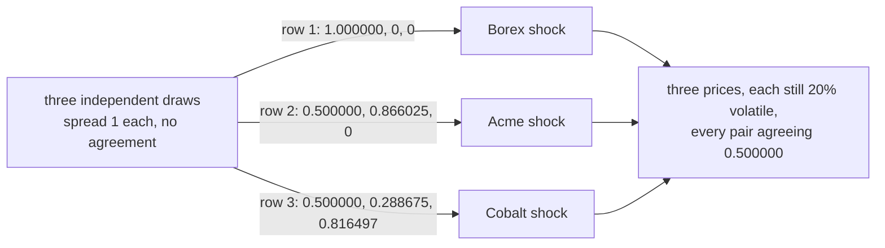
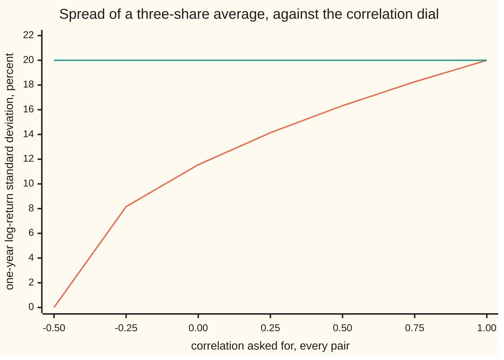

# Correlated paths: several assets from one Cholesky factor

[Syllabus](../../../SYLLABUS.md) → [Financial mathematics](../../../SYLLABUS.md#w12) → [Numerical Methods for Pricing](../../../SYLLABUS.md#w12-s06) → Correlated paths

---

## General Overview

Three shares, watched together for a year: Borex at $80.00, Acme at $100.00, Cobalt at $120.00. One contract pays on what all three do at once — a basket, a spread, a best-of. Each share on its own is 20% volatile: a year's worth of wiggle is about a fifth of its price.

Simulate the three separately and the answer is wrong before the first path finishes. A bad week for Borex is usually the same news that hit Acme, and shares that slide together do not cushion each other. A simulation that lets them slide independently prices the contract as though they did.

So the shares need shared shocks: random kicks that keep each share's own size of wiggle while any two agree as much as the market says. They come from one table of numbers, computed once and used on every step of every path. Call it the mixing table; its real name is the **Cholesky factor**, written L, and building it is **factoring the correlation matrix**.

With every pair asked to agree at 0.500000, the second row of that table is 0.500000 and 0.866025: Acme takes half of Borex's draw, then adds a fresh draw of its own. Every row has length 1.000000 — square the entries, add, take the root — which is what keeps each share at its own 20% volatility while the agreement is installed.

**Independent random draws become correlated shocks when multiplied by a table whose rows have length one and where any two rows, multiplied entry by entry and added, give the correlation asked for; the triangular table that does this is the Cholesky factor.**

**What kind of fact this is:** a method, resting on a theorem — a correlation table that leaves every holding of the shares a positive variance has exactly one triangular factor with a positive diagonal — proved in the folded callout under Why it works.

### The picture: one set of draws, three shares



The draws on the left carry no agreement; the three rows are the whole method. Read down the first column: all three shares lean on the same first draw, and that is where the agreement comes from. Read along a row: the later entries are one share's private news.

---

## The formula

Notation first, in words. A **matrix** is a table of numbers with rows and columns. Multiplying one by a column of numbers means taking each row in turn, multiplying it entry by entry against the column and adding the products — a **dot product** per row. Writing a matrix's rows out as its columns is **transposing** it, marked by a raised T. The **correlation matrix** R holds each pair's correlation in the row of one share and the column of the other, and ones down its diagonal, since every share agrees perfectly with itself. Those asked-for correlations are the **dial**, the name used for them from here on.

$$R = L\,L^{T}$$

**Read it aloud:** the mixing table, dotted against its own sideways copy, gives back the table of correlations.

That one line holds both requirements. The product's diagonal entries are each row dotted with itself, the squared row lengths, and R's diagonal is ones: no share's volatility is touched. The entries off the diagonal are one row dotted with another, and those are the correlations asked for.

The mixing is one more line:

$$X = L\,Z$$

**Read it aloud:** hand the independent draws to the rows of the table and out come shocks of the right size that agree the right amount.

| Symbol | Plain meaning | In our example | Push it up and the answer… |
| --- | --- | --- | --- |
| $R$, $R_{ij}$, $\rho_{ij}$ | the correlation table, and one pair's correlation inside it | ones on the diagonal, 0.500000 everywhere else | the three move more as one, and their average spreads wider |
| $\rho$ | one correlation, when every pair is given the same one | 0.500000 | as above |
| $L$, $L_{ij}$ | the Cholesky factor: rows of length one whose pairwise dot products are the correlations | rows (1.000000, 0, 0), (0.500000, 0.866025, 0), (0.500000, 0.288675, 0.816497) | — |
| $Z$ | independent standard draws: spread one, no agreement, one per share per step | three per step, 54000 in the run | a finer grid, or more paths |
| $X$ | the mixed shocks, one per share | three numbers, each of spread one | — |
| $W$, $W_i$ | a share's running total of shocks: its wiggle so far | spread 1.001116 at one year in the sample | grows with the square root of time |
| $t_k$, $T$ | the grid dates, and the last of them, in years; a raised T instead means transposed | 0.25, 0.5 and 1 | a finer path, the same law at the end |
| $\sigma$, $\sigma_i$ | volatility: one share's own size of wiggle per year | 20% for all three | every price spread widens, the dial untouched |
| $s_i$, $S_i(t_k)$ | one share's price today, and the same share's price at a grid date | $80.00, $100.00, $120.00 today | every later price scales with it |
| $q_i$ | dividend yield: cash leaking out of one share each year | 1%, 2%, 3% | that share's prices drift lower |
| $r$ | the riskless rate, continuously compounded | 5% | all three drift higher |

The table is built one column at a time. Take what the diagonal owes and subtract what earlier columns of that row already supply: the remainder is the **pivot**, and its square root is the diagonal entry. Each entry below that is what the pair still owes, divided by the same root:

$$L_{jj} = \sqrt{R_{jj} - \sum_{k<j} L_{jk}^{2}}\,, \qquad L_{ij} = \frac{R_{ij} - \sum_{k<j} L_{ik}L_{jk}}{L_{jj}} \quad (i > j)$$

An empty sum is zero, so the first pivot is one, and so is the first diagonal entry. Entries above the diagonal stay zero, which is what makes the table triangular.

Paths need more than one shock apiece. Fix the dates, scale each step's mix by the square root of the step's length in years, and add the steps up. A triangle marks one step's worth: the step's length in years, and the shock that step adds.

$$\Delta W_k = \sqrt{\Delta t_k}\;L\,Z_k, \qquad W(t_j) = \sum_{k \le j} \Delta W_k$$

Fresh independent draws for every step. The shocks then turn into prices by the usual lognormal rule, one exponential per date ([Geometric Brownian motion](../../11-Stochastic%20processes%20and%20calculus/05-Brownian%20Motion/07-geometric-brownian-motion.md)):

$$S_i(t_k) = s_i\exp\!\left[\left(r - q_i - \tfrac{1}{2}\sigma_i^{2}\right)t_k + \sigma_i W_i(t_k)\right]$$

### When it holds

- **The dial has to be a possible one.** Symmetric, ones down the diagonal, no holding of the shares left with zero or negative variance. Asking 0.9 between shares one and two, 0.9 between one and three and −0.9 between two and three sounds like an opinion and is arithmetic nonsense: the holding long one against the other two has variance −2.400000, and the factoring dies on a third pivot of −15.200000. A pivot of exactly zero is the boundary: at a dial of one each share copies the first, the private draws vanish, and the mixer is one shared draw for all three, not a triangle with a positive diagonal.
- **Rows of length one, or the volatilities move with the dial.** A row dotted with itself is that share's variance in wiggle units. Hand the correlation table in as the mixer and every row has length 1.224745: each volatility is 22% too big and the pairs agree 0.833333 instead of 0.500000.
- **Independent standard draws going in.** The factor fixes the mixing, not the sampling: reused or badly scaled draws give wrong shocks from a perfect factor ([Monte Carlo pricing](01-monte-carlo-pricing.md)).
- **One number per pair, fixed for the whole horizon.** Real correlations drift, and in a crash they run toward one. A basket simulated at calm-market correlations is priced as though the shares could still rescue each other on the worst day.
- **The dial sits on the shocks, not on the percent moves.** Step 4 measures the gap: 0.500000 asked for shows up between percent returns as 0.495000.

---

## Why it works

### Step 0: correlation is lengths and angles

Independent standard draws have spread one and no agreement. Add them up with weights and two facts settle everything. Independent variances add, so a weighted sum's variance is the sum of the squared weights: a row of length one gives a shock of spread one. And the covariance of two such sums — the average of their product, since both average zero — is the dot product of the two rows, because every cross term between different draws averages to nothing.

So the job is geometry, not probability: find rows of length one whose dot products are the correlations asked for. In one line, that is $R = L\,L^{T}$.

### Step 1: build the rows one at a time

Borex goes first and leans on the first draw alone, weight 1.000000.

Acme has to agree with Borex at 0.500000, so its weight on the first draw is 0.500000, Borex's weight there being one. That supplies part of Acme's variance; the rest must come from somewhere Borex cannot see, so Acme takes a fresh draw with the weight that brings its row back to length one: 0.866025.

Cobalt has to agree with both. Its weight on the first draw is 0.500000 again. Against Acme it still owes agreement, because the shared first draw covers only part of what was asked, and the second draw makes up the difference with weight 0.288675. Its own fresh draw then restores the row length to one: 0.816497.

Each share leans on the draws already used plus exactly one new one. That is why the table is triangular, and the recurrence above is this bookkeeping written for any number of shares.

<details>
<summary>Detailed proof: exactly one such table exists, and its pivots are positive</summary>

The claim: for every symmetric R giving strictly positive variance to every non-zero holding ([Quadratic forms](../../03-Algebra/07-Eigenvalues%20and%20Symmetric%20Matrices/05-quadratic-forms-and-positive-definite.md)), there is one and only one lower-triangular L with a positive diagonal and $R = L\,L^{T}$.

**Existence, by induction: settle one share, then let each new share ride on the case below it.** One share: R is a single positive number, whose only positive factor is its square root. Split a larger R into its first entry a, the rest of the first column b, and the block C of everything else. Share one held alone has positive variance, so a is positive. Form the smaller table $G = C - b\,b^{T}/a$. It is symmetric, and positive for every non-zero holding y: the holding with first entry $-b^{T}y/a$ and rest y has variance exactly $y^{T}Gy$. By induction $G = M\,M^{T}$ for a lower-triangular M with positive diagonal, and the table with first column $\sqrt{a}$ over $b/\sqrt{a}$, M filling the rest, multiplies out to R. Comparing its entries with R gives back the column recurrence, so every pivot is positive.

**Uniqueness.** In any lower-triangular table with positive diagonal satisfying $R = L\,L^{T}$, the product's top-left entry forces the positive root $\sqrt{a}$, and the rest of its first column forces $b/\sqrt{a}$. Removing that column's contribution leaves exactly that smaller table, whose factor is unique by induction.

**The converse, which the program relies on.** If $R = L\,L^{T}$ with L triangular and its diagonal positive, a holding x has variance the squared length of $L^{T}x$. Working up from the last row, $L^{T}x = 0$ forces x to be zero, so every non-zero holding has positive variance. A run finishing with every pivot positive has proved the dial possible; a run hitting a pivot of zero or less has found a holding the dial cannot price.

</details>

### Step 2: the shocks are properly normal, not merely correlated

A fixed table applied to a column of independent normal draws gives a vector that is itself normal, with covariance the table times its sideways copy ([Multivariate normal](../../09-Probability%20and%20statistics/05-Transformations%20and%20Joint%20Laws/06-multivariate-normal.md)). Matching the covariance therefore matches the entire joint law, not two summary numbers out of many — a construction, not a fudge.

### Step 3: the clock, and why the square root of the step

One shock per share is a snapshot. Paths need a sequence: each share must wiggle like a share, and the pairs must keep agreeing.

Scale each step's mixed shocks by the square root of the step's length, and hand every step fresh draws. Independent variances add, so a share's accumulated wiggle has variance a quarter after a quarter and one after a year: its spread is the square root of the time elapsed. The bar chart further down measures exactly that in the run.

The cross-share, cross-date rule is as plain. Only the steps the two dates share contribute, each contributing its own length times the correlation:

$$\mathrm{Cov}\!\left(W_i(t_a), W_j(t_b)\right) = \rho_{ij}\,\min(t_a, t_b)$$

The check verifies all 324 of those entries by exact coefficient algebra, across four settings of the dial, worst gap 0.000000000000.

<details>
<summary>The algebra behind the grid, if you want it</summary>

Stack every step's draws into one long column of independent standard normals. Each accumulated shock is a fixed weighted sum of that column, so all of them together are jointly normal with mean zero. One share's shock at one date carries, in the block belonging to each step up to that date, that share's row of L scaled by the square root of the step's length, and zeros in every later block.

Now dot one share's weights against another's. Only the steps inside both dates contribute: past the earlier date one factor is zero. A shared step contributes its length times one row dotted with the other, which is its length times that pair's correlation. Summing the shared steps gives the correlation times the total shared time, the earlier of the two dates. Ones on R's diagonal recover the one-share rule for a share against itself.

</details>

### Step 4: through the exponential, the dial bends

Prices are exponentials of shocks, so what "correlation" means depends on which number is correlated. Log returns are the shocks times volatility plus a fixed drift, so their correlation is exactly the dial. Percent returns — the price ratio minus one, the number a brokerage statement shows — are not. For two shares of the same volatility over a stretch of length h,

$$\text{correlation of percent returns} = \frac{e^{\rho\sigma^{2}h} - 1}{e^{\sigma^{2}h} - 1}$$

At 20% volatility over a year that is 0.495000 against a dial of 0.500000; at 60% volatility, 0.455121. The bend grows with volatility and with the horizon, and always pulls toward zero, because the exponential stretches the good outcomes more than the bad. In the sample the three pairs of percent returns come out at 0.501178, 0.508628 and 0.495999, the furthest 0.014 from the model value. At 20% volatility the bend itself is only 0.005, well under what six thousand paths can resolve: the algebra pins it, not the sample.

<details>
<summary>Where that ratio comes from</summary>

Write each share's log return over the stretch as its drift plus $\sigma$ times a standard normal, the two normals having correlation $\rho$. The average of an exponential of a normal is the exponential of its mean plus half its variance, so each price ratio has average $e^{(r-q_i)h}$, and two ratios multiplied together average to the product of those averages times $e^{\rho\sigma^{2}h}$.

Subtracting gives the ratios' covariance: the product of the averages times $e^{\rho\sigma^{2}h} - 1$. The same identity with $\rho$ set to one gives each ratio's variance, its average squared times $e^{\sigma^{2}h} - 1$. Divide by the two standard deviations and every drift factor cancels, leaving the displayed ratio. Turning a ratio into a percent return subtracts one from it, and a shift changes no covariance.

At a dial of one half the top exponent is half the bottom one, so the bottom factors as the top times $e^{\rho\sigma^{2}h} + 1$ and the whole ratio collapses to $1/(1 + e^{\rho\sigma^{2}h})$ — the second road the check prints to 0.495000.

</details>

**Another route to the same shocks.** Nothing above needed the table to be triangular; it needed row lengths of one and the right dot products. When every pair shares one non-negative correlation there is a shorter recipe: give each share the same slice of one market-wide draw, $\sqrt{\rho}$, plus a private draw of its own, $\sqrt{1-\rho}$. At a dial of 0.500000 both weights are 0.707107, and this four-column mixer rebuilds R exactly, worst entry off by 0.000000000000, while sitting 0.866025 away from the triangular factor in one entry. Two tables, one correlation matrix: the triangular one with a positive diagonal is the only one of its kind, and it is what a general dial and a fast program want. Mending a table no factor will accept belongs to numerical linear algebra (Cholesky).

---

## Worked numbers, by hand

Every pair asked to agree at 0.500000. The table is built left to right, top to bottom, from numbers already on this page.

| Step | Arithmetic | Value |
| --- | --- | --- |
| row one, shared draw | Borex leans on the first draw alone, length one | 1.000000 |
| row two, shared draw | the correlation asked for, divided by row one's 1.000000 | 0.500000 |
| row two, own draw | square root of 1 − 0.500000 × 0.500000 | 0.866025 |
| row three, shared draw | the correlation asked for again | 0.500000 |
| row three, second draw | (0.500000 − 0.500000 × 0.500000) ÷ 0.866025 | 0.288675 |
| row three, own draw | square root of 1 − 0.500000 × 0.500000 − 0.288675 × 0.288675 | 0.816497 |
| every row's length | each row dotted with itself, square-rooted | 1.000000 |
| rows two and three, dotted | 0.500000 × 0.500000 + 0.866025 × 0.288675 | 0.500000 |
| what 6000 paths deliver | measured correlation of Borex's and Acme's accumulated shocks | **0.499893** |

The last two lines are the point: the dot product says the table is right, the measurement says the paths agree as instructed, within the wobble of six thousand samples.

### What breaks if you drop a piece

| Mistake | Comes out at | What went wrong |
| --- | --- | --- |
| The correlation table used as the mixer | volatilities times 1.224745, pairs agreeing 0.833333 | Its rows have length 1.224745, not one, so every volatility is inflated by 22% and the dial overshoots |
| The factor used on its side | variances 1.500000, 0.833333 and 0.666667, pair one-two at 0.516398 | Transposing moves the zeros, and a factor's columns have no reason to have length one |
| An impossible dial: 0.9, 0.9 and −0.9 | third pivot −15.200000 | Two shares cannot both hug a third and shun each other; the holding (1, −1, −1) has variance −2.400000 |
| The dial read as the correlation of percent moves | 0.495000 where 0.500000 was asked | The exponential bends correlation toward zero, harder at higher volatility: 0.455121 at 60% |

Every number in that table is printed by the code below.

---

## How it moves: the dial and the clock

Three shares, each 20% volatile, their log returns averaged. That average is not 20% volatile: at half correlation its one-year spread is 16.33%, at zero correlation 11.55%. The shares never changed; only the agreement between them did. Correlation is the input a multi-asset price cares about most, and the only one no single share's history shows.

### Force one: the dial



The rising line is the average of the three log returns; the flat line at 20.00 is any one share on its own. At the far left the three shares cancel each other exactly and the average stops moving. At the far right they are one share wearing three names and nothing is diversified. The dial slides between those two worlds.

### Force two: the clock

```
Borex's accumulated shock, sample standard deviation   one █ = 0.025 of accumulated shock
  0.25 year   ████████████████████                      0.504346
  0.5  year   ████████████████████████████              0.708566
  1    year   ████████████████████████████████████████  1.001116
```

Four times the time, twice the spread: the square roots are 0.500000, 0.707107 and 1.000000. Wiggles accumulate in variance, not in size, which is why steps are scaled by the square root of their length. The correlation itself does not move with the clock; only the shared time does, which is the covariance rule in Step 3.

---

## Code, from first principles, and it actually runs

Nothing is imported that already holds an answer: the factor, the draws, the standard deviations and the correlations are written out. Several independent roads: the recurrence against a factor written out by hand; the factor multiplied back against the table it came from; a four-column mixer that rebuilds the same table while differing from it; 324 grid covariances checked by coefficient algebra against the correlation times the earlier date; prices stepped one interval at a time against prices built in one exponential; and 6000 paths whose measured spreads and correlations are compared with the square root of time, the dial, and the model value for percent returns.

### Python

```python
# Correlated paths -- the check behind the card.  Nothing is imported that
# already holds an answer: the factor, the normal draws, the standard
# deviations and the correlations are written out here.  Three shares, Borex
# at $80, Acme at $100 and Cobalt at $120, each 20% volatility, every pair of
# shocks correlated 0.5, watched at 0.25, 0.5 and 1 year.
from math import cos, exp, log, pi, sin, sqrt

RHO, SIG, RATE, PATHS, SEED = 0.5, 0.20, 0.05, 6000, 20260914
SPOTS, INCOME = (80.0, 100.0, 120.0), (0.01, 0.02, 0.03)
TIMES, STEPS, RHOS = (0.25, 0.5, 1.0), (0.25, 0.25, 0.5), (-0.25, 0.0, 0.5, 0.75)
DIALS = (-0.5, -0.25, 0.0, 0.25, 0.5, 0.75, 1.0)
PAIRS = ((0, 1), (0, 2), (1, 2))

def equi(rho):                              # one correlation for every pair of shares
    return [[1.0 if i == j else rho for j in range(3)] for i in range(3)]
def dot(x, y): return sum(p * q for p, q in zip(x, y))
def gram(m): return [[dot(r, s) for s in m] for r in m]   # row lengths squared down the diagonal, row dot products off it
def worst(m, t): return max(abs(m[i][j] - t[i][j]) for i in range(len(m)) for j in range(len(m[0])))
def quad(a, x): return sum(x[i] * a[i][j] * x[j] for i in range(3) for j in range(3))   # the variance of a portfolio x
def chol(a):                                # the factor, one column at a time
    n, low = len(a), [[0.0] * len(a) for _ in a]
    for j in range(n):
        pivot = a[j][j] - sum(low[j][k] ** 2 for k in range(j))
        if pivot <= 0.0:
            return None, pivot              # no factor with a positive diagonal exists
        low[j][j] = sqrt(pivot)
        for i in range(j + 1, n):
            low[i][j] = (a[i][j] - sum(low[i][k] * low[j][k] for k in range(j))) / low[j][j]
    return low, 0.0
def spread(col):                            # standard deviation of one column of numbers
    mean = sum(col) / len(col)
    return sqrt(sum((v - mean) ** 2 for v in col) / len(col))
def link(xs, ys):                           # sample correlation of two columns
    mx, my = sum(xs) / len(xs), sum(ys) / len(ys)
    top = sum((x - mx) * (y - my) for x, y in zip(xs, ys))
    return top / sqrt(sum((x - mx) ** 2 for x in xs) * sum((y - my) ** 2 for y in ys))
def draws(count, seed):                     # uniforms from a counter, paired into normals
    out, state = [], seed
    while len(out) < count:
        state = (1664525 * state + 1013904223) % 4294967296
        u = (state + 0.5) / 4294967296
        state = (1664525 * state + 1013904223) % 4294967296
        v = (state + 0.5) / 4294967296
        radius, angle = sqrt(-2.0 * log(u)), 2.0 * pi * v
        out += [radius * cos(angle), radius * sin(angle)]
    return out
def walk(mixer, normals):                   # every path: mix, accumulate, then price
    shock = [[[0.0] * PATHS for _ in range(3)] for _ in range(3)]      # [date][share][path]
    ret, gap, ledger = [[0.0] * PATHS for _ in range(3)], 0.0, 0
    for p in range(PATHS):
        w, stock = [0.0, 0.0, 0.0], list(SPOTS)
        for k in range(3):
            z = normals[9 * p + 3 * k:9 * p + 3 * k + 3]
            for i in range(3):
                dw = sqrt(STEPS[k]) * dot(mixer[i], z)
                w[i] += dw
                drift = RATE - INCOME[i] - 0.5 * SIG * SIG
                stock[i] *= exp(drift * STEPS[k] + SIG * dw)             # road one: step by step
                direct = SPOTS[i] * exp(drift * TIMES[k] + SIG * w[i])   # road two: one exponential
                gap, ledger = max(gap, abs(stock[i] / direct - 1.0)), ledger + 1
                shock[k][i][p] = w[i]
        for i in range(3):
            ret[i][p] = stock[i] / SPOTS[i] - 1.0
    return shock, ret, gap, ledger
def row(label, values): print(f"{label:<47}" + "".join(f"{v:>12.6f}" for v in values))
def tiny(label, value): print(f"{label:<47}{value:>16.12f}")
def chart(label, values): print(f"{label:<47}" + "".join(f"{v:>8.2f}" for v in values))

low, _ = chol(equi(RHO))
hand = [[1.0, 0.0, 0.0], [0.5, sqrt(3.0) / 2.0, 0.0], [0.5, 1.0 / (2.0 * sqrt(3.0)), sqrt(2.0 / 3.0)]]
one = [[sqrt(RHO)] + [sqrt(1.0 - RHO) if j == i else 0.0 for j in range(3)] for i in range(3)]
side = [[low[j][i] for j in range(3)] for i in range(3)]          # the factor laid on its side
bad = [[1.0, 0.9, 0.9], [0.9, 1.0, -0.9], [0.9, -0.9, 1.0]]       # correlations that cannot happen
bad_low, bad_pivot = chol(bad)
entries, off_grid = 0, 0.0
for rho in RHOS:                            # the clock, by exact coefficient algebra
    matrix, (lo, _) = equi(rho), chol(equi(rho))
    coef = [[sqrt(STEPS[k]) * lo[i][j] if k <= a else 0.0 for k in range(3) for j in range(3)]
            for a in range(3) for i in range(3)]
    for a in range(3):
        for b in range(3):
            for i in range(3):
                for j in range(3):
                    want = matrix[i][j] * min(TIMES[a], TIMES[b])
                    off_grid = max(off_grid, abs(dot(coef[3 * a + i], coef[3 * b + j]) - want))
                    entries += 1
shock, ret, gap, ledger = walk(low, draws(9 * PATHS, SEED))
basket = [(shock[2][0][p] + shock[2][1][p] + shock[2][2][p]) / 3.0 for p in range(PATHS)]
model = (exp(RHO * SIG * SIG) - 1.0) / (exp(SIG * SIG) - 1.0)
fat = (exp(RHO * 0.36) - 1.0) / (exp(0.36) - 1.0)
theory = [100.0 * SIG * sqrt((1.0 + 2.0 * d) / 3.0) for d in DIALS]
raw, sideways, mixgap = gram(equi(RHO)), gram(side), worst(one, [r + [0.0] for r in low])

row("correlation asked for, every pair", [RHO])
for i in range(3):
    row(f"L row {i + 1}", low[i])
row("length of each L row", [sqrt(dot(low[i], low[i])) for i in range(3)])
tiny("hand-written factor, worst entry off L", worst(low, hand))
tiny("L L^T rebuilt, worst entry off R", worst(gram(low), equi(RHO)))
row("one-factor mixer row 1", one[0])
tiny("one-factor mixer, worst entry off R", worst(gram(one), equi(RHO)))
tiny("the two mixers differ, worst entry", mixgap)
print(f"grid covariance entries checked                 {entries}")
tiny("grid covariance, worst gap off rho x min(ta,tb)", off_grid)
print(f"paths {PATHS}, normal draws {9 * PATHS}, seed {SEED}")
print(f"stock ledger comparisons                       {ledger}")
tiny("stepwise price vs one exponential, worst gap", gap)
row("sample sd of Borex shock at 0.25, 0.5, 1 year", [spread(shock[k][0]) for k in range(3)])
row("sqrt of the time elapsed, same three dates", [sqrt(t) for t in TIMES])
row("sample sd of each shock at 1 year", [spread(shock[2][i]) for i in range(3)])
row("sample shock correlation, pairs 1-2, 1-3, 2-3", [link(shock[2][i], shock[2][j]) for i, j in PAIRS])
row("sample percent-return correlation, same pairs", [link(ret[i], ret[j]) for i, j in PAIRS])
row("model percent-return correlation at 1 year", [model])
tiny("the same value written 1/(1 + e^0.02), gap", abs(model - 1.0 / (1.0 + exp(RHO * SIG * SIG))))
row("model percent-return correlation at 60% vol", [fat])
row("three-share average sd at 1 year, percent", [100.0 * SIG * spread(basket), theory[4]])
chart("chart, correlation dial", DIALS)
chart("chart, three-share average sd, percent", theory)
chart("chart, one share alone, percent", [100.0 * SIG] * 7)
row("wrong: R as the mixer: variance, sd, corr 1-2", [raw[0][0], sqrt(raw[0][0]), raw[0][1] / raw[0][0]])
row("wrong: L on its side: three variances", [sideways[i][i] for i in range(3)])
row("wrong: L on its side: correlation 1-2", [sideways[0][1] / sqrt(sideways[0][0] * sideways[1][1])])
print(f"wrong: impossible dial has no factor           {'yes' if bad_low is None else 'no'}")
row("wrong: impossible dial: third pivot, (1,-1,-1)", [bad_pivot, quad(bad, (1.0, -1.0, -1.0))])

assert worst(low, hand) < 1e-15, "the recurrence must land on the hand-written factor"
assert worst(gram(low), equi(RHO)) < 1e-15, "L L^T must rebuild R"
assert worst(gram(one), equi(RHO)) < 1e-15, "the one-factor mixer must rebuild R as well"
assert mixgap > 0.1, "two mixers rebuild one R: only the triangular one with a positive diagonal is unique"
assert off_grid < 1e-12, "grid covariance must equal rho times the earlier date"
assert bad_low is None, "the impossible dial must break the factor"
assert quad(bad, (1.0, -1.0, -1.0)) < 0.0, "and hold a portfolio of negative variance"
assert gap < 1e-12, "stepping the price must match one exponential"
assert all(abs(spread(shock[k][0]) - sqrt(TIMES[k])) < 0.05 for k in range(3)), "spread grows as sqrt of time"
assert all(abs(link(shock[2][i], shock[2][j]) - RHO) < 0.03 for i, j in PAIRS), "sample shocks near the dial"
assert all(abs(link(ret[i], ret[j]) - model) < 0.03 for i, j in PAIRS), "sample returns near the model"
assert abs(model - 1.0 / (1.0 + exp(RHO * SIG * SIG))) < 1e-12, "two roads to the model correlation"
assert abs(100.0 * SIG * spread(basket) - theory[4]) < 1.0, "average-share spread, sample against theory"
print("ALL CHECKS PASS")
```

**Ran 2026-09-19 on macOS, Python 3.14.6, standard library only. All checks passed. Output, pasted from the run:**

```
correlation asked for, every pair                  0.500000
L row 1                                            1.000000    0.000000    0.000000
L row 2                                            0.500000    0.866025    0.000000
L row 3                                            0.500000    0.288675    0.816497
length of each L row                               1.000000    1.000000    1.000000
hand-written factor, worst entry off L           0.000000000000
L L^T rebuilt, worst entry off R                 0.000000000000
one-factor mixer row 1                             0.707107    0.707107    0.000000    0.000000
one-factor mixer, worst entry off R              0.000000000000
the two mixers differ, worst entry               0.866025403784
grid covariance entries checked                 324
grid covariance, worst gap off rho x min(ta,tb)  0.000000000000
paths 6000, normal draws 54000, seed 20260914
stock ledger comparisons                       54000
stepwise price vs one exponential, worst gap     0.000000000000
sample sd of Borex shock at 0.25, 0.5, 1 year      0.504346    0.708566    1.001116
sqrt of the time elapsed, same three dates         0.500000    0.707107    1.000000
sample sd of each shock at 1 year                  1.001116    1.008133    1.001357
sample shock correlation, pairs 1-2, 1-3, 2-3      0.499893    0.509204    0.503575
sample percent-return correlation, same pairs      0.501178    0.508628    0.495999
model percent-return correlation at 1 year         0.495000
the same value written 1/(1 + e^0.02), gap       0.000000000000
model percent-return correlation at 60% vol        0.455121
three-share average sd at 1 year, percent         16.422169   16.329932
chart, correlation dial                           -0.50   -0.25    0.00    0.25    0.50    0.75    1.00
chart, three-share average sd, percent             0.00    8.16   11.55   14.14   16.33   18.26   20.00
chart, one share alone, percent                   20.00   20.00   20.00   20.00   20.00   20.00   20.00
wrong: R as the mixer: variance, sd, corr 1-2      1.500000    1.224745    0.833333
wrong: L on its side: three variances              1.500000    0.833333    0.666667
wrong: L on its side: correlation 1-2              0.516398
wrong: impossible dial has no factor           yes
wrong: impossible dial: third pivot, (1,-1,-1)   -15.200000   -2.400000
ALL CHECKS PASS
```

### Rust

Same inputs, same labels, same arithmetic written a second time. No crates.

```rust
// Correlated paths -- the same check as the Python, in Rust.  No crates.  The
// factor, the normal draws, the standard deviations and the correlations are
// all written out here.  Three shares, Borex at $80, Acme at $100 and Cobalt
// at $120, each 20% volatility, every pair of shocks correlated 0.5, watched
// at 0.25, 0.5 and 1 year.  Build: rustc --edition 2021 -O this_file.rs
use std::f64::consts::PI;

const RHO: f64 = 0.5; const SIG: f64 = 0.20; const RATE: f64 = 0.05;
const PATHS: usize = 6000; const SEED: u64 = 20260914;
const SPOTS: [f64; 3] = [80.0, 100.0, 120.0]; const INCOME: [f64; 3] = [0.01, 0.02, 0.03];
const TIMES: [f64; 3] = [0.25, 0.5, 1.0]; const STEPS: [f64; 3] = [0.25, 0.25, 0.5];
const RHOS: [f64; 4] = [-0.25, 0.0, 0.5, 0.75];
const DIALS: [f64; 7] = [-0.5, -0.25, 0.0, 0.25, 0.5, 0.75, 1.0];
const PAIRS: [(usize, usize); 3] = [(0, 1), (0, 2), (1, 2)];

fn equi(rho: f64) -> Vec<Vec<f64>> {              // one correlation for every pair of shares
    (0..3).map(|i| (0..3).map(|j| if i == j { 1.0 } else { rho }).collect()).collect()
}
fn dot(x: &[f64], y: &[f64]) -> f64 { x.iter().zip(y).map(|(p, q)| p * q).sum() }
fn gram(m: &[Vec<f64>]) -> Vec<Vec<f64>> {        // row lengths squared down the diagonal, row dot products off it
    m.iter().map(|r| m.iter().map(|s| dot(r, s)).collect()).collect()
}
fn worst(m: &[Vec<f64>], t: &[Vec<f64>]) -> f64 {
    (0..m.len()).map(|i| (0..m[0].len()).map(|j| (m[i][j] - t[i][j]).abs()).fold(0.0, f64::max)).fold(0.0, f64::max)
}
fn quad(a: &[Vec<f64>], x: &[f64; 3]) -> f64 {    // the variance of a portfolio x
    (0..3).map(|i| (0..3).map(|j| x[i] * a[i][j] * x[j]).sum::<f64>()).sum()
}
fn chol(a: &[Vec<f64>]) -> (Option<Vec<Vec<f64>>>, f64) {      // the factor, one column at a time
    let n = a.len();
    let mut low = vec![vec![0.0_f64; n]; n];
    for j in 0..n {
        let pivot = a[j][j] - (0..j).map(|k| low[j][k] * low[j][k]).sum::<f64>();
        if pivot <= 0.0 { return (None, pivot); }               // no factor with a positive diagonal exists
        low[j][j] = pivot.sqrt();
        for i in j + 1..n { low[i][j] = (a[i][j] - (0..j).map(|k| low[i][k] * low[j][k]).sum::<f64>()) / low[j][j]; }
    }
    (Some(low), 0.0)
}
fn spread(col: &[f64]) -> f64 {                   // standard deviation of one column of numbers
    let mean = col.iter().sum::<f64>() / col.len() as f64;
    (col.iter().map(|v| (v - mean) * (v - mean)).sum::<f64>() / col.len() as f64).sqrt()
}
fn link(xs: &[f64], ys: &[f64]) -> f64 {          // sample correlation of two columns
    let mx = xs.iter().sum::<f64>() / xs.len() as f64;
    let my = ys.iter().sum::<f64>() / ys.len() as f64;
    let top: f64 = xs.iter().zip(ys).map(|(x, y)| (x - mx) * (y - my)).sum();
    let sxx: f64 = xs.iter().map(|x| (x - mx) * (x - mx)).sum();
    let syy: f64 = ys.iter().map(|y| (y - my) * (y - my)).sum();
    top / (sxx * syy).sqrt()
}
fn draws(count: usize, seed: u64) -> Vec<f64> {   // uniforms from a counter, paired into normals
    let (mut out, mut state) = (Vec::new(), seed);
    while out.len() < count {
        state = (1664525 * state + 1013904223) % 4294967296;
        let u = (state as f64 + 0.5) / 4294967296.0;
        state = (1664525 * state + 1013904223) % 4294967296;
        let v = (state as f64 + 0.5) / 4294967296.0;
        let (radius, angle) = ((-2.0 * u.ln()).sqrt(), 2.0 * PI * v);
        out.push(radius * angle.cos()); out.push(radius * angle.sin());
    }
    out
}
type Walk = (Vec<Vec<Vec<f64>>>, Vec<Vec<f64>>, f64, usize);
fn walk(mixer: &[Vec<f64>], normals: &[f64]) -> Walk {          // every path: mix, accumulate, then price
    let mut shock = vec![vec![vec![0.0_f64; PATHS]; 3]; 3];     // [date][share][path]
    let (mut ret, mut gap, mut ledger) = (vec![vec![0.0_f64; PATHS]; 3], 0.0_f64, 0);
    for p in 0..PATHS {
        let (mut w, mut stock) = ([0.0_f64; 3], SPOTS);
        for k in 0..3 {
            let z = &normals[9 * p + 3 * k..9 * p + 3 * k + 3];
            for i in 0..3 {
                let dw = STEPS[k].sqrt() * dot(&mixer[i], z);
                w[i] += dw;
                let drift = RATE - INCOME[i] - 0.5 * SIG * SIG;
                stock[i] *= (drift * STEPS[k] + SIG * dw).exp();                 // road one: step by step
                let direct = SPOTS[i] * (drift * TIMES[k] + SIG * w[i]).exp();   // road two: one exponential
                gap = gap.max((stock[i] / direct - 1.0).abs());
                ledger += 1;
                shock[k][i][p] = w[i];
            }
        }
        for i in 0..3 { ret[i][p] = stock[i] / SPOTS[i] - 1.0; }
    }
    (shock, ret, gap, ledger)
}
fn row(label: &str, v: &[f64]) { println!("{:<47}{}", label, v.iter().map(|x| format!("{:>12.6}", x)).collect::<String>()); }
fn tiny(label: &str, value: f64) { println!("{:<47}{:>16.12}", label, value); }
fn chart(label: &str, v: &[f64]) { println!("{:<47}{}", label, v.iter().map(|x| format!("{:>8.2}", x)).collect::<String>()); }

fn main() {
    let low = chol(&equi(RHO)).0.unwrap();
    let hand = vec![vec![1.0, 0.0, 0.0], vec![0.5, 3.0_f64.sqrt() / 2.0, 0.0],
                    vec![0.5, 1.0 / (2.0 * 3.0_f64.sqrt()), (2.0 / 3.0_f64).sqrt()]];
    let one: Vec<Vec<f64>> = (0..3).map(|i| (0..4).map(|j|             // one shared shock plus one of its own
        if j == 0 { RHO.sqrt() } else if j == i + 1 { (1.0 - RHO).sqrt() } else { 0.0 }).collect()).collect();
    let side: Vec<Vec<f64>> = (0..3).map(|i| (0..3).map(|j| low[j][i]).collect()).collect();
    let bad = vec![vec![1.0, 0.9, 0.9], vec![0.9, 1.0, -0.9], vec![0.9, -0.9, 1.0]];
    let (bad_low, bad_pivot) = chol(&bad);        // correlations that cannot happen
    let (mut entries, mut off_grid) = (0, 0.0_f64);
    for rho in RHOS {                             // the clock, by exact coefficient algebra
        let matrix = equi(rho);
        let lo = chol(&matrix).0.unwrap();
        let mut coef: Vec<Vec<f64>> = Vec::new();
        for a in 0..3 { for i in 0..3 {
            let mut c = Vec::new();
            for k in 0..3 { for j in 0..3 { c.push(if k <= a { STEPS[k].sqrt() * lo[i][j] } else { 0.0 }); } }
            coef.push(c);
        }}
        for a in 0..3 { for b in 0..3 { for i in 0..3 { for j in 0..3 {
            let want = matrix[i][j] * TIMES[a].min(TIMES[b]);
            off_grid = off_grid.max((dot(&coef[3 * a + i], &coef[3 * b + j]) - want).abs());
            entries += 1;
        }}}}
    }
    let (shock, ret, gap, ledger) = walk(&low, &draws(9 * PATHS, SEED));
    let basket: Vec<f64> = (0..PATHS).map(|p| (shock[2][0][p] + shock[2][1][p] + shock[2][2][p]) / 3.0).collect();
    let model = ((RHO * SIG * SIG).exp() - 1.0) / ((SIG * SIG).exp() - 1.0);
    let fat = ((RHO * 0.36).exp() - 1.0) / (0.36_f64.exp() - 1.0);
    let theory: Vec<f64> = DIALS.iter().map(|d| 100.0 * SIG * ((1.0 + 2.0 * d) / 3.0).sqrt()).collect();
    let (raw, sideways) = (gram(&equi(RHO)), gram(&side));
    let wide: Vec<Vec<f64>> = low.iter().map(|r| [r.clone(), vec![0.0]].concat()).collect();

    row("correlation asked for, every pair", &[RHO]);
    for i in 0..3 { row(&format!("L row {}", i + 1), &low[i]); }
    row("length of each L row", &(0..3).map(|i| dot(&low[i], &low[i]).sqrt()).collect::<Vec<f64>>());
    tiny("hand-written factor, worst entry off L", worst(&low, &hand));
    tiny("L L^T rebuilt, worst entry off R", worst(&gram(&low), &equi(RHO)));
    row("one-factor mixer row 1", &one[0]);
    tiny("one-factor mixer, worst entry off R", worst(&gram(&one), &equi(RHO)));
    tiny("the two mixers differ, worst entry", worst(&one, &wide));
    println!("grid covariance entries checked                 {}", entries);
    tiny("grid covariance, worst gap off rho x min(ta,tb)", off_grid);
    println!("paths {}, normal draws {}, seed {}", PATHS, 9 * PATHS, SEED);
    println!("stock ledger comparisons                       {}", ledger);
    tiny("stepwise price vs one exponential, worst gap", gap);
    row("sample sd of Borex shock at 0.25, 0.5, 1 year", &(0..3).map(|k| spread(&shock[k][0])).collect::<Vec<f64>>());
    row("sqrt of the time elapsed, same three dates", &TIMES.iter().map(|t| t.sqrt()).collect::<Vec<f64>>());
    row("sample sd of each shock at 1 year", &(0..3).map(|i| spread(&shock[2][i])).collect::<Vec<f64>>());
    row("sample shock correlation, pairs 1-2, 1-3, 2-3", &PAIRS.map(|(i, j)| link(&shock[2][i], &shock[2][j])));
    row("sample percent-return correlation, same pairs", &PAIRS.map(|(i, j)| link(&ret[i], &ret[j])));
    row("model percent-return correlation at 1 year", &[model]);
    tiny("the same value written 1/(1 + e^0.02), gap", (model - 1.0 / (1.0 + (RHO * SIG * SIG).exp())).abs());
    row("model percent-return correlation at 60% vol", &[fat]);
    row("three-share average sd at 1 year, percent", &[100.0 * SIG * spread(&basket), theory[4]]);
    chart("chart, correlation dial", &DIALS);
    chart("chart, three-share average sd, percent", &theory);
    chart("chart, one share alone, percent", &[100.0 * SIG; 7]);
    row("wrong: R as the mixer: variance, sd, corr 1-2", &[raw[0][0], raw[0][0].sqrt(), raw[0][1] / raw[0][0]]);
    row("wrong: L on its side: three variances", &(0..3).map(|i| sideways[i][i]).collect::<Vec<f64>>());
    row("wrong: L on its side: correlation 1-2", &[sideways[0][1] / (sideways[0][0] * sideways[1][1]).sqrt()]);
    println!("wrong: impossible dial has no factor           {}", if bad_low.is_none() { "yes" } else { "no" });
    row("wrong: impossible dial: third pivot, (1,-1,-1)", &[bad_pivot, quad(&bad, &[1.0, -1.0, -1.0])]);

    assert!(worst(&low, &hand) < 1e-15, "the recurrence must land on the hand-written factor");
    assert!(worst(&gram(&low), &equi(RHO)) < 1e-15, "L L^T must rebuild R");
    assert!(worst(&gram(&one), &equi(RHO)) < 1e-15, "the one-factor mixer must rebuild R as well");
    assert!(worst(&one, &wide) > 0.1, "two mixers rebuild one R: only the triangular one with a positive diagonal is unique");
    assert!(off_grid < 1e-12, "grid covariance must equal rho times the earlier date");
    assert!(bad_low.is_none(), "the impossible dial must break the factor");
    assert!(quad(&bad, &[1.0, -1.0, -1.0]) < 0.0, "and hold a portfolio of negative variance");
    assert!(gap < 1e-12, "stepping the price must match one exponential");
    assert!((0..3).all(|k| (spread(&shock[k][0]) - TIMES[k].sqrt()).abs() < 0.05), "spread grows as sqrt of time");
    assert!(PAIRS.iter().all(|(i, j)| (link(&shock[2][*i], &shock[2][*j]) - RHO).abs() < 0.03), "sample shocks near the dial");
    assert!(PAIRS.iter().all(|(i, j)| (link(&ret[*i], &ret[*j]) - model).abs() < 0.03), "sample returns near the model");
    assert!((model - 1.0 / (1.0 + (RHO * SIG * SIG).exp())).abs() < 1e-12, "two roads to the model correlation");
    assert!((100.0 * SIG * spread(&basket) - theory[4]).abs() < 1.0, "average-share spread, sample against theory");
    println!("ALL CHECKS PASS");
}
```

**Ran 2026-09-19 on macOS, rustc 1.98.1, no crates. All checks passed. Output, pasted from the run:**

```
correlation asked for, every pair                  0.500000
L row 1                                            1.000000    0.000000    0.000000
L row 2                                            0.500000    0.866025    0.000000
L row 3                                            0.500000    0.288675    0.816497
length of each L row                               1.000000    1.000000    1.000000
hand-written factor, worst entry off L           0.000000000000
L L^T rebuilt, worst entry off R                 0.000000000000
one-factor mixer row 1                             0.707107    0.707107    0.000000    0.000000
one-factor mixer, worst entry off R              0.000000000000
the two mixers differ, worst entry               0.866025403784
grid covariance entries checked                 324
grid covariance, worst gap off rho x min(ta,tb)  0.000000000000
paths 6000, normal draws 54000, seed 20260914
stock ledger comparisons                       54000
stepwise price vs one exponential, worst gap     0.000000000000
sample sd of Borex shock at 0.25, 0.5, 1 year      0.504346    0.708566    1.001116
sqrt of the time elapsed, same three dates         0.500000    0.707107    1.000000
sample sd of each shock at 1 year                  1.001116    1.008133    1.001357
sample shock correlation, pairs 1-2, 1-3, 2-3      0.499893    0.509204    0.503575
sample percent-return correlation, same pairs      0.501178    0.508628    0.495999
model percent-return correlation at 1 year         0.495000
the same value written 1/(1 + e^0.02), gap       0.000000000000
model percent-return correlation at 60% vol        0.455121
three-share average sd at 1 year, percent         16.422169   16.329932
chart, correlation dial                           -0.50   -0.25    0.00    0.25    0.50    0.75    1.00
chart, three-share average sd, percent             0.00    8.16   11.55   14.14   16.33   18.26   20.00
chart, one share alone, percent                   20.00   20.00   20.00   20.00   20.00   20.00   20.00
wrong: R as the mixer: variance, sd, corr 1-2      1.500000    1.224745    0.833333
wrong: L on its side: three variances              1.500000    0.833333    0.666667
wrong: L on its side: correlation 1-2              0.516398
wrong: impossible dial has no factor           yes
wrong: impossible dial: third pivot, (1,-1,-1)   -15.200000   -2.400000
ALL CHECKS PASS
```

The two outputs match line for line: the counter-based draws and the mixing are the same arithmetic in both languages.

> [!TIP]
> **Try changing**
> Guess the direction first, then run it. Several asserts are pinned to this dial, so expect one to stop the program.
> - **Turn the dial to zero.** Set `RHO` to `0.0`. The factor becomes ones on the diagonal and nothing else, the sample correlations collapse to near nothing, and the three-share average's spread falls to 11.60% in the sample, against the 11.55% the chart reads off at zero.
> - **Ask for the impossible.** Set `RHO` to `-0.6`. Three shares cannot each disagree with the other two that strongly: the third pivot is 1 − 0.36 − 1.44 = −0.8 and the recurrence hands back no table. The one-factor recipe needs a dial of zero or more, so the run stops before it prints a line.
> - **Mix with the correlation table itself.** Pass `equi(RHO)` to `walk` instead of `low`. The measured correlations jump to about 0.834 and every shock's spread rises from about 1.00 to about 1.23: the commonest bug in multi-asset simulation, caught in one line.
> - **Starve the sample.** Set `PATHS` to `200`. The measured correlations wander as far as 0.592 and the spreads by 5%, enough to trip the sampling asserts: less evidence, nothing wrong with the factor.

---

## The usual mistake

> [!warning]
> **Correlating the wrong thing.** Correlation goes in before the exponential, on the shocks. Prices cannot be correlated after the fact: nudging simulated prices toward each other afterwards changes each share's own volatility and still misses the dial. The order is draws, factor, accumulate, exponentiate.
>
> - **Feeding the correlation table in as the mixer.** It is symmetric and looks right, but its rows have length 1.224745, so every volatility comes out 22% too big and every pair agrees 0.833333. The prices still look plausible, which is what makes it expensive.
> - **Using the factor on its side.** The transpose is upper-triangular, and the three shock variances come out 1.500000, 0.833333 and 0.666667: one share over-volatile, two under-volatile, the pair correlation drifting to 0.516398.
> - **Expecting the sample to match the dial exactly.** At 6000 paths the measured correlations are 0.499893, 0.509204 and 0.503575. That scatter is sampling, not a broken factor.
> - **Reusing draws across steps.** Fresh draws per step are what make variances add; the run spends 54000 on 6000 paths. Recycle any of them and correlations appear across time, which nobody asked for.

---

## Where you meet it in real life

- **Multi-asset option desks.** Anything paying on two or more underlyings is priced on paths built this way: baskets ([Basket options](../18-Many%20underlyings%20-%20exchange%2C%20spread%2C%20basket%20and%20rainbow/03-basket-options.md)), spreads ([Spread options](../18-Many%20underlyings%20-%20exchange%2C%20spread%2C%20basket%20and%20rainbow/02-spread-options-and-kirk.md)), best-of and worst-of.
- **Risk engines.** A bank's daily value-at-risk run shocks thousands of positions together, and the factor of their correlation table is what the run is built on.
- **Interest-rate and commodity curves.** Neighbouring maturities agree almost perfectly, distant ones much less. A whole curve is this card with dozens of rows, which is where a near-impossible dial stops being a curiosity.
- **Credit portfolios.** The one-factor mixer above is the shape of the models that priced mortgage tranches before 2008: one common shock plus a private one per borrower, the correlation assumed rather than measured.

> **Say it back**
> Several shares cannot be simulated one at a time, because their news is shared. Independent draws become shared shocks when multiplied by a table whose rows have length one and whose pairwise dot products are the correlations asked for. That table is built one column at a time, and it is unique when triangular with a positive diagonal. Scale each step's mix by the square root of the step's length and the accumulated shocks spread as the square root of time, their cross-share covariance the correlation times the shared time. Through the exponential, log returns keep the dial exactly while percent returns bend slightly toward zero.

---

## What this builds on

- [Monte Carlo pricing](01-monte-carlo-pricing.md): the sampler this card mixes, and why an average over paths prices anything at all.
- [Multivariate normal](../../09-Probability%20and%20statistics/05-Transformations%20and%20Joint%20Laws/06-multivariate-normal.md): why a fixed table applied to normal draws gives normal shocks, so matching the covariance matches the whole law.
- [Quadratic forms](../../03-Algebra/07-Eigenvalues%20and%20Symmetric%20Matrices/05-quadratic-forms-and-positive-definite.md): the test the dial has to pass, and the reason a pivot can come out negative.

## Where this goes next

- [The exchange option](../18-Many%20underlyings%20-%20exchange%2C%20spread%2C%20basket%20and%20rainbow/01-exchange-option-margrabe.md): two correlated shares where a formula replaces the simulation, the correlation entering as one combined volatility.
- [Spread options](../18-Many%20underlyings%20-%20exchange%2C%20spread%2C%20basket%20and%20rainbow/02-spread-options-and-kirk.md): the difference of two shares, where no exact formula exists and these paths are one honest answer.
- [Basket options](../18-Many%20underlyings%20-%20exchange%2C%20spread%2C%20basket%20and%20rainbow/03-basket-options.md): the weighted sum, with the chart above as its price sensitivity.
- Cholesky: the same factoring as numerical linear algebra, with its cost, its stability, and tables only almost possible.

This card takes the dial as given, the one input no market quotes outright: where its numbers come from, and how to mend a table no factor will accept, is what later cards pick up.

---

## Sources

Verified 19 Sep 2026: every link below resolves to the publisher's page.

- Benoit, Commandant. "Note sur une méthode de résolution des équations normales… (Procédé du Commandant Cholesky)." *Bulletin Géodésique* 2 (1924): 67–77. [doi:10.1007/BF03031308](https://doi.org/10.1007/BF03031308). The posthumous publication of Cholesky's method: the recurrence in The formula.
- Glasserman, Paul. *Monte Carlo Methods in Financial Engineering*. Springer, 2003. [Publisher page](https://link.springer.com/book/10.1007/978-0-387-21617-1). Chapter 2 generates correlated normals and multi-asset paths as this card does.
- Higham, Nicholas J. "Computing a Nearest Symmetric Positive Semidefinite Matrix." *Linear Algebra and its Applications* 103 (1988): 103–118. [doi:10.1016/0024-3795(88)90223-6](https://doi.org/10.1016/0024-3795(88)90223-6). What to do with a correlation table that no factor will accept.
- Box, G. E. P., and Mervin E. Muller. "A Note on the Generation of Random Normal Deviates." *Annals of Mathematical Statistics* 29, no. 2 (1958): 610–611. [doi:10.1214/aoms/1177706645](https://doi.org/10.1214/aoms/1177706645). The pair-at-a-time transform the checks use to turn counter output into normal draws.
