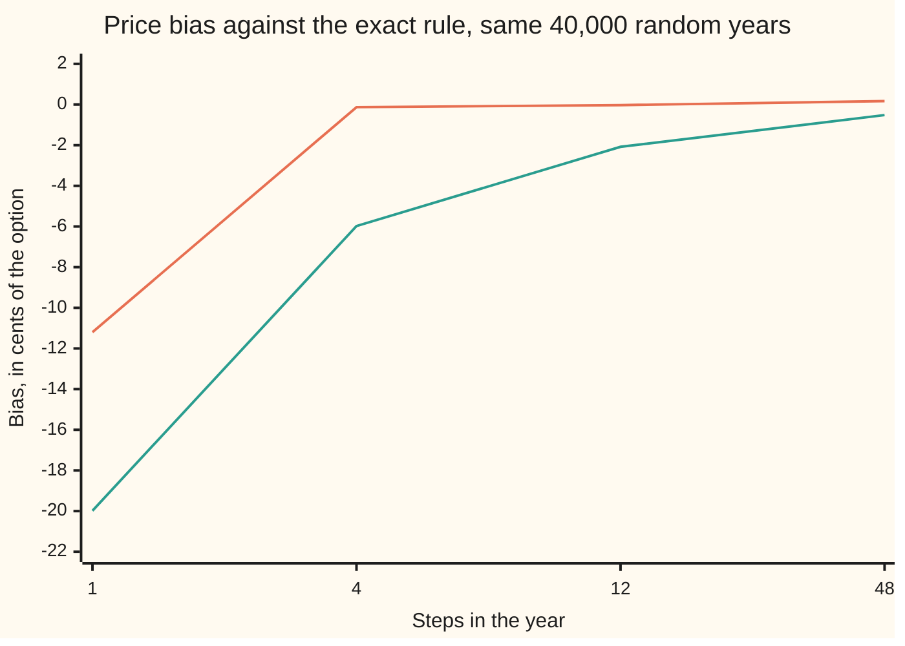
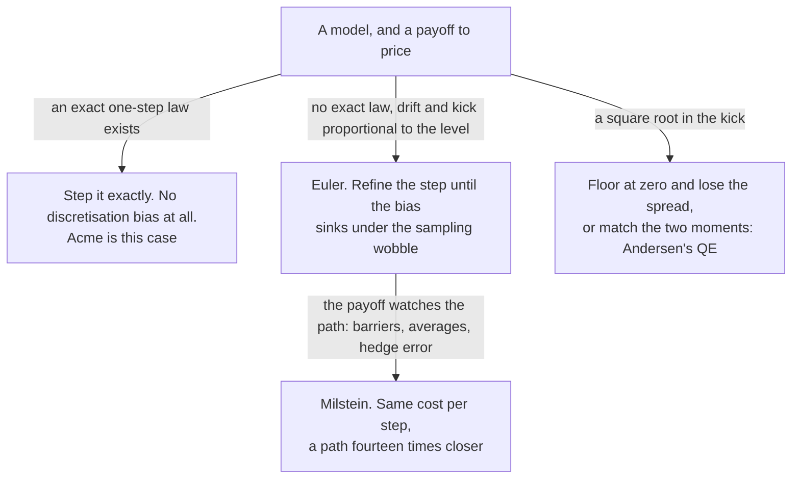

# Stepping an SDE: Euler, Milstein and Andersen's scheme for Heston

Financial mathematics → Numerical Methods for Pricing → Step size and bias → Stepping an SDE

---

## General Overview

Acme shares trade at $100. A one-year call struck at $100 is worth $9.23 here, by the formula on [black-scholes-call](../08-The%20Black-Scholes%20call%20and%20put/01-black-scholes-call.md). Pricing that call by simulation instead means inventing many possible years for Acme and averaging what it pays at the end of each ([monte-carlo-pricing](01-monte-carlo-pricing.md)).

An invented year need not be built in one piece. It can be walked in twelve monthly steps, or forty-eight weekly ones. Each step needs a rule: how far Acme drifts over that stretch, and how hard it shakes. The plainest rule — drift times the step's length, plus volatility times the step's random kick — is the **Euler scheme**.

That rule is not the model. The model speaks about instants; the rule replaces the instant with a month and freezes the drift and the shake for all of it. The swap costs money, and the cost has a name: **discretisation bias**, the gap between what the stepped simulation pays on average and what the model itself pays.

On 40,000 shared random years, twelve Euler steps cost three hundredths of a cent, well inside a sampling wobble of a third of a cent. The whole year in one step costs eleven cents. Acme is the gentle case, its exact one-step rule being known, so the bias can be measured rather than guessed. The hard cases have no exact rule, and the hardest is a variance that must never fall below zero.

**A scheme is a rule for one step: refining the step shrinks the scheme's bias, adding paths shrinks only the sampling wobble, and those are two different mistakes.**

**What kind of fact this is:** a method. Why it works proves an exact formula for the path gap, good at any step count; the shrinking rates beside it are published statements about the limit, checked here against numbers rather than proved.

### The picture: what the step count buys, in cents of price



The upper line is Euler, the lower Milstein. Both start badly wrong and climb toward zero. Milstein tracks each path far more closely, yet its price is further out at every step count here — the reversal this card is about.

---

## The formula

Notation first, in words. An **SDE**, a stochastic differential equation, is a rule for one instant: the drift over the next instant, and the size of the random kick over the same instant. Acme's rule is geometric Brownian motion ([geometric-brownian-motion](../../11-Stochastic%20processes%20and%20calculus/05-Brownian%20Motion/07-geometric-brownian-motion.md)): drift and kick are both proportional to the price. A step of length $h$ years gets one kick, written $\Delta W$, drawn from the bell curve with average zero and spread $\sqrt h$ ([normal-distribution](../../09-Probability%20and%20statistics/04-Continuous%20Distributions/04-normal-distribution.md)). Subscripts count steps: step $k$ turns reading $k$ into reading $k+1$.

Three rules for that one step, all fed the same kick:

$$S_{k+1} \;=\; S_k \, e^{(\mu - \frac12 \sigma^2) h \;+\; \sigma \Delta W_{k+1}}$$

$$Y_{k+1} \;=\; Y_k \left( 1 + \mu h + \sigma \Delta W_{k+1} \right)$$

$$Y_{k+1} \;=\; Y_k \left( 1 + \mu h + \sigma \Delta W_{k+1} + \tfrac12 \sigma^2 \left( \Delta W_{k+1}^2 - h \right) \right)$$

**Read them aloud:** the first is exact and multiplies by a number that is always positive; the second, Euler, multiplies by one plus the drift plus the kick; the third, Milstein, adds a term that is large whenever the kick was large in either direction.

| Symbol | Plain meaning | In our example | Push it up and the bias… |
| --- | --- | --- | --- |
| $S_t$, $S_T$, $S$ | the exact price, now and at expiry | starts at $100 | — |
| $Y_k$, $Y_N$, $Y$, $k$ | the stepped reading after $k$ steps, and at the end | starts at $100 too | — |
| $h$, $N$ | a step's length in years, and steps to the year | 0.083333, 12 | more steps, less bias |
| $\Delta W$ | a step's random kick, spread $\sqrt h$ | root of 0.083333 | — |
| $\mu$, $\sigma$ | drift per year, and volatility | 3%, 20% | both raise it, volatility faster |
| $r$, $q$, $K$, $T$ | bank rate, dividend yield, strike, years | 5%, 2%, $100, 1 | — |
| $C$ | the call's worth | $9.23 | — |
| $v_t$, $v$ | the variance rate: volatility squared, free to move | starts at 0.09 | — |
| $\kappa$, $\theta$, $\eta$ | the variance's pull-back speed, resting level, own volatility | 0.693147, 0.04, 0.235482 | a bigger $\eta$ breaks Euler first |
| $m$, $w$ | the next reading's exact average and variance | 0.065000, 0.002200 | — |
| $\psi$ | the relative spread, $w$ over $m$ squared | 0.520710 | past the switch the recipe changes |
| $a$, $b$, $p$, $\beta$, $U$ | the branches' scale and shift; the weight at zero, its rate, the draw that picks | 0.009098, 2.478748 | — |

Two measures carry the rest of the card, and they are not the same. The **path gap** is the typical distance between the stepped reading and the exact one at the year's end, on the same kicks: the square root of the average of $(Y_N - S_T)^2$. The **price bias** is the gap between the two average discounted payoffs. Euler's path gap shrinks like $\sqrt h$ and Milstein's like $h$; the price bias of both shrinks only like $h$.

### When it holds

- **The drift and the kick must not outgrow the level itself.** For Acme both are a fixed multiple of the price, the condition behind Euler's published bound. A square root fails it, and there the bound says nothing — the card's second half is what to do instead.
- **The payoff must not jump.** A call changes by at most a dollar per dollar of price, which turns a bound on the path gap into a bound on the price. A digital jumps, so nothing here bounds its bias.
- **One noise record, two walks.** A scheme's error is its distance from the exact answer *on the same kicks*. Different random numbers measure mostly wobble.
- **The step must be small enough to be a step.** With the whole year in one step, Euler's reading turns negative whenever the kick falls below −5.150000.
- **A rate describes the limit, not the step in hand.** The ladder below agrees with the published rates at four step counts; measured numbers can agree with a rate, never prove one.

---

## Why it works

### Step 0: the exact factor already contains both schemes

The exact rule multiplies the price by $e^{(\mu - \frac12\sigma^2)h + \sigma\Delta W}$. Expand that exponential the ordinary way — one, plus the exponent, plus half the exponent squared — and track sizes. The kick has spread $\sqrt h$, so it counts as half a power of the step.

$$e^{(\mu - \frac12\sigma^2)h + \sigma\Delta W} \;=\; \underbrace{1 + \mu h + \sigma \Delta W}_{\text{Euler}} \;+\; \underbrace{\tfrac12\sigma^2\left(\Delta W^2 - h\right)}_{\text{Milstein's extra}} \;+\; \text{terms of size } h^{3/2}.$$

The $-\tfrac12\sigma^2 h$ in the exponent and the $+\tfrac12\sigma^2 h$ from the squared kick cancel, which is why the extra term is the kick squared *minus* the step. Euler is the exact factor cut after the half-power terms; Milstein is the same factor cut one term later.

### Step 1: mistakes that average to zero pile up slowly

Euler throws away $\tfrac12\sigma^2(\Delta W^2 - h)$ once per step. That piece has size $h$ and $N = T/h$ steps are taken, so a careless count predicts a total error of $N \times h = T$: no shrinking at all. The count is wrong, because the piece averages to zero — a bell-curve kick has $\Delta W^2$ averaging exactly $h$.

Errors that average to zero do not add in a line. They add like a random walk: $N$ of them grow like $\sqrt N$. Euler's path gap is therefore about $\sqrt N \times h = \sqrt{Th}$, shrinking like $\sqrt h$. Milstein discards terms of size $h^{3/2}$, also averaging to zero, and the same count gives $\sqrt T \, h$. One extra term per step doubles the exponent.

### Step 2: where the extra term comes from

Step 0 is suggestive, not a derivation, since $\Delta W$ is not smooth enough to expand in. The honest route integrates the SDE over the step and substitutes it into itself. The inner integral that appears is the kick measured against itself,

$$\int_{t}^{t+h} \left( W_u - W_t \right) dW_u \;=\; \tfrac12 \left( \Delta W^2 - h \right),$$

which is Itô's rule applied to a square. In general the correction is the diffusion times its own slope times that integral, proved on [milstein-and-strong-weak-convergence](../../11-Stochastic%20processes%20and%20calculus/08-Generators%2C%20Densities%20and%20Simulation/05-milstein-and-strong-weak-convergence.md). For Acme the diffusion is $\sigma$ times the price and its slope is $\sigma$, giving $\tfrac12\sigma^2(\Delta W^2 - h)$ times the price.

### Step 3: a closer path is not a cheaper mistake

At twelve steps Milstein's path gap is 0.061309 against Euler's 0.859104, fourteen times closer — yet Euler's price bias is −0.03 cents and Milstein's is −2.08. Two things are going on.

First, **both schemes get the average level wrong in the same way.** Milstein's extra term averages to zero, so both share the average terminal reading $100 \times (1 + \mu h)^N$. At twelve steps that is 103.041596 against the exact 103.045453: short by four tenths of a cent per share, because each step's factor $1 + \mu h$ falls short of the exact $e^{\mu h}$, twelve times over. That error does not average away, has size $h$, and Milstein does not touch it — which is why the price bias of both shrinks only like $h$.

Second, **Euler makes a second mistake that pays.** The call pays only above $100. Euler's straight line crosses $100 at a kick where the exact rule is still below it, so it collects payoffs in a band of years where the exact rule collects nothing. That gain partly cancels the money Euler loses far up, where a straight line falls hopelessly behind an exponential. Milstein's curve crosses $100 almost where the exact rule does, so it keeps the upside loss with no offsetting gain.

### Step 4: the path gap can be computed exactly, with no paths at all

Both schemes multiply independent factors, and so does the exact rule. The average of a product of independent things is the product of their averages, so the average of $(Y_N - S_T)^2$ can be written in closed form. Expand the square into three averages: the stepped reading squared, the exact reading squared, and the two multiplied. For Euler, with $h = T/N$,

$$E\left[\left(Y_N - S_T\right)^2\right] \;=\; S_0^2 \left[ \left( (1+\mu h)^2 + \sigma^2 h \right)^{N} \;+\; e^{(2\mu + \sigma^2)T} \;-\; 2\, e^{\mu T} \left( 1 + (\mu + \sigma^2) h \right)^{N} \right].$$

No simulation, no random number, no rate: exact at every step count, including steps so coarse that the scheme's factors turn negative. It is the ruler the simulation is checked against, and the check prints both — sampled 0.865785 against computed 0.859104 at twelve steps.

<details>
<summary>Detailed proof: the three averages, and Milstein's version of the same formula</summary>

Write $Y_N = S_0 \prod_k A_k$ with the Euler factor $A = 1 + \mu h + \sigma\Delta W$, and $S_T = S_0 \prod_k G_k$ with the exact factor $G = e^{(\mu - \frac12\sigma^2)h + \sigma\Delta W}$. The kicks are independent, so each product's average is the product of one-step averages.

The kick has average zero and squared average $h$, so $E[A^2] = (1+\mu h)^2 + \sigma^2 h$. Completing the square in the bell-curve density gives $E[e^{\sigma\Delta W}] = e^{\sigma^2 h/2}$ and $E[\Delta W e^{\sigma \Delta W}] = \sigma h\, e^{\sigma^2 h /2}$, hence $E[G^2] = e^{(2\mu + \sigma^2)h}$ and $E[AG] = e^{\mu h}(1 + (\mu + \sigma^2)h)$. Raise each to the power $N$, with $e^{\mu h N} = e^{\mu T}$, and the three displayed terms appear. Every product is integrable by Cauchy–Schwarz, and signs are kept throughout, so no step assumes the factors are positive.

Milstein's factor has the same average $1 + \mu h$, since its extra term averages to zero, while its squared and cross averages each gain one piece of size $\tfrac12\sigma^4h^2$:
$$E[A^2] = (1+\mu h)^2 + \sigma^2 h + \tfrac12 \sigma^4 h^2, \qquad E[AG] = e^{\mu h}\left(1 + (\mu + \sigma^2) h + \tfrac12\sigma^4 h^2 \right).$$
These need the bell curve's fourth moment, $E[\Delta W^4] = 3h^2$, and $E[(\Delta W^2 - h)e^{\sigma\Delta W}] = \sigma^2h^2 e^{\sigma^2 h/2}$. In the same three-term expression they give Milstein's exact path gap: the `extra` line in both check scripts. Subtracting three nearly equal numbers loses precision, so the scripts go through `log1p` and `expm1` instead.

</details>

### Step 5: the scheme meets a square root

Acme's volatility was a constant. Real volatility moves, and Heston's way to let it move gives the **variance rate** — volatility squared, written $v_t$ — its own rule, pulled back toward a resting level at speed $\kappa$ with a kick multiplied by $\eta\sqrt{v_t}$:

$$dv_t \;=\; \kappa\left(\theta - v_t\right) dt \;+\; \eta \sqrt{v_t}\, dW_t .$$

The square root protects the model. As the variance falls toward zero the kick shrinks with it, so the process is pushed back up rather than through the floor. With the numbers here — variance starting at 0.09, resting level 0.04, speed 0.693147 so half the gap closes in a year, and $\eta$ set so that $2\kappa\theta$ and $\eta^2$ are both 0.055452 — the model sits exactly on the boundary of the condition that keeps the variance clear of zero, and never reaches it.

Euler ignores that. Its reading after one year-long step is the current variance, plus the pull-back, plus a bell-curve kick of fixed spread: average 0.055343, variance 0.004991. That bell curve's left tail is below zero, and the chance of a negative variance is 0.216698. More than one step in five hands back a variance with no square root, in a model whose exact law never goes below zero.

**Full truncation** is the cheap repair: let the reading land where it lands, and wherever the next step needs a variance — in the pull-back and under the square root — use zero in place of a negative reading. It works, and it distorts. The variance so used averages 0.064086, near the exact 0.065000, while its own variance swells to 0.003349 against 0.002200 — half again too wide.

Andersen's **quadratic-exponential scheme**, or QE, repairs it properly. The exact law of the next reading is awkward to draw from, but its average $m$ and variance $w$ are elementary. QE draws from a *different* law, built to be non-negative and to carry exactly those two numbers. Which law depends on the relative spread $\psi$:

$$\psi = \frac{w}{m^2}, \qquad b^2 = \frac{2}{\psi} - 1 + \sqrt{\frac{2}{\psi}}\sqrt{\frac{2}{\psi}-1}, \qquad a = \frac{m}{1+b^2}, \qquad Y = a\left(b + Z\right)^2 .$$

For a tight spread, square a shifted bell-curve draw $Z$: squaring makes a negative reading impossible, while the shift $b$ and the scale $a$ set the average and the spread. Here $\psi$ is 0.520710, the shift 2.478748, the scale 0.009098, and the law that comes out has average 0.065000 and variance 0.002200 — the exact two, not approximations.

A wide spread is beyond that family: no shifted square has a relative spread above 2. So QE switches, at a level conventionally set between 1 and 2, to a weight $p$ at zero plus an exponential tail at rate $\beta$:

$$p = \frac{\psi - 1}{\psi + 1}, \qquad \beta = \frac{1-p}{m}, \qquad Y = \begin{cases} 0, & U \le p, \\ \dfrac{1}{\beta}\ln\!\left(\dfrac{1-p}{1-U}\right), & U > p, \end{cases}$$

where $U$ is drawn evenly between 0 and 1. Doubling the variance model's own volatility takes $\psi$ to 2.082840, past any such level, and this branch puts weight 0.351248 at zero with a tail at rate 9.980806 — again matching the average 0.065000 and the variance 0.008800.

The caveat travels with the method: matching two numbers is not copying a law. The exact process never sits at zero on a chosen date, while the exponential branch puts a third of its weight there. Drawing from the exact law is possible but slower, which is why QE became the desk standard.

### The picture: which rule to use



---

## Worked numbers, by hand

Acme: $S = 100$, $K = 100$, $r = 5\%$, $q = 2\%$, $\sigma = 20\%$, $T = 1$ year, so $\mu = 3\%$. Twelve steps, 40,000 random years, every scheme fed the identical kicks.

| Step | Arithmetic | Value |
| --- | --- | --- |
| the step length | $1 \div 12$ | 0.083333 |
| the exact price | Black–Scholes | 9.227006 |
| the price from exact one-step rules | average of 40,000 discounted payoffs | 9.213424 |
| its sampling wobble | spread $\div \sqrt{40{,}000}$ | 0.068865 |
| Euler, same records | average of its discounted payoffs | 9.213165 |
| Milstein, same records | average of its discounted payoffs | 9.192576 |
| Euler's path gap | the exact-moment formula | 0.859104 |
| Milstein's path gap | the same, one term longer | 0.061309 |
| Euler's average terminal reading | $100 \times 1.0025^{12}$ | 103.041596 |
| the exact average terminal reading | $100 \times e^{0.03}$ | 103.045453 |
| **Euler's price bias, in cents** | $100 \times (9.213165 - 9.213424)$ | **−0.03** |
| **Milstein's price bias, in cents** | $100 \times (9.192576 - 9.213424)$ | **−2.08** |

Twelve monthly Euler steps price the call within three hundredths of a cent of its own exact-rule simulation, inside a wobble of 0.33 cents. Milstein, whose paths are fourteen times closer, is two cents cheap with a wobble of 0.02: those two cents are real.

### The picture: the path gap, the thing Milstein does fix

```
terminal path gap, root mean square, in dollars per Acme share
Euler       1 step   ████████████████████████████████████  $2.997024
Euler      4 steps   ██████████████████                    $1.490409
Euler     12 steps   ██████████                            $0.859104
Euler     48 steps   █████                                 $0.429274
Milstein    1 step   ████████                              $0.703478
Milstein   4 steps   ██                                    $0.182401
Milstein  12 steps   █                                     $0.061309
Milstein  48 steps                                         $0.015376
```

Quartering the step from twelve to forty-eight divides Euler's gap by 2.001294 and Milstein's by 3.987429: the $\sqrt h$ rate and the $h$ rate, each within a third of a per cent.

### The same question, for the variance

| Step | Arithmetic | Value |
| --- | --- | --- |
| the exact average of next year's variance | half the gap, 0.09 toward 0.04 | 0.065000 |
| the exact variance of that reading | the model's moments | 0.002200 |
| the relative spread | $0.002200 \div 0.065000^2$ | 0.520710 |
| plain Euler's average | $0.09 + 0.693147 \times (0.04 - 0.09)$ | 0.055343 |
| plain Euler's variance | $\eta^2 \times 0.09$ | 0.004991 |
| **its chance of a negative variance** | area left of $-0.055343 / \sqrt{0.004991}$ | **0.216698** |
| floored at zero: the average | quadrature, and a closed form | 0.064086 |
| floored at zero: the variance | the same quadrature | 0.003349 |
| QE, squared branch: the average | $a(1+b^2)$, $a$ = 0.009098, $b$ = 2.478748 | 0.065000 |
| QE, squared branch: the variance | $2a^2(1+2b^2)$ | 0.002200 |

Flooring cures the sign, not the spread. QE returns the two exact numbers, and never a negative one.

### What breaks if you drop a piece

| Mistake | Comes out at | What went wrong |
| --- | --- | --- |
| The whole year in one Euler step | 9.101453, a bias of −11.20 cents against a wobble of 1.20 | A year is not an instant, and the frozen drift stays frozen for all of it |
| Choosing Milstein because its paths are closer | 9.192576, a bias of −2.08 cents against Euler's −0.03 | Path accuracy and price accuracy are different measures |
| Adding the drift over a step where the exact rule exponentiates it | 103.041596, not 103.045453 | $1 + \mu h$ is short of $e^{\mu h}$, and twelve steps compound the shortfall |
| Euler on the variance, no floor | 0.055343 and 0.004991 against 0.065000 and 0.002200, 0.216698 of readings negative | A bell-curve kick has no floor, and a square root no answer below zero |
| Flooring the negative readings at zero | average 0.064086, variance 0.003349 against 0.002200 | The floor fixes the sign and widens the spread |

---

## Code, from first principles, and it actually runs

Nothing imported knows an answer. The kicks come from a generator written out in the script, every integral is Simpson's rule, and the bell-curve area is built from `math.erf` in Python and thin slices in Rust. The answer is reached by **six independent roads**: the Black–Scholes formula; a 40,000-path average on the exact one-step rule; Euler and Milstein on those same kicks at four step counts; Step 4's terminal-moment formula, which uses no paths; Simpson quadrature for every variance-step number; and the variance law's two moments again, by stepping the equations they obey. Each path draws 48 kicks once and the coarser grids sum blocks of them, so all four step counts see the identical year. As a control, each exact terminal price is built twice, as 48 multiplied factors and as one exponential of the summed kicks, and the two must agree to twelve decimals.

### Python

```python
# Stepping an SDE -- the check behind the card.  Standard library only.  Nothing is imported
# that already knows an answer: the bell-curve area comes from math.erf, every integral is
# Simpson's rule written out below, and the normal draws come from a generator written here.
from math import cos, erf, exp, expm1, log, log1p, pi, sin, sqrt
S0, K, RF, DIV, SIG, T = 100.0, 100.0, 0.05, 0.02, 0.20, 1.0
MU = RF - DIV                            # Acme's pretend-world drift, 3% a year
PATHS, FINE, GRIDS, SEED = 40000, 48, (1, 4, 12, 48), 20260919
V0, KAP, THETA, ETA2 = 0.09, log(2.0), 0.04, 0.08 * log(2.0)
def ncdf(x): return 0.5 * (1.0 + erf(x / sqrt(2.0)))     # bell-curve area to the left
def dens(x): return exp(-0.5 * x * x) / sqrt(2.0 * pi)   # bell-curve height
def row(name, v): print(f"{name:<45}{v:>13.6f}")

def simpson(f, a, b, n):                 # every integral on this card, written out
    h, s = (b - a) / n, f(a) + f(b)
    for i in range(1, n):
        s += (4.0 if i % 2 else 2.0) * f(a + i * h)
    return s * h / 3.0
def bs_call():                           # road 1: the Black-Scholes call price
    vt = SIG * sqrt(T)
    d1 = (log(S0 / K) + (MU + 0.5 * SIG * SIG) * T) / vt
    return S0 * exp(-DIV * T) * ncdf(d1) - K * exp(-RF * T) * ncdf(d1 - vt)
def rms_theory(n, mil):                  # road 4: exact terminal moments, no paths
    h, hi = T / n, (2.0 * MU + SIG * SIG) * T
    extra = 0.5 * SIG * SIG * SIG * SIG * h * h if mil else 0.0
    b, c = 2.0 * MU * h + MU * MU * h * h + SIG * SIG * h + extra, MU * h + SIG * SIG * h + extra
    gap = expm1(n * log1p(b) - hi) - 2.0 * expm1(MU * T + n * log1p(c) - hi)
    return S0 * sqrt(max(exp(hi) * gap, 0.0))
def normals(state, count):               # linear congruential bits, then Box-Muller
    out = []
    while len(out) < count:
        state = (1664525 * state + 1013904223) % 4294967296
        rad = sqrt(-2.0 * log((state + 0.5) / 4294967296.0))
        state = (1664525 * state + 1013904223) % 4294967296
        ang = 2.0 * pi * (state + 0.5) / 4294967296.0
        out += [rad * cos(ang), rad * sin(ang)]
    return state, out
def mean_se(a):                          # the sample mean and its standard error
    m = a[0] / PATHS
    return m, sqrt(max((a[1] - PATHS * m * m) / (PATHS - 1), 0.0) / PATHS)
def cond_moments(v, h, eta2):            # the exact variance law's two moments
    rr = exp(-KAP * h)
    return (v * rr + THETA * (1.0 - rr), eta2 * (v * rr * (1.0 - rr) + THETA * (1.0 - rr) * (1.0 - rr) / 2.0) / KAP)
def quad_branch(m, psi):                 # square a shifted normal: its scale and shift
    b2 = 2.0 / psi - 1.0 + sqrt(2.0 / psi) * sqrt(2.0 / psi - 1.0)
    return m / (1.0 + b2), sqrt(b2)
def moments(g, wt, lo, hi, n):           # mean and variance of g under the weight wt
    one = simpson(lambda x: g(x) * wt(x), lo, hi, n)
    return one, simpson(lambda x: g(x) * g(x) * wt(x), lo, hi, n) - one * one

def walk():                              # roads 2 and 3: exact, Euler, Milstein
    disc, root, dr = exp(-RF * T), sqrt(T / FINE), MU - 0.5 * SIG * SIG
    acc = {k: [0.0, 0.0] for k in [("ex", 0)] + [(t, g) for t in ("eb", "mb", "eq", "mq") for g in GRIDS]}
    state, neg, worst = SEED, {g: 0 for g in GRIDS}, 0.0
    for _ in range(PATHS):
        state, zs = normals(state, FINE)
        fine = [z * root for z in zs]    # Brownian increments on the fine grid
        st = S0 * exp(dr * T + SIG * sum(fine))
        led = S0
        for dw in fine:                  # the same terminal, stepped factor by factor
            led *= exp(dr * T / FINE + SIG * dw)
        worst = max(worst, abs(led - st) / st)
        ex = disc * max(st - K, 0.0)
        pairs = [(("ex", 0), ex)]
        for g in GRIDS:
            blk, h, y, m = FINE // g, T / g, S0, S0
            for i in range(0, FINE, blk):
                dw = sum(fine[i:i + blk])      # coarse increments, summed from fine
                y *= 1.0 + MU * h + SIG * dw
                m *= 1.0 + MU * h + SIG * dw + 0.5 * SIG * SIG * (dw * dw - h)
                neg[g] += y < 0.0
            pe, pm = disc * max(y - K, 0.0), disc * max(m - K, 0.0)
            pairs += [(("eb", g), pe - ex), (("mb", g), pm - ex),
                      (("eq", g), (y - st) * (y - st)), (("mq", g), (m - st) * (m - st))]
        for key, x in pairs:
            acc[key] = [acc[key][0] + x, acc[key][1] + x * x]
    return acc, neg, worst

bs, (acc, neg, worst) = bs_call(), walk()
ex_m, ex_se = mean_se(acc[("ex", 0)])
er, mr = [rms_theory(g, False) for g in GRIDS], [rms_theory(g, True) for g in GRIDS]
m1, w1 = cond_moments(V0, 1.0, ETA2); psi1 = w1 / (m1 * m1)
a1, b1 = quad_branch(m1, psi1)
mo, so = V0, V0 * V0                     # road 5: m and w again, by stepping the two equations they obey
for _ in range(50000): mo, so = mo + 2e-5 * KAP * (THETA - mo), so + 2e-5 * (2.0 * KAP * THETA * mo - 2.0 * KAP * so + ETA2 * mo)
qm, qv = moments(lambda z: a1 * (b1 + z) * (b1 + z), dens, -10.0, 10.0, 20000)
eu_m, eu_s = V0 + KAP * (THETA - V0) * T, sqrt(ETA2 * V0 * T)
zstar = -eu_m / eu_s                     # below this the plain Euler reading is negative
pneg, pquad = ncdf(zstar), simpson(lambda v: dens((v - eu_m) / eu_s) / eu_s, -1.0, 0.0, 20000)
ft_m, ft_v = moments(lambda z: eu_m + eu_s * z, dens, zstar, 10.0, 20000)
ft_closed = eu_m * ncdf(-zstar) + eu_s * dens(zstar)
m2, w2 = cond_moments(V0, 1.0, 4.0 * ETA2); psi2 = w2 / (m2 * m2)
p2 = (psi2 - 1.0) / (psi2 + 1.0); be2 = (1.0 - p2) / m2
xm, xv = moments(lambda y: y, lambda y: (1.0 - p2) * be2 * exp(-be2 * y), 0.0, 40.0 / be2, 20000)
print(f"Acme: S={S0:.2f} K={K:.2f} r={RF * 100:.0f}% q={DIV * 100:.0f}% sigma={SIG * 100:.0f}% T={T:.0f} year, drift r-q={MU * 100:.0f}%; {PATHS} paths of {FINE} fine steps")
row("road 1, Black-Scholes call", bs)
row("road 2, exact lognormal stepping", ex_m)
row("  its standard error", ex_se)
print(f"{'48 factors against one exponential agree':<45}{'yes' if worst < 1e-12 else 'no':>13}")
print(f"{'steps':>6}{'h':>10}{'price':>11}{'bias, cents':>13}{'se, cents':>11}{'rms':>10}{'rms theory':>12}  scheme")
for tag, lab, th in (("eb", "Euler", er), ("mb", "Milstein", mr)):
    for j, g in enumerate(GRIDS):
        b, bse = mean_se(acc[(tag, g)])
        print(f"{g:>6}{T / g:>10.6f}{ex_m + b:>11.6f}{100 * b:>13.2f}{100 * bse:>11.2f}"
              f"{sqrt(acc[(tag[0] + 'q', g)][0] / PATHS):>10.6f}{th[j]:>12.6f}  {lab}")
for name, v in [
        ("error ratio, 12 steps against 48, Euler", er[2] / er[3]), ("  the same ratio, Milstein", mr[2] / mr[3]),
        ("Euler terminal mean, 12 steps", S0 * (1.0 + MU * T / 12.0) ** 12), ("  the exact terminal mean", S0 * exp(MU * T)),
        ("supplied input dW = -6, Euler stock reading", S0 * (1.0 + MU * T - 6.0 * SIG)),
        ("  the exact exponential reading there", S0 * exp((MU - 0.5 * SIG * SIG) * T - 6.0 * SIG)),
        ("Euler stock reading turns negative below dW", -(1.0 + MU * T) / SIG),
        ("  its chance per step, parts per ten million", 1e7 * ncdf(-(1.0 + MU * T) / SIG)),
        ("variance now, v", V0), ("pull-back speed kappa", KAP), ("resting variance theta", THETA), ("variance volatility eta", sqrt(ETA2)),
        ("2 kappa theta", 2.0 * KAP * THETA), ("eta squared", ETA2), ("exact conditional mean m", m1), ("exact conditional variance w", w1),
        ("  the same m from the moment equations", mo), ("  the same w from the moment equations", so - mo * mo), ("relative spread psi = w / m squared", psi1),
        ("plain Euler mean", eu_m), ("plain Euler variance", eu_s * eu_s), ("plain Euler chance of a negative reading", pneg),
        ("  the same chance by quadrature", pquad), ("floored Euler mean, by quadrature", ft_m),
        ("  the same mean in closed form", ft_closed), ("floored Euler variance, by quadrature", ft_v),
        ("QE shift b", b1), ("QE scale a", a1), ("QE mean, by quadrature", qm), ("QE variance, by quadrature", qv),
        ("noise doubled: variance w", w2), ("noise doubled: relative spread psi", psi2),
        ("noise doubled: mass p at zero", p2), ("noise doubled: rate beta", be2), ("noise doubled: mean, by quadrature", xm),
        ("noise doubled: variance, by quadrature", xv)]:
    row(name, v)
print("negative Euler stock readings: " + ", ".join(f"{g} steps {neg[g]}" for g in GRIDS))
assert abs(bs - 9.227005508154) < 1e-9           # road 1 against the house number
assert abs(ex_m - bs) < 4.0 * ex_se              # road 2 against road 1
assert worst < 1e-12                             # 48 factors against one exponential
for j, g in enumerate(GRIDS):                    # sampled spread against the moments
    assert abs(sqrt(acc[("eq", g)][0] / PATHS) / er[j] - 1.0) < 0.06
    assert abs(sqrt(acc[("mq", g)][0] / PATHS) / mr[j] - 1.0) < 0.06
    assert mr[j] < 0.30 * er[j]                  # the correction earns its place
assert abs(er[2] / er[3] - 2.0) < 0.05           # Euler: halved by fourfold refinement
assert abs(mr[2] / mr[3] - 4.0) < 0.10           # Milstein: quartered by the same
assert mean_se(acc[("mb", 12)])[0] < -0.015 and abs(mean_se(acc[("eb", 12)])[0]) < 2.0 * mean_se(acc[("eb", 12)])[1]   # Milstein cheap, Euler inside its wobble
assert abs(mo - m1) < 1e-6 and abs(so - mo * mo - w1) < 1e-6   # road 5 against the closed form
assert abs(qm - m1) < 1e-9 and abs(qv - w1) < 1e-9   # quadrature against the QE algebra
assert abs(xm - m2) < 1e-9 and abs(xv - w2) < 1e-9
assert abs(pquad - pneg) < 1e-9                  # Simpson against erf
assert abs(ft_m - ft_closed) < 1e-9              # quadrature against the closed form
assert ft_v > 1.5 * w1                           # the floor does not fix the spread
print("ALL CHECKS PASS")
```

**Ran 2026-09-19 on macOS, Python 3.14.6, standard library only. All checks passed. Output, pasted from the run:**

```
Acme: S=100.00 K=100.00 r=5% q=2% sigma=20% T=1 year, drift r-q=3%; 40000 paths of 48 fine steps
road 1, Black-Scholes call                        9.227006
road 2, exact lognormal stepping                  9.213424
  its standard error                              0.068865
48 factors against one exponential agree               yes
 steps         h      price  bias, cents  se, cents       rms  rms theory  scheme
     1  1.000000   9.101453       -11.20       1.20  2.990132    2.997024  Euler
     4  0.250000   9.212109        -0.13       0.57  1.489165    1.490409  Euler
    12  0.083333   9.213165        -0.03       0.33  0.865785    0.859104  Euler
    48  0.020833   9.215075         0.17       0.17  0.427723    0.429274  Euler
     1  1.000000   9.013670       -19.98       0.25  0.705616    0.703478  Milstein
     4  0.250000   9.153643        -5.98       0.06  0.180679    0.182401  Milstein
    12  0.083333   9.192576        -2.08       0.02  0.061189    0.061309  Milstein
    48  0.020833   9.208202        -0.52       0.01  0.015292    0.015376  Milstein
error ratio, 12 steps against 48, Euler           2.001294
  the same ratio, Milstein                        3.987429
Euler terminal mean, 12 steps                   103.041596
  the exact terminal mean                       103.045453
supplied input dW = -6, Euler stock reading     -17.000000
  the exact exponential reading there            30.422126
Euler stock reading turns negative below dW      -5.150000
  its chance per step, parts per ten million      1.302432
variance now, v                                   0.090000
pull-back speed kappa                             0.693147
resting variance theta                            0.040000
variance volatility eta                           0.235482
2 kappa theta                                     0.055452
eta squared                                       0.055452
exact conditional mean m                          0.065000
exact conditional variance w                      0.002200
  the same m from the moment equations            0.065000
  the same w from the moment equations            0.002200
relative spread psi = w / m squared               0.520710
plain Euler mean                                  0.055343
plain Euler variance                              0.004991
plain Euler chance of a negative reading          0.216698
  the same chance by quadrature                   0.216698
floored Euler mean, by quadrature                 0.064086
  the same mean in closed form                    0.064086
floored Euler variance, by quadrature             0.003349
QE shift b                                        2.478748
QE scale a                                        0.009098
QE mean, by quadrature                            0.065000
QE variance, by quadrature                        0.002200
noise doubled: variance w                         0.008800
noise doubled: relative spread psi                2.082840
noise doubled: mass p at zero                     0.351248
noise doubled: rate beta                          9.980806
noise doubled: mean, by quadrature                0.065000
noise doubled: variance, by quadrature            0.008800
negative Euler stock readings: 1 steps 0, 4 steps 0, 12 steps 0, 48 steps 0
ALL CHECKS PASS
```

### Rust

Same inputs, same labels, same generator, built with `rustc --edition 2021 -O`. Rust has no `erf`, so the bell-curve area is built by adding thin slices under the curve.

```rust
// Stepping an SDE -- the same check as discretisation_schemes_for_sdes_check.py, in Rust.
// Std only, no crates.  Rust has no erf, so the bell-curve area is built the honest way:
// add up thin slices under the curve.  Same generator, same noise record, same labels.
// Compile: rustc --edition 2021 -O discretisation_schemes_for_sdes_check.rs -o /tmp/sde
use std::f64::consts::PI;
const S0: f64 = 100.0; const K: f64 = 100.0; const RF: f64 = 0.05; const DIV: f64 = 0.02;
const SIG: f64 = 0.20; const T: f64 = 1.0; const MU: f64 = RF - DIV;   // drift, 3% a year
const PATHS: usize = 40000; const FINE: usize = 48; const GRIDS: [usize; 4] = [1, 4, 12, 48];
const SEED: u64 = 20260919; const V0: f64 = 0.09; const THETA: f64 = 0.04;
fn kap() -> f64 { 2.0_f64.ln() }
fn eta2() -> f64 { 0.08 * 2.0_f64.ln() }
fn dens(x: f64) -> f64 { (-0.5 * x * x).exp() / (2.0 * PI).sqrt() }   // bell-curve height
fn row(name: &str, v: f64) { println!("{:<45}{:>13.6}", name, v); }
fn simpson<F: Fn(f64) -> f64>(f: F, a: f64, b: f64, n: usize) -> f64 {
    let h = (b - a) / n as f64;
    let mut s = f(a) + f(b);
    for i in 1..n { s += (if i % 2 == 1 { 4.0 } else { 2.0 }) * f(a + i as f64 * h); }
    s * h / 3.0
}
fn ncdf(x: f64) -> f64 {                 // bell-curve area, with no erf to borrow
    if x < -12.0 { return 0.0; } if x > 12.0 { return 1.0; }
    0.5 + simpson(dens, 0.0, x, 4000)    // half, plus the slice from 0 out to x
}
fn bs_call() -> f64 {                    // road 1: the Black-Scholes call price
    let vt = SIG * T.sqrt();
    let d1 = ((S0 / K).ln() + (MU + 0.5 * SIG * SIG) * T) / vt;
    S0 * (-DIV * T).exp() * ncdf(d1) - K * (-RF * T).exp() * ncdf(d1 - vt)
}
fn rms_theory(n: usize, mil: bool) -> f64 {   // road 4: exact terminal moments, no paths
    let (h, hi) = (T / n as f64, (2.0 * MU + SIG * SIG) * T);
    let extra = if mil { 0.5 * SIG * SIG * SIG * SIG * h * h } else { 0.0 };
    let b = 2.0 * MU * h + MU * MU * h * h + SIG * SIG * h + extra;
    let c = MU * h + SIG * SIG * h + extra;
    let gap = (n as f64 * b.ln_1p() - hi).exp_m1() - 2.0 * (MU * T + n as f64 * c.ln_1p() - hi).exp_m1();
    S0 * (hi.exp() * gap).max(0.0).sqrt()
}
fn normals(state: &mut u64, count: usize) -> Vec<f64> {   // linear congruential, Box-Muller
    let mut out: Vec<f64> = Vec::new();
    while out.len() < count {
        *state = (1664525 * *state + 1013904223) % 4294967296;
        let rad = (-2.0 * ((*state as f64 + 0.5) / 4294967296.0).ln()).sqrt();
        *state = (1664525 * *state + 1013904223) % 4294967296;
        let ang = 2.0 * PI * (*state as f64 + 0.5) / 4294967296.0;
        out.push(rad * ang.cos()); out.push(rad * ang.sin());
    }
    out
}
fn mean_se(a: [f64; 2]) -> (f64, f64) {  // the sample mean and its standard error
    let (n, m) = (PATHS as f64, a[0] / PATHS as f64);
    (m, (((a[1] - n * m * m) / (n - 1.0)).max(0.0) / n).sqrt())
}
fn cond_moments(v: f64, h: f64, e2: f64) -> (f64, f64) {   // the exact variance law's moments
    let rr = (-kap() * h).exp();
    (v * rr + THETA * (1.0 - rr), e2 * (v * rr * (1.0 - rr) + THETA * (1.0 - rr) * (1.0 - rr) / 2.0) / kap())
}
fn quad_branch(m: f64, psi: f64) -> (f64, f64) {   // square a shifted normal: scale and shift
    let b2 = 2.0 / psi - 1.0 + (2.0 / psi).sqrt() * (2.0 / psi - 1.0).sqrt();
    (m / (1.0 + b2), b2.sqrt())
}
fn moments<G: Fn(f64) -> f64, W: Fn(f64) -> f64>(g: G, wt: W, lo: f64, hi: f64, n: usize) -> (f64, f64) {
    let one = simpson(|x| g(x) * wt(x), lo, hi, n);   // mean and variance of g under wt
    (one, simpson(|x| g(x) * g(x) * wt(x), lo, hi, n) - one * one)
}
fn walk() -> ([f64; 2], [[[f64; 2]; 4]; 4], [usize; 4], f64) {  // exact, Euler, Milstein
    let (disc, root, dr) = ((-RF * T).exp(), (T / FINE as f64).sqrt(), MU - 0.5 * SIG * SIG);
    let (mut ex_acc, mut acc) = ([0.0f64; 2], [[[0.0f64; 2]; 4]; 4]);   // eb, mb, eq, mq by grid
    let (mut state, mut neg, mut worst) = (SEED, [0usize; 4], 0.0f64);
    for _ in 0..PATHS {
        let zs = normals(&mut state, FINE);
        let fine: Vec<f64> = zs.iter().map(|z| z * root).collect();   // fine-grid increments
        let st = S0 * (dr * T + SIG * fine.iter().sum::<f64>()).exp();
        let mut led = S0;
        for dw in &fine {                     // the same terminal, factor by factor
            led *= (dr * T / FINE as f64 + SIG * dw).exp();
        }
        worst = worst.max((led - st).abs() / st);
        let ex = disc * (st - K).max(0.0);
        ex_acc[0] += ex; ex_acc[1] += ex * ex;
        for (j, g) in GRIDS.iter().enumerate() {
            let (blk, h) = (FINE / g, T / *g as f64);
            let (mut y, mut m) = (S0, S0);
            for chunk in fine.chunks(blk) {
                let dw: f64 = chunk.iter().sum();   // coarse increments, summed from fine
                y *= 1.0 + MU * h + SIG * dw;
                m *= 1.0 + MU * h + SIG * dw + 0.5 * SIG * SIG * (dw * dw - h);
                if y < 0.0 { neg[j] += 1; }
            }
            let (pe, pm) = (disc * (y - K).max(0.0), disc * (m - K).max(0.0));
            for (t, x) in [(0, pe - ex), (1, pm - ex), (2, (y - st) * (y - st)), (3, (m - st) * (m - st))] {
                acc[t][j][0] += x;
                acc[t][j][1] += x * x;
            }
        }
    }
    (ex_acc, acc, neg, worst)
}
fn main() {
    let bs = bs_call();
    let (ex_acc, acc, neg, worst) = walk();
    let (ex_m, ex_se) = mean_se(ex_acc);
    let er: Vec<f64> = GRIDS.iter().map(|g| rms_theory(*g, false)).collect();
    let mr: Vec<f64> = GRIDS.iter().map(|g| rms_theory(*g, true)).collect();
    let (m1, w1) = cond_moments(V0, 1.0, eta2()); let psi1 = w1 / (m1 * m1);
    let (a1, b1) = quad_branch(m1, psi1);
    let (mut mo, mut so) = (V0, V0 * V0);     // road 5: m and w again, by stepping the two equations they obey
    for _ in 0..50000 { let (a, b) = (mo, so); mo = a + 2e-5 * kap() * (THETA - a); so = b + 2e-5 * (2.0 * kap() * THETA * a - 2.0 * kap() * b + eta2() * a); }
    let (qm, qv) = moments(|z| a1 * (b1 + z) * (b1 + z), dens, -10.0, 10.0, 20000);
    let (eu_m, eu_s) = (V0 + kap() * (THETA - V0) * T, (eta2() * V0 * T).sqrt());
    let zstar = -eu_m / eu_s;            // below this the plain Euler reading is negative
    let (pneg, pquad) = (ncdf(zstar), simpson(|v| dens((v - eu_m) / eu_s) / eu_s, -1.0, 0.0, 20000));
    let (ft_m, ft_v) = moments(|z| eu_m + eu_s * z, dens, zstar, 10.0, 20000);
    let ft_closed = eu_m * ncdf(-zstar) + eu_s * dens(zstar);
    let (m2, w2) = cond_moments(V0, 1.0, 4.0 * eta2()); let psi2 = w2 / (m2 * m2);
    let p2 = (psi2 - 1.0) / (psi2 + 1.0); let be2 = (1.0 - p2) / m2;
    let (xm, xv) = moments(|y| y, |y| (1.0 - p2) * be2 * (-be2 * y).exp(), 0.0, 40.0 / be2, 20000);
    println!("Acme: S={:.2} K={:.2} r={:.0}% q={:.0}% sigma={:.0}% T={:.0} year, drift r-q={:.0}%; {} paths of {} fine steps",
             S0, K, RF * 100.0, DIV * 100.0, SIG * 100.0, T, MU * 100.0, PATHS, FINE);
    row("road 1, Black-Scholes call", bs);
    row("road 2, exact lognormal stepping", ex_m);
    row("  its standard error", ex_se);
    println!("{:<45}{:>13}", "48 factors against one exponential agree", if worst < 1e-12 { "yes" } else { "no" });
    println!("{:>6}{:>10}{:>11}{:>13}{:>11}{:>10}{:>12}  scheme",
             "steps", "h", "price", "bias, cents", "se, cents", "rms", "rms theory");
    for (t, lab, th) in [(0usize, "Euler", &er), (1usize, "Milstein", &mr)] {
        for (j, g) in GRIDS.iter().enumerate() {
            let (b, bse) = mean_se(acc[t][j]);
            println!("{:>6}{:>10.6}{:>11.6}{:>13.2}{:>11.2}{:>10.6}{:>12.6}  {}", g, T / *g as f64,
                     ex_m + b, 100.0 * b, 100.0 * bse, (acc[t + 2][j][0] / PATHS as f64).sqrt(), th[j], lab);
        }
    }
    for (name, v) in [
            ("error ratio, 12 steps against 48, Euler", er[2] / er[3]), ("  the same ratio, Milstein", mr[2] / mr[3]),
            ("Euler terminal mean, 12 steps", S0 * (1.0 + MU * T / 12.0).powf(12.0)), ("  the exact terminal mean", S0 * (MU * T).exp()),
            ("supplied input dW = -6, Euler stock reading", S0 * (1.0 + MU * T - 6.0 * SIG)),
            ("  the exact exponential reading there", S0 * ((MU - 0.5 * SIG * SIG) * T - 6.0 * SIG).exp()),
            ("Euler stock reading turns negative below dW", -(1.0 + MU * T) / SIG),
            ("  its chance per step, parts per ten million", 1e7 * ncdf(-(1.0 + MU * T) / SIG)),
            ("variance now, v", V0), ("pull-back speed kappa", kap()), ("resting variance theta", THETA), ("variance volatility eta", eta2().sqrt()),
            ("2 kappa theta", 2.0 * kap() * THETA), ("eta squared", eta2()), ("exact conditional mean m", m1), ("exact conditional variance w", w1),
            ("  the same m from the moment equations", mo), ("  the same w from the moment equations", so - mo * mo), ("relative spread psi = w / m squared", psi1),
            ("plain Euler mean", eu_m), ("plain Euler variance", eu_s * eu_s), ("plain Euler chance of a negative reading", pneg),
            ("  the same chance by quadrature", pquad), ("floored Euler mean, by quadrature", ft_m),
            ("  the same mean in closed form", ft_closed), ("floored Euler variance, by quadrature", ft_v),
            ("QE shift b", b1), ("QE scale a", a1), ("QE mean, by quadrature", qm), ("QE variance, by quadrature", qv),
            ("noise doubled: variance w", w2), ("noise doubled: relative spread psi", psi2),
            ("noise doubled: mass p at zero", p2), ("noise doubled: rate beta", be2), ("noise doubled: mean, by quadrature", xm),
            ("noise doubled: variance, by quadrature", xv)] {
        row(name, v);
    }
    println!("negative Euler stock readings: {}", GRIDS.iter().enumerate()
             .map(|(j, g)| format!("{} steps {}", g, neg[j])).collect::<Vec<_>>().join(", "));
    assert!((bs - 9.227005508154).abs() < 1e-9);       // road 1 against the house number
    assert!((ex_m - bs).abs() < 4.0 * ex_se);          // road 2 against road 1
    assert!(worst < 1e-12);                            // 48 factors against one exponential
    for j in 0..GRIDS.len() {                          // sampled spread against the moments
        assert!(((acc[2][j][0] / PATHS as f64).sqrt() / er[j] - 1.0).abs() < 0.06);
        assert!(((acc[3][j][0] / PATHS as f64).sqrt() / mr[j] - 1.0).abs() < 0.06);
        assert!(mr[j] < 0.30 * er[j]);                 // the correction earns its place
    }
    assert!((er[2] / er[3] - 2.0).abs() < 0.05);       // Euler: halved by fourfold refinement
    assert!((mr[2] / mr[3] - 4.0).abs() < 0.10);       // Milstein: quartered by the same
    assert!(mean_se(acc[1][2]).0 < -0.015 && f64::abs(mean_se(acc[0][2]).0) < 2.0 * mean_se(acc[0][2]).1);  // Milstein cheap, Euler inside its wobble
    assert!((mo - m1).abs() < 1e-6 && (so - mo * mo - w1).abs() < 1e-6);   // road 5 against the closed form
    assert!((qm - m1).abs() < 1e-9 && (qv - w1).abs() < 1e-9);   // quadrature against QE algebra
    assert!((xm - m2).abs() < 1e-9 && (xv - w2).abs() < 1e-9);
    assert!((pquad - pneg).abs() < 1e-9);              // Simpson against the slice-built area
    assert!((ft_m - ft_closed).abs() < 1e-9);          // quadrature against the closed form
    assert!(ft_v > 1.5 * w1);                          // the floor does not fix the spread
    println!("ALL CHECKS PASS");
}
```

**Ran 2026-09-19 on macOS, rustc 1.98.1, no crates. All checks passed. Output, pasted from the run:**

```
Acme: S=100.00 K=100.00 r=5% q=2% sigma=20% T=1 year, drift r-q=3%; 40000 paths of 48 fine steps
road 1, Black-Scholes call                        9.227006
road 2, exact lognormal stepping                  9.213424
  its standard error                              0.068865
48 factors against one exponential agree               yes
 steps         h      price  bias, cents  se, cents       rms  rms theory  scheme
     1  1.000000   9.101453       -11.20       1.20  2.990132    2.997024  Euler
     4  0.250000   9.212109        -0.13       0.57  1.489165    1.490409  Euler
    12  0.083333   9.213165        -0.03       0.33  0.865785    0.859104  Euler
    48  0.020833   9.215075         0.17       0.17  0.427723    0.429274  Euler
     1  1.000000   9.013670       -19.98       0.25  0.705616    0.703478  Milstein
     4  0.250000   9.153643        -5.98       0.06  0.180679    0.182401  Milstein
    12  0.083333   9.192576        -2.08       0.02  0.061189    0.061309  Milstein
    48  0.020833   9.208202        -0.52       0.01  0.015292    0.015376  Milstein
error ratio, 12 steps against 48, Euler           2.001294
  the same ratio, Milstein                        3.987429
Euler terminal mean, 12 steps                   103.041596
  the exact terminal mean                       103.045453
supplied input dW = -6, Euler stock reading     -17.000000
  the exact exponential reading there            30.422126
Euler stock reading turns negative below dW      -5.150000
  its chance per step, parts per ten million      1.302432
variance now, v                                   0.090000
pull-back speed kappa                             0.693147
resting variance theta                            0.040000
variance volatility eta                           0.235482
2 kappa theta                                     0.055452
eta squared                                       0.055452
exact conditional mean m                          0.065000
exact conditional variance w                      0.002200
  the same m from the moment equations            0.065000
  the same w from the moment equations            0.002200
relative spread psi = w / m squared               0.520710
plain Euler mean                                  0.055343
plain Euler variance                              0.004991
plain Euler chance of a negative reading          0.216698
  the same chance by quadrature                   0.216698
floored Euler mean, by quadrature                 0.064086
  the same mean in closed form                    0.064086
floored Euler variance, by quadrature             0.003349
QE shift b                                        2.478748
QE scale a                                        0.009098
QE mean, by quadrature                            0.065000
QE variance, by quadrature                        0.002200
noise doubled: variance w                         0.008800
noise doubled: relative spread psi                2.082840
noise doubled: mass p at zero                     0.351248
noise doubled: rate beta                          9.980806
noise doubled: mean, by quadrature                0.065000
noise doubled: variance, by quadrature            0.008800
negative Euler stock readings: 1 steps 0, 4 steps 0, 12 steps 0, 48 steps 0
ALL CHECKS PASS
```

The two outputs match line for line: two bell-curve areas, one from `erf` and one from thin slices, and two implementations of one generator, agreeing to the last digit.

> [!TIP]
> **Try changing**
> Guess the direction first, then run it. The asserts are pinned to these schemes and these moments, so expect one to stop the program.
> - **Take Milstein's correction out.** Delete `+ 0.5 * SIG * SIG * (dw * dw - h)`. Its rows collapse onto Euler's, and the assert against its own moment formula stops it: the formula still expects 0.061309 at twelve steps, not the 0.865785 the rows now show.
> - **Ask for four times the paths.** Set `PATHS` to 160000. Every standard error halves, Euler's 0.33 cents at twelve steps to 0.17. Milstein's −2.08 stays put, being bias; Euler's figures wander inside their error bars, which is what a bias under the wobble looks like.
> - **Double the variance model's own volatility.** Pass `4.0 * ETA2` to the first `cond_moments` call. The relative spread goes from 0.520710 to 2.082840 and `quad_branch` asks for the square root of a negative number: above 2 no shifted square exists, which is why QE switches. That branch is already printed — weight 0.351248 at zero, tail rate 9.980806.
> - **Hand Euler a six-sigma fall in one step.** Already printed: the reading is −17.000000 where the exact rule gives 30.422126. Nothing in the scheme forbids a negative share price.

---

## The usual mistake

> [!warning]
> **Reading a closer path as a cheaper price.** At twelve steps Milstein's reading is fourteen times closer to the exact one, and its price is two cents out against Euler's three hundredths. Path accuracy is measured path by path; a price is an average, and an average can be flattered by errors that cancel.
>
> - **Mistaking discretisation bias for sampling wobble.** More paths shrink the 0.33 cents of wobble on Euler's twelve-step figure and leave Milstein's −2.08 cents exactly where they are. A report quoting one standard error and no step-size ladder has answered half the question.
> - **Flooring a negative variance and calling it fixed.** The floor lifts the average to 0.064086 and leaves the spread at 0.003349 against the exact 0.002200. The prices that follow are not wrong by a knowable amount, but by one that depends on the model's own parameters.
> - **Refining a model that has an exact one-step rule.** Acme has one. Twelve Euler steps pay 0.859104 dollars of path error per share for nothing. Schemes are for models that lack an exact step, not a default.
> - **Units in the step.** A step of 1 where 0.083333 belonged is the −11.20-cent row, and the output still looks like a price.

---

## Where you meet it in real life

- **Any payoff that watches the path.** A barrier that knocks out, an average that sets the strike, a hedge rebalanced monthly: each reads the whole stepped path, so the bar chart's path gap is the error that matters and Milstein earns its extra line.
- **Every stochastic-volatility desk.** Heston and its relatives have no cheap exact step, so a variance step must be chosen: QE, or full truncation with small steps.
- **Rate models.** A rate with a square root in it has a variance's floor problem and the same two repairs: [libor-and-sofr-market-models](../31-Forward-Rate%20Models/03-libor-and-sofr-market-models.md).
- **Early exercise.** Pricing a Bermudan by simulation needs stepped paths at every exercise date before a rule can be fitted: [longstaff-schwartz-least-squares-monte-carlo](06-longstaff-schwartz-least-squares-monte-carlo.md).
- **The rest of the error budget.** The wobble of 0.068865 is attacked by [variance-reduction-for-pricing](02-variance-reduction-for-pricing.md) and [quasi-monte-carlo-and-brownian-bridge](03-quasi-monte-carlo-and-brownian-bridge.md); neither moves the bias. Several assets need kicks correlated the right way first: [correlated-paths-and-cholesky](04-correlated-paths-and-cholesky.md).
- **The roads with no paths.** A grid, [finite-differences-for-the-black-scholes-equation](07-finite-differences-for-the-black-scholes-equation.md) and [american-options-by-psor-and-lcp](08-american-options-by-psor-and-lcp.md), or a transform, [carr-madan-fft-and-cos-methods](09-carr-madan-fft-and-cos-methods.md), carries a discretisation error too, in a grid spacing or a truncated integral. Every numerical price faces one question: how much of it is the model, and how much the mesh.

> **Say it back**
> A scheme turns one instant of a model into one step of a simulation. Euler keeps the drift and the kick and freezes them for the step; Milstein adds the term the kick's own square contributes. Milstein's paths land far closer, because the errors it removes average to zero and pile up slowly. It does not price much better: a price is an average, and the error that survives averaging is the one neither scheme removes. Where an exact one-step rule exists, as for Acme, use it and carry no bias. Where a square root sits in the kick, Euler can hand back a negative variance one time in five, and Andersen's scheme swaps the exact law for a non-negative one carrying the same average and spread.

---

## What this builds on

- [monte-carlo-pricing](01-monte-carlo-pricing.md): the averaging machine this card feeds, and where the sampling wobble comes from.
- [euler-maruyama-scheme](../../11-Stochastic%20processes%20and%20calculus/08-Generators%2C%20Densities%20and%20Simulation/04-euler-maruyama-scheme.md): the scheme for a general SDE, with the conditions its error bound needs.
- [milstein-and-strong-weak-convergence](../../11-Stochastic%20processes%20and%20calculus/08-Generators%2C%20Densities%20and%20Simulation/05-milstein-and-strong-weak-convergence.md): the correction in general form, and why path and price accuracy carry different rates.

## Where this goes next

- [longstaff-schwartz-least-squares-monte-carlo](06-longstaff-schwartz-least-squares-monte-carlo.md): stepped paths when the holder may exercise early, so the payoff turns on a decision taken at every step.
- [libor-and-sofr-market-models](../31-Forward-Rate%20Models/03-libor-and-sofr-market-models.md): many rates stepped together, each one's drift depending on all the others, none with an exact step.

Every bias here was measured against an exact rule that happened to exist; the open question is what to do when none does, answered by refining the step until the answer stops moving, and by pricing on a grid instead.

---

## Sources

Verified 19 Sep 2026: every DOI below resolves, in Crossref's record, to the title and first author cited here.

- Kloeden, Peter E., and Eckhard Platen. *Numerical Solution of Stochastic Differential Equations*. Springer, 1992. [Publisher page](https://link.springer.com/book/10.1007/978-3-662-12616-5). The reference work for both schemes, and for the split between path and price accuracy.
- Higham, Desmond J. "An Algorithmic Introduction to Numerical Simulation of Stochastic Differential Equations." *SIAM Review* 43, no. 3 (2001): 525–546. [doi:10.1137/S0036144500378302](https://doi.org/10.1137/S0036144500378302). Milstein's correction in the form used here, with both rates demonstrated.
- Andersen, Leif B. G. "Efficient Simulation of the Heston Stochastic Volatility Model." Working paper, 2007. [doi:10.2139/ssrn.946405](https://doi.org/10.2139/ssrn.946405). The quadratic-exponential scheme: both branches, the switching rule, the moment matching of Step 5.
- Lord, Roger, Remmert Koekkoek, and Dick van Dijk. "A Comparison of Biased Simulation Schemes for Stochastic Volatility Models." *Quantitative Finance* 10, no. 2 (2010): 177–194. [doi:10.1080/14697680802392496](https://doi.org/10.1080/14697680802392496). Full truncation, and why flooring the value used beats flooring the state.
- Glasserman, Paul. *Monte Carlo Methods in Financial Engineering*. Springer, 2003. [Publisher page](https://link.springer.com/book/10.1007/978-0-387-21617-1). The bias-against-sampling-error budget, worked for option prices.
