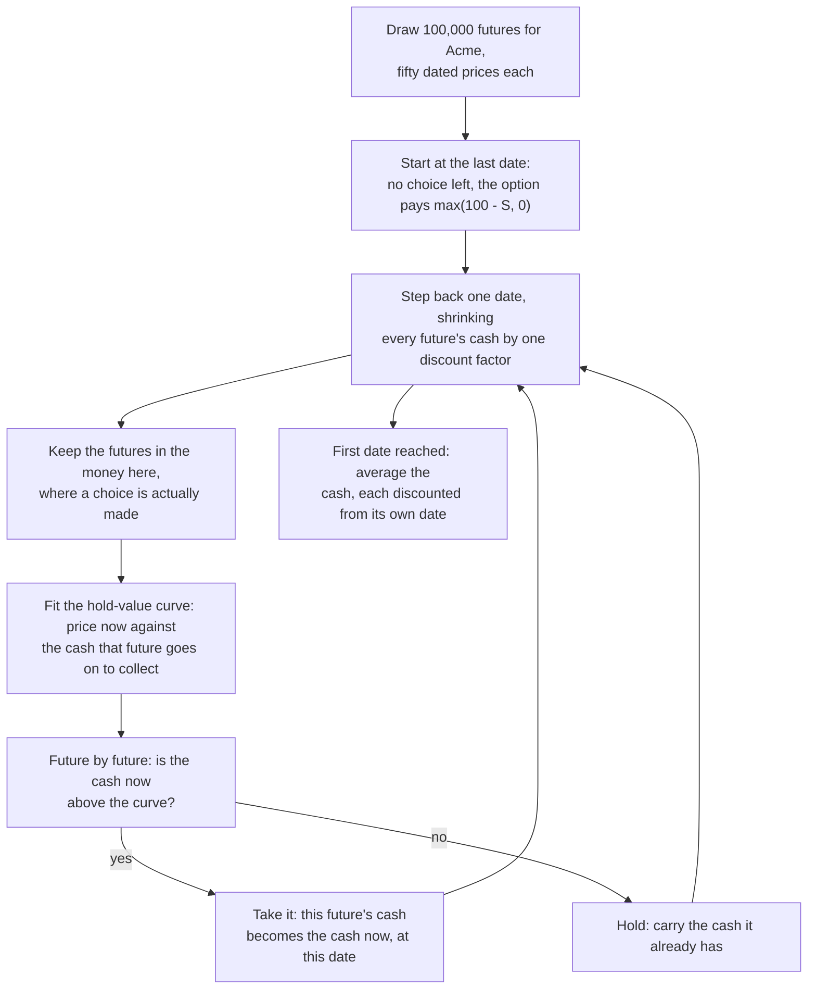
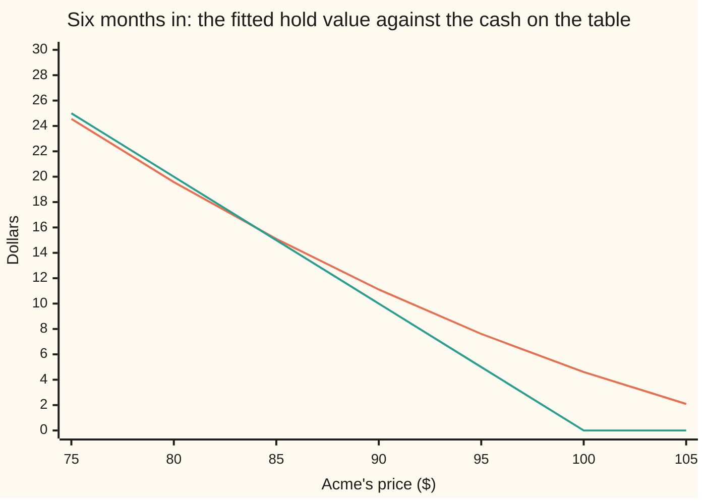

# Longstaff-Schwartz: early exercise by regression on simulated paths

[Syllabus](../../../SYLLABUS.md) → [Financial mathematics](../README.md) → [Numerical Methods for Pricing](../README.md#s06) → Longstaff-Schwartz

---

## General Overview

Acme shares trade at $100.00. An **American put** on Acme is the right to sell one share for $100.00 — the **strike** — and its holder may use that right on any one of fifty dates spread through the coming year, about a week apart. So the holder faces the same question fifty times: take the money now, or keep the right and ask again next week?

Half of that comparison is in plain sight. With Acme at $88.00, selling at $100.00 pays $12.00 today. The other half is invisible: what is the right worth if kept? That is an average over every way the rest of the year could go, and none of it has happened yet.

Simulation used to be helpless here. Drawing a hundred thousand futures for Acme is easy ([Monte Carlo pricing](01-monte-carlo-pricing.md)), but on any one of them the only thing to consult — what that future went on to do — is tomorrow's newspaper. That is not a strategy, and it prices this put at $11.97 instead of $6.66.

Longstaff and Schwartz published the way round it in 2001. Nobody owns one future; the machine holds a hundred thousand. Gather every future that stood near $88.00 on that date, see what those went on to collect, and average. Fitting a curve through the cloud of points does the gathering and the averaging at once — that is **regression**, the curve with the smallest total squared miss ([Least squares](../../09-Probability%20and%20statistics/09-Regression/01-least-squares-regression.md)). That curve is the **hold value**: what keeping the option is worth at a given price. On Acme it returns **$6.62**, against **$6.66** from a binomial tree, which knows nothing of simulation or curves ([Early exercise](../04-Binomial%20Trees/05-american-exercise-on-a-tree.md)).

**The value of waiting cannot be read off one simulated future, but it can be fitted across many — so a regression run backwards from expiry turns a simulation into a machine that knows when to quit.**

**What kind of fact this is:** a method; the fact underneath it, that a least-squares fit estimates an average-given-what-is-known, is a theorem, proved on this card in Why it works.

### The picture: the whole algorithm



Every arrow back into the loop is one exercise date, and the fit is rebuilt at each one.

---

## The formula

Notation first, in words. Write $S$ for Acme's price, $K$ for the strike, $r$ for the riskless rate, $g$ for the cash the option pays if used right now — the **intrinsic value** — and $C$ for the hold value, the average worth of keeping it. The last two live in the pretend world where every asset drifts at $r$, which is what makes discounted averaging a price ([Stepping an SDE](05-discretisation-schemes-for-sdes.md)).

On any exercise date the option is worth the better of two choices:

$$V(S) \;=\; \max\big(g(S),\; C(S)\big), \qquad g(S) = \max(K - S,\, 0)$$

**Read it aloud:** at every date the option's worth $V$ is whichever is larger, the cash now or the value of keeping it.

The hold value is the part nobody can see:

$$C(S) \;=\; \mathbb{E}\Big[\,e^{-r\delta}\;V(\text{next date's price})\;\Big|\;\text{Acme at } S \text{ now}\Big]$$

Here $\delta$ is the gap between exercise dates in years, and $e^{-r\delta}$ shrinks one date's money to the date before. The bar means *given*: average only over futures passing through $S$ now. That bar is the difficulty, since one simulated future passes through $S$ exactly once.

So replace $C$ with a curve fitted from the simulation itself. Measure the price in strikes, $x = S/K$, so the numbers fed to the fit sit near 1:

$$h(x) \;=\; b_0 + b_1 x + b_2 x^2$$

A parabola stands in for the hold value, its three weights rebuilt at every date. The weights chosen miss the observed cash by as little as possible, squared and summed over the futures in the money there:

$$(b_0, b_1, b_2) \;=\; \arg\min_{b} \sum_{i \,\in\, \text{in the money}} \big(Y_i - h(x_i)\big)^2$$

Here $Y$ is the cash a future goes on to collect under the rule built so far, carried back to this date. When the backwards pass ends, each of the $N$ futures has stopped at a date $\tau$ of its own, and the price is the plain average over the futures:

$$\text{price} \;=\; \frac{1}{N}\sum_{i=1}^{N} e^{-r\tau_i}\,g\big(S_{\tau_i}\big)$$

| Symbol | Plain meaning | In our example | Push it up and the answer… |
| --- | --- | --- | --- |
| $S$ | Acme's price on the date being decided | 88.00 above | falls: a put pays when the share is low |
| $K$ | the strike, the price the holder may sell at | 100.00 | rises: more cash on exercise, and sooner |
| $r$, $q$ | riskless rate; dividend yield paid out | 5% and 2% a year | $r$ up: the early-exercise premium grows, since cash taken early earns interest |
| $\sigma$, $T$ | volatility, how jumpy Acme is; years to the last date | 20% and 1 | both up: the put is dearer |
| $L$, $N$ | exercise dates; simulated futures | 50 and 100,000 | $L$ up: dearer. $N$ up: smaller error bar, better rule |
| $g$ | cash now, $\max(K - S, 0)$ | 12.00 at $S = 88$ | — |
| $C$ | the hold value: what keeping the option is worth | never seen directly; $h$ stands in for it | — |
| $V$ | the option's worth on a date: the better of the two | estimated at 6.622563 at the start of the year | — |
| $h$ | the fitted stand-in for $C$, a curve in $x = S/K$ | $15.1872 - 10.8791x$ below, so 5.3960 at $S = 90$ | — |
| $b_0$, $b_1$, $b_2$ | the fitted weights, rebuilt at every date | 157.9697, −251.4513, 98.0869 at six months | — |
| $m$ | how many terms the fit is allowed | 3 | rises: better rule, then no change |
| $Y$ | cash a future goes on to collect, carried back one date | 8.8512 for future 2, month 8 | — |
| $\delta$, $\tau$ | the gap between exercise dates; the date a future stops | a fiftieth of a year; 0.574373 on average among the futures stopping early | — |

### When it holds

- **The futures must be drawn in the pretend world.** Each step multiplies the price by $e^{(r-q-\frac12\sigma^2)\delta\,+\,\sigma\sqrt{\delta}\,Z}$, with $Z$ a bell-curve draw. A real-world drift makes the price wrong however good the rule is.
- **Exercise happens only on the dates simulated.** Fifty dates is a **Bermudan** option, not a true American one. The cost is measurable: the same tree gives 6.652120 on fifty dates against 6.660226 exercising at every step.
- **The curve must bend where the decision is close.** One term — a flat number ignoring the price — returns 6.005504; three terms return 6.622563. And the rule is fitted from noisy data, so too few futures means a worse rule, not merely a wider error bar: the price falls as well as wobbling.
- **The decision may use only what is known on the date.** Let a future consult its own outcome and the answer is 11.972318, which is not a price: no strategy can earn it.

---

## Why it works

### Step 0: the one number that cannot be seen on a single future

Stand at six months with Acme at $90.00. Cash now is $10.00. The hold value is an average over futures, and this future is one draw from it — as informative as one coin toss is about a half.

But the machine has 100,000 futures, 48,603 of them in the money at that date. Sort them by where they stood and read off the average cash collected by those near $90.00. That average estimates the hold value, which is exactly what the definition asks for; the regression is a tidier version of the same sorting, smooth at every price rather than jagged.

### Step 1: a least-squares fit is exactly an average-given-what-is-known

This is the fact the whole method rests on, and it is not an analogy. Among all curves through the cloud, the one with the smallest average squared miss is the conditional average $\mathbb{E}[Y \mid S]$ itself — the very quantity the hold value is defined to be. So fitting by least squares is not an approximation of the right answer; it is a way of computing the right answer, narrowed to whatever family of curves is allowed. Widen the family and the fit closes in. That is why the method is least-squares Monte Carlo and not curve-fitting Monte Carlo.

<details>
<summary>Detailed proof: the conditional average is the least-squares predictor</summary>

Write $M(S)$ for the conditional average $\mathbb{E}[Y \mid S]$ and $F(S)$ for any other curve. Split the miss by adding and subtracting $M(S)$:
$$\mathbb{E}\big[(Y - F(S))^2\big] = \mathbb{E}\big[(Y - M(S))^2\big] + 2\,\mathbb{E}\big[(Y - M(S))(M(S) - F(S))\big] + \mathbb{E}\big[(M(S) - F(S))^2\big].$$
The middle term vanishes. Average in two stages, price held fixed first: then $M(S) - F(S)$ is a known number and comes outside, leaving $\mathbb{E}[Y - M(S) \mid S] = 0$. So
$$\mathbb{E}\big[(Y - F(S))^2\big] = \mathbb{E}\big[(Y - M(S))^2\big] + \mathbb{E}\big[(M(S) - F(S))^2\big] \;\ge\; \mathbb{E}\big[(Y - M(S))^2\big],$$
with equality only where the two curves agree. The first term is the part of $Y$ no curve in the price can explain; the second is the fit's own error, which shrinks as terms are added. Narrowing the curve to $b_0 + b_1x + b_2x^2$ and averaging over the sample rather than the true distribution turns the minimisation into three linear equations, the **normal equations**, solved in the code by elimination.

</details>

Three terms are not chosen for beauty. Cash now, $K - S$, is a straight line of slope $-1$; the hold value is a gently curved line above it; the decision falls where they cross. Two or three weights catch that bend without chasing the simulation's noise:

| Terms in the fit | The shape it can make | LSM price |
| --- | --- | --- |
| 1 | a flat number, the same at every price | 6.005504 |
| 2 | a straight line | 6.564605 |
| 3 | a parabola | 6.622563 |
| 4 | a cubic | 6.652135 |

One term is worse than never exercising at all: 6.005504 against 6.330081 for the European put.

### Step 2: fit only where a choice is actually made

At $130.00 the put pays nothing, so the comparison never fires there. Including those futures spends the curve's three weights describing a region the rule never acts in, and their wall of zeros pulls the curve down near the one place that matters: where cash now and hold value cross.

### Step 3: carry the cash the future really collects

When a future holds, what travels back is the cash that future really goes on to collect, discounted — not the fitted number $h$. The fit is for deciding, not for valuing.

The reason is that $Y$ then has the right average: given where the future stood, its average across futures is exactly the hold value of the rule being built. Feed the smoothed curve back instead and foresight leaks in at every step, since that curve was built from all the futures at once.

### Step 4: walking backwards keeps the rule legal, so the answer is a floor

At the last date there is no choice, so the option's worth there is known; every earlier date needs the one after it, which is why the pass runs backwards. Each decision uses the price on the day and weights fitted from what was available then.

So the finished rule is a strategy someone could genuinely follow, and the true price is the best such strategy. A particular strategy cannot beat the best one, so this method's number sits **at or below** the truth: 6.622563 against 6.652120 from a tree on the same fifty dates, short by 0.029556 — a floor that can be defended, not a guess that might be high. The argument does need the weights to come from futures other than the ones being averaged; fitting and valuing on the same futures nicks the floor, and the usual mistake below measures by how much.

### The picture: where the two lines cross

Six months in, the fitted curve and the cash line look like this. Both are printed by the checks.



The curve staying positive past $100.00 is the fitted hold value; the one hitting zero at $100.00 is the cash from selling today. At $90.00 the curve is above the line, 11.11 against 10.00, so hold. At $80.00 it is below, 19.58 against 20.00, so take the money. Between them the two cross.

That crossing is the **exercise boundary**: the price below which a holder should stop. It is the most convincing number here, because two unrelated machines find it in nearly the same place — the fitted parabola at $84.28, the 2,000-step tree on the same fifty dates at $82.88, that tree exercising at every step at $81.41. The boundary drops as the right to act becomes continuous: waiting costs less when the next chance is a moment away rather than a week.

### The other door

In one dimension the tree wins outright: faster, no seed, and the benchmark used here. Simulation earns its place where a tree cannot go, and pays for that generality with an error bar and a downward bias.

---

## Worked numbers, by hand

Eight made-up futures for Acme, exercisable at months 4, 8 and 12, are small enough to check with a pencil. The strike is $100.00 and the rate 5 percent, so one four-month step discounts by $e^{-0.05/3} = 0.983471$. The fit uses two terms here, a straight line, since a line through five points can be solved by hand.

| Future | month 4 | month 8 | month 12 | cash at month 12 |
| --- | --- | --- | --- | --- |
| 1 | 106 | 112 | 118 | 0.00 |
| 2 | 98 | 94 | 91 | 9.00 |
| 3 | 103 | 99 | 101 | 0.00 |
| 4 | 95 | 101 | 97 | 3.00 |
| 5 | 88 | 90 | 96 | 4.00 |
| 6 | 100 | 96 | 89 | 11.00 |
| 7 | 97 | 93 | 99 | 1.00 |
| 8 | 109 | 104 | 107 | 0.00 |

**Month 8.** Five futures are in the money: 2, 3, 5, 6 and 7. Each one's month-12 cash, discounted once, is its $Y$. The two normal equations from those five points are `[5 4.7200 | 24.5868]` and `[4.7200 4.4602 | 23.1608]`, giving $h(x) = 15.1872 - 10.8791x$.

| Future | Acme | carried back, $Y$ | fitted hold | cash now | decision |
| --- | --- | --- | --- | --- | --- |
| 2 | 94 | 8.8512 | 4.9609 | 6.00 | take |
| 3 | 99 | 0.0000 | 4.4169 | 1.00 | hold |
| 5 | 90 | 3.9339 | 5.3960 | 10.00 | take |
| 6 | 96 | 10.8182 | 4.7433 | 4.00 | hold |
| 7 | 93 | 0.9835 | 5.0697 | 7.00 | take |

Two lines there are the whole method. Future 6 is in the money, cash now $4.00, and it **holds** — the curve says $4.7433 — then goes on to collect $11.00. Being in the money is not a reason to exercise. Future 2 takes $6.00 where holding would in fact have paid $8.8512: the rule is right on average, not future by future, which is what deciding without foresight means.

**Month 4.** Four futures are in the money now: 2, 4, 5 and 7, and their $Y$ is the cash decided at month 8, carried back one step. The system `[4 3.7800 | 25.5215]`, `[3.7800 3.5782 | 23.8717]` gives $h(x) = 44.5075 - 40.3462x$ — a steep line, since four points barely pin one down.

| Future | Acme | carried back, $Y$ | fitted hold | cash now | decision |
| --- | --- | --- | --- | --- | --- |
| 2 | 98 | 5.9008 | 4.9683 | 2.00 | hold |
| 4 | 95 | 2.9016 | 6.1786 | 5.00 | hold |
| 5 | 88 | 9.8347 | 9.0029 | 12.00 | take |
| 7 | 97 | 6.8843 | 5.3717 | 3.00 | hold |

| Step | Arithmetic | Value |
| --- | --- | --- |
| cash if held to month 12 | $\max(100 - S, 0)$, eight futures | 0, 9, 0, 3, 4, 11, 1, 0 |
| month 8, three futures take the cash | futures 2, 5 and 7 | 6.00, 10.00, 7.00 |
| month 4, one future takes the cash | future 5 | 12.00 |
| average the eight, each discounted from where it stopped | the method's answer | **4.711585** |
| the same eight, never exercising early | month-12 cash, discounted a year | 3.329303 |
| early-exercise premium | 4.711585 − 3.329303 | 1.382282 |

Put through the general routine, which fits by elimination rather than the two-line formula, the same eight return 4.711585 as well.

Now the real thing: 100,000 simulated futures, fifty exercise dates, a three-term fit on the futures in the money.

| Road to the answer | Price | What it is |
| --- | --- | --- |
| this method, 100,000 futures | **6.622563 ± 0.024271** | the rule fitted from the simulation |
| 2,000-step tree, the same fifty dates | 6.652120 | what the method estimates |
| 2,000-step tree, exercise at every step | 6.660226 | the American put, from the tree card |
| European put, payoff averaged over the bell curve | 6.330081 | the house put, 6.330080627550 |
| the same futures, European payoff only | 6.305922 ± 0.028914 | the futures are drawn right |

So acting early is worth about 33 cents on a $6.33 put, and this method captures 29 of them. Along the way 36.9 percent of the futures took the money before the last date, at 0.574373 years on average.

### What breaks if you drop a piece

| Mistake | Comes out at | What went wrong |
| --- | --- | --- |
| Let each future consult its own outcome | 11.972318 | Hindsight: nearly double a right worth 6.66, and no strategy can earn it. |
| Exercise the moment the put pays anything | 1.821779 | Two dollars cashed, an option worth six thrown away. |
| Forget to discount between dates | 6.830009 | Cash never shrinks on its way back, so a year's interest is added to every payoff and holding costs nothing. The answer clears the American price, which no legal strategy can. |
| Fit one term instead of three | 6.005504 | A hold value ignoring the share price. Worse than never exercising. |

Both checks below print every number above.

---

## Code, from first principles, and it actually runs

Nothing imported knows an answer: the random numbers come from a congruential generator written by hand, the bell curve from its own formula, the fit from the normal equations solved by elimination, the tree from a loop. The price is reached **four independent ways** — the fitted rule over 100,000 futures, a 2,000-step tree on the same fifty dates, that tree exercising at every step, and the European put as a floor, itself priced twice.

### Python

```python
# Longstaff-Schwartz least-squares Monte Carlo -- the check behind the card.  Standard library
# only, and nothing imported that already knows an answer: the random numbers, the regression,
# the integral and the tree are written out here.  Four roads to the American put on Acme: this
# method over 100,000 simulated futures; a 2,000-step tree on the same fifty exercise dates; the
# same tree exercising at every step; and the European put, by integral and off the futures.
from math import exp, log, sqrt, pi, cos
def uniform(s):                                   # 64-bit congruential generator, wrapping
    s[0] = (6364136223846793005 * s[0] + 1442695040888963407) % (1 << 64)
    return (s[0] >> 11) * (1.0 / 9007199254740992.0)
def normal(s):                                    # Box-Muller: two uniforms, one bell draw
    u1 = uniform(s) or 1e-300
    return sqrt(-2.0 * log(u1)) * cos(2.0 * pi * uniform(s))
def euro_put(S, K, r, q, sig, T, n=40000):        # average the payoff over the bell curve by
    h = 20.0 / n; total = 0.0                     # Simpson's rule: no d1, no d2, no N(x)
    for i in range(n + 1):
        z = -10.0 + i * h; w = 1.0 if i in (0, n) else (4.0 if i % 2 else 2.0)
        bell = exp(-0.5 * z * z) / sqrt(2.0 * pi)                        # bell-curve height at z
        total += w * bell * max(K - S * exp((r - q - 0.5 * sig * sig) * T + sig * sqrt(T) * z), 0.0)
    return exp(-r * T) * total * h / 3.0
def fit(xs, ys, m):     # least squares: the sums of powers that make up the normal equations,
    mom = [0.0] * (2 * m - 1); rhs = [0.0] * (2 * m - 1)   # then Gaussian elimination, pivoted
    for x, y in zip(xs, ys):
        p = 1.0
        for k in range(2 * m - 1): mom[k] += p; rhs[k] += p * y; p *= x
    M = [[mom[i + j] for j in range(m)] + [rhs[i]] for i in range(m)]
    for c in range(m):
        p = max(range(c, m), key=lambda k: abs(M[k][c])); M[c], M[p] = M[p], M[c]
        for k in range(c + 1, m):
            f = M[k][c] / M[c][c]; M[k] = [a - f * bb for a, bb in zip(M[k], M[c])]
    b = [0.0] * m
    for i in range(m - 1, -1, -1): b[i] = (M[i][m] - sum(M[i][j] * b[j] for j in range(i + 1, m))) / M[i][i]
    return b
def curve(b, x, o=0.0):                           # the fitted hold value at x = S / K, by
    for c in reversed(b): o = o * x + c           # Horner: b0 + x(b1 + x(b2 + x b3))
    return o
def make_paths(S0, r, q, sig, T, L, n, seed):      # one future at a time, date by date
    dt = T / L; mu = (r - q - 0.5 * sig * sig) * dt; vol = sig * sqrt(dt); s = [seed]; out = []
    for _ in range(n):
        x = S0; row = [x]; out.append(row)
        for _ in range(L): x *= exp(mu + vol * normal(s)); row.append(x)
    return out
def lsm(P, K, r, T, L, m=3, peek=False, onsight=False, nodisc=False, keep=None):   # walk back
    n = len(P); disc = 1.0 if nodisc else exp(-r * T / L)
    cash = [max(K - p[L], 0.0) for p in P]; stop = [L] * n
    for k in range(L - 1, 0, -1):
        for i in range(n): cash[i] *= disc        # roll every future's money back one date
        idx = [i for i in range(n) if P[i][k] < K]              # in the money: a real choice
        if peek or onsight:                       # the two mistakes that fit nothing
            for i in idx:
                if onsight or K - P[i][k] > cash[i]: cash[i] = K - P[i][k]; stop[i] = k
            continue
        if len(idx) <= m: continue
        b = fit([P[i][k] / K for i in idx], [cash[i] for i in idx], m)
        if keep is not None and k == keep[0]: keep[1] = (b, len(idx))
        for i in idx:
            if K - P[i][k] > curve(b, P[i][k] / K): cash[i] = K - P[i][k]; stop[i] = k
    v = [c * disc for c in cash]; mean = sum(v) / n
    return mean, sqrt(sum((y - mean) * (y - mean) for y in v) / (n - 1) / n), stop
def tree_put(S0, K, r, q, sig, T, n, every, at=-1):   # exercise on rows that are multiples
    dt = T / n; u = exp(sig * sqrt(dt)); d = 1.0 / u  # of `every` (0 = never, 1 = American)
    p = (exp((r - q) * dt) - d) / (u - d); disc = exp(-r * dt)
    px = [S0 * u ** k * d ** (n - k) for k in range(n + 1)]; v = [max(K - x, 0.0) for x in px]; front = 0.0
    for j in range(n - 1, -1, -1):
        can = every > 0 and j > 0 and j % every == 0; row = []
        for k in range(j + 1):
            px[k] *= u; c = disc * (p * v[k + 1] + (1.0 - p) * v[k])
            if can and K - px[k] > c:
                c = K - px[k]; front = max(front, px[k]) if j == at else front
            row.append(c)
        v = row
    return v[0], front
def num(label, v): print(f"  {label:<40}{v:>12.6f}")
S0, K, R, Q, SIG, T = 100.0, 100.0, 0.05, 0.02, 0.20, 1.0
print("Acme: S = 100, K = 100, r = 5%, q = 2%, sigma = 20%, T = 1 year; an American put")
put_eu = euro_put(S0, K, R, Q, SIG, T); num("European put, payoff averaged by Simpson", put_eu)
print("--- eight made-up futures for Acme, exercise at months 4, 8 and 12 ---")
TOY = [[100.0, 106.0, 112.0, 118.0], [100.0, 98.0, 94.0, 91.0], [100.0, 103.0, 99.0, 101.0],
       [100.0, 95.0, 101.0, 97.0], [100.0, 88.0, 90.0, 96.0], [100.0, 100.0, 96.0, 89.0],
       [100.0, 97.0, 93.0, 99.0], [100.0, 109.0, 104.0, 107.0]]
step = exp(-R / 3.0)                              # one four-month discount factor
for k in (1, 2, 3): print(f"  Acme at month {4 * k:>2}      " + "".join(f"{p[k]:>7.0f}" for p in TOY))
cash = [max(K - p[3], 0.0) for p in TOY]
print("  cash at month 12        " + "".join(f"{c:>7.2f}" for c in cash))
for k in (2, 1):
    cash = [c * step for c in cash]
    idx = [i for i in range(8) if TOY[i][k] < K]; xs = [TOY[i][k] / K for i in idx]; ys = [cash[i] for i in idx]
    nn = float(len(idx)); sx = sum(xs); sxx = sum(x * x for x in xs); sy = sum(ys); sxy = sum(x * y for x, y in zip(xs, ys))
    det = nn * sxx - sx * sx                                    # the two-term fit, in closed form
    b0 = (sy * sxx - sx * sxy) / det; b1 = (nn * sxy - sx * sy) / det
    print(f"  month {4 * k}: normal equations [{nn:.0f} {sx:.4f} | {sy:.4f}] [{sx:.4f} {sxx:.4f} | {sxy:.4f}]")
    print(f"  month {4 * k}: fitted hold h(x) = {b0:.4f} {b1:+.4f} x,  x = S / 100")
    for j, i in enumerate(idx):
        h = b0 + b1 * xs[j]; now = K - TOY[i][k]
        print(f"  month {4 * k}  future {i + 1}  Acme {TOY[i][k]:>5.0f}  carried {ys[j]:>7.4f}  hold {h:>7.4f}"
              f"  cash now {now:>5.2f}  -> {'take' if now > h else 'hold'}")
        if now > h: cash[i] = now
toy_hand = sum(c * step for c in cash) / 8.0; toy_run = lsm(TOY, K, R, 1.0, 3, m=2)[0]
toy_euro = sum(max(K - p[3], 0.0) for p in TOY) / 8.0 * exp(-R)
for lb, v in (("eight futures, by hand", toy_hand), ("eight futures, by the routine", toy_run),
              ("eight futures, no early exercise", toy_euro),
              ("eight futures, early-exercise premium", toy_hand - toy_euro)): num(lb, v)
L, N, SEED = 50, 100000, 20260919
print(f"--- {N} simulated futures, {L} exercise dates, three-term fit, in the money only ---")
P = make_paths(S0, R, Q, SIG, T, L, N, SEED)
eu = [exp(-R * T) * max(K - p[L], 0.0) for p in P]; eu_mc = sum(eu) / N
eu_se = sqrt(sum((x - eu_mc) * (x - eu_mc) for x in eu) / (N - 1) / N); keep = [25, None]
price, se, stop = lsm(P, K, R, T, L, m=3, keep=keep)
b25, n25 = keep[1]; early = [s for s in stop if s < L]
berm, front_berm = tree_put(S0, K, R, Q, SIG, T, 2000, 2000 // L, at=1000)
amer, front_amer = tree_put(S0, K, R, Q, SIG, T, 2000, 1, at=1000)
front_fit = max(i for i in range(7200, 10001)     # the highest price where cash now wins,
                if K - i / 100.0 > curve(b25, i / 100.0 / K)) / 100.0   # stepped in whole cents
print(f"  {'European put off the same futures':<40}{eu_mc:>12.6f}  +/- {eu_se:.6f}")
print(f"  {'LSM American put':<40}{price:>12.6f}  +/- {se:.6f}")
for lb, v in (("tree, the same fifty dates, 2,000 steps", berm), ("tree, exercise at every step", amer),
              ("LSM minus the same-schedule tree", price - berm)): num(lb, v)
print(f"  {'exercised early: share, mean date':<40}{len(early) / N:>12.6f}    {sum(early) / len(early) / L:.6f} years")
print(f"  six-month fit, {n25} futures in money   h(x) = {b25[0]:.4f} {b25[1]:+.4f} x {b25[2]:+.4f} x^2")
print(f"  {'take the cash below: fit, two trees':<40}{front_fit:>12.2f}    {front_berm:.2f}    {front_amer:.2f}")
print("--- the same futures, with fewer or more terms in the fit ---")
terms = {3: price}
for m, lb in ((1, "1 term, a flat number"), (2, "2 terms, a line"), (3, "3 terms, a parabola"), (4, "4 terms, a cubic")):
    if m not in terms: terms[m] = lsm(P, K, R, T, L, m=m)[0]
    num(lb, terms[m])
print("--- what breaks ---")
for lb, v in (("peeking at each future's own outcome", lsm(P, K, R, T, L, peek=True)[0]),
              ("exercising the moment it pays", lsm(P, K, R, T, L, onsight=True)[0]),
              ("no discounting between dates", lsm(P, K, R, T, L, m=3, nodisc=True)[0]),
              ("fitted hold at 70, cash now 30.00", curve(b25, 0.70))): num(lb, v)
print("--- the curve at six months, as drawn on the card ---")
grid = [75.0 + 5.0 * i for i in range(7)]
print("  Acme price                              " + "".join(f"{g:>8.0f}" for g in grid))
print("  fitted hold value                       " + "".join(f"{curve(b25, g / K):>8.2f}" for g in grid))
print("  cash now, max(100 - S, 0)               " + "".join(f"{max(K - g, 0.0):>8.2f}" for g in grid))
assert abs(toy_hand - toy_run) < 1e-12 and toy_hand > toy_euro,     "the hand road vs the routine"
assert abs(put_eu - 6.330080627550) < 1e-6 and abs(eu_mc - put_eu) < 3.0 * eu_se, "the house put"
assert price < berm and berm - price < 0.10,   "LSM sits just below the same-schedule tree"
assert put_eu < price < amer and berm < amer,  "European < LSM < Bermudan tree < American"
assert abs(front_fit - front_berm) < 2.0 and terms[1] < terms[2] < terms[3], "boundary, then terms"
print("ALL CHECKS PASS")
```

**Ran 2026-09-19 on macOS, Python 3.14.6, standard library only. All checks passed. Output, pasted from the run:**

```
Acme: S = 100, K = 100, r = 5%, q = 2%, sigma = 20%, T = 1 year; an American put
  European put, payoff averaged by Simpson    6.330081
--- eight made-up futures for Acme, exercise at months 4, 8 and 12 ---
  Acme at month  4          106     98    103     95     88    100     97    109
  Acme at month  8          112     94     99    101     90     96     93    104
  Acme at month 12          118     91    101     97     96     89     99    107
  cash at month 12           0.00   9.00   0.00   3.00   4.00  11.00   1.00   0.00
  month 8: normal equations [5 4.7200 | 24.5868] [4.7200 4.4602 | 23.1608]
  month 8: fitted hold h(x) = 15.1872 -10.8791 x,  x = S / 100
  month 8  future 2  Acme    94  carried  8.8512  hold  4.9609  cash now  6.00  -> take
  month 8  future 3  Acme    99  carried  0.0000  hold  4.4169  cash now  1.00  -> hold
  month 8  future 5  Acme    90  carried  3.9339  hold  5.3960  cash now 10.00  -> take
  month 8  future 6  Acme    96  carried 10.8182  hold  4.7433  cash now  4.00  -> hold
  month 8  future 7  Acme    93  carried  0.9835  hold  5.0697  cash now  7.00  -> take
  month 4: normal equations [4 3.7800 | 25.5215] [3.7800 3.5782 | 23.8717]
  month 4: fitted hold h(x) = 44.5075 -40.3462 x,  x = S / 100
  month 4  future 2  Acme    98  carried  5.9008  hold  4.9683  cash now  2.00  -> hold
  month 4  future 4  Acme    95  carried  2.9016  hold  6.1786  cash now  5.00  -> hold
  month 4  future 5  Acme    88  carried  9.8347  hold  9.0029  cash now 12.00  -> take
  month 4  future 7  Acme    97  carried  6.8843  hold  5.3717  cash now  3.00  -> hold
  eight futures, by hand                      4.711585
  eight futures, by the routine               4.711585
  eight futures, no early exercise            3.329303
  eight futures, early-exercise premium       1.382282
--- 100000 simulated futures, 50 exercise dates, three-term fit, in the money only ---
  European put off the same futures           6.305922  +/- 0.028914
  LSM American put                            6.622563  +/- 0.024271
  tree, the same fifty dates, 2,000 steps     6.652120
  tree, exercise at every step                6.660226
  LSM minus the same-schedule tree           -0.029556
  exercised early: share, mean date           0.369050    0.574373 years
  six-month fit, 48603 futures in money   h(x) = 157.9697 -251.4513 x +98.0869 x^2
  take the cash below: fit, two trees            84.28    82.88    81.41
--- the same futures, with fewer or more terms in the fit ---
  1 term, a flat number                       6.005504
  2 terms, a line                             6.564605
  3 terms, a parabola                         6.622563
  4 terms, a cubic                            6.652135
--- what breaks ---
  peeking at each future's own outcome       11.972318
  exercising the moment it pays               1.821779
  no discounting between dates                6.830009
  fitted hold at 70, cash now 30.00          30.016376
--- the curve at six months, as drawn on the card ---
  Acme price                                    75      80      85      90      95     100     105
  fitted hold value                          24.56   19.58   15.10   11.11    7.61    4.61    2.09
  cash now, max(100 - S, 0)                  25.00   20.00   15.00   10.00    5.00    0.00    0.00
ALL CHECKS PASS
```

### Rust

Same generator, same fit, same tree, written again with nothing from outside the standard library.

```rust
// Longstaff-Schwartz least-squares Monte Carlo -- the same check as the Python, in Rust.  No crates: the
// random numbers, the regression, the integral and the tree are written out here.  Four roads to the
// American put on Acme: this method over 100,000 futures; a 2,000-step tree on the same fifty exercise
// dates; that tree exercising at every step; and the European put.
use std::f64::consts::PI;
fn uniform(s: &mut u64) -> f64 {                  // 64-bit congruential generator, wrapping
    *s = s.wrapping_mul(6364136223846793005).wrapping_add(1442695040888963407);
    ((*s >> 11) as f64) * (1.0 / 9007199254740992.0)
}
fn normal(s: &mut u64) -> f64 {                   // Box-Muller: two uniforms, one bell draw
    let mut u1 = uniform(s); if u1 == 0.0 { u1 = 1e-300 }
    (-2.0 * u1.ln()).sqrt() * (2.0 * PI * uniform(s)).cos()
}
fn euro_put(s0: f64, k0: f64, r: f64, q: f64, sig: f64, t: f64) -> f64 {  // average the payoff over
    let n = 40000usize; let h = 20.0 / n as f64; let mut total = 0.0;     // the bell curve, by
    for i in 0..=n {                                   // Simpson's rule: no d1, no d2, no N(x)
        let z = -10.0 + i as f64 * h; let w = if i == 0 || i == n { 1.0 } else if i % 2 == 1 { 4.0 } else { 2.0 };
        let bell = (-0.5 * z * z).exp() / (2.0 * PI).sqrt();          // bell-curve height at z
        total += w * bell * (k0 - s0 * ((r - q - 0.5 * sig * sig) * t + sig * t.sqrt() * z).exp()).max(0.0);
    } (-r * t).exp() * total * h / 3.0
}
fn fit(xs: &[f64], ys: &[f64], m: usize) -> Vec<f64> {   // least squares: the sums of powers that
    let mut mom = vec![0.0; 2 * m - 1]; let mut rhs = vec![0.0; 2 * m - 1];  // make up the normal
    for (x, y) in xs.iter().zip(ys.iter()) { let mut p = 1.0;    // equations, then Gaussian
        for k in 0..2 * m - 1 { mom[k] += p; rhs[k] += p * y; p *= x } }               // elimination
    let mut mm: Vec<Vec<f64>> = (0..m).map(|i| (0..=m).map(|j| if j < m { mom[i + j] } else { rhs[i] }).collect()).collect();
    for c in 0..m {
        let mut p = c; for k in c + 1..m { if mm[k][c].abs() > mm[p][c].abs() { p = k } } mm.swap(c, p);
        for k in c + 1..m { let f = mm[k][c] / mm[c][c];
            let row: Vec<f64> = (0..=m).map(|j| mm[k][j] - f * mm[c][j]).collect(); mm[k] = row }
    }
    let mut b = vec![0.0; m];
    for i in (0..m).rev() { let mut s = 0.0; for j in i + 1..m { s += mm[i][j] * b[j] } b[i] = (mm[i][m] - s) / mm[i][i] }
    b
}
// the fitted hold value at x = S / K, by Horner: b0 + x(b1 + x(b2 + x b3))
fn curve(b: &[f64], x: f64) -> f64 { let mut o = 0.0; for c in b.iter().rev() { o = o * x + c } o }
fn make_paths(s0: f64, r: f64, q: f64, sig: f64, t: f64, l: usize, n: usize, seed: u64) -> Vec<Vec<f64>> {
    let dt = t / l as f64; let mu = (r - q - 0.5 * sig * sig) * dt; let vol = sig * dt.sqrt();
    let mut s = seed; let mut out = Vec::with_capacity(n);   // one future at a time, date by date
    for _ in 0..n {
        let mut x = s0; let mut row = vec![x];
        for _ in 0..l { x *= (mu + vol * normal(&mut s)).exp(); row.push(x) } out.push(row);
    }
    out
}
fn lsm(p: &[Vec<f64>], k0: f64, r: f64, t: f64, l: usize, m: usize, peek: bool, onsight: bool,
       nodisc: bool, keep: usize, got: &mut (Vec<f64>, usize)) -> (f64, f64, Vec<usize>) {
    let n = p.len(); let disc = if nodisc { 1.0 } else { (-r * t / l as f64).exp() };
    let mut cash: Vec<f64> = p.iter().map(|row| (k0 - row[l]).max(0.0)).collect();
    let mut stop = vec![l; n];
    for k in (1..l).rev() {
        for i in 0..n { cash[i] *= disc }         // roll every future's money back one date
        let idx: Vec<usize> = (0..n).filter(|&i| p[i][k] < k0).collect();   // in the money
        if peek || onsight {                      // the two mistakes that fit nothing
            for &i in &idx { if onsight || k0 - p[i][k] > cash[i] { cash[i] = k0 - p[i][k]; stop[i] = k } }
            continue }
        if idx.len() <= m { continue }
        let xs: Vec<f64> = idx.iter().map(|&i| p[i][k] / k0).collect();
        let ys: Vec<f64> = idx.iter().map(|&i| cash[i]).collect();
        let b = fit(&xs, &ys, m); if k == keep { *got = (b.clone(), idx.len()) }
        for &i in &idx { if k0 - p[i][k] > curve(&b, p[i][k] / k0) { cash[i] = k0 - p[i][k]; stop[i] = k } }
    }
    let v: Vec<f64> = cash.iter().map(|c| c * disc).collect();
    let mean = v.iter().fold(0.0, |a, y| a + y) / n as f64;
    let var = v.iter().fold(0.0, |a, y| a + (y - mean) * (y - mean));
    (mean, (var / (n - 1) as f64 / n as f64).sqrt(), stop)
}
fn tree_put(s0: f64, k0: f64, r: f64, q: f64, sig: f64, t: f64, n: usize, every: usize,
            at: i64) -> (f64, f64) {              // exercise on rows that are multiples of `every`
    let dt = t / n as f64; let u = (sig * dt.sqrt()).exp(); let d = 1.0 / u;
    let p = (((r - q) * dt).exp() - d) / (u - d); let disc = (-r * dt).exp();
    let mut px: Vec<f64> = (0..=n).map(|k| s0 * u.powf(k as f64) * d.powf((n - k) as f64)).collect();
    let mut v: Vec<f64> = px.iter().map(|x| (k0 - x).max(0.0)).collect(); let mut front = 0.0_f64;
    for j in (0..n).rev() {
        let can = every > 0 && j > 0 && j % every == 0; let mut row = Vec::with_capacity(j + 1);
        for k in 0..=j {
            px[k] *= u; let mut c = disc * (p * v[k + 1] + (1.0 - p) * v[k]);
            if can && k0 - px[k] > c { c = k0 - px[k]; front = if j as i64 == at { front.max(px[k]) } else { front } }
            row.push(c);
        } v = row;
    }
    (v[0], front)
}
fn num(label: &str, v: f64) { println!("  {:<40}{:>12.6}", label, v) }
fn row(label: &str, vals: &[f64], w: usize, p: usize) {
    let mut s = String::from(label);                 // one printed row: a label then the values
    for v in vals { s.push_str(&format!("{:>w$.p$}", v, w = w, p = p)) } println!("{}", s) }
fn main() {
    let (s0, k0, r, q, sig, t) = (100.0_f64, 100.0_f64, 0.05_f64, 0.02_f64, 0.20_f64, 1.0_f64);
    println!("Acme: S = 100, K = 100, r = 5%, q = 2%, sigma = 20%, T = 1 year; an American put");
    let put_eu = euro_put(s0, k0, r, q, sig, t); num("European put, payoff averaged by Simpson", put_eu);
    println!("--- eight made-up futures for Acme, exercise at months 4, 8 and 12 ---");
    let toy: Vec<Vec<f64>> = vec![vec![100.0, 106.0, 112.0, 118.0], vec![100.0, 98.0, 94.0, 91.0],
        vec![100.0, 103.0, 99.0, 101.0], vec![100.0, 95.0, 101.0, 97.0], vec![100.0, 88.0, 90.0, 96.0],
        vec![100.0, 100.0, 96.0, 89.0], vec![100.0, 97.0, 93.0, 99.0], vec![100.0, 109.0, 104.0, 107.0]];
    let step = (-r / 3.0).exp();                  // one four-month discount factor
    for k in 1..4 { row(&format!("  Acme at month {:>2}      ", 4 * k),
                        &toy.iter().map(|p| p[k]).collect::<Vec<f64>>(), 7, 0) }
    let mut cash: Vec<f64> = toy.iter().map(|p| (k0 - p[3]).max(0.0)).collect();
    row("  cash at month 12        ", &cash, 7, 2);
    for k in [2usize, 1] {
        cash = cash.iter().map(|c| c * step).collect();
        let idx: Vec<usize> = (0..8).filter(|&i| toy[i][k] < k0).collect();
        let xs: Vec<f64> = idx.iter().map(|&i| toy[i][k] / k0).collect();
        let ys: Vec<f64> = idx.iter().map(|&i| cash[i]).collect();
        let (nn, mut sx, mut sxx, mut sy, mut sxy) = (idx.len() as f64, 0.0, 0.0, 0.0, 0.0);
        for (x, y) in xs.iter().zip(ys.iter()) { sx += x; sxx += x * x; sy += y; sxy += x * y }
        let det = nn * sxx - sx * sx;             // the two-term fit, in closed form
        let b0 = (sy * sxx - sx * sxy) / det; let b1 = (nn * sxy - sx * sy) / det;
        println!("  month {}: normal equations [{:.0} {:.4} | {:.4}] [{:.4} {:.4} | {:.4}]",
                 4 * k, nn, sx, sy, sx, sxx, sxy);
        println!("  month {}: fitted hold h(x) = {:.4} {:+.4} x,  x = S / 100", 4 * k, b0, b1);
        for (j, &i) in idx.iter().enumerate() {
            let h = b0 + b1 * xs[j]; let now = k0 - toy[i][k];
            println!("  month {}  future {}  Acme {:>5.0}  carried {:>7.4}  hold {:>7.4}  cash now {:>5.2}  -> {}",
                     4 * k, i + 1, toy[i][k], ys[j], h, now, if now > h { "take" } else { "hold" });
            if now > h { cash[i] = now }
        }
    }
    let toy_hand = cash.iter().fold(0.0, |a, c| a + c * step) / 8.0; let mut got = (vec![0.0; 3], 0usize);
    let toy_run = lsm(&toy, k0, r, 1.0, 3, 2, false, false, false, 0, &mut got).0;
    let toy_euro = toy.iter().fold(0.0, |a, p| a + (k0 - p[3]).max(0.0)) / 8.0 * (-r).exp();
    for (lb, v) in [("eight futures, by hand", toy_hand), ("eight futures, by the routine", toy_run),
        ("eight futures, no early exercise", toy_euro), ("eight futures, early-exercise premium", toy_hand - toy_euro)] { num(lb, v) }
    let (l, n, seed) = (50usize, 100000usize, 20260919u64);
    println!("--- {} simulated futures, {} exercise dates, three-term fit, in the money only ---", n, l);
    let pp = make_paths(s0, r, q, sig, t, l, n, seed);
    let eu: Vec<f64> = pp.iter().map(|p| (-r * t).exp() * (k0 - p[l]).max(0.0)).collect();
    let eu_mc = eu.iter().fold(0.0, |a, x| a + x) / n as f64;
    let ev = eu.iter().fold(0.0, |a, x| a + (x - eu_mc) * (x - eu_mc)); let eu_se = (ev / (n - 1) as f64 / n as f64).sqrt();
    let (price, se, stop) = lsm(&pp, k0, r, t, l, 3, false, false, false, 25, &mut got);
    let (b25, n25) = (got.0.clone(), got.1);   // the fit kept from date 25, six months in
    let early: Vec<usize> = stop.iter().copied().filter(|&s| s < l).collect();
    let (berm, front_berm) = tree_put(s0, k0, r, q, sig, t, 2000, 2000 / l, 1000);
    let (amer, front_amer) = tree_put(s0, k0, r, q, sig, t, 2000, 1, 1000);
    let mut cents = 0usize;                       // the highest price where cash now wins
    for i in 7200..=10000 { if k0 - i as f64 / 100.0 > curve(&b25, i as f64 / 100.0 / k0) { cents = i } }
    let front_fit = cents as f64 / 100.0;         // in cents, so both languages step alike
    println!("  {:<40}{:>12.6}  +/- {:.6}", "European put off the same futures", eu_mc, eu_se);
    println!("  {:<40}{:>12.6}  +/- {:.6}", "LSM American put", price, se);
    for (lb, v) in [("tree, the same fifty dates, 2,000 steps", berm), ("tree, exercise at every step", amer),
                    ("LSM minus the same-schedule tree", price - berm)] { num(lb, v) }
    let mdate = early.iter().fold(0usize, |a, s| a + s) as f64 / early.len() as f64 / l as f64;
    println!("  {:<40}{:>12.6}    {:.6} years", "exercised early: share, mean date", early.len() as f64 / n as f64, mdate);
    println!("  six-month fit, {} futures in money   h(x) = {:.4} {:+.4} x {:+.4} x^2", n25, b25[0], b25[1], b25[2]);
    println!("  {:<40}{:>12.2}    {:.2}    {:.2}", "take the cash below: fit, two trees", front_fit, front_berm, front_amer);
    println!("--- the same futures, with fewer or more terms in the fit ---");
    let mut run = |m: usize, pk: bool, os: bool, nd: bool| lsm(&pp, k0, r, t, l, m, pk, os, nd, 0, &mut got).0;
    let mut terms = vec![0.0; 5]; terms[3] = price;
    for (m, lb) in [(1usize, "1 term, a flat number"), (2, "2 terms, a line"), (3, "3 terms, a parabola"), (4, "4 terms, a cubic")] {
        if terms[m] == 0.0 { terms[m] = run(m, false, false, false) } num(lb, terms[m]) }
    println!("--- what breaks ---");
    for (lb, v) in [("peeking at each future's own outcome", run(3, true, false, false)),
                    ("exercising the moment it pays", run(3, false, true, false)),
                    ("no discounting between dates", run(3, false, false, true)),
                    ("fitted hold at 70, cash now 30.00", curve(&b25, 0.70))] { num(lb, v) }
    println!("--- the curve at six months, as drawn on the card ---");
    let grid: Vec<f64> = (0..7).map(|i| 75.0 + 5.0 * i as f64).collect();
    row("  Acme price                              ", &grid, 8, 0);
    row("  fitted hold value                       ", &grid.iter().map(|g| curve(&b25, g / k0)).collect::<Vec<f64>>(), 8, 2);
    row("  cash now, max(100 - S, 0)               ", &grid.iter().map(|g| (k0 - g).max(0.0)).collect::<Vec<f64>>(), 8, 2);
    assert!((toy_hand - toy_run).abs() < 1e-12 && toy_hand > toy_euro, "the hand road vs the routine");
    assert!((put_eu - 6.330080627550).abs() < 1e-6 && (eu_mc - put_eu).abs() < 3.0 * eu_se, "the house put");
    assert!(price < berm && berm - price < 0.10, "LSM sits just below the same-schedule tree");
    assert!(put_eu < price && price < amer && berm < amer, "European < LSM < Bermudan tree < American");
    assert!((front_fit - front_berm).abs() < 2.0 && terms[1] < terms[2] && terms[2] < terms[3], "boundary, terms");
    println!("ALL CHECKS PASS");
}
```

**Ran 2026-09-19 on macOS, rustc 1.98.1, no crates. All checks passed. Output, pasted from the run:**

```
Acme: S = 100, K = 100, r = 5%, q = 2%, sigma = 20%, T = 1 year; an American put
  European put, payoff averaged by Simpson    6.330081
--- eight made-up futures for Acme, exercise at months 4, 8 and 12 ---
  Acme at month  4          106     98    103     95     88    100     97    109
  Acme at month  8          112     94     99    101     90     96     93    104
  Acme at month 12          118     91    101     97     96     89     99    107
  cash at month 12           0.00   9.00   0.00   3.00   4.00  11.00   1.00   0.00
  month 8: normal equations [5 4.7200 | 24.5868] [4.7200 4.4602 | 23.1608]
  month 8: fitted hold h(x) = 15.1872 -10.8791 x,  x = S / 100
  month 8  future 2  Acme    94  carried  8.8512  hold  4.9609  cash now  6.00  -> take
  month 8  future 3  Acme    99  carried  0.0000  hold  4.4169  cash now  1.00  -> hold
  month 8  future 5  Acme    90  carried  3.9339  hold  5.3960  cash now 10.00  -> take
  month 8  future 6  Acme    96  carried 10.8182  hold  4.7433  cash now  4.00  -> hold
  month 8  future 7  Acme    93  carried  0.9835  hold  5.0697  cash now  7.00  -> take
  month 4: normal equations [4 3.7800 | 25.5215] [3.7800 3.5782 | 23.8717]
  month 4: fitted hold h(x) = 44.5075 -40.3462 x,  x = S / 100
  month 4  future 2  Acme    98  carried  5.9008  hold  4.9683  cash now  2.00  -> hold
  month 4  future 4  Acme    95  carried  2.9016  hold  6.1786  cash now  5.00  -> hold
  month 4  future 5  Acme    88  carried  9.8347  hold  9.0029  cash now 12.00  -> take
  month 4  future 7  Acme    97  carried  6.8843  hold  5.3717  cash now  3.00  -> hold
  eight futures, by hand                      4.711585
  eight futures, by the routine               4.711585
  eight futures, no early exercise            3.329303
  eight futures, early-exercise premium       1.382282
--- 100000 simulated futures, 50 exercise dates, three-term fit, in the money only ---
  European put off the same futures           6.305922  +/- 0.028914
  LSM American put                            6.622563  +/- 0.024271
  tree, the same fifty dates, 2,000 steps     6.652120
  tree, exercise at every step                6.660226
  LSM minus the same-schedule tree           -0.029556
  exercised early: share, mean date           0.369050    0.574373 years
  six-month fit, 48603 futures in money   h(x) = 157.9697 -251.4513 x +98.0869 x^2
  take the cash below: fit, two trees            84.28    82.88    81.41
--- the same futures, with fewer or more terms in the fit ---
  1 term, a flat number                       6.005504
  2 terms, a line                             6.564605
  3 terms, a parabola                         6.622563
  4 terms, a cubic                            6.652135
--- what breaks ---
  peeking at each future's own outcome       11.972318
  exercising the moment it pays               1.821779
  no discounting between dates                6.830009
  fitted hold at 70, cash now 30.00          30.016376
--- the curve at six months, as drawn on the card ---
  Acme price                                    75      80      85      90      95     100     105
  fitted hold value                          24.56   19.58   15.10   11.11    7.61    4.61    2.09
  cash now, max(100 - S, 0)                  25.00   20.00   15.00   10.00    5.00    0.00    0.00
ALL CHECKS PASS
```

The two outputs are byte-identical: both languages run the same integer generator and the same arithmetic in the same order.

> [!TIP]
> **Try changing**
> Guess the direction first, then run it.
> - **Give the rule hindsight.** Pass `peek=True` to `lsm`. The answer leaps to 11.972318, far above the tree's 6.660226. Any American simulation that beats a tree has this bug in it somewhere.
> - **Starve the fit.** Set `m=1`, a flat hold value: 6.005504, below the European put's 6.330081. The rule now exercises at the wrong prices. Set `m=4` instead and it reaches 6.652135, landing on the tree's 6.652120 — a warning, not a victory. See the first trap below.
> - **Take out the discounting between dates.** Set `nodisc=True`: 6.830009, above the American price, which no legal strategy can be.

---

## The usual mistake

> [!warning]
> **Reading the number as the American price.** It is a floor, and a floor on the *Bermudan* price at that. Here the method says 6.622563, the tree on the same fifty dates 6.652120, and the American put 6.660226. The gap splits cleanly: about three cents for describing the boundary with three weights, under one cent for fifty dates instead of every day. Quote the schedule, the number of futures and the error bar, or quote nothing.
>
> - **Trusting the in-sample number.** The weights were fitted on the very futures then averaged, so the answer flatters itself. With four terms this run returns 6.652135 against the tree's 6.652120 — a hair above a bound it cannot exceed. The fix is to fit on one set of futures and value the rule on a fresh set.
> - **Quoting the error bar as the whole error.** The ± 0.024271 measures the wobble from random draws only. It knows nothing of the 0.029556 shortfall from a three-weight rule, and no number of futures shrinks that.
> - **Trusting the curve where the data is thin.** A parabola fitted where futures are dense does as it pleases where they are sparse. This one puts the hold value at $70.00 at 30.016376 against $30.00 of cash on the table, advising a holder to keep an option that should be cashed. Almost no futures fell that far, which is why nothing held the curve down.

---

## Where you meet it in real life

- **Bermudan swaptions and callable bonds.** The largest use by volume: the right to cancel an interest-rate contract on a schedule of dates, in a model with several driving factors where no tree fits. See [Bermudan swaptions](../31-Forward-Rate%20Models/06-bermudan-swaptions-by-regression.md).
- **Anything American with more than one underlying.** A put on the worst of five shares needs a five-dimensional tree; simulation needs the same 100,000 futures it always did. A payoff depending on the average price so far cannot sit on a recombining tree at all, since two paths meeting at a node have different histories.
- **Real options.** Whether to open a mine, expand a plant or run gas into storage: each is a right exercisable over a window, priced by the same backwards pass with a different payoff. In mortgage prepayment and employee share options the holder is a person with habits, and the curve is fitted from observed behaviour rather than from optimality.
- **The grid, for comparison.** In one dimension the same boundary is found by marching a price grid backwards: [American options on a grid](08-american-options-by-psor-and-lcp.md) and [Pricing on a grid](07-finite-differences-for-the-black-scholes-equation.md).
- **Approximate dynamic programming.** Fitting a value function on simulated trajectories is standard machine-learning practice; finance arrived at it independently, in 2001.

> **Say it back**
> An American put forces a choice on every exercise date: take the cash now, or keep the option. Cash now is visible; the value of keeping it is an average over futures, invisible on any single one. So simulate many futures, start at the last date where there is no choice, and step backwards, fitting a curve at each date from where the share stood against the cash those futures go on to collect — using only the futures in the money, where a choice is real. Exercise wherever cash now beats the curve, otherwise carry the realised cash back another date, and average at the end. On Acme: 6.62 against 6.66 from a tree, both machines putting the exercise boundary in the low eighties.

---

## What this builds on

- [Stepping an SDE](05-discretisation-schemes-for-sdes.md): how one future is built, step by step, with the drift that makes discounted averaging a price.
- [Early exercise](../04-Binomial%20Trees/05-american-exercise-on-a-tree.md): the same comparison at every node of a tree, and the 6.660226 measured against here.
- [Least squares](../../09-Probability%20and%20statistics/09-Regression/01-least-squares-regression.md): the normal equations, and why the fitted curve is the best in its family.

## Where this goes next

- [Bermudan options](../15-American%20and%20Bermudan%20exercise/03-bermudan-options.md): the contract this method actually prices — exercise on a fixed list of dates — and what the schedule is worth.
- [Bermudan swaptions](../31-Forward-Rate%20Models/06-bermudan-swaptions-by-regression.md): the same backwards fit where the underlying is a whole yield curve and no tree will fit.

This card returns a floor, and a floor alone cannot say how far from the truth it sits. Closing the gap needs an upper bound built from the dual form of the stopping problem, which is where [Bermudan options](../15-American%20and%20Bermudan%20exercise/03-bermudan-options.md) goes next.

---

## Sources

Verified 19 Sep 2026: every link below resolves to the publisher's page.

- Longstaff, Francis A., and Eduardo S. Schwartz. "Valuing American Options by Simulation: A Simple Least-Squares Approach." *The Review of Financial Studies* 14, no. 1 (2001): 113–147. [doi:10.1093/rfs/14.1.113](https://doi.org/10.1093/rfs/14.1.113). The paper: backwards pass, in-the-money restriction, realised cash.
- Clément, Emmanuelle, Damien Lamberton, and Philip Protter. "An Analysis of a Least Squares Regression Method for American Option Pricing." *Finance and Stochastics* 6, no. 4 (2002): 449–471. [doi:10.1007/s007800200071](https://doi.org/10.1007/s007800200071). Proves the method converges, and what error survives.
- Rogers, L. C. G. "Monte Carlo Valuation of American Options." *Mathematical Finance* 12, no. 3 (2002): 271–286. [doi:10.1111/1467-9965.02010](https://doi.org/10.1111/1467-9965.02010). The dual form, which bounds the price from above.
- Andersen, Leif, and Mark Broadie. "Primal-Dual Simulation Algorithm for Pricing Multidimensional American Options." *Management Science* 50, no. 9 (2004): 1222–1234. [doi:10.1287/mnsc.1040.0258](https://doi.org/10.1287/mnsc.1040.0258). Makes that bound computable: the floor becomes a bracket.
- Glasserman, Paul. *Monte Carlo Methods in Financial Engineering*. Springer, 2003. [Publisher page](https://link.springer.com/book/10.1007/978-0-387-21617-1). Chapter 8: American simulation and its biases.
