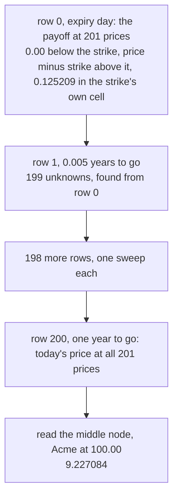
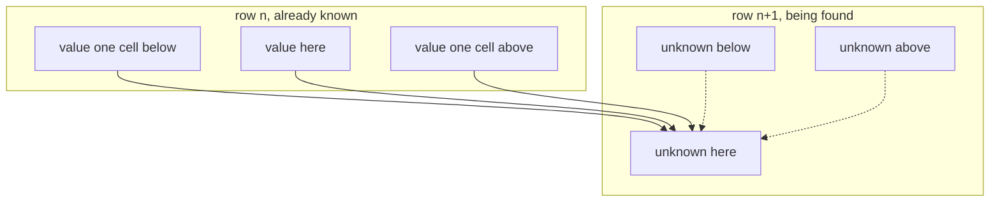
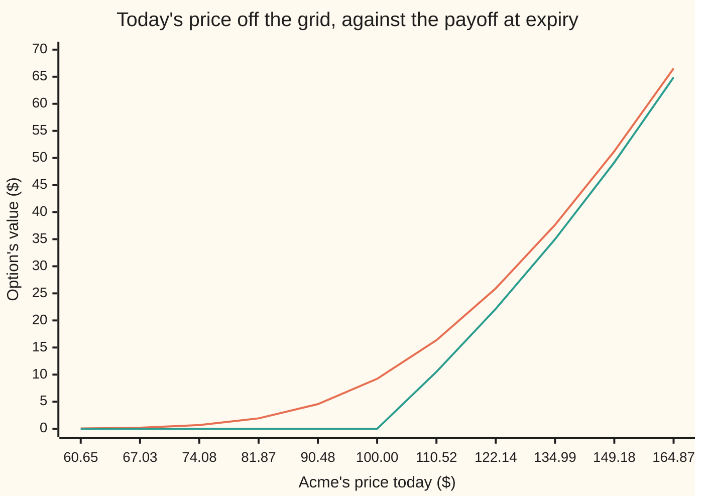

# Pricing on a grid: explicit, implicit and Crank-Nicolson schemes

[Syllabus](../../../SYLLABUS.md) → [Financial mathematics](../README.md) → [Numerical Methods for Pricing](../README.md#s06) → Pricing on a grid

---

## General Overview

Acme shares trade at $100.00. A call option on one share, struck at $100.00, runs for one year: the right to buy a share for $100.00 on that one day. Cash earns 5% a year, compounded continuously, Acme pays a 2% dividend yield, and the market prices its jumpiness — its **volatility** — at 20% a year. That contract has a formula, and the formula says 9.227006 ([Black–Scholes call](../08-The%20Black-Scholes%20call%20and%20put/01-black-scholes-call.md)).

Most of what a desk holds has no formula: not an American put, exercisable on any day, not an option that dies if the price touches a barrier, not one whose volatility changes with price and date. Each shares one thing with the plain call: a law of motion. Its value, a number attached to every price and every date, must change in one particular way from instant to instant, or somebody can hedge it and take free money.

A law of motion can be stepped. Rule a chart: 201 price levels across, 201 dates up. The bottom row is expiry day, where the value needs no theory — it is the payoff, 0.00 below the strike and the price minus the strike above it. One row up is 0.005 years earlier, found from the row below in one sweep of arithmetic. Two hundred rows later the top row is today, holding the option's value at every Acme price at once. Its middle node, Acme at 100.00, reads **9.2271**.

**The value obeys a law of motion in price and time, so the payoff — the one value known exactly — can be marched back to today in small steps of arithmetic.**

**What kind of fact this is:** a method. Three ways to take one step: two need a small system solved per step, one detonates if the steps are the wrong shape, and all three have an error that shrinks as the grid tightens.

### The picture: the payoff marched back to today



Nothing in that chart knows the Black-Scholes formula. It appears only as a referee: for this one contract the right answer is known.

---

## The formula

Notation first, in words. Prices are measured in logs: $x$ is the natural log of the price divided by the strike, 0 at the strike, negative below and positive above. Time runs backwards, as time still to go: $\tau$, read "tau", the years remaining, 0 on expiry day and 1 today. A value at one grid point is $V$, its price node $i$ written below and its time row $n$ above. Between nodes the steps are $h$ across and $k$ up.

In those coordinates the Black-Scholes equation reads

$$\frac{\partial V}{\partial \tau} \;=\; a\,\frac{\partial^2 V}{\partial x^2} \;+\; b\,\frac{\partial V}{\partial x} \;-\; r\,V, \qquad a = \tfrac12\sigma^2, \quad b = r - q - \tfrac12\sigma^2 .$$

The curly-d symbols are partial derivatives: $\partial V/\partial \tau$ is how fast the value changes as the time to go grows, holding the price still, and $\partial^2 V/\partial x^2$ is its curvature across prices ([Stepping the heat equation on a grid](../../08-Differential%20equations%20and%20dynamics/10-The%20Classical%20PDEs/09-finite-differences-for-the-heat-equation.md)).

**Read it aloud:** give the option one more instant of life and its value gains three things — curvature spread by volatility, a sideways slide from the drift, a steady drain at the bank rate.

Replace the derivatives by differences, multiply through by the time step, and two ratios carry everything:

$$\nu = \frac{a\,k}{h^2}, \qquad \eta = \frac{b\,k}{2h}.$$

The scheme is one line, with a dial $\theta$, read "theta", deciding how much of the right-hand side is charged to the new row instead of the old:

$$-\theta(\nu-\eta)\,V_{i-1}^{n+1} + \big(1 + \theta(2\nu + r k)\big)V_i^{n+1} - \theta(\nu+\eta)\,V_{i+1}^{n+1} \;=\; V_i^{n} + (1-\theta)\Big[(\nu-\eta)V_{i-1}^{n} - (2\nu + r k)V_i^{n} + (\nu+\eta)V_{i+1}^{n}\Big].$$

**Read it aloud:** the new value, tied to its two new neighbours, equals the old value nudged by its two old neighbours, the dial setting how the nudge splits between rows.

Three settings have names. At 0 the scheme is **explicit**: the left side is the new value alone, so each new number is a weighted average of three old ones, and nothing needs solving. At 1 it is **implicit**, or backward Euler: the whole nudge goes on the new row, tangling the new values together. At one half it is **Crank-Nicolson**, the average of the two, after the 1947 paper below.

| Symbol | Plain meaning | In our example | Push it up and the answer… |
| --- | --- | --- | --- |
| $V$ | the option's value at one grid point | starts as the payoff, ends at 9.227084 | — |
| $i$, $n$ | which price node, which time row | 0 to 200 each | — |
| $S$, $K$ | Acme's price and the strike | 100.00 and 100.00 | rises with the price, falls with the strike |
| $x$ | log-moneyness: the log of price over strike | 0 at the strike; the grid runs −1 to +1, so 36.79 to 271.83 | wider grid, coarser cells, worse answer |
| $\tau$ | time still to go, in years | 0 on the bottom row, 1 on the top | — |
| $h$, $k$ | the step across, the step up | 0.010000 and 0.005000 | faster runs, cruder prices |
| $M$, $N$ | price cells, time steps | 200 and 200 | error falls like the square of the step |
| $\theta$ | how much of the nudge the new row carries | 0, one half, or 1 | at one half and above, no explosion is possible |
| $\nu$ | the spreading ratio, read "nu" | 1.000000 | past one half the explicit scheme detonates |
| $\eta$ | the sliding ratio, read "eta" | 0.002500 | the drift's share of a step |
| $a$, $b$ | spreading and sliding coefficients | 0.020000 and 0.010000 | — |
| $r$, $q$, $\sigma$, $T$ | bank rate, dividend yield, volatility, the option's life | 5%, 2%, 20%, 1 year | — |

Two edges finish the setup, because at the outermost live node the difference formula reaches for a neighbour that is not there. Far below its strike a call is worthless; far above it is worth a share, dividend-shrunk, minus the discounted strike.

$$V(x_{\min}, \tau) = 0, \qquad V(x_{\max}, \tau) = K e^{x_{\max}} e^{-q\tau} - K e^{-r\tau}.$$

### When it holds

- **The equation is Black-Scholes.** Constant bank rate, dividend yield and volatility, no jumps in the price, hedging at every instant. Let jumpiness vary and the grid still runs, but the two ratios change from node to node ([Pricing with local volatility](../13-Local%20volatility%20and%20jumps/03-pricing-under-local-volatility-and-the-forward-smile.md)).
- **The grid is wide enough for its edges to be true.** Five times $\sigma\sqrt{T}$ either side is the −1 to +1 used here; squeezed to −0.2 and +0.2 the same scheme comes out at 8.901907.
- **Explicit steps keep the spreading ratio at or under one half.** Break that and the price does not drift off, it detonates: −1.17e+93 on this grid.
- **The cells resolve the payoff.** The kink at the strike falls inside one cell, which needs the payoff averaged across it; left as the payoff at the node, the same grid misses by thirty times as much. Second-order accuracy assumes smooth curvature, and the kink is where that assumption is thinnest.

---

## Why it works

### Step 0: the value has a law of motion, and a law of motion can be stepped

A seller who holds the option and shorts the right number of shares has, for the next instant, a position that does not care which way Acme moves. A riskless position must earn the bank rate, or the gap is free money. Writing that down gives an equation the value satisfies everywhere ([Black-Scholes by hedging](../05-Black-Scholes%20from%20the%20Ground%20Up/03-black-scholes-by-delta-hedging.md)).

That equation is **local**: it ties the value at a point to the value beside it and just after it, and says nothing about where Acme will end up. A known row determines the next row by arithmetic, and the payoff supplies one row for free.

### Step 1: straighten the equation before touching it

In the raw price the equation carries the coefficients $\tfrac12\sigma^2 S^2$ and $(r-q)S$, different at every price level, so the arithmetic and the stability rule would change from node to node. Putting the log of price over strike in place of the price makes both constant, and spaces the nodes evenly in percentage terms: one cell is 1% of the price everywhere on the grid.

Time is changed for another reason. The payoff is known at the end, so the equation runs backwards in the calendar; measuring time as years still to go turns that into forwards.

<details>
<summary>The algebra of the change of variables, if you want it</summary>

The chain rule gives three replacements: the calendar derivative flips sign, the price times the price-derivative becomes the log-derivative, and the price squared times the second price-derivative becomes the second log-derivative minus the first. Substituting and collecting leaves
$$V_\tau = \tfrac12\sigma^2 V_{xx} + \left(r - q - \tfrac12\sigma^2\right)V_x - rV,$$
subscripts standing for derivatives. The half-sigma-squared in the sliding coefficient is the same drag that sits in the formula card's drift: a log grows more slowly than the thing it measures.

</details>

### Step 2: differences in place of derivatives

Three values in a row give curvature, two give a slope:

$$\frac{\partial^2 V}{\partial x^2} \approx \frac{V_{i+1} - 2V_i + V_{i-1}}{h^2}, \qquad \frac{\partial V}{\partial x} \approx \frac{V_{i+1} - V_{i-1}}{2h}.$$

Both are wrong by an amount proportional to the square of the step. Centring them kills the error terms of the step's own size, which is why they straddle the node instead of leaning to one side.

### Step 3: which row is the nudge charged to

The left-hand side is a rate of change over one step, so it straddles two rows. The right-hand side has to be read on one row or the other, and the choice is free. That choice is the dial: it fixes what a step costs, whether the scheme can explode, and how fast the error falls.



Solid arrows are the old row's contribution. Dotted arrows are the new row's, and they are what makes a row of unknowns a system rather than a list. Turn the dial to 0 and they vanish.

### Step 4: the two edges move with the clock

Far above the strike exercise is near certain: the holder effectively owns a share, shrunk by the dividends leaking out, and owes the strike, discounted because it is paid later. Neither edge is exact at a finite distance; both become true as it recedes. Both parts move from row to row, and edges pinned at their expiry values let error creep in from the sides. A scheme that mixes two rows needs two edge values per side, the old row's on the old side of the equation and the new row's on the new.

### Step 5: solving a row, cheaply

For any dial setting above 0, each row is 199 equations in 199 unknowns. Every equation mentions a node and its two neighbours only, so the matrix has three non-zero bands and nothing else: it is **tridiagonal**. That needs no general elimination ([Gaussian elimination](../../03-Algebra/05-Solving%20Systems/02-gaussian-elimination.md)). One sweep down removes each equation's lower neighbour, one sweep back up reads the answers off: the **Thomas algorithm**, a fixed few operations per node instead of the cube of the node count. The diagonal entry $1 + \theta(2\nu + r k)$ always beats the two off-diagonal ones in size, so the sweep never divides by anything near zero.

### Step 6: why one of the three explodes

A scheme is stable when the small errors always present in it shrink as it runs. The sharpest thing a grid can hold is the checkerboard: plus, minus, plus, minus on consecutive nodes. For it the second difference is exactly $-4/h^2$ times the value and the centred first difference is exactly zero, the neighbours two apart being equal, so the drift drops out and one step multiplies the checkerboard by

$$\frac{1 - (1-\theta)(4\nu + r k)}{1 + \theta\,(4\nu + r k)}.$$

At dial 0 that is $1 - 4\nu - r k$, about −3 at a spreading ratio of 1.000000: the checkerboard triples and flips sign every step, and the run below does exactly that. Holding the multiplier's size at or below 1 needs a spreading ratio of one half, so at least 400 time steps here instead of 200. At dial 1 the numerator is 1 and the denominator exceeds 1 for every ratio, so the checkerboard always shrinks whatever the step: **unconditionally stable**. At one half the multiplier is about −1/3 here — shrinking, but changing sign each step.

<details>
<summary>Detailed proof: every wiggle, not just the checkerboard</summary>

Take any wiggle across the grid: its value at node `j` is `w^j`, where `w = exp(i*phi)` has size 1 and the angle `phi` runs from zero to half a turn, half a turn being the checkerboard. The second difference multiplies that wiggle by the real number `-4 sin(phi/2)^2 / h^2`; the centred first difference multiplies it by `i sin(phi)/h`, purely sideways.

Collect the right-hand side times the time step into `p = nu*s + r*k - 2i*eta*sin(phi)`, with `s = 4 sin(phi/2)^2`. The two sides read `1 + theta*p` on the new row and `1 - (1-theta)*p` on the old, so one step multiplies the wiggle by their ratio. The real part of `p` runs from `r*k` up to `4*nu + r*k`, largest at the checkerboard, where the sideways part vanishes.

For a dial at one half or above that ratio carries the whole right half of the complex plane into the unit disc, so no wiggle grows, at any step size. For a dial at 0 the ratio is `1 - p`, whose size passes 1 once the real part of `p` passes 2 — the spreading-ratio condition, up to the interest term. An explicit scheme also wants the sliding ratio no bigger than the spreading one, so its three weights stay positive: here 0.002500 against 1.000000. The same analysis without the finance is [Stepping the heat equation on a grid](../../08-Differential%20equations%20and%20dynamics/10-The%20Classical%20PDEs/09-finite-differences-for-the-heat-equation.md).

</details>

### Step 7: the kink, and the one cell that has to be averaged

The arithmetic assumes the value has ordinary curvature across three nodes. On the bottom row it does not: the payoff bends sharply at the strike, so the node sitting there sees not a curvature but a spike. A grid cannot hold a spike, and the error it makes on row 0 rides up every row above.

The repair is standard practice. The strike's own cell runs half a step either side of the strike, and the payoff across it averages to

$$\frac{1}{h}\int_{-h/2}^{h/2} K\left(e^{u}-1\right)^{+}du \;=\; \frac{K\left(e^{h/2} - 1 - h/2\right)}{h} \;=\; 0.125209 .$$

Giving that one node 0.125209 instead of 0 leaves every other node alone and moves the 200-by-200 answer from 9.224711 to 9.227084: from a quarter of a cent wrong to eight thousandths. Desks add a second repair, **Rannacher startup**: the first two steps taken fully implicit, damping the ringing a kink sets off.

### The other doors into the same room

A tree is this method on a coarser mesh with a probability story attached ([Trinomial trees](../04-Binomial%20Trees/06-trinomial-trees-and-the-grid-connection.md)). Monte Carlo goes the other way, sampling whole futures instead of using the local law ([Monte Carlo pricing](01-monte-carlo-pricing.md)).

---

## Worked numbers, by hand

The grid: log-moneyness from −1 to +1, Acme from 36.79 to 271.83, in 200 cells; one year in 200 steps.

| Step | Arithmetic | Value |
| --- | --- | --- |
| step across, $h$ | 2 ÷ 200 | 0.010000 |
| step up, $k$ | 1 ÷ 200 | 0.005000 |
| spreading coefficient, $a$ | 0.5 × 0.20^2 | 0.020000 |
| sliding coefficient, $b$ | 0.05 − 0.02 − 0.02 | 0.010000 |
| spreading ratio, $\nu$ | 0.020000 × 0.005 ÷ 0.0001 | 1.000000 |
| sliding ratio, $\eta$ | 0.010000 × 0.005 ÷ 0.02 | 0.002500 |
| the drain per step, $r k$ | 0.05 × 0.005 | 0.000250 |
| the strike cell's average payoff | 100 (e^0.005 − 1 − 0.005) ÷ 0.01 | 0.125209 |
| Crank-Nicolson row | the implicit sides halved, middle $1 + \nu + r k/2$ | −0.498750, 2.000125, −0.501250 |
| **the top row's middle node** | 200 sweeps later | **9.227084** |

Those three numbers are the coefficients of the unknown below, here and above, in each of the 199 equations solved every step. The formula's answer is 9.227006, so the grid is out by 0.000079: eight thousandths of a cent.

One step can be checked with a pencil, using the explicit scheme on a grid with 500 time steps, where its weights are legal:

| Step | Arithmetic | Value |
| --- | --- | --- |
| explicit weights, spreading ratio 0.4 | $\nu-\eta$, $1-2\nu-r k$, $\nu+\eta$ | 0.399000, 0.199900, 0.401000 |
| the node below the strike | a call below its strike pays nothing | 0.000000 |
| the node above the strike | 100 (e^0.01 − 1) | 1.005017 |
| **first step at the strike node** | 0.399 × 0 + 0.1999 × 0.125209 + 0.401 × 1.005017 | **0.428041** |

That is the strike node with two thousandths of a year left to run: 43 cents on this grid, almost all of it "maybe" — one step from a kink, crude but checkable with a pencil.

### What breaks if you drop a piece

| Mistake | Comes out at | What went wrong |
| --- | --- | --- |
| Leave the strike cell's kink unaveraged | 9.224711 | A grid cannot hold a spike in curvature; the error is thirty times bigger |
| Take explicit steps on this grid | −1.17e+93 | The checkerboard is tripled and flipped 200 times over |
| Use the implicit scheme, not the average | 9.221488 | Stable, and seventy times less accurate: its time error is first order |
| Squeeze the grid to −0.2 and +0.2 | 8.901907 | The edge conditions are false that close to the strike |
| Stretch it to −3 and +3, same 200 cells | 9.227710 | Cells three times coarser, error nine times bigger, spent where nothing happens |

Every number in these tables is printed by the code below.

### The rest of the grid, for free

A grid cannot answer one question at a time: each node needs its neighbours, so it carries the whole row along. That by-product is the point. **The top row is the price at every Acme price, and every row below it is the price on an earlier date.**



The smooth line is the top row, today's price, from 0.05 at an Acme price of 60.65 up to 66.52 at 164.87. The bent line is the payoff, and the gap is what a year of "maybe" is worth: widest at the strike, where the option's fate is least decided.

Rows 50, 100 and 150 hold the strike node at 4.335971, 6.307703 and 7.875328 — the $4.34, $6.31 and $7.88 the formula card prints for this option with 3, 6 and 9 months to run. They cost nothing extra: the intermediate rows are not scaffolding but the answer to the next question.

---

## Code, from first principles, and it actually runs

Nothing below imports anything that already holds an option price: the tridiagonal solver is written out, the grid is stepped by hand, and the bell-curve area the referee formula needs comes from `math.erf` in Python and from thin slices in Rust. The price is reached **four ways**: three dial settings — Crank-Nicolson, implicit, and explicit on a grid where it is legal — and the closed formula, which shares no code with the grid. Three checks follow: call minus put off the grid against the forward at every node, every solved row put back into its own equations, and the grid refined four times to watch the error fall like the square of the step.

### Python

```python
# Pricing on a grid -- the check behind the card.  Standard library only.  Nothing
# imported that already holds an option price: the bell-curve area is built from
# math.erf, the tridiagonal solver is written out, and the grid is stepped by hand.
from math import log, sqrt, exp, erf
S0, K, R, Q, SIG, T = 100.0, 100.0, 0.05, 0.02, 0.20, 1.0
XMAX = 1.0                      # grid edge in x = ln(S/K): five times sigma sqrt(T)
A = 0.5 * SIG * SIG             # spreading coefficient
B = R - Q - 0.5 * SIG * SIG     # sliding coefficient

def ncdf(z):  return 0.5 * (1.0 + erf(z / sqrt(2.0)))    # bell-curve area left of z

def formula(call):              # the closed form: an independent road to the price
    vt = SIG * sqrt(T)
    d1 = (log(S0 / K) + (R - Q + 0.5 * SIG * SIG) * T) / vt
    if call: return S0 * exp(-Q * T) * ncdf(d1) - K * exp(-R * T) * ncdf(d1 - vt)
    return K * exp(-R * T) * ncdf(vt - d1) - S0 * exp(-Q * T) * ncdf(-d1)

def thomas(sub, diag, sup, rhs):            # sweep down, then back up: O(n) work
    n = len(diag)
    c, d, out = [0.0] * n, list(rhs), [0.0] * n
    c[0], d[0] = sup[0] / diag[0], rhs[0] / diag[0]
    for i in range(1, n):
        m = diag[i] - sub[i] * c[i - 1]
        c[i], d[i] = sup[i] / m, (rhs[i] - sub[i] * d[i - 1]) / m
    out[n - 1] = d[n - 1]
    for i in range(n - 2, -1, -1): out[i] = d[i] - c[i] * out[i + 1]
    return out

def cell_average(h, call):      # the payoff averaged across the strike's own cell
    return K * (exp(h / 2) - 1 - h / 2) / h if call else K * (exp(-h / 2) - 1 + h / 2) / h

def edges(tau, call, xmax):     # the far edges: true far out, and moving with the clock
    if call: return 0.0, K * (exp(xmax) * exp(-Q * tau) - exp(-R * tau))
    return K * (exp(-R * tau) - exp(-xmax) * exp(-Q * tau)), 0.0

def run(theta, M, N, call=True, smooth=True, xmax=XMAX):
    """theta: 0 explicit, 1 implicit, 1/2 Crank-Nicolson.  Returns the last row, the
    strike node after every step, the largest size anywhere after every step, and the
    largest residual the solves left behind."""
    h, k = 2.0 * xmax / M, T / N
    V = [max(K * exp(-xmax + i * h) - K, 0.0) if call else max(K - K * exp(-xmax + i * h), 0.0)
         for i in range(M + 1)]
    if smooth: V[M // 2] = cell_average(h, call)
    nu, eta, rk = A * k / (h * h), B * k / (2.0 * h), R * k
    lo, mid, hi = nu - eta, 2.0 * nu + rk, nu + eta
    sub, diag = [-theta * lo] * (M - 1), [1.0 + theta * mid] * (M - 1)
    sup, centre, peak, resid = [-theta * hi] * (M - 1), [], [], 0.0
    for n in range(N):
        V[0], V[M] = edges(n * k, call, xmax)                   # the old row's own edges
        rhs = [V[i] + (1.0 - theta) * (lo * V[i - 1] - mid * V[i] + hi * V[i + 1])
               for i in range(1, M)]
        e0, eM = edges((n + 1) * k, call, xmax)                 # the new row's edges
        rhs[0] += theta * lo * e0
        rhs[M - 2] += theta * hi * eM
        inner = thomas(sub, diag, sup, rhs)
        for i in range(M - 1):                                  # put the answer back in
            back = diag[i] * inner[i] + (sub[i] * inner[i - 1] if i else 0.0)
            resid = max(resid, abs(back + (sup[i] * inner[i + 1] if i < M - 2 else 0.0) - rhs[i]))
        V = [e0] + inner + [eM]
        centre.append(V[M // 2])
        peak.append(max(abs(v) for v in V))
    return V, centre, peak, resid

def line(name, *vals):  print(f"{name:<45}" + "".join(f"{v:>11.6f}" for v in vals))

def row(name, vals, width=7, dp=2):  print(f"{name:<12}" + "".join(f"{v:>{width}.{dp}f}" for v in vals))

M0 = N0 = 200
h0, k0 = 2.0 * XMAX / M0, T / N0
nu0, eta0, rk0 = A * k0 / (h0 * h0), B * k0 / (2.0 * h0), R * k0
nu1, eta1, rk1 = A * (T / 500) / (h0 * h0), B * (T / 500) / (2.0 * h0), R * (T / 500)
print(f"Acme call, one year: S = {S0:.2f}, K = {K:.2f}, r = 5%, q = 2%, sigma = 20%")
print(f"grid: x = ln(S/K) from {-XMAX:.2f} to {XMAX:.2f}, so S from {K * exp(-XMAX):.2f} to {K * exp(XMAX):.2f}")
print(f"      M = {M0} cells of h = {h0:.6f} across, N = {N0} steps of k = {k0:.6f} up")
line("a = sigma^2/2", A)
line("b = r - q - sigma^2/2", B)
line("nu = a k / h^2", nu0)
line("eta = b k / (2 h)", eta0)
line("r k", rk0)
line("payoff averaged across the strike's cell", cell_average(h0, True))
line("explicit row   nu-eta, 1-2nu-rk, nu+eta", nu0 - eta0, 1.0 - 2.0 * nu0 - rk0, nu0 + eta0)
line("implicit row  -nu+eta, 1+2nu+rk, -nu-eta", eta0 - nu0, 1.0 + 2.0 * nu0 + rk0, -nu0 - eta0)
line("CN row        sides halved, middle 1+nu+rk/2", 0.5 * (eta0 - nu0), 1.0 + nu0 + 0.5 * rk0, -0.5 * (nu0 + eta0))
line("explicit row with 500 steps instead of 200", nu1 - eta1, 1.0 - 2.0 * nu1 - rk1, nu1 + eta1)
line("payoff one cell above the strike, K(e^h - 1)", K * (exp(h0) - 1.0))
line("that row's first step at the strike node", (1.0 - 2.0 * nu1 - rk1) * cell_average(h0, True)
     + (nu1 + eta1) * K * (exp(h0) - 1.0))
cn, centre, _, resid = run(0.5, M0, N0)
im, pt = run(1.0, M0, N0)[0], run(0.5, M0, N0, call=False)[0]
ex, rough = run(0.0, M0, 500)[0], run(0.5, M0, N0, smooth=False)[0]
narrow, wide = run(0.5, M0, N0, xmax=0.2)[0], run(0.5, M0, N0, xmax=3.0)[0]
C, P = formula(True), formula(False)
print()
line("1 Crank-Nicolson, 200 x 200", cn[M0 // 2])
line("2 Black-Scholes formula", C)
line("  grid minus formula", cn[M0 // 2] - C)
line("3 implicit, 200 x 200", im[M0 // 2])
line("4 explicit, 200 x 500", ex[M0 // 2])
line("5 put, Crank-Nicolson, 200 x 200", pt[M0 // 2])
line("  call minus put, both off the grid", cn[M0 // 2] - pt[M0 // 2])
line("  S e^-qT - K e^-rT", S0 * exp(-Q * T) - K * exp(-R * T))
line("  put by formula", P)
print(f"6 largest residual left by the 200 solves     {resid:.2e}")
print()
print("refinement, Crank-Nicolson, same domain:")
print("   M x N       h         k        call      error")
errs = []
for M in (50, 100, 200, 400):
    last = run(0.5, M, M)[0]
    errs.append(last[M // 2] - C)
    print(f"  {M:4d} x {M:4d}  {2.0 * XMAX / M:.6f}  {T / M:.6f}  {last[M // 2]:.6f}  {errs[-1]:+.6f}")
print("what breaks:")
line("  kink left unaveraged in the strike cell", rough[M0 // 2])
line("  domain x in [-0.2, 0.2], same 200 cells", narrow[M0 // 2])
line("  domain x in [-3, 3], same 200 cells", wide[M0 // 2])
uns, upeak = run(0.0, M0, N0)[1:3]
print()
print("explicit on the 200 x 200 grid, nu = 1: price at the strike node after step")
row("  1 to 8", uns[:8], 8)
print(f"  largest size anywhere after steps 10, 20 and 50: {upeak[9]:.3e} {upeak[19]:.3e} {upeak[49]:.3e}")
print(f"  the 'price' after all 200 steps: {uns[-1]:.2e}")
spots = [K * exp(-0.5 + 0.1 * j) for j in range(11)]
print("today's price across the last row, Crank-Nicolson:")
row("  S", spots)
row("  grid", [cn[50 + 10 * j] for j in range(11)])
row("  payoff", [max(s - K, 0.0) for s in spots])
print("the strike node with 3, 6, 9 and 12 months to go, Crank-Nicolson:")
row("  dollars", [centre[49], centre[99], centre[149], centre[199]], 10)
row("  six d.p.", [centre[49], centre[99], centre[149], centre[199]], 10, 6)
assert abs(cn[M0 // 2] - C) < 2.0e-4, "grid price against the closed form"
assert abs(ex[M0 // 2] - C) < 5.0e-3, "explicit road against the closed form"
assert abs(im[M0 // 2] - C) < 8.0e-3, "implicit road against the closed form"
assert max(abs(cn[i] - pt[i] - K * (exp(-XMAX + i * h0 - Q * T) - exp(-R * T)))
           for i in range(1, M0)) < 1.0e-4, "parity must hold at every node, not just the middle"
assert resid < 1.0e-10, "each Thomas solution must satisfy its own equations"
assert errs[1] / errs[2] > 3.0 and errs[2] / errs[3] > 3.0, "halving h must cut the error by about four"
assert upeak[49] > 1.0e6, "the explicit scheme must blow up when nu = 1"
assert abs(rough[M0 // 2] - C) > 20.0 * abs(cn[M0 // 2] - C), "averaging the strike cell must earn its place"
print("ALL CHECKS PASS")
```

**Ran 2026-09-19 on macOS, Python 3.14.6, standard library only. All checks passed. Output, pasted from the run:**

```
Acme call, one year: S = 100.00, K = 100.00, r = 5%, q = 2%, sigma = 20%
grid: x = ln(S/K) from -1.00 to 1.00, so S from 36.79 to 271.83
      M = 200 cells of h = 0.010000 across, N = 200 steps of k = 0.005000 up
a = sigma^2/2                                   0.020000
b = r - q - sigma^2/2                           0.010000
nu = a k / h^2                                  1.000000
eta = b k / (2 h)                               0.002500
r k                                             0.000250
payoff averaged across the strike's cell        0.125209
explicit row   nu-eta, 1-2nu-rk, nu+eta         0.997500  -1.000250   1.002500
implicit row  -nu+eta, 1+2nu+rk, -nu-eta       -0.997500   3.000250  -1.002500
CN row        sides halved, middle 1+nu+rk/2   -0.498750   2.000125  -0.501250
explicit row with 500 steps instead of 200      0.399000   0.199900   0.401000
payoff one cell above the strike, K(e^h - 1)    1.005017
that row's first step at the strike node        0.428041

1 Crank-Nicolson, 200 x 200                     9.227084
2 Black-Scholes formula                         9.227006
  grid minus formula                            0.000079
3 implicit, 200 x 200                           9.221488
4 explicit, 200 x 500                           9.229315
5 put, Crank-Nicolson, 200 x 200                6.330119
  call minus put, both off the grid             2.896965
  S e^-qT - K e^-rT                             2.896925
  put by formula                                6.330081
6 largest residual left by the 200 solves     1.14e-13

refinement, Crank-Nicolson, same domain:
   M x N       h         k        call      error
    50 x   50  0.040000  0.020000  9.228371  +0.001365
   100 x  100  0.020000  0.010000  9.227333  +0.000327
   200 x  200  0.010000  0.005000  9.227084  +0.000079
   400 x  400  0.005000  0.002500  9.227025  +0.000019
what breaks:
  kink left unaveraged in the strike cell       9.224711
  domain x in [-0.2, 0.2], same 200 cells       8.901907
  domain x in [-3, 3], same 200 cells           9.227710

explicit on the 200 x 200 grid, nu = 1: price at the strike node after step
  1 to 8        0.88    0.39    2.15   -1.59    8.65  -18.31   55.88 -149.44
  largest size anywhere after steps 10, 20 and 50: 1.200e+03 4.894e+07 6.285e+21
  the 'price' after all 200 steps: -1.17e+93
today's price across the last row, Crank-Nicolson:
  S           60.65  67.03  74.08  81.87  90.48 100.00 110.52 122.14 134.99 149.18 164.87
  grid         0.05   0.20   0.68   1.92   4.55   9.23  16.35  25.92  37.65  51.24  66.52
  payoff       0.00   0.00   0.00   0.00   0.00   0.00  10.52  22.14  34.99  49.18  64.87
the strike node with 3, 6, 9 and 12 months to go, Crank-Nicolson:
  dollars         4.34      6.31      7.88      9.23
  six d.p.    4.335971  6.307703  7.875328  9.227084
ALL CHECKS PASS
```

Four ways, one price. The refinement block is the habit worth keeping: each error about a quarter of the last each time the grid halves. The 200 solves satisfy their own equations to 1.14e-13, and call minus put off the grid is 2.896965 where the forward says 2.896925.

### Rust

Same grid, same numbers, no crates.

```rust
// Pricing on a grid -- the same check as the Python, in Rust.  No crates.  Rust has
// no erf, so the bell-curve area is built the honest way: thin slices under the curve
// (Simpson).  The tridiagonal solver and the grid march are written out here too.
use std::f64::consts::PI;
const S0: f64 = 100.0; const K: f64 = 100.0; const R: f64 = 0.05; const Q: f64 = 0.02;
const SIG: f64 = 0.20; const T: f64 = 1.0;
const XMAX: f64 = 1.0;                      // grid edge in x = ln(S/K): five sigma sqrt(T)
const A: f64 = 0.5 * SIG * SIG; const B: f64 = R - Q - 0.5 * SIG * SIG;  // spread, slide

fn phi(z: f64) -> f64 { (-0.5 * z * z).exp() / (2.0 * PI).sqrt() }   // bell-curve height
fn simpson<F: Fn(f64) -> f64>(f: F, lo: f64, hi: f64, n: usize) -> f64 {
    let step = (hi - lo) / n as f64;
    let mut s = f(lo) + f(hi);
    for i in 1..n { s += if i % 2 == 1 { 4.0 } else { 2.0 } * f(lo + i as f64 * step); }
    s * step / 3.0
}
fn ncdf(z: f64) -> f64 {        // bell-curve area left of z: a half, plus the slice 0 to z
    if z < -12.0 { 0.0 } else if z > 12.0 { 1.0 } else { 0.5 + simpson(phi, 0.0, z, 4000) }
}
fn formula(call: bool) -> f64 {     // the closed form: an independent road to the price
    let vt = SIG * T.sqrt();
    let d1 = ((S0 / K).ln() + (R - Q + 0.5 * SIG * SIG) * T) / vt;
    if call { return S0 * (-Q * T).exp() * ncdf(d1) - K * (-R * T).exp() * ncdf(d1 - vt); }
    K * (-R * T).exp() * ncdf(vt - d1) - S0 * (-Q * T).exp() * ncdf(-d1)
}
fn thomas(sub: &[f64], diag: &[f64], sup: &[f64], rhs: &[f64]) -> Vec<f64> {
    let n = diag.len();                     // sweep down, then back up: O(n) work
    let (mut c, mut d, mut out) = (vec![0.0; n], rhs.to_vec(), vec![0.0; n]);
    c[0] = sup[0] / diag[0]; d[0] = rhs[0] / diag[0];
    for i in 1..n {
        let m = diag[i] - sub[i] * c[i - 1];
        c[i] = sup[i] / m; d[i] = (rhs[i] - sub[i] * d[i - 1]) / m;
    }
    out[n - 1] = d[n - 1];
    for i in (0..n - 1).rev() { out[i] = d[i] - c[i] * out[i + 1]; }
    out
}
fn cell_average(h: f64, call: bool) -> f64 {    // the payoff averaged across the strike's cell
    if call { K * ((h / 2.0).exp() - 1.0 - h / 2.0) / h } else { K * ((-h / 2.0).exp() - 1.0 + h / 2.0) / h }
}
fn edges(tau: f64, call: bool, xmax: f64) -> (f64, f64) {   // the far edges: true far out
    if call { return (0.0, K * (xmax.exp() * (-Q * tau).exp() - (-R * tau).exp())); }
    (K * ((-R * tau).exp() - (-xmax).exp() * (-Q * tau).exp()), 0.0)
}
// theta: 0 explicit, 1 implicit, 1/2 Crank-Nicolson.  Returns the last row, the strike node
// after every step, the largest size anywhere after every step, and the solves' residual.
fn run(theta: f64, m: usize, n: usize, call: bool, smooth: bool, xmax: f64)
       -> (Vec<f64>, Vec<f64>, Vec<f64>, f64) {
    let (h, k) = (2.0 * xmax / m as f64, T / n as f64);
    let mut v: Vec<f64> = (0..=m).map(|i| {
        let s = K * (-xmax + i as f64 * h).exp();
        if call { (s - K).max(0.0) } else { (K - s).max(0.0) }
    }).collect();
    if smooth { v[m / 2] = cell_average(h, call); }
    let (nu, eta, rk) = (A * k / (h * h), B * k / (2.0 * h), R * k);
    let (lo, mid, hi) = (nu - eta, 2.0 * nu + rk, nu + eta);
    let (sub, diag, sup) = (vec![-theta * lo; m - 1], vec![1.0 + theta * mid; m - 1],
                            vec![-theta * hi; m - 1]);
    let (mut centre, mut peak, mut resid) = (Vec::new(), Vec::new(), 0.0_f64);
    for step in 0..n {
        let (o0, om) = edges(step as f64 * k, call, xmax);       // the old row's own edges
        v[0] = o0; v[m] = om;
        let mut rhs: Vec<f64> = (1..m)
            .map(|i| v[i] + (1.0 - theta) * (lo * v[i - 1] - mid * v[i] + hi * v[i + 1]))
            .collect();
        let (e0, em) = edges((step + 1) as f64 * k, call, xmax); // the new row's edges
        rhs[0] += theta * lo * e0; rhs[m - 2] += theta * hi * em;
        let inner = thomas(&sub, &diag, &sup, &rhs);
        for i in 0..m - 1 {                                     // put the answer back in
            let (left, right) = (if i > 0 { sub[i] * inner[i - 1] } else { 0.0 },
                                if i < m - 2 { sup[i] * inner[i + 1] } else { 0.0 });
            resid = resid.max((diag[i] * inner[i] + left + right - rhs[i]).abs());
        }
        v = std::iter::once(e0).chain(inner).chain(std::iter::once(em)).collect();
        centre.push(v[m / 2]);
        peak.push(v.iter().fold(0.0_f64, |t, x| t.max(x.abs())));
    }
    (v, centre, peak, resid)
}
fn line(name: &str, vals: &[f64]) {     // one label, then the numbers to six decimals
    println!("{:<45}{}", name, vals.iter().map(|v| format!("{:>11.6}", v)).collect::<String>()); }
fn row(name: &str, vals: &[f64], w: usize, dp: usize) {  // a table row at a chosen width
    println!("{:<12}{}", name, vals.iter().map(|v| format!("{:>w$.dp$}", v)).collect::<String>()); }
fn sci(x: f64, p: usize) -> String {        // Python's exponent form: 1.200e+03, 1.14e-13
    let s = format!("{:.*e}", p, x);
    let (mantissa, e) = s.split_once('e').unwrap(); let n: i32 = e.parse().unwrap();
    format!("{}e{}{:02}", mantissa, if n < 0 { '-' } else { '+' }, n.abs())
}
fn main() {
    let (m0, n0) = (200usize, 200usize);
    let (h0, k0) = (2.0 * XMAX / m0 as f64, T / n0 as f64);
    let (nu0, eta0, rk0) = (A * k0 / (h0 * h0), B * k0 / (2.0 * h0), R * k0);
    let k5 = T / 500.0;
    let (nu1, eta1, rk1) = (A * k5 / (h0 * h0), B * k5 / (2.0 * h0), R * k5);
    println!("Acme call, one year: S = {:.2}, K = {:.2}, r = 5%, q = 2%, sigma = 20%", S0, K);
    println!("grid: x = ln(S/K) from {:.2} to {:.2}, so S from {:.2} to {:.2}",
             -XMAX, XMAX, K * (-XMAX).exp(), K * XMAX.exp());
    println!("      M = {} cells of h = {:.6} across, N = {} steps of k = {:.6} up", m0, h0, n0, k0);
    line("a = sigma^2/2", &[A]);
    line("b = r - q - sigma^2/2", &[B]);
    line("nu = a k / h^2", &[nu0]);
    line("eta = b k / (2 h)", &[eta0]);
    line("r k", &[rk0]);
    line("payoff averaged across the strike's cell", &[cell_average(h0, true)]);
    line("explicit row   nu-eta, 1-2nu-rk, nu+eta", &[nu0 - eta0, 1.0 - 2.0 * nu0 - rk0, nu0 + eta0]);
    line("implicit row  -nu+eta, 1+2nu+rk, -nu-eta", &[eta0 - nu0, 1.0 + 2.0 * nu0 + rk0, -nu0 - eta0]);
    line("CN row        sides halved, middle 1+nu+rk/2", &[0.5 * (eta0 - nu0), 1.0 + nu0 + 0.5 * rk0, -0.5 * (nu0 + eta0)]);
    line("explicit row with 500 steps instead of 200", &[nu1 - eta1, 1.0 - 2.0 * nu1 - rk1, nu1 + eta1]);
    line("payoff one cell above the strike, K(e^h - 1)", &[K * (h0.exp() - 1.0)]);
    line("that row's first step at the strike node", &[(1.0 - 2.0 * nu1 - rk1) * cell_average(h0, true)
         + (nu1 + eta1) * K * (h0.exp() - 1.0)]);
    let (cn, centre, _, resid) = run(0.5, m0, n0, true, true, XMAX);
    let (im, pt) = (run(1.0, m0, n0, true, true, XMAX).0, run(0.5, m0, n0, false, true, XMAX).0);
    let (ex, rough) = (run(0.0, m0, 500, true, true, XMAX).0, run(0.5, m0, n0, true, false, XMAX).0);
    let (narrow, wide) = (run(0.5, m0, n0, true, true, 0.2).0, run(0.5, m0, n0, true, true, 3.0).0);
    let (c, p) = (formula(true), formula(false));
    println!();
    line("1 Crank-Nicolson, 200 x 200", &[cn[m0 / 2]]);
    line("2 Black-Scholes formula", &[c]);
    line("  grid minus formula", &[cn[m0 / 2] - c]);
    line("3 implicit, 200 x 200", &[im[m0 / 2]]);
    line("4 explicit, 200 x 500", &[ex[m0 / 2]]);
    line("5 put, Crank-Nicolson, 200 x 200", &[pt[m0 / 2]]);
    line("  call minus put, both off the grid", &[cn[m0 / 2] - pt[m0 / 2]]);
    line("  S e^-qT - K e^-rT", &[S0 * (-Q * T).exp() - K * (-R * T).exp()]);
    line("  put by formula", &[p]);
    println!("6 largest residual left by the 200 solves     {}", sci(resid, 2));
    println!();
    println!("refinement, Crank-Nicolson, same domain:");
    println!("   M x N       h         k        call      error");
    let mut errs: Vec<f64> = Vec::new();
    for m in [50usize, 100, 200, 400] {
        let last = run(0.5, m, m, true, true, XMAX).0;
        errs.push(last[m / 2] - c);
        println!("  {:4} x {:4}  {:.6}  {:.6}  {:.6}  {:+.6}",
                 m, m, 2.0 * XMAX / m as f64, T / m as f64, last[m / 2], errs[errs.len() - 1]);
    }
    println!("what breaks:");
    line("  kink left unaveraged in the strike cell", &[rough[m0 / 2]]);
    line("  domain x in [-0.2, 0.2], same 200 cells", &[narrow[m0 / 2]]);
    line("  domain x in [-3, 3], same 200 cells", &[wide[m0 / 2]]);
    let (_, uns, upeak, _) = run(0.0, m0, n0, true, true, XMAX);
    println!();
    println!("explicit on the 200 x 200 grid, nu = 1: price at the strike node after step");
    row("  1 to 8", &uns[..8], 8, 2);
    println!("  largest size anywhere after steps 10, 20 and 50: {} {} {}",
             sci(upeak[9], 3), sci(upeak[19], 3), sci(upeak[49], 3));
    println!("  the 'price' after all 200 steps: {}", sci(uns[n0 - 1], 2));
    let spots: Vec<f64> = (0..11).map(|j| K * (-0.5 + 0.1 * j as f64).exp()).collect();
    println!("today's price across the last row, Crank-Nicolson:");
    row("  S", &spots, 7, 2);
    row("  grid", &(0..11).map(|j| cn[50 + 10 * j]).collect::<Vec<f64>>(), 7, 2);
    row("  payoff", &spots.iter().map(|s| (s - K).max(0.0)).collect::<Vec<f64>>(), 7, 2);
    println!("the strike node with 3, 6, 9 and 12 months to go, Crank-Nicolson:");
    let slices = [centre[49], centre[99], centre[149], centre[199]];
    row("  dollars", &slices, 10, 2);
    row("  six d.p.", &slices, 10, 6);
    assert!((cn[m0 / 2] - c).abs() < 2.0e-4, "grid price against the closed form");
    assert!((ex[m0 / 2] - c).abs() < 5.0e-3, "explicit road against the closed form");
    assert!((im[m0 / 2] - c).abs() < 8.0e-3, "implicit road against the closed form");
    assert!((1..m0).map(|i| (cn[i] - pt[i] - K * ((-XMAX + i as f64 * h0 - Q * T).exp()
            - (-R * T).exp())).abs()).fold(0.0_f64, f64::max) < 1.0e-4, "parity at every node");
    assert!(resid < 1.0e-10, "each Thomas solution must satisfy its own equations");
    assert!(errs[1] / errs[2] > 3.0 && errs[2] / errs[3] > 3.0, "halving h must cut the error by four");
    assert!(upeak[49] > 1.0e6, "the explicit scheme must blow up when nu = 1");
    assert!((rough[m0 / 2] - c).abs() > 20.0 * (cn[m0 / 2] - c).abs(), "averaging the cell earns its place");
    println!("ALL CHECKS PASS");
}
```

**Ran 2026-09-19 on macOS, rustc 1.98.1, no crates. All checks passed. Output, pasted from the run:**

```
Acme call, one year: S = 100.00, K = 100.00, r = 5%, q = 2%, sigma = 20%
grid: x = ln(S/K) from -1.00 to 1.00, so S from 36.79 to 271.83
      M = 200 cells of h = 0.010000 across, N = 200 steps of k = 0.005000 up
a = sigma^2/2                                   0.020000
b = r - q - sigma^2/2                           0.010000
nu = a k / h^2                                  1.000000
eta = b k / (2 h)                               0.002500
r k                                             0.000250
payoff averaged across the strike's cell        0.125209
explicit row   nu-eta, 1-2nu-rk, nu+eta         0.997500  -1.000250   1.002500
implicit row  -nu+eta, 1+2nu+rk, -nu-eta       -0.997500   3.000250  -1.002500
CN row        sides halved, middle 1+nu+rk/2   -0.498750   2.000125  -0.501250
explicit row with 500 steps instead of 200      0.399000   0.199900   0.401000
payoff one cell above the strike, K(e^h - 1)    1.005017
that row's first step at the strike node        0.428041

1 Crank-Nicolson, 200 x 200                     9.227084
2 Black-Scholes formula                         9.227006
  grid minus formula                            0.000079
3 implicit, 200 x 200                           9.221488
4 explicit, 200 x 500                           9.229315
5 put, Crank-Nicolson, 200 x 200                6.330119
  call minus put, both off the grid             2.896965
  S e^-qT - K e^-rT                             2.896925
  put by formula                                6.330081
6 largest residual left by the 200 solves     1.14e-13

refinement, Crank-Nicolson, same domain:
   M x N       h         k        call      error
    50 x   50  0.040000  0.020000  9.228371  +0.001365
   100 x  100  0.020000  0.010000  9.227333  +0.000327
   200 x  200  0.010000  0.005000  9.227084  +0.000079
   400 x  400  0.005000  0.002500  9.227025  +0.000019
what breaks:
  kink left unaveraged in the strike cell       9.224711
  domain x in [-0.2, 0.2], same 200 cells       8.901907
  domain x in [-3, 3], same 200 cells           9.227710

explicit on the 200 x 200 grid, nu = 1: price at the strike node after step
  1 to 8        0.88    0.39    2.15   -1.59    8.65  -18.31   55.88 -149.44
  largest size anywhere after steps 10, 20 and 50: 1.200e+03 4.894e+07 6.285e+21
  the 'price' after all 200 steps: -1.17e+93
today's price across the last row, Crank-Nicolson:
  S           60.65  67.03  74.08  81.87  90.48 100.00 110.52 122.14 134.99 149.18 164.87
  grid         0.05   0.20   0.68   1.92   4.55   9.23  16.35  25.92  37.65  51.24  66.52
  payoff       0.00   0.00   0.00   0.00   0.00   0.00  10.52  22.14  34.99  49.18  64.87
the strike node with 3, 6, 9 and 12 months to go, Crank-Nicolson:
  dollars         4.34      6.31      7.88      9.23
  six d.p.    4.335971  6.307703  7.875328  9.227084
ALL CHECKS PASS
```

The two outputs agree line for line, including the 94-digit nonsense the unstable scheme produces.

> [!TIP]
> **Try changing**
> Guess the direction first, then run it.
> - **Turn off the averaged cell.** Pass `smooth=False` on the main run: **9.224711**, and the first assert stops the program. One node on one row, worth a quarter of a cent.
> - **Take explicit steps on the headline grid.** Set that `run`'s first argument to `0.0`. The answer comes back as **−1.17e+93**.
> - **Use the implicit scheme.** Set it to `1.0`. **9.221488**: never explodes, seventy times less accurate than the average of the two.
> - **Halve the grid.** Set `M0 = N0 = 100`: **9.227333**, the error up about fourfold from 0.000079 to 0.000327, which is what second order means.

---

## The usual mistake

> [!warning]
> **Treating stability as accuracy.** They are unrelated. The implicit scheme on this grid never wobbles, and it returns 9.221488 where the formula says 9.227006; Crank-Nicolson on the same grid is out by 0.000079. A scheme that cannot explode has promised nothing else.
>
> Four smaller traps:
> - **Refining the price grid to fix an explicit scheme.** Halving the step across divides the ceiling on the step up by four, so a finer price grid makes an explicit scheme *less* stable. The fix is a smaller time step, or a higher dial.
> - **Believing stable means positive.** At a spreading ratio of 1.000000 Crank-Nicolson multiplies the checkerboard by about −1/3: shrinking, sign flipping every step. A stable scheme can hand back a negative value near a kink.
> - **Freezing the side edges.** The high edge is a share minus the discounted strike, and both parts move with the time to go.
> - **Reading the answer off the nearest node.** Here the log of price over strike is 0, exactly node 100 of 200. Where the price of interest falls between nodes, interpolate.

---

## Where you meet it in real life

- **American options.** One line after each solve — take the larger of the solved value and what exercising now pays — makes this code an American pricer, and the exercise boundary appears on its own ([American options on a grid](08-american-options-by-psor-and-lcp.md), [The exercise boundary and smooth pasting](../15-American%20and%20Bermudan%20exercise/04-exercise-boundary-and-smooth-pasting.md)).
- **Barriers and touches.** A knock-out is this grid with an edge at the barrier, pinned to zero. Two barriers, two edges ([Two walls](../23-FX%20exotics%20as%20desks%20use%20them%20-%20digitals%2C%20touches%20and%20barriers/05-double-barriers-and-double-no-touch.md)).
- **Volatility that varies with price and date.** Local volatility makes the two ratios node-by-node numbers, leaving the sweep unchanged ([Pricing with local volatility](../13-Local%20volatility%20and%20jumps/03-pricing-under-local-volatility-and-the-forward-smile.md)).
- **Hedge ratios for free.** The top row already holds the price at neighbouring prices, so the option's slope and curvature come out by subtraction ([Greeks from a tree or grid](../07-Greeks%20by%20Numbers%20and%20Calibration/04-greeks-from-a-tree-or-grid.md)).
- **Anything else that steps a partial differential equation.** Heat in a bar, pollution in a river: the same three schemes and stability rule, other names on the axes (Crank-Nicolson and the theta family).

> **Say it back**
> The option's value obeys a local law of motion, so it can be found on a grid instead of from a formula. Measure prices in logs and time in years still to go, put the payoff on the bottom row, replace the derivatives by differences. A dial decides whether a step is charged to the old row, the new row, or half each: the old row alone needs no solving but explodes unless the spreading ratio stays at or under one half; the other two need one tridiagonal solve per step, a sweep down and a sweep back. Average the payoff across the strike's own cell, or the kink spoils the answer. On a 200-by-200 grid the Acme call comes out at 9.227084 against the formula's 9.227006, and the same run hands back the price on every date and at every price along the way.

---

## What this builds on

- [Black-Scholes by hedging](../05-Black-Scholes%20from%20the%20Ground%20Up/03-black-scholes-by-delta-hedging.md): where the equation comes from. The hedge that cancels the price's direction is what makes the value obey a local law at all.
- [Stepping the heat equation on a grid](../../08-Differential%20equations%20and%20dynamics/10-The%20Classical%20PDEs/09-finite-differences-for-the-heat-equation.md): the three schemes and the stability rule on the plain equation, without the finance.
- [Gaussian elimination](../../03-Algebra/05-Solving%20Systems/02-gaussian-elimination.md): elimination and back-substitution, of which the Thomas sweep is the three-band special case.

## Where this goes next

- [American options on a grid](08-american-options-by-psor-and-lcp.md): the early-exercise floor, and what it does to the solve.
- [Greeks from a tree or grid](../07-Greeks%20by%20Numbers%20and%20Calibration/04-greeks-from-a-tree-or-grid.md): hedge ratios read straight off a finished grid.
- [Pricing with local volatility](../13-Local%20volatility%20and%20jumps/03-pricing-under-local-volatility-and-the-forward-smile.md): the same sweep with jumpiness that changes from node to node.
- [The exercise boundary and smooth pasting](../15-American%20and%20Bermudan%20exercise/04-exercise-boundary-and-smooth-pasting.md): the curve the grid finds by itself, and the condition it satisfies.
- [Two walls](../23-FX%20exotics%20as%20desks%20use%20them%20-%20digitals%2C%20touches%20and%20barriers/05-double-barriers-and-double-no-touch.md): contracts whose edges are the whole point.
- Crank-Nicolson and the theta family: the dial as numerical analysis treats it, with the error orders proved.

This grid priced a contract with one fixed exercise date. Let the holder exercise on any day and every row needs a floor under it before the next sweep, which is a different animal: [American options on a grid](08-american-options-by-psor-and-lcp.md).

---

## Sources

Verified 19 Sep 2026: every link below resolves to the publisher's page.

- Black, Fischer, and Myron Scholes. "The Pricing of Options and Corporate Liabilities." *Journal of Political Economy* 81, no. 3 (1973): 637–654. [doi:10.1086/260062](https://doi.org/10.1086/260062). The equation this card discretises.
- Crank, John, and Phyllis Nicolson. "A Practical Method for Numerical Evaluation of Solutions of Partial Differential Equations of the Heat-Conduction Type." *Proceedings of the Cambridge Philosophical Society* 43, no. 1 (1947): 50–67. [doi:10.1017/S0305004100023197](https://doi.org/10.1017/S0305004100023197). The averaged scheme in its original form.
- Brennan, Michael J., and Eduardo S. Schwartz. "Finite Difference Methods and Jump Processes Arising in the Pricing of Contingent Claims: A Synthesis." *Journal of Financial and Quantitative Analysis* 13, no. 3 (1978): 461–474. [Publisher page](https://www.cambridge.org/core/journals/journal-of-financial-and-quantitative-analysis/article/finite-difference-methods-and-jump-processes-arising-in-the-pricing-of-contingent-claims-a-synthesis/D045B00A0AA66B8C96FE64BAE526496F). The paper that brought finite differences to option pricing.
- Pooley, David M., Kenneth R. Vetzal, and Peter A. Forsyth. "Convergence Remedies for Non-Smooth Payoffs in Option Pricing." *Journal of Computational Finance* 6, no. 4 (2003). [Publisher page](https://www.risk.net/journal-of-computational-finance/2160518/convergence-remedies-for-non-smooth-payoffs-in-option-pricing). Why a kink spoils the convergence rate, and the cell average that repairs it.
- Wilmott, Paul, Sam Howison, and Jeff Dewynne. *The Mathematics of Financial Derivatives: A Student Introduction*. Cambridge University Press, 1995. [Publisher page](https://www.cambridge.org/core/books/mathematics-of-financial-derivatives/7121345D07C5BCE4FBEC91A8A7E6F267). The dial, the tridiagonal solve and the American constraint, for options.
