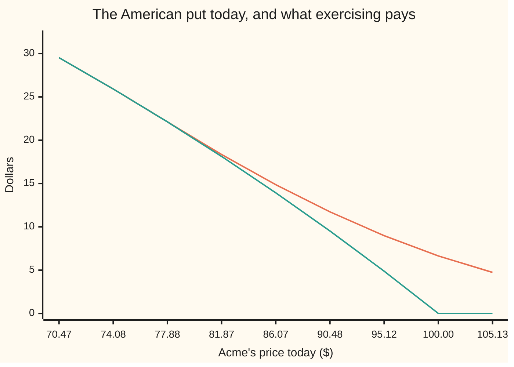
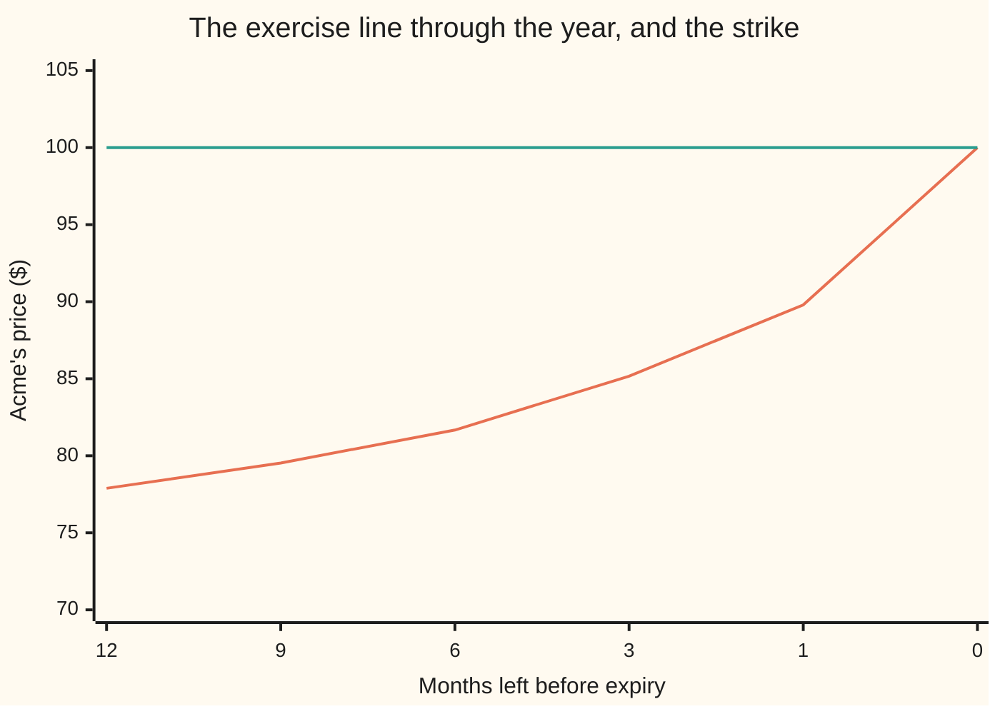

# American options on a grid: the free boundary as a complementarity problem

Financial mathematics → Numerical Methods for Pricing → The exercise floor → American options on a grid

---

## General Overview

Acme trades at $100 today. A **put** on Acme is the right to sell one share for $100, and this one may be used on any day of the coming year, not only the last. The $100 is the **strike**. The twin that may only be used on the final day is worth $6.33 in this market.

The extra freedom is worth money, and the reason is interest. Exercising pays the holder the strike in cash today instead of in a year, and that cash earns interest. Far enough below the strike, the interest beats the shrinking chance of a further fall. The price where the decision flips is the **exercise line**. Today it sits near $77.9: below it, exercise; above it, wait.

Nobody supplies that line. It is part of the answer, not an input, and it moves every day of the year. That is why its real name is the **free boundary**.

Pricing the European twin on a mesh of prices and dates is one linear system per date, stepped backwards: the job of [finite-differences-for-the-black-scholes-equation](07-finite-differences-for-the-black-scholes-equation.md). The American contract adds a rule the equation has never heard of: the value may never sit below what exercising pays this instant. Where waiting wins the equation holds; where taking the money wins the payoff holds instead. Which nodes are which is unknown until the answer is out, so there is no system to write down in advance.

The way out is to stop demanding an equation, and demand instead three things that hold together at every node: the value clears the payoff, holding never beats the bank rate, and one of those two is **tight** — it holds exactly, with nothing to spare. That triple is a **linear complementarity problem**, LCP for short, and on a mesh it has exactly one solution. **Projected successive over-relaxation** — PSOR — finds it by sweeping the mesh, solving one node at a time as if its neighbours were already right — that repeated one-node solve is **relaxation** — then pushing the value back up onto the payoff if it fell through.

**Replace the equation by three inequalities that hold at once, and the unknown exercise line stops being an input and becomes part of the answer.**

**What kind of fact this is:** a method, with the existence, uniqueness and convergence it rests on proved on this card in Why it works.

### The picture: the value resting on its payoff



The upper line is the option's worth today; the lower one is what exercising pays. At $77.88 and to its left they agree to every printed decimal: the value is sitting on its floor, and that stretch is the exercise region. At $81.87 they part, $18.35 against $18.13, and rightward the gap widens — that gap is the worth of still having a choice. The floor is the obstacle the answer rests on, which is why this shape is called an obstacle problem.

---

## The formula

Notation first, in words. Write $V$ for the option's worth at a given price and date, and $g$ for what exercising pays right now, so $g$ is the floor: the strike minus the price, or zero. The operator $\mathcal{L}$ below is the Black-Scholes equation's left side with the time derivative stripped off — "what holding the option earns, over and above the bank rate".

$$\mathcal{L}V \;=\; \tfrac12\sigma^2 S^2\frac{\partial^2 V}{\partial S^2} \;+\; (r-q)\,S\frac{\partial V}{\partial S} \;-\; rV$$

The American option obeys all three of these, at every price and date at once:

$$V - g \;\ge\; 0, \qquad \frac{\partial V}{\partial t} + \mathcal{L}V \;\le\; 0, \qquad (V - g)\left(\frac{\partial V}{\partial t} + \mathcal{L}V\right) = 0$$

**Read it aloud:** the option is never worth less than exercising it; holding it never earns more than the bank rate; and at every point one of those two is exactly tight.

Now the same thing once the mesh has chopped prices and dates into steps. One date's values are a list $x$, and inequalities between lists hold node by node. The earlier card turns the equation into a band of three numbers per row — a lower weight $\ell$, a diagonal $d$, an upper weight $u$ — and a right-hand side $b$ holding the previous date's values and the mesh's known ends. Write $A$ for that band. Where the European card asks for $Ax = b$, this one asks three things:

$$x \;\ge\; g, \qquad w \;=\; Ax - b \;\ge\; 0, \qquad (x_i - g_i)\,w_i = 0 \ \text{ at every node}$$

**Read it aloud:** every value clears its floor; no row falls short of its right-hand side; and a value strictly above its floor solves its own row exactly.

Here $w$ is the **slack**: how far a row is from tight. A node with no slack is waiting; a node with slack is pinned to its floor, exercising. Nothing is decided in advance.

PSOR is one line. Sweep upwards through the nodes; at each one form the ordinary relaxed value, then lift it onto the floor:

$$x_i^{+} \;=\; \max\!\left(g_i,\ (1-\omega)\,x_i + \frac{\omega}{d}\Big(b_i + \ell\,x_{i-1}^{+} + u\,x_{i+1}\Big)\right)$$

Two details carry the method. The lower neighbour is the value this sweep has *already* updated, which makes it a sweep and not a simultaneous refresh. And the maximum comes **after** the relaxation, never inside it. At $\omega = 1$ this is projected Gauss-Seidel: solve the row, then lift. Above 1, overshoot on purpose, then lift.

| Symbol | Plain meaning | In our example | Push it up and the answer… |
| --- | --- | --- | --- |
| $S$ | Acme's price | $100 today | put cheaper, line unmoved |
| $K$ | the **strike**, the price the holder may sell at | $100 | put dearer, line higher |
| $T$ | years until the option expires | 1 | put dearer, line lower |
| $r$, $q$ | the bank rate, and the **dividend yield** the shares pay | 5% and 2% | a bigger $r$ lifts the line, a bigger $q$ lowers it |
| $\sigma$ | **volatility**, how jumpy Acme is. Say "sigma". | 20% | put dearer, line lower: waiting is worth more |
| $g$ | what exercising pays now, the **floor**: $\max(K-S,0)$ | $22.12 at $77.88 | — |
| $V$ | the option's worth at a price and a date | $6.64 at $100 | — |
| $\mathcal{L}$ | what holding earns, over and above the bank rate | $\partial V/\partial t + \mathcal{L}V = 0$ where waiting wins | — |
| $A$, $x$, $b$ | the band as one object, one date's values, its right-hand side | one row per node | — |
| $w$ | the **slack** $Ax-b$: how far a row is from tight | zero where waiting wins | — |
| $d$, $\ell$, $u$ | one row's band: diagonal, lower, upper | $d$ beats $\ell+u$ by $1+r\Delta t$ | — |
| $\Delta t$, $h$, $\nu$, $\eta$ | date step, price step in the logarithm, and the two ratios from them | 120 dates, 240 prices | finer mesh, more sweeps |
| $\omega$ | the **relaxation weight**, read "omega": how far each step overshoots | 1.1 | fewer sweeps, then none settle |
| $\kappa_0$, $\kappa$ | proved shrinkage, read "kappa", of one all-at-once refresh and of one sweep | 0.680761 and 0.758815 | more sweeps per date |

The band comes from the earlier card, on a mesh equally spaced in the logarithm of the price:

$$\ell = \nu - \eta, \quad u = \nu + \eta, \quad d = 1 + 2\nu + r\,\Delta t, \qquad \nu = \frac{\sigma^2 \Delta t}{2h^2}, \quad \eta = \frac{(r - q - \tfrac12\sigma^2)\,\Delta t}{2h}$$

Here $\Delta t$ is one date step and $h$ one price step in the logarithm. The ratios $\nu$ and $\eta$ are the earlier card's spreading ratio and sliding ratio: how far one date step spreads value across neighbouring prices, and how far it slides it sideways.

### When it holds

- **A well-behaved band**: both side weights non-negative, which needs the price step small enough that the spreading ratio covers the sliding ratio, and $d > \ell + u$, which holds for any rate at or above zero. Fail the first and a neighbour enters with the wrong sign, so the answer ripples where it should be smooth; fail the second and the proof below goes.
- **$\omega$ strictly inside its range**, $0 < \omega < 2/(1+\kappa_0)$, which narrows as the mesh is refined. At the weight 2 a sweep can cycle for ever; at 0 it never moves.
- **The mesh reaches far enough out.** The value at the strike must not feel either edge of the price range. Pull the edges in and the answer inherits whatever they were told.
- **The Black-Scholes world**, volatility and both rates constant. If volatility moves, the line moves with it, and no refinement recovers the difference.

---

## Why it works

### Step 0: a choice is a floor, and a floor is not an extra equation

The holder may act at any instant, so the option can never be worth less than acting pays: $V \ge g$, everywhere, always. That is the whole content of the extra freedom.

Now the other side. If holding the option earned more than the bank rate somewhere, a hedged position in it would print money, which cannot last. So holding never earns more. Where the holder strictly prefers to wait, that inequality is tight — an equation. Where the holder takes the money, the value is pinned to the floor and the inequality may go slack, downwards only.

A floor is not one more equation to add. It is a condition that switches equations off, in a region nobody has told us.

### Step 1: the smallest case, where clamping is visibly wrong

Two nodes, coupled. The waiting equations are `3 x1 - x2 = 0` and `-x1 + 3 x2 = 3`; the floors are 1 for the first value, 0 for the second.

Solve with no floor and you get `0.375000` and `1.125000`. The first has fallen through its floor. The obvious repair is to lift it: keep `1.125000`, raise `0.375000` to `1.000000`.

That repair is wrong, and the slack says so. Put the lifted pair into the second equation and its slack comes out at `-0.625000` — negative, which the second condition forbids. Raising the first value raised what its neighbour needed, and the neighbour was never asked again.

The true answer is `1.000000` and `1.333333`, with slacks `1.666667` and `0.000000`. The first sits on its floor and carries slack; the second is above its floor and solves its equation exactly. All three conditions hold.

### Step 2: the maximum turns three conditions into one fixed point

Write the row value for what a node's own equation would give if its neighbours were held still: $(b_i + \ell x_{i-1} + u x_{i+1})/d$. Since the diagonal is positive, the slack is the diagonal times the amount by which the value sits above that row value.

Now read this one statement, node by node:

$$x_i = \max\!\big(g_i,\ (b_i + \ell x_{i-1} + u x_{i+1})/d\big)$$

It says exactly the three conditions and nothing more. If the row value is larger, the value equals it: the slack is zero and the floor is cleared. If the floor is larger, the value sits on it and the row value is below, so the slack is non-negative. Either way all three hold. Run it backwards and any solution of the three conditions satisfies the maximum, so the LCP and this map's fixed point are the same object.

### Step 3: the map contracts, so there is one answer and sweeping reaches it

Two facts do the work. Taking a maximum against a fixed number never spreads two numbers apart. And the neighbour weights, divided by the diagonal, add to less than one, since the diagonal exceeds their sum.

So if two starting lists differ by some amount at worst, one all-at-once refresh leaves them differing by at most $\kappa_0$ times that, where $\kappa_0 = (\ell+u)/d$ — `0.680761` on the Acme mesh. A map that shrinks distances like that has exactly one fixed point, and repeated application walks to it from any start clearing the floors: the contraction theorem, on the set of such lists, which is complete and which the map never leaves.

A sweep is not that refresh, since it uses each lower neighbour's new value at once. It contracts too, with constant

$$\kappa \;=\; \frac{|1-\omega| + \omega u/d}{1 - \omega \ell/d},$$

which is below 1 exactly on the range $0 < \omega < 2/(1+\kappa_0)$. At $\omega = 1.1$ on the Acme mesh, $\kappa$ is `0.758815`. That is a guarantee, not a measurement: the mesh settles much faster.

<details>
<summary>Detailed proof: one sweep is a contraction</summary>

Take two lists that clear the floors and differ nowhere by more than some distance. Write $e_1, e_2, \dots$ for how far apart the sweep's two outputs end up, node by node, and abbreviate $a_\omega = \omega\ell/d$ and $b_\omega = |1-\omega| + \omega u/d$.

A node's relaxed value is built from its own old value, the already-updated lower neighbour and the old upper neighbour. The maximum comes afterwards and cannot increase a distance. The old values and old upper neighbour are within the starting distance, the new lower neighbour within $e_{i-1}$. So
$$e_i \;\le\; a_\omega\,e_{i-1} + b_\omega \cdot (\text{starting distance}), \qquad e_0 = 0.$$
Unrolling that finite chain and summing the geometric series bounds every one of them by $\kappa$ times the starting distance.

The allowed range for $\omega$ is exactly what makes $a_\omega + b_\omega < 1$, hence $\kappa < 1$. For $0 < \omega \le 1$ that sum is $1 - \omega + \omega\kappa_0$; for $\omega > 1$ it is $\omega(1+\kappa_0) - 1$, below 1 precisely when $\omega < 2/(1+\kappa_0)$. Either way $a_\omega < 1$, so the denominator above is positive.

A list left unchanged by a whole sweep satisfies the sweep's formula with new values equal to old. For positive $\omega$ that forces the row value above the floor and permits it below on the floor — Step 2 again. So the sweep's fixed points are the LCP's solutions and no others, and the contraction theorem supplies one and the walk to it. A convenience falls out: any list clearing the floors sits within the change one more sweep would make, divided by $1 - \kappa$, of the true answer.

</details>

### Step 4: project after relaxing, never before

The order looks like a detail. It is not. Move the maximum inside the relaxation, using $(1-\omega)x_i + \omega\max(g_i, \cdot)$, and the first condition itself can fail.

One node shows it. Take a row with diagonal 1, right-hand side 0, floor 1, current value 2, and $\omega = 1.5$, inside the allowed range there. The rule gives `1.000000`, on the floor. The altered version gives `0.500000` — *below* the floor it was meant to enforce. A value under its floor prices an option at less than it pays.

The ends of the $\omega$ range matter as much. With diagonal 1, right-hand side 1 and floor 0, the excluded weight 2 sends the value round `2.000`, `0.000`, `2.000`, `0.000` for ever instead of settling on 1.

### Step 5: reading the line off the answer

The exercise region is the nodes sitting on their floor, and its top edge is the line the mesh reports. Today the last node on its floor is `77.880078`, the first above it `78.859689`. The mesh's line is somewhere between; nodes alone can do no better.

The smooth line underneath can be read more finely, and smooth pasting says how. At the line the value meets the payoff and their slopes meet too, so their gap vanishes to second order: just above the line it grows like the square of the distance. The square root of the gap therefore grows like a straight line, which can be followed down to where it hits zero. Two nodes are enough. That reading gives `77.892056`, and it steadies near $77.9 as the mesh is refined.

The two readings need not nest. The exercise region is settled in whole date steps, so it over-reaches the smooth line by up to a node, and the square-root reading can land below the last node on its floor. The refinement ladder below says which to trust.

Two independent bounds keep it honest. A put that never expires has a line in closed form: the strike times the negative root of the quadratic that $\mathcal{L}V = 0$ becomes when $V$ is a power of the price, divided by that root minus one. That is `64.921894` here. Less time to run means less waiting to give up, so a line with an expiry date sits above it. And no line exceeds the strike. Both hold.

The other road skips solvers entirely. A binomial tree takes the better of exercising and holding at each node, which is Step 0 one node at a time ([longstaff-schwartz-least-squares-monte-carlo](06-longstaff-schwartz-least-squares-monte-carlo.md) does it by simulation, which is what survives many underlyings). The tree prices beautifully and reads the line badly: its nodes fan out from today's price, so at first it has none anywhere near $78 to test. A mesh puts a node wherever it likes.

---

## Worked numbers, by hand

Acme: $S = 100$, $K = 100$, $r = 5\%$, $q = 2\%$, $\sigma = 20\%$, $T = 1$ year. The mesh takes 240 price steps and 120 date steps, with $\omega = 1.1$, each date swept until no value moves by more than a hundred-billionth — which, divided by $1-\kappa$, bounds the distance still to go.

| Step | Arithmetic | Value |
| --- | --- | --- |
| shrinkage of one all-at-once refresh | $(\ell+u)/d$ | 0.680761 |
| proved shrinkage of one projected sweep | $\kappa$ at $\omega = 1.1$ | 0.758815 |
| sweeps for all 120 dates | until nothing moves | 3204 |
| the American put at Acme = 100 | PSOR on the mesh | **$6.644541** |
| the same mesh, floor removed | plain sweeps, no lifting | $6.317933 |
| the European put, Black-Scholes | the shelf's house number | $6.330081 |
| what the choice is worth | 6.644541 − 6.317933 | **$0.326608** |
| last node on its floor today | top of the exercise region | $77.880078 |
| first node above it today | the next node up | $78.859689 |
| the line today | square-root reading between them | **$77.89** |

The right to act early is worth about 33 cents on a put worth $6.64, for a decision the holder may never use. The mesh's own European number, $6.317933, sits under the exact $6.330081: that is the mesh's error, not the method's, and differencing both prices off the *same* mesh cancels most of it.

### What breaks if you drop a piece

| Mistake | Comes out at | What went wrong |
| --- | --- | --- |
| Solve each date's equations, then lift onto the floor once | $6.639239 | Lifting a value changes what its neighbours need, and they are never asked again |
| Drop the floor and solve the equations only | $6.317933 | That is the European put; the right to act early has gone |
| Project before relaxing, one node, floor 1 | 0.500000 | Under its own floor, the one condition never up for negotiation |
| Take $\omega = 2$, the excluded end of the range | cycles 2.000, 0.000, 2.000, 0.000 | The sweep stops being a contraction, so it never settles |

---

## How the line moves as the year runs out

Acme can sit still for a month and the right answer still changes, because the line comes to meet it. With a year to run, waiting is worth a lot, so Acme must fall a long way before taking the money wins. With a week to run there is little left to wait for. So the line climbs all year, and at the bell it is the strike itself.

| Months left | 12 | 9 | 6 | 3 | 1 | 0 |
| --- | --- | --- | --- | --- | --- | --- |
| The line, from the mesh | $77.89 | $79.53 | $81.67 | $85.17 | $89.79 | $100.00 |



The rising line is where exercising takes over; the flat one is the strike. Note the pace: most of the year it crawls, then in the final weeks it sprints — which is why a hedge built from European sensitivities misbehaves near expiry.

Nothing stops the line reaching the strike here. Exercising can only pay while the interest earned on the strike covers the dividends given up on the share, so any line stays below $rK/q$, far above the strike in this market. Where dividends are large against rates, that ceiling bites and the line stops short.

Turn the interest off and the story vanishes. At a rate of zero there is nothing to collect early, the floor never binds, and the same mesh returns `8.903437` whether the lifting is on or off. Early exercise of a put is an interest-rate story from beginning to end.

---

## Code, from first principles, and it actually runs

Nothing below imports a function that already knows an answer. The bell-curve area comes from `math.erf` in Python and from thin slices under the curve in Rust. The American put is reached **two independent ways**: projected SOR on the mesh, and a 2,000-step tree that solves no system at all. With the lifting removed the mesh is checked against the Black-Scholes European put, which calibrates it. The two-node case gets a **third** road, exact: whole-number search over the four floor patterns, which the sweeps must match to twelve decimals.

### Python

```python
# American options on a grid -- the check behind the card.  Standard library only,
# nothing imported that already knows the answer.  Two independent roads reach the
# American put, projected SOR on a grid and a 2000-step tree; a third settles the
# smallest case exactly, by search over the floor patterns.
from math import log, sqrt, exp, erf
K, R, Q, SIG, T = 100.0, 0.05, 0.02, 0.20, 1.0   # Acme: strike, rate, dividend, vol, year
XL, XR = -1.5, 1.5                               # the grid spans ln(S/K), -1.5 to 1.5
def ncdf(x):    return 0.5 * (1.0 + erf(x / sqrt(2.0)))    # bell-curve area left of x
def euro_put(r):                                 # Black-Scholes European put, Acme at 100
    vt = SIG * sqrt(T)
    d1 = (r - Q + 0.5 * SIG * SIG) * T / vt
    return K * exp(-r * T) * ncdf(vt - d1) - K * exp(-Q * T) * ncdf(-d1)
def read_line(S, g, v):
    # Last node on its floor, first node above it, then a sub-grid reading from the
    # free side, where the gap between value and payoff opens like a square.
    k = max(i for i in range(1, len(S) - 1) if g[i] > 0.0 and v[i] <= g[i] + 1e-12)
    y1, y2 = sqrt(v[k + 1] - g[k + 1]), sqrt(v[k + 2] - g[k + 2])
    return S[k], S[k + 1], S[k + 1] - y1 * (S[k + 2] - S[k + 1]) / (y2 - y1)
def layers(M, Nt, om, mode, r=R, tol=1e-11):
    # One implicit layer at a time, from expiry back to today.  mode 'amer' projects
    # onto the floor inside every sweep, 'euro' never does, and 'lift' solves the
    # free equations, lifting onto the floor once, at the layer's end.
    h, dt = (XR - XL) / M, T / Nt
    nu = dt * SIG * SIG / (2.0 * h * h)              # the spreading ratio
    eta = dt * (r - Q - 0.5 * SIG * SIG) / (2.0 * h)  # the sliding ratio
    lo, up, d = nu - eta, nu + eta, 1.0 + 2.0 * nu + r * dt
    S = [K * exp(XL + i * h) for i in range(M + 1)]
    g = [max(K - s, 0.0) for s in S]
    v, sweeps, line = list(g), 0, {}
    for k in range(Nt):
        tau, b, v[M] = (k + 1) * dt, list(v), 0.0
        v[0] = K - S[0] if mode != "euro" else K * exp(-r * tau) - S[0] * exp(-Q * tau)
        while True:
            chg = 0.0
            for i in range(1, M):
                y = (1.0 - om) * v[i] + om * (b[i] + lo * v[i - 1] + up * v[i + 1]) / d
                y = max(y, g[i]) if mode == "amer" else y     # project after relaxing
                chg, v[i] = max(chg, abs(y - v[i])), y
            sweeps += 1
            if chg <= tol: break
        v = [max(v[i], g[i]) for i in range(M + 1)] if mode == "lift" else v
        if mode == "amer" and r == R and (k + 1) * 12 % Nt == 0: line[(k + 1) * 12 // Nt] = read_line(S, g, v)
    return S, g, v, sweeps, line, (lo + up) / d, (abs(1.0 - om) + om * up / d) / (1.0 - om * lo / d)
def tree(n, american, r=R):
    # Cox-Ross-Rubinstein: up or down each step, roll the payoff back, and for the
    # American put take the better of exercising and holding at every node.
    dt, u = T / n, exp(SIG * sqrt(T / n))
    dn, disc = 1.0 / u, exp(-r * dt)
    p = (exp((r - Q) * dt) - dn) / (u - dn)
    pu, pd = [1.0] * (n + 1), [1.0] * (n + 1)
    for i in range(1, n + 1):
        pu[i], pd[i] = pu[i - 1] * u, pd[i - 1] * dn
    v = [max(K - K * pu[n - j] * pd[j], 0.0) for j in range(n + 1)]
    for i in range(n - 1, -1, -1):
        v = [disc * (p * v[j] + (1.0 - p) * v[j + 1]) for j in range(i + 1)]
        if american: v = [max(v[j], K - K * pu[i - j] * pd[j]) for j in range(i + 1)]
    return v[0]
def toy_exact(al, ga, b, f):
    # Two coupled values, settled exactly: try all four patterns of 'on the floor /
    # above it', keep whichever meets all three conditions at once.
    d = 1 + al + ga
    for num, den in (([d * b[0] + ga * b[1], al * b[0] + d * b[1]], d * d - al * ga),
                     ([f[0] * d, b[1] + al * f[0]], d), ([b[0] + ga * f[1], f[1] * d], d),
                     ([f[0], f[1]], 1)):
        gap = [num[0] - f[0] * den, num[1] - f[1] * den]
        w = [d * num[0] - ga * num[1] - b[0] * den, d * num[1] - al * num[0] - b[1] * den]
        if min(gap + w) >= 0 and gap[0] * w[0] == 0 and gap[1] * w[1] == 0:
            return [x / den for x in num], [x / den for x in w]   # the one true pattern
def toy_sweep(x, b, f, al, ga, om):              # one projected sweep, lower neighbour first
    d, new = 1 + al + ga, list(x)
    for i in (0, 1):
        t = (b[i] + al * (new[i - 1] if i else 0.0) + ga * (x[i + 1] if i < 1 else 0.0)) / d
        new[i] = max(f[i], (1.0 - om) * x[i] + om * t)
    return new
BB, FF = [0, 3], [1, 0]                          # the right-hand side, and the two floors
free = [(3 * BB[0] + BB[1]) / 8.0, (BB[0] + 3 * BB[1]) / 8.0]
lift2 = [max(free[0], float(FF[0])), max(free[1], float(FF[1]))]
lift_w = [3.0 * lift2[0] - lift2[1] - BB[0], 3.0 * lift2[1] - lift2[0] - BB[1]]
lcp, lcp_w = toy_exact(1, 1, BB, FF)
tx = [float(FF[0]), float(FF[1])]
for _ in range(40):
    tx = toy_sweep(tx, BB, FF, 1, 1, 1.1)
bad = (1.0 - 1.5) * 2.0 + 1.5 * max(1.0, 0.0)    # projecting before relaxing, one value
good = toy_sweep([2.0, 0.0], [0, 0], [1, 0], 0.0, 0.0, 1.5)[0]   # the rule, from the sweep
cyc, cycles = 0.0, []                            # omega = 2, one value, floor 0, b = 1
for _ in range(4):
    cycles.append(cyc := toy_sweep([cyc, 0.0], [1, 0], [0, 0], 0.0, 0.0, 2.0)[0])
M, NT, OM = 240, 120, 1.1
S, g, va, swa, line, qm, qs = layers(M, NT, OM, "amer")
ve, vl = layers(M, NT, OM, "euro")[2], layers(M, NT, OM, "lift")[2]
va0, ve0 = layers(M, NT, OM, "amer", 0.0)[2], layers(M, NT, OM, "euro", 0.0)[2]
i0, nu = M // 2, R - Q - 0.5 * SIG * SIG         # index M/2 is ln(S/K) = 0, Acme at 100
pw = (-nu - sqrt(nu * nu + 2.0 * SIG * SIG * R)) / (SIG * SIG)
perp = K * pw / (pw - 1.0)                       # the never-expiring put's line
lad = []
for (m, n) in ((60, 30), (120, 60), (240, 120), (480, 240)):
    Sx, gx, vx, swx = layers(m, n, OM, "amer")[:4]
    lad.append((m, n, swx, vx[m // 2], layers(m, n, OM, "euro")[2][m // 2], read_line(Sx, gx, vx)[2]))
print("the smallest one: two coupled values, floors 1 and 0")
for name, pair in (("free solve, no floor", free), ("free solve, then lifted to the floor", lift2),
                   ("  the lifted pair's two slacks", lift_w), ("exact search over patterns", lcp),
                   ("  its two slacks", lcp_w), ("projected SOR from the floor, 40 sweeps", tx)):
    print(f"  {name:<40}{pair[0]:>11.6f}{pair[1]:>11.6f}")
print(f"  {'projecting before relaxing, one value':<40}{bad:>11.6f}  (correct {good:.6f})")
print(f"  {'omega = 2 from 0, four sweeps':<40}" + "".join(f"{c:>7.3f}" for c in cycles))
print(f"\nAcme American put, grid {M} x {NT}, omega {OM:.3f}, {swa} sweeps in all")
for name, val in (("contraction of the all-at-once map", qm),
                  ("contraction bound on one projected sweep", qs),
                  ("American put at S = 100", va[i0]), ("European, same grid, no floor", ve[i0]),
                  ("European put, Black-Scholes", euro_put(R)),
                  ("early-exercise premium, same grid", va[i0] - ve[i0]),
                  ("floor lifted once at each layer's end", vl[i0]),
                  ("with r = 0: American on this grid", va0[i0]),
                  ("with r = 0: European on this grid", ve0[i0]),
                  ("line today, last node on its floor", line[12][0]),
                  ("line today, first node above it", line[12][1]),
                  ("line today, square-root reading", line[12][2]), ("perpetual line, exact", perp)):
    print(f"  {name:<42}{val:>13.6f}")
print("\nrefining the grid, with the tree as the second road")
print(f"  {'grid':<12}{'sweeps':>8}{'American':>11}{'European':>11}{'premium':>10}{'line today':>12}")
for (m, n, sw, av, ev, ln) in lad:
    print(f"  {f'{m} x {n}':<12}{sw:>8}{av:>11.6f}{ev:>11.6f}{av - ev:>10.6f}{ln:>12.4f}")
for n, a, e in ((n, tree(n, True), tree(n, False)) for n in (2000, 4000)):
    print(f"  {f'tree {n}':<12}{'':>8}{a:>11.6f}{e:>11.6f}{a - e:>10.6f}")
print(f"\nthe exercise line through the year, grid {M} x {NT}")
print(f"  {'months left':<12}" + "".join(f"{m:>8}" for m in (12, 9, 6, 3, 1, 0)))
print(f"  {'exercise line':<12}" + "".join(f"{line[m][2]:>8.2f}" for m in (12, 9, 6, 3, 1)) + f"{K:>8.2f}")
print(f"\ntoday's put against its payoff, grid {M} x {NT}")
for name, series in (("Acme price", S), ("put value", va), ("payoff", g)):
    print(f"  {name:<12}" + "".join(f"{series[i]:>8.2f}" for i in range(i0 - 28, i0 + 5, 4)))
assert abs(lad[3][3] - tree(2000, True)) < 0.01 and abs(lad[3][4] - euro_put(R)) < 0.01
assert va[i0] - ve[i0] > 0.30                         # the floor is worth real money
assert abs(va0[i0] - ve0[i0]) < 1e-12                 # no interest, so the floor never binds
assert max(abs(tx[0] - lcp[0]), abs(tx[1] - lcp[1])) < 1e-12  # sweeps vs the exact search
assert min(lift_w) < 0.0 and min(lcp_w) >= 0.0        # lifting is no solution; the LCP one is
assert perp < line[12][0] and line[12][1] < K and all(abs(l[5] - lad[3][5]) < 0.5 for l in lad)
ic = S.index(line[12][0]); assert va[ic] == g[ic] and va[ic + 1] - g[ic + 1] > 1e-6  # contact, free
assert all(line[m][2] < line[m - 1][2] for m in range(2, 13))  # the line rises toward expiry
assert bad < FF[0] <= good and max(cycles) - min(cycles) > 1.0
print("ALL CHECKS PASS")
```

**Ran 2026-09-19 on macOS, Python 3.14.6, standard library only. All checks passed. Output, pasted from the run:**

```
the smallest one: two coupled values, floors 1 and 0
  free solve, no floor                       0.375000   1.125000
  free solve, then lifted to the floor       1.000000   1.125000
    the lifted pair's two slacks             1.875000  -0.625000
  exact search over patterns                 1.000000   1.333333
    its two slacks                           1.666667   0.000000
  projected SOR from the floor, 40 sweeps    1.000000   1.333333
  projecting before relaxing, one value      0.500000  (correct 1.000000)
  omega = 2 from 0, four sweeps             2.000  0.000  2.000  0.000

Acme American put, grid 240 x 120, omega 1.100, 3204 sweeps in all
  contraction of the all-at-once map             0.680761
  contraction bound on one projected sweep       0.758815
  American put at S = 100                        6.644541
  European, same grid, no floor                  6.317933
  European put, Black-Scholes                    6.330081
  early-exercise premium, same grid              0.326608
  floor lifted once at each layer's end          6.639239
  with r = 0: American on this grid              8.903437
  with r = 0: European on this grid              8.903437
  line today, last node on its floor            77.880078
  line today, first node above it               78.859689
  line today, square-root reading               77.892056
  perpetual line, exact                         64.921894

refining the grid, with the tree as the second road
  grid          sweeps   American   European   premium  line today
  60 x 30          348   6.551075   6.236293  0.314782     78.1704
  120 x 60         950   6.621149   6.298391  0.322758     77.9636
  240 x 120       3204   6.644541   6.317933  0.326608     77.8921
  480 x 240      10688   6.653444   6.324923  0.328521     77.8666
  tree 2000              6.660226   6.329109  0.331117
  tree 4000              6.660457   6.329595  0.330862

the exercise line through the year, grid 240 x 120
  months left       12       9       6       3       1       0
  exercise line   77.89   79.53   81.67   85.17   89.79  100.00

today's put against its payoff, grid 240 x 120
  Acme price     70.47   74.08   77.88   81.87   86.07   90.48   95.12  100.00  105.13
  put value      29.53   25.92   22.12   18.35   14.87   11.73    8.98    6.64    4.74
  payoff         29.53   25.92   22.12   18.13   13.93    9.52    4.88    0.00    0.00
ALL CHECKS PASS
```

### Rust

```rust
// American options on a grid -- the same check as the Python, in Rust.  No crates.
// Rust has no erf, so the bell-curve area is built by adding thin slices under the
// curve (Simpson).  Projected SOR on a grid and a 2000-step tree are the two roads.
use std::f64::consts::PI;
const K: f64 = 100.0; const R: f64 = 0.05; const Q: f64 = 0.02;   // Acme: strike, rate, dividend
const SIG: f64 = 0.20; const T: f64 = 1.0;                        // volatility, and one year
const XL: f64 = -1.5; const XR: f64 = 1.5;                        // the grid spans ln(S/K)
fn phi(x: f64) -> f64 { (-0.5 * x * x).exp() / (2.0 * PI).sqrt() }   // bell-curve height at x
fn ncdf(x: f64) -> f64 {                                            // area to the left of x
    let (n, h) = (4000, x / 4000.0);
    let mut s = phi(0.0) + phi(x);
    for i in 1..n { s += if i % 2 == 1 { 4.0 } else { 2.0 } * phi(i as f64 * h); }
    0.5 + s * h / 3.0
}
fn euro_put(r: f64) -> f64 {                     // Black-Scholes European put, Acme at 100
    let (vt, d1) = (SIG * T.sqrt(), (r - Q + 0.5 * SIG * SIG) * T / (SIG * T.sqrt()));
    K * (-r * T).exp() * ncdf(vt - d1) - K * (-Q * T).exp() * ncdf(-d1)
}
fn read_line(s: &[f64], g: &[f64], v: &[f64]) -> (f64, f64, f64) {
    // Last node on its floor, first node above it, then a sub-grid reading from the
    // free side, where the gap between value and payoff opens like a square.
    let k = (1..s.len() - 1).filter(|&i| g[i] > 0.0 && v[i] <= g[i] + 1e-12).last().unwrap();
    let (y1, y2) = ((v[k + 1] - g[k + 1]).sqrt(), (v[k + 2] - g[k + 2]).sqrt());
    (s[k], s[k + 1], s[k + 1] - y1 * (s[k + 2] - s[k + 1]) / (y2 - y1))
}
fn layers(m: usize, nt: usize, om: f64, mode: &str, r: f64)
          -> (Vec<f64>, Vec<f64>, Vec<f64>, usize, Vec<(f64, f64, f64)>, f64, f64) {
    // One implicit layer at a time, from expiry back to today.  mode "amer" projects
    // onto the floor inside every sweep, "euro" never does, "lift" solves the free
    // equations and lifts onto the floor once, at the layer's end.
    let (h, dt) = ((XR - XL) / m as f64, T / nt as f64);
    let nu = dt * SIG * SIG / (2.0 * h * h);                    // the spreading ratio
    let eta = dt * (r - Q - 0.5 * SIG * SIG) / (2.0 * h);       // the sliding ratio
    let (lo, up, d) = (nu - eta, nu + eta, 1.0 + 2.0 * nu + r * dt);
    let s: Vec<f64> = (0..=m).map(|i| K * (XL + i as f64 * h).exp()).collect();
    let g: Vec<f64> = s.iter().map(|&x| (K - x).max(0.0)).collect();
    let (mut v, mut sweeps, mut line) = (g.clone(), 0usize, vec![(0.0, 0.0, 0.0); 13]);
    for k in 0..nt {
        let (tau, b) = ((k + 1) as f64 * dt, v.clone());
        v[m] = 0.0;
        v[0] = if mode != "euro" { K - s[0] } else { K * (-r * tau).exp() - s[0] * (-Q * tau).exp() };
        loop {
            let mut chg = 0.0f64;
            for i in 1..m {
                let mut y = (1.0 - om) * v[i] + om * (b[i] + lo * v[i - 1] + up * v[i + 1]) / d;
                if mode == "amer" { y = y.max(g[i]) }             // project after relaxing
                chg = chg.max((y - v[i]).abs());
                v[i] = y;
            }
            sweeps += 1;
            if chg <= 1e-11 { break }
        }
        if mode == "lift" { for i in 0..=m { v[i] = v[i].max(g[i]) } }
        if mode == "amer" && r == R && (k + 1) * 12 % nt == 0 { line[(k + 1) * 12 / nt] = read_line(&s, &g, &v) }
    }
    (s, g, v, sweeps, line, (lo + up) / d, ((1.0 - om).abs() + om * up / d) / (1.0 - om * lo / d))
}
fn tree(n: usize, american: bool, r: f64) -> f64 {
    // Cox-Ross-Rubinstein: up or down each step, roll the payoff back, and for the
    // American put take the better of exercising and holding at every node.
    let (dt, u) = (T / n as f64, (SIG * (T / n as f64).sqrt()).exp());
    let (dn, disc) = (1.0 / u, (-r * dt).exp());
    let p = (((r - Q) * dt).exp() - dn) / (u - dn);
    let (mut pu, mut pd) = (vec![1.0f64; n + 1], vec![1.0f64; n + 1]);
    for i in 1..=n { pu[i] = pu[i - 1] * u; pd[i] = pd[i - 1] * dn; }
    let mut v: Vec<f64> = (0..=n).map(|j| (K - K * pu[n - j] * pd[j]).max(0.0)).collect();
    for i in (0..n).rev() {
        v = (0..=i).map(|j| disc * (p * v[j] + (1.0 - p) * v[j + 1])).collect();
        if american { v = (0..=i).map(|j| v[j].max(K - K * pu[i - j] * pd[j])).collect() }
    }
    v[0]
}
fn toy_exact(al: i64, ga: i64, b: [i64; 2], f: [i64; 2]) -> ([f64; 2], [f64; 2]) {
    // Two coupled values, settled exactly: try all four patterns of "on the floor /
    // above it", keep whichever meets all three conditions at once.
    let d = 1 + al + ga;
    for (num, den) in [([d * b[0] + ga * b[1], al * b[0] + d * b[1]], d * d - al * ga),
                       ([f[0] * d, b[1] + al * f[0]], d), ([b[0] + ga * f[1], f[1] * d], d),
                       ([f[0], f[1]], 1)] {
        let gap = [num[0] - f[0] * den, num[1] - f[1] * den];
        let w = [d * num[0] - ga * num[1] - b[0] * den, d * num[1] - al * num[0] - b[1] * den];
        if gap.iter().chain(w.iter()).all(|&z| z >= 0) && gap[0] * w[0] == 0 && gap[1] * w[1] == 0 {
            let q = den as f64;
            return ([num[0] as f64 / q, num[1] as f64 / q], [w[0] as f64 / q, w[1] as f64 / q]);
        }
    }
    panic!("no pattern met all three conditions")
}
fn toy_sweep(x: [f64; 2], b: [i64; 2], f: [i64; 2], al: f64, ga: f64, om: f64) -> [f64; 2] {
    let (d, mut new) = (1.0 + al + ga, x);       // one projected sweep, lower neighbour first
    for i in 0..2 {
        let (lower, upper) = (if i > 0 { new[i - 1] } else { 0.0 }, if i < 1 { x[i + 1] } else { 0.0 });
        new[i] = (f[i] as f64).max((1.0 - om) * x[i] + om * (b[i] as f64 + al * lower + ga * upper) / d);
    }
    new
}
fn pair(name: &str, a: f64, b: f64) { println!("  {:<40}{:>11.6}{:>11.6}", name, a, b) }
fn row(name: &str, v: f64) { println!("  {:<42}{:>13.6}", name, v) }
fn main() {
    let (bb, ff) = ([0i64, 3], [1i64, 0]);       // the right-hand side, and the two floors
    let free = [(3 * bb[0] + bb[1]) as f64 / 8.0, (bb[0] + 3 * bb[1]) as f64 / 8.0];
    let lift2 = [free[0].max(ff[0] as f64), free[1].max(ff[1] as f64)];
    let lift_w = [3.0 * lift2[0] - lift2[1] - bb[0] as f64, 3.0 * lift2[1] - lift2[0] - bb[1] as f64];
    let (lcp, lcp_w) = toy_exact(1, 1, bb, ff);
    let mut tx = [ff[0] as f64, ff[1] as f64];
    for _ in 0..40 { tx = toy_sweep(tx, bb, ff, 1.0, 1.0, 1.1) }
    let bad = (1.0 - 1.5) * 2.0 + 1.5 * 1.0f64.max(0.0);   // projecting before relaxing
    let good = toy_sweep([2.0, 0.0], [0, 0], [1, 0], 0.0, 0.0, 1.5)[0];  // the rule, from the sweep
    let (mut cyc, mut cycles) = (0.0f64, Vec::new());      // omega = 2, one value, floor 0
    for _ in 0..4 { cyc = toy_sweep([cyc, 0.0], [1, 0], [0, 0], 0.0, 0.0, 2.0)[0]; cycles.push(cyc) }
    let (m, nt, om) = (240usize, 120usize, 1.1f64);
    let (s, g, va, swa, line, qm, qs) = layers(m, nt, om, "amer", R);
    let (ve, vl) = (layers(m, nt, om, "euro", R).2, layers(m, nt, om, "lift", R).2);
    let (va0, ve0) = (layers(m, nt, om, "amer", 0.0).2, layers(m, nt, om, "euro", 0.0).2);
    let (i0, nu) = (m / 2, R - Q - 0.5 * SIG * SIG);   // index m/2 is ln(S/K) = 0, Acme at 100
    let pw = (-nu - (nu * nu + 2.0 * SIG * SIG * R).sqrt()) / (SIG * SIG);
    let perp = K * pw / (pw - 1.0);                    // the never-expiring put's line
    let mut lad: Vec<(usize, usize, usize, f64, f64, f64)> = Vec::new();
    for (mm, nn) in [(60usize, 30usize), (120, 60), (240, 120), (480, 240)] {
        let (sx, gx, vx, swx, _, _, _) = layers(mm, nn, om, "amer", R);
        lad.push((mm, nn, swx, vx[mm / 2], layers(mm, nn, om, "euro", R).2[mm / 2], read_line(&sx, &gx, &vx).2));
    }
    println!("the smallest one: two coupled values, floors 1 and 0");
    for (name, p) in [("free solve, no floor", free), ("free solve, then lifted to the floor", lift2),
                      ("  the lifted pair's two slacks", lift_w), ("exact search over patterns", lcp),
                      ("  its two slacks", lcp_w), ("projected SOR from the floor, 40 sweeps", tx)] {
        pair(name, p[0], p[1]); }
    println!("  {:<40}{:>11.6}  (correct {:.6})", "projecting before relaxing, one value", bad, good);
    println!("  {:<40}{}", "omega = 2 from 0, four sweeps",
             cycles.iter().map(|c| format!("{:>7.3}", c)).collect::<Vec<_>>().join(""));
    println!("\nAcme American put, grid {} x {}, omega {:.3}, {} sweeps in all", m, nt, om, swa);
    for (name, v) in [("contraction of the all-at-once map", qm),
                      ("contraction bound on one projected sweep", qs), ("American put at S = 100", va[i0]),
                      ("European, same grid, no floor", ve[i0]), ("European put, Black-Scholes", euro_put(R)),
                      ("early-exercise premium, same grid", va[i0] - ve[i0]),
                      ("floor lifted once at each layer's end", vl[i0]),
                      ("with r = 0: American on this grid", va0[i0]),
                      ("with r = 0: European on this grid", ve0[i0]),
                      ("line today, last node on its floor", line[12].0),
                      ("line today, first node above it", line[12].1),
                      ("line today, square-root reading", line[12].2), ("perpetual line, exact", perp)] {
        row(name, v); }
    println!("\nrefining the grid, with the tree as the second road");
    println!("  {:<12}{:>8}{:>11}{:>11}{:>10}{:>12}", "grid", "sweeps", "American", "European", "premium", "line today");
    for (mm, nn, sw, av, ev, ln) in &lad {
        println!("  {:<12}{:>8}{:>11.6}{:>11.6}{:>10.6}{:>12.4}", format!("{} x {}", mm, nn), sw, av, ev, av - ev, ln); }
    for n in [2000usize, 4000] {
        let (a, e) = (tree(n, true, R), tree(n, false, R));
        println!("  {:<12}{:>8}{:>11.6}{:>11.6}{:>10.6}", format!("tree {}", n), "", a, e, a - e); }
    println!("\nthe exercise line through the year, grid {} x {}", m, nt);
    let (mut h1, mut h2) = (format!("  {:<12}", "months left"), format!("  {:<12}", "exercise line"));
    for mo in [12usize, 9, 6, 3, 1, 0] {
        h1.push_str(&format!("{:>8}", mo));
        h2.push_str(&format!("{:>8.2}", if mo > 0 { line[mo].2 } else { K })); }
    println!("{}\n{}", h1, h2);
    println!("\ntoday's put against its payoff, grid {} x {}", m, nt);
    for (name, series) in [("Acme price", &s), ("put value", &va), ("payoff", &g)] {
        let cols: String = (i0 - 28..i0 + 5).step_by(4).map(|i| format!("{:>8.2}", series[i])).collect();
        println!("  {:<12}{}", name, cols); }
    assert!((lad[3].3 - tree(2000, true, R)).abs() < 0.01 && (lad[3].4 - euro_put(R)).abs() < 0.01);
    assert!(va[i0] - ve[i0] > 0.30);                  // the floor is worth real money
    assert!((va0[i0] - ve0[i0]).abs() < 1e-12);       // no interest, so the floor never binds
    assert!((tx[0] - lcp[0]).abs().max((tx[1] - lcp[1]).abs()) < 1e-12);  // sweeps vs the search
    assert!(lift_w[0].min(lift_w[1]) < 0.0 && lcp_w[0].min(lcp_w[1]) >= 0.0);
    assert!(perp < line[12].0 && line[12].1 < K && lad.iter().all(|l| (l.5 - lad[3].5).abs() < 0.5));
    let ic = s.iter().position(|&x| x == line[12].0).unwrap();   // the reported contact node
    assert!(va[ic] == g[ic] && va[ic + 1] - g[ic + 1] > 1e-6 && (2..13).all(|mo| line[mo].2 < line[mo - 1].2));
    assert!(bad < ff[0] as f64 && ff[0] as f64 <= good && cycles[0] - cycles[1] > 1.0);
    println!("ALL CHECKS PASS");
}
```

**Ran 2026-09-19 on macOS, rustc 1.98.1, no crates. All checks passed. Output, pasted from the run:**

```
the smallest one: two coupled values, floors 1 and 0
  free solve, no floor                       0.375000   1.125000
  free solve, then lifted to the floor       1.000000   1.125000
    the lifted pair's two slacks             1.875000  -0.625000
  exact search over patterns                 1.000000   1.333333
    its two slacks                           1.666667   0.000000
  projected SOR from the floor, 40 sweeps    1.000000   1.333333
  projecting before relaxing, one value      0.500000  (correct 1.000000)
  omega = 2 from 0, four sweeps             2.000  0.000  2.000  0.000

Acme American put, grid 240 x 120, omega 1.100, 3204 sweeps in all
  contraction of the all-at-once map             0.680761
  contraction bound on one projected sweep       0.758815
  American put at S = 100                        6.644541
  European, same grid, no floor                  6.317933
  European put, Black-Scholes                    6.330081
  early-exercise premium, same grid              0.326608
  floor lifted once at each layer's end          6.639239
  with r = 0: American on this grid              8.903437
  with r = 0: European on this grid              8.903437
  line today, last node on its floor            77.880078
  line today, first node above it               78.859689
  line today, square-root reading               77.892056
  perpetual line, exact                         64.921894

refining the grid, with the tree as the second road
  grid          sweeps   American   European   premium  line today
  60 x 30          348   6.551075   6.236293  0.314782     78.1704
  120 x 60         950   6.621149   6.298391  0.322758     77.9636
  240 x 120       3204   6.644541   6.317933  0.326608     77.8921
  480 x 240      10688   6.653444   6.324923  0.328521     77.8666
  tree 2000              6.660226   6.329109  0.331117
  tree 4000              6.660457   6.329595  0.330862

the exercise line through the year, grid 240 x 120
  months left       12       9       6       3       1       0
  exercise line   77.89   79.53   81.67   85.17   89.79  100.00

today's put against its payoff, grid 240 x 120
  Acme price     70.47   74.08   77.88   81.87   86.07   90.48   95.12  100.00  105.13
  put value      29.53   25.92   22.12   18.35   14.87   11.73    8.98    6.64    4.74
  payoff         29.53   25.92   22.12   18.13   13.93    9.52    4.88    0.00    0.00
ALL CHECKS PASS
```

The two outputs agree line for line, from different code, with the bell-curve area built two different ways.

> [!TIP]
> **Try changing**
> Guess the direction first, then run it.
> - **Take the floor away.** Switch the mode to `"euro"`. The put drops from $6.644541 to $6.317933 and the exercise region empties. That difference is the whole subject of this card.
> - **Lift at the end instead of inside the sweep.** Switch the mode to `"lift"`. The answer moves to $6.639239 and stays wrong however long the sweeps run: the error is in the equations being solved, not in the solving.
> - **Refine.** The ladder halves both steps three times: $6.551075, $6.621149, $6.644541, $6.653444, marching toward the tree's $6.660226. Refining the price step alone will not do it.
> - **Turn off interest.** Set the rate to zero. The premium collapses, the mesh gives `8.903437` with the floor on or off, and the third assert pins it.

---

## The usual mistake

> [!warning]
> **Solving each date's equations and then clamping the answer onto the floor.** It is the natural thing to write, and it is a different problem. Lifting one value changes what its neighbours' equations demand, and nobody asks them again; the two-node case above leaves a slack of `-0.625000` where the conditions require it to be non-negative. On the Acme mesh the shortcut prices the put at $6.639239 against $6.644541 — a bug no test of the solver itself would catch.
>
> - **Projecting inside the relaxation.** One node with floor 1 comes out at `0.500000`, under its floor.
> - **Choosing $\omega$ from a half-remembered rule.** The proved interval is $0 < \omega < 2/(1+\kappa_0)$, and $\kappa_0$ climbs toward 1 as the mesh is refined, so the safe interval *shrinks*. A weight that swept a coarse mesh happily can stop settling on a fine one.
> - **Quoting the contact node as the boundary.** It is the top of the exercise region, not the line: today's node is $77.880078 with the next at $78.859689. More decimals than the mesh can carry is a fiction.
> - **Measuring the premium against a closed form.** Difference the two prices off the same mesh, where the mesh's error mostly cancels; difference across methods on a coarse mesh and the error is the size of the thing being measured.
> - **Refining space and forgetting time.** These dates are stepped fully implicitly, so their error falls only in proportion to the date step.

---

## Where you meet it in real life

- **Every listed single-stock option in the US.** They are American. A desk that must know when the shares will be handed over needs the exercise region, not just the price: a mesh reports it, a plain simulation does not.
- **Convertible bonds and callable debt.** The holder's conversion right and the issuer's call right are early-exercise decisions on one instrument: two floors, one from each side.
- **Wherever a solution must rest on something.** When to refinance a mortgage, abandon a well or shut a mine are the same three conditions with a different floor; so is a membrane pushed onto a shape, with no finance in sight: american-options-as-a-free-boundary-problem.
- **The rest of this shelf.** [monte-carlo-pricing](01-monte-carlo-pricing.md) averages paths, [carr-madan-fft-and-cos-methods](09-carr-madan-fft-and-cos-methods.md) works in frequencies, and [finite-differences-for-the-black-scholes-equation](07-finite-differences-for-the-black-scholes-equation.md) supplies the mesh this card adds a floor to.

> **Say it back**
> An American option may be exercised at any time, so its value can never fall below what exercising pays. On a mesh that turns one linear system per date into three conditions holding together: every value clears its floor, no waiting equation is broken downwards, and a value above its floor solves its equation exactly. Writing each node's condition as a maximum makes the whole thing a fixed point; the map shrinks distances because the diagonal beats its neighbours, so there is one answer and sweeping finds it. PSOR is that sweep: relax, then lift onto the floor, in that order. The nodes left on their floor are the exercise region, and its top edge is the line the contract never told us — $77.9 for the Acme put today, climbing to the strike by expiry.

---

## What this builds on

- [finite-differences-for-the-black-scholes-equation](07-finite-differences-for-the-black-scholes-equation.md): the mesh, the implicit date step, and the band of three numbers per row that this card adds a floor to, plus the European price the mesh is calibrated against.

## Where this goes next

- american-options-as-a-free-boundary-problem: the same three conditions as a variational inequality, sought in a space of functions rather than at nodes.

This card computes a line and checks it against two bounds, but never shows that the line exists, is a single curve, or is smooth; that is what a later card establishes.

---

## Sources

Verified 19 Sep 2026: every link below resolves to the publisher's page.

- Cryer, Colin W. "The Solution of a Quadratic Programming Problem Using Systematic Overrelaxation." Computer Sciences Technical Report, University of Wisconsin-Madison, 1969. [Report page](https://minds.wisconsin.edu/handle/1793/57594). Where projected over-relaxation comes from.
- Brennan, Michael J., and Eduardo S. Schwartz. "The Valuation of American Put Options." *Journal of Finance* 32, no. 2 (1977): 449-462. [Publisher page](https://onlinelibrary.wiley.com/doi/abs/10.1111/j.1540-6261.1977.tb03284.x). The first finite-difference treatment of the American put; the publisher's record lists the session's discussant first.
- Jaillet, Patrick, Damien Lamberton, and Bernard Lapeyre. "Variational Inequalities and the Pricing of American Options." *Acta Applicandae Mathematicae* 21 (1990): 263-289. [doi:10.1007/BF00047211](https://doi.org/10.1007/BF00047211). The rigorous version, with the proof that the discretised problems converge to it.
- Seydel, Rüdiger U. *Tools for Computational Finance*. 6th ed. Springer, 2017. [Publisher page](https://link.springer.com/book/10.1007/978-1-4471-7338-0). The textbook route: obstacle problem, discrete LCP and PSOR at length.
- Cox, John C., Stephen A. Ross, and Mark Rubinstein. "Option Pricing: A Simplified Approach." *Journal of Financial Economics* 7, no. 3 (1979): 229-263. [doi:10.1016/0304-405X(79)90015-1](https://doi.org/10.1016/0304-405X(79)90015-1). The tree, used as the second road.
