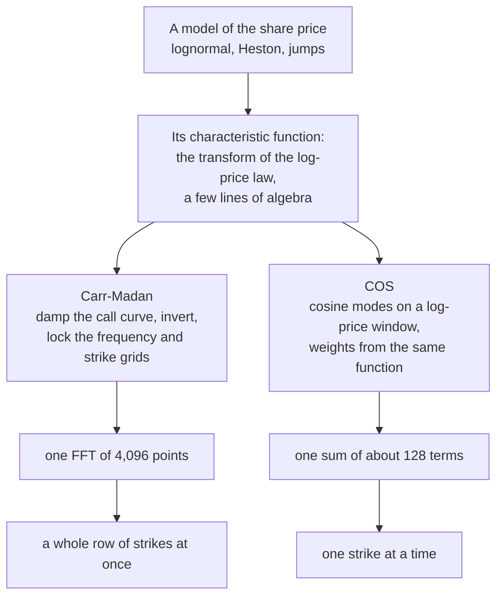
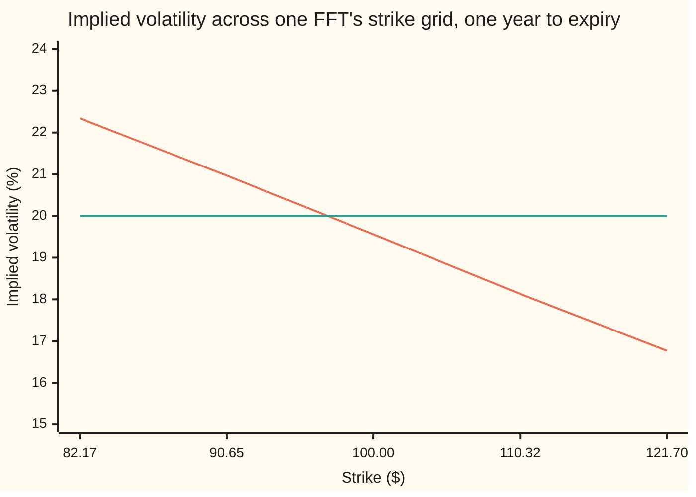

# Transform pricing: prices from a characteristic function by FFT or cosine series

[Syllabus](../../../SYLLABUS.md) → [Financial mathematics](../README.md) → [Numerical Methods for Pricing](../README.md#s06) → Transform pricing

---

## General Overview

Acme shares trade at $100. A desk quotes one-year Acme calls at forty strikes, from 60 up to 160, and requotes the row whenever the shares move. Under Black–Scholes each quote is one line of arithmetic.

The hard part is that a single volatility cannot reproduce what options actually cost: low strikes trade dearer than high ones. Models that do reproduce that — Heston, where the volatility itself wanders, or models that let the price jump — share an awkward property. Nobody knows a formula for the **density** of the future share price under them, the curve saying how likely each ending price is. Averaging a payoff needs the density. No density, no price.

What they do hand over, in a few lines of algebra, is the density's **Fourier transform**: how much of each wave frequency the distribution is built from. For a probability distribution that transform has its own name, the **characteristic function**, and it is the only thing about a model either method here asks for.

Two machines turn it into money. Peter Carr and Dilip Madan, in 1999, damped the call price with an exponential so that it has a transform at all, wrote that transform in one line, and inverted it; sampling frequencies and strikes on locked grids then lets one fast Fourier transform return a whole row of strikes for the price of one. Fang and Oosterlee, in 2008, expanded the distribution on a window into cosine waves, each weight coming straight from the characteristic function.

Both run below on Acme at 5% interest, a 2% dividend yield, 20% volatility and one year. The lognormal law goes first, because there Black–Scholes is an outside referee: the FFT returns **9.227006** at strike 100 from a 4,096-point grid, and the cosine series agrees with it to eleven decimals. Then the same code, one function swapped, prices Heston, where no referee exists and the machines check each other. They agree to nine decimals on **9.059507**.

**One transform of a distribution prices every European option written on it: damp the call curve until it has a Fourier transform, invert once, and read a whole strip of strikes off a single FFT — or expand the same distribution in cosine modes and sum them.**

**What kind of fact this is:** a method, resting on an exact inversion identity and an exact cosine expansion, both shown in Why it works, each cut down to a finite sum whose two sources of error are named.

### The picture: what flows into what



Everything below the model is the same arithmetic whatever the model was.

---

## The formula

Notation first. Both methods work in logarithms measured against today's share price, so the middle of every grid sits at 100. Write $Y$ for the log share price at expiry and $k$ for the log strike, both measured that way:

$$Y = \log(S_T/S), \qquad k = \log(K/S)$$

with $S$ Acme today, $S_T$ Acme on expiry day, $K$ the strike. Strike 100 is $k = 0$; strike 121.70 is $k = 0.196$.

The one thing taken from the model is an average of an exponential of $Y$:

$$\Phi(z) = E\!\left[e^{zY}\right]$$

**Read it aloud:** average the exponential of $z$ times the log price over every way the year can end. Here $z$ may carry a multiple of $i$, the square root of minus one. At $z = iu$, with $u$ a real frequency, this is the **characteristic function** of the log price: the Fourier transform of its distribution. Carr–Madan needs it just off that line, at $z = p + iu$, so the extended version is written here.

A call struck at $K$ is worth, in these coordinates,

$$C(k) = S\,e^{-rT}\,E\!\left[\left(e^{Y} - e^{k}\right)^{+}\right]$$

with $r$ the riskless rate, $T$ the years to expiry, $e^{-rT}$ the discount to today, and the superscript plus meaning "or zero, whichever is larger" — the ordinary risk-neutral average ([Black-Scholes by expectation](../05-Black-Scholes%20from%20the%20Ground%20Up/04-black-scholes-by-risk-neutral-expectation.md)) rewritten in logs.

### Carr–Madan: damp, transform, invert

Pick a damping exponent $\alpha > 0$ and set $p = \alpha + 1$. The **damped call curve** is $c(k) = e^{\alpha k}C(k)$, and its Fourier transform is

$$\psi(u) = \int_{-\infty}^{\infty} e^{iuk}\,c(k)\,dk \;=\; \frac{S\,e^{-rT}\,\Phi(p + iu)}{(\alpha + iu)(p + iu)}$$

**Read it aloud:** the model sits in the numerator, inside one call to $\Phi$; the damping sits in the two factors underneath, neither of which can vanish for real $u$ since $\alpha$ and $p$ are positive.

Inverting recovers the price at every log strike:

$$C(k) = \frac{e^{-\alpha k}}{\pi}\,\mathrm{Re}\int_{0}^{\infty} e^{-iuk}\,\psi(u)\,du$$

Run along the positive frequencies, keep the real part, undo the damping. The real part is not decoration: a half-line integral of a complex function is generally not real.

Now the grids. Sample frequencies at panel midpoints — the middle of each frequency step — and log strikes evenly:

$$u_j = \left(j + \tfrac{1}{2}\right)\eta, \qquad k_\ell = -\frac{\pi}{\eta} + \ell\lambda, \qquad \lambda\eta = \frac{2\pi}{N}$$

with $\eta$ the frequency step, $\lambda$ the log-strike step, $N$ the number of points, and both indices running from 0 to $N - 1$. With those choices the finite approximation is a discrete Fourier transform ([The discrete Fourier transform](../../07-Complex%20analysis/08-Transforms%20in%20Outline/02-discrete-fourier-transform.md)) and nothing more, the hat marking what the finite sum gives for the price at $k_\ell$:

$$\widehat{C}_\ell = \frac{\eta\,e^{-\alpha k_\ell}}{\pi}\,\mathrm{Re}\!\left[e^{-i\pi\ell/N}\sum_{j=0}^{N-1} i(-1)^{j}\,\psi(u_j)\,e^{-2\pi i j\ell/N}\right]$$

Flip the sign of every other sample, multiply by $i$, run one FFT, twist each output by a half-cell phase, take the real part, undo the damping: every grid strike comes out together.

### COS: cosine modes on a window

The second machine confines the log price to a window $[a, b]$ of width $L = b - a$ and expands what lies inside in cosine waves of frequency $\omega_n = n\pi/L$. It prices the **put**, not the call: a put never pays more than its strike, so nothing large hides in the tails that get cut off. With $M$ modes,

$$P_M = e^{-rT}\,\frac{L}{2}\left[\frac{F_0V_0}{2} + \sum_{n=1}^{M-1} F_nV_n\right], \qquad F_n = \frac{2}{L}\,\mathrm{Re}\!\left(e^{-i\omega_n a}\,\Phi(i\omega_n)\right)$$

At each mode, multiply what the distribution puts into that wave by what the payoff takes out of it, and add. $F_n$ is the distribution's weight, straight from the characteristic function; $V_n$ is the payoff's, given in closed form in Why it works. Both carry the $2/L$. The constant mode counts half, a property of cosine series rather than a fudge. The call comes free from put–call parity, an exact identity: $C = P + S\,e^{-qT} - K\,e^{-rT}$, with $q$ the dividend yield.

| Symbol | Plain meaning | In our example | Push it up and the answer… |
| --- | --- | --- | --- |
| $S$, $S_T$, $K$ | Acme today, Acme on expiry day, the strike | 100, unknown, 82 to 122 | a cheaper call |
| $Y$, $k$ | log share price at expiry, log strike, both against today's 100 | 0 at strike 100 | — |
| $r$, $q$, $\sigma$, $T$ | riskless rate, dividend yield, volatility, years to expiry | 5%, 2%, 20%, 1 | the shelf's market |
| $\Phi$, $z$, $i$ | the model's whole contribution, the average of $e^{zY}$ at a complex argument $z$; $i$ is the square root of minus one | $\Phi(1) = 1.030454534$ | — |
| $\alpha$, $p$ | the damping exponent, and $p = \alpha + 1$ | 1.5 and 2.5 | a higher moment needed |
| $\psi$ | Fourier transform of the damped call curve | $\psi(0) = 29.471224$ | — |
| $u$, $\eta$, $N$ | frequency, its step, the number of grid points | 0 to 1024, 0.25, 4,096 | finer panels |
| $\lambda$ | the log-strike step, locked by $\lambda\eta = 2\pi/N$ | 0.006135923 | coarser strikes, finer frequencies |
| $C$, $P$ | the call and the put at one strike | 9.227006 and 6.330081 | — |
| $a$, $b$, $L$ | the window's ends and its width | −3, 3, 6 | a wider window needs more modes |
| $\omega_n$, $M$ | the cosine frequencies, and how many are summed | steps of $\pi/6$, 128 | a closer sum |
| $F_n$, $V_n$ | each mode's weight from the law, and from the payoff | — | — |

### When it holds

- **The damped curve must be integrable**, which needs $E[S_T^{p}]$ finite: the share price raised to $\alpha + 1$ must have a finite average. Lognormal has every such moment; heavy tails cap $\alpha$ outright, and past the ceiling the integral does not exist even though the finite sum still prints a number.
- **The damping must also beat the strike window.** Sampling at step $\eta$ rebuilds the damped curve plus copies of itself shifted by $2\pi/\eta$ in log strike and alternating in sign. The nearest copy drags in the plateau the call price settles on at low strikes, $Se^{-qT}$, scaled by $e^{-2\pi\alpha/\eta}$: nothing at $\alpha = 1.5$, eighteen cents at $\alpha = 0.25$.
- **The frequency run must outlast the transform.** The lognormal $\psi$ has fallen to 0.000000000137 by $u = 32$; Heston's is a million times larger there, 0.000189658714, reaching 0.000000008333 only at $u = 64$.
- **The strike must sit on the grid.** The FFT prices the log strikes $k_\ell$ and nothing between them.
- **The window must hold the mass.** Probability outside $[a, b]$ is dropped and no number of modes brings it back. The window below reaches fifteen standard deviations of the log price either way and costs nothing measurable; at one and a half the put loses 73 cents.
- **The complex square root and logarithm need the right branch.** Heston's characteristic function contains both, and the wrong branch silently prices a different model.

---

## Why it works

### Step 0: a transform survives where a density does not

Pricing needs an average of the payoff against the density of the ending price. Under Heston that density exists but has no formula; its Fourier transform has one, from two ordinary differential equations solvable by hand.

So move the calculation into frequency space. The payoff's transform is worked out once, on paper, and never changes; the model's is looked up. A model with a known transform can therefore be priced whether or not its density can be written down.

### Step 1: the call curve has no transform until it is damped

Watch the call price as a function of log strike at both ends. Toward plus infinity the strike becomes unreachable and the price falls to zero fast. Toward minus infinity the strike becomes free and the price rises to $S e^{-qT}$, a positive constant.

A function settling on a positive constant is not integrable, so it has no Fourier transform. Multiplying by $e^{\alpha k}$ kills that end, and the other end already vanished faster than $e^{\alpha k}$ grows, provided the share price has a finite moment of order $p$. That is the whole role of the damping, and why zero damping fails: the transform would blow up — have a pole — on the integration path.

### Step 2: the damped transform is one line of the model's transform

Substituting the call and swapping the order of integration turns $\psi$ into a single average, and the payoff's two pieces integrate in closed form.

<details>
<summary>The algebra behind this, if you want it</summary>

The payoff is zero unless the log strike lies below $Y$, so
$$\psi(u) = S\,e^{-rT}\,E\int_{-\infty}^{Y} e^{(\alpha + iu)k}\left(e^{Y} - e^{k}\right)dk.$$
The inner integral is elementary: the real part of the exponent's coefficient is $\alpha > 0$, so both exponentials vanish at the lower limit, and
$$\int_{-\infty}^{Y} e^{(\alpha + iu)k}\left(e^{Y} - e^{k}\right)dk = e^{(p + iu)Y}\left[\frac{1}{\alpha + iu} - \frac{1}{p + iu}\right] = \frac{e^{(p+iu)Y}}{(\alpha + iu)(p + iu)},$$
the last step because $p - \alpha = 1$. Averaging what is left gives $\Phi(p + iu)$. Swapping the average and the integral is allowed because the integrand is non-negative before the phase is applied, and the total, $S e^{-rT}\Phi(p)/(\alpha p)$, is finite exactly when $E[S_T^{p}]$ is — the moment condition, arriving on its own.

At zero frequency that total is a cheap check: $\Phi(2.5) = e^{0.15}$ here, so $\psi(0) = 100\,e^{-0.05}e^{0.15}/3.75 = 29.471224$, which the code prints on its third line.

</details>

### Step 3: half the frequency line is enough

The damped curve is a real function, and the transform of a real function satisfies $\psi(-u) = \overline{\psi(u)}$, the bar meaning flip the sign of the imaginary part. So the negative-frequency half of the inversion integral mirrors the positive half, and their sum is twice the real part of the positive one: the usual $1/(2\pi)$ becomes $1/\pi$ of the real part over the half-line. Undoing the damping returns the price.

### Step 4: one FFT, every strike, and the grid lock

The only place a strike enters the sum is the factor $e^{-iu_jk_\ell}$. On the grids above it splits into one piece depending only on the frequency index, one depending only on the strike index, and the discrete Fourier kernel that couples them. The split is exact, and it is what makes the method fast.

<details>
<summary>Detailed proof: the phase identity behind the FFT step</summary>

With $u_j = (j + \frac{1}{2})\eta$ and $k_\ell = -\pi/\eta + \ell\lambda$,
$$u_jk_\ell = -\pi\left(j + \tfrac{1}{2}\right) + \left(j + \tfrac{1}{2}\right)\ell\,\lambda\eta = -\pi\left(j + \tfrac{1}{2}\right) + \frac{2\pi j\ell}{N} + \frac{\pi\ell}{N},$$
using $\lambda\eta = 2\pi/N$ in the last two terms. Exponentiating and separating,
$$e^{-iu_jk_\ell} = e^{i\pi j}\,e^{i\pi/2}\,e^{-2\pi i j\ell/N}\,e^{-i\pi\ell/N} = i(-1)^{j}\,e^{-2\pi i j\ell/N}\,e^{-i\pi\ell/N}.$$
Substitute that into the midpoint sum $\eta\sum_j e^{-iu_jk_\ell}\psi(u_j)$ and the boxed expression appears: pack $i(-1)^j\psi(u_j)$ into an array of length $N$, take its minus-sign discrete Fourier transform, and each output is the sum for its own log strike, up to the twist $e^{-i\pi\ell/N}$ and the outside factors. The identity holds for every power of two, down to $N = 1$.

Two approximations came before this step and none during it: the frequency integral was cut at $N\eta$, and what remained was sampled at panel midpoints. The first error follows the transform's tail past the cutoff, the second falls like $\eta$ squared. All $N$ sums then cost about $N\log_2 N$ operations instead of $N$ squared, some 340 times less work at 4,096 points.

</details>

The lock is the price of the speed: since $\lambda = 2\pi/(N\eta)$, a longer frequency run at fixed $N$ means coarser strikes. Below, $\eta = 0.25$ and 4,096 points give a cutoff of 1,024 — far past where either transform matters — and a strike ladder 0.6% apart.

### Step 5: the other machine, and why it prices the put

COS starts from the other end. On a finite window any well-behaved density is a cosine series, which can be integrated against the payoff term by term. Two facts make that practical.

First, the density's cosine coefficients are unavailable but the characteristic function's values are, and on a window they nearly coincide: $F_n$ equals the true coefficient plus an error no larger than $2/L$ times the probability lying outside. That substitution is what the method rests on, and why the window must be wide.

Second, the payoff's coefficients are elementary. The put pays only below the log strike $k$, so set $d = \min(b, k)$ and integrate over $[a, d]$; if the log strike is at or below $a$, every coefficient is zero. For the constant mode the two integrals are $d - a$ and $e^{d} - e^{a}$; for the rest they are

$$\frac{\sin\left(\omega_n(d - a)\right)}{\omega_n} \qquad\text{and}\qquad \frac{e^{d}\left[\cos\left(\omega_n(d-a)\right) + \omega_n\sin\left(\omega_n(d-a)\right)\right] - e^{a}}{1 + \omega_n^{2}}$$

and $V_n$ is $2/L$ times the difference: the strike times the first, less today's share price times the second. Differentiating each expression recovers its integrand, which is the proof.

Why the put? Its payoff never exceeds the strike, so dropping the far tails costs at most the strike times the probability dropped, which can be bounded and made tiny. A call's payoff grows without limit and has no such bound.

### The other door

The same identity can be used one strike at a time by any numerical integration rule, often better when only three strikes are wanted; the code does that as a cross-check. A model with neither a transform nor a formula must be simulated ([Monte Carlo pricing](01-monte-carlo-pricing.md)) or solved on a grid ([Pricing on a grid](07-finite-differences-for-the-black-scholes-equation.md)).

---

## Worked numbers, by hand

Acme: $S = 100$, $r = 5\%$, $q = 2\%$, $\sigma = 20\%$, $T = 1$ year, damping $\alpha = 1.5$. The grid first, since every later number depends on it.

| Step | Arithmetic | Value |
| --- | --- | --- |
| frequency step $\eta$ | chosen | $0.25$ |
| frequency cutoff | $N\eta = 4096 \times 0.25$ | $1024$ |
| log-strike step $\lambda$ | $2\pi/(N\eta) = 6.283185/1024$ | $0.006135923$ |
| half-window | $\pi/\eta = 3.141593/0.25$ | $12.566371$ |
| damping pair | $\alpha = 1.5$, so $p = \alpha + 1$ | $2.5$ |
| transform at zero frequency | $\psi(0) = 100\,e^{0.1}/3.75$ | $29.471224$ |
| the middle grid cell | $k = 0$, so $K = 100\,e^{0}$ | $100.000000$ |
| the call there, from one FFT | that cell, twisted and undamped | $\mathbf{9.227006}$ |
| the same call, closed formula | Black–Scholes, for comparison | $9.227006$ |

Each cell up multiplies the strike by $e^{\lambda}$, so the ladder is geometric with rungs about 0.6% apart, 4,096 of them across the window. Five rungs, 16 and 32 cells either side of the middle, all from that one transform:

| Strike | Carr–Madan FFT | Direct sum, one strike | Black–Scholes | Heston, same machine |
| --- | --- | --- | --- | --- |
| 82.172496 | 20.979019 | 20.979019 | 20.979019 | 21.436444 |
| 90.649046 | 14.684220 | 14.684220 | 14.684220 | 14.976554 |
| **100.000000** | **9.227006** | **9.227006** | **9.227006** | **9.059507** |
| 110.315557 | 5.088852 | 5.088852 | 5.088852 | 4.380604 |
| 121.695221 | 2.413500 | 2.413500 | 2.413500 | 1.507356 |

The first three columns agree to nine decimals: column two is the identical sum evaluated the slow way, column three a formula that knows nothing about Fourier transforms. On the window from −3 to 3 the cosine series reaches the same put, 6.330081, and the same call by 128 modes, then stops moving.

The last column is the payoff. Heston, with starting and long-run variance both 0.04, mean reversion 2, volatility of volatility 0.30 and correlation −0.70, prices the same five rungs with one function changed. Its at-the-money call is 9.059507 both ways, the roads differing by 0.000000000070, and no formula exists anywhere to compare against.

### The picture: what the extra machinery buys

Run each price backwards through Black–Scholes for the volatility that reproduces it: the **implied volatility**, the market's usual way of quoting an option.



The sloping line is Heston, the flat one lognormal; only the characteristic function differed. The flat 20.00 also checks the whole chain: prices made by the transform, inverted through an independent formula, must hand back the volatility that went in.

### What breaks if you drop a piece

Same Acme option, correct answers 9.227006 for the call and 6.330081 for the put:

| Mistake | Comes out at | What went wrong |
| --- | --- | --- |
| No damping, $\alpha = 0$ | −39.782928 | The transform has a pole at zero frequency; the sum returns a negative "price" |
| Nearest rung read for strike 100.30, rung at 100.00 | 9.227006, not 9.079483 | Fifteen cents, from thirty cents of strike |
| Window cut to $-0.3$ to $0.3$, the put | 5.604335, not 6.330081 | One and a half standard deviations is not enough; 73 cents thrown away |
| Constant cosine mode counted in full, the put | 38.827044, not 6.330081 | That term of a cosine series carries half weight |

Every number in both tables is printed by the code below.

---

## Code, from first principles, and it actually runs

Nothing imported knows an option price. The bell-curve area comes from `math.erf` in Python and from thin slices under the curve in Rust, where a complex number is also a pair of doubles with hand-written arithmetic. The FFT, the midpoint sums, the cosine weights and the search for implied volatility are all written out.

The lognormal call is reached **four ways**: the Carr–Madan FFT, the identical midpoint sum strike by strike, the cosine series through the put and parity, and the closed Black–Scholes formula. Heston is reached two ways, by both machines, and its characteristic function is checked against the requirement that the average share price grow at the riskless rate less the dividend. Then each mistake above is committed on purpose and its wrong number printed.

### Python

```python
# Transform pricing -- the check behind the card.  Standard library only.  Acme:
# S = 100, r = 5%, q = 2%, sigma = 20%, T = 1 year.  One object, the
# characteristic function of the log price, feeds two machines: Carr-Madan,
# which damps the call curve and inverts it with a single FFT, and COS, which
# expands the same law in cosine modes.  Both run first on the lognormal
# (Black-Scholes) law, where the closed formula is an independent referee, then
# on Heston, where no closed formula exists and the machines check each other.
# The bell-curve area, the FFT, the sums and the volatility search are written
# out here; nothing imported already knows an option price.
from math import log, sqrt, exp, erf, pi, cos, sin
from cmath import exp as cexp, sqrt as csqrt, log as clog

S, R, RATE, Q, SIG, T = 100.0, 100.0, 0.05, 0.02, 0.20, 1.0
ALPHA, N, ETA = 1.5, 4096, 0.25
LAM, HALF = 2.0*pi/(N*ETA), pi/ETA       # log-strike step, and half its window
HES = (0.04, 2.0, 0.04, 0.30, -0.70)     # v0, kappa, theta, vol of vol, rho
OFFSETS, LOW, HIGH = (-32, -16, 0, 16, 32), -3.0, 3.0
DISC, DIV = exp(-RATE*T), exp(-Q*T)

def bs_call(strike, vol=SIG):            # the referee: the closed formula
    ncdf = lambda x: 0.5*(1.0 + erf(x/sqrt(2.0)))    # bell-curve area left of x
    vt = vol*sqrt(T)
    d1 = (log(S/strike) + (RATE - Q + 0.5*vol*vol)*T)/vt
    return S*DIV*ncdf(d1) - strike*DISC*ncdf(d1 - vt)

def implied_vol(price, strike):          # bisection, written out, no library solver
    low, high = 0.005, 2.0
    for _ in range(80):
        mid = 0.5*(low + high)
        low, high = (low, mid) if bs_call(strike, mid) > price else (mid, high)
    return 0.5*(low + high)

def phi_gauss(z):                        # E[e^{zY}], Y = log(S_T/R), lognormal law
    return cexp(z*(RATE - Q - 0.5*SIG*SIG)*T + z*z*SIG*SIG*T/2.0)

def phi_heston(z, par=HES):              # the same object under Heston, one grouping
    v0, kap, th, xi, rho = par
    lin = rho*xi*z - kap
    root = csqrt(lin*lin - xi*xi*(z*z - z))       # principal branch, real part >= 0
    edge, g = (-lin - root)/(xi*xi), (-lin - root)/(-lin + root)
    decay = cexp(-root*T)
    bee = edge*(1.0 - decay)/(1.0 - g*decay)
    ay = kap*th*(edge*T - 2.0/(xi*xi)*clog((1.0 - g*decay)/(1.0 - g)))
    return cexp((RATE - Q)*z*T + ay + bee*v0)

def psi(u, phi, alpha=ALPHA):            # transform of the damped call curve
    p = alpha + 1.0
    return R*DISC*phi(complex(p, u))/(complex(alpha, u)*complex(p, u))

def fft(x):                              # radix two, minus sign, written out here
    n = len(x)
    if n == 1:
        return x[:]
    even, odd, out = fft(x[0::2]), fft(x[1::2]), [0j]*n
    for j in range(n//2):
        turn = cexp(complex(0.0, -2.0*pi*j/n))*odd[j]
        out[j], out[j + n//2] = even[j] + turn, even[j] - turn
    return out

def carr_madan(phi, alpha=ALPHA):
    freq = [(j + 0.5)*ETA for j in range(N)]
    val = [psi(u, phi, alpha) for u in freq]
    trans = fft([(1j if j % 2 == 0 else -1j)*v for j, v in enumerate(val)])
    def price(off, by_fft=True):         # off counts grid steps away from K = R
        cell, scale = N//2 + off, ETA*exp(-alpha*off*LAM)/pi
        if by_fft:                       # one transform serves every grid strike
            return scale*(cexp(complex(0.0, -pi*cell/N))*trans[cell]).real
        return scale*sum((cexp(complex(0.0, -u*off*LAM))*v      # the same sum alone
                          for u, v in zip(freq, val)), 0j).real
    return price

def cos_put(phi, strike, modes, low=LOW, high=HIGH, halve=True):
    width, edge = high - low, log(strike/R)
    top = low if edge <= low else min(high, edge)
    total = 0.0
    for n in range(modes):
        w = n*pi/width
        turn, ph = cexp(complex(0.0, -w*low))*phi(complex(0.0, w)), w*(top - low)
        flat = top - low if n == 0 else sin(ph)/w
        curved = (exp(top) - exp(low) if n == 0 else
                  (exp(top)*(cos(ph) + w*sin(ph)) - exp(low))/(1.0 + w*w))
        weight = 0.5 if n == 0 and halve else 1.0
        total += weight*2.0/width*turn.real*2.0/width*(strike*flat - R*curved)
    return DISC*width/2.0*total

def cos_call(phi, strike, modes, low=LOW, high=HIGH):
    return cos_put(phi, strike, modes, low, high) + S*DIV - strike*DISC

STRIKES = [R*exp(off*LAM) for off in OFFSETS]
grid_g, grid_h, grid_0 = carr_madan(phi_gauss), carr_madan(phi_heston), carr_madan(phi_gauss, 0.0)
forward = exp((RATE - Q)*T)
drift_ok = all(abs(f(complex(1.0, 0.0)).real - forward) < 1e-14 for f in (phi_gauss, phi_heston))
hes_fft, hes_cos, put128 = grid_h(0), cos_call(phi_heston, 100.0, 256), cos_put(phi_gauss, 100.0, 128)
vols = [[100.0*implied_vol(f(off), k) for off, k in zip(OFFSETS, STRIKES)] for f in (grid_g, grid_h)]
breaks = [("no damping, alpha = 0", grid_0(0), bs_call(100.0)),
          ("nearest node read for K = 100.30, node at 100.00",
           grid_g(round(log(100.30/R)/LAM)), bs_call(100.30)),
          ("COS window [-0.3, 0.3], 128 modes, the put",
           cos_put(phi_gauss, 100.0, 128, -0.3, 0.3), put128),
          ("COS constant mode at full weight, the put",
           cos_put(phi_gauss, 100.0, 128, LOW, HIGH, False), put128)]

print(f"""Acme, one year: S = 100, r = 5%, q = 2%, sigma = 20%, log prices against R = 100
grid: N = {N}, eta = {ETA}, cutoff N eta = {N*ETA:.0f}, lambda = {LAM:.9f}, half-window = {HALF:.6f}
damped transform at zero frequency, psi(0){psi(0.0, phi_gauss).real:>25.9f}
forward check, Phi(1) against e^(r-q)T = {forward:.12f}, both laws: {'yes' if drift_ok else 'no'}""")
for name, phi in (("lognormal law", phi_gauss), ("Heston law", phi_heston)):
    print(f"size of psi at u = 8, 16, 32, 64, {name:<14}"
          + " ".join(f"{abs(psi(u, phi)):>14.12f}" for u in (8.0, 16.0, 32.0, 64.0)))
print(f"\none FFT of {N} points, five strikes read off the same grid:")
print(f"{'strike':>11}{'Carr-Madan FFT':>17}{'direct sum':>17}{'closed formula':>17}{'Heston FFT':>17}")
for off, strike in zip(OFFSETS, STRIKES):
    print(f"{strike:>11.6f}{grid_g(off):>17.9f}{grid_g(off, False):>17.9f}"
          f"{bs_call(strike):>17.9f}{grid_h(off):>17.9f}")
print("\nCOS on the log window [-3, 3]: the put first, then the call by parity")
print(f"{'modes':>7}{'lognormal put':>17}{'lognormal call':>17}{'Heston put':>17}{'Heston call':>17}")
for modes in (8, 16, 32, 64, 128, 256):
    print(f"{modes:>7}{cos_put(phi_gauss, 100.0, modes):>17.9f}"
          f"{cos_call(phi_gauss, 100.0, modes):>17.9f}"
          f"{cos_put(phi_heston, 100.0, modes):>17.9f}"
          f"{cos_call(phi_heston, 100.0, modes):>17.9f}")
print("the house numbers, from the closed formula: put 6.330080627550, call 9.227005508154")
print(f"Heston at K = 100, the FFT road minus the COS road{hes_fft - hes_cos:>23.12f}")
print("\nimplied volatility backed out of those five prices, percent:")
print("  strike        " + "".join(f"{k:>8.2f}" for k in STRIKES))
print("  lognormal law " + "".join(f"{v:>8.2f}" for v in vols[0]))
print("  Heston law    " + "".join(f"{v:>8.2f}" for v in vols[1]))
print("\nwhat breaks:")
for label, wrong, right in breaks:
    print(f"  {label:<50}{wrong:>12.6f}   right: {right:.6f}")

assert max(abs(grid_g(o) - bs_call(k)) for o, k in zip(OFFSETS, STRIKES)) < 1e-8
assert max(abs(grid_g(o) - grid_g(o, False)) for o in OFFSETS) < 1e-9
assert abs(cos_call(phi_gauss, 100.0, 128) - bs_call(100.0)) < 1e-11
assert abs(bs_call(100.0) - 9.227005508154) < 1e-12
assert drift_ok and abs(hes_fft - hes_cos) < 1e-8
assert max(abs(v - 100.0*SIG) for v in vols[0]) < 1e-6
assert vols[1][0] > vols[1][2] > vols[1][4] and hes_fft < bs_call(100.0)
assert grid_0(0) < 0.0 and min(abs(w - right) for _, w, right in breaks) > 0.01
print("ALL CHECKS PASS")
```

**Ran 2026-09-19 on macOS, Python 3.14.6, standard library only. All checks passed. Output, pasted from the run:**

```
Acme, one year: S = 100, r = 5%, q = 2%, sigma = 20%, log prices against R = 100
grid: N = 4096, eta = 0.25, cutoff N eta = 1024, lambda = 0.006135923, half-window = 12.566371
damped transform at zero frequency, psi(0)             29.471224482
forward check, Phi(1) against e^(r-q)T = 1.030454533954, both laws: yes
size of psi at u = 8, 16, 32, 64, lognormal law 0.450418692711 0.002537837365 0.000000000137 0.000000000000
size of psi at u = 8, 16, 32, 64, Heston law    0.731296273541 0.037823552730 0.000189658714 0.000000008333

one FFT of 4096 points, five strikes read off the same grid:
     strike   Carr-Madan FFT       direct sum   closed formula       Heston FFT
  82.172496     20.979019208     20.979019208     20.979019208     21.436443875
  90.649046     14.684219940     14.684219940     14.684219940     14.976553749
 100.000000      9.227005508      9.227005508      9.227005508      9.059506895
 110.315557      5.088851692      5.088851692      5.088851692      4.380603997
 121.695221      2.413499708      2.413499708      2.413499708      1.507356183

COS on the log window [-3, 3]: the put first, then the call by parity
  modes    lognormal put   lognormal call       Heston put      Heston call
      8      8.943360873     11.840285754      8.897183545     11.794108426
     16      6.561533279      9.458458159      6.405750348      9.302675229
     32      6.330767838      9.227692719      6.149727709      9.046652590
     64      6.330080628      9.227005508      6.162604220      9.059529100
    128      6.330080628      9.227005508      6.162582014      9.059506895
    256      6.330080628      9.227005508      6.162582014      9.059506895
the house numbers, from the closed formula: put 6.330080627550, call 9.227005508154
Heston at K = 100, the FFT road minus the COS road         0.000000000070

implied volatility backed out of those five prices, percent:
  strike           82.17   90.65  100.00  110.32  121.70
  lognormal law    20.00   20.00   20.00   20.00   20.00
  Heston law       22.34   20.97   19.56   18.13   16.77

what breaks:
  no damping, alpha = 0                               -39.782928   right: 9.227006
  nearest node read for K = 100.30, node at 100.00      9.227006   right: 9.079483
  COS window [-0.3, 0.3], 128 modes, the put            5.604335   right: 6.330081
  COS constant mode at full weight, the put            38.827044   right: 6.330081
ALL CHECKS PASS
```

### Rust

Same numbers, same labels, built with `rustc --edition 2021 -O`. Rust has no complex type and no `erf`, so a complex number is a pair of doubles with hand-written arithmetic and the bell-curve area is a sum of four thousand thin slices. The two outputs agree line for line.

```rust
// Transform pricing -- the same check as the Python, in Rust.  No crates.  Acme:
// S = 100, r = 5%, q = 2%, sigma = 20%, T = 1 year.  One object, the characteristic
// function of the log price, feeds two machines: Carr-Madan, which damps the call
// curve and inverts it with a single FFT, and COS, which expands the same law in
// cosine modes.  Rust has neither complex numbers nor erf, so both are built here:
// a complex number is a pair, and the bell-curve area is a sum of thin slices.
use std::f64::consts::PI;
type C = (f64, f64);                                  // (real part, imaginary part)
const S: f64 = 100.0; const R: f64 = 100.0; const RATE: f64 = 0.05; const Q: f64 = 0.02;
const SIG: f64 = 0.20; const T: f64 = 1.0; const ALPHA: f64 = 1.5; const ETA: f64 = 0.25;
const MEAN: f64 = (RATE - Q - 0.5*SIG*SIG)*T; const VAR: f64 = SIG*SIG*T;
const N: usize = 4096; const LOW: f64 = -3.0; const HIGH: f64 = 3.0;
const OFFSETS: [i64; 5] = [-32, -16, 0, 16, 32];
const HES: (f64, f64, f64, f64, f64) = (0.04, 2.0, 0.04, 0.30, -0.70);
fn add(z: C, w: C) -> C { (z.0 + w.0, z.1 + w.1) }
fn sub(z: C, w: C) -> C { (z.0 - w.0, z.1 - w.1) }
fn mul(z: C, w: C) -> C { (z.0*w.0 - z.1*w.1, z.0*w.1 + z.1*w.0) }
fn scale(z: C, s: f64) -> C { (z.0*s, z.1*s) }
fn size(z: C) -> f64 { z.0.hypot(z.1) }
fn div(z: C, w: C) -> C { let d = w.0*w.0 + w.1*w.1;
    ((z.0*w.0 + z.1*w.1)/d, (z.1*w.0 - z.0*w.1)/d) }
fn cexp(z: C) -> C { let e = z.0.exp(); (e*z.1.cos(), e*z.1.sin()) }
fn clog(z: C) -> C { (size(z).ln(), z.1.atan2(z.0)) }
fn csqrt(z: C) -> C { let m = size(z);                // principal branch, real part >= 0
    ((0.5*(m + z.0)).max(0.0).sqrt(), (0.5*(m - z.0)).max(0.0).sqrt().copysign(z.1)) }
fn lam() -> f64 { 2.0*PI/(N as f64*ETA) }             // the log-strike step
fn disc() -> f64 { (-RATE*T).exp() }
fn divy() -> f64 { (-Q*T).exp() }

fn ncdf(x: f64) -> f64 {                 // bell-curve area left of x, by thin slices
    if x < -12.0 { return 0.0; } else if x > 12.0 { return 1.0; }
    let (panels, h) = (4000, x/4000.0);
    let bell = |t: f64| (-0.5*t*t).exp()/(2.0*PI).sqrt();
    let mut total = bell(0.0) + bell(x);
    for i in 1..panels { total += (if i % 2 == 1 { 4.0 } else { 2.0 })*bell(i as f64*h); }
    0.5 + total*h/3.0
}
fn bs_call(strike: f64, vol: f64) -> f64 {            // the referee: the closed formula
    let vt = vol*T.sqrt();
    let d1 = ((S/strike).ln() + (RATE - Q + 0.5*vol*vol)*T)/vt;
    S*divy()*ncdf(d1) - strike*disc()*ncdf(d1 - vt)
}
fn implied_vol(target: f64, strike: f64) -> f64 {     // bisection, no library solver
    let (mut low, mut high) = (0.005, 2.0);
    for _ in 0..80 { let mid = 0.5*(low + high);
        if bs_call(strike, mid) > target { high = mid } else { low = mid } }
    0.5*(low + high)
}
// E[e^{zY}], Y = log(S_T/R): the lognormal law, then Heston in one safe grouping
fn phi_gauss(z: C) -> C { cexp(add(scale(z, MEAN), scale(mul(z, z), VAR/2.0))) }
fn phi_heston(z: C) -> C {
    let (v0, kap, th, xi, rho) = HES;
    let lin = sub(scale(z, rho*xi), (kap, 0.0));
    let root = csqrt(sub(mul(lin, lin), scale(sub(mul(z, z), z), xi*xi)));
    let top = sub(scale(lin, -1.0), root);
    let (edge, g) = (scale(top, 1.0/(xi*xi)), div(top, add(scale(lin, -1.0), root)));
    let decay = cexp(scale(scale(root, -1.0), T));
    let bee = div(mul(edge, sub((1.0, 0.0), decay)), sub((1.0, 0.0), mul(g, decay)));
    let inner = clog(div(sub((1.0, 0.0), mul(g, decay)), sub((1.0, 0.0), g)));
    let ay = scale(sub(scale(edge, T), scale(inner, 2.0/(xi*xi))), kap*th);
    cexp(add(add(scale(scale(z, RATE - Q), T), ay), scale(bee, v0)))
}
fn psi(u: f64, phi: fn(C) -> C, alpha: f64) -> C {    // the damped call curve's transform
    div(scale(phi((alpha + 1.0, u)), R*disc()), mul((alpha, u), (alpha + 1.0, u)))
}
fn fft(x: &[C]) -> Vec<C> {              // radix two, minus sign, written out here
    let n = x.len();
    if n == 1 { return x.to_vec(); }
    let even = fft(&x.iter().step_by(2).copied().collect::<Vec<C>>());
    let odd = fft(&x.iter().skip(1).step_by(2).copied().collect::<Vec<C>>());
    let mut out = vec![(0.0, 0.0); n];
    for j in 0..n/2 { let turn = mul(cexp((0.0, -2.0*PI*j as f64/n as f64)), odd[j]);
        out[j] = add(even[j], turn); out[j + n/2] = sub(even[j], turn); }
    out
}
struct Grid { freq: Vec<f64>, val: Vec<C>, trans: Vec<C>, alpha: f64 }
fn carr_madan(phi: fn(C) -> C, alpha: f64) -> Grid {
    let freq: Vec<f64> = (0..N).map(|j| (j as f64 + 0.5)*ETA).collect();
    let val: Vec<C> = freq.iter().map(|&u| psi(u, phi, alpha)).collect();
    let packed: Vec<C> = val.iter().enumerate()
        .map(|(j, &v)| mul(if j % 2 == 0 { (0.0, 1.0) } else { (0.0, -1.0) }, v)).collect();
    Grid { freq, val, trans: fft(&packed), alpha }
}
fn price(g: &Grid, off: i64, by_fft: bool) -> f64 {   // off counts steps from K = R
    let cell = (N as i64/2 + off) as usize;
    let scaling = ETA*(-g.alpha*off as f64*lam()).exp()/PI;
    if by_fft {                                       // one transform, every strike
        return scaling*mul(cexp((0.0, -PI*cell as f64/N as f64)), g.trans[cell]).0;
    }
    let mut total = (0.0, 0.0);                       // the same sum, strike by strike
    for (u, v) in g.freq.iter().zip(&g.val) {
        total = add(total, mul(cexp((0.0, -u*off as f64*lam())), *v)); }
    scaling*total.0
}
fn cos_put(phi: fn(C) -> C, strike: f64, modes: usize, low: f64, high: f64, halve: bool) -> f64 {
    let (width, edge) = (high - low, (strike/R).ln());
    let top = if edge <= low { low } else { high.min(edge) };
    let mut total = 0.0;
    for n in 0..modes {
        let w = n as f64*PI/width;
        let (turn, ph) = (mul(cexp((0.0, -w*low)), phi((0.0, w))), w*(top - low));
        let flat = if n == 0 { top - low } else { ph.sin()/w };
        let curved = if n == 0 { top.exp() - low.exp() }
            else { (top.exp()*(ph.cos() + w*ph.sin()) - low.exp())/(1.0 + w*w) };
        let weight = if n == 0 && halve { 0.5 } else { 1.0 };
        total += weight*2.0/width*turn.0*2.0/width*(strike*flat - R*curved);
    }
    disc()*width/2.0*total
}
fn cos_call(phi: fn(C) -> C, strike: f64, modes: usize) -> f64 {
    cos_put(phi, strike, modes, LOW, HIGH, true) + S*divy() - strike*disc() }

fn main() {
    let strikes: Vec<f64> = OFFSETS.iter().map(|&o| R*(o as f64*lam()).exp()).collect();
    let (grid_g, grid_h) = (carr_madan(phi_gauss, ALPHA), carr_madan(phi_heston, ALPHA));
    let grid_0 = carr_madan(phi_gauss, 0.0);
    let forward = ((RATE - Q)*T).exp();
    let drift_ok = [phi_gauss, phi_heston].iter().all(|f| (f((1.0, 0.0)).0 - forward).abs() < 1e-14);
    let (hes_fft, hes_cos) = (price(&grid_h, 0, true), cos_call(phi_heston, 100.0, 256));
    let put128 = cos_put(phi_gauss, 100.0, 128, LOW, HIGH, true);
    let vols: Vec<Vec<f64>> = [&grid_g, &grid_h].iter().map(|g| OFFSETS.iter().zip(&strikes)
        .map(|(&o, &k)| 100.0*implied_vol(price(g, o, true), k)).collect()).collect();
    let near = ((100.30/R).ln()/lam()).round() as i64;
    let breaks: Vec<(&str, f64, f64)> = vec![
        ("no damping, alpha = 0", price(&grid_0, 0, true), bs_call(100.0, SIG)),
        ("nearest node read for K = 100.30, node at 100.00", price(&grid_g, near, true), bs_call(100.30, SIG)),
        ("COS window [-0.3, 0.3], 128 modes, the put", cos_put(phi_gauss, 100.0, 128, -0.3, 0.3, true), put128),
        ("COS constant mode at full weight, the put", cos_put(phi_gauss, 100.0, 128, LOW, HIGH, false), put128)];
    let cells = |vals: &Vec<f64>| vals.iter().map(|v| format!("{:>8.2}", v)).collect::<String>();
    println!("Acme, one year: S = 100, r = 5%, q = 2%, sigma = 20%, log prices against R = 100");
    println!("grid: N = {}, eta = {}, cutoff N eta = {:.0}, lambda = {:.9}, half-window = {:.6}", N, ETA, N as f64*ETA, lam(), PI/ETA);
    println!("damped transform at zero frequency, psi(0){:>25.9}", psi(0.0, phi_gauss, ALPHA).0);
    println!("forward check, Phi(1) against e^(r-q)T = {:.12}, both laws: {}", forward, if drift_ok { "yes" } else { "no" });
    for (name, phi) in [("lognormal law", phi_gauss as fn(C) -> C), ("Heston law", phi_heston)] {
        println!("size of psi at u = 8, 16, 32, 64, {:<14}{}", name, [8.0, 16.0, 32.0, 64.0].iter()
                 .map(|&u| format!("{:>14.12}", size(psi(u, phi, ALPHA)))).collect::<Vec<_>>().join(" "));
    }
    println!("\none FFT of {} points, five strikes read off the same grid:", N);
    println!("{:>11}{:>17}{:>17}{:>17}{:>17}", "strike", "Carr-Madan FFT", "direct sum", "closed formula", "Heston FFT");
    for (&off, &strike) in OFFSETS.iter().zip(&strikes) {
        println!("{:>11.6}{:>17.9}{:>17.9}{:>17.9}{:>17.9}", strike, price(&grid_g, off, true),
                 price(&grid_g, off, false), bs_call(strike, SIG), price(&grid_h, off, true));
    }
    println!("\nCOS on the log window [-3, 3]: the put first, then the call by parity");
    println!("{:>7}{:>17}{:>17}{:>17}{:>17}", "modes", "lognormal put", "lognormal call", "Heston put", "Heston call");
    for modes in [8usize, 16, 32, 64, 128, 256] {
        println!("{:>7}{:>17.9}{:>17.9}{:>17.9}{:>17.9}", modes,
                 cos_put(phi_gauss, 100.0, modes, LOW, HIGH, true), cos_call(phi_gauss, 100.0, modes),
                 cos_put(phi_heston, 100.0, modes, LOW, HIGH, true), cos_call(phi_heston, 100.0, modes));
    }
    println!("the house numbers, from the closed formula: put 6.330080627550, call 9.227005508154");
    println!("Heston at K = 100, the FFT road minus the COS road{:>23.12}", hes_fft - hes_cos);
    println!("\nimplied volatility backed out of those five prices, percent:");
    println!("  strike        {}", cells(&strikes));
    println!("  lognormal law {}", cells(&vols[0]));
    println!("  Heston law    {}", cells(&vols[1]));
    println!("\nwhat breaks:");
    for (label, wrong, right) in &breaks {
        println!("  {:<50}{:>12.6}   right: {:.6}", label, wrong, right);
    }
    assert!(OFFSETS.iter().zip(&strikes).all(|(&o, &k)| (price(&grid_g, o, true) - bs_call(k, SIG)).abs() < 1e-8));
    assert!(OFFSETS.iter().all(|&o| (price(&grid_g, o, true) - price(&grid_g, o, false)).abs() < 1e-9));
    assert!((cos_call(phi_gauss, 100.0, 128) - bs_call(100.0, SIG)).abs() < 1e-11);
    assert!((bs_call(100.0, SIG) - 9.227005508154).abs() < 1e-12);
    assert!(drift_ok && (hes_fft - hes_cos).abs() < 1e-8);
    assert!(vols[0].iter().all(|v| (v - 100.0*SIG).abs() < 1e-6));
    assert!(vols[1][0] > vols[1][2] && vols[1][2] > vols[1][4] && hes_fft < bs_call(100.0, SIG));
    assert!(price(&grid_0, 0, true) < 0.0 && breaks.iter().all(|(_, w, r)| (w - r).abs() > 0.01));
    println!("ALL CHECKS PASS");
}
```

**Ran 2026-09-19 on macOS, rustc 1.98.1, no crates. All checks passed. Output, pasted from the run:**

```
Acme, one year: S = 100, r = 5%, q = 2%, sigma = 20%, log prices against R = 100
grid: N = 4096, eta = 0.25, cutoff N eta = 1024, lambda = 0.006135923, half-window = 12.566371
damped transform at zero frequency, psi(0)             29.471224482
forward check, Phi(1) against e^(r-q)T = 1.030454533954, both laws: yes
size of psi at u = 8, 16, 32, 64, lognormal law 0.450418692711 0.002537837365 0.000000000137 0.000000000000
size of psi at u = 8, 16, 32, 64, Heston law    0.731296273541 0.037823552730 0.000189658714 0.000000008333

one FFT of 4096 points, five strikes read off the same grid:
     strike   Carr-Madan FFT       direct sum   closed formula       Heston FFT
  82.172496     20.979019208     20.979019208     20.979019208     21.436443875
  90.649046     14.684219940     14.684219940     14.684219940     14.976553749
 100.000000      9.227005508      9.227005508      9.227005508      9.059506895
 110.315557      5.088851692      5.088851692      5.088851692      4.380603997
 121.695221      2.413499708      2.413499708      2.413499708      1.507356183

COS on the log window [-3, 3]: the put first, then the call by parity
  modes    lognormal put   lognormal call       Heston put      Heston call
      8      8.943360873     11.840285754      8.897183545     11.794108426
     16      6.561533279      9.458458159      6.405750348      9.302675229
     32      6.330767838      9.227692719      6.149727709      9.046652590
     64      6.330080628      9.227005508      6.162604220      9.059529100
    128      6.330080628      9.227005508      6.162582014      9.059506895
    256      6.330080628      9.227005508      6.162582014      9.059506895
the house numbers, from the closed formula: put 6.330080627550, call 9.227005508154
Heston at K = 100, the FFT road minus the COS road         0.000000000070

implied volatility backed out of those five prices, percent:
  strike           82.17   90.65  100.00  110.32  121.70
  lognormal law    20.00   20.00   20.00   20.00   20.00
  Heston law       22.34   20.97   19.56   18.13   16.77

what breaks:
  no damping, alpha = 0                               -39.782928   right: 9.227006
  nearest node read for K = 100.30, node at 100.00      9.227006   right: 9.079483
  COS window [-0.3, 0.3], 128 modes, the put            5.604335   right: 6.330081
  COS constant mode at full weight, the put            38.827044   right: 6.330081
ALL CHECKS PASS
```

> [!TIP]
> **Try changing**
> Guess the direction first, then run it. Several asserts are pinned to this grid, so expect one to stop the program.
> - **Shorten the frequency run.** Set `ETA` to `0.03125`. The cutoff falls from 1024 to 128, still far past where either transform matters, so the at-the-money price does not move in any printed digit — but $\lambda$ grows eightfold with it, so the other four reported strikes fly out to a fifth and nearly five times the share price, where a call carries no recoverable implied volatility, and an assert stops the run. The grid lock in one experiment.
> - **Push the damping up, then down.** Set `ALPHA` to `5.0` and every printed price stays, though the $\psi$ lines above them change: any positive damping is legitimate for a lognormal law. Set it to `0.25` and all five calls come out eighteen cents too cheap: the fold-back named in When it holds, made visible.
> - **Move the cosine window.** In the `OFFSETS, LOW, HIGH` line set the window to `-1.0, 1.0`: the put stalls half a millionth from the house number and no number of modes closes the gap, because the tail left outside is gone for good. Set it to `-8.0, 8.0` and 128 modes are no longer enough, though 256 are.

---

## The usual mistake

> [!warning]
> **Thinking the FFT is the method.** It is not. The method is the damped inversion identity, which is exact; the FFT only evaluates the resulting finite sums at once, changing no number. Both approximations happen before it: the frequency integral is cut off, and what is left is sampled. And the speed comes with a chain, $\lambda\eta = 2\pi/N$: finer strikes buy a shorter frequency run. Refining "the grid" without deciding which half usually improves one number and spoils another.
>
> - **Dropping the damping.** With $\alpha = 0$ the transform has a pole at zero frequency and the price is not integrable in log strike. The sum does not complain: it returns −39.782928 for a call worth 9.227006.
> - **Reading the nearest rung.** The FFT prices a geometric ladder and nothing between the rungs: asking for 100.30 and taking the 100.00 rung costs fifteen cents. Interpolate across three or four rungs, or choose a grid whose rungs include the strikes that matter.
> - **Trusting the cosine window to be generous.** Whatever lies outside it is discarded and more modes never bring it back: at one and a half standard deviations the put reads 5.604335 instead of 6.330081. Size the window from the law's spread, not from habit.
> - **Forgetting that the constant cosine mode counts half.** Give it full weight and the put reads 38.827044. The half comes from the even reflection that makes the series work at all.
> - **Taking the wrong branch of Heston's square root.** Its characteristic function holds a complex square root and a complex logarithm, and the obvious grouping can jump branches as maturity grows, pricing a different model with no warning. The grouping below stays on the principal branch, checked against the growth of the average share price.

---

## Where you meet it in real life

- **Calibrating a model to the screen.** Fitting Heston's five parameters to a hundred quoted prices means pricing those options a few thousand times while a search routine moves the parameters. One transform per parameter set makes that an afternoon's work.
- **The volatility surface.** A desk's quotes are a grid of implied volatilities across strike and maturity, and the sloping line above is one row of such a surface.
- **Any model with a transform but no density.** Variance gamma, the CGMY family, Merton's jump diffusion, Heston and its cousins all publish a characteristic function and none publishes a density. This machinery is why they are usable.
- **Where it stops.** Early exercise needs the expansion repeated at every monitoring date, which is where a grid solver competes ([American options on a grid](08-american-options-by-psor-and-lcp.md)). A path-dependent payoff, or a basket of twenty correlated shares, offers no one-dimensional transform at all: simulation's territory ([Monte Carlo pricing](01-monte-carlo-pricing.md), [Correlated paths](04-correlated-paths-and-cholesky.md)).

> **Say it back**
> A model may have no formula for the distribution of the future share price and still have one for that distribution's Fourier transform, the characteristic function. That transform is enough to price options. Carr and Madan damp the call price so it has a transform of its own, write that transform as one line of the characteristic function, and invert over positive frequencies; grids tied by $\lambda\eta = 2\pi/N$ turn the whole family of sums into one FFT, so a row of strikes costs what one strike costs. Fang and Oosterlee instead expand the distribution in cosine modes on a window and multiply each mode's weight by the put payoff's. On Acme both land on 9.227006, which Black–Scholes confirms; on Heston both land on 9.059507, which nothing else can confirm, and their agreement to nine decimals is the whole assurance available.

---

## What this builds on

- [Black-Scholes by expectation](../05-Black-Scholes%20from%20the%20Ground%20Up/04-black-scholes-by-risk-neutral-expectation.md): the price as a discounted average of the payoff — the average this card computes without ever seeing the density.
- [The Fourier transform](../../07-Complex%20analysis/08-Transforms%20in%20Outline/03-fourier-transform.md): what a transform is, and the inversion formula Step 3 folds onto half the line.
- [The discrete Fourier transform](../../07-Complex%20analysis/08-Transforms%20in%20Outline/02-discrete-fourier-transform.md): the finite sum the grid lock produces, and the radix-two algorithm that evaluates it in $N\log_2 N$ steps.
- [Characteristic functions](../../09-Probability%20and%20statistics/06-Limit%20Theorems%20in%20Practice/04-characteristic-functions-and-inversion.md): why a distribution's transform determines it, which licenses reading a price off $\Phi$ alone.

## Where this goes next

- Spectral methods: the same transform used to solve differential equations, where a cosine expansion becomes a way of differentiating.
- Pricing by transform: the same identity as harmonic analysis, with the integrability conditions proved rather than assumed.

Both machines were handed a model whose parameters were already chosen. Turning that around — starting from quoted prices and searching for the parameters that reproduce them — is calibration, and it is why anyone needs prices this fast.

---

## Sources

Verified 19 Sep 2026: every link below resolves to the publisher's page.

- Carr, Peter, and Dilip B. Madan. "Option Valuation Using the Fast Fourier Transform." *Journal of Computational Finance* 2, no. 4 (1999): 61–73. [doi:10.21314/JCF.1999.043](https://doi.org/10.21314/JCF.1999.043). The paper this card implements: damping, the damped call's transform, the grid lock.
- Fang, Fang, and Cornelis W. Oosterlee. "A Novel Pricing Method for European Options Based on Fourier-Cosine Series Expansions." *SIAM Journal on Scientific Computing* 31, no. 2 (2009; online 2008): 826–848. [doi:10.1137/080718061](https://doi.org/10.1137/080718061). The COS method, its payoff coefficients, and the advice to price the bounded put and use parity.
- Heston, Steven L. "A Closed-Form Solution for Options with Stochastic Volatility with Applications to Bond and Currency Options." *Review of Financial Studies* 6, no. 2 (1993): 327–343. [doi:10.1093/rfs/6.2.327](https://doi.org/10.1093/rfs/6.2.327). The model behind the second characteristic function priced here.
- Lord, Roger, and Christian Kahl. "Complex Logarithms in Heston-Like Models." *Mathematical Finance* 20, no. 4 (2010): 671–694. [doi:10.1111/j.1467-9965.2010.00416.x](https://doi.org/10.1111/j.1467-9965.2010.00416.x). Which grouping of the complex root and logarithm stays on the principal branch.
- Cooley, James W., and John W. Tukey. "An Algorithm for the Machine Calculation of Complex Fourier Series." *Mathematics of Computation* 19, no. 90 (1965): 297–301. [doi:10.1090/S0025-5718-1965-0178586-1](https://doi.org/10.1090/S0025-5718-1965-0178586-1). The radix-two algorithm, written out in both scripts.
