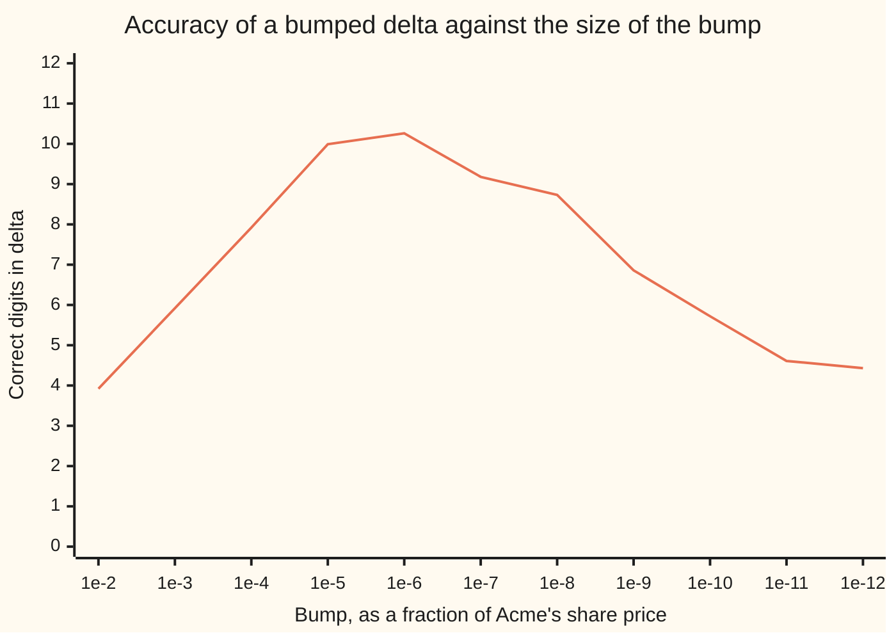

# Bump and revalue: shift an input, reprice, divide, and use the same random numbers both times

[Syllabus](../../../SYLLABUS.md) → [Financial mathematics](../README.md) → [Greeks by Numbers and Calibration](../README.md#s07) → Bump and revalue

---

## General Overview

Acme shares trade at 100 dollars today. A one-year option to buy one share for 100 dollars costs 9.23 dollars in the house market: bank rate 5 percent, dividend yield 2 percent, volatility 20 percent ([Black–Scholes call](../08-The%20Black-Scholes%20call%20and%20put/01-black-scholes-call.md)).

A desk that has sold that option needs one number above all: how much its price moves when Acme moves a dollar. That is **delta**, dollars of option per dollar of share, and also the number of Acme shares that cancels the option's risk. Here delta is 0.5869.

Sometimes a formula for delta exists. Very often it does not: the pricer is a simulation, a tree, or fifty thousand lines of somebody else's code. So do the obvious thing. Price it. Shift one input a little. Price it again. Divide the change in price by the shift.

Shift Acme to 101 dollars and the option is worth 9.823260 dollars — six decimals, because this method lives inside the difference between two nearly equal prices. Shift to 99 dollars and it is worth 8.649699. The difference is 1.173560 dollars across a 2-dollar gap, so the slope is 0.586780 against a true 0.586851: wrong in the fourth decimal. The pricer was called twice and never opened.

The shift is called the **bump**, and choosing its size is the whole difficulty. Too big, and the measured slope is the average across a wide stretch of a bending curve, not the slope at the point asked about. Too small, and the two prices agree in their leading digits, so subtracting throws those digits away and leaves only rounding.

**Nudge one input, reprice, and divide by the distance between the two prices asked for: the answer is a slope, and the size of the nudge trades a bending curve against a computer's last digits.**

**What kind of fact this is:** a method, with its error stated. Both halves of that error are derived in Why it works, on top of the Taylor expansion the calculus wing proves ([Numerical derivatives](../../06-Calculus%20and%20analysis/03-What%20Derivatives%20Tell%20You/08-numerical-derivatives-and-sensitivity.md)).

### The picture: how good the answer is, bump size by bump size

Across the bottom is the bump as a fraction of Acme's price: 1e-2 is a 1-dollar bump, 1e-6 a hundredth of a cent. Up the side is the count of **correct digits** in delta.



The single line is the bumped delta's accuracy, from the run below. Shrinking the bump buys **two** digits per decade up to a peak at one part in a million of the share price, ten digits right; past it, shrinking **loses** about a digit per decade, the answer being by then mostly rounding. There is no "as small as possible". There is a summit.

---

## The formula

Notation first, in words. $V$ is the pricer, so $V(S+h)$ means "run it with the share price moved to $S+h$, every other input untouched". $S$ is Acme's price today, 100 dollars; $h$ is the bump, in the same dollars. Each prime mark counts one more slope against the share price: one prime is delta, two is gamma, and three, written $V'''$, is the rate at which gamma changes.

$$\Delta \;\approx\; \frac{V(S+h) - V(S-h)}{2h}, \qquad \Gamma \;\approx\; \frac{V(S+h) - 2V(S) + V(S-h)}{h^{2}}$$

**Read it aloud:** price it a little above and a little below, then divide the difference by how far apart those prices were; for the second, ask by how much the up-move and the down-move fail to cancel.

The first is the **central difference**: both ways, over the full distance $2h$. Two one-sided cousins cost one extra pricer call instead of two: forward, $(V(S+h) - V(S))/h$, and backward, $(V(S) - V(S-h))/h$. Both are worse, by exactly the amount Why it works gives.

The error left in the central difference is two terms pulling opposite ways:

$$\text{error}(h) \;\approx\; \underbrace{\frac{h^{2}}{6}\bigl|V'''\bigr|}_{\text{the curve bends}} \;+\; \underbrace{\frac{\varepsilon\,|V|}{h}}_{\text{the digits run out}}$$

Setting the slope of that sum to zero, then rounding away what is specific to the pricer, gives a rule of thumb for a smooth one:

$$h^{*}_{\Delta} \approx \varepsilon^{1/3}\,S \approx 6.055\times10^{-4}\ \text{dollars}, \qquad h^{*}_{\Gamma} \approx \varepsilon^{1/4}\,S \approx 1.221\times10^{-2}\ \text{dollars}$$

**A cube root of the machine's smallest gap for a first slope, a fourth root for a second: one part in a million of the share price for delta, one part in ten thousand for gamma.**

| Symbol | Plain meaning | In our example | Push it up and the answer… |
| --- | --- | --- | --- |
| $V$ | the pricer: any code that turns inputs into a price | $V(100) = 9.227006$ dollars | carries a bigger rounding scrap |
| $S$ | the input being bumped, here Acme's price today | 100 dollars | needs a proportionally bigger bump |
| $h$ | the **bump**: how far the input is shifted, in its own units | 1 dollar, a 1 percent bump | gains bias; shrink it and it gains noise |
| $\Delta$ | **delta**: dollars of price per dollar of share | 0.586851 | is the answer |
| $\Gamma$ | **gamma**: how fast delta changes per dollar of share | 0.018951 | bends the curve harder, biasing any bump |
| $V'''$ | **speed**: how fast gamma changes per dollar of share | −0.000426 | biases even a two-sided bump |
| $\varepsilon$ | the smallest relative gap between stored numbers. Say "epsilon". | 2.220e-16 | means a noisier pricer, so a bigger best bump |
| $K$, $r$, $q$, $T$, $\sigma$ | strike, bank rate, dividend yield, years left, volatility | 100 dollars, 5%, 2%, 1, 20% | each can be bumped in its turn |
| $d_1$ | Acme's distance from the strike in wiggle units of $\sigma\sqrt{T}$, plus one such unit | 0.2500 | — |
| $N$, $\phi$ | the bell curve's area to the left of a point, and its height there | written out in the code | — |

Closed forms, used here only as a score to beat: delta is $e^{-qT}N(d_1)$, or 0.586851; gamma is $e^{-qT}\phi(d_1)/(S\sigma\sqrt{T})$, or 0.018951.

### When it holds

- **The pricer bends smoothly between the bumped inputs.** A kink or jump inside the bracket gives the slope of neither side. An option at expiry kinks exactly at the strike.
- **Nothing else changes between the two calls.** Same model, grid, dates, draws. Refit to market prices in between and the answer belongs to a refitted model: legitimate, but a different question.
- **Each price is right to about $\varepsilon|V|$.** For this nine-dollar option that scrap is 0.000000000000002 dollars. A simulation's error is its sampling wobble instead, more than ten million million times larger.
- **A simulated pricer reuses its draws.** Fresh numbers on the second leg bury the bump, and no affordable number of extra paths digs it out.
- **The payoff moves continuously with the input.** A payoff that jumps, such as a fixed sum paid above the strike, breaks shared draws and needs its own treatment ([Greeks inside the simulation](02-pathwise-and-likelihood-ratio-greeks.md)).

---

## Why it works

### Step 0: a slope over a short stretch stands in for the slope at a point

Delta is the slope of the price curve at one place: Acme at 100 dollars. A bump measures the slope of the straight line joining two points on that curve, at 99 and 101. They agree only if the curve is straight between them.

An option's price curve never is. Its bend is gamma, 0.018951 here. Every bumped answer therefore carries an error made of the bend, and the rest of this section either cancels that bend or measures what is left.

### Step 1: a one-sided bump is wrong by half a bump of gamma

Price up only: 9.823260 dollars at 101 against 9.227006 at 100. Over a 1-dollar bump that is 0.596254, too high by 0.009403. Half a bump of gamma is 0.009475 — the same number to within one percent. Bumping up catches the curve bending away on the upside, and the amount caught is half the bend times the bump.

Price down only: 8.649699 dollars at 99 gives 0.577306, too **low** by 0.009545. Same size, other sign. That symmetry is the next step.

### Step 2: bumping both ways makes the bend cancel

The central difference is exactly the average of the forward and backward slopes: the run prints 0.596254 and 0.577306, and their mean is 0.586780. Averaging a number too high by half a bump of gamma with one too low by the same leaves the bend behind.

What survives is the next bend along, the rate of change of gamma, which this library calls **speed**: −0.000426 here. The error left is one sixth of the bump squared times speed. At a 1-dollar bump that predicts −7.106e-05, and the actual miss is −7.103e-05. One extra pricer call turned an error of 0.009403 into one of 0.000071, a hundred and thirty times better.

Two things follow. The error now falls like the bump **squared**, so a decade of shrinking buys two digits. And adding the bumped prices instead of subtracting isolates the bend itself, which is where gamma's formula comes from.

<details>
<summary>Detailed proof: where both error terms come from</summary>

Write $V$, $\Delta$, $\Gamma$, $V'''$, $V''''$ for the price and its first four slopes at $S$. For a bump small enough that the price curve is smooth from $S-h$ to $S+h$, Taylor's theorem gives
$$V(S \pm h) = V \pm h\Delta + \tfrac12 h^{2}\Gamma \pm \tfrac16 h^{3}V''' + \tfrac1{24}h^{4}V'''' + \cdots$$
**One-sided.** Take the plus version, subtract $V$, divide by $h$:
$$\frac{V(S+h) - V(S)}{h} = \Delta + \tfrac12 h\Gamma + O(h^{2}).$$
The leading error is $\tfrac12 h\Gamma$, first order in the bump, so halving the bump only halves it. The minus version gives $-\tfrac12 h\Gamma$: same size, opposite sign.
**Central.** Subtract the two expansions from each other. Even powers of $h$ share a sign and cancel; odd powers double:
$$V(S+h) - V(S-h) = 2h\Delta + \tfrac13 h^{3}V''' + O(h^{5}).$$
Divide by $2h$:
$$\frac{V(S+h) - V(S-h)}{2h} = \Delta + \tfrac16 h^{2}V''' + O(h^{4}).$$
The $\Gamma$ term is gone. That cancellation is the whole reason the extra pricer call earns its keep.
**Gamma.** Add the expansions instead, and the odd powers cancel:
$$V(S+h) + V(S-h) = 2V + h^{2}\Gamma + \tfrac1{12}h^{4}V'''' + O(h^{6}),$$
so subtracting $2V$ and dividing by $h^{2}$ leaves $\Gamma + \tfrac1{12}h^{2}V''''$.
**Rounding.** Each stored price carries an error of at most about $\varepsilon|V|$, attached to the price rather than the difference, so it does not shrink when the bump does. Two land in the central numerator and are divided by $2h$: noise of about $\varepsilon|V|/h$. The gamma numerator carries up to four, divided by $h^{2}$: noise of about $4\varepsilon|V|/h^{2}$. Hence gamma's larger bump.

</details>

### Step 3: the digits run out, and dividing by a small number magnifies what is left

A computer keeps about sixteen significant digits, so a stored price is the true price plus a rounding scrap of about 0.000000000000002 dollars. At a 1-dollar bump the two prices differ by 1.173560 dollars and the scrap is invisible beside it. At a bump of a hundredth of a millionth of a dollar the two prices agree in their first nine digits; subtracting them destroys those nine, and the answer is built from what remains.

**Halving the bump halves the true content of the difference but leaves the scrap alone, so the noise doubles in relative terms.** In the run the error on that arm climbs 1.098e-09, 8.061e-08, 1.111e-06, 1.452e-05 as the bump falls by decades. At a bump of 1e-15 dollars the two bumped share prices are the *same stored number*: the prices are identical, the difference is exactly zero, and delta prints 0.000000.

### Step 4: balance the two arms and the best bump is a cube root

One arm falls like the bump squared, the other rises like one over the bump, so their sum falls, turns and rises. Setting the slope of $\tfrac16 h^2|V'''| + \varepsilon|V|/h$ to zero gives $\tfrac13 h|V'''| = \varepsilon|V|/h^{2}$, so

$$h^{*}_{\Delta} = \left(\frac{3\,\varepsilon\,|V|}{|V'''|}\right)^{1/3}.$$

For this option that is 2.434e-04 dollars against the sweep's best decade, 1.000e-04: a factor of two out, close enough for a rule about rounding. Replacing the unknown ratio of price to speed by the cube of the share price, right up to a modest constant for anything option-shaped, leaves 6.055e-04 dollars.

<details>
<summary>Why a cube root, and how many digits survive</summary>

Balancing the bump squared against one over the bump means solving "bump cubed is proportional to epsilon", which is where the cube root comes from. Putting that bump back in leaves a relative error of order epsilon to the two-thirds power, about 1e-11: two thirds of the machine's sixteen digits survive, and the run peaks at 10.26 digits.

A one-sided bump balances the bump against one over the bump, so its best goes as the square root of epsilon and only half the digits survive; gamma's goes as the fourth root, one part in ten thousand of the share price. The more prices a formula subtracts, the bigger the bump it needs.

</details>

### Step 5: a simulation's noise swamps the bump, unless both runs share their draws

Everything above assumed the pricer's error is the machine's rounding. The 200000-path run below prices this option at 9.220900 dollars, standard error 0.030879 — more than ten million million times worse than the scrap.

Reprice with **fresh** random numbers and the difference carries the noise of both legs, which dividing by $2h$ magnifies by one over the bump. At a one-cent bump that is a standard error of 2.187948 on a true value of 0.586851, and the run returns −2.866855. No reasonable number of extra paths rescues it.

**Use the same draws for both legs and the problem disappears.** Each simulated path is then the same path, started a little higher and a little lower, so the difference of its two payoffs is not the difference of two independent random things: it is the change in one thing. In the run the standard error barely moves as the bump falls from 5 dollars to one cent — 0.001223, 0.001271, 0.001282, 0.001283 — and at the smallest bump it is 1705.6 times tighter than fresh draws, for the cost of resetting the generator. It cannot run away, either: one path's two payoffs differ by at most the gap between its two starting prices times how far that path multiplied the share, so dividing by $2h$ has nothing left to magnify. That caps the standard error here at one over the square root of the path count, 0.002236, and the run comes in under it.

That trick is **common random numbers**, the phrase used from here on, and one line about spread explains it: the spread of a difference is the spread of one leg, plus the spread of the other, minus twice the amount the two move together. Independent draws make that last quantity zero; shared draws make it large and positive, so the subtraction cancels most of the wobble before the division can magnify it.

Push that to its limit — draws held fixed, bump shrunk to nothing — and each path's paired difference becomes a slope taken path by path. The run reports 0.586549 that way against 0.586548 from shared draws at a one-cent bump. Those being all but identical is the point, and the method that takes the limit properly is [Greeks inside the simulation](02-pathwise-and-likelihood-ratio-greeks.md).

---

## Worked numbers, by hand

The house market, bumped by 1 dollar: the bump a desk would type without thinking. Prices carry six decimals because the answer lives past the cent.

| Step | Arithmetic | Value |
| --- | --- | --- |
| price up | the pricer at 101 dollars | 9.823260 |
| price at the middle | the pricer at 100 dollars | 9.227006 |
| price down | the pricer at 99 dollars | 8.649699 |
| the difference | 9.823260 − 8.649699, on the pricer's full digits | 1.173560 |
| divide by the full gap, $2h = 2$ | 1.173560 / 2 | **0.586780** |
| the closed form, as a score | $e^{-qT}N(d_1)$ | 0.586851 |
| the miss | 0.586780 − 0.586851 | **−7.103e-05** |
| the miss, predicted | one sixth of $h^2$ times speed, −0.000426 / 6 | −7.106e-05 |

A lazy 1 percent bump already gives delta to within a ten-thousandth, tighter than any market quotes an option. **Central differences are forgiving. One-sided ones are not.** At the best bump, 1.000e-04 dollars, the same recipe gives 0.586851146167: 10.26 correct digits by the run's count.

The same three prices give gamma, by adding instead of subtracting. On the pricer's full digits $V(101) - 2V(100) + V(99)$ is 0.018947785514, and dividing by $h^2 = 1$ leaves it unchanged, against a closed-form 0.018951.

### What breaks if you drop a piece

Same option, correct delta 0.586851, correct gamma 0.018951.

| Mistake | Comes out at | What went wrong |
| --- | --- | --- |
| Divide by $h$ instead of $2h$ | 1.173560 | The prices are 2 dollars apart, not 1. Twice too big: a single call's delta cannot pass 1, but in a portfolio total nothing looks wrong |
| Bump one way only, same 1 dollar | 0.596254 | High by 0.009403, half a bump of gamma: the bend never cancelled |
| Bump half the share price, 50 dollars | 0.520280 | 11 percent low: the average slope from 50 to 150 dollars |
| Reuse the delta-sized bump for gamma | 0.035527 | Gamma divides the scrap by the bump *squared*, so this is nearly double the true 0.018951 |
| Fresh random numbers for the bumped leg | −2.866855 | Buried under the simulation's wobble, standard error 2.187948 |

Every number there is printed by the code below.

---

## How the answer moves as the bump shrinks

The mystery first. Shrink the bump from a dollar to a ten-thousandth of a dollar and delta gets six digits better. Shrink it by the same factor again and delta gets four and a half digits **worse**. Nothing about the option changed; the arithmetic did it. Two forces are at work, and the run separates them.

### Force one: the curve bends

While the bump is large the only error that matters is the leftover bend, which shrinks like the bump squared.

```
bump, as a fraction of the share price   correct digits in delta, one block = one digit
       1e-02   ████                                                      3.92
       1e-03   ██████                                                    5.92
       1e-04   ████████                                                  7.92
       1e-05   ██████████                                                9.99
```

Four digits, six, eight, ten: two steps per decade, the signature of an error proportional to the bump squared.

### Force two: the digits run out

Below the summit the bend is negligible, and what is left is the rounding scrap in two nearly equal prices, magnified by the division, growing like one over the bump.

```
bump, as a fraction of the share price   correct digits in delta, one block = one digit
       1e-08   █████████                                                 8.73
       1e-09   ███████                                                   6.86
       1e-10   ██████                                                    5.72
       1e-11   █████                                                     4.61
       1e-12   ████                                                      4.43
```

Nine digits, seven, six, five, four: the same staircase downhill, one step per decade. It is not perfectly regular, because the rounding in any one pair of prices is luck rather than law; the trend is the law. Together the staircases make the peaked curve in the General Overview.

---

## Code, from first principles, and it actually runs

Nothing below imports anything that already holds an answer: the bell-curve area is a series written out in full, and the random numbers come from an arithmetic generator written out in full. Delta is reached **four independent ways** — the closed form, a bumped reprice swept across eleven bump sizes, a 2000-step binomial tree that reads the slope off its own first two nodes with no bump at all, and a 200000-path simulation with shared draws. Neither the tree nor the simulation looks at the closed form. Gamma is swept too, and every wrong number above is reproduced.

### Python

```python
# Bump and revalue -- the check behind the card.  Standard library only, and
# nothing imported that already holds an answer: the bell-curve area is a series
# written out here, the random numbers come from an arithmetic generator written
# out here, and the tree and the simulation never look at the closed-form delta
# they are scored against.  Four roads reach the same delta, 0.586851.
from math import cos, exp, floor, log, log10, pi, sin, sqrt
EPS = 2.0 ** -52                                  # machine epsilon, 2.220e-16
S, K, R, Q, SIG, T = 100.0, 100.0, 0.05, 0.02, 0.20, 1.0
def phi(x): return exp(-0.5 * x * x) / sqrt(2.0 * pi)      # bell-curve height at x
def n_area(x):                                    # bell-curve area to the left of x
    if x < -8.0: return 0.0
    if x > 8.0: return 1.0
    term = total = x                              # x + x^3/3 + x^5/(3*5) + ...
    for k in range(1, 120):
        term *= x * x / (2 * k + 1)
        total += term
    return 0.5 + phi(x) * total
def d_one(s): return (log(s / K) + (R - Q + 0.5 * SIG * SIG) * T) / (SIG * sqrt(T))
def call(s):                                      # the pricer that gets bumped
    return (s * exp(-Q * T) * n_area(d_one(s))
            - K * exp(-R * T) * n_area(d_one(s) - SIG * sqrt(T)))
V0, D1 = call(S), d_one(S)
DELTA = exp(-Q * T) * n_area(D1)                  # closed-form delta, the score
GAMMA = exp(-Q * T) * phi(D1) / (S * SIG * sqrt(T))
SPEED = -GAMMA / S * (D1 / (SIG * sqrt(T)) + 1.0)          # third derivative
def central(h): return (call(S + h) - call(S - h)) / (2.0 * h)
def bump2(h): return (call(S + h) - 2.0 * V0 + call(S - h)) / (h * h)
def sci(v):                                       # one text shape in both languages
    e = int(floor(log10(abs(v))))
    return f"{v / 10.0 ** e:.3f}e{e:+03d}"
def line(label, v, extra=""): print(f"{label:<40}{v:>14.6f}   {extra}".rstrip())

print("--- 1. the score to beat: closed forms on the Acme call ---")
line("call price  V(100)", V0, f"d1 = {D1:.4f}")
line("delta   e^-qT N(d1)", DELTA)
line("gamma   e^-qT phi(d1) / (S sigma sqrtT)", GAMMA)
line("speed   dGamma/dS", SPEED, sci(SPEED))
print(f"{'machine epsilon':<40}{sci(EPS):>14}")
print("--- 2. delta by central difference, eleven bump sizes ---")
print(f"{'h':>10} {'h/S':>10}   {'central delta':>16} {'abs error':>11} {'digits right':>13}")
sweep = []
for k in range(0, 11):
    h = 10.0 ** -k
    est = central(h)
    sweep.append((h, est, abs(est - DELTA), -log10(abs(est - DELTA) / DELTA)))
    print(f"{sci(h):>10} {sci(h / S):>10}   {est:>16.12f} "
          f"{sci(sweep[-1][2]):>11} {sweep[-1][3]:>13.2f}")
h_best, est_best, err_best, dig_best = min(sweep, key=lambda t: t[2])
print(f"best bump {sci(h_best)}, error {sci(err_best)}; rule of thumb eps^(1/3) S = "
      f"{sci(EPS ** (1.0 / 3.0) * S)}; predicted {sci((3.0 * EPS * V0 / abs(SPEED)) ** (1.0 / 3.0))}")
line("at h = 1e-15 the bumped prices collide", central(1e-15), "so delta comes out exactly zero")
print("--- 3. one-sided against two-sided, bump h = 1 dollar ---")
up, dn = call(S + 1.0), call(S - 1.0)
fwd, bwd, cen = up - V0, V0 - dn, central(1.0)
print(f"{'V(101), V(100), V(99)':<40}{up:>14.6f}{V0:>12.6f}{dn:>12.6f}")
line("forward   (V(101)-V(100))/h", fwd, "error " + sci(fwd - DELTA))
line("backward  (V(100)-V(99))/h", bwd, "error " + sci(bwd - DELTA))
line("central   (V(101)-V(99))/(2h)", cen, "error " + sci(cen - DELTA))
line("predicted one-sided bias  h Gamma/2", GAMMA / 2.0, "central " + sci(SPEED / 6.0))
bars = [1000.0 * ((call(S + h) - V0) / h - DELTA) for h in (10.0, 4.0, 2.0, 1.0)]
print("one-sided error x 1000, h = 10, 4, 2, 1:" + "".join(f"{b:>8.1f}" for b in bars))
print("--- 4. gamma by bump of bump ---")
print(f"{'h':>10}   {'gamma':>16} {'abs error':>11}")
grows = []
for h in (1.0, 0.1, 0.01, 1e-4, 1e-6):
    grows.append((h, bump2(h), abs(bump2(h) - GAMMA)))
    print(f"{sci(h):>10}   {grows[-1][1]:>16.12f} {sci(grows[-1][2]):>11}")
gh, g_best, gerr = min(grows, key=lambda t: t[2])
print(f"best bump {sci(gh)}, error {sci(gerr)}; rule of thumb eps^(1/4) S = {sci(EPS ** 0.25 * S)}")
def tree(steps):                                  # road three: no bump anywhere
    dt = T / steps
    u = exp(SIG * sqrt(dt)); d = 1.0 / u
    p = (exp((R - Q) * dt) - d) / (u - d); disc = exp(-R * dt)
    v = [max(S * u ** j * d ** (steps - j) - K, 0.0) for j in range(steps + 1)]
    for n in range(steps, 1, -1):
        v = [disc * (p * v[j + 1] + (1.0 - p) * v[j]) for j in range(n)]
    return disc * (p * v[1] + (1.0 - p) * v[0]), (v[1] - v[0]) / (S * u - S * d)
print("--- 5. a road with no bump at all: a 2000-step binomial tree ---")
t_price, t_delta = tree(2000)
line("tree price, 2000 steps", t_price, f"formula {V0:.6f}")
line("tree delta from the two step-1 nodes", t_delta, f"formula {DELTA:.6f}")
NP, MODULUS = 200000, 1 << 32
def draws(seed):                                  # own generator, then Box-Muller
    st, out = seed, []
    for _ in range(NP // 2):
        st = (1664525 * st + 1013904223) % MODULUS; u = (st + 0.5) / MODULUS
        st = (1664525 * st + 1013904223) % MODULUS; v = (st + 0.5) / MODULUS
        rad = sqrt(-2.0 * log(u)); ang = 2.0 * pi * v
        out.append(rad * cos(ang)); out.append(rad * sin(ang))
    return out
DISC, DRIFT, VOL = exp(-R * T), (R - Q - 0.5 * SIG * SIG) * T, SIG * sqrt(T)
def grow(seed): return [exp(DRIFT + VOL * z) for z in draws(seed)]
A, B, C = grow(20260919), grow(777), grow(4242)   # A is shared; B and C are fresh
def pay(x, a): return DISC * max(x * a - K, 0.0)  # one path's discounted payoff
def stats(xs):                                    # mean and standard error, added in order
    t = 0.0
    for x in xs: t += x
    m = t / NP
    t = 0.0
    for x in xs: t += (x - m) * (x - m)
    return m, sqrt(t / (NP - 1) / NP)
def shared(h): return stats([(pay(S + h, a) - pay(S - h, a)) / (2.0 * h) for a in A])
def fresh(h):
    u, su = stats([pay(S + h, b) for b in B])
    d, sd = stats([pay(S - h, c) for c in C])
    return (u - d) / (2.0 * h), sqrt(su * su + sd * sd) / (2.0 * h)
print("--- 6. a road through simulation: 200000 paths, shared and fresh draws ---")
mc_p, mc_se = stats([pay(S, a) for a in A])
line("simulated price", mc_p, f"+/- {mc_se:.6f}, shared-draw se ceiling {1.0 / sqrt(NP):.6f}")
print(f"{'h':>6} {'shared delta':>14} {'shared se':>11} "
      f"{'fresh delta':>13} {'fresh se':>11} {'se ratio':>10}")
mc = []
for h in (5.0, 1.0, 0.1, 0.01):
    (sdd, ss), (fd, fs) = shared(h), fresh(h)
    mc.append((h, sdd, ss, fd, fs))
    print(f"{h:>6.2f} {sdd:>14.6f} {ss:>11.6f} {fd:>13.6f} {fs:>11.6f} {fs / ss:>10.1f}")
pw, pw_se = stats([DISC * a if S * a > K else 0.0 for a in A])
line("pathwise delta, no bump at all", pw, f"+/- {pw_se:.6f}")
print("--- 7. what breaks ---")
line("divide by h, not 2h", up - dn, "twice the true delta")
line("one-sided bump at h = 1", fwd, "bias " + sci(fwd - DELTA))
line("bump half the spot, h = 50", central(50.0), "11 percent low")
line("delta-sized bump for gamma, h = 1e-06", bump2(1e-6), f"gamma is {GAMMA:.6f}")
assert abs(V0 - 9.227005508154) < 1e-9,               "the pricer reproduces the house call price"
assert abs(DELTA - 0.586851146135) < 1e-9,            "closed-form delta, the shelf's number"
assert abs(GAMMA - 0.018950578755) < 1e-9,            "closed-form gamma, the shelf's number"
assert abs((cen - DELTA) - SPEED / 6.0) < 0.02 * abs(SPEED / 6.0), "central bias is h^2 V'''/6"
assert abs((fwd - DELTA) - GAMMA / 2.0) < 0.02 * GAMMA / 2.0, "one-sided bias is half a bump of gamma"
assert abs(cen - DELTA) < abs(fwd - DELTA) / 100.0,   "two-sided beats one-sided a hundredfold"
assert abs(g_best - GAMMA) < 1e-8,                    "bumped gamma at its best bump matches the formula"
assert err_best < abs(central(10.0) - DELTA) / 1e4,   "left arm: a huge bump is far worse"
assert err_best < abs(central(1e-10) - DELTA) / 1e4,  "right arm: a tiny bump is far worse"
assert central(1e-15) == 0.0,                         "at h = 1e-15 the bumped prices are one number"
assert gh > 1e-3,                                     "gamma's best bump is far bigger than delta's"
assert abs(t_price - V0) < 0.01,                      "tree price within a cent of the formula"
assert abs(t_delta - DELTA) < 2e-4,                   "tree delta, read off nodes, matches the formula"
assert abs(mc[3][1] - DELTA) < 3.0 * mc[3][2],        "shared-draw delta within three standard errors"
assert mc[3][4] > 100.0 * mc[3][2],                   "fresh draws are 100x noisier at h = 0.01"
assert abs(pw - DELTA) < 3.0 * pw_se,                 "pathwise delta within three standard errors"
print("ALL CHECKS PASS")
```

**Ran 2026-09-19 on macOS, Python 3.14.6, standard library only. All checks passed. Output, pasted from the run:**

```
--- 1. the score to beat: closed forms on the Acme call ---
call price  V(100)                            9.227006   d1 = 0.2500
delta   e^-qT N(d1)                           0.586851
gamma   e^-qT phi(d1) / (S sigma sqrtT)       0.018951
speed   dGamma/dS                            -0.000426   -4.264e-04
machine epsilon                              2.220e-16
--- 2. delta by central difference, eleven bump sizes ---
         h        h/S      central delta   abs error  digits right
 1.000e+00  1.000e-02     0.586780115041   7.103e-05          3.92
 1.000e-01  1.000e-03     0.586850435491   7.106e-07          5.92
 1.000e-02  1.000e-04     0.586851139029   7.106e-09          7.92
 1.000e-03  1.000e-05     0.586851146075   6.006e-11          9.99
 1.000e-04  1.000e-06     0.586851146167   3.231e-11         10.26
 1.000e-05  1.000e-07     0.586851146522   3.876e-10          9.18
 1.000e-06  1.000e-08     0.586851147233   1.098e-09          8.73
 1.000e-07  1.000e-09     0.586851065520   8.061e-08          6.86
 1.000e-08  1.000e-10     0.586850035234   1.111e-06          5.72
 1.000e-09  1.000e-11     0.586865667174   1.452e-05          4.61
 1.000e-10  1.000e-12     0.586872772601   2.163e-05          4.43
best bump 1.000e-04, error 3.231e-11; rule of thumb eps^(1/3) S = 6.055e-04; predicted 2.434e-04
at h = 1e-15 the bumped prices collide        0.000000   so delta comes out exactly zero
--- 3. one-sided against two-sided, bump h = 1 dollar ---
V(101), V(100), V(99)                         9.823260    9.227006    8.649699
forward   (V(101)-V(100))/h                   0.596254   error 9.403e-03
backward  (V(100)-V(99))/h                    0.577306   error -9.545e-03
central   (V(101)-V(99))/(2h)                 0.586780   error -7.103e-05
predicted one-sided bias  h Gamma/2           0.009475   central -7.106e-05
one-sided error x 1000, h = 10, 4, 2, 1:    86.6    36.7    18.7     9.4
--- 4. gamma by bump of bump ---
         h              gamma   abs error
 1.000e+00     0.018947785514   2.793e-06
 1.000e-01     0.018950550823   2.793e-08
 1.000e-02     0.018950578635   1.198e-10
 1.000e-04     0.018951595848   1.017e-06
 1.000e-06     0.035527136788   1.658e-02
best bump 1.000e-02, error 1.198e-10; rule of thumb eps^(1/4) S = 1.221e-02
--- 5. a road with no bump at all: a 2000-step binomial tree ---
tree price, 2000 steps                        9.226034   formula 9.227006
tree delta from the two step-1 nodes          0.586845   formula 0.586851
--- 6. a road through simulation: 200000 paths, shared and fresh draws ---
simulated price                               9.220900   +/- 0.030879, shared-draw se ceiling 0.002236
     h   shared delta   shared se   fresh delta    fresh se   se ratio
  5.00       0.584708    0.001223      0.578682    0.004419        3.6
  1.00       0.586502    0.001271      0.552722    0.021888       17.2
  0.10       0.586507    0.001282      0.241862    0.218795      170.7
  0.01       0.586548    0.001283     -2.866855    2.187948     1705.6
pathwise delta, no bump at all                0.586549   +/- 0.001283
--- 7. what breaks ---
divide by h, not 2h                           1.173560   twice the true delta
one-sided bump at h = 1                       0.596254   bias 9.403e-03
bump half the spot, h = 50                    0.520280   11 percent low
delta-sized bump for gamma, h = 1e-06         0.035527   gamma is 0.018951
ALL CHECKS PASS
```

### Rust

Same inputs, same labels, no crates. The series, the generator, the tree and the simulation are written out again rather than shared.

```rust
// Bump and revalue -- the same check as the Python, in Rust, std only, no crates.
// Nothing here already holds an answer: the bell-curve area is a series written
// out below, the random numbers come from an arithmetic generator written out
// below, and the tree and the simulation never look at the closed-form delta
// they are scored against.  Four roads reach the same delta, 0.586851.
use std::f64::consts::PI;
const EPS: f64 = f64::EPSILON;                    // machine epsilon, 2.220e-16
const S: f64 = 100.0; const K: f64 = 100.0; const R: f64 = 0.05; const Q: f64 = 0.02;
const SIG: f64 = 0.20; const T: f64 = 1.0;
const NP: usize = 200000; const MODULUS: u64 = 1 << 32;
fn phi(x: f64) -> f64 { (-0.5 * x * x).exp() / (2.0 * PI).sqrt() }   // height at x
fn n_area(x: f64) -> f64 {                        // bell-curve area to the left of x
    if x < -8.0 { return 0.0; }
    if x > 8.0 { return 1.0; }
    let (mut term, mut total) = (x, x);            // x + x^3/3 + x^5/(3*5) + ...
    for k in 1..120 { term *= x * x / (2.0 * k as f64 + 1.0); total += term; }
    0.5 + phi(x) * total
}
fn d_one(s: f64) -> f64 { ((s / K).ln() + (R - Q + 0.5 * SIG * SIG) * T) / (SIG * T.sqrt()) }
fn call(s: f64) -> f64 {                          // the pricer that gets bumped
    s * (-Q * T).exp() * n_area(d_one(s))
        - K * (-R * T).exp() * n_area(d_one(s) - SIG * T.sqrt())
}
fn central(h: f64) -> f64 { (call(S + h) - call(S - h)) / (2.0 * h) }
fn bump2(h: f64, v0: f64) -> f64 { (call(S + h) - 2.0 * v0 + call(S - h)) / (h * h) }
fn sci(v: f64) -> String {                        // one text shape in both languages
    let e = v.abs().log10().floor() as i32;
    format!("{:.3}e{}{:02}", v / 10f64.powf(e as f64),
            if e < 0 { '-' } else { '+' }, e.abs())
}
fn line(label: &str, v: f64, extra: &str) {
    println!("{}", format!("{:<40}{:>14.6}   {}", label, v, extra).trim_end());
}
fn tree(steps: usize) -> (f64, f64) {             // road three: no bump anywhere
    let dt = T / steps as f64;
    let u = (SIG * dt.sqrt()).exp(); let d = 1.0 / u;
    let p = (((R - Q) * dt).exp() - d) / (u - d); let disc = (-R * dt).exp();
    let mut v: Vec<f64> = (0..=steps)
        .map(|j| (S * u.powf(j as f64) * d.powf((steps - j) as f64) - K).max(0.0))
        .collect();
    for n in (2..=steps).rev() {
        v = (0..n).map(|j| disc * (p * v[j + 1] + (1.0 - p) * v[j])).collect();
    }
    (disc * (p * v[1] + (1.0 - p) * v[0]), (v[1] - v[0]) / (S * u - S * d))
}
fn draws(seed: u64) -> Vec<f64> {                 // own generator, then Box-Muller
    let (mut st, mut out) = (seed, Vec::new());
    for _ in 0..NP / 2 {
        st = (1664525 * st + 1013904223) % MODULUS;
        let u = (st as f64 + 0.5) / MODULUS as f64;
        st = (1664525 * st + 1013904223) % MODULUS;
        let v = (st as f64 + 0.5) / MODULUS as f64;
        let rad = (-2.0 * u.ln()).sqrt(); let ang = 2.0 * PI * v;
        out.push(rad * ang.cos()); out.push(rad * ang.sin());
    }
    out
}
fn stats(xs: &[f64]) -> (f64, f64) {              // mean and standard error, added in order
    let mut t = 0.0;
    for x in xs { t += x; }
    let m = t / NP as f64;
    t = 0.0;
    for x in xs { t += (x - m) * (x - m); }
    (m, (t / (NP - 1) as f64 / NP as f64).sqrt())
}
fn main() {
    let (v0, d1) = (call(S), d_one(S));
    let delta = (-Q * T).exp() * n_area(d1);       // closed-form delta, the score
    let gamma = (-Q * T).exp() * phi(d1) / (S * SIG * T.sqrt());
    let speed = -gamma / S * (d1 / (SIG * T.sqrt()) + 1.0);   // third derivative
    println!("--- 1. the score to beat: closed forms on the Acme call ---");
    line("call price  V(100)", v0, &format!("d1 = {:.4}", d1));
    line("delta   e^-qT N(d1)", delta, "");
    line("gamma   e^-qT phi(d1) / (S sigma sqrtT)", gamma, "");
    line("speed   dGamma/dS", speed, &sci(speed));
    println!("{:<40}{:>14}", "machine epsilon", sci(EPS));
    println!("--- 2. delta by central difference, eleven bump sizes ---");
    println!("{:>10} {:>10}   {:>16} {:>11} {:>13}", "h", "h/S", "central delta", "abs error", "digits right");
    let steps = [1.0, 0.1, 0.01, 1e-3, 1e-4, 1e-5, 1e-6, 1e-7, 1e-8, 1e-9, 1e-10];
    let mut sweep: Vec<(f64, f64, f64, f64)> = Vec::new();
    for h in steps {
        let est = central(h);
        let err = (est - delta).abs();
        sweep.push((h, est, err, -(err / delta).log10()));
        println!("{:>10} {:>10}   {:>16.12} {:>11} {:>13.2}", sci(h), sci(h / S), est, sci(err), -(err / delta).log10());
    }
    let best = sweep.iter().fold(sweep[0], |a, &b| if b.2 < a.2 { b } else { a });
    println!("best bump {}, error {}; rule of thumb eps^(1/3) S = {}; predicted {}",
             sci(best.0), sci(best.2), sci(EPS.powf(1.0 / 3.0) * S),
             sci((3.0 * EPS * v0 / speed.abs()).powf(1.0 / 3.0)));
    line("at h = 1e-15 the bumped prices collide", central(1e-15), "so delta comes out exactly zero");
    println!("--- 3. one-sided against two-sided, bump h = 1 dollar ---");
    let (up, dn) = (call(S + 1.0), call(S - 1.0));
    let (fwd, bwd, cen) = (up - v0, v0 - dn, central(1.0));
    println!("{:<40}{:>14.6}{:>12.6}{:>12.6}", "V(101), V(100), V(99)", up, v0, dn);
    line("forward   (V(101)-V(100))/h", fwd, &format!("error {}", sci(fwd - delta)));
    line("backward  (V(100)-V(99))/h", bwd, &format!("error {}", sci(bwd - delta)));
    line("central   (V(101)-V(99))/(2h)", cen, &format!("error {}", sci(cen - delta)));
    line("predicted one-sided bias  h Gamma/2", gamma / 2.0, &format!("central {}", sci(speed / 6.0)));
    let mut bars = String::from("one-sided error x 1000, h = 10, 4, 2, 1:");
    for h in [10.0, 4.0, 2.0, 1.0] {
        bars.push_str(&format!("{:>8.1}", 1000.0 * ((call(S + h) - v0) / h - delta)));
    }
    println!("{}", bars);
    println!("--- 4. gamma by bump of bump ---");
    println!("{:>10}   {:>16} {:>11}", "h", "gamma", "abs error");
    let mut grows: Vec<(f64, f64, f64)> = Vec::new();
    for h in [1.0, 0.1, 0.01, 1e-4, 1e-6] {
        grows.push((h, bump2(h, v0), (bump2(h, v0) - gamma).abs()));
        let g = grows[grows.len() - 1];
        println!("{:>10}   {:>16.12} {:>11}", sci(h), g.1, sci(g.2));
    }
    let gbest = grows.iter().fold(grows[0], |a, &b| if b.2 < a.2 { b } else { a });
    println!("best bump {}, error {}; rule of thumb eps^(1/4) S = {}",
             sci(gbest.0), sci(gbest.2), sci(EPS.powf(0.25) * S));
    println!("--- 5. a road with no bump at all: a 2000-step binomial tree ---");
    let (t_price, t_delta) = tree(2000);
    line("tree price, 2000 steps", t_price, &format!("formula {:.6}", v0));
    line("tree delta from the two step-1 nodes", t_delta, &format!("formula {:.6}", delta));
    let (disc, drift, vol) = ((-R * T).exp(), (R - Q - 0.5 * SIG * SIG) * T, SIG * T.sqrt());
    let grow = |seed: u64| -> Vec<f64> { draws(seed).iter().map(|z| (drift + vol * z).exp()).collect() };
    let (a, b, c) = (grow(20260919), grow(777), grow(4242));   // a shared; b, c fresh
    let pay = |x: f64, m: f64| disc * (x * m - K).max(0.0);     // one path's payoff
    let shared = |h: f64| -> (f64, f64) {
        stats(&a.iter().map(|m| (pay(S + h, *m) - pay(S - h, *m)) / (2.0 * h)).collect::<Vec<f64>>())
    };
    let fresh = |h: f64| -> (f64, f64) {
        let (u, su) = stats(&b.iter().map(|m| pay(S + h, *m)).collect::<Vec<f64>>());
        let (d, sd) = stats(&c.iter().map(|m| pay(S - h, *m)).collect::<Vec<f64>>());
        ((u - d) / (2.0 * h), (su * su + sd * sd).sqrt() / (2.0 * h))
    };
    println!("--- 6. a road through simulation: 200000 paths, shared and fresh draws ---");
    let (mc_p, mc_se) = stats(&a.iter().map(|m| pay(S, *m)).collect::<Vec<f64>>());
    line("simulated price", mc_p, &format!("+/- {:.6}, shared-draw se ceiling {:.6}", mc_se, 1.0 / (NP as f64).sqrt()));
    println!("{:>6} {:>14} {:>11} {:>13} {:>11} {:>10}",
             "h", "shared delta", "shared se", "fresh delta", "fresh se", "se ratio");
    let mut mc: Vec<(f64, f64, f64, f64, f64)> = Vec::new();
    for h in [5.0, 1.0, 0.1, 0.01] {
        let ((sdd, ss), (fd, fs)) = (shared(h), fresh(h));
        mc.push((h, sdd, ss, fd, fs));
        println!("{:>6.2} {:>14.6} {:>11.6} {:>13.6} {:>11.6} {:>10.1}", h, sdd, ss, fd, fs, fs / ss);
    }
    let (pw, pw_se) = stats(&a.iter().map(|m| if S * m > K { disc * m } else { 0.0 }).collect::<Vec<f64>>());
    line("pathwise delta, no bump at all", pw, &format!("+/- {:.6}", pw_se));
    println!("--- 7. what breaks ---");
    line("divide by h, not 2h", up - dn, "twice the true delta");
    line("one-sided bump at h = 1", fwd, &format!("bias {}", sci(fwd - delta)));
    line("bump half the spot, h = 50", central(50.0), "11 percent low");
    line("delta-sized bump for gamma, h = 1e-06", bump2(1e-6, v0), &format!("gamma is {:.6}", gamma));
    assert!((v0 - 9.227005508154).abs() < 1e-9, "the pricer reproduces the house call price");
    assert!((delta - 0.586851146135).abs() < 1e-9, "closed-form delta, the shelf's number");
    assert!((gamma - 0.018950578755).abs() < 1e-9, "closed-form gamma, the shelf's number");
    assert!(((cen - delta) - speed / 6.0).abs() < 0.02 * (speed / 6.0).abs(), "central bias is h^2 V'''/6");
    assert!(((fwd - delta) - gamma / 2.0).abs() < 0.02 * gamma / 2.0, "one-sided bias is half a bump of gamma");
    assert!((cen - delta).abs() < (fwd - delta).abs() / 100.0, "two-sided beats one-sided a hundredfold");
    assert!((gbest.1 - gamma).abs() < 1e-8, "bumped gamma at its best bump matches the formula");
    assert!(best.2 < (central(10.0) - delta).abs() / 1e4, "left arm: a huge bump is far worse");
    assert!(best.2 < (central(1e-10) - delta).abs() / 1e4, "right arm: a tiny bump is far worse");
    assert!(central(1e-15) == 0.0, "at h = 1e-15 the bumped prices are one number");
    assert!(gbest.0 > 1e-3, "gamma's best bump is far bigger than delta's");
    assert!((t_price - v0).abs() < 0.01, "tree price within a cent of the formula");
    assert!((t_delta - delta).abs() < 2e-4, "tree delta, read off nodes, matches the formula");
    assert!((mc[3].1 - delta).abs() < 3.0 * mc[3].2, "shared-draw delta within three standard errors");
    assert!(mc[3].4 > 100.0 * mc[3].2, "fresh draws are 100x noisier at h = 0.01");
    assert!((pw - delta).abs() < 3.0 * pw_se, "pathwise delta within three standard errors");
    println!("ALL CHECKS PASS");
}
```

**Ran 2026-09-19 on macOS, rustc 1.98.1, no crates. All checks passed. Output, pasted from the run:**

```
--- 1. the score to beat: closed forms on the Acme call ---
call price  V(100)                            9.227006   d1 = 0.2500
delta   e^-qT N(d1)                           0.586851
gamma   e^-qT phi(d1) / (S sigma sqrtT)       0.018951
speed   dGamma/dS                            -0.000426   -4.264e-04
machine epsilon                              2.220e-16
--- 2. delta by central difference, eleven bump sizes ---
         h        h/S      central delta   abs error  digits right
 1.000e+00  1.000e-02     0.586780115041   7.103e-05          3.92
 1.000e-01  1.000e-03     0.586850435491   7.106e-07          5.92
 1.000e-02  1.000e-04     0.586851139029   7.106e-09          7.92
 1.000e-03  1.000e-05     0.586851146075   6.006e-11          9.99
 1.000e-04  1.000e-06     0.586851146167   3.231e-11         10.26
 1.000e-05  1.000e-07     0.586851146522   3.876e-10          9.18
 1.000e-06  1.000e-08     0.586851147233   1.098e-09          8.73
 1.000e-07  1.000e-09     0.586851065520   8.061e-08          6.86
 1.000e-08  1.000e-10     0.586850035234   1.111e-06          5.72
 1.000e-09  1.000e-11     0.586865667174   1.452e-05          4.61
 1.000e-10  1.000e-12     0.586872772601   2.163e-05          4.43
best bump 1.000e-04, error 3.231e-11; rule of thumb eps^(1/3) S = 6.055e-04; predicted 2.434e-04
at h = 1e-15 the bumped prices collide        0.000000   so delta comes out exactly zero
--- 3. one-sided against two-sided, bump h = 1 dollar ---
V(101), V(100), V(99)                         9.823260    9.227006    8.649699
forward   (V(101)-V(100))/h                   0.596254   error 9.403e-03
backward  (V(100)-V(99))/h                    0.577306   error -9.545e-03
central   (V(101)-V(99))/(2h)                 0.586780   error -7.103e-05
predicted one-sided bias  h Gamma/2           0.009475   central -7.106e-05
one-sided error x 1000, h = 10, 4, 2, 1:    86.6    36.7    18.7     9.4
--- 4. gamma by bump of bump ---
         h              gamma   abs error
 1.000e+00     0.018947785514   2.793e-06
 1.000e-01     0.018950550823   2.793e-08
 1.000e-02     0.018950578635   1.198e-10
 1.000e-04     0.018951595848   1.017e-06
 1.000e-06     0.035527136788   1.658e-02
best bump 1.000e-02, error 1.198e-10; rule of thumb eps^(1/4) S = 1.221e-02
--- 5. a road with no bump at all: a 2000-step binomial tree ---
tree price, 2000 steps                        9.226034   formula 9.227006
tree delta from the two step-1 nodes          0.586845   formula 0.586851
--- 6. a road through simulation: 200000 paths, shared and fresh draws ---
simulated price                               9.220900   +/- 0.030879, shared-draw se ceiling 0.002236
     h   shared delta   shared se   fresh delta    fresh se   se ratio
  5.00       0.584708    0.001223      0.578682    0.004419        3.6
  1.00       0.586502    0.001271      0.552722    0.021888       17.2
  0.10       0.586507    0.001282      0.241862    0.218795      170.7
  0.01       0.586548    0.001283     -2.866855    2.187948     1705.6
pathwise delta, no bump at all                0.586549   +/- 0.001283
--- 7. what breaks ---
divide by h, not 2h                           1.173560   twice the true delta
one-sided bump at h = 1                       0.596254   bias 9.403e-03
bump half the spot, h = 50                    0.520280   11 percent low
delta-sized bump for gamma, h = 1e-06         0.035527   gamma is 0.018951
ALL CHECKS PASS
```

Four roads, one delta: the tree lands 0.000006 from the closed form having never taken a difference of prices, and the simulation 0.000303 away, inside its own standard error of 0.001283. The two outputs agree digit for digit, including the ragged right-hand arm where the numbers are almost pure rounding — both programs use the machine's own exponential and logarithm, and add their sums in the same order.

> [!TIP]
> **Try changing**
> Guess the direction first, then run it. An assert is a line that stops the program when a number comes out wrong, and these are pinned to this option, so expect one to fire.
> - **Bump volatility instead of the share price.** Give `central` a pricer that holds the share price at 100 and shifts `SIG`. The answer is vega, and the cube-root rule still applies — sized to the input bumped, so one part in a million of 0.20, not of 100.
> - **Price a one-week option.** Set `T` to `1.0 / 52.0`. Gamma rises several-fold, because a short-dated option bends hard near the strike, so the same 1-dollar bump is far more biased.
> - **Move to an index at 5000 with the same 1-dollar bump.** Set `S` and `K` to `5000.0`. One dollar is now one five-thousandth of the input, so the bumped delta gains digits for nothing. Size a bump as a fraction of the input.
> - **Take the shared draws away.** In `shared`, walk `A` and `B` together and use `pay(S - h, b)` for the down leg. The standard error stops being flat and grows like one over the bump.

---

## The usual mistake

> [!warning]
> **Believing a smaller bump is always a more accurate bump.** It is the natural instinct and what calculus seems to promise, and past the summit it is wrong: shrinking the bump from 1.000e-04 to 1.000e-10 dollars pushes the error from 3.231e-11 to 2.163e-05, about seven hundred thousand times worse, and a few decades further down the answer is exactly zero. A Greek that comes back suspiciously round, or zero, is a bump-size question first.
>
> - **Dividing by the bump instead of twice the bump.** The commonest typo in bump code, and the nastiest: 1.173560 has the shape of a delta, and in a portfolio total, where nothing caps it at 1, nothing looks wrong. Every hedge is then twice the size it should be.
> - **A fixed dollar bump.** One dollar is 1 percent of a 100-dollar share, one fiftieth of that on a 5000-point index, and a catastrophe on a penny stock.
> - **Reusing the delta bump for gamma.** It needs one part in ten thousand, not one in a million: at a millionth of a dollar gamma comes out 0.035527 instead of 0.018951.
> - **Re-seeding a simulation between the calls.** The answer becomes two independent random numbers subtracted and divided by something tiny: −2.866855 instead of 0.586851.
> - **Expecting common random numbers to rescue everything.** A payoff that jumps — a fixed sum paid only above the strike — gives paired differences almost all exactly zero and a rare few enormous, so its noise *grows* as the bump shrinks.
> - **Bumping without deciding about calibration.** Moving an input with fitted parameters held fixed, and moving it with a refit, are different numbers and honest answers to different questions ([Calibration](06-calibration-as-least-squares.md)).

---

## Where you meet it in real life

- **A bank's overnight risk run.** Millions of bump-and-revalue calls, which is why bump size, seed policy and bump convention live in a document people argue over.
- **Anything exotic.** Barriers, Asians, autocallables and most structured notes have no closed-form Greek, so bumping is not a shortcut but the method. Where there are a thousand inputs and speed matters, [Adjoint differentiation](03-adjoint-differentiation-in-outline.md) is the alternative.
- **Testing a formula that already exists.** A wrong hand-derived Greek and a right one look identical until one is bump-tested, which the run's third block does.
- **Trees and grids.** A lattice hands over delta and gamma free, off its own early nodes. Volatility and rates are baked into its geometry, so those still need a bump ([Greeks from a tree or grid](04-greeks-from-a-tree-or-grid.md)).
- **Solving a price backwards for its volatility.** Newton's method needs vega, and a bumped vega lets the bump size decide how many steps the solver takes, or whether it converges ([Solving backwards](05-root-finding-for-inverses.md)).
- **Well outside finance.** The same cube-root rule governs numerical gradients in optimisation, sensitivity studies in engineering, and gradient checks on hand-written machine-learning code.

> **Say it back**
> To get a sensitivity out of a pricer that cannot be differentiated on paper, price it a little above and a little below the input and divide by the distance between those prices. Bump both ways: the one-sided errors are equal and opposite, so averaging them cancels the price curve's bend. Then size the bump on purpose — too big and the bend bites, too small and the prices differ only in the digits the computer rounded away. About one part in a million of the input for a first slope, one part in ten thousand for a second. And if the pricer is a simulation, feed both calls the same random numbers, or the answer is noise.

---

## What this builds on

- [Monte Carlo pricing](../06-Numerical%20Methods%20for%20Pricing/01-monte-carlo-pricing.md): a price built by averaging a payoff over simulated paths, and the standard error that comes with it. This card bumps that pricer and fights its noise.
- [Numerical derivatives](../../06-Calculus%20and%20analysis/03-What%20Derivatives%20Tell%20You/08-numerical-derivatives-and-sensitivity.md): the Taylor expansion behind both error terms, and why dividing a small difference by a small number magnifies the rounding inside it.

## Where this goes next

- [Greeks inside the simulation](02-pathwise-and-likelihood-ratio-greeks.md): the bump taken to zero properly, inside the simulation.
- Bumping a simulated price: the same bump-against-noise problem as numerical analysis.
- [Greeks under jumps](../13-Local%20volatility%20and%20jumps/05-merton-greeks-hedge-error-and-calibration.md): bumping a price that can jump, where smoothness needs care.
- [Heston Greeks and calibration](../14-Stochastic%20volatility%20-%20Heston%2C%20SABR%20and%20their%20mix/03-heston-greeks-and-calibration.md): bumping a model with a volatility of its own to bump.
- [American Greeks and implied volatility](../15-American%20and%20Bermudan%20exercise/07-american-greeks-and-implied-volatility.md): bumping a price that also depends on an exercise decision.
- [Barrier Greeks](../16-Barriers%2C%20touches%20and%20lookbacks/04-barrier-greeks-at-the-wall.md): a bump that straddles a wall the price jumps across.
- [Greeks at the wall](../23-FX%20exotics%20as%20desks%20use%20them%20-%20digitals%2C%20touches%20and%20barriers/06-barrier-and-touch-greeks.md): the same wall, in the currency market's conventions.
- [Correlation Greeks and implied correlation](../18-Many%20underlyings%20-%20exchange%2C%20spread%2C%20basket%20and%20rainbow/05-correlation-greeks-and-implied-correlation.md): bumping a correlation, which cannot move freely.
- [Hedging a quanto](../24-Quantos%20and%20composites/03-quanto-greeks-and-hedging.md): sensitivities when the payoff settles in another currency.
- [Asian Greeks and the average already banked](../27-Averages%20-%20commodity%20swaps%20and%20Asian%20options/04-asian-greeks-and-the-running-average.md): bumping a price that depends on an average.
- [CDS risk numbers](../42-Credit%20Default%20Swaps%20-%20Pricing%2C%20the%20Par%20Spread%20and%20the%20Hazard%20Behind%20It/08-cds-risk-numbers.md): bumping a credit spread instead of a share price.
- [CVA risk numbers](../46-Counterparty%20Risk%20and%20CVA/06-cva-risk-numbers-and-hedging.md): bumping a portfolio, where a second pricing run is what binds.

Every answer here came from calling the pricer again: two runs per input, ten digits at best. The next card asks what happens when the slope is taken *inside* the simulation, where no bump has to be chosen and nothing nearly equal is ever subtracted.

---

## Sources

Verified 19 Sep 2026: every link below resolves to the publisher's page.

- Broadie, Mark, and Paul Glasserman. "Estimating Security Price Derivatives Using Simulation." *Management Science* 42, no. 2 (1996): 269–285. [doi:10.1287/mnsc.42.2.269](https://doi.org/10.1287/mnsc.42.2.269). Establishes common random numbers and the pathwise estimator for option sensitivities.
- L'Ecuyer, Pierre, and Gaétan Perron. "On the Convergence Rates of IPA and FDC Derivative Estimators." *Operations Research* 42, no. 4 (1994): 643–656. [doi:10.1287/opre.42.4.643](https://doi.org/10.1287/opre.42.4.643). Why the bumped estimator's spread blows up as the bump shrinks with independent draws, and not with shared.
- Goldberg, David. "What Every Computer Scientist Should Know About Floating-Point Arithmetic." *ACM Computing Surveys* 23, no. 1 (1991): 5–48. [doi:10.1145/103162.103163](https://doi.org/10.1145/103162.103163). The machine's smallest gap, and why subtracting nearly equal numbers destroys the digits they share.
- Press, William H., Saul A. Teukolsky, William T. Vetterling, and Brian P. Flannery. *Numerical Recipes: The Art of Scientific Computing*, 3rd ed. Cambridge University Press. [Publisher's online edition](https://numerical.recipes/book.html). Section 5.7, "Numerical Derivatives", page 229: the cube-root rule.
- Glasserman, Paul. *Monte Carlo Methods in Financial Engineering*. Springer. [Publisher page](https://link.springer.com/book/10.1007/978-0-387-21617-1). Chapter 7, "Estimating Sensitivities", pages 377–420: the standard treatment of simulated sensitivities.
